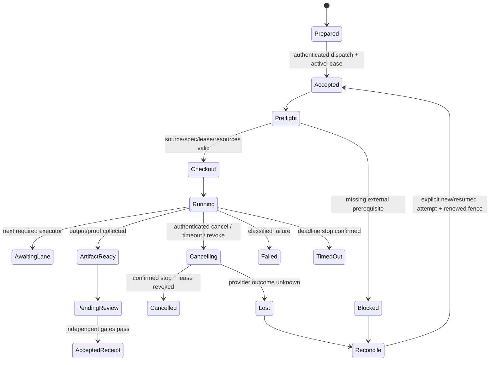

# Revision 4: Coding executor contract

Статус: **PREPARED_NOT_LAUNCHED**. Подготовлены protocol/schema/example; scheduler, adapter, credential broker и workers не реализованы и не запущены. Cloud purchase/provisioning не выполнялись. Этот интерфейс относится к разработке ROX, а product entity authority остаётся в выбранной Revision 2 architecture.

Канонические артефакты: [run-spec.schema.json](run-spec.schema.json), [executor-contract.json](../../plans/macro-integration/cloud/executor-contract.json), [completion.schema.json](completion.schema.json). Source inspection: `rox-one/rox-one@249b3b44220bcfbd7d467de9cfc18f76e1c37807`; `packages/cloud-runner` и `packages/server-core` не изменены относительно study `e780e73ae84c977cf81546b49140d318dfcd6049`.

## 1. Проверенная граница текущего runtime

| Evidence | Source, symbol | Что действительно имеется |
|---|---|---|
| EX01 | [types.ts:29–69](https://github.com/rox-one/rox-one/blob/249b3b44220bcfbd7d467de9cfc18f76e1c37807/packages/cloud-runner/src/types.ts#L29-L69), `RunLimits / RunSpec` | Prepared subtasks/prompts, model, budgets, outputs, metadata. First-class repository/base SHA/branch/lease/receipt fields отсутствуют в этом контракте. |
| EX02 | [types.ts:75–187](https://github.com/rox-one/rox-one/blob/249b3b44220bcfbd7d467de9cfc18f76e1c37807/packages/cloud-runner/src/types.ts#L75-L187), `RunState / CloudRunProvider` | Compute lifecycle, status/cancel, artifacts и events. `done` не означает reviewed Git change или completed feature. |
| EX03 | [daytona-provider.ts:126–169](https://github.com/rox-one/rox-one/blob/249b3b44220bcfbd7d467de9cfc18f76e1c37807/packages/cloud-runner/src/daytona-provider.ts#L126-L169), `DaytonaProvider.createRun` | Existing active/done ID возвращает handle; после failed state код может создавать sandbox снова. Stored payload digest не сравнивается в этом пути. |
| EX04 | [daytona-provider.ts:314–375](https://github.com/rox-one/rox-one/blob/249b3b44220bcfbd7d467de9cfc18f76e1c37807/packages/cloud-runner/src/daytona-provider.ts#L314-L375), `DaytonaProvider.pump` | Записывает `/run/spec.json`, seeds artifacts, вызывает `rox-run`, imports artifacts и удаляет sandbox. Git checkout/ancestry/owned diff proof здесь не реализованы. |
| EX05 | [local-provider.ts:139–196](https://github.com/rox-one/rox-one/blob/249b3b44220bcfbd7d467de9cfc18f76e1c37807/packages/cloud-runner/src/local-provider.ts#L139-L196), `LocalSubprocessProvider.createRun / getStatus` | Любой existing ID возвращает прежний handle; detached process, wall-clock watchdog и dead-PID reconciliation. Retry semantics отличаются от Daytona. |
| EX06 | [native-provider.ts:39–67](https://github.com/rox-one/rox-one/blob/249b3b44220bcfbd7d467de9cfc18f76e1c37807/packages/cloud-runner/src/native-provider.ts#L39-L67), `NativeRunProvider` | Адаптер `run:create/status/cancel` RPC. Наличие RPC не доказывает coding scope enforcement. |
| EX07 | [research-pack.ts:237–262](https://github.com/rox-one/rox-one/blob/249b3b44220bcfbd7d467de9cfc18f76e1c37807/packages/cloud-runner/src/research-pack.ts#L237-L262), `buildResearchSpec` | Research prompt pack, model и metadata; не coding checkout contract. |
| EX08 | [cloudflare-provider.ts:35–66](https://github.com/rox-one/rox-one/blob/249b3b44220bcfbd7d467de9cfc18f76e1c37807/packages/cloud-runner/src/cloudflare-provider.ts#L35-L66), `CloudflareComputerProvider` | HTTP transport POST/status/DELETE для generic RunSpec. Coding capability требует отдельного adapter/conformance. |

Имена и ranges закреплены в machine evidence. Это чтение кода, без runtime запуска перечисленных providers.

## 2. Три конструкции и выбранное решение

| Конструкция | Реальный seam | Преимущества | Цена / ограничение | Дешёвое опровержение |
|---|---|---|---|---|
| **External coding executor — выбран** | Current manifest/packets/receipt gates → новый provider-neutral request → isolated runner | Coding execution не зависит от Electron; отдельные Linux/macOS/provider исполнители; adapter заменяется без второго domain authority | Нужны реализации adapter, durable reconciliation, lease/credential broker. Сейчас это подготовленный protocol | Fake executor: потерять create response, повторить request, отозвать lease, вернуть чужой diff; coordinator обязан отвергнуть нарушения |
| ROX CloudRun adapter | EX01–06/08: typed adapter поверх существующих create/status/cancel/artifacts | Можно сохранить текущий run panel и transport adapters | Metadata не является enforcement; existing idempotency после failure неодинакова; compute done нельзя повысить до feature verified | Provider возвращает done без commit/с неправильным input SHA; adapter оставляет pending/denied. Same ID + другой payload → conflict |
| Persistent local harness → cloud | EX05/06 и пользовательский local durable harness как dispatch/reconcile host | Continuity и macOS native lane; один local queue может координировать remote workers | Personal host availability, private files boundary; нужны тот же cloud protocol и signed receipt binding | Restart после lost response → один external attempt; личный vault/config не попадает в cloud; stale lease fenced |

Read-only `harnessctl.py status` вернул version2.0.0; это observation CLI availability, не доказательство cloud coding adapter. Private session payload не сохранён в артефактах. Ни harness request, ни remote run не созданы.

Выбран внешний интерфейс; остальные две конструкции остаются adapters на него. Coordinator владеет manifest, dependencies, leases, integration и accepted receipts. Executor выполняет ровно один WP/lane/immutable input attempt и сообщает proof. Product authorization/entity model не передаётся executor как отдельная власть. Business user credentials и agent action permission не выводятся из факта coding run.

## 3. RunSpec: входы, которые нельзя спрятать в prompt

| Поле | Нормативное значение |
|---|---|
| `apiVersion`, `preparationState` | `rox.coding-executor/v1`, `PREPARED_NOT_LAUNCHED`. Файл — подготовленный request, не launch authorization |
| `runId`, `idempotencyKey`, `attemptNumber` | Immutable attempt identity. Canonical request bytes hash хранится coordinator; один ключ с другим payload → conflict |
| `jobRole`, `verificationOf` | implementation создаёт source commit; verification проверяет уже созданный exact subjectCommit с proof-only lease. Original implementation input/run/receipt hash сохранены |
| `wpId` | Один из существующих WP-01…WP-52; manifest — authority. Новая WP требует новой schema/versioned export |
| `inputAuthority` | Exact integration input SHA, study SHA только для references, specDigest, hashes manifest/packet/prompt/schema. SHA не заменяется движущимся branch HEAD |
| `prerequisites` | Exact prerequisite receipt/hash/commit/input/spec/reviewer refs. Список должен совпадать с packet dependencies; authoritative validator проверяет receipts и ancestry |
| `lease` | Prepared lease descriptor: exact owned paths, proof prefix и receipt path; fencing token. Active authenticated lease выдаётся только отдельным scheduler dispatch envelope |
| `checkout` | Fresh isolated checkout, isolated Git config, hooks выключены, submodules/LFS только pinned allowlist, assigned branch, merge policy; no main write/force-push/deploy |
| `lanePlan` | Все четыре lane keys присутствуют. `required` строго совпадает с manifest; selected lane обязателен. Необходимые lanes нельзя скрыть false флагом |
| `environment`, `limits` | Pinned image/digest, Bun1.3.14/Node22/frozen lockfile, measured resources; wall/token/artifact/cost/heartbeat/cancel/retention ceilings |
| `credentialRefs`, `network` | Только broker references, explicit scopes/audience/expiry; default-deny egress, dedicated test tenant. Secret values отсутствуют |
| `deliverables` | Commit/patch для implementation; redacted proofs/events/checkpoint/outcome, unique lane fragment и canonical receipt reference. canonicalReceiptWriter=coordinator_only; independent review, automatic merge/deploy false |
| `resume`, `dispatch` | Checkpoint/input/spec reconciliation; prepared executionEnabled=false. Submit требует отдельный authenticated dispatch, не изменения произвольного поля в JSON |

Schema проверяет shape/types/enums/ranges. Подпись issuer, lease expiry/fencing, manifest equality, ancestry, actual resource availability, secret scopes и artifact contents — semantic checks будущего coordinator/executor, а не свойства JSON Schema.

## 4. Четыре lanes и aggregate completion

| Lane | Executor | Proof boundary |
|---|---|---|
| linux-domain | Isolated Linux worker; ≥8GiB disk/8GiB RAM/4CPU | DB/API/domain tests, baseline versus mutation, reload/retry/concurrency |
| linux-renderer | Linux Chromium/Playwright; ≥16GiB disk | Explicit fixture interaction/screenshots/ARIA, keyboard/narrow/reduced-motion |
| macos-native | Source-pinned macOS Electron build | Live IPC/device/font/capture/import. Linux screenshot не закрывает эту lane |
| provider-live | Dedicated provider/self-host test tenant; OS capability explicit | Live external read-back, callbacks/reconciliation/cleanup; fixture не закрывает эту lane |

WP-48 требует только linux-domain; WP-01 дополнительно renderer/native. Полный vocabulary из четырёх lanes всегда декларируется, однако все четыре не навязываются каждому WP. Каждая required lane остаётся pending до actual proof. Один attempt может вернуть partial lane outcome; coordinator агрегирует commit-bound evidence на один output commit. Lane execution по другому commit требует повторного proof или доказанного lineage/seam verification; receipts не смешиваются молча.

Implementation executor создаёт source commit ровно один раз. Отдельный macOS/provider verification executor checkout этот exact subjectCommit, не редактирует source и возвращает proof-only fragment; новый source commit для каждого device test не требуется. `verificationOf.subjectCommitSha` обязан совпасть с checkout inputSha; original implementationInputSha не теряется. Любое исправление source во время verification создаёт новый implementation attempt/outputCommit и инвалидирует прежние обязательные lane proofs. Фрагменты хранятся под уникальными run IDs; единственный existing coordinator пишет общий WP receipt. Это устраняет concurrent overwrite одной receipt file несколькими lane workers.

## 5. Prepare / submit / status / events / collect

Предлагаемый adapter interface; endpoint/service не реализованы:

```ts
interface CodingExecutor {
  prepare(spec: CodingRunSpec): Promise<PreparedHandle>
  submit(handle: PreparedHandle, dispatch: AuthenticatedDispatch): Promise<RunHandle>
  status(handle: RunHandle): Promise<RunSnapshot>
  events(handle: RunHandle, afterSequence: number): AsyncIterable<RunEvent>
  cancel(request: CancelRequest): Promise<CancelAcknowledgment>
  resume(request: ResumeRequest): Promise<RunHandle>
  collect(handle: RunHandle): Promise<RunOutcome>
}
```

`prepare` не provisions compute, не checkout repository, не resolves credential references и не выполняет prompts. `submit` проверяет authenticated actor/service, active signed lease, fencing token, current spec/packet hashes, permission и budgets; duplicate same attempt возвращает тот же handle. Failed attempt не перезапускается от повторного submit автоматически: новый разрешённый attempt и новая lease generation обязательны.

Events имеют monotonic sequence/eventId/request digest correlation. Provider delivery допускает duplicates/gaps; consumer дедуплицирует и восстанавливает snapshot/replay после sequence. Ложного exactly-once transport обещания нет. Потерянный HTTP response сначала вызывает status lookup по idempotency key; второй sandbox не создаётся из-за неизвестного outcome.

## 6. Checkout, scope, credentials и Git integration

1. Verify remote repository URL/ownership и fetched object SHA. Clone/fetch выполняется в новый disposable root. Worker никогда не использует пользовательский текущий worktree, HOME, vault или personal Git config. Credential-bearing URL и arbitrary local filesystem remote отвергаются.
2. Verify checkout exact `inputSha`; all prerequisite commits ancestors of inputSha; current spec/packet/prompt hashes match. Read root AGENTS/assigned packet/supplement. Source baseline249b/e780 не выбирается вместо реально интегрированного inputSha.
3. Disable repository hooks и auto submodule/LFS execution. Dependency install frozen; install scripts запускаются только внутри изолированного worker с заявленной network/resource policy. Это не обещание, что dependency scripts безопасны на пользовательском host.
4. Lease охватывает exact allowed files + assigned proof/receipt paths. Symlinks/relative traversal, Unicode/path normalization, executable modes и generated/untracked files проверяются по реальному checkout root. Directory widening требует отдельного explicit lease; файл не превращается в произвольный directory grant.
5. Active fence проверяется перед write, push, credential resolution и final acceptance. Lost/expired lease лишает worker write/egress capabilities; cached prompt не сохраняет власть. Platform isolation предотвращает filesystem bypass, final Git diff gate отклоняет unowned changes. Schema descriptor сам этого не обеспечивает.
6. Credential broker выдаёт ephemeral scoped capability по authenticated dispatch и policy; reference не раскрывает secret в prompt/PR/run JSON. No arbitrary .env/keychain/vault read, production mail/provider account или shared long-lived worker token. Revocation/expiry → credential_missing/permission_denied с actionable external gate.
7. Worker commits only isolated assigned branch; actual `git diff inputSha..outputSha` + untracked/deleted/mode changes сверяются со scope. inputSha ancestor of outputSha; patch/hash/commit reproducible. No default-branch write, automatic merge/deploy или force push.
8. Independent integrator проверяет receipt/proof hashes и source-policy gates, интегрирует через default merge, проверяет seams и выдаёт successor inputSha. Executor не выдаёт себе approved review и не изменяет packet specDigest для обхода failed gate.

## 7. Lifecycle, timeout, cancel, resume



Terminal attempt states в output schema: artifact_ready, failed, cancelled, timed_out, blocked, lost. `artifact_ready` означает code/proofs готовы к review, не feature complete. `blocked` terminal для конкретного attempt; общий WP остаётся pending. Provider unknown не превращается в cancelled или failed success message.

- **Timeout:** worker wall ceiling и отдельный coordinator watchdog; heartbeatDeadline > interval и меньше wall ceiling. Missed heartbeat → reconcile, затем revocation/cancel; подтверждённый deadline stop → timed_out. No uncapped silent retry.
- **Cancel:** request идемпотентен. Acknowledgment не terminal proof. Revoke active fence/credentials, terminate process tree/media/provider jobs, collect partial evidence и cleanup status. Unknown cleanup → lost/pending cleanup, новое overlapping исполнение fenced.
- **Resume:** verify request digest, inputSha/specDigest, checkpoint artifact hash, Git status/output lineage, lease renewal и previous events. Можно продолжить retained same-input workspace с новой lease generation; уничтоженный sandbox создаёт новый explicit attempt из immutable input. Replaying approved external send/migration не допускается без provider idempotency/reconciliation.
- **Spec/source изменились:** старый attempt не retarget. Preserve checkpoint/diff/failed attempts, reconcile already produced outputs; prepare new request with new digest/input/lease. Existing user work не уничтожается.

## 8. Outputs, proof paths и failure classification

RunOutcome содержит run/attempt/request digest, WP/lane/input/spec/lease/fence, terminal state/failure class, nullable output commit, actual changedPaths, artifact hashes/sizes, canonical receipt path, cleanup и event sequence. `productCompletion` всегда pending_independent_verification; `completion.schema.json` + `gates.mjs` остаются canonical acceptance. Standalone terminal outcome не открывает successor.

| Failure class | Что фиксируется | Действие |
|---|---|---|
| input_stale / spec_stale | Actual versus expected object/digest | Stop; новый prepared request от coordinator |
| lease_denied / permission_denied | Issuer/fence/capability check без secret | Reconcile ownership/policy; не retry тем же stale fence |
| credential_missing / resource_unavailable | Exact missing test tenant/device/image/resource | Actionable external gate; required lane pending |
| environment_failure | Install/toolchain/network prerequisite и exit | Repair controlled environment; не count как caught product mutation |
| baseline_failure | Baseline сценарий не прошёл до mutation | Preserve failure; сначала устранить baseline, не claim test sensitivity |
| assertion_failure | Actual expected/observed assertion | Fix code; negative control учитывается только при green baseline + mutant assertion failure |
| provider_failure | Live provider response/read-back state | Reconcile external effects before idempotent retry |
| timeout / cancelled / unknown_status | Clock/cancel acknowledgment/known provider state | Stop/reconcile/cleanup; unknown не считается terminated |
| evidence_invalid | Wrong owner, digest, commit, path, hash, reviewer, lane | Reject completion и successor; retain invalid attempt |

Proof root: `proof/macro-integration/<WP-ID>/`; каждый attempt получает уникальный `runs/<runId>/` для всех events/checkpoints/outcome/patch/lane-fragment файлов. Semantic preflight проверяет совпадение lease/deliverables prefixes и нахождение всех output paths внутри этого run root. Canonical receipt `plans/macro-integration/cloud/receipts/<WP-ID>.json` пишет только existing coordinator после aggregation. Этот reference в lane RunSpec не даёт worker права записи общей receipt. Run events/checkpoints/raw logs — redacted, bounded size/retention, symlinks denied through realpath; sensitive raw artifacts не публикуются в PR. Proof manifest binds commit + input + spec + lane + runId + attempt/fence. Цепочка review/merge/ancestry проверяется независимо от worker declarations.

## 9. Working fixture, freeze и implementation gaps

`executor-contract.json::fixtureRunSpec` — schema-valid WP-48/linux-domain example: no credentials, no network, maxCost0, fake image digest, prepared non-active lease, executionEnabled=false, no push/PR. Это fixture контракта, а не Linux worker execution. Все WP IDs и required lane flags сравнены с snapshot manifest при генерации.

Fixture хранит **generation-time manifest snapshot**. Добавление этих executor artifacts в root specInputs изменит specDigest; fixture не retarget и не становится ready. Реальный future `prepare` строит fresh RunSpec из текущего manifest. Иначе включение fixture со своим live specDigest в specInputs создаст self-hash cycle. Snapshot fixture не используется как dispatch authorization.

Практические незакрытые implementation gaps:

1. Реальный external adapter/worker entrypoint с capability conformance; существующий generic `rox-run` не объявляется coding executor.
2. Authenticated coordinator lease issuance, overlap/FIFO/fencing и credential/network broker; no new product authority.
3. Durable idempotency/payload hash/event sequence/checkpoint/reconcile store; provider-specific retries и cleanup.
4. Safe checkout/config/install/output import и actual scope enforcement; Git integration checks.
5. Separate Linux renderer, macOS native и provider-live runners с source-pinned proofs и dedicated test data.
6. RunOutcome → pending receipt → independent review → integration adapter; no self-approved feature status.

Root-owned CLI/manifest/build может включить этот contract как read-first/spec input и добавить prepare/export command; здесь central scripts не изменены. Реальные provisioning/dispatch остаются отдельной будущей работой. Freeze version1 после local schema/fixture/negative verification; изменение authority/schema/packet требует новой version/digest и повторной проверки.

Local verification: Ajv8.17.1 strict/allErrors +formats Draft07 compiled RunSpec и четыре output/control definitions;19 fixture cases дали ожидаемые результаты. Три seeded schema mutations (SHA constraint, unknown fields, required selected lane) приняли именно тот invalid input, который исходная schema отвергает; sensitivity подтверждена. Восемь source objects/ranges проверены по249b SHA, lifecycle Mermaid parsed. Это PASS_CONTRACT_ONLY; actual executor/lease/credential/Git/device behavior остаётся PROPOSED_NOT_EXECUTED. История первоначальных compiler corrections сохранена в machine validation.
