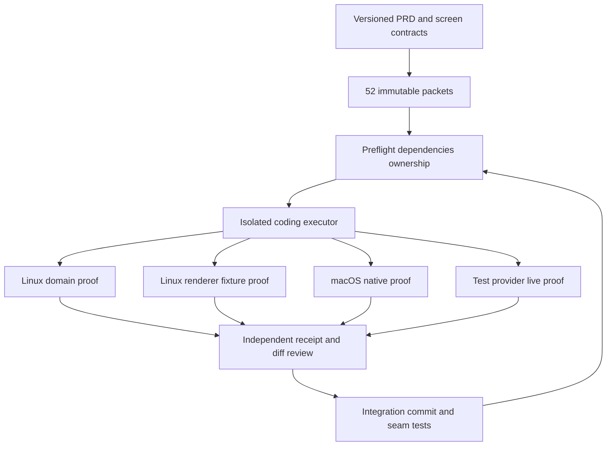

# Cloud execution spec

## Inputs

Repository `rox-one/rox-one`; immutable inputSha; specDigest; WP ID; allowed-path lease; verified prerequisite receipts; runner lane; bounded resources/budgets; test-tenant connection handles if necessary. Secret injection through runner secret store/environment, no secret values in artifacts. Historic source baseline does not substitute current integration SHA.

## Outputs

Commit with complete changed files; patch or draft PR; proof artifacts; completion receipt containing exact input/commit/digest/lanes/tests/negative controls/UI and provider evidence/review. Integrator independently checks, merges according to repository policy and reruns seams. Status lifecycle complete≠verified feature.

## Acceptance gates

G1 source/spec/clean checkout. G2 dependencies integrated with valid receipts. G3 ownership no overlaps. G4 domain scenario passes. G5 actual screen inputs/outputs/actions/states/keyboard/a11y match spec. G6 denied actor/source/policy/revoke tests. G7 restart/retry/concurrency/offline where applicable. G8 correct search/notification/activity/agent projections. G9 native/provider applicable lanes. G10 independent review, licenses/telemetry/runbook and read-back delivery.

Existing Cloud Runs audit: ROX `e780e73ae84c977cf81546b49140d318dfcd6049`, `packages/cloud-runner/src/types.ts::RunSpec/CloudRunProvider` exposes prompts/model/limits/outputs and artifact methods; no repository checkout/baseSha/branch/PR proof contract. `daytona-provider.ts::pump` writes `/run/spec.json`, seeds artifacts and executes `rox-run`, then imports artifacts/deletes sandbox. `research-pack.ts::buildResearchSpec` builds research prompts. Therefore existing runtime is reusable orchestration transport, not verified coding execution authority. Need explicit adapter/protocol extension before declaring in-product coding work ready.

