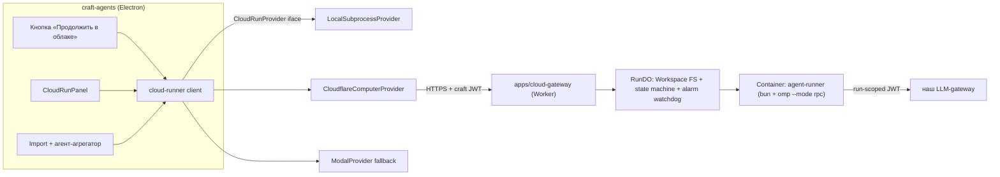

# PRD: Cloud Runs — облачное продолжение сессий («глубокий рисёрч» и фоновые задачи)

> **Фазы 1–3 завершены (2026-08-06):**
> - Фаза 1 (commit 5e9934e63): `packages/cloud-runner` — контракт, LocalSubprocessProvider, conformanceSuite, секция `cloudRuns` в validators.ts.
> - Фаза 2 (рабочий деплой): `apps/cloud-gateway` задеплоен как `craft-cloud-gateway.scharlesky-192.workers.dev` (Worker + RunDO + контейнерный runner на `@cloudflare/computer@0.1.0-alpha.1`, образ с baked-in runner.mjs). Live-прогон: 2 рисёрч-сабтаска через Kimi-K3 (api.rox.one/v1) за ~10 s wall-clock, markdown-артефакты возвращены по HTTP. **Live conformance suite против gateway — green** (idempotency, terminal state, artifact round-trip, traversal, events, cancel, not_found).
> - Найденные при реализации: (а) в alpha API поверхность — `getWorkspace(this).shell.exec` + `fs`, НЕ `runtime.exec` (это main-нейминг); (б) dirent-флаги через RPC приходят ненадёжными — recursion по `stat().isDirectory`; (в) LLM-gateway отдаёт SSE стрим по умолчанию — runner отправляет `stream:false` + SSE-fallback; (г) при редеплое с rollout'ом CF убивает живые контейнеры mid-exec (`exit -1`) — не деплоить под нагрузкой; рассмотреть rollout_step_percentage постепенный + retry шага в alarm.
> - Секреты в воркере: CLOUD_RUNS_TOKEN (перевыпущен на сильный, лежит в ~/.craft-agent/cloud-runs.env), LLM_BASE_URL/LLM_API_KEY/LLM_MODEL (api.rox.one). Auth craft-JWT — отдельный follow-up, v1 bearer. Ticket 14 binding: [plans/next-program/decisions/003-cloud-runs-auth.md](../plans/next-program/decisions/003-cloud-runs-auth.md) — keep shared bearer; JWT is not scheduled.
> - Фаза 3 (app integration): каналы `cloudRuns.*` + handlers в server-core (provider factory из config.json + токен из cloud-runs.env; registry для LIST; workspaceId резолвится из sessionId), research prompt-pack (RU/EN, 5 сабтасков), composer chip CloudRunsChip (self-contained, фон-поллинг + toast по done, dialog: submit/list/cancel/import/aggregate), settings-страница Cloud Runs (enable/provider/gatewayUrl/limits; token status), i18n ×8 локалей, ElectronAPI типы. Аггрегатор: импорт в workspaces/<id>/runs/<runId>/ + sendMessage в исходную сессию. Тесты: handler-level suite (local provider, 6/6 green), channel-map parity, conformance local+live, electron tsc clean.
> - Фаза 4 (fallback + ledger): `apps/modal-gateway` (Modal ASGI FastAPI app, тот же HTTP-контракт: driver-функция + modal.Sandbox per subtask, state в modal.Dict, artifacts на modal.Volume) задеплоен как `tzarcoder--craft-cloud-runs-gateway-api.modal.run` (workspace tzarcoder, секрет `craft-cloud-runs`). `ModalProvider` наследует CloudflareComputerProvider (контракт идентичен by design — проверено live). **Live conformance green на обеих ногах (CF ~15s, Modal ~33s).** Usage-ledger (G5.2): раннеры пишут `_usage/<subtask>.json` в artifacts; статус рана несёт `usage.{promptTokens,completionTokens}` на обоих провайдерах (проверено live: 155/24 и 165/41 токена на пробе). Import-фильтр `_usage/`. Провайдер-специфичные URL через env MODAL_GATEWAY_URL/CLOUDFLARE_GATEWAY_URL — флип провайдера = одна настройка в Settings.
> - Модал-грабли: volume.reload() нужен и после завершения sandbox (не только до), иначе done.marker невиден для driver — lesson зафиксирован.
> - E2E в живом приложении (2026-08-06, hd2 изолированный CRAFT_CONFIG_DIR + CDP-драйв): чип в композере → dialog → submit → run на CF (5 сабтасков, ~14 мин реальных Kimi-K3 ответов) → import → «Собрать отчёт» → агент пишет REPORT.md в sessions workspace — **полный цикл зелёный, скриншот-подтверждение**. По дороге всплыли фиксы: (а) esbuild-CJS бандл main-процесса ломал `import.meta.url` top-level в local-provider (ленивая резолюция + createRequire fallback); (б) browser CDP-порт 9222 занят Chrome'ом — использовать другой; (в) preload требует пересборки при изменении channel-map (иначе `getCloudRunsConfig is not a function`); (г) 180s на сабтаск мало для ресёрч-ответов — поднято до 600s + retry×2 per subtask на обоих gateway + defaultWallClock 5400s; (д) LLM-usage ledger считает токены (798/6066 на пробном 5-сабтаск ране).

> **Spike results (2026-08-06, аккаунт ROX, workers `computer-container-example.scharlesky-192.workers.dev`):**
> - ✅ Round-trip: exec в контейнере (root, Debian, Node 22.23.2, Linux x86_64) → sync в DO → GET артефакта через воркер. Push (DO→контейнер) тоже работает.
> - ✅ Egress из контейнера: npm registry 200, api.rox.one 307/ok — LLM-gateway достижим из sandbox.
> - ✅ Deploy из коробки: fork examples/container + `wrangler deploy`, контейнерное приложение создано автоматом.
> - ⚠️ **Hard wire break**: образ `ghcr.io/cloudflare/computer-computerd-linux-x64:0.1.0-alpha.1` несовместим с кодом `main` (RPC-поле `command` → `source`; exec выполнялся как `sh -c "undefined"`). Решение: чекаут тега `v0.1.0-alpha.1`, пересборка, редеплой — сразу зелень. Подтверждён риск «preview API ломают» и обязательность пина + daily conformance (§7).
> - ⚠️ DO однопоточен: пока жива 127-секундная контейнерная сессия, file-роуты на тот же workspace возвращали 1101 — в дизайне gateway нужна очередь/дробление long ops или отдельный read-side канал (учесть в G2.2).
> - ➖ `omp --mode rpc` в контейнере не прогонялся: дистрибутив найден (`npm i -g @oh-my-pi/pi-coding-agent`, локально v17.2.9), установка+репликация auth отложена до G2; egress/node/npm подтверждены, архитектурных блокеров не видно.
> - R2 mount-демку пришлось вырезать — у spike-токена не было R2 Edit. Токен из чата считать скомпрометированным, заротировать.

Статус: draft → фазы 1–2 зашиты
Владелец: команда форка `agisota/craft-agents-oss`
Дата: 2026-08-06
Связанные документы: [omp-v2-prd.md](omp-v2-prd.md) (бэкенд-архитектура), [omp-rpc-notes.md](omp-rpc-notes.md) (протокол runner'а), [AGENTS.md](../AGENTS.md).

## 1. Резюме

Юзер в десктопном приложении ведёт сессию (например: «преза по теме X») и нажимает «Продолжить в облаке». Приложение собирает из контекста спецификацию фоновой работы (пак рисёрч-промптов, адаптированных под тему, + модель + бюджет) и отправляет её в облачный рантайм. Юзер закрывает приложение — работа продолжается автономно. При возвращении (или по WS-подписке) приложение забирает артефакты обратно в папку сессии; агент-агрегатор собирает из них финальный отчёт локально.

**Цели:**
- G1. Провайдер-нейтральный контракт `CloudRunProvider` + локальный эталон-провайдер (работает оффлайн, без облака).
- G2. Cloudflare-провайдер: Workspace на Durable Object (SQLite FS) + контейнер с headless agent runner; дефолтный провайдер в проде.
- G3. Интеграция в приложение: кнопка, панель runs, импорт артефактов, сборка отчёта.
- G4. Фолбэк-провайдер (Modal или E2B) за тем же интерфейсом + conformance-suite.
- G5. Безопасность и стоимость: LLM-трафик через наш gateway с run-scoped JWT и бюджетными крышками; ключи юзера в облако не уезжают по умолчанию.

**Не-цели:**
- Замена локальных бэкендов (pi/anthropic/omp) облачным исполнением по умолчанию — локальная сессия остаётся основным режимом.
- Хостинг LLM-инференса внутри CF-контейнера (только вызовы в наш gateway).
- Миграция существующих сессий в облако (cloud run — порождение сессии, а не перенос).
- Редактирование артефактов в облаке с двусторонней синхронизацией (pull-only на импорт).

## 2. Фон и точка отсчёта

| Факт | Источник |
|---|---|
| Backend factory с тремя runtimes (pi/claude/omp), providerType enum в zod-схеме (ловушка: добавление провайдера требует правки validators.ts) | packages/shared/src/agent/backend/factory.ts, packages/shared/src/config/validators.ts |
| OMP умеет headless-режим через `omp --mode rpc` (NDJSON stdio, turn-события) | docs/omp-rpc-notes.md, packages/shared/src/agent/omp-agent.ts |
| Headless-серверный режим уже задуман в репо | packages/pi-agent-server, Dockerfile.server |
| Cloudflare Computer: DO+SQLite VFS (source of truth), container/isolate backends, `workspace.fs`, `workspace.runtime.exec`; статус PREVIEW (API нестабильны, «не для прода» официально) | github.com/cloudflare/computer |
| CF лимиты: ~1500 vCPU / 6 TiB RAM concurrent на аккаунт; Containers тарифицируются за фактическую CPU-утилизацию, спящий DO почти бесплатен | developers.cloudflare.com/containers, /durable-objects |
| LLM-стоимость на порядок выше compute-стоимости рисёрч-рана → бюджетные лимиты должны жить на LLM-gateway | эмпирика сессий rox/kimi |

## 3. Требования

### G1 — Контракт + Local provider
1.1. Новый пакет `packages/cloud-runner` экспортирует интерфейс:

```ts
interface CloudRunProvider {
  createRun(spec: RunSpec): Promise<RunHandle>;
  getStatus(id: string): Promise<RunStatus>;      // queued|running|done|failed|cancelled
  cancel(id: string): Promise<void>;
  listArtifacts(id: string): Promise<ArtifactMeta[]>;
  fetchArtifact(id: string, path: string): Promise<Uint8Array>;
  subscribeEvents(id: string): AsyncIterable<RunEvent>;
}
```

`RunSpec` включает: пак промптов (subtasks), модель/соединение, `maxWallClockSec`, `maxLlmTokens`, `maxArtifactsBytes`, `ttlSec`, метаданные сессии-источника. Интерфейс проектируется под наш use case, НЕ вокруг CF API.
1.2. `LocalSubprocessProvider` — эталон реализации: исполняет runner локальным подпроцессом, артефакты в локальной папке `.craft/runs/<id>/`. Работает оффлайн и без CF-аккаунта (dev-режим).
1.3. Конфиг-секция `cloudRuns` в validators.ts: `provider: 'local'|'cloudflare'|'modal'`, `enabled: boolean` (default false), бюджетные дефолты. Enum пополняется там же (иначе ConfigWatcher спамит invalid option — известная ловушка).
1.4. Conformance-suite тестов против интерфейса, прогоняемая на всех провайдерах (G1, G2, G4).

### G2 — Cloudflare provider
2.1. `apps/cloud-gateway`: Worker (auth по craft JWT, REST + WS) + Durable Object `RunDO`, оборачивающий `@cloudflare/computer` Workspace; контейнерный образ с runner'ом (bun + omp CLI headless + рендерер prompt-pack'ов).
2.2. REST: `POST /runs`, `GET /runs/:id`, `GET /runs/:id/artifacts`, `GET /runs/:id/artifacts/*`, `DELETE /runs/:id`; WS `/runs/:id/events`.
2.3. Жизненный цикл run: `queued → running → done|failed|cancelled`. Контейнер поднимается лениво, умирает после завершения; состояние и артефакты живут в DO независимо от контейнера.
2.4. **Crash-resume**: runner пишет per-subtask чекпоинты (`<subtask>/done.marker` + промежуточные md) в Workspace FS; новый контейнер после смерти предыдущего продолжает только недоделанные subtasks.
2.5. **Watchdog**: DO alarm по `maxWallClockSec` убивает контейнер и переводит run в `failed` (reason `budget_exceeded`).
2.6. Runner ходит в LLM только через наш gateway с run-scoped JWT и per-run rate limit; прямые ключи провайдеров в контейнер не попадают (BYOK — отдельный opt-in, зашифрован, за оскопом v1).
2.7. Версия `@cloudflare/computer` пиннуется точно (preview-API); daily contract-smoke в CI; при поломке — фиче-флаг флипает приложение на фолбэк-провайдера.

### G3 — Интеграция в приложение
3.1. Кнопка «Продолжить в облаке» в чате: собирает RunSpec из контекста сессии (тема, пресет «глубокий рисёрч» = N подготовленных сабтасков, выбранная модель, лимиты).
3.2. `CloudRunPanel`: список runs пользователя (poll 30 с + WS live при открытой панели), статусы, cancel, стоимость.
3.3. Import flow: по `done` артефакты скачиваются в `.craft/runs/<id>/` локально; кнопка «Собрать отчёт» стартует локального агентa-агрегатора поверх этих файлов в исходной сессии.
3.4. Settings: выбор провайдера, пользовательские бюджетные лимиты (не выше серверных), статус подключения.
3.5. Проксирование к gateway через `packages/server`, чтобы renderer не держал CF-креды (тот же паттерн, что у роутов LLM).

### G4 — Фолбэк-провайдер
4.1. `ModalProvider` (предпочтительно; альтернатива — E2B при лучшей цене под профиль: решение фиксируется в этом PRD после spike-сравнения).
4.2. Прогон conformance-suite (G1.4) на обоих облачных провайдерах.
4.3. Авто-фолбэк НЕ делаем в v1 — только ручной/конфигурационный флип (автоматика порождает двойные счета при частичных сбоях).

### G5 — Безопасность и стоимость
5.1. Все LLM-вызовы облачного run тарифицируются на нашей стороне; серверные крышки: `maxLlmTokens`, `maxWallClockSec`, `maxArtifactsBytes` — enforced в gateway, не доверяются клиенту.
5.2. Мультитенант: workspace id = `userId/runId`; DO-авторизация по JWT; изоляция на уровне DO (штатно у CF).
5.3. Артефакты санитизируются при импорте (размер, тип, путь без traversal); контент отображается как недоверенный.
5.4. Аудит: per-run ledger (время контейнера, токены, байты) для будущего биллинга юзеров.

## 4. Архитектурные решения



Решённые спорные пункты:
- **Runner = omp headless внутри контейнера** (не переписываем агент-луп): expertise и протокол уже есть (omp-rpc-notes). Риск заведения omp в CF-контейнере закрывается spike'ом (§5, фаза 0) ДО основного кодинга; запасной вариант — runner на чистом LLM-цикле без omp (зависимости ~ноль).
- **Интерфейс под use case, не под CF** — замена провайдера = один файл-провайдер, не рефакторинг приложения.
- **Артефакты pull-only**: облако пишет, приложение читает. Двусторонний синк = отдельный эпик (коллизии, конфликты) и в v1 не нужен.
- **Сборка финального отчёта — локально**: дешевле, сохраняет привычный UX сессии, и не требует таскать весь контекст сессии в облако (в облако уезжают только тема + сабтаски).
- **Бюджеты на LLM-gateway, а не только в CF**: LLM — доминирующая статья расходов.
- **Секреты юзера не едут в облако** по умолчанию: run-scoped JWT к нашему gateway.

## 5. План работ

### Фаза 0 — Spike (1–2 дня, блокер для G2)
0.1. Развернуть `cloudflare/computer` `examples/container` на тестовом CF-аккаунте (wrangler deploy, Workers Paid $5).
0.2. Положить в контейнер минимальный runner (bun-скрипт: LLM-вызов → запись md в workspace) и вернуть файл через Worker API.
0.3. Отдельно проверить: запускается ли `omp --mode rpc` внутри CF-контейнера (сеть, node/bun runtime, NDJSON).
0.4. Сравнить Modal/E2B по цене и API для фолбэка; выбор зафиксировать в §G4.1.
DOD: md-артефакт round-trip через DO; вердикт «omp в контейнере: да/нет»; если нет — G2.1 меняем на lite-runner и продолжаем.

### Фаза 1 — G1 Контракт + Local (1–2 недели)
1. `packages/cloud-runner`: типы, интерфейс, LocalSubprocessProvider, conformance-suite.
2. validators.ts: секция `cloudRuns` + enum.
3. Конфиг default: `enabled=false, provider='local'` — у существующих юзеров ничего не меняется.
DOD: conformance-suite green на local; tsc 0 ошибок; bun test без регрессий.

### Фаза 2 — G2 Cloudflare (2–4 недели)
1. `apps/cloud-gateway`: routes + auth + RunDO + образ контейнера.
2. CloudflareComputerProvider в packages/cloud-runner.
3. Smoke-скрипт end-to-end (submit → poll → fetch artifact) в CI (nightly, перд CF-биллингом).
4. Watchdog, crash-resume, budget enforcement.
DOD: cloud run из CLI выдаёт артефакт; рестарт контейнера не теряет прогресс; превышение maxWallClock → failed.

### Фаза 3 — G3 Интеграция в приложение (1–2 недели)
1. UI: кнопка, CloudRunPanel, import flow, settings.
2. Прокси-роуты в packages/server.
3. E2E через реальное окно Electron (AX-drive).
DOD: полный цикл «преза по теме» в приложении: нажал кнопку → закрыл приложение → открыл → отчёт собран агрегатором.

### Фаза 4 — G4 Фолбэк + G5 Hardening (1 неделя)
1. ModalProvider/E2BProvider + conformance-suite.
2. Per-run ledger, метрики стоимости, docs/cloud-runs.md.
3. Фиче-флаг включается для internal-пользователей.
DOD: флип конфига `provider` переводит новые runs на фолбэк без правок кода приложения.

## 6. Критерии приёмки (сводные)

| # | Тест | Критерий |
|---|---|---|
| A | tsc всего монорепо | 0 ошибок |
| B | bun test (shared, cloud-runner) | 0 регрессий |
| C | Conformance-suite | green на local + cloudflare + fallback |
| D | Live CF: submit→artifact round-trip | артефакт получен, run=done |
| E | Crash-resume | убитый контейнер → run продолжается с чекпоинта и доходит до done |
| F | Watchdog | run длиннее maxWallClock → failed(budget_exceeded), контейнер мёртв |
| G | Offline-закрытие приложения | run завершился без приложения; импорт после reopen |
| H | E2E в приложении | полный юзер-сценарий через Electron UI |
| I | Секреты | в образ/контейнер/D0 не попадают пользовательские LLM-ключи (проверка env и логов) |

## 7. Риски

- **CF Computer — preview**: API ломают без предупреждения → пин версии, conformanсe в CI nightly, фиче-флаг + фолбэк (G4) как обязательная часть релиза, не опция.
- **omp в CF-контейнере может не завестись** (сеть, права, runtime) → фаза 0 spike до всего; lite-runner как приёмлемый запасной вариант.
- **Параллельная деградация при масштабе**: ~1500 concurrent vCPU на аккаунт — потолок ранних прод-нагрузок; при росте — запрос на лимиты через account team заранее, не на пожаре.
- **Стоимость LLM >> compute**: run-спеки без server-side крышек = неконтролируемый счёт; G5.1 — обязательное условие деплоя gateway.
- **PII в облако**: контент темы/сабтасков уезжает за пределы машины юзера — нужна явная пометка в UI при активации + пункт в privacy docs.
- **Зеркалирование статусов при flaky-сети**: приложение опрашивает/подписывается идемпотентно; run id — клиентски сгенерированный idempotency key.

## 8. Метрики успеха
- Юзерский сценарий «закрыл приложение → отчёт по возвращении» работает в ≤3 клика и 0 дополнительных настроек после первичного подключения.
- Полная стоимость одного рисёрч-рана (compute + egress) ≤ $0.20 при 30 мин работы (без LLM-токенов); видна юзеру.
- Подмена провайдера конфигом без правок кода (доказательство: conformance на фолбэке).

## 9. Открытые вопросы (на подтверждение)
1. Preview-статус CF Computer и «мы используем в проде» — принимаем как осознанный риск с обязательным фолбэком? (Дефолт: да, G4 блокирует релиз.)
2. BYOK в облако: нужен ли в v1 хотя бы как opt-in для корпоративных юзеров, или run-scoped JWT через наш gateway достаточно надолго? (Дефолт: достаточно; BYOK отдельным эпиком.)
3. Уведомления о завершении run при закрытом приложении: достаточно ли «видно при следующем открытии», или нужен email/push webhook в v1? (Дефолт: при открытии; webhook в v2.)
4. Фолбэк-провайдер: Modal vs E2B — выбор после spike-сравнения цены/API (§5 фаза 0.4).
