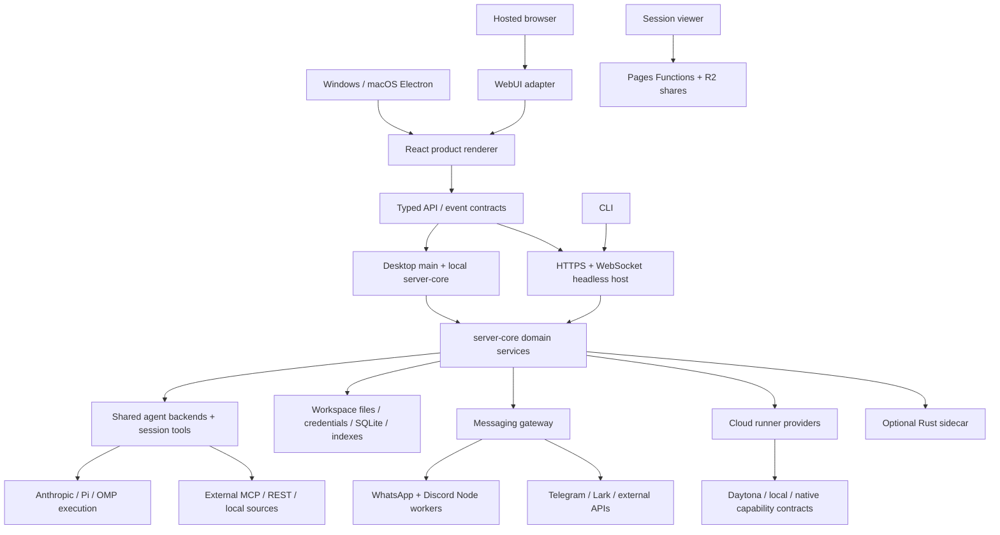

# [ARCH] ROX architecture and release readiness audit

**Historical baseline scope:** This document refers to pinned main f63294ba4fffa7238b46b24e918925a313ad0b12. For accumulated branch/PR/worktree progress and fresh candidate results, read [09-source-reconciliation.md](09-source-reconciliation.md), [14-candidate-inventory.md](14-candidate-inventory.md) and [15-candidate-verification.md](15-candidate-verification.md).

## [ARCH-BASE] Audit identity and evidence rules

- Requested source: `https://github.com/rox-one/rox-one`, branch `main`.
- Audited commit: `f63294ba4fffa7238b46b24e918925a313ad0b12` (2026-09-29, `feat(brand,onboarding): transparent Rox logo everywhere; onboarding is the name screen only (#1090)`). Repository push timestamps are not the date of this commit.
- Audit branch: `audit/final-readiness-2026-10-03`.
- Local checkout: `/Users/t/Projects/rox-one-final-audit-20261003`.
- Fork network: `rox-one/rox-one` is itself a fork of `agisota/craft-agents-oss`, rooted at `craft-ai-agents/craft-agents-oss`. Both `gh repo fork` and the GitHub fork API returned the existing `agisota/craft-agents-oss` fork. The audit therefore uses that existing fork; it does not claim a second fork was created. `origin` points to that fork; `upstream` points to ROX. The audit branch starts at ROX `main`, irrespective of the fork's own `main`.
- Audit date: 2026-10-03, Europe/Moscow. Source links are pinned to the audited commit so subsequent changes cannot silently change the evidence.
- This is an implementation and verification backlog, not a claim that the final binaries or hosted service have been delivered. Source existence, a unit test, a fixture E2E, a real provider integration, and a signed installed application are different evidence levels.

**Evidence labels:** `Observed gap` means directly evidenced by source or an executed check; `Verification required` means an implementation exists but a complete release journey was not demonstrated here; `Product decision` means the final contract must be explicitly chosen; `Conditional` means the work is necessary only when that feature or architecture is shipped. A TODO alone is not proof that a feature is completely absent. Existing RX/ROX issue status is not proof of release readiness.

## [ARCH-STACK] What the application consists of

ROX is a Bun/TypeScript monorepo based on Craft Agents. Its desktop client is Electron with a React renderer. That renderer is also reused by a real browser client. The application is principally a modular server and several subprocesses, with optional remote services; it is not a deployment of one independent microservice per screen.

| Layer | Codebase | Responsibility and execution boundary |
| --- | --- | --- |
| Desktop shell | [apps/electron/package.json](https://github.com/rox-one/rox-one/blob/f63294ba4fffa7238b46b24e918925a313ad0b12/apps/electron/package.json#L1) | Electron main process, privileged preload, windows, native browser views, OS integration, packaging and updater. |
| Product renderer | [apps/electron/src/renderer/App.tsx](https://github.com/rox-one/rox-one/blob/f63294ba4fffa7238b46b24e918925a313ad0b12/apps/electron/src/renderer/App.tsx#L1) | Sessions/chat, knowledge/notes, projects/tasks, meetings, sources, skills, automations, settings and workbench surfaces. |
| Hosted browser client | [apps/webui/src/App.tsx](https://github.com/rox-one/rox-one/blob/f63294ba4fffa7238b46b24e918925a313ad0b12/apps/webui/src/App.tsx#L75), [Vite aliases](https://github.com/rox-one/rox-one/blob/f63294ba4fffa7238b46b24e918925a313ad0b12/apps/webui/vite.config.ts#L125) | Fetches server config, creates a WebSocket RPC client, supplies a web adapter as `window.electronAPI`, and renders the Electron product UI. Node/Electron imports are shimmed during the browser build; this does not by itself prove capability parity. |
| Session sharing viewer | [apps/viewer/package.json](https://github.com/rox-one/rox-one/blob/f63294ba4fffa7238b46b24e918925a313ad0b12/apps/viewer/package.json#L1), [wrangler config](https://github.com/rox-one/rox-one/blob/f63294ba4fffa7238b46b24e918925a313ad0b12/apps/viewer/wrangler.toml#L1) | Separate read/share surface, with Cloudflare Pages Functions and R2 binding. This is not the interactive hosted application. |
| Terminal client | [apps/cli/package.json](https://github.com/rox-one/rox-one/blob/f63294ba4fffa7238b46b24e918925a313ad0b12/apps/cli/package.json#L1) | Bun terminal client connecting to the same server model; an optional supported client, not a replacement desktop UI. |
| Headless host | [packages/server/src/index.ts](https://github.com/rox-one/rox-one/blob/f63294ba4fffa7238b46b24e918925a313ad0b12/packages/server/src/index.ts#L175) | Bootstraps RPC, session manager, optional HTTP web UI, health endpoint, OAuth callbacks, browser backend and messaging; can run on a VPS/container. |
| Application server | [packages/server-core/package.json](https://github.com/rox-one/rox-one/blob/f63294ba4fffa7238b46b24e918925a313ad0b12/packages/server-core/package.json#L1), [RPC registry](https://github.com/rox-one/rox-one/blob/f63294ba4fffa7238b46b24e918925a313ad0b12/packages/server-core/src/handlers/rpc/index.ts#L1) | Domain services, session lifecycle, tasks, knowledge, memory, meetings, collaboration, workflows, execution, transport and web authentication. Shared by desktop and headless deployment. |
| Shared product/runtime library | [packages/shared/package.json](https://github.com/rox-one/rox-one/blob/f63294ba4fffa7238b46b24e918925a313ad0b12/packages/shared/package.json#L1) | Agent backends, provider configuration, credentials, sources/MCP, workspace/session persistence, scheduler, tools, i18n, extensions and feature domains. Much of this is privileged runtime code. |
| Core contracts | [packages/core/package.json](https://github.com/rox-one/rox-one/blob/f63294ba4fffa7238b46b24e918925a313ad0b12/packages/core/package.json#L1) | Common types and platform contracts: surfaces, panels, commands, resources, identity/grants, agent teams, workbench and context keys. |
| Shared visual components | [packages/ui/package.json](https://github.com/rox-one/rox-one/blob/f63294ba4fffa7238b46b24e918925a313ad0b12/packages/ui/package.json#L1) | Chat/message rendering, Markdown, rich documents, diagrams, artifact displays and shared UI primitives. |
| Agent subprocess | [packages/pi-agent-server/package.json](https://github.com/rox-one/rox-one/blob/f63294ba4fffa7238b46b24e918925a313ad0b12/packages/pi-agent-server/package.json#L1), [registered drivers](https://github.com/rox-one/rox-one/blob/f63294ba4fffa7238b46b24e918925a313ad0b12/packages/shared/src/agent/backend/factory.ts#L65-L69) | Separate Pi SDK execution process; its normal build targets Bun ESM. Registered backends are Anthropic, Pi and OMP. Copilot connection/SDK support is a distinct concern; OpenClaw is a control/proxy integration, not another registered backend. |
| Session tool runtime | [packages/session-tools-core/package.json](https://github.com/rox-one/rox-one/blob/f63294ba4fffa7238b46b24e918925a313ad0b12/packages/session-tools-core/package.json#L1), [legacy helper status](https://github.com/rox-one/rox-one/blob/f63294ba4fffa7238b46b24e918925a313ad0b12/packages/shared/src/agent/backend/internal/runtime-resolver.ts#L30-L38) | Shared session tool execution and MCP source pool are active concerns. `session-mcp-server` remains as legacy source, but registered drivers do not read its former runtime path; do not add it as a required active process merely because the package exists. |
| Messaging coordinator | [packages/messaging-gateway/package.json](https://github.com/rox-one/rox-one/blob/f63294ba4fffa7238b46b24e918925a313ad0b12/packages/messaging-gateway/package.json#L1) | Adapter lifecycle/routing, Telegram through grammY, Lark SDK and bridges to worker processes. |
| WhatsApp worker | [packages/messaging-whatsapp-worker/package.json](https://github.com/rox-one/rox-one/blob/f63294ba4fffa7238b46b24e918925a313ad0b12/packages/messaging-whatsapp-worker/package.json#L1) | Node subprocess using Baileys; headless bootstrap explicitly requires Node rather than Bun for worker execution. |
| Discord worker | [packages/messaging-discord-worker/package.json](https://github.com/rox-one/rox-one/blob/f63294ba4fffa7238b46b24e918925a313ad0b12/packages/messaging-discord-worker/package.json#L1) | Node subprocess using discord.js, built separately from the application host. |
| Cloud execution abstraction | [packages/cloud-runner/package.json](https://github.com/rox-one/rox-one/blob/f63294ba4fffa7238b46b24e918925a313ad0b12/packages/cloud-runner/package.json#L1) | Runner protocol/providers and remote execution contracts. Read the runtime-services backlog for current Daytona/local/native selection and stub boundaries. |
| Cloudflare gateway implementation | [apps/cloud-gateway/package.json](https://github.com/rox-one/rox-one/blob/f63294ba4fffa7238b46b24e918925a313ad0b12/apps/cloud-gateway/package.json#L1) | Worker/RunDO/container gateway code remains in the tree. Code presence does not establish that it is the active default; retirement, deployment and credentials must be reconciled. |
| Native sidecar | [native/apps/craft-native/src/main.rs](https://github.com/rox-one/rox-one/blob/f63294ba4fffa7238b46b24e918925a313ad0b12/native/apps/craft-native/src/main.rs#L1) | Rust protocol, journal, index, execution and run-daemon crates. Unix socket integration; non-Unix entrypoint explicitly reports Windows unsupported. |
| External assets | [.gitmodules](https://github.com/rox-one/rox-one/blob/f63294ba4fffa7238b46b24e918925a313ad0b12/.gitmodules#L1) | `rox-one-assets` and `rox-one-website` are pinned submodules with `update = none`. Neither was initialized for this audit. They are not silently assumed to contain missing app packages. |

## [ARCH-WEB] Is there a web version?

**Yes.** `apps/webui` is an interactive client for the headless server and reuses product components; `apps/viewer` is a different sharing application. WebUI obtains `/api/config`, establishes cookie-authenticated WebSocket RPC and loads the desktop renderer [in its initialization](https://github.com/rox-one/rox-one/blob/f63294ba4fffa7238b46b24e918925a313ad0b12/apps/webui/src/App.tsx#L75). The host supplies the HTTP handler and accepts session cookies on the WS upgrade [in server bootstrap](https://github.com/rox-one/rox-one/blob/f63294ba4fffa7238b46b24e918925a313ad0b12/packages/server/src/index.ts#L119).

The current web authentication is a single configured password and JWT subject `webui`, with HttpOnly/SameSite cookies, rather than established per-user tenancy [auth implementation](https://github.com/rox-one/rox-one/blob/f63294ba4fffa7238b46b24e918925a313ad0b12/packages/server-core/src/webui/auth.ts#L47). A private hosted instance can be a valid initial delivery contract if explicit; a public service for unrelated accounts additionally needs identity, ownership checks, workspace/storage isolation, quotas, secret isolation and runner isolation. These requirements are detailed in WEB/SVC/INT tasks. Browser file handling, OS launch/reveal, embedded browser surfaces, native panels, OAuth callbacks and background jobs need explicit browser capabilities, not silent no-op adapters.

The shipped Docker recipe is not presently a reliable proof of a deployable app: [line 71](https://github.com/rox-one/rox-one/blob/f63294ba4fffa7238b46b24e918925a313ad0b12/Dockerfile.server#L71) copies the missing `apps/docs-site/package.json`. This is a direct clean-checkout build blocker, independently of infrastructure credentials. The platform backlog also examines the Pi subprocess build format, runtime resource paths and native dependency target matrix.

## [ARCH-DEPS] Dependencies and additional operational components

These are declared constraints, not a claim of exact resolved versions. The full workspace manifest inventory in [06-codebase-inventory.md](06-codebase-inventory.md) contains every app/package manifest and direct dependency. `bun.lock` owns exact resolution; platform/architecture selection determines native artifacts.

| Group | Important dependencies | Why release verification is needed |
| --- | --- | --- |
| Runtime/build | Bun; TypeScript `^5`; Electron `^39.2.7`; electron-builder `^26.0.12`; electron-updater `^6.8`; Vite `^6.2`; esbuild `^0.25`; Playwright `1.49.1` | Bun versions differ across local/CI/Docker. Some root script targets refer to absent export paths. Package and root build paths differ. Confirm final OS floors and frozen-lock reproducibility. |
| UI/state | React `^18.3.1`, Jotai, Radix, Tailwind 4, motion, React Flow, TanStack Table, dnd-kit | Cross-browser hydration/rendering, large lists, keyboard access, scaling, touch and browser platform shims. |
| Documents | Tiptap 3, ProseMirror, Markdown/remark/rehype, KaTeX, Shiki, beautiful-mermaid, PDF.js/react-pdf, MarkItDown | Editing/import/export fidelity, untrusted HTML, URL/path handling, worker assets, diagrams and executable script prerequisites. |
| AI/protocol | Claude agent SDK `0.3.258`, Anthropic SDK `^0.100`, Pi SDK family `0.85.1`, Copilot SDK `^0.1.23`, MCP SDK `^1.29`, OpenAI `^6.18` | Provider authorization, protocol shape, stream parity, cancellation, resumption, tools, branching and credentials under installed runtimes. |
| Storage/search/native | `@tursodatabase/database 0.7.2`, `@xenova/transformers 2.17.2`, sharp `0.35.0` in Electron/server-core, ripgrep, Rust/Tokio crates | ABI/platform availability, packaged resource/native loading, model download/cache, SQLite migrations and corruption recovery. The builder sets `asar: false`; root optional sharp packages are version `0.34.5`. Audit artifact compatibility instead of assuming equivalence. |
| Auth/network | jose `^6`, ws `^8.19`, undici, OAuth implementations, credential envelopes/secret references | Authentication, revocation, TLS, WebSocket trust, proxy routing, redirect ownership and secret persistence boundaries. |
| Automations | croner, filtrex, YAML, glob, shell-quote, bash-parser | Timezone/DST, missed schedules, safe parsing, retry/idempotency and execution permissions. |
| Messaging | grammY `^1.35`, Lark SDK `^1.62`, Baileys `^6.7`, discord.js `^14.16` | Real account permission/scope checks, worker packaging, reconnects, pairing persistence, inbound ownership and outbound deduplication. |
| Cloud | Cloudflare tooling/computer alpha; R2 bindings; configured Daytona endpoints/provider runtime | Distinguish retained implementations from active routes. Provisioning gates, authenticated execution, budget enforcement, object access and persistent logs/artifacts. |

Source: [root manifest](https://github.com/rox-one/rox-one/blob/f63294ba4fffa7238b46b24e918925a313ad0b12/package.json#L157), [Electron dependencies](https://github.com/rox-one/rox-one/blob/f63294ba4fffa7238b46b24e918925a313ad0b12/apps/electron/package.json#L43), [server-core dependencies](https://github.com/rox-one/rox-one/blob/f63294ba4fffa7238b46b24e918925a313ad0b12/packages/server-core/package.json#L1).

Operational components may include TLS/reverse proxy and DNS, durable workspace volumes/backups, a secrets manager, external LLM accounts, OAuth applications with owned redirects, MCP executables and their own dependencies, Node worker runtime, OMP executable/configuration, browser automation executable/Chrome, cloud sandbox infrastructure, session sharing Pages/R2, crash reporting, update feed/object storage, Windows signing and Apple signing/notarization. They are required according to enabled features and delivery model; none should be silently inherited from a developer machine.

## [ARCH-TARGETS] Final delivery contract

| Target | Minimum final delivery evidence | Additional contract decisions |
| --- | --- | --- |
| A: Windows 10 / Windows 11 | Signed installable app; clean-machine first run; native dependencies present; all enabled product flows verified; safe upgrade and data preservation; owned update feed. | Choose OS builds and x64/ARM64 claims explicitly. Windows 10 22H2 ended ordinary Microsoft support on 2025-10-14; testing compatibility is separate from OS security servicing. Define the ESU/LTSC policy and test configuration. [Microsoft lifecycle](https://learn.microsoft.com/en-gb/lifecycle/announcements/windows-10-end-of-support). |
| B: macOS | Signed, notarized and stapled distributable; clean Gatekeeper launch; verified Intel/Apple Silicon claims; privacy permissions, deep links and updater; persisted data after migration. | Choose minimum macOS compatible with pinned Electron/native runtimes, architecture distribution and supported OS test matrix. Signing and ZIP update artifacts must be verified, not inferred from configuration comments. [Electron updater requirements](https://www.electronjs.org/docs/latest/api/auto-updater/). |
| C: hosted web app | Reproducible deployable server+browser artifacts; HTTPS/WSS; authenticated access; explicit private-instance or multi-user contract; durable storage and verified recovery; supported browser matrix; complete enabled user journeys. | Define local versus remote filesystem, browser capture/voice restrictions, local companion capabilities, background task ownership, public sharing and tenant boundaries. |

Native-only operations need a working browser alternative, an authenticated companion protocol, or a visibly unavailable state with a precise explanation. A screen that renders while its primary action silently does nothing fails the delivery contract. Optional experimental features may be excluded only by explicit capability policy; exclusion must remove misleading navigation/actions and must not disable a required core flow.

## [ARCH-GAPS] Highest-confidence release blockers

1. **Clean hosted build:** Dockerfile references an absent docs-site manifest. Root scripts also mention absent marketing/docs/pages exports; reconcile supported build commands.
2. **Product ownership:** packaging/artifact paths and update/distribution metadata retain Craft assumptions. ROX release artifacts must not resolve to an upstream app or incompatible update.
3. **Platform native parity:** Rust native entrypoint explicitly declines Windows; native dependency staging and architecture names need end-to-end installed verification.
4. **Windows shell portability and web capability parity:** the current terminal command path hardcodes `/bin/zsh` in [desktop handling](https://github.com/rox-one/rox-one/blob/f63294ba4fffa7238b46b24e918925a313ad0b12/apps/electron/src/main/handlers/system.ts#L303) and [server RPC](https://github.com/rox-one/rox-one/blob/f63294ba4fffa7238b46b24e918925a313ad0b12/packages/server-core/src/handlers/rpc/system.ts#L397). Browser adapters also retain unsupported/no-op operations; files must transfer content rather than merely name a nonexistent server path.
5. **Hosted identity:** web JWT has a shared subject; public multi-user operation requires ownership/isolation design and hostile-client verification.
6. **Execution truth:** runner registry, gated Daytona provision and local stub behavior must match the selected provider and displayed run status. A successful stub is not a real external execution.
7. **Lifecycle evidence:** [server integration workflow](https://github.com/rox-one/rox-one/blob/f63294ba4fffa7238b46b24e918925a313ad0b12/.github/workflows/validate-server.yml#L53) currently echoes that the lifecycle smoke is not implemented.
8. **Observed compiler baseline:** independent checks account for all 17 workspaces: six pass, eleven fail; the required root chain stops in core. [Exact diagnostics and executed commands](07-verification.md) are retained, and QA-010 defines correction and functional requalification. WebUI bundling succeeds independently of type correctness.

Detailed evidence and remediation are in the surface, runtime/service, platform, and independent integration/testing backlogs. Priority `P0` blocks a required release flow or a safety/data boundary; `P1` is required product completion/quality; `P2` is explicitly conditional expansion. Suggested acceptance thresholds are requirements to adopt or revise, not measured performance results.

## [ARCH-ORDER] Dependency order for execution

1. Freeze supported product capabilities and OS/browser matrix; reconcile environment/config roots and entrypoints.
2. Fix deterministic build/packaging blockers and runtime binary inventories.
3. Close identity, credential, storage and execution boundaries before unrelated users or privileged tools share a host.
4. Complete surface tasks against real runtime APIs, including unavailable/error/recovery states.
5. Complete provider, worker, source, meetings, knowledge, automation and cloud integrations using declared credentials and fixtures.
6. Execute the separate integration, platform, security, data recovery, performance and accessibility matrix.
7. Build release candidates once, install those exact artifacts, test signed update transitions and hosted deployment/restore.
8. Repeat functional checks on the final commit/artifact digest; publish release evidence and supported capability documentation.
