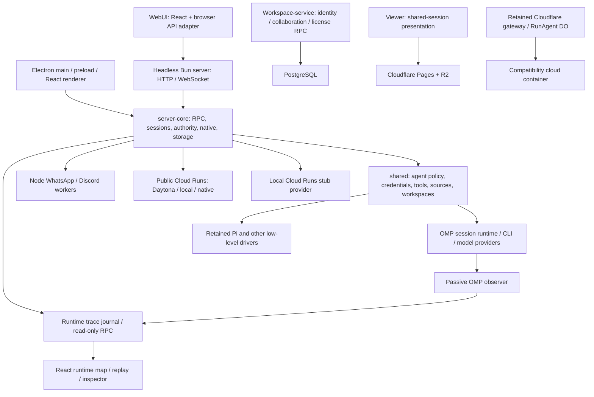

# [ROX-ARCH-CURRENT] Архитектура актуального ROX и оставшаяся готовность

**Репозиторий:** [rox-one/rox-one](https://github.com/rox-one/rox-one). **Проверенный исходный main:** `57871f492d1b21177ab767454d90395d72496b4e`, 2026-10-03, версия корневого пакета **0.11.8**. Изменения Docker, описанные ниже, находятся в отдельной ветке от этого main. Исторические [01](01-architecture.md), [14](14-candidate-inventory.md) и [18](18-launch-status.md) сохраняют свои исходные ревизии; их результаты нельзя автоматически переносить на сегодняшнюю сборку.

**Массовый запуск 169 пакетов / 445 задач отменён.** Этот проход выполняется локально; новые задачи Codex Cloud не создаются. Продуктовая функция Cloud Runs в коде ROX — самостоятельный компонент приложения, а не разрешение возобновить отменённый dispatch. Исходный backlog содержит 625 описаний: 445 исполняемых листьев и 180 родительских критериев приёмки. Эта актуализация не меняет их количество и не закрывает их DoD на основании наличия кода.

## [ROX-ARCH-TOPOLOGY] Из чего состоит приложение

ROX — монорепозиторий Bun/TypeScript. Desktop и hosted WebUI разделяют React-интерфейс и значительную часть серверного ядра. Electron добавляет локальные системные возможности; отдельный headless Bun-процесс обслуживает HTTP/WebSocket. PostgreSQL workspace-service, публичный viewer и сохранённый совместимый Cloud gateway имеют отдельные точки входа и границы развёртывания. Текущий публичный Cloud Runs registry допускает Daytona/local/native; Cloudflare/Modal/E2B исключены из обычного registry/UI, и ошибка Daytona не разрешает fallback к ним.



Стрелка к retained-драйверам обозначает сохранённую низкоуровневую инфраструктуру, а не пользовательский выбор движка для продуктовой сессии. Связь hosted WebUI с PostgreSQL identity показана отдельно: существование двух компонентов не доказывает единую tenant-модель.

Основные точки входа: [Electron main](https://github.com/rox-one/rox-one/blob/57871f492d1b21177ab767454d90395d72496b4e/apps/electron/src/main/index.ts#L1), [WebUI](https://github.com/rox-one/rox-one/blob/57871f492d1b21177ab767454d90395d72496b4e/apps/webui/src/main.tsx#L1), [headless server](https://github.com/rox-one/rox-one/blob/57871f492d1b21177ab767454d90395d72496b4e/packages/server/src/index.ts#L1), [workspace-service](https://github.com/rox-one/rox-one/blob/57871f492d1b21177ab767454d90395d72496b4e/apps/workspace-service/src/index.ts#L1).

## [ROX-ARCH-WORKSPACES] Все 18 workspace-пакетов

Таблица описывает версии из манифестов, а не доказанные установленные бинарники. Полные dependencies/devDependencies/optionalDependencies/peerDependencies, хеши манифестов и lockfile находятся в [source-inventory.json](evidence/current-main-20261003/source-inventory.json), извлечённом непосредственно из указанного Git SHA.

| Workspace | Версия | Ответственность |
| --- | --- | --- |
| `apps/electron` | 0.11.8 | Desktop main/preload/renderer, окна, локальный native bridge, упаковка. |
| `apps/webui` | 0.11.8 | Browser shell, login, browser API adapter, общий интерфейс. |
| `apps/cli` | 0.11.8 | CLI-клиент и команды подключения к серверу. |
| `apps/viewer` | 0.11.8 | Показ опубликованных сессий; отдельное Pages/R2 приложение. |
| `apps/workspace-service` | 0.11.5 | PostgreSQL identity, bootstrap, лицензии и durable collaboration. |
| `apps/cloud-gateway` | 0.1.0 | Сохранённый Cloudflare gateway/DO/container; Cloudflare исключён из обычного публичного registry. |
| `packages/core` | 0.11.8 | Общие типы, протоколы и базовые контракты. |
| `packages/shared` | 0.11.8 | Агент, конфигурация, credentials, MCP, tools, sources, проекты, знания, voice, scheduler. |
| `packages/ui` | 0.11.8 | Общие React-компоненты представления. |
| `packages/server-core` | 0.11.8 | Серверные RPC, sessions, authority, persistence и сервисы приложения. |
| `packages/server` | 0.11.8 | Headless entrypoint, HTTP/WebSocket/WebUI bootstrap. |
| `packages/session-tools-core` | 0.11.8 | Общие обработчики инструментов сессии. |
| `packages/session-mcp-server` | 0.11.8 | Сохранённый MCP helper; не следует считать обязательным subprocess текущего драйвера. |
| `packages/pi-agent-server` | 0.11.8 | Retained Pi helper; каноническая сборка Bun/ESM. |
| `packages/messaging-gateway` | 0.11.8 | Координация messaging-адаптеров и worker-контрактов. |
| `packages/messaging-whatsapp-worker` | 0.11.8 | Отдельный Node worker WhatsApp. |
| `packages/messaging-discord-worker` | 0.11.0 | Отдельный Node worker Discord. |
| `packages/cloud-runner` | 0.1.0 | Runner-контракты и локальный stub. |

Workspace-паттерны и исключения задаёт [корневой манифест](https://github.com/rox-one/rox-one/blob/57871f492d1b21177ab767454d90395d72496b4e/package.json#L18). `apps/docs-site` отсутствует в этом исходном дереве; старый Docker COPY этого пути является реальной ошибкой сборки.

## [ROX-ARCH-POLICY] Агент и фактическая runtime-политика

В `DRIVER_REGISTRY` сохранены anthropic/Pi/OMP реализации. Однако продуктовая сессия проходит через `resolveOmpSessionContext` и OMP session factory; `selectOmpSessionConnection` выбирает OMP и явно отказывает, если допустимого подключения нет. Из наличия трёх классов нельзя выводить три поддерживаемых продуктовых режима. Сохранённый Pi helper нужен как совместимый слой и собирается корневым `server:build:subprocess`, а не старой произвольной CJS-командой.

Референсы: [factory / registry и OMP session construction](https://github.com/rox-one/rox-one/blob/57871f492d1b21177ab767454d90395d72496b4e/packages/shared/src/agent/backend/factory.ts#L65), [OMP policy](https://github.com/rox-one/rox-one/blob/57871f492d1b21177ab767454d90395d72496b4e/packages/shared/src/agent/backend/omp-session-policy.ts#L4), [Pi build manifest](https://github.com/rox-one/rox-one/blob/57871f492d1b21177ab767454d90395d72496b4e/packages/pi-agent-server/package.json#L1), [runtime asset resolver](https://github.com/rox-one/rox-one/blob/57871f492d1b21177ab767454d90395d72496b4e/packages/shared/src/agent/backend/internal/runtime-resolver.ts#L30), [канонический build/staging](https://github.com/rox-one/rox-one/blob/57871f492d1b21177ab767454d90395d72496b4e/scripts/build/common.ts#L584).

## [ROX-ARCH-AUTH] Авторизация и хранилища: разные контуры

1. **Desktop/server-core:** workspace/session authority, native capabilities, credentials, журналы и специализированные хранилища живут за RPC и сервисными контрактами. Каталоги `authority`, `security`, `sessions`, `knowledge`, `memory`, `tasks`, `workflows`, `native`, `sources`, `meetings`, `execution`, `collaboration` разделяют обязанности внутри общего ядра; каждый каталог не является отдельным микросервисом.
2. **Headless WebUI:** текущий cookie JWT использует общий subject `webui` и 24-часовой срок; cookie HttpOnly/SameSite Strict, Secure включается по конфигурации. WebSocket upgrade принимает валидированный cookie. Это не доказательство изоляции аккаунтов/организаций в публичном multi-user сервисе. Референсы: [WebUI auth](https://github.com/rox-one/rox-one/blob/57871f492d1b21177ab767454d90395d72496b4e/packages/server-core/src/webui/auth.ts#L16), [headless WebUI/WS integration](https://github.com/rox-one/rox-one/blob/57871f492d1b21177ab767454d90395d72496b4e/packages/server/src/index.ts#L144), [browser API transport](https://github.com/rox-one/rox-one/blob/57871f492d1b21177ab767454d90395d72496b4e/apps/webui/src/adapter/web-api.ts#L1).
3. **Workspace-service:** `PostgresIdentityAuth`, миграции, local bootstrap/trusted issuer, authenticated project handlers, durable collaboration и optional license registry создаются отдельным сервером. Для non-loopback требуется TLS. Наличие этого сервера не доказывает, что существующий shared-subject WebUI уже переведён на его identity. Референс: [workspace server wiring](https://github.com/rox-one/rox-one/blob/57871f492d1b21177ab767454d90395d72496b4e/apps/workspace-service/src/server.ts#L119).
4. **Viewer:** [Pages/R2 configuration](https://github.com/rox-one/rox-one/blob/57871f492d1b21177ab767454d90395d72496b4e/apps/viewer/wrangler.toml#L1) относится к опубликованным сессиям. Viewer не заменяет authenticated WebUI; наличие конфигурации не является доказательством действующего deployment.

## [ROX-ARCH-RUNTIME-MAP] Runtime map уже присутствует

Слитый #1461 добавляет пассивное наблюдение: `OmpRuntimeObserver` подключается к существующему OMP agent, runtime trace service проверяет запись до сохранения, read-only RPC авторизует доступ к сессии, React runtime map отображает/replay-ит журнал. Этот слой не выдаёт новую native authority и не запускает независимый движок агентов.

Референсы: [observer](https://github.com/rox-one/rox-one/blob/57871f492d1b21177ab767454d90395d72496b4e/packages/shared/src/agent/omp-runtime-observer.ts#L205), [attachment](https://github.com/rox-one/rox-one/blob/57871f492d1b21177ab767454d90395d72496b4e/packages/shared/src/agent/omp-agent.ts#L819), [trace service](https://github.com/rox-one/rox-one/blob/57871f492d1b21177ab767454d90395d72496b4e/packages/server-core/src/sessions/runtime-trace/service.ts#L23), [trace RPC](https://github.com/rox-one/rox-one/blob/57871f492d1b21177ab767454d90395d72496b4e/packages/server-core/src/handlers/rpc/runtime-trace.ts#L13), [current map consumer](https://github.com/rox-one/rox-one/blob/57871f492d1b21177ab767454d90395d72496b4e/apps/electron/src/renderer/components/runtime-map/ChatRuntimeSplit.tsx#L1).

## [ROX-ARCH-DEPENDENCIES] Зависимости и дополнительные процессы

| Контур | Заявленные зависимости / процесс | Следствие для сборки |
| --- | --- | --- |
| Desktop | Electron `^39.2.7`, Vite `^6.2.4`, esbuild `^0.25.0` | Нужны target-specific native bundles и проверка установленного Electron. |
| Общий UI | React/ReactDOM `^18.3.1`, Jotai `^2.16.0`, Motion `^12.23.26`, XYFlow `^12.11.3`, i18next `^26.0.3`, react-i18next `^17.0.2` | Desktop/WebUI используют общий renderer; поддерживаются 12 локалей. |
| Headless/server-core | Bun, `ws ^8.19.0`, `jose ^6.0.0`, Turso `0.7.2`, Sharp `0.35.4`, Transformers `2.17.2` | Архитектура/ABI и native optional dependencies существенны для target qualification. |
| Pi compatibility | SDK family `0.85.1`, Bun/ESM helper | Сборочный рецепт должен совпадать с каноническим package script. |
| Messaging | Node 20 build target, WA/Discord workers | Bun-сервер не заменяет требуемый Node subprocess. |
| Workspace-service | PostgreSQL через Bun SQL | Нужны отдельная БД, миграции, TLS/identity/bootstrap и recovery. |
| Retained Cloud gateway | Cloudflare Workers/DO/containers, `@cloudflare/computer 0.1.0-alpha.1`, Wrangler `^4.115.0` | Compatibility-код, не текущий public provider; configured capacity не доказывает рабочий runner. |

Текущий [публичный registry](https://github.com/rox-one/rox-one/blob/57871f492d1b21177ab767454d90395d72496b4e/packages/cloud-runner/src/public-registry.ts#L1) разрешает только Daytona/local/native; сохранившийся Cloudflare import или deployment config не меняет эту policy. Это ограничения из manifests; точные разрешённые версии определяет [bun.lock](https://github.com/rox-one/rox-one/blob/57871f492d1b21177ab767454d90395d72496b4e/bun.lock#L1). Полный список, включая все роли зависимостей, находится в JSON inventory. Внешние model providers, MCP servers и browser automation подключаются по функциям/конфигурации, а не автоматически становятся обязательными микросервисами базового запуска. Cloud Runs имеет [gateway deployment contract](https://github.com/rox-one/rox-one/blob/57871f492d1b21177ab767454d90395d72496b4e/apps/cloud-gateway/wrangler.jsonc#L1) и [локальный stub](https://github.com/rox-one/rox-one/blob/57871f492d1b21177ab767454d90395d72496b4e/packages/cloud-runner/src/runners/stub-runner.ts#L1); stub не является доказательством production provider execution.

## [ROX-ARCH-ALREADY-MERGED] Что повторно делать не требуется

Все перечисленные merge commits являются предками проверенного main. PR state и ancestry перепроверены через GitHub/Git в этом проходе.

| PR | Что уже интегрировано | Предел вывода |
| --- | --- | --- |
| [#1400](https://github.com/rox-one/rox-one/pull/1400) | Geometry/selected details/shell lifecycle recovery; merge `91dee6f025fe084bc1208152309ab5bd2a529878`. | Не повторять recovery patch; ограниченные проверки не закрывают весь release backlog. |
| [#1420](https://github.com/rox-one/rox-one/pull/1420) | Stale route/workspace/deep-link callback recovery; merge `5c242cf044d6fcbacf60efa9efa08cfc1977d39f`. | Сохранить текущие ownership/lifecycle fences. |
| [#1424](https://github.com/rox-one/rox-one/pull/1424) | Own-data credential attachment metadata; merge `b697e96daeab9fe3cdc8fc8cca0d3169c66d96be`. | Не возвращать inherited/accessor credential reads. |
| [#1461](https://github.com/rox-one/rox-one/pull/1461) | Passive runtime map/observer; merge `f86660e7d84fbe35342d90b56db0189ae4e62ed4`. | Карта уже в коде, повторное создание не нужно. |

Текущий [validate-server CI](https://github.com/rox-one/rox-one/blob/57871f492d1b21177ab767454d90395d72496b4e/.github/workflows/validate-server.yml#L1) уже выполняет frozen install, subprocess/WebUI/server build и реальные smoke-проверки. Историческое описание echo-only CI больше не соответствует текущему main. Запуск и успех CI конкретного нового PR необходимо проверять отдельно.

## [ROX-ARCH-LOCAL-FIX] Локальная приоритетная доработка Docker

Изменения этого PR в [Dockerfile.server](../../Dockerfile.server), [.dockerignore](../../.dockerignore) и [проверяющем скрипте](../../scripts/verify-server-container-context.ts):

- Удалён COPY отсутствующего `apps/docs-site`; добавлены три недостающих workspace manifests: cloud-runner, cloud-gateway, workspace-service. Cache layer теперь содержит все 18 членов монорепозитория до frozen install.
- Bun закреплён на `1.3.14` с digest multiarch index. Pi helper использует канонический Bun/ESM recipe. Неиспользуемый CJS session-MCP build удалён из этого Docker recipe. Local Cloud Runs сохраняет существующий source fallback; его headless resolver не следует приравнивать к Electron resource staging.
- Docker context исключает `.env*`, локальные credential/state directories, node_modules и вложенные dist. Требуемый `config-defaults.json` сохраняется. Проверяются только синтетические секреты, реальные credentials не читаются.

**Выполненная проверка:** [container-context.json](evidence/current-main-20261003/container-context.json), Bun 1.3.14, actual Docker BuildKit: исходный COPY отказал на отсутствующем docs-site; исправленный COPY сохранил все 21 cache input побайтно; 11 synthetic private/stale markers исключены; удаление workspace-service manifest снова вызвало отказ Docker. Скрипт экспортирует FROM scratch fixture, а не собирает полноценный application image. `fullImageBuildExecuted=false` является явной границей доказательства. Изменённая Pi build команда в полном контейнере здесь ещё не исполнена.

**Requirements:** полный manifest closure до frozen install, канонический helper recipe, отсутствие private/stale context inputs. **DoD этого ограниченного исправления:** reviewable patch, все перечисленные COPY/context controls проходят, исходный отказ воспроизводится. **Полная функциональная проверка:** дополнительно собрать Linux amd64/arm64 image с frozen install, запустить реальный server/WebUI/helper/workers, выполнить login/WS/session/provider flow и volume restart. **Test method:** `bun scripts/verify-server-container-context.ts --baseline=57871f492d1b21177ab767454d90395d72496b4e`; затем отдельные actual full-image и hosted acceptance gates. Весь hosted DoD этим patch не закрыт.

## [ROX-ARCH-REMAINING] Приоритетные оставшиеся пункты и методы приёмки

Ниже уточнения существующего [platform backlog](04-platform-release-backlog.md) и [integration/QA backlog](05-integration-test-recheck-backlog.md), а не новый массовый план. Незавершённое остаётся незавершённым; implementation receipts и полная приёмка разделены.

### [ROX-ARCH-WEB] Hosted WebUI: сборка, identity и эксплуатация

**Сборка/запуск.** После context fix нужен полный Docker build на amd64/arm64, реальный runtime smoke, canonical Pi/stub placement и messaging subprocess checks. World-writable home policy в Dockerfile остаётся отдельной эксплуатационной задачей. **Requirements:** воспроизводимые builds и runtime assets без скрытого checkout state. **DoD:** оба target images запускают продуктовые функции с зафиксированным image digest. **Полная функциональная проверка:** login → WS → OMP session → tool → history → restart с volume, сбои subprocess и восстановление. **Test method:** actual Docker build/run, HTTP/WS assertions, provider scenario, restart и denied-path controls.

**Identity/tenant integration.** Определить и реализовать связь WebUI sessions с workspace-service identity там, где нужен multi-user hosting, включая revoke/expiry и workspace/session authorization. **Requirements:** чужие account/workspace/session не доступны ни по HTTP, ни по WS/RPC. **DoD:** два независимых аккаунта, отрицательные cross-account tests, согласованный logout/revoke/restart, TLS/WSS и durable storage. **Полная функциональная проверка:** прямые RPC, stale cookies, повторное соединение, membership change, перезапуск БД/серверов. **Test method:** hosted browser + protocol E2E на реальном deployment с отрицательными controls. Наличие JWT cookie или PostgreSQL сервиса по отдельности недостаточно.

### [ROX-ARCH-MAC] macOS: target closure и доверенная установка

**Intel/ARM64.** Текущий lock Turso 0.7.2 не содержит Darwin x64 binary, хотя release validator требует этот пакет. Release CI/publisher сейчас ориентированы на ARM64 macOS и x64 Windows. Нужно согласовать обещанный Mac target с реально поставляемыми dependency/artifact/update paths. Референсы: [native package lock](https://github.com/rox-one/rox-one/blob/57871f492d1b21177ab767454d90395d72496b4e/bun.lock#L1643), [desktop validation](https://github.com/rox-one/rox-one/blob/57871f492d1b21177ab767454d90395d72496b4e/scripts/desktop-release.ts#L31), [release matrix](https://github.com/rox-one/rox-one/blob/57871f492d1b21177ab767454d90395d72496b4e/.github/workflows/desktop-release.yml#L82), [update metadata](https://github.com/rox-one/rox-one/blob/57871f492d1b21177ab767454d90395d72496b4e/scripts/verify-update-metadata.ts#L9). **Requirements:** заявленные Mac architectures имеют полный native dependency closure. **DoD:** installed target build запускает actual Electron SQLite/OMP и проходит update/relaunch. **Полная функциональная проверка:** clean install, native DB create/read/write/reopen, provider/tool path и upgrade с сохранением данных. **Test method:** запуск подписанного установленного приложения на каждом поддерживаемом target; CI Node SQLite probe не заменяет Electron ABI test.

**Подпись/notarization.** `signed: Boolean(CSC_LINK)` в [manifest builder](https://github.com/rox-one/rox-one/blob/57871f492d1b21177ab767454d90395d72496b4e/scripts/desktop-release.ts#L70) отражает конфигурацию, а не криптографическую проверку артефакта. **Requirements:** trusted signature, правильные entitlements и notarization/stapling для выпущенного файла. **DoD:** installed downloaded artifact проходит codesign/spctl/Gatekeeper; receipt привязан к artifact hash. **Полная функциональная проверка:** скачивание чистым пользователем, запуск, permissions, restart/update. **Test method:** codesign verification, notarization/stapler readback и actual clean-machine launch. Доступ к signing identity является внешним release prerequisite.

### [ROX-ARCH-WIN] Windows 10/11: установленный продукт

Сохранённые hardcoded `/bin/zsh` в [Electron system handler](https://github.com/rox-one/rox-one/blob/57871f492d1b21177ab767454d90395d72496b4e/apps/electron/src/main/handlers/system.ts#L303) и [server system RPC](https://github.com/rox-one/rox-one/blob/57871f492d1b21177ab767454d90395d72496b4e/packages/server-core/src/handlers/rpc/system.ts#L397) требуют проверки actual Windows path и target-aware shell policy. Уже слитые dependency/bootstrap fixes не доказывают завершённую установку. **Requirements:** Win10/Win11 installer, runtime payload, shell/path compatibility, native DB и OMP/MCP lifecycle. **DoD:** installed app на обеих ОС работает после reload/relaunch/update и сохраняет пользовательские данные. **Полная функциональная проверка:** clean NSIS install, space/non-ASCII paths, shell/tool/source/provider flow, worker failure/recovery, DB reopen, upgrade/uninstall boundaries. **Test method:** actual Windows VMs/devices с captured artifact/OS/runtime hashes, functional E2E и отрицательными controls. macOS source/type/build checks не заменяют эту приёмку.

### [ROX-ARCH-INTEGRATION] Общая перепроверка финальной сборки

**Requirements:** acceptance привязана к интегрированной ревизии и установленному/hosted артефакту; все изменённые поверхности проверены по исходным ID backlog. **DoD:** compiler/build/unit controls, actual desktop/web functional flows, persistence/recovery/permissions, provider integration и release provenance имеют отдельные воспроизводимые receipts. **Полная функциональная проверка:** пройти исходные surface/service/platform/QA сценарии на Windows10/11, каждом поддерживаемом macOS target и hosted deployment; failed controls сохранять вместе с исправлением. **Test method:** dependency-aware gates: source integration → build artifact → installed/deployed runtime → functional/negative/recovery tests → acceptance readback. Начинать независимые локальные проверки допустимо; финальная приёмка требует потребляемых результатов предыдущих этапов. Отменённый Cloud dispatch не возобновляется.

## [ROX-ARCH-VERIFY] Воспроизведение этого ограниченного прохода

```sh
bun scripts/verify-server-container-context.ts --baseline=57871f492d1b21177ab767454d90395d72496b4e
bun scripts/final-readiness-audit.ts --validate
git diff --check
```

Использовать квалифицированный Bun 1.3.14 для приведённого receipt. `--validate` проверяет документацию/исходные ссылки и acceptance fields; он не запускает приложение и не закрывает platform DoD. Не выполнять export/reconciliation generators для переписывания исторических snapshots без отдельной задачи. Соседние dirty worktrees, включая `rox-release-20261003`, не являются входом этого прохода и не изменяются.
