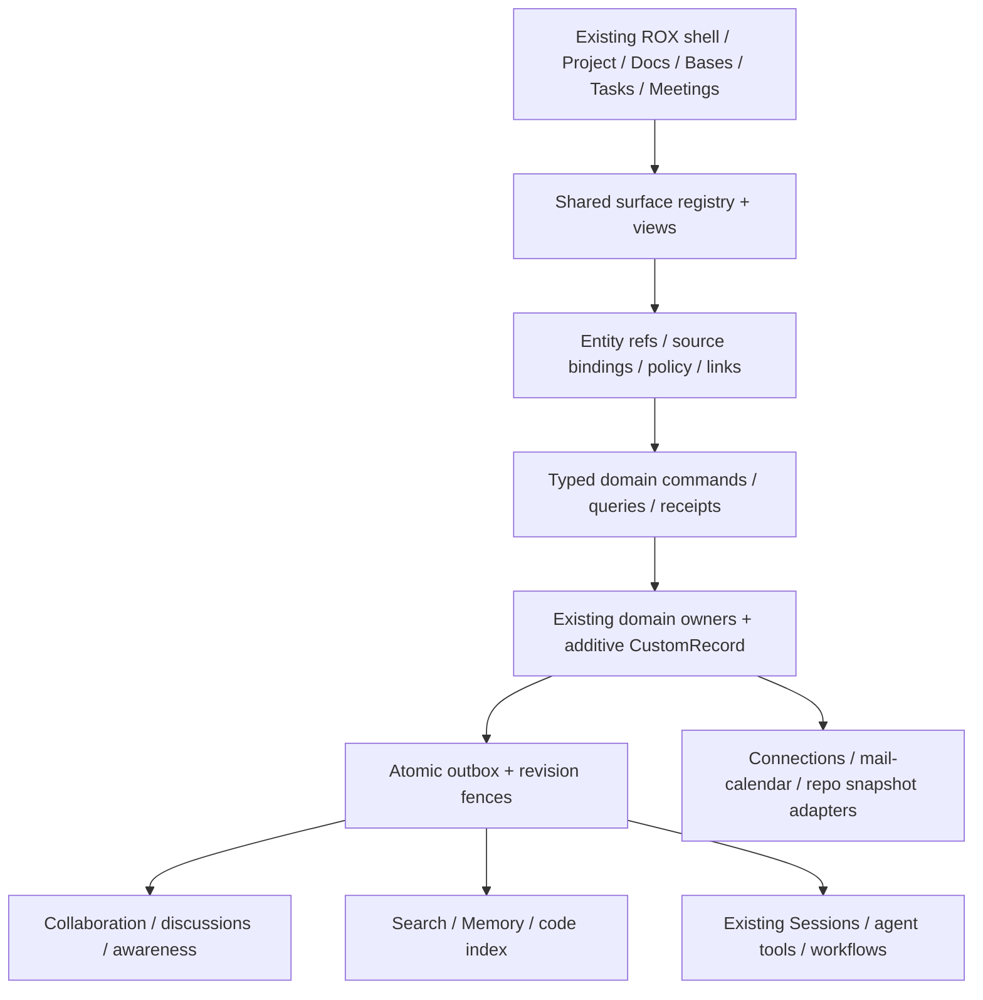

# Lark Suite → ROX: recommended product architecture

**Revision 2, 2026-09-30.** Результат — исследование и implementation-ready specifications. Код новых surfaces и cloud jobs этим пакетом не запущены. Current ROX source baseline: `e953786ba7e30fb5da5dca7e88e20e324d5aebab`; актуальные source references и ограничения в тематических документах.

## Что из Lark действительно нужно ROX

Общие представления и действия над связанными данными: документ с ToC/комментариями/блоками; Drive/Wiki как способы организации; Base как типизированные query/views; Chats/Meetings/Calendar/Tasks; единый Approval engine для бизнес-форм; событийные automations; единый каталог integrations с конкретным entitlement и scopes. Tanca/Seleam/Coze/DocuGenius — отдельные продукты/дополнения, а не доказательство универсального Lark backend.

Live audit выполнен в native Lark и Chrome через Codex Computer Use. 34 meaningful observation records связаны с private captures; 63 попытки capture включают loading и неудачные клики. Все названные пользователем области имеют documented catalog coverage. Недоступные приватные HR/media/provider screens, mobile gestures и hover timing не названы проверенными. Legacy Messenger Favorites фактически read-only/discontinued; Docs Favorites и message Flag различаются.

## Что ROX уже имеет

Existing NotesPage/Tiptap editor, ToC/comments, heading outline/canvas/graph/table/base prototypes; native Tasks/Projects/Meetings/Sessions; Rox2 entity references; Sources/Connections; Knowledge/agent surface; Automation graph UI/runtime/event/retry seams. Existing headless Code Intelligence pack supplies regex symbol/contains helpers, provenance rendering and optional Syft runner; it stays off until activated. Эти факты относятся к baseline source; наличие contract или компонента не означает полноту shared cloud behavior.

## Главные gaps

Notes RPC optional revision/direct file writes расходится с CAS engine; текущая stamping меняет raw Markdown/frontmatter/newlines. Client view localStorage не является shared Base persistence. Fixed formulas не general typed engine; personal task identity требует source/owner binding. Комментариям нужны общие durable discussions и anchors. Cloud collaboration требует авторизованной transport/persistence/recovery, не одного frontend CRDT. Automation shell sanitization и webhook retry не являются полноценной workflow ACL и durable step executor.

## Что интегрировать и что переписать

Сохранить React/Electron/Tiptap, existing routes, note/task/project IDs и domain owners. Расширить Notes до **Rox Docs**, Base view adapters до **Rox Bases**, текущий graph до typed durable Automations. Ideascape: Map/Outline одной Markdown заметки, stable block IDs/lossless patches/conversion preview; TaskNotes: переносимость и views существующей Task, не второй task store. Highlightr/Buttons/Dragger/Tabs/Codeblock/DayPlanner/DynamicViews/ChartedRoots — оригинальная реализация полезных behaviors на ROX contracts. Лицензионные расхождения Highlightr/Buttons/NotionBases и GPL DynamicViews не позволяют blanket copy.

**Code Intelligence** добавляется в существующий Project: OpenWiki grounded wiki/Claims, GitDiagram diagram projection, Groma scan/curated C4/drift, local search и grounded answers как альтернатива repogrep.com. Wiki/Docs/Sources/Sessions остаются интеграционными точками. Источник каждого результата привязан к immutable repo snapshot; модельная связь помечена inferred, stale output не выдаётся за актуальный код.

## Primitives с наибольшей отдачей

1. Existing Rox2EntityRef + origin/source namespace + versioned descriptors.
2. One domain command boundary: actor, revision, authority epoch, idempotency, durable receipt.
3. Common ACL evaluator with field/record/block policy and cache invalidation.
4. EntityLinks/Mentions/Attachments and durable Discussion anchors.
5. SourceAdapter + typed query snapshot for every Base view.
6. Versioned FieldDefinition/ViewDefinition + bounded formula/relation engine.
7. One content authority, lossless patches and explicit format migration.
8. Domain outbox feeding Search/Notifications/Activity/Memory/Automation.
9. ProviderConnection/immutable snapshot/provenance for external sources and code intelligence.
10. Immutable workflow versions, checkpointed steps and current-scope agent tools.

## Recommended architecture и critical path

Critical path: source ownership and CAS → lossless Notes + entity-aware source adapters → shared typed query/schema/view persistence → one working Task in Base + Doc/Map/Outline scenario → discussions/ACL/realtime/recovery → relations/formulas/7views → forms/actions/automation → cross-surface agent workflows and Code Intelligence artifacts. Provider/cloud deployment remains a separately measurable dependency, not a fake pass in the research pack.

## Опасные traps

Duplicate Task/Contact/Doc rows; mixed Markdown+JSON writers; hidden-row aggregate leaks; CRDT convergence mistaken for valid tree merge; stale epochs accepted; local comments silently shared; generated wiki counted as code proof; old source snapshots silently retargeted; undocumented SaaS endpoints used as integration; typed graph UI without durable executor; assumptions of Lark API entitlement; GPL/MIT mismatches flattened. Revision2 explicitly fixes these through scoped refs, aggregate CAS, page subtype migration, semantic containers, authorized computations and proof/readback gates.
