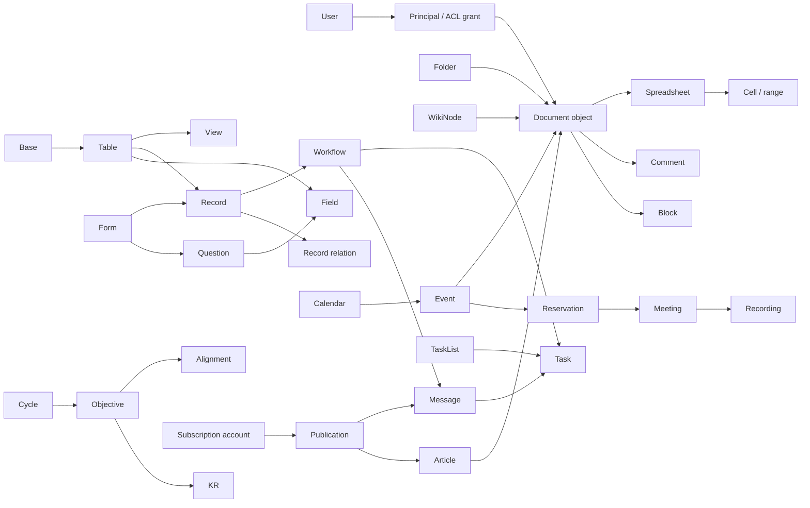

# Lark Suite: core products, interaction surfaces and semantic model

Дата проверки публичных источников: **30 сентября 2026**. Назначение: исследовательская база для планирования ROX. Реализация продукта, отправка сообщений и изменение Lark не выполнялись этим исследователем.

Машиночитаемый источник этой страницы: [core-catalog.json](../../plans/lark-suite-reference/core-catalog.json). Ключи `LC-001`…`LC-018` стабильны внутри каталога; screen/action имеют производные IDs.

## 1. Границы доказательств

- **DOCUMENTED** — содержимое публичной официальной справки, прочитанное по HTTPS; не наблюдение actual UI.
- **DOCUMENTED_API** — публичная страница Open Platform.
- **SDK_CONTRACT** — ресурс/REST path в official integration SDK, закреплённом на commit; это не исходники Lark backend и не гарантия доступности в конкретном tenant.
- **CONCEPTUAL** — semantic entities/cardinality для ROX. Внутренняя БД, физические таблицы, транзакции, storage engine и realtime implementation Lark недоступны.
- **PROPOSED** — возможная agent/ROX автоматизация. Ничего из этого не заявляется реализованным.
- **GAP** — не проверенные scope strings, role conflicts, UI focus/ARIA, platform/plan variants.

Текст/название/updatedAt каждой Help Center страницы извлекались из её публичного embedded article JSON, без запуска кода сайта и без частных учётных данных. Search snippets не считались достаточным источником. Beta-only/пустые страницы исключены. IDs повторно сверены с текущим title: прежний Subscriptions link `360048488455` теперь документирует Document Details, поэтому применяется только к Docs.

## 2. Ключевые семантические различия

| Понятие | Смысл для модели ROX | Ошибка, которую нужно исключить |
|---|---|---|
| Docs block / heading / outline | Content tree; outline derived from heading blocks | Приравнять outline к отдельному Wiki space |
| Sheets cell/range | Координаты, формула, пересчёт, workbook tab | Считать row stable business record |
| Base field/record/view | Typed schema + stable record ID; projections share data | Считать Kanban copy таблицы или filter security boundary |
| Drive folder / shortcut | Storage location and reference | Считать shortcut независимым backup или ACL grant |
| Wiki node / object | Knowledge navigation token points to separately typed content token | Использовать node_token как document_id |
| Task / task list | Work unit vs collaboration/project container | Archive list = complete/delete contained tasks |
| Calendar / event / instance | ACL container vs scheduled occurrence/recurrence | Смешать calendar follow с Subscriptions content account |
| Meeting reserve / live meeting / recording | Scheduled intent vs runtime vs stored artifact | One ID and one permission for every operation |
| Favorite / pin / flag / follow / subscription | Distinct personal/shared references and notifications | Один универсальный bookmark table with identical effects |

Base/Sheets distinction подтверждён [Differences between Base and Sheets](https://www.larksuite.com/hc/en-US/articles/360048488215); wiki hierarchy — [Get started with using Wiki](https://www.larksuite.com/hc/en-US/articles/360048488377); task/list semantics — [Create, share, and manage task lists](https://www.larksuite.com/hc/en-US/articles/259489546875).

## 3. Общие права, поиск, комментарии и API

Docs имеет View/Edit/Manage/Owner плюс отдельные comment/copy/download/print/external/share restrictions. Объекты могут иметь пользователя, chat, user group или department как principal; ссылочная роль и explicit collaborator role по public guide выбирают более высокий доступ. Base advanced ACL и Sheets protection добавляют свои ограничения. [Lark Docs permissions overview](https://www.larksuite.com/hc/en-US/articles/360024166434), [Share documents](https://www.larksuite.com/hc/en-US/articles/308456317982).

Не переносить общий алгоритм на все приложения: новый Base ACL ограничивает specific rights ceiling таблицы и совместно проверяет general action restrictions; OKR использует отдельные visibility rules. [Use advanced permissions in Base ](https://www.larksuite.com/hc/en-US/articles/669213017033), [Lark OKR administrator guide](https://www.larksuite.com/hc/en-US/articles/394050620063).

Поиск фильтруется доступом; отдельные category filters отличаются. Документ, выданный только через link range, может появляться в Docs search после первого открытия, в отличие от direct collaborator grant. Приватные comments имеют собственную видимость; resolved thread архивируется и может быть reopened, deleted comment не восстанавливается. [Share documents](https://www.larksuite.com/hc/en-US/articles/308456317982), [Use comments in Docs](https://www.larksuite.com/hc/en-US/articles/680083197034).

API mapping использует [official SDK README](https://github.com/larksuite/node-sdk/blob/394c83092395a51402ee408b751d7f9fb05f5518/README.md) и pinned generated families. Для Lark явно выбирать Domain.Lark / open.larksuite.com. Exact scopes, tenant-token/user-token matrix и tenant feature availability здесь **не подтверждены**: нельзя выводить scope из названия метода или UI ACL. App bot и notification-only custom webhook bot различаются. [Official Messenger API FAQ](https://open.larksuite.com/document/server-docs/im-v1/faq).

Полный список точных scope strings необходимо дополнять только из текущего endpoint/application-console evidence. Пустой `scopeStrings` означает missing verification. Selected REST routes, не найденные в pinned SDK, помечены `GAP_UNCONFIRMED_PATH`; они не должны использоваться как реализационный контракт.

## 4. Каталог функций

| ID | Core area | Screens | Actions | API evidence |
|---|---|---:|---:|---|
| LC-001 | Docs / текстовый документ | 7 | 5 | docx |
| LC-002 | Sheets / электронная таблица | 6 | 5 | sheets |
| LC-003 | Drive / хранилище и Docs Home | 6 | 4 | drive |
| LC-004 | Wiki / пространство знаний | 6 | 4 | wiki |
| LC-005 | Base / типизированные записи и приложения | 8 | 5 | bitable |
| LC-006 | Forms / сбор ответов | 8 | 5 | bitable |
| LC-007 | Messenger / чаты и сообщения | 6 | 5 | im |
| LC-008 | Contacts / люди и организация | 5 | 4 | contact |
| LC-009 | Meetings / звонки и видеовстречи | 7 | 4 | vc |
| LC-010 | Calendar / события и календари | 7 | 5 | calendar |
| LC-011 | Tasks / задачи и task lists | 7 | 4 | task |
| LC-012 | Mail / электронная почта | 6 | 4 | mail |
| LC-013 | Favorites / личное избранное | 4 | 2 | Dedicated API not verified |
| LC-014 | Templates / шаблоны | 5 | 4 | drive |
| LC-015 | Reminders / напоминания | 5 | 3 | task |
| LC-016 | Announcements / объявление группы | 5 | 3 | im |
| LC-017 | OKR / цели и ключевые результаты | 7 | 4 | okr |
| LC-018 | Subscriptions / официальные аккаунты и Broadcasters | 7 | 5 | Dedicated API not verified |

### LC-001. Docs / текстовый документ

**CORE_PRODUCT · DOCUMENTED_PUBLIC_SOURCES.** Совместный документ с блоками, облачным автосохранением, версиями, комментариями и ссылочными вставками. Outline выводится из заголовков; это навигация, а не отдельный документ.

#### Screens / subscreens / navigation

| Screen ID / поверхность | Entry | Specific controls | Основной flow | Evidence |
|---|---|---|---|---|
| LC-001-S01 — Создание / импорт | Docs Home → New → Docs / Upload | Blank; Template; Import as New Docs | Выбрать место и формат. → Создать документ либо конвертировать поддерживаемый локальный файл. | [Get started with Docs](https://www.larksuite.com/hc/en-US/articles/560483946591), [Get started with Lark Docs (new version)](https://www.larksuite.com/hc/en-US/articles/393289394847) |
| LC-001-S02 — Редактор блоков | Открыть документ | Title; Cover; / menu; +; ⋮⋮; Selection toolbar; @ mention | Ввести текст или вставить типизированный блок. → Отредактировать выделение; изменения сохраняются автоматически. | [Get started with Docs](https://www.larksuite.com/hc/en-US/articles/560483946591), [Indent and align content in Docs](https://www.larksuite.com/hc/en-US/articles/769048340682) |
| LC-001-S03 — Outline / заголовки | Заголовки H1/H2/H3 → левая панель | Jump to heading; Collapse heading; Hide/Expand outline | Добавить заголовок. → Выбрать пункт outline для перехода; collapse скрывает дочерний контент. | [Use headings and table of contents in Docs](https://www.larksuite.com/hc/en-US/articles/832981202410) |
| LC-001-S04 — Комментарии / история комментариев | Выделение → Comment / нижний общий комментарий | Post; Reply; Image; Private; Resolve and hide; Edit own; Delete; Translate; Copy link; Follow comments | Привязать обсуждение к содержимому или документу. → Ответить, разрешить либо открыть архив обсуждений. | [Use comments in Docs](https://www.larksuite.com/hc/en-US/articles/680083197034) |
| LC-001-S05 — Share / права | Верхний Share | Collaborator search; View/Edit/Manage; Notify; Link range; Permission settings | Выбрать субъектов и роль. → Send сохраняет права и при выбранном Notify отправляет уведомление. | [Share documents](https://www.larksuite.com/hc/en-US/articles/308456317982), [Lark Docs permissions overview](https://www.larksuite.com/hc/en-US/articles/360024166434) |
| LC-001-S06 — Версии / сведения / приватность | More → Edit History / Document Details | Version list; Restore; Info and Statistics; View History; Document Activity; Privacy Settings | Просмотреть ревизию или показатели. → Восстановить версию при разрешении; менять видимость посещений отдельно. | [Get started with Docs](https://www.larksuite.com/hc/en-US/articles/560483946591), [Check document information and configure privacy settings](https://www.larksuite.com/hc/en-US/articles/360048488455) |
| LC-001-S07 — Копия / шаблон / экспорт | More | Make a Copy; Convert to Template; Save to My Templates; Download; Print | Создать независимую копию либо шаблон. → Экспортировать разрешённый формат при допуске download/print. | [Make a copy in Lark Docs](https://www.larksuite.com/hc/en-US/articles/360048487804), [Use custom templates](https://www.larksuite.com/hc/en-US/articles/352554751443), [Lark updates](https://www.larksuite.com/hc/en-US/articles/360046836333) |

#### Actions / inputs / outputs

| Action | Inputs | Outputs | Permission / condition |
|---|---|---|---|
| LC-001-A01 — Создать / импортировать | title; destination; template or localFile | document reference; converted blocks | Создание в выбранном месте |
| LC-001-A02 — Изменить блоки | document; revision context; block content/position | новая версия содержимого | Edit |
| LC-001-A03 — Обсудить / разрешить комментарий | anchor; text/image; mentions; private flag | comment/reply; notification; resolved archive | Comment; edit own; delete others требует Manage |
| LC-001-A04 — Пригласить / отозвать | principal; role; notify; link policy | grant; optional Messenger notification | Grant ceiling ≤ собственная роль |
| LC-001-A05 — Восстановить / экспортировать | revision or exportFormat | restored document or downloadable artifact | Edit для history; отдельные copy/download/print ограничения |

**Inputs:** Rich text / Markdown shortcuts; Typed blocks: table, media, code, board, poll, callout; User and document mentions; Local import; ACL principals; Comment anchors.

**Outputs:** Saved document; Document link; Export/copy; Comment threads; Outline; Versions and permitted engagement statistics.

#### Conceptual entities / relationships

| Entity / semantic key | Fields |
|---|---|
| Document — document_id | title, owner, creator, createdAt, modifiedAt, documentType, revision |
| Block — block_id | documentId, parentBlockId, type, content, position |
| CommentThread — comment_id | documentId, anchor, visibility, status, author, replies |
| DocumentRevision — revision_id | documentId, editor, timestamp |
| DocumentGrant — grant_id | documentId, principalType, principalId, role |

- **CONCEPTUAL** Document → Block (1:N): Иерархия блоков; заголовки служат источником outline.
- **CONCEPTUAL** Block → Block (1:N): Вложенность контента и collapsed-ветвей.
- **CONCEPTUAL** Document → CommentThread (1:N): Общий комментарий либо якорь к выделению/блоку.
- **CONCEPTUAL** Document → DocumentRevision (1:N): История изменений, отличная от журнала ACL.
- **CONCEPTUAL** Document → DocumentGrant (1:N): Пользователь, чат, user group или департамент; не только owner_id.

#### ACL / states / interaction

- View/Edit/Manage/Owner; comment и copy/download/print/external/share имеют дополнительные ограничения.
- Коллаборатор и link-sharing комбинируются по более высокой доступной роли; не переносить это правило на OKR.
- Вставленный Base имеет собственные права; доступ к родительскому Doc не гарантирует доступ к Base.
- Приватные комментарии имеют свой круг видимости; resolved ≠ deleted.

**States to test:** Blank; Editing/autosaved; Viewing; Collapsed headings; Selected text; Comment open/resolved/deleted; Private comment restricted; Read-only; Access request; History; Export denied.

- **Hover, documented:** Документированно: title → Add Cover; cover → Edit Cover; blank line → +; block → ⋮⋮; comment → reply/More/resolve; outline heading → collapse.
- **Keyboard:** Документированно: / в начале строки; Space затем / в тексте; Ctrl/Cmd+Z undo; Ctrl/Cmd+F раскрывает collapsed headings; Tab/Shift+Tab indentation зависят от First line indent.
- **Mobile:** Документированно: double-tap edit; + insertion; More → Outline.
- **Focus/ARIA gap:** actual Tab order, focus indicators, dialog return-focus, keyboard-only workflows and screen-reader labels have not been observed.

#### Events / automations / integrations / agents

- **DOCUMENTED event:** Comment / reply / mention notifications. Messenger [Use comments in Docs](https://www.larksuite.com/hc/en-US/articles/680083197034)
- **CONCEPTUAL event:** document.changed / acl.changed. Доменные события для ROX; точное имя Lark webhook не подтверждено.
- **DOCUMENTED Native:** Облачное сохранение; синхронизация outline; уведомления комментариев и упоминаний.
- **PROPOSED Agent:** Составить/обновить протокол и проверить ссылки/ACL через API; не трактовать копирование URL как предоставление прав.

**Integrations:** Messenger sharing/comments; Wiki page object; Drive location/exports; Sheets charts; Base embeds with independent ACL; Calendar meeting notes; Templates; Subscriptions document publication.

**Dependencies:** Tenant identity; Location rights; Document ACL; Realtime/revision service; Drive media; Notification transport.

**Agent mapping:** Knowledge editor. Read: Document/block/comment + ACL context. Write: Create/edit document; reconcile comment and revision context. Boundary: Sharing, mentions and notifications требуют цели/аудитории из задания.

#### API contract / variants / open gaps

- **SDK_CONTRACT:** POST /open-apis/docx/v1/documents — [Official larksuite/node-sdk generated docx client](https://github.com/larksuite/node-sdk/blob/394c83092395a51402ee408b751d7f9fb05f5518/code-gen/projects/docx.ts).
- **SDK_CONTRACT:** GET /open-apis/docx/v1/documents/:document_id — [Official larksuite/node-sdk generated docx client](https://github.com/larksuite/node-sdk/blob/394c83092395a51402ee408b751d7f9fb05f5518/code-gen/projects/docx.ts).
- **SDK_CONTRACT:** GET /open-apis/docx/v1/documents/:document_id/raw_content — [Official larksuite/node-sdk generated docx client](https://github.com/larksuite/node-sdk/blob/394c83092395a51402ee408b751d7f9fb05f5518/code-gen/projects/docx.ts).
- **SDK_CONTRACT:** GET /open-apis/docx/v1/documents/:document_id/blocks — [Official larksuite/node-sdk generated docx client](https://github.com/larksuite/node-sdk/blob/394c83092395a51402ee408b751d7f9fb05f5518/code-gen/projects/docx.ts).
- **SDK_CONTRACT:** PATCH /open-apis/docx/v1/documents/:document_id/blocks/batch_update — [Official larksuite/node-sdk generated docx client](https://github.com/larksuite/node-sdk/blob/394c83092395a51402ee408b751d7f9fb05f5518/code-gen/projects/docx.ts).
- **GAP:** exact scope strings/token compatibility are not verified in this core catalog.
- **Variant:** Табличный блок внутри Docs ≠ Sheets и ≠ Base.
- **Variant:** ToC add-on отличается от левой outline: печатный ToC требует отдельной вставки.
- **Variant:** Markdown export зафиксирован в release log; tenant rollout не наблюдался.
- **Gap:** Exact ACL scope strings / webhook taxonomy / complete export-format entitlement / focus and ARIA не проверены.

### LC-002. Sheets / электронная таблица

**CORE_PRODUCT · DOCUMENTED_PUBLIC_SOURCES.** Адресуемая сетка ячеек, формулы, диапазоны и листы для расчётов. Строка Sheets не обладает семантикой стабильной бизнес-записи Base.

#### Screens / subscreens / navigation

| Screen ID / поверхность | Entry | Specific controls | Основной flow | Evidence |
|---|---|---|---|---|
| LC-002-S01 — Создание / импорт | New → Sheets / Upload | Blank; Template; Import XLS/XLSX/CSV | Создать workbook или преобразовать файл. | [Get started with Sheets](https://www.larksuite.com/hc/en-US/articles/906248459668) |
| LC-002-S02 — Сетка / формула / формат | Открыть spreadsheet | Cell editor; Formula; Font/style; Number format; Freeze; Hide; Row/column groups | Выбрать/двойным кликом редактировать ячейку. → Применить числовой формат и структуру диапазона. | [Get started with Sheets](https://www.larksuite.com/hc/en-US/articles/906248459668) |
| LC-002-S03 — Фильтры / filter views | Toolbar → Filter | Filter range; Condition; Filter view; Sort | Определить диапазон и условия. → Применить персональную filter view без изменения рабочего фильтра коллег. | [Get started with Sheets](https://www.larksuite.com/hc/en-US/articles/906248459668) |
| LC-002-S04 — Аналитика / charts / pivot | Toolbar → chart / pivot | Chart type; Data range; Pivot dimensions; Conditional formatting | Настроить источник и агрегацию. → Скопировать chart в Doc для связаного представления. | [Get started with Sheets](https://www.larksuite.com/hc/en-US/articles/906248459668) |
| LC-002-S05 — Защита диапазонов / листов | Data → Protect Range / tab menu | Range selector; Who can edit; Manage Protection; Lock marker | Установить защиту. → Проверить разрешения; редактирование защищённой ячейки отклоняется. | [Protect a range or sheet in Sheets](https://www.larksuite.com/hc/en-US/articles/085301301809) |
| LC-002-S06 — Комментарии / версии / общий Share | Cell context menu / More / Share | Add Comment; Yellow marker; Edit History; Restore; Collaborators | Комментировать ячейку либо просмотреть её прежнее значение. → Управлять документными правами отдельно от защиты диапазона. | [Get started with Sheets](https://www.larksuite.com/hc/en-US/articles/906248459668), [Use comments in Docs](https://www.larksuite.com/hc/en-US/articles/680083197034), [Lark Docs permissions overview](https://www.larksuite.com/hc/en-US/articles/360024166434) |

#### Actions / inputs / outputs

| Action | Inputs | Outputs | Permission / condition |
|---|---|---|---|
| LC-002-A01 — Править ячейку / формулу | coordinate; value/formula | computed/displayed value | Edit + range/sheet protection |
| LC-002-A02 — Фильтровать / сортировать | range; conditions; private view | subset/order | Права выбранной операции |
| LC-002-A03 — Построить сводную / chart | range; dimensions; aggregation; chartType | pivot/chart; linked Doc chart | Edit |
| LC-002-A04 — Защитить / снять защиту | range or sheet; editor principals | protection policy | Editor; manager сохраняет edit |
| LC-002-A05 — Комментировать / восстановить | cell; comment or historic value | comment/notification or previous value | Comment / Edit |

**Inputs:** Cell values/formulas; Range references; XLS/XLSX/CSV; Format/color conditions; Chart/pivot configuration.

**Outputs:** Grid and calculated values; Charts/pivots; Personal filter views; Cell comments/history; Exports.

#### Conceptual entities / relationships

| Entity / semantic key | Fields |
|---|---|
| Spreadsheet — spreadsheet_token | title, owner, revision |
| Sheet — sheet_id | spreadsheetToken, name, index, rowCount, columnCount |
| Cell — sheet_id + row + column | value, formula, displayFormat |
| Range — range notation | sheetId, start/end row/column |
| FilterView — filter_view_id | range, conditions, owner |
| ProtectedRange — protection_id | range, editors |
| Chart — chart_id | sourceRange, type, aggregation |

- **CONCEPTUAL** Spreadsheet → Sheet (1:N): Workbook содержит несколько вкладок.
- **CONCEPTUAL** Sheet → Cell (1:N): Координаты могут менять смысл при вставках/сортировках.
- **CONCEPTUAL** Range → Cell (1:N): Формулы, формат, chart и protection работают над диапазонами.
- **CONCEPTUAL** Sheet → FilterView (1:N): Представление сетки; не многовидовая бизнес-модель Base.
- **CONCEPTUAL** Range → ProtectedRange (1:N): Дополнительный контроль изменений при общей Doc ACL.

#### ACL / states / interaction

- Общая Docs ACL + отдельная edit protection на sheet/range.
- Новые ограниченные возможности view-protection отмечены beta; не считать базовой row-level security.
- Выдача доступа внешнему protected-range editor может затронуть доступ к workbook — проверять Share.

**States to test:** Blank; Cell editing; Formula result/error; Filtered; Protected/read-only; Denied edit feedback; Version restore; No access.

- **Hover, documented:** Документированно: lock marker → View Protection. Остальные hover-toolbar детали не наблюдались.
- **Keyboard:** Полный набор Sheets shortcuts не исследован; не переносить Excel shortcuts как факт Lark.
- **Mobile:** Desktop/web range protection описана отдельно; полной мобильной эквивалентности нет.
- **Focus/ARIA gap:** actual Tab order, focus indicators, dialog return-focus, keyboard-only workflows and screen-reader labels have not been observed.

#### Events / automations / integrations / agents

- **DOCUMENTED event:** Cell mentions/comment notifications.  [Get started with Sheets](https://www.larksuite.com/hc/en-US/articles/906248459668)
- **CONCEPTUAL event:** range.updated. Проектируемое событие ROX; webhook имя не подтверждено.
- **DOCUMENTED Native:** Пересчёт формул и связанное обновление chart в Doc; отдельного Base-подобного automation builder у Sheets нет.
- **PROPOSED Agent:** Загрузить данные, проверить формулы/диапазоны и сформировать отчёт; cron/бот — внешний исполнитель.

**Integrations:** Docs charts; Drive/Docs sharing; Base import alternative; Messenger comments.

**Dependencies:** Document ACL; Calculation engine; Grid coordinates; Drive import/export; Comments.

**Agent mapping:** Spreadsheet analyst. Read: Workbook/tabs/ranges. Write: Scoped data and formulas. Boundary: Нельзя трактовать каждую строку как Record CRUD без собственной схемы.

#### API contract / variants / open gaps

- **SDK_CONTRACT:** POST /open-apis/sheets/v3/spreadsheets — [Official larksuite/node-sdk generated sheets client](https://github.com/larksuite/node-sdk/blob/394c83092395a51402ee408b751d7f9fb05f5518/code-gen/projects/sheets.ts).
- **SDK_CONTRACT:** GET /open-apis/sheets/v3/spreadsheets/:spreadsheet_token — [Official larksuite/node-sdk generated sheets client](https://github.com/larksuite/node-sdk/blob/394c83092395a51402ee408b751d7f9fb05f5518/code-gen/projects/sheets.ts).
- **SDK_CONTRACT:** GET /open-apis/sheets/v3/spreadsheets/:spreadsheet_token/sheets/query — [Official larksuite/node-sdk generated sheets client](https://github.com/larksuite/node-sdk/blob/394c83092395a51402ee408b751d7f9fb05f5518/code-gen/projects/sheets.ts).
- **GAP:** exact scope strings/token compatibility are not verified in this core catalog.
- **Variant:** Sheets filter view ≠ Base grid/Kanban/Gantt view.
- **Variant:** AI formula отмечена beta в сравнительном документе; доступ конкретного tenant не установлен.
- **Gap:** Полный values-range REST контракт/точные OAuth scopes, supported formula corpus, offline/conflict semantics не подтверждены.

### LC-003. Drive / хранилище и Docs Home

**CORE_PRODUCT · DOCUMENTED_PUBLIC_SOURCES.** Контейнеры, файлы и ссылки на облачные документы, места хранения, импорт/экспорт и общая ACL. Home, Drive и персональная document library — разные поверхности.

#### Screens / subscreens / navigation

| Screen ID / поверхность | Entry | Specific controls | Основной flow | Evidence |
|---|---|---|---|---|
| LC-003-S01 — Docs Home | Nav → Docs | New; Upload; Recent; Shared With Me; Favorites; Search; Drive; Wiki | Открыть недавний объект либо создать новый. | [Get started with Lark Docs](https://www.larksuite.com/hc/en-US/articles/019658594935), [Get started with Lark Docs (new version)](https://www.larksuite.com/hc/en-US/articles/393289394847) |
| LC-003-S02 — Создание / место назначения | New | Docs; Sheets; Slides; Base; Form; MindNotes; Folder; Add to location | Выбрать тип и destination. → При поддерживаемом новом home сохранить default location. | [Get started with Lark Docs (new version)](https://www.larksuite.com/hc/en-US/articles/393289394847) |
| LC-003-S03 — Drive folder list / shortcuts | Home → Drive | Folder tree/list; Move; Copy; Create shortcut; Quick Access to Folders | Организовать объекты папками. → Shortcut ведёт к исходному объекту; copy создаёт новый. | [Get started with Lark Docs](https://www.larksuite.com/hc/en-US/articles/019658594935), [Get started with Lark Docs (new version)](https://www.larksuite.com/hc/en-US/articles/393289394847) |
| LC-003-S04 — Upload / import | Upload / drag-and-drop | Upload Files; Upload Folder; Import as New Docs | Выбрать original upload либо конвертацию. → Сохранить дерево при folder upload. | [Get started with Lark Docs](https://www.larksuite.com/hc/en-US/articles/019658594935) |
| LC-003-S05 — Персональная библиотека / pinned | Новый home, если доступен | My Document Library; Pinned Docs; Pinned Wiki; Page hierarchy | Создать или закрепить page; закреплённый doc может включать subpages. | [Get started with Lark Docs (new version)](https://www.larksuite.com/hc/en-US/articles/393289394847) |
| LC-003-S06 — Share / ownership / trash | More / Share / Trash | Collaborator manager; Transfer owner; Delete; Restore; Permanently delete | Прочитать ACL и место. → Переместить/удалить; восстановить по доступному retention окну. | [Get started with Lark Docs (new version)](https://www.larksuite.com/hc/en-US/articles/393289394847), [Lark Docs permissions overview](https://www.larksuite.com/hc/en-US/articles/360024166434) |

#### Actions / inputs / outputs

| Action | Inputs | Outputs | Permission / condition |
|---|---|---|---|
| LC-003-A01 — Загрузить / конвертировать | file/folder; destination; mode | uploaded original or cloud document | Destination create rights |
| LC-003-A02 — Переместить / скопировать / shortcut | source; target location; operation | new location or new object/link | Manage/copy restrictions + destination ACL |
| LC-003-A03 — Найти / открыть | keywords; category/filter | permission-filtered results | ACL исходного объекта |
| LC-003-A04 — Удалить / восстановить | object; trash item | trash state/restored object | Manage/owner/admin согласно операции |

**Inputs:** Binary file/folder; Document reference; Destination folder/page; Search terms; ACL and owner transfer.

**Outputs:** File URL/token; Converted cloud document; Folder hierarchy; Shortcut; Trash entry; Download/export job.

#### Conceptual entities / relationships

| Entity / semantic key | Fields |
|---|---|
| DriveObject — file token + type | name, owner, type, url, createdAt, modifiedAt |
| Folder — folder_token | parentFolder, name |
| Shortcut — shortcut token | targetToken, targetType, location |
| TrashEntry — conceptual id | originalObject, deletedAt, restoreWindow |
| UploadSession — upload_id | parts, size, status |

- **CONCEPTUAL** Folder → DriveObject (1:N): Содержимое папки, включая документы других форматов.
- **CONCEPTUAL** Shortcut → DriveObject (N:1): Ссылка не дублирует содержание и не обязана расширять ACL.
- **CONCEPTUAL** DriveObject → TrashEntry (1:0..1): Удаление и восстановление отделены от содержимого документа.

#### ACL / states / interaction

- Общая Docs ACL: view/edit/manage, share/copy/download/external.
- Публично описано member restore 30 дней и admin restore 90 дней; эти окна не равно бессрочный backup.
- Перенос между locations может менять наследование прав; не выводить безопасность только из token.

**States to test:** Empty; Recent; Shared; Favorites; Uploading; Conversion; Copy/shortcut; Trash; Restore; Permission denied.

- **Hover, documented:** Legacy: hover file → star. New: hover folder/page → More/pin. Эти варианты опубликованы, не наблюдались здесь.
- **Keyboard:** Drag-and-drop upload описан; keyboard navigation/focus не исследованы.
- **Mobile:** Новый home требует mobile 7.3+; версия tenant/liveUI определяется отдельно.
- **Focus/ARIA gap:** actual Tab order, focus indicators, dialog return-focus, keyboard-only workflows and screen-reader labels have not been observed.

#### Events / automations / integrations / agents

- **CONCEPTUAL event:** object.created/moved/deleted. Архитектурные события; публичные SDK subscription endpoints не дают универсального полного журнала.
- **PROPOSED Agent:** Импортировать пакет, проверить количество/форматы/ACL, индексировать разрешённый контент.

**Integrations:** All Docs formats; Wiki node content; Messenger files; Templates; Subscriptions doc link.

**Dependencies:** Tenant storage entitlement; Object-type dispatcher; Identity/ACL; Upload/export jobs.

**Agent mapping:** Artifact librarian. Read: List/meta/ACL + content by type. Write: Upload/copy/move/export with readback. Boundary: Delete, ownership transfer и external sharing только по конкретной цели.

#### API contract / variants / open gaps

- **SDK_CONTRACT:** GET /open-apis/drive/v1/files — [Official larksuite/node-sdk generated drive client](https://github.com/larksuite/node-sdk/blob/394c83092395a51402ee408b751d7f9fb05f5518/code-gen/projects/drive.ts).
- **SDK_CONTRACT:** POST /open-apis/drive/v1/files/create_folder — [Official larksuite/node-sdk generated drive client](https://github.com/larksuite/node-sdk/blob/394c83092395a51402ee408b751d7f9fb05f5518/code-gen/projects/drive.ts).
- **SDK_CONTRACT:** POST /open-apis/drive/v1/files/:file_token/move — [Official larksuite/node-sdk generated drive client](https://github.com/larksuite/node-sdk/blob/394c83092395a51402ee408b751d7f9fb05f5518/code-gen/projects/drive.ts).
- **SDK_CONTRACT:** POST /open-apis/drive/v1/files/:file_token/copy — [Official larksuite/node-sdk generated drive client](https://github.com/larksuite/node-sdk/blob/394c83092395a51402ee408b751d7f9fb05f5518/code-gen/projects/drive.ts).
- **SDK_CONTRACT:** POST /open-apis/drive/v1/files/create_shortcut — [Official larksuite/node-sdk generated drive client](https://github.com/larksuite/node-sdk/blob/394c83092395a51402ee408b751d7f9fb05f5518/code-gen/projects/drive.ts).
- **SDK_CONTRACT:** POST /open-apis/drive/v1/export_tasks — [Official larksuite/node-sdk generated drive client](https://github.com/larksuite/node-sdk/blob/394c83092395a51402ee408b751d7f9fb05f5518/code-gen/projects/drive.ts).
- **SDK_CONTRACT:** GET /open-apis/drive/v1/export_tasks/:ticket — [Official larksuite/node-sdk generated drive client](https://github.com/larksuite/node-sdk/blob/394c83092395a51402ee408b751d7f9fb05f5518/code-gen/projects/drive.ts).
- **GAP:** exact scope strings/token compatibility are not verified in this core catalog.
- **Variant:** Legacy My Space / Shared Space и new My Document Library / Drive / Wiki опубликованы как разные версии.
- **Variant:** Slides/MindNotes — отдельные creation types; не сводить к режиму текстового Docs.
- **Variant:** Board/Flowchart, проверенные root live UI, должны жить в отдельном UI inventory; в этом документированном каталоге их entitlement не утверждается.
- **Gap:** Точное дерево текущего клиента, UI download state, quotas и scope strings требуют отдельного live/API audit.

### LC-004. Wiki / пространство знаний

**CORE_PRODUCT · DOCUMENTED_PUBLIC_SOURCES.** Пространство с деревом nodes и ссылками на Docs-объекты разных типов. Wiki hierarchy, document outline и folder tree имеют разные роли.

#### Screens / subscreens / navigation

| Screen ID / поверхность | Entry | Specific controls | Основной flow | Evidence |
|---|---|---|---|---|
| LC-004-S01 — Wiki home / spaces | Docs → Wiki / web /wiki/ | All wiki spaces; Search spaces; Pinned spaces; Space cover | Найти доступное space и открыть cover. | [Get started with using Wiki](https://www.larksuite.com/hc/en-US/articles/360048488377) |
| LC-004-S02 — Space / navigation tree | Space cover | Show/Hide panel; Resize boundary; Page tree; Info | Перейти по узлам; изменить ширину панели. → Просмотреть space info если разрешено. | [Get started with using Wiki](https://www.larksuite.com/hc/en-US/articles/360048488377) |
| LC-004-S03 — Page creation / import / shortcuts | Space page controls | New page; Import; Move existing document; Create shortcut | Выбрать родительский node и объект/тип. → Создать content или связать существующий. | [Get started with using Wiki](https://www.larksuite.com/hc/en-US/articles/360048488377) |
| LC-004-S04 — Page manage / pins / favorites | Hover page / top title / More | Add to Pins; Add to Favorites; Move; Remove/Delete; Copy with subpages | Закрепить shortcut навигации либо изменить hierarchy. → Удаление отделять от простой ссылки/shortcut. | [Get started with using Wiki](https://www.larksuite.com/hc/en-US/articles/360048488377) |
| LC-004-S05 — Space security / page Share | Space admin / page Share | Space members/admins; Security policy; Page collaborators; Request access | Проверить org policy, space security и page grants. | [Get started with using Wiki](https://www.larksuite.com/hc/en-US/articles/360048488377), [Lark Docs permissions overview](https://www.larksuite.com/hc/en-US/articles/360024166434) |
| LC-004-S06 — Trash / restore | Space Trash | Deleted pages; Restore | Вернуть удалённый page в пределах доступного окна. | [Get started with using Wiki](https://www.larksuite.com/hc/en-US/articles/360048488377) |

#### Actions / inputs / outputs

| Action | Inputs | Outputs | Permission / condition |
|---|---|---|---|
| LC-004-A01 — Создать page / import | space; parent; objectType; content | node + content reference | Space/page create rights |
| LC-004-A02 — Найти / навигировать | space keywords; node/path | space/page | Доступные spaces/pages |
| LC-004-A03 — Двигать / копировать / shortcut | node; destination; includeSubpages | new hierarchy or copy/link | Manage + destination permissions |
| LC-004-A04 — Права / restore | principal/role or deleted page | grant/restored node | Space admin/page manage |

**Inputs:** Space metadata; Node parent; Doc object reference; Member roles; Search terms.

**Outputs:** Knowledge tree; Page references; Pins/favorites; Accessible search results; Restored pages.

#### Conceptual entities / relationships

| Entity / semantic key | Fields |
|---|---|
| WikiSpace — space_id | name, description, cover, visibility, admins |
| WikiNode — node_token | spaceId, parentNodeToken, objToken, objType, title, nodeType |
| WikiMember — space + principal | role, principalType |
| WikiPin — user + node | position |

- **CONCEPTUAL** WikiSpace → WikiNode (1:N): Иерархия навигационных узлов.
- **CONCEPTUAL** WikiNode → WikiNode (1:N): Parent/child tree; subpages отличаются от heading blocks.
- **CONCEPTUAL** WikiNode → DriveObject (N:1): Node token не равен token содержимого; shortcut может указывать на существующий объект.
- **CONCEPTUAL** WikiSpace → WikiMember (1:N): Space role + inherited/page-level policy.

#### ACL / states / interaction

- Объединяются organization Docs policy, space security и page permission; page Share сам по себе недостаточен.
- Root-page creation может быть ограничен администратором; внешние пользователи не могут создавать wiki pages по public guide.
- Info/admin identity может быть скрыта для обычных участников.

**States to test:** Spaces visible; No accessible spaces; Tree expanded/collapsed; Info hidden; Pinned; Request access; Read-only; Trash.

- **Hover, documented:** Документированно: boundary drag resize; page → More → Add to Pins/Favorites; cover → pin.
- **Keyboard:** Полный набор tree shortcuts/focus/drag accessibility не исследован.
- **Mobile:** Guide имеет отдельные мобильные шаги; не считать desktop panel эквивалентом.
- **Focus/ARIA gap:** actual Tab order, focus indicators, dialog return-focus, keyboard-only workflows and screen-reader labels have not been observed.

#### Events / automations / integrations / agents

- **CONCEPTUAL event:** wiki.node.created/moved. Проектируемое событие ROX; точные Lark webhook имена не утверждаются.
- **PROPOSED Agent:** Создавать knowledge tree, проверять битые ссылки и права, обновлять материалы с сохранением node/content identity.

**Integrations:** Docs/Sheets/Base/Slides/MindNotes content; Drive object metadata; Global Docs search; Favorites/Pins.

**Dependencies:** Docs content types; Space identity; Org/space/page ACL; Drive copy/move.

**Agent mapping:** Knowledge architect. Read: Spaces/nodes + content resolution. Write: Maintain tree and content independently. Boundary: Move across spaces должен включать ACL readback.

#### API contract / variants / open gaps

- **SDK_CONTRACT:** GET /open-apis/wiki/v2/spaces — [Official larksuite/node-sdk generated wiki client](https://github.com/larksuite/node-sdk/blob/394c83092395a51402ee408b751d7f9fb05f5518/code-gen/projects/wiki.ts).
- **SDK_CONTRACT:** GET /open-apis/wiki/v2/spaces/get_node — [Official larksuite/node-sdk generated wiki client](https://github.com/larksuite/node-sdk/blob/394c83092395a51402ee408b751d7f9fb05f5518/code-gen/projects/wiki.ts).
- **SDK_CONTRACT:** GET /open-apis/wiki/v2/spaces/:space_id/nodes — [Official larksuite/node-sdk generated wiki client](https://github.com/larksuite/node-sdk/blob/394c83092395a51402ee408b751d7f9fb05f5518/code-gen/projects/wiki.ts).
- **SDK_CONTRACT:** POST /open-apis/wiki/v2/spaces/:space_id/nodes — [Official larksuite/node-sdk generated wiki client](https://github.com/larksuite/node-sdk/blob/394c83092395a51402ee408b751d7f9fb05f5518/code-gen/projects/wiki.ts).
- **SDK_CONTRACT:** POST /open-apis/wiki/v2/spaces/:space_id/nodes/:node_token/move — [Official larksuite/node-sdk generated wiki client](https://github.com/larksuite/node-sdk/blob/394c83092395a51402ee408b751d7f9fb05f5518/code-gen/projects/wiki.ts).
- **GAP:** exact scope strings/token compatibility are not verified in this core catalog.
- **Variant:** My Document Library — личная иерархия; Wiki — knowledge space.
- **Variant:** Pinned wiki space ≠ favorite page ≠ pinned page with subpages.
- **Gap:** Поведение inherited-deny и переноса subtree требует проверок текущего tenant; schema здесь conceptual.

### LC-005. Base / типизированные записи и приложения

**CORE_PRODUCT · DOCUMENTED_PUBLIC_SOURCES.** Base → tables → typed fields + stable records; views показывают одни и те же записи, dashboards агрегируют, workflows выполняют действия. Связанные records — business relation, а не адрес ячейки.

#### Screens / subscreens / navigation

| Screen ID / поверхность | Entry | Specific controls | Основной flow | Evidence |
|---|---|---|---|---|
| LC-005-S01 — Создание Base | New → Base | Blank; Templates; Import | Создать Base и таблицу со схемой. | [Get started with Base](https://www.larksuite.com/hc/en-US/articles/182394504552) |
| LC-005-S02 — Table / grid / field schema | Base left table nav | Field header; Field type; Field description; Customize Fields; Record row | Добавить типизированный field. → Заполнить record; все значения поля имеют единый тип. | [Use fields in Base](https://www.larksuite.com/hc/en-US/articles/364163852421), [Get started with Base](https://www.larksuite.com/hc/en-US/articles/182394504552) |
| LC-005-S03 — Views / filter / sort / group | Table → Add View | Grid; Kanban; Gantt; Gallery; Calendar; Form; Filter; Sort; Group By | Создать view и задать представление тех же records. | [Get started with Base](https://www.larksuite.com/hc/en-US/articles/182394504552), [Use groups and filters in Base](https://www.larksuite.com/hc/en-US/articles/360048488185), [Differences between Base and Sheets](https://www.larksuite.com/hc/en-US/articles/360048488215) |
| LC-005-S04 — Record detail / comments / follow | Record → Open / context menu | Expanded record; Related records; Add Comment; Follow | Открыть устойчивую record-ссылку. → Изменить поля, обсуждать запись или получать допустимые уведомления. | [Follow a record in Base](https://www.larksuite.com/hc/en-US/articles/034635082486), [Use comments in Docs](https://www.larksuite.com/hc/en-US/articles/680083197034) |
| LC-005-S05 — Dashboard / charts | Add Dashboard → Add Chart | Data source; Chart type; Aggregation; Blocks | Выбрать table и агрегировать records. → Проверить отдельные dashboard/data permissions. | [Use dashboards in Base](https://www.larksuite.com/hc/en-US/articles/360048488504), [Use advanced permissions in Base ](https://www.larksuite.com/hc/en-US/articles/669213017033) |
| LC-005-S06 — Automations / Workflow canvas | Top Automations / left Workflow | Trigger; Actions; If/Else; Multi-branch; Loop; Activate; Run log | Настроить условие и действия. → Активировать и проверить фактический run; quota/log отдельно. | [Use Workflow in Base](https://www.larksuite.com/hc/en-US/articles/641266732374), [Base Workflow and Automations FAQs](https://www.larksuite.com/hc/en-US/articles/126710842099) |
| LC-005-S07 — Advanced permissions | Upper-right Base advanced permissions | System/custom roles; Data; Record; Field; View; Dashboard; Others; Save | Ограничить table role. → Уточнить field/record/view rights в пределах table ceiling; Save применяет конфигурацию. | [Use advanced permissions in Base ](https://www.larksuite.com/hc/en-US/articles/669213017033), [Use legacy advanced permissions in Base ](https://www.larksuite.com/hc/en-US/articles/360048488440) |
| LC-005-S08 — Forms / Query page | Add View / Forms entry | Form View; Upgraded Form; Query Page; Preview; Publish | Собрать inputs в records либо дать scoped lookup/edit query. | [Use form views in Base](https://www.larksuite.com/hc/en-US/articles/360048488384), [Use Lark Forms ](https://www.larksuite.com/hc/en-US/articles/344736296177), [Use the query page in Base](https://www.larksuite.com/hc/en-US/articles/182162636464) |

#### Actions / inputs / outputs

| Action | Inputs | Outputs | Permission / condition |
|---|---|---|---|
| LC-005-A01 — Менять schema | field name/type/options | typed field | Table manage |
| LC-005-A02 — CRUD record / relation | record id; typed field values; target record references | saved record/relation | Scoped add/edit/delete and field ACL |
| LC-005-A03 — Настроить view/dashboard | source table; view/chart type; filter/group/aggregation | projection/dashboard | View/dashboard/source rights |
| LC-005-A04 — Создать / запустить workflow | trigger; conditions; actions; owner | workflow run/log/side effects | Owner/manager при advanced permissions |
| LC-005-A05 — Настроить / проверить роли | role; principal; data/action constraints | effective access configuration | Owner/Manage |

**Inputs:** Typed values: text/number/date/person/select/attachment/url/formula/lookup/relation/button/group/system fields; CSV/XLS import; Record references; Conditional rules; Workflow triggers/actions.

**Outputs:** Records; Multiple views; Relations/lookups; Dashboards; Forms/query pages; Workflow logs; Messenger/email/task outputs configured by automation.

#### Conceptual entities / relationships

| Entity / semantic key | Fields |
|---|---|
| BaseApp — app_token | name, owner, advancedPermissions |
| BaseTable — table_id | appToken, name, primaryField |
| BaseField — field_id | tableId, name, type, options, relationTarget, formula |
| BaseRecord — record_id | tableId, fieldValues, createdBy, modifiedBy |
| BaseView — view_id | tableId, type, filter, sort, group, visibleFields |
| RecordRelation — conceptual edge | sourceRecord, targetRecord, fieldId, oneWay/twoWay |
| Dashboard — dashboard_id | base, blocks, sources |
| Workflow — workflow identity not assumed API id | trigger, nodes, owner, enabled |
| WorkflowRun — conceptual run id | workflow, inputs, steps, outcome |
| BaseRole — role_id | principals, table/record/field/view/dashboard/action permissions |

- **CONCEPTUAL** BaseApp → BaseTable (1:N): Общий контейнер бизнес-таблиц.
- **CONCEPTUAL** BaseTable → BaseField (1:N): Типизированная схема; field_id нужен при переименовании.
- **CONCEPTUAL** BaseTable → BaseRecord (1:N): Record identity сохраняет бизнес-смысл независимо от view order.
- **CONCEPTUAL** BaseTable → BaseView (1:N): Разные проекции одной таблицы, не независимые копии.
- **CONCEPTUAL** BaseRecord → BaseRecord (N:M): Одно/двунаправленные relation fields; lookup/formula могут читать связанные данные.
- **CONCEPTUAL** Workflow → WorkflowRun (1:N): Конфигурация, выполнение и outcome — отдельные сущности.
- **CONCEPTUAL** BaseApp → BaseRole (1:N): ACL может ограничивать records/fields/views/dashboard.

#### ACL / states / interaction

- New ACL: table permissions cap more specific record/field/view rights; Owner/Manage configure automation.
- Copy/download/print требуют одновременно разрешений general Docs + advanced Base.
- Index/system fields имеют особые ограничения видимости; не обещать скрытие любого поля.
- Dashboard edit/creation для nonadmin beta и имеет source-table requirements; private views отдельны.

**States to test:** Empty base/table; Schema editing; Record expanded; View filtered; Hidden data/view; Workflow inactive/active/failed; Quota exceeded; Advanced legacy/new; Permission denied.

- **Hover, documented:** Документированно: field header menu; record index open; workflow name → More.
- **Keyboard:** Текстовые поля поддерживают описанные multiline shortcuts; полный shortcut corpus не переносится из Sheets.
- **Mobile:** Advanced permissions mobile 7.32+ — просмотр и базовое on/off/member management; полная configuration desktop/web.
- **Focus/ARIA gap:** actual Tab order, focus indicators, dialog return-focus, keyboard-only workflows and screen-reader labels have not been observed.

#### Events / automations / integrations / agents

- **DOCUMENTED event:** New record / qualifying record / schedule / button workflow triggers.  [Use Workflow in Base](https://www.larksuite.com/hc/en-US/articles/641266732374), [Base Workflow and Automations FAQs](https://www.larksuite.com/hc/en-US/articles/126710842099)
- **DOCUMENTED event:** Followed record changed notification. Bulk record edits/schema changes не дают такого же notify; visibility и same-org ограничения. [Follow a record in Base](https://www.larksuite.com/hc/en-US/articles/034635082486)
- **DOCUMENTED Native:** Automation trigger/action и Workflow branches/loops; общая quota; run logs ограничены retention; удаление как trigger/action FAQ не поддерживает.
- **PROPOSED Agent:** Обработать запись идемпотентно, сохранять source/target record IDs, читать результат и отрицательную ACL проверку.

**Integrations:** Forms responses; Sheets/Base/Approval sync variants; Messenger chat fields; Tasks/email workflow actions; Docs embeds/chart links; No-code Base Apps beta.

**Dependencies:** Typed schema; Stable record identity; Object permissions; Automation quota/runtime; Messenger/Tasks/Mail connectors.

**Agent mapping:** Business workflow operator. Read: Schema + records + role visibility. Write: Typed CRUD and verified automation effects. Boundary: Workflow may notify/send email/create task; authorization must cover that effect.

#### API contract / variants / open gaps

- **SDK_CONTRACT:** GET /open-apis/bitable/v1/apps/:app_token/tables — [Official larksuite/node-sdk generated bitable client](https://github.com/larksuite/node-sdk/blob/394c83092395a51402ee408b751d7f9fb05f5518/code-gen/projects/bitable.ts).
- **SDK_CONTRACT:** GET /open-apis/bitable/v1/apps/:app_token/tables/:table_id/fields — [Official larksuite/node-sdk generated bitable client](https://github.com/larksuite/node-sdk/blob/394c83092395a51402ee408b751d7f9fb05f5518/code-gen/projects/bitable.ts).
- **SDK_CONTRACT:** POST /open-apis/bitable/v1/apps/:app_token/tables/:table_id/records — [Official larksuite/node-sdk generated bitable client](https://github.com/larksuite/node-sdk/blob/394c83092395a51402ee408b751d7f9fb05f5518/code-gen/projects/bitable.ts).
- **SDK_CONTRACT:** PUT /open-apis/bitable/v1/apps/:app_token/tables/:table_id/records/:record_id — [Official larksuite/node-sdk generated bitable client](https://github.com/larksuite/node-sdk/blob/394c83092395a51402ee408b751d7f9fb05f5518/code-gen/projects/bitable.ts).
- **SDK_CONTRACT:** POST /open-apis/bitable/v1/apps/:app_token/tables/:table_id/records/search — [Official larksuite/node-sdk generated bitable client](https://github.com/larksuite/node-sdk/blob/394c83092395a51402ee408b751d7f9fb05f5518/code-gen/projects/bitable.ts).
- **GAP:** exact scope strings/token compatibility are not verified in this core catalog.
- **Variant:** Legacy advanced permissions и new advanced permissions различаются; после сохранённого upgrade откат к старой версии недоступен по public guide.
- **Variant:** Base Apps beta, record-limit add-on, sync/connectors/AI variants не подтверждены как tenant entitlements.
- **Variant:** Фильтр view сам по себе не является security boundary.
- **Gap:** Public API для полного Workflow/Form/Dashboard builder, точные scopes/quotas/version-specific events не подтверждены.

### LC-006. Forms / сбор ответов

**CORE_PRODUCT · DOCUMENTED_PUBLIC_SOURCES.** Опубликованная анкета со схемой вопросов, логикой, правилами респондентов, ответами в Base и Analytics. Upgraded Form отличается от Base form view.

#### Screens / subscreens / navigation

| Screen ID / поверхность | Entry | Specific controls | Основной flow | Evidence |
|---|---|---|---|---|
| LC-006-S01 — Forms home | Search Forms / app | Create Form; Templates; My forms; Context menu | Создать анкету; новая форма создаёт Base с ответами. | [Use Lark Forms ](https://www.larksuite.com/hc/en-US/articles/344736296177) |
| LC-006-S02 — Question builder | Form → Edit | Add Question; Question type; Title/description; Required; Copy/Delete; Display Logic; Drag reorder | Настроить вопросы и условную видимость. → Новый вопрос создаёт field; удаление вопроса удаляет corresponding field. | [Use Lark Forms ](https://www.larksuite.com/hc/en-US/articles/344736296177) |
| LC-006-S03 — Appearance / completion | Editor → Appearance / Settings | List/Step mode; Completion title/text; Redirect URL | Выбрать один экран или шаги. → Задать завершающий экран и HTTP(S) redirect. | [Use Lark Forms ](https://www.larksuite.com/hc/en-US/articles/344736296177) |
| LC-006-S04 — Respondent settings | Settings | Pause; Anonymous; Login required; Who can respond; Start/end; Frequency/total limit; Allow edit | Задать срок и аудиторию. → При pause опубликованные link/QR перестают собирать ответы. | [Use Lark Forms ](https://www.larksuite.com/hc/en-US/articles/344736296177) |
| LC-006-S05 — Preview / publish / share | Preview → Publish | Desktop/mobile preview; Link; Messenger; QR enlarge/copy/download | Проверить сценарий респондента. → Опубликовать адрес и QR. | [Use Lark Forms ](https://www.larksuite.com/hc/en-US/articles/344736296177) |
| LC-006-S06 — Invitation / notifications | Settings / Publish | Scheduled reminders; Invite respondents; Remind unsubmitted; Notify new response | Назначить время/повтор/аудиторию. → Отправлять follow-up только при допустимых same-org/recipient ограничениях. | [Use the notification function in Lark Forms](https://www.larksuite.com/hc/en-US/articles/331090736603) |
| LC-006-S07 — Respondent / own responses | Published form | Question input; Submit; View Responses; Edit own response | Заполнить обязательные вопросы. → Смотреть/редактировать собственные ответы если разрешено. | [Use Lark Forms ](https://www.larksuite.com/hc/en-US/articles/344736296177) |
| LC-006-S08 — Responses / Analytics | Form → table / Analytics | Base response table; Charts; Response count | Читать typed responses. → Первое открытие Analytics создаёт dashboard; chart type зависит от вопроса. | [Use Lark Forms ](https://www.larksuite.com/hc/en-US/articles/344736296177) |

#### Actions / inputs / outputs

| Action | Inputs | Outputs | Permission / condition |
|---|---|---|---|
| LC-006-A01 — Создать / изменить form | questions; required; logic; appearance | form schema; Base fields | Editor; advancedACL on требует owner/manage |
| LC-006-A02 — Опубликовать / остановить | scope; window; limits; edit response flag | active/paused link/QR | Form management rights |
| LC-006-A03 — Заполнить / править ответ | answers; respondent identity; form publication | response record | Respondent scope + editable-own-response policy |
| LC-006-A04 — Напомнить / уведомить | recipient set; recurrence; unsubmitted condition | notification delivery | Published form + same-org/recipient restrictions |
| LC-006-A05 — Просмотреть analytics | response table; question types | count/charts | Response/Base visibility |

**Inputs:** Typed questions/answers; Conditional display rules; Identity/anonymous policy; Time window with document timezone; Recipients and schedule; Completion/redirect.

**Outputs:** Base fields/records; Published link/QR; Respondent receipt/own response view; Analytics dashboard; Reminder/response notification.

#### Conceptual entities / relationships

| Entity / semantic key | Fields |
|---|---|
| Form — conceptual form id | base, table, status, layout, respondentScope, open/closeTime |
| Question — conceptual question id | fieldId, type, title, required, displayRule, position |
| FormResponse — response/record reference | form, respondent or anonymous, submittedAt, answers |
| FormPublication — conceptual publication id | form, link, qr, active |
| ReminderSchedule — conceptual schedule id | form, recipients, recurrence, nextRun |

- **CONCEPTUAL** Form → Question (1:N): Upgraded Form question добавляет Base field; порядок questions независим от field order.
- **CONCEPTUAL** Question → BaseField (1:1): Связь может перестать синхронизировать title после отдельного rename Base field.
- **CONCEPTUAL** Form → FormResponse (1:N): Ответы хранятся как Base records.
- **CONCEPTUAL** Form → Dashboard (1:0..1): Автосоздание Analytics dashboard при первом открытии.

#### ACL / states / interaction

- Base advancedACL влияет на form editing/respondent behaviour; form respondents не получают произвольный table edit.
- Invited/internal-with-link/anyone respondent scopes — отдельный слой от роли редактора.
- Респондент видит собственные ответы в View Responses; публикация не равна публичному доступу ко всем responses.

**States to test:** Draft; Preview; Published; Paused; Before/after window; Anonymous/login required; Validation incomplete; Response saved; Editable/noneditable response; Limit reached.

- **Hover, documented:** Документированно: вопрос → drag :::; QR enlarge и right-click copy/download.
- **Keyboard:** Question focus/Enter navigation/validation announcements не наблюдались.
- **Mobile:** Voice AI quick-fill только mobile; step/list previews не доказывают одинаковую доступность.
- **Focus/ARIA gap:** actual Tab order, focus indicators, dialog return-focus, keyboard-only workflows and screen-reader labels have not been observed.

#### Events / automations / integrations / agents

- **DOCUMENTED event:** Response submitted / collection paused / scheduled reminder.  [Use Lark Forms ](https://www.larksuite.com/hc/en-US/articles/344736296177), [Use the notification function in Lark Forms](https://www.larksuite.com/hc/en-US/articles/331090736603)
- **DOCUMENTED Native:** Display logic; reminders once/daily/weekly/monthly/yearly/weekdays; notify new submissions; Analytics generation.
- **PROPOSED Agent:** Обрабатывать response records в Base, выявлять пропуски, готовить follow-up без выдачи всем доступа к ответам.

**Integrations:** Base record schema; Dashboard Analytics; Messenger recipient pickers; Native reminders; Workflow downstream.

**Dependencies:** Base table/fields; Publication routing; Respondent ACL; Notification service; Timezone.

**Agent mapping:** Intake coordinator. Read: Base schema/response records. Write: Downstream records and authorized notifications. Boundary: Form builder/publication APIs не подтверждены; Base CRUD не эквивалентен настройке формы.

#### API contract / variants / open gaps

- **GAP:** dedicated native surface API not verified; underlying-resource API is not equivalent to the native feature.
- **GAP:** exact scope strings/token compatibility are not verified in this core catalog.
- **Variant:** Base form view может использовать existing fields; upgraded Forms не подключает произвольные existing fields как вопросы.
- **Variant:** Формы, созданные внутри Base, не обязательно показываются на Forms home.
- **Variant:** Удаление home form удаляет связанный Base — важная связанная операция.
- **Gap:** Точные input widgets по всем question types, limit/validation UI и API builder не наблюдались.
- **Gap:** Notification article формулирует department-recipient ограничения неоднозначно; подтвердить tenant UI до массовой отправки.

### LC-007. Messenger / чаты и сообщения

**CORE_PRODUCT · DOCUMENTED_PUBLIC_SOURCES.** Сообщения в DM/group/topic/thread, реакции, прочтение, персональная организация feed и связанная работа с документами/задачами/встречами.

#### Screens / subscreens / navigation

| Screen ID / поверхность | Entry | Specific controls | Основной flow | Evidence |
|---|---|---|---|---|
| LC-007-S01 — Feed / filters | Nav → Messenger | Chats; Private/Groups/@/Unread/Muted filters; Edit Filters; Labels; Done; Pin chat | Выбрать filter или chat. → Настроить состав/reorder filters; Chats нельзя удалить. | [Get started with Messenger](https://www.larksuite.com/hc/en-US/articles/191742533872), [Use filters in Messenger](https://www.larksuite.com/hc/en-US/articles/721047609628) |
| LC-007-S02 — DM / group conversation | Search contact / chat list | Composer; Rich text; Images/video/files/folders; @mention; Reply; Reactions; Read indicator | Ввести сообщение или attachment. → Проверить доставку/прочтение и обсуждать reply/thread. | [Get started with Messenger](https://www.larksuite.com/hc/en-US/articles/191742533872) |
| LC-007-S03 — Group create / membership | New → New Group / DM → New Group | Chat/Topic; Name/photo; Contact/department/group picker; Sync selected DM history | Выбрать type и участников. → Внешний участник превращает group в external. | [Create a group chat](https://www.larksuite.com/hc/en-US/articles/360024343993) |
| LC-007-S04 — Message actions / thread | Hover message / reply | Reply/thread; Pin; Flag; Buzz; Forward | Работать с конкретным message, а не всем conversation. | [Get started with Messenger](https://www.larksuite.com/hc/en-US/articles/191742533872), [Use the Buzz feature](https://www.larksuite.com/hc/en-US/articles/360024343293) |
| LC-007-S05 — Group settings / tabs | Group → More | Group info/admin; Permissions; Announcement; Tabs; Mute | Настроить group policy и связанный контент. | [Send and manage group announcements](https://www.larksuite.com/hc/en-US/articles/360024356913), [Create a group chat](https://www.larksuite.com/hc/en-US/articles/360024343993) |
| LC-007-S06 — Work integrations | Chat upper-right / message menu | Calendar/free busy; Voice/video; Task from message; Docs share; Email share | Выделить рабочий контекст. → Создать event/task либо поделиться объектом с его ACL. | [Get started with Messenger](https://www.larksuite.com/hc/en-US/articles/191742533872), [Share documents](https://www.larksuite.com/hc/en-US/articles/308456317982) |

#### Actions / inputs / outputs

| Action | Inputs | Outputs | Permission / condition |
|---|---|---|---|
| LC-007-A01 — Отправить / ответить | chat; typed message/attachment; mentions | message; reply/thread | Membership/bot availability + group policy |
| LC-007-A02 — Создать group | type; name; members; sync-history choice | chat/membership | Group create + external comm policy |
| LC-007-A03 — Организовать feed | filter; pin/mute/done/label | personal view | Личные настройки |
| LC-007-A04 — Buzz | own target message; recipients/unread users | urgent popup + message jump | Group Who can buzz others policy |
| LC-007-A05 — Создать linked task/event | message/context; owners/date or guests/time | task/event with source | Target product permissions |

**Inputs:** Text/rich text; Media/files; Mentions; Chat members; Reaction/urgent recipients; Filter/labels.

**Outputs:** Messages/replies/threads; Read state; Urgent notifications; Chats/memberships; Task/event/document references.

#### Conceptual entities / relationships

| Entity / semantic key | Fields |
|---|---|
| Chat — chat_id | type, name, owner, external, settings |
| ChatMember — chat+principal | role, joinedAt |
| Message — message_id | chatId, sender, type, content, createdAt, replyRoot |
| Thread — thread_id | rootMessage, participants |
| Reaction — reaction_id | messageId, user, emoji |
| ReadReceipt — message+reader | readAt |
| ChatPreference — user+chat | pin, mute, done, labels |

- **CONCEPTUAL** Chat → Message (1:N): Chat stream включает content types и attachments.
- **CONCEPTUAL** Chat → ChatMember (1:N): Bot/member доступ — не организация целиком.
- **CONCEPTUAL** Message → Thread (1:0..1): Reply-root discussion имеет участников и особые notification правила.
- **CONCEPTUAL** Message → Reaction (1:N): Реакции отделены от текста.
- **CONCEPTUAL** Message → Task (N:M): Message-created task хранит source context; не стирает message.

#### ACL / states / interaction

- Internal/external group boundaries, owner/admin/member policies, member visibility.
- App bot differs from notification-only custom webhook bot; bot access/release/availability determines API context.
- Personal pin/mute/done/filter ≠ shared pinned message/group announcement.

**States to test:** Empty feed; Unread/read; Mentioned; Muted/done; Pinned; Thread; External group; Bot unavailable; Permission blocked; History expired.

- **Hover, documented:** Документированно: message → More → Buzz; filters width boundary blue line drag; edit filter controls.
- **Keyboard:** Cmd/Ctrl+G filters toggle; Cmd/Ctrl+↑/↓ filter switch; arrow chat navigation documented.
- **Mobile:** Nearby-group flow mobile only: location permission + shared 4-digit code; not a desktop function.
- **Focus/ARIA gap:** actual Tab order, focus indicators, dialog return-focus, keyboard-only workflows and screen-reader labels have not been observed.

#### Events / automations / integrations / agents

- **DOCUMENTED event:** Incoming messages / mentions / read indicator.  [Get started with Messenger](https://www.larksuite.com/hc/en-US/articles/191742533872)
- **CONCEPTUAL event:** message.receive / chat.member.changed. Exact subscribed event/version/scope must be verified, not inferred from UI.
- **DOCUMENTED Native:** Cross-product notifications appear in Messenger; convert a message to task; filter preferences synchronize clients.
- **PROPOSED Agent:** Application bot reads only allowed conversation context; drafts replies and performs explicitly assigned sends.

**Integrations:** Docs sharing/comments; Calendar/free-busy; Meetings calls; Tasks source; Mail share; Base automation messages.

**Dependencies:** Identity/contact visibility; Chat membership; Message delivery/read state; Retention; Notification policy.

**Agent mapping:** Conversation assistant. Read: Scoped chat/messages and source object ACL. Write: Authorized bot messages/replies/cards. Boundary: Sending/reply/DM must be directly included in objective; reading is not send authorization.

#### API contract / variants / open gaps

- **SDK_CONTRACT:** POST /open-apis/im/v1/messages — [Official larksuite/node-sdk generated im client](https://github.com/larksuite/node-sdk/blob/394c83092395a51402ee408b751d7f9fb05f5518/code-gen/projects/im.ts).
- **SDK_CONTRACT:** POST /open-apis/im/v1/messages/:message_id/reply — [Official larksuite/node-sdk generated im client](https://github.com/larksuite/node-sdk/blob/394c83092395a51402ee408b751d7f9fb05f5518/code-gen/projects/im.ts).
- **SDK_CONTRACT:** GET /open-apis/im/v1/messages — [Official larksuite/node-sdk generated im client](https://github.com/larksuite/node-sdk/blob/394c83092395a51402ee408b751d7f9fb05f5518/code-gen/projects/im.ts).
- **SDK_CONTRACT:** GET /open-apis/im/v1/messages/:message_id/read_users — [Official larksuite/node-sdk generated im client](https://github.com/larksuite/node-sdk/blob/394c83092395a51402ee408b751d7f9fb05f5518/code-gen/projects/im.ts).
- **SDK_CONTRACT:** POST /open-apis/im/v1/chats — [Official larksuite/node-sdk generated im client](https://github.com/larksuite/node-sdk/blob/394c83092395a51402ee408b751d7f9fb05f5518/code-gen/projects/im.ts).
- **SDK_CONTRACT:** GET /open-apis/im/v1/chats/:chat_id/members — [Official larksuite/node-sdk generated im client](https://github.com/larksuite/node-sdk/blob/394c83092395a51402ee408b751d7f9fb05f5518/code-gen/projects/im.ts).
- **SDK_CONTRACT:** POST /open-apis/im/v1/pins — [Official larksuite/node-sdk generated im client](https://github.com/larksuite/node-sdk/blob/394c83092395a51402ee408b751d7f9fb05f5518/code-gen/projects/im.ts).
- **GAP:** exact scope strings/token compatibility are not verified in this core catalog.
- **Variant:** Chat/Topic regular groups; meeting/department groups; internal/external categories overlap.
- **Variant:** Adding an entire department to regular group does not create managed department group.
- **Variant:** Retention and cleanup differ by plan; Favorites do not guarantee attachment preservation.
- **Gap:** Exact scopes/events, full message favorites UI, offline/retry/delivery conflict states unobserved.

### LC-008. Contacts / люди и организация

**CORE_PRODUCT · DOCUMENTED_PUBLIC_SOURCES.** Организационная директория, внешние контакты и персональные starred/notes. Employee, external contact и app identity keys — разные понятия.

#### Screens / subscreens / navigation

| Screen ID / поверхность | Entry | Specific controls | Основной flow | Evidence |
|---|---|---|---|---|
| LC-008-S01 — Организационные контакты / search | Contacts / global search | Org tree; User profile; Search; Chat/Call | Найти человека в разрешённой области организации. | [Add or delete external contacts](https://www.larksuite.com/hc/en-US/articles/360043763493), [Step 1: Set up your devices and start exploring Lark](https://www.larksuite.com/hc/en-US/articles/145893368022) |
| LC-008-S02 — External contacts | Contacts → External | Add; Phone/email; Invite; Delete | Отправить invitation и дождаться accept. → Удалить external relationship по фактическому профилю. | [Add or delete external contacts](https://www.larksuite.com/hc/en-US/articles/360043763493) |
| LC-008-S03 — Profile / QR / link | Profile → More | My QR code; Profile link; Alias/notes; Business-card image | Поделиться способом добавления либо сохранить personal note. | [Add or delete external contacts](https://www.larksuite.com/hc/en-US/articles/360043763493) |
| LC-008-S04 — Starred contacts | Contacts → Starred / profile More | Add starred; Remove; Notification settings | Добавить конкретного человека; отдельные starred notifications могут обходить mute/collapse. | [Starred contacts](https://www.larksuite.com/hc/en-US/articles/020575006149) |
| LC-008-S05 — Visibility / privacy / external policy | Profile settings / org admin | Who can find/add; External communication; Org structure visibility | Настроить допустимое обнаружение и общение. | [Add or delete external contacts](https://www.larksuite.com/hc/en-US/articles/360043763493) |

#### Actions / inputs / outputs

| Action | Inputs | Outputs | Permission / condition |
|---|---|---|---|
| LC-008-A01 — Найти / открыть profile | query; visibility context | person profile | Organization contact visibility |
| LC-008-A02 — Пригласить external | phone/email/QR/link | pending invitation/accepted relationship | External communication enabled + privacy policy |
| LC-008-A03 — Изменить alias/note / удалить | actual contact; personal text | personal relationship changes | Личный contact |
| LC-008-A04 — Star / unstar | person; notification preference | personal starred relationship | Личная настройка |

**Inputs:** Contact search; Email/phone; Org departments; Invitation acceptance; Alias/notes; Starred setting.

**Outputs:** Profiles; Org hierarchy; External relationship; Chat/call navigation; Starred notifications.

#### Conceptual entities / relationships

| Entity / semantic key | Fields |
|---|---|
| User — typed identity | open_id, user_id, union_id, name, status |
| Department — department identity | parent, name, supervisors |
| Membership — user+department | type, primary |
| ExternalContactRelationship — owner+external principal | invitationStatus, alias, notes |
| StarredContact — user+contact | notificationPreference |

- **CONCEPTUAL** Department → Department (1:N): Организационная иерархия, не группа Messenger.
- **CONCEPTUAL** User → Department (N:M): Человек может входить в несколько департаментов.
- **CONCEPTUAL** User → ExternalContactRelationship (1:N): Личная relationship к внешнему principal; не создание employee.
- **CONCEPTUAL** User → StarredContact (1:N): Личная избранность/уведомления; не общая роль.

#### ACL / states / interaction

- Directory scope и app contact-data range не равны всему tenant.
- Внутренние коллеги появляются автоматически; не добавляются/удаляются как external contacts.
- External communication может быть отключена admin; privacy controls препятствуют find/add.

**States to test:** Visible/hidden member; Pending invitation; Accepted external; Privacy blocked; Starred; Deleted external relation.

- **Hover, documented:** Starred right-click remove documented; full profile hover cards не наблюдались.
- **Keyboard:** Search focus and profile keyboard shortcuts не проверены.
- **Mobile:** QR/profile sharing имеет мобильные варианты.
- **Focus/ARIA gap:** actual Tab order, focus indicators, dialog return-focus, keyboard-only workflows and screen-reader labels have not been observed.

#### Events / automations / integrations / agents

- **CONCEPTUAL event:** user/department/member lifecycle. Контактные API resources существуют; exact event scope/version требует отдельной верификации.
- **DOCUMENTED Native:** Starred contact notification settings и автоматическая org directory.
- **PROPOSED Agent:** Разрешить person reference по typed ID и directory scope; не угадывать личности по одинаковому имени.

**Integrations:** Messenger recipient picker; Calendar guests; Docs principals; Tasks owners; OKR reporting line.

**Dependencies:** Identity service; Org structure/admin visibility; External communication policy.

**Agent mapping:** Identity resolver. Read: Allowed directory range. Write: Only specifically authorized org administration. Boundary: Org employee CRUD отличается от personal external-contact edits.

#### API contract / variants / open gaps

- **SDK_CONTRACT:** GET /open-apis/contact/v3/users/:user_id — [Official larksuite/node-sdk generated contact client](https://github.com/larksuite/node-sdk/blob/394c83092395a51402ee408b751d7f9fb05f5518/code-gen/projects/contact.ts).
- **SDK_CONTRACT:** GET /open-apis/contact/v3/departments/:department_id — [Official larksuite/node-sdk generated contact client](https://github.com/larksuite/node-sdk/blob/394c83092395a51402ee408b751d7f9fb05f5518/code-gen/projects/contact.ts).
- **SDK_CONTRACT:** POST /open-apis/contact/v3/users/batch_get_id — [Official larksuite/node-sdk generated contact client](https://github.com/larksuite/node-sdk/blob/394c83092395a51402ee408b751d7f9fb05f5518/code-gen/projects/contact.ts).
- **GAP:** exact scope strings/token compatibility are not verified in this core catalog.
- **Variant:** External user joining organization не автоматически означает изменение существующей personal relation.
- **Variant:** Bot identity/contact open_id необходимо хранить с типом и tenant/app context.
- **Gap:** External-contact CRUD via API and exact contact scopes не подтверждены; SDK directory resources не доказывают personal Contacts API.

### LC-009. Meetings / звонки и видеовстречи

**CORE_PRODUCT · DOCUMENTED_PUBLIC_SOURCES.** Мгновенные/плановые встречи с prejoin/device permissions, live controls, sharing/Magic Share и subtitles. Calendar event, reserve и active meeting — разные identities.

#### Screens / subscreens / navigation

| Screen ID / поверхность | Entry | Specific controls | Основной flow | Evidence |
|---|---|---|---|---|
| LC-009-S01 — Meetings home / upcoming | Nav → Meetings | New Meeting; Join; Upcoming; Settings | Создать мгновенную либо выбрать upcoming meeting. | [Start or join calls and video meetings](https://www.larksuite.com/hc/en-US/articles/391777116985) |
| LC-009-S02 — Join / prejoin | Join ID/link / Calendar card / chat invite | 9-digit meeting ID; Start/Join; Audio/video defaults; Mic/camera permission | Разрешить устройства. → Присоединиться либо ожидать инициирования организатором. | [Start or join calls and video meetings](https://www.larksuite.com/hc/en-US/articles/391777116985) |
| LC-009-S03 — Live call / participant controls | Meeting window | Audio/video; Invite; Host/security; Share | Общаться и добавлять участников; расширение 1:1 меняет тип на video meeting. | [Start or join calls and video meetings](https://www.larksuite.com/hc/en-US/articles/391777116985), [Share your screen](https://www.larksuite.com/hc/en-US/articles/360046058494) |
| LC-009-S04 — Share selector / shared window | Share | Desktop/window; Pause; Computer audio; New window; Merge; Remote control; Annotations | Выбрать конкретный источник. → Pause/annotate/stop; remote control требует отдельного accept. | [Share your screen](https://www.larksuite.com/hc/en-US/articles/360046058494) |
| LC-009-S05 — Magic Share | Screen share Lark document | Magic Share toggle; Independent browse; Open in New Window | Дать участникам читать документ в своём темпе; переход presenter не обязательно перемещает их. | [Share your screen](https://www.larksuite.com/hc/en-US/articles/360046058494), [Share documents](https://www.larksuite.com/hc/en-US/articles/308456317982) |
| LC-009-S06 — Subtitles / history / translation | More → Subtitles | Translate; Show source + translation; Full subtitles; Search; Participant filter; Copy; Off | Включить распознавание. → Найти текст в истории, отфильтровать speaker и выбрать язык. | [Use subtitles](https://www.larksuite.com/hc/en-US/articles/360048487673) |
| LC-009-S07 — Device/subtitle settings | Meetings → Settings / Profile Settings | Audio; Video; Subtitles; Auto subtitles on join | Настроить defaults до следующего join. | [Start or join calls and video meetings](https://www.larksuite.com/hc/en-US/articles/391777116985), [Use subtitles](https://www.larksuite.com/hc/en-US/articles/360048487673) |

#### Actions / inputs / outputs

| Action | Inputs | Outputs | Permission / condition |
|---|---|---|---|
| LC-009-A01 — Start / join | meeting ID/link or reservation; device choices | live session | Plan entitlement + guest/admin/start policy |
| LC-009-A02 — Share / pause / annotate | screen/window; sharing/annotation policy | shared stream/annotations | Host sharing/security settings |
| LC-009-A03 — Request remote control | presenter; participant request | accepted/denied control session | Explicit remote-control acceptance; Linux unsupported |
| LC-009-A04 — Subtitles / translation | language; participant filter; search | live/history text | Available speech/language/admin settings |

**Inputs:** Join ID/link; Audio/video devices; Guest identity; Screen/window selection; Subtitle settings.

**Outputs:** Live call; Participation; Shared content; Subtitle history; Meeting/recording references where enabled.

#### Conceptual entities / relationships

| Entity / semantic key | Fields |
|---|---|
| MeetingReservation — reserve_id | organizer, scheduledTime, meetingNo, settings |
| Meeting — meeting_id | topic, host, status, startedAt, endedAt |
| MeetingParticipant — meeting+principal | role, joined/left, device |
| ShareSession — conceptual id | presenter, source, paused, remoteController |
| SubtitleSegment — conceptual id | meeting, speaker, timestamp, sourceText, translatedText |
| Recording — recording reference | meeting, status, permission |

- **CONCEPTUAL** CalendarEvent → MeetingReservation (1:0..1): Планирование/приглашение и live meeting отделены.
- **CONCEPTUAL** MeetingReservation → Meeting (1:N): Scheduled reserve не нужно приравнивать к active meeting ID.
- **CONCEPTUAL** Meeting → MeetingParticipant (1:N): Пользователи и host role во времени.
- **CONCEPTUAL** Meeting → ShareSession (1:N): Window share/Magic Share требуют собственной политики.
- **CONCEPTUAL** Meeting → Recording (1:N): Recording/transcript — отдельные artifacts с ACL.

#### ACL / states / interaction

- Mic/camera OS permissions; screen sharing permission; host security and remote-control consent.
- Starter/Basic article updated 2026-07-14 permits initiating 1:1 and joining existing meetings, not initiating multiparty; entitlement must be checked live.
- Anonymous guest joining may require org admin enablement; Magic Share temporary document rights need separate semantics.

**States to test:** Upcoming; Prejoin; Permission denied; Waiting organizer; Live; Muted/camera-off; Share paused; Remote control pending; Subtitles on/off; Ended.

- **Hover, documented:** Upcoming meeting → Start; subtitle area → More/Translate/View full subtitles.
- **Keyboard:** Escape restores hidden meeting controls during regular share; other live-call shortcuts not audited.
- **Mobile:** iOS Start Broadcast countdown / Android confirmation screen sharing; remote control desktop only, Linux unsupported.
- **Focus/ARIA gap:** actual Tab order, focus indicators, dialog return-focus, keyboard-only workflows and screen-reader labels have not been observed.

#### Events / automations / integrations / agents

- **DOCUMENTED_API event:** vc.meeting.leave_meeting_v1. Official event doc says meetings booked via Open API; not universal every meeting. [Meeting participant left / vc.meeting.leave_meeting_v1](https://open.larksuite.com/document/server-docs/vc-v1/meeting/events/leave_meeting)
- **DOCUMENTED Native:** Automatic subtitle-on-join and Calendar/chats joining routes.
- **PROPOSED Agent:** Reserve/join context, collect permitted notes, create follow-up tasks; recording/readback permitted separately.

**Integrations:** Calendar scheduling; Messenger calls; Docs Magic Share; Meeting rooms; Recording/Minutes boundary.

**Dependencies:** Plan entitlement; OS devices; Realtime media; Calendar reserve; Host/admin security; Recording/storage.

**Agent mapping:** Meeting coordinator. Read: Reservation/meeting + approved notes. Write: Scheduling and authorized follow-ups. Boundary: Recording, transcript, remote control and participant operations are distinct effects.

#### API contract / variants / open gaps

- **SDK_CONTRACT:** POST /open-apis/vc/v1/reserves/apply — [Official larksuite/node-sdk generated vc client](https://github.com/larksuite/node-sdk/blob/394c83092395a51402ee408b751d7f9fb05f5518/code-gen/projects/vc.ts).
- **SDK_CONTRACT:** GET /open-apis/vc/v1/reserves/:reserve_id/get_active_meeting — [Official larksuite/node-sdk generated vc client](https://github.com/larksuite/node-sdk/blob/394c83092395a51402ee408b751d7f9fb05f5518/code-gen/projects/vc.ts).
- **SDK_CONTRACT:** GET /open-apis/vc/v1/meetings/:meeting_id — [Official larksuite/node-sdk generated vc client](https://github.com/larksuite/node-sdk/blob/394c83092395a51402ee408b751d7f9fb05f5518/code-gen/projects/vc.ts).
- **SDK_CONTRACT:** PATCH /open-apis/vc/v1/meetings/:meeting_id/recording/start — [Official larksuite/node-sdk generated vc client](https://github.com/larksuite/node-sdk/blob/394c83092395a51402ee408b751d7f9fb05f5518/code-gen/projects/vc.ts).
- **SDK_CONTRACT:** GET /open-apis/vc/v1/meetings/:meeting_id/recording — [Official larksuite/node-sdk generated vc client](https://github.com/larksuite/node-sdk/blob/394c83092395a51402ee408b751d7f9fb05f5518/code-gen/projects/vc.ts).
- **GAP:** exact scope strings/token compatibility are not verified in this core catalog.
- **Variant:** Minutes/AI recap/breakout/recording entitlements need separate audit; generated SDK MyAI resources are excluded as product proof.
- **Variant:** No live meeting was initiated by core researcher.
- **Gap:** Full live toolbar/host/breakout/recording UI, scope strings and guest failure states not observed.

### LC-010. Calendar / события и календари

**CORE_PRODUCT · DOCUMENTED_PUBLIC_SOURCES.** Календарь имеет ACL и подписчиков; события содержат времена/повторы/гостей/ресурсы/meeting context. RSVP и busy/free — отдельные данные.

#### Screens / subscreens / navigation

| Screen ID / поверхность | Entry | Specific controls | Основной flow | Evidence |
|---|---|---|---|---|
| LC-010-S01 — Calendar view / lists | Nav → Calendar | Day; Week; Month; Create Event; Calendar list; Add Calendar | Выбрать date/time slot либо Create Event. | [Create an event and invite guests](https://www.larksuite.com/hc/en-US/articles/360024340293), [Create and manage public calendars](https://www.larksuite.com/hc/en-US/articles/360023565534) |
| LC-010-S02 — Event composer | Create Event / slot → More Options / chat calendar | Title; Time/timezone; Location; Recurrence; Calendar | Задать период и повтор, выбрать календарь назначения. | [Create an event and invite guests](https://www.larksuite.com/hc/en-US/articles/360024340293) |
| LC-010-S03 — Guests / free-busy / permissions | Composer → guests | Contact/group/email search; Batch add; Availability; Eye show/hide; Optional; Guest rights | Добавить внутреннего/внешнего гостя. → Выбрать общий свободный слот и права гостей. | [Create an event and invite guests](https://www.larksuite.com/hc/en-US/articles/360024340293) |
| LC-010-S04 — Meeting / rooms / notes / attachments | Composer | Lark/Other video meeting; Add Rooms; Meeting notes; Description; Attachments | Забронировать доступный admin-configured room. → Привязать meeting link и shared materials. | [Create an event and invite guests](https://www.larksuite.com/hc/en-US/articles/360024340293) |
| LC-010-S05 — Event details / RSVP | Event card | Save + Confirm; Acceptance statuses; Start Video Meeting | Отправить invitations. → Проверить guest acceptance / открыть meeting. | [Create an event and invite guests](https://www.larksuite.com/hc/en-US/articles/360024340293), [Start or join calls and video meetings](https://www.larksuite.com/hc/en-US/articles/391777116985) |
| LC-010-S06 — Calendar creation / share / subscriptions | Add Calendar / hover calendar More | New calendar; Color/description; Private/Guest/Subscriber/Editor/Admin; Share link/chat/QR | Создать календарь и настроить аудиторию. → Подписаться на доступный public calendar либо дать explicit member access. | [Create and manage public calendars](https://www.larksuite.com/hc/en-US/articles/360023565534), [Share calendars with internal and external members](https://www.larksuite.com/hc/en-US/articles/319383408498) |
| LC-010-S07 — Calendar settings / reminders | Profile → Settings → Calendar | Default reminders; Additional timezone; Declined visibility; Upcoming event feed | Настроить defaults; calendar reminder может появляться в Messenger feed. | [Personalize your Calendar](https://www.larksuite.com/hc/en-US/articles/360046550873) |

#### Actions / inputs / outputs

| Action | Inputs | Outputs | Permission / condition |
|---|---|---|---|
| LC-010-A01 — Создать / сохранить event | title; time/timezone; recurrence; guests; calendar | event; invitations | Calendar edit + guest policy |
| LC-010-A02 — Проверить availability | guest principals; time range | busy/free slots | Free-busy visibility |
| LC-010-A03 — Бронировать room / meeting | resource; time; video provider/link | reservation/meeting reference | Admin-configured resources + rights |
| LC-010-A04 — Создать / share calendar | metadata; ACL audience/role | calendar grants/link/QR | Calendar admin/edit ceiling |
| LC-010-A05 — Настроить reminders | offset/defaults; declined/notification settings | personal alerts | Personal Calendar settings |

**Inputs:** Datetime/timezone; All-day or recurrence; User/group/email guests; Room/resource; Meeting link; Doc notes; Reminder offsets.

**Outputs:** Calendar/event; Invitations/RSVP; Busy/free; Room reservation; Meeting context; Reminder notifications.

#### Conceptual entities / relationships

| Entity / semantic key | Fields |
|---|---|
| Calendar — calendar_id | name, color, description, visibility |
| CalendarACL — acl_id | calendar, principal, role |
| CalendarEvent — event_id + calendar_id | title, start/end, timezone, recurrence, organizer, visibility |
| EventInstance — series+instance | originalStart, exception |
| Attendee — attendee_id | event, principal/email, optional, rsvp |
| RoomReservation — conceptual id | room, event, time |
| CalendarSubscription — user+calendar | visibilityPreference |

- **CONCEPTUAL** Calendar → CalendarEvent (1:N): Event scoped by calendar; event ID alone may be insufficient API key.
- **CONCEPTUAL** Calendar → CalendarACL (1:N): ACL и follow/subscription — разные relationships.
- **CONCEPTUAL** CalendarEvent → Attendee (1:N): User/group/email participant references and response state.
- **CONCEPTUAL** CalendarEvent → EventInstance (1:N): Recurring series with exceptions.
- **CONCEPTUAL** CalendarEvent → Document (N:M): Meeting notes/description materials have own object ACL.

#### ACL / states / interaction

- Calendar Private/Guest busy-free/Subscriber event-details/Editor/Administrator.
- External members have separately configured default permission; share cannot exceed own role.
- Event guest rights may control modify/invite/see guest list/create notes; calendar ACL alone does not express every event rule.

**States to test:** Empty dates; Selected slot; Draft; Recurring; External event; RSVP pending/accepted/declined; Busy/free hidden; Resource unavailable; Reminder on/off.

- **Hover, documented:** Calendar item → More settings; event feed visibility is preference.
- **Keyboard:** Calendar shortcut corpus/focus navigation not verified.
- **Mobile:** Mobile + opens event; See Guest Availability; timezone derived from device with additional zone display.
- **Focus/ARIA gap:** actual Tab order, focus indicators, dialog return-focus, keyboard-only workflows and screen-reader labels have not been observed.

#### Events / automations / integrations / agents

- **DOCUMENTED event:** Invitations / guest declines / upcoming reminders.  [Create an event and invite guests](https://www.larksuite.com/hc/en-US/articles/360024340293), [Personalize your Calendar](https://www.larksuite.com/hc/en-US/articles/360046550873)
- **SDK_CONTRACT event:** Calendar/event/ACL subscriptions. REST subscription routes exist; precise callback names and scopes not verified.
- **DOCUMENTED Native:** Recurrence; configured Calendar Assistant decline/reminder notifications; upcoming feed.
- **PROPOSED Agent:** Find free time, create draft event, check recipients/timezone/ACL, commit invitation only within authorized objective.

**Integrations:** Messenger availability; Meetings; Rooms; Docs notes; Mail RSVP; CalDAV/Exchange variants.

**Dependencies:** Identity; Calendar ACL; Timezone/recurrence engine; Rooms; Meeting provider; Notifications.

**Agent mapping:** Scheduling assistant. Read: Availability and permitted calendar details. Write: Event/attendees/resource with verified timezone. Boundary: Save+Confirm sends invitations; query calendars does not authorize inviting others.

#### API contract / variants / open gaps

- **SDK_CONTRACT:** POST /open-apis/calendar/v4/calendars — [Official larksuite/node-sdk generated calendar client](https://github.com/larksuite/node-sdk/blob/394c83092395a51402ee408b751d7f9fb05f5518/code-gen/projects/calendar.ts).
- **SDK_CONTRACT:** GET /open-apis/calendar/v4/calendars/:calendar_id/events — [Official larksuite/node-sdk generated calendar client](https://github.com/larksuite/node-sdk/blob/394c83092395a51402ee408b751d7f9fb05f5518/code-gen/projects/calendar.ts).
- **SDK_CONTRACT:** POST /open-apis/calendar/v4/calendars/:calendar_id/events — [Official larksuite/node-sdk generated calendar client](https://github.com/larksuite/node-sdk/blob/394c83092395a51402ee408b751d7f9fb05f5518/code-gen/projects/calendar.ts).
- **SDK_CONTRACT:** GET /open-apis/calendar/v4/calendars/:calendar_id/events/:event_id/instances — [Official larksuite/node-sdk generated calendar client](https://github.com/larksuite/node-sdk/blob/394c83092395a51402ee408b751d7f9fb05f5518/code-gen/projects/calendar.ts).
- **SDK_CONTRACT:** POST /open-apis/calendar/v4/freebusy/batch — [Official larksuite/node-sdk generated calendar client](https://github.com/larksuite/node-sdk/blob/394c83092395a51402ee408b751d7f9fb05f5518/code-gen/projects/calendar.ts).
- **SDK_CONTRACT:** POST /open-apis/calendar/v4/calendars/:calendar_id/acls — [Official larksuite/node-sdk generated calendar client](https://github.com/larksuite/node-sdk/blob/394c83092395a51402ee408b751d7f9fb05f5518/code-gen/projects/calendar.ts).
- **GAP:** exact scope strings/token compatibility are not verified in this core catalog.
- **Variant:** Public calendar follows manually; organization-wide calendar admin may auto-follow.
- **Variant:** Other video provider link/Zoom/CalDAV/Exchange are separately configured integrations.
- **Gap:** Recurrence edit-instance/all-series failure UI, synchronization resolution, exact scopes and current quotas not observed.

### LC-011. Tasks / задачи и task lists

**CORE_PRODUCT · DOCUMENTED_PUBLIC_SOURCES.** Task имеет creator, owner(s), subscriber(s), срок/повтор/подзадачи и source context. Task list добавляет совместный проектный контейнер, ACL, custom fields, views и activity.

#### Screens / subscreens / navigation

| Screen ID / поверхность | Entry | Specific controls | Основной flow | Evidence |
|---|---|---|---|---|
| LC-011-S01 — Task home / role lists | Nav/Search → Tasks | Owned; Subscribed; Created; Assigned; Completed; All Tasks; Task List | Выбрать роль/status; role sections показывают unfinished. | [Get started with Tasks](https://www.larksuite.com/hc/en-US/articles/852016433850) |
| LC-011-S02 — Task create / detail | Owned → New Task / source message/doc/email | Title; Description; Owners; Subscribers; Start/Due; Reminders; Attachments; Subtasks | Создать и назначить owners; задать dates и reminder. | [Create tasks](https://www.larksuite.com/hc/en-US/articles/360048488198), [View and edit tasks](https://www.larksuite.com/hc/en-US/articles/360048488199), [Get started with Tasks](https://www.larksuite.com/hc/en-US/articles/852016433850) |
| LC-011-S03 — Completion / multi-owner / recurrence | Task details | Mark Complete; Reopen; Anyone/Everyone completion; Recur | Выбрать completion condition. → Завершить; повтор создаёт следующий task после completion. | [Add task and sub-task owners](https://www.larksuite.com/hc/en-US/articles/360048488501), [Get started with Tasks](https://www.larksuite.com/hc/en-US/articles/852016433850) |
| LC-011-S04 — List/kanban/Gantt / custom views | Toolbar / task list | Filter AND; Sort; Group by; List/Kanban/Gantt; Custom fields | Настроить персональное отображение проекта. | [Get started with Tasks](https://www.larksuite.com/hc/en-US/articles/852016433850), [Create, share, and manage task lists](https://www.larksuite.com/hc/en-US/articles/259489546875) |
| LC-011-S05 — Task list create / template | Task List + / New Task → New Task List | New List; From Template; Keep template data; Title/icon | Создать list blank или из structure/example data. | [Create, share, and manage task lists](https://www.larksuite.com/hc/en-US/articles/259489546875) |
| LC-011-S06 — Task list sharing / activities / archive | List Share / More | View/Edit; Transfer owner; Copy link; Chat tab; Activities; Archive/Restore | Добавить collaborators или запросить доступ. → Archive скрывает list, но не завершает и не удаляет tasks. | [Create, share, and manage task lists](https://www.larksuite.com/hc/en-US/articles/259489546875) |
| LC-011-S07 — Task preferences | Profile → Settings → Tasks | Daily notification; Badge scope; Default alert | Настроить personal notification behaviour. | [Task settings](https://www.larksuite.com/hc/en-US/articles/360048488400) |

#### Actions / inputs / outputs

| Action | Inputs | Outputs | Permission / condition |
|---|---|---|---|
| LC-011-A01 — Создать / назначить task | title; owners/subscribers; dates; source | task; owner notification | Create rights |
| LC-011-A02 — Завершить / reopen | task; actor completion; completion mode | status and notifications | Creator/owners + contextual list roles |
| LC-011-A03 — Настроить recurrence / reminders | due/start; recurrence; offset | rule and next task after completion | Task edit rights |
| LC-011-A04 — Создать / share / archive list | title; template/data option; collaborators/role | list/grants/archive state | List creator/owner/editor by operation |

**Inputs:** Title/rich detail; Typed person owners/subscribers; Dates/recurrence/reminders; Subtasks; Attachments; List/section/customfields.

**Outputs:** Task and source link; Notifications; Completion/reopened state; Next recurring task; Task list/activities/views.

#### Conceptual entities / relationships

| Entity / semantic key | Fields |
|---|---|
| Task — task_guid | title, description, creator, status, start, due, source, completionMode |
| TaskMember — task+principal | owner/subscriber, completionState |
| TaskList — tasklist_guid | title, owner, archived |
| TaskListMembership — list+principal | view/edit |
| TaskListTask — list+task | section, position, custom values |
| TaskReminder — reminder_id | task, offset |
| TaskRecurrence — conceptual rule | schedule, next task generation |
| Subtask — task_guid | parentTask, owners |

- **CONCEPTUAL** Task → TaskMember (1:N): Множественные owners/subscribers с разными обязанностями.
- **CONCEPTUAL** TaskList → Task (N:M): API предоставляет tasklist associations; нельзя жёстко привязать task к одной list без проверки.
- **CONCEPTUAL** Task → Subtask (1:N): Декомпозиция отдельными задачами.
- **CONCEPTUAL** Task → TaskReminder (1:N): Reminder не сама task.
- **CONCEPTUAL** Task → Message/Document/Email (N:1): Created-from source provenance.

#### ACL / states / interaction

- Task intro: subscriber only view; current Task Lists article says viewer who is owner OR subscriber may edit. Это явное противоречие/context gap, не универсальное правило ROX.
- List Can Edit can change/complete tasks and archive list; deleting tasks is creator-only по updated list article.
- Link/chat tab sharing must check assigned rights; transfer list ownership keeps previous owner edit by default.

**States to test:** Unfinished; Overdue; Completed; Reopened; Subtask; Recurring; Any/all owner completion; List archived; Access requested; Permission denied.

- **Hover, documented:** Task List + → New List; tasklist item → More → Archive.
- **Keyboard:** New task/list title Enter saves per guide; full editor shortcuts/focus not audited.
- **Mobile:** Views/filter grouping differ from desktop; personal view settings do not change others.
- **Focus/ARIA gap:** actual Tab order, focus indicators, dialog return-focus, keyboard-only workflows and screen-reader labels have not been observed.

#### Events / automations / integrations / agents

- **DOCUMENTED event:** Completion/reopen notify; list archive notify; activity log.  [Get started with Tasks](https://www.larksuite.com/hc/en-US/articles/852016433850), [Create, share, and manage task lists](https://www.larksuite.com/hc/en-US/articles/259489546875)
- **SDK_CONTRACT event:** Task list activity subscriptions. Routes exist; exact event contract/scopes require follow-up.
- **DOCUMENTED Native:** Recurring next task generated on previous completion; daily Task Assistant reminders; source conversion.
- **PROPOSED Agent:** Create/assign tasks from approved meeting decisions, maintain status and link back to source.

**Integrations:** Messenger source; Docs tasks; Mail source; Calendar-like dates; Base automation.

**Dependencies:** Identity; Task/list effective ACL; Notification; Recurrence; Source object access.

**Agent mapping:** Execution coordinator. Read: Tasks/lists/roles/source. Write: Tasks and schedule with idempotent source mapping. Boundary: Assignment/reminder may notify others; ownership must be intentional.

#### API contract / variants / open gaps

- **SDK_CONTRACT:** POST /open-apis/task/v2/tasks — [Official larksuite/node-sdk generated task client](https://github.com/larksuite/node-sdk/blob/394c83092395a51402ee408b751d7f9fb05f5518/code-gen/projects/task.ts).
- **SDK_CONTRACT:** GET /open-apis/task/v2/tasks/:task_guid — [Official larksuite/node-sdk generated task client](https://github.com/larksuite/node-sdk/blob/394c83092395a51402ee408b751d7f9fb05f5518/code-gen/projects/task.ts).
- **SDK_CONTRACT:** PATCH /open-apis/task/v2/tasks/:task_guid — [Official larksuite/node-sdk generated task client](https://github.com/larksuite/node-sdk/blob/394c83092395a51402ee408b751d7f9fb05f5518/code-gen/projects/task.ts).
- **SDK_CONTRACT:** POST /open-apis/task/v2/tasks/:task_guid/add_members — [Official larksuite/node-sdk generated task client](https://github.com/larksuite/node-sdk/blob/394c83092395a51402ee408b751d7f9fb05f5518/code-gen/projects/task.ts).
- **SDK_CONTRACT:** POST /open-apis/task/v2/tasks/:task_guid/add_reminders — [Official larksuite/node-sdk generated task client](https://github.com/larksuite/node-sdk/blob/394c83092395a51402ee408b751d7f9fb05f5518/code-gen/projects/task.ts).
- **SDK_CONTRACT:** POST /open-apis/task/v2/tasklists — [Official larksuite/node-sdk generated task client](https://github.com/larksuite/node-sdk/blob/394c83092395a51402ee408b751d7f9fb05f5518/code-gen/projects/task.ts).
- **SDK_CONTRACT:** POST /open-apis/task/v2/tasks/:task_guid/add_tasklist — [Official larksuite/node-sdk generated task client](https://github.com/larksuite/node-sdk/blob/394c83092395a51402ee408b751d7f9fb05f5518/code-gen/projects/task.ts).
- **GAP:** exact scope strings/token compatibility are not verified in this core catalog.
- **Variant:** Current list article documents Gantt; older introduction emphasizes List/Kanban.
- **Variant:** Archived list retains independently active tasks.
- **Variant:** Template structure-only option separates sample data.
- **Gap:** Subscriber ACL conflict requires negative-control live test; task delete completion API actor semantics/scopes unverified.

### LC-012. Mail / электронная почта

**CORE_PRODUCT · DOCUMENTED_PUBLIC_SOURCES.** Mailbox folders/labels, messages/threads/drafts and mail rules. Mail identity/email address не совпадает автоматически с chat member or tenant user ID.

#### Screens / subscreens / navigation

| Screen ID / поверхность | Entry | Specific controls | Основной flow | Evidence |
|---|---|---|---|---|
| LC-012-S01 — Mailbox / folders / search | Nav → Mail | Inbox; Flagged; Drafts; Sent; Folders; Search; Unread filter | Выбрать folder, message/thread или поиск. | [Get started with Lark Mail](https://www.larksuite.com/hc/en-US/articles/060189324503) |
| LC-012-S02 — Compose / recipient picker | Compose | To/Cc/Bcc; Contact/group search; Subject; Rich text; Plain text; Signature; Attachments | Указать actual email audience и содержимое. → Draft/Send различают сохранение и внешнюю доставку. | [Get started with Lark Mail](https://www.larksuite.com/hc/en-US/articles/060189324503) |
| LC-012-S03 — Doc / mention / invitation insertion | Compose toolbar | @name; Docs permissions; Calendar invitation | Добавить linked doc с view/edit policy или event invite. | [Get started with Lark Mail](https://www.larksuite.com/hc/en-US/articles/060189324503) |
| LC-012-S04 — Message/thread reading / replies | Inbox item | Thread; Reply/Forward; Flag; Archive/Delete; Read/unread; Share to chat | Открыть thread и работать с отдельным message. | [Get started with Lark Mail](https://www.larksuite.com/hc/en-US/articles/060189324503) |
| LC-012-S05 — Folder / labels / filters | Mail management | Create folder; Labels; Rule conditions; Move/label/delete actions | Задать организующие labels/folders и incoming filters. | [Get started with Lark Mail](https://www.larksuite.com/hc/en-US/articles/060189324503) |
| LC-012-S06 — RSVP / notifications / recall | Invitation email / sent message / settings | Yes/No/Maybe; Mail bot/badge; Undo; Recall | Ответить на event invite. → Undo/recall имеют отдельные условия, которые надо проверить перед гарантией доставки. | [Get started with Lark Mail](https://www.larksuite.com/hc/en-US/articles/060189324503) |

#### Actions / inputs / outputs

| Action | Inputs | Outputs | Permission / condition |
|---|---|---|---|
| LC-012-A01 — Compose / send | email recipients; subject/body; attachments | draft/message/delivery | Enabled Mail mailbox + send permission |
| LC-012-A02 — Организовать inbox | folder/label; filter conditions/actions | message classification/rules | Mailbox control |
| LC-012-A03 — Share email / insert Docs | message/document; target audience; Doc role | chat reference or granted doc access | Underlying Mail/Docs rights |
| LC-012-A04 — RSVP / undo / recall | invitation or sent message | event response / contingent cancellation | Email/calendar rights; recall conditions checked separately |

**Inputs:** RFC-style email audience; HTML/rich/plain body; Attachment; Doc link/permissions; Rule criteria; Calendar RSVP.

**Outputs:** Draft/sent/received messages; Threads; Folder/label classification; Notifications; Shared email; RSVP state.

#### Conceptual entities / relationships

| Entity / semantic key | Fields |
|---|---|
| Mailbox — user_mailbox_id | email, owner, access list, settings |
| EmailMessage — message_id | mailbox, from/to/cc/bcc, subject, body, attachments, sendState |
| EmailThread — thread_id | mailbox, messages |
| Draft — draft_id | recipients, content, scheduledSend |
| MailFolder — folder_id | name, parent |
| MailLabel — label_id | name, color |
| MailRule — rule_id | conditions, actions, order |
| MailGroup/PublicMailbox — mailgroup_id/public_mailbox_id | members, aliases, managers |

- **CONCEPTUAL** Mailbox → EmailMessage (1:N): Почтовая копия и local message ID scoped mailbox.
- **CONCEPTUAL** EmailThread → EmailMessage (1:N): Thread reading не равно одна message send.
- **CONCEPTUAL** EmailMessage → MailLabel (N:M): Labels — теги, folder — организационное место.
- **CONCEPTUAL** Draft → EmailMessage (1:0..1): Отправка меняет состояние доставки, не просто создание draft.
- **CONCEPTUAL** EmailMessage → CalendarEvent (N:0..1): Invitation/RSVP синхронизируется с Calendar.

#### ACL / states / interaction

- Mail может быть не включён/виден без org/mailbox configuration; app navigation зависит от admin.
- Public mailbox/mailgroup membership и user mailbox access — разные administrative scopes.
- Связанный Doc read/edit grant должен проверяться отдельно от email recipient.

**States to test:** Mail unavailable; Inbox empty; Unread/read; Draft; Sent; Scheduled variant; Undo/recall pending/failed; Archived/trash; Filter matching.

- **Hover, documented:** Full hover message/recipient card actions not observed; no invented tooltip copy.
- **Keyboard:** Compose shortcuts/Tab recipient parsing/focus not verified.
- **Mobile:** Desktop/mobile Mail variants need live verification.
- **Focus/ARIA gap:** actual Tab order, focus indicators, dialog return-focus, keyboard-only workflows and screen-reader labels have not been observed.

#### Events / automations / integrations / agents

- **DOCUMENTED event:** New-mail notification/badge and RSVP.  [Get started with Lark Mail](https://www.larksuite.com/hc/en-US/articles/060189324503)
- **SDK_CONTRACT event:** Mailbox event subscribe/unsubscribe. Exact callback payload/types/scopes not verified.
- **DOCUMENTED Native:** Incoming filters move/label/delete; configured notifications and email auto-reply route.
- **PROPOSED Agent:** Triage/draft with explicit send boundary, correlate threads and external recipients accurately.

**Integrations:** Messenger email sharing; Contacts email picker; Calendar invitations; Docs grants; Base workflow email actions.

**Dependencies:** Org Mail setup; Mailbox identity/access; SMTP/delivery state; Attachment storage; Docs ACL; Calendar.

**Agent mapping:** Mail triage/drafting. Read: Allowed mailbox/thread. Write: Draft and approved sends/rules. Boundary: Email sends/contacting recipients require direct authorization; cannot infer from research.

#### API contract / variants / open gaps

- **SDK_CONTRACT:** GET /open-apis/mail/v1/user_mailboxes/:user_mailbox_id/messages — [Official larksuite/node-sdk generated mail client](https://github.com/larksuite/node-sdk/blob/394c83092395a51402ee408b751d7f9fb05f5518/code-gen/projects/mail.ts).
- **SDK_CONTRACT:** GET /open-apis/mail/v1/user_mailboxes/:user_mailbox_id/messages/:message_id — [Official larksuite/node-sdk generated mail client](https://github.com/larksuite/node-sdk/blob/394c83092395a51402ee408b751d7f9fb05f5518/code-gen/projects/mail.ts).
- **SDK_CONTRACT:** POST /open-apis/mail/v1/user_mailboxes/:user_mailbox_id/messages/send — [Official larksuite/node-sdk generated mail client](https://github.com/larksuite/node-sdk/blob/394c83092395a51402ee408b751d7f9fb05f5518/code-gen/projects/mail.ts).
- **SDK_CONTRACT:** POST /open-apis/mail/v1/user_mailboxes/:user_mailbox_id/drafts — [Official larksuite/node-sdk generated mail client](https://github.com/larksuite/node-sdk/blob/394c83092395a51402ee408b751d7f9fb05f5518/code-gen/projects/mail.ts).
- **SDK_CONTRACT:** GET /open-apis/mail/v1/user_mailboxes/:user_mailbox_id/threads — [Official larksuite/node-sdk generated mail client](https://github.com/larksuite/node-sdk/blob/394c83092395a51402ee408b751d7f9fb05f5518/code-gen/projects/mail.ts).
- **SDK_CONTRACT:** POST /open-apis/mail/v1/user_mailboxes/:user_mailbox_id/event/subscribe — [Official larksuite/node-sdk generated mail client](https://github.com/larksuite/node-sdk/blob/394c83092395a51402ee408b751d7f9fb05f5518/code-gen/projects/mail.ts).
- **GAP:** exact scope strings/token compatibility are not verified in this core catalog.
- **Variant:** Root live audit reports Mail authentication/relink gate; this research does not establish an authenticated inbox or send-ready mailbox.
- **Variant:** SDK exposes both admin mailgroup/public mailbox and user mailbox message resources; admin APIs do not grant mailbox reading by themselves.
- **Variant:** Recall and undo are conditional; no guaranteed unsend asserted.
- **Gap:** Exact user-token vs tenant-token/scope matrix, mail recall/scheduled-send UI conditions and full compose accessibility not verified.

### LC-013. Favorites / личное избранное

**CROSS_PRODUCT_UTILITY · DOCUMENTED_PUBLIC_SOURCES.** Персональные references к документам/страницам; Messenger saved-message/favorite retention описана отдельно. Favorites, pin, flag, follow и subscription не взаимозаменяемы.

#### Screens / subscreens / navigation

| Screen ID / поверхность | Entry | Specific controls | Основной flow | Evidence |
|---|---|---|---|---|
| LC-013-S01 — Docs Favorites home | Docs home → Favorites | Favorite documents; Open item | Открыть personal saved reference при текущем ACL. | [Get started with Lark Docs](https://www.larksuite.com/hc/en-US/articles/019658594935), [Get started with Lark Docs (new version)](https://www.larksuite.com/hc/en-US/articles/393289394847) |
| LC-013-S02 — Add/remove document favorite | Legacy hover/title star / new More | Star; Add to Favorites; Remove favorite | Сохранить/удалить personal association, не копируя объект. | [Get started with Lark Docs](https://www.larksuite.com/hc/en-US/articles/019658594935), [Get started with Lark Docs (new version)](https://www.larksuite.com/hc/en-US/articles/393289394847) |
| LC-013-S03 — Wiki page favorites / pins | Wiki page More | Add to Favorites; Add to Pins | Выбрать личное saved reference либо navigation pin. | [Get started with using Wiki](https://www.larksuite.com/hc/en-US/articles/360048488377) |
| LC-013-S04 — Message favorites retention boundary | Messenger history/storage policy | Saved message reference; Attachment source availability | Открыть retained text/reference; проверить source media availability. | [Chat history and storage FAQs](https://www.larksuite.com/hc/en-US/articles/405125586206) |

#### Actions / inputs / outputs

| Action | Inputs | Outputs | Permission / condition |
|---|---|---|---|
| LC-013-A01 — Добавить / убрать doc favorite | target object | personal association | Can access target |
| LC-013-A02 — Открыть favorite | targetRef | underlying object if accessible | Current object ACL |

**Inputs:** Object/message reference.

**Outputs:** Personal saved list; Navigation to source.

#### Conceptual entities / relationships

| Entity / semantic key | Fields |
|---|---|
| Favorite — user + target type/token | user, targetType, targetRef, createdAt |
| SavedMessageReference — user+message | chat, message, attachmentRef |

- **CONCEPTUAL** User → Favorite (1:N): Personal collection, not org-wide content ownership.
- **CONCEPTUAL** Favorite → DriveObject/WikiNode/Message (N:1): Reference does not replace underlying ACL or media retention.

#### ACL / states / interaction

- Adding favorite не предоставляет доступ другому пользователю и не создаёт backup.
- Underlying document ACL and Messenger media cleanup still apply.

**States to test:** Saved; Removed; Underlying access revoked; Deleted target; Expired/missing attachment.

- **Hover, documented:** Legacy file hover star; Wiki page hover More. New-home More alternative documented.
- **Keyboard:** Favorite-list shortcuts/focus not documented here.
- **Mobile:** Cross-client placement not verified.
- **Focus/ARIA gap:** actual Tab order, focus indicators, dialog return-focus, keyboard-only workflows and screen-reader labels have not been observed.

#### Events / automations / integrations / agents

- **CONCEPTUAL event:** favorite.added/removed. Локальная проектируемая utility; публичный event/API не подтверждён.
- **PROPOSED Agent:** ROX may save source references with type/ACL check; do not pretend personal Lark Favorites API is available.

**Integrations:** Docs Home; Wiki pages; Messenger saved references.

**Dependencies:** User identity; Underlying target/ACL; Retention.

**Agent mapping:** Personal recall assistant. Read: Underlying authorized object. Write: ROX collection proposal, Lark UI only if separately verified. Boundary: Favorite is reference, not export.

#### API contract / variants / open gaps

- **GAP:** dedicated native surface API not verified; underlying-resource API is not equivalent to the native feature.
- **GAP:** exact scope strings/token compatibility are not verified in this core catalog.
- **Variant:** Root live audit capture 58 reports legacy Messenger Favorites discontinued/view-only and recommends Flag; public retained-favorites text is historical policy evidence, not active save control. Docs Favorites is a separate surface.
- **Variant:** Doc Favorite ≠ quick-access folder ≠ pin chat/message ≠ flag ≠ follow record/OKR.
- **Gap:** Dedicated Messenger Favorites screen/control inventory and API/scopes unverified; source policy only.

### LC-014. Templates / шаблоны

**CROSS_PRODUCT_UTILITY · DOCUMENTED_PUBLIC_SOURCES.** Gallery готовых и custom templates; use создаёт новый объект. Convert original и Save as Template copy имеют разные identity/update semantics.

#### Screens / subscreens / navigation

| Screen ID / поверхность | Entry | Specific controls | Основной flow | Evidence |
|---|---|---|---|---|
| LC-014-S01 — Template gallery | Docs/Drive/Wiki → Templates / New type | Search; Recommended; Categories; AI Assistant; Mini Apps; All Types; Add to location | Найти подходящий template и destination. | [Use templates in Lark Docs](https://www.larksuite.com/hc/en-US/articles/458776253034) |
| LC-014-S02 — Template preview / use | Hover template card | Preview; Use; More copy link/share | Просмотреть структуру. → Use создаёт объект по шаблону. | [Use templates in Lark Docs](https://www.larksuite.com/hc/en-US/articles/458776253034) |
| LC-014-S03 — My Templates / Shared With Me | Gallery tabs | My Templates; Shared With Me; New Template; Edit/Delete/Share | Управлять собственным template либо использовать shared. | [Use custom templates](https://www.larksuite.com/hc/en-US/articles/352554751443) |
| LC-014-S04 — Convert / copy template | Document More | Convert to Template; Save to My Templates; Use This Template | Convert меняет исходник в template, edits обновляют его. → Save as Template создаёт отдельный файл; source updates не переносятся. | [Use custom templates](https://www.larksuite.com/hc/en-US/articles/352554751443) |
| LC-014-S05 — Task list templates | Task List → From Template | Keep template data; Use Template | Выбрать structure-only или sample-data instantiation. | [Create, share, and manage task lists](https://www.larksuite.com/hc/en-US/articles/259489546875) |

#### Actions / inputs / outputs

| Action | Inputs | Outputs | Permission / condition |
|---|---|---|---|
| LC-014-A01 — Preview/use | template; destination | new object | Template visibility + destination create |
| LC-014-A02 — Convert original | document | same original now Template | Document operation rights |
| LC-014-A03 — Save separate template | document; name | new template file | Make a Copy permission when saving another user document |
| LC-014-A04 — Share/edit template | template; content/principals | updated template/grants | Template owner/allowed roles |

**Inputs:** Template type/category/search; Source object; Destination; Keep example-data option.

**Outputs:** Reusable template; Independent instance; Shared template link.

#### Conceptual entities / relationships

| Entity / semantic key | Fields |
|---|---|
| Template — template/document reference | objectType, name, owner, category, sourceIdentityMode |
| TemplateInstance — new object token | templateRef, createdAt, destination, keptSampleData |

- **CONCEPTUAL** Template → TemplateInstance (1:N): Instances independent objects unless an explicit linked element has own sync.
- **CONCEPTUAL** Template → Document (1:1): Convert original or separate saved-copy depending operation.

#### ACL / states / interaction

- Using template requires source visibility/copy and destination rights; common document ACL may apply.
- Custom template guide explicitly covers Docs/Sheets/Base/MindNotes; no guarantee every creation type supports identical conversion.

**States to test:** Gallery; Preview; My/shared; Converted original; Saved copy; Instance created; Copy denied.

- **Hover, documented:** Template card → Preview/Use; More → share/copy link documented.
- **Keyboard:** Template card focus and search shortcuts not inspected.
- **Mobile:** Custom template operations platform parity unverified.
- **Focus/ARIA gap:** actual Tab order, focus indicators, dialog return-focus, keyboard-only workflows and screen-reader labels have not been observed.

#### Events / automations / integrations / agents

- **CONCEPTUAL event:** template.instantiated. ROX provenance event; public dedicated Lark event unconfirmed.
- **PROPOSED Agent:** Instantiate known structure, remove sample records when chosen, fill placeholders, validate output.

**Integrations:** Docs/Sheets/Base/MindNotes; Task lists; Drive/Wiki destinations.

**Dependencies:** Source object identity; Copy ACL; Destination create; Product-specific schema.

**Agent mapping:** Artifact scaffold assistant. Read: Permitted template content/schema. Write: Independent filled artifact. Boundary: Drive copy API is not proven equivalent to every native template-gallery option.

#### API contract / variants / open gaps

- **SDK_CONTRACT:** POST /open-apis/drive/v1/files/:file_token/copy — [Official larksuite/node-sdk generated drive client](https://github.com/larksuite/node-sdk/blob/394c83092395a51402ee408b751d7f9fb05f5518/code-gen/projects/drive.ts).
- **GAP:** exact scope strings/token compatibility are not verified in this core catalog.
- **Variant:** AI Assistant/Mini Apps categories do not prove all templates are core enabled functionality.
- **Variant:** Task list template sample-data toggle differs from standard doc template use.
- **Gap:** Native gallery/template management API/scopes and all template type/add-on variants unverified.

### LC-015. Reminders / напоминания

**CROSS_PRODUCT_UTILITY · DOCUMENTED_PUBLIC_SOURCES.** В исследованных public sources это несколько механизмов: Tasks alerts/digest, Calendar offsets/feed, Docs task reminders, Forms follow-up и Buzz urgency. Наличие отдельного universal Reminders app/API не подтверждено.

#### Screens / subscreens / navigation

| Screen ID / поверхность | Entry | Specific controls | Основной flow | Evidence |
|---|---|---|---|---|
| LC-015-S01 — Task reminder / defaults | Task dates/detail / Settings → Tasks | Alert time; No alert; When due; Daily notification; Badge overdue/today | Выбрать task alert и personal digest defaults. | [Create tasks](https://www.larksuite.com/hc/en-US/articles/360048488198), [Task settings](https://www.larksuite.com/hc/en-US/articles/360048488400) |
| LC-015-S02 — Calendar reminder / feed | Calendar settings / event | Default reminder times; Upcoming feed; Declined notification policy | Настроить время предупреждения до event. | [Personalize your Calendar](https://www.larksuite.com/hc/en-US/articles/360046550873) |
| LC-015-S03 — Docs task deadline reminder | Doc task list | Task/deadline; Reminder message | Записать задачу со сроком; получить advance Lark message. | [Use Lark as your powerful second brain](https://www.larksuite.com/hc/en-US/articles/360047198753) |
| LC-015-S04 — Forms schedule / nonrespondents | Form Settings / Publish | Schedule reminder; Remind unsubmitted | Выбрать once/recurring schedule и eligible audience. | [Use the notification function in Lark Forms](https://www.larksuite.com/hc/en-US/articles/331090736603) |
| LC-015-S05 — Buzz urgency | Hover message → More → Buzz | Recipient/unread member picker; Buzz | Отправить срочное уведомление существующего message. | [Use the Buzz feature](https://www.larksuite.com/hc/en-US/articles/360024343293) |

#### Actions / inputs / outputs

| Action | Inputs | Outputs | Permission / condition |
|---|---|---|---|
| LC-015-A01 — Настроить task/calendar alerts | source; offset/defaults | scheduled notifications | Source edit/personal settings |
| LC-015-A02 — Напомнить Forms audience | form; recipient; schedule | eligible reminder delivery | Form publication/same-org constraints |
| LC-015-A03 — Buzz message | message; eligible recipients | urgent popup | Group buzzing policy |

**Inputs:** Source object; Datetime/offset/recurrence; Audience; Personal notification settings.

**Outputs:** Messenger/bot notifications; Badge/digest; Urgent popup; Source deep-link.

#### Conceptual entities / relationships

| Entity / semantic key | Fields |
|---|---|
| Reminder — product+reference+schedule | sourceType, sourceId, recipient, dueOrOffset, channel, status |
| NotificationPreference — user+product | enabled, dailyDigest, badgeScope |
| UrgencyRequest — message+recipient | requestedAt, policy |

- **CONCEPTUAL** Task/CalendarEvent/Form → Reminder (1:N): Родительский объект определяет свой schedule/permission contract.
- **CONCEPTUAL** Message → UrgencyRequest (1:N): Buzz не создаёт будущую scheduled task.

#### ACL / states / interaction

- Напоминание наследует product-specific rights and audience restrictions, не универсальную роль Reminders.
- Scheduled external send и own reminder различают воздействия.

**States to test:** Disabled; Scheduled; Due; Delivered; Cancelled/removed; Source completed; Policy blocked; Muted/digest preference.

- **Hover, documented:** Buzz hover message More; other reminder tooltips not inspected.
- **Keyboard:** Schedule dialog input/focus keyboard behaviour not observed.
- **Mobile:** Mobile Buzz uses touch-and-hold; schedule controls differ by product.
- **Focus/ARIA gap:** actual Tab order, focus indicators, dialog return-focus, keyboard-only workflows and screen-reader labels have not been observed.

#### Events / automations / integrations / agents

- **DOCUMENTED event:** Task Assistant / Calendar Assistant / Forms scheduled notifications / Buzz popup.  [Task settings](https://www.larksuite.com/hc/en-US/articles/360048488400), [Personalize your Calendar](https://www.larksuite.com/hc/en-US/articles/360046550873), [Use the notification function in Lark Forms](https://www.larksuite.com/hc/en-US/articles/331090736603), [Use the Buzz feature](https://www.larksuite.com/hc/en-US/articles/360024343293)
- **DOCUMENTED Native:** Task recurring completion/digest; Calendar reminder offsets; Form recipient schedule.
- **PROPOSED Agent:** Unified ROX Reminder abstraction can route to task/calendar/form/channel adapters, storing original contract and delivery result.

**Integrations:** Tasks; Calendar; Docs tasks; Forms; Messenger Buzz.

**Dependencies:** Source ACL; Timezone; Scheduler; Notification delivery; User preferences.

**Agent mapping:** Follow-up operator. Read: Source object and existing reminder state. Write: Product-specific reminder, never duplicate blindly. Boundary: A persisted reminder record does not prove actual agent execution/delivery.

#### API contract / variants / open gaps

- **SDK_CONTRACT:** POST /open-apis/task/v2/tasks/:task_guid/add_reminders — [Official larksuite/node-sdk generated task client](https://github.com/larksuite/node-sdk/blob/394c83092395a51402ee408b751d7f9fb05f5518/code-gen/projects/task.ts).
- **SDK_CONTRACT:** POST /open-apis/task/v2/tasks/:task_guid/remove_reminders — [Official larksuite/node-sdk generated task client](https://github.com/larksuite/node-sdk/blob/394c83092395a51402ee408b751d7f9fb05f5518/code-gen/projects/task.ts).
- **GAP:** exact scope strings/token compatibility are not verified in this core catalog.
- **Variant:** Task settings screenshots explicitly old v5.24; current client must be verified.
- **Variant:** Buzz = immediate urgent notification, flag = visual recall marker, favorite = saved reference.
- **Gap:** Standalone Reminders app screen/API existence unresolved; exact scheduling/dedup/delivery/retry contracts not public in inspected sources.

### LC-016. Announcements / объявление группы

**MESSENGER_SUBFEATURE · DOCUMENTED_PUBLIC_SOURCES.** Rich-content group announcement, shared tab/history и отправка/clip в чат. Это не Broadcaster account и не org-wide subscription article.

#### Screens / subscreens / navigation

| Screen ID / поверхность | Entry | Specific controls | Основной flow | Evidence |
|---|---|---|---|---|
| LC-016-S01 — Announcement permission settings | Group More → Settings → Group Settings | Who can edit group info; Everyone / Only owner and admin | Настроить кто может редактировать content. | [Send and manage group announcements](https://www.larksuite.com/hc/en-US/articles/360024356913) |
| LC-016-S02 — Announcement editor | Add Group Announcement / tab + | Blank-line +; Rich content; Todo/table/callout; Send; Clip to top | Отредактировать объявление и отправить в группу. → При разрешении закрепить верхний notice. | [Send and manage group announcements](https://www.larksuite.com/hc/en-US/articles/360024356913) |
| LC-016-S03 — Announcement tab / edit | Group → Announcement tab | Editor; Existing-text formatting menu; Send | Просматривать либо редактировать общую announcement content. | [Send and manage group announcements](https://www.larksuite.com/hc/en-US/articles/360024356913) |
| LC-016-S04 — History / restore | Announcement → View edit history | Revision list; Restore This Record | Выбрать historical record и восстановить desktop. | [Send and manage group announcements](https://www.larksuite.com/hc/en-US/articles/360024356913) |
| LC-016-S05 — Top notice / unclip | Clipped group announcement | X Unclip; Only for Myself; For All Group Members | Убрать личный или общий pinned notice при доступных правах. | [Send and manage group announcements](https://www.larksuite.com/hc/en-US/articles/360024356913) |

#### Actions / inputs / outputs

| Action | Inputs | Outputs | Permission / condition |
|---|---|---|---|
| LC-016-A01 — Редактировать / отправить | chat; rich content; clip choice | updated announcement; chat message/tab | Group info edit policy; send possible for viewer per guide |
| LC-016-A02 — Restore | history record | restored content | Editor rights; desktop restore |
| LC-016-A03 — Clip / unclip | notice; self/all scope | personal/shared notice state | Group clip policy |

**Inputs:** Group context; Rich text/blocks; Revision; Pin scope.

**Outputs:** Announcement tab/content; Chat send; Top notice; Restored version.

#### Conceptual entities / relationships

| Entity / semantic key | Fields |
|---|---|
| GroupAnnouncement — chat_id + announcement reference | contentDocument, revision, editor, updatedAt |
| AnnouncementRevision — revision reference | announcement, editor, timestamp |
| GroupTopNotice — chat+notice | source, scope, pinnedBy |

- **CONCEPTUAL** Chat → GroupAnnouncement (1:0..1): Документированное announcement group context; backend cardinality не утверждается.
- **CONCEPTUAL** GroupAnnouncement → AnnouncementRevision (1:N): История content отличается от sent announcement messages.
- **CONCEPTUAL** GroupAnnouncement → Message (1:N): Повторная отправка content reference в chat.

#### ACL / states / interaction

- Who can edit group info controls announcement editing; viewer may send existing announcement.
- Clip permissions separate from edit permissions; self-only unclip differs from all-members unclip.

**States to test:** No announcement; Viewing; Editing; Sent; Clipped; Unclipped self/all; History; Edit/clip denied.

- **Hover, documented:** Blank line → +; existing text → formatting menu documented.
- **Keyboard:** Editor shortcuts/focus not independently documented here.
- **Mobile:** Mobile edit double-tap; send/clip choices; historical restore desktop only.
- **Focus/ARIA gap:** actual Tab order, focus indicators, dialog return-focus, keyboard-only workflows and screen-reader labels have not been observed.

#### Events / automations / integrations / agents

- **DOCUMENTED event:** Announcement sent to group.  [Send and manage group announcements](https://www.larksuite.com/hc/en-US/articles/360024356913)
- **CONCEPTUAL event:** announcement.revised. API event taxonomy unconfirmed.
- **PROPOSED Agent:** Draft/update approved group instructions, read back current version and confirm intended chat audience.

**Integrations:** Messenger group settings/tabs/messages; Docx-style announcement blocks; Group top notice.

**Dependencies:** Chat membership; Group policy; Content revision; Message delivery.

**Agent mapping:** Group communications editor. Read: Chat policy + current announcement. Write: Authorized scoped announcement update/send. Boundary: Editing shared content, sending to chat and pinning are separate actions.

#### API contract / variants / open gaps

- **SDK_CONTRACT:** GET /open-apis/im/v1/chats/:chat_id/announcement — [Official larksuite/node-sdk generated im client](https://github.com/larksuite/node-sdk/blob/394c83092395a51402ee408b751d7f9fb05f5518/code-gen/projects/im.ts).
- **SDK_CONTRACT:** PATCH /open-apis/im/v1/chats/:chat_id/announcement — [Official larksuite/node-sdk generated im client](https://github.com/larksuite/node-sdk/blob/394c83092395a51402ee408b751d7f9fb05f5518/code-gen/projects/im.ts).
- **SDK_CONTRACT:** POST /open-apis/im/v1/chats/:chat_id/top_notice/put_top_notice — [Official larksuite/node-sdk generated im client](https://github.com/larksuite/node-sdk/blob/394c83092395a51402ee408b751d7f9fb05f5518/code-gen/projects/im.ts).
- **GAP:** exact scope strings/token compatibility are not verified in this core catalog.
- **Variant:** Announcement ≠ group pinned message ≠ Broadcaster official account ≠ subscription content.
- **Gap:** One-announcement-per-group / tab-removal behaviour needs current UI confirmation; do not infer from empty source FAQ.
- **Gap:** SDK legacy IM and new docx announcement routes coexist; exact supported version/scopes needs tenant test.

### LC-017. OKR / цели и ключевые результаты

**OFFICIAL_APP · DOCUMENTED_PUBLIC_SOURCES.** Cycle/stages → objectives → KRs, alignment между objectives, progress/score и dashboard. Objective alignment не relation between KRs; scoring and visibility follow OKR-specific rules.

#### Screens / subscreens / navigation

| Screen ID / поверхность | Entry | Specific controls | Основной flow | Evidence |
|---|---|---|---|---|
| LC-017-S01 — Goals / user lists / cycle | Search → OKR | Cycle; Direct leader/peers/reports; Search; Followed By Me; My Alignment | Выбрать cycle и человека в разрешённой org scope. | [OKR user guide](https://www.larksuite.com/hc/en-US/articles/854393465133) |
| LC-017-S02 — Create objective / KR draft / publish | Add an Objective | Objective; Add KR; Writing assistant; Reorder; Weights; Permissions; Publish | Задать objectives/KRs. → Опубликовать либо отправить direct-leader confirmation при configured policy. | [OKR user guide](https://www.larksuite.com/hc/en-US/articles/854393465133), [Lark OKR administrator guide](https://www.larksuite.com/hc/en-US/articles/394050620063) |
| LC-017-S03 — Alignment graph | Alignment top nav | Align objective; Cancel alignment; Mini-map; Zoom; Collapse | Связать objective с objectives коллег/менеджеров. → Просматривать зависимости в graph. | [OKR user guide](https://www.larksuite.com/hc/en-US/articles/854393465133) |
| LC-017-S04 — Progress / notes / comments | KR status / selected text | Status; Progress; Unit/initial/target; Comment; @mention | Обновить количественную метрику и notes. | [OKR user guide](https://www.larksuite.com/hc/en-US/articles/854393465133) |
| LC-017-S05 — Review / score / history | Cycle review / More | KR self-score; Objective weighted score; Version History | Оценить KR в конце cycle. → History имеет ограниченный набор изменений, не universal audit. | [OKR user guide](https://www.larksuite.com/hc/en-US/articles/854393465133) |
| LC-017-S06 — Dashboards / reminders / export | Top Dashboard | Completion/alignment/scoring rates; Reminder; Export | Отслеживать team completeness и follow-up при разрешённом scope. | [OKR user guide](https://www.larksuite.com/hc/en-US/articles/854393465133) |
| LC-017-S07 — Admin initial setup / stages / visibility | Settings | Enable/team/cycle; Admin/sub-admin; Development/Follow-up/Review; Direct leader confirmation; Default visibility; Validate permission | Настроить процесс, stage reminders и data range. → Validate permission проверяет видимость между выбранными людьми. | [Lark OKR administrator guide](https://www.larksuite.com/hc/en-US/articles/394050620063) |

#### Actions / inputs / outputs

| Action | Inputs | Outputs | Permission / condition |
|---|---|---|---|
| LC-017-A01 — Draft/publish | objective/KR content; cycle; weights/visibility | published or pending confirmation | Author; admin configured stages |
| LC-017-A02 — Align/cancel | source/target objectives | alignment edge | Visible target objectives |
| LC-017-A03 — Update progress / score | metric/status/note or self score | progress record or final KR score | Author; managers cannot score members KRs |
| LC-017-A04 — Configure cycle/stages/visibility | cycle dates; reminder rules; functional/data scopes | team process configuration | OKR admin or scoped subadmin |

**Inputs:** Objective/KR rich text; Metric unit/initial/target/progress; Weights; Cycle/category; Alignment target; Visibility rules; Confirmation; Score.

**Outputs:** Published goals; Alignment graph; Progress updates; KR/objective score; Reminders; Dashboard/export.

#### Conceptual entities / relationships

| Entity / semantic key | Fields |
|---|---|
| OKRCycle — cycle/period_id | start/end, stage, validity |
| Objective — objective_id | owner, cycle, title, category, weight, visibility, publish/confirmation |
| KeyResult — key_result_id | objective, title, unit, initial/target/current, status, weight, selfScore |
| Alignment — alignment_id | sourceObjective, targetObjective |
| ProgressRecord — progress_id | objective/KR, author, timestamp, value, note |
| OKRConfirmation — conceptual id | cycle, owner, directLeader, status |
| OKRRole — admin principal | functional scope, data range |

- **CONCEPTUAL** OKRCycle → Objective (1:N): Objectives scoped cycle/year and owner.
- **CONCEPTUAL** Objective → KeyResult (1:N): Key results contribute weighted objective score.
- **CONCEPTUAL** Objective → Objective (N:M): Alignment поддерживает несколько targets; KRs не align сами по guide.
- **CONCEPTUAL** KeyResult → ProgressRecord (1:N): Time-series progress отдельна от final selfScore.
- **CONCEPTUAL** Objective → OKRConfirmation (1:N): Direct leader routing retains original leader for previous requests.

#### ACL / states / interaction

- OKR-specific visibility; Cannot View vs Can View guidance differs from general Docs high-role combination.
- Admin default rules: current guide newest conflicting rule wins; validate permission required.
- Admin functional/data scope separate; primary org admin needed for profile OKR field display.
- Weights explicitly Enterprise in admin guide; not universal.

**States to test:** Unconfigured; Draft; Published; Confirmation pending/rejected/confirmed; Unaligned/aligned; No status/on track/off track; Review scored/unscored; Visibility denied; Cycle conflict.

- **Hover, documented:** Aligned objective → Cancel alignment; follow star and graph minimap interaction documented.
- **Keyboard:** Graph/card focus/shortcuts not verified.
- **Mobile:** Guide has separate mobile workflows; full admin setup platform parity unverified.
- **Focus/ARIA gap:** actual Tab order, focus indicators, dialog return-focus, keyboard-only workflows and screen-reader labels have not been observed.

#### Events / automations / integrations / agents

- **DOCUMENTED event:** Mentions / leader confirmation / stage reminders.  [OKR user guide](https://www.larksuite.com/hc/en-US/articles/854393465133), [Lark OKR administrator guide](https://www.larksuite.com/hc/en-US/articles/394050620063)
- **DOCUMENTED Native:** Development/follow-up/review bot reminders; direct-leader confirmation routing; weighted objective score; Docs embedded OKR updates synchronize.
- **PROPOSED Agent:** Draft measurable KRs, identify unaligned goals and stale progress, leave scoring to authorized owner rules.

**Integrations:** Contacts reporting line; Docs OKR inserts; Messenger notifications; Org profile fields; Dashboards/export.

**Dependencies:** Contacts reporting line; Cycle/stage policy; Metrics/weights; Visibility engine; Reminder delivery.

**Agent mapping:** Goal review assistant. Read: Visible cycle/objectives/alignment/progress. Write: Owner-authorized drafts/progress. Boundary: Publish/confirm/score/admin-policy are separate governed operations.

#### API contract / variants / open gaps

- **SDK_CONTRACT:** GET /open-apis/okr/v1/periods — [Official larksuite/node-sdk generated okr client](https://github.com/larksuite/node-sdk/blob/394c83092395a51402ee408b751d7f9fb05f5518/code-gen/projects/okr.ts).
- **SDK_CONTRACT:** GET /open-apis/okr/v1/users/:user_id/okrs — [Official larksuite/node-sdk generated okr client](https://github.com/larksuite/node-sdk/blob/394c83092395a51402ee408b751d7f9fb05f5518/code-gen/projects/okr.ts).
- **SDK_CONTRACT:** POST /open-apis/okr/v1/progress_records — [Official larksuite/node-sdk generated okr client](https://github.com/larksuite/node-sdk/blob/394c83092395a51402ee408b751d7f9fb05f5518/code-gen/projects/okr.ts).
- **SDK_CONTRACT:** GET /open-apis/okr/v2/cycles — [Official larksuite/node-sdk generated okr client](https://github.com/larksuite/node-sdk/blob/394c83092395a51402ee408b751d7f9fb05f5518/code-gen/projects/okr.ts).
- **SDK_CONTRACT:** GET /open-apis/okr/v2/objectives/:objective_id/key_results — [Official larksuite/node-sdk generated okr client](https://github.com/larksuite/node-sdk/blob/394c83092395a51402ee408b751d7f9fb05f5518/code-gen/projects/okr.ts).
- **SDK_CONTRACT:** POST /open-apis/okr/v2/objectives/:objective_id/alignments — [Official larksuite/node-sdk generated okr client](https://github.com/larksuite/node-sdk/blob/394c83092395a51402ee408b751d7f9fb05f5518/code-gen/projects/okr.ts).
- **GAP:** exact scope strings/token compatibility are not verified in this core catalog.
- **Variant:** History daily revisions tracks content but not every order/progress/weight/score change per guide.
- **Variant:** Admin cycle conflicts offer invalidate/hide/keep, not same as deleting objective.
- **Variant:** SDK v1/v2 contracts not proof of both versions enabled in Lark tenant.
- **Gap:** Exact OKR OAuth scopes/version regional availability, translated UI values, live approval failure paths not checked.

### LC-018. Subscriptions / официальные аккаунты и Broadcasters

**OFFICIAL_APP · DOCUMENTED_PUBLIC_SOURCES.** Official content accounts, followers, publishing/review/schedule/audience, comments/moderation/metrics. Broadcasters push into Messenger list; Subscriptions collect content in app feed.

#### Screens / subscreens / navigation

| Screen ID / поверхность | Entry | Specific controls | Основной flow | Evidence |
|---|---|---|---|---|
| LC-018-S01 — Subscriber feed / account / article | Search → Subscriptions | Follow account; Account content; Like; Comment; Share | Открыть followed account и article; взаимодействовать при policy. | [Guide to Lark Subscriptions](https://www.larksuite.com/hc/en-US/articles/360048487858), [The differences between Broadcasters and Subscriptions](https://www.larksuite.com/hc/en-US/articles/360048488496) |
| LC-018-S02 — Admin role / account selector | Upper-right Admin | App Administrator; Account Administrator; Account switch | Выбрать административный контекст и конкретный account. | [Guide to Lark Subscriptions](https://www.larksuite.com/hc/en-US/articles/360048487858) |
| LC-018-S03 — Create/edit account / approval | Create Account / Account Settings | Subscriptions/Broadcasters; Name/avatar/intro; Account type; Default-follow; Approval to send; Submit for review | Задать account identity и policy. → Пройти account approval, повторно submit при исправлениях. | [Create Subscriptions and Broadcasters accounts](https://www.larksuite.com/hc/en-US/articles/360048488495) |
| LC-018-S04 — Content composer / locale / preview | Account → Create New | Text+graphic; Message; Docs/external link; Video; Title/body/cover; More languages; Comment/share policy; Preview | Создать item(s), cover и language variants. → Отправить ограниченную preview выбранному subscriber. | [Create and send Subscriptions content](https://www.larksuite.com/hc/en-US/articles/360048488494) |
| LC-018-S05 — Send audience / schedule / review | Save and Send / Submit for approval | Recipients; Shielded users; Send now; Send later; Submit | Зафиксировать audience. → Approve then send; изменение approved audience требует edit/resubmission. | [Create and send Subscriptions content](https://www.larksuite.com/hc/en-US/articles/360048488494) |
| LC-018-S06 — Articles / comments / users / menus | Account console | Manage Articles Sent/Unsent; Details; Manage Comments; Manage Users/groups; Custom menu | Отслеживать delivery, moderation и groups. → Настроить меню на article/link/other Lark app. | [Guide to Lark Subscriptions](https://www.larksuite.com/hc/en-US/articles/360048487858), [Create and send Subscriptions content](https://www.larksuite.com/hc/en-US/articles/360048488494) |
| LC-018-S07 — App administration / complaints / statistics | App admin console | App Settings; Manage Accounts; Activate/deactivate; Account approver; Complaint management; Statistics/export | Задать creation scope/reviewers. → Проверить account activity and nightly statistics. | [Guide to Lark Subscriptions](https://www.larksuite.com/hc/en-US/articles/360048487858), [Admin | View data statistics in Subscriptions](https://www.larksuite.com/hc/en-US/articles/360048488488) |

#### Actions / inputs / outputs

| Action | Inputs | Outputs | Permission / condition |
|---|---|---|---|
| LC-018-A01 — Create/edit account | identity/type; follow/review policy | pending/approved/rejected account | Configured creation scope/app admin |
| LC-018-A02 — Compose / preview | content type; locale; body/cover; comment/share policy | draft/limited preview | Account admin |
| LC-018-A03 — Approve / send / schedule | batch; audience/shielded; schedule | review or publication state | Content policy and reviewer/author roles |
| LC-018-A04 — Follow/comment/moderate | account/article; user/comment action | follow/comment/selected/pinned state | Subscriber/comment policy or account admin |
| LC-018-A05 — Manage account/statistics | scope; state change or period | enabled/disabled account/report | App admin vs account admin |

**Inputs:** Account identity/roles; Rich text/media/Docs/external link; EN/ZH/JA content variants; Audience/exclusions; Schedule; Review workflow; Comments.

**Outputs:** Subscription feed/Broadcaster Messenger content; Push batches; Approvals; Metrics/export; Menus; Comments/complaints.

#### Conceptual entities / relationships

| Entity / semantic key | Fields |
|---|---|
| ContentAccount — conceptual account id | type, ownerType, admins, defaultFollow, status, reviewPolicy |
| Subscriber — account+principal | followState, group |
| ContentItem — conceptual article id | type, languageVersions, title, body/link/video, cover, comment/sharePolicy |
| PublicationBatch — conceptual push id | account, items/order, audience, shielded, scheduledAt, status |
| ContentApproval — approval instance reference | batch/accountChange, reviewers, state |
| AccountComment — comment reference | item, author, body, selected, pinned |
| ContentMetric — account/item+date | recipients, visitors, posts |

- **CONCEPTUAL** ContentAccount → Subscriber (1:N): Follower relation separate from personal app favorites.
- **CONCEPTUAL** ContentAccount → ContentItem (1:N): Account can publish multiple content formats/locales.
- **CONCEPTUAL** PublicationBatch → ContentItem (1:N): Up to 8 supported items; Message format one per push per content guide.
- **CONCEPTUAL** PublicationBatch → ContentApproval (1:0..N): Content and audience approval revision are separate from account creation approval.
- **CONCEPTUAL** ContentItem → Document (N:0..1): Docs link publication references original object, not necessarily copied content.

#### ACL / states / interaction

- App admin manages organization accounts; account admin owns selected account; subscriber follows/interacts.
- Broadcaster requires default-follow and send approval; Subscriptions approval optional and default-follow only department type.
- Account-creation defaults conflict between guide and comparison page: use live configured creation scope.
- Preview only subscribers and expires24h; recipients/exclusions cannot change after approval without resubmit.

**States to test:** No creation permission; Account pending/approved/rejected; Active/deactivated; Draft; Preview expired; Approval pending/rejected/approved; Scheduled; Sent; Moderated; Audience locked after approval.

- **Hover, documented:** No concrete hover behaviour asserted beyond source editor controls; root live audit required.
- **Keyboard:** Publisher focus/keyboard/screen reader states not inspected.
- **Mobile:** Create/send article instructions desktop/web only; reader mobile access distinct.
- **Focus/ARIA gap:** actual Tab order, focus indicators, dialog return-focus, keyboard-only workflows and screen-reader labels have not been observed.

#### Events / automations / integrations / agents

- **DOCUMENTED event:** Account/content review notification / scheduled publish / follower content.  [Create Subscriptions and Broadcasters accounts](https://www.larksuite.com/hc/en-US/articles/360048488495), [Create and send Subscriptions content](https://www.larksuite.com/hc/en-US/articles/360048488494), [Guide to Lark Subscriptions](https://www.larksuite.com/hc/en-US/articles/360048487858)
- **DOCUMENTED Native:** Scheduled publication, content review via designated/custom Approval process, locale matching and nightly metrics.
- **PROPOSED Agent:** Draft publication package with audience, preview and sources; publish only under explicit communications task.

**Integrations:** Messenger Broadcasters; Approval account/content review; Docs publication link; Contacts/user groups; Other Lark app custom-menu links.

**Dependencies:** App enablement/admin role; Account approval; Content review; Audience/follow relationships; Messenger/feed delivery; Media storage.

**Agent mapping:** Editorial operations assistant. Read: Public workflows; live account/audience only with authorized connector. Write: Draft package; native publication adapter unverified. Boundary: No dedicated verified Subscriptions API; browser/UI publication is separate consequential send.

#### API contract / variants / open gaps

- **GAP:** dedicated native surface API not verified; underlying-resource API is not equivalent to the native feature.
- **GAP:** exact scope strings/token compatibility are not verified in this core catalog.
- **Variant:** Department Subscriptions can upgrade to Broadcasters with permission; reverse conversion unavailable.
- **Variant:** Subscriptions ≠ Calendar follow ≠ Base record follow ≠ Docs change subscription.
- **Variant:** Old statistics article 2022 is lower-freshness evidence; nightly metric timing not live tested.
- **Gap:** Current subscriber feed screen subnavigation and APIs/scopes unverified; public SDK subscriptions family empty does not prove no API exists.

## 5. Conceptual cross-product graph

Это граф семантики ROX, **не actual ERD внутренней БД Lark**. Parent/child в content tree, storage hierarchy, business relation и workflow dependency моделируются отдельно.

## 6. Acceptance / negative checks for future implementation

1. Parse all catalog records, preserve ID/type/tenant context and validate references; never infer object type from a token string alone.
2. For each writer adapter, confirm endpoint, exact scope, token type, app availability and resource ACL against current primary docs and sandbox tenant.
3. Test accessible vs denied objects, inherited role changes, private comments, Base field/record visibility and cross-space moves. A filtered view must not be accepted as permission enforcement.
4. Test template copy vs conversion identity, chart/reference synchronization and revoked source access.
5. Test task/list role conflicts with creator/owner/subscriber/list viewer/editor and prove denied delete. Archive a list and verify tasks remain available.
6. Test invitation/publication audience with external/internal users and timezone/recurrence. Calendar save, Mail send, Messenger message, Announcement send and Subscriptions publication are actual communications effects.
7. Test successful and failed automation, quota/disabled configuration, ownership loss, scheduled delivery/retry and durable result readback. UI draft or configuration is not delivery proof.
8. Capture live screens, hover/focus/keyboard-only paths, loading/empty/error/blocked states and platform/version variants separately. All live screenshots belong to the root audit; none are claimed here.

## 7. Source registry

| Source ID | Primary title / URL | Updated | Accessed | Evidence class |
|---|---|---|---|---|
| HC-560483946591 | [Get started with Docs](https://www.larksuite.com/hc/en-US/articles/560483946591) | 2025-11-06 | 2026-09-30 | DOCUMENTED |
| HC-393289394847 | [Get started with Lark Docs (new version)](https://www.larksuite.com/hc/en-US/articles/393289394847) | 2026-03-03 | 2026-09-30 | DOCUMENTED |
| HC-832981202410 | [Use headings and table of contents in Docs](https://www.larksuite.com/hc/en-US/articles/832981202410) | 2026-07-17 | 2026-09-30 | DOCUMENTED |
| HC-769048340682 | [Indent and align content in Docs](https://www.larksuite.com/hc/en-US/articles/769048340682) | 2026-01-28 | 2026-09-30 | DOCUMENTED |
| HC-680083197034 | [Use comments in Docs](https://www.larksuite.com/hc/en-US/articles/680083197034) | 2026-06-12 | 2026-09-30 | DOCUMENTED |
| HC-308456317982 | [Share documents](https://www.larksuite.com/hc/en-US/articles/308456317982) | 2026-06-24 | 2026-09-30 | DOCUMENTED |
| HC-360024166434 | [Lark Docs permissions overview](https://www.larksuite.com/hc/en-US/articles/360024166434) | 2026-08-21 | 2026-09-30 | DOCUMENTED |
| HC-360048488455 | [Check document information and configure privacy settings](https://www.larksuite.com/hc/en-US/articles/360048488455) | 2026-05-27 | 2026-09-30 | DOCUMENTED |
| HC-360048487804 | [Make a copy in Lark Docs](https://www.larksuite.com/hc/en-US/articles/360048487804) | 2026-06-17 | 2026-09-30 | DOCUMENTED |
| HC-352554751443 | [Use custom templates](https://www.larksuite.com/hc/en-US/articles/352554751443) | 2025-01-14 | 2026-09-30 | DOCUMENTED |
| HC-360046836333 | [Lark updates](https://www.larksuite.com/hc/en-US/articles/360046836333) | 2026-09-28 | 2026-09-30 | DOCUMENTED |
| HC-906248459668 | [Get started with Sheets](https://www.larksuite.com/hc/en-US/articles/906248459668) | 2025-10-10 | 2026-09-30 | DOCUMENTED |
| HC-085301301809 | [Protect a range or sheet in Sheets](https://www.larksuite.com/hc/en-US/articles/085301301809) | 2026-06-01 | 2026-09-30 | DOCUMENTED |
| HC-360048488215 | [Differences between Base and Sheets](https://www.larksuite.com/hc/en-US/articles/360048488215) | 2025-11-12 | 2026-09-30 | DOCUMENTED |
| HC-019658594935 | [Get started with Lark Docs](https://www.larksuite.com/hc/en-US/articles/019658594935) | 2025-02-06 | 2026-09-30 | DOCUMENTED |
| HC-360048488377 | [Get started with using Wiki](https://www.larksuite.com/hc/en-US/articles/360048488377) | 2025-12-16 | 2026-09-30 | DOCUMENTED |
| HC-182394504552 | [Get started with Base](https://www.larksuite.com/hc/en-US/articles/182394504552) | 2025-11-07 | 2026-09-30 | DOCUMENTED |
| HC-364163852421 | [Use fields in Base](https://www.larksuite.com/hc/en-US/articles/364163852421) | 2026-09-11 | 2026-09-30 | DOCUMENTED |
| HC-360048488185 | [Use groups and filters in Base](https://www.larksuite.com/hc/en-US/articles/360048488185) | 2026-05-12 | 2026-09-30 | DOCUMENTED |
| HC-360048488504 | [Use dashboards in Base](https://www.larksuite.com/hc/en-US/articles/360048488504) | 2026-09-03 | 2026-09-30 | DOCUMENTED |
| HC-641266732374 | [Use Workflow in Base](https://www.larksuite.com/hc/en-US/articles/641266732374) | 2026-09-15 | 2026-09-30 | DOCUMENTED |
| HC-126710842099 | [Base Workflow and Automations FAQs](https://www.larksuite.com/hc/en-US/articles/126710842099) | 2026-03-02 | 2026-09-30 | DOCUMENTED |
| HC-034635082486 | [Follow a record in Base](https://www.larksuite.com/hc/en-US/articles/034635082486) | 2026-02-25 | 2026-09-30 | DOCUMENTED |
| HC-669213017033 | [Use advanced permissions in Base ](https://www.larksuite.com/hc/en-US/articles/669213017033) | 2026-08-20 | 2026-09-30 | DOCUMENTED |
| HC-360048488440 | [Use legacy advanced permissions in Base ](https://www.larksuite.com/hc/en-US/articles/360048488440) | 2026-07-13 | 2026-09-30 | DOCUMENTED |
| HC-360048488384 | [Use form views in Base](https://www.larksuite.com/hc/en-US/articles/360048488384) | 2026-09-03 | 2026-09-30 | DOCUMENTED |
| HC-344736296177 | [Use Lark Forms ](https://www.larksuite.com/hc/en-US/articles/344736296177) | 2026-04-22 | 2026-09-30 | DOCUMENTED |
| HC-182162636464 | [Use the query page in Base](https://www.larksuite.com/hc/en-US/articles/182162636464) | 2026-07-09 | 2026-09-30 | DOCUMENTED |
| HC-870091539739 | [Expand the record limit in Base ](https://www.larksuite.com/hc/en-US/articles/870091539739) | 2026-07-13 | 2026-09-30 | DOCUMENTED |
| HC-331090736603 | [Use the notification function in Lark Forms](https://www.larksuite.com/hc/en-US/articles/331090736603) | 2024-12-10 | 2026-09-30 | DOCUMENTED |
| HC-191742533872 | [Get started with Messenger](https://www.larksuite.com/hc/en-US/articles/191742533872) | 2025-12-02 | 2026-09-30 | DOCUMENTED |
| HC-721047609628 | [Use filters in Messenger](https://www.larksuite.com/hc/en-US/articles/721047609628) | 2026-05-18 | 2026-09-30 | DOCUMENTED |
| HC-360024343993 | [Create a group chat](https://www.larksuite.com/hc/en-US/articles/360024343993) | 2026-07-12 | 2026-09-30 | DOCUMENTED |
| HC-360024343293 | [Use the Buzz feature](https://www.larksuite.com/hc/en-US/articles/360024343293) | 2026-09-02 | 2026-09-30 | DOCUMENTED |
| HC-360024356913 | [Send and manage group announcements](https://www.larksuite.com/hc/en-US/articles/360024356913) | 2025-03-25 | 2026-09-30 | DOCUMENTED |
| HC-405125586206 | [Chat history and storage FAQs](https://www.larksuite.com/hc/en-US/articles/405125586206) | 2026-08-20 | 2026-09-30 | DOCUMENTED |
| HC-360043763493 | [Add or delete external contacts](https://www.larksuite.com/hc/en-US/articles/360043763493) | 2026-06-22 | 2026-09-30 | DOCUMENTED |
| HC-020575006149 | [Starred contacts](https://www.larksuite.com/hc/en-US/articles/020575006149) | 2024-10-24 | 2026-09-30 | DOCUMENTED |
| HC-145893368022 | [Step 1: Set up your devices and start exploring Lark](https://www.larksuite.com/hc/en-US/articles/145893368022) | 2025-11-26 | 2026-09-30 | DOCUMENTED |
| HC-391777116985 | [Start or join calls and video meetings](https://www.larksuite.com/hc/en-US/articles/391777116985) | 2026-07-14 | 2026-09-30 | DOCUMENTED |
| HC-360046058494 | [Share your screen](https://www.larksuite.com/hc/en-US/articles/360046058494) | 2024-10-31 | 2026-09-30 | DOCUMENTED |
| HC-360048487673 | [Use subtitles](https://www.larksuite.com/hc/en-US/articles/360048487673) | 2025-02-27 | 2026-09-30 | DOCUMENTED |
| HC-360024340293 | [Create an event and invite guests](https://www.larksuite.com/hc/en-US/articles/360024340293) | 2026-05-29 | 2026-09-30 | DOCUMENTED |
| HC-360023565534 | [Create and manage public calendars](https://www.larksuite.com/hc/en-US/articles/360023565534) | 2025-05-07 | 2026-09-30 | DOCUMENTED |
| HC-319383408498 | [Share calendars with internal and external members](https://www.larksuite.com/hc/en-US/articles/319383408498) | 2024-11-06 | 2026-09-30 | DOCUMENTED |
| HC-360046550873 | [Personalize your Calendar](https://www.larksuite.com/hc/en-US/articles/360046550873) | 2025-08-18 | 2026-09-30 | DOCUMENTED |
| HC-852016433850 | [Get started with Tasks](https://www.larksuite.com/hc/en-US/articles/852016433850) | 2025-11-20 | 2026-09-30 | DOCUMENTED |
| HC-360048488198 | [Create tasks](https://www.larksuite.com/hc/en-US/articles/360048488198) | 2025-09-22 | 2026-09-30 | DOCUMENTED |
| HC-360048488199 | [View and edit tasks](https://www.larksuite.com/hc/en-US/articles/360048488199) | 2025-10-20 | 2026-09-30 | DOCUMENTED |
| HC-360048488501 | [Add task and sub-task owners](https://www.larksuite.com/hc/en-US/articles/360048488501) | 2026-04-13 | 2026-09-30 | DOCUMENTED |
| HC-259489546875 | [Create, share, and manage task lists](https://www.larksuite.com/hc/en-US/articles/259489546875) | 2026-04-24 | 2026-09-30 | DOCUMENTED |
| HC-360048488400 | [Task settings](https://www.larksuite.com/hc/en-US/articles/360048488400) | 2024-11-06 | 2026-09-30 | DOCUMENTED |
| HC-060189324503 | [Get started with Lark Mail](https://www.larksuite.com/hc/en-US/articles/060189324503) | 2026-07-29 | 2026-09-30 | DOCUMENTED |
| HC-458776253034 | [Use templates in Lark Docs](https://www.larksuite.com/hc/en-US/articles/458776253034) | 2026-01-26 | 2026-09-30 | DOCUMENTED |
| HC-360047198753 | [Use Lark as your powerful second brain](https://www.larksuite.com/hc/en-US/articles/360047198753) | 2025-03-03 | 2026-09-30 | DOCUMENTED |
| HC-854393465133 | [OKR user guide](https://www.larksuite.com/hc/en-US/articles/854393465133) | 2025-11-06 | 2026-09-30 | DOCUMENTED |
| HC-394050620063 | [Lark OKR administrator guide](https://www.larksuite.com/hc/en-US/articles/394050620063) | 2026-09-15 | 2026-09-30 | DOCUMENTED |
| HC-360048487858 | [Guide to Lark Subscriptions](https://www.larksuite.com/hc/en-US/articles/360048487858) | 2026-09-18 | 2026-09-30 | DOCUMENTED |
| HC-360048488496 | [The differences between Broadcasters and Subscriptions](https://www.larksuite.com/hc/en-US/articles/360048488496) | 2024-08-21 | 2026-09-30 | DOCUMENTED |
| HC-360048488495 | [Create Subscriptions and Broadcasters accounts](https://www.larksuite.com/hc/en-US/articles/360048488495) | 2024-09-19 | 2026-09-30 | DOCUMENTED |
| HC-360048488494 | [Create and send Subscriptions content](https://www.larksuite.com/hc/en-US/articles/360048488494) | 2026-07-07 | 2026-09-30 | DOCUMENTED |
| HC-360048488488 | [Admin | View data statistics in Subscriptions](https://www.larksuite.com/hc/en-US/articles/360048488488) | 2022-11-23 | 2026-09-30 | DOCUMENTED |
| HC-197625770369 | [Post a document to Subscriptions](https://www.larksuite.com/hc/en-US/articles/197625770369) | 2024-11-15 | 2026-09-30 | DOCUMENTED |
| SDK-docx | [Official larksuite/node-sdk generated docx client](https://github.com/larksuite/node-sdk/blob/394c83092395a51402ee408b751d7f9fb05f5518/code-gen/projects/docx.ts) | 394c83092395 | 2026-09-30 | SDK_CONTRACT |
| SDK-sheets | [Official larksuite/node-sdk generated sheets client](https://github.com/larksuite/node-sdk/blob/394c83092395a51402ee408b751d7f9fb05f5518/code-gen/projects/sheets.ts) | 394c83092395 | 2026-09-30 | SDK_CONTRACT |
| SDK-drive | [Official larksuite/node-sdk generated drive client](https://github.com/larksuite/node-sdk/blob/394c83092395a51402ee408b751d7f9fb05f5518/code-gen/projects/drive.ts) | 394c83092395 | 2026-09-30 | SDK_CONTRACT |
| SDK-wiki | [Official larksuite/node-sdk generated wiki client](https://github.com/larksuite/node-sdk/blob/394c83092395a51402ee408b751d7f9fb05f5518/code-gen/projects/wiki.ts) | 394c83092395 | 2026-09-30 | SDK_CONTRACT |
| SDK-bitable | [Official larksuite/node-sdk generated bitable client](https://github.com/larksuite/node-sdk/blob/394c83092395a51402ee408b751d7f9fb05f5518/code-gen/projects/bitable.ts) | 394c83092395 | 2026-09-30 | SDK_CONTRACT |
| SDK-im | [Official larksuite/node-sdk generated im client](https://github.com/larksuite/node-sdk/blob/394c83092395a51402ee408b751d7f9fb05f5518/code-gen/projects/im.ts) | 394c83092395 | 2026-09-30 | SDK_CONTRACT |
| SDK-contact | [Official larksuite/node-sdk generated contact client](https://github.com/larksuite/node-sdk/blob/394c83092395a51402ee408b751d7f9fb05f5518/code-gen/projects/contact.ts) | 394c83092395 | 2026-09-30 | SDK_CONTRACT |
| SDK-vc | [Official larksuite/node-sdk generated vc client](https://github.com/larksuite/node-sdk/blob/394c83092395a51402ee408b751d7f9fb05f5518/code-gen/projects/vc.ts) | 394c83092395 | 2026-09-30 | SDK_CONTRACT |
| SDK-calendar | [Official larksuite/node-sdk generated calendar client](https://github.com/larksuite/node-sdk/blob/394c83092395a51402ee408b751d7f9fb05f5518/code-gen/projects/calendar.ts) | 394c83092395 | 2026-09-30 | SDK_CONTRACT |
| SDK-task | [Official larksuite/node-sdk generated task client](https://github.com/larksuite/node-sdk/blob/394c83092395a51402ee408b751d7f9fb05f5518/code-gen/projects/task.ts) | 394c83092395 | 2026-09-30 | SDK_CONTRACT |
| SDK-mail | [Official larksuite/node-sdk generated mail client](https://github.com/larksuite/node-sdk/blob/394c83092395a51402ee408b751d7f9fb05f5518/code-gen/projects/mail.ts) | 394c83092395 | 2026-09-30 | SDK_CONTRACT |
| SDK-okr | [Official larksuite/node-sdk generated okr client](https://github.com/larksuite/node-sdk/blob/394c83092395a51402ee408b751d7f9fb05f5518/code-gen/projects/okr.ts) | 394c83092395 | 2026-09-30 | SDK_CONTRACT |
| SDK-README | [Official Lark Node SDK README / domain and token configuration](https://github.com/larksuite/node-sdk/blob/394c83092395a51402ee408b751d7f9fb05f5518/README.md) | Not exposed | 2026-09-30 | SDK_CONTRACT |
| API-VC-LEAVE | [Meeting participant left / vc.meeting.leave_meeting_v1](https://open.larksuite.com/document/server-docs/vc-v1/meeting/events/leave_meeting) | Not exposed | 2026-09-30 | DOCUMENTED_API |
| API-IM-FAQ | [Official Messenger API FAQ](https://open.larksuite.com/document/server-docs/im-v1/faq) | Not exposed | 2026-09-30 | DOCUMENTED_API |

### Live overlay dependencies

Root audit separately observed the legacy Messenger Favorites screen discontinued and read-only (capture 58), while Docs Favorites remains a separate current tab. Public retention-policy text here does not establish an active Messenger favorite-save control. Root also observed a Mail authentication/relink gate (capture 47); this catalog does not claim an authenticated inbox. Consult the root live evidence register for OBSERVED state and screenshot paths.

### Coverage limits

18 requested areas are covered. Missing dedicated API evidence is explicit for Favorites, universal Reminders, Forms builder, template gallery and Subscriptions. MindNotes/Slides/Board/Flowchart and plan-specific add-ons need additional inventory; the creation menu does not prove a complete workflow or tenant backend entitlement. Public integration SDK is the only inspected source code, not product backend source.
