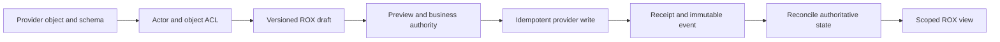

# Lark Suite: бизнес‑экосистема и предлагаемая интеграция с ROX

Дата доступа к первичным источникам: **2026-09-30**. Базовая ревизия ROX: `e953786ba7e30fb5da5dca7e88e20e324d5aebab`. [Машиночитаемый каталог из 18 записей](../../plans/lark-suite-reference/business-catalog.json) содержит полные массивы screens/subscreens/actions, forms/inputs/outputs, documented objects, ACL, workflow/automation, availability, unknowns, API candidates, conceptual models и ROX mappings.

## 1. Контракт доказательств

- **DOCUMENTED:** официальный источник с URL и датой доступа; это документация, а не проверка интерфейса, аккаунта, entitlement или execution.
- **SOURCE-VERIFIED:** ограниченное чтение кода ROX указанной ревизии; это не runtime verification.
- **PROPOSED:** проектируемая модель и поверхность ROX; её нельзя приписывать Lark/vendor.
- **NOT_VERIFIED:** отсутствие проверенного источника; оно не доказывает отсутствие возможности.

Источники Help Center местами содержат следы редакций в rich-text данных. Противоречивые старые plan/beta notices сохраняются как неопределённость, а не как текущая лицензия. Lead отдельно ведёт OBSERVED evidence конкретного tenant; эта глава не объявляет собственное live наблюдение. Установки, покупки, выдачи scopes, отправки и публикации не выполнялись; частные скриншоты клиентов не использовались.

**Conceptual ERD:** objects ниже обозначают бизнес‑понятия и публичный контракт, а relationships — только предлагаемую модель ROX. Они не раскрывают реальные таблицы, колонки, индексы, queues или сервисы проприетарных backend.

## 2. Классификация и разрешение идентичности

| ID | Имя | Класс | Идентичность |
|---|---|---|---|
| LB-HELPDESK | Help Desk | нативная возможность Lark | RESOLVED |
| LB-ATTENDANCE | Attendance | нативная возможность Lark | RESOLVED |
| LB-WORKPLACE | Workplace / app launcher / app administration | нативная возможность Lark | RESOLVED |
| LB-APPROVAL | Approval | нативная возможность Lark | RESOLVED |
| LB-RECRUITMENT | Recruitment | тип/шаблон Approval | PARTIALLY_RESOLVED |
| LB-LEAVE | Leave | тип/шаблон Approval | RESOLVED |
| LB-PURCHASE | Purchase | тип/шаблон Approval | PARTIALLY_RESOLVED |
| LB-OOO | Out-of-office | тип/шаблон Approval | RESOLVED |
| LB-REIMBURSEMENT | Reimbursement | тип/шаблон Approval | RESOLVED_AS_WORKFLOW |
| LB-REPORT | Reports / Report | нативная возможность Lark | PARTIALLY_RESOLVED |
| LB-LINGO | Lingo | нативная возможность Lark | RESOLVED |
| LB-MOMENTS | Moments | нативная возможность Lark | RESOLVED |
| LB-MEEGLE | Meegle | самостоятельная платформа | RESOLVED |
| LB-COZE | Coze | самостоятельная платформа | RESOLVED; `cli_a55f0abaac38500a` |
| LB-TANCA-HR | Tanca HR | стороннее дополнение | RESOLVED_PRODUCT_PARTIAL_LISTING |
| LB-SELEAM | Seleam | стороннее дополнение | RESOLVED_LISTING_ALIAS_RETAINED; `cli_a2fe038a7378d00a` |
| LB-DOCUGENIUS | DocuGenius | стороннее дополнение | RESOLVED; `cli_a4d1b87a54f8d00a` |
| LB-SUBSCRIPTIONS | Subscriptions / Broadcasters / content distribution | нативная возможность Lark | RESOLVED |

**DOCUMENTED, 2026-09-30.** [Lark App Directory — all apps](https://app.larksuite.com/all); [Lark plans and add-ons](https://www.larksuite.com/en_us/plans); [Create an approval](https://www.larksuite.com/hc/en-US/articles/360040243313); [Coze directory listing](https://app.larksuite.com/app/cli_a55f0abaac38500a); [Seleam directory listing](https://app.larksuite.com/app/cli_a2fe038a7378d00a); [DocuGenius directory listing](https://app.larksuite.com/app/cli_a4d1b87a54f8d00a).

Бизнес‑ярлык в launcher не даёт одинаковый продуктовый контракт: Leave/Out-of-office используют Attendance-linked Approval; Recruitment/Purchase/Reimbursement могут иметь tenant-defined формы; Meegle/Coze имеют отдельный runtime; Tanca/Seleam/DocuGenius имеют самостоятельного vendor и условия доступа.

## 3. Общие административные и API‑границы

**DOCUMENTED, 2026-09-30.** App acquisition, Enabled, availability scope, Contacts settings, API scopes/capabilities, update authorization, custom-app release и коммерческий entitlement — отдельные состояния. Blocked имеет приоритет над Allowed. Администраторский scope определяет приложения и людей/отделы; наличие app не делает пользователя approver. [View and configure installed apps](https://www.larksuite.com/hc/en-US/articles/099411074871); [Set approvers for app-related requests](https://www.larksuite.com/hc/en-US/articles/360046527434-set-approvers-for-app-related-requests); [Add administrators and create roles](https://www.larksuite.com/hc/en-US/articles/360043595213-admin-add-administrators-and-create-administrator-roles).

Официальный SDK/MCP method reference содержит Approval, Attendance, Lingo и Help Desk notification families, но его ссылки местами ведут на Feishu. Наличие namespace не доказывает международный Lark entitlement или конкретные scope strings. **PROPOSED:** перед write проверить host, token type, scopes, бизнес‑actor, object ACL и schema/version. [Official Lark OpenAPI MCP method reference](https://github.com/larksuite/lark-openapi-mcp/blob/main/docs/reference/tool-presets/tools-en.md).

## 4. Подробный каталог

### LB-HELPDESK — Help Desk

**Класс:** нативная возможность Lark.

**DOCUMENTED, 2026-09-30.** [Get started with Help Desk](https://www.larksuite.com/hc/en-US/articles/898565852185); [Use Ticket Center](https://www.larksuite.com/hc/en-US/articles/360048487771-use-ticket-center); [Manage FAQs in Help Desk Admin](https://www.larksuite.com/hc/en-US/articles/360048487761-manage-faqs-in-help-desk-admin); [Add and manage agents](https://www.larksuite.com/hc/en-US/articles/360048487762-add-and-manage-agents); [Define ticket assignment rules](https://www.larksuite.com/hc/en-US/articles/854616371754-define-ticket-assignment-rules); [Define custom fields for tickets](https://www.larksuite.com/hc/en-US/articles/360048487770-define-custom-fields-for-help-desk-tickets); [Configure Help Desk pre-inquiry forms](https://www.larksuite.com/hc/en-US/articles/360048488291).

**Назначение и объект:** внутренние/внешние сотрудники обращаются к FAQ‑боту или специалисту; обращение становится ticket. Help Desk отличается от справочного сайта Help Center и таблицы Base с названием «ticket».

**Экраны и действия:** приложение Help Desk → frequently used/all → Create a Help Desk / My Help Desk. В Admin: Settings → Status and Review; FAQs; Agent; Ticket Center → Agent service / Bot service / ticket details / Ticket Board. В Settings: Ticket Fields, Pre-inquiry Form, Ticket Assignment → Skill-based routing / Assignment setting / Fallback setting. FAQ можно создавать, импортировать/экспортировать, удалять/восстанавливать; агента — добавить/изменить/удалить; ticket — создать (beta), открыть чат, закрыть, фильтровать и экспортировать.

**Формы и ввод → результат:** регистрация desk: name, profile photo, availability, description → заявка на review организации. FAQ: question, similar questions, answer, category, effective/expiration times → ответ бота/специалиста. Agent: members, service time zone/hours, skills, ticket permission → профиль доступного специалиста. Ticket fields: single-line text, dropdown или cascader, required-on-close → поля обращения. Pre-inquiry импортирует эти поля; пользователь заполняет его при переходе к человеку. New ticket выбирает skill либо designated agent → ticket и service chat.

**ACL и workflow:** scope availability определяет поиск/использование; owner/admin управляет desk; агент получает свой scope tickets, но bot-service tickets доступны агентам независимо от этого scope. Первое взаимодействие с FAQ/ботом создаёт ticket. Start Chat создаёт группу пользователя и online‑агентов; End Service закрывает обращение и предлагает оценку.

**Автоматизация:** условия skill используют FAQ, bot, user/ticket info и pre-inquiry; назначение — по времени последнего получения ticket или Least Tickets First. Есть очередь и fallback. FAQ ограничен 10 000 items; категории — восемью уровнями, бот показывает до трёх; export — максимум 5 000 последних tickets за операцию. Ряд действий помечен beta. Противоречивые редакционные уведомления о тарифах не доказывают доступ этого tenant.

**API‑граница:** в официальном SDK‑каталоге найдены `helpdesk.v1.notification.*` для draft/preview/review/send/cancel. Это не доказательство ticket/FAQ CRUD. Полный Lark ticket API и scopes в этом срезе не проверены.

**Бизнес‑объекты из документации:** `HelpDesk`, `FAQCategory`, `FAQ`, `Agent`, `Skill`, `Ticket`, `TicketField`, `PreInquiryResponse`, `ServiceChat`.

**PROPOSED conceptual ERD ROX:** `HelpDesk`, `HelpDeskMembership`, `FAQEntry`, `Ticket`, `Assignment`, `TicketFieldValue`, `ServiceConversation`, `TicketEvent`. Связи: HelpDesk 1:N Ticket/FAQEntry/Membership; Ticket 1:N Assignment/FieldValue/Event; Ticket 0..1:1 ServiceConversation. Это не schema vendor.

**Зависимости:** LB-WORKPLACE, LB-APPROVAL. **Опора на ROX:** ROX-LARK-MESSAGING, ROX-KNOWLEDGE-CONTRACT, ROX-PERSONAL-TASKS. **Планируемая поверхность:** Apps > Help Desk; Tickets; Knowledge > FAQ.

### LB-ATTENDANCE — Attendance

**Класс:** нативная возможность Lark.

**DOCUMENTED, 2026-09-30.** [Set up an attendance group](https://www.larksuite.com/hc/en-US/articles/487269142257-admin-set-up-attendance-group); [Receive automatic attendance reports](https://www.larksuite.com/hc/en-US/articles/360048488379-admin-receive-automatic-attendance-report-of-attendance-groups).

**Экраны и действия:** Attendance Admin → Attendance Settings → Group Settings → New / существующая группа → Basic information, Shift, Attendance methods, Attendance settings → Confirm. На mobile: Attendance → Settings → Settings → Group Attendance Report → daily/weekly/monthly, Send at.

**Форма и ввод → результат:** группа задаёт name, owner/sub-owner, time zone, required/optional members, Fixed/Scheduled/Free Shift, GPS/Wi-Fi, правила offsite, leave, out-of-office, overtime и corrections → политику clock-in/out и расчётные результаты. Один сотрудник находится в одной группе; добавление в другую удаляет его из прежней. Time zone и shift type нельзя менять после создания. Computer clock-in поддерживает Wi-Fi.

**ACL и workflow:** primary/admin с Attendance permission управляет настройками; owner изменяет правила/экспортирует/планирует shifts, sub-owner экспортирует/планирует. Одобренные отсутствие и overtime учитываются по group policy. Bot отправляет отчёты управляемых групп; при конфликте time zones применяется описанный документацией fallback GMT+08:00.

**Автоматизация и API:** relocation synchronization включает подходящих новых/переведённых сотрудников; bot формирует scheduled reports. Кандидаты SDK: group/shift read, userDailyShift.query, userFlow.query, userTask.query, userStatsData.query. Read/write и face-information — разные grants. Импорт clock record не доказывает физическое присутствие. Payroll‑формулы и юридическая применимость HR‑политики не установлены.

**Бизнес‑объекты из документации:** `AttendanceGroup`, `Member`, `Shift`, `ClockRecord`, `AttendanceResult`, `Correction`, `ApprovalResult`, `AttendanceReport`.

**PROPOSED conceptual ERD ROX:** `AttendanceGroup`, `MembershipPeriod`, `ShiftDefinition`, `Schedule`, `ClockRecord`, `DailyAttendanceResult`, `AttendanceAdjustment`. Связи: Group 1:N Schedule/MembershipPeriod; Member 1:N ClockRecord/DailyAttendanceResult; Adjustment references approved request and affected period. Это не schema vendor.

**Зависимости:** LB-WORKPLACE, LB-APPROVAL. **Опора на ROX:** ROX-PERSONAL-TASKS, ROX-FEED. **Планируемая поверхность:** People > Attendance; Admin > Attendance policy.

### LB-WORKPLACE — Workplace / app launcher / app administration

**Класс:** нативная возможность Lark.

**DOCUMENTED, 2026-09-30.** [View and configure installed apps](https://www.larksuite.com/hc/en-US/articles/099411074871); [Set approvers for app-related requests](https://www.larksuite.com/hc/en-US/articles/360046527434-set-approvers-for-app-related-requests); [Add administrators and create roles](https://www.larksuite.com/hc/en-US/articles/360043595213-admin-add-administrators-and-create-administrator-roles); [Lark plans and add-ons](https://www.larksuite.com/en_us/plans).

**Экраны и действия:** Workplace запускает доступные пользователю приложения. Lark Admin → Workplace → App Management: поиск name/ID, фильтр payment type/developer/availability, Configure, Update. В configuration: Enabled, App availability → Allowed members / Blocked members, Contacts settings, scopes/capabilities, external sharing. Set Management Rules → Set Approvers задаёт Default/Specify approvers. Settings → Administrator Permissions → Administrator Role задаёт роли и management scope.

**Ввод → результат:** enabled state, отделы/группы/люди в allowed/blocked, contacts scope, авторизация версии → видимость/использование приложения и разрешённая версия. Blocked имеет приоритет. Scope приложения, роль администратора, установочный review и коммерческий entitlement являются разными объектами.

**ACL и workflow:** управление ограничено областью администратора. Specify approver должен управлять всеми apps и applicant scope, иначе используется default fallback. Несколько совпавших approvers получают задачу одновременно; решения одного достаточно. Новый custom-app release требует review, если администратор не включил Automatic approval.

**Границы:** Custom Workplace есть в тарифной матрице, но текст без читаемых отметок не доказывает тариф. External sharing описан как beta. Публичный API изменения launcher/custom Workplace в этом срезе не установлен; private endpoints не реконструировались.

**Бизнес‑объекты из документации:** `Application`, `InstalledVersion`, `AvailabilityRule`, `ScopeGrant`, `AppCapability`, `AppRequest`, `AdministratorRole`.

**PROPOSED conceptual ERD ROX:** `AppRegistration`, `AppInstallation`, `AppVersion`, `AvailabilityPolicy`, `ScopeGrant`, `AppReview`, `RoleAssignment`. Связи: Organization 1:N AppInstallation; Installation references AppVersion and AvailabilityPolicy; ScopeGrant records app/version/actor/time. Это не schema vendor.

**Зависимости:** общие organization/auth/entitlement gates. **Опора на ROX:** ROX-MARKETPLACE, ROX-LARK-MESSAGING. **Планируемая поверхность:** Workplace; Settings > Integrations > Lark apps.

### LB-APPROVAL — Approval

**Класс:** нативная возможность Lark.

**DOCUMENTED, 2026-09-30.** [Get started with managing Approval](https://www.larksuite.com/hc/en-US/articles/953059117412); [Create an approval](https://www.larksuite.com/hc/en-US/articles/360040243313); [Design an approval form](https://www.larksuite.com/hc/en-US/articles/360043705794); [Get started with requesting approval](https://www.larksuite.com/hc/en-US/articles/834786153503-get-started-with-requesting-approval); [Get started with handling approvals](https://www.larksuite.com/hc/en-US/articles/436323747859); [Lark Approval user guide](https://www.larksuite.com/hc/en-US/articles/374839901090-lark-approval-user-guide).

**Общий интерфейс:** Approval → Submit Request выбирает опубликованную организацией форму. Approval Center содержит To-do, Done, Submitted, CC’d и request details. Approval Admin включает Basic Info → Form Design → Process Design → More, Data Management, Recommended Configuration и Permissions Management.

**Конструктор и ввод → результат:** name/group/icon/description/submitter scope; widgets и required/visibility settings; nodes approver/CC/handler/conditional branch; правила modify/recall/delegate/batch/deduplicate/share → published definition. Запрос заполняет определённые этой версией controls → ApprovalInstance и tasks. Нельзя объявить одинаковую схему всех tenant по названию формы. В форме допустима одна Attendance-linked widget group.

**Действия и ACL:** requester, approver, handler и CC имеют разные права. Approve/Reject принимают opinion; Transfer, Add/Remove Approver, Send Back, batch processing, Modify/Recall/Revoke, comments/group chat/CC/share/print зависят от политики администратора. Handwritten signature не доказывает юридический статус e-signature. App admin покрывает все настройки, sub-admin — заданный scope, process admin — определённый approval.

**События и автоматизация:** submit → instance/task → bot notification → decision/handler/следующий node → Done. Deduplication может пропустить повторные steps по правилам; сообщения можно агрегировать. Data Management поддерживает синхронизацию approval data с Base. Agent permission prompt ROX не является правом принять организационное business‑решение.

**API:** семейство `approval.v4` содержит definition get/create/subscribe, instance create/get/query/preview/cancel, task approve/reject/transfer, comment и external approval sync. Native approval и внешний процесс имеют разного владельца состояния. До write нужны реальная schema/version, actor/object ACL, token type, scopes и проверенный Lark host.

**Бизнес‑объекты из документации:** `ApprovalDefinition`, `FormControl`, `ProcessNode`, `ApprovalInstance`, `ApprovalTask`, `CC`, `Comment`, `Handler`.

**PROPOSED conceptual ERD ROX:** `ApprovalDefinitionVersion`, `FormSchema`, `WorkflowNode`, `ApprovalRequest`, `ApprovalTask`, `Decision`, `Comment`, `BusinessAuditEvent`. Связи: DefinitionVersion 1:N Request; Request 1:N Task/Decision/Comment/Event; Decision references task, actor, observed version and idempotency key. Это не schema vendor.

**Зависимости:** LB-WORKPLACE. **Опора на ROX:** ROX-WORKFLOW-CANVAS, ROX-LARK-MESSAGING, ROX-PERSONAL-TASKS. **Планируемая поверхность:** Approvals > Inbox / My requests / Definitions.

### LB-RECRUITMENT — Recruitment

**Класс:** тип/шаблон Approval.

**DOCUMENTED, 2026-09-30.** [Smart recruitment integration solution](https://open.larksuite.com/solutions/detail/hire); [Lark App Directory — all apps](https://app.larksuite.com/all); [Create an approval](https://www.larksuite.com/hc/en-US/articles/360040243313); [Design an approval form](https://www.larksuite.com/hc/en-US/articles/360043705794).

**Идентичность:** карточка с таким названием может вести к recruitment/offer Approval; каталог также содержит Base Recruitment Management System / Hiring Progress Tracker. Meegle имеет recruitment templates; внешняя ATS — ещё одна отдельная система. Exact tenant variant устанавливается по наблюдаемому app/form, а не по общему слову.

**Документированный процесс:** официальная Lark solution связывает внешнюю recruitment system, сообщения/CV, календарь интервью, offer Approval и onboarding. HR создаёт Approval definition и сохраняет Approval Code. В Approval доступны общий wizard и Submit Request / Submitted / details; отдельная встроенная международная ATS этим источником не доказана.

**Ввод → результат:** HR‑defined controls → offer approval instance; external candidate/CV, interviewers, availability, event IDs/participants → сообщения и интервью в Calendar. При создании календарного события от app необходимо добавить participants, чтобы оно стало доступно на их календарях.

**ACL/API/зависимости:** custom app с bot capability и отдельно выданными contacts/email/employee ID/messages/calendar permissions, event subscriptions и Approval definition. Кандидатные approval методы требуют schema discovery. `hire.v1` из shared SDK/Feishu reference не доказывает Feishu Hire entitlement в international Lark. Candidate privacy, retention и offer authority — самостоятельные доменные условия.

**Бизнес‑объекты из документации:** `ExternalCandidate`, `InterviewCalendarEvent`, `RecruitmentSystem`, `ApprovalDefinition`, `OfferApproval`.

**PROPOSED conceptual ERD ROX:** `RecruitmentRequest`, `Position`, `CandidateReference`, `Interview`, `OfferApprovalReference`. Связи: Position 1:N CandidateReference/RecruitmentRequest; CandidateReference 1:N Interview; OfferApprovalReference points to authoritative approval instance. Это не schema vendor.

**Зависимости:** LB-APPROVAL, LB-WORKPLACE. **Опора на ROX:** ROX-PERSONAL-TASKS, ROX-LARK-MESSAGING, ROX-SESSION-COLLECTIONS. **Планируемая поверхность:** People > Recruitment; Approvals > Recruitment.

### LB-LEAVE — Leave

**Класс:** тип/шаблон Approval.

**DOCUMENTED, 2026-09-30.** [Submit, modify, and withdraw leave requests](https://www.larksuite.com/hc/en-US/articles/686317295813-submit-modify-and-withdraw-leave-requests); [Design an approval form](https://www.larksuite.com/hc/en-US/articles/360043705794); [Set up an attendance group](https://www.larksuite.com/hc/en-US/articles/487269142257-admin-set-up-attendance-group).

**Экраны и действия:** mobile Workplace → Attendance → Requests → Leave → Submit; Requests → Request records → Submitted → Modify или More → Recall/Revoke. Альтернативный вход — Approval → Submit Request.

**Форма и ввод → результат:** eligible leave type, Start time, End time, Reason for leave; approver, если выбор разрешён → автоматически рассчитанная duration и запрос Approval. Доступные типы задаются Attendance admin и applicable member scope. Изменение вступает в силу после renewed approval.

**ACL/ограничения:** Approval admin управляет modification/revoke policy. У отправленного запроса нельзя изменить leave type; Under Review нельзя modify; documented flow допускает изменение один раз. Annual balance, accrual, carryover и продолжительность зависят от реальной политики tenant.

**Автоматизация/API:** Attendance widget group связывает одобренное отсутствие с Attendance; Base leave-template — другая система записей. SDK-кандидаты: userApproval.query и approval instance; leaveAccrualRecord.patch относится к балансу и требует отдельного write grant. ROX не должен пересчитывать balance из личных задач.

**Бизнес‑объекты из документации:** `LeaveType`, `LeaveRule`, `LeaveBalance`, `LeaveRequest`, `ApprovalInstance`.

**PROPOSED conceptual ERD ROX:** `LeaveType`, `LeavePolicyVersion`, `BalanceLedgerEntry`, `LeaveRequest`, `ApprovalReference`. Связи: Member 1:N BalanceLedgerEntry/LeaveRequest; LeaveRequest links policy version and authoritative ApprovalReference. Это не schema vendor.

**Зависимости:** LB-ATTENDANCE, LB-APPROVAL. **Опора на ROX:** ROX-PERSONAL-TASKS, ROX-LARK-MESSAGING. **Планируемая поверхность:** People > Leave; Approvals > Leave.

### LB-PURCHASE — Purchase

**Класс:** тип/шаблон Approval.

**DOCUMENTED, 2026-09-30.** [Lark approval templates for HR and finance](https://www.larksuite.com/en_us/blog/power-automate-approvals); [Lark App Directory — all apps](https://app.larksuite.com/all); [Create an approval](https://www.larksuite.com/hc/en-US/articles/360040243313); [Design an approval form](https://www.larksuite.com/hc/en-US/articles/360043705794).

**Идентичность и экраны:** тип/шаблон согласования закупки использует Approval → Submit Request / Submitted / details и общий Admin wizard. Наличие procurement Base templates или карточки Purchase не доказывает полноценную purchase-order/receiving/payment систему. Exact preset title и schema конкретного tenant требуют чтения definition.

**Ввод → результат:** administrator-defined widgets и required values → approval instance/decision history. Не подтверждены универсальные поля supplier, quantities, tax, budget или settlement. Роли requester/approver/finance/handler и branch rules следуют опубликованной definition. Approval не даёт доступ к supplier master/inventory.

**PROPOSED форма ROX:** requester, purpose, cost centre, supplier, line description, quantity, unit price, currency, attachments. Это проектные поля, не утверждение о Lark UI. Request, order, receiving и payment остаются отдельными состояниями.

**Автоматизация/API:** доступен generic Approval process/routing; contract generation — отдельный Base/extension workflow. Возможен generic approval API после schema discovery. Purchase-specific native API в этом срезе не подтверждён.

**Бизнес‑объекты из документации:** `ApprovalDefinition`, `ApprovalInstance`, `FormValues`.

**PROPOSED conceptual ERD ROX:** `PurchaseRequest`, `PurchaseLine`, `SupplierReference`, `BudgetReference`, `ApprovalReference`. Связи: PurchaseRequest 1:N PurchaseLine; PurchaseRequest references supplier/budget and approval; Order/receiving/payment remain separate downstream records. Это не schema vendor.

**Зависимости:** LB-APPROVAL. **Опора на ROX:** ROX-PERSONAL-TASKS, ROX-WORKFLOW-CANVAS. **Планируемая поверхность:** Approvals > Purchase; Procurement > Requests.

### LB-OOO — Out-of-office

**Класс:** тип/шаблон Approval.

**DOCUMENTED, 2026-09-30.** [Set up an attendance group](https://www.larksuite.com/hc/en-US/articles/487269142257-admin-set-up-attendance-group); [Create an approval](https://www.larksuite.com/hc/en-US/articles/360040243313); [Design an approval form](https://www.larksuite.com/hc/en-US/articles/360043705794).

**Идентичность:** Attendance-linked Out-of-office согласование. Оно отличается от Calendar availability, Do Not Disturb и email auto-reply.

**Экраны и ввод → результат:** Approval Submit Request / Submitted / details; Attendance policy регулируется Group Settings. Attendance-linked widget group использует controls опубликованной формы → ApprovalResult и policy-dependent AttendanceEffect. Exact control IDs и обязательные start/end/reason для tenant не установлены документацией этого среза.

**Правила и ACL:** admin может требовать clocking на shift boundaries, при уходе/возвращении либо исключить clock-in/out. Одобренное отсутствие само по себе не включает почтовый автоответ и не создаёт calendar event. Attendance и Approval roles/grants различаются.

**API/модель:** userApproval.query читает результаты; approvalInfo.process меняет attendance-related state и требует собственного grant. Для ROX предлагается отдельный TimeInterval и AttendanceEffect, без смешения с presence status.

**Бизнес‑объекты из документации:** `OutOfOfficeRequest`, `ApprovalResult`, `AttendanceRule`.

**PROPOSED conceptual ERD ROX:** `OutOfOfficeRequest`, `TimeInterval`, `ApprovalReference`, `AttendanceEffect`. Связи: Request 1:N TimeInterval; Approved Request produces policy-dependent AttendanceEffect. Это не schema vendor.

**Зависимости:** LB-APPROVAL, LB-ATTENDANCE. **Опора на ROX:** ROX-PERSONAL-TASKS, ROX-LARK-MESSAGING. **Планируемая поверхность:** People > Availability; Approvals > Out-of-office.

### LB-REIMBURSEMENT — Reimbursement

**Класс:** тип/шаблон Approval.

**DOCUMENTED, 2026-09-30.** [Get started with requesting approval](https://www.larksuite.com/hc/en-US/articles/834786153503-get-started-with-requesting-approval); [Lark approval templates for HR and finance](https://www.larksuite.com/en_us/blog/power-automate-approvals); [Create an approval](https://www.larksuite.com/hc/en-US/articles/360040243313); [Design an approval form](https://www.larksuite.com/hc/en-US/articles/360043705794).

**Идентичность:** документация подтверждает reimbursement как use case Approval и пример preset. Exact required fields, controls/currency/attachments являются настройками организации.

**Экраны и ввод → результат:** общий Approval Submit Request → request detail / Submitted; wizard управляет формой/process. Документирован пример conditional widget visibility для travel/transport reimbursement type → ApprovalInstance и finance/handler decision. Это не доказательство payment completion.

**ACL и события:** submit → assigned approver → decision/handler. Receipt/expense access следует scope request/attachments; оно не становится видимым всей организации из-за карточки в Feed. Approved и settled — разные состояния.

**PROPOSED форма ROX:** expense date/category, amount/currency, purpose/cost centre, receipt, payee reference. OCR, fraud detection, tax compliance, bank payment и accounting export не объявляются документированными native capabilities. Generic approval API возможен после чтения схемы; отдельный finance/payment API не установлен.

**Бизнес‑объекты из документации:** `ApprovalDefinition`, `ReimbursementFormValues`, `ApprovalInstance`.

**PROPOSED conceptual ERD ROX:** `ExpenseClaim`, `ExpenseLine`, `ReceiptReference`, `ApprovalReference`, `SettlementReference`. Связи: ExpenseClaim 1:N ExpenseLine/ReceiptReference; ApprovalReference 0..1:1 SettlementReference; statuses remain distinct. Это не schema vendor.

**Зависимости:** LB-APPROVAL. **Опора на ROX:** ROX-PERSONAL-TASKS, ROX-LARK-MESSAGING. **Планируемая поверхность:** Finance > Reimbursements; Approvals > Expenses.

### LB-REPORT — Reports / Report

**Класс:** нативная возможность Lark.

**DOCUMENTED, 2026-09-30.** [Lark App Directory — all apps](https://app.larksuite.com/all); [Receive automatic attendance reports](https://www.larksuite.com/hc/en-US/articles/360048488379-admin-receive-automatic-attendance-report-of-attendance-groups).

**Идентичность:** App Directory перечисляет официальное приложение **Report** от Lark Technologies Pte. Ltd.; запрошенное «Reports» не доказывает второе приложение. Оно отличается от Attendance bot reports, Base dashboard и текстового report template.

**Документированная поверхность:** listing Report; точный app ID/detail URL, form editor, submissions/recipient controls и recurring automation не установлены в публичных источниках этого среза. Их нельзя выдумать из подписи «Efficient, Clear, Fast». Состояние **NOT_VERIFIED** относится к документации; lead может отдельно добавить наблюдения tenant с меткой OBSERVED.

**Отдельный подтверждённый процесс:** Attendance → Group Attendance Report принимает daily/weekly/monthly schedule и Send at → bot report управляемой группы. Эти права/объекты нельзя автоматически перенести в самостоятельный Report.

**PROPOSED для ROX:** ReportTemplate → ReportSubmission, ReportingPeriod, ReportRecipient, Delivery; отдельный Reports surface. Публичный API standalone Report не подтверждён; до внедрения нужно зафиксировать точную identity/UI/ACL.

**Бизнес‑объекты из документации:** `Report app listing`, `AttendanceReport (separate feature)`.

**PROPOSED conceptual ERD ROX:** `ReportTemplate`, `ReportSubmission`, `ReportingPeriod`, `ReportRecipient`, `ReportDelivery`. Связи: PROPOSED only: Template 1:N Submission; period and recipient scope explicit. Это не schema vendor.

**Зависимости:** LB-WORKPLACE. **Опора на ROX:** ROX-FEED, ROX-PERSONAL-TASKS. **Планируемая поверхность:** Reports > Templates / Submissions / Delivery.

### LB-LINGO — Lingo

**Класс:** нативная возможность Lark.

**DOCUMENTED, 2026-09-30.** [Introducing the Lingo admin console](https://www.larksuite.com/hc/en-US/articles/898002276094); [View and manage all Lingo entries](https://www.larksuite.com/hc/en-US/articles/193515294468-view-and-manage-all-lingo-entries); [Create and import Lingo entries](https://www.larksuite.com/hc/en-US/articles/826167966155); [Co-create Lingo entries](https://www.larksuite.com/hc/en-US/articles/312545949275-co-create-lingo-entries); [Lark plans and add-ons](https://www.larksuite.com/en_us/plans).

**Экраны и действия:** Lingo home → Entry Collaboration → To create / To update, request/contribute/delete own request, campaign page. Admin → Manage Entries → All Entries / Batch Import / Import history / failed entries; категории, review mode, units, campaigns и usage analytics.

**Форма и ввод → результат:** required Entry name и Description; categories, Alias, description images, organization-owned Docs, related links/help desk/persons, visible scope, contributor → Entry/Definition, review request либо import result. Дубликаты и invalid fields попадают в resolution/failed-table flow.

**ACL/события:** contributor предлагает entry/изменение → optional manual review → публикация. Requester удаляет только собственную заявку. Review-exempt и reviewed contribution — разные пути. Display/highlight scope chats/Docs/search не даёт доступ к исходному Docs. Units управляются отдельно.

**Автоматизация и entitlement:** contextual term discovery, Base collection-table import, review и multilingual definitions. Тарифная матрица на дату доступа указывает custom entries: Starter/Basic 50, Pro 50 000, Enterprise 1 000 000; перед rollout требуется актуальная проверка. Admin работает desktop/web.

**API:** repo/classification list; entity get/list/search/match/highlight; draft create/update и review-exempt entity create/update/delete. Наличие endpoint не разрешает обход manual review. Алгоритм matching и private storage не реконструируются.

**Бизнес‑объекты из документации:** `Entry`, `Alias`, `Definition`, `Category`, `Unit`, `Contribution`, `Review`, `ImportBatch`.

**PROPOSED conceptual ERD ROX:** `GlossaryRepo`, `GlossaryEntry`, `Alias`, `DefinitionVersion`, `Category`, `Contribution`, `ReviewDecision`. Связи: Repo/Unit 1:N Entry; Entry 1:N Alias/DefinitionVersion; Contribution references author and reviewed definition version. Это не schema vendor.

**Зависимости:** LB-WORKPLACE. **Опора на ROX:** ROX-KNOWLEDGE-CONTRACT, ROX-FEED. **Планируемая поверхность:** Knowledge > Glossary; term popover in Chat/Docs/Search.

### LB-MOMENTS — Moments

**Класс:** нативная возможность Lark.

**DOCUMENTED, 2026-09-30.** [Use an official account in Moments](https://www.larksuite.com/hc/en-US/articles/158141930830); [Lark plans and add-ons](https://www.larksuite.com/en_us/plans); [Add administrators and create roles](https://www.larksuite.com/hc/en-US/articles/360043595213-admin-add-administrators-and-create-administrator-roles).

**Экраны и действия:** Moments home/category → ввод content → Post / + Create Moment; account identity переключается через profile photo. Admin → Product Settings → Moments → Moments Management → Official Account Settings → Create/Edit/Activate/Deactivate.

**Формы и ввод → результат:** account name, profile photo, account administrators, optional English/Chinese/Japanese names → official posting identity; content от этой identity → пост с Official tag.

**ACL и события:** primary/admin с Moments permission создаёт account; account administrators могут переключаться в официальное лицо. Deactivate запрещает переключение, но сохраняет прежние posts/interactions. Person и official organization identity — разные actor contexts.

**Границы:** документированный official-account flow требует enabled feature и client >=5.32. Точная entitlement, category moderation, pinning, voting/reporting/export, automation/event stream и международный Moments API в этом срезе не установлены. Feishu Moments behavior не перенесён автоматически. ROX Feed source подтверждает поверхность, а не готовый organization social backend.

**Бизнес‑объекты из документации:** `OfficialAccount`, `AccountAdministrator`, `Moment`, `Interaction`.

**PROPOSED conceptual ERD ROX:** `FeedPost`, `PostingIdentity`, `OfficialAccount`, `Reaction`, `Comment`, `ModerationEvent`. Связи: Identity 1:N FeedPost; Post 1:N Reaction/Comment; Deactivate identity preserves authored posts. Это не schema vendor.

**Зависимости:** LB-WORKPLACE. **Опора на ROX:** ROX-FEED. **Планируемая поверхность:** Feed > Team / Moments; Admin > Official identities.

### LB-MEEGLE — Meegle

**Класс:** самостоятельная платформа.

**DOCUMENTED, 2026-09-30.** [Meegle feature overview](https://www.meegle.com/); [Meegle visual workflows](https://www.meegle.com/en_us/meegle_features/workflow); [Meegle pricing and feature matrix](https://www.meegle.com/en_us/pricing); [Official Meegle CLI reference](https://github.com/larksuite/meegle-cli/blob/main/README.md); [Lark plans and add-ons](https://www.larksuite.com/en_us/plans).

**Идентичность:** самостоятельная платформа управления проектами и Lark add-on; Lark Project/Feishu Project — связанные продукты, но host/auth/entitlement заданы явно.

**Документированные поверхности/операции:** workspace/space; custom work-item type/fields/workflow; work-item details/comments/attachments/subtasks; node/state transition, rollback/reopen; Table/Tree/Kanban/Gantt, dashboards/charts, schedule/panorama и My Work. Это documented capabilities, не наблюдение текущего аккаунта.

**Ввод → результат:** project/space, work-item type, configured fields/roles/relations → work item; permitted transition и required fields → новое state/operation record. План поддерживает user groups/roles/teams; конкретные per-space/object/field ACL требуют metadata/admin проверки.

**Автоматизация/доступ:** node-driven workflow, automation rules, dependency scheduling, cross-space association зависят от конфигурации и плана. Free/Standard/Premium/Enterprise и Lark Meegle Premium add-on — отдельные entitlements.

**API/CLI:** официальный Meegle CLI предоставляет structured output, dry-run, host-specific auth/device code и команды workitem get/query/meta-fields/meta-roles, workflow transitions/required fields, comments, views, My Work. Ничего не устанавливалось и auth не выполнялась. ROX session canvas явно simulate-only и не заменяет Meegle execution; provider work item должен иметь отдельный ID и authoritative state.

**Бизнес‑объекты из документации:** `Space`, `WorkItemType`, `WorkItem`, `Field`, `Node`, `State`, `Role`, `Team`, `View`, `Chart`, `Schedule`, `Relation`, `Deliverable`.

**PROPOSED conceptual ERD ROX:** `ExternalProjectSpace`, `ExternalWorkItem`, `WorkflowSnapshot`, `RoleBinding`, `WorkItemRelation`, `ExternalChangeCursor`. Связи: Space 1:N WorkItem/Type/RoleBinding; WorkItem 1:N WorkflowSnapshot; Relation joins provider IDs. Это не schema vendor.

**Зависимости:** LB-WORKPLACE. **Опора на ROX:** ROX-PERSONAL-TASKS, ROX-SESSION-COLLECTIONS, ROX-WORKFLOW-CANVAS. **Планируемая поверхность:** Projects > Meegle; Tasks > external work items; Map > workflow reference.

### LB-COZE — Coze

**Класс:** самостоятельная платформа.

**DOCUMENTED, 2026-09-30.** [Coze directory listing](https://app.larksuite.com/app/cli_a55f0abaac38500a); [Publish a Coze agent to Lark](https://www.coze.com/open/docs/guides/lark); [Use a Coze workflow](https://www.coze.com/open/docs/guides/use_workflow); [Publish agent API](https://www.coze.com/open/docs/developer_guides/publish_bot).

**Идентичность:** внешний agent/bot builder с Lark publication channel; listing app ID `cli_a55f0abaac38500a`, developer Lark Technologies Pte. Ltd.

**Экраны и действия:** Coze Develop → agent → Publish → Lark → Authorize; первый запуск требует install Coze, выбора permitted team members и Authorize and Install. После channel authorization выбирают Lark и Publish; затем Lark Admin выпускает созданное agent application. Workflow создаётся workspace → Library → + Resource → Workflow.

**Ввод → результат:** agent models/tools/plugins/knowledge/database/workflow и channel authorization → опубликованная provider version + Lark release request. Пользователь может искать/chat agent после публикации в Lark Admin. Agent Store publication — отдельный optional выбор.

**ACL/API:** Coze workspace/token rights и Lark app availability/release независимы. `POST https://api.coze.com/v1/bot/publish` требует bot_id и publish capability, возвращает version; API/Web SDK/custom-channel publish не доказывает unattended Lark admin release. Listing Free не устанавливает runtime/model quotas.

**ROX‑граница:** внешний provider, его runs/version/channel/knowledge и data egress должны быть явными. Lark bot transport не является Coze runtime и не даёт Coze доступ ко всем приватным ROX tools/notes.

**Бизнес‑объекты из документации:** `CozeWorkspace`, `Agent`, `Workflow`, `Plugin`, `KnowledgeBase`, `Database`, `ChannelAuthorization`, `PublishedAgentVersion`, `LarkApplication`.

**PROPOSED conceptual ERD ROX:** `ExternalAgent`, `AgentVersion`, `ProviderWorkspace`, `ChannelBinding`, `WorkflowReference`, `KnowledgeBinding`, `RunReference`. Связи: Agent 1:N Version; Version 1:N ChannelBinding; RunReference records provider/external ID and data boundary. Это не schema vendor.

**Зависимости:** LB-WORKPLACE. **Опора на ROX:** ROX-LARK-MESSAGING, ROX-WORKFLOW-CANVAS, ROX-MARKETPLACE. **Планируемая поверхность:** Sources > Coze; Agents > external provider; Integrations > Lark deployment.

### LB-TANCA-HR — Tanca HR

**Класс:** стороннее дополнение.

**DOCUMENTED, 2026-09-30.** [Lark App Directory — all apps](https://app.larksuite.com/all); [Tanca enterprise product overview](https://tanca.io/en/enterprise); [Tanca product tour](https://www.tanca.io/en/product-tour).

**Идентичность:** официальный App Directory содержит Tanca HR; vendor — Tanca, `https://tanca.io/`. Exact Lark app ID и legal developer metadata не извлечены; это частично разрешённая listing identity, а не неизвестный HR‑продукт.

**Документированные области vendor:** People Directory, Attendance, Smart Scheduling, Payroll, E-Office & Approvals, OKR/KPI, News Feed, Information Hub, Survey, recruitment/onboarding. Перечень является vendor capability, не точной навигацией установленного Lark app.

**Ввод → результат:** employees/org profiles, schedules/clock data, requests, payroll/performance → vendor HR records; точные Lark sync directions/events не подтверждены. Tour описывает candidate-to-employee flow, department-based role access и onboarding. AI/payroll/automatic scheduling — документированные заявления vendor, без live проверки.

**Gates/неизвестное:** app acquisition, vendor account/subscription и connector scope отдельны. Требуются exact app ID, SSO/provisioning contract, API/webhook, data region/retention и payroll localization. Bitrix24 scopes не являются Lark scopes. Для ROX сначала federated link/read-only summaries; payroll и biometrics сохраняют authoritative HR ownership.

**Бизнес‑объекты из документации:** `EmployeeProfile`, `Schedule`, `Attendance`, `LeaveRequest`, `Payroll`, `Performance`, `Candidate`, `Onboarding`.

**PROPOSED conceptual ERD ROX:** `ExternalHRTenant`, `ExternalEmployee`, `EmployeeMapping`, `HRSyncCursor`, `PayrollSummaryReference`. Связи: HRTenant 1:N ExternalEmployee; EmployeeMapping joins ROX/Lark/vendor IDs; payroll remains vendor-owned. Это не schema vendor.

**Зависимости:** LB-WORKPLACE. **Опора на ROX:** ROX-LARK-MESSAGING, ROX-FEED. **Планируемая поверхность:** People > Tanca (federated); Integrations > HR.

### LB-SELEAM — Seleam

**Класс:** стороннее дополнение.

**DOCUMENTED, 2026-09-30.** [Seleam directory listing](https://app.larksuite.com/app/cli_a2fe038a7378d00a).

**Идентичность подтверждена:** точный directory title **Seleam**, `cli_a2fe038a7378d00a`; описание называет систему **Yidea EAM**. Developer: **BEIJING YIDEAMOBILE SCIENCE TECHNOLOGY CO LTD**. Оба имени сохранены, исправление spelling и эквивалентность отдельного продукта не выдумываются.

**Документированные действия:** assets check-in/out, borrow/return, modify, maintenance/repair, transfer/disposal; equipment inspection/workflow; inventory stock-in/out/transfer/distribute/counting; purchase requirement/requisition/orders/receiving/payment/supplier; depreciation по asset category и apportionment departments. Exact screen paths/form schema в listing не раскрыты.

**Ввод → результат и ACL:** asset/equipment/goods, purchase/supplier data, assignment/repair/handover → vendor lifecycle records. Через Lark employee self-service пользователь видит/проверяет активы на своё имя и подаёт repair/apply/handover. Admin ACL и scopes неизвестны.

**Entitlement/API:** listing labels Free и предлагает contact vendor for paid version; install и paid feature gate разделены. Публичный Seleam/Yidea Lark API, формулы depreciation, event names и private storage не установлены. Для ROX — app identity/deep link сначала; asset custody/inventory ledger требуют отдельной модели транзакций.

**Бизнес‑объекты из документации:** `Asset`, `Equipment`, `InventoryGoods`, `PurchaseRequirement`, `Requisition`, `Order`, `Supplier`, `Department`, `EmployeeAsset`.

**PROPOSED conceptual ERD ROX:** `Asset`, `AssetAssignment`, `AssetMovement`, `MaintenanceRequest`, `InventoryMovement`, `ProcurementReference`. Связи: Asset 1:N Assignment/Movement/MaintenanceRequest; InventoryMovement records item, quantity, location and actor. Это не schema vendor.

**Зависимости:** LB-WORKPLACE. **Опора на ROX:** ROX-PERSONAL-TASKS, ROX-SESSION-COLLECTIONS. **Планируемая поверхность:** Operations > Assets; Apps > Seleam.

### LB-DOCUGENIUS — DocuGenius

**Класс:** стороннее дополнение.

**DOCUMENTED, 2026-09-30.** [DocuGenius directory listing](https://app.larksuite.com/app/cli_a4d1b87a54f8d00a); [Automatically typeset and print with DocuGenius](https://www.larksuite.com/hc/en-US/articles/027033038241).

**Идентичность подтверждена:** `cli_a4d1b87a54f8d00a`, developer **点火（杭州）软件有限公司**. Это Base document-template/print/PDF extension, не произвольный одноимённый AI tool.

**Экраны и действия:** Base record → Expand details → DocuGenius → policies → Add Extension; Create new layout или template → Edit → drag components → Exit → Print. Automations → Add Workflow → trigger → Generate PDF (beta) → DocuGenius Template → Update record → Save and Enable.

**Ввод → результат:** Base fields, template/layout, text/table/image/QR/barcode/line components → print-ready document. Trigger record + template + attachment field → PDF, сохранённый в выбранное поле. Word/Excel template formats описаны в listing.

**ACL/доступ:** organization admin получает app и добавляет пользователя в availability; extension policies подтверждаются отдельно. Source record/attachment permissions сохраняются. Directory Free относится к acquisition, а Help Center сообщает separate payment для функции; beta PDF generation и оплаченная лицензия — самостоятельные gates.

**API‑граница:** подтверждён no-code action, не public REST generation API. Для ROX нужны template version, authorized snapshot, job/artifact lineage и output ACL; нельзя считать license согласием на export всех Base fields.

**Бизнес‑объекты из документации:** `BaseRecord`, `PrintTemplate`, `FieldBinding`, `GeneratedPDF`, `AttachmentField`, `AutomationRun`.

**PROPOSED conceptual ERD ROX:** `DocumentTemplateVersion`, `FieldBinding`, `DocumentGenerationJob`, `GeneratedArtifact`, `ProviderEntitlement`. Связи: TemplateVersion 1:N GenerationJob; Job references authorized record snapshot and generated artifact. Это не schema vendor.

**Зависимости:** LB-WORKPLACE. **Опора на ROX:** ROX-WORKFLOW-CANVAS, ROX-MARKETPLACE, ROX-KNOWLEDGE-CONTRACT. **Планируемая поверхность:** Documents > Templates / Generated artifacts; Workflow > Generate document.

### LB-SUBSCRIPTIONS — Subscriptions / Broadcasters / content distribution

**Класс:** нативная возможность Lark.

**DOCUMENTED, 2026-09-30.** [Use Subscriptions](https://www.larksuite.com/hc/en-US/articles/360048487858); [Create and edit Subscriptions content](https://www.larksuite.com/hc/en-US/articles/360048488494); [Send Subscriptions content to groups](https://www.larksuite.com/hc/en-US/articles/775328088919); [Post a Docs document to Subscriptions](https://www.larksuite.com/hc/en-US/articles/197625770369); [View Subscriptions app statistics](https://www.larksuite.com/hc/en-US/articles/360048488488).

**Идентичность:** официальный Lark content distribution app. Broadcasters push отображается в Messenger list; Subscriptions content собирается в приложении. Это отличается от платной SaaS subscription и ROX X timeline.

**Экраны:** Subscriptions → Admin → Account/App Administrator; account: Create new, Manage articles → Unsent/Sent, Manage comments, Manage user, Custom menu, Account settings, Statistics; app: App settings, Manage accounts, Complaint management, Statistics. Docs → Share → Share via → Subscriptions позволяет публиковать link document без второй копии.

**Форма и ввод → результат:** Text and graphic / Message / Docs or external link / Video; title/author/body/cover, language, comments/sharing/external link, recipients/shielded users, schedule → draft/review/send and delivery details. Doc authorisation требует edit permission. Preview действует 24h и видим subscribers.

**ACL/workflow:** account admin управляет своим account, app admin — accounts команды и review; subscriber follows/reads/interacts. Account creation/changes и content могут требовать approval. Для Lark groups account admin должен входить в visibility scope и иметь use permission в Subscriptions. После approval recipients/shielded users неизменяемы без edit/reapproval.

**Автоматизация:** scheduled send, subscriber/user/dynamic-group targeting, language selection, Docs link publishing; aggregate statistics обновляются ночью. Public article/send API не подтверждён. IM bot send не равно Subscriptions с его audience/approval controls; read-only ingestion и outbound publication ROX — отдельные операции.

**Бизнес‑объекты из документации:** `SubscriptionAccount`, `BroadcasterAccount`, `AccountAdministrator`, `Article`, `ContentVersion`, `Subscriber`, `UserGroup`, `Delivery`, `Complaint`, `Statistics`.

**PROPOSED conceptual ERD ROX:** `PublisherAccount`, `PublicationVersion`, `AudienceRule`, `Subscription`, `DistributionJob`, `DeliveryReceipt`, `ModeratedComment`, `Complaint`. Связи: Account 1:N Publication/Subscription; DistributionJob binds immutable publication version and audience snapshot; Delivery receipt records observed outcome rather than inferred read state. Это не schema vendor.

**Зависимости:** LB-WORKPLACE, LB-APPROVAL. **Опора на ROX:** ROX-FEED, ROX-KNOWLEDGE-CONTRACT, ROX-PERSONAL-TASKS. **Планируемая поверхность:** Feed > Publications; Content > Channels / Audiences / Delivery.

## 5. ROX: существующий код, пробелы и условия внедрения

**SOURCE-VERIFIED** только для базовой ревизии, без запуска и claims production‑готовности:

- **ROX-LARK-MESSAGING:** LarkAdapter: раздельные Lark/Feishu domains, SDK WebSocket, сообщения/cards и attachments. Это transport, не business app suite. [packages/messaging-gateway/src/adapters/lark/index.ts](../../packages/messaging-gateway/src/adapters/lark/index.ts), [packages/messaging-gateway/src/adapters/lark/card.ts](../../packages/messaging-gateway/src/adapters/lark/card.ts).
- **ROX-WORKFLOW-CANVAS:** SessionWorkflowSpec: versions/nodes/ports/edges/status/artifacts. Код явно помечает in-process canvas runner как simulate-only; live требует server adapter. [packages/shared/src/workflows/types.ts](../../packages/shared/src/workflows/types.ts).
- **ROX-SESSION-COLLECTIONS:** Контракты list/board/table/heatmap, grouping/filter/properties для sessions. Это не arbitrary business-record database. [packages/shared/src/sessions/collection-types.ts](../../packages/shared/src/sessions/collection-types.ts).
- **ROX-PERSONAL-TASKS:** PersonalTask: dates/reminder/recurrence/checklist/project/area/source links/audit. Здесь не доказаны HR/finance/shared approval semantics. [packages/core/src/tasks/personal/types.ts](../../packages/core/src/tasks/personal/types.ts).
- **ROX-FEED:** FeedPage: agent/team activity, RSS/Atom/page diff и X subscriptions, annotations, links to Tasks/Notes. Это не доказательство Moments/Subscriptions backend. [apps/electron/src/renderer/pages/FeedPage.tsx](../../apps/electron/src/renderer/pages/FeedPage.tsx).
- **ROX-MARKETPLACE:** Marketplace: skillpacks/tools/context-doc; Service — фильтр tags. Это не Lark App Directory install/tenant authorization client. [apps/electron/src/renderer/pages/settings/MarketplaceSettingsPage.tsx](../../apps/electron/src/renderer/pages/settings/MarketplaceSettingsPage.tsx).
- **ROX-KNOWLEDGE-CONTRACT:** Knowledge package exports provider/refs/capabilities/mutations/publications. Это основа knowledge interfaces, не Lingo alias/review/highlighting implementation. [packages/core/src/knowledge/index.ts](../../packages/core/src/knowledge/index.ts).

**PROPOSED** доменные пробелы и подход:

| ID | Что требуется | Начальный путь |
|---|---|---|
| LB-HELPDESK | shared ticket lifecycle, requester/agent ACL, skill routing/queue, audit/metrics | Approved links/messages → собственный ticket domain → только затем sync |
| LB-ATTENDANCE | clock-record integrity, shifts/time zones, HR ACL, correction audit | Read reports с provenance; physical clocking остаётся отдельным источником |
| LB-WORKPLACE | business-app manifest, install/version/scope/entitlement receipts | Явные artifact kinds вместо смешения с skillpacks |
| LB-APPROVAL | durable multi-actor workflow, authority, immutable forms, replay control | Read/preview/draft; authoritative state re-read перед permitted decision |
| LB-RECRUITMENT | actual ATS identity, candidate privacy/retention, offer authority | Provider/Approval refs; session board не становится HR register |
| LB-LEAVE | balance ledger, eligibility/duration, absence effects | Read eligible types/balance; provider units/time zone |
| LB-PURCHASE | lines/quantity/currency/tax, supplier/budget authority, receiving/payment | Provider schema mapping; downstream transaction stages отдельно |
| LB-OOO | time-interval validity, absence policy, attendance vs presence | Раздельные effects для attendance/calendar/mail |
| LB-REIMBURSEMENT | claim/receipt model, finance ACL, settlement evidence | Authoritative Approval schema; payout только по finance receipt |
| LB-REPORT | exact app UI/schema/recipient ACL/API identity | Сначала документировать tenant, затем parity contract |
| LB-LINGO | alias/multilingual/review/highlight, unit visibility/quotas | Provider entry IDs; approved definitions; source/freshness в reference |
| LB-MOMENTS | post backend, official identity ACL, moderation/retention | Явные actor и organization; surface не доказывает backend |
| LB-MEEGLE | work-item metadata/transitions/role ACL/pagination/reconciliation | Official connector, projection cache с provenance |
| LB-COZE | provider run contract, knowledge/tool data boundary, channel release | External agent provider; built/published/authorized/released отдельно |
| LB-TANCA-HR | vendor identity/auth/API, HR ACL, payroll localization | Federated link/read-only summaries, vendor authoritative data |
| LB-SELEAM | custody/inventory transactions, vendor contract/API | Stable app ID и self-service deep link; ledger отдельно |
| LB-DOCUGENIUS | versioned deterministic template, job/artifact lineage/output ACL | Source snapshot + template version + authorized generation |
| LB-SUBSCRIPTIONS | publisher identity/audience snapshot, approval/schedule/delivery metrics | Read ingestion отдельно; outbound только после API/authority proof |

## 6. Архитектурные решения

Все пункты **PROPOSED**:

1. Один durable Approval engine и отдельные typed business schemas для leave/purchase/expenses/recruitment. Domain effects и роли остаются самостоятельными.
2. Provider/app identity, installation, version, scope grant, availability и commercial entitlement хранятся раздельно.
3. Meegle, Coze и vendor apps сначала федеративные connectors с provider IDs; перенос записей требует проверенного data contract.
4. Agent allow-all/approval prompt не заменяет business authority, object ACL или finance/publisher permission.
5. Report detail, Tanca listing ID и tenant-defined forms остаются открытыми условиями реализации; documented и observed evidence не сливаются.
6. Every effect получает immutable receipt, idempotency key, actor/version/freshness и reconciliation; retries/events не должны дублировать операции.

## 7. Критерии будущей реализации

- Читать реальную app/form/template version, typed controls и required fields. Неизвестный ID/type отклоняется.
- Проверять Lark host/token kind/least scopes и бизнес‑actor/object ACL; revoked/denied state не производит write.
- Сохранять provider IDs, schema version, currency/unit/time zone, actor, permissions snapshot и freshness.
- Duplicate/reordered notifications/retries не создают повторное согласование, document, publication или ledger effect.
- Reload восстанавливает pending work; provider unavailable/deleted/revoked состояние видно и reconciled.
- Read-only actor не approve/publish/mutate; seeded invalid actor/version/recipient отклоняется.
- HR/candidate/receipt/asset data не попадает в generic Feed/search/cache exports сверх ACL.
- Actual UI/run verification выполняется на нужном tenant/client; screenshot и результат маркируются OBSERVED отдельно.

В этой поставке проверяются полнота 18 записей, JSON references/IDs, source labels/access dates, локальные code paths и отсутствие private backend/live entitlement fiction. Integration implementation и runtime tests в эту исследовательскую задачу не входили.

## 8. Реестр первичных источников

Для всех источников: **DOCUMENTED**, дата доступа **2026-09-30**. Оригинальные названия сохранены. Примечания в JSON фиксируют beta/alias/entitlement и extraction boundaries.

| ID | Официальный источник |
|---|---|
| BS-DIRECTORY | [Lark App Directory — all apps](https://app.larksuite.com/all) |
| BS-PLANS | [Lark plans and add-ons](https://www.larksuite.com/en_us/plans) |
| BS-ADMIN-ROLES | [Add administrators and create roles](https://www.larksuite.com/hc/en-US/articles/360043595213-admin-add-administrators-and-create-administrator-roles) |
| BS-APP-CONFIG | [View and configure installed apps](https://www.larksuite.com/hc/en-US/articles/099411074871) |
| BS-APP-APPROVERS | [Set approvers for app-related requests](https://www.larksuite.com/hc/en-US/articles/360046527434-set-approvers-for-app-related-requests) |
| BS-HD-INTRO | [Get started with Help Desk](https://www.larksuite.com/hc/en-US/articles/898565852185) |
| BS-HD-TICKETS | [Use Ticket Center](https://www.larksuite.com/hc/en-US/articles/360048487771-use-ticket-center) |
| BS-HD-FAQ | [Manage FAQs in Help Desk Admin](https://www.larksuite.com/hc/en-US/articles/360048487761-manage-faqs-in-help-desk-admin) |
| BS-HD-AGENTS | [Add and manage agents](https://www.larksuite.com/hc/en-US/articles/360048487762-add-and-manage-agents) |
| BS-HD-ROUTING | [Define ticket assignment rules](https://www.larksuite.com/hc/en-US/articles/854616371754-define-ticket-assignment-rules) |
| BS-HD-FIELDS | [Define custom fields for tickets](https://www.larksuite.com/hc/en-US/articles/360048487770-define-custom-fields-for-help-desk-tickets) |
| BS-HD-FORM | [Configure Help Desk pre-inquiry forms](https://www.larksuite.com/hc/en-US/articles/360048488291) |
| BS-ATT-GROUP | [Set up an attendance group](https://www.larksuite.com/hc/en-US/articles/487269142257-admin-set-up-attendance-group) |
| BS-ATT-REPORTS | [Receive automatic attendance reports](https://www.larksuite.com/hc/en-US/articles/360048488379-admin-receive-automatic-attendance-report-of-attendance-groups) |
| BS-LEAVE | [Submit, modify, and withdraw leave requests](https://www.larksuite.com/hc/en-US/articles/686317295813-submit-modify-and-withdraw-leave-requests) |
| BS-APPROVAL-INTRO | [Lark Approval user guide](https://www.larksuite.com/hc/en-US/articles/374839901090-lark-approval-user-guide) |
| BS-APPROVAL-ADMIN | [Get started with managing Approval](https://www.larksuite.com/hc/en-US/articles/953059117412) |
| BS-APPROVAL-CREATE | [Create an approval](https://www.larksuite.com/hc/en-US/articles/360040243313) |
| BS-APPROVAL-FORM | [Design an approval form](https://www.larksuite.com/hc/en-US/articles/360043705794) |
| BS-APPROVAL-REQUESTER | [Get started with requesting approval](https://www.larksuite.com/hc/en-US/articles/834786153503-get-started-with-requesting-approval) |
| BS-APPROVAL-HANDLER | [Get started with handling approvals](https://www.larksuite.com/hc/en-US/articles/436323747859) |
| BS-RECRUIT-SOLUTION | [Smart recruitment integration solution](https://open.larksuite.com/solutions/detail/hire) |
| BS-APPROVAL-TEMPLATES | [Lark approval templates for HR and finance](https://www.larksuite.com/en_us/blog/power-automate-approvals) |
| BS-LINGO-ADMIN | [Introducing the Lingo admin console](https://www.larksuite.com/hc/en-US/articles/898002276094) |
| BS-LINGO-MANAGE | [View and manage all Lingo entries](https://www.larksuite.com/hc/en-US/articles/193515294468-view-and-manage-all-lingo-entries) |
| BS-LINGO-IMPORT | [Create and import Lingo entries](https://www.larksuite.com/hc/en-US/articles/826167966155) |
| BS-LINGO-CREATE | [Co-create Lingo entries](https://www.larksuite.com/hc/en-US/articles/312545949275-co-create-lingo-entries) |
| BS-MOMENTS-ACCOUNT | [Use an official account in Moments](https://www.larksuite.com/hc/en-US/articles/158141930830) |
| BS-MEEGLE-HOME | [Meegle feature overview](https://www.meegle.com/) |
| BS-MEEGLE-WORKFLOW | [Meegle visual workflows](https://www.meegle.com/en_us/meegle_features/workflow) |
| BS-MEEGLE-PLANS | [Meegle pricing and feature matrix](https://www.meegle.com/en_us/pricing) |
| BS-MEEGLE-CLI | [Official Meegle CLI reference](https://github.com/larksuite/meegle-cli/blob/main/README.md) |
| BS-COZE-LISTING | [Coze directory listing](https://app.larksuite.com/app/cli_a55f0abaac38500a) |
| BS-COZE-PUBLISH | [Publish a Coze agent to Lark](https://www.coze.com/open/docs/guides/lark) |
| BS-COZE-API | [Publish agent API](https://www.coze.com/open/docs/developer_guides/publish_bot) |
| BS-COZE-WORKFLOW | [Use a Coze workflow](https://www.coze.com/open/docs/guides/use_workflow) |
| BS-TANCA | [Tanca enterprise product overview](https://tanca.io/en/enterprise) |
| BS-TANCA-TOUR | [Tanca product tour](https://www.tanca.io/en/product-tour) |
| BS-SELEAM | [Seleam directory listing](https://app.larksuite.com/app/cli_a2fe038a7378d00a) |
| BS-DOCUGENIUS | [DocuGenius directory listing](https://app.larksuite.com/app/cli_a4d1b87a54f8d00a) |
| BS-DOCUGENIUS-GUIDE | [Automatically typeset and print with DocuGenius](https://www.larksuite.com/hc/en-US/articles/027033038241) |
| BS-SUBS-INTRO | [Use Subscriptions](https://www.larksuite.com/hc/en-US/articles/360048487858) |
| BS-SUBS-CONTENT | [Create and edit Subscriptions content](https://www.larksuite.com/hc/en-US/articles/360048488494) |
| BS-SUBS-GROUPS | [Send Subscriptions content to groups](https://www.larksuite.com/hc/en-US/articles/775328088919) |
| BS-SUBS-DOCS | [Post a Docs document to Subscriptions](https://www.larksuite.com/hc/en-US/articles/197625770369) |
| BS-SUBS-DATA | [View Subscriptions app statistics](https://www.larksuite.com/hc/en-US/articles/360048488488) |
| BS-OFFICIAL-MCP-API | [Official Lark OpenAPI MCP method reference](https://github.com/larksuite/lark-openapi-mcp/blob/main/docs/reference/tool-presets/tools-en.md) |
