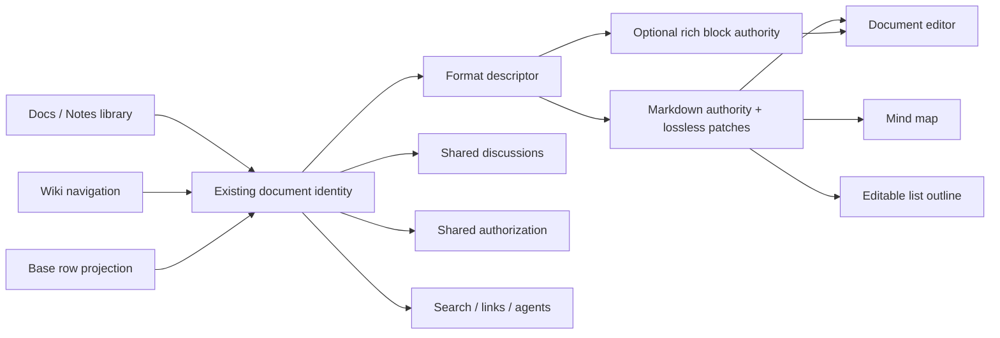
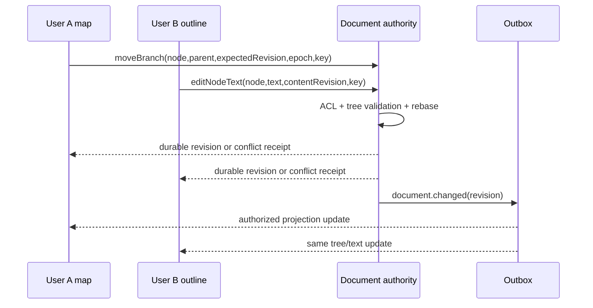

# Rox Docs: продукт, экраны и контракты реализации

**Версия 2, proposed.** Дата: 2026-09-30. Текущий ROX: `e953786ba7e30fb5da5dca7e88e20e324d5aebab`. Это спецификация будущей реализации. Live Lark evidence — [01](01-live-product-audit.md); исходники Obsidian и лицензии — [04](04-obsidian-reference-audit.md). Ни Lark, ни Obsidian UI не вставляются внутрь ROX.

## 1. Продуктовое решение и существующий код

Rox Docs — расширение существующих Notes/Pages. «Заметка» означает быстрый способ создания и компактный режим документа; «Docs» — библиотеку и редактор того же документа. Не создаём второй каталог содержимого, комментариев и идентификаторов. Drive хранит файлы и размещение; Wiki организует доступные документы; Bases показывает типизированные сущности; Mind map и Outline показывают список из одного Markdown-документа.

| Source-verified seam | Сейчас | Изменение |
|---|---|---|
| [NotesPage, default component, :573](https://github.com/rox-one/rox-one/blob/e953786ba7e30fb5da5dca7e88e20e324d5aebab/apps/electron/src/renderer/pages/NotesPage.tsx#L573) | Редактор, views, импорт frontmatter, встроенные комментарии | Разделить orchestration и view hosts; сохранить route, note ID, shortcuts; добавить persisted format descriptor и registry capabilities |
| [NotesToc / NotesComments, :156 / :311](https://github.com/rox-one/rox-one/blob/e953786ba7e30fb5da5dca7e88e20e324d5aebab/apps/electron/src/renderer/pages/notes/NotesReadingChrome.tsx#L156) | ToC и правая панель уже существуют; highlight ищет DOM text | Расширить до общего Discussion service, стабильного anchor и keyboard navigation; не считать отсутствующими |
| [NoteViewKind / outlineFromHeadings, :5 / :352](https://github.com/rox-one/rox-one/blob/e953786ba7e30fb5da5dca7e88e20e324d5aebab/apps/electron/src/renderer/pages/notes/note-views.ts#L352) | document/table/base/canvas/outline/graph; outline по headings, canvas storage | Добавить редактируемое дерево list nodes и отдельную Map projection; прежний heading outline остаётся ToC |
| [TiptapMarkdownEditor, :226](https://github.com/rox-one/rox-one/blob/e953786ba7e30fb5da5dca7e88e20e324d5aebab/packages/ui/src/components/markdown/TiptapMarkdownEditor.tsx#L226) | React/Tiptap, legacy/official Markdown paths, rich block extensions | Registry block capabilities; lossless Markdown bridge; не переносить Obsidian/CodeMirror runtime |
| [stampBlockMarkers, :154; NativeNotesEngine](https://github.com/rox-one/rox-one/blob/e953786ba7e30fb5da5dca7e88e20e324d5aebab/packages/core/src/rox2/notes-engine.ts#L154) | Маркеры блоков; revision/CAS; probe показал изменение YAML position/CRLF | Lossless patcher, frontmatter first, stable marker adapter; байты вне edited range сохраняются |
| [saveNote, :502](https://github.com/rox-one/rox-one/blob/e953786ba7e30fb5da5dca7e88e20e324d5aebab/packages/server-core/src/handlers/rpc/notes.ts#L502) | RPC допускает отсутствие expectedRevision и пишет файл | Обязательный revision/idempotency, атомарная per-document commit boundary; typed conflict receipt |

## 2. Что является одним документом



**Рекомендуемая последовательность:** сначала Markdown authority для существующих Notes. Rich block authority разрешается только новым документам с явным форматом и проверенным export. Это не два одновременных источника одной страницы. Перевод формата — отдельная команда с preview, backup и сменой authority epoch. View metadata никогда не становится второй копией текста.

Три альтернативы: (A) Markdown+lossless AST patches — лучшая переносимость, сложнее tabs/columns и collaborative structural edits; (B) block tree+Markdown export — удобнее rich UX, экспорт сложных блоков требует fallback; (C) independently writable Markdown и JSON — отвергнуто: split-brain, неверный undo и двойной indexing. Для A opaque regions сохраняются; для B unsupported features видны в export preview. «Любое форматирование без потерь в обычном Markdown» не обещается.

Proposed `DocumentFormatDescriptor { version, authority: 'markdown'|'rich-blocks', authorityEpoch, contentRef, contentRevision, markerVersion, exportProfile }`. ID остаётся существующим. `contentKind` — предложенное поле, в baseline его нет. Migration должна учитывать текущие `note` и `page` kinds через alias resolver, а не молча переименовывать union.

## 3. Общая визуальная система

Русский UI по умолчанию; текущая тема пользователя сохраняется, поддерживаются light/dark. Компактная светлая reference presentation доступна отдельно. Rox Mono Typeface из existing design system: проверить фактическую загрузку, fallback и кириллицу; не загружать неизвестный шрифт из внешнего CDN. 4/8 px spacing scale, control heights 32 px desktop / ≥44 px touch, body 14–16 px, editor line-height 1.55. Документ читабелен при 200% zoom.

Толстая фиолетовая обводка из исходного ROX screenshot заменяется: mouse focus — caret + лёгкая смена background; keyboard `focus-visible` — 1 px outline + 2 px offset либо underline, видимый на обеих темах. Ошибка — icon + текст + тонкая граница. Selection map node — tinted fill + leading marker; не 4 px ring. Hover duration 120 ms, tooltip 350 ms; reduced-motion выключает positional animation. Эти значения **предлагаются**, hover в Lark не измерялся.

Tooltips на hover и focus; click открывает подробную справку. Справка содержит значение, источник, единицы/формулу, обновление и пример. Критическое действие не доступно только через hover. Icon buttons имеют accessible names; hit area не меньше 32 px desktop/44 px touch; tooltip не перехватывает selection.

## 4. Реестр экранов

Маршруты ниже — **proposed logical routes**, адаптируются через существующий ROX navigation registry, без второго shell. Deep link сохраняет workspaceId/documentId/blockId и view, но не частный draft или доступ к данным.

| ID / экран | Размещение | Состав и основное действие | Inputs → outputs |
|---|---|---|---|
| RD-01 Библиотека | Existing Notes destination; также Pages entry | Secondary rail: Обзор, Drive, Wiki, Избранное; pinned docs; header Создать / Загрузить / Шаблоны; Recent / My / Shared / Favorite views; list/grid | Search string, filters, sort, cursor → authorized document rows + pagination; New → document receipt + existing route |
| RD-02 Документ | Existing note route + view=document | Header title/breadcrumb/save state/share/history/agent; ToC left, editor center, comments right; inspector alternate right tab | content operations + expectedRevision → new revision; selection → toolbar; share → policy dialog |
| RD-03 Обсуждения | RD-02 right dock; 320 px, resize 280–440 | Все / Открытые / Решённые / Мои; anchored cards, replies, resolve, reopen, orphan warning | selected anchor + body/mentions → Discussion/Message receipt, activity and recipient-specific notifications |
| RD-04 Outline | Same document, view=outline | Centered tree 720 px or full-width; branch color markers; fold/focus; editable rows; Find; shortcuts | nodeID + tree command → patch on same content authority, selection preserved |
| RD-05 Mind map | Same document, view=map | Map/Outline switch; pan/select toggle; fit/zoom; themes panel; contextual formatting; fold/focus | tree commands + optional view positions → same Markdown revision + view metadata; no text copy |
| RD-06 Conversion preview | Modal from Open as map / Import | Original preview, affected line count, first changes, unknown format warnings; Convert copy default / Convert current explicit | contentRevision + conversion options → new ID for copy or CAS migration; diff and rollback receipt |
| RD-07 Insert / block picker | Slash menu, + gutter, keyboard palette | Typed block list, search, category, preview, keyboard help | blockType + allowed config → validated block insertion; forbidden entries visible disabled with reason |
| RD-08 History / Restore | Header history drawer | timeline authors/source/revision; diff, preview, Restore as new revision | revisionID → authorized snapshot; restore expectedRevision → revision, never erase audit |
| RD-09 Action builder | Action block settings modal | Label/icon/style/action/inputs/failure policy/preview | registered CommandSpec or WorkflowRef → signed declarative action spec; click executes scoped receipt |
| RD-10 Day planner | Docs side panel or existing Tasks/Calendar view | Daily note/tasks/provider events/time entries layers; day/3-day/week; drag schedule | authorized task/event refs + date range → timeline; drag → native scheduling command |
| RD-11 Template gallery | RD-01 Шаблоны | Categories, preview, required capabilities, schema version, Create from template | templateVersion + workspace/context → new document and optional linked entities via bounded workflow |
| RD-12 Import / Export | RD-01 upload or header menu | MD/OPML/Canvas/CSV preview; export scope/assets/fallback reports | local file/provider ref → staging preview; explicit confirm → import receipt; export authorized revision → artifact + manifest |

## 5. RD-01 — библиотека и Drive

Default recent rows: icon/type, title, folder/wiki location, owner, updatedAt, sync state. Title wraps at two lines in grid; table single line with tooltip. Hover gives subtle fill and reveals menu, checkbox appears on hover **and keyboard focus**. Click title opens existing tab; Cmd/Ctrl-click new tab; Enter opens selected; Space toggles selection only when row navigation owns focus. Sort header cycles asc/desc/default, announced via aria-sort.

Search debounced 200 ms; Enter explicit query; Escape clears then returns focus. Filter drawer: type/content format/owner/project/updated range/shared status; each chip removable; clear all retains query. Query response includes authorized total if supported, otherwise “Показано N”, not guessed total. Grid/list choice per user, shared view definition persisted separately. Multi-select toolbar: link/move/tag/export/trash; each item receives per-entity result. Permissions are rechecked at command time. Moving location never silently widens ACL.

Create menu: Документ, Заметка, Markdown map, Base, Sheet, Slides, Form, Folder. Unsupported capabilities show explanatory status; do not create an empty route that pretends editing exists. Upload drag target shows accepted formats and limits from server; filenames sanitized; duplicate handling rename/replace with revision preview. Templates are not automatically executable.

Empty library: «Создайте первый документ», plus import/template; empty filtered view: “Ничего не найдено” + clear filters; error: retry preserves query/cursor; offline: last synchronized rows + freshness, create local draft only if storage contract supports it. Trash restore preserves ID and grants per policy, never silently restores revoked access.

## 6. RD-02 — editor, ToC, comments placement

Desktop ≥1280: left ToC 200–240, text column max 760, right comments 320; resizable docks. 900–1279: one right dock at a time, ToC collapsible. <900: ToC and comments sheets, no horizontal editor overflow. Header remains 48 px; sticky formatting toolbar does not hide text at zoom. Left ToC derives headings from content, not another stored hierarchy. Clicking scrolls/sets focus and deep link; current heading accent bar + fill, never heavy box. Heading rename updates label without changing block identity. No headings → helpful “Добавьте заголовок”; no automatic content insertion.

Title input: trimmed nonempty display title; unnamed document uses localized “Без названия”; maximum enforced by shared contract (initial proposed 256 Unicode code points), invalid display not persisted silently. Save states: Локальный черновик → Сохраняется → Сохранено revision/time → Офлайн, ожидает отправки → Конфликт / Нет доступа. Editing spinner never means durable save. Dirty draft survives tab change and app crash via scoped durable store, clear only after acknowledged revision.

Text selection toolbar: B/I/U/S, highlight, link, comment, heading, convert task. Click selection comment freezes logical selection anchor before focus moves. Slash insertion belongs to current block and yields a single undo group. IME composition and browser text shortcuts retain priority. Agent button opens existing session with authorized EntityRef + selected range, not an unrestricted text dump.

### Block inventory

| Block | Input / validation | Output / export | Hover / keyboard / limits |
|---|---|---|---|
| Paragraph/heading/list/task | sanitized inline marks, nesting, stable IDs | CommonMark-compatible text, native TaskRef only after explicit promotion | gutter grip + menu; Tab indents in list, heading levels via palette |
| Table | typed cells where configured; ordinary text table otherwise | Markdown table or explicit richer table fallback | resize/reorder handles on focus; keyboard cell nav; no formula eval in prose table |
| Image/audio/video/file | AttachmentRef, caption/alt, safe preview | authorized asset manifest and link; missing asset warning | preview/download controls; background metadata load cancellable |
| Callout/quote/math/Mermaid | content, allowed theme, size limits | portable fenced representation + plain text fallback | copy/fold controls; rendering sandbox and resource budget |
| Entity embed/Base view | EntityRef / ViewDefinitionRef + selected fields | reference+snapshot policy, ACL checked both live and export | open entity, source/freshness help; hidden fields never rendered |
| Tabs | stable tabID, label, semantic children | fenced extension + expanded labeled sections in basic export | roving tab focus; arrows; add/rename/reorder/delete + undo; selected tab per user |
| Columns | 2–4 semantic child containers initially; width constraints | sequential sections in basic Markdown | divider resize, keyboard move; mobile vertical stacking; tasks remain indexed |
| Action button | registered ActionSpec; no raw JavaScript or shell | inert declarative code + label in export | pending/success/failure, disable while executing, retry by receipt policy |
| Code | language, title, line start, highlights, grouped IDs | original code bytes; presentation metadata separate | copy code only, wrap/fold, copy image with export preview; no implicit execution |

Nested tabs/columns must preserve child block IDs, comments and TaskRefs. They are **semantic containers**, not text hidden inside a code fence from indexers. Rendering fallback expands them for accessibility/export. Height and deep nesting have validation budgets; unsupported future containers remain opaque and readable.

## 7. RD-03 — обсуждения и anchors

Proposed `Discussion { id, workspaceId, sourceRef, anchor, status, createdBy, createdAt, revision }`; `anchor { blockId, relativeStart?, relativeEnd?, quotedText, contentRevision }`. Stable CRDT relative positions exist only for a collaborative document format that supports them; legacy Markdown uses marker+range+quote validation. Never use DOM offsets as durable authority.

Comment composer: body 1–8000 Unicode code points proposed; @ opens common mention picker; attachments follow common Attachment ACL. Cmd/Ctrl+Enter sends, Enter newline, Escape closes retained draft. Input/output contract returns discussionID/messageID/revision + mention delivery outcomes, not just “success”. After send scroll to receipt; duplicate idempotency key cannot create second comment.

Card: avatar/name/time/edited; quote, body, reactions when shared messaging supports them; Reply, Resolve (author/editor-policy), more Edit/Delete with permissions. Hover quote previews anchor; click scrolls; keyboard equivalent Enter. Right dock filter persists per user. Resolve collapses thread but retains search/audit; reopen emits change. Deleting source text creates **orphan**, keeps discussion and shows “Фрагмент удалён”; authorized user may re-anchor via explicit command. Matching duplicate quotes never silently reattaches.

Legacy embedded Markdown comments import once with provenance+legacy ID and idempotent mapping. Private local comments are not published automatically: migration preview includes visibility. No notification to all workspace members: only explicitly mentioned, assigned or subscribed recipients after ACL evaluation. ACL revocation removes body and anchor from live panels and local searchable projections while allowing policy-defined encrypted draft recovery. Lost access cannot be undone with cached ACL.

## 8. RD-04 / RD-05 — Ideascape behavior in ROX

One note, two views. H1 title is root; nested list is tree; prose/tables/code remain outside map without deletion. Block IDs map to durable nodeID; importing `^abc` retains mapping, ROX `<!-- block:id -->` remains supported. Metadata for positions/folds/theme is versioned; unknown fields survive roundtrip; malformed metadata shows recoverable warning rather than empty overwrite. Shared layout and user viewport/focus are separate. Fold/focus default personal; publish map layout explicit.

| Key (Mac / Ctrl elsewhere) | Map/Outline behavior | Output and guard |
|---|---|---|
| Tab / Enter / Shift+Tab | child / sibling / outdent | stable new nodeID or reparent; no cycle; selection enters edit |
| arrows / Shift+arrows | select / extend selection | selection only; editor caret wins while text editing |
| Cmd+E / double click | edit selected text | draft on current node; IME intact; Escape cancels edit |
| Cmd+B/I/U / Cmd+Enter / Shift+Cmd+7 | marks / checkbox / numbered list | one undo group; checkbox is list state, not silently native Task |
| Cmd+Up/Down | reorder siblings | aggregate expectedRevision; preserves branch/attached prose |
| Cmd+. / Option+Cmd+F | fold / focus branch | view state; focus dims outside but keeps navigation/search possible |
| Cmd+F / ? | find / shortcut sheet | search text + count + next; filterable sheet, no content mutation |
| Cmd+1 / Cmd+2 | Map / Outline | scoped to focused Docs view; don't intercept global ROX tabs elsewhere |
| Option+Cmd+=/- / Shift+Cmd+0 | zoom / fit | bounded 20–300% initial range; viewport only |
| Cmd+/ | document panel | theme/layout/node style; Escape closes and restores focus |
| Cmd+Z / Shift+Cmd+Z | undo / redo local semantic action | inverse rebased against latest version; remote edits never rolled back |

Keyboard shortcut overlay optional bottom-right; only handled command names, never raw keys/passwords/text; fade 1.2 s, off in reduced motion and settings. Map node hover shows + child/fold affordance and formatting bar after selection; focus shows same controls. Free layout drag changes positions, **Tidy** previews restoration and offers undo. Branch dragging previews parent line; invalid/self-descendant parent red reason. Pan via space+drag or toggle; wheel behavior platform-aware; zoom anchor preserves pointer position.

Outline: leading fold chevron, branch color line, checkbox, editable text, small source/task/ref badges; row hover fill, selected fill+leading accent. Drag row/group uses stable IDs, source opacity0.6, 2 px insertion line; horizontal intent changes nesting, announcement says destination/level. Shift multi-select and Escape exit. Touch long press enters drag, edge auto-scroll bounded; bottom toolbar indent/outdent/style/move available without gesture.

Mobile: pinch zoom/pan, 44 px controls, keyboard accessory bar; selection survives view switch; focus mode single branch with breadcrumb back. First-run 3-step welcome → optional keyboard tour document; never overwrites existing content. Tour can be relaunched. Themes Follow workspace / Paper / Slate / Graphite / Midnight plus custom token set; contrast validated, print defaults readable. Preserve user dark theme.

### Conversion contract

Inputs contentRevision, source format, mode copy|inPlace, marker policy. Preview lists added markers, geometry, property changes and changed raw spans. Copy default if any nontrivial rewrite. Confirm recomputes CAS; changed source rejects with new diff. No-op read/save has byte-identical UTF-8/BOM/CRLF where supported. Unknown metadata, paragraphs between items, terminal newline and trailing prose preserved. Delete item policy shows attached prose move/reparent preview. Copy generates a new EntityRef with derivedFrom link; duplicate filenames never overwrite. Export MD/OPML/JSON Canvas/PNG/SVG binds revision+theme, authorized assets and explicit compatibility report.

## 9. Дополнительные reference behaviors

**Highlightr:** semantic highlight palette Yellow/Green/Blue/Pink/Purple/Custom; selected text only, label+swatch+keyboard, contrast light/dark; custom color name+picker+save. Remove highlight removes only mark formatting, never arbitrary HTML. Basic Markdown `==text==`; custom colors export sanitized `<mark>` with safe inline background or style manifest. Renderer rejects scripts/event handlers/unsafe CSS. Same palette used in map and text.

**Buttons:** RD-09 type Command / Entity link / Create from template / Append typed block / Safe formula / Workflow. Inputs typed from command registry, preview affected entities, confirmation policy belongs command. Chain failure policy stopOnError default; continueOnError explicit per safe workflow, each step receipt/idempotency key; no user-provided eval or shell. Imported Buttons fence stays inert until reviewed. Disabled/offline status reflects command availability. Label can contain safe text styling, not arbitrary HTML.

**Dragger:** common semantic MoveBlocks command, revision and anchor IDs. Reorder whole paragraph/list/table/code/callout; list nesting preserves subtree. Could evaluate MIT md-dragger headless adapter in a bounded spike, but current `/drag` README entry is stale and ROX Tiptap compatibility is unproven [04]. No DOM drag position becomes database order without validation.

**Dynamic Views:** Base gallery/card presentation options cover position/top-bottom-left-right, title wrap, excerpt length, image carousel, property label/arrangement, checkbox edit, URL action, keyboard and shuffle with deterministic seed. Custom CSS forbidden in shared untrusted view initially; token-based style safe. Image previews use authorized derivative URLs and loading/error placeholders, no hidden note text leak.

**Charted Roots:** optional relationship/evidence overlay on common EntityLinks, person/place/event/source/organization imports through adapter. GEDCOM/Gramps/CSV staging, duplicate preview, merge evidence, privacy-aware export. Not required to add genealogy to every workspace. Family persons are Contacts only when explicitly mapped, not User identities. Maps require coordinate consent/provider config, no spontaneous geocoding network requests.

**Codeblock Customizer:** code header filename/language/icon, copy, line numbers/start, wrap, fold/semi-fold; named highlight ranges/text; tab groups, annotations, syntax theme. All options bounded, declarative and previewed. Hide lines is presentation **not secret redaction**; export includes full code unless explicit authorized redaction workflow. Custom regex tokenizers require budget/worker and safe configuration. Shell prompt rendering does not execute commands. Grouped code exports sequential blocks with headings; Print/PDF handles all tabs. Existing code block implementation is extended.

**TaskNotes / Day Planner:** task detail links to existing native Task and optionally portable Markdown snapshot. Natural language parsing preview separates title/date/context/recurrence before commit, ambiguity visible. RRULE recurrence uses occurrence key and explicit materialization, never two duplicate tasks. Time tracking persisted native events; only one active timer per chosen policy and cross-device conflict receipt; ICS read-only feed is distinct from OAuth writable calendar. Planner drag modifies native Task schedule or CalendarEvent, never rewrites imported provider-only events without adapter support.

## 10. Commands, queries, failures

```ts
// Proposed; existing Notes RPC is migrated via a compatibility adapter.
type DocCommandEnvelope = {
  workspaceId: string; documentRef: EntityRef;
  expectedRevision: string; authorityEpoch: number;
  idempotencyKey: string; command: DocCommand;
};
type DocCommand =
  | { type: 'patchMarkdown'; patches: RawSpanPatch[]; markerMappingVersion: number }
  | { type: 'insertNode'; parentId: string; afterId: string|null; text: string }
  | { type: 'moveBranch'; nodeId: string; parentId: string; afterId: string|null }
  | { type: 'setNodeMarks'; nodeId: string; marks: InlineMark[] }
  | { type: 'restoreRevision'; revisionId: string };
// EntityRef, RawSpanPatch, InlineMark must be schema-versioned, not TS-only contracts.
```

Revision choice: **single aggregate CAS token** `expectedRevision` covers text, tree and authorityEpoch. `structureRevision` in interaction/sequence descriptions is diagnostic data inside that aggregate, not a second independently writable token. Handler checks `authorityEpoch` first, then revision; a stale epoch always rejects before rebase. Rebase is an explicit server operation returning a new receipt, never silently treats stale CAS as accepted. Text edit racing with move/delete ancestor must preserve text at stable nodeID or return conflict; no resurrected/deleted branch through a late edit.

Queries GetDocument/GetView/GetHistory/GetDiscussions/GetDocumentLinks require workspace actor and current ACL. Response includes revision, authorityEpoch, permissionCapabilities, sync/freshness state. Error discriminants: validation, conflict, denied, deleted, offlineUnsupported, missingDependency, rateLimited, unknownFormat; deny never returns protected content. Save conflict shows compare/merge/copy, preserves both drafts. Unsupported new format read-only with export original.

## 11. Collaboration, offline and permission changes

CRDT text convergence does **not** guarantee valid Markdown hierarchy after concurrent moves. Proposed structural commands for Map/Outline run through per-document authority: validate tree, serialize structureRevision, rebase or reject. Text edits may use existing collaboration target from Macro plan; structural offline actions queue intent+base revision; reconnect can require conflict review. No optimistic statement that every simultaneous reparent auto-merges. Keep one authority epoch and per-document snapshots/WAL/checkpoints.



```mermaid
sequenceDiagram
    participant U as Offline editor
    participant S as Authority
    participant P as Permission service
    U->>U: persist draft + baseRevision + pending intents
    U->>S: reconnect(actor,epoch,baseRevision)
    S->>P: evaluate current access
    alt allowed
      S-->>U: latest snapshot + missing operations
      U->>S: rebased intents / explicit conflict resolution
      S-->>U: acknowledged revision
    else revoked
      S-->>U: denied without protected snapshot
      U->>U: remove cached projections; quarantine draft per policy
    end
```

Presence/cursors awareness ephemeral per-document ACL, no durable Activity event per keystroke. Revoke closes write transport, invalidates read tokens/derivatives/cache/search and rechecks every queued mutation. Existing export cannot be recalled from another device; secure view never promises impossible copy prevention.

Offline shared-document reads require an explicit current-policy lease/expiry; local-owned Notes may use local owner policy. Default remote-private content fails closed without lease. Immediate revocation while a device is disconnected is not technically observable: any permitted offline lease has a documented bounded exposure window; reconnect/expiry invalidates protected projections and quarantines unsent draft by policy. No expired lease permits mutation replay; all writes reauthorize on authority.

## 12. DoD and expected results

1. Existing Notes/Page opens with same ID/content/links and no losing previous views; migration receipts/backups visible.
2. RD-01–12 implemented with loading/empty/error/denied/offline and keyboard/touch states. Proposed unavailable features are clearly labeled until implemented.
3. Same note edited in Doc/Map/Outline: exact node content and ordering agree after reload; no-op save preserves nonedited bytes and frontmatter; conversion preview and copy protect unsupported content.
4. Two users edit text, move branches, lose connection and revoke access: each acknowledged mutation durable, invalid tree rejected, unresolved conflict visible, no unauthorized replay.
5. Comment anchors survive allowed edits/reorder; orphan retained; mentions notify only authorized intended recipients once; search and agent retrieve permitted conversation context.
6. Tabs/columns/tasks/code/actions index/export with safe fallback. Open document alone never executes actions or external network code.
7. Commands/API/MCP obey same actor/ACL; runtime logs contain IDs/status/latency without private text; tests include seeded faulty anchor, duplicate command, stale revision and lost-format mutations.
8. Font, 200% zoom, reduced-motion, IME, focus restore and light/dark verified on actual ROX app. Plan validation is not runtime proof. See [10](10-test-plan.md) and [09](09-implementation-plan.md).
