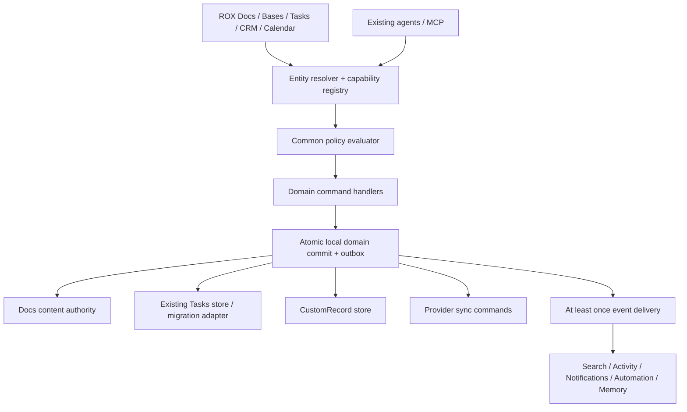
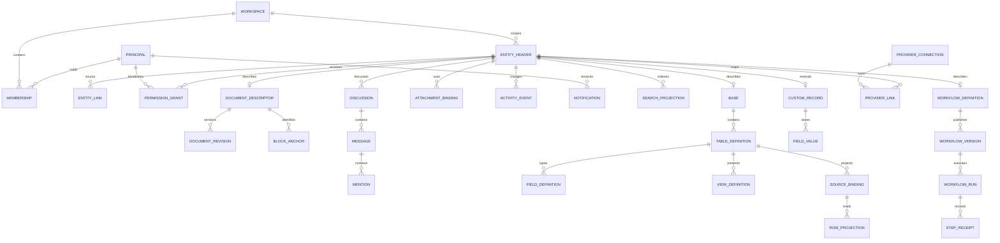
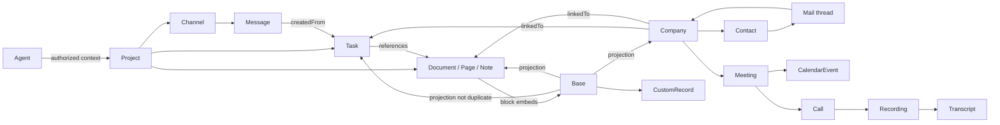
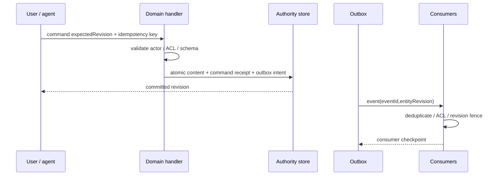

# Entity model, ERD и границы власти

**Target ROX revision 2 — PROPOSED**, 2026-09-30; baseline `e953786ba7e30fb5da5dca7e88e20e324d5aebab`. Модель Lark в [02](02-core-suite.md)/[03](03-business-ecosystem.md) восстановлена из product/API references: это **conceptual ERD, не private database schema**. Macro source model и существующая ROX model остаются в [Macro domain](../macro-integration/05-domain-model.md). Этот документ уточняет Docs/Bases и Suite references.

## 1. Почему views могут быть общими

Общий слой предоставляет identity, reference resolution, authorization, typed commands/queries, revision/idempotency, links/mentions, discussions, outbox, search projection и tool descriptors. Он не превращает все домены в одну универсальную JSON-таблицу и не принимает любой command по имени. Task/Calendar/Mail сохраняют свои domain validators/provider sync. View adapter вызывает этот validator, а не пишет bypass напрямую.



## 2. Текущие доказательства и additive evolution

| Baseline code | Текущий факт | Proposed change |
|---|---|---|
| [platform-contract.ts, Rox2EntityKind / Rox2EntityRef](https://github.com/rox-one/rox-one/blob/e953786ba7e30fb5da5dca7e88e20e324d5aebab/packages/core/src/rox2/platform-contract.ts) | Общий reference contract существует; page kind есть, contentKind/CustomRecord нет | Versioned additive kinds and descriptors; alias map note/page; legacy decoder remains |
| [notes-repository.ts, NotesRepository / createNotesRepository](https://github.com/rox-one/rox-one/blob/e953786ba7e30fb5da5dca7e88e20e324d5aebab/packages/core/src/rox2/notes-repository.ts#L27) | Источники native/conation/hybrid, sync states; repository пока note-kind | Delegate content to explicit authority with source provenance; never two writers |
| [note-views.ts, NoteBaseView / formulaValue](https://github.com/rox-one/rox-one/blob/e953786ba7e30fb5da5dca7e88e20e324d5aebab/apps/electron/src/renderer/pages/notes/note-views.ts#L24) | Fixed formulas и client-side views | Migrate view definition v1→v2 with stable built-in IDs and personal/shared scope |
| [personal-persist.ts, PersonalTaskPersistStore](https://github.com/rox-one/rox-one/blob/e953786ba7e30fb5da5dca7e88e20e324d5aebab/packages/server-core/src/tasks/personal-persist.ts#L74) | Personal config-directory storage, monotonic durable revision | Explicit personal principal/workspace binding, CAS command adapter; not globally readable via guessed taskID |

Personal Task identity is source scoped: `(sourceStoreId, ownerPrincipalId, nativeId)`. Projection in workspace is permitted only by explicit allowed binding and current policy. Same `nativeId` in two stores is not the same entity. Native IDs remain stable; mapping table adds namespaced entity ID and origin, never guesses ownership from current UI workspace. Migration cannot auto-share personal tasks with workspace members. Contact/person/guest User identity resolution follows the same source namespace rules.

## 3. Proposed contracts

```ts
type EntityRefV2 = {
  version: 2;
  workspaceId: string;
  entityId: string; // formatRox2EntityId(kind, nativeId), unchanged identity field
  revisionId?: string;
  accountNamespace?: string;
};
type EntityAnchor = { entity: EntityRefV2; blockId?: string; occurrenceKey?: string };
type EntityOrigin = {
  providerConnectionId?: string;
  sourceStoreId: string;
  nativeId: string;
  ownerPrincipalId?: string;
  authorityEpoch: number;
};
type DomainReceipt = {
  commandId: string; idempotencyKey: string; entity: EntityRefV2;
  revision: string; eventIds: string[];
  status: 'committed'|'queuedProvider'|'partiallyCommitted';
};
```

Names follow existing Rox2 contracts where possible; V2 is schema proposal requiring migration, not a new parallel universal entity package. Ref URI resolver validates kind registration and workspace. Rich anchor fields identify a document fragment or task occurrence; they do not grant read permission. ExternalRef is integration provenance, not authorizing public deep links.

Initial V2 mapping is **existing parsed kind `page` plus proposed `contentKind` descriptor** for document/base/record. Example `{ version:2, workspaceId:'w1', entityId:'page:existing-page-id' }` resolves descriptor `contentKind:'document'`; a new custom record uses an `entityId` formatted with page kind and descriptor `contentKind:'record'`. Existing `note:...` refs remain valid through aliases; existing page/note IDs are not rewritten on view change. This V2 extends actual Rox2EntityRef fields (`workspaceId/entityId/revisionId/accountNamespace`), not a parallel `{kind,id}` wire contract. No separate `document`/`base`/`record` top-level kind is required in first migration. V1 decoders keep old references. Kind validation uses existing `parseRox2EntityId/isRox2EntityKind`; future dedicated kind requires a separately versioned migration.

## 4. Target ERD



EntityHeader is proposed discovery metadata, **not content DB authority**. Polymorphic links require application-enforced referential checks/tombstones and same-workspace boundary; Mermaid relations do not establish SQL foreign keys to polymorphic types. SearchProjection is rebuildable, Message is discussion data, RowProjection is query result/cache, not authoritative copy. Document content mode lives in Descriptor; owner grants derive from common policy.

### Domain relationship view



Existing Macro integration supplies mail/call/CRM runtime slices. Lark references add interaction/design and provider adapters; this diagram does not claim every target domain exists now.

## 5. Entities, inputs, outputs, invariant and owner

| Primitive | Required input | Output / invariant | Authority |
|---|---|---|---|
| DocumentDescriptor | existingRef, format, authorityEpoch | one content authority; explicit format switch receipt | Docs |
| DocumentRevision | previousRevision, operations, actor | immutable revision; durable ACK and idempotent retry | Docs storage |
| BlockAnchor | documentRef, markerVersion, blockID | stable anchor; orphan allowed, guessed quote reattach denied | Docs |
| Base/Table | workspace, name, sourceBinding | schemaVersion + revision; no implicit domain clone | Bases |
| FieldDefinition | type, required/default/validation, edit mapping | typed fieldID stable on rename, dependency graph | Bases schema |
| ViewDefinition | sourceBinding, filterAST, sorts, grouping, visible field IDs | personal/shared scope; own revision independent content | Bases query |
| CustomRecord | tableRef, typed values, actor | entityRef, version; only new custom domain | Bases records |
| RowProjection | sourceRef, field mapping, query cursor | ephemeral row + source revision + capabilities | Native domain adapter |
| EntityLink | source/target refs, relation type, provenance | linkID; target policy respected; no inferred ACL grant | Common links |
| Discussion/Message | sourceRef, body, optional anchor | discussionID, messageID, revisions; separate from agent session | Shared messaging |
| Mention | source anchor, targetRef, actor, intended recipient refs | link + authorized recipient set; no ACL elevation | Common mentions |
| AttachmentBinding | sourceRef, fileRef, purpose | grant intersection; safe preview and expiry | Files |
| DomainEvent | eventID, entityRef, version, actor, correlation | immutable at-least-once event; no private body by default | Outbox |
| WorkflowVersion/Run | immutable graph, input, principal scope | step receipts, attempts, replay-safe status | Existing Automations extension |
| ProviderConnection | owner, provider, scope set, workspace binding | secret reference only; no token in logs/spec | Connections |

## 6. Bases types and computation

Seven views and 18 field types are specified in [05](05-rox-bases-design.md). `relation` stores refs and cardinality, `lookup` derives a permitted field, `rollup` aggregates permitted targets. All computations use typed AST budgets and cycle detection. Value union distinguishes missing/null/invalid/denied; denied never coerces to zero. Dates distinguish local date vs instant+IANA timezone; money uses decimal minor-unit contract/string integer where required, not JS floating point.

Legacy `taskCount/openTaskCount` means **Markdown checkbox count**, because that is current code behavior. Migrate as `legacy.markdownTaskCount.v1` / `legacy.markdownOpenTaskCount.v1`; add separate `relation.nativeTaskCount.v1`. Promotion checkbox→Task records source block link and excludes double counting in an explicitly configured unified summary; never change old formula meaning silently.

Source native field edits map to named native command. Base batch with five Task edits returns five receipts; all-or-nothing guarantee applies only if native handler supports a bounded transaction. Rollup and formula run under querying actor, with authorization-filtered relationship targets and fresh policy version. Shared cached aggregate keyed by actor/policy fingerprint or safe shared cohort; never reuse owner's count for viewer. Pagination/cursor/snapshot consistent with filter/sort revisions.

## 7. Permissions, sharing, agents

Common evaluator accepts `(actor, action, EntityRef, fieldOrBlock?, policyVersion)`. Workspace membership is necessary only where entity policy requires it; never sufficient for all read/write. Lark Base field/record ACL demonstrates why document-level grant alone is insufficient [02]. ROX target supports field/record restrictions via domain policy extension on one evaluator, not separate login engines.

Agent sessions remain existing ROX Sessions. Human Channel/Discussion messages are separate domain objects with shared common primitives. Tools read/search/create/update/link/comment/mention/export use same handler and actor-scoped grants. Tool result includes source revision/freshness/denied status, never hidden entity title. Automation or bot principal cannot inherit arbitrary user's administrator privileges. Preview-before-write uses deterministic command payload digest, revalidates on apply, and records receipt.

Cross-workspace linking is disabled initially; approved ExternalShareRef resolves via explicit share policy and a separate audit event. Mention of unavailable entity shows restricted label, no title/body. Secure view tokens expire and bind viewer/format, but screenshots/copy cannot be prevented absolutely. Signature/approval values reference immutable document revision; changes invalidate current signing request rather than reusing old approval.

Offline authorization is shared across domains/views: local-owned source uses local owner policy; remote-private source defaults to no offline content, optionally a signed bounded lease with explicit policy scope/expiry. Expired leases fail closed for Base rows/aggregates/search/Docs/code context. Offline cannot discover immediate remote revocation; documented lease window is the limit. Reconnect invalidates grants/cache before reads and replay; writes always reauthorize at canonical authority.

## 8. Events and consistency

Proposed canonical event families: document.revisionCommitted, discussion.messageCreated, discussion.resolved, mention.created, base.viewChanged, base.fieldChanged, record.created/updated/deleted, task.updated, provider.syncAcknowledged, workflow.runChanged. Registry aliases existing ROX event names; do not rename blindly. Each envelope has `eventId, workspaceId, entityRef, entityRevision, actorRef, occurredAt, schemaVersion, correlationId, causationId, sourceCommandId`. Sensitive payload resolved by consumers with authorization.



File-backed domain needs journal/atomic rename recovery if DB transaction unavailable; “write file then emit event” is insufficient. Consumers have idempotent checkpoints, retry and dead-letter remediation. Notifications are durable per recipient, activity audit immutable, search/memory eventual with user-visible freshness. Provider command is queued, external ACK separately recorded; local success never claims Gmail/Calendar update completed.

## 9. Migration rules

1. Inventory and hash existing notes/views/task stores per source; backup and dry-run typed diff.
2. Bind identities explicitly; no workspace-ID inference for personal tasks, no duplicate-ID overwrite.
3. Import view v1 without changed filter/formula meaning; localStorage view data becomes personal view, shared only explicitly.
4. Preserve note IDs, markers/frontmatter/newlines, old routes and backlinks. ID alias mapping is durable and reversible.
5. Migrate comments with visibility preview and provenance; don't leak private local notes into shared discussion.
6. Activate writer at new epoch after snapshot, validation and migration receipt. Old writer read-only or forward to new authority, never dual-write.
7. Reindex permitted data with revision fences. Rollback restores old adapter/version from journal, not deletion of new acknowledged mutations.

Expected result: one Task referenced by Base, Doc, Project and Calendar is one native Task with consistent revision; one Document seen in Drive/Wiki/Map/Outline has one authority; linked context available to search/agent only under current ACL. Identity, stale write, duplicate import and permission negative tests are mandatory [10](10-test-plan.md).
