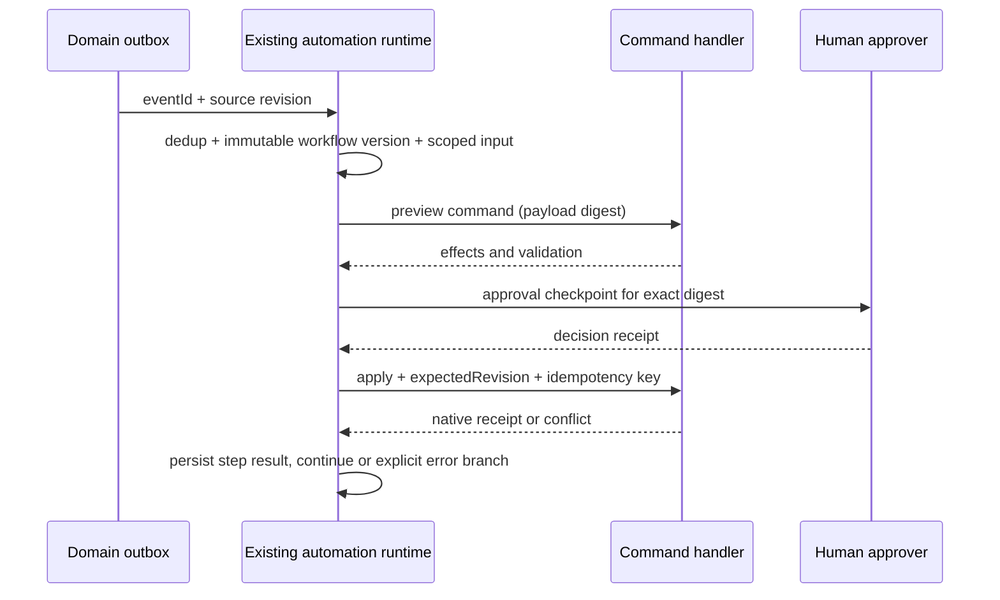

# ROX Automations: Suite constructor и события

**Revision 2, PROPOSED.** Source baseline `e953786ba7e30fb5da5dca7e88e20e324d5aebab`. Live Meegle/AnyCross findings описываются в [01](01-live-product-audit.md); documented Lark workflows — [02](02-core-suite.md)/[03](03-business-ecosystem.md). UI prototype не заменяет executor.

## 1. Existing engine, not a second builder

| Source | Verified seam | Required extension |
|---|---|---|
| [AutomationGraphWorkspaceEditor](https://github.com/rox-one/rox-one/blob/e953786ba7e30fb5da5dca7e88e20e324d5aebab/apps/electron/src/renderer/components/automations/AutomationGraphWorkspaceEditor.tsx) | Existing workspace graph editor | Add typed entity/provider trigger/action registry and permission-aware config |
| [graph.ts](https://github.com/rox-one/rox-one/blob/e953786ba7e30fb5da5dca7e88e20e324d5aebab/packages/shared/src/automations/graph.ts) | Graph model/validation exists | Versioned immutable published graph, bounded loops, cancellation and compensation contracts |
| [automation-system.ts / event-bus.ts](https://github.com/rox-one/rox-one/blob/e953786ba7e30fb5da5dca7e88e20e324d5aebab/packages/shared/src/automations/automation-system.ts) | Existing orchestration and event bus | Durable domain-outbox adapter; retain current registered events via aliases |
| [security.ts, sanitizeForShell](https://github.com/rox-one/rox-one/blob/e953786ba7e30fb5da5dca7e88e20e324d5aebab/packages/shared/src/automations/security.ts) | Shell escaping utility; this file does not establish actor/ACL enforcement | New scoped workflow principal and command authorization adapter, checks on every attempt |
| [retry-scheduler.ts / history-store.ts](https://github.com/rox-one/rox-one/blob/e953786ba7e30fb5da5dca7e88e20e324d5aebab/packages/shared/src/automations/retry-scheduler.ts) | Webhook JSONL persistence/single-process lease/at-least-once retry and history seams; not a general durable graph executor | New durable step receipts/idempotency/resume, sensitive output redaction, human approval checkpoint |
| [rpc/automations.ts](https://github.com/rox-one/rox-one/blob/e953786ba7e30fb5da5dca7e88e20e324d5aebab/packages/server-core/src/handlers/rpc/automations.ts) | Existing RPC | Validate/publish/test/run/cancel/resume query commands through existing boundary |

These paths are evidence of mechanisms, not proof that proposed Lark parity is already implemented. Existing issue slices [1096](https://github.com/rox-one/rox-one/issues/1096)–[1100](https://github.com/rox-one/rox-one/issues/1100) remain; new work packages refine dependencies.

## 2. Screens and interaction

| ID | Screen | Inputs → outputs | UX states |
|---|---|---|---|
| RA-01 | Existing Automations list | search, status, trigger, owner, invalid, cursor → permitted workflows | compact rows title/version/trigger/status/last run; hover menu also keyboard; empty template CTA |
| RA-02 | Graph workspace | drag node/drop edge, node selection, viewport → graph draft revision | grid optional, minimap, zoom/fit; + on connection reveals registry; keyboard add/connect/remove; no accidental publish |
| RA-03 | Right node inspector | tabs Action / Connection / Input / Output / Error | schema-backed typed fields, mapping picker and preview; required/invalid fields inline; hidden scopes never editable bypass |
| RA-04 | Trigger picker | manual/schedule/entity event/provider webhook + typed filters → TriggerSpec | schedule timezone explicit; cron human summary and next5 occurrences; secret webhook URL reveal scoped, not analytics |
| RA-05 | Validate/Test | sample declared input + draftVersion → validation report or sandbox run | errors anchor node; actual send/write disabled in dry run; simulated output stamped simulation |
| RA-06 | Publish review | revision/diff/scopes/side effects → immutable WorkflowVersion | separate from Save draft; lists recipients/entities/providers; command policy controls confirmation |
| RA-07 | Run history | workflowID/status/date/cursor → runs | timeline steps/input-output redacted/attempts/latency; refresh retains selected run; authorized export |
| RA-08 | Approval checkpoint | runID, typed decision/comment → resume/cancel receipt | waiting actor/action explicitly; stale or revoked approver denied; no autoapprove on timeout |
| RA-09 | Connector catalog | provider/capabilities/scopes → existing Connections setup | status ready/expired/missing scope; reuse existing source/connection, no raw key in graph |

Hover node shows label/type/last validation and ports; select shows tinted fill, 1 px keyboard focus; edge menu appears on focus. Drag indicator line 2 px, no glowing large outline. Press Escape cancels drag/modal before deselecting. Native task/field mapping picker shows entity source/version, not just label. Search inputs have current query/error state. Mobile editor offers list-based step configuration when graph too dense.

## 3. Node semantics and exact I/O

| Node | Inputs | Outputs | Failure / permission rule |
|---|---|---|---|
| Entity event trigger | registered event family, sourceRef/type filter, actor-safe fields | eventID/entityRef/revision | ACL on event context; no payload shortcut to hidden body |
| Schedule | timezone, recurrence/cron, missedRunPolicy | scheduledFor, occurrenceKey | DST policy explicit; occurrence dedup; bounded catch-up |
| Condition | typed AST references/comparison | true/false, diagnostic | null/denied distinct; no eval or network |
| Query | sourceBinding, filterAST, page limit | permitted rows/cursor/freshness | bounded paging; no owner-wide result reused for viewer |
| Domain command | registered command ID, typed mapped values, expectedRevision policy | native DomainReceipt | same validator as UI/MCP; conflict routed to error branch |
| Provider action | ConnectionRef, adapter action, input | queued receipt + external ACK status | provider timeout may be unknown; retry only with idempotency/reconciliation |
| Agent step | existing Session tool spec, allowed refs, budget | structured result/proposed commands | actor-scoped tools; external prompt injection cannot grant writes |
| Wait approval | approver selection policy, payload digest, deadline | signed decisionRef | immutable proposed payload; changed payload invalidates approval |
| Delay / wait event | timeout, correlation, cancel conditions | resume reason/checkpoint | durable timer subscription; resume after process restart |
| Map / foreach | bounded collection, concurrency, child graph | per-item receipt/status | max items/runtime; partial successes explicit |
| Attach/render/export | ref+revision+output format | FileRef/artifact manifest | ACL on assets, immutable revision; no external transmission implicitly |
| Notification | intendedRecipients, sourceRef, contentTemplate | delivery receipt | common engine evaluates preferences/ACL/dedup, not fanout all users |

Published graph freezes node/schema versions, connection references and principal scope, not live tokens. Field ID mappings survive rename; removed field produces invalid rule indicator and publish block. Draft edit is revisioned; running version never changes mid-run.

## 4. Canonical workflows / expected results

1. **Form→native Task:** successful form submission event → validate mapped due/owner/project → create Task via existing handler → link source response → common notification. Retry same submission leaves one Task and one assignment notification. Base displays that Task projection.
2. **Company email→CRM context:** provider sync ACK → identity/domain resolver → link mail/contact/company → event triggers activity/index. Agent summary accesses entire permitted account context. No marketing outreach sent automatically by this workflow.
3. **Document button→approval→signature:** click registered action pins document revision → approval instance → authorized approver decision → signature request for same immutable revision. Later doc edit invalidates pending request; cannot approve different content under old digest.
4. **Weekly Report:** schedule with timezone → query permitted tasks/meetings → agent generates draft Doc → owner review checkpoint → optional publish/send only under explicit action policy. Missing data listed, not fabricated.
5. **Day planner reminder:** Task schedule event → durable timer at selected offset → common recipient reminder; reschedule cancels old timer by version fence; recurrence occurrence notifies once.

## 5. Failure, cancellation and security

Attempt retries exponential bounded and classified retryable/nonretryable/unknownExternalResult. A new attempt never uses a new side-effect key for same logical step. Cancel prevents unstarted steps, requests cooperative stop, and shows committed effects; cannot promise reversal of sent email. Compensation is registered business action with its own ACL, not arbitrary rollback. ContinueOnError explicitly configured; default stops dangerous chain.

Inputs and outputs log safe summaries and refs; secrets held in existing credential store; sensitive text withheld unless a scoped viewer requests authorized detail. Workflow replay uses frozen inputs and schemas but current authorization, not frozen old access. Cycles/self-trigger loops have causation depth, per-entity budget and suppression policy; consumer event version fences prevent stale provider ACK reverting newer state.

DoD: publish immutable version, execute an actual typed command through domain handler, durable restart/resume, duplicate event and crash-after-effect replay, revoked principal, DST schedule, cancellation with partial receipts, no private output log leak. UI graph assertions alone do not establish automation. [09](09-implementation-plan.md) includes cloud packages; [10](10-test-plan.md) specifies runtime proof.
