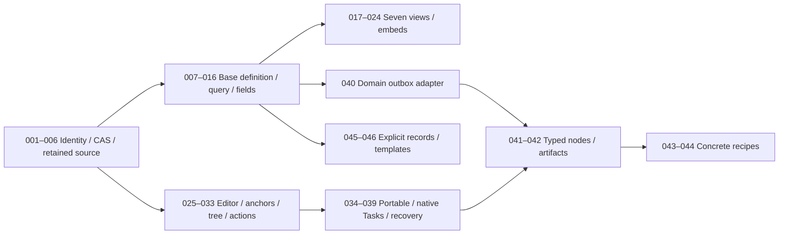
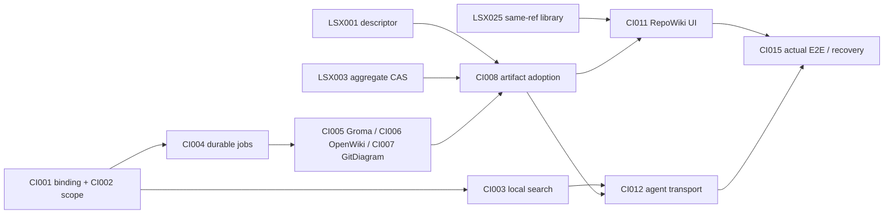

# План реализации: Docs, Bases, portable knowledge и automations

**Статус: PLANNED_NOT_EXECUTED. Cloud: PREPARED_NOT_LAUNCHED.** Подготовлено 2026-09-30. 46 новых bounded work packages, 116 prerequisite edges; этот документ не запускает workers и не реализует product. Product baseline/source SHA: `e953786ba7e30fb5da5dca7e88e20e324d5aebab`.

Машинные контракты: [work-packages.json](../../plans/lark-suite-reference/work-packages.json), [dependency-dag.json](../../plans/lark-suite-reference/dependency-dag.json). Полная карточка каждого пакета содержит goal/why/owner/dependencies, проверенные пути/символы, proposed files, entities/I/O/API/DB/events/ACL/UI/realtime, tests, seeded negative control, acceptance/DoD, risks/complexity/spec refs/related issues и prepared cloud packet.

## 1. Границы программы и уже опубликованные требования

Новый пакет уточняет конкретные vertical slices из [Bases](05-rox-bases-design.md), [Docs](06-rox-docs-design.md), [entity model](07-domain-entity-model.md) и [automations](08-automation-integration.md). Существующие [30 RS issues](../rox-suite/README.md), [publication receipt](../../plans/rox-suite/publication.json) и [52 Macro WPs](../macro-integration/21-implementation-plan.md) остаются самостоятельными программами. Связанные #1091–#1120 указывают совместимые owners/interfaces; их publication не означает backend readiness. Ни один новый пакет не поручает заново целиком строить Docs, Bases, Forms, Approval, generic collaboration или второй Automation builder.

Дополнительный scope — source-scoped identity; mandatory CAS/lossless writes; 18 typed fields и 7 query-equivalent views; стабильное Map/Outline дерево; anchors/portable roundtrip; typed constructor nodes и проверяемые recipes. Optional genealogy, geography, evidence packages из references не обязательны для core DoD и не получат скрытого расширения scope.

## 2. Product SHA и specification delivery — разные входы

`product_baseline_sha` фиксирует apps/packages до реализации. Новые спецификации отсутствуют в этом commit, поэтому `reference_package_revision` и `reference_package_digest` оставлены **RESOLVE_FROM_DELIVERY_MANIFEST**. Lead сформирует delivery manifest после фактического commit/readback docs. Executor должен проверить immutable delivery commit, digest и каждый `spec_refs.path`, затем разрешённые prerequisite implementation commits. До разрешения placeholders или при hash mismatch **запуск запрещён fail closed**. Нельзя выполнить `git show product_baseline_sha:new-spec.md` и считать missing file разрешением игнорировать спецификацию.

У каждого prepared cloud packet `executor_run_id=null`, artifact state NOT_PRODUCED и readback NOT_RUN. Это reviewable task contract, а не scheduled/running cloud job. Implementation authority/capabilities prerequisites обозначены READINESS_NOT_VERIFIED до точного runtime receipt на конкретном commit.

## 3. Выбранная архитектура и обязательные invariants

| Решение | Реализация / проверка |
|---|---|
| Bases A + explicit B + portable C | Base Page хранит schema/view/query, native Tasks/Docs/Calendar остаются owners. Новый CustomRecord только явный page+contentKind=record payload; file-native format — import/export boundary. |
| Docs Markdown сначала | Existing note сохраняет ID; retained raw-span patches и единственный content authority. Rich-block mode только явный versioned cutover. Dual writable Markdown+JSON отвергнут. |
| Aggregate CAS | Один expectedRevision для текста/дерева/epoch. Epoch проверяется первым. structureRevision только diagnostic. Rebase — явная server operation с новым receipt. |
| Personal isolation | Task origin=(sourceStoreId,ownerPrincipalId,nativeId). Workspace binding явный; одинаковый nativeId из двух stores не объединяется. Import не делится личными источниками автоматически. |
| Legacy formulas | taskCount/openTaskCount остаются Markdown checkbox count под versioned legacy IDs. Native relation counts отдельные; promotion не меняет старые числа. |
| Permission-aware computation | ACL row/field перед filter/sort/formula/relation/aggregate/export. Denied filter поле rejected; cache actor/policy/snapshot scoped. |
| Text CRDT vs structure | Converged text не гарантирует валидное дерево. Move/delete ancestor vs concurrent text edit: text stable node retained либо явный conflict; late edit не resurrects subtree. |

Полные три alternatives и причины выбора находятся в 05§3/06§2; этот план применяет их и не выдает conceptual ERD за private Lark storage.

## 4. Проверенные code seams и реальные ограничения

В JSON 37 baseline blobs с SHA256 и exact symbol/line. SOURCE_VERIFIED_NOT_RUNTIME означает чтение source на `e953786ba7e30fb5da5dca7e88e20e324d5aebab`, без запуска продукта. Например:

| Existing seam | Реальный baseline | Required change |
|---|---|---|
| notes.ts saveNote | expectedRevision optional; read/check/writeFile без общей atomic CAS boundary | LSX-WP-003 mandatory revision/epoch/journal/receipts; LSX-WP-005 retained frontmatter patches |
| PersonalTaskPersistStore.put | monotonic revision; synchronous native per-task JSON; no caller expectedRevision | LSX-WP-002 scoped origin/binding; LSX-WP-004 conditional native commands |
| NoteBaseView/formulaValue | local v1; 4 fixed formulas based on Markdown row projection | LSX-WP-008 preserve meanings; LSX-WP-013 deterministic bounded formula engine |
| TiptapMarkdownEditor | existing React/Tiptap Markdown paths | retained source binding, semantic container/code/action extensions; no second editor framework |
| security.ts sanitizeForShell | shell metacharacter utility only | Does not provide actor/ACL enforcement. LSX-WP-033/041 use current scoped command validator. |
| RetryScheduler | webhook JSONL retries; documented single-process invariant, restart at-least-once | Not a general workflow step executor. LSX-WP-040/042 adapt proved durable owner outbox/step receipts, retain uncertainty. |

New proposed paths are verified absent at product baseline; naming indicates planned artifacts and can be revised through reviewed scope manifest. `existing_code` is read evidence, not blanket permission to rewrite each file.

## 5. Владение, параллельность и DAG

Actual author of these three planning artifacts: `/root/lark_business_research`; lead owns delivery, other docs and combined verification. Future product role assignments are UNASSIGNED, no agent IDs invented. Each WP owns a disjoint explicit proposed file list including its tests. Common existing files remain one `integration-owner`; worker returns narrow patch request to named symbols. Integration owner takes exclusive canonical-path lease and applies reviewed patches in dependency order. Parallel workers can develop independent new modules, but cannot race edits in NotesPage.tsx, note-views.ts, notes.ts, platform-contract.ts or existing graph runtime.

Dependencies are acceptance prerequisites, not reading order. A dependent is ready only after integrated artifact+authoritative readback receipts. Multiple packages mentioning same code seam do not become concurrent writers; resource_ownership lists claimants and one writer. Boundary schemas compile before downstream editor modules integrate. Failed acceptance blocks dependents while independent ready work can continue; preserved failed attempts cannot be counted as green sensitivity.

Диаграмма группирует workstreams; normative exact DAG — JSON. Она не заменяет индивидуальные prerequisites. Topological order:

`LSX-WP-001` → `LSX-WP-002` → `LSX-WP-003` → `LSX-WP-007` → `LSX-WP-004` → `LSX-WP-005` → `LSX-WP-011` → `LSX-WP-006` → `LSX-WP-009` → `LSX-WP-040` → `LSX-WP-008` → `LSX-WP-010` → `LSX-WP-026` → `LSX-WP-012` → `LSX-WP-013` → `LSX-WP-014` → `LSX-WP-025` → `LSX-WP-027` → `LSX-WP-028` → `LSX-WP-031` → `LSX-WP-032` → `LSX-WP-033` → `LSX-WP-015` → `LSX-WP-016` → `LSX-WP-018` → `LSX-WP-019` → `LSX-WP-020` → `LSX-WP-021` → `LSX-WP-029` → `LSX-WP-030` → `LSX-WP-039` → `LSX-WP-041` → `LSX-WP-017` → `LSX-WP-022` → `LSX-WP-034` → `LSX-WP-045` → `LSX-WP-023` → `LSX-WP-024` → `LSX-WP-035` → `LSX-WP-036` → `LSX-WP-037` → `LSX-WP-046` → `LSX-WP-038` → `LSX-WP-042` → `LSX-WP-044` → `LSX-WP-043`

## 6. Реестр новых vertical slices

### Контракты и authority

| ID | Slice / observable output | Dependencies | Complexity |
|---|---|---|---|
| LSX-WP-001 | Page content descriptor и совместимое открытие Notes | нет | L |
| LSX-WP-002 | Личные Task source bindings и изолированный picker | LSX-WP-001 | XL |
| LSX-WP-003 | Атомарная запись Markdown с CAS/epoch/receipt | LSX-WP-001 | XL |
| LSX-WP-004 | Canonical Task field command с revision и partial receipts | LSX-WP-002 | XL |
| LSX-WP-005 | Lossless Markdown/YAML raw-span patch и field readback | LSX-WP-003 | XL |
| LSX-WP-006 | Stable block/node anchors без переписывания prose | LSX-WP-005 | L |

### Bases schema и query

| ID | Slice / observable output | Dependencies | Complexity |
|---|---|---|---|
| LSX-WP-007 | Сохраняемая BaseDefinition и private/shared views | LSX-WP-001 | L |
| LSX-WP-008 | Миграция NoteBaseView v1 с неизменными legacy formulas | LSX-WP-006, LSX-WP-007 | L |
| LSX-WP-009 | Source adapters Notes/Tasks/Projects/Meetings/Calendar | LSX-WP-002, LSX-WP-003, LSX-WP-004, LSX-WP-007 | XL |
| LSX-WP-010 | Permission-aware query snapshot, cursor и totals | LSX-WP-009 | XL |
| LSX-WP-011 | Реестр 18 typed fields и schema inspector | LSX-WP-007 | L |
| LSX-WP-013 | Bounded formula engine и legacy built-ins | LSX-WP-008, LSX-WP-010, LSX-WP-011 | XL |
| LSX-WP-014 | Relations picker, cardinality и inverse recovery | LSX-WP-002, LSX-WP-010, LSX-WP-011 | XL |
| LSX-WP-015 | ACL-filtered Lookup/Rollup и actor-scoped cache | LSX-WP-013, LSX-WP-014 | L |
| LSX-WP-016 | Schema migration preview/type rename/soft delete | LSX-WP-012, LSX-WP-013, LSX-WP-014 | XL |

### Bases views и owner writes

| ID | Slice / observable output | Dependencies | Complexity |
|---|---|---|---|
| LSX-WP-012 | Typed scalar cell editors с native write preview | LSX-WP-004, LSX-WP-005, LSX-WP-010, LSX-WP-011 | L |
| LSX-WP-017 | Table grid: typed edits, rectangle paste и readback | LSX-WP-012, LSX-WP-015, LSX-WP-016 | XL |
| LSX-WP-018 | Board: native status transition и keyboard move | LSX-WP-012, LSX-WP-010 | L |
| LSX-WP-019 | List: native checkbox и eligible bulk actions | LSX-WP-012, LSX-WP-010 | M |
| LSX-WP-020 | Gallery и typed Image/Audio/Video cells с asset ACL | LSX-WP-011, LSX-WP-012, LSX-WP-010 | L |
| LSX-WP-021 | Calendar Base date precision и native/provider capabilities | LSX-WP-012, LSX-WP-009, LSX-WP-010 | L |
| LSX-WP-022 | Timeline interval move/resize с native atomic bounds | LSX-WP-021 | L |
| LSX-WP-023 | Chart агрегаты и authorized drill-down | LSX-WP-015, LSX-WP-017 | L |

### Docs и shared views

| ID | Slice / observable output | Dependencies | Complexity |
|---|---|---|---|
| LSX-WP-024 | Doc Base embed и actor-scoped range context | LSX-WP-010, LSX-WP-013, LSX-WP-017 | L |
| LSX-WP-025 | Docs library capability filter и same-ref navigation | LSX-WP-001, LSX-WP-010 | M |
| LSX-WP-026 | Existing Tiptap binding, durable draft и history restore | LSX-WP-003, LSX-WP-005, LSX-WP-006 | XL |
| LSX-WP-027 | Discussion anchors, orphan state и private-comment migration | LSX-WP-006, LSX-WP-026 | XL |
| LSX-WP-028 | Editable Outline structural commands с aggregate CAS | LSX-WP-003, LSX-WP-006, LSX-WP-026 | XL |
| LSX-WP-029 | Mind map layout/viewport по тому же tree | LSX-WP-028 | L |
| LSX-WP-031 | Semantic tabs/columns и safe basic Markdown fallback | LSX-WP-006, LSX-WP-026 | L |
| LSX-WP-032 | Code/highlight presentation без исполнения или false redaction | LSX-WP-026 | L |
| LSX-WP-033 | Action Buttons typed registry и inert imports | LSX-WP-003, LSX-WP-004, LSX-WP-026 | XL |

### Portable knowledge и native Tasks

| ID | Slice / observable output | Dependencies | Complexity |
|---|---|---|---|
| LSX-WP-030 | Conversion preview copy/inPlace с CAS и rollback | LSX-WP-005, LSX-WP-006, LSX-WP-028 | XL |
| LSX-WP-034 | Portable vault import staged identities/attachments | LSX-WP-002, LSX-WP-005, LSX-WP-006, LSX-WP-016 | XL |
| LSX-WP-035 | Base export/import .base/CSV/JSON с loss reports | LSX-WP-013, LSX-WP-015, LSX-WP-016, LSX-WP-034 | XL |
| LSX-WP-036 | Map/Outline exports MD/OPML/Canvas/PNG/SVG | LSX-WP-029, LSX-WP-030, LSX-WP-034 | L |
| LSX-WP-037 | Checkbox→native Task и TaskNotes origin mapping | LSX-WP-004, LSX-WP-006, LSX-WP-034 | L |
| LSX-WP-038 | Docs day-planner binding без нового timer/notification loop | LSX-WP-021, LSX-WP-037 | M |
| LSX-WP-039 | Offline structural intents, recovery и revoke fence | LSX-WP-028, LSX-WP-026 | XL |

### Automation extensions и recipes

| ID | Slice / observable output | Dependencies | Complexity |
|---|---|---|---|
| LSX-WP-040 | Docs/Bases domain-outbox→existing automation aliases | LSX-WP-003, LSX-WP-004, LSX-WP-007 | XL |
| LSX-WP-041 | Existing constructor typed Docs/Base nodes и field-ID mappings | LSX-WP-010, LSX-WP-013, LSX-WP-033, LSX-WP-040 | XL |
| LSX-WP-042 | Revision-pinned artifact/approval nodes и safe retry receipts | LSX-WP-033, LSX-WP-036, LSX-WP-040, LSX-WP-041 | XL |
| LSX-WP-043 | Weekly Report workflow recipe с scoped draft/owner review | LSX-WP-024, LSX-WP-037, LSX-WP-041, LSX-WP-042 | L |
| LSX-WP-044 | Form submission→native Task/Base recipe без второй task DB | LSX-WP-004, LSX-WP-037, LSX-WP-040, LSX-WP-041 | L |

### Optional explicit records и templates

| ID | Slice / observable output | Dependencies | Complexity |
|---|---|---|---|
| LSX-WP-045 | Explicit CustomRecord page payload для нового типа данных | LSX-WP-001, LSX-WP-007, LSX-WP-010, LSX-WP-011, LSX-WP-016 | L |
| LSX-WP-046 | Versioned template gallery с inert actions и bounded creation | LSX-WP-001, LSX-WP-026, LSX-WP-031, LSX-WP-033, LSX-WP-034, LSX-WP-045 | L |

## 7. Карточки пакетов: конкретные verification outcomes

### LSX-WP-001 — Page content descriptor и совместимое открытие Notes

**Goal:** Один existing Note/Page открывается как Doc или Base без смены ID; descriptor выбирает единственный content owner. **Почему:** Иначе новое имя Docs создаст дубликаты содержимого, ссылок и прав.

**Owner:** platform (UNASSIGNED). **Depends:** нет. **Size:** L. **Status:** PLANNED_NOT_EXECUTED.

**Inputs → outputs:** existing EntityRef; descriptor version/contentKind=document|base|record; legacy note origin; authorityEpoch → canonical page ref + legacy alias; format/capability descriptor; unknown-version read-only diagnostic.

**API:** content.resolve(ref); content.describe(ref); content.adoptDescriptor(ref,expectedRevision,descriptor). **DB/owner:** Additive descriptor + durable origin/alias map; PageKind static/interactive/live сохраняется.

**Events/realtime:** content.descriptorChanged; aliases preserve native IDs; Descriptor revision/epoch update invalidates all document views. **ACL:** Resolve checks actor/source policy before title; descriptor is not a grant.

**UI:** Existing note route opens same document; authority badge and unknown-format status.

**Existing exact seams:** packages/core/src/rox2/platform-contract.ts (Rox2EntityRef:233, registerExternalBinding:336, authorizeRox2Action:601); packages/core/src/types/page.ts (PageKind:35, PageConfig:294); packages/core/src/rox2/notes-repository.ts (NotesRepository:27, createNotesRepository:32); apps/electron/src/renderer/lib/navigation-registry.ts (NavigationRegistry:118).

**Proposed new files:** `packages/core/src/docs/content-descriptor.ts`, `packages/server-core/src/docs/descriptor-resolver.ts`. Package test paths and restricted cloud allowlist находятся в JSON.

**Tests:** V1/V2 decode; legacy route reload; unknown descriptor retains bytes; same origin maps once; conflicting alias quarantined. **Seeded broken control:** Заменить note IDs новыми UUID при открытии descriptor. **Required rejecting assertions:** same input origin returns identical canonical ref before/after reload; old backlinks resolve without new entity count.

**Acceptance/DoD:** Note/Page ID and content hash unchanged; one content authority; no document/base/record top-level kind introduced; common gates §9 обязаны пройти на implementation bytes. **Risk:** Legacy path IDs may collide; HTML PageKind semantics must remain separate

**Spec refs:** docs/lark-suite-reference/06-rox-docs-design.md §1–2; docs/lark-suite-reference/07-domain-entity-model.md §2–3. **Related existing scopes:** [RS-DOC-01/#1110](https://github.com/rox-one/rox-one/issues/1110), [RS-NOTE-01/#1112](https://github.com/rox-one/rox-one/issues/1112). **External readiness gates:** EG-IDENTITY.

### LSX-WP-002 — Личные Task source bindings и изолированный picker

**Goal:** Две личные Tasks с одинаковым nativeId из разных stores остаются разными; workspace видит только явно разрешённый source binding. **Почему:** Workspace selector не доказывает владение личным конфигом.

**Owner:** identity (UNASSIGNED). **Depends:** LSX-WP-001. **Size:** XL. **Status:** PLANNED_NOT_EXECUTED.

**Inputs → outputs:** sourceStoreId + ownerPrincipalId + nativeId; actor from authenticated transport; explicit allowed workspace binding + policyVersion → namespaced EntityRef; allowed source choices with capabilities; denied response without title/body.

**API:** base.bindPersonalSource(binding,expectedBindingRevision); base.listAllowedSources(workspaceId). **DB/owner:** Composite unique origin; mappings never auto-share imported personal tasks.

**Events/realtime:** base.sourceBindingChanged; Revoked binding closes source subscription and clears permitted projections. **ACL:** Recheck current owner/workspace binding at read, query and write; nativeId-only lookup rejected.

**UI:** Source picker explains personal owner and audience; same-title sources distinguish provenance.

**Existing exact seams:** packages/core/src/rox2/platform-contract.ts (Rox2EntityRef:233, registerExternalBinding:336, authorizeRox2Action:601); packages/server-core/src/tasks/personal-persist.ts (PersonalTaskPersistStore:74, parsePersonalTaskPersistFile:57); packages/server-core/src/handlers/rpc/personal-tasks.ts (registerPersonalTasksHandlers:38, personalTasksStore:29); packages/core/src/tasks/personal/types.ts (PersonalTask:42, TaskLink:17, Recurrence:24).

**Proposed new files:** `packages/core/src/bases/source-binding.ts`, `packages/server-core/src/bases/personal-source-binding.ts`. Package test paths and restricted cloud allowlist находятся в JSON.

**Tests:** two stores same nativeId; wrong principal denied; migration preserves personal privacy after restart. **Seeded broken control:** Удалить sourceStoreId/ownerPrincipalId из cache/key lookup. **Required rejecting assertions:** two origins yield two refs; unbound viewer receives no task title/count.

**Acceptance/DoD:** No guessed UI-workspace ownership; explicit binding receipt survives reload; personal tasks remain private; common gates §9 обязаны пройти на implementation bytes. **Risk:** Current personal RPC is contextless and config-dir scoped; must not expose unchanged handler remotely

**Spec refs:** docs/lark-suite-reference/07-domain-entity-model.md §2,7,9; docs/lark-suite-reference/05-rox-bases-design.md §4,9–10. **Related existing scopes:** [RS-BASE-01/#1094](https://github.com/rox-one/rox-one/issues/1094), [RS-NOTE-01/#1112](https://github.com/rox-one/rox-one/issues/1112). **External readiness gates:** EG-IDENTITY.

### LSX-WP-003 — Атомарная запись Markdown с CAS/epoch/receipt

**Goal:** Edit существующего Doc подтверждается только после atomic revision commit; конкурентный writer получает conflict и сохраняет draft. **Почему:** Optional expectedRevision + check/write gap теряет подтверждённый текст.

**Owner:** docs-authority (UNASSIGNED). **Depends:** LSX-WP-001. **Size:** XL. **Status:** PLANNED_NOT_EXECUTED.

**Inputs → outputs:** documentRef + mandatory expectedRevision; authorityEpoch + operationId/idempotencyKey; raw content or validated patches; actor transport → committed revision/hash + eventIds; typed conflict currentRevision; no protected body on denied; same-key replay returns original receipt.

**API:** doc.commitMarkdown(envelope); doc.getCommitReceipt(commandId). **DB/owner:** Per-document serialization + journal/atomic rename recovery; content, receipt and outbox intent share recoverable boundary.

**Events/realtime:** document.revisionCommitted; Only committed event advances editor/query projection; external watcher distinguishes owned commit. **ACL:** Epoch checked before CAS/rebase; current edit grant required; legacy shared write fenced.

**UI:** save states pending/committed/conflict; conflict compare/copy retains local text.

**Existing exact seams:** packages/server-core/src/handlers/rpc/notes.ts (saveNote:502, registerNotesHandlers:974, updateNoteProperties:608); packages/core/src/rox2/notes-engine.ts (NativeNotesEngine:366, parseBlocks:137, contentHash:75); apps/electron/src/renderer/pages/NotesPage.tsx (saveCurrentNote:871); packages/shared/src/protocol/channels.ts (RPC_CHANNELS:6).

**Proposed new files:** `packages/server-core/src/docs/markdown-commit.ts`, `packages/core/src/docs/command-envelope.ts`. Package test paths and restricted cloud allowlist находятся в JSON.

**Tests:** two writes same expectedRevision exactly one commit; crash before rename/after content/before receipt recovers one acknowledged revision; external file write conflict preserves newer bytes. **Seeded broken control:** Отключить revision comparison или epoch fence перед writeFile. **Required rejecting assertions:** stale writer cannot overwrite committed hash; old epoch rejects even with matching content hash; same key produces one receipt/event.

**Acceptance/DoD:** mandatory CAS on all write paths; durable ACK survives restart; no check/write race; common gates §9 обязаны пройти на implementation bytes. **Risk:** File-system writers outside authority need watcher/conflict recovery; atomic rename alone is not conditional CAS

**Spec refs:** docs/lark-suite-reference/06-rox-docs-design.md §1,10–11; docs/lark-suite-reference/07-domain-entity-model.md §8–9. **Related existing scopes:** [RS-DOC-01/#1110](https://github.com/rox-one/rox-one/issues/1110), [RS-NOTE-01/#1112](https://github.com/rox-one/rox-one/issues/1112). **External readiness gates:** EG-IDENTITY, EG-EFFECTS.

### LSX-WP-004 — Canonical Task field command с revision и partial receipts

**Goal:** Из Base можно изменять existing Task через native validator с expectedRevision; batch возвращает результат каждой Task. **Почему:** Current PUT whole bundles has no expectedRevision; Base must not become another task database.

**Owner:** tasks (UNASSIGNED). **Depends:** LSX-WP-002. **Size:** XL. **Status:** PLANNED_NOT_EXECUTED.

**Inputs → outputs:** scoped Task ref + expectedRevision; typed field patch or native transition; batch refs/revisions + stable idempotency key → one native revision/receipt per target; conflict/denied/unsupported per row; native Tasks readback.

**API:** task.patchFields(envelope); task.previewBatch(targets,patch); task.applyBatch(previewDigest). **DB/owner:** Revisioned native per-task JSON writes + source-scoped receipt journal; no Base-owned task rows.

**Events/realtime:** task.updated; alias existing personalTasks.CHANGED; Canonical task event invalidates Tasks and Base; optimistic cell pending is not commit. **ACL:** Personal binding/current action/field rights on each row and replay; batch scope digest revalidated.

**UI:** Native Task detail and Base editor show same committed value; partial/skipped report before apply.

**Existing exact seams:** packages/server-core/src/tasks/personal-persist.ts (PersonalTaskPersistStore:74, parsePersonalTaskPersistFile:57); packages/server-core/src/handlers/rpc/personal-tasks.ts (registerPersonalTasksHandlers:38, personalTasksStore:29); packages/core/src/tasks/personal/store.ts (PersonalTaskStore:73, CreateTaskInput:32); packages/server-core/src/tasks/personal-tasks-service.ts (putPersonalTasks:38, migratePersonalTasks:63); apps/electron/src/renderer/lib/personal-tasks-sync.ts (diffPersonalTaskBundles:65, bundleFromSnapshot:42).

**Proposed new files:** `packages/server-core/src/tasks/personal-task-commands.ts`, `packages/core/src/bases/task-field-mapping.ts`. Package test paths and restricted cloud allowlist находятся в JSON.

**Tests:** five targets incl denied+stale return five outcomes; duplicate batch replay does not reapply; restart retains revision; existing local personal task regression. **Seeded broken control:** Записать patch в Base-local copy вместо PersonalTaskPersistStore. **Required rejecting assertions:** native task readback changes same scoped ref; Base-local mirror absence; five receipts reconcile accepted/refused rows.

**Acceptance/DoD:** no fake all-or-nothing across mixed owners; native validation/transition semantics retained; common gates §9 обязаны пройти на implementation bytes. **Risk:** Existing synchronous put is monotonic but not CAS; bulk meta and task transactions need explicit bounds

**Spec refs:** docs/lark-suite-reference/05-rox-bases-design.md §4,9; docs/lark-suite-reference/07-domain-entity-model.md §2,6,8. **Related existing scopes:** [RS-BASE-01/#1094](https://github.com/rox-one/rox-one/issues/1094). **External readiness gates:** EG-IDENTITY, EG-EFFECTS.

### LSX-WP-005 — Lossless Markdown/YAML raw-span patch и field readback

**Goal:** Изменение одного frontmatter field сохраняет все неизвестные YAML comments, EOL/BOM и неотредактированные bytes. **Почему:** Full YAML serialization меняет чужие свойства и portable исходник.

**Owner:** docs-format (UNASSIGNED). **Depends:** LSX-WP-003. **Size:** XL. **Status:** PLANNED_NOT_EXECUTED.

**Inputs → outputs:** raw UTF-8 bytes + source hash; typed key path/value + expectedRevision; CST spans and markerMappingVersion → exact changed spans + loss report; byte-identical no-op; patched source through doc.commitMarkdown.

**API:** doc.previewPropertyPatch(ref,fieldId,value); doc.applyPropertyPatch(envelope). **DB/owner:** Retained CST/source snapshot; unknown YAML preserved; cache never authority.

**Events/realtime:** document.revisionCommitted with changed property IDs; Property and body projections refresh at one committed revision. **ACL:** Same Doc field edit/export grants; denied properties unavailable to diff previews.

**UI:** Property editor shows raw key/unit/type and proposed diff; unsupported YAML keeps read-only/repair-copy.

**Existing exact seams:** packages/server-core/src/handlers/rpc/notes.ts (saveNote:502, registerNotesHandlers:974, updateNoteProperties:608); packages/core/src/rox2/notes-engine.ts (NativeNotesEngine:366, parseBlocks:137, contentHash:75); packages/server-core/src/knowledge/vault-markdown.ts (parseVaultMarkdown:115, noteIdFromRelativePath:77, ParsedVaultNote:54); apps/electron/src/renderer/pages/notes/document-ia.ts (extractBlockIds:182, parseNoteDocument:655, serializeColumns:228, roundTripNoteMarkdown:702).

**Proposed new files:** `packages/core/src/docs/retained-source.ts`, `packages/core/src/docs/frontmatter-patches.ts`. Package test paths and restricted cloud allowlist находятся в JSON.

**Tests:** BOM/CRLF/comments/quoted scalars/unknown tags/anchors multiline fixtures; no-op hash equality; bytes outside selected spans identical; concurrent external edit rejects preview CAS. **Seeded broken control:** Заменить retained patcher полной YAML stringify/body normalization. **Required rejecting assertions:** fixture bytes outside patch unchanged; no-op hash equals input; unknown keys/comments/order survive reload/export.

**Acceptance/DoD:** lossless nonedited bytes under declared supported formats; malformed YAML never overwritten with empty properties; common gates §9 обязаны пройти на implementation bytes. **Risk:** YAML aliases/complex keys require explicit unsupported diagnostic; portable key rename separate migration

**Spec refs:** docs/lark-suite-reference/06-rox-docs-design.md §1,8,10; docs/lark-suite-reference/05-rox-bases-design.md §10–11. **Related existing scopes:** [RS-NOTE-01/#1112](https://github.com/rox-one/rox-one/issues/1112). **External readiness gates:** EG-EFFECTS.

### LSX-WP-006 — Stable block/node anchors без переписывания prose

**Goal:** Doc/Map/Outline используют одну stable node identity; imported ^abc и ROX markers сохраняют mapping. **Почему:** Offset/title/duplicate quote неустойчивы после reorder и ломают links/comments.

**Owner:** docs-format (UNASSIGNED). **Depends:** LSX-WP-005. **Size:** L. **Status:** PLANNED_NOT_EXECUTED.

**Inputs → outputs:** retained Markdown spans; existing ROX marker or Obsidian block ID; marker version + source revision → typed tree with retained prose spans; stable block↔node map; duplicate/malformed diagnostic.

**API:** doc.getBlockTree(ref,revision); doc.previewMarkerMapping(ref,policy). **DB/owner:** Versioned block map scoped to authority epoch; no text duplication into layout metadata.

**Events/realtime:** document.blockMappingChanged; Tree projection built from committed source revision only. **ACL:** Tree/quote content returned only after Doc read grant; IDs alone grant nothing.

**UI:** Source badges/deep links resolve stable nodes; duplicate marker repair preview.

**Existing exact seams:** packages/core/src/rox2/notes-engine.ts (NativeNotesEngine:366, parseBlocks:137, contentHash:75); apps/electron/src/renderer/pages/notes/document-ia.ts (extractBlockIds:182, parseNoteDocument:655, serializeColumns:228, roundTripNoteMarkdown:702); packages/server-core/src/knowledge/vault-markdown.ts (parseVaultMarkdown:115, noteIdFromRelativePath:77, ParsedVaultNote:54).

**Proposed new files:** `packages/core/src/docs/block-identity.ts`, `packages/core/src/docs/list-tree.ts`. Package test paths and restricted cloud allowlist находятся в JSON.

**Tests:** duplicate text different IDs; reorder retains anchors; frontmatter-first stamping; malformed duplicate IDs no silent merge. **Seeded broken control:** Сгенерировать IDs из текущего offset или текста каждого parse. **Required rejecting assertions:** existing block IDs unchanged through edit/reorder/reload; duplicate quotes remain distinct nodes.

**Acceptance/DoD:** prose/tables/code retained outside list tree; opaque unknown blocks survive mapping; common gates §9 обязаны пройти на implementation bytes. **Risk:** Marker insertion itself is content mutation with preview/CAS; cannot stamp on every read

**Spec refs:** docs/lark-suite-reference/06-rox-docs-design.md §7–8,10; docs/lark-suite-reference/07-domain-entity-model.md §5,9. **Related existing scopes:** [RS-DOC-01/#1110](https://github.com/rox-one/rox-one/issues/1110), [RS-NOTE-01/#1112](https://github.com/rox-one/rox-one/issues/1112).

### LSX-WP-007 — Сохраняемая BaseDefinition и private/shared views

**Goal:** Созданный Base имеет canonical page ref/config revision; shared config и personal viewport не смешиваются. **Почему:** LocalStorage cannot be only Base storage or imply publication to workspace.

**Owner:** bases-schema (UNASSIGNED). **Depends:** LSX-WP-001. **Size:** L. **Status:** PLANNED_NOT_EXECUTED.

**Inputs → outputs:** page ref contentKind=base; SourceSelector + FieldDefinitions; shared/private scope + expected configRevision → persisted schema/view revision; same Base ref after restart; personal preferences scoped workspace/page/view/schemaVersion.

**API:** base.createDefinition(input); base.patchViewConfig(envelope); base.getDefinition(ref). **DB/owner:** Page-owned schema/config + separate personal preferences; no embedded authoritative Task array.

**Events/realtime:** base.viewChanged; base.schemaChanged; Config event separate from row data; config conflict does not roll back task commit. **ACL:** Only authorized editor mutates shared config; personal view does not publish automatically.

**UI:** Create Base source preview; tabs/config scope badge; corrupt/future configs read-only.

**Existing exact seams:** apps/electron/src/renderer/pages/notes/note-views.ts (NoteBaseView:24, projectNoteRows:133, formulaValue:188, notesViewsStorageKey:100); apps/electron/src/renderer/pages/notes/NotesViewHost.tsx (NotesViewHost:58, NotesViewNote:48); packages/core/src/types/page.ts (PageKind:35, PageConfig:294); packages/core/src/rox2/platform-contract.ts (Rox2EntityRef:233, registerExternalBinding:336, authorizeRox2Action:601).

**Proposed new files:** `packages/core/src/bases/definition.ts`, `packages/server-core/src/bases/definition-store.ts`. Package test paths and restricted cloud allowlist находятся в JSON.

**Tests:** create/reload duplicate view keeps row refs; reader personal prefs cannot overwrite shared layout; future version retains original serialized payload. **Seeded broken control:** Использовать global localStorage key и единственную shared config copy. **Required rejecting assertions:** two actors have isolated viewport/search; shared view survives new client reload; rows not duplicated.

**Acceptance/DoD:** one Page ref; schema/view revision separate rowRevision; duplicate view != duplicate dataset; common gates §9 обязаны пройти на implementation bytes. **Risk:** PageConfig HTML dashboard must retain old enum; canonical Page storage prerequisite

**Spec refs:** docs/lark-suite-reference/05-rox-bases-design.md §4,7,9–10; docs/lark-suite-reference/07-domain-entity-model.md §3,5. **Related existing scopes:** [RS-BASE-01/#1094](https://github.com/rox-one/rox-one/issues/1094). **External readiness gates:** EG-IDENTITY, EG-EFFECTS.

### LSX-WP-008 — Миграция NoteBaseView v1 с неизменными legacy formulas

**Goal:** Existing notes:views data мигрирует в personal Base config с четырьмя прежними формулами и rollback receipt. **Почему:** taskCount сейчас считает Markdown checkboxes; смена на native Tasks изменит старые числа.

**Owner:** bases-schema (UNASSIGNED). **Depends:** LSX-WP-006, LSX-WP-007. **Size:** L. **Status:** PLANNED_NOT_EXECUTED.

**Inputs → outputs:** NoteBaseView v1 JSON + source hash; workspace/user namespace; legacy checkbox/backlink/tag values → new personal BaseDefinition ref; legacy.markdownTaskCount.v1 / legacy.markdownOpenTaskCount.v1; preserved pre-migration payload + readback receipt.

**API:** base.previewLegacyViewMigration(input); base.applyLegacyViewMigration(digest). **DB/owner:** Resumable migration journal and original keys preserved until canonical readback; rollback mapping retained.

**Events/realtime:** base.viewMigrated; New config activated only after validated readback; no automatic shared event fanout. **ACL:** Local private views stay private; owner-wide backlinks require current authorized semantics.

**UI:** Migration diff lists filter/sort/group/formula mappings; no silent clear/reset on corrupt input.

**Existing exact seams:** apps/electron/src/renderer/pages/notes/note-views.ts (NoteBaseView:24, projectNoteRows:133, formulaValue:188, notesViewsStorageKey:100); apps/electron/src/renderer/pages/notes/NotesViewHost.tsx (NotesViewHost:58, NotesViewNote:48); apps/electron/src/renderer/pages/notes/document-ia.ts (extractBlockIds:182, parseNoteDocument:655, serializeColumns:228, roundTripNoteMarkdown:702).

**Proposed new files:** `packages/core/src/bases/legacy-view-migration.ts`, `packages/server-core/src/bases/view-migration-journal.ts`. Package test paths and restricted cloud allowlist находятся в JSON.

**Tests:** v1 filter/sort order equality; note 3 checkboxes/2 open and linked 1 native task still reports3/2; failed readback keeps old keys. **Seeded broken control:** Подменить taskCount значением relation.nativeTaskCount.v1. **Required rejecting assertions:** legacy3/2 results equal before/after; native count separately1; old localStorage survives failed readback.

**Acceptance/DoD:** same current meaning for all4 built-ins; future/corrupt version exportable and not overwritten; common gates §9 обязаны пройти на implementation bytes. **Risk:** Legacy backlink counts may need permission-aware recomputation without leaking restricted source

**Spec refs:** docs/lark-suite-reference/05-rox-bases-design.md §10; docs/lark-suite-reference/07-domain-entity-model.md §6,9. **Related existing scopes:** [RS-BASE-01/#1094](https://github.com/rox-one/rox-one/issues/1094), [RS-NOTE-01/#1112](https://github.com/rox-one/rox-one/issues/1112).

### LSX-WP-009 — Source adapters Notes/Tasks/Projects/Meetings/Calendar

**Goal:** Один Base query получает refs/revisions/capabilities текущих owners; unsupported sources честно read-only/unavailable. **Почему:** Adapters keep domain identity and provider semantics while sharing renderers.

**Owner:** bases-adapters (UNASSIGNED). **Depends:** LSX-WP-002, LSX-WP-003, LSX-WP-004, LSX-WP-007. **Size:** XL. **Status:** PLANNED_NOT_EXECUTED.

**Inputs → outputs:** registered sourceBinding + permitted source refs; field mapping + schemaRevision; provider connection/capability state → typed rows with owner/ref/revision/freshness; per-field read/write/create capabilities; missing-provider/dependency reason.

**API:** base.describeSource(binding); base.readSourceRows(binding,queryContext). **DB/owner:** Projection cache is rebuildable; Tasks/Calendar content stays in current native/provider owner.

**Events/realtime:** source.capabilitiesChanged; source.snapshotAdvanced; Capability/revision change invalidates projections; provider queued != acknowledged. **ACL:** Adapter checks source namespace, current policy and field grants; read-only not inferred from missing value.

**UI:** Source picker sample3 rows; native detail/open-source buttons; disabled create before input.

**Existing exact seams:** packages/core/src/rox2/notes-repository.ts (NotesRepository:27, createNotesRepository:32); packages/core/src/tasks/personal/projections.ts (buildTodayPlan:207, taskCalendarAt:101, projectTasks:13); packages/core/src/rox2/project-membership.ts (portfolioEntityIds:158, visibleProjectsForEntity:171); packages/core/src/calendar/types.ts (CalendarEvent:22, calendarEventIdentity:103, CalendarBundle:86); packages/core/src/rox2/surface-context.ts (bindSurfaceContext:31, visibleContextEntityRefs:51, rebaseLiveContext:76); packages/server-core/src/handlers/rpc/knowledge.ts (registerKnowledgeHandlers:491, KnowledgeViewRunArgs:404).

**Proposed new files:** `packages/server-core/src/bases/source-adapters.ts`, `packages/core/src/bases/source-capabilities.ts`. Package test paths and restricted cloud allowlist находятся в JSON.

**Tests:** same task ref across native and Base; two Calendar accounts same remoteID remain separate; meeting unavailable reports missing adapter, not fabricated row. **Seeded broken control:** Скопировать Task records в Base store или объединить calendar IDs без account namespace. **Required rejecting assertions:** native owner equality and no mirror store; calendar refs distinct by account/calendar/event.

**Acceptance/DoD:** all5 source descriptors expose explicit capabilities; unsupported field distinct from empty/null; common gates §9 обязаны пройти на implementation bytes. **Risk:** Meeting/Project authority implementation may depend on Macro lanes; adapter readiness must be proven

**Spec refs:** docs/lark-suite-reference/05-rox-bases-design.md §2,4,9,13; docs/lark-suite-reference/07-domain-entity-model.md §1–2,5. **Related existing scopes:** [RS-BASE-01/#1094](https://github.com/rox-one/rox-one/issues/1094). **External readiness gates:** EG-DOMAIN-OWNERS.

### LSX-WP-010 — Permission-aware query snapshot, cursor и totals

**Goal:** Пользователь получает только разрешённые rows/fields до filter/sort/formula/aggregate; pagination закреплена в query snapshot. **Почему:** Denied filter/count/relation can reveal hidden data even if rows later removed.

**Owner:** bases-query (UNASSIGNED). **Depends:** LSX-WP-009. **Size:** XL. **Status:** PLANNED_NOT_EXECUTED.

**Inputs → outputs:** actor transport + sourceBinding; typed filterAST/sorts/fields + schemaRevision; snapshot cursor + evaluationTime/timezone → permitted rows/cursor/authorized aggregates; queryRevision + permissionEpoch + freshness; denied-field query rejection.

**API:** base.query(input); base.getQueryWatermark(queryRef). **DB/owner:** Cursor binds filter/sort/schema/source/policy revisions; stable EntityRef tie-break; permitted aggregate covers all pages.

**Events/realtime:** base.queryInvalidated; Event/policy watermark advances or explicitly invalidates cursor; revoked cache never reused. **ACL:** Authorize rows/fields before all computation; denied field in filter rejected instead of side-channel.

**UI:** Toolbar snapshot/freshness/help; empty/loading/error/stale states; no guessed totals.

**Existing exact seams:** packages/core/src/rox2/platform-contract.ts (Rox2EntityRef:233, registerExternalBinding:336, authorizeRox2Action:601); packages/server-core/src/knowledge/vault-index.ts (queryVaultDocuments:807, hashVaultMarkdownFiles:938, applyVaultWatchTick:978); packages/core/src/rox2/project-membership.ts (portfolioEntityIds:158, visibleProjectsForEntity:171); packages/core/src/rox2/surface-context.ts (bindSurfaceContext:31, visibleContextEntityRefs:51, rebaseLiveContext:76).

**Proposed new files:** `packages/server-core/src/bases/query-service.ts`, `packages/core/src/bases/query-contract.ts`. Package test paths and restricted cloud allowlist находятся в JSON.

**Tests:** viewer row1=10 vs owner rows1+2=30 across paging; denied field filtering fails; policy revocation between pages invalidates snapshot. **Seeded broken control:** Вычислить totals и sort до ACL или убрать policy fingerprint из cache key. **Required rejecting assertions:** viewer total10 not30; no hidden title/count in response/errors; old cursor cannot cross new policy epoch.

**Acceptance/DoD:** same query identity for all7 views; consistent pagination excludes duplicate/skipped refs; common gates §9 обязаны пройти на implementation bytes. **Risk:** Large source pagination may require bounded server materialization; budgets must return diagnostic

**Spec refs:** docs/lark-suite-reference/05-rox-bases-design.md §6–8,14; docs/lark-suite-reference/07-domain-entity-model.md §6–8. **Related existing scopes:** [RS-BASE-01/#1094](https://github.com/rox-one/rox-one/issues/1094). **External readiness gates:** EG-IDENTITY.

### LSX-WP-011 — Реестр 18 typed fields и schema inspector

**Goal:** Создание поля проверяет storage/editor/filter/comparator/import semantics ровно18 core types. **Почему:** Loose strings make money/date/phone coercion and derived-field writes unsafe.

**Owner:** bases-schema (UNASSIGNED). **Depends:** LSX-WP-007. **Size:** L. **Status:** PLANNED_NOT_EXECUTED.

**Inputs → outputs:** stable fieldId + portableKey + localized label; type from 18 core IDs; nullable/unit/precision/options/cardinality config → versioned validated field descriptor; operator/editor/formatter/import/export capabilities; null/empty/error/redacted/unsupported discriminants.

**API:** base.previewFieldDefinition(input); base.addField(envelope). **DB/owner:** Page-owned field schema with stable IDs; createdAt/source/revision are bindings, not19th core types.

**Events/realtime:** base.fieldChanged; Schema event refreshes editor capability without changing rowRevision. **ACL:** Schema editor rights; derived fields read-only; hidden field metadata redacted.

**UI:** Inspector type help/examples; select option IDs stable through label rename.

**Existing exact seams:** apps/electron/src/renderer/pages/notes/note-views.ts (NoteBaseView:24, projectNoteRows:133, formulaValue:188, notesViewsStorageKey:100); packages/core/src/tasks/personal/types.ts (PersonalTask:42, TaskLink:17, Recurrence:24); packages/core/src/calendar/types.ts (CalendarEvent:22, calendarEventIdentity:103, CalendarBundle:86).

**Proposed new files:** `packages/core/src/bases/field-registry.ts`, `apps/electron/src/renderer/pages/bases/FieldSchemaInspector.tsx`. Package test paths and restricted cloud allowlist находятся в JSON.

**Tests:** registry exact18; codec serialize/parse properties; checkbox string false rejects; finite decimal; phone leading0/+ retained; date-only/timezone precision explicit. **Seeded broken control:** Добавить Person как19-й core type или truthy-coerce строку false. **Required rejecting assertions:** registry count exactly18; false string is validation error nottrue; portable codecs retain precision/phone bytes.

**Acceptance/DoD:** Title/Text/Number/Select/Multi-select/Checkbox/Date/URL/Email/Phone/Status/Formula/Relation/Lookup/Rollup/Image/Audio/Video; writable vs derived explicit for every type; common gates §9 обязаны пройти на implementation bytes. **Risk:** Option IDs and precise decimal schema must compile at API boundary, not TS-only

**Spec refs:** docs/lark-suite-reference/05-rox-bases-design.md §5; docs/lark-suite-reference/07-domain-entity-model.md §6. **Related existing scopes:** [RS-BASE-01/#1094](https://github.com/rox-one/rox-one/issues/1094).

### LSX-WP-012 — Typed scalar cell editors с native write preview

**Goal:** Table/inspector редактирует scalar fields через owner command, сохраняет draft при validation/conflict. **Почему:** Typed UI must map to the same domain validator and distinguish unsupported/denied.

**Owner:** bases-editors (UNASSIGNED). **Depends:** LSX-WP-004, LSX-WP-005, LSX-WP-010, LSX-WP-011. **Size:** L. **Status:** PLANNED_NOT_EXECUTED.

**Inputs → outputs:** rowRef + rowRevision/schemaRevision; typed scalar value + locale display config; native field/action mapping → preview eligible operation; committed native receipt or error next to cell; readback normalized typed value.

**API:** base.previewCellEdit(input); base.applyCellEdit(envelope). **DB/owner:** No editable row mirror; durable draft scoped actor/base/ref/field; cleared after ACK.

**Events/realtime:** native task.updated/document.revisionCommitted; Receipt replaces pending display; revocation disables draft apply and purges protected cached value. **ACL:** Current actor field/action grant at preview and apply; denied/derived cell has no writer.

**UI:** F2/Enter save; Escape cancel; IME priority; localized decimal/date input and inline conflict.

**Existing exact seams:** packages/ui/src/components/markdown/TiptapMarkdownEditor.tsx (TiptapMarkdownEditor:226, preprocessMarkdownForOfficial:75, postprocessMarkdownFromOfficial:102); apps/electron/src/renderer/pages/notes/note-views.ts (NoteBaseView:24, projectNoteRows:133, formulaValue:188, notesViewsStorageKey:100); packages/core/src/tasks/personal/store.ts (PersonalTaskStore:73, CreateTaskInput:32); packages/core/src/tasks/personal/types.ts (PersonalTask:42, TaskLink:17, Recurrence:24); packages/core/src/platform/commands/registry.ts (createCommandRegistry:64).

**Proposed new files:** `apps/electron/src/renderer/pages/bases/ScalarCellEditor.tsx`, `packages/core/src/bases/cell-edit-command.ts`. Package test paths and restricted cloud allowlist находятся в JSON.

**Tests:** scalar10 + Status mapping validator cases; Task completion and Note frontmatter show same native value after restart; failed save retains local draft. **Seeded broken control:** Выдать optimistic cell value за committed и очистить draft перед ACK. **Required rejecting assertions:** save failed leaves recoverable draft; native readback equals cell receipt revision; denied field sends no write.

**Acceptance/DoD:** all scalar editors preserve typed semantics; owner unsupported distinct from empty writable cell; common gates §9 обязаны пройти на implementation bytes. **Risk:** Locale decimal and Unicode/IME need native UI verification; optional extension fields need native owner migration

**Spec refs:** docs/lark-suite-reference/05-rox-bases-design.md §5,9; docs/lark-suite-reference/06-rox-docs-design.md §6. **Related existing scopes:** [RS-BASE-01/#1094](https://github.com/rox-one/rox-one/issues/1094).

### LSX-WP-013 — Bounded formula engine и legacy built-ins

**Goal:** Formula filters/chart/export используют один pinned evaluation context; invalid/cyclic/budget expression показывает typed error. **Почему:** Arbitrary JS eval or changing now between views breaks security and consistent numbers.

**Owner:** bases-computation (UNASSIGNED). **Depends:** LSX-WP-008, LSX-WP-010, LSX-WP-011. **Size:** XL. **Status:** PLANNED_NOT_EXECUTED.

**Inputs → outputs:** expression functionVersion with fieldId refs; authorized typed row + evaluationTime/timezone; AST/depth/row/fanout/time budgets → typed result or DIV_ZERO/TYPE/CYCLE/BUDGET; validated dependency DAG; same export/table/chart snapshot values.

**API:** base.validateFormula(schemaRef,expression); base.previewFormula(queryRef,expression). **DB/owner:** Expressions/version authoritative in schema; result caches actor/policy/snapshot scoped and rebuildable.

**Events/realtime:** base.formulaDefinitionChanged; Source/schema changes invalidate derived results; old built-ins preserve checkbox semantics. **ACL:** Denied dependencies unavailable even to filter; no globals/network/file access; server computation authorized.

**UI:** Formula editor label→fieldId references, dependency cycle chain, units/freshness help.

**Existing exact seams:** apps/electron/src/renderer/pages/notes/note-views.ts (NoteBaseView:24, projectNoteRows:133, formulaValue:188, notesViewsStorageKey:100); packages/shared/src/automations/graph.ts (compileAutomationGraph:492, automationGraphRevision:212, buildAutomationGraphSave:538); packages/core/src/tasks/personal/projections.ts (buildTodayPlan:207, taskCalendarAt:101, projectTasks:13).

**Proposed new files:** `packages/core/src/bases/formula-parser.ts`, `packages/server-core/src/bases/formula-evaluator.ts`, `apps/electron/src/renderer/pages/bases/FormulaEditor.tsx`. Package test paths and restricted cloud allowlist находятся в JSON.

**Tests:** parser generated AST/type cases with seeds; cycle diagnostics; huge AST/fanout budget error; today/now consistent across query/export; legacy counts unchanged. **Seeded broken control:** Использовать eval или пересчитывать now отдельно для каждой row/view. **Required rejecting assertions:** network/global expression rejected; same snapshot values identical; legacy checkbox count unchanged; budget returns bounded error.

**Acceptance/DoD:** versioned deterministic interpreter with bounded resources; field label rename leaves expression identity valid; common gates §9 обязаны пройти на implementation bytes. **Risk:** Cross-field dependency/type inference and date precision require clear version policy

**Spec refs:** docs/lark-suite-reference/05-rox-bases-design.md §5–6,10,14; docs/lark-suite-reference/07-domain-entity-model.md §6. **Related existing scopes:** [RS-BASE-01/#1094](https://github.com/rox-one/rox-one/issues/1094).

### LSX-WP-014 — Relations picker, cardinality и inverse recovery

**Goal:** Link/unlink двух typed entities сохраняет stable refs и восстанавливаемый inverse; title collision никогда не выбирается автоматически. **Почему:** Path/title relation linking loses identity and can leak private targets.

**Owner:** bases-relations (UNASSIGNED). **Depends:** LSX-WP-002, LSX-WP-010, LSX-WP-011. **Size:** XL. **Status:** PLANNED_NOT_EXECUTED.

**Inputs → outputs:** source ref/revision + target EntityRefs; fieldId/cardinality/inverse definition; operationId + source/target preconditions → validated link/unlink receipts; denied/unresolved/collision import report; authorized inverse/readback.

**API:** base.searchRelationTargets(input); base.linkRelation(envelope); base.unlinkRelation(envelope). **DB/owner:** Durable relation/inverse journal; reuse compatible Rox2 relation kind only; custom relation semantics explicit.

**Events/realtime:** entity.linked/unlinked; base.relationChanged; One relation revision/event fence updates detail/graph/Base projections. **ACL:** Both endpoints current grants; picker excludes hidden title; cross-workspace initially denied.

**UI:** Search target by ID/source; single/multi cardinality; unresolved import repair list.

**Existing exact seams:** packages/core/src/rox2/platform-contract.ts (Rox2EntityRef:233, registerExternalBinding:336, authorizeRox2Action:601); packages/core/src/rox2/project-membership.ts (portfolioEntityIds:158, visibleProjectsForEntity:171); packages/core/src/platform/resources/registry.ts (createResourceProviderRegistry:88).

**Proposed new files:** `packages/server-core/src/bases/relation-commands.ts`, `apps/electron/src/renderer/pages/bases/RelationPicker.tsx`. Package test paths and restricted cloud allowlist находятся в JSON.

**Tests:** same title distinct refs; two stores nativeId collision; cardinality reject; crash between inverse writes recovers; delete/tombstone target retained unresolved. **Seeded broken control:** Связать первый matching title или обновить inverse без journal/preconditions. **Required rejecting assertions:** collision returns unresolved instead of arbitrary target; after recovery forward/inverse agree; hidden target title absent.

**Acceptance/DoD:** stable identity and cardinality maintained; no implied grant from relation or imported file; common gates §9 обязаны пройти на implementation bytes. **Risk:** Polymorphic refs require owner existence/tombstone checks; inverse across authorities may be partial receipt

**Spec refs:** docs/lark-suite-reference/05-rox-bases-design.md §4,6,10–11; docs/lark-suite-reference/07-domain-entity-model.md §3–5,7. **Related existing scopes:** [RS-BASE-01/#1094](https://github.com/rox-one/rox-one/issues/1094). **External readiness gates:** EG-EFFECTS.

### LSX-WP-015 — ACL-filtered Lookup/Rollup и actor-scoped cache

**Goal:** Rollup/lookup вычисляется только по доступным targets; Table/Chart/export получают одинаковую сумму. **Почему:** Owner cache reused viewer discloses hidden linked records through numbers.

**Owner:** bases-computation (UNASSIGNED). **Depends:** LSX-WP-013, LSX-WP-014. **Size:** L. **Status:** PLANNED_NOT_EXECUTED.

**Inputs → outputs:** relation fieldId + target fieldId + operator; actor/policy fingerprint + query snapshot; units/cardinality/null rules → typed scalar/list/error result; authorized contributor refs for drill-down; aggregate snapshot receipt.

**API:** base.previewDerivedField(input); base.getAggregateContributors(queryRef,fieldId). **DB/owner:** Derived cache includes actor/cohort verified policy + source revisions; no owner-wide shared counts.

**Events/realtime:** base.aggregateInvalidated; Relation/policy revoke invalidates lookup/rollup and asset/url values promptly. **ACL:** Filter target row/field ACL before aggregate and list cardinality; error text hides forbidden identity.

**UI:** Readonly derived cell with formula/unit/source/freshness/help and permitted contributors.

**Existing exact seams:** packages/core/src/rox2/platform-contract.ts (Rox2EntityRef:233, registerExternalBinding:336, authorizeRox2Action:601); apps/electron/src/renderer/pages/notes/note-views.ts (NoteBaseView:24, projectNoteRows:133, formulaValue:188, notesViewsStorageKey:100); packages/core/src/rox2/surface-context.ts (bindSurfaceContext:31, visibleContextEntityRefs:51, rebaseLiveContext:76).

**Proposed new files:** `packages/server-core/src/bases/relation-computation.ts`, `apps/electron/src/renderer/pages/bases/DerivedFieldInspector.tsx`. Package test paths and restricted cloud allowlist находятся в JSON.

**Tests:** A sees10+20=30 B sees10; count/list/average denominator subset; null/error/type/unit handling; revocation clears cached sum before next read. **Seeded broken control:** Вычислить aggregate из unrestricted relation targets или использовать owner cache. **Required rejecting assertions:** B sum10/count1 not30/2; chart/table/export equality; hidden target name absent in diagnostic.

**Acceptance/DoD:** derived fields not writable; pagination windows do not truncate aggregate input; common gates §9 обязаны пройти на implementation bytes. **Risk:** Authorized counts can still change with policy; safe cache cohorts require proof, otherwise actor keys

**Spec refs:** docs/lark-suite-reference/05-rox-bases-design.md §6–8,14; docs/lark-suite-reference/07-domain-entity-model.md §6–7. **Related existing scopes:** [RS-BASE-01/#1094](https://github.com/rox-one/rox-one/issues/1094).

### LSX-WP-016 — Schema migration preview/type rename/soft delete

**Goal:** Field migration проходит typed diff, совместный schema/row CAS и resumable repair; unknown values не удаляются. **Почему:** Changing label/type/property key can silently break formulas/export or lose values.

**Owner:** bases-schema (UNASSIGNED). **Depends:** LSX-WP-012, LSX-WP-013, LSX-WP-014. **Size:** XL. **Status:** PLANNED_NOT_EXECUTED.

**Inputs → outputs:** old/new field descriptors + expectedSchemaRevision; authorized affected rows/revisions; conversion policy + source snapshot hash → valid/coercible/invalid report; per-row migration/skip/conflict receipts; rollback schema mapping preserving later ACKs.

**API:** base.previewSchemaMigration(input); base.applySchemaMigration(digest); base.resumeSchemaMigration(checkpoint). **DB/owner:** Journal stage/checkpoint/source hashes; field soft deletion keeps raw/history; portable key rename separate command.

**Events/realtime:** base.schemaChanged; base.migrationProgress; Schema activation fence; changing row during scan is revalidated and conflict retained. **ACL:** Only authorized schema/owner write grants; preview counts cannot scan forbidden rows.

**UI:** Preview impact formulas/relations/exports; repair view retains invalid source raw values.

**Existing exact seams:** apps/electron/src/renderer/pages/notes/note-views.ts (NoteBaseView:24, projectNoteRows:133, formulaValue:188, notesViewsStorageKey:100); packages/server-core/src/knowledge/vault-markdown.ts (parseVaultMarkdown:115, noteIdFromRelativePath:77, ParsedVaultNote:54); packages/server-core/src/tasks/personal-persist.ts (PersonalTaskPersistStore:74, parsePersonalTaskPersistFile:57).

**Proposed new files:** `packages/server-core/src/bases/schema-migrations.ts`, `apps/electron/src/renderer/pages/bases/SchemaMigrationPreview.tsx`. Package test paths and restricted cloud allowlist находятся в JSON.

**Tests:** rename label leaves fieldIDs/formulas; portable key migration preview; numeric↔phone not implicit; crash resume; row edit between preview/apply not lost. **Seeded broken control:** Очистить failed conversion value to null или забыть rowRevision while committing schema. **Required rejecting assertions:** invalid original raw remains repairable; newer row edit survives migration; rollback does not delete newer acknowledged command.

**Acceptance/DoD:** row+schema revisions validated jointly; original values/backups and resumable receipts visible; common gates §9 обязаны пройти на implementation bytes. **Risk:** Mixed owners cannot guarantee one atomic transaction; report actual bounded owner support

**Spec refs:** docs/lark-suite-reference/05-rox-bases-design.md §10–11; docs/lark-suite-reference/07-domain-entity-model.md §9. **Related existing scopes:** [RS-BASE-01/#1094](https://github.com/rox-one/rox-one/issues/1094). **External readiness gates:** EG-EFFECTS.

### LSX-WP-017 — Table grid: typed edits, rectangle paste и readback

**Goal:** Virtualized Table показывает authorized snapshot и сохраняет разрешённые edits/paste в native owners с per-cell report. **Почему:** A grid alone is insufficient without canonical writes and reload proof.

**Owner:** bases-ui (UNASSIGNED). **Depends:** LSX-WP-012, LSX-WP-015, LSX-WP-016. **Size:** XL. **Status:** PLANNED_NOT_EXECUTED.

**Inputs → outputs:** queryRef + field descriptors; rectangle clipboard + explicit refs/revisions; visible/pinned widths + personal selection → virtualized grid + authorized summaries; eligible/skipped/invalid paste preview; per-cell native receipts/reloaded values.

**API:** base.previewPaste(queryRef,mapping,clipboard); base.applyPaste(previewDigest). **DB/owner:** Selection by EntityRef; persisted view widths/config separate rows; no clipboard write bypass.

**Events/realtime:** owner commits + base.viewChanged; Revision receipts update grid/native details; streaming row changes preserve EntityRef focus. **ACL:** Every target field validated under current schema/ACL; filtered-out selection cannot remain hidden target.

**UI:** Arrow/Tab/F2/Enter/Escape; resize/reorder focus equivalents; pending/conflict cells explicit.

**Existing exact seams:** apps/electron/src/renderer/pages/notes/NotesViewHost.tsx (NotesViewHost:58, NotesViewNote:48); apps/electron/src/renderer/pages/notes/note-views.ts (NoteBaseView:24, projectNoteRows:133, formulaValue:188, notesViewsStorageKey:100); apps/electron/src/renderer/pages/NotesPage.tsx (saveCurrentNote:871).

**Proposed new files:** `apps/electron/src/renderer/pages/bases/BaseTable.tsx`, `apps/electron/src/renderer/pages/bases/PastePreview.tsx`. Package test paths and restricted cloud allowlist находятся в JSON.

**Tests:** paste multiline Unicode/decimal/dates across mixed owners; virtualization selection and hidden-row action cleanup; restart actual native Task+Note readback. **Seeded broken control:** Обойти typed patch validator при paste или сохранить selection по visual row index. **Required rejecting assertions:** invalid/denied targets not written; same refs receive intended values after resort; native readback equals receipts.

**Acceptance/DoD:** keyboard editing and summary consistent snapshot; per-cell failures visible; unsupported never blank writable; common gates §9 обязаны пройти на implementation bytes. **Risk:** Grid virtualization/IME may remount focused editors; meaningful Electron test required

**Spec refs:** docs/lark-suite-reference/05-rox-bases-design.md §8–9,14. **Related existing scopes:** [RS-BASE-01/#1094](https://github.com/rox-one/rox-one/issues/1094).

### LSX-WP-018 — Board: native status transition и keyboard move

**Goal:** Перемещение Task card вызывает existing complete/reopen/cancel transition и отражается в native Tasks. **Почему:** Dragging must not mutate a copied status or claim commit before validation.

**Owner:** bases-ui (UNASSIGNED). **Depends:** LSX-WP-012, LSX-WP-010. **Size:** L. **Status:** PLANNED_NOT_EXECUTED.

**Inputs → outputs:** status/select fieldId + authorized rows; target laneID + ref/revision; native transition mapping → native transition receipt; authoritative card placement/counts; conflict/denied restore reason.

**API:** base.previewBoardMove(input); base.applyBoardMove(envelope). **DB/owner:** Lane/order view config only; actual Task state native owner; unsupported status shows lane diagnostic.

**Events/realtime:** task.updated; base.viewChanged; Confirmed native event advances card; denied/conflict restores canonical status. **ACL:** Move capability evaluated per Task transition and actor; viewer cannot drag-write.

**UI:** Drag preview or menu «Переместить в…»; Escape cancel; no group field setup; unknown lane explicit.

**Existing exact seams:** packages/core/src/tasks/personal/store.ts (PersonalTaskStore:73, CreateTaskInput:32); packages/core/src/tasks/personal/types.ts (PersonalTask:42, TaskLink:17, Recurrence:24); apps/electron/src/renderer/pages/notes/NotesViewHost.tsx (NotesViewHost:58, NotesViewNote:48); apps/electron/src/renderer/pages/notes/note-views.ts (NoteBaseView:24, projectNoteRows:133, formulaValue:188, notesViewsStorageKey:100).

**Proposed new files:** `apps/electron/src/renderer/pages/bases/BaseBoard.tsx`, `packages/core/src/bases/board-transition.ts`. Package test paths and restricted cloud allowlist находятся в JSON.

**Tests:** same Task ID Board→Tasks after reload; denied move and stale drag returns current lane; keyboard exact equivalent. **Seeded broken control:** Обновить только Board-local status или lane count до native ACK. **Required rejecting assertions:** native Task completion equals card state; failed move remains old lane; one canonical Task entity.

**Acceptance/DoD:** Board counts same authorized query; no optimistic committed status; common gates §9 обязаны пройти на implementation bytes. **Risk:** Status categories differ across domains; no universal completion coercion

**Spec refs:** docs/lark-suite-reference/05-rox-bases-design.md §4,8–9. **Related existing scopes:** [RS-BASE-01/#1094](https://github.com/rox-one/rox-one/issues/1094).

### LSX-WP-019 — List: native checkbox и eligible bulk actions

**Goal:** Compact List позволяет завершить Task/выбрать rows и выполнить bulk с explicit skipped/partial receipts. **Почему:** List should share native Task commands, selection and filters with Table/Board.

**Owner:** bases-ui (UNASSIGNED). **Depends:** LSX-WP-012, LSX-WP-010. **Size:** M. **Status:** PLANNED_NOT_EXECUTED.

**Inputs → outputs:** authorized queryRef + compact field IDs; explicit selected refs/revisions; native checkbox/bulk action ID → same permitted ordered refs; eligible/skipped targets + per-row results; native complete/reopen readback.

**API:** base.previewBulkAction(input); base.applyBulkAction(digest). **DB/owner:** Personal selection scoped Base/view; no copied checkbox state; undo inverse owner commands with preconditions.

**Events/realtime:** task.updated; command.batchResult; Canonical updates synchronize List/Board/Task; partial batch stays explicit. **ACL:** Selection and current capability revalidated on apply; removal/filter clears stale target actions.

**UI:** Up/Down/Enter/Space; section groups; source-empty vs filtered-empty; bulk review.

**Existing exact seams:** packages/core/src/tasks/personal/projections.ts (buildTodayPlan:207, taskCalendarAt:101, projectTasks:13); packages/core/src/tasks/personal/store.ts (PersonalTaskStore:73, CreateTaskInput:32); apps/electron/src/renderer/pages/notes/NotesViewHost.tsx (NotesViewHost:58, NotesViewNote:48).

**Proposed new files:** `apps/electron/src/renderer/pages/bases/BaseList.tsx`, `apps/electron/src/renderer/pages/bases/BulkActionReview.tsx`. Package test paths and restricted cloud allowlist находятся в JSON.

**Tests:** complete via Space and native Tasks reload; five targets differing grants/conflicts receive five outcomes; filtered out target no longer included. **Seeded broken control:** Отправить whole visible dataset вместо explicit selected refs. **Required rejecting assertions:** unselected task unchanged; skipped/denied targets untouched; five requested targets yield five classified outcomes.

**Acceptance/DoD:** List/query ref equivalence; bulk never implies global atomicity; common gates §9 обязаны пройти на implementation bytes. **Risk:** Focus and selection semantics must avoid space executing checkbox while typing

**Spec refs:** docs/lark-suite-reference/05-rox-bases-design.md §8–9,14. **Related existing scopes:** [RS-BASE-01/#1094](https://github.com/rox-one/rox-one/issues/1094).

### LSX-WP-020 — Gallery и typed Image/Audio/Video cells с asset ACL

**Goal:** Gallery/media inspector отображает только разрешённые derivatives и сохраняет typed FileRefs; no autoplay. **Почему:** Raw asset URLs or hidden note excerpts can leak content beyond row ACL.

**Owner:** bases-media (UNASSIGNED). **Depends:** LSX-WP-011, LSX-WP-012, LSX-WP-010. **Size:** L. **Status:** PLANNED_NOT_EXECUTED.

**Inputs → outputs:** authorized FileRefs + alt/caption/duration metadata; media policy/MIME/size/codec limits; cover/card property IDs + presentation tokens → authorized derivative previews or denied/broken placeholders; native attachment field receipt; typed image/audio/video metadata.

**API:** base.resolveMediaPreview(ref,revision); base.previewMediaFieldEdit(input). **DB/owner:** Assets remain existing File/Notes owner; metadata derivative cache revision/ACL-scoped; no copied private file by default.

**Events/realtime:** attachment.bound; media.capabilityChanged; Revoke invalidates media URL, playback/preview and excerpt; no automatic external scraping. **ACL:** Asset policy independently checked beyond row Doc grant; revoked URL/token removed; external sources declared.

**UI:** Arrow/Home/End/Enter card navigation; focus survives virtualization; play/pause/seek/captions; image/no-cover/error states.

**Existing exact seams:** packages/ui/src/components/markdown/TiptapMarkdownEditor.tsx (TiptapMarkdownEditor:226, preprocessMarkdownForOfficial:75, postprocessMarkdownFromOfficial:102); packages/server-core/src/handlers/rpc/notes.ts (saveNote:502, registerNotesHandlers:974, updateNoteProperties:608); apps/electron/src/renderer/pages/notes/NotesViewHost.tsx (NotesViewHost:58, NotesViewNote:48); packages/core/src/rox2/surface-context.ts (bindSurfaceContext:31, visibleContextEntityRefs:51, rebaseLiveContext:76).

**Proposed new files:** `apps/electron/src/renderer/pages/bases/BaseGallery.tsx`, `apps/electron/src/renderer/pages/bases/MediaCellEditor.tsx`, `packages/server-core/src/bases/media-projection.ts`. Package test paths and restricted cloud allowlist находятся в JSON.

**Tests:** Gallery row refs equal Table; media bad MIME/codec/missing/denied; revoke while media open clears URL; typed audio/video value export survives reload. **Seeded broken control:** Вернуть original asset URL без own ACL или autoplay all gallery videos. **Required rejecting assertions:** denied derivative URL absent DOM/response; revoked preview removed; unrequested autoplay/network activity absent.

**Acceptance/DoD:** all3 media types usable with explicit unsupported states; lazy cards retain stable selection and permitted property list; common gates §9 обязаны пройти на implementation bytes. **Risk:** Authorized export cannot recall downloaded media; no impossible copy prevention claim

**Spec refs:** docs/lark-suite-reference/05-rox-bases-design.md §5,8,12; docs/lark-suite-reference/06-rox-docs-design.md §6,9. **Related existing scopes:** [RS-BASE-01/#1094](https://github.com/rox-one/rox-one/issues/1094). **External readiness gates:** EG-FILES.

### LSX-WP-021 — Calendar Base date precision и native/provider capabilities

**Goal:** Calendar view reschedules writable native Task/Event, сохраняя date-only/timezone и distinct identity. **Почему:** Drag of subscribed event must not create fake local save or shift day across zones.

**Owner:** bases-calendar (UNASSIGNED). **Depends:** LSX-WP-012, LSX-WP-009, LSX-WP-010. **Size:** L. **Status:** PLANNED_NOT_EXECUTED.

**Inputs → outputs:** date field mapping + timezone; queryRef/date window; ref/revision + new date/time/DST disambiguation → calendar projection/undated bucket; native receipt or queuedProvider + ACK status; unsupported read-only event diagnostic.

**API:** base.previewCalendarMove(input); base.applyCalendarMove(envelope). **DB/owner:** Task schedule stays Task owner; provider event identity account/calendar/event; subscription read-only unchanged.

**Events/realtime:** task.updated; provider.syncAcknowledged; Queued provider change distinct from ACK; version fence blocks stale ACK reversing newer dates. **ACL:** Field and provider action capability current on apply; no writable assumption from event visibility.

**UI:** Month/week/day/list; keyboard date dialog; click-date create capability preview; DST ambiguity prompt.

**Existing exact seams:** packages/core/src/calendar/types.ts (CalendarEvent:22, calendarEventIdentity:103, CalendarBundle:86); packages/core/src/tasks/personal/dates.ts (parseNlDate:35, localDayKey:5); packages/core/src/tasks/personal/projections.ts (buildTodayPlan:207, taskCalendarAt:101, projectTasks:13); apps/electron/src/renderer/pages/notes/NotesViewHost.tsx (NotesViewHost:58, NotesViewNote:48).

**Proposed new files:** `apps/electron/src/renderer/pages/bases/BaseCalendar.tsx`, `packages/core/src/bases/calendar-date-mapping.ts`. Package test paths and restricted cloud allowlist находятся в JSON.

**Tests:** date-only stays day across timezone/DST; same remoteID accounts remain distinct; read-only subscription drag denied before commit. **Seeded broken control:** Coerce date-only to UTC midnight или считать subscription writable. **Required rejecting assertions:** stored date-only precision retained; no provider write for read-only feed; UI queued not confirmed before provider ACK.

**Acceptance/DoD:** Calendar refs/filtered date rows agree Table; native schedule reload proof + DST explicit; common gates §9 обязаны пройти на implementation bytes. **Risk:** Live provider gate separate from mocked adapter; provider unknown external result reconciliation

**Spec refs:** docs/lark-suite-reference/05-rox-bases-design.md §5,8–9; docs/lark-suite-reference/06-rox-docs-design.md §9; docs/lark-suite-reference/07-domain-entity-model.md §8. **Related existing scopes:** [RS-BASE-01/#1094](https://github.com/rox-one/rox-one/issues/1094). **External readiness gates:** EG-PROVIDERS.

### LSX-WP-022 — Timeline interval move/resize с native atomic bounds

**Goal:** Timeline сохраняет start/end вместе в одном supported owner command или явно отказывает в atomicity. **Почему:** Two separate date writes can leave inverted or half-applied interval.

**Owner:** bases-calendar (UNASSIGNED). **Depends:** LSX-WP-021. **Size:** L. **Status:** PLANNED_NOT_EXECUTED.

**Inputs → outputs:** start/end/duration field IDs + units/precision; rowRef/revision + proposed interval; owner atomic interval capability → validated interval/milestone projection; one native receipt for both bounds; missing/inverted/unsupported diagnostic.

**API:** base.previewIntervalEdit(input); base.applyIntervalEdit(envelope). **DB/owner:** Duration extension native Task-owned; no renderer-specific date store; transaction bounds declared.

**Events/realtime:** task.updated/provider.syncAcknowledged; Receipt repositions interval in Timeline/Calendar/Tasks after reload; pending provider status explicit. **ACL:** Check both date fields and owner scheduling action; reject if transaction needed but unsupported.

**UI:** Drag/resize or keyboard schedule dialog; Fit/zoom/pan; Escape; diagnostic rows.

**Existing exact seams:** packages/core/src/calendar/types.ts (CalendarEvent:22, calendarEventIdentity:103, CalendarBundle:86); packages/core/src/tasks/personal/types.ts (PersonalTask:42, TaskLink:17, Recurrence:24); packages/core/src/tasks/personal/store.ts (PersonalTaskStore:73, CreateTaskInput:32); apps/electron/src/renderer/pages/notes/NotesViewHost.tsx (NotesViewHost:58, NotesViewNote:48).

**Proposed new files:** `apps/electron/src/renderer/pages/bases/BaseTimeline.tsx`, `packages/core/src/bases/interval-command.ts`. Package test paths and restricted cloud allowlist находятся в JSON.

**Tests:** concurrent resize vs move CAS one win; DST/end before start rejection; crash between bounds cannot ACK half interval. **Seeded broken control:** Применить start и end двумя independently acknowledged writes. **Required rejecting assertions:** one receipt contains both final bounds; no acknowledged half/inverted interval; reloaded native interval equals Timeline.

**Acceptance/DoD:** move+resize atomic within declared supported owner; unsupported transactions shown before edit; common gates §9 обязаны пройти на implementation bytes. **Risk:** Existing Task duration field may need scoped extension migration; cannot invent provider support

**Spec refs:** docs/lark-suite-reference/05-rox-bases-design.md §8–9; docs/lark-suite-reference/07-domain-entity-model.md §6,8. **Related existing scopes:** [RS-BASE-01/#1094](https://github.com/rox-one/rox-one/issues/1094).

### LSX-WP-023 — Chart агрегаты и authorized drill-down

**Goal:** Chart sums/counts/units совпадают с Table summary и открывают только разрешённые contributor rows. **Почему:** Charts need full authorized query, not visible page or owner-wide cache.

**Owner:** bases-ui (UNASSIGNED). **Depends:** LSX-WP-015, LSX-WP-017. **Size:** L. **Status:** PLANNED_NOT_EXECUTED.

**Inputs → outputs:** x/y/aggregate/type + fieldId refs; authorized queryRef/snapshot; null/error/unit policy → bar/line/pie + accessible data table; tooltip source/unit/freshness/eval time; drill-down query subset refs.

**API:** base.queryChart(queryRef,chartConfig); base.drillDownAggregate(queryRef,bucket). **DB/owner:** Chart config page-owned; aggregate result cache derives authorized source universe all pages.

**Events/realtime:** base.aggregateInvalidated; Freshness and snapshot revision shared with grid; stale policy invalidates chart without leaking prior count. **ACL:** ACL applied before denominator/buckets; denied field chart config rejected.

**UI:** Hover/focus same detailed tooltip; keyboard legend toggle/Enter drill-down; empty/all-null/unsupported explicit.

**Existing exact seams:** apps/electron/src/renderer/pages/notes/note-views.ts (NoteBaseView:24, projectNoteRows:133, formulaValue:188, notesViewsStorageKey:100); apps/electron/src/renderer/pages/notes/NotesViewHost.tsx (NotesViewHost:58, NotesViewNote:48); packages/core/src/rox2/surface-context.ts (bindSurfaceContext:31, visibleContextEntityRefs:51, rebaseLiveContext:76).

**Proposed new files:** `apps/electron/src/renderer/pages/bases/BaseChart.tsx`, `packages/core/src/bases/chart-definition.ts`. Package test paths and restricted cloud allowlist находятся в JSON.

**Tests:** 100 rows paginated same total; viewer10 vs owner30; null/error/units and bucket contributor equivalence; a11y data table and keyboard drill-down. **Seeded broken control:** Агрегировать только rendered rows или unrestricted rows. **Required rejecting assertions:** Chart equals full permitted Table summary; drill-down refs exactly contributing allowed set; hidden count absent.

**Acceptance/DoD:** same pinned time/query revision; revoke clears stale aggregate tooltip; common gates §9 обязаны пройти на implementation bytes. **Risk:** Large charts need bounded server aggregation and accessible fallback, not UI screenshot proof only

**Spec refs:** docs/lark-suite-reference/05-rox-bases-design.md §6–8,14; docs/lark-suite-reference/07-domain-entity-model.md §6. **Related existing scopes:** [RS-BASE-01/#1094](https://github.com/rox-one/rox-one/issues/1094).

### LSX-WP-024 — Doc Base embed и actor-scoped range context

**Goal:** Doc embedded Base и agent range используют тот же ref/query snapshot/ACL; embed не копирует Tasks. **Почему:** Embedding and agent context can accidentally expose entire Base or stale hidden values.

**Owner:** docs-ui (UNASSIGNED). **Depends:** LSX-WP-010, LSX-WP-013, LSX-WP-017. **Size:** L. **Status:** PLANNED_NOT_EXECUTED.

**Inputs → outputs:** Base ref + optional presentation override; authorized queryRef/range selection; snapshot|live policy + revisionByEntityId → same Base renderer/row refs; bounded permitted agent context; export reference/snapshot-loss report.

**API:** doc.resolveBaseEmbed(input); doc.bindRangeContext(input). **DB/owner:** Embed stores reference/presentation only; source authority/schema shared; selected range snapshot recorded.

**Events/realtime:** base.queryInvalidated; context.bindingChanged; Live binding rebase only current permitted refs; snapshot export pinned revision. **ACL:** Check Doc read and embedded entity/fields independently; hidden linked content not inherited by Doc share.

**UI:** Open record/source actions; freshness help; restricted embed placeholder; agent opens existing Session.

**Existing exact seams:** packages/ui/src/components/markdown/TiptapMarkdownEditor.tsx (TiptapMarkdownEditor:226, preprocessMarkdownForOfficial:75, postprocessMarkdownFromOfficial:102); packages/core/src/rox2/surface-context.ts (bindSurfaceContext:31, visibleContextEntityRefs:51, rebaseLiveContext:76); packages/core/src/platform/resources/registry.ts (createResourceProviderRegistry:88); apps/electron/src/renderer/pages/notes/NotesViewHost.tsx (NotesViewHost:58, NotesViewNote:48).

**Proposed new files:** `apps/electron/src/renderer/pages/docs/BaseEmbed.tsx`, `packages/core/src/docs/embed-context.ts`. Package test paths and restricted cloud allowlist находятся в JSON.

**Tests:** same Task edit embed→Tasks; reload; share Doc to viewer denied Base displays restricted without title; agent range contains selected permitted rows only. **Seeded broken control:** Serialize whole unrestricted Base dataset into Doc block/agent prompt. **Required rejecting assertions:** no hidden refs/body in embed/context/export; same row owner IDs; selected range bound snapshot not entire source.

**Acceptance/DoD:** embed/query/source equality; dual ACL preserved through export/search; common gates §9 обязаны пройти на implementation bytes. **Risk:** Existing Sessions/tool context owner must provide real scoped extraction gate

**Spec refs:** docs/lark-suite-reference/05-rox-bases-design.md §7,9; docs/lark-suite-reference/06-rox-docs-design.md §6; docs/lark-suite-reference/07-domain-entity-model.md §7. **Related existing scopes:** [RS-DOC-01/#1110](https://github.com/rox-one/rox-one/issues/1110), [RS-BASE-01/#1094](https://github.com/rox-one/rox-one/issues/1094), [RS-MCP-01/#1113](https://github.com/rox-one/rox-one/issues/1113). **External readiness gates:** EG-SEARCH-AGENTS.

### LSX-WP-025 — Docs library capability filter и same-ref navigation

**Goal:** Existing library открывает Notes/Page/Map/Base через descriptor и сохраняет authorized type/source filters. **Почему:** New Docs entry should not duplicate Drive/Wiki implementation or expose unsupported editor routes.

**Owner:** docs-ui (UNASSIGNED). **Depends:** LSX-WP-001, LSX-WP-010. **Size:** M. **Status:** PLANNED_NOT_EXECUTED.

**Inputs → outputs:** search/type/owner/project/date/shared filters; authorized cursor + source scope; existing document ref/content descriptor → permitted rows + supported total/cursor; same existing note/page route; disabled unsupported Create item with reason.

**API:** doc.queryLibrary(input); doc.getCreateCapabilities(context). **DB/owner:** Only personal list/grid/filter preferences; reuse existing location/files owner; no new document catalog.

**Events/realtime:** document.revisionCommitted; content.descriptorChanged; Projection watermark reorders rows while stable EntityRef selection retained. **ACL:** Library metadata/title and count authorized; moving location never implicitly shares.

**UI:** RD-01 filters/chips/list-grid; row keyboard/menu focus; create unsupported status; offline last-sync freshness.

**Existing exact seams:** apps/electron/src/renderer/pages/NotesPage.tsx (saveCurrentNote:871); apps/electron/src/renderer/lib/navigation-registry.ts (NavigationRegistry:118); packages/core/src/platform/resources/registry.ts (createResourceProviderRegistry:88); packages/server-core/src/knowledge/vault-index.ts (queryVaultDocuments:807, hashVaultMarkdownFiles:938, applyVaultWatchTick:978).

**Proposed new files:** `apps/electron/src/renderer/pages/docs/DocumentLibraryAdapter.tsx`, `packages/core/src/docs/library-query.ts`. Package test paths and restricted cloud allowlist находятся в JSON.

**Tests:** search cursor preserves query after failure; Note from library opens exact same ID/hash; unsupported Sheet/Form create cannot produce fake route. **Seeded broken control:** Create new Doc record whenever existing note selected. **Required rejecting assertions:** entity count unchanged on open; same ref/hash; denied title absent; unsupported create produces diagnostic no artifact.

**Acceptance/DoD:** capability-driven navigation, no second catalog; empty-source vs filtered-empty clear; common gates §9 обязаны пройти на implementation bytes. **Risk:** Library/Drive owner external; this slice only typed content adapter and filters

**Spec refs:** docs/lark-suite-reference/06-rox-docs-design.md §4–5; docs/lark-suite-reference/07-domain-entity-model.md §1–3. **Related existing scopes:** [RS-DRV-01/#1109](https://github.com/rox-one/rox-one/issues/1109), [RS-DOC-01/#1110](https://github.com/rox-one/rox-one/issues/1110).

### LSX-WP-026 — Existing Tiptap binding, durable draft и history restore

**Goal:** Doc editor показывает acknowledged save states, восстанавливает draft и restore создаёт новую revision. **Почему:** Save spinner/autosave queue cannot prove durable write or survive crash.

**Owner:** docs-ui (UNASSIGNED). **Depends:** LSX-WP-003, LSX-WP-005, LSX-WP-006. **Size:** XL. **Status:** PLANNED_NOT_EXECUTED.

**Inputs → outputs:** existing documentRef/revision/epoch + retained source; editor raw-span operations; draft sequence; history revisionID + expected current revision → committed receipt/save time or conflict; durable scoped draft after crash; restore as new revision preserving audit.

**API:** doc.getHistory(ref,cursor); doc.previewRestore(ref,revisionId); doc.restoreRevision(envelope). **DB/owner:** Draft journal scoped actor/source/authority; retain until durable ACK; history snapshots immutable.

**Events/realtime:** document.revisionCommitted; Remote committed revision merges/rebases via authority; presence separate ephemeral stream. **ACL:** Current read/edit/history grant; restricted old snapshot denied; revoke draft quarantine per policy.

**UI:** RD-02 docks/ToC/history RD-08; IME/caret maintained; 200% zoom; local/saving/committed/offline/conflict distinct.

**Existing exact seams:** apps/electron/src/renderer/pages/NotesPage.tsx (saveCurrentNote:871); packages/ui/src/components/markdown/TiptapMarkdownEditor.tsx (TiptapMarkdownEditor:226, preprocessMarkdownForOfficial:75, postprocessMarkdownFromOfficial:102); apps/electron/src/renderer/pages/notes/NotesReadingChrome.tsx (NotesComments:311, NotesToc:156, loadNoteComments:125); packages/core/src/rox2/notes-engine.ts (NativeNotesEngine:366, parseBlocks:137, contentHash:75).

**Proposed new files:** `apps/electron/src/renderer/pages/docs/DocumentEditorBinding.tsx`, `apps/electron/src/renderer/pages/docs/DocumentHistoryDrawer.tsx`, `packages/core/src/docs/draft-journal.ts`. Package test paths and restricted cloud allowlist находятся в JSON.

**Tests:** crash before ACK draft preserved; restart after ACK exact hash; restore history creates new revision; IME/tab switching/focus and existing note views regression. **Seeded broken control:** Очистить draft on autosave start или restore overwrites historical snapshot. **Required rejecting assertions:** unacked draft recovered; history old snapshot immutable; new restore revision durable and auditable.

**Acceptance/DoD:** actual native font/focus/IME checks required; one editor framework and authority retained; common gates §9 обязаны пройти на implementation bytes. **Risk:** Tiptap Markdown serializer is not automatically lossless; binding must use retained adapter

**Spec refs:** docs/lark-suite-reference/06-rox-docs-design.md §1,6,10–12. **Related existing scopes:** [RS-DOC-01/#1110](https://github.com/rox-one/rox-one/issues/1110), [RS-NOTE-01/#1112](https://github.com/rox-one/rox-one/issues/1112). **External readiness gates:** EG-COLLABORATION.

### LSX-WP-027 — Discussion anchors, orphan state и private-comment migration

**Goal:** Comment переживает allowed reorder; deletion оставляет orphan; legacy private comments публикуются только после visibility preview. **Почему:** DOM offsets or quote matching attach comments to wrong text; import can leak private discussion.

**Owner:** docs-discussions (UNASSIGNED). **Depends:** LSX-WP-006, LSX-WP-026. **Size:** XL. **Status:** PLANNED_NOT_EXECUTED.

**Inputs → outputs:** blockId/range/quotedText/contentRevision; body/mention IDs + idempotencyKey; legacy comment origin/visibility mapping → discussionID/messageID/revision; valid/rebased/orphan anchor state; intended-recipient notification outcomes.

**API:** discussion.postAnchored(envelope); discussion.reanchor(envelope); discussion.previewLegacyImport(input). **DB/owner:** Reuse common Message/Discussion store; explicit provenance/import map; DOM offsets not persisted authority.

**Events/realtime:** discussion.messageCreated/resolved; mention.created; Anchor update at committed Doc revision; revoke removes body/quote from open dock/index. **ACL:** Doc+discussion/body/asset grants; @ mention recipient must be allowed; no workspace-wide broadcast.

**UI:** RD-03 composer Cmd/Ctrl+Enter; all/open/resolved/mine; quote focus/click; orphan reanchor explicit.

**Existing exact seams:** apps/electron/src/renderer/pages/notes/NotesReadingChrome.tsx (NotesComments:311, NotesToc:156, loadNoteComments:125); apps/electron/src/renderer/pages/notes/document-ia.ts (extractBlockIds:182, parseNoteDocument:655, serializeColumns:228, roundTripNoteMarkdown:702); packages/core/src/rox2/platform-contract.ts (Rox2EntityRef:233, registerExternalBinding:336, authorizeRox2Action:601).

**Proposed new files:** `packages/core/src/docs/discussion-anchor.ts`, `packages/server-core/src/docs/discussion-adapter.ts`, `apps/electron/src/renderer/pages/docs/AnchoredDiscussionDock.tsx`. Package test paths and restricted cloud allowlist находятся в JSON.

**Tests:** duplicate quotes distinct anchors; delete source orphan remains; idempotent post/migration; private comments never auto-share; revoke and recipient dedup. **Seeded broken control:** Reattach orphan to first duplicate quote или auto-publish localStorage comments. **Required rejecting assertions:** orphan not silently attached; private preview denied until explicit audience decision; one message/notification for replay.

**Acceptance/DoD:** stable block/range anchor with appropriate format adapter; existing ToC/comment UI reused; common gates §9 обязаны пройти на implementation bytes. **Risk:** CRDT relative positions only for proven format support; common discussion backend external gate

**Spec refs:** docs/lark-suite-reference/06-rox-docs-design.md §7,11–12; docs/lark-suite-reference/07-domain-entity-model.md §5,7. **Related existing scopes:** [RS-DOC-01/#1110](https://github.com/rox-one/rox-one/issues/1110), [RS-MSG-02/#1107](https://github.com/rox-one/rox-one/issues/1107). **External readiness gates:** EG-DISCUSSIONS, EG-ATTENTION.

### LSX-WP-028 — Editable Outline structural commands с aggregate CAS

**Goal:** Insert/move/outdent/delete ветки меняет тот же Markdown и не теряет concurrent text edits. **Почему:** CRDT text convergence does not ensure valid tree or safe ancestor deletion.

**Owner:** docs-structure (UNASSIGNED). **Depends:** LSX-WP-003, LSX-WP-006, LSX-WP-026. **Size:** XL. **Status:** PLANNED_NOT_EXECUTED.

**Inputs → outputs:** stable nodeID/parentID/afterID; single expectedRevision covering text/tree + authorityEpoch; attached-prose delete/reparent policy → validated lossless Markdown patch; new aggregate revision or explicit conflict; same node/text order across Doc/Outline.

**API:** doc.insertNode(envelope); doc.moveBranch(envelope); doc.deleteBranch(envelope); doc.rebaseTreeIntent(input). **DB/owner:** Per-doc authority serializes semantic tree mutations; structureRevision diagnostic only, not independent writer token.

**Events/realtime:** document.revisionCommitted; Text move race preserves text at stable nodeID or conflict; late edit cannot resurrect deleted ancestor. **ACL:** Edit current Doc and source node; epoch first; invalid parent/self-descendant rejected.

**UI:** Tab/Enter/ShiftTab/reorder; keyboard move; drag insertion+level announcement; selection IDs retained.

**Existing exact seams:** apps/electron/src/renderer/pages/notes/note-views.ts (NoteBaseView:24, projectNoteRows:133, formulaValue:188, notesViewsStorageKey:100); apps/electron/src/renderer/pages/notes/NotesViewHost.tsx (NotesViewHost:58, NotesViewNote:48); apps/electron/src/renderer/pages/notes/document-ia.ts (extractBlockIds:182, parseNoteDocument:655, serializeColumns:228, roundTripNoteMarkdown:702); packages/core/src/rox2/notes-engine.ts (NativeNotesEngine:366, parseBlocks:137, contentHash:75).

**Proposed new files:** `packages/server-core/src/docs/tree-commands.ts`, `apps/electron/src/renderer/pages/docs/EditableOutline.tsx`. Package test paths and restricted cloud allowlist находятся в JSON.

**Tests:** generated no-cycle/stable-ID cases; move/delete ancestor vs concurrent node text edit; two reparent cycle race; undo inverse rebased remote edits retained. **Seeded broken control:** Accept tree CAS independently of text revision or resurrect deleted branch on late text edit. **Required rejecting assertions:** each ACK text retained at stable node or explicit conflict; tree remains acyclic; deleted subtree not resurrected; remote text not rolled back.

**Acceptance/DoD:** one aggregate revision for text/tree/epoch; Doc/Outline reload equal content/order; common gates §9 обязаны пройти на implementation bytes. **Risk:** Concurrent structural intent may require user conflict review; no universal merge promise

**Spec refs:** docs/lark-suite-reference/06-rox-docs-design.md §8,10–11; docs/lark-suite-reference/07-domain-entity-model.md §8–9. **Related existing scopes:** [RS-DOC-01/#1110](https://github.com/rox-one/rox-one/issues/1110), [RS-NOTE-01/#1112](https://github.com/rox-one/rox-one/issues/1112). **External readiness gates:** EG-COLLABORATION.

### LSX-WP-029 — Mind map layout/viewport по тому же tree

**Goal:** Map и Outline редактируют одну tree authority; positions/theme shared config отделены от personal folds/focus/viewport. **Почему:** Geometry should not be second text authority or leak personal navigation.

**Owner:** docs-map (UNASSIGNED). **Depends:** LSX-WP-028. **Size:** L. **Status:** PLANNED_NOT_EXECUTED.

**Inputs → outputs:** same document tree ref/revision; versioned position/theme metadata; personal viewport/focus/folds; explicit publish layout → same node IDs/content via Doc commands; persisted shared layout only when published; personal zoom/selection across view switch.

**API:** doc.patchMapLayout(envelope); doc.publishMapLayout(previewDigest). **DB/owner:** Layout config independent viewRevision; metadata unknown fields retained; no text in geometry store.

**Events/realtime:** doc.viewChanged; document.revisionCommitted; Map receives committed tree; view updates never overwrite text; presence permitted transient. **ACL:** Doc edit for text; shared layout permission separately; personal viewport not broadcast.

**UI:** RD-05 pan/zoom/fit/Tidy preview; 20–300%; keyboard child/sibling/edit; touch44px; reduced-motion.

**Existing exact seams:** apps/electron/src/renderer/pages/notes/NotesViewHost.tsx (NotesViewHost:58, NotesViewNote:48); apps/electron/src/renderer/pages/notes/note-views.ts (NoteBaseView:24, projectNoteRows:133, formulaValue:188, notesViewsStorageKey:100); apps/electron/src/renderer/pages/notes/document-ia.ts (extractBlockIds:182, parseNoteDocument:655, serializeColumns:228, roundTripNoteMarkdown:702).

**Proposed new files:** `apps/electron/src/renderer/pages/docs/DocumentMindMap.tsx`, `packages/core/src/docs/map-view-config.ts`. Package test paths and restricted cloud allowlist находятся в JSON.

**Tests:** same text after Map edit→Outline/Doc/reload; personal A folds not B; shared layout explicit; malformed geometry warning does not save empty. **Seeded broken control:** Write Map labels into independent JSON copy or broadcast personal focus to all users. **Required rejecting assertions:** single content hash/ref across views; B viewport unchanged by A; unknown geometry fields survive.

**Acceptance/DoD:** stable node identity, actual pointer+keyboard visual QA; themes contrast and fit keep readable source; common gates §9 обязаны пройти на implementation bytes. **Risk:** Large trees need bounded layout, focus and export budgets; mobile gestures coexist editor IME

**Spec refs:** docs/lark-suite-reference/06-rox-docs-design.md §8,11–12. **Related existing scopes:** [RS-DOC-01/#1110](https://github.com/rox-one/rox-one/issues/1110).

### LSX-WP-030 — Conversion preview copy/inPlace с CAS и rollback

**Goal:** Открытие arbitrary Markdown как map предлагает точный diff; default Copy создает derivedFrom новый ref без filename overwrite. **Почему:** Lossy conversion cannot run silently or against changed source.

**Owner:** docs-portability (UNASSIGNED). **Depends:** LSX-WP-005, LSX-WP-006, LSX-WP-028. **Size:** XL. **Status:** PLANNED_NOT_EXECUTED.

**Inputs → outputs:** sourceRef/revision/hash/format; copy|inPlace + marker/layout options; raw changed spans/attached-prose policy → diff/warnings/compatibility preview; new ref derivedFrom for copy or epoch migration receipt; backup/rollback mapping with readback.

**API:** doc.previewConversion(input); doc.applyConversion(previewDigest,expectedRevision). **DB/owner:** Copy new ID/content path collision-safe; inPlace authority switch fenced journal; source bytes retained in backup.

**Events/realtime:** document.converted; content.descriptorChanged; View switch pinned new authority epoch; old writes fenced; pending conversion not reported saved. **ACL:** Read source/write destination/current edit for inPlace; copy audience and assets do not inherit grants blindly.

**UI:** RD-06 original/changed spans/affected lines; Copy default; cancel no mutation; changed source new diff.

**Existing exact seams:** apps/electron/src/renderer/pages/notes/note-views.ts (NoteBaseView:24, projectNoteRows:133, formulaValue:188, notesViewsStorageKey:100); apps/electron/src/renderer/pages/notes/document-ia.ts (extractBlockIds:182, parseNoteDocument:655, serializeColumns:228, roundTripNoteMarkdown:702); packages/core/src/rox2/notes-engine.ts (NativeNotesEngine:366, parseBlocks:137, contentHash:75); packages/server-core/src/handlers/rpc/notes.ts (saveNote:502, registerNotesHandlers:974, updateNoteProperties:608).

**Proposed new files:** `packages/server-core/src/docs/conversion-service.ts`, `apps/electron/src/renderer/pages/docs/ConversionPreview.tsx`. Package test paths and restricted cloud allowlist находятся в JSON.

**Tests:** source changed after preview CAS rejection; copy filename collision retains both files; unknown frontmatter/interstitial/trailing prose preserved; no-op identical. **Seeded broken control:** Skip source re-read or overwrite colliding copy filename. **Required rejecting assertions:** changed source rejected before mutation; original hash/file survives Copy; no-op byte-identical including BOM/EOL.

**Acceptance/DoD:** source/revision/epoch and losses explicit; rollback preserves acknowledged later revisions; common gates §9 обязаны пройти на implementation bytes. **Risk:** Format switch shared adoption requires existing one-writer collaboration gate

**Spec refs:** docs/lark-suite-reference/06-rox-docs-design.md §2,8,10–11; docs/lark-suite-reference/05-rox-bases-design.md §10–11. **Related existing scopes:** [RS-NOTE-01/#1112](https://github.com/rox-one/rox-one/issues/1112), [RS-DOC-01/#1110](https://github.com/rox-one/rox-one/issues/1110).

### LSX-WP-031 — Semantic tabs/columns и safe basic Markdown fallback

**Goal:** Tabs/columns сохраняют child block IDs, tasks/comments и доступны search/export как semantic children. **Почему:** Fence-only container hides nested tasks and loses anchors in indexing/export.

**Owner:** docs-blocks (UNASSIGNED). **Depends:** LSX-WP-006, LSX-WP-026. **Size:** L. **Status:** PLANNED_NOT_EXECUTED.

**Inputs → outputs:** stable tab/container IDs + labels; 2–4 column child nodes + bounded widths; typed children/unknown retained regions → validated Tiptap block transaction; retained semantic children; basic Markdown expanded sections + compatibility report.

**API:** doc.insertContainer(envelope); doc.patchContainer(envelope). **DB/owner:** Container presentation metadata separate; children remain content authority and stable IDs.

**Events/realtime:** document.revisionCommitted; Container structure under same aggregate CAS; remote child edits survive parent reorder. **ACL:** Child embeds/assets independently authorized; no action execution on tab open.

**UI:** Roving tab focus, add/rename/reorder/delete undo; divider resize+keyboard; mobile vertical; selected tab personal.

**Existing exact seams:** packages/ui/src/components/markdown/TiptapMarkdownEditor.tsx (TiptapMarkdownEditor:226, preprocessMarkdownForOfficial:75, postprocessMarkdownFromOfficial:102); apps/electron/src/renderer/pages/notes/document-ia.ts (extractBlockIds:182, parseNoteDocument:655, serializeColumns:228, roundTripNoteMarkdown:702); packages/server-core/src/knowledge/vault-markdown.ts (parseVaultMarkdown:115, noteIdFromRelativePath:77, ParsedVaultNote:54).

**Proposed new files:** `packages/ui/src/components/markdown/DocumentContainers.tsx`, `packages/core/src/docs/container-codec.ts`. Package test paths and restricted cloud allowlist находятся в JSON.

**Tests:** nested child tasks indexed and anchors retained; export all tabs/columns; future container opaque; concurrent child text vs container delete conflict. **Seeded broken control:** Serialize container to opaque fence then stop indexing/exporting children. **Required rejecting assertions:** nested task count/search unchanged; all child content present in basic export; comment anchor IDs preserved.

**Acceptance/DoD:** typed semantic containers, not hidden-code-only content; bounded depth/width and unknown-version retention; common gates §9 обязаны пройти на implementation bytes. **Risk:** Rich block export may be lossy by design; exact declared fallback required

**Spec refs:** docs/lark-suite-reference/06-rox-docs-design.md §6,12; docs/lark-suite-reference/05-rox-bases-design.md §11. **Related existing scopes:** [RS-DOC-01/#1110](https://github.com/rox-one/rox-one/issues/1110).

### LSX-WP-032 — Code/highlight presentation без исполнения или false redaction

**Goal:** Code header/fold/line highlights и semantic text colors экспортируются безопасно; скрытые lines не выдаются за secret redaction. **Почему:** UI styling should retain code bytes and prevent unsafe HTML/CSS/regex execution.

**Owner:** docs-blocks (UNASSIGNED). **Depends:** LSX-WP-026. **Size:** L. **Status:** PLANNED_NOT_EXECUTED.

**Inputs → outputs:** original code bytes + language/title/lineStart; bounded highlight ranges/token regex budget; safe color tokens/custom named palette → rendered code/plain copy exact bytes; sanitized presentation manifest; grouped/basic export includes full code unless explicit redaction.

**API:** doc.patchPresentation(envelope); doc.previewCodeExport(ref,revision,profile). **DB/owner:** Content bytes unchanged by wrap/fold/theme; presentation retained/versioned outside raw code.

**Events/realtime:** doc.viewChanged/document.revisionCommitted where mark changes source; Presentation cache invalidates on content revision; regex worker budget cancellation. **ACL:** No shell/eval/network on render; custom CSS denied; assets and exports current grants.

**UI:** Copy code, wrap/fold/semi-fold/line numbers; keyboard help; safe color palette same Doc/Map.

**Existing exact seams:** packages/ui/src/components/markdown/TiptapMarkdownEditor.tsx (TiptapMarkdownEditor:226, preprocessMarkdownForOfficial:75, postprocessMarkdownFromOfficial:102); apps/electron/src/renderer/pages/notes/document-ia.ts (extractBlockIds:182, parseNoteDocument:655, serializeColumns:228, roundTripNoteMarkdown:702); packages/core/src/platform/commands/registry.ts (createCommandRegistry:64).

**Proposed new files:** `packages/ui/src/components/markdown/DocumentCodePresentation.tsx`, `packages/core/src/docs/presentation-codec.ts`. Package test paths and restricted cloud allowlist находятся в JSON.

**Tests:** copy bytes exactly; fold export all lines; script/event-handler/unsafeCSS rejection; catastrophic regex bounded; light/dark contrast. **Seeded broken control:** Drop folded lines from ordinary export or render imported mark event handlers. **Required rejecting assertions:** folded code still in exported text; unsafe HTML not executed/rendered attributes; budget failure typed and cancellable.

**Acceptance/DoD:** styling reversible and portable fallback clear; hide lines explicitly presentation, not authorization; common gates §9 обязаны пройти на implementation bytes. **Risk:** Tiptap/Shiki extension compatibility requires native test; user regex needs worker resource limits

**Spec refs:** docs/lark-suite-reference/06-rox-docs-design.md §9,12. **Related existing scopes:** [RS-DOC-01/#1110](https://github.com/rox-one/rox-one/issues/1110).

### LSX-WP-033 — Action Buttons typed registry и inert imports

**Goal:** Reviewed Button исполняет только registered typed action с preview/current ACL/idempotent receipt; imported action remains inert. **Почему:** Opening portable document must not authorize code or side effects.

**Owner:** docs-actions (UNASSIGNED). **Depends:** LSX-WP-003, LSX-WP-004, LSX-WP-026. **Size:** XL. **Status:** PLANNED_NOT_EXECUTED.

**Inputs → outputs:** Command/EntityLink/Template/AppendBlock/SafeFormula/Workflow; typed mapped values + affected refs + payloadDigest; stopOnError(default)/safe explicit continue policy → validated declarative action spec; preview effects/current capabilities; per-step receipt/status + native readback.

**API:** doc.validateAction(input); doc.previewAction(input); doc.executeAction(envelope). **DB/owner:** Declarative action config only; receipts from existing domain/workflow owners; imported fence state unreviewed.

**Events/realtime:** command.completed; action.reviewed; Committed steps advance once; failure stops dangerous chain; next attempt keeps logical idempotency key. **ACL:** Each chain step current scoped actor policy; no raw JS/shell; sanitizer is not ACL or execution grant.

**UI:** RD-09 input/action/preview; pending/success/failure/offline reason; keyboard; safe labels no arbitrary HTML.

**Existing exact seams:** packages/core/src/platform/commands/registry.ts (createCommandRegistry:64); packages/core/src/platform/resources/registry.ts (createResourceProviderRegistry:88); packages/ui/src/components/markdown/TiptapMarkdownEditor.tsx (TiptapMarkdownEditor:226, preprocessMarkdownForOfficial:75, postprocessMarkdownFromOfficial:102); packages/shared/src/automations/security.ts (sanitizeForShell:19).

**Proposed new files:** `packages/core/src/docs/action-spec.ts`, `packages/server-core/src/docs/action-dispatch.ts`, `apps/electron/src/renderer/pages/docs/ActionBuilder.tsx`. Package test paths and restricted cloud allowlist находятся в JSON.

**Tests:** opening imported fence executes nothing; duplicate click gives one native mutation; step2 failure stops3; denied/ref changed since preview rejects payload. **Seeded broken control:** Execute imported raw script or change retry key after side effect. **Required rejecting assertions:** zero write/send on document open; one effect/receipt for replay; changed digest invalidates preview approval.

**Acceptance/DoD:** all6 action types declared and capability gated; per-step partial receipts; no simulated success presented live; common gates §9 обязаны пройти на implementation bytes. **Risk:** Workflow action waits existing runtime gate; imported Buttons syntax may need exact compatibility report

**Spec refs:** docs/lark-suite-reference/06-rox-docs-design.md §4,9–10; docs/lark-suite-reference/08-automation-integration.md §3,5. **Related existing scopes:** [RS-DOC-01/#1110](https://github.com/rox-one/rox-one/issues/1110), [RS-AUT-03/#1098](https://github.com/rox-one/rox-one/issues/1098). **External readiness gates:** EG-COMMANDS.

### LSX-WP-034 — Portable vault import staged identities/attachments

**Goal:** MD vault import показывает collision/privacy/path/type mappings и применяет идемпотентно к existing owners. **Почему:** Folder/title is not identity and portable bundle cannot grant access.

**Owner:** portability (UNASSIGNED). **Depends:** LSX-WP-002, LSX-WP-005, LSX-WP-006, LSX-WP-016. **Size:** XL. **Status:** PLANNED_NOT_EXECUTED.

**Inputs → outputs:** raw files/source hashes + attachment manifest; explicit origin/native owner mapping; field/key/timezone/audience/collision policy → staging per-file diff/unknowns/security report; typed per-file import receipts + preserved raw; repeat import same mapping/ref with CAS conflicts.

**API:** knowledge.previewVaultImport(input); knowledge.applyVaultImport(digest); knowledge.resumeVaultImport(checkpoint). **DB/owner:** Resumable source-scoped origin map and journal; same Task not duplicated; unknown raw retained.

**Events/realtime:** document.imported; native task.created/updated; Readback at owner revision before activate indexes; change during staged preview conflicts. **ACL:** Bundle ACL metadata never grant; private source/attachments remain private until explicit authorized mapping.

**UI:** RD-12 preview conflicts/path traversal/unsafe filenames/duplicate titles; errors per-file; cancel no mutation.

**Existing exact seams:** packages/server-core/src/knowledge/vault-markdown.ts (parseVaultMarkdown:115, noteIdFromRelativePath:77, ParsedVaultNote:54); packages/server-core/src/knowledge/vault-index.ts (queryVaultDocuments:807, hashVaultMarkdownFiles:938, applyVaultWatchTick:978); packages/server-core/src/handlers/rpc/notes.ts (saveNote:502, registerNotesHandlers:974, updateNoteProperties:608); packages/server-core/src/tasks/personal-tasks-service.ts (putPersonalTasks:38, migratePersonalTasks:63).

**Proposed new files:** `packages/server-core/src/docs/vault-import.ts`, `apps/electron/src/renderer/pages/docs/ImportStaging.tsx`. Package test paths and restricted cloud allowlist находятся в JSON.

**Tests:** path traversal/symlink/duplicate-origin rejection; unknown YAML/BOM/EOL and asset map preservation; two imports create one Task; wrong source namespace distinct. **Seeded broken control:** Trust imported workspace grant or merge by filename/title instead of origin. **Required rejecting assertions:** outside destination no writes; private assets not shared; same origin mapping reused and conflicts explicit.

**Acceptance/DoD:** portable bytes and identities recoverable; per-file failures never counted imported success; common gates §9 обязаны пройти на implementation bytes. **Risk:** Filesystem paths and attachment MIME/size limits need server validation; source license audit separate

**Spec refs:** docs/lark-suite-reference/05-rox-bases-design.md §10–11; docs/lark-suite-reference/06-rox-docs-design.md §4,8,12; docs/lark-suite-reference/07-domain-entity-model.md §9. **Related existing scopes:** [RS-NOTE-01/#1112](https://github.com/rox-one/rox-one/issues/1112), [RS-BASE-01/#1094](https://github.com/rox-one/rox-one/issues/1094). **External readiness gates:** EG-FILES.

### LSX-WP-035 — Base export/import .base/CSV/JSON с loss reports

**Goal:** Authorized Base snapshot экспортируется с schema/IDs/formula versions и честным compatibility report; isolated import readback сохраняет значения. **Почему:** CSV/Obsidian .base cannot carry every ACL/native action/body/renderer.

**Owner:** portability (UNASSIGNED). **Depends:** LSX-WP-013, LSX-WP-015, LSX-WP-016, LSX-WP-034. **Size:** XL. **Status:** PLANNED_NOT_EXECUTED.

**Inputs → outputs:** selected|allAuthorized|schemaOnly query scope; pinned source/schema/query/permission revisions; format/version/encoding/list policy + assets → .base+MD / safe CSV / ROX JSON artifact; export count/hash/attachment map/loss report; isolated import comparison receipt.

**API:** base.previewExport(input); base.renderExport(input); base.previewPortableImport(input). **DB/owner:** Artifacts immutable revision/digest; export refs resolve authority on import; no tokens/secrets/caches as truth.

**Events/realtime:** artifact.created; base.imported; Export freezes authorized query snapshot; revoked current policy stops undispatched render. **ACL:** All means permitted universe; current export+asset grants; importer never trusts exported policy ref as grant.

**UI:** RD-12 scope/format/fallback report; unsupported renderer/action/ACL listed; raw alternative for CSV safety.

**Existing exact seams:** apps/electron/src/renderer/pages/notes/note-views.ts (NoteBaseView:24, projectNoteRows:133, formulaValue:188, notesViewsStorageKey:100); packages/server-core/src/knowledge/vault-markdown.ts (parseVaultMarkdown:115, noteIdFromRelativePath:77, ParsedVaultNote:54); packages/core/src/rox2/platform-contract.ts (Rox2EntityRef:233, registerExternalBinding:336, authorizeRox2Action:601); packages/core/src/rox2/surface-context.ts (bindSurfaceContext:31, visibleContextEntityRefs:51, rebaseLiveContext:76).

**Proposed new files:** `packages/core/src/bases/portable-codecs.ts`, `packages/server-core/src/bases/export-service.ts`, `apps/electron/src/renderer/pages/bases/ExportReview.tsx`. Package test paths and restricted cloud allowlist находятся в JSON.

**Tests:** roundtrip18 fields/ref graph/unknownbytes under declared supports; CSV =/+/-/@ injection-safe policy with raw JSON alternative; formula unsupported syntax retained diagnostic. **Seeded broken control:** Count hidden rows in all export or claim unsupported .base feature restored. **Required rejecting assertions:** export count equals authorized snapshot; loss report names unsupported features; reimport same IDs/mapping typed values; no leaked grant.

**Acceptance/DoD:** format+revision+timezone/hash manifest; no GPL code copied from Notion Bases reference; common gates §9 обязаны пройти на implementation bytes. **Risk:** .base expression subset and CSV list/precision policies must be versioned; no universal roundtrip promise

**Spec refs:** docs/lark-suite-reference/05-rox-bases-design.md §11,14; docs/lark-suite-reference/07-domain-entity-model.md §7,9. **Related existing scopes:** [RS-BASE-01/#1094](https://github.com/rox-one/rox-one/issues/1094).

### LSX-WP-036 — Map/Outline exports MD/OPML/Canvas/PNG/SVG

**Goal:** Export Map фиксирует revision/theme/authorized assets и показывает losses до rendering. **Почему:** A screenshot export may omit branches, private assets or unstable geometry without disclosure.

**Owner:** portability (UNASSIGNED). **Depends:** LSX-WP-029, LSX-WP-030, LSX-WP-034. **Size:** L. **Status:** PLANNED_NOT_EXECUTED.

**Inputs → outputs:** Doc ref/revision + theme/layout revision; format MD|OPML|JSONCanvas|PNG|SVG; selected branch/full authorized tree + asset policy → immutable output FileRef/hash; format-specific losses/asset map; roundtrip parsed tree comparison for supported textual formats.

**API:** doc.previewTreeExport(input); doc.renderTreeExport(input). **DB/owner:** Revision/theme output manifest; exports not new writable tree authority; renderer bounded and isolated.

**Events/realtime:** artifact.created; Render binds immutable revision; late content changes create stale preview, not mixed export. **ACL:** Doc/assets export policy rechecked; external image unresolved unless authorized configured source.

**UI:** Format/scope/assets/fallback preview; progress/cancel; keyboard; raster/vector viewport and font explicit.

**Existing exact seams:** apps/electron/src/renderer/pages/notes/note-views.ts (NoteBaseView:24, projectNoteRows:133, formulaValue:188, notesViewsStorageKey:100); apps/electron/src/renderer/pages/notes/document-ia.ts (extractBlockIds:182, parseNoteDocument:655, serializeColumns:228, roundTripNoteMarkdown:702); packages/core/src/rox2/notes-engine.ts (NativeNotesEngine:366, parseBlocks:137, contentHash:75); packages/core/src/rox2/surface-context.ts (bindSurfaceContext:31, visibleContextEntityRefs:51, rebaseLiveContext:76).

**Proposed new files:** `packages/core/src/docs/tree-export-codecs.ts`, `packages/server-core/src/docs/map-render-export.ts`, `apps/electron/src/renderer/pages/docs/MapExportReview.tsx`. Package test paths and restricted cloud allowlist находятся в JSON.

**Tests:** OPML/Canvas stable tree IDs+text under supports; SVG scripts/links safe; missing/denied assets report; PNG/SVG actual font/layout and large tree budget. **Seeded broken control:** Render live mutable tree during export or embed unauthorized asset URL in SVG. **Required rejecting assertions:** manifest revision matches all rendered nodes; denied asset URL absent; tree counts equal declared authorized scope.

**Acceptance/DoD:** MD retains non-tree prose; textual compatibility declared; artifact readback exact hash, not UI success toast only; common gates §9 обязаны пройти на implementation bytes. **Risk:** Image rendering native font/asset decoder/environment is separate runtime gate

**Spec refs:** docs/lark-suite-reference/06-rox-docs-design.md §8,12; docs/lark-suite-reference/05-rox-bases-design.md §11. **Related existing scopes:** [RS-DOC-01/#1110](https://github.com/rox-one/rox-one/issues/1110). **External readiness gates:** EG-FILES.

### LSX-WP-037 — Checkbox→native Task и TaskNotes origin mapping

**Goal:** Promote checkbox создаёт existing PersonalTask один раз и связывает source block; повторный click открывает ту же Task. **Почему:** Portable one-note-per-task representation must not become competing task authority.

**Owner:** tasks-portability (UNASSIGNED). **Depends:** LSX-WP-004, LSX-WP-006, LSX-WP-034. **Size:** L. **Status:** PLANNED_NOT_EXECUTED.

**Inputs → outputs:** sourceRef/blockId/revision + scoped owner; recognized title/status/date/tags/recurrence + raw unmapped props; idempotency sourceRef+blockId+conversionKind → one native Task ref/revision; source link/provenance and checkbox projection; TaskNotes field mapping/import losses.

**API:** doc.previewTaskPromotion(input); doc.promoteTask(envelope); task.previewMarkdownMapping(input). **DB/owner:** PersonalTask remains authority; origin mapping durable; portable Markdown rox.entity_id explicit and readback.

**Events/realtime:** task.created; entity.linked; Native completion projects checkbox; legacy Markdown formula counts stay separate from native relation count. **ACL:** Source read/edit plus personal Task create binding; no implicit sharing or provider-account import.

**UI:** Preview title/date/context/recurrence ambiguities; open native detail after repeat; raw props retained.

**Existing exact seams:** packages/core/src/tasks/personal/store.ts (PersonalTaskStore:73, CreateTaskInput:32); packages/core/src/tasks/personal/types.ts (PersonalTask:42, TaskLink:17, Recurrence:24); apps/electron/src/renderer/pages/notes/note-views.ts (NoteBaseView:24, projectNoteRows:133, formulaValue:188, notesViewsStorageKey:100); packages/server-core/src/knowledge/vault-markdown.ts (parseVaultMarkdown:115, noteIdFromRelativePath:77, ParsedVaultNote:54); packages/core/src/tasks/personal/dates.ts (parseNlDate:35, localDayKey:5).

**Proposed new files:** `packages/server-core/src/tasks/markdown-task-adapter.ts`, `apps/electron/src/renderer/pages/docs/TaskPromotionPreview.tsx`. Package test paths and restricted cloud allowlist находятся в JSON.

**Tests:** duplicate click/reimport leaves one task; same blockID different source/doc distinct; legacy3checkboxes native1 counts separate; native checkbox completion sync. **Seeded broken control:** Use title or nativeID-only dedup or change legacy taskCount after promotion. **Required rejecting assertions:** one scoped Task per origin key; other source not merged; legacy count retains meaning; unified summary double-count policy explicit.

**Acceptance/DoD:** no second done/status store; native Task source link and portable unmapped properties retained; common gates §9 обязаны пройти на implementation bytes. **Risk:** Recurrence conversion needs explicit occurrence key; unsupported RRULE kept diagnostic not guessed

**Spec refs:** docs/lark-suite-reference/05-rox-bases-design.md §9,11; docs/lark-suite-reference/06-rox-docs-design.md §9; docs/lark-suite-reference/07-domain-entity-model.md §6. **Related existing scopes:** [RS-NOTE-01/#1112](https://github.com/rox-one/rox-one/issues/1112), [RS-BASE-01/#1094](https://github.com/rox-one/rox-one/issues/1094).

### LSX-WP-038 — Docs day-planner binding без нового timer/notification loop

**Goal:** Daily Doc planner показывает native Tasks+provider Events раздельно и меняет schedule через owner command; one reminder owner. **Почему:** Day planner extension must not duplicate existing Calendar/Task persistence and reminder delivery.

**Owner:** tasks-portability (UNASSIGNED). **Depends:** LSX-WP-021, LSX-WP-037. **Size:** M. **Status:** PLANNED_NOT_EXECUTED.

**Inputs → outputs:** day/range/timezone + permitted Task/Event refs; native scheduling/reminder capability; optional native time-entry adapter availability → daily layers distinct objects + source links; native schedule/occurrence/reminder receipts; unavailable time tracking shown explicitly.

**API:** doc.queryDayPlanner(input); doc.previewPlannerSchedule(input). **DB/owner:** No new time/reminder store; existing Task/time owner used only after capability/readiness proof; projection-only otherwise.

**Events/realtime:** task.updated; provider.syncAcknowledged; registered reminder event alias; Reschedule version fence cancels old timer in canonical owner; one dedupe notification key. **ACL:** Actor source/provider capability and occurrence ownership; ICS read-only separate writable OAuth.

**UI:** RD-10 day/3day/week; ambiguity preview; keyboard schedule; layers with freshness; timer unsupported reason.

**Existing exact seams:** packages/core/src/tasks/personal/projections.ts (buildTodayPlan:207, taskCalendarAt:101, projectTasks:13); packages/core/src/tasks/personal/types.ts (PersonalTask:42, TaskLink:17, Recurrence:24); packages/core/src/tasks/personal/dates.ts (parseNlDate:35, localDayKey:5); packages/core/src/calendar/types.ts (CalendarEvent:22, calendarEventIdentity:103, CalendarBundle:86); apps/electron/src/renderer/pages/notes/note-views.ts (NoteBaseView:24, projectNoteRows:133, formulaValue:188, notesViewsStorageKey:100).

**Proposed new files:** `apps/electron/src/renderer/pages/docs/DayPlannerBinding.tsx`, `packages/core/src/docs/planner-source-mapping.ts`. Package test paths and restricted cloud allowlist находятся в JSON.

**Tests:** same Task Planner→Tasks/Calendar readback; recurrence occurrence dedup; DST day test; missing timer capability does not fake running/elapsed data. **Seeded broken control:** Start independent Docs timer/notification loop for same Task reminder. **Required rejecting assertions:** one registered delivery occurrence; native schedule updated once; no timer state reported without owner receipt.

**Acceptance/DoD:** planner is shared projection/command adapter; provider pending/ACK and native object identity distinct; common gates §9 обязаны пройти на implementation bytes. **Risk:** Baseline recurrence enum limited; advanced time/pomodoro owner not source-proven and must remain gated

**Spec refs:** docs/lark-suite-reference/05-rox-bases-design.md §9; docs/lark-suite-reference/06-rox-docs-design.md §4,9; docs/lark-suite-reference/08-automation-integration.md §4. **Related existing scopes:** [RS-BASE-01/#1094](https://github.com/rox-one/rox-one/issues/1094). **External readiness gates:** EG-ATTENTION, EG-PROVIDERS.

### LSX-WP-039 — Offline structural intents, recovery и revoke fence

**Goal:** Offline Map/Outline intents переживают crash; reconnect checks current ACL/epoch and либо rebases explicitly, либо показывает conflict. **Почему:** Queued structural ops can resurrect removed nodes or replay after revoked access.

**Owner:** docs-recovery (UNASSIGNED). **Depends:** LSX-WP-028, LSX-WP-026. **Size:** XL. **Status:** PLANNED_NOT_EXECUTED.

**Inputs → outputs:** base aggregate revision/epoch + stable node IDs; queued semantic move/delete/text operations; actor current policy + reconnect snapshot → durable pending intent journal; explicit rebased receipt or conflict/denied; draft quarantine without protected snapshot.

**API:** doc.reconnectStructuralIntents(input); doc.resolveStructuralConflict(envelope). **DB/owner:** One per-doc authority WAL/snapshot/checkpoint; no disposable appcache reset; old epoch writer fenced.

**Events/realtime:** document.revisionCommitted; command.rejected; Current authorized text+tree snapshot only; CRDT transport readiness external, structural validation retained. **ACL:** Reevaluate every queued mutation; revoked user no missing snapshot/body/presence; policy-defined draft quarantine.

**UI:** Conflict compare/review/allowed copy; offline pending not committed; rejected intact draft.

**Existing exact seams:** packages/core/src/rox2/notes-engine.ts (NativeNotesEngine:366, parseBlocks:137, contentHash:75); apps/electron/src/renderer/pages/NotesPage.tsx (saveCurrentNote:871); packages/core/src/rox2/surface-context.ts (bindSurfaceContext:31, visibleContextEntityRefs:51, rebaseLiveContext:76); packages/core/src/rox2/platform-contract.ts (Rox2EntityRef:233, registerExternalBinding:336, authorizeRox2Action:601).

**Proposed new files:** `packages/core/src/docs/structural-intent-journal.ts`, `packages/server-core/src/docs/reconnect-rebase.ts`, `apps/electron/src/renderer/pages/docs/StructuralConflictReview.tsx`. Package test paths and restricted cloud allowlist находятся в JSON.

**Tests:** offline move ancestor vs online delete/text; no resurrection; crash/reconnect replays once; revoked access during queue purge derived projections and reject intents. **Seeded broken control:** Replay offline commands with frozen old grants or independent structure token. **Required rejecting assertions:** no write after revoke; late move/delete cannot resurrect node; acknowledged text remains or conflict shown.

**Acceptance/DoD:** single aggregate CAS+epoch through reconnect; intent recovery actual restart and network interruption proof; common gates §9 обязаны пройти на implementation bytes. **Risk:** Automatic structural merge not guaranteed; text CRDT authority and docWAL existing Macro gate must be real

**Spec refs:** docs/lark-suite-reference/06-rox-docs-design.md §10–12; docs/lark-suite-reference/07-domain-entity-model.md §8–9. **Related existing scopes:** [RS-DOC-01/#1110](https://github.com/rox-one/rox-one/issues/1110), [RS-NOTE-01/#1112](https://github.com/rox-one/rox-one/issues/1112). **External readiness gates:** EG-COLLABORATION.

### LSX-WP-040 — Docs/Bases domain-outbox→existing automation aliases

**Goal:** Committed Doc/Task/Base events попадают existing WorkspaceEventBus через durable cursor и dedup; no duplicate trigger on watcher replay. **Почему:** Existing EventBus memory mechanism is not durable domain outbox.

**Owner:** automation-adapters (UNASSIGNED). **Depends:** LSX-WP-003, LSX-WP-004, LSX-WP-007. **Size:** XL. **Status:** PLANNED_NOT_EXECUTED.

**Inputs → outputs:** eventId/ref/revision/actor/schema/correlation/causation/sourceCommandId; durable owner outbox cursor; registered legacy KnowledgeDocument*/Task aliases → at-least-once registered trigger input; dedup receipt/checkpoint; dead-letter reason and manual repair reference.

**API:** automation.readDomainEvents(cursor); automation.ackDomainEvent(eventId,consumerId). **DB/owner:** Use existing domain outbox/inbox authority; adapter durable consumer checkpoint not second generic executor.

**Events/realtime:** document.revisionCommitted/base.fieldChanged/task.updated → registered aliases; Event revision fence suppresses stale update/loop; same eventID stable across retries. **ACL:** Event body resolved under workflow principal, not full protected payload in bus/log.

**UI:** Existing run history shows source event/ref/revision/alias and delivery state, redacted detail.

**Existing exact seams:** packages/shared/src/automations/event-bus.ts (WorkspaceEventBus:224, EventPayloadMap:134, KnowledgeDocumentEventPayload:72); packages/shared/src/automations/automation-system.ts (AutomationSystem:80, AutomationSystemOptions:41); packages/shared/src/automations/retry-scheduler.ts (RetryScheduler:79, RetryQueueEntry:53); packages/shared/src/automations/history-store.ts (appendAutomationHistoryEntry:57, compactAutomationHistory:83); packages/server-core/src/handlers/rpc/automations.ts (registerAutomationsHandlers:151, withConfigMutex:28).

**Proposed new files:** `packages/server-core/src/bases/automation-outbox-adapter.ts`, `packages/core/src/bases/event-aliases.ts`. Package test paths and restricted cloud allowlist находятся в JSON.

**Tests:** crash after native effect before consumer ack; duplicate watcher event; checkpoint after effect not before; causation-depth budget; redacted source body for revoked workflow principal. **Seeded broken control:** Mark event consumed before effect or generate fresh eventID on replay. **Required rejecting assertions:** replay creates one logical trigger/effect receipt; unfinished delivery recovered; protected body absent history.

**Acceptance/DoD:** existing aliases preserved; no blind event renames; RetryScheduler recognized webhook-only/single-process; no assumed workflow durability; common gates §9 обязаны пройти на implementation bytes. **Risk:** Domain atomic outbox authority external gate; safe event envelope fields and loop suppression versions required

**Spec refs:** docs/lark-suite-reference/08-automation-integration.md §1,3–5; docs/lark-suite-reference/07-domain-entity-model.md §8. **Related existing scopes:** [RS-AUT-01/#1096](https://github.com/rox-one/rox-one/issues/1096), [RS-AUT-02/#1097](https://github.com/rox-one/rox-one/issues/1097). **External readiness gates:** EG-EFFECTS, EG-AUTOMATION.

### LSX-WP-041 — Existing constructor typed Docs/Base nodes и field-ID mappings

**Goal:** Registry предоставляет Query/Condition/DomainCommand/Event nodes для Doc/Base с validated inputs и same UI/MCP command path. **Почему:** No new builder; existing graph needs actual typed domain capabilities and ACL-aware mappings.

**Owner:** automation-nodes (UNASSIGNED). **Depends:** LSX-WP-010, LSX-WP-013, LSX-WP-033, LSX-WP-040. **Size:** XL. **Status:** PLANNED_NOT_EXECUTED.

**Inputs → outputs:** registered event/sourceRef filter; fieldId mappings/typed AST/query limits; native commandId + expectedRevision policy → schema validation/port diagnostics; scoped query rows + native DomainReceipt; immutable schema versions in published workflow.

**API:** automation.validateDocsBaseNode(input); automation.previewNodeMapping(input). **DB/owner:** Node/schema versions reuse existing graph persistence; no second workflow store; removed field invalidates config.

**Events/realtime:** workflow.validationChanged; registered domain events; Draft revision separate run version; source schema event marks stale mapping, never changes running mapping silently. **ACL:** Workflow least scope principal/current command ACL on each attempt; sanitizeForShell utility never treated authorization.

**UI:** RA-03 type-backed inspector/registry picker; missing scope/source shown; label rename valid, removed field publish blocked.

**Existing exact seams:** packages/shared/src/automations/graph.ts (compileAutomationGraph:492, automationGraphRevision:212, buildAutomationGraphSave:538); apps/electron/src/renderer/components/automations/AutomationGraphWorkspaceEditor.tsx (AutomationGraphWorkspaceEditor:18); packages/server-core/src/handlers/rpc/automations.ts (registerAutomationsHandlers:151, withConfigMutex:28); packages/core/src/platform/commands/registry.ts (createCommandRegistry:64); packages/shared/src/automations/security.ts (sanitizeForShell:19).

**Proposed new files:** `packages/core/src/bases/automation-node-contracts.ts`, `packages/shared/src/automations/docs-bases-nodes.ts`, `apps/electron/src/renderer/components/automations/DocsBasesNodeInspector.tsx`. Package test paths and restricted cloud allowlist находятся в JSON.

**Tests:** Query viewer subset; Condition null/denied distinct; field rename retains mapping; removal invalidates publish; same command UI/agent/workflow result schemas. **Seeded broken control:** Map fields by label or allow owner-wide query under workflow user assumptions. **Required rejecting assertions:** rename does not retarget field; removed field cannot publish; workflow result uses actor-safe query subset.

**Acceptance/DoD:** 4 node families typed end-to-end; dry-run simulated outputs labeled and no effects; common gates §9 обязаны пройти на implementation bytes. **Risk:** Existing graph compiler narrows runtime action types; extension requires explicit version compatibility

**Spec refs:** docs/lark-suite-reference/08-automation-integration.md §1–3,5; docs/lark-suite-reference/07-domain-entity-model.md §6–7. **Related existing scopes:** [RS-AUT-01/#1096](https://github.com/rox-one/rox-one/issues/1096), [RS-AUT-03/#1098](https://github.com/rox-one/rox-one/issues/1098), [RS-MCP-01/#1113](https://github.com/rox-one/rox-one/issues/1113). **External readiness gates:** EG-AUTOMATION, EG-COMMANDS.

### LSX-WP-042 — Revision-pinned artifact/approval nodes и safe retry receipts

**Goal:** Document artifact/approval step pins immutable revision+payload digest; changed Doc invalidates request, restart retains classified step receipts. **Почему:** Approval of old digest or retry with new side effect key can sign/send different content twice.

**Owner:** automation-nodes (UNASSIGNED). **Depends:** LSX-WP-033, LSX-WP-036, LSX-WP-040, LSX-WP-041. **Size:** XL. **Status:** PLANNED_NOT_EXECUTED.

**Inputs → outputs:** Doc ref/revision/theme + export format; approval policy/exact command payloadDigest/deadline; logical step idempotency key + retry/cancel state → authorized FileRef/hash receipt; waiting/approved/rejected/expired checkpoint decisionRef; queuedProvider/unknownExternalResult distinct outcome.

**API:** automation.previewDocumentArtifact(input); automation.applyDigestDecision(runId,decision,digest); automation.reconcileDocumentStep(stepRef). **DB/owner:** Reuse runtime run/version/step store after proof; adapter receipts reference native artifact/approval owners; no new approval product.

**Events/realtime:** artifact.created; workflow.runChanged; approval.decisionRecorded; Published version freeze; duplicate event/after-effect crash reconciles same key; cancel unstarted steps, committed effects visible. **ACL:** Approver/current scope revalidated on resume/replay; altered digest invalidates signed approval; assets export checked.

**UI:** RA-05/06/07/08 declare effects/recipients/revision; redacted input/output, partial cancellation receipts; no timeout autoapprove.

**Existing exact seams:** packages/shared/src/automations/graph.ts (compileAutomationGraph:492, automationGraphRevision:212, buildAutomationGraphSave:538); packages/shared/src/automations/automation-system.ts (AutomationSystem:80, AutomationSystemOptions:41); packages/shared/src/automations/retry-scheduler.ts (RetryScheduler:79, RetryQueueEntry:53); packages/shared/src/automations/history-store.ts (appendAutomationHistoryEntry:57, compactAutomationHistory:83); packages/server-core/src/handlers/rpc/automations.ts (registerAutomationsHandlers:151, withConfigMutex:28); packages/core/src/rox2/platform-contract.ts (Rox2EntityRef:233, registerExternalBinding:336, authorizeRox2Action:601).

**Proposed new files:** `packages/shared/src/automations/document-artifact-nodes.ts`, `packages/server-core/src/docs/workflow-artifact-adapter.ts`. Package test paths and restricted cloud allowlist находятся в JSON.

**Tests:** doc edit while approval waiting invalidates old digest; crash after render/effect before ACK reuses receipt; revoked approver/timeout denied; cancellation shows committed effects. **Seeded broken control:** Approve changed revision under old digest or retry logical step with new key. **Required rejecting assertions:** wrong digest rejected; one immutable artifact/effect per logical step; revoked/timeout cannot autoapprove.

**Acceptance/DoD:** current ACL on replay; unknown provider result reconciled; default stopOnError; compensation only registered authorized action; common gates §9 обязаны пройти на implementation bytes. **Risk:** Generic runtime durability/approval/signature are existing RS scopes; adapter cannot claim their implementation

**Spec refs:** docs/lark-suite-reference/08-automation-integration.md §3–5; docs/lark-suite-reference/07-domain-entity-model.md §7–8; docs/lark-suite-reference/06-rox-docs-design.md §9. **Related existing scopes:** [RS-AUT-02/#1097](https://github.com/rox-one/rox-one/issues/1097), [RS-AUT-04/#1099](https://github.com/rox-one/rox-one/issues/1099), [RS-APR-01/#1117](https://github.com/rox-one/rox-one/issues/1117), [RS-SIG-01/#1119](https://github.com/rox-one/rox-one/issues/1119). **External readiness gates:** EG-AUTOMATION, EG-APPROVAL.

### LSX-WP-043 — Weekly Report workflow recipe с scoped draft/owner review

**Goal:** Schedule query permitted Tasks/Meetings produces draft Doc with missing-data report, owner checkpoint and optional reviewed artifact. **Почему:** Concrete recipe proves Docs/Base nodes without unauthorized publish/send or hallucinated coverage.

**Owner:** automation-recipes (UNASSIGNED). **Depends:** LSX-WP-024, LSX-WP-037, LSX-WP-041, LSX-WP-042. **Size:** L. **Status:** PLANNED_NOT_EXECUTED.

**Inputs → outputs:** schedule timezone/missedRunPolicy/occurrenceKey; permitted Task/Meeting query snapshot; existing agent Session allowed refs/budget + owner review policy → one draft Doc per report occurrence; source refs/revisions + coverage/missing data; review/optional render receipt; no implicit transmission.

**API:** automation.previewWeeklyReportRecipe(input); automation.runWeeklyReportDraft(occurrenceKey). **DB/owner:** Recipe version reuses runtime; draft Doc canonical owner; native Task links preserved; occurrence origin idempotent.

**Events/realtime:** workflow.runChanged; document.revisionCommitted; Duplicate/DST missed schedule dedup occurrence; owner revoke prevents publication; partial results honest. **ACL:** Query and agent same scoped actor; provider/Doc send only separately explicit registered action policy.

**UI:** Recipe setup shows next5 schedule occurrences/zone; draft coverage/source/freshness; review not auto-publish.

**Existing exact seams:** packages/shared/src/automations/automation-system.ts (AutomationSystem:80, AutomationSystemOptions:41); packages/shared/src/automations/graph.ts (compileAutomationGraph:492, automationGraphRevision:212, buildAutomationGraphSave:538); packages/shared/src/automations/event-bus.ts (WorkspaceEventBus:224, EventPayloadMap:134, KnowledgeDocumentEventPayload:72); packages/core/src/rox2/surface-context.ts (bindSurfaceContext:31, visibleContextEntityRefs:51, rebaseLiveContext:76); packages/core/src/tasks/personal/projections.ts (buildTodayPlan:207, taskCalendarAt:101, projectTasks:13).

**Proposed new files:** `packages/shared/src/automations/recipes/docs-weekly-report.ts`, `apps/electron/src/renderer/pages/docs/ReportDraftReview.tsx`. Package test paths and restricted cloud allowlist находятся в JSON.

**Tests:** two same tick events one draft; viewer cannot incorporate hidden task/meeting; missing Meeting owner yields coverage missing not fabricated summary; actual restart/resume. **Seeded broken control:** Use unrestricted agent context or publish automatically on timeout. **Required rejecting assertions:** hidden source absent report/context; one report draft per occurrence; timeout no publish/send receipt.

**Acceptance/DoD:** end-to-end real Query→agent draft→Doc→review receipt; simulation labeled; provider send gate separate; common gates §9 обязаны пройти на implementation bytes. **Risk:** Agent deterministic output cannot be guaranteed; assert coverage/source limits and review, not exact prose

**Spec refs:** docs/lark-suite-reference/08-automation-integration.md §4–5; docs/lark-suite-reference/06-rox-docs-design.md §4,12; docs/lark-suite-reference/05-rox-bases-design.md §9. **Related existing scopes:** [RS-AUT-05/#1100](https://github.com/rox-one/rox-one/issues/1100), [RS-DOC-01/#1110](https://github.com/rox-one/rox-one/issues/1110). **External readiness gates:** EG-SEARCH-AGENTS, EG-AUTOMATION.

### LSX-WP-044 — Form submission→native Task/Base recipe без второй task DB

**Goal:** Accepted Forms submission uses typed mapped fields to create one native Task+source link; Base displays same ref. **Почему:** This is a proof recipe of shared owners, not duplicate Forms or Help Desk implementation.

**Owner:** automation-recipes (UNASSIGNED). **Depends:** LSX-WP-004, LSX-WP-037, LSX-WP-040, LSX-WP-041. **Size:** L. **Status:** PLANNED_NOT_EXECUTED.

**Inputs → outputs:** verified form submission eventID/ref/schemaVersion; typed title/due/project/owner mapping; native Task source binding + idempotency submission key → one native Task receipt/ref/revision; form source response link; Base/Tasks same row + intended assignment receipt.

**API:** automation.previewSubmissionTaskMapping(input); automation.applySubmissionTaskMapping(eventId). **DB/owner:** No new Form store; consume existing owner event/response; task origin mapping authoritative in Task adapter.

**Events/realtime:** form.responseAccepted → task.created/entity.linked; Duplicate accepted event one Task and one notification; validation errors visible terminal/repair. **ACL:** Form response read + native Task create/source binding; bot least scope; notification only intended permitted assignee.

**UI:** Existing node inspector validates submission schema and preview; invalid field/missing capability prevents publish.

**Existing exact seams:** packages/core/src/tasks/personal/store.ts (PersonalTaskStore:73, CreateTaskInput:32); packages/core/src/tasks/personal/types.ts (PersonalTask:42, TaskLink:17, Recurrence:24); packages/shared/src/automations/graph.ts (compileAutomationGraph:492, automationGraphRevision:212, buildAutomationGraphSave:538); packages/shared/src/automations/automation-system.ts (AutomationSystem:80, AutomationSystemOptions:41); packages/shared/src/automations/event-bus.ts (WorkspaceEventBus:224, EventPayloadMap:134, KnowledgeDocumentEventPayload:72).

**Proposed new files:** `packages/shared/src/automations/recipes/form-native-task.ts`, `packages/core/src/bases/submission-task-mapping.ts`. Package test paths and restricted cloud allowlist находятся в JSON.

**Tests:** same submission event replay after crash leaves one Task; form schema field removed marks invalid mapping; different source form same responseID does not merge. **Seeded broken control:** Dedup by responseID alone or create Task in Base-local rows. **Required rejecting assertions:** source-scoped submissions distinct; one native Task/event notification per origin; Base ref equals Tasks ref.

**Acceptance/DoD:** actual owner readback across Form→Task→Base; native field validators no string coercion bypass; common gates §9 обязаны пройти на implementation bytes. **Risk:** Existing Form runtime/status must be proven; accepted event cannot be inferred from UI submit click

**Spec refs:** docs/lark-suite-reference/08-automation-integration.md §4; docs/lark-suite-reference/05-rox-bases-design.md §9; docs/lark-suite-reference/07-domain-entity-model.md §1,8. **Related existing scopes:** [RS-FORM-01/#1095](https://github.com/rox-one/rox-one/issues/1095), [RS-AUT-05/#1100](https://github.com/rox-one/rox-one/issues/1100), [RS-BASE-01/#1094](https://github.com/rox-one/rox-one/issues/1094). **External readiness gates:** EG-FORMS, EG-ATTENTION, EG-AUTOMATION.

### LSX-WP-045 — Explicit CustomRecord page payload для нового типа данных

**Goal:** Create «Новый тип записей» сохраняет typed record в canonical page+contentKind=record; Task source never converted automatically. **Почему:** Optional new data types need an owner while existing entities keep native identity.

**Owner:** bases-records (UNASSIGNED). **Depends:** LSX-WP-001, LSX-WP-007, LSX-WP-010, LSX-WP-011, LSX-WP-016. **Size:** L. **Status:** PLANNED_NOT_EXECUTED.

**Inputs → outputs:** explicit new schema/source choice; page ref contentKind=record + typed properties; expected schema/row revision + actor → one typed record page ref/revision; same record in Base/detail/query; optional body ref and history.

**API:** record.create(input); record.patchFields(envelope); record.get(ref). **DB/owner:** Versioned page payload typed properties + optional body; no top-level custom kind initial migration; canonical owner unique.

**Events/realtime:** record.created/updated/deleted; Record events update shared Base snapshots; config changes not duplicated rows. **ACL:** Common entity/field ACL; no import-granted access; Task/native source rejects conversion to records absent explicit separate operation.

**UI:** Create source clearly «Новый тип записей»; detail typed fields/body; soft-delete/history; unsupported future version read-only.

**Existing exact seams:** packages/core/src/rox2/platform-contract.ts (Rox2EntityRef:233, registerExternalBinding:336, authorizeRox2Action:601); packages/core/src/types/page.ts (PageKind:35, PageConfig:294); apps/electron/src/renderer/pages/notes/note-views.ts (NoteBaseView:24, projectNoteRows:133, formulaValue:188, notesViewsStorageKey:100).

**Proposed new files:** `packages/server-core/src/bases/record-owner.ts`, `apps/electron/src/renderer/pages/bases/RecordDetailAdapter.tsx`. Package test paths and restricted cloud allowlist находятся в JSON.

**Tests:** create/read/reload exact schema+values; Task Base creation creates zero CustomRecords; future payload retained; stale patch rejects. **Seeded broken control:** Auto-copy Tasks to CustomRecord or introduce unversioned new kind. **Required rejecting assertions:** Task projection preserves native task owner; record initial kind page/contentKind record; same record ref in detail/all views.

**Acceptance/DoD:** optional A+B architecture explicit source choice; single authoritative typed payload; no mirror entities; common gates §9 обязаны пройти на implementation bytes. **Risk:** Record+body commit boundaries and deletion/history need clear ownership; not universal JSON authority

**Spec refs:** docs/lark-suite-reference/05-rox-bases-design.md §3–4,9; docs/lark-suite-reference/07-domain-entity-model.md §3–5. **Related existing scopes:** [RS-BASE-01/#1094](https://github.com/rox-one/rox-one/issues/1094). **External readiness gates:** EG-EFFECTS.

### LSX-WP-046 — Versioned template gallery с inert actions и bounded creation

**Goal:** Template preview declares capabilities/schema/actions/assets; confirm creates one Doc and explicit linked entities through bounded workflow. **Почему:** Imported templates must not execute commands or auto-share sources on preview/open.

**Owner:** docs-templates (UNASSIGNED). **Depends:** LSX-WP-001, LSX-WP-026, LSX-WP-031, LSX-WP-033, LSX-WP-034, LSX-WP-045. **Size:** L. **Status:** PLANNED_NOT_EXECUTED.

**Inputs → outputs:** templateVersion/hash + context/source bindings; required capabilities + declared child entity actions; previewDigest/idempotencyKey + audience → safe preview + missing capabilities; new canonical Doc ref; bounded child receipts; unreviewed action fences remain inert.

**API:** doc.previewTemplate(input); doc.createFromTemplate(previewDigest). **DB/owner:** Immutable template manifest/source license/hash; created Doc retains derivedFrom; partial child creations explicit retry receipts.

**Events/realtime:** document.created; template.instantiated; Repeat confirm same plan returns same receipts; created Doc/Base source refs shared owners. **ACL:** Creation audience/current actions/assets separately authorize; preview does not grant/install/execute.

**UI:** RD-11 categories/search/preview/capability status; keyboard; Create disabled reason; no silent entity fanout.

**Existing exact seams:** apps/electron/src/renderer/pages/NotesPage.tsx (saveCurrentNote:871); packages/ui/src/components/markdown/TiptapMarkdownEditor.tsx (TiptapMarkdownEditor:226, preprocessMarkdownForOfficial:75, postprocessMarkdownFromOfficial:102); packages/core/src/platform/commands/registry.ts (createCommandRegistry:64); packages/core/src/platform/resources/registry.ts (createResourceProviderRegistry:88); packages/shared/src/automations/graph.ts (compileAutomationGraph:492, automationGraphRevision:212, buildAutomationGraphSave:538).

**Proposed new files:** `packages/core/src/docs/template-manifest.ts`, `packages/server-core/src/docs/template-create.ts`, `apps/electron/src/renderer/pages/docs/TemplateGallery.tsx`. Package test paths and restricted cloud allowlist находятся в JSON.

**Tests:** template preview/open causes zero mutations; duplicate confirm one Doc; child failure partial report; private embedded source/asset excluded or denied. **Seeded broken control:** Run imported workflow during template preview or retry child step with new origin. **Required rejecting assertions:** zero effects in preview; one Doc/child per logical origin; private source not auto-shared.

**Acceptance/DoD:** version/digest/capabilities and effects reviewable; partial results not falsely all created; common gates §9 обязаны пройти на implementation bytes. **Risk:** Template asset/content licensing and advanced workflows remain bounded explicit capabilities

**Spec refs:** docs/lark-suite-reference/06-rox-docs-design.md §4–6,9,12; docs/lark-suite-reference/08-automation-integration.md §5. **Related existing scopes:** [RS-DOC-01/#1110](https://github.com/rox-one/rox-one/issues/1110), [RS-AUT-05/#1100](https://github.com/rox-one/rox-one/issues/1100).

## 8. Cloud prepared packet и artifact/readback gates

Новые packets embedded в work-packages.json. У каждого pinned product SHA, explicit spec refs, placeholders delivery revision/digest, exact worker write allowlist, read-only source paths, integration-only patch paths, dependencies, external gates и требуемые artifacts. Scope отсутствует в старом Macro scheduler автоматически: его52 WPs/leases не дают права запустить эти46 slices. Данный task не создает cloud job или implementation branch.

1. Resolve и проверить delivery manifest commit/digest, спецификации и input sources; unresolved/mismatch отказывает до запуска.
2. Checkout pinned product base и approved prerequisite commits; проверить ancestor/dirty-state и реальные owner readiness receipts.
3. Assign bounded worker и disjoint allowlist; acquire one-writer leases на common integration paths; hash prepared packet.
4. Produce reviewed implementation patch + compiled schemas + exact runtime test receipts/seeds/negative controls; retain failures.
5. Integration owner применяет узкий patch к проверенным symbols; compiler, native readback, restart/recovery, ACL and UI gates повторяются на integrated revision.
6. Verify exact canonical ref/revision/hash, artifact bytes, source/policy freshness. Provider queued не считается confirmed; fixture renderer не считается native Electron; text CRDT test не считается structural conflict proof.
7. Completion допускается только после всех обязательных lanes. Launcher receipt отдельно от implementation completion и spec delivery.

## 9. Common DoD и тестовая чувствительность

1. Typed request/result/error schemas compile at server and renderer boundaries; actor comes from authenticated transport.
2. Acknowledge only durable native receipt; perform authoritative readback at exact ref/revision/hash and after restart.
3. Run happy path plus specified denied/conflict/replay/recovery cases; preserve all attempts and reproduction seeds.
4. Prove seeded negative control fails its named semantic assertion; infrastructure timeout is not mutation sensitivity.
5. Actual changed UI pointer/keyboard/IME/focus/reduced-motion/200% zoom/theme/Russian+i18n/font evidence where UI exists.
6. Do not mark done from plan validation, isolated fixture UI, a toast, or provider queued receipt; satisfy required proof lanes separately.

Mandatory domain negatives: origin collision between personal stores; unbound/forged actor; stale row+schema+epoch; duplicate command/event/import; hidden row/field in totals/filter/lookup/export; no-op lost YAML/BOM/CRLF; legacy formula semantic drift; Map move/delete ancestor racing text edit; offline replay after revoke; changed approval digest; unknown provider result. Package-specific mutation and rejecting semantic assertions listed above/JSON. Preserve synthetic seed/input hash, actual attempt commands, expected/observed values and artifact hash; timeout/dependency failure is infrastructure, not caught mutation. [10 test plan](10-test-plan.md) owns combined qualification scenarios.

## 10. Planning verification и оставшиеся execution prerequisites

Подготовка проверяет 46 unique IDs, 116 edges, complete acyclic topo, resolved spec refs/gate IDs/related issue local receipt refs, 37 source blobs и exact symbols, proposed-file absence at baseline и unique worker ownership. Проверка JSON/DAG не доказывает product execution, font loaded, multiuser ACL, provider ACK, map export rendering или CRDT merge. Все 46 statuses остаются PLANNED_NOT_EXECUTED; cloud jobs launched=0.

Execution prerequisites: resolve delivery revision/digest; assign real implementation owners; verify authenticated actor/policy and durable domain effects; prove native source, File, Message, notification, automation, Forms/Approval/agent/provider owners required by each slice. Missing readiness keeps affected package gated while independent slices may prepare modules. Это условие реализации, а не обнаруженный blocker текущей задачи подготовки документов.

## 11. Combined Code Intelligence execution routing

[13](13-code-intelligence.md) добавляет 15 пакетов CI-001…015; [14](14-code-intelligence-ui.md) задаёт12 конкретных экранов. Normative detailed records сохраняются отдельно в [code-intelligence.json](../../plans/lark-suite-reference/code-intelligence.json). Их existing files включают настоящий `@rox/shared/code-intelligence` pack, capability inventory и `RepoArchitectureExplainer`; existing `types.ts` не является worker-owned new file.

Общий [execution-packages.json](../../plans/lark-suite-reference/execution-packages.json) нормализует61 ownership/inputs/outputs/cloud gates и указывает JSON pointers в двух исходных contracts. [execution-dag.json](../../plans/lark-suite-reference/execution-dag.json) содержит161 prerequisite edges. Три cross-program dependencies намеренны: CI-008 adoption требует LSX-WP-001 descriptor и LSX-WP-003 CAS; CI-011 RepoWiki navigation требует LSX-WP-025 same-ref library. Read-only repository search не ждёт полного Docs editor или всех Base views.

255 proposed implementation/test paths уникальны; все existing shared patch requests, включая channels/RPC Knowledge/capability exports, сериализует один integration-owner. Future scheduler обязан сопоставить allowlists и sourceRecord bytes с immutable delivery manifest, а затем проверить accepted prerequisite implementation receipts. Текущие source-only helper tests не satisfy CI provider/UI/native-transport DoD.

Для каждого61 slice подготовлен отдельный issue draft в [issues](issues). Publication выполняется в combined topological order: prerequisite issue создаётся и читается обратно до numeric link в зависимом issue. Immutable docs commit/digest отделён от product baseline и implementation output SHA. `plans/lark-suite-reference/publication.json` появляется только при actual GitHub publication; draft/hash сам по себе не доказывает remote delivery.

