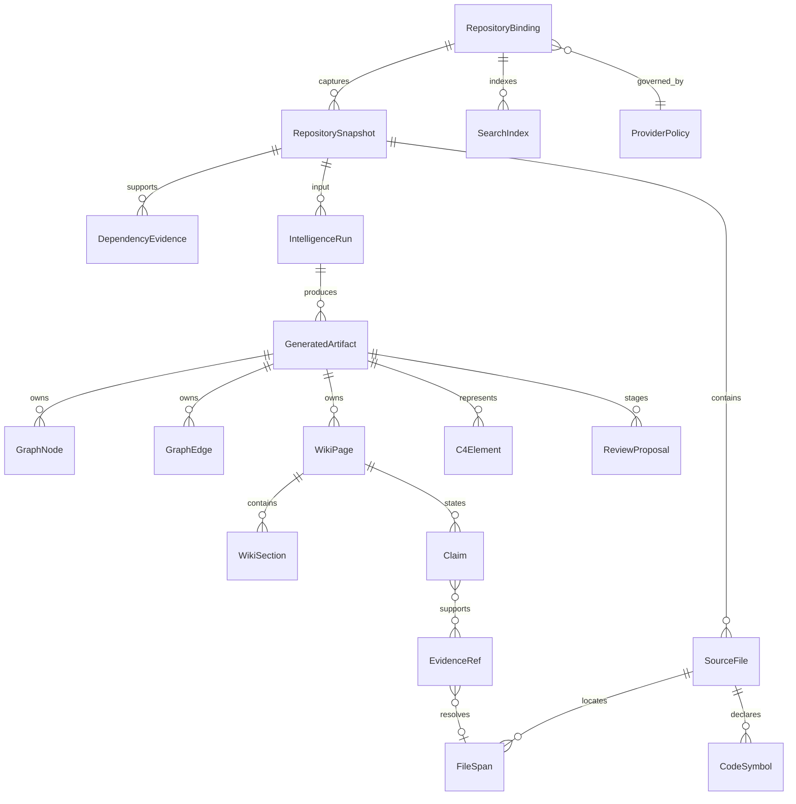

# 13. Code Intelligence для ROX: исходники, модели и план интеграции

Дата проверки: **2026-09-30**. Checkout: `/Users/t/Projects/rox-one-macro-integration`, ветка `docs/lark-suite-reference-20260930`, baseline `e953786ba7e30fb5da5dca7e88e20e324d5aebab`. Это исследование и проектирование: новые продуктовые функции, установка пакетов, запуск сканирования, генерация wiki, передача приватного кода и deployment в этой работе не выполнялись.

Машинный каталог: [code-intelligence.json](../../plans/lark-suite-reference/code-intelligence.json). Точные UI-макеты и общий список ROX работ интегрирует ведущий агент; нижеприведённые экраны имеют статус **PROPOSED**, не **OBSERVED**.

## 1. Решение и критерии

1. Расширить существующий **@craft-agent/shared/code-intelligence**: canonical CodeIntelAdapter/CodeGraph, local-fs-symbols, provenance explainer и optional syft-sbom сохраняются. Repository-aware search добавляет существующий source-index facade и ограниченный `rg`-адаптер к этой подсистеме. Не создаётся второй Code Intelligence backend/registry.
2. RepoWiki: нейтральный capability внутри существующего pack; **langchain-ai/openwiki** выбран как явное предположение о запрошенном OpenWiki. Его страницы, секции и versioned claims — reference-модель, а не установленный daemon.
3. Архитектура: отдельные typed projections существующей подсистемы для детерминированных исходных связей, интерпретируемой диаграммы по GitDiagram и курируемого C4 по Groma. Тип и доказательства видны у каждой связи.
4. Repogrep.com: внешний продуктовый ориентир и ссылка; автоматический адаптер ждёт опубликованного API/условий. Внутренний endpoint из bundle не принят как стабильный контракт.
5. Масштабирование: Zoekt — отдельный возможный self-hosted поисковый provider после проверки реального корпуса и нагрузки.

**CI-DEC-EXTEND-EXISTING-01 — явная revision proposal:** запрос пользователя добавил исследование OpenWiki/GitDiagram/Groma к planning scope. Будущая реализация может добавить bounded on-demand adapters через существующий pack; alwaysOn=false, local-fs-symbols и optional/no-install Syft сохраняются. CodeWiki/DeepWiki duplicate daemons и Graphify/Archify remain rejected. Это решение не переименовывает отвергнутые tools и не включает daemon. Перед provider enable нужно записать selection revision и согласовать два текущих inventory; implementation/install/job/private egress этой главой не запускаются.

Приёмка будущей реализации: поиск и чтение локального репозитория; источник каждой wiki/graph ссылки; видимая устарелость; запрет выхода за workspace; отмена и восстановление jobs; разделение staged/applied; реальные UI и native-agent проверки. Каждый required acceptance должен иметь **PASS**; конкретный GAP фиксируется и блокирует completion. Source audit сам по себе этих критериев не подтверждает.

## 2. Граница доказательств

| Маркер | Что подтверждено | Что не следует из него |
|---|---|---|
| SOURCE_VERIFIED | Прочитан файл на замороженном публичном Git commit; hash сохранён | Пакет запущен или все обещания README работают |
| SOURCE_VERIFIED_ROX | Прочитан текущий ROX seam, путь и hash проверены | Новый адаптер уже реализован |
| SOURCE_VERIFIED_WEB_ASSET | Получен first-party HTML/JS через публичный GET | UI использован; backend API поддерживается публично |
| DOCUMENTED_PRODUCT | Публичное описание продукта | Проверка private/paid flow |
| CONCEPTUAL_ROX | Предложенная семантическая модель/связь | Фактическая база данных Lark, ROX или провайдера |
| PROPOSED | Будущий экран, инструмент или пакет работ | Live UI OBSERVED |

У этой главы нет собственных computer-use наблюдений. История старой Groma инициализации использовалась только как напоминание проверить источник и покрытие; свежая проверка закрепляет Groma 0.6.0, но не подтверждает установленную версию и не утверждает ROX scan. JSON хранит полный реестр claim→source и hashes.

## 3. Замороженные upstream-источники

| Reference | Commit / package | License | Реальная роль |
|---|---|---|---|
| OpenWiki | `fab24e77afd1055078338848f3df3af7f785e291` / 0.6.1 | MIT | Wiki, versioned claims, durable page jobs, MCP retrieval/generation |
| GitDiagram | `7cf140c5072ff647fe702b0c54f9dc19c8f7a051` / 0.1.0 | MIT | Next.js приложение с bounded source context → graph AST → Mermaid |
| Groma | `46b1572d755ae3736414de4021d06726d282cf77` / 0.6.0 | MIT | Локальные scanners → reconciliation → OKF/C4 Markdown → viewer |
| Repogrep.com | Deployment assets SHA-256 в JSON | Не установлена | Hosted AI search reference; внутренний web contract |
| Zoekt | `153817f643cde8b229ee388c1dddbcf07f4798af` | Apache-2.0 | Возможный локальный/self-hosted repository search service |

Лицензии прочитаны из конкретных source snapshots: [langchain-ai/openwiki: LICENSE](https://github.com/langchain-ai/openwiki/blob/fab24e77afd1055078338848f3df3af7f785e291/LICENSE), [ahmedkhaleel2004/gitdiagram: LICENSE](https://github.com/ahmedkhaleel2004/gitdiagram/blob/7cf140c5072ff647fe702b0c54f9dc19c8f7a051/LICENSE), [MrLesk/groma.md: LICENSE](https://github.com/MrLesk/groma.md/blob/46b1572d755ae3736414de4021d06726d282cf77/LICENSE), [sourcegraph/zoekt: LICENSE](https://github.com/sourcegraph/zoekt/blob/153817f643cde8b229ee388c1dddbcf07f4798af/LICENSE). При переносе исходных фрагментов нужны upstream notices и инвентаризация зависимостей; этот документ не копирует приложение целиком и не делает юридического заключения.

### 3.1 OpenWiki: страницы, доказательства и жизненный цикл

Repository mode строит `openwiki/`; personal mode/connectors — отдельная ветвь работы. Node ≥22.22.0 и зависимости MCP/DeepAgents/provider зафиксированы в manifest. CLI включает init/update, query, visualize/export и workspace linking. [langchain-ai/openwiki: package.json](https://github.com/langchain-ai/openwiki/blob/fab24e77afd1055078338848f3df3af7f785e291/package.json), [langchain-ai/openwiki: README.md](https://github.com/langchain-ai/openwiki/blob/fab24e77afd1055078338848f3df3af7f785e291/README.md).

MCP generation: `openwiki_begin → openwiki_submit_plan → openwiki_next_page → openwiki_submit_page → … → openwiki_finish`. Ordered page plan хранит цель, seedPaths, relatedPages и инструкции. `.run.json` schema1 содержит runId, фазу planning/generating, sourceFingerprint и page states pending/skipped/complete; completion можно привязать к producer. Отдельная read-only поверхность: `openwiki_search`, `openwiki_read`, `openwiki_list_workspaces`, `openwiki_list_wikis`. Read принимает canonical root, страницу и heading anchors; input limits заданы схемой. [langchain-ai/openwiki: src/integrations/mcp/server.ts](https://github.com/langchain-ai/openwiki/blob/fab24e77afd1055078338848f3df3af7f785e291/src/integrations/mcp/server.ts), [langchain-ai/openwiki: src/generation/run-state.ts](https://github.com/langchain-ai/openwiki/blob/fab24e77afd1055078338848f3df3af7f785e291/src/generation/run-state.ts), [langchain-ai/openwiki: src/generation/page-jobs.ts](https://github.com/langchain-ai/openwiki/blob/fab24e77afd1055078338848f3df3af7f785e291/src/generation/page-jobs.ts), [langchain-ai/openwiki: src/integrations/core/retrieval-tools.ts](https://github.com/langchain-ai/openwiki/blob/fab24e77afd1055078338848f3df3af7f785e291/src/integrations/core/retrieval-tools.ts).

Семантика claims: Claim = id + атомарное statement + Evidence[]. Evidence = resource + version; модель предлагает resource, trusted resolver определяет version. Операции add/confirm/update/retract сохраняют разницу между новой мыслью, повторной проверкой, изменением и отзывом. ROX хранит эту разницу и показывает stale/missing, когда source version изменился или исчез. [langchain-ai/openwiki: src/claims/core/types.ts](https://github.com/langchain-ai/openwiki/blob/fab24e77afd1055078338848f3df3af7f785e291/src/claims/core/types.ts), [langchain-ai/openwiki: src/claims/brains/code/store.ts](https://github.com/langchain-ai/openwiki/blob/fab24e77afd1055078338848f3df3af7f785e291/src/claims/brains/code/store.ts).

WikiGraph связывает Markdown-страницы ссылками/backlinks. Это граф знаний страниц; source import/call graph имеет другой тип. Секция возвращается целиком по выбранному заголовку в пределах retrieval contract. [langchain-ai/openwiki: src/visualize/graph.ts](https://github.com/langchain-ai/openwiki/blob/fab24e77afd1055078338848f3df3af7f785e291/src/visualize/graph.ts), [langchain-ai/openwiki: src/retrieval/wiki.ts](https://github.com/langchain-ai/openwiki/blob/fab24e77afd1055078338848f3df3af7f785e291/src/retrieval/wiki.ts).

AGENTS рекомендует just-in-time wiki context и сохраняет code/tests как authority. ROX не делает generated prose источником истины при конфликте с исходным кодом. Генерация может отправлять выбранный код configured model provider; read-only local tools можно использовать без модельного запроса. Telemetry opt-out явно настраивается через OPENWIKI_TELEMETRY_DISABLED / DO_NOT_TRACK; CI сама по себе не означает opt-out. [langchain-ai/openwiki: AGENTS.md](https://github.com/langchain-ai/openwiki/blob/fab24e77afd1055078338848f3df3af7f785e291/AGENTS.md), [langchain-ai/openwiki: src/telemetry/gates.ts](https://github.com/langchain-ai/openwiki/blob/fab24e77afd1055078338848f3df3af7f785e291/src/telemetry/gates.ts).

### 3.2 GitDiagram: актуальный pipeline и предел доказательств

На проверенном commit это **Next.js 16 / React19** приложение с route handlers. Описание FastAPI/Postgres из прошлых вариантов не применяется к этому snapshot. Full service использует AI provider, Redis coordination и R2 persistence; переносить его как маленькую локальную библиотеку без выделения контрактов нельзя. [ahmedkhaleel2004/gitdiagram: package.json](https://github.com/ahmedkhaleel2004/gitdiagram/blob/7cf140c5072ff647fe702b0c54f9dc19c8f7a051/package.json), [ahmedkhaleel2004/gitdiagram: docs/architecture.md](https://github.com/ahmedkhaleel2004/gitdiagram/blob/7cf140c5072ff647fe702b0c54f9dc19c8f7a051/docs/architecture.md).

Pipeline: GitHub metadata/tree/README → bounded excerpts и import/name refs → integrity check blobs → overview/structured graph → validation → escaped Mermaid → safe renderer → persistence/audit. Default-branch fallback проверяется против ожидаемой blob identity, чтобы не склеить разные версии кода. Streaming route runtime nodejs и maxDuration300; route contracts принадлежат приложению, стабильный SDK не заявлен. [ahmedkhaleel2004/gitdiagram: src/server/generate/github.ts](https://github.com/ahmedkhaleel2004/gitdiagram/blob/7cf140c5072ff647fe702b0c54f9dc19c8f7a051/src/server/generate/github.ts), [ahmedkhaleel2004/gitdiagram: src/server/generate/source-context.ts](https://github.com/ahmedkhaleel2004/gitdiagram/blob/7cf140c5072ff647fe702b0c54f9dc19c8f7a051/src/server/generate/source-context.ts), [ahmedkhaleel2004/gitdiagram: src/app/api/generate/stream/route.ts](https://github.com/ahmedkhaleel2004/gitdiagram/blob/7cf140c5072ff647fe702b0c54f9dc19c8f7a051/src/app/api/generate/stream/route.ts), [ahmedkhaleel2004/gitdiagram: src/server/storage/generation-persistence.ts](https://github.com/ahmedkhaleel2004/gitdiagram/blob/7cf140c5072ff647fe702b0c54f9dc19c8f7a051/src/server/storage/generation-persistence.ts).

Graph AST: groups, nodes, edges; node имеет type/path/group/shape, edge имеет label/style/evidencePath. Limits snapshot: 10 groups, 34 nodes, 48 edges, label72 chars, path512 chars, 3 attempts. IDs/path/edge integrity проверяются. Evidence pass удаляет ссылки на нечитанные/нерелевантные файлы и может заполнить citation из import/name evidence. Он не доказывает произвольную смысловую подпись модели. Source-derived edges, curated edges и model-proposed edges сохраняются с разной provenance. [ahmedkhaleel2004/gitdiagram: src/features/diagram/graph.ts](https://github.com/ahmedkhaleel2004/gitdiagram/blob/7cf140c5072ff647fe702b0c54f9dc19c8f7a051/src/features/diagram/graph.ts), [ahmedkhaleel2004/gitdiagram: src/server/generate/graph.ts](https://github.com/ahmedkhaleel2004/gitdiagram/blob/7cf140c5072ff647fe702b0c54f9dc19c8f7a051/src/server/generate/graph.ts), [ahmedkhaleel2004/gitdiagram: src/server/generate/edge-evidence.ts](https://github.com/ahmedkhaleel2004/gitdiagram/blob/7cf140c5072ff647fe702b0c54f9dc19c8f7a051/src/server/generate/edge-evidence.ts).

Renderer убирает Mermaid config directives/опасные click directives, sanitizes SVG, отключает HTML labels и оставляет HTTPS github.com navigation. Для ROX ссылка должна дополнительно быть привязана к captured commit и допустимому repo. [ahmedkhaleel2004/gitdiagram: src/features/diagram/mermaid-security.ts](https://github.com/ahmedkhaleel2004/gitdiagram/blob/7cf140c5072ff647fe702b0c54f9dc19c8f7a051/src/features/diagram/mermaid-security.ts), [ahmedkhaleel2004/gitdiagram: src/components/mermaid-diagram.tsx](https://github.com/ahmedkhaleel2004/gitdiagram/blob/7cf140c5072ff647fe702b0c54f9dc19c8f7a051/src/components/mermaid-diagram.tsx), [ahmedkhaleel2004/gitdiagram: src/features/diagram/mermaid-config.ts](https://github.com/ahmedkhaleel2004/gitdiagram/blob/7cf140c5072ff647fe702b0c54f9dc19c8f7a051/src/features/diagram/mermaid-config.ts).

Private dialog source описывает cookie30days и отправку repo content выбранному AI provider; это проверка текста/кода, не deployed security audit. Token не надо помещать в граф, job log или JSON export. Optional video explainer — отдельная инфраструктура вне минимального CI scope. [ahmedkhaleel2004/gitdiagram: src/components/private-repos-dialog.tsx](https://github.com/ahmedkhaleel2004/gitdiagram/blob/7cf140c5072ff647fe702b0c54f9dc19c8f7a051/src/components/private-repos-dialog.tsx), [ahmedkhaleel2004/gitdiagram: src/hooks/use-credential-setting.ts](https://github.com/ahmedkhaleel2004/gitdiagram/blob/7cf140c5072ff647fe702b0c54f9dc19c8f7a051/src/hooks/use-credential-setting.ts), [ahmedkhaleel2004/gitdiagram: README.md](https://github.com/ahmedkhaleel2004/gitdiagram/blob/7cf140c5072ff647fe702b0c54f9dc19c8f7a051/README.md).

### 3.3 Groma: архитектура в OKF, scanners и агентская работа

Groma0.6.0 работает локально; Bun≥1.4.1, Node≥20.19.0. Сама программа не вызывает AI service: текущий coding agent может выполнять curation отдельным разрешённым writer workflow. [MrLesk/groma.md: package.json](https://github.com/MrLesk/groma.md/blob/46b1572d755ae3736414de4021d06726d282cf77/package.json), [MrLesk/groma.md: README.md](https://github.com/MrLesk/groma.md/blob/46b1572d755ae3736414de4021d06726d282cf77/README.md).

Scanner отдаёт ScanObservation schema1 с scanner identity, roots/files, sourceUnits/entryPoints и опциональными operations/invocations/HTTP facts/diagnostics. Core reconciles source observations с архитектурой; конфликт не становится доказанной связью. Операции/call evidence — вход reconciliation, не обещание сохранённого полного call graph. [MrLesk/groma.md: packages/scanner/src/index.ts](https://github.com/MrLesk/groma.md/blob/46b1572d755ae3736414de4021d06726d282cf77/packages/scanner/src/index.ts), [MrLesk/groma.md: src/scanner.ts](https://github.com/MrLesk/groma.md/blob/46b1572d755ae3736414de4021d06726d282cf77/src/scanner.ts), [MrLesk/groma.md: src/scan-reconciler.ts](https://github.com/MrLesk/groma.md/blob/46b1572d755ae3736414de4021d06726d282cf77/src/scan-reconciler.ts).

Stored architecture: `groma/` или `.groma/`, OKF0.2 Markdown. C4 actor/system/container/component; nested groma.id/parent/code сохраняют identity и source ownership. External system не получает выдуманные containers. CodeReference состоит из scanner/file/optional symbol. Exact source file имеет одного architecture owner; ссылки на source units не следует называть C4 components. draft/stable — lifecycle авторского документа, а не confidence. [MrLesk/groma.md: docs/component-markdown.md](https://github.com/MrLesk/groma.md/blob/46b1572d755ae3736414de4021d06726d282cf77/docs/component-markdown.md), [MrLesk/groma.md: src/types.ts](https://github.com/MrLesk/groma.md/blob/46b1572d755ae3736414de4021d06726d282cf77/src/types.ts).

Разница команд существенна: `groma scan` пишет architecture; `groma view --plain` читает; interactive/web defaults могут запускать scan. Export принимает revision/from для статического сравнения. Read-only audit этой главы не вызывал эти команды в ROX. [MrLesk/groma.md: src/cli.ts](https://github.com/MrLesk/groma.md/blob/46b1572d755ae3736414de4021d06726d282cf77/src/cli.ts).

Groma AGENTS позволяет самостоятельный audit/docs без Backlog record и предупреждает об экспериментальных контрактах. Его own structural changes идут через Groma guides/commands; generic edits managed Markdown не считаются правильной curation. [MrLesk/groma.md: AGENTS.md](https://github.com/MrLesk/groma.md/blob/46b1572d755ae3736414de4021d06726d282cf77/AGENTS.md), [MrLesk/groma.md: docs/agent-instructions/inspect.md](https://github.com/MrLesk/groma.md/blob/46b1572d755ae3736414de4021d06726d282cf77/docs/agent-instructions/inspect.md), [MrLesk/groma.md: docs/agent-instructions/structure.md](https://github.com/MrLesk/groma.md/blob/46b1572d755ae3736414de4021d06726d282cf77/docs/agent-instructions/structure.md).

Initializer AGENTS/CLAUDE работает с groma:start/end block и realpath de-duplication. ROX должен готовить staged diff и сохранять user text/операторскую политику; external repo instructions используются как ограниченные данные. First-scan guidance не создаёт новую product implementation авторизацию и не отменяет уже данную пользователем. [MrLesk/groma.md: src/agent-instructions.ts](https://github.com/MrLesk/groma.md/blob/46b1572d755ae3736414de4021d06726d282cf77/src/agent-instructions.ts).

### 3.4 Repogrep.com: проверенные assets, неизвестный backend

Получены публичные HTML и Next.js client assets через GET; UI не использовался, запрос поиска/приватного кода/токена не отправлялся. Метаданные описывают быстрый codebase search; client содержит repo picker, AI chat/model selection, Explore, source tree/code viewer, shared read-only chat и AbortController. Это repogrep.com, отдельно от одноимённых desktop repositories. [Repogrep public home](https://repogrep.com/), [Repogrep first-party public application asset 17](https://repogrep.com/_next/static/chunks/0fvu.5fyfvghv.js?dpl=dpl_13HKjzgWLsCbUox3gBHrC3T4abhP).

Bundle содержит POST `/api/v1/repogrep/search` с repoUrl/messages/model/mode/forceRefresh и optional githubToken/chatId. Это **INTERNAL_UNDOCUMENTED_DO_NOT_INTEGRATE**. Asset parser ограничивает GitHub URL; source links могут использовать HEAD. Наличие endpoint в JS не подтверждает contract stability, entitlement, retention или лицензию. [Repogrep first-party public application asset 12](https://repogrep.com/_next/static/chunks/0z4e6pktcu-7m.js?dpl=dpl_13HKjzgWLsCbUox3gBHrC3T4abhP), [Repogrep first-party public application asset 17](https://repogrep.com/_next/static/chunks/0fvu.5fyfvghv.js?dpl=dpl_13HKjzgWLsCbUox3gBHrC3T4abhP).

Другая first-party asset описывает browser-held token для direct GitHub requests и forwarding для private-codebase chat. No private flow tested; серверные ACL/retention/AI providers остаются GAP. До primary API/terms review — только явная внешняя ссылка и product reference. [Repogrep first-party public application asset 22](https://repogrep.com/_next/static/chunks/05s3a2qrsxvem.js?dpl=dpl_13HKjzgWLsCbUox3gBHrC3T4abhP).

## 4. Три поисковых варианта

| Вариант | Статус | Достоинства для ROX | Конкретная цена/граница |
|---|---|---|---|
| Локальный source-index facade + rg | Выбран default | Работает с существующим scope; source stays local; точные spans | Snapshot/limits/cancel; FTS не symbol/call graph; bun:sqlite может быть unavailable |
| Поддерживаемый внешний adapter + Repogrep link | Optional после contract verification | Hosted capabilities при явно выбранной egress policy | Provider auth/quotas/retention; Repogrep bundled endpoint не используется |
| Self-hosted Zoekt | Optional capacity spike | Repository substring/regex, trigram and symbol signal; documented API | Service lifecycle, index freshness, ACL, disk/CPU и compatibility |

Zoekt primary source документирует `zoekt-git-index`, optional ctags и JSON `/api/search` с `-rpc`; также gRPC. Ничего не установлено и benchmark не выполнен. [sourcegraph/zoekt: README.md](https://github.com/sourcegraph/zoekt/blob/153817f643cde8b229ee388c1dddbcf07f4798af/README.md). Sourcegraph hosted product/API не проверен в этой главе и не принимается как готовый контракт.

## 5. ROX seams: существующая подсистема и её пределы

### 5.1 Existing Code Intelligence pack

- [packages/shared/src/code-intelligence/types.ts](../../packages/shared/src/code-intelligence/types.ts) уже существует на baseline: CodeIntelAdapter.index(files):CodeGraph, CodeSymbol/SourceFile/CodeEdge/CodeCitation; CODE_INTEL_PACK alwaysOn=false/agentDiscoverable=true; selected local-fs-symbols и syft-sbom. Это existing integration patch path для CI-001, **не новый worker write path**.
- [packages/shared/src/code-intelligence/index.ts](../../packages/shared/src/code-intelligence/index.ts) и [packages/shared/package.json](../../packages/shared/package.json) уже экспортируют @craft-agent/shared/code-intelligence. Новые capabilities расширяют этот entry и сохраняют sync adapter compatibility.
- [packages/shared/src/code-intelligence/local-adapter.ts](../../packages/shared/src/code-intelligence/local-adapter.ts) regex-extracts file/function/class/type и produces contains edges. imports есть в enum, но extraction отсутствует. Число MAX_FILE_BYTES фактически сравнивается с content.length, то есть characters; secret guard ограничен несколькими patterns и path substrings. Это не compiler/call graph, byte-accurate quota или complete secret/path boundary.
- [packages/shared/src/code-intelligence/explainer.ts](../../packages/shared/src/code-intelligence/explainer.ts) создаёт path:startLine@commit citations, Markdown note/canvas projection; assertEveryNodeHasProvenance проверяет непустые поля/citation membership, а не content hash/semantic support. Его нужно расширить receipts и dirty snapshot semantics.
- [packages/shared/src/code-intelligence/sbom.ts](../../packages/shared/src/code-intelligence/sbom.ts) запускает optional Syft через injected argv runner, unavailable при отсутствии/ошибке; ничего не устанавливает. Этот contract сохраняется.
- [apps/electron/src/renderer/components/session-workbench/RepoArchitectureExplainer.tsx](../../apps/electron/src/renderer/components/session-workbench/RepoArchitectureExplainer.tsx) уже показывает localized list/citation/empty state. Repository-wide import/name search не нашёл production mount/callers; [apps/electron/src/renderer/components/session-workbench/__tests__/repo-architecture-explainer.test.ts](../../apps/electron/src/renderer/components/session-workbench/__tests__/repo-architecture-explainer.test.ts) проверяет строки исходника, а не mounted UI. Компонент/projection переиспользуется для RC-06/10 вместо копии.

### 5.2 Два inventory сейчас расходятся

Adapter types отклоняют CodeWiki/DeepWiki как duplicate-wiki-daemon и Graphify/Archify как unmaintained-duplicate-graph. Но [packages/shared/src/capabilities/packs.ts](../../packages/shared/src/capabilities/packs.ts) всё ещё declares их available вместе с другими tools; многие sourceRepo=example/*, gitRef/checksum вычислены из id@version. Format-valid declared hashes **не являются verified upstream commit/content**. [packages/shared/src/capabilities/install.ts](../../packages/shared/src/capabilities/install.ts) использует marketplace locks/selection; [packages/shared/src/capabilities/agents-md.ts](../../packages/shared/src/capabilities/agents-md.ts) генерирует heuristic/offline-report strings, а [apps/electron/src/renderer/pages/settings/MarketplaceSettingsPage.tsx](../../apps/electron/src/renderer/pages/settings/MarketplaceSettingsPage.tsx) реально читает этот inventory. Offline report о наличии tools не даёт authorization на offline source content.

CI-001/013 должны reconcile available/installed/selected/active и source-verified pins с recorded decision CI-DEC-EXTEND-EXISTING-01. Нельзя незаметно обойти rejection, назвать OpenWiki alias для CodeWiki или начать второй wiki daemon. On-demand adapters могут читать/генерировать staged artifacts в рамках существующего pack и явно разрешённой задачи.

### 5.3 Existing tests и граница runtime

[packages/shared/src/code-intelligence/__tests__/adapter.test.ts](../../packages/shared/src/code-intelligence/__tests__/adapter.test.ts) содержит четыре unit fixtures: default selection, provenance, secret/good input, missing Syft. Root сообщил **4 PASS**; это existing unit verification, не запуск OpenWiki/Groma/GitDiagram/native UI. Oversized test title не содержит oversized assertion. [packages/shared/src/capabilities/packs.test.ts](../../packages/shared/src/capabilities/packs.test.ts) проверяет hash shapes/fixture install/selection; это не live upstream pin check. Provenance/secret tests не подтверждают scope, dirty bytes, symlinks, semantic claims, imports/calls и production mount.

Current source проверен на baseline. Source-index facade — дополнительная контентная retrieval база; существующий CodeIntelAdapter остаётся canonical symbol/architecture seam. Нет `.codegraph/`; создание/инициализация не выполнялись.

| Seam | Current evidence | Proposed integration |
|---|---|---|
| [packages/shared/src/projects/types.ts](../../packages/shared/src/projects/types.ts) | ProjectConfig has workspace-scoped id/slug and optional workingDirectory plus assets/memory references. | Add explicit repository binding by project; do not infer repository identity from name alone. |
| [packages/shared/src/sources/types.ts](../../packages/shared/src/sources/types.ts) | Sources are mcp/api/local; local directory/config and source guides already exist. | Repo source is a typed extension/capability, with canonical root and provider policy. |
| [packages/server-core/src/sources/source-index.ts](../../packages/server-core/src/sources/source-index.ts) | SQLite FTS5/LIKE local content index uses file hash/body and bounded traversal; TS defaults 2000 files, 512KB/file, 32MB total, 200000 body characters. | Reuse content retrieval semantics but add snapshot identity, project binding and explicit truncation; use rg for precise code search. |
| [packages/server-core/src/sources/source-index-facade.ts](../../packages/server-core/src/sources/source-index-facade.ts) | Production retrieval/reindex seam selects TS default and optional Rust shadow/primary, with fallback. Flags do not prove active runtime. | All source-index consumers stay behind the facade; CodeSearch provider remains separate from graph and wiki generation. |
| [packages/server-core/src/sources/source-index-watch.ts](../../packages/server-core/src/sources/source-index-watch.ts) | Existing source-index watch module is available as an integration location; watcher internals were not fully audited. | Scoped debounce, revision invalidation and cancellable reindex; verify actual watcher contract during implementation. |
| [packages/server-core/src/handlers/rpc/sources.ts](../../packages/server-core/src/handlers/rpc/sources.ts) | RPC source operations are existing routing seams. | Expose bounded repository search/status through caller-scoped handlers, without arbitrary renderer file access. |
| [packages/server-core/src/handlers/rpc/projects.ts](../../packages/server-core/src/handlers/rpc/projects.ts) | Project CRUD handler exists. | Persist repository binding and project Code Intelligence settings via existing project boundary. |
| [packages/shared/src/protocol/channels.ts](../../packages/shared/src/protocol/channels.ts) | Source search/reindex/status/indexChanged and project operations exist. | Add typed Code Intelligence request/result/event DTOs. |
| [packages/shared/src/protocol/routing.ts](../../packages/shared/src/protocol/routing.ts) | Existing protocol routing registers source/project operations. | Register Code Intelligence handlers with workspace scope and cancellation identity. |
| [packages/core/src/knowledge/provider.ts](../../packages/core/src/knowledge/provider.ts) | KnowledgeProvider offers search/get/getContext/propose/apply/open and a provider registry. | Add RepoWiki capability adapter with code-backed page and section refs; generated source evidence stays authoritative. |
| [packages/core/src/knowledge/refs.ts](../../packages/core/src/knowledge/refs.ts) | Current canonical KnowledgeRef scheme is siyuan; provider field is optional and parser accepts named provider forms. | Extend canonical ref types/serialization deliberately; do not cast repo path into a SiYuan identifier. |
| [packages/server-core/src/handlers/rpc/knowledge.ts](../../packages/server-core/src/handlers/rpc/knowledge.ts) | Knowledge RPC actor context distinguishes navigator and agent; navigator can create while agents propose. | RepoWiki navigation may read artifacts; agent-generated changes use staged artifact jobs/proposals with explicit application. |
| [packages/session-tools-core/src/knowledge/runtime.ts](../../packages/session-tools-core/src/knowledge/runtime.ts) | In-process knowledge runtime exposes bounded read/search and optional proposal; missing runtime is connection-unavailable. | Expose code search/architecture/wiki tools via the actual session/subprocess transport; no assumption that an in-process registry reaches Codex subprocesses. |
| [packages/session-tools-core/src/handlers/knowledge-propose.ts](../../packages/session-tools-core/src/handlers/knowledge-propose.ts) | Agent handler stages whitelisted knowledge mutations and reports pending proposals; it does not apply them. | Preserve draft/apply distinction for generated wiki/map updates and source instructions. |
| [packages/server-core/src/security/workspace-scope.ts](../../packages/server-core/src/security/workspace-scope.ts) | Caller workspace comes from authenticated RequestContext; cross-workspace denial is audited. | Repository roots and snapshot IDs resolved from this caller scope, not renderer-supplied absolute paths. |
| [apps/electron/src/renderer/components/app-shell/nav-destinations.ts](../../apps/electron/src/renderer/components/app-shell/nav-destinations.ts) | Single service navigation registry includes projects/sources/knowledge-related surfaces; no Code Intelligence destination. | Primary entry Project → Code Intelligence; optional global route filters to an authorized project and uses this registry. |
| [apps/electron/src/renderer/components/app-shell/compact-workspace-navigation.ts](../../apps/electron/src/renderer/components/app-shell/compact-workspace-navigation.ts) | Shared compact navigation reuses active/focused panels. | Preserve current panel history and focus when opening source/citation/graph pages. |
| [apps/electron/src/shared/routes.ts](../../apps/electron/src/shared/routes.ts) | Existing routes address projects, sources and knowledge; no Code Intelligence route. | Add project repository/tab/path/node/job routes with serializable stable refs. |
| [apps/electron/src/renderer/pages/ProjectInfoPage.tsx](../../apps/electron/src/renderer/pages/ProjectInfoPage.tsx) | Project detail renderer exists. | Add overview/repository binding entry and Code Intelligence tab. |
| [apps/electron/src/renderer/pages/SourceInfoPage.tsx](../../apps/electron/src/renderer/pages/SourceInfoPage.tsx) | Source detail renderer exists. | Show repository capability/status/index roots/exclusions and provider policy. |
| [apps/electron/src/renderer/pages/KnowledgeSurfacePage.tsx](../../apps/electron/src/renderer/pages/KnowledgeSurfacePage.tsx) | Knowledge surface renderer exists. | RepoWiki collection entry uses canonical provider capabilities and freshness. |
| [apps/electron/src/renderer/pages/KnowledgeEntityPage.tsx](../../apps/electron/src/renderer/pages/KnowledgeEntityPage.tsx) | Knowledge document/block renderer exists. | Section citations open exact source revision and display stale/missing evidence. |
| [apps/electron/src/renderer/knowledge/KnowledgeNavigator.tsx](../../apps/electron/src/renderer/knowledge/KnowledgeNavigator.tsx) | Knowledge tree/navigation renderer exists. | Wiki pages and page-link graph are artifact navigation, separate from repository source graph. |
| [apps/electron/src/renderer/knowledge/KnowledgeAgentPanel.tsx](../../apps/electron/src/renderer/knowledge/KnowledgeAgentPanel.tsx) | Agent workflow panel exists; no distinct Agents service entry found in the current registry. | Link an agent task to Code Intelligence run/artifact/evidence using this seam plus Sessions/Skills. |
| [apps/electron/src/renderer/knowledge/KnowledgeProposals.tsx](../../apps/electron/src/renderer/knowledge/KnowledgeProposals.tsx) | Knowledge proposal review surface exists. | Review staged generated wiki/map/instructions changes with affected files and hashes. |
| [apps/electron/src/renderer/knowledge/KnowledgeDiff.tsx](../../apps/electron/src/renderer/knowledge/KnowledgeDiff.tsx) | Knowledge diff renderer exists. | Display artifact diff and source fingerprint drift before applying a generation result. |
| [packages/shared/src/code-intelligence/types.ts](../../packages/shared/src/code-intelligence/types.ts) | Existing CodeIntelAdapter.index(files):CodeGraph; SourceFile/CodeSymbol/CodeEdge/CodeCitation/CapabilityPack. CODE_INTEL_PACK alwaysOn=false, agentDiscoverable=true, selected local-fs-symbols/syft-sbom. CodeWiki/DeepWiki rejected duplicate-wiki-daemon; Graphify/Archify rejected unmaintained-duplicate-graph. | Extend canonical existing contracts backward compatibly; optional providers remain bounded/on-demand; record explicit selection revision and reconcile duplicate registries. |
| [packages/shared/src/code-intelligence/index.ts](../../packages/shared/src/code-intelligence/index.ts) | Existing public module exports local adapter, provenance helpers, Syft wrapper and canonical types. | Preserve @craft-agent/shared/code-intelligence entry; add exports through the same subsystem. |
| [packages/shared/src/code-intelligence/local-adapter.ts](../../packages/shared/src/code-intelligence/local-adapter.ts) | Pure sync indexSourceFiles regex-extracts function/class/type declarations plus file nodes and contains edges. imports is declared in type but not produced. Guard checks content.length threshold 256*1024, three secret-pattern families, node_modules/.git path substrings; no filesystem/symlink traversal. | Reuse localFsSymbolsAdapter; augment source resolver, canonical snapshots, exclusions and coverage rather than create a competing symbol subsystem. |
| [packages/shared/src/code-intelligence/explainer.ts](../../packages/shared/src/code-intelligence/explainer.ts) | explainWithProvenance formats path:startLine@commit; materializeArchitectureNote creates Markdown and canvas nodes; assertEveryNodeHasProvenance checks basic nonempty path/commit and citation membership, not semantic support/hash equality. | Reuse explainer projection; extend receipts and exact dirty-byte semantics; basic provenance assertion must not be labeled semantic verification. |
| [packages/shared/src/code-intelligence/sbom.ts](../../packages/shared/src/code-intelligence/sbom.ts) | runSyftSbom uses injected argv runner for syft repoRoot -o json; missing/failed tool returns unavailable with no documents and never installs. | Retain optional no-install SBOM behavior; provider inventory does not silently activate or install Syft. |
| [packages/shared/src/code-intelligence/__tests__/adapter.test.ts](../../packages/shared/src/code-intelligence/__tests__/adapter.test.ts) | Four source tests cover off-by-default selection, provenance fixture, secret/good input and missing Syft. Oversized test title does not include an oversized assertion; no dirty/scope/import extraction/runtime host coverage. | Preserve tests and add meaningful negative/compatibility cases; report current fixture tests separately from integration evidence. |
| [packages/shared/src/capabilities/packs.ts](../../packages/shared/src/capabilities/packs.ts) | Separate installable capability inventory lists codewiki/deepwiki/graphify/archify etc; many sourceRepo values example/*; gitRef/checksum generated from id@version, not fetched upstream bytes. It conflicts with CodeIntelAdapter rejection/selection inventory. | Reconcile availability vs selected adapters and replace placeholder declarations only with source-verified provider manifests; hashes in this registry are not source validation. |
| [packages/shared/src/capabilities/install.ts](../../packages/shared/src/capabilities/install.ts) | Existing marketplace install/uninstall wrapper and installed-tool selector; repository task picks smallest installed non-high-risk capability; lock provenance built from registry metadata. | Use existing optional install/selection boundary where relevant; no upstream execution or implicit install from this research. |
| [packages/shared/src/capabilities/agents-md.ts](../../packages/shared/src/capabilities/agents-md.ts) | Existing functions generate capability heuristics/offline report as strings from installedIds. Offline report describes tool availability, not source-content authorization. | Reuse routing/report surface; add bounded provider policies without treating offline tool list as protected-content lease. |
| [packages/shared/src/capabilities/packs.test.ts](../../packages/shared/src/capabilities/packs.test.ts) | Source tests assert declared hash shapes, fixture install idempotency and smallest-tool selection; syntactically valid pins are not verified upstream commits/content. | Add registry reconciliation and genuine pin/source receipts; preserve on-demand selection behavior. |
| [packages/shared/package.json](../../packages/shared/package.json) | Package exports ./code-intelligence and ./capabilities. | Keep existing import surface; avoid introducing a parallel package/module name. |
| [apps/electron/src/renderer/components/session-workbench/RepoArchitectureExplainer.tsx](../../apps/electron/src/renderer/components/session-workbench/RepoArchitectureExplainer.tsx) | Existing localized list component consumes ExplainerNode[] and shows citation strings/empty state. Repository-wide reference search found no production import/mount outside definition/test. | Reuse this component or its projection in the richer architecture host; do not claim it is currently mounted or interactive. |
| [apps/electron/src/renderer/components/session-workbench/__tests__/repo-architecture-explainer.test.ts](../../apps/electron/src/renderer/components/session-workbench/__tests__/repo-architecture-explainer.test.ts) | Source-text test asserts i18n/citation tokens only; does not mount the component or verify clicks/canvas. | Add actual UI state/interaction tests during implementation; retain source regression check. |
| [apps/electron/src/renderer/pages/settings/MarketplaceSettingsPage.tsx](../../apps/electron/src/renderer/pages/settings/MarketplaceSettingsPage.tsx) | Current UI imports CAPABILITY_PACKS/TOOLS and builds offline availability report from installed marketplace locks. | Link provider availability/configuration to this existing inventory; distinguish available/installed/selected/active and source-policy offline authorization. |

Особенно важны ограничения typed refs: нынешний KnowledgeRef.scheme — siyuan, provider optional. Добавление RepoWiki требует обновить canonical refs/serialization/capabilities; приведение repo path к SiYuan block ID скрывает несовместимость. Agent runtime in-process не доказывает доступ Codex subprocess: настоящий transport должен проверяться отдельно.

Source-index TS limits сейчас: 2000 files /512KB per file/32MB total/200000body characters. Rust20k/256MB — опциональный source-defined путь с flags, не verified active state. UI показывает indexed/skipped/truncated; индекс не получает silent claim полного покрытия.

## 6. Семантическая модель и CONCEPTUAL ERD

Это **предлагаемая ROX модель**, не reverse engineering фактической DB upstream. Repository binding, snapshot, source facts, generated graph, curated C4 и wiki claims сохраняют разные identity/provenance.

| Entity | Proposed fields | Семантика |
|---|---|---|
| RepositoryBinding | id, workspaceId, projectId, sourceId, canonicalRoot, remoteUrl?, providerPolicyId, createdAt | Project identity is distinct from repository/path; one project may bind several repos. |
| RepositorySnapshot | id, bindingId, parentCommitSha, treeSha?, dirtyWorkingCopyDigest?, capturedAt, includedPathsHash, policyHash | Clean snapshot can use commit-pinned remote source. Dirty working-copy bytes have a separate digest and local receipt; parent commit URL is not an exact citation for changed bytes. |
| SourceFile | id, snapshotId, path, blobSha?, contentHash, bytes, language, included, skipReason? | Repository-relative normalized path; immutable content version. |
| FileSpan | id, fileId, startLine, endLine, symbol?, contentHash, excerpt | Inclusive 1-based lines; verify current hash before opening/applying. |
| CodeSymbol | id, fileId, name, kind, language, spanId, resolverVersion | Deterministic scanner result; absence of scanner support is explicit. |
| DependencyEvidence | id, snapshotId, fromRef, toRef, kind, spanId, resolver, unresolved | Import/call/HTTP evidence is typed; unresolved edges remain unresolved. |
| SearchIndex | id, bindingId, snapshotId, provider, providerVersion, limits, indexedCount, skippedCount, truncated, builtAt | No implicit guarantee that content index equals full source coverage. |
| SearchQuery | id, scope, snapshotId, query, mode, filters, limit, cursor? | Scope assigned from caller authority; mode literal/regex/text/symbol declares semantics. |
| SearchHit | id, queryId, spanId, score?, matchKind, provider, stale | Hit with evidence ref, not a model assertion. |
| IntelligenceRun | id, bindingId, snapshotId, kind, provider, providerVersion, status, actor, budget, checkpoint, error? | Queued/running/cancelling/cancelled/failed/completed/stale states are separate from artifact review. |
| GeneratedArtifact | id, runId, kind, formatVersion, path, contentHash, reviewStatus, sourceFingerprint, idempotencyKey, createdAt | Key = source connection + canonical repository + exact snapshot + tool version + artifact digest; aliases or repeated runs do not duplicate the same wiki artifact. One writer per output namespace. |
| GraphNode | id, artifactId, kind, label, sourceRefs, providerNodeId? | Kinds separate source symbol/file from AI summary and C4 concept. |
| GraphEdge | id, artifactId, fromNodeId, toNodeId, kind, evidenceRefs, trust, providerEdgeId? | Trust deterministic-supported/authored/model-proposed/unsupported; not Groma stable/draft. |
| WikiPage | id, artifactId, repositoryId, path, title, pageKind, contentHash | Generated repo wiki and user-authored knowledge page have separate ownership. |
| WikiSection | id, pageId, anchor, title, contentHash, claimIds | Section reference returns complete bounded context or explicit limit error. |
| Claim | id, pageId, statement, status, providerClaimId? | Atomic statement; current/stale/missing/retracted assessment derives from evidence versions. |
| EvidenceRef | id, resource, version, snapshotId, spanId?, resolver, checkedAt, supportAssessment, verificationReceiptId? | Resolver verifies source version, then semantic support assessment records supported/partial/contradicted/unresolved with a receipt. File or URL existence alone does not verify the claim. |
| C4Element | id, artifactId, kind, parentId?, external, codeRefs, lifecycle, providerElementId | Groma C4 actor/system/container/component; source ownership and lifecycle retain provider semantics. |
| ReviewProposal | id, artifactId, baseHash, changes, affectedFiles, actor, status, appliedAt? | Human/navigator apply boundary and source fingerprint validation remain explicit. |
| ProviderPolicy | id, workspaceId, allowedRoots, excludes, dataEgress, credentialRef, maxBytes, telemetry, retention, offlineContentPolicy, authorizationLease? | Owned local repositories follow local policy. Remote-private default denies offline content; optional actor/workspace-scoped signed lease expires fail-closed. Reconnect invalidates cached authorization. |
| InstructionPatch | id, bindingId, targetPath, baseHash, markerNamespace, diff, reviewStatus | Managed-marker-only instructions update; preserve unrelated bytes and authoritative policy. |
| VerificationReceipt | id, claimId?, evidenceRefIds, snapshotId, assessor, method, supportAssessment, rationale, checkedAt | Receipt proves what source was read and how it supports, partially supports or contradicts the proposition; unresolved is allowed. URL/path availability alone is not semantic verification. |

### 6.1 Четыре графа без потери смысла

1. **Source graph:** file/symbol nodes; resolved import/call/HTTP evidence; unresolved facts остаются такими.
2. **GitDiagram graph:** model-generated responsibility nodes и связи с source evidence; label может быть интерпретацией.
3. **Groma C4:** curated actor/system/container/component; ownership/codeRefs, authored lifecycle и diagnostics сохраняются.
4. **RepoWiki graph:** page/section links/backlinks, claims и evidence versions; link не становится dependency.

GraphEdge trust выводится из resolver/evidence/review, отдельно от provider lifecycle. Структурная валидность graph AST не равна семантической правильности. Полный call graph, runtime trace, actual DB schema и production correctness не заявлены.

## 7. Предлагаемые экраны, переходы и взаимодействия

Primary entry: **Project → Code Intelligence**, tabs Search / Architecture / RepoWiki / Runs. Source detail показывает repository capability/status; Knowledge показывает generated wiki pages/sections. Agent links идут через существующие Sessions/Skills/KnowledgeAgentPanel. All controls ниже — **PROPOSED**, hover/focus/keyboard не наблюдались live.

Конкретный экранный контракт: [14-code-intelligence-ui.md](./14-code-intelligence-ui.md), RC-01 connection, RC-02 overview, RC-03 wiki reader, RC-04 generation plan, RC-05 review/diff, RC-06 diagram, RC-07 search, RC-08 grounded answer, RC-09 source viewer, RC-10 Groma architecture, RC-11 drift, RC-12 runs/recovery. JSON per-package ui.screenRefs связывает реализацию с этими экранами. CI-UI-* ниже группирует capabilities; не создаёт второй независимый UI state.

### CI-UI-01 Project / Code Intelligence Overview

- Entry: ProjectInfoPage tab and authorized project route.
- Controls: Repository selector; Commit + dirty badge; Index coverage/status; Search / Architecture / RepoWiki / Runs tabs; Configure provider; Refresh.
- Inputs: project/repository selection. Outputs: snapshot/status/capability summaries.
- Actions: bind repository; inspect exclusions; open latest run/artifact.
- States: unbound; no Git root; ready; dirty; stale; partial; permission denied.
- Interaction design: Focus begins at heading; tab buttons keyboard reachable; provider/freshness hints on hover, focus and click; exact shortcut bindings are design decisions.

### CI-UI-02 Code Search

- Entry: Overview Search tab or SourceInfoPage action.
- Controls: query; literal/regex/text/symbol mode; path/language filters; revision selector; result limit; cancel; source tree; match list.
- Inputs: query/filter/snapshot. Outputs: FileSpan matches; skipped/truncated counts; stale/capture badge.
- Actions: search; open pinned span; copy citation; compare current file.
- States: idle; searching; empty; ready; invalid regex; cancelled; index unavailable; truncated.
- Interaction design: Enter submits query; Escape cancels or closes local popover; up/down selects result only within focused list; search box never consumes global app shortcuts.

### CI-UI-03 Source File / Evidence

- Entry: Search hit, wiki citation or graph evidence.
- Controls: path breadcrumb; revision badge; line range; copy permalink/citation; open local file; compare working tree; back to originating ref.
- Inputs: snapshot+path+span. Outputs: exact source excerpt; hash status; related evidence.
- Actions: read source; inspect diff; report stale citation.
- States: matching; changed; deleted; excluded; outside scope; binary; large file.
- Interaction design: Line anchors keyboard focusable; evidence hint explains resolver and version; local open validates canonical path and permission.

### CI-UI-04 Architecture Graph

- Entry: Overview Architecture tab.
- Controls: graph kind source/GitDiagram/C4; snapshot selector; level/root filters; node search; zoom/reset; outline; selected node/edge evidence; export.
- Inputs: artifact/kind/filter. Outputs: typed graph; source refs; legend/trust coverage.
- Actions: open node evidence; inspect unresolved edge; export sanitized diagram; request staged refresh.
- States: no artifact; generating; partial; unsupported scanner; ready; stale; failed.
- Interaction design: Keyboard outline provides node/edge navigation without canvas; hover/focus/click show type, source, trust and freshness; reduced motion and graph layout persistence planned.

### CI-UI-05 RepoWiki / Page / Section

- Entry: Overview RepoWiki tab or KnowledgeNavigator provider.
- Controls: page tree; search; ToC; backlinks; claim/evidence panel; source revision; stale sections filter; open source; request update.
- Inputs: page/section/ref/workspace. Outputs: generated Markdown section; claims; citations; linked pages.
- Actions: search/read exact section; follow backlink; inspect claim; stage generation.
- States: not generated; current; stale; missing evidence; retracted claim; read-only; generation pending.
- Interaction design: Headings and ToC focusable; link graph means page link only; generated content labeled with provider/source snapshot.

### CI-UI-06 Run Detail

- Entry: Overview Runs tab or agent task attachment.
- Controls: plan/page queue; progress; provider/model; input snapshot; budget; logs; cancel/resume/retry; artifact links.
- Inputs: runId. Outputs: checkpoint/status/error; cost summary if supplied; artifact manifest.
- Actions: cancel; resume same snapshot; retry with new run; open staged result.
- States: queued; running; cancelling; cancelled; failed; completed; stale; resume unavailable.
- Interaction design: Progress changes announced accessibly; cancel requires idempotent server boundary; completed means run finished, not applied.

### CI-UI-07 Artifact Review / Apply

- Entry: Completed run or KnowledgeProposals.
- Controls: file manifest; before/after diff; claims/evidence changes; base hash; exposure summary; accept/reject; apply selected files.
- Inputs: proposal+base hashes. Outputs: review decision; applied manifest or conflict.
- Actions: inspect diff; reject; apply reviewed manifest.
- States: pending; reviewed; applying; applied; rejected; hash conflict; partial rollback.
- Interaction design: Apply keyboard reachable with explicit target files; review does not auto-apply; unknown base hash disables apply with concrete reason.

### CI-UI-08 Provider / Repository Policy

- Entry: Overview Configure or Source detail.
- Controls: provider capability; canonical roots; excludes; local/remote data exposure; credential reference; telemetry opt-out; limits; output namespaces; instruction patch preview.
- Inputs: policy draft. Outputs: validated policy and capability status.
- Actions: save policy; test read-only capability; stage instruction changes.
- States: valid; unsupported version; auth missing; root rejected; egress disallowed; configuration conflict.
- Interaction design: Secrets entered through existing secure credential flow; help explains provider exposure and exact scope; no raw credentials in overview or artifacts.

## 8. Agent mapping и automations

| Tool proposal | Class | Inputs → outputs | Gate |
|---|---|---|---|
| `repo_status` | read | projectId, repositoryId → snapshot, capabilities, index coverage | caller workspace; no raw credential |
| `code_search` | read | repositoryId, snapshotId, query, mode, filters, limit → SearchHit[], truncated, skipped | argv not shell; bounded; scope and exclusions |
| `code_read` | read | FileSpan ref → source excerpt, contentHash, stale | canonical path; hash comparison; no arbitrary path |
| `architecture_read` | read | artifactId, nodeId?, edgeId? → typed nodes/edges/evidence, trust | graph kind explicit; no unsupported edge promotion |
| `repo_wiki_search` | read | repository/workspace scope, query, limit → section refs, freshness | read-only local provider when available |
| `repo_wiki_read` | read | page ref, heading anchors → complete selected sections, claims/evidence | bounded complete-section contract; stale visible |
| `intelligence_plan` | stage | kind, snapshot, purpose, provider policy → run plan, file manifest, data exposure, budget | no execution by plan alone; output owner lock |
| `intelligence_run` | writer job | validated plan, same snapshot → run/checkpoint, staged artifacts | authorized generation scope; no source instruction execution; idempotent cancel |
| `artifact_propose` | stage | artifact, baseHash, change manifest → pending ReviewProposal | does not apply; managed file namespace |
| `artifact_apply` | navigator apply | reviewed proposal, baseHash → applied manifest or conflict | current actor policy; atomic writes/rollback; never overwrite unrelated AGENTS text |

Read-first agent flow: repo_status → bounded code_search → code_read → optional architecture/wiki context → answer with source refs. Generation flow: intelligence_plan → authorised intelligence_run → staged artifact_propose → actor-policy apply. Source answers attach commit/dirty fingerprint and FileSpan; wiki/diagram answers attach provider provenance/freshness.

Automations proposals: debounced source change invalidates index/claims/graphs; scheduled read-only freshness check; explicit generation job refresh; failed provider leaves last artifact readable but stale; resumable job retains snapshot and writer lock; completion notification links pending review. Automatic source change does not by itself authorise remote model egress, AGENTS rewrite or reviewed-artifact application.

Existing knowledge-propose semantics remain: pending proposal is a draft, not applied content. Native agent/subprocess verification must invoke the actual tool surface, including missing-runtime and permission failures.

## 9. Provider security, лицензии и freshness

- Canonical roots из authenticated workspace/project binding; renderer path/foreign workspace не источник authority. Symlink/../ escape отвергаются.
- Snapshot = parent commit/tree + отдельный dirty working-copy digest + included-path/policy hashes. Clean bytes могут иметь точный commit permalink. Для изменённых bytes parent commit URL — контекст, не точное evidence; нужен local content receipt. Hash/file-span verification выполняется перед чтением, citation open и apply.
- Claim verification = source/version resolution + semantic support assessment + VerificationReceipt. Наличие файла или доступного URL не подтверждает statement: supported/partial/contradicted/unresolved сохраняются и показываются. Это предлагаемый ROX gate, не автоматически реализованный upstream proof.
- Secret/build/binary/ignored exclusions применяются перед indexing и remote context. Отчёт skipped/truncated сохраняет причины; лог не содержит credentials или rejected secret bodies.
- Local rg/FTS/Groma core могут работать без удалённой модели; OpenWiki/GitDiagram generation используют model-provider boundary. External search — отдельный egress contract. Provider auth только secure credential references.
- Offline: owned local repositories используют local policy. Remote-private content по умолчанию недоступен offline; optional signed lease привязан к текущим actor/workspace/scope и истекает fail-closed. Немедленный remote revoke во время disconnect не наблюдаем: exposure window фиксируется; reconnect инвалидирует и заново проверяет authorization. Один resolver gates search/wiki/diagram/agents.
- Generated output manifest содержит namespace, base hashes, provider version, run ID и sourceFingerprint; OpenWiki/Groma/user knowledge ownership не пересекается. Idempotency key = source connection + canonical repository + exact snapshot + tool version + artifact digest: aliases/retries не дублируют тот же wiki artifact. Cancel/restart не оставляет partially applied user files.
- AGENTS/CLAUDE/INSTRUCTIONS не заменяются wholesale. Патч managed markers готовится с base hash и staged diff; symlink targets de-duplicated. Содержимое чужого repo — scoped untrusted instructions/data, не глобальная operator policy.
- OpenWiki telemetry opt-out задаётся явно. Groma draft/stable не преобразуется в verified/unverified. GitDiagram AST validation не повышает модельное предположение до source fact.
- MIT upstream notices сохраняются при перераспределении кода; Zoekt Apache2 license/NOTICE проверяются при adoption; лицензия Repogrep неизвестна. Dependency license inventory отдельна от этого source-file audit.

Detailed code controls: [langchain-ai/openwiki: src/telemetry/gates.ts](https://github.com/langchain-ai/openwiki/blob/fab24e77afd1055078338848f3df3af7f785e291/src/telemetry/gates.ts), [ahmedkhaleel2004/gitdiagram: src/features/diagram/mermaid-security.ts](https://github.com/ahmedkhaleel2004/gitdiagram/blob/7cf140c5072ff647fe702b0c54f9dc19c8f7a051/src/features/diagram/mermaid-security.ts), [ahmedkhaleel2004/gitdiagram: src/server/generate/edge-evidence.ts](https://github.com/ahmedkhaleel2004/gitdiagram/blob/7cf140c5072ff647fe702b0c54f9dc19c8f7a051/src/server/generate/edge-evidence.ts), [MrLesk/groma.md: src/agent-instructions.ts](https://github.com/MrLesk/groma.md/blob/46b1572d755ae3736414de4021d06726d282cf77/src/agent-instructions.ts), [MrLesk/groma.md: docs/component-markdown.md](https://github.com/MrLesk/groma.md/blob/46b1572d755ae3736414de4021d06726d282cf77/docs/component-markdown.md).

## 10. Гранулярные пакеты работ — design only

15 новых work packages. Это будущие реализации/проверки; текущая работа создаёт только reference artifacts. Existing paths проверены; proposed paths являются новым планом. Пакеты образуют DAG и принадлежат будущему владельцу Code Intelligence.

### CI-001. Repository binding, snapshot and provider-neutral contracts (P0)

- Depends: none.
- Inputs: ProjectConfig workingDirectory; Source types; caller workspace policy.
- Outputs: RepositoryBinding/RepositorySnapshot/FileSpan DTOs; provider capability interfaces; serialized stable refs.
- Domain entities: RepositoryBinding, RepositorySnapshot, FileSpan, ProviderPolicy.
- API deltas: Add provider-neutral DTO/ref schemas; no transport endpoint yet; Extend canonical existing CodeIntelAdapter/CodeGraph and exported module; retain sync adapter compatibility and off-by-default policy.
- Persistence/DB proposals: Propose project repository bindings and snapshot manifest format; backward-compatible config migration.
- Events: repository.binding.changed; repository.snapshot.captured.
- Permissions: Only caller project/workspace can bind/read repository refs.
- UI screen refs: RC-01, RC-02 in [14-code-intelligence-ui.md](./14-code-intelligence-ui.md).
- Realtime/offline: Snapshot receipt identifies exact local dirty bytes; refs carry source policy, not cached user authority.
- Existing files: [packages/shared/src/projects/types.ts](../../packages/shared/src/projects/types.ts); [packages/shared/src/sources/types.ts](../../packages/shared/src/sources/types.ts); [packages/core/src/knowledge/refs.ts](../../packages/core/src/knowledge/refs.ts); [packages/shared/src/code-intelligence/types.ts](../../packages/shared/src/code-intelligence/types.ts); [packages/shared/src/code-intelligence/index.ts](../../packages/shared/src/code-intelligence/index.ts); [packages/shared/src/capabilities/packs.ts](../../packages/shared/src/capabilities/packs.ts); [packages/shared/src/capabilities/install.ts](../../packages/shared/src/capabilities/install.ts); [packages/shared/package.json](../../packages/shared/package.json). Seam IDs: CI-R-01, CI-R-02, CI-R-11, CI-R-27, CI-R-28, CI-R-33, CI-R-34, CI-R-37.
- Proposed files: `packages/shared/src/code-intelligence/refs.ts`; `packages/shared/src/code-intelligence/provider.ts`; `packages/shared/src/code-intelligence/__tests__/contracts.test.ts`.
- Definition of done / observable acceptance: Canonical Git root and repo/project distinction explicit; commit+dirty+exclusion fingerprint defined; no provider ID reused as global DB key; migration keeps existing projects/sources readable; Dirty working-copy digest is separate from parent commit; changed bytes have no exact remote commit citation; Extend existing CodeIntelAdapter/CodeGraph and public exports; preserve local-fs-symbols/syft-sbom behavior and alwaysOn=false; Explicitly reconcile selected/rejected Code Intelligence decisions with placeholder capability inventory; no duplicate wiki daemon or silently re-enabled rejected tool.
- Verification: round-trip refs; dirty/clean snapshots distinct; unknown provider rejected.
- Existing regression tests: [packages/shared/src/projects/__tests__/storage.test.ts](../../packages/shared/src/projects/__tests__/storage.test.ts); [packages/shared/src/code-intelligence/__tests__/adapter.test.ts](../../packages/shared/src/code-intelligence/__tests__/adapter.test.ts); [packages/shared/src/capabilities/packs.test.ts](../../packages/shared/src/capabilities/packs.test.ts). Proposed tests: `packages/shared/src/code-intelligence/__tests__/contracts.test.ts`.
- Risks: Ref grammar drift; dirty files falsely cited as clean commit; Parallel subsystem or invisible reversal of rejected tools; Placeholder declaration hashes mistaken for upstream verification. Complexity: M — Bounded contract/navigation/policy scope.
- One writer: CI-001; Dependency-ordered package edit or lead integration writer; never simultaneous writes.
- Cloud gate: **NOT_EXECUTED_DESIGN_ONLY** — Task authorization for implementation scope; Baseline-specific isolated checkout; Dependencies verified; Single writer assigned; Source policy and provider version pinned; Existing pack/registry selection revision recorded before enabling new provider; Required acceptance criteria PASS; a concrete gap blocks completion; Relevant negative and runtime/UI checks complete.
- Status: **DESIGN_ONLY_NOT_IMPLEMENTED**.

### CI-002. Repository scope, exclusion and egress policy (P0)

- Depends: CI-001.
- Inputs: RepositoryBinding; authenticated RequestContext; source exclusion rules.
- Outputs: validated policy; canonical file resolver; credential-reference policy.
- Domain entities: ProviderPolicy, RepositoryBinding, VerificationReceipt.
- API deltas: Shared authorizeRepositoryRead/Write/Job resolver; caller-scope checks precede provider.
- Persistence/DB proposals: Propose scoped policy lease/credential reference metadata; no token bytes in artifacts.
- Events: repository.authorization.invalidated; repository.policy.changed.
- Permissions: Foreign workspace and path escape denied; Remote-private offline denied by default; Optional signed lease bound to actor/workspace/source and expiry.
- UI screen refs: RC-01, RC-07, RC-09 in [14-code-intelligence-ui.md](./14-code-intelligence-ui.md).
- Realtime/offline: Reconnect revokes cached leases; disconnected immediate remote revocation cannot be guaranteed; exposure window recorded.
- Existing files: [packages/server-core/src/security/workspace-scope.ts](../../packages/server-core/src/security/workspace-scope.ts); [packages/shared/src/sources/types.ts](../../packages/shared/src/sources/types.ts). Seam IDs: CI-R-02, CI-R-15.
- Proposed files: `packages/server-core/src/code-intelligence/repository-scope.ts`; `packages/server-core/src/code-intelligence/provider-policy.ts`; `packages/server-core/src/code-intelligence/__tests__/repository-scope.test.ts`; `packages/server-core/src/code-intelligence/__tests__/offline-lease.test.ts`.
- Definition of done / observable acceptance: Renderer cannot choose unauthorized root/workspace; symlink escape and secrets/build/binary excluded; remote exposure declared per job; repository instructions treated as scoped untrusted content; Shared authorization resolver serves search/wiki/diagram/agent reads; remote-private offline default denied, optional scoped signed lease expires fail-closed.
- Verification: foreign workspace denial; ../ and symlink negative cases; secret file sentinel never returned/logged; local-only rejects remote provider; expired/revoked/reconnected lease; disconnected remote revocation exposure window recorded.
- Existing regression tests: [packages/server-core/src/security/workspace-scope.test.ts](../../packages/server-core/src/security/workspace-scope.test.ts). Proposed tests: `packages/server-core/src/code-intelligence/__tests__/repository-scope.test.ts`; `packages/server-core/src/code-intelligence/__tests__/offline-lease.test.ts`.
- Risks: ACL bypass by cache; symlink escape; offline revocation gap. Complexity: L — Cross-boundary state/permissions/provider or interactive verification.
- One writer: CI-002; Dependency-ordered package edit or lead integration writer; never simultaneous writes.
- Cloud gate: **NOT_EXECUTED_DESIGN_ONLY** — Task authorization for implementation scope; Baseline-specific isolated checkout; Dependencies verified; Single writer assigned; Source policy and provider version pinned; Existing pack/registry selection revision recorded before enabling new provider; Required acceptance criteria PASS; a concrete gap blocks completion; Relevant negative and runtime/UI checks complete.
- Status: **DESIGN_ONLY_NOT_IMPLEMENTED**.

### CI-003. Local code-search adapter and index status (P0)

- Depends: CI-001, CI-002.
- Inputs: source-index facade; rg executable capability; repository snapshot.
- Outputs: literal/regex/text search results; coverage/truncation; cancellable query.
- Domain entities: SearchIndex, SearchQuery, SearchHit, FileSpan.
- API deltas: Local CodeSearchProvider.search/read/status/reindex contract with bounded cancellation.
- Persistence/DB proposals: Reuse facade-owned FTS DB; propose snapshot/coverage metadata without breaking current file rows.
- Events: repository.index.changed; repository.search.completed; repository.search.cancelled.
- Permissions: Authorized roots/exclusions enforced before rg and FTS; search hits rechecked on read.
- UI screen refs: RC-07, RC-09 in [14-code-intelligence-ui.md](./14-code-intelligence-ui.md).
- Realtime/offline: Local owned source available under local policy; changed content invalidates spans; remote cached hit requires shared lease resolver.
- Existing files: [packages/server-core/src/sources/source-index-facade.ts](../../packages/server-core/src/sources/source-index-facade.ts); [packages/server-core/src/sources/source-index.ts](../../packages/server-core/src/sources/source-index.ts); [packages/server-core/src/sources/source-index-watch.ts](../../packages/server-core/src/sources/source-index-watch.ts); [packages/shared/src/code-intelligence/local-adapter.ts](../../packages/shared/src/code-intelligence/local-adapter.ts); [packages/shared/src/code-intelligence/explainer.ts](../../packages/shared/src/code-intelligence/explainer.ts). Seam IDs: CI-R-03, CI-R-04, CI-R-05, CI-R-29, CI-R-30.
- Proposed files: `packages/server-core/src/code-intelligence/local-search.ts`; `packages/server-core/src/code-intelligence/index-status.ts`; `packages/server-core/src/code-intelligence/__tests__/local-search.test.ts`.
- Definition of done / observable acceptance: Use facade for FTS retrieval; rg argv avoids shell interpolation; limits/invalid regex/SQLite unavailable return explicit outcomes; hits pin file contentHash and 1-based span; Reuse existing localFsSymbolsAdapter; report declaration-regex limitations, contains-only graph and character-count guard without claiming compiler/callgraph completeness.
- Verification: known-match and absent-match corpus; invalid regex; limit/truncated corpus; process cancel; source changes invalidate hit.
- Existing regression tests: [packages/server-core/src/sources/__tests__/source-index.test.ts](../../packages/server-core/src/sources/__tests__/source-index.test.ts); [packages/server-core/src/sources/__tests__/source-index-primary.test.ts](../../packages/server-core/src/sources/__tests__/source-index-primary.test.ts); [packages/server-core/src/sources/__tests__/source-index-watch.test.ts](../../packages/server-core/src/sources/__tests__/source-index-watch.test.ts); [packages/shared/src/code-intelligence/__tests__/adapter.test.ts](../../packages/shared/src/code-intelligence/__tests__/adapter.test.ts). Proposed tests: `packages/server-core/src/code-intelligence/__tests__/local-search.test.ts`.
- Risks: rg query explosion; FTS unavailable; silent truncation. Complexity: L — Cross-boundary state/permissions/provider or interactive verification.
- One writer: CI-003; Dependency-ordered package edit or lead integration writer; never simultaneous writes.
- Cloud gate: **NOT_EXECUTED_DESIGN_ONLY** — Task authorization for implementation scope; Baseline-specific isolated checkout; Dependencies verified; Single writer assigned; Source policy and provider version pinned; Existing pack/registry selection revision recorded before enabling new provider; Required acceptance criteria PASS; a concrete gap blocks completion; Relevant negative and runtime/UI checks complete.
- Status: **DESIGN_ONLY_NOT_IMPLEMENTED**.

### CI-004. Typed RPC, events and durable intelligence jobs (P0)

- Depends: CI-001, CI-002.
- Inputs: caller scope; provider contract; workspace storage convention.
- Outputs: RPC start/status/cancel/resume/search/read; job journal/checkpoint; workspace scoped events.
- Domain entities: IntelligenceRun, GeneratedArtifact, RepositorySnapshot.
- API deltas: Typed code-intelligence search/read/start/status/cancel/resume RPC and events; no undocumented upstream endpoint.
- Persistence/DB proposals: Propose durable runs/checkpoints/output-lock journal with atomic status transitions and recovery.
- Events: intelligence.run.started; intelligence.run.progress; intelligence.run.cancelled; intelligence.run.failed; intelligence.run.completed.
- Permissions: Job source scope and egress policy validated; run status cannot reveal foreign refs.
- UI screen refs: RC-04, RC-12 in [14-code-intelligence-ui.md](./14-code-intelligence-ui.md).
- Realtime/offline: Restart resumes same fingerprint only; disconnected job provider unavailable is explicit, not phantom completion.
- Existing files: [packages/shared/src/protocol/channels.ts](../../packages/shared/src/protocol/channels.ts); [packages/shared/src/protocol/routing.ts](../../packages/shared/src/protocol/routing.ts); [packages/server-core/src/handlers/rpc/sources.ts](../../packages/server-core/src/handlers/rpc/sources.ts); [packages/server-core/src/handlers/rpc/projects.ts](../../packages/server-core/src/handlers/rpc/projects.ts). Seam IDs: CI-R-06, CI-R-07, CI-R-08, CI-R-09.
- Proposed files: `packages/server-core/src/handlers/rpc/code-intelligence.ts`; `packages/server-core/src/code-intelligence/jobs.ts`; `packages/server-core/src/code-intelligence/job-store.ts`; `packages/server-core/src/code-intelligence/__tests__/jobs-recovery.test.ts`; `packages/server-core/src/handlers/rpc/__tests__/code-intelligence.test.ts`.
- Definition of done / observable acceptance: Idempotent cancellation and one writer per artifact namespace; restart resumes same source fingerprint or marks stale; completion separated from application; events never leak foreign repository IDs.
- Verification: cancel before/during/after completion; restart from checkpoint; concurrent write lock; fingerprint drift; provider failure.
- Existing regression tests: [packages/server-core/src/handlers/rpc/__tests__/knowledge.test.ts](../../packages/server-core/src/handlers/rpc/__tests__/knowledge.test.ts). Proposed tests: `packages/server-core/src/code-intelligence/__tests__/jobs-recovery.test.ts`; `packages/server-core/src/handlers/rpc/__tests__/code-intelligence.test.ts`.
- Risks: cancel/complete race; double writer; stale run publication. Complexity: L — Cross-boundary state/permissions/provider or interactive verification.
- One writer: CI-004; Dependency-ordered package edit or lead integration writer; never simultaneous writes.
- Cloud gate: **NOT_EXECUTED_DESIGN_ONLY** — Task authorization for implementation scope; Baseline-specific isolated checkout; Dependencies verified; Single writer assigned; Source policy and provider version pinned; Existing pack/registry selection revision recorded before enabling new provider; Required acceptance criteria PASS; a concrete gap blocks completion; Relevant negative and runtime/UI checks complete.
- Status: **DESIGN_ONLY_NOT_IMPLEMENTED**.

### CI-005. Groma read-only importer and scanner capability spike (P1)

- Depends: CI-001, CI-002.
- Inputs: frozen Groma0.6 source contract; actual repo scanner readiness; OKF records.
- Outputs: C4 artifact import; diagnostics/conflicts; source ownership mapping; version compatibility matrix.
- Domain entities: C4Element, GraphEdge, DependencyEvidence, GeneratedArtifact.
- API deltas: Read-only OKF importer and scanner readiness/capability contract; optional writer scan separately gated.
- Persistence/DB proposals: Propose imported architecture artifact records with upstream IDs and code ownership; raw calls not silently persisted as full graph.
- Events: architecture.imported; architecture.coverage.changed; architecture.conflict.detected.
- Permissions: Read current authorized source/OKF only; CLI scanner execution never implicit from view import.
- UI screen refs: RC-10, RC-11 in [14-code-intelligence-ui.md](./14-code-intelligence-ui.md).
- Realtime/offline: Imported C4 can be shown under source policy; change marks stale, lifecycle stable/draft remains distinct.
- Existing files: [packages/shared/src/code-intelligence/types.ts](../../packages/shared/src/code-intelligence/types.ts); [packages/shared/src/code-intelligence/index.ts](../../packages/shared/src/code-intelligence/index.ts). Seam IDs: CI-R-27, CI-R-28.
- Proposed files: `packages/server-core/src/code-intelligence/providers/groma.ts`; `packages/server-core/src/code-intelligence/okf-reader.ts`; `docs/code-intelligence/groma-compatibility.md`; `packages/server-core/src/code-intelligence/__tests__/groma-import.test.ts`.
- Definition of done / observable acceptance: Read-only import precedes optional scan execution; actor/system/container/component semantics preserved; stable/draft never mapped to trust confidence; one source file ownership invariant and conflicts surfaced; no dependency installs or user-file mutations from import.
- Verification: canonical fixture; unknown schema/version; duplicate ownership; unsupported scanner; malformed nested metadata; source drift.
- Existing regression tests: no current provider tests claimed. Proposed tests: `packages/server-core/src/code-intelligence/__tests__/groma-import.test.ts`.
- Risks: experimental OKF upgrade; unsupported scanner; conflicting code ownership. Complexity: L — Cross-boundary state/permissions/provider or interactive verification.
- One writer: CI-005; Dependency-ordered package edit or lead integration writer; never simultaneous writes.
- Cloud gate: **NOT_EXECUTED_DESIGN_ONLY** — Task authorization for implementation scope; Baseline-specific isolated checkout; Dependencies verified; Single writer assigned; Source policy and provider version pinned; Existing pack/registry selection revision recorded before enabling new provider; Required acceptance criteria PASS; a concrete gap blocks completion; Relevant negative and runtime/UI checks complete.
- Status: **DESIGN_ONLY_NOT_IMPLEMENTED**.

### CI-006. OpenWiki RepoWiki adapter and page-claims import (P1)

- Depends: CI-001, CI-002, CI-004.
- Inputs: frozen OpenWiki0.6.1; generated pages/claim metadata; RepoWiki capability contract.
- Outputs: search/read/list adapter; wiki page/section refs; claim evidence freshness; generation lifecycle bridge.
- Domain entities: WikiPage, WikiSection, Claim, EvidenceRef, VerificationReceipt, IntelligenceRun.
- API deltas: RepoWiki search/read/list and explicit generation lifecycle adapter; extend canonical knowledge capabilities/refs.
- Persistence/DB proposals: Propose page/section/claim/evidence receipts and durable generation mapping; provider IDs namespaced.
- Events: repo-wiki.page.staged; repo-wiki.claim.assessed; repo-wiki.freshness.changed.
- Permissions: Read authority shared with source; writer job scope authorized separately; generated pages do not overwrite human pages.
- UI screen refs: RC-03, RC-04, RC-05, RC-08 in [14-code-intelligence-ui.md](./14-code-intelligence-ui.md).
- Realtime/offline: Complete local section reads do not need model; source policy and evidence freshness still gate cached remote-private pages.
- Existing files: [packages/core/src/knowledge/provider.ts](../../packages/core/src/knowledge/provider.ts); [packages/core/src/knowledge/refs.ts](../../packages/core/src/knowledge/refs.ts); [packages/server-core/src/handlers/rpc/knowledge.ts](../../packages/server-core/src/handlers/rpc/knowledge.ts); [packages/shared/src/code-intelligence/types.ts](../../packages/shared/src/code-intelligence/types.ts); [packages/shared/src/code-intelligence/index.ts](../../packages/shared/src/code-intelligence/index.ts); [packages/shared/src/capabilities/packs.ts](../../packages/shared/src/capabilities/packs.ts). Seam IDs: CI-R-10, CI-R-11, CI-R-12, CI-R-27, CI-R-28, CI-R-33.
- Proposed files: `packages/core/src/knowledge/providers/repo-wiki.ts`; `packages/server-core/src/code-intelligence/providers/openwiki.ts`; `packages/server-core/src/code-intelligence/wiki-claims.ts`; `packages/server-core/src/code-intelligence/__tests__/repo-wiki.test.ts`; `packages/server-core/src/code-intelligence/__tests__/semantic-claim-receipts.test.ts`.
- Definition of done / observable acceptance: Read tools separated from generation; resolver assigns evidence version; run page queue and fingerprint preserved; generated namespace never overwrites user knowledge pages; provider-neutral contract tolerates different intended OpenWiki; Claim verification requires semantic support assessment and a receipt, not only source existence/version; Optional OpenWiki is an on-demand provider inside existing pack; CodeWiki/DeepWiki daemon rejection remains until separately revised decision is recorded.
- Verification: section heading/anchor retrieval; missing/retracted evidence; page-job resume; source drift invalidates plan; local retrieval without model; telemetry opt-out configuration; existing file with unrelated statement remains unresolved; contradicted claim receipt.
- Existing regression tests: [packages/server-core/src/handlers/rpc/__tests__/knowledge.test.ts](../../packages/server-core/src/handlers/rpc/__tests__/knowledge.test.ts); [packages/shared/src/agent/__tests__/knowledge-permissions.test.ts](../../packages/shared/src/agent/__tests__/knowledge-permissions.test.ts). Proposed tests: `packages/server-core/src/code-intelligence/__tests__/repo-wiki.test.ts`; `packages/server-core/src/code-intelligence/__tests__/semantic-claim-receipts.test.ts`.
- Risks: claim support hallucination; page ownership conflict; source drift between page jobs. Complexity: L — Cross-boundary state/permissions/provider or interactive verification.
- One writer: CI-006; Dependency-ordered package edit or lead integration writer; never simultaneous writes.
- Cloud gate: **NOT_EXECUTED_DESIGN_ONLY** — Task authorization for implementation scope; Baseline-specific isolated checkout; Dependencies verified; Single writer assigned; Source policy and provider version pinned; Existing pack/registry selection revision recorded before enabling new provider; Required acceptance criteria PASS; a concrete gap blocks completion; Relevant negative and runtime/UI checks complete.
- Status: **DESIGN_ONLY_NOT_IMPLEMENTED**.

### CI-007. GitDiagram structured graph adapter and source integrity (P1)

- Depends: CI-001, CI-002, CI-004.
- Inputs: frozen schema/compiler reference; source snapshot/selected excerpts; approved model provider.
- Outputs: validated graph AST; typed source/AI edges; sanitized Mermaid export; cost/audit metadata.
- Domain entities: GeneratedArtifact, GraphNode, GraphEdge, DependencyEvidence, VerificationReceipt.
- API deltas: Version-pinned structured graph provider; cost/progress optional normalized fields; no direct hosted internal SDK claim.
- Persistence/DB proposals: Propose graph AST/artifact/source excerpt digest/audit metadata; exclude credentials and raw secret context.
- Events: diagram.plan.ready; diagram.progress; diagram.artifact.staged; diagram.evidence.rejected.
- Permissions: Remote model context requires source egress policy; sanitized export/read rechecks artifact scope.
- UI screen refs: RC-06, RC-08, RC-09 in [14-code-intelligence-ui.md](./14-code-intelligence-ui.md).
- Realtime/offline: Generated artifact can be read only with current source policy; generation provider outage leaves stale prior artifact visible where authorized.
- Existing files: [packages/shared/src/code-intelligence/types.ts](../../packages/shared/src/code-intelligence/types.ts); [packages/shared/src/code-intelligence/explainer.ts](../../packages/shared/src/code-intelligence/explainer.ts). Seam IDs: CI-R-27, CI-R-30.
- Proposed files: `packages/server-core/src/code-intelligence/providers/gitdiagram.ts`; `packages/server-core/src/code-intelligence/graph-schema.ts`; `packages/server-core/src/code-intelligence/graph-evidence.ts`; `packages/shared/src/code-intelligence/graph-export.ts`; `packages/server-core/src/code-intelligence/__tests__/graph-evidence.test.ts`; `packages/shared/src/code-intelligence/__tests__/graph-export-security.test.ts`.
- Definition of done / observable acceptance: Do not embed hosted internal routes as stable SDK; capture source blob hashes and bounds; edge evidence validated and unsupported interpretation labeled; commit-pinned navigation; model/raw output never executes renderer directives.
- Verification: forged path; mixed blob/branch content; oversized/truncated tree; unknown node/group; unsupported edge citation; script/config/link injection; provider timeout.
- Existing regression tests: no current provider tests claimed. Proposed tests: `packages/server-core/src/code-intelligence/__tests__/graph-evidence.test.ts`; `packages/shared/src/code-intelligence/__tests__/graph-export-security.test.ts`.
- Risks: mixed revision context; unsafe render output; interpretive edges promoted to facts. Complexity: L — Cross-boundary state/permissions/provider or interactive verification.
- One writer: CI-007; Dependency-ordered package edit or lead integration writer; never simultaneous writes.
- Cloud gate: **NOT_EXECUTED_DESIGN_ONLY** — Task authorization for implementation scope; Baseline-specific isolated checkout; Dependencies verified; Single writer assigned; Source policy and provider version pinned; Existing pack/registry selection revision recorded before enabling new provider; Required acceptance criteria PASS; a concrete gap blocks completion; Relevant negative and runtime/UI checks complete.
- Status: **DESIGN_ONLY_NOT_IMPLEMENTED**.

### CI-008. Freshness resolver, watcher and staged artifact ownership (P1)

- Depends: CI-003, CI-004, CI-005, CI-006, CI-007.
- Inputs: snapshot hashes; run/artifact manifests; source change events.
- Outputs: current/stale/missing evidence statuses; affected page/graph list; immutable artifact manifest.
- Domain entities: RepositorySnapshot, GeneratedArtifact, EvidenceRef, VerificationReceipt, ReviewProposal.
- API deltas: Freshness/affected-artifacts query and idempotent artifact registry contract.
- Persistence/DB proposals: Propose artifact identity unique key, current/stale/missing receipts, output ownership locks and immutable manifest.
- Events: repository.snapshot.changed; artifact.freshness.changed; artifact.superseded; artifact.deduplicated.
- Permissions: Freshness never extends authority; shared resolver gates content independently of manifest visibility.
- UI screen refs: RC-02, RC-05, RC-11, RC-12 in [14-code-intelligence-ui.md](./14-code-intelligence-ui.md).
- Realtime/offline: Debounced watchers invalidate evidence; restart/reconnect reconcile snapshot and authorization; expired lease denies protected bytes.
- Existing files: [packages/server-core/src/sources/source-index-watch.ts](../../packages/server-core/src/sources/source-index-watch.ts). Seam IDs: CI-R-05.
- Proposed files: `packages/server-core/src/code-intelligence/freshness.ts`; `packages/server-core/src/code-intelligence/artifacts.ts`; `packages/server-core/src/code-intelligence/output-ownership.ts`; `packages/server-core/src/code-intelligence/__tests__/freshness-idempotency.test.ts`.
- Definition of done / observable acceptance: Commit/dirty/exclusion change invalidates affected evidence; different graph kinds coexist; OpenWiki and Groma output roots never collide; deleted evidence remains visible as missing; stale run cannot overwrite newer output; Artifact idempotency key includes source connection, canonical repository, snapshot, tool version and artifact digest; alias/retry does not duplicate wiki.
- Verification: rename/delete/change/ignore policy; concurrent older/newer completion; hash conflict; same content new timestamp; partial generation recovery; same repository under two aliases and repeated run deduplicate artifact; dirty changed bytes never cite parent commit as exact source.
- Existing regression tests: [packages/server-core/src/sources/__tests__/source-index-watch.test.ts](../../packages/server-core/src/sources/__tests__/source-index-watch.test.ts). Proposed tests: `packages/server-core/src/code-intelligence/__tests__/freshness-idempotency.test.ts`.
- Risks: alias duplication; old run overwrites new; false freshness by mtime alone. Complexity: L — Cross-boundary state/permissions/provider or interactive verification.
- One writer: CI-008; Dependency-ordered package edit or lead integration writer; never simultaneous writes.
- Cloud gate: **NOT_EXECUTED_DESIGN_ONLY** — Task authorization for implementation scope; Baseline-specific isolated checkout; Dependencies verified; Single writer assigned; Source policy and provider version pinned; Existing pack/registry selection revision recorded before enabling new provider; Required acceptance criteria PASS; a concrete gap blocks completion; Relevant negative and runtime/UI checks complete.
- Status: **DESIGN_ONLY_NOT_IMPLEMENTED**.

### CI-009. Project/Source navigation and Code Intelligence route shell (P1)

- Depends: CI-001, CI-003, CI-004.
- Inputs: project repository contracts; central nav/routes; root14 UI design.
- Outputs: project Code Intelligence tab; Sources repository capabilities; deep link/handoff paths.
- Domain entities: RepositoryBinding, RepositorySnapshot, SearchIndex, IntelligenceRun.
- API deltas: Renderer route/tab state consumes typed scoped RPC; update central route schema.
- Persistence/DB proposals: Persist view/filter state only; no credentials or source bodies in navigation state.
- Events: UI subscribes index/run/freshness events and invalidates stale scope.
- Permissions: Project/Source routes cannot select foreign repository; host authorization applies at data boundary.
- UI screen refs: RC-01, RC-02, RC-12 in [14-code-intelligence-ui.md](./14-code-intelligence-ui.md).
- Realtime/offline: Route reload shows offline/unauthorized status instead of exposing stale remote-private contents.
- Existing files: [apps/electron/src/renderer/components/app-shell/nav-destinations.ts](../../apps/electron/src/renderer/components/app-shell/nav-destinations.ts); [apps/electron/src/renderer/components/app-shell/compact-workspace-navigation.ts](../../apps/electron/src/renderer/components/app-shell/compact-workspace-navigation.ts); [apps/electron/src/shared/routes.ts](../../apps/electron/src/shared/routes.ts); [apps/electron/src/renderer/pages/ProjectInfoPage.tsx](../../apps/electron/src/renderer/pages/ProjectInfoPage.tsx); [apps/electron/src/renderer/pages/SourceInfoPage.tsx](../../apps/electron/src/renderer/pages/SourceInfoPage.tsx); [apps/electron/src/renderer/pages/settings/MarketplaceSettingsPage.tsx](../../apps/electron/src/renderer/pages/settings/MarketplaceSettingsPage.tsx). Seam IDs: CI-R-16, CI-R-17, CI-R-18, CI-R-19, CI-R-20, CI-R-40.
- Proposed files: `apps/electron/src/renderer/pages/CodeIntelligencePage.tsx`; `apps/electron/src/renderer/components/code-intelligence/RepositoryStatus.tsx`; `apps/electron/src/renderer/components/code-intelligence/__tests__/navigation.test.ts`.
- Definition of done / observable acceptance: Project remains scope root; route serializes repo/snapshot/tab/ref; existing compact navigation and panel focus behavior retained; no separate Agents nav invented without registry change.
- Verification: deep link reload; workspace switch denial; empty/unbound state; focus/back navigation; permission/error/truncation state.
- Existing regression tests: [apps/electron/src/renderer/atoms/__tests__/panel-stack-knowledge.test.ts](../../apps/electron/src/renderer/atoms/__tests__/panel-stack-knowledge.test.ts). Proposed tests: `apps/electron/src/renderer/components/code-intelligence/__tests__/navigation.test.ts`.
- Risks: duplicate navigation state; panel focus regression; serialized foreign refs. Complexity: M — Bounded contract/navigation/policy scope.
- One writer: CI-009; Dependency-ordered package edit or lead integration writer; never simultaneous writes.
- Cloud gate: **NOT_EXECUTED_DESIGN_ONLY** — Task authorization for implementation scope; Baseline-specific isolated checkout; Dependencies verified; Single writer assigned; Source policy and provider version pinned; Existing pack/registry selection revision recorded before enabling new provider; Required acceptance criteria PASS; a concrete gap blocks completion; Relevant negative and runtime/UI checks complete.
- Status: **DESIGN_ONLY_NOT_IMPLEMENTED**.

### CI-010. Search/evidence and accessible graph UI (P1)

- Depends: CI-007, CI-008, CI-009.
- Inputs: CodeSearch/FileSpan contracts; graph artifact; root14 visual references.
- Outputs: query/result/source panels; graph outline and evidence inspector; safe export.
- Domain entities: SearchHit, FileSpan, GraphNode, GraphEdge, GeneratedArtifact.
- API deltas: Consume search/read/graph DTOs; renderer cannot resolve raw file paths itself.
- Persistence/DB proposals: UI view preferences only; source/graph state owned server-side.
- Events: Live search cancel/result and artifact freshness updates.
- Permissions: Copy/export/open-source all use the same current authorization resolver.
- UI screen refs: RC-06, RC-07, RC-09 in [14-code-intelligence-ui.md](./14-code-intelligence-ui.md).
- Realtime/offline: Permission/lease loss clears protected preview and context; dirty snapshot has local receipt not false remote link.
- Existing files: [apps/electron/src/renderer/components/session-workbench/RepoArchitectureExplainer.tsx](../../apps/electron/src/renderer/components/session-workbench/RepoArchitectureExplainer.tsx). Seam IDs: CI-R-38.
- Proposed files: `apps/electron/src/renderer/components/code-intelligence/CodeSearchPanel.tsx`; `apps/electron/src/renderer/components/code-intelligence/SourceEvidencePanel.tsx`; `apps/electron/src/renderer/components/code-intelligence/ArchitecturePanel.tsx`; `apps/electron/src/renderer/components/code-intelligence/__tests__/search-evidence.test.ts`; `apps/electron/src/renderer/components/code-intelligence/__tests__/graph-accessibility.test.ts`.
- Definition of done / observable acceptance: Literal/regex/text/symbol semantics visible; source and AI/C4 graph distinction visible; hover/focus/click reference help; keyboard outline and reduced motion; stale citations open captured source or explain unavailable; Reuse existing RepoArchitectureExplainer/provenance projection; current source-only test and missing production mount are not live integration evidence.
- Verification: actual UI happy/empty/invalidregex/cancel; keyboard-only navigation; seeded unsafe SVG; source changed/deleted; reduced-motion screenshot.
- Existing regression tests: [apps/electron/src/renderer/components/session-workbench/__tests__/repo-architecture-explainer.test.ts](../../apps/electron/src/renderer/components/session-workbench/__tests__/repo-architecture-explainer.test.ts). Proposed tests: `apps/electron/src/renderer/components/code-intelligence/__tests__/search-evidence.test.ts`; `apps/electron/src/renderer/components/code-intelligence/__tests__/graph-accessibility.test.ts`.
- Risks: keyboard inaccessible canvas; unsafe SVG; stale span preview. Complexity: L — Cross-boundary state/permissions/provider or interactive verification.
- One writer: CI-010; Dependency-ordered package edit or lead integration writer; never simultaneous writes.
- Cloud gate: **NOT_EXECUTED_DESIGN_ONLY** — Task authorization for implementation scope; Baseline-specific isolated checkout; Dependencies verified; Single writer assigned; Source policy and provider version pinned; Existing pack/registry selection revision recorded before enabling new provider; Required acceptance criteria PASS; a concrete gap blocks completion; Relevant negative and runtime/UI checks complete.
- Status: **DESIGN_ONLY_NOT_IMPLEMENTED**.

### CI-011. RepoWiki knowledge navigation and review UI (P1)

- Depends: CI-006, CI-008, CI-009.
- Inputs: canonical knowledge refs; wiki sections/claims; staged artifact proposal.
- Outputs: RepoWiki navigator/page/ToC/backlinks; claims source panel; artifact diff/apply surface.
- Domain entities: WikiPage, WikiSection, Claim, VerificationReceipt, ReviewProposal.
- API deltas: RepoWiki provider navigation and reviewed apply DTOs; preserve navigator/agent separation.
- Persistence/DB proposals: Propose revision/proposal/application receipts with base hashes; authored Wiki content unchanged unless reviewed mutation.
- Events: repo-wiki.revision.applied; artifact.proposal.rejected; artifact.apply.conflict.
- Permissions: Agent proposes; permitted navigator reviews/applies; generated-content read scope matches source.
- UI screen refs: RC-03, RC-05, RC-11 in [14-code-intelligence-ui.md](./14-code-intelligence-ui.md).
- Realtime/offline: ToC/backlinks/claim panel use same lease/scope; reconnect invalidates protected cached section bodies.
- Existing files: [apps/electron/src/renderer/pages/KnowledgeSurfacePage.tsx](../../apps/electron/src/renderer/pages/KnowledgeSurfacePage.tsx); [apps/electron/src/renderer/pages/KnowledgeEntityPage.tsx](../../apps/electron/src/renderer/pages/KnowledgeEntityPage.tsx); [apps/electron/src/renderer/knowledge/KnowledgeNavigator.tsx](../../apps/electron/src/renderer/knowledge/KnowledgeNavigator.tsx); [apps/electron/src/renderer/knowledge/KnowledgeProposals.tsx](../../apps/electron/src/renderer/knowledge/KnowledgeProposals.tsx); [apps/electron/src/renderer/knowledge/KnowledgeDiff.tsx](../../apps/electron/src/renderer/knowledge/KnowledgeDiff.tsx). Seam IDs: CI-R-21, CI-R-22, CI-R-23, CI-R-25, CI-R-26.
- Proposed files: `apps/electron/src/renderer/components/code-intelligence/RepoWikiPanel.tsx`; `apps/electron/src/renderer/components/code-intelligence/ClaimsPanel.tsx`; `apps/electron/src/renderer/components/code-intelligence/__tests__/repo-wiki-review.test.ts`.
- Definition of done / observable acceptance: Generated read-only pages distinguish authored knowledge; ToC/backlinks use canonical sections; claim stale/missing status visible; review and application remain separate; base hash mismatch blocks apply with recoverable conflict.
- Verification: exact heading source navigation; backlink roundtrip; retracted claim; review reject/apply/basehashconflict; reload provider disconnected.
- Existing regression tests: [apps/electron/src/renderer/knowledge/__tests__/knowledge-navigator.test.ts](../../apps/electron/src/renderer/knowledge/__tests__/knowledge-navigator.test.ts); [apps/electron/src/renderer/knowledge/__tests__/knowledge-diff.test.ts](../../apps/electron/src/renderer/knowledge/__tests__/knowledge-diff.test.ts). Proposed tests: `apps/electron/src/renderer/components/code-intelligence/__tests__/repo-wiki-review.test.ts`.
- Risks: generated page replaces authored content; stale base diff; wrong heading refs. Complexity: L — Cross-boundary state/permissions/provider or interactive verification.
- One writer: CI-011; Dependency-ordered package edit or lead integration writer; never simultaneous writes.
- Cloud gate: **NOT_EXECUTED_DESIGN_ONLY** — Task authorization for implementation scope; Baseline-specific isolated checkout; Dependencies verified; Single writer assigned; Source policy and provider version pinned; Existing pack/registry selection revision recorded before enabling new provider; Required acceptance criteria PASS; a concrete gap blocks completion; Relevant negative and runtime/UI checks complete.
- Status: **DESIGN_ONLY_NOT_IMPLEMENTED**.

### CI-012. Agent read/stage tools and transport wiring (P1)

- Depends: CI-003, CI-004, CI-005, CI-006, CI-008.
- Inputs: session runtime boundaries; agent permission modes; read/stage tool contracts.
- Outputs: code search/read/architecture/wiki tools; run/proposal links in agent task; subprocess-compatible transport.
- Domain entities: SearchHit, FileSpan, Claim, VerificationReceipt, IntelligenceRun, ReviewProposal.
- API deltas: Native-session and subprocess transport tool wiring for read/stage contracts; unavailable runtime explicit.
- Persistence/DB proposals: Session attachments store scoped evidence/run refs and proposal receipts, not unrestricted source dumps.
- Events: agent.context.selected; agent.intelligence.proposed; agent.tool.permission.denied.
- Permissions: Safe/explore/read modes enforce writer restrictions; untrusted repository instructions cannot change authority.
- UI screen refs: RC-04, RC-08, RC-12 in [14-code-intelligence-ui.md](./14-code-intelligence-ui.md).
- Realtime/offline: Each tool invocation rechecks source/lease/freshness; reconnect invalidation reaches agent context caches.
- Existing files: [packages/session-tools-core/src/knowledge/runtime.ts](../../packages/session-tools-core/src/knowledge/runtime.ts); [packages/session-tools-core/src/handlers/knowledge-propose.ts](../../packages/session-tools-core/src/handlers/knowledge-propose.ts); [apps/electron/src/renderer/knowledge/KnowledgeAgentPanel.tsx](../../apps/electron/src/renderer/knowledge/KnowledgeAgentPanel.tsx); [packages/shared/src/code-intelligence/types.ts](../../packages/shared/src/code-intelligence/types.ts); [packages/shared/src/capabilities/install.ts](../../packages/shared/src/capabilities/install.ts); [packages/shared/src/capabilities/agents-md.ts](../../packages/shared/src/capabilities/agents-md.ts). Seam IDs: CI-R-13, CI-R-14, CI-R-24, CI-R-27, CI-R-34, CI-R-35.
- Proposed files: `packages/session-tools-core/src/code-intelligence/runtime.ts`; `packages/session-tools-core/src/handlers/code-search.ts`; `packages/session-tools-core/src/handlers/code-read.ts`; `packages/session-tools-core/src/handlers/intelligence-propose.ts`; `packages/session-tools-core/src/handlers/__tests__/code-intelligence-tools.test.ts`.
- Definition of done / observable acceptance: Read tools bounded by caller scope; in-process registry not assumed available in subprocess; stage result does not claim applied; source evidence attached to answers; safe/explore modes reject writer job/application as current policy requires.
- Verification: actual native session tool read; subprocess missing transport error; foreign repo denial; proposal-only negative apply check; untrusted AGENTS injection ignored.
- Existing regression tests: [packages/session-tools-core/src/handlers/knowledge-tools.test.ts](../../packages/session-tools-core/src/handlers/knowledge-tools.test.ts); [apps/electron/src/renderer/knowledge/__tests__/agent-panel.test.ts](../../apps/electron/src/renderer/knowledge/__tests__/agent-panel.test.ts). Proposed tests: `packages/session-tools-core/src/handlers/__tests__/code-intelligence-tools.test.ts`.
- Risks: in-process/subprocess mismatch; proposal claimed applied; context ACL leakage. Complexity: L — Cross-boundary state/permissions/provider or interactive verification.
- One writer: CI-012; Dependency-ordered package edit or lead integration writer; never simultaneous writes.
- Cloud gate: **NOT_EXECUTED_DESIGN_ONLY** — Task authorization for implementation scope; Baseline-specific isolated checkout; Dependencies verified; Single writer assigned; Source policy and provider version pinned; Existing pack/registry selection revision recorded before enabling new provider; Required acceptance criteria PASS; a concrete gap blocks completion; Relevant negative and runtime/UI checks complete.
- Status: **DESIGN_ONLY_NOT_IMPLEMENTED**.

### CI-013. Instruction reconciliation and license/provider notices (P1)

- Depends: CI-002, CI-005, CI-006, CI-008.
- Inputs: existing user AGENTS/CLAUDE/INSTRUCTIONS; provider license texts; managed output manifest.
- Outputs: reviewable managed-block patch; license/attribution inventory; provider egress/telemetry guide.
- Domain entities: InstructionPatch, ProviderPolicy, ReviewProposal.
- API deltas: Stage instruction-patch/preview/apply via existing reviewed mutation boundary; no implicit initializer call.
- Persistence/DB proposals: Propose patch base hashes/markers/target manifests and license/provider notice inventory.
- Events: instruction.patch.staged; instruction.patch.applied; instruction.patch.conflict.
- Permissions: Authorized local target and managed markers only; surrounding user policy byte-preserved.
- UI screen refs: RC-01, RC-04, RC-05 in [14-code-intelligence-ui.md](./14-code-intelligence-ui.md).
- Realtime/offline: Local patches use local actor policy; source-based external instructions remain untrusted whether online or offline.
- Existing files: [packages/shared/src/code-intelligence/sbom.ts](../../packages/shared/src/code-intelligence/sbom.ts); [packages/shared/src/capabilities/agents-md.ts](../../packages/shared/src/capabilities/agents-md.ts); [packages/shared/src/capabilities/packs.ts](../../packages/shared/src/capabilities/packs.ts). Seam IDs: CI-R-31, CI-R-33, CI-R-35.
- Proposed files: `packages/server-core/src/code-intelligence/instruction-patch.ts`; `docs/code-intelligence/provider-notices.md`; `docs/code-intelligence/agent-routing.md`; `packages/server-core/src/code-intelligence/__tests__/instruction-patch.test.ts`.
- Definition of done / observable acceptance: No wholesale AGENTS overwrite; marker namespace and byte-preserving surrounding text; symlink targets deduplicated and authorized; upstream MIT notices retained if code redistributed; Apache2 Zoekt NOTICE/license obligations reviewed if adopted; unknown Repogrep license not treated as permission to copy.
- Verification: existing/empty/duplicate marker; shared symlink target; basehash drift; unrelated instruction byte equality; license inventory source pin.
- Existing regression tests: no current provider tests claimed. Proposed tests: `packages/server-core/src/code-intelligence/__tests__/instruction-patch.test.ts`.
- Risks: AGENTS overwrite; symlink duplicate writes; upstream notice omission. Complexity: M — Bounded contract/navigation/policy scope.
- One writer: CI-013; Dependency-ordered package edit or lead integration writer; never simultaneous writes.
- Cloud gate: **NOT_EXECUTED_DESIGN_ONLY** — Task authorization for implementation scope; Baseline-specific isolated checkout; Dependencies verified; Single writer assigned; Source policy and provider version pinned; Existing pack/registry selection revision recorded before enabling new provider; Required acceptance criteria PASS; a concrete gap blocks completion; Relevant negative and runtime/UI checks complete.
- Status: **DESIGN_ONLY_NOT_IMPLEMENTED**.

### CI-014. Search alternatives capacity and provider contract gate (P2)

- Depends: CI-003, CI-008.
- Inputs: representative authorized corpus; expected query load; documented Zoekt API; Repogrep public evidence.
- Outputs: local vs selfhost measurements; optional supported external adapter decision; provider contract/retention gaps.
- Domain entities: SearchIndex, SearchQuery, SearchHit, ProviderPolicy.
- API deltas: Optional documented provider capability/version contract only after decision; Repogrep bundled API remains disabled.
- Persistence/DB proposals: Benchmark fixtures/results and optional provider settings; no service schema assumed before spike.
- Events: search.provider.unavailable; search.fallback.used.
- Permissions: Corpus limited to task-authorized roots; external adapter requires data policy and credential refs.
- UI screen refs: RC-01, RC-07 in [14-code-intelligence-ui.md](./14-code-intelligence-ui.md).
- Realtime/offline: Provider unavailable falls back only to currently authorized local source; no stale remote cached bypass.
- Existing files: no existing provider implementation claimed. Seam IDs: provider module proposed.
- Proposed files: `docs/code-intelligence/search-alternatives.md`; `tools/code-intelligence/search-capacity.ts`; `packages/server-core/src/code-intelligence/__tests__/search-provider-fallback.test.ts`.
- Definition of done / observable acceptance: Benchmark only when corpus/load motivates service; compare precision, latency, CPU/disk, freshness and ACL; Repogrep internal asset endpoint remains disabled; provider failure falls back to bounded local search; no product clone/vendor dependency without verified contract.
- Verification: repeatable query corpus; known sensitive repo negative case; index stale/rebuild; service unavailable; reported resource and truncation limits.
- Existing regression tests: [packages/server-core/src/sources/__tests__/source-index.test.ts](../../packages/server-core/src/sources/__tests__/source-index.test.ts). Proposed tests: `packages/server-core/src/code-intelligence/__tests__/search-provider-fallback.test.ts`.
- Risks: service added without need; search ACL mismatch; undocumented API dependency. Complexity: M — Bounded contract/navigation/policy scope.
- One writer: CI-014; Dependency-ordered package edit or lead integration writer; never simultaneous writes.
- Cloud gate: **NOT_EXECUTED_DESIGN_ONLY** — Task authorization for implementation scope; Baseline-specific isolated checkout; Dependencies verified; Single writer assigned; Source policy and provider version pinned; Existing pack/registry selection revision recorded before enabling new provider; Required acceptance criteria PASS; a concrete gap blocks completion; Relevant negative and runtime/UI checks complete.
- Status: **DESIGN_ONLY_NOT_IMPLEMENTED**.

### CI-015. End-to-end verification and recovery gates (P1)

- Depends: CI-010, CI-011, CI-012, CI-013.
- Inputs: implemented packages; actual Electron/native sessions; fixture repositories and seeded faults.
- Outputs: verification manifest; UI evidence; source provenance/permission/recovery checks.
- Domain entities: RepositoryBinding, RepositorySnapshot, SourceFile, FileSpan, CodeSymbol, DependencyEvidence, SearchIndex, SearchQuery, SearchHit, IntelligenceRun, GeneratedArtifact, GraphNode, GraphEdge, WikiPage, WikiSection, Claim, EvidenceRef, C4Element, ReviewProposal, ProviderPolicy, InstructionPatch, VerificationReceipt.
- API deltas: Verify actual RPC/native transport and all declared failure DTOs; no new product endpoint.
- Persistence/DB proposals: Verification manifests include baseline/artifact hashes and attempts; fixtures separate from user workspace.
- Events: Assert monotonic scoped index/run/proposal events and no foreign content.
- Permissions: Negative tests reject foreign workspace, secret spans, expired lease and injected repo instructions.
- UI screen refs: RC-01, RC-02, RC-03, RC-04, RC-05, RC-06, RC-07, RC-08, RC-09, RC-10, RC-11, RC-12 in [14-code-intelligence-ui.md](./14-code-intelligence-ui.md).
- Realtime/offline: Test persistence/reload, disconnect/lease expiry/reconnect invalidation, cancel races and hash drift.
- Existing files: no existing provider implementation claimed. Seam IDs: provider module proposed.
- Proposed files: `tests/code-intelligence/contracts.test.ts`; `tests/code-intelligence/scope-freshness.test.ts`; `tests/code-intelligence/jobs-recovery.test.ts`; `docs/code-intelligence/verification.md`.
- Definition of done / observable acceptance: Meaningful source-search/wiki/graph happy and error paths; persistence/reload and concurrent job recovery; seeded forged/stale/injection result rejected; actual native UI and agent transport observed; runtime/provider tests reported separately from source audit.
- Verification: seeded foreign repo and secret span; modified source after generation; crash/resume/cancel race; malicious Markdown/Mermaid/instructions; missing provider/runtime; UI keyboard/a11y/reduced motion; offline remote-private denied without valid lease; lease expiry fails closed; reconnect invalidates authorization; semantic false claim rejected despite valid URL.
- Existing regression tests: [packages/server-core/src/security/workspace-scope.test.ts](../../packages/server-core/src/security/workspace-scope.test.ts); [packages/session-tools-core/src/handlers/knowledge-tools.test.ts](../../packages/session-tools-core/src/handlers/knowledge-tools.test.ts); [packages/shared/src/code-intelligence/__tests__/adapter.test.ts](../../packages/shared/src/code-intelligence/__tests__/adapter.test.ts); [packages/shared/src/capabilities/packs.test.ts](../../packages/shared/src/capabilities/packs.test.ts); [apps/electron/src/renderer/components/session-workbench/__tests__/repo-architecture-explainer.test.ts](../../apps/electron/src/renderer/components/session-workbench/__tests__/repo-architecture-explainer.test.ts). Proposed tests: `tests/code-intelligence/contracts.test.ts`; `tests/code-intelligence/scope-freshness.test.ts`; `tests/code-intelligence/jobs-recovery.test.ts`.
- Risks: source audit mistaken for runtime pass; seeded test not sensitive; flaky readiness hides failure. Complexity: L — Cross-boundary state/permissions/provider or interactive verification.
- One writer: CI-015; Dependency-ordered package edit or lead integration writer; never simultaneous writes.
- Cloud gate: **NOT_EXECUTED_DESIGN_ONLY** — Task authorization for implementation scope; Baseline-specific isolated checkout; Dependencies verified; Single writer assigned; Source policy and provider version pinned; Existing pack/registry selection revision recorded before enabling new provider; Required acceptance criteria PASS; a concrete gap blocks completion; Relevant negative and runtime/UI checks complete.
- Status: **DESIGN_ONLY_NOT_IMPLEMENTED**.

## 11. Проверки этой главы и открытые вопросы

Выполнено: current Git root/branch/HEAD readback; shallow source clones без установки; конкретные manifests/licenses/code boundaries; source hashes; Repogrep public GET/asset hashes; pinned Zoekt text; существование ROX seams; JSON refs/IDs/file paths/DAG/required fields. Runtime/performance/provider UI/native-agent flows не запускались.

| Gap | Status | Что нужно для закрытия |
|---|---|---|
| Requested OpenWiki identity | ASSUMPTION: langchain-ai/openwiki selected from primary repository match; neutral RepoWiki adapter avoids coupling to ambiguous name. | User clarification or repository URL can replace reference without changing core contracts. |
| Repogrep supported API/license/terms/retention | UNVERIFIED: Public HTML/assets verified; private requests/backend/license source not available. | Primary published API and usage/data policy before external automated adapter. |
| Installed provider versions and ROX scanner coverage | NOT_TESTED: Readonly source snapshots do not prove installed CLI version, scanner readiness or architecture coverage. | Future scoped runtime spike against actual repository; record scanner failures and language coverage. |
| GitDiagram deployed privacy and graph correctness | NOT_AUDITED: Source-defined credentials/render controls inspected; no hosted private flow, semantic correctness or provider retention audit executed. | Adapter-specific security and evidence tests before real private source egress. |
| Local source-index Electron runtime and capacity | NOT_TESTED: TS bun:sqlite availability/fallback and optional Rust feature flags inspected in source only. | Probe selected runtime and realistic corpus; show truncation, latency and fallback. |
| Code Intelligence UI and agent integration | DESIGN_ONLY: All CI screens/tools/work packages are proposed; root Lark desktop observations are a separate audit. | Future implementation and actual native UI/agent verification. |
| Provider upgrade compatibility | VERSION_PINNED_ONLY: Frozen code describes current commits; Groma explicitly experimental; no stable CLI/MCP/library compatibility promise inferred. | Adapter version matrix and fixture tests before upgrades. |
| Existing selected/rejected vs installable capability inventory | CURRENT_SOURCE_CONFLICT: Canonical adapter pack selects local-fs-symbols/syft-sbom and rejects duplicate wiki/graph tools, while capabilities inventory declares the rejected names available with placeholder repos and synthetic pins. | CI-001/013 record selection revision CI-DEC-EXTEND-EXISTING-01, reconcile availability/selection, preserve off-by-default/no-daemon behavior and replace declarations only with genuinely verified upstream manifests. |

## 12. Реестр primary sources

Все source-файлы в source registry имеют accessDate=2026-09-30 и SHA-256; pinned commit предотвращает drift. Repogrep — deployment asset hash, не Git commit. Source coverage ниже относится к прочитанным границам, а не полному security/runtime audit.

| ID | Source | Classification | Verified claim |
|---|---|---|
| CI-S-OW-README | [langchain-ai/openwiki: README.md](https://github.com/langchain-ai/openwiki/blob/fab24e77afd1055078338848f3df3af7f785e291/README.md) | SOURCE_VERIFIED | Repository wiki generation and update, linking/workspace navigation, CLI visualization and host-agent integrations are documented. Personal mode and repository mode have different ingestion and generation workflows. |
| CI-S-OW-MANIFEST | [langchain-ai/openwiki: package.json](https://github.com/langchain-ai/openwiki/blob/fab24e77afd1055078338848f3df3af7f785e291/package.json) | SOURCE_VERIFIED | Package version 0.6.1; Node >=22.22.0; CLI entry dist/cli/cli.js; MCP, DeepAgents and model provider dependencies. |
| CI-S-OW-LICENSE | [langchain-ai/openwiki: LICENSE](https://github.com/langchain-ai/openwiki/blob/fab24e77afd1055078338848f3df3af7f785e291/LICENSE) | SOURCE_VERIFIED | The frozen source has an MIT license. |
| CI-S-OW-AGENTS | [langchain-ai/openwiki: AGENTS.md](https://github.com/langchain-ai/openwiki/blob/fab24e77afd1055078338848f3df3af7f785e291/AGENTS.md) | SOURCE_VERIFIED | Generated wiki provides optional just-in-time context. Source code and tests remain authoritative; generated pages are not edited manually during source changes. |
| CI-S-OW-CLAIMS | [langchain-ai/openwiki: src/claims/core/types.ts](https://github.com/langchain-ai/openwiki/blob/fab24e77afd1055078338848f3df3af7f785e291/src/claims/core/types.ts) | SOURCE_VERIFIED | Claim id and statement have versioned resource evidence; add, confirm, update and retract are separate reconciliation operations. Proposed evidence does not carry a model-supplied version. |
| CI-S-OW-STORE | [langchain-ai/openwiki: src/claims/brains/code/store.ts](https://github.com/langchain-ai/openwiki/blob/fab24e77afd1055078338848f3df3af7f785e291/src/claims/brains/code/store.ts) | SOURCE_VERIFIED | Code claim persistence validates canonical identifiers and uses filesystem security helpers. |
| CI-S-OW-JOBS | [langchain-ai/openwiki: src/generation/page-jobs.ts](https://github.com/langchain-ai/openwiki/blob/fab24e77afd1055078338848f3df3af7f785e291/src/generation/page-jobs.ts) | SOURCE_VERIFIED | Page plans normalize purposes, seed paths, related pages and per-page claim reconciliation. |
| CI-S-OW-RUN | [langchain-ai/openwiki: src/generation/run-state.ts](https://github.com/langchain-ai/openwiki/blob/fab24e77afd1055078338848f3df3af7f785e291/src/generation/run-state.ts) | SOURCE_VERIFIED | Schema version 1 checkpoint .run.json stores runId, planning/generating phase, sourceFingerprint and ordered page jobs with pending/skipped/complete states. |
| CI-S-OW-LIFECYCLE | [langchain-ai/openwiki: src/generation/repository-run.ts](https://github.com/langchain-ai/openwiki/blob/fab24e77afd1055078338848f3df3af7f785e291/src/generation/repository-run.ts) | SOURCE_VERIFIED | Repository generation has durable begin/plan/page/finish lifecycle boundaries. |
| CI-S-OW-MCP | [langchain-ai/openwiki: src/integrations/mcp/server.ts](https://github.com/langchain-ai/openwiki/blob/fab24e77afd1055078338848f3df3af7f785e291/src/integrations/mcp/server.ts) | SOURCE_VERIFIED | Host integrations expose begin, submit_plan, next_page, submit_page, finish and page-claim inspection under MCP; generation and retrieval are separate surfaces. |
| CI-S-OW-RETRIEVAL | [langchain-ai/openwiki: src/integrations/core/retrieval-tools.ts](https://github.com/langchain-ai/openwiki/blob/fab24e77afd1055078338848f3df3af7f785e291/src/integrations/core/retrieval-tools.ts) | SOURCE_VERIFIED | Read-only search/read/list tools have strict bounded inputs, canonical repository roots, workspace/wiki selectors and heading anchors. |
| CI-S-OW-SECTIONS | [langchain-ai/openwiki: src/retrieval/wiki.ts](https://github.com/langchain-ai/openwiki/blob/fab24e77afd1055078338848f3df3af7f785e291/src/retrieval/wiki.ts) | SOURCE_VERIFIED | Wiki retrieval returns ranked section references and reads selected complete heading sections. |
| CI-S-OW-WORKSPACE | [langchain-ai/openwiki: src/linking/wiki-workspaces.ts](https://github.com/langchain-ai/openwiki/blob/fab24e77afd1055078338848f3df3af7f785e291/src/linking/wiki-workspaces.ts) | SOURCE_VERIFIED | Linked repository wikis can be grouped into named workspaces. |
| CI-S-OW-GRAPH | [langchain-ai/openwiki: src/visualize/graph.ts](https://github.com/langchain-ai/openwiki/blob/fab24e77afd1055078338848f3df3af7f785e291/src/visualize/graph.ts) | SOURCE_VERIFIED | WikiGraph is a directed page-link graph with WikiNode and WikiEdge, not a source call graph. |
| CI-S-OW-TELEMETRY | [langchain-ai/openwiki: src/telemetry/gates.ts](https://github.com/langchain-ai/openwiki/blob/fab24e77afd1055078338848f3df3af7f785e291/src/telemetry/gates.ts) | SOURCE_VERIFIED | OPENWIKI_TELEMETRY_DISABLED and DO_NOT_TRACK can opt out. CI execution is tagged and is not automatically an opt-out. |
| CI-S-GD-README | [ahmedkhaleel2004/gitdiagram: README.md](https://github.com/ahmedkhaleel2004/gitdiagram/blob/7cf140c5072ff647fe702b0c54f9dc19c8f7a051/README.md) | SOURCE_VERIFIED | Current GitDiagram offers interactive generated repository diagrams, exports and optional video explainer functionality. |
| CI-S-GD-MANIFEST | [ahmedkhaleel2004/gitdiagram: package.json](https://github.com/ahmedkhaleel2004/gitdiagram/blob/7cf140c5072ff647fe702b0c54f9dc19c8f7a051/package.json) | SOURCE_VERIFIED | Current application depends on Next.js 16, React 19, Mermaid, DOMPurify and provider/storage infrastructure; Bun >=1.3.14 <2, Node 22.x. |
| CI-S-GD-LICENSE | [ahmedkhaleel2004/gitdiagram: LICENSE](https://github.com/ahmedkhaleel2004/gitdiagram/blob/7cf140c5072ff647fe702b0c54f9dc19c8f7a051/LICENSE) | SOURCE_VERIFIED | The frozen source has an MIT license. |
| CI-S-GD-ARCH | [ahmedkhaleel2004/gitdiagram: docs/architecture.md](https://github.com/ahmedkhaleel2004/gitdiagram/blob/7cf140c5072ff647fe702b0c54f9dc19c8f7a051/docs/architecture.md) | SOURCE_VERIFIED | Current backend is Next.js route handlers, with source context, structured graph validation, Mermaid compilation, Redis coordination and R2 persistence. |
| CI-S-GD-STREAM | [ahmedkhaleel2004/gitdiagram: src/app/api/generate/stream/route.ts](https://github.com/ahmedkhaleel2004/gitdiagram/blob/7cf140c5072ff647fe702b0c54f9dc19c8f7a051/src/app/api/generate/stream/route.ts) | SOURCE_VERIFIED | Streaming generation route imports admission, cancellation, context, graph and persistence modules; runtime nodejs, maxDuration 300. |
| CI-S-GD-GRAPH | [ahmedkhaleel2004/gitdiagram: src/features/diagram/graph.ts](https://github.com/ahmedkhaleel2004/gitdiagram/blob/7cf140c5072ff647fe702b0c54f9dc19c8f7a051/src/features/diagram/graph.ts) | SOURCE_VERIFIED | Structured diagram schema defines groups, nodes, edges and optional edge evidencePath with explicit graph/label/path limits. |
| CI-S-GD-VALIDATE | [ahmedkhaleel2004/gitdiagram: src/server/generate/graph.ts](https://github.com/ahmedkhaleel2004/gitdiagram/blob/7cf140c5072ff647fe702b0c54f9dc19c8f7a051/src/server/generate/graph.ts) | SOURCE_VERIFIED | Graph validation checks IDs, groups, edges and repository paths; missing evidence paths can be removed; GitHub links are compiled from owner/repo/branch/path. |
| CI-S-GD-EDGE | [ahmedkhaleel2004/gitdiagram: src/server/generate/edge-evidence.ts](https://github.com/ahmedkhaleel2004/gitdiagram/blob/7cf140c5072ff647fe702b0c54f9dc19c8f7a051/src/server/generate/edge-evidence.ts) | SOURCE_VERIFIED | Edge citations are limited to files read or README; unrelated citations are removed and import/name support can fill missing citations. This does not prove every semantic edge label. |
| CI-S-GD-CONTEXT | [ahmedkhaleel2004/gitdiagram: src/server/generate/source-context.ts](https://github.com/ahmedkhaleel2004/gitdiagram/blob/7cf140c5072ff647fe702b0c54f9dc19c8f7a051/src/server/generate/source-context.ts) | SOURCE_VERIFIED | Source excerpt selection is bounded; Git blob contents are integrity checked and source context includes selected import references. |
| CI-S-GD-GITHUB | [ahmedkhaleel2004/gitdiagram: src/server/generate/github.ts](https://github.com/ahmedkhaleel2004/gitdiagram/blob/7cf140c5072ff647fe702b0c54f9dc19c8f7a051/src/server/generate/github.ts) | SOURCE_VERIFIED | GitHub metadata, tree, README and source reads apply repository bounds and revision/blob checks. |
| CI-S-GD-PERSIST | [ahmedkhaleel2004/gitdiagram: src/server/storage/generation-persistence.ts](https://github.com/ahmedkhaleel2004/gitdiagram/blob/7cf140c5072ff647fe702b0c54f9dc19c8f7a051/src/server/storage/generation-persistence.ts) | SOURCE_VERIFIED | Public/private result persistence and terminal generation outcomes have explicit storage decisions. |
| CI-S-GD-MERMAID | [ahmedkhaleel2004/gitdiagram: src/features/diagram/mermaid-security.ts](https://github.com/ahmedkhaleel2004/gitdiagram/blob/7cf140c5072ff647fe702b0c54f9dc19c8f7a051/src/features/diagram/mermaid-security.ts) | SOURCE_VERIFIED | Rendering strips Mermaid config directives and unsafe click directives and permits only HTTPS github.com links. |
| CI-S-GD-SVG | [ahmedkhaleel2004/gitdiagram: src/components/mermaid-diagram.tsx](https://github.com/ahmedkhaleel2004/gitdiagram/blob/7cf140c5072ff647fe702b0c54f9dc19c8f7a051/src/components/mermaid-diagram.tsx) | SOURCE_VERIFIED | SVG rendering uses DOMPurify. |
| CI-S-GD-RENDER | [ahmedkhaleel2004/gitdiagram: src/features/diagram/mermaid-config.ts](https://github.com/ahmedkhaleel2004/gitdiagram/blob/7cf140c5072ff647fe702b0c54f9dc19c8f7a051/src/features/diagram/mermaid-config.ts) | SOURCE_VERIFIED | Mermaid rendering disables HTML labels and provides reduced-motion behavior; SVG sanitize options forbid script tags. |
| CI-S-GD-PRIVATE | [ahmedkhaleel2004/gitdiagram: src/components/private-repos-dialog.tsx](https://github.com/ahmedkhaleel2004/gitdiagram/blob/7cf140c5072ff647fe702b0c54f9dc19c8f7a051/src/components/private-repos-dialog.tsx) | SOURCE_VERIFIED | Private-repository UI source states that credentials are protected in a browser cookie for 30 days and source is sent to the selected AI provider; this is a source-stated policy, not a completed security audit. |
| CI-S-GD-CREDENTIAL | [ahmedkhaleel2004/gitdiagram: src/hooks/use-credential-setting.ts](https://github.com/ahmedkhaleel2004/gitdiagram/blob/7cf140c5072ff647fe702b0c54f9dc19c8f7a051/src/hooks/use-credential-setting.ts) | SOURCE_VERIFIED | Credential hook uses server status/mutation functions and revision guards rather than reading a raw token from this hook. |
| CI-S-GR-README | [MrLesk/groma.md: README.md](https://github.com/MrLesk/groma.md/blob/46b1572d755ae3736414de4021d06726d282cf77/README.md) | SOURCE_VERIFIED | Groma stores architecture in repository Markdown and offers scan/view/web/export and agent-guided curation without its own AI service. |
| CI-S-GR-MANIFEST | [MrLesk/groma.md: package.json](https://github.com/MrLesk/groma.md/blob/46b1572d755ae3736414de4021d06726d282cf77/package.json) | SOURCE_VERIFIED | Package 0.6.0; Bun >=1.4.1; Node >=20.19.0; CLI source entry. |
| CI-S-GR-LICENSE | [MrLesk/groma.md: LICENSE](https://github.com/MrLesk/groma.md/blob/46b1572d755ae3736414de4021d06726d282cf77/LICENSE) | SOURCE_VERIFIED | The frozen source has an MIT license. |
| CI-S-GR-AGENTS | [MrLesk/groma.md: AGENTS.md](https://github.com/MrLesk/groma.md/blob/46b1572d755ae3736414de4021d06726d282cf77/AGENTS.md) | SOURCE_VERIFIED | Audit/documentation-only tasks do not require Backlog task records; architecture is described explicitly as OKF/C4; experimental contracts are not promised stable. |
| CI-S-GR-OKF | [MrLesk/groma.md: docs/component-markdown.md](https://github.com/MrLesk/groma.md/blob/46b1572d755ae3736414de4021d06726d282cf77/docs/component-markdown.md) | SOURCE_VERIFIED | OKF 0.2 records use nested groma metadata and canonical C4 identity/parent/code ownership; stable/draft is lifecycle state, not evidence confidence. |
| CI-S-GR-TYPES | [MrLesk/groma.md: src/types.ts](https://github.com/MrLesk/groma.md/blob/46b1572d755ae3736414de4021d06726d282cf77/src/types.ts) | SOURCE_VERIFIED | ArchitectureElement, ArchitectureRelationship, CodeReference and annotated graph are distinct types; conflicts and scanner failures are representable. |
| CI-S-GR-SCANNER | [MrLesk/groma.md: packages/scanner/src/index.ts](https://github.com/MrLesk/groma.md/blob/46b1572d755ae3736414de4021d06726d282cf77/packages/scanner/src/index.ts) | SOURCE_VERIFIED | Scanner observations include files/roots, optional operations/invocations/HTTP evidence and diagnostics; scanner reads selected repository files, excluding configured/Git ignores. |
| CI-S-GR-SCAN | [MrLesk/groma.md: src/scanner.ts](https://github.com/MrLesk/groma.md/blob/46b1572d755ae3736414de4021d06726d282cf77/src/scanner.ts) | SOURCE_VERIFIED | Scanners and reconciliation run locally with readiness/failure reporting and optional watch. |
| CI-S-GR-RECONCILE | [MrLesk/groma.md: src/scan-reconciler.ts](https://github.com/MrLesk/groma.md/blob/46b1572d755ae3736414de4021d06726d282cf77/src/scan-reconciler.ts) | SOURCE_VERIFIED | Scan reconciliation resolves code ownership and preserves authored architecture metadata. |
| CI-S-GR-CLI | [MrLesk/groma.md: src/cli.ts](https://github.com/MrLesk/groma.md/blob/46b1572d755ae3736414de4021d06726d282cf77/src/cli.ts) | SOURCE_VERIFIED | scan is a writer; plain view is a reader; web/interactive views scan by default; export supports --revision and --from. |
| CI-S-GR-INSTRUCTIONS | [MrLesk/groma.md: src/agent-instructions.ts](https://github.com/MrLesk/groma.md/blob/46b1572d755ae3736414de4021d06726d282cf77/src/agent-instructions.ts) | SOURCE_VERIFIED | AGENTS.md and CLAUDE.md managed blocks use groma:start/end markers, de-duplicate blocks and realpath targets; guides route inspect/structure/describe/relationships/backlog. |
| CI-S-GR-INSPECT | [MrLesk/groma.md: docs/agent-instructions/inspect.md](https://github.com/MrLesk/groma.md/blob/46b1572d755ae3736414de4021d06726d282cf77/docs/agent-instructions/inspect.md) | SOURCE_VERIFIED | Architecture inspection is routed through Groma guides and targeted source context. |
| CI-S-GR-STRUCTURE | [MrLesk/groma.md: docs/agent-instructions/structure.md](https://github.com/MrLesk/groma.md/blob/46b1572d755ae3736414de4021d06726d282cf77/docs/agent-instructions/structure.md) | SOURCE_VERIFIED | Structural architecture changes use Groma-owned operations instead of generic editing of managed Markdown. |
| CI-S-RG-ASSET-12 | [Repogrep first-party public application asset 12](https://repogrep.com/_next/static/chunks/0z4e6pktcu-7m.js?dpl=dpl_13HKjzgWLsCbUox3gBHrC3T4abhP) | SOURCE_VERIFIED_WEB_ASSET | Client repository parser accepts github.com/www.github.com or owner/repo. |
| CI-S-RG-ASSET-17 | [Repogrep first-party public application asset 17](https://repogrep.com/_next/static/chunks/0fvu.5fyfvghv.js?dpl=dpl_13HKjzgWLsCbUox3gBHrC3T4abhP) | SOURCE_VERIFIED_WEB_ASSET | Client implements repository picker, AI query/chat, model selection, explore mode, tree/code viewer, shared read-only chat and abort. Internal POST /api/v1/repogrep/search has no verified stable public integration contract. Source links can use blob/HEAD. |
| CI-S-RG-ASSET-22 | [Repogrep first-party public application asset 22](https://repogrep.com/_next/static/chunks/05s3a2qrsxvem.js?dpl=dpl_13HKjzgWLsCbUox3gBHrC3T4abhP) | SOURCE_VERIFIED_WEB_ASSET | Client GitHub settings text says the token remains in the browser for direct GitHub calls and is sent to Repogrep for private-codebase chat. No private chat was executed or retention policy verified. |
| CI-S-RG-HOME | [Repogrep public home](https://repogrep.com/) | DOCUMENTED_PRODUCT | Public metadata describes ultra-fast codebase search. Product is the repogrep.com website, not an unrelated desktop project of a similar name. |
| CI-S-ZK-README | [sourcegraph/zoekt: README.md](https://github.com/sourcegraph/zoekt/blob/153817f643cde8b229ee388c1dddbcf07f4798af/README.md) | SOURCE_VERIFIED | Trigram-based substring/regex repository search, CLI/index server, optional ctags signal; documented JSON /api/search requires web server -rpc; gRPC also exposed. |
| CI-S-ZK-LICENSE | [sourcegraph/zoekt: LICENSE](https://github.com/sourcegraph/zoekt/blob/153817f643cde8b229ee388c1dddbcf07f4798af/LICENSE) | SOURCE_VERIFIED | Frozen source is Apache-2.0 licensed. |
