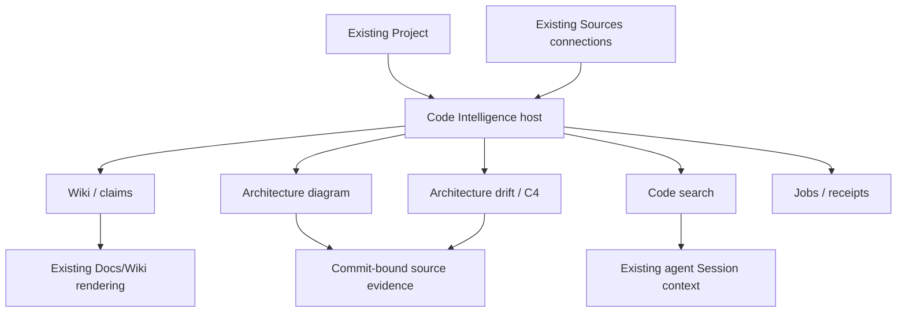
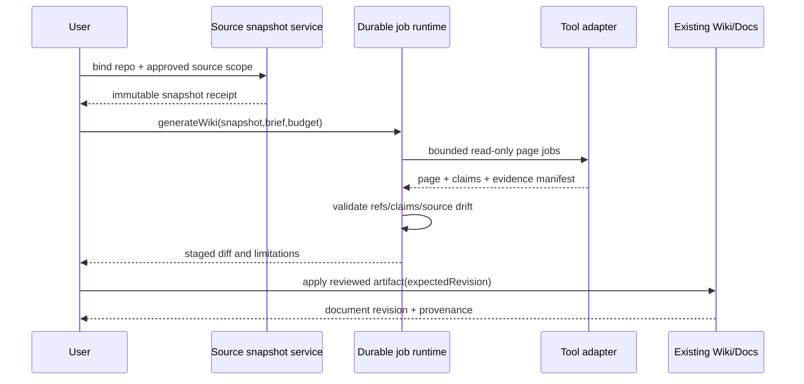

# Code Intelligence внутри ROX: конкретные экраны

**PROPOSED UX**, 2026-09-30. Scope расширен последним сообщением пользователя: OpenWiki, GitDiagram, альтернатива repogrep.com и Groma. Исходники/commit SHA/licenses/реальные pipelines находятся в [13](13-code-intelligence.md). Это дополнительный architecture/implementation plan; инструменты и cloud jobs не устанавливаются/запускаются этим исследованием.

## 1. Placement and navigation

Основной entry: существующий **Projects → выбранный Project → Code Intelligence tab**. Sources управляет подключёнными локальными/git/provider источниками; Wiki/Docs показывают сгенерированные страницы, связанные с repo artifact и snapshot; Sessions/Skills/KnowledgeAgentPanel выполняют разрешённые agent operations. Не добавляем независимые GitDiagram/OpenWiki/Groma приложения в rail. При достаточной необходимости глобальный «Код» — shortcut на этот же workspace/project-filtered host, а не второй state.

Source seams: [nav-destinations](https://github.com/rox-one/rox-one/blob/e953786ba7e30fb5da5dca7e88e20e324d5aebab/apps/electron/src/renderer/components/app-shell/nav-destinations.ts), [Project types / workingDirectory](https://github.com/rox-one/rox-one/blob/e953786ba7e30fb5da5dca7e88e20e324d5aebab/packages/shared/src/projects/types.ts), [KnowledgeSurfacePage](https://github.com/rox-one/rox-one/blob/e953786ba7e30fb5da5dca7e88e20e324d5aebab/apps/electron/src/renderer/pages/KnowledgeSurfacePage.tsx), [source-index-facade](https://github.com/rox-one/rox-one/blob/e953786ba7e30fb5da5dca7e88e20e324d5aebab/packages/server-core/src/sources/source-index-facade.ts), [KnowledgeAgentPanel](https://github.com/rox-one/rox-one/blob/e953786ba7e30fb5da5dca7e88e20e324d5aebab/apps/electron/src/renderer/knowledge/KnowledgeAgentPanel.tsx). These are existing integration seams, not already complete code intelligence.

### Existing capability pack to extend

ROX already has a headless Code Intelligence package: [types.ts — CodeIntelAdapter/CODE_INTEL_PACK](https://github.com/rox-one/rox-one/blob/e953786ba7e30fb5da5dca7e88e20e324d5aebab/packages/shared/src/code-intelligence/types.ts), [local-adapter.ts — indexSourceFiles](https://github.com/rox-one/rox-one/blob/e953786ba7e30fb5da5dca7e88e20e324d5aebab/packages/shared/src/code-intelligence/local-adapter.ts), [explainer.ts — materializeArchitectureNote](https://github.com/rox-one/rox-one/blob/e953786ba7e30fb5da5dca7e88e20e324d5aebab/packages/shared/src/code-intelligence/explainer.ts), [sbom.ts — runSyftSbom](https://github.com/rox-one/rox-one/blob/e953786ba7e30fb5da5dca7e88e20e324d5aebab/packages/shared/src/code-intelligence/sbom.ts). Preserve the `alwaysOn:false` activation contract and extend its existing types through the integration owner.

Its current regex index recognizes named functions/classes/types and emits file→symbol `contains` edges; a declared `imports` enum is not evidence of resolved import edges. Citation fields use caller-supplied `commit`; the adapter does not verify Git identity or dirty bytes. Secret hints/path substring filters are limited ingestion heuristics, not the repository scope/egress/ACL policy required here. `MAX_FILE_BYTES` currently compares JS `content.length`: the threshold is 262144 UTF-16 code units, not an assured UTF-8 byte limit. The named “oversized files” test does not include an oversized assertion. Syft is an injected optional command runner, not an installed/runtime-verified scanner. Existing helper tests ran **4 pass /0 fail**; the requested Project/Search/Wiki/Diagram UI still needs implementation.

[RepoArchitectureExplainer](https://github.com/rox-one/rox-one/blob/e953786ba7e30fb5da5dca7e88e20e324d5aebab/apps/electron/src/renderer/components/session-workbench/RepoArchitectureExplainer.tsx) already renders a localized node/citation list. Its existence and source-text test do not establish a mounted production graph surface. Reuse/extend its evidence presentation where appropriate. [CAPABILITY_TOOLS](https://github.com/rox-one/rox-one/blob/e953786ba7e30fb5da5dca7e88e20e324d5aebab/packages/shared/src/capabilities/packs.ts) contains placeholder repositories and generated declaration hashes; those cannot be treated as installed versions or upstream verification receipts.

The current pack records CodeWiki/DeepWiki as rejected duplicate wiki daemons. OpenWiki integration is therefore an explicit revised product decision: an on-demand provider behind the same pack with reviewed artifact adoption, no extra always-running wiki authority. Retain prior reasons and add an audited provider capability decision instead of deleting the rejection list silently. See the exact audit and caller coverage in [13](13-code-intelligence.md).

## 2. Layout

Header: repository label, branch, immutable snapshot SHA, indexed freshness/time, read-only/allowed actions, Refresh source, Analyze, more. Secondary tabs: Обзор, Wiki, Diagram, Search, Architecture, Runs. Left tree lists repositories/modules/wiki pages; center active view; right inspector Evidence/Claims/Dependencies/Agent context. At <900px tree and inspector become sheets. Workspace switch cancels queries and clears private result/cache; repo refresh creates new snapshot, not silently retargets displayed citations.

## 3. Screens, controls and I/O

| ID | Screen | Inputs/defaults/validation | Outputs and interaction |
|---|---|---|---|
| RC-01 | Repository connection | existing Project workingDirectory default; approved git URL/local path; branch; include/exclude; max size; read-only credentials ConnectionRef | RepositoryBinding + source provenance receipt. Path canonicalization/symlink boundary; no remote credentials in URL/log. Preview inventory before indexing |
| RC-02 | Overview | repoRef + snapshot | exact SHA/languages/modules/index state/claims freshness/failed scans. Cards open same filtered host; no speculative quality score |
| RC-03 | Wiki reader | snapshotRef, pageID | Docs renderer with ToC left; claims/source references right; generated badge/provider/time; verified/stale/unsupported claim status; citations open exact file range |
| RC-04 | Wiki generation plan | repo snapshot, brief, exclusions, allowed provider/tool scope, budget | reviewable page queue + source scope, estimate/rate limits; start creates durable run. Prompt/source changes versioned; no overwriting user AGENTS |
| RC-05 | Wiki review / diff | draft page+claims vs current revision | markdown diff, added/retracted/stale claims, source proof; Approve into Wiki creates version/provenance link. Generated content cannot silently replace human page |
| RC-06 | Diagram | graph artifact, snapshot, layer/module filters | pannable/zoomable graph with legend + evidence status. Deterministic imports vs inferred model edges styled differently; node click inspector; Enter opens source. Fit/zoom accessible, no hover-only controls |
| RC-07 | Code search | literal/regex/symbol/question; repo(s), snapshot, path glob, language, case, max results | matches with repo/SHA/path/line/column and bounded snippets. Search count capped labeled; regex budget/timeout. Arrow selection, Enter preview, Cmd/Ctrl+Enter context to Session |
| RC-08 | Grounded answer | query + selected permitted refs, provider/budget | answer with claim→exact source ranges, unknowns, evidence freshness; no evidence means qualified unknown. Copy/export preserves citations; no automatic code changes |
| RC-09 | Source viewer | snapshotRef + path + range | read-only syntax lines, nearby symbols, backlinks; line-link/copy authorized snippet; binary/large file placeholder. All source access rechecked |
| RC-10 | Groma architecture | architecture model, scan snapshot, C4 layer, rules | context/container/component diagrams, deterministic scan provenance, coverage and contradictions/drift. Curated architecture relation can differ from source; both visible |
| RC-11 | Drift/change review | old/new snapshot, explicit rules/claims | impacted wiki pages/graph nodes, missing/stale artifacts, proposed patches. Accept/reject creates model revision and preserves reasons |
| RC-12 | Runs and recovery | repository/jobID/status/cursor | per-stage receipts/checkpoints/tokens/cost units where actually known; cancel/retry/resume. Restart verifies source SHA; stale run cannot publish to new snapshot |

All inputs expose loading/empty/error/denied/stale/offline states. Failed scanner means “не проверено”, not zero dependencies. Empty repository remains empty; setup success never means architecture audited. Locally indexed code searchable offline after access-policy validation; network provider answers disabled offline. Indexer never executes repository scripts/package hooks for ordinary scan.

Offline access policy is explicit: local-owned repository uses local owner authorization; remote-private source requires a scoped signed policy lease with expiry, workspace/actor/source binding and no offline renewal. After expiry protected search/wiki/diagram/agent context fails closed. Revocation learned on reconnect invalidates leases/caches immediately; **instant remote revocation while disconnected cannot be guaranteed**, and any enabled bounded offline lease documents that exposure window. Default remote-private policy has no offline content access unless administrator explicitly enables a bounded lease. The same resolver serves RC-07/09/agent, not UI-only hiding.

## 4. UI details

Rows: 32px desktop, subtle hover fill; selected leading accent, keyboard focus1px. Tree hover reveals more; expand/collapse uses chevron+aria-expanded. Diagram node hover displays short symbol/type with source count; click/focus inspector exposes exact source, freshness and uncertainty. Inferred edges dashed, verified edges solid, stale dim+badge, color supplemented by labels. Tooltip350ms and transitions120ms proposed; reduced-motion removes graph fly/pan animations.

Search result: title path+line, code monospace snippet, match background, repository/SHA chip. Query input caret focus with light fill, keyboard underline/ring thin. Regex button labeled and warns only actual validation errors, not hypothetical security checklist. Advanced filters panel has applied chips and Reset. Match previews use current snapshot, never working tree drift without an explicit “working copy” label.

Wiki claim badges: Source-verified / Inferred / Stale / Disputed / Unverified. Hover/focus explains rule and last evidence SHA; click opens evidence drawer, not a separate private data fetch bypass. Generated prose and source observations remain distinct. File citation copied as commit URL for remote public source or ROX authorized deep link for private repo; private code export requires current policy.

Architecture/Diagram panel toggle uses same graph artifact where possible, but GitDiagram model-generated diagram and Groma curated C4 model are different projections with provenance, not overwritten into one unexplained graph. Comparison shows node/edge mapping and unresolved mappings. A user edits architecture narrative through reviewable model command; no graph drag writes source code.

## 5. Authority, security and failure

RepositorySnapshot is immutable content manifest. Code index, model diagrams and wiki drafts derive from that snapshot. OpenWiki page job checkpoint/Claims sidecars and Groma model YAML/Markdown are adapter artifacts with native version metadata. Human Wiki page ownership explicit. External tool artifacts must be imported through versioned SourceArtifact resolver; no automatic recursive indexing of generated output into original source evidence.

Clean Git snapshot has commitSHA + tree/manifest digest. **Dirty working copy** has separate snapshot kind, parent commitSHA and content manifest digest; modified bytes cannot use the parent remote commit URL as exact evidence. Excluded/untracked files listed according to policy without exposing content. Imported artifact identity binds connection/repo canonical identity, snapshot digest, adapter/tool version, artifact kind and artifact digest; retry/repo alias has idempotent mapping to the same generated artifact, never duplicates human Wiki pages. Curated Groma model revision remains distinct from generated suggestions.

“Source-verified” claim requires a support assessment against exact allowed content, with method/checker version and result receipt, not just an existing file path or valid citation URL. Claim status and citation integrity are separate dimensions. A model-generated edge retains `method: inferred` and coverage/limitations even when its endpoint symbols exist. Scanner findings identify supported language/rule and uncovered parts; failure/uncovered never becomes verified absence.

Repository README/AGENTS/issues/prompt text are **untrusted source content**, not authorization to execute scripts or exfiltrate. Explicit allowlist excludes keys/.env/private logs and rejects path escape/symlink crossing. Remote provider sending private repo content is a scoped Connection policy, not implied by adding a public URL. Tool runner has read-only checkout/no git push/no install hooks by default. Any proposed instruction file update uses owned markers and preview, respects existing user rules.

Repogrep.com internal bundle endpoint is not a stable public API. Recommended equivalent: existing ROX local source index + bounded ripgrep/symbol adapters and grounded agent answers. Compare a self-host search engine spike for larger corpus; use public website manually as reference. Do not send private repos to undocumented SaaS endpoint. Package license/reuse is audited per source, UI behavior can be reimplemented.

## 6. Acceptance extensions

1. Connect actual existing Project workingDirectory, index selected source at SHA, literal search returns verified path/line; exclude fixture `.env` and symlink escape never read.
2. Generate staged wiki, each material claim cites allowed snapshot, current and stale status distinct; resume page queue after restart without replacing human brief.
3. Diagram exact imported edges and inferred edges distinguishable; failed generation never shown as analyzed success; citations open same snapshot.
4. Groma scanner/config/C4 model imported with provenance; empty repo initialization yields empty/unknown, not green architecture audit. Source change produces drift review.
5. Actor access revoked invalidates code/search/wiki/diagram cache; agent context respects same ACL. Working-tree change while generation runs creates separate snapshot and blocks stale publish.
6. Jobs cancel/retry receipt, output digest and remote delivery hash; no private code in analytics or public docs. Tools are not considered installed/executed merely because source manifests exist.
