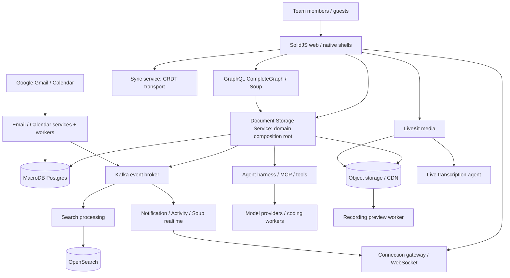
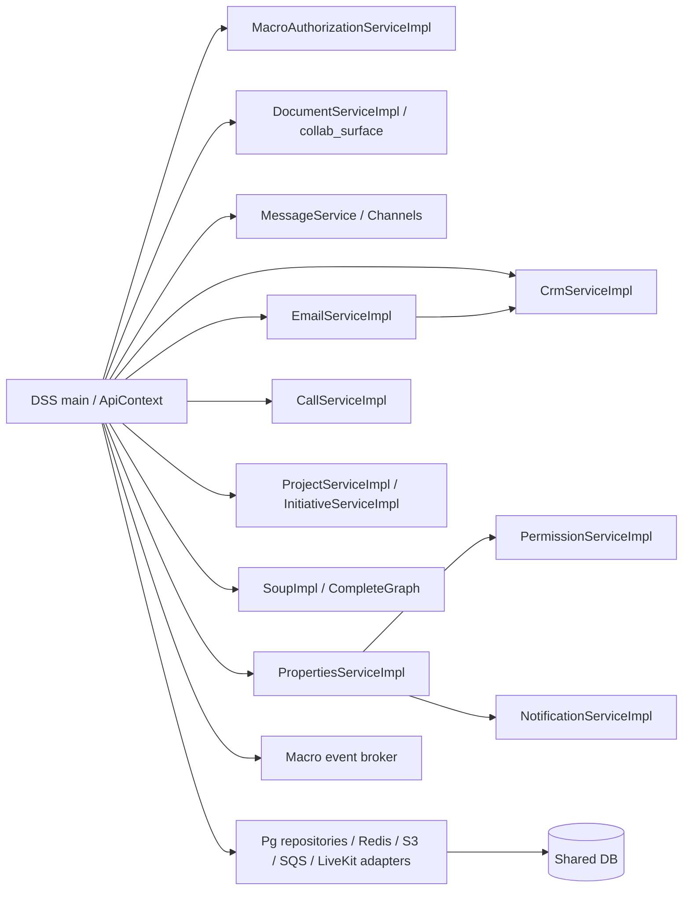

# Macro: системная архитектура baseline

Baseline: `macro-inc/macro@c966b79d40798c6c726a3b15fe90517941fc6e61`. Статический аудит, не runtime certification.

## System context

Основание: `services/document_storage_service/src/main.rs::main` (197+, composition 341–460+), `api.rs` (65–329 routers), `crates/complete_graph/src/schema.rs::CompleteMutationRoot` (85+), `crates/macro_event_topics/src/lib.rs::topics!` (49+). Подробнее media paths — 13; sync — 07; indexing — 15.

## Реальные dependency boundaries

Это не «каждый crate = отдельный микросервис». DSS создаёт concrete repositories и domain services в одном composition root. Например CRM в DSS использует `NoOpCompanyMetadataResolver` для read paths (`main.rs` 375–382), email domain получает CRM и entity access adapters (383–412), Properties получает permission checker, notification ingress и broker (438–461). Другие deployable composition roots имеют собственные конфигурации. Разделять логику домена и outbound cloud adapter — полезная архитектурная семантика; число services Macro не является требованием ROX.

`plans/macro-integration/macro-backend-dependencies.json` содержит все 296 local Cargo packages и 2 592 edges, разрешенные по package names/workspace dependency declarations, с normal/dev/build/target/optional flags. Это **manifest graph**, не автоматически call graph: feature-gated dependency может быть не активна, тестовая dependency не обслуживает production path. Скрипт `scripts/macro-integration/audit-source.mjs` воспроизводит его из фиксированного дерева.

## Frontend data plane

SolidJS route composition находится в `apps/web/src/routes/Root.tsx::ROUTES` (237+); split routes — `components/app/split-layout/split-router/app-routes.ts::appSplitRoutes` (34+). Registry `lib/constants/block-registry.ts::BlockRegistry` включает документы, human channel, AI chat, agent, mail, CRM, call, calendar, spreadsheet, canvas, PR и automation. `lib/core/internal/BlockLoader.tsx::BlockLoader` (50+) соединяет preload, permissions, sync source, lifecycle cleanup и open tracking. Это общий loader, а не универсальная persistence/ACL для всех kinds.

Данные приходят через REST/generated service clients, GraphQL/Soup и специализированный sync transport. CompleteGraph объединяет independent query/mutation adapters, а не заменяет доменные сервисы: `CompleteMutationRoot` содержит property/entity/favorite/channel/notification/email/initiative roots (`crates/complete_graph/src/schema.rs` 85–112). UI query state Solid signals + TanStack Solid Query не переносится непосредственно в React; type/schema/interaction contract можно воспроизвести через существующие ROX RPC hooks.

## Universal entity: фактическое ограничение

`crates/model-entity/src/lib.rs::EntityType` (34–75) шире owner registry. `shared_entity_registry::RegisteredEntityType` содержит только Project, Document, Chat, AgentSession, ScheduledAction; `macro_db_client/migrations/20260910144347_add_entity_table.sql` (3–7) закрепляет это CHECK. Task — document subtype; human channel/message и CRM/calendar не становятся registry rows только потому, что enum их знает.

`EntityType::is_valid_entity_access_entity` (80–125) явно исключает channels, CRM, calendar, reminders и ряд других kinds из общей entity_access ветки. Calls разрешаются через канал; Calendar — owner/inbox delegation; CRM — team joins; skills — underlying documents. Macro действительно связывает сущности, но ещё не имеет единой одинаковой authority для каждой поверхности. ROX должен перенять typed references и общие pipelines, не переносить эту неполноту как целевой стандарт.

## Events и processing

Broker `Event<E>` содержит UUIDv7 event_id, schema_version и flattened topic event (`crates/macro_event_broker/src/domain/models.rs` 33–81). `MacroEvent::key` задаёт partition key (90+); Kafka implementation находится в outbound adapters. Topics включают documents/projects/initiatives/properties/teams/channels/messages/email/mentions/notifications/activity/calls/calendar/chats/agent lifecycle. Не все UI события равны durable domain events; analytics pageView/open_entity в BlockLoader не заменяют audit log.

Целевая архитектура оставляет versioned envelope и per-aggregate ordering, добавляя transactional outbox/inbox, revision, actor/workspace, causation и retry receipts к существующему Rox2Event. Search/notification consumer failures и revoke не должны зависеть от успешного UI refresh.

## Storage, processing и test boundaries

Postgres schema восстанавливается последовательностью `crates/macro_db_client/migrations/*.sql` и текущими repository SQL; migration name не доказывает актуальную колонку после последующих ALTER/DROP. Generated schemas — API evidence; composition root + handler + repo — execution evidence. Бинарные документы проходят upload/finalizer/extractor/preview pipeline; Markdown/spreadsheets используют sync state, canvas `simpleSave` whole-file JSON (`features/block-canvas/queries/canvas-document.ts::saveCanvasDocument`, 34+). Поэтому «все документы CRDT» неверно.

Тестовые fixtures/no-op adapters не равны production implementation. Для переноса надо сохранить tests как behavioral contracts и дополнить live E2E из 22; текущие source tests не запускались с production зависимостями. Лицензионная квалификация каждого literal port — 18.
