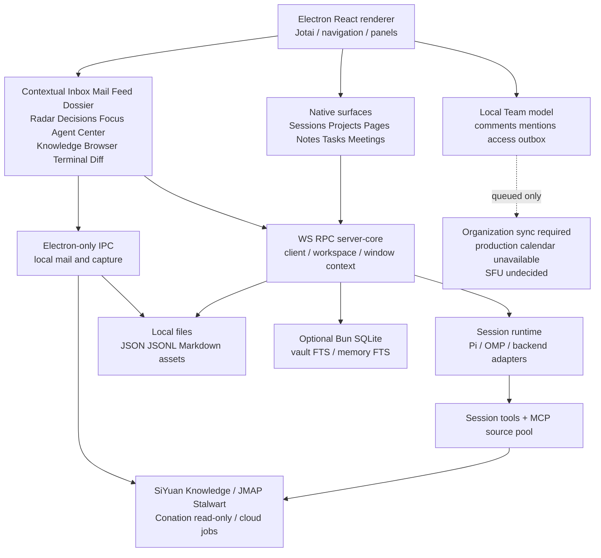
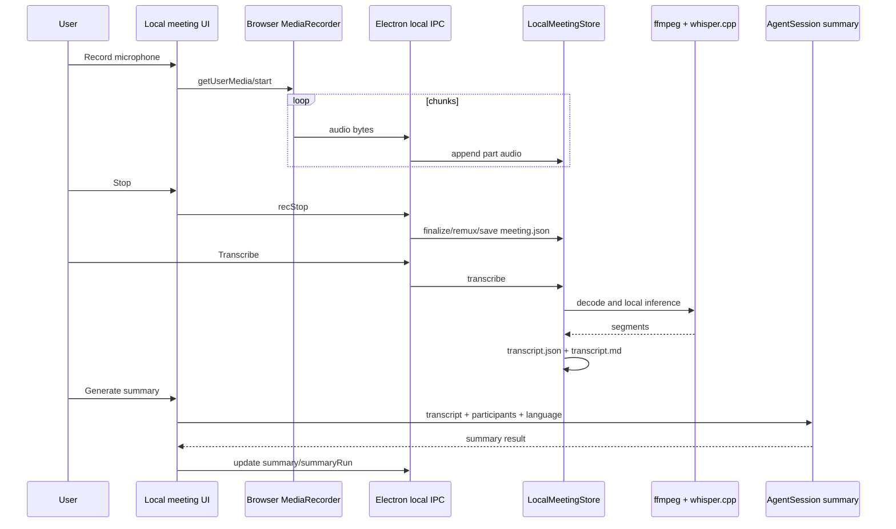
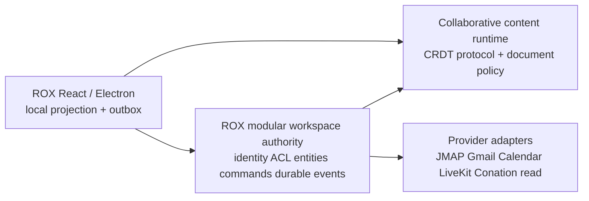
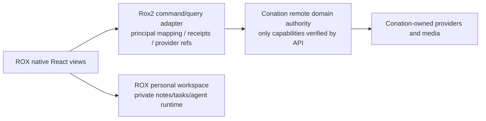

# 03. Текущее состояние ROX: code audit

> Repository: `rox-one/rox-one`. Зафиксированный HEAD: `f63294ba4fffa7238b46b24e918925a313ad0b12`. Проверено непосредственно по checkout текущего кода. **CODE_INSPECTED** означает прослеженный code path, **CONTRACT_ONLY** — типы/pure model, **BLOCKED_IN_CODE** — код явно запрещает capability. Ни один статус в этом документе не означает verified deployed runtime: Electron, remote team delivery и внешние providers в этом audit не запускались. Тесты ниже указаны как существующие regression seams, без заявления об их прохождении.

## 1. Главный вывод

ROX имеет native surfaces и реальные локальные механизмы: agent Sessions, Projects с shared assets/context, HTML Pages, Markdown Notes, personal Tasks, Inbox с JMAP Mail, local meeting recordings/ASR/agent summaries, Memory, Knowledge providers, automations, source integrations. Это уже основа workspace. Главный gap — authoritative multiuser domain runtime: identity principal, entity persistence/ACL, durable events, multiuser sync, provider-neutral mail/calendar, human messaging и SFU calls. Создавать рядом второй Tasks/Projects/Pages/Meetings не требуется. [ROX-001](https://github.com/rox-one/rox-one/blob/f63294ba4fffa7238b46b24e918925a313ad0b12/apps/electron/src/renderer/components/app-shell/nav-destinations.ts#L87-L197) [ROX-004](https://github.com/rox-one/rox-one/blob/f63294ba4fffa7238b46b24e918925a313ad0b12/apps/electron/src/renderer/components/app-shell/MainContentPanel.tsx#L322-L541)

**Универсальный contract уже существует.** `Rox2EntityRef` содержит workspace, namespaced entity ID, revision и optional account namespace; external binding использует provider/account/type/remote ID, relations имеют domain/range/cycle/deletion rules. Нужны persistent implementations и typed registries вокруг этого seam, а не второй competing contract. `permissions: string[]` в DTO само по себе не авторизация. [ROX-008](https://github.com/rox-one/rox-one/blob/f63294ba4fffa7238b46b24e918925a313ad0b12/packages/core/src/rox2/platform-contract.ts#L17-L161) [ROX-009](https://github.com/rox-one/rox-one/blob/f63294ba4fffa7238b46b24e918925a313ad0b12/packages/core/src/rox2/platform-contract.ts#L218-L247) [ROX-010](https://github.com/rox-one/rox-one/blob/f63294ba4fffa7238b46b24e918925a313ad0b12/packages/core/src/rox2/platform-contract.ts#L336-L374) [ROX-011](https://github.com/rox-one/rox-one/blob/f63294ba4fffa7238b46b24e918925a313ad0b12/packages/core/src/rox2/platform-contract.ts#L380-L438)

Есть важное семантическое различие: **ROX Pages — агентские HTML приложения/дашборды**, а **Notes — editable Markdown documents**. Target Pages должен сохранить HTML artifact subtype и добавить collaborative document representation с shared document identity; Notes становится редактором/представлением тех же document records и экспортом Markdown. HTML нельзя превращать в CRDT text document без отдельного content adapter. [ROX-017](https://github.com/rox-one/rox-one/blob/f63294ba4fffa7238b46b24e918925a313ad0b12/packages/shared/src/pages/storage.ts#L40-L120) [ROX-018](https://github.com/rox-one/rox-one/blob/f63294ba4fffa7238b46b24e918925a313ad0b12/packages/core/src/types/page.ts#L294-L320) [ROX-022](https://github.com/rox-one/rox-one/blob/f63294ba4fffa7238b46b24e918925a313ad0b12/apps/electron/src/renderer/pages/NotesPage.tsx#L7-L14)

## 2. Реальная архитектура

Architecture основана на native route renderer, WS RPC interfaces, local stores, provider seams и явно blocked transports. Compute CloudRun provider не является collaboration server и не заменяет multiuser identity/event/search services. [ROX-004](https://github.com/rox-one/rox-one/blob/f63294ba4fffa7238b46b24e918925a313ad0b12/apps/electron/src/renderer/components/app-shell/MainContentPanel.tsx#L322-L541) [ROX-076](https://github.com/rox-one/rox-one/blob/f63294ba4fffa7238b46b24e918925a313ad0b12/packages/server-core/src/transport/types.ts#L7-L22) [ROX-077](https://github.com/rox-one/rox-one/blob/f63294ba4fffa7238b46b24e918925a313ad0b12/packages/server-core/src/transport/server.ts#L106-L161) [ROX-034](https://github.com/rox-one/rox-one/blob/f63294ba4fffa7238b46b24e918925a313ad0b12/packages/server-core/src/tasks/personal-persist.ts#L74-L113) [ROX-029](https://github.com/rox-one/rox-one/blob/f63294ba4fffa7238b46b24e918925a313ad0b12/packages/server-core/src/knowledge/vault-index.ts#L318-L337) [ROX-048](https://github.com/rox-one/rox-one/blob/f63294ba4fffa7238b46b24e918925a313ad0b12/apps/electron/src/main/mail/mail-service.ts#L289-L322) [ROX-090](https://github.com/rox-one/rox-one/blob/f63294ba4fffa7238b46b24e918925a313ad0b12/packages/cloud-runner/src/native-provider.ts#L39-L71)

## 3. Inventory существующих поверхностей

| Surface / contextual surface | Что действительно реализовано в коде | Persistence / query / command | Что ещё нельзя считать Macro parity | Evidence |
|---|---|---|---|---|
| Shell / navigation | Native rail, focused panel routing, URLs/history, multi-panel layout; contextual native surfaces | routes + NavigationContext + MainContentPanel | Generic entity view route missing; contract unions расходятся | [ROX-001](https://github.com/rox-one/rox-one/blob/f63294ba4fffa7238b46b24e918925a313ad0b12/apps/electron/src/renderer/components/app-shell/nav-destinations.ts#L87-L197) [ROX-003](https://github.com/rox-one/rox-one/blob/f63294ba4fffa7238b46b24e918925a313ad0b12/apps/electron/src/shared/routes.ts#L171-L295) [ROX-005](https://github.com/rox-one/rox-one/blob/f63294ba4fffa7238b46b24e918925a313ad0b12/apps/electron/src/renderer/contexts/NavigationContext.tsx#L276-L333) [ROX-006](https://github.com/rox-one/rox-one/blob/f63294ba4fffa7238b46b24e918925a313ad0b12/packages/core/src/platform/surfaces/types.ts#L35-L65) |
| Sessions / Chat | Agent transcript с tool/status/thinking/plan/auth cards, sources, branching metadata, local session share metadata | SessionConfig + JSONL | Нет human Message author/member model, channel read receipts/presence в данном transcript | [ROX-013](https://github.com/rox-one/rox-one/blob/f63294ba4fffa7238b46b24e918925a313ad0b12/packages/core/src/types/message.ts#L8-L22) [ROX-014](https://github.com/rox-one/rox-one/blob/f63294ba4fffa7238b46b24e918925a313ad0b12/packages/core/src/types/message.ts#L252-L294) [ROX-015](https://github.com/rox-one/rox-one/blob/f63294ba4fffa7238b46b24e918925a313ad0b12/packages/shared/src/sessions/types.ts#L118-L240) [ROX-016](https://github.com/rox-one/rox-one/blob/f63294ba4fffa7238b46b24e918925a313ad0b12/packages/shared/src/sessions/storage.ts#L80-L87) |
| Projects | CRUD, assets, working directory, prompt details/memory, session board columns, archive | projects/{slug}/config.json + assets; projects RPC | Multiuser membership/ACL/activity всех child entity пока не единая система | [ROX-039](https://github.com/rox-one/rox-one/blob/f63294ba4fffa7238b46b24e918925a313ad0b12/packages/shared/src/projects/types.ts#L35-L113) [ROX-040](https://github.com/rox-one/rox-one/blob/f63294ba4fffa7238b46b24e918925a313ad0b12/packages/server-core/src/handlers/rpc/projects.ts#L27-L165) [ROX-041](https://github.com/rox-one/rox-one/blob/f63294ba4fffa7238b46b24e918925a313ad0b12/packages/core/src/rox2/project-membership.ts#L13-L36) |
| Pages | Persisted generated HTML, tile/frame, live data snapshot, source-action grants, refresh, public share pointer | page.json/index.html/snapshot.json/script SQLite; pages RPC | Нет совместного Markdown/block editor, CRDT presence/cursors | [ROX-017](https://github.com/rox-one/rox-one/blob/f63294ba4fffa7238b46b24e918925a313ad0b12/packages/shared/src/pages/storage.ts#L40-L120) [ROX-018](https://github.com/rox-one/rox-one/blob/f63294ba4fffa7238b46b24e918925a313ad0b12/packages/core/src/types/page.ts#L294-L320) [ROX-021](https://github.com/rox-one/rox-one/blob/f63294ba4fffa7238b46b24e918925a313ad0b12/packages/server-core/src/handlers/rpc/pages.ts#L15-L60) [ROX-020](https://github.com/rox-one/rox-one/blob/f63294ba4fffa7238b46b24e918925a313ad0b12/apps/electron/src/renderer/components/pages/PageFrame.tsx#L74-L95) |
| Notes | Markdown editor, WikiLink/hash tags/task items, comments representation, rich blocks, backlinks/daily/assets, file watch | Markdown files + optional vault SQLite/FTS + notes RPC | Основной editor не передаёт expected revision; multiuser CRDT отсутствует в inspected extension setup | [ROX-022](https://github.com/rox-one/rox-one/blob/f63294ba4fffa7238b46b24e918925a313ad0b12/apps/electron/src/renderer/pages/NotesPage.tsx#L7-L14) [ROX-023](https://github.com/rox-one/rox-one/blob/f63294ba4fffa7238b46b24e918925a313ad0b12/packages/ui/src/components/markdown/TiptapMarkdownEditor.tsx#L252-L347) [ROX-025](https://github.com/rox-one/rox-one/blob/f63294ba4fffa7238b46b24e918925a313ad0b12/packages/server-core/src/handlers/rpc/notes.ts#L502-L523) [ROX-026](https://github.com/rox-one/rox-one/blob/f63294ba4fffa7238b46b24e918925a313ad0b12/apps/electron/src/renderer/pages/NotesPage.tsx#L885-L894) [ROX-027](https://github.com/rox-one/rox-one/blob/f63294ba4fffa7238b46b24e918925a313ad0b12/packages/server-core/src/handlers/rpc/notes.ts#L994-L1015) [ROX-028](https://github.com/rox-one/rox-one/blob/f63294ba4fffa7238b46b24e918925a313ad0b12/packages/server-core/src/knowledge/vault-index.ts#L45-L92) |
| Knowledge | Provider registry, read/search/tree/backlinks, structured refs, proposal pipeline | Connection stores + providers + mutation proposals | Provider-native permissions не заменяют ROX entity ACL | [ROX-032](https://github.com/rox-one/rox-one/blob/f63294ba4fffa7238b46b24e918925a313ad0b12/packages/core/src/knowledge/provider.ts#L104-L156) [ROX-031](https://github.com/rox-one/rox-one/blob/f63294ba4fffa7238b46b24e918925a313ad0b12/packages/core/src/knowledge/refs.ts#L9-L55) [ROX-089](https://github.com/rox-one/rox-one/blob/f63294ba4fffa7238b46b24e918925a313ad0b12/packages/shared/src/agent/knowledge-permissions.ts#L70-L89) |
| Tasks | Things-like inbox/today/upcoming/anytime/someday/logbook/trash, priorities/dates/recurrence/checklist/reminders/source links | Canonical config-dir per-task JSON + renderer cache migration | Personal scope; assignee/creator/user ACL отсутствуют в PersonalTask; TaskProject duplication risk | [ROX-033](https://github.com/rox-one/rox-one/blob/f63294ba4fffa7238b46b24e918925a313ad0b12/packages/core/src/tasks/personal/types.ts#L8-L114) [ROX-034](https://github.com/rox-one/rox-one/blob/f63294ba4fffa7238b46b24e918925a313ad0b12/packages/server-core/src/tasks/personal-persist.ts#L74-L113) [ROX-035](https://github.com/rox-one/rox-one/blob/f63294ba4fffa7238b46b24e918925a313ad0b12/packages/server-core/src/handlers/rpc/personal-tasks.ts#L29-L69) [ROX-036](https://github.com/rox-one/rox-one/blob/f63294ba4fffa7238b46b24e918925a313ad0b12/apps/electron/src/renderer/lib/personal-tasks-sync.ts#L91-L120) |
| Workflow Tasks | YAML DAG nodes/retry/cache/fanout/orchestrator; agent create_task | tasks/{slug}/task.yaml + session | Не synonym personal Task; сохранить Workflow entity и связать executions с Task | [ROX-037](https://github.com/rox-one/rox-one/blob/f63294ba4fffa7238b46b24e918925a313ad0b12/packages/shared/src/tasks/schema.ts#L190-L248) [ROX-038](https://github.com/rox-one/rox-one/blob/f63294ba4fffa7238b46b24e918925a313ad0b12/packages/session-tools-core/src/tool-defs.ts#L687-L693) |
| Meetings, local | Mic recording/pause/stop/import/recovery, local whisper.cpp ASR, transcript, participant labels, actions/docs, summary session | Electron-only LocalMeetingStore files + local IPC | Не remote audio/video call, нет SFU/join; engine prerequisites conditional | [ROX-058](https://github.com/rox-one/rox-one/blob/f63294ba4fffa7238b46b24e918925a313ad0b12/apps/electron/src/shared/meetings-local.ts#L84-L124) [ROX-059](https://github.com/rox-one/rox-one/blob/f63294ba4fffa7238b46b24e918925a313ad0b12/apps/electron/src/renderer/lib/meetings/recorder.ts#L126-L183) [ROX-060](https://github.com/rox-one/rox-one/blob/f63294ba4fffa7238b46b24e918925a313ad0b12/apps/electron/src/main/meetings/local-store.ts#L189-L260) [ROX-061](https://github.com/rox-one/rox-one/blob/f63294ba4fffa7238b46b24e918925a313ad0b12/apps/electron/src/main/meetings/local-asr.ts#L36-L65) [ROX-062](https://github.com/rox-one/rox-one/blob/f63294ba4fffa7238b46b24e918925a313ad0b12/apps/electron/src/main/meetings/local-store.ts#L333-L436) [ROX-063](https://github.com/rox-one/rox-one/blob/f63294ba4fffa7238b46b24e918925a313ad0b12/apps/electron/src/renderer/pages/meetings/LocalMeetingDetail.tsx#L212-L228) |
| Meetings, server | Revision model, manual/import/catalog/proposal/approval/journal seams | MeetingJournal + query stores + RPC | capture/finalize intent не означает захват media/transcription | [ROX-057](https://github.com/rox-one/rox-one/blob/f63294ba4fffa7238b46b24e918925a313ad0b12/packages/core/src/meetings/model.ts#L11-L37) [ROX-067](https://github.com/rox-one/rox-one/blob/f63294ba4fffa7238b46b24e918925a313ad0b12/packages/server-core/src/meetings/journal.ts#L43-L190) [ROX-065](https://github.com/rox-one/rox-one/blob/f63294ba4fffa7238b46b24e918925a313ad0b12/packages/server-core/src/meetings/capture.ts#L9-L29) [ROX-066](https://github.com/rox-one/rox-one/blob/f63294ba4fffa7238b46b24e918925a313ad0b12/packages/server-core/src/meetings/finalize.ts#L22-L72) |
| Calls | Typed call/meeting bindings and blocked joins | Contract/pure functions | SFU provider null, join always failure, no live call room | [ROX-064](https://github.com/rox-one/rox-one/blob/f63294ba4fffa7238b46b24e918925a313ad0b12/packages/server-core/src/meetings/rooms.ts#L12-L43) [ROX-054](https://github.com/rox-one/rox-one/blob/f63294ba4fffa7238b46b24e918925a313ad0b12/packages/server-core/src/meetings/conation/calendar-calls.ts#L24-L50) |
| Calendar | Account-scoped model, timezone/recurrence/etag merge and fixture adapter contract | CalendarBundle/store/projections | Production unavailable for all providers; CRUD/RSVP missing in adapter | [ROX-044](https://github.com/rox-one/rox-one/blob/f63294ba4fffa7238b46b24e918925a313ad0b12/packages/core/src/calendar/types.ts#L22-L42) [ROX-045](https://github.com/rox-one/rox-one/blob/f63294ba4fffa7238b46b24e918925a313ad0b12/packages/core/src/calendar/adapters.ts#L9-L17) [ROX-046](https://github.com/rox-one/rox-one/blob/f63294ba4fffa7238b46b24e918925a313ad0b12/packages/core/src/calendar/adapters.ts#L112-L137) |
| Mail | Native JMAP inbox/folders/message/flags/move/remove, compose/reply/all/forward, draft/attachment, SSE push | Stalwart server + main-process credentials + MAIL_IPC | Gmail/Microsoft/IMAP account registry and neutral sync journal/CRM/search contract absent here | [ROX-047](https://github.com/rox-one/rox-one/blob/f63294ba4fffa7238b46b24e918925a313ad0b12/apps/electron/src/shared/mail-local.ts#L12-L142) [ROX-048](https://github.com/rox-one/rox-one/blob/f63294ba4fffa7238b46b24e918925a313ad0b12/apps/electron/src/main/mail/mail-service.ts#L289-L322) [ROX-049](https://github.com/rox-one/rox-one/blob/f63294ba4fffa7238b46b24e918925a313ad0b12/apps/electron/src/main/mail/mail-service.ts#L428-L467) [ROX-050](https://github.com/rox-one/rox-one/blob/f63294ba4fffa7238b46b24e918925a313ad0b12/packages/shared/src/mail/jmap-client.ts#L140-L174) |
| CRM / Dossier | Person/company cards, aliases/notes/promises, cross-source touches, agent brief | Workspace renderer JSON; source text matching | No mail-derived contact/company identities/stages/revenue/ACL; Conation writes blocked | [ROX-042](https://github.com/rox-one/rox-one/blob/f63294ba4fffa7238b46b24e918925a313ad0b12/apps/electron/src/renderer/pages/extra-screens/dossier/dossier-model.ts#L8-L44) [ROX-043](https://github.com/rox-one/rox-one/blob/f63294ba4fffa7238b46b24e918925a313ad0b12/apps/electron/src/renderer/pages/extra-screens/dossier/DossierPage.tsx#L94-L156) [ROX-053](https://github.com/rox-one/rox-one/blob/f63294ba4fffa7238b46b24e918925a313ad0b12/packages/server-core/src/meetings/conation/crm.ts#L29-L61) |
| Human collaboration / Team | Local comments, [ROX-069](https://github.com/rox-one/rox-one/blob/f63294ba4fffa7238b46b24e918925a313ad0b12/packages/shared/src/team/types.ts#L14-L146)mate handles, assignment/handoff/access approval activity/inbox/outbox | localStorage team model | Factory always local-only; no delivery to another user/device | [ROX-069](https://github.com/rox-one/rox-one/blob/f63294ba4fffa7238b46b24e918925a313ad0b12/packages/shared/src/team/types.ts#L14-L146) [ROX-071](https://github.com/rox-one/rox-one/blob/f63294ba4fffa7238b46b24e918925a313ad0b12/apps/electron/src/renderer/components/team/team-store.ts#L18-L51) [ROX-070](https://github.com/rox-one/rox-one/blob/f63294ba4fffa7238b46b24e918925a313ad0b12/packages/shared/src/team/sync.ts#L37-L68) [ROX-072](https://github.com/rox-one/rox-one/blob/f63294ba4fffa7238b46b24e918925a313ad0b12/packages/shared/src/team/mentions.ts#L25-L38) |
| Channels | External messenger platform adapters/session bindings; Conation channel panel seams | Gateway incoming/sent metadata; existing session context | No native multiuser Channel/Thread/Message engine; Conation post blocked | [ROX-055](https://github.com/rox-one/rox-one/blob/f63294ba4fffa7238b46b24e918925a313ad0b12/apps/electron/src/renderer/platform/conation/conation-mail-panels.ts#L29-L51) [ROX-056](https://github.com/rox-one/rox-one/blob/f63294ba4fffa7238b46b24e918925a313ad0b12/packages/core/src/conation/soup/client.ts#L15-L22) |
| Inbox / attention | Agent permission/auth/plan/proposal/skill/sender/unread aggregation + mail section; Team local inbox | Source-specific state and renderer triage | Not canonical Notification rows or cross-device read state | [ROX-051](https://github.com/rox-one/rox-one/blob/f63294ba4fffa7238b46b24e918925a313ad0b12/apps/electron/src/renderer/pages/InboxPage.tsx#L91-L121) [ROX-069](https://github.com/rox-one/rox-one/blob/f63294ba4fffa7238b46b24e918925a313ad0b12/packages/shared/src/team/types.ts#L14-L146) [ROX-082](https://github.com/rox-one/rox-one/blob/f63294ba4fffa7238b46b24e918925a313ad0b12/apps/electron/src/main/notifications.ts#L54-L91) |
| Feed / activity | Agents/team/news/subscriptions item model, refs, tags/annotations | Feed source-specific stores | Not authoritative domain event log | [ROX-052](https://github.com/rox-one/rox-one/blob/f63294ba4fffa7238b46b24e918925a313ad0b12/packages/shared/src/feed/types.ts#L10-L55) [ROX-083](https://github.com/rox-one/rox-one/blob/f63294ba4fffa7238b46b24e918925a313ad0b12/packages/shared/src/automations/event-bus.ts#L134-L176) |
| Memory | Lesson/provenance/scope/conflicts, project/global/workspace proposal and context handling, optional FTS | Rule/context/history files + memory index.db | Search/memory ingestion for future CRM/Call must preserve ACL/provenance | [ROX-079](https://github.com/rox-one/rox-one/blob/f63294ba4fffa7238b46b24e918925a313ad0b12/packages/shared/src/memory/types.ts#L12-L58) [ROX-080](https://github.com/rox-one/rox-one/blob/f63294ba4fffa7238b46b24e918925a313ad0b12/packages/server-core/src/memory/fts-index.ts#L98-L102) |
| Search / omnibox | Session ripgrep, Notes FTS/backlinks, Memory FTS, Knowledge provider search, ResourceProvider fan-out | Several independent indexes/providers | No uniform permission-filtered SearchableEntity registry | [ROX-078](https://github.com/rox-one/rox-one/blob/f63294ba4fffa7238b46b24e918925a313ad0b12/packages/server-core/src/services/search.ts#L187-L238) [ROX-029](https://github.com/rox-one/rox-one/blob/f63294ba4fffa7238b46b24e918925a313ad0b12/packages/server-core/src/knowledge/vault-index.ts#L318-L337) [ROX-080](https://github.com/rox-one/rox-one/blob/f63294ba4fffa7238b46b24e918925a313ad0b12/packages/server-core/src/memory/fts-index.ts#L98-L102) [ROX-081](https://github.com/rox-one/rox-one/blob/f63294ba4fffa7238b46b24e918925a313ad0b12/packages/core/src/platform/resources/types.ts#L11-L56) |
| Automations | Event/condition/action model; command/prompt/webhook/knowledge bridges, schedule/retry/history | automations.json/history/retry logs + bus | Bus drops event overflow, no durable domain outbox | [ROX-083](https://github.com/rox-one/rox-one/blob/f63294ba4fffa7238b46b24e918925a313ad0b12/packages/shared/src/automations/event-bus.ts#L134-L176) [ROX-084](https://github.com/rox-one/rox-one/blob/f63294ba4fffa7238b46b24e918925a313ad0b12/packages/shared/src/automations/event-bus.ts#L188-L288) [ROX-085](https://github.com/rox-one/rox-one/blob/f63294ba4fffa7238b46b24e918925a313ad0b12/packages/shared/src/automations/types.ts#L93-L114) |
| Agents / Sources / Skills / Connections | Native session tools + provider backends + centralized MCP/API pool + credential connections | Tool registry / source configuration / credentials | Entity-authorized domain tool interfaces need new adapters; safe/ask is agent execution policy | [ROX-086](https://github.com/rox-one/rox-one/blob/f63294ba4fffa7238b46b24e918925a313ad0b12/packages/shared/src/agent/session-tool-defs.ts#L61-L107) [ROX-087](https://github.com/rox-one/rox-one/blob/f63294ba4fffa7238b46b24e918925a313ad0b12/packages/session-tools-core/src/tool-defs.ts#L889-L921) [ROX-088](https://github.com/rox-one/rox-one/blob/f63294ba4fffa7238b46b24e918925a313ad0b12/packages/shared/src/mcp/mcp-pool.ts#L104-L157) [ROX-073](https://github.com/rox-one/rox-one/blob/f63294ba4fffa7238b46b24e918925a313ad0b12/packages/core/src/platform/identity/types.ts#L69-L136) [ROX-075](https://github.com/rox-one/rox-one/blob/f63294ba4fffa7238b46b24e918925a313ad0b12/packages/core/src/platform/identity/grants.ts#L7-L21) |

## 4. Shell и contextual surfaces

Рельс не является полной картой продукта. `routes.view` содержит Inbox, Feed, Knowledge, Browser и Terminal вне основного navigation array; MainContentPanel также открывает extensions, cloud runs и diff. Platform SurfaceTab/SurfaceDescriptor — другой registry seam; в нём нет universal entity detail. Выбирать generic entity surface нужно через существующий contribution registry, связав его с native route types, без второго navigation engine. [ROX-003](https://github.com/rox-one/rox-one/blob/f63294ba4fffa7238b46b24e918925a313ad0b12/apps/electron/src/shared/routes.ts#L171-L295) [ROX-004](https://github.com/rox-one/rox-one/blob/f63294ba4fffa7238b46b24e918925a313ad0b12/apps/electron/src/renderer/components/app-shell/MainContentPanel.tsx#L322-L541) [ROX-006](https://github.com/rox-one/rox-one/blob/f63294ba4fffa7238b46b24e918925a313ad0b12/packages/core/src/platform/surfaces/types.ts#L35-L65) [ROX-007](https://github.com/rox-one/rox-one/blob/f63294ba4fffa7238b46b24e918925a313ad0b12/packages/core/src/platform/surfaces/registry.ts#L59-L61)

`NavigationProvider` сохраняет URL per workspace и panel stack; history при semantic navigation меняется, panel resize не создаёт переходы. Это reusable interaction pattern для открытия Company/Contact/Call в панели рядом с агентом. `bindSurfaceContext` уже поддерживает refs/revision map/snapshot policy/selection; расширить resolver, а не размножать context injectors. [ROX-005](https://github.com/rox-one/rox-one/blob/f63294ba4fffa7238b46b24e918925a313ad0b12/apps/electron/src/renderer/contexts/NavigationContext.tsx#L276-L333) [ROX-012](https://github.com/rox-one/rox-one/blob/f63294ba4fffa7238b46b24e918925a313ad0b12/packages/core/src/rox2/surface-context.ts#L31-L71)

В source HEAD есть конкретная несогласованность: `AppNavDestinationId` не содержит `meetings`, хотя APP_NAV_DESTINATIONS и predicate содержат Meetings. Это code-level defect/typing gap, не основание объявлять runtime route нерабочим. Также SurfaceTab не охватывает все native MainContentPanel routes; миграция требует синхронизации контрактов и route tests. [ROX-002](https://github.com/rox-one/rox-one/blob/f63294ba4fffa7238b46b24e918925a313ad0b12/apps/electron/src/renderer/components/app-shell/nav-destinations.ts#L51-L65) [ROX-001](https://github.com/rox-one/rox-one/blob/f63294ba4fffa7238b46b24e918925a313ad0b12/apps/electron/src/renderer/components/app-shell/nav-destinations.ts#L87-L197) [ROX-006](https://github.com/rox-one/rox-one/blob/f63294ba4fffa7238b46b24e918925a313ad0b12/packages/core/src/platform/surfaces/types.ts#L35-L65) [ROX-004](https://github.com/rox-one/rox-one/blob/f63294ba4fffa7238b46b24e918925a313ad0b12/apps/electron/src/renderer/components/app-shell/MainContentPanel.tsx#L322-L541)

## 5. Pages / Notes: сохранить две content capabilities, одну entity identity

1. Сохранить HTML Pages: sandbox, source action bridge и digest-bound grants нельзя применять как общий редактор документов. Entity registry должен отличать `contentKind: html-artifact | collaborative-document`; shared Page navigation фильтрует representation. [ROX-018](https://github.com/rox-one/rox-one/blob/f63294ba4fffa7238b46b24e918925a313ad0b12/packages/core/src/types/page.ts#L294-L320) [ROX-020](https://github.com/rox-one/rox-one/blob/f63294ba4fffa7238b46b24e918925a313ad0b12/apps/electron/src/renderer/components/pages/PageFrame.tsx#L74-L95) [ROX-021](https://github.com/rox-one/rox-one/blob/f63294ba4fffa7238b46b24e918925a313ad0b12/packages/server-core/src/handlers/rpc/pages.ts#L15-L60)
2. Сохранить Notes rich editing/export/backlinks/daily workflows. Current Note ID — путь; при rename становится другим адресом. Вводится stable `Document.id` с path aliases; Notes RPC должен resolve alias, а `.md` export сохранять canonical ID в frontmatter/sidecar. [ROX-024](https://github.com/rox-one/rox-one/blob/f63294ba4fffa7238b46b24e918925a313ad0b12/packages/server-core/src/handlers/rpc/notes.ts#L143-L169) [ROX-027](https://github.com/rox-one/rox-one/blob/f63294ba4fffa7238b46b24e918925a313ad0b12/packages/server-core/src/handlers/rpc/notes.ts#L994-L1015)
3. Сохранить pure revision engine как migration/readback tool, но не выдавать его за runtime notes backend: основной UI вызывает Electron saveNote; RPC делает file write. [ROX-030](https://github.com/rox-one/rox-one/blob/f63294ba4fffa7238b46b24e918925a313ad0b12/packages/core/src/rox2/notes-engine.ts#L391-L472) [ROX-025](https://github.com/rox-one/rox-one/blob/f63294ba4fffa7238b46b24e918925a313ad0b12/packages/server-core/src/handlers/rpc/notes.ts#L502-L523) [ROX-026](https://github.com/rox-one/rox-one/blob/f63294ba4fffa7238b46b24e918925a313ad0b12/apps/electron/src/renderer/pages/NotesPage.tsx#L885-L894)
4. `saveNote` проверяет expectedRevision только при передаче параметра; основной UI его не передаёт. Read-check-write не защищён общей transaction/lock и не является atomic CAS. Пока CRDT не подключён, минимум bind revision в UI и serialize per-document server write; конечный shared document path должен использовать collaborative document authority. [ROX-025](https://github.com/rox-one/rox-one/blob/f63294ba4fffa7238b46b24e918925a313ad0b12/packages/server-core/src/handlers/rpc/notes.ts#L502-L523) [ROX-026](https://github.com/rox-one/rox-one/blob/f63294ba4fffa7238b46b24e918925a313ad0b12/apps/electron/src/renderer/pages/NotesPage.tsx#L885-L894)
5. Tiptap/ProseMirror — действующая ROX editor технология. Macro Solid/Lexical UI не переносить непосредственно; domain/CRDT headless adapter может быть независим от UI, но требуется serialization mapping и undo/selection semantics. В изученном Tiptap extension list CRDT/presence extension отсутствует. [ROX-022](https://github.com/rox-one/rox-one/blob/f63294ba4fffa7238b46b24e918925a313ad0b12/apps/electron/src/renderer/pages/NotesPage.tsx#L7-L14) [ROX-023](https://github.com/rox-one/rox-one/blob/f63294ba4fffa7238b46b24e918925a313ad0b12/packages/ui/src/components/markdown/TiptapMarkdownEditor.tsx#L252-L347)

## 6. Tasks / Projects: главный риск duplicate identity

`PersonalTask` уже содержит ссылки на message/session/meeting/mail/note и полезные projection features. Это должна быть compatibility input для `RoxTask`; нельзя создать MacroTask. Task links пока не имеют workspace/account/version scope. Требуется migrate link to `Rox2EntityRef`, author/assignee principal fields, shared visibility and per-user projection preferences. Personal tasks без workspace должны остаться personal namespace до явного назначения/доказуемой миграции. [ROX-033](https://github.com/rox-one/rox-one/blob/f63294ba4fffa7238b46b24e918925a313ad0b12/packages/core/src/tasks/personal/types.ts#L8-L114) [ROX-009](https://github.com/rox-one/rox-one/blob/f63294ba4fffa7238b46b24e918925a313ad0b12/packages/core/src/rox2/platform-contract.ts#L218-L247)

Persisted personal KV расположен в **config directory**, не отдельном workspace. LIST без workspace аргумента и CHANGED `{to: all}`. Когда добавляется team task surface, этот seam должен принимать authorization context/space scope и scoped push, сохранив personal mode. Revision численно увеличивается при изменении, но текущая PUT API не требует expectedRevision. LocalStorage — cache с safe migration backup; не второй authoritative store. [ROX-034](https://github.com/rox-one/rox-one/blob/f63294ba4fffa7238b46b24e918925a313ad0b12/packages/server-core/src/tasks/personal-persist.ts#L74-L113) [ROX-035](https://github.com/rox-one/rox-one/blob/f63294ba4fffa7238b46b24e918925a313ad0b12/packages/server-core/src/handlers/rpc/personal-tasks.ts#L29-L69) [ROX-036](https://github.com/rox-one/rox-one/blob/f63294ba4fffa7238b46b24e918925a313ad0b12/apps/electron/src/renderer/lib/personal-tasks-sync.ts#L91-L120)

Сейчас существуют `TaskProject` в personal bundle и `ProjectConfig` workspace project. Нельзя сопоставлять по display name или просто переименовать type: нужен collision-safe ID mapping, personal project aliases и move-to-workspace operation. Existing `Rox2ProjectMembership` many-to-many links устраняет необходимость копировать session history; расширить domain/range member-of для page/document/channel/meeting/company, а существующий primaryProjectId оставить compatibility pointer. [ROX-033](https://github.com/rox-one/rox-one/blob/f63294ba4fffa7238b46b24e918925a313ad0b12/packages/core/src/tasks/personal/types.ts#L8-L114) [ROX-039](https://github.com/rox-one/rox-one/blob/f63294ba4fffa7238b46b24e918925a313ad0b12/packages/shared/src/projects/types.ts#L35-L113) [ROX-041](https://github.com/rox-one/rox-one/blob/f63294ba4fffa7238b46b24e918925a313ad0b12/packages/core/src/rox2/project-membership.ts#L13-L36) [ROX-011](https://github.com/rox-one/rox-one/blob/f63294ba4fffa7238b46b24e918925a313ad0b12/packages/core/src/rox2/platform-contract.ts#L380-L438)

Workflow TaskSpec — executable agent DAG, не personal task. `create_task` создаёт YAML/orchestrator session и не стартует execution. В target registry distinction `task` vs `workflow`/`workflow-run` остаётся; agent CRUD для RoxTask получает отдельные операции и compatibility legacy create_task command. [ROX-037](https://github.com/rox-one/rox-one/blob/f63294ba4fffa7238b46b24e918925a313ad0b12/packages/shared/src/tasks/schema.ts#L190-L248) [ROX-038](https://github.com/rox-one/rox-one/blob/f63294ba4fffa7238b46b24e918925a313ad0b12/packages/session-tools-core/src/tool-defs.ts#L687-L693)

## 7. Human Chat / Sessions / Team

Agent `Message` содержит assistant/tool streaming и tool-use metadata; human channel messages требуют author principal, membership, edit/delete/reaction/read-state/thread/attachment semantics. AgentSession transcript не следует перестраивать в Channel. Общими становятся entity ref, attachments, permissions, mention extraction, search and context; human agent participation — explicit actor kind на Conversation message, а transcript tool outputs остаются agent execution log. [ROX-013](https://github.com/rox-one/rox-one/blob/f63294ba4fffa7238b46b24e918925a313ad0b12/packages/core/src/types/message.ts#L8-L22) [ROX-014](https://github.com/rox-one/rox-one/blob/f63294ba4fffa7238b46b24e918925a313ad0b12/packages/core/src/types/message.ts#L252-L294) [ROX-069](https://github.com/rox-one/rox-one/blob/f63294ba4fffa7238b46b24e918925a313ad0b12/packages/shared/src/team/types.ts#L14-L146)

Team уже имеет comments/assignment/access/activity/outbox и plain @handles на real roster, но local-only sync factory всегда возвращает push accepted=[] / pull=null. Existing TeamAccessGrant — **data record**, не доказанное enforcement на RPC/storage/search. Target human Conversation/Discussion должен мигрировать TeamComment records и локальные queued ops через canonical command ID, отображая undelivered состояние до remote receipt. [ROX-069](https://github.com/rox-one/rox-one/blob/f63294ba4fffa7238b46b24e918925a313ad0b12/packages/shared/src/team/types.ts#L14-L146) [ROX-070](https://github.com/rox-one/rox-one/blob/f63294ba4fffa7238b46b24e918925a313ad0b12/packages/shared/src/team/sync.ts#L37-L68) [ROX-071](https://github.com/rox-one/rox-one/blob/f63294ba4fffa7238b46b24e918925a313ad0b12/apps/electron/src/renderer/components/team/team-store.ts#L18-L51) [ROX-072](https://github.com/rox-one/rox-one/blob/f63294ba4fffa7238b46b24e918925a313ad0b12/packages/shared/src/team/mentions.ts#L25-L38)

Conation Soup client предоставляет только ping/user page/group queries; попытки Channel post и Conation Mail send возвращают blocked и не сетевые mutation calls. Внешние Telegram/WhatsApp/etc session bindings можно сохранить как Conversation ingress adapters, при этом native organization chat требует собственный domain store и server delivery. [ROX-056](https://github.com/rox-one/rox-one/blob/f63294ba4fffa7238b46b24e918925a313ad0b12/packages/core/src/conation/soup/client.ts#L15-L22) [ROX-055](https://github.com/rox-one/rox-one/blob/f63294ba4fffa7238b46b24e918925a313ad0b12/apps/electron/src/renderer/platform/conation/conation-mail-panels.ts#L29-L51)

## 8. CRM: Dossier сохраняется как представление

Есть действующая native contextual поверхность Dossier: person/company records, aliases, promises, notes, agent brief и найденные по тексту взаимодействия sessions/tasks/meetings/notes/feed. Это полезный UX account overview, но не canonical CRM: company grouping по email/domain, shared ownership/stages/revenue и email history не прослеживаются в этой модели. [ROX-042](https://github.com/rox-one/rox-one/blob/f63294ba4fffa7238b46b24e918925a313ad0b12/apps/electron/src/renderer/pages/extra-screens/dossier/dossier-model.ts#L8-L44) [ROX-043](https://github.com/rox-one/rox-one/blob/f63294ba4fffa7238b46b24e918925a313ad0b12/apps/electron/src/renderer/pages/extra-screens/dossier/DossierPage.tsx#L94-L156)

Target Contact/Company registry должен импортировать DossierEntity с source alias и provenance; не применять automatic merge по title/alias. Promises либо сохраняются typed relationship/property, либо превращаются в RoxTask с source link по пользовательскому действию. Dossier becomes detail/brief view canonical Contact/Company; email-derived matching is another ingest authority. Conation CRM target resolution account/type/id можно сохранить, но live edit/send остаются blocked до adapter command proof. [ROX-042](https://github.com/rox-one/rox-one/blob/f63294ba4fffa7238b46b24e918925a313ad0b12/apps/electron/src/renderer/pages/extra-screens/dossier/dossier-model.ts#L8-L44) [ROX-053](https://github.com/rox-one/rox-one/blob/f63294ba4fffa7238b46b24e918925a313ad0b12/packages/server-core/src/meetings/conation/crm.ts#L29-L61) [ROX-010](https://github.com/rox-one/rox-one/blob/f63294ba4fffa7238b46b24e918925a313ad0b12/packages/core/src/rox2/platform-contract.ts#L336-L374)

## 9. Mail / Calendar / Meetings / Calls

**Mail:** JMAP/Stalwart bridge — code path с настоящим IO, credential isolation и push subscription. Сохранить `JmapAdapter` как первую полноценную mail transport, neutralize Electron-specific DTOs в core mail domain, открыть server-core RPC и agent commands с authorization. Gmail/Microsoft/IMAP — новые adapters, не замена работоспособному JMAP. account-scoped thread/message aliases предотвратят collision одинаковых JMAP IDs. В текущем IPC нельзя утверждать multi-account federation, local universal index или CRM enrichment. [ROX-047](https://github.com/rox-one/rox-one/blob/f63294ba4fffa7238b46b24e918925a313ad0b12/apps/electron/src/shared/mail-local.ts#L12-L142) [ROX-048](https://github.com/rox-one/rox-one/blob/f63294ba4fffa7238b46b24e918925a313ad0b12/apps/electron/src/main/mail/mail-service.ts#L289-L322) [ROX-049](https://github.com/rox-one/rox-one/blob/f63294ba4fffa7238b46b24e918925a313ad0b12/apps/electron/src/main/mail/mail-service.ts#L428-L467) [ROX-050](https://github.com/rox-one/rox-one/blob/f63294ba4fffa7238b46b24e918925a313ad0b12/packages/shared/src/mail/jmap-client.ts#L140-L174) [ROX-009](https://github.com/rox-one/rox-one/blob/f63294ba4fffa7238b46b24e918925a313ad0b12/packages/core/src/rox2/platform-contract.ts#L218-L247)

**Calendar:** enum providers и account-scoped identity не означает их подключение. Production adapter factory всегда unavailable; fixture seeds не production data. Extend adapter list-only interface до CRUD/RSVP/provider cursor/webhook; reuse timezone/recurrence/merge code. `CalendarEvent.id` remote-scoped, canonical ID должен быть независим от remote id, с provider/account/calendar occurrence binding. [ROX-044](https://github.com/rox-one/rox-one/blob/f63294ba4fffa7238b46b24e918925a313ad0b12/packages/core/src/calendar/types.ts#L22-L42) [ROX-045](https://github.com/rox-one/rox-one/blob/f63294ba4fffa7238b46b24e918925a313ad0b12/packages/core/src/calendar/adapters.ts#L9-L17) [ROX-046](https://github.com/rox-one/rox-one/blob/f63294ba4fffa7238b46b24e918925a313ad0b12/packages/core/src/calendar/adapters.ts#L112-L137)

**Meetings:** есть два независимых persistence paths. Local recordings использует MediaRecorder → Electron IPC chunks → LocalMeetingStore → ffmpeg → whisper.cpp → transcript.json/md → agent summary session. Server-core Meeting model/journal/proposals — иной aggregate, capture/finalize там только state intent. Их надо объединить link/binding/migration, не считать обе системы одной backend реализацией. [ROX-058](https://github.com/rox-one/rox-one/blob/f63294ba4fffa7238b46b24e918925a313ad0b12/apps/electron/src/shared/meetings-local.ts#L84-L124) [ROX-059](https://github.com/rox-one/rox-one/blob/f63294ba4fffa7238b46b24e918925a313ad0b12/apps/electron/src/renderer/lib/meetings/recorder.ts#L126-L183) [ROX-060](https://github.com/rox-one/rox-one/blob/f63294ba4fffa7238b46b24e918925a313ad0b12/apps/electron/src/main/meetings/local-store.ts#L189-L260) [ROX-061](https://github.com/rox-one/rox-one/blob/f63294ba4fffa7238b46b24e918925a313ad0b12/apps/electron/src/main/meetings/local-asr.ts#L36-L65) [ROX-062](https://github.com/rox-one/rox-one/blob/f63294ba4fffa7238b46b24e918925a313ad0b12/apps/electron/src/main/meetings/local-store.ts#L333-L436) [ROX-063](https://github.com/rox-one/rox-one/blob/f63294ba4fffa7238b46b24e918925a313ad0b12/apps/electron/src/renderer/pages/meetings/LocalMeetingDetail.tsx#L212-L228) [ROX-065](https://github.com/rox-one/rox-one/blob/f63294ba4fffa7238b46b24e918925a313ad0b12/packages/server-core/src/meetings/capture.ts#L9-L29) [ROX-066](https://github.com/rox-one/rox-one/blob/f63294ba4fffa7238b46b24e918925a313ad0b12/packages/server-core/src/meetings/finalize.ts#L22-L72)

**Calls:** core Meeting_KIND currently `call`; Room provider decision null and joins always fail. Keep local recording capability separate from new SFU room authority; migration should split planning/event Meeting identity and actual media Call identity while maintaining historical call-kind refs as aliases. Shared User principal must author both, participant label alone is not identity. LiveKit integration is new service adapter, not an already reusable ROX runtime. [ROX-057](https://github.com/rox-one/rox-one/blob/f63294ba4fffa7238b46b24e918925a313ad0b12/packages/core/src/meetings/model.ts#L11-L37) [ROX-064](https://github.com/rox-one/rox-one/blob/f63294ba4fffa7238b46b24e918925a313ad0b12/packages/server-core/src/meetings/rooms.ts#L12-L43) [ROX-054](https://github.com/rox-one/rox-one/blob/f63294ba4fffa7238b46b24e918925a313ad0b12/packages/server-core/src/meetings/conation/calendar-calls.ts#L24-L50)

## 10. Identity / permissions / sharing

Есть Profile, role types, ServiceConnection/credentialRef, local organization/member/invite JSON и credential consumer grants. WorkspaceMembership описан как types-only remote contract. Ни одно из них отдельно не authoritative ACL across all entities. `AccessGrant` authorizes consumer→credential actions/resources; оставить как delegation к provider credential и ввести общий entity authorization decision перед credential use. [ROX-073](https://github.com/rox-one/rox-one/blob/f63294ba4fffa7238b46b24e918925a313ad0b12/packages/core/src/platform/identity/types.ts#L69-L136) [ROX-074](https://github.com/rox-one/rox-one/blob/f63294ba4fffa7238b46b24e918925a313ad0b12/packages/shared/src/orgs/storage.ts#L32-L43) [ROX-075](https://github.com/rox-one/rox-one/blob/f63294ba4fffa7238b46b24e918925a313ad0b12/packages/core/src/platform/identity/grants.ts#L7-L21)

WS supports optional token/cookie handshake and trusted local renderer binding; `RequestContext` содержит client/workspace/window, без typed user principal. Native projects/notes handlers часто получают workspaceId как аргумент и не используют `_ctx`. Перед remote multiuser delivery необходимо authenticated actor + verified workspace membership + per-command resource checks; local execution approval (`allow-all/ask/safe`) не присваивает team ownership. [ROX-076](https://github.com/rox-one/rox-one/blob/f63294ba4fffa7238b46b24e918925a313ad0b12/packages/server-core/src/transport/types.ts#L7-L22) [ROX-077](https://github.com/rox-one/rox-one/blob/f63294ba4fffa7238b46b24e918925a313ad0b12/packages/server-core/src/transport/server.ts#L106-L161) [ROX-040](https://github.com/rox-one/rox-one/blob/f63294ba4fffa7238b46b24e918925a313ad0b12/packages/server-core/src/handlers/rpc/projects.ts#L27-L165) [ROX-027](https://github.com/rox-one/rox-one/blob/f63294ba4fffa7238b46b24e918925a313ad0b12/packages/server-core/src/handlers/rpc/notes.ts#L994-L1015) [ROX-089](https://github.com/rox-one/rox-one/blob/f63294ba4fffa7238b46b24e918925a313ad0b12/packages/shared/src/agent/knowledge-permissions.ts#L70-L89)

Pages source-action grants и publication pointer, Session share owner capability, Team access rows и meeting sharing model имеют разные scopes. Target authorization объединяет owner/direct/inherited role decisions, но не подменяет provider credential delegation, public share capability и agent execution confirmations одним булевым permission flag. Не считать cached `permissions[]` trusted. [ROX-018](https://github.com/rox-one/rox-one/blob/f63294ba4fffa7238b46b24e918925a313ad0b12/packages/core/src/types/page.ts#L294-L320) [ROX-015](https://github.com/rox-one/rox-one/blob/f63294ba4fffa7238b46b24e918925a313ad0b12/packages/shared/src/sessions/types.ts#L118-L240) [ROX-069](https://github.com/rox-one/rox-one/blob/f63294ba4fffa7238b46b24e918925a313ad0b12/packages/shared/src/team/types.ts#L14-L146) [ROX-008](https://github.com/rox-one/rox-one/blob/f63294ba4fffa7238b46b24e918925a313ad0b12/packages/core/src/rox2/platform-contract.ts#L17-L161) [ROX-075](https://github.com/rox-one/rox-one/blob/f63294ba4fffa7238b46b24e918925a313ad0b12/packages/core/src/platform/identity/grants.ts#L7-L21)

## 11. Search / memory / notifications / events

Search сейчас составной: session rg по JSONL, Notes optional SQLite FTS/backlinks/task index, Memory FTS lessons/history/context, Knowledge provider search, ResourceProvider omnibox fan-out. В ResourceKind нет task/company/contact/call/calendar event. Сохранить UI fan-out registry и local indexes как adapters, добавить canonical permission-filtered SearchableEntity provider; search index не выдаёт собственную authority на чтение результата. [ROX-078](https://github.com/rox-one/rox-one/blob/f63294ba4fffa7238b46b24e918925a313ad0b12/packages/server-core/src/services/search.ts#L187-L238) [ROX-029](https://github.com/rox-one/rox-one/blob/f63294ba4fffa7238b46b24e918925a313ad0b12/packages/server-core/src/knowledge/vault-index.ts#L318-L337) [ROX-080](https://github.com/rox-one/rox-one/blob/f63294ba4fffa7238b46b24e918925a313ad0b12/packages/server-core/src/memory/fts-index.ts#L98-L102) [ROX-032](https://github.com/rox-one/rox-one/blob/f63294ba4fffa7238b46b24e918925a313ad0b12/packages/core/src/knowledge/provider.ts#L104-L156) [ROX-081](https://github.com/rox-one/rox-one/blob/f63294ba4fffa7238b46b24e918925a313ad0b12/packages/core/src/platform/resources/types.ts#L11-L56)

Inbox — полезный UI attention projection agent approvals/proposals/unread/mail; OS showNotification navigation принимает sessionId. Новый canonical Notification должен хранить recipient/entityRef/reason/read/snooze/dedupe and delivery state, а existing Inbox и OS service стать projection/delivery adapters. Team inbox pending and task reminders должны feed shared primitive с compatibility IDs. [ROX-051](https://github.com/rox-one/rox-one/blob/f63294ba4fffa7238b46b24e918925a313ad0b12/apps/electron/src/renderer/pages/InboxPage.tsx#L91-L121) [ROX-082](https://github.com/rox-one/rox-one/blob/f63294ba4fffa7238b46b24e918925a313ad0b12/apps/electron/src/main/notifications.ts#L54-L91) [ROX-069](https://github.com/rox-one/rox-one/blob/f63294ba4fffa7238b46b24e918925a313ad0b12/packages/shared/src/team/types.ts#L14-L146)

Memory содержит стабильные Lesson/provenance/conflict/scope semantics. Новые company/email/transcript memory facts должны иметь source refs, permission scope и revocation invalidation; не копировать весь текст в глобальную память только потому, что агент однажды его увидел. [ROX-079](https://github.com/rox-one/rox-one/blob/f63294ba4fffa7238b46b24e918925a313ad0b12/packages/shared/src/memory/types.ts#L12-L58) [ROX-009](https://github.com/rox-one/rox-one/blob/f63294ba4fffa7238b46b24e918925a313ad0b12/packages/core/src/rox2/platform-contract.ts#L218-L247)

WorkspaceEventBus использует PascalCase существующих событий Session/Knowledge/Agent/Cloud, parallel handlers и rate-limits, причём overflow **drops events**. Нельзя делать его каноническим event log/search/index/notification source: committed domain events + durable outbox/cursors feed этот bus через compatibility mapping. Existing MeetingJournal CAS/idempotency/outbox — полезный behavioral pattern, но single-writer snapshot files не scale-out workspace transaction runtime. [ROX-083](https://github.com/rox-one/rox-one/blob/f63294ba4fffa7238b46b24e918925a313ad0b12/packages/shared/src/automations/event-bus.ts#L134-L176) [ROX-084](https://github.com/rox-one/rox-one/blob/f63294ba4fffa7238b46b24e918925a313ad0b12/packages/shared/src/automations/event-bus.ts#L188-L288) [ROX-067](https://github.com/rox-one/rox-one/blob/f63294ba4fffa7238b46b24e918925a313ad0b12/packages/server-core/src/meetings/journal.ts#L43-L190)

## 12. Agent-native integration и границы

Shared `buildSessionToolDefs` объединяет session registry и source MCP proxy defs для Pi/OMP с общими gates/deduplication; `McpClientPool` централизован. Existing tools уже умеют Pages CRUD/data, knowledge read/search/backlinks/proposals, sessions, Agent Teams и messaging bindings. Новые domain tool adapters должны использовать тот же command/query dispatcher и actor policy, чтобы agents получали ровно разрешённые user-context операции и provenance. [ROX-086](https://github.com/rox-one/rox-one/blob/f63294ba4fffa7238b46b24e918925a313ad0b12/packages/shared/src/agent/session-tool-defs.ts#L61-L107) [ROX-087](https://github.com/rox-one/rox-one/blob/f63294ba4fffa7238b46b24e918925a313ad0b12/packages/session-tools-core/src/tool-defs.ts#L889-L921) [ROX-088](https://github.com/rox-one/rox-one/blob/f63294ba4fffa7238b46b24e918925a313ad0b12/packages/shared/src/mcp/mcp-pool.ts#L104-L157) [ROX-012](https://github.com/rox-one/rox-one/blob/f63294ba4fffa7238b46b24e918925a313ad0b12/packages/core/src/rox2/surface-context.ts#L31-L71)

Agent Teams — captain/session work execution coordination; human org team comment/membership sync — другой subsystem. Нельзя превратить `.agent-teams/` durable roster в authority пользователя или Channel membership. Surface-specific tools допускаются как typed convenience wrappers; authority одна entity command service. Knowledge mutation human-apply gate сохраняется как policy feature до явно спроектированного domain workflow изменения. [ROX-087](https://github.com/rox-one/rox-one/blob/f63294ba4fffa7238b46b24e918925a313ad0b12/packages/session-tools-core/src/tool-defs.ts#L889-L921) [ROX-069](https://github.com/rox-one/rox-one/blob/f63294ba4fffa7238b46b24e918925a313ad0b12/packages/shared/src/team/types.ts#L14-L146) [ROX-089](https://github.com/rox-one/rox-one/blob/f63294ba4fffa7238b46b24e918925a313ad0b12/packages/shared/src/agent/knowledge-permissions.ts#L70-L89)

## 13. ROX current ERD — logical, не единая SQL схема

```mermaid
erDiagram
  LOCAL_PROFILE ||--o{ SERVICE_CONNECTION : connects
  LOCAL_ORGANIZATION ||--o{ ORG_MEMBER : contains
  LOCAL_PROFILE ||--o{ ORG_MEMBER : userId
  WORKSPACE ||--o{ PROJECT_CONFIG : owns
  WORKSPACE ||--o{ AGENT_SESSION : owns
  PROJECT_CONFIG ||--o{ AGENT_SESSION : legacy_projectId
  PROJECT_CONFIG ||--o{ HTML_PAGE : projectId
  WORKSPACE ||--o{ MARKDOWN_NOTE : path_scoped
  AGENT_SESSION ||--o{ TRANSCRIPT_MESSAGE : stores
  PERSONAL_TASK_BUNDLE ||--o{ PERSONAL_TASK : stores
  PERSONAL_TASK_BUNDLE ||--o{ TASK_PROJECT : separate_projects
  PERSONAL_TASK }o--o| TASK_PROJECT : projectId
  PERSONAL_TASK ||--o{ TASK_LINK : references
  WORKFLOW_SPEC ||--o{ WORKFLOW_NODE : defines
  WORKFLOW_SPEC ||--o| AGENT_SESSION : orchestrator
  HTML_PAGE ||--o{ PAGE_SOURCE_GRANT : permits_source_action
  KNOWLEDGE_CONNECTION ||--o{ KNOWLEDGE_REF : resolves
  WORKSPACE ||--o{ DOSSIER_ENTITY : renderer_json
  LOCAL_MEETING ||--o{ LOCAL_TRANSCRIPT_SEGMENT : audio_to_text
  LOCAL_MEETING ||--o| AGENT_SESSION : summaryRun
  JOURNAL_MEETING ||--o{ MEETING_PROPOSAL : proposed_actions
  JOURNAL_MEETING ||--o{ MEETING_EVENT : journal
  JMAP_ACCOUNT ||--o{ MAIL_MESSAGE : remote_store
  CALENDAR_ACCOUNT ||--o{ CALENDAR_EVENT : unavailable_provider_model
  TEAM_LOCAL_STATE ||--o{ TEAM_COMMENT : local
  TEAM_COMMENT ||--o{ TEAM_OUTBOX_ENTRY : queues
  ROX2_ENTITY_REF ||--o{ ROX2_RELATION : typed_only
```

ERD intentionally separates actual store boundaries and contract-only seams. ProjectConfig and TaskProject are distinct current models; LocalMeeting and JournalMeeting are distinct paths; mail objects are provider-owned. Identity convergence/aliases precede domain migrations. [ROX-039](https://github.com/rox-one/rox-one/blob/f63294ba4fffa7238b46b24e918925a313ad0b12/packages/shared/src/projects/types.ts#L35-L113) [ROX-033](https://github.com/rox-one/rox-one/blob/f63294ba4fffa7238b46b24e918925a313ad0b12/packages/core/src/tasks/personal/types.ts#L8-L114) [ROX-058](https://github.com/rox-one/rox-one/blob/f63294ba4fffa7238b46b24e918925a313ad0b12/apps/electron/src/shared/meetings-local.ts#L84-L124) [ROX-057](https://github.com/rox-one/rox-one/blob/f63294ba4fffa7238b46b24e918925a313ad0b12/packages/core/src/meetings/model.ts#L11-L37) [ROX-047](https://github.com/rox-one/rox-one/blob/f63294ba4fffa7238b46b24e918925a313ad0b12/apps/electron/src/shared/mail-local.ts#L12-L142) [ROX-009](https://github.com/rox-one/rox-one/blob/f63294ba4fffa7238b46b24e918925a313ad0b12/packages/core/src/rox2/platform-contract.ts#L218-L247) [ROX-071](https://github.com/rox-one/rox-one/blob/f63294ba4fffa7238b46b24e918925a313ad0b12/apps/electron/src/renderer/components/team/team-store.ts#L18-L51)

## 14. Точные change points для следующей реализации

| Existing files / symbols | Required change | Preserved behavior / verification |
|---|---|---|
| `packages/core/src/rox2/platform-contract.ts`: Rox2EntityRef, kinds, relation rules, Rox2Event | Extend canonical kinds/ref registry, durable event metadata and permissions decision types; no second EntityRef | Existing parse/serialize/external binding quarantine tests, namespace collisions |
| `packages/core/src/platform/surfaces/{types,descriptor,registry}.ts` | Generic entity detail contribution + typed view subtype/route bridge | Current SurfaceTab durable identity and extension/browser sandbox |
| `apps/electron/src/shared/{routes,route-parser,types}.ts`, `renderer/components/app-shell/{nav-destinations,MainContentPanel}.tsx/ts`, `contexts/NavigationContext.tsx` | Entity deep-links/panel routes, native surface reuse, Meetings union parity | Back/forward, panel restore, focused panel, native destinations not duplicated |
| `packages/server-core/src/transport/{types,server}.ts` and handlers | Authenticated principal/context + resource/workspace policy; authorize request body refs | Local Electron binding preserved; forged actor/workspace denied |
| `packages/core/src/tasks/personal/{types,store}.ts`, server-core `tasks/personal-persist.ts`, `handlers/rpc/personal-tasks.ts`, renderer `lib/personal-tasks-sync.ts` | RoxTask shared/personal scope, assignee/author, expectedRevision, canonical source refs + scoped push | Existing projections/checklist/recurrence/reminders/raw migration backup |
| `packages/shared/src/projects/{types,storage}.ts`, `core/src/rox2/project-membership.ts`, RPC projects, ProjectInfoPage | Context container registry, canonical typed links, ACL and child projections; TaskProject aliases | Existing working directory/assets/context/session membership preserved |
| `packages/shared/src/pages/*`, `core/src/types/page.ts`, renderer PagesHome/PageView/PageFrame | Add collaborative-document representation and canonical refs while preserve html-artifact persistence | HTML egress/sandbox/digest grant controls |
| `packages/server-core/src/handlers/rpc/notes.ts`, `core/src/rox2/notes-engine.ts`, `renderer/pages/NotesPage.tsx`, `ui/src/components/markdown/TiptapMarkdownEditor.tsx` | Stable Document IDs/path aliases, shared persistence/content adapter, CRDT selection/presence, export materializer | Markdown assets/wiki links/daily/backlinks; concurrent rename/edit/migration readback |
| `packages/shared/src/team/{types,state,sync,mentions}.ts`, renderer team store/UI | Durable Conversation/Discussion/Notification model and transport; migrate TeamTarget refs/op IDs | Local queued state stays distinguishable; forged roster membership denied |
| `apps/electron/src/renderer/pages/extra-screens/dossier/*` | Canonical Contact/Company detail/brief, source alias migration, replace text-match relationships with explicit graph | Existing notes/promises/brief retained, no merge by display name |
| `apps/electron/src/main/mail/{mail-model,mail-service}.ts`, `shared/mail-local.ts`, `packages/shared/src/mail/{jmap-client,provisioning}.ts` | Extract core Mail DTOs/service/adapter interface; retain JMAP; add account registry and server RPC | Main-only secrets, attachments, draft replacement, push and send failure states |
| `packages/core/src/calendar/{types,adapters,store,merge,occurrences}.ts` | Production Google/MS/CalDAV/etc adapters, write/RSVP/cursors/provider identities | unavailable state until live adapter proof; fixture never returns production events |
| Electron main local meetings/store/asr/IPC + renderer lib recorder + server-core meetings/model/journal/rooms | Canonical Meeting↔Call↔Recording↔Transcript bindings; SFU adapter and archive jobs | Local capture/import/recovery/ASR preserved; server capture intent never media proof |
| `packages/server-core/src/services/search.ts`, `memory/fts-index.ts`, `knowledge/vault-index.ts`, platform resource registry | Search provider entity projection + ACL filtering + durable index cursor | Existing specialized indexes adapters; permission revocation re-query |
| `packages/shared/src/automations/{types,event-bus,automation-system}.ts`, `protocol/events.ts`, Electron notifications/Inbox | Durable event bridge compatible with current names, unified attention and OS delivery adapter | Rate-limited automation bus never drops authoritative domain events |
| `packages/session-tools-core/src/{tool-defs,handlers/*}.ts`, shared agent builder/MCP pool | Registry-backed domain tool wrappers authorize before read/mutate/context | Provider backends use same defs/dispatcher; no source tool bypass to ROX entity ACL |

New code boundaries proposed for planning: `packages/core/src/entities/` registry/ref adapter/types; `packages/server-core/src/entities/` repository/links/policy/commands/outbox; `packages/core/src/conversations/`; `packages/core/src/crm/`; `packages/core/src/mail/`; `packages/server-core/src/providers/`; collaboration package with editor-neutral runtime; external SFU/media processing adapter/service. These are target paths, **not existing files** or an implemented product claim.

## 15. Existing verification seams и uncertainty

1. `core/src/rox2/__tests__/{platform-contract,project-membership,notes-engine,notes-repository,surface-context}.test.ts`: contract and identity compatibility; these tests do not prove remote storage.
2. `server-core/src/tasks/personal-persist.test.ts`, renderer personal task sync tests: local persistence/migration/cache; add actor/workspace isolation and stale write sensitivity.
3. Native notes/vault index tests, Tiptap components: file/backlink/Markdown behavior; add simultaneous editor/offline/revoke and materialization tests.
4. Electron main `meetings/__tests__/local-store.test.ts`, capture tests; core model/server rooms/journal/proposals tests: distinguish local capture, no-room and intent state; new SFU E2E separate.
5. `shared/src/mail/__tests__/mail.test.ts`, Electron mail-model tests: neutral extraction must preserve JMAP behavior; provider integration credentials and delivery were not exercised here.
6. `core/src/calendar/calendar.test.ts`, occurrences tests: calendar model/fixture correctness; do not count as Google/Microsoft production sync proof.
7. `shared/src/team/__tests__/team.test.ts`: local state/real roster checks; remote delivery has no implemented adapter.
8. Current nav union inconsistency, optional Bun SQLite behavior under Electron/Node, identity/auth principal binding, Notes non-atomic compare-write, duplicate personal Project and Meetings models remain concrete risks to resolve during first vertical slices.

Audit scope negatives are bounded: search for `loro|yjs|y-websocket|livekit` in package manifests and TS/TSX under packages/Electron found no matching implementation in this checkout; this is absence in inspected source scope, not a guarantee against vendored binaries or external server functionality. No README claim is treated as feature proof. No build/test/deployed runtime has been claimed passed by this read-only audit.

## 16. Два архитектурных кандидата: challenge выбранного направления

Это целевые варианты, а не утверждение о текущем deployed backend. Сравнение зависит от inspected seams; unknown remote Conation mutation contract остаётся unknown.

### A. Расширить Rox2 contract; ROX workspace service владеет shared domain authority

**Конкретный результат:** native ROX views consume one Rox2 registry; shared records принадлежат ROX workspace database, providers хранят external transport identities через bindings. Personal local stores остаются private authority до move-to-workspace; shared local cache/outbox не становятся второй authority. JMAP messages/calendar provider events могут быть federated records с provider-authority fields и canonical ROX envelope. Docs content operations идут через CRDT runtime, обычные entity metadata — commands+CAS. Contract and external bindings уже пригодны, но persistence/ACL/principal/search/event layer нужно реализовать. [ROX-008](https://github.com/rox-one/rox-one/blob/f63294ba4fffa7238b46b24e918925a313ad0b12/packages/core/src/rox2/platform-contract.ts#L17-L161) [ROX-009](https://github.com/rox-one/rox-one/blob/f63294ba4fffa7238b46b24e918925a313ad0b12/packages/core/src/rox2/platform-contract.ts#L218-L247) [ROX-010](https://github.com/rox-one/rox-one/blob/f63294ba4fffa7238b46b24e918925a313ad0b12/packages/core/src/rox2/platform-contract.ts#L336-L374) [ROX-076](https://github.com/rox-one/rox-one/blob/f63294ba4fffa7238b46b24e918925a313ad0b12/packages/server-core/src/transport/types.ts#L7-L22)

**Сильная сторона:** один actor/policy/command boundary, независимость ROX UI от Conation schema/provider lifecycle, возможность self-host. **Цена:** собственная operational ответственность за tenancy, backups, migrations, outbox reconciliation, indexes и conflict resolution; существующие JSON handlers не превращаются автоматически в tenant server. Реальный риск — слишком широкий universal base row, который пытается владеть чужими email/calendar semantics, и режим offline, разрешающий запрещённую сервером запись. Metadata typed tables, provider-owned fields, document policy epochs и explicit conflict results обязательны.

**Самый дешёвый способ опровергнуть:** vertical spike ровно двух пользователей: create Page → simultaneous editing → partition → revoke B → reconnect. Fail, если ROX authority не может атомарно commit metadata+outbox, policy нельзя связать с websocket room и CRDT updates после revoke применяются как законные. Дополнительно одни JMAP email IDs в двух account namespaces не должны collision; personal task cache не должен ошибочно обнародоваться в workspace. [ROX-035](https://github.com/rox-one/rox-one/blob/f63294ba4fffa7238b46b24e918925a313ad0b12/packages/server-core/src/handlers/rpc/personal-tasks.ts#L29-L69) [ROX-059](https://github.com/rox-one/rox-one/blob/f63294ba4fffa7238b46b24e918925a313ad0b12/apps/electron/src/renderer/lib/meetings/recorder.ts#L126-L183) [ROX-064](https://github.com/rox-one/rox-one/blob/f63294ba4fffa7238b46b24e918925a313ad0b12/packages/server-core/src/meetings/rooms.ts#L12-L43)

### B. Conation remote domain authority; ROX native surfaces через capability adapters

**Конкретный результат:** ROX views Projects/Pages/Tasks/Meetings/Dossier stay native; their shared domain queries/mutations идут в Conation authority через one capability registry. `Rox2EntityRef` external account bindings stable; локальные agent sessions, tool policy и private personal files принадлежат ROX. Search/ACL/notifications shared records должны обслуживаться remote authority; ROX caches only projected data and stores durable command requests. Это не iframe и не второй UI framework.

**Что уже есть:** Soup query factory, typed native/conation/hybrid source and external bindings, receipt/status model, fail-closed mutation adapters. **Что не доказано:** shared actor membership mapping, CRUD/ref consistency, event stream, offline conflict protocol, stable ACL semantics, API/version SLA, media authority. Current Soup client has **queries only**; CRM/mail/channel/calendar/call mutations deliberately blocked. Поэтому B условно viable как integration architecture, но на зафиксированном коде не готов к implementation execution без upstream mutation schema/authorization contract. [ROX-056](https://github.com/rox-one/rox-one/blob/f63294ba4fffa7238b46b24e918925a313ad0b12/packages/core/src/conation/soup/client.ts#L15-L22) [ROX-053](https://github.com/rox-one/rox-one/blob/f63294ba4fffa7238b46b24e918925a313ad0b12/packages/server-core/src/meetings/conation/crm.ts#L29-L61) [ROX-054](https://github.com/rox-one/rox-one/blob/f63294ba4fffa7238b46b24e918925a313ad0b12/packages/server-core/src/meetings/conation/calendar-calls.ts#L24-L50) [ROX-055](https://github.com/rox-one/rox-one/blob/f63294ba4fffa7238b46b24e918925a313ad0b12/apps/electron/src/renderer/platform/conation/conation-mail-panels.ts#L29-L51) [ROX-008](https://github.com/rox-one/rox-one/blob/f63294ba4fffa7238b46b24e918925a313ad0b12/packages/core/src/rox2/platform-contract.ts#L17-L161)

**Сильная сторона:** можно уменьшить своё число domain providers/services при полном remote contract. **Цена/риски:** dependence on external identity and operational authority; account namespace ≠ workspace principal, server fetch разрешения нельзя выводить из local `permissions[]`; strong offline behavior требует command replay/receipt и policy revocation protocol. Shared entities в Conation и ROX local analogues могут образовать twin records, если отсутствует explicit ownership map. Privacy/export/licensing remote API and legal service terms необходимо проверить отдельно; наличие public code/API не разрешает copying Macro и не лицензирует Conation service access.

**Самый дешёвый способ опровергнуть:** authorized API introspection/readback на выделенном test workspace: establish authenticated member identity → create/update task by canonical remote ID → share/revoke second principal → consume committed event → reconnect pending command with stable idempotency key. Если missing any API capability или returned status lacks verifiable write receipt/readback, shared capability остаётся BLOCKED. Никаких fake mutations по названиям Soup types. Существующие blocked adapters уже показывают именно этот gap. [ROX-053](https://github.com/rox-one/rox-one/blob/f63294ba4fffa7238b46b24e918925a313ad0b12/packages/server-core/src/meetings/conation/crm.ts#L29-L61) [ROX-054](https://github.com/rox-one/rox-one/blob/f63294ba4fffa7238b46b24e918925a313ad0b12/packages/server-core/src/meetings/conation/calendar-calls.ts#L24-L50) [ROX-055](https://github.com/rox-one/rox-one/blob/f63294ba4fffa7238b46b24e918925a313ad0b12/apps/electron/src/renderer/platform/conation/conation-mail-panels.ts#L29-L51)

### Decision и пересмотр кандидата A

Выбрать A для compound workspace authority, retain Conation as **external provider adapter** with proven read capabilities, а JMAP/local recording/local private notes сохранить в их текущих authority domains до явной миграции. B потребовал бы сделать недоказанный внешней API contract критическим путём всей native shared системы. Это selection по current code availability, не утверждение, что Conation backend принципиально не способен к записи.

Challenge A: не строить repository-wide big-bang normalization. Начать one workspace shared entity registry + policy + two-user document slice; agent Sessions не переписывать, personal task migration не назначать workspace по имени, Notes/Pages не смешивать content без subtype, Meeting/Call не слить только из-за нынешнего MEETING_KIND. В contract registry фиксировать `authority: rox-local | rox-workspace | provider`, external bindings and consistency rules; **одна authority на поле/operation**, read projections composable. Durable event log feeds existing lossy automation bus; persisted policy must precede shared search and agents. [ROX-057](https://github.com/rox-one/rox-one/blob/f63294ba4fffa7238b46b24e918925a313ad0b12/packages/core/src/meetings/model.ts#L11-L37) [ROX-033](https://github.com/rox-one/rox-one/blob/f63294ba4fffa7238b46b24e918925a313ad0b12/packages/core/src/tasks/personal/types.ts#L8-L114) [ROX-017](https://github.com/rox-one/rox-one/blob/f63294ba4fffa7238b46b24e918925a313ad0b12/packages/shared/src/pages/storage.ts#L40-L120) [ROX-084](https://github.com/rox-one/rox-one/blob/f63294ba4fffa7238b46b24e918925a313ad0b12/packages/shared/src/automations/event-bus.ts#L188-L288)

## 17. Evidence index

Every code assertion links to immutable f63294ba4fffa7238b46b24e918925a313ad0b12 above. Machine-readable evidence is `plans/macro-integration/evidence-rox.json`; records below identify exact file/symbol/range.

| ID | Symbol / source | Claim |
|---|---|---|
| ROX-001 | [apps/electron/src/renderer/components/app-shell/nav-destinations.ts:87-197 · `APP_NAV_DESTINATIONS`](https://github.com/rox-one/rox-one/blob/f63294ba4fffa7238b46b24e918925a313ad0b12/apps/electron/src/renderer/components/app-shell/nav-destinations.ts#L87-L197) | Реестр native Sessions, Projects, Pages, Memory, Tasks, Meetings, Sources, Skills, Notes, Automations, Connections, Settings. |
| ROX-002 | [apps/electron/src/renderer/components/app-shell/nav-destinations.ts:51-65 · `AppNavDestinationId`](https://github.com/rox-one/rox-one/blob/f63294ba4fffa7238b46b24e918925a313ad0b12/apps/electron/src/renderer/components/app-shell/nav-destinations.ts#L51-L65) | Union идентификаторов не включает meetings, хотя destination присутствует ниже. |
| ROX-003 | [apps/electron/src/shared/routes.ts:171-295 · `routes.view`](https://github.com/rox-one/rox-one/blob/f63294ba4fffa7238b46b24e918925a313ad0b12/apps/electron/src/shared/routes.ts#L171-L295) | Native routes Tasks, Inbox, Feed, Meetings, Notes, Projects, Pages, Browser, Knowledge, Terminal. |
| ROX-004 | [apps/electron/src/renderer/components/app-shell/MainContentPanel.tsx:322-541 · `MainContentPanel`](https://github.com/rox-one/rox-one/blob/f63294ba4fffa7238b46b24e918925a313ad0b12/apps/electron/src/renderer/components/app-shell/MainContentPanel.tsx#L322-L541) | Routes доходят до native PageView, ProjectsHomeInMain, TasksPage, MeetingsPage, InboxPage, NotesPage, ChatPage; не только nav labels. |
| ROX-005 | [apps/electron/src/renderer/contexts/NavigationContext.tsx:276-333 · `NavigationProvider.syncUrl`](https://github.com/rox-one/rox-one/blob/f63294ba4fffa7238b46b24e918925a313ad0b12/apps/electron/src/renderer/contexts/NavigationContext.tsx#L276-L333) | URL сериализует panel routes/proportions/focused panel; semantic history исключает layout-only updates. |
| ROX-006 | [packages/core/src/platform/surfaces/types.ts:35-65 · `SurfaceTab / SurfaceDescriptor`](https://github.com/rox-one/rox-one/blob/f63294ba4fffa7238b46b24e918925a313ad0b12/packages/core/src/platform/surfaces/types.ts#L35-L65) | Session, Knowledge, Browser, Database, CloudRun, Extension, Diff, Terminal; entity detail generic variant пока нет. |
| ROX-007 | [packages/core/src/platform/surfaces/registry.ts:59-61 · `createSurfaceRegistry`](https://github.com/rox-one/rox-one/blob/f63294ba4fffa7238b46b24e918925a313ad0b12/packages/core/src/platform/surfaces/registry.ts#L59-L61) | Платформа уже предоставляет contribution/resolve seam для поверхностей. |
| ROX-008 | [packages/core/src/rox2/platform-contract.ts:17-161 · `Rox2Entity / Rox2Relation / Rox2Event`](https://github.com/rox-one/rox-one/blob/f63294ba4fffa7238b46b24e918925a313ad0b12/packages/core/src/rox2/platform-contract.ts#L17-L161) | Универсальный typed seam типов, relations, permissions и event causation/correlation существует, I/O отсутствует. |
| ROX-009 | [packages/core/src/rox2/platform-contract.ts:218-247 · `formatRox2EntityId / Rox2EntityRef`](https://github.com/rox-one/rox-one/blob/f63294ba4fffa7238b46b24e918925a313ad0b12/packages/core/src/rox2/platform-contract.ts#L218-L247) | entityId=kind:id; ref workspaceId/entityId/revisionId/accountNamespace; external binding provider/account/remoteType/remoteId. |
| ROX-010 | [packages/core/src/rox2/platform-contract.ts:336-374 · `registerExternalBinding`](https://github.com/rox-one/rox-one/blob/f63294ba4fffa7238b46b24e918925a313ad0b12/packages/core/src/rox2/platform-contract.ts#L336-L374) | Стабильный повторный импорт, quarantine workspace mismatch/binding collision; in-memory index. |
| ROX-011 | [packages/core/src/rox2/platform-contract.ts:380-438 · `ROX2_RELATION_RULES / wouldCreateRelationCycle`](https://github.com/rox-one/rox-one/blob/f63294ba4fffa7238b46b24e918925a313ad0b12/packages/core/src/rox2/platform-contract.ts#L380-L438) | Domain/range/cycle/deletion правила существуют; member-of ограничен session/note/task → project. |
| ROX-012 | [packages/core/src/rox2/surface-context.ts:31-71 · `bindSurfaceContext`](https://github.com/rox-one/rox-one/blob/f63294ba4fffa7238b46b24e918925a313ad0b12/packages/core/src/rox2/surface-context.ts#L31-L71) | Контекст поверхности для agent session: refs, revision map, snapshot/live policy, selection, token estimate. |
| ROX-013 | [packages/core/src/types/message.ts:8-22 · `MessageRole`](https://github.com/rox-one/rox-one/blob/f63294ba4fffa7238b46b24e918925a313ad0b12/packages/core/src/types/message.ts#L8-L22) | Сообщения agent transcript ролей user/assistant/tool/status/error/plan/auth/thinking, не human author model. |
| ROX-014 | [packages/core/src/types/message.ts:252-294 · `Message`](https://github.com/rox-one/rox-one/blob/f63294ba4fffa7238b46b24e918925a313ad0b12/packages/core/src/types/message.ts#L252-L294) | id/role/content/timestamp/tool metadata/parentToolUseId/attachments; human membership transport не является этой моделью. |
| ROX-015 | [packages/shared/src/sessions/types.ts:118-240 · `SessionConfig`](https://github.com/rox-one/rox-one/blob/f63294ba4fffa7238b46b24e918925a313ad0b12/packages/shared/src/sessions/types.ts#L118-L240) | Agent session metadata: model/providers/permission mode/project/status/share capability; хранение отдельно от team comments. |
| ROX-016 | [packages/shared/src/sessions/storage.ts:80-87 · `getSessionFilePath`](https://github.com/rox-one/rox-one/blob/f63294ba4fffa7238b46b24e918925a313ad0b12/packages/shared/src/sessions/storage.ts#L80-L87) | JSONL session persistence module; exact file structure определена реализацией. |
| ROX-017 | [packages/shared/src/pages/storage.ts:40-120 · `PAGE_* constants / getWorkspacePagesPath`](https://github.com/rox-one/rox-one/blob/f63294ba4fffa7238b46b24e918925a313ad0b12/packages/shared/src/pages/storage.ts#L40-L120) | Page хранит page.json,index.html,data/snapshot.json,script-private SQLite store.sqlite,thumbnail.jpg. |
| ROX-018 | [packages/core/src/types/page.ts:294-320 · `PageConfig`](https://github.com/rox-one/rox-one/blob/f63294ba4fffa7238b46b24e918925a313ad0b12/packages/core/src/types/page.ts#L294-L320) | Стабильный id/slug/kind/projectId/refresh/contentDigest/source action grants/Cloudflare share pointer. |
| ROX-019 | [packages/shared/src/pages/storage.ts:281-310 · `createPage`](https://github.com/rox-one/rox-one/blob/f63294ba4fffa7238b46b24e918925a313ad0b12/packages/shared/src/pages/storage.ts#L281-L310) | Создание persisted HTML Page metadata; существующую Pages модель нельзя молча заменить Markdown документом. |
| ROX-020 | [apps/electron/src/renderer/components/pages/PageFrame.tsx:74-95 · `sandboxForKind / PageFrame`](https://github.com/rox-one/rox-one/blob/f63294ba4fffa7238b46b24e918925a313ad0b12/apps/electron/src/renderer/components/pages/PageFrame.tsx#L74-L95) | Sandboxed page frame; границу нужно сохранить для исполняемого HTML. |
| ROX-021 | [packages/server-core/src/handlers/rpc/pages.ts:15-60 · `registerPagesHandlers`](https://github.com/rox-one/rox-one/blob/f63294ba4fffa7238b46b24e918925a313ad0b12/packages/server-core/src/handlers/rpc/pages.ts#L15-L60) | Pages RPC include CRUD/data/source actions/grants/refresh/share flow; native surface уже имеет backend. |
| ROX-022 | [apps/electron/src/renderer/pages/NotesPage.tsx:7-14 · `NotesPage`](https://github.com/rox-one/rox-one/blob/f63294ba4fffa7238b46b24e918925a313ad0b12/apps/electron/src/renderer/pages/NotesPage.tsx#L7-L14) | Native Notes используют React TiptapMarkdownEditor. |
| ROX-023 | [packages/ui/src/components/markdown/TiptapMarkdownEditor.tsx:252-347 · `TiptapMarkdownEditor`](https://github.com/rox-one/rox-one/blob/f63294ba4fffa7238b46b24e918925a313ad0b12/packages/ui/src/components/markdown/TiptapMarkdownEditor.tsx#L252-L347) | StarterKit/task items/Markdown/Mermaid/LaTeX/wiki links/hash tags/comments; CRDT plugin в изученном extension list отсутствует. |
| ROX-024 | [packages/server-core/src/handlers/rpc/notes.ts:143-169 · `noteIdFromRelativePath / assertSafeNoteId`](https://github.com/rox-one/rox-one/blob/f63294ba4fffa7238b46b24e918925a313ad0b12/packages/server-core/src/handlers/rpc/notes.ts#L143-L169) | Note id основан на относительном пути .md; безопасность пути и imported LOCAL_ONLY enforced. |
| ROX-025 | [packages/server-core/src/handlers/rpc/notes.ts:502-523 · `saveNote`](https://github.com/rox-one/rox-one/blob/f63294ba4fffa7238b46b24e918925a313ad0b12/packages/server-core/src/handlers/rpc/notes.ts#L502-L523) | optional expectedRevision contentHash check, затем writeFile; это snapshot compare, не CRDT/atomic transaction. |
| ROX-026 | [apps/electron/src/renderer/pages/NotesPage.tsx:885-894 · `NotesPage.saveCurrentNote`](https://github.com/rox-one/rox-one/blob/f63294ba4fffa7238b46b24e918925a313ad0b12/apps/electron/src/renderer/pages/NotesPage.tsx#L885-L894) | Основной UI save передаёт три параметра; optional expectedRevision не передаётся. |
| ROX-027 | [packages/server-core/src/handlers/rpc/notes.ts:994-1015 · `registerNotesHandlers.notes.SAVE`](https://github.com/rox-one/rox-one/blob/f63294ba4fffa7238b46b24e918925a313ad0b12/packages/server-core/src/handlers/rpc/notes.ts#L994-L1015) | RPC принимает expectedRevision, обновляет vault index и emits notes.CHANGED. |
| ROX-028 | [packages/server-core/src/knowledge/vault-index.ts:45-92 · `vault-index`](https://github.com/rox-one/rox-one/blob/f63294ba4fffa7238b46b24e918925a313ad0b12/packages/server-core/src/knowledge/vault-index.ts#L45-L92) | SQLite vault documents/backlinks/tasks metadata; local index отдельно от глобального поискового contract. |
| ROX-029 | [packages/server-core/src/knowledge/vault-index.ts:318-337 · `documents_fts`](https://github.com/rox-one/rox-one/blob/f63294ba4fffa7238b46b24e918925a313ad0b12/packages/server-core/src/knowledge/vault-index.ts#L318-L337) | FTS5 documents index и SQLite triggers; optional Bun SQLite driver. |
| ROX-030 | [packages/core/src/rox2/notes-engine.ts:391-472 · `createNativeNotesEngine`](https://github.com/rox-one/rox-one/blob/f63294ba4fffa7238b46b24e918925a313ad0b12/packages/core/src/rox2/notes-engine.ts#L391-L472) | Отдельный pure native notes revision engine/read/save/rename; не доказательство его подключения в NotesPage RPC file path. |
| ROX-031 | [packages/core/src/knowledge/refs.ts:9-55 · `KnowledgeRef / CraftRef / KNOWLEDGE_MENTION_PATTERN`](https://github.com/rox-one/rox-one/blob/f63294ba4fffa7238b46b24e918925a313ad0b12/packages/core/src/knowledge/refs.ts#L9-L55) | SiYuan/provider ref grammar плюс Craft session/run/skill/automation refs; существующий формат упоминаний требует compatibility bridge. |
| ROX-032 | [packages/core/src/knowledge/provider.ts:104-156 · `KnowledgeProvider / createKnowledgeRegistry`](https://github.com/rox-one/rox-one/blob/f63294ba4fffa7238b46b24e918925a313ad0b12/packages/core/src/knowledge/provider.ts#L104-L156) | Search/read/tree/backlinks provider abstraction уже существует. |
| ROX-033 | [packages/core/src/tasks/personal/types.ts:8-114 · `PersonalTask / TaskLink / TaskProject`](https://github.com/rox-one/rox-one/blob/f63294ba4fffa7238b46b24e918925a313ad0b12/packages/core/src/tasks/personal/types.ts#L8-L114) | Personal task list/status/dates/priority/recurrence/checklist/reminders/source/link/backlink; assigneeUserId/workspaceId не объявлены в PersonalTask. |
| ROX-034 | [packages/server-core/src/tasks/personal-persist.ts:74-113 · `PersonalTaskPersistStore`](https://github.com/rox-one/rox-one/blob/f63294ba4fffa7238b46b24e918925a313ad0b12/packages/server-core/src/tasks/personal-persist.ts#L74-L113) | Canonical personal KV per config-dir task JSON с монотонной revision и idempotent unchanged write. |
| ROX-035 | [packages/server-core/src/handlers/rpc/personal-tasks.ts:29-69 · `personalTasksStore / registerPersonalTasksHandlers`](https://github.com/rox-one/rox-one/blob/f63294ba4fffa7238b46b24e918925a313ad0b12/packages/server-core/src/handlers/rpc/personal-tasks.ts#L29-L69) | Config-dir scoped LIST без workspace аргумента; CHANGED broadcast all; нет multiuser task ACL на этом seam. |
| ROX-036 | [apps/electron/src/renderer/lib/personal-tasks-sync.ts:91-120 · `hydratePersonalTasksFrom`](https://github.com/rox-one/rox-one/blob/f63294ba4fffa7238b46b24e918925a313ad0b12/apps/electron/src/renderer/lib/personal-tasks-sync.ts#L91-L120) | LocalStorage cache → canonical RPC migration, pre-migration raw backup/quarantine; migration evidence не удалять. |
| ROX-037 | [packages/shared/src/tasks/schema.ts:190-248 · `TaskSpecSchema`](https://github.com/rox-one/rox-one/blob/f63294ba4fffa7238b46b24e918925a313ad0b12/packages/shared/src/tasks/schema.ts#L190-L248) | Workflow DAG YAML task — отдельная entity/семантика от personal tasks. |
| ROX-038 | [packages/session-tools-core/src/tool-defs.ts:687-693 · `TOOL_DESCRIPTIONS.create_task`](https://github.com/rox-one/rox-one/blob/f63294ba4fffa7238b46b24e918925a313ad0b12/packages/session-tools-core/src/tool-defs.ts#L687-L693) | create_task пишет task.yaml/orchestrator session и не запускает workflow; это не команда personal task. |
| ROX-039 | [packages/shared/src/projects/types.ts:35-113 · `ProjectConfig / ProjectPromptContext`](https://github.com/rox-one/rox-one/blob/f63294ba4fffa7238b46b24e918925a313ad0b12/packages/shared/src/projects/types.ts#L35-L113) | Native Project config/slug/context/workingDirectory/assets/Kanban archive, memory prompt. |
| ROX-040 | [packages/server-core/src/handlers/rpc/projects.ts:27-165 · `registerProjectsHandlers`](https://github.com/rox-one/rox-one/blob/f63294ba4fffa7238b46b24e918925a313ad0b12/packages/server-core/src/handlers/rpc/projects.ts#L27-L165) | Native persisted CRUD/assets, workspace push, creation notes folder, delete unbinds sessions/pages. |
| ROX-041 | [packages/core/src/rox2/project-membership.ts:13-36 · `Rox2ProjectMembership / ProjectMembershipStore`](https://github.com/rox-one/rox-one/blob/f63294ba4fffa7238b46b24e918925a313ad0b12/packages/core/src/rox2/project-membership.ts#L13-L36) | Many-to-many entity→project relation roles primary/member/reference без копирования history. |
| ROX-042 | [apps/electron/src/renderer/pages/extra-screens/dossier/dossier-model.ts:8-44 · `DossierEntity`](https://github.com/rox-one/rox-one/blob/f63294ba4fffa7238b46b24e918925a313ad0b12/apps/electron/src/renderer/pages/extra-screens/dossier/dossier-model.ts#L8-L44) | Native contextual CRM precursor person/company aliases/org/notes/promises/agent brief. |
| ROX-043 | [apps/electron/src/renderer/pages/extra-screens/dossier/DossierPage.tsx:94-156 · `DossierPage`](https://github.com/rox-one/rox-one/blob/f63294ba4fffa7238b46b24e918925a313ad0b12/apps/electron/src/renderer/pages/extra-screens/dossier/DossierPage.tsx#L94-L156) | Workspace JSON state, text-matched touches from sessions/tasks/meetings/feed/notes; не CRM mail enrichment pipeline. |
| ROX-044 | [packages/core/src/calendar/types.ts:22-42 · `CalendarEvent`](https://github.com/rox-one/rox-one/blob/f63294ba4fffa7238b46b24e918925a313ad0b12/packages/core/src/calendar/types.ts#L22-L42) | Account/calendar scoped remote ID, dates/timezone/allDay/recurrence/etag/localDirty; provider-neutral event seam частично есть. |
| ROX-045 | [packages/core/src/calendar/adapters.ts:9-17 · `CalendarAdapter`](https://github.com/rox-one/rox-one/blob/f63294ba4fffa7238b46b24e918925a313ad0b12/packages/core/src/calendar/adapters.ts#L9-L17) | Текущий interface только available/listEvents, без create/update/RSVP. |
| ROX-046 | [packages/core/src/calendar/adapters.ts:112-137 · `createProductionAdapter / isCalendarConnectorWired`](https://github.com/rox-one/rox-one/blob/f63294ba4fffa7238b46b24e918925a313ad0b12/packages/core/src/calendar/adapters.ts#L112-L137) | Production factory всегда UnavailableCalendarAdapter; env presence не означает live provider. |
| ROX-047 | [apps/electron/src/shared/mail-local.ts:12-142 · `MAIL_IPC / MailMessage / MailLocalApi`](https://github.com/rox-one/rox-one/blob/f63294ba4fffa7238b46b24e918925a313ad0b12/apps/electron/src/shared/mail-local.ts#L12-L142) | Actual Electron mail domain and IPC read/list/compose/reply/forward/drafts/labels flags/attachments. |
| ROX-048 | [apps/electron/src/main/mail/mail-service.ts:289-322 · `MailService.jmap / startPush`](https://github.com/rox-one/rox-one/blob/f63294ba4fffa7238b46b24e918925a313ad0b12/apps/electron/src/main/mail/mail-service.ts#L289-L322) | Main-process JMAP client получает secret via credentials; renderer secret не получает; push subscription. |
| ROX-049 | [apps/electron/src/main/mail/mail-service.ts:428-467 · `MailService.send / saveDraft`](https://github.com/rox-one/rox-one/blob/f63294ba4fffa7238b46b24e918925a313ad0b12/apps/electron/src/main/mail/mail-service.ts#L428-L467) | Отправка/replace draft/identity/attachments через JMAP, concrete production IO при server connection. |
| ROX-050 | [packages/shared/src/mail/jmap-client.ts:140-174 · `JmapClient`](https://github.com/rox-one/rox-one/blob/f63294ba4fffa7238b46b24e918925a313ad0b12/packages/shared/src/mail/jmap-client.ts#L140-L174) | JMAP adapter module separate from mail UI; root neutral provider adapter registry пока нет. |
| ROX-051 | [apps/electron/src/renderer/pages/InboxPage.tsx:91-121 · `InboxPage`](https://github.com/rox-one/rox-one/blob/f63294ba4fffa7238b46b24e918925a313ad0b12/apps/electron/src/renderer/pages/InboxPage.tsx#L91-L121) | Unified UI attention aggregator agent approvals/proposals/unread plus mail section; notification persistent model не единый. |
| ROX-052 | [packages/shared/src/feed/types.ts:10-55 · `FeedItem / FeedTab`](https://github.com/rox-one/rox-one/blob/f63294ba4fffa7238b46b24e918925a313ad0b12/packages/shared/src/feed/types.ts#L10-L55) | Agents/team/news/subscriptions activity/feed representation существует. |
| ROX-053 | [packages/server-core/src/meetings/conation/crm.ts:29-61 · `proposeCrmEdit / sendCrm`](https://github.com/rox-one/rox-one/blob/f63294ba4fffa7238b46b24e918925a313ad0b12/packages/server-core/src/meetings/conation/crm.ts#L29-L61) | Conation CRM live edit/send всегда blocked, identity account/type/remoteId resolved; это не native CRM implementation. |
| ROX-054 | [packages/server-core/src/meetings/conation/calendar-calls.ts:24-50 · `applyCalendarWrite / bindCall / fakeDialerEnabled`](https://github.com/rox-one/rox-one/blob/f63294ba4fffa7238b46b24e918925a313ad0b12/packages/server-core/src/meetings/conation/calendar-calls.ts#L24-L50) | Conation calendar/call writes fail-closed, fake dialer disabled. |
| ROX-055 | [apps/electron/src/renderer/platform/conation/conation-mail-panels.ts:29-51 · `attemptConationMailSend / attemptConationChannelPost`](https://github.com/rox-one/rox-one/blob/f63294ba4fffa7238b46b24e918925a313ad0b12/apps/electron/src/renderer/platform/conation/conation-mail-panels.ts#L29-L51) | Conation mail/channel send functions не вызывают network endpoint. |
| ROX-056 | [packages/core/src/conation/soup/client.ts:15-22 · `SoupClient`](https://github.com/rox-one/rox-one/blob/f63294ba4fffa7238b46b24e918925a313ad0b12/packages/core/src/conation/soup/client.ts#L15-L22) | Read-only GraphQL ping/page/group queries; mutation helpers отсутствуют. |
| ROX-057 | [packages/core/src/meetings/model.ts:11-37 · `MEETING_KIND / MeetingEntityRef`](https://github.com/rox-one/rox-one/blob/f63294ba4fffa7238b46b24e918925a313ad0b12/packages/core/src/meetings/model.ts#L11-L37) | Core Meeting специализация Rox2 call; revision refs/evidence spans/proposals. |
| ROX-058 | [apps/electron/src/shared/meetings-local.ts:84-124 · `LocalMeeting / LocalTranscript`](https://github.com/rox-one/rox-one/blob/f63294ba4fffa7238b46b24e918925a313ad0b12/apps/electron/src/shared/meetings-local.ts#L84-L124) | Отдельная local recording meeting model с audio/transcript/summary/summaryRun/actions/docs. |
| ROX-059 | [apps/electron/src/renderer/lib/meetings/recorder.ts:126-183 · `startRecording`](https://github.com/rox-one/rox-one/blob/f63294ba4fffa7238b46b24e918925a313ad0b12/apps/electron/src/renderer/lib/meetings/recorder.ts#L126-L183) | getUserMedia→MediaRecorder→chunk append promises; реальная microphone capture code path. |
| ROX-060 | [apps/electron/src/main/meetings/local-store.ts:189-260 · `LocalMeetingStore.recStop / recover`](https://github.com/rox-one/rox-one/blob/f63294ba4fffa7238b46b24e918925a313ad0b12/apps/electron/src/main/meetings/local-store.ts#L189-L260) | part audio finalize/remux/storage/recovery после умершего capture owner. |
| ROX-061 | [apps/electron/src/main/meetings/local-asr.ts:36-65 · `detectEngine`](https://github.com/rox-one/rox-one/blob/f63294ba4fffa7238b46b24e918925a313ad0b12/apps/electron/src/main/meetings/local-asr.ts#L36-L65) | Локальные whisper-cli/model/ffmpeg prerequisites; отсутствие показывается unavailable. |
| ROX-062 | [apps/electron/src/main/meetings/local-store.ts:333-436 · `LocalMeetingStore.transcribe`](https://github.com/rox-one/rox-one/blob/f63294ba4fffa7238b46b24e918925a313ad0b12/apps/electron/src/main/meetings/local-store.ts#L333-L436) | ASR decode/runWhisper/transcript JSON+Markdown storage; требуется installed engine. |
| ROX-063 | [apps/electron/src/renderer/pages/meetings/LocalMeetingDetail.tsx:212-228 · `LocalMeetingDetail.generateSummary`](https://github.com/rox-one/rox-one/blob/f63294ba4fffa7238b46b24e918925a313ad0b12/apps/electron/src/renderer/pages/meetings/LocalMeetingDetail.tsx#L212-L228) | Agent session summary из transcript, participant names/language; сохраняется summaryRun pointer. |
| ROX-064 | [packages/server-core/src/meetings/rooms.ts:12-43 · `ROOM_PROVIDER_DECISION / joinRoom / roomCapabilityEnabled`](https://github.com/rox-one/rox-one/blob/f63294ba4fffa7238b46b24e918925a313ad0b12/packages/server-core/src/meetings/rooms.ts#L12-L43) | SFU provider not chosen; joinRoom always fails; native call room не реализован. |
| ROX-065 | [packages/server-core/src/meetings/capture.ts:9-29 · `nativeCaptureBinding / applyNativeCaptureIntent`](https://github.com/rox-one/rox-one/blob/f63294ba4fffa7238b46b24e918925a313ad0b12/packages/server-core/src/meetings/capture.ts#L9-L29) | Server capture native-journal intent не OS media capture. |
| ROX-066 | [packages/server-core/src/meetings/finalize.ts:22-72 · `applyNativeFinalizeIntent`](https://github.com/rox-one/rox-one/blob/f63294ba4fffa7238b46b24e918925a313ad0b12/packages/server-core/src/meetings/finalize.ts#L22-L72) | Server finalization state без ASR; не evidence media processing completion. |
| ROX-067 | [packages/server-core/src/meetings/journal.ts:43-190 · `MeetingJournal`](https://github.com/rox-one/rox-one/blob/f63294ba4fffa7238b46b24e918925a313ad0b12/packages/server-core/src/meetings/journal.ts#L43-L190) | Single-writer snapshot journal, command id dedupe/CAS revision/checksum/quarantine/outbox. |
| ROX-068 | [packages/server-core/src/meetings/executor.ts:29-117 · `executeApprovedProposal`](https://github.com/rox-one/rox-one/blob/f63294ba4fffa7238b46b24e918925a313ad0b12/packages/server-core/src/meetings/executor.ts#L29-L117) | Approval+revoke check+authorization+readback result handling — reusable side-effect policy pattern. |
| ROX-069 | [packages/shared/src/team/types.ts:14-146 · `TeamLocalState / TeamTarget / TeamOutboxOp`](https://github.com/rox-one/rox-one/blob/f63294ba4fffa7238b46b24e918925a313ad0b12/packages/shared/src/team/types.ts#L14-L146) | Human collaboration local comments/mentions/assignments/handoff/access/approvals/activity/outbox существует отдельно от transcript. |
| ROX-070 | [packages/shared/src/team/sync.ts:37-68 · `LocalOnlyTeamSyncAdapter / createTeamSyncAdapter`](https://github.com/rox-one/rox-one/blob/f63294ba4fffa7238b46b24e918925a313ad0b12/packages/shared/src/team/sync.ts#L37-L68) | Factory always local-only; push accepts none, pull null, org-server-required. |
| ROX-071 | [apps/electron/src/renderer/components/team/team-store.ts:18-51 · `TEAM_STATE_STORAGE_KEY`](https://github.com/rox-one/rox-one/blob/f63294ba4fffa7238b46b24e918925a313ad0b12/apps/electron/src/renderer/components/team/team-store.ts#L18-L51) | Team state persisted localStorage this device, не workspace server durable delivery. |
| ROX-072 | [packages/shared/src/team/mentions.ts:25-38 · `resolveMentions`](https://github.com/rox-one/rox-one/blob/f63294ba4fffa7238b46b24e918925a313ad0b12/packages/shared/src/team/mentions.ts#L25-L38) | Plain @handles → real roster userIds; неизвестные handles игнорируются, canonical entity mentions отсутствуют. |
| ROX-073 | [packages/core/src/platform/identity/types.ts:69-136 · `Profile / WorkspaceMembership / ServiceConnection`](https://github.com/rox-one/rox-one/blob/f63294ba4fffa7238b46b24e918925a313ad0b12/packages/core/src/platform/identity/types.ts#L69-L136) | Local/cloud Profile, role types, connection credentialRef; WorkspaceMembership types-only remote contract. |
| ROX-074 | [packages/shared/src/orgs/storage.ts:32-43 · `ORGS_FILE`](https://github.com/rox-one/rox-one/blob/f63294ba4fffa7238b46b24e918925a313ad0b12/packages/shared/src/orgs/storage.ts#L32-L43) | Organizations/members/device-local invites in orgs.json; не authoritative org server. |
| ROX-075 | [packages/core/src/platform/identity/grants.ts:7-21 · `AccessGrant`](https://github.com/rox-one/rox-one/blob/f63294ba4fffa7238b46b24e918925a313ad0b12/packages/core/src/platform/identity/grants.ts#L7-L21) | CredentialRef consumer actions/resources scope; это credential delegation, не entity grant. |
| ROX-076 | [packages/server-core/src/transport/types.ts:7-22 · `RequestContext / RpcHandlerOptions`](https://github.com/rox-one/rox-one/blob/f63294ba4fffa7238b46b24e918925a313ad0b12/packages/server-core/src/transport/types.ts#L7-L22) | clientId/workspaceId/webContentsId, opt-in localElectron access; authenticated user principal не объявлен. |
| ROX-077 | [packages/server-core/src/transport/server.ts:106-161 · `WsRpcServerOptions`](https://github.com/rox-one/rox-one/blob/f63294ba4fffa7238b46b24e918925a313ad0b12/packages/server-core/src/transport/server.ts#L106-L161) | Token/cookie auth gate + local renderer binding доступны, но это не per-entity multiuser ACL. |
| ROX-078 | [packages/server-core/src/services/search.ts:187-238 · `searchSessions`](https://github.com/rox-one/rox-one/blob/f63294ba4fffa7238b46b24e918925a313ad0b12/packages/server-core/src/services/search.ts#L187-L238) | ripgrep JSONL session-only search; not unified persistent entity index. |
| ROX-079 | [packages/shared/src/memory/types.ts:12-58 · `Lesson`](https://github.com/rox-one/rox-one/blob/f63294ba4fffa7238b46b24e918925a313ad0b12/packages/shared/src/memory/types.ts#L12-L58) | Memory rule provenance/scope/conflicts/reinforcement metadata; сохранить domain identity. |
| ROX-080 | [packages/server-core/src/memory/fts-index.ts:98-102 · `lessons/history/context FTS5`](https://github.com/rox-one/rox-one/blob/f63294ba4fffa7238b46b24e918925a313ad0b12/packages/server-core/src/memory/fts-index.ts#L98-L102) | Memory FTS SQLite отдельный index lessons/history/context, не универсальная entity search. |
| ROX-081 | [packages/core/src/platform/resources/types.ts:11-56 · `ResourceItem / ResourceProvider`](https://github.com/rox-one/rox-one/blob/f63294ba4fffa7238b46b24e918925a313ad0b12/packages/core/src/platform/resources/types.ts#L11-L56) | Omnibox ресурсный fan-out/route/mention seam; entity kinds CRM/call/calendar/task не представлены в enum. |
| ROX-082 | [apps/electron/src/main/notifications.ts:54-91 · `showNotification`](https://github.com/rox-one/rox-one/blob/f63294ba4fffa7238b46b24e918925a313ad0b12/apps/electron/src/main/notifications.ts#L54-L91) | OS adapter привязан к workspaceId/sessionId и click navigation; отдельная persistent notification entity не создаётся здесь. |
| ROX-083 | [packages/shared/src/automations/event-bus.ts:134-176 · `EventPayloadMap`](https://github.com/rox-one/rox-one/blob/f63294ba4fffa7238b46b24e918925a313ad0b12/packages/shared/src/automations/event-bus.ts#L134-L176) | Существующие PascalCase session/agent/knowledge/cloud events; preserve compat names via mapping. |
| ROX-084 | [packages/shared/src/automations/event-bus.ts:188-288 · `DEFAULT_RATE_LIMIT / WorkspaceEventBus.emit`](https://github.com/rox-one/rox-one/blob/f63294ba4fffa7238b46b24e918925a313ad0b12/packages/shared/src/automations/event-bus.ts#L188-L288) | Bus rate limit defaults 10/min/type, Scheduler 60/min; overflow drops events, поэтому bus не durable source events. |
| ROX-085 | [packages/shared/src/automations/types.ts:93-114 · `WebhookAction`](https://github.com/rox-one/rox-one/blob/f63294ba4fffa7238b46b24e918925a313ad0b12/packages/shared/src/automations/types.ts#L93-L114) | Automation action endpoints exist, alongside command/prompt/knowledge actions; доменный event bridge нужно расширить. |
| ROX-086 | [packages/shared/src/agent/session-tool-defs.ts:61-107 · `buildSessionToolDefs`](https://github.com/rox-one/rox-one/blob/f63294ba4fffa7238b46b24e918925a313ad0b12/packages/shared/src/agent/session-tool-defs.ts#L61-L107) | Shared Pi/OMP session tool defs + source MCP proxies + browser/mini model gates + dedupe. |
| ROX-087 | [packages/session-tools-core/src/tool-defs.ts:889-921 · `SESSION_TOOL_DEFS pages/knowledge/agent teams`](https://github.com/rox-one/rox-one/blob/f63294ba4fffa7238b46b24e918925a313ad0b12/packages/session-tools-core/src/tool-defs.ts#L889-L921) | Registry already includes CRUD Pages, knowledge tools, sessions, Agent Teams, messaging bindings. |
| ROX-088 | [packages/shared/src/mcp/mcp-pool.ts:104-157 · `McpClientPool`](https://github.com/rox-one/rox-one/blob/f63294ba4fffa7238b46b24e918925a313ad0b12/packages/shared/src/mcp/mcp-pool.ts#L104-L157) | Central source MCP/API client ownership, per-source proxy names; domain tools should reuse execution seam. |
| ROX-089 | [packages/shared/src/agent/knowledge-permissions.ts:70-89 · `assertKnowledgeActionAllowed`](https://github.com/rox-one/rox-one/blob/f63294ba4fffa7238b46b24e918925a313ad0b12/packages/shared/src/agent/knowledge-permissions.ts#L70-L89) | safe denied; ask/auto does not remove human apply policy. Agent permission mode differs from entity ACL. |
| ROX-090 | [packages/cloud-runner/src/native-provider.ts:39-71 · `NativeRunProvider`](https://github.com/rox-one/rox-one/blob/f63294ba4fffa7238b46b24e918925a313ad0b12/packages/cloud-runner/src/native-provider.ts#L39-L71) | Compute-run RPC adapter, not collaboration backend; runtime provider contracts reuse for jobs only. |
