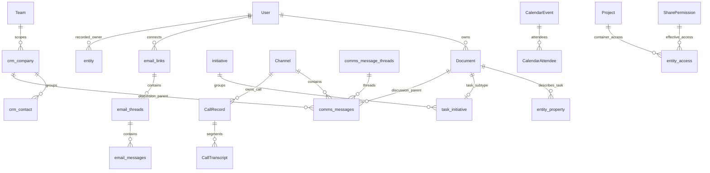
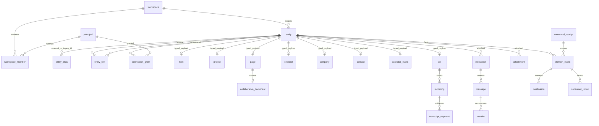

# Domain model: Macro, ROX и целевой ROX

Все target tables и интерфейсы ниже **PROPOSED**. Baseline Macro `c966b79d40798c6c726a3b15fe90517941fc6e61`, ROX `f63294ba4fffa7238b46b24e918925a313ad0b12`. Конкретный entity migration mapping — `plans/macro-integration/entity-map.json`.

## Macro ERD: доменные связи

ERD объединяет domain families; CamelCase labels CalendarEvent/CallRecord здесь логические, точные SQL имена перечислены в 12/13 и evidence-domain. Не трактовать polymorphic discussion arrows как обычные SQL FK для каждого parent. Основания: `crates/model-entity/src/lib.rs::EntityType`, `migrations/20260910144344_create_initiative.sql`, `migrations/20260917175816_messages_parent_aware_schema.sql`, CRM/mail/calendar/call repository evidence в 10–13. ROX current ERD находится в 03; у local JSON/files систем нет SQL ERD, поэтому diagram показывает storage ownership, не придуманные joins.

## Target entity envelope и authority

Сохраняем `Rox2EntityRef={workspaceId,entityId,revisionId?,accountNamespace?}` и `${kind}:${id}` формат (`packages/core/src/rox2/platform-contract.ts` 218–239). Расширяем kinds versioned migration; не вводим конкурентный `type/id/workspaceId` формат. Для user identity вводится отдельный canonical principal ID; `person`/CRMContact являются business entities и не дают login rights.

Target registry хранит только identity/owner/revision/tombstone/schemaVersion. Domain tables хранят typed данные. `Rox2Entity.permissions` — capability catalog; authoritative per-principal ACL не хранится как массив на клиенте (`authorizeRox2Action` 601–611 прямо указывает эту границу).

## Предлагаемые tables и ограничения

| Family | Primary key / uniqueness | Domain constraints / ownership |
|---|---|---|
| entity | `(workspace_id, entity_id)` | kind matches encoded ID; revision monotonic; deleted_at tombstone |
| principal / workspace_member | stable UUID + `(workspace,user)` | local profile UUID ↔ auth subject through verified alias; no email-derived auth |
| entity_alias | `(workspace,provider,account,remote_type,remote_id)` unique | preserved legacy IDs; collision quarantine; remote IDs never globally unique |
| entity_link | workspace + edge UUID; unique typed endpoints/kind/source key | referential integrity; typed ranges; cycle policy; target read authorization |
| permission_grant | grant ID + subject/resource/actions | direct/member/link/guest sources; expiry/revision; role expansion server-side |
| command_receipt | `(workspace,actor,idempotency_key)` | immutable payload hash; retry mismatch rejected; result and event transaction |
| domain_event / outbox | UUIDv7, aggregate sequence unique | append-only facts; immutable revision; redacted payload; not command sourcing |
| consumer_inbox | `(consumer,event_id)` | durable claim/lease; retries; dead-letter; side effect receipt |
| page / collaborative_document | entity ID; page content_kind enum | html_app and collaborative_document discriminated; CRDT materialization not second text authority |
| task | task entity ID | status, priority, dates, creator, assignee refs, recurrence; description document optional |
| project | project entity ID | current cwd/assets/details retained; many typed links, controlled membership inheritance |
| discussion / message | discussion ID; message entity ID | parent EntityRef; thread root in same discussion; versioned edit/delete; anchored comments |
| company / contact / contact_source | entity ID; normalized domain/email source keys scoped | distinct login identity; ingestion consent; enrichment provenance; hidden != deleted |
| mail_* | internal entity IDs + provider alias unique | account token separate; drafts mutable; sent message immutable body revisions; retention |
| calendar_* | internal ID + provider occurrence identity | RRULE+exceptions/timezone; RSVP scoped attendee; conditional provider revision |
| call / recording / transcript | entity IDs; unique egress/provider job | call planned/live/ended independent processing stage; recording consent & retention |
| notification / favorite / read_state | recipient + dedup key; user/entity unique | private recipient state; notification created once per cause/target/reason |
| search_projection | entity/revision/chunk unique | derived disposable projection; final read-time ACL; source provenance |

Postgres authoritative shared workspace store; local SQLite projection/outbox (new adapter) for shared mode. Personal standalone mode retains existing local persistence behind same domain ports. Storage choice is explicit per workspace; two authoritative writers for one entity are forbidden. Do not switch a local file store to cloud by merely enabling a flag.

## Сущности и representations

Page — existing ROX product surface with generated HTML and editable document content. Document — content/asset backing, не второй navigation destination. Task is canonical RoxTask; Macro document-subtype imports map to Task + optional description document, preserving original document link. Project and Macro Initiative map through typed membership with source-kind metadata; merging only by explicit mapping, never same title.

Human Message/Channel/Discussion share message service. AgentSession transcript remains separate append-only runtime record and participates in graph via refs. Tool outputs/permissions/thinking must not silently appear as human messages. Meeting UI retains current `MEETING_KIND='call'` compatibility (`packages/core/src/meetings/model.ts` 11): planned meeting metadata is a subtype/projection of Call plus CalendarEvent links in first migration. A separate Meeting aggregate is not introduced until independent scheduling lifecycle is justified; repeated calendar occurrences can link multiple Call sessions without duplicating meeting identity.

Recording/Transcript/summary are assets and versioned derived results, linked to call. Summary references exact transcript revision and evidence spans; generated summary does not mutate original transcript. User/guest/contact relationships remain distinct and resolver-authorized.

## Identity migration

Backfill canonical refs from stable legacy IDs, preserve ID aliases; user IDs mapped through verified account subject, not display name. Files/page paths/Notes hashes are not stable global IDs: issue UUID alias once, keep path as mutable location. Macro user `macro|email` is an external alias; mail email normalisation may find Contact, but cannot merge Principal automatically.

Personal tasks with unknown workspace remain in personal namespace; inventory review and deterministic migration assignment needed before team exposure. TaskProject and ProjectConfig are mapped one-to-one where confirmed, ambiguous records quarantined; do not deduplicate by title. Dossier person/company records become Contact/Company with provenance, and Dossier remains a contextual view. Source provider duplicate contacts require candidate merge/review with reversible alias history.

## Migration protocol

1. Inventory hashes/counts/versions, read-only dry run, alias collisions and orphan report.
2. Snapshot/backup; versioned map with immutable import batch ID. Writes through a single command authority.
3. Backfill registry/aliases and domain payload in transaction; preserve unknown fields/invalid rows in quarantine.
4. Shadow-read compare typed payload + ACL + links; old UI reads adapter until parity.
5. Switch each workspace/surface writer once; idempotency and projection watermark recorded.
6. Reindex from domain source; replay outbox; verify E2E and adjacent personal mode. Rollback writer routing only if imported writes can be reverse-replayed; otherwise forward repair.

No production dataset was provided or migrated in this analysis. Data import from Macro is a separately executed work package with licensing/export authorization checks; architecture work does not imply copying customer data.
