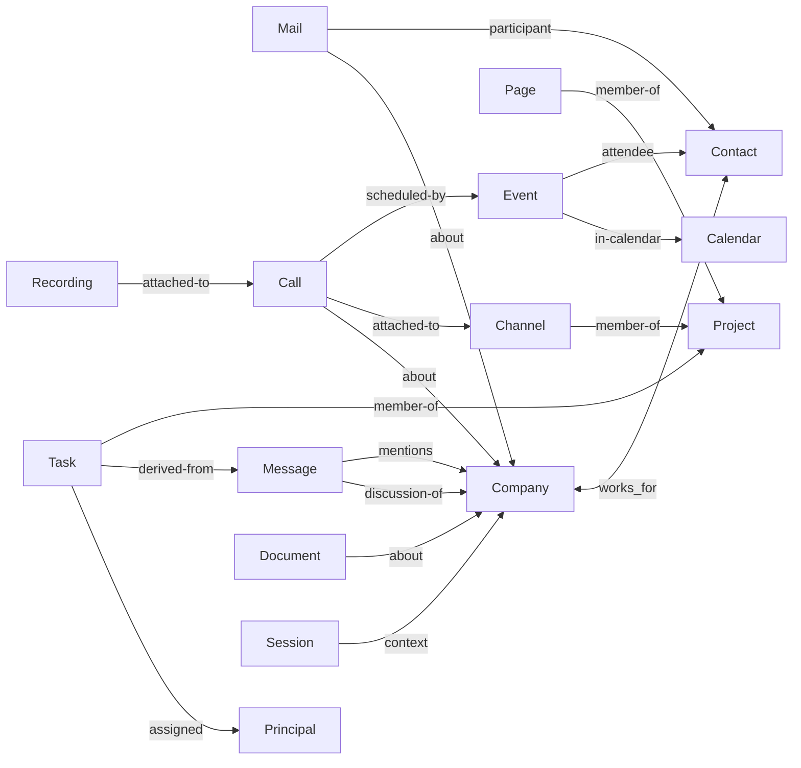

# Entity graph, linking и mentions

Baseline ROX `f63294ba4fffa7238b46b24e918925a313ad0b12`: `platform-contract.ts::Rox2Relation` (125), `Rox2EntityRef` (233), `ROX2_RELATION_RULES` (380), `registerExternalBinding` (336), `wouldCreateRelationCycle` (404). Baseline Macro `c966b79d40798c6c726a3b15fe90517941fc6e61`: `model-entity::Entity` (149), `models_properties/src/shared/entity_reference.rs::EntityReference`; mentions trace в 15/16. Ниже target **PROPOSED**.



Сохраняем Rox2Ref; дополнительный block/segment/selection selector принадлежит reference occurrence, не identity. `revisionId` optional для navigation, обязателен для write precondition/evidence snapshot; `accountNamespace` нужен для provider aliases, не для каждого native entity. Relations должны содержать **обе workspace-scoped refs**, а не только fromId/toId. Совместимость v1: workspace берется из владеющего store, а не из пользовательского endpoint параметра.

Предлагаем `Rox2EntityDescriptor` registration: kind, schemaVersion, validation, storage port, command/query handlers, policy hooks, title/preview extractor, search document extractor, mention presentation, activity and event schemas, agent tools, retention. Registry обеспечивает consistent plumbing. Он не автоматически придумывает semantics: каждому kind необходимы extractor/policy/read implementation и conformance suite до registration.

Link service проверяет source write + target read, workspace alignment, allowed domain/range, relation cycle/deletion, duplicate source key; не даёт target permission. Для ссылки на приватный target UI показывает generic unavailable без названия; search/agents не получают leaked preview. Cross-workspace links по умолчанию отвергаются; later explicit federation через authorized redacted proxy, не прямой SQL edge.

## Mention как infrastructure

```ts
// Proposed additive contract; identity remains Rox2EntityRef.
type RoxMention = {
  id: string;
  source: Rox2EntityRef;
  target: Rox2EntityRef;
  actorPrincipalId: string;
  occurrence: { blockId?: string; messageRevision?: string; start?: number; end?: number };
  sourceRevision: string;
  createdAt: number;
};
```

Mention command создаёт occurrence и `mentions` relation, emits one causal event; recipient resolver only notifies users that can read source and target. Referencing a Company не пингует всю компанию/team автоматически: notify subscribers/explicit user mentions with dedup. Source text edits remove occurrence/revise offsets; stale ranges не считаются актуальным mention. CRDT mention extraction работает из settled snapshot/revision, idempotent worker; rich entity node validated server-side.

Sharing on mention — отдельный explicit command с source ACL policy и UI preview. Не выдать права автоматически от textual `@`, даже если Macro умеет share-on-mention. Agent sees only scoped source/target authorized at retrieval time; mention does not create training consent or memory ingestion authority. Memory has provenance and ACL epoch, revoke purges derived projection access; raw private text is never embedded into public graph metadata.

## Context closure

`GetEntityContext(ref, depth, budget)` выполняет authorized bounded traversal over typed links, filters by relationship/purpose; returns refs, provenance, source revision, authorized counts and pagination. Inaccessible targets contribute neither totals nor titles nor order hints; no hidden or redacted counts. Defaults: depth 1, max 50 refs, strict token cap. Company context is one query over company+contacts+mail/task/event/call/page/discussion links; no N×N client adapters. Avoid whole-workspace graph traversal per keystroke. Relation indexes `(workspace,from,kind)` and `(workspace,to,kind)`; target title lazy hydration prevents stale duplicates.

Permission change increments policy epoch; caches scoped by principal/workspace/epoch/query. Initially use conservative workspace epoch; target-dependent vectors can follow measured cache churn. Responses expose authorized totals only; opaque unavailable placeholder is permitted only when an accessible source occurrence already contains the reference. No hidden-node totals or ordering hints. Tombstone clears transient preview/index links, preserves historical audit under retention policy. No cascading delete of Company emails owned by a private MailAccount. Principal is represented as verified workspace-visible `person`; CRM Contact uses separate `crm-contact` kind, never email-based auth merge.
