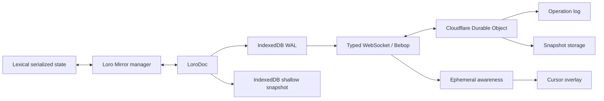
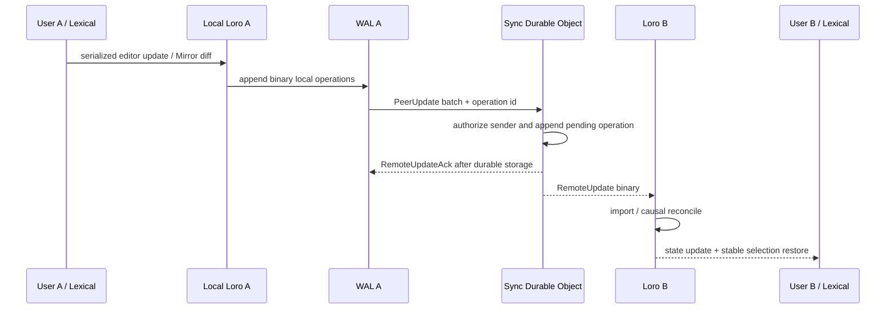
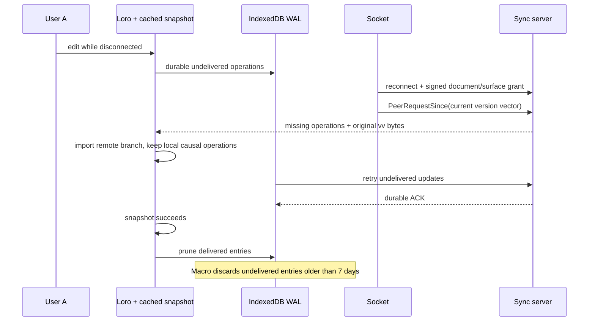
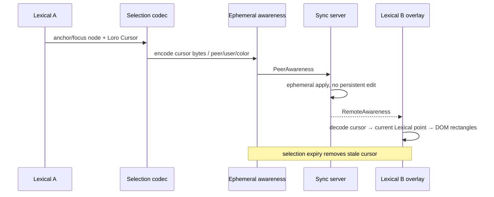
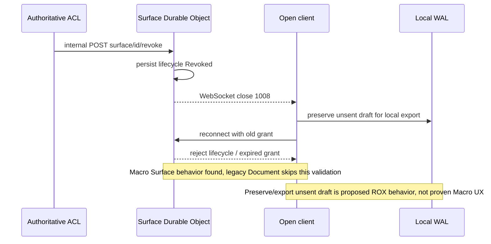

# 07-collaboration-runtime.md

Срез исходников: Macro `c966b79d40798c6c726a3b15fe90517941fc6e61`; ROX `f63294ba4fffa7238b46b24e918925a313ad0b12`. «Реализовано» ниже означает обнаруженный исполняемый путь в этом commit, не доказательство работы production. Предложения ROX помечены как целевой контракт. Анализ выполнен по коду; тесты перечислены как найденные артефакты, если не указано отдельное исполнение.

## Архитектура Macro

В Macro collaboration — отдельный runtime: LoroDoc хранит shared structure, Loro Mirror переводит JSON schema в CRDT, SyncEngine соединяет manager с durable WAL и live transport; Lexical provider связывает runtime с редактором. Это интеграция состояний, а не пересылка Markdown целиком. `ImportPending` означает causal gap и запускает catchup; он не должен считаться corrupt document. [C01,C03,C16]



| Механизм | Реальный путь | Продуктовое следствие / ограничение |
|---|---|---|
| Representation | `LoroManager` + generic schema + Mirror [C01] | JSON structure становится CRDT containers; совместимость требует той же schema, не только Markdown |
| Initialization | `SnapshotIngest` optimistic/local+WAL/S3/DSS [C01,C06] | Первый seed может быть stale; серверный catchup обязателен |
| Durable offline edits | `BrowserWALStore`, `WALSyncer.flush` [C04,C05] | IDB write precedes successful transport acknowledgement; browser quota/failure не исчезает |
| Snapshot | `persistSnapshot` каждые 5 секунд [C02,C03] | delivered WAL удаляется после successful snapshot; snapshot не business history |
| Offline retention | `WAL_TTL_MS` = 7 дней [C04] | Нельзя обещать unlimited offline editing; target должен показывать expired drafts и сохранять export |
| Reconnect | capped backoff 500ms…8s; `reconnect` requests missing operations [C03,C08] | retries bounded; состояние UI должно различать editing, durable-local, server-acked |
| Causal recovery | `ImportPending` → request missing operations [C01,C03] | causally-ahead ops сохраняются Loro; reset может потерять локальную ветку, его нельзя делать первым действием |
| Multi-tab | engine `BroadcastChannelChatter` [C03] | Local browser tabs обмениваются ops и awareness; это не доказательство multi-device ACL consistency |
| Awareness | `EphemeralStore`, timeout 10s [C07] | Код говорит 10s, хотя adjacent comment говорит 5s; selectionless peer отфильтрован из remote list |
| Cursor | encoded Loro Cursor + node identity [C17,C19] | DOM offset непригоден как stable cross-device reference |
| Undo | `registerLoroHistory`, `UndoManager`, mergeInterval [C18] | Сохраняются Lexical history semantics поверх CRDT; selective undo после remote edit требует отдельного сценария |
| Authorization | signed scoped grants + per-message `can_edit` [C10,C11] | legacy Document разрешает Comment CRDT writes; Surface требует Edit. ROX не должен повторять conflation |
| Cloud runtime | worker, Durable Object, default durable SQLite snapshots, optional KV/R2 [C14,C15] | Утверждение «все snapshots находятся в R2» неверно для default build |

### Two-user edit — обнаруженная цепочка



Server ACK после persistence виден непосредственно в `process_message`. Transport listener должен устанавливать ожидание ACK до send, а client WAL отмечает delivered лишь после ответа. UI local edit до ACK не является remote durability. [C05,C10]

### Offline → reconnect



Wire использует version vector, а не frontiers: offline peer может быть серверу неизвестен. Server echoes исходные vv bytes для correlation. Это важная часть protocol compatibility. [C09,C10]

### Remote cursor



Awareness не должна питать durable notifications, audit или content indexing. Presence участника комнаты и cursor selection — разные projections: Macro generic remote awareness отбрасывает peers без selection. В ROX отдельный room presence должен сохранять открывших документ viewers без курсора. [C07,C17,C19; target decision]

### Permission revoked while document open



Это revocation всей Surface session, не обнаруженное per-user ACL epoch invalidation. `validate_surface_sockets` проверяет lifecycle и expiry, не запрашивает текущую DB membership на каждом edit; legacy document key возвращает `true`. Не следует заявлять мгновенное исключение отдельного document editor из room без дополнительного control path. [C12,C13]

## ROX: EXTEND_ROX + REIMPLEMENT

ROX Page сегодня представляет HTML dashboard с opaque iframe, data snapshot и mediated source actions. Запрещено перекодировать его в Lexical document и уничтожить существующие artifacts. Добавить `contentKind: artifact | document` в общей Page entity и типизированную связь `documentId`; сохранять navigation Pages и существующий `PageFrame` для artifact. Новый document renderer — React, editor adapter — headless interface. Solid signal bindings Macro не переносить в React напрямую. Literal Macro code — AGPL licensing decision, см. 18-licensing; базовый план — behavior reimplementation. [R01,C16; target]

Существующий ROX `SessionPresenceAvatars` делает один `listBroPresence` запрос при изменении sessionId. Его reuse ограничивается avatar presentation; это не CRDT presence/cursor runtime. Не создавать отдельный ROX identity для collab peers. [R06]

### Целевые contracts

```ts
// Proposed ROX contracts; original design, not copied Macro source.
type EntityRef = Rox2EntityRef; // canonical existing contract, not a parallel ID model
type CollaborationGrant = {
  room: EntityRef; principalId: string; deviceId: string;
  permissions: Array<'read' | 'edit' | 'comment'>;
  aclEpoch: number; expiresAt: string;
};
type DocumentSyncPort = {
  connect(grant: CollaborationGrant): Promise<SyncSession>;
  append(room: EntityRef, operationId: string, bytes: Uint8Array): Promise<DurableAck>;
  catchUp(room: EntityRef, versionVector: Uint8Array): Promise<Uint8Array>;
  snapshot(room: EntityRef): Promise<VersionedSnapshot>;
};
type EditorBinding = {
  importContent(snapshot: Uint8Array): void;
  onLocalOperations(listener: (op: Uint8Array) => void): () => void;
  encodeSelection(): Uint8Array | undefined;
  applyRemoteSelection(peer: AuthorizedPeer, selection: Uint8Array): void;
};
```

Relational entities, assignees, ACL и CRM pipeline не становятся CRDT автоматически. CRDT authority — versioned collaborative document content schemas: сначала rich-text, затем spreadsheet в WP-42 после отдельного formula/import conformance gate. Relational commands и ACL authority остаются серверными. На `document.changed` materialize text после committed version, с `contentRevision` и retryable outbox; не публиковать по событию каждой клавиши. Не разносить metadata между Loro maps и SQL без owner. [Target Revision 2]

| Изменение ROX | Existing file | Новые файлы / interface |
|---|---|---|
| Page content discrimination | `packages/core/src/types/page.ts`; `packages/shared/src/pages/storage.ts`; `packages/server-core/src/handlers/rpc/pages.ts` | `packages/core/src/entities/document.ts`, migration artifact→Page registry |
| Shared document body | `apps/electron/src/renderer/components/pages/PageView.tsx` | `DocumentPageView.tsx`, React editor binding, versioned document storage |
| Durable sync | `packages/server-core/src/transport/server.ts`; `packages/shared/src/protocol/` | `packages/server-core/src/collaboration/document-sync.ts`, local outbox/snapshot adapter |
| Presence/cursor | `SessionPresenceAvatars.tsx` presentation | `useEntityPresence.ts`, `DocumentCursors.tsx`, signed peer identity |
| ACL revoke | new domain ACL boundary | per-principal ACL epoch, room eviction, quarantine invalid offline ops |

### Observable acceptance / negative controls

1. Two isolated browser/device profiles edit different and same spans; both converge byte-equivalent logical content; export/import reload preserves it.
2. Disconnect A, edit A and B, restart A, reconnect; all locally durable unexpired edits survive and converge. Seed server ACK before persistence to ensure crash test fails.
3. Undo A's word after B inserts nearby text; B's text survives; redo restores only A's intended change.
4. Revoke A while open; subsequent op and awareness cannot reach server or B; A cannot receive new content. B remains active. Denied offline op remains exportable draft, never auto-shared.
5. Enforce quota failure, corrupt snapshot and missing causal dependencies; distinct UI states and telemetry, no destructive silent reset.
6. One human with two devices retains one principalId and different peer/device IDs; attribution does not duplicate account.

Existing test evidence: `packages/collaboration/src/collab/{engine,wal,snapshot,manager-integration}.test.ts`, `packages/collaboration/src/sync-service/source.test.ts`, `services/sync-service/tests/document_sync.test.ts`, `services/sync-service/src/{auth,state}/test.rs`, `services/sync-service/src/durable_object/surface_api/test.rs`. Not executed during architecture audit; target suite must exercise actual browser and authorized server.

## Revision 2: существующий ROX2 contract — единственная typed seam

ROX уже имеет `Rox2EntityRef`, `Rox2Relation`, `Rox2Event`, `Rox2Context`, `Rox2Status` в `packages/core/src/rox2/platform-contract.ts`. `Rox2EntityRef` хранит `workspaceId`, `entityId` (`kind:id`), `revisionId?`, `accountNamespace?`. В этой главе `EntityRef` — краткий alias **существующего Rox2EntityRef**, не новый независимый тип `{type,id}` и не второе хранилище. Новые entity kinds, relation kinds и action policies расширяют этот файл и его adapters. [R10,R11]

`Rox2Relation` пока содержит `fromId/toId/kind`; добавить scoped endpoints, relation id, actor/source/revision и разрешённые kinds как versioned backward-compatible extension. `Rox2Event` уже имеет causation/correlation/aggregateRevision; новые domain envelopes расширяют его versioned contract с workspace/command/schema/source revision. Не создавать параллельный EventBus или несвязанный notification engine. Typed contract не выполняет I/O и не доказывает существующую distributed authorization. [R10]

Состояние command должно сохранять `executionMode × lifecycle × verification`: `awaiting_review` соответствует live/waiting_approval/unverified; provider_pending — live/queued или running/unverified; database commit — live/succeeded/receipt_verified; provider read-back отдельно повышает verification. Дополнительный `domainOutcome` не заменяет эту triad и не возвращает success для pending. Общая relational authority collaborative workspace — модульный Postgres domain store; local standalone stores остаются adapter/local projection/outbox с явным authority mode. [R10; target]

## Editor/CRDT alternatives and adoption gate

В ROX renderer dependency manifest есть React 18 и `react-simple-code-editor`; текущая Page хранит HTML artifact. Наличие code editor не доказывает rich-text block model или collaborative document model. Существующий BroInviteService уже разрешает accounts на server-side, имеет join/revoke и session presence; он остаётся identity/membership adapter, не заменяется отдельными collab accounts. [R01,R12,R13]

| Кандидат | Реальное основание | Tradeoff / самый дешёвый способ опровергнуть |
|---|---|---|
| React Lexical binding + licensed Loro dependency + собственный sync service | Macro Loro+Lexical interaction proven source path; ROX React host [C16,R13] | Сложные cursor/node mapping/undo; двухпользовательский schema spike с list/move/undo/offline + license/SBOM review dependency |
| Existing ROX code editor + collaborative plain Markdown body | Existing simple code editor [R13] | Меньше editor migration, нет доказанной rich-text/inline-entity UX; сценарий task mention/anchored comment может отвергнуть |
| Alternative React rich-text/CRDT runtime via adapter | Target option, **не найденная реализация ROX/Macro** | Оценить отдельным dependency/license spike; без тестов schema/offline/undo не выбирать по популярности |

Выбор: interface-first Loro candidate для rich-text Page slice, сохранить artifact renderer и общий Page registry. Этот выбор требует runnable spike перед product implementation; schema/versioned export, supported dependency license, cursor identity, async WAL durability и negative revocation тесты являются gate. Macro AGPL implementation code не является permissive headless library. Cloudflare worker transport переписать под ROX managed/self-host topology; Loro binary semantics можно использовать через отдельно проверенную dependency. No second UI framework.


## Существующий Bro runtime: точная граница reuse

`BroInviteStore` хранит invitations и presence в process-local Map; `revoke` отмечает invitation.revokedAt, а `listPresence` возвращает сохранённый массив. Revoke не удаляет уже вступившего пользователя из presence и не является distributed document ACL revocation. Сохранить server-resolved account identity/UX «Позвать Бро», расширить store durable membership и grant/session eviction; не считать session avatar доказательством heartbeat/cursor/edit synchronization. [R12,R14]

## Доказательства

| ID | Repository / commit | File / symbol / lines | Подтверждаемый факт |
|---|---|---|---|
| C01 | `macro-inc/macro@c966b79d40798c6c726a3b15fe90517941fc6e61` | [packages/collaboration/src/collab/manager.ts:53–104](https://github.com/macro-inc/macro/blob/c966b79d40798c6c726a3b15fe90517941fc6e61/packages/collaboration/src/collab/manager.ts#L53-L104), `LoroManager / SnapshotIngest / importStatusToResult` | Loro CRDT mirror, snapshot sources and causal pending imports. |
| C02 | `macro-inc/macro@c966b79d40798c6c726a3b15fe90517941fc6e61` | [packages/collaboration/src/collab/engine.ts:132–175](https://github.com/macro-inc/macro/blob/c966b79d40798c6c726a3b15fe90517941fc6e61/packages/collaboration/src/collab/engine.ts#L132-L175), `SyncEngine.start / handleLocalUpdates / persistSnapshot` | Engine starts after initialization and wires local operations, transport and snapshots. |
| C03 | `macro-inc/macro@c966b79d40798c6c726a3b15fe90517941fc6e61` | [packages/collaboration/src/collab/engine.ts:275–465](https://github.com/macro-inc/macro/blob/c966b79d40798c6c726a3b15fe90517941fc6e61/packages/collaboration/src/collab/engine.ts#L275-L465), `handleLocalUpdates / persistSnapshot / handleSourceEvent / convergeFromServer` | WAL append, five-second snapshot cycle, pending-causal recovery and reconnect anti-entropy. |
| C04 | `macro-inc/macro@c966b79d40798c6c726a3b15fe90517941fc6e61` | [packages/collaboration/src/collab/wal.ts:8–45](https://github.com/macro-inc/macro/blob/c966b79d40798c6c726a3b15fe90517941fc6e61/packages/collaboration/src/collab/wal.ts#L8-L45), `WALEntry / WAL_TTL_MS / WALSyncer.flush` | Undelivered WAL entries expire after seven days; delivery status is independent of snapshot pruning. |
| C05 | `macro-inc/macro@c966b79d40798c6c726a3b15fe90517941fc6e61` | [packages/collaboration/src/collab/wal.ts:325–373](https://github.com/macro-inc/macro/blob/c966b79d40798c6c726a3b15fe90517941fc6e61/packages/collaboration/src/collab/wal.ts#L325-L373), `WALSyncer.flush` | Flush batches undelivered operations and marks delivered only when push returns acknowledgement. |
| C06 | `macro-inc/macro@c966b79d40798c6c726a3b15fe90517941fc6e61` | [packages/collaboration/src/collab/snapshot-store.ts:14–121](https://github.com/macro-inc/macro/blob/c966b79d40798c6c726a3b15fe90517941fc6e61/packages/collaboration/src/collab/snapshot-store.ts#L14-L121), `IDBSnapshotStore / loadCachedState` | IndexedDB snapshots and WAL replay seed offline documents. |
| C07 | `macro-inc/macro@c966b79d40798c6c726a3b15fe90517941fc6e61` | [packages/collaboration/src/collab/awareness.ts:11–140](https://github.com/macro-inc/macro/blob/c966b79d40798c6c726a3b15fe90517941fc6e61/packages/collaboration/src/collab/awareness.ts#L11-L140), `createAwareness / PeerAwareness / SelectionCodec` | Awareness defaults to ten seconds and exposes remote peers with nonempty selection. |
| C08 | `macro-inc/macro@c966b79d40798c6c726a3b15fe90517941fc6e61` | [packages/collaboration/src/sync-service/socket.ts:40–66](https://github.com/macro-inc/macro/blob/c966b79d40798c6c726a3b15fe90517941fc6e61/packages/collaboration/src/sync-service/socket.ts#L40-L66), `createSyncSocket` | Typed socket uses capped exponential reconnect backoff. |
| C09 | `macro-inc/macro@c966b79d40798c6c726a3b15fe90517941fc6e61` | [packages/collaboration/src/sync-service/generated/schema.bop:1–44](https://github.com/macro-inc/macro/blob/c966b79d40798c6c726a3b15fe90517941fc6e61/packages/collaboration/src/sync-service/generated/schema.bop#L1-L44), `FromPeer / FromRemote` | Bebop protocol carries operations, peer id, awareness, snapshot, update ack and version-vector catchup. |
| C10 | `macro-inc/macro@c966b79d40798c6c726a3b15fe90517941fc6e61` | [services/sync-service/src/socket/protocol.rs:163–315](https://github.com/macro-inc/macro/blob/c966b79d40798c6c726a3b15fe90517941fc6e61/services/sync-service/src/socket/protocol.rs#L163-L315), `process_message` | Server checks grant, persists before ACK, broadcasts operations and serves version-vector differences. |
| C11 | `macro-inc/macro@c966b79d40798c6c726a3b15fe90517941fc6e61` | [services/sync-service/src/auth.rs:10–29](https://github.com/macro-inc/macro/blob/c966b79d40798c6c726a3b15fe90517941fc6e61/services/sync-service/src/auth.rs#L10-L29), `AccessLevel.can_edit_for / socket_access / document_access` | Document sockets permit Comment writes while Surface sockets require Edit. |
| C12 | `macro-inc/macro@c966b79d40798c6c726a3b15fe90517941fc6e61` | [services/sync-service/src/durable_object/surface_api.rs:36–59](https://github.com/macro-inc/macro/blob/c966b79d40798c6c726a3b15fe90517941fc6e61/services/sync-service/src/durable_object/surface_api.rs#L36-L59), `SurfaceLifecycle / grant_active / validate_surface_sockets / active_websockets` | Surface lifecycle and expiry are separate from legacy document grants. |
| C13 | `macro-inc/macro@c966b79d40798c6c726a3b15fe90517941fc6e61` | [services/sync-service/src/durable_object/surface_api.rs:238–311](https://github.com/macro-inc/macro/blob/c966b79d40798c6c726a3b15fe90517941fc6e61/services/sync-service/src/durable_object/surface_api.rs#L238-L311), `revoke_surface / validate_surface_sockets / active_websockets` | Surface revocation closes sockets 1008; validation skips legacy document sessions. |
| C14 | `macro-inc/macro@c966b79d40798c6c726a3b15fe90517941fc6e61` | [services/sync-service/src/storage.rs:51–163](https://github.com/macro-inc/macro/blob/c966b79d40798c6c726a3b15fe90517941fc6e61/services/sync-service/src/storage.rs#L51-L163), `SessionStorage.load_document_state / append_pending_operation / get_snapshot_storage` | Server reconstructs snapshot plus pending operation log and supports selectable snapshot backends. |
| C15 | `macro-inc/macro@c966b79d40798c6c726a3b15fe90517941fc6e61` | [services/sync-service/Cargo.toml:9–53](https://github.com/macro-inc/macro/blob/c966b79d40798c6c726a3b15fe90517941fc6e61/services/sync-service/Cargo.toml#L9-L53), `features / dependencies` | Default Cloudflare worker uses durable SQLite snapshot storage and Loro 1.16.2. |
| C16 | `macro-inc/macro@c966b79d40798c6c726a3b15fe90517941fc6e61` | [apps/web/src/lib/core/component/LexicalMarkdown/collaboration/CollabProvider.tsx:128–239](https://github.com/macro-inc/macro/blob/c966b79d40798c6c726a3b15fe90517941fc6e61/apps/web/src/lib/core/component/LexicalMarkdown/collaboration/CollabProvider.tsx#L128-L239), `CollabProvider / syncStateToLexical / lexicalStateSyncPlugin` | Solid Lexical provider binds shared state and preserves local selection via CRDT cursor. |
| C17 | `macro-inc/macro@c966b79d40798c6c726a3b15fe90517941fc6e61` | [apps/web/src/lib/core/component/LexicalMarkdown/collaboration/cursor.ts:82–208](https://github.com/macro-inc/macro/blob/c966b79d40798c6c726a3b15fe90517941fc6e61/apps/web/src/lib/core/component/LexicalMarkdown/collaboration/cursor.ts#L82-L208), `$convertLexicalSelectionToCursors / $cursorToLexicalPoint` | Lexical selections become stable Loro cursors rather than remote DOM offsets. |
| C18 | `macro-inc/macro@c966b79d40798c6c726a3b15fe90517941fc6e61` | [apps/web/src/lib/core/component/LexicalMarkdown/collaboration/undo.ts:200–230](https://github.com/macro-inc/macro/blob/c966b79d40798c6c726a3b15fe90517941fc6e61/apps/web/src/lib/core/component/LexicalMarkdown/collaboration/undo.ts#L200-L230), `registerLoroHistory` | Lexical merge semantics use Loro UndoManager. |
| C19 | `macro-inc/macro@c966b79d40798c6c726a3b15fe90517941fc6e61` | [apps/web/src/lib/core/component/LexicalMarkdown/collaboration/remote-cursor.tsx:203–330](https://github.com/macro-inc/macro/blob/c966b79d40798c6c726a3b15fe90517941fc6e61/apps/web/src/lib/core/component/LexicalMarkdown/collaboration/remote-cursor.tsx#L203-L330), `useRemoteCursors / RemoteCursorsOverlay` | Remote selections render as DOM range overlays and user labels. |
| R01 | `rox-one/rox-one@f63294ba4fffa7238b46b24e918925a313ad0b12` | [packages/core/src/types/page.ts:1–35](https://github.com/rox-one/rox-one/blob/f63294ba4fffa7238b46b24e918925a313ad0b12/packages/core/src/types/page.ts#L1-L35), `PageKind / PageConfig domain` | ROX Pages are HTML dashboard artifacts with sandbox and snapshots, not shared rich-text docs. |
| R06 | `rox-one/rox-one@f63294ba4fffa7238b46b24e918925a313ad0b12` | [apps/electron/src/renderer/components/app-shell/SessionPresenceAvatars.tsx:9–28](https://github.com/rox-one/rox-one/blob/f63294ba4fffa7238b46b24e918925a313ad0b12/apps/electron/src/renderer/components/app-shell/SessionPresenceAvatars.tsx#L9-L28), `SessionPresenceAvatars` | Existing session presence view performs one listBroPresence query per session change. |
| R10 | `rox-one/rox-one@f63294ba4fffa7238b46b24e918925a313ad0b12` | [packages/core/src/rox2/platform-contract.ts:107–141](https://github.com/rox-one/rox-one/blob/f63294ba4fffa7238b46b24e918925a313ad0b12/packages/core/src/rox2/platform-contract.ts#L107-L141), `Rox2Status / Rox2Entity / Rox2Relation / Rox2Event` | Existing ROX unified contract already declares relation/event/result seam; this is typed boundary without I/O. |
| R11 | `rox-one/rox-one@f63294ba4fffa7238b46b24e918925a313ad0b12` | [packages/core/src/rox2/platform-contract.ts:218–239](https://github.com/rox-one/rox-one/blob/f63294ba4fffa7238b46b24e918925a313ad0b12/packages/core/src/rox2/platform-contract.ts#L218-L239), `Rox2EntityRef / formatRox2EntityId / parseRox2EntityId` | Existing workspace-scoped ref uses entityId encoded kind:id and optional revision/accountNamespace. |
| R12 | `rox-one/rox-one@f63294ba4fffa7238b46b24e918925a313ad0b12` | [packages/server-core/src/collaboration/bro-invite-service.ts:18–62](https://github.com/rox-one/rox-one/blob/f63294ba4fffa7238b46b24e918925a313ad0b12/packages/server-core/src/collaboration/bro-invite-service.ts#L18-L62), `BroInviteService / resolveRoxAccountFromCredentials` | Session Bro invites/join/revoke use server-resolved account identity; existing collaboration must be adapted. |
| R13 | `rox-one/rox-one@f63294ba4fffa7238b46b24e918925a313ad0b12` | [apps/electron/package.json:69–83](https://github.com/rox-one/rox-one/blob/f63294ba4fffa7238b46b24e918925a313ad0b12/apps/electron/package.json#L69-L83), `dependencies` | ROX renderer React 18 and react-simple-code-editor; no Lexical dependency in this manifest slice. |
| R14 | `rox-one/rox-one@f63294ba4fffa7238b46b24e918925a313ad0b12` | [packages/shared/src/collaboration/store.ts:23–86](https://github.com/rox-one/rox-one/blob/f63294ba4fffa7238b46b24e918925a313ad0b12/packages/shared/src/collaboration/store.ts#L23-L86), `BroInviteStore / revoke / listPresence` | Bro invite/presence authority is process-local Maps; revoke marks invite but does not evict existing presence. |
