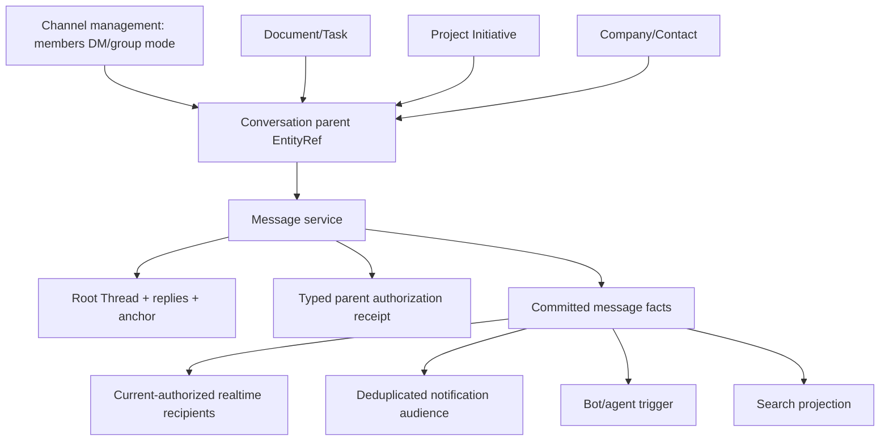

# 08-chat-and-messaging.md

Срез исходников: Macro `c966b79d40798c6c726a3b15fe90517941fc6e61`; ROX `f63294ba4fffa7238b46b24e918925a313ad0b12`. «Реализовано» ниже означает обнаруженный исполняемый путь в этом commit, не доказательство работы production. Предложения ROX помечены как целевой контракт. Анализ выполнен по коду; тесты перечислены как найденные артефакты, если не указано отдельное исполнение.

## Истинная граница моделей

Macro HEAD имеет parent-aware `Message` primitive. `MessageParent` допускает Channel, Document (включая Tasks/PDF), Initiative (UI Project), CrmCompany и CrmContact. `Message` содержит sender, imported author, bot profile, mentions, triggering user, Markdown body, timestamps, edits/tombstones, attachments/reactions. Reply ссылается на root message, root identity вычисляется `thread_id.unwrap_or(id)`. Это общая conversation primitive; unified activity graph — потребитель её событий, не canonical message store. [C20,C21,C50]

Одновременно осталась channel-specific facade `crates/channels` и additive SQL migration с `channel_id` compatibility trigger. Поэтому правильный вывод — код сходится к shared Message service, а не «всё уже окончательно едино». Initial migration разрешала только channel/document; последующие migrations добавляют initiative/CRM. Нельзя запускать только один старый SQL файл и считать его актуальной схемой. [C28,C31]

| Surface | Canonical model | Authority / UI |
|---|---|---|
| Public/team channel | Channel + membership + MessageParent.Channel [C28] | channel management отдельно от message CRUD |
| DM | Channel.DirectMessage + unordered DmPair [C28,C29] | один pair, оба distinct canonical users |
| Group chat | Channel.Private [C28] | явный participant roster; не agent-session group |
| Thread | root Message + ThreadState + replies [C20,C21,C31] | parent invariant предотвращает reply в чужой entity |
| Entity discussion | MessageParent.Document/Initiative/CRM [C20] | наследует parent ACL; при необходимости stable anchor |
| Document comment | document discussion + Markdown/PDF/Spreadsheet anchor [C20] | anchor-owned geometry; shared reply/reaction model |
| AI Chat | `crates/chat` отдельный domain, отдельный search index [C40,C46] | model transcript/tool outputs, не канал двух людей |
| Coding agent session | AgentSession + tools/origin [C38,C46] | bot actor может постить Message; transcript отдельно |

## Команды, queries, persistence, realtime

REST message facade использует `/parent_type/parent_id` namespaces для timeline/CRUD/reactions/threads/typing. `MessageView` принимает view receipts; `MessageWrite` — commenter или channel member. `post` проверяет parent existence, references, anchor/file type и thread invariants прежде repo create. Event shape берётся из persisted Message, а не из client parent claim. [C22,C23,C25,C50]

`comms_messages` имеет composite unique `(id,parent_entity_type,parent_entity_id)`, а reply foreign key включает parent. `comms_message_threads` отделяет resolve/anchor/lifecycle от message tombstone; migration maps legacy comment IDs отдельно. Это transferable schema pattern, не разрешение копировать SQL. [C31]

Frontend `MessageTimelineData` — Solid Query infinite pages; `fetchResolvedChannelMessage` вычисляет top-level/reply deep link. Parent entity subscription инвалидирует timeline/ids/replies. ROX React Query/store adapter должен воспроизвести reconciliation и optimistic rollback, а не импортировать Solid lifecycle. [C32,C33]

| Capability | Evidence / verified limit | ROX target |
|---|---|---|
| Edit/delete | shared `Message` edit/tombstone + REST [C21,C25] | optimistic revision compare; server timestamp; preserve deleted-root reply behavior |
| Reactions | count aggregation + REST reaction [C21,C25] | `(message,user,emoji)` unique and idempotent toggle |
| Attachments/entity embeds | MessageAttachment + reference validation [C21,C24] | AttachmentRef binding ACL; signed URLs, no UUID-only global media read |
| Mentions | normalized vocabulary + group recipients [C24,C51] | parsed occurrence with source version; explicit authorization before recipients |
| Typing | `MessageService.typing` publishes transient change [C22] | TTL ephemeral signal, rate limit, no durable event fanout |
| Read/unread | per-channel GraphQL unread evidence exists | target sequence watermark per user/conversation; notification unread отдельно |
| Calls | ChannelType + separate call domain tools [C28,C46] | call launched from Channel shares channel ACL/identity; lifecycle in 13-calls |
| Bot participation | ChannelSender + triggered_by + mention bots [C21,C51] | actor kind human/service/agent; acting user scope auditable |
| Search | channel messages in unified search [C40,C43] | shared messages including CRM discussions require one generic index projection |
| Notification policy | comment reasons dedup and current access [C26,C27] | channel vs entity discussion recipient policy behind single engine |

Channel unread implementation pointer: `apps/web/src/lib/queries/channel/unread-presence.ts:createChannelUnreadQuery:20–50` at Macro SHA; it queries GraphQL `unreadNotifications` and revalidates active query. This is unread notification evidence, not proof of a full per-message read-receipt protocol.

## ROX Sessions/Chat: KEEP_ROX + NEW_ROX_PRIMITIVE

ROX existing Sessions are agent execution conversations (`StoredSession.messages`, permissionMode, persistence/config), while Macro Channel is multi-human conversation with membership and Message primitive. Do not change session transcript format into human chat log. Keep current Sessions/Chat UI, add conversation-mode in common surface routing and shared read-only message renderer where roles are compatible. A human Message can create Task and AgentSession via explicit graph links; an AgentSession's tool call remains agent transcript. [R09,C21,C28; target]

Target schema: `Conversation {id,workspaceId,parent:EntityRef,kind:'channel'|'discussion',membershipPolicy}`; `Message {id,conversationId,rootId?,actor,actingUserId?,body,revision,editedAt?,deletedAt?}`; `Thread {rootId,anchor?,resolvedAt?,resolvedBy?}`; `MessageReaction`; `ConversationReadWatermark`; `MentionOccurrence`; `AttachmentBinding`. Root is exactly one per thread; replies cannot reparent. ACL inherits from Conversation parent. Generic linking from a Message to Task does not grant Task read rights.

### Concrete code changes

1. Add domain contracts under `packages/core/src/entities/{conversation,message}.ts`; unified command facade under `packages/server-core/src/domain/messages/`; REST/RPC wrappers must call same authorized service.
2. Existing `packages/shared/src/sessions/types.ts`, `apps/electron/src/renderer/pages/ChatPage.tsx`, `components/app-shell/ChatDisplay.tsx`: retain agent context semantics, add reusable transcript item renderer rather than extra Macro Chat destination.
3. Add `packages/server-core/src/handlers/rpc/messages.ts` and entity subscription commands; `packages/shared/src/protocol/` declares versioned DTOs; server checks parent/current recipient access.
4. Existing `packages/core/src/tasks/personal/types.ts:TaskLink` contains message kind already. Migrate link to generic EntityRef and create `task.from_message` transaction recording source Message+Project+assignee notification.
5. New React `components/conversations/{ChannelView,DiscussionPanel,ThreadPanel}.tsx`; attach DiscussionPanel to existing Pages/Tasks/Projects and new CRM entity renderer.

### Vertical acceptance

Send Message → create RoxTask → backlink retained → task appears existing Project → authorized assignee receives one Notification → agent reads authorized root+bounded preceding history. Retry create command twice must yield one task and one notification. Negative controls: a forged parent fails; attachment to denied document fails; revoked user receives neither event body nor push excerpt; `@here` outside a channel is invalid; deleted root still routes permitted replies according to explicit product policy.

Tests found: `crates/messages/src/domain/{models,annotations,notification,delivery}/test.rs`, `crates/messages/src/domain/service/test.rs`, `crates/channels/src/domain/{dm,message_commands,reference_sharing}/test.rs`, frontend `apps/web/src/lib/queries/messages/tests/{mutations,optimistic,subscription,sync,typing}.test.*`. Their existence is evidence of intended invariants; no production or test-pass claim is made here.

## Revision 2: существующий ROX2 contract — единственная typed seam

ROX уже имеет `Rox2EntityRef`, `Rox2Relation`, `Rox2Event`, `Rox2Context`, `Rox2Status` в `packages/core/src/rox2/platform-contract.ts`. `Rox2EntityRef` хранит `workspaceId`, `entityId` (`kind:id`), `revisionId?`, `accountNamespace?`. В этой главе `EntityRef` — краткий alias **существующего Rox2EntityRef**, не новый независимый тип `{type,id}` и не второе хранилище. Новые entity kinds, relation kinds и action policies расширяют этот файл и его adapters. [R10,R11]

`Rox2Relation` пока содержит `fromId/toId/kind`; добавить scoped endpoints, relation id, actor/source/revision и разрешённые kinds как versioned backward-compatible extension. `Rox2Event` уже имеет causation/correlation/aggregateRevision; новые domain envelopes расширяют его versioned contract с workspace/command/schema/source revision. Не создавать параллельный EventBus или несвязанный notification engine. Typed contract не выполняет I/O и не доказывает существующую distributed authorization. [R10]

Состояние command должно сохранять `executionMode × lifecycle × verification`: `awaiting_review` соответствует live/waiting_approval/unverified; provider_pending — live/queued или running/unverified; database commit — live/succeeded/receipt_verified; provider read-back отдельно повышает verification. Дополнительный `domainOutcome` не заменяет эту triad и не возвращает success для pending. Общая relational authority collaborative workspace — модульный Postgres domain store; local standalone stores остаются adapter/local projection/outbox с явным authority mode. [R10; target]

## Подтверждённое объединение UI и текущей SQL схемы

`apps/web/src/lib/core/messages/MessageThread.tsx:MessageThread` прямо композирует channel Thread/actions для document/source-channel discussions, использует общие mutations/reactions и parent из Message. Migration `20260928152757_crm_discussion_parents.sql` разрешает CRM company/contact parents и добавляет generated parent FK с cascade deletion. Это исполняемая интеграция, а не только enum обещание. [C55,C56]

## Доказательства

| ID | Repository / commit | File / symbol / lines | Подтверждаемый факт |
|---|---|---|---|
| C20 | `macro-inc/macro@c966b79d40798c6c726a3b15fe90517941fc6e61` | [crates/messages/src/domain/models.rs:38–159](https://github.com/macro-inc/macro/blob/c966b79d40798c6c726a3b15fe90517941fc6e61/crates/messages/src/domain/models.rs#L38-L159), `MessageParent / ThreadAnchor` | Messages share channel, document, initiative and CRM parents plus Markdown/PDF/spreadsheet anchors. |
| C21 | `macro-inc/macro@c966b79d40798c6c726a3b15fe90517941fc6e61` | [crates/messages/src/domain/models.rs:362–432](https://github.com/macro-inc/macro/blob/c966b79d40798c6c726a3b15fe90517941fc6e61/crates/messages/src/domain/models.rs#L362-L432), `SimpleMention / Message / root_id` | Shared message has sender, bot profile, mentions, timestamps, tombstone, attachments and reactions. |
| C22 | `macro-inc/macro@c966b79d40798c6c726a3b15fe90517941fc6e61` | [crates/messages/src/domain/service.rs:13–31](https://github.com/macro-inc/macro/blob/c966b79d40798c6c726a3b15fe90517941fc6e61/crates/messages/src/domain/service.rs#L13-L31), `MessageView / MessageWrite / MessageService.post` | Common service requires parent view or comment/channel-member receipt. |
| C23 | `macro-inc/macro@c966b79d40798c6c726a3b15fe90517941fc6e61` | [crates/messages/src/domain/service.rs:180–220](https://github.com/macro-inc/macro/blob/c966b79d40798c6c726a3b15fe90517941fc6e61/crates/messages/src/domain/service.rs#L180-L220), `post / validate_references` | Post validates parent, anchors, thread and referenced entities before creation. |
| C24 | `macro-inc/macro@c966b79d40798c6c726a3b15fe90517941fc6e61` | [crates/messages/src/domain/service.rs:580–657](https://github.com/macro-inc/macro/blob/c966b79d40798c6c726a3b15fe90517941fc6e61/crates/messages/src/domain/service.rs#L580-L657), `validate_references` | Known entity references require view access; display chips, automation and static media have exceptions. |
| C25 | `macro-inc/macro@c966b79d40798c6c726a3b15fe90517941fc6e61` | [crates/messages/src/inbound/axum_router.rs:44–79](https://github.com/macro-inc/macro/blob/c966b79d40798c6c726a3b15fe90517941fc6e61/crates/messages/src/inbound/axum_router.rs#L44-L79), `router / timeline / create / patch_thread` | Parent-aware REST APIs expose message CRUD, reactions, threads and typing. |
| C26 | `macro-inc/macro@c966b79d40798c6c726a3b15fe90517941fc6e61` | [crates/messages/src/domain/notification.rs:7–76](https://github.com/macro-inc/macro/blob/c966b79d40798c6c726a3b15fe90517941fc6e61/crates/messages/src/domain/notification.rs#L7-L76), `comment_recipients` | Discussion recipient reasons deduplicate with mention/reply/assignee/owner priority after current access. |
| C27 | `macro-inc/macro@c966b79d40798c6c726a3b15fe90517941fc6e61` | [crates/messages/src/domain/delivery.rs:45–103](https://github.com/macro-inc/macro/blob/c966b79d40798c6c726a3b15fe90517941fc6e61/crates/messages/src/domain/delivery.rs#L45-L103), `MessageAudienceAccess / MessageRealtime / DiscussionNotifier / DiscussionMentionSharing` | Subscribers are candidates; delivery rechecks view rights; discussion sharing is a distinct port. |
| C28 | `macro-inc/macro@c966b79d40798c6c726a3b15fe90517941fc6e61` | [crates/channels/src/domain/models.rs:485–510](https://github.com/macro-inc/macro/blob/c966b79d40798c6c726a3b15fe90517941fc6e61/crates/channels/src/domain/models.rs#L485-L510), `ChannelType` | Public, private, direct-message and team channels are distinct modes of channel domain. |
| C29 | `macro-inc/macro@c966b79d40798c6c726a3b15fe90517941fc6e61` | [crates/channels/src/domain/dm.rs:14–35](https://github.com/macro-inc/macro/blob/c966b79d40798c6c726a3b15fe90517941fc6e61/crates/channels/src/domain/dm.rs#L14-L35), `DmPair` | DM identity is an unordered distinct user pair. |
| C31 | `macro-inc/macro@c966b79d40798c6c726a3b15fe90517941fc6e61` | [crates/macro_db_client/migrations/20260917175816_messages_parent_aware_schema.sql:1–127](https://github.com/macro-inc/macro/blob/c966b79d40798c6c726a3b15fe90517941fc6e61/crates/macro_db_client/migrations/20260917175816_messages_parent_aware_schema.sql#L1-L127), `comms_messages / comms_message_threads / transition triggers` | Additive migration retains legacy channel_id and enforces reply parent consistency. |
| C32 | `macro-inc/macro@c966b79d40798c6c726a3b15fe90517941fc6e61` | [apps/web/src/lib/queries/messages/subscription.ts:1–27](https://github.com/macro-inc/macro/blob/c966b79d40798c6c726a3b15fe90517941fc6e61/apps/web/src/lib/queries/messages/subscription.ts#L1-L27), `useMessageSubscription` | Entity subscription invalidates parent timeline, ids and reply queries. |
| C33 | `macro-inc/macro@c966b79d40798c6c726a3b15fe90517941fc6e61` | [apps/web/src/lib/queries/messages/timeline.ts:1–99](https://github.com/macro-inc/macro/blob/c966b79d40798c6c726a3b15fe90517941fc6e61/apps/web/src/lib/queries/messages/timeline.ts#L1-L99), `fetchResolvedChannelMessage / MessageTimelineData` | Solid Query caches paginated messages and resolves roots/replies for navigation. |
| C40 | `macro-inc/macro@c966b79d40798c6c726a3b15fe90517941fc6e61` | [crates/models_search/src/unified.rs:25–83](https://github.com/macro-inc/macro/blob/c966b79d40798c6c726a3b15fe90517941fc6e61/crates/models_search/src/unified.rs#L25-L83), `UnifiedSearchIndex / entity_filters_from_include` | OpenSearch unified index vocabulary covers docs/chats/mail/channels/projects/calls/calendar/agent sessions. |
| C43 | `macro-inc/macro@c966b79d40798c6c726a3b15fe90517941fc6e61` | [services/search_processing_service/src/inbound/kafka_consumer.rs:1–112](https://github.com/macro-inc/macro/blob/c966b79d40798c6c726a3b15fe90517941fc6e61/services/search_processing_service/src/inbound/kafka_consumer.rs#L1-L112), `DeclaredMacroEvent / WORKER_COUNT / MAX_PROCESSING_ATTEMPTS` | Search Kafka commits at worker handoff; failures exhaust retries and drop already-committed events. |
| C46 | `macro-inc/macro@c966b79d40798c6c726a3b15fe90517941fc6e61` | [crates/ai_tools/src/lib.rs:94–180](https://github.com/macro-inc/macro/blob/c966b79d40798c6c726a3b15fe90517941fc6e61/crates/ai_tools/src/lib.rs#L94-L180), `AiHost / tools_for / subagent_toolset` | Tools are composed per host; Mail and Calendar review semantics differ between chat/session/bot/MCP. |
| C50 | `macro-inc/macro@c966b79d40798c6c726a3b15fe90517941fc6e61` | [crates/messages/src/outbound/broker.rs:45–140](https://github.com/macro-inc/macro/blob/c966b79d40798c6c726a3b15fe90517941fc6e61/crates/messages/src/outbound/broker.rs#L45-L140), `MessageMacroEvent / BrokerMessagePublisher` | Committed message facts are ordered by root and published separately from notification delivery. |
| C51 | `macro-inc/macro@c966b79d40798c6c726a3b15fe90517941fc6e61` | [crates/messages/src/domain/mentions.rs:7–95](https://github.com/macro-inc/macro/blob/c966b79d40798c6c726a3b15fe90517941fc6e61/crates/messages/src/domain/mentions.rs#L7-L95), `MessageReferenceKind / bot_mention_ids` | Mention vocabulary spans bots and cross-product entities; recognizing type never grants access. |
| R02 | `rox-one/rox-one@f63294ba4fffa7238b46b24e918925a313ad0b12` | [packages/core/src/tasks/personal/types.ts:8–109](https://github.com/rox-one/rox-one/blob/f63294ba4fffa7238b46b24e918925a313ad0b12/packages/core/src/tasks/personal/types.ts#L8-L109), `PersonalTask / TaskLink / Recurrence / TaskProject` | Personal tasks already have recurrence, links, project, dates, checklist and audit; TaskProject is distinct model. |
| R09 | `rox-one/rox-one@f63294ba4fffa7238b46b24e918925a313ad0b12` | [packages/shared/src/sessions/types.ts:118–135](https://github.com/rox-one/rox-one/blob/f63294ba4fffa7238b46b24e918925a313ad0b12/packages/shared/src/sessions/types.ts#L118-L135), `SessionConfig / StoredSession` | Agent session configuration carries execution permission mode. |
| R10 | `rox-one/rox-one@f63294ba4fffa7238b46b24e918925a313ad0b12` | [packages/core/src/rox2/platform-contract.ts:107–141](https://github.com/rox-one/rox-one/blob/f63294ba4fffa7238b46b24e918925a313ad0b12/packages/core/src/rox2/platform-contract.ts#L107-L141), `Rox2EntityRef / Rox2Relation / Rox2Event / Rox2Status` | Existing ROX unified contract already declares relation/event/result seam; this is typed boundary without I/O. |
| R11 | `rox-one/rox-one@f63294ba4fffa7238b46b24e918925a313ad0b12` | [packages/core/src/rox2/platform-contract.ts:218–239](https://github.com/rox-one/rox-one/blob/f63294ba4fffa7238b46b24e918925a313ad0b12/packages/core/src/rox2/platform-contract.ts#L218-L239), `Rox2EntityRef / formatRox2EntityId / parseRox2EntityId` | Existing workspace-scoped ref uses entityId encoded kind:id and optional revision/accountNamespace. |
| C55 | `macro-inc/macro@c966b79d40798c6c726a3b15fe90517941fc6e61` | [crates/macro_db_client/migrations/20260928152757_crm_discussion_parents.sql:5–26](https://github.com/macro-inc/macro/blob/c966b79d40798c6c726a3b15fe90517941fc6e61/crates/macro_db_client/migrations/20260928152757_crm_discussion_parents.sql#L5-L26), `comms_messages CRM parent constraints` | Current SQL extends message parents to CRM company/contact and cascaded generated foreign keys. |
| C56 | `macro-inc/macro@c966b79d40798c6c726a3b15fe90517941fc6e61` | [apps/web/src/lib/core/messages/MessageThread.tsx:53–123](https://github.com/macro-inc/macro/blob/c966b79d40798c6c726a3b15fe90517941fc6e61/apps/web/src/lib/core/messages/MessageThread.tsx#L53-L123), `MessageThread` | Shared document/source-channel thread composes channel thread and action controls. |
