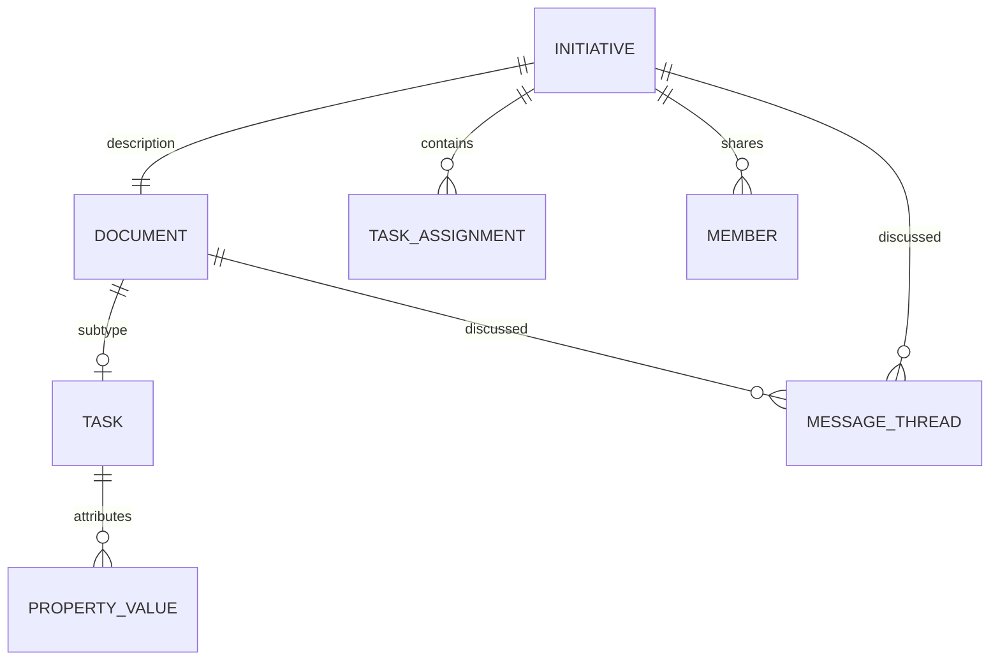

# 09-tasks-projects.md

Срез исходников: Macro `c966b79d40798c6c726a3b15fe90517941fc6e61`; ROX `f63294ba4fffa7238b46b24e918925a313ad0b12`. «Реализовано» ниже означает обнаруженный исполняемый путь в этом commit, не доказательство работы production. Предложения ROX помечены как целевой контракт. Анализ выполнен по коду; тесты перечислены как найденные артефакты, если не указано отдельное исполнение.

## Macro Tasks: document subtype, не отдельный Task store

`MarkdownSubtype::Task` создаёт Markdown document, initialize sync-service из Markdown и применяет system properties. Task sharing derives creator membership, не client-provided team. Task content получает document editing/collaboration/attachments/mentions/discussions, а assignee/status/etc принадлежат properties service. `SystemPropertyKey` задаёт stable property UUID и список required task properties. [C34,C35]

| Capability | Macro executable evidence | ROX current evidence | Target RoxTask |
|---|---|---|---|
| Identifier / title / creator | Document subtype [C34] | PersonalTask id/title [R02] | single canonical EntityRef; creator principal required |
| Content / comments | Markdown task + MessageParent.Document [C20,C34] | notes string [R02] | `bodyDocumentId`, reusable document editor and discussion |
| Assignees | required Assignees property [C35] | PersonalTask no assignee field [R02] | canonical principal IDs; membership validation |
| Status | required Status [C35] | completed/cancelled/trashed timestamps + list projections [R02] | status separate from Today/Inbox personal projection |
| Priority | required Priority [C35] | none/low/medium/high [R02] | preserve current priority; configurable view mapping |
| Due/start | DueDate [C35] | dueAt/startAt [R02] | UTC instant vs date-only explicitly typed |
| Parent/subtasks | properties handler verifies both sides [C36] | parentId/checklist [R02] | no cycles; checklist stays distinct from subtask |
| Dependencies | DependsOn [C35] | YAML DAG Conductor separate [R04] | task dependency edges separate from execution-node dependencies |
| Effort/story points | required properties [C35] | absent PersonalTask fields [R02] | extensible typed task properties |
| Attachments/doc refs | RelevantDocuments + Task document [C35,C34] | source/links [R02] | generic AttachmentBinding + EntityLink |
| Project context | InitiativeDetail.task_ids [C37] | projectId + distinct TaskProject [R02,R05] | migrate to one Project registry |
| Recurrence/reminders | task system keys lack recurrence [C35]; complete execution path unverified | PersonalTask Recurrence fixed/after + reminderAt [R02] | KEEP_ROX recurring behavior, server idempotent scheduler |
| Search | task indexed through documents [C40] | memory FTS is not task search [R08] | task projection with properties and ACL |
| Agent | document/properties/initiative toolsets [C46] | agent workflow TaskRunner [R04] | one task service tools + optional execution run link |

No evidence found here for a Macro task recurrence engine; do not remove proven ROX recurrence because Macro differs. Macro task start-date semantics are not established by DueDate property alone. Status option IDs must be migrated by meaning, not display text.

## Macro Projects: два разных concepts

Macro `Initiative` explicitly presented as Project owns UUIDv7 identity, description Document, owner/member IDs, task IDs and share permission; it is not legacy `crates/projects` by another directory name. `models_properties` distinguishes `EntityType::Initiative` from Project. This prevents wrong migration where initiative task context is treated as legacy folder. [C37,C35]



ROX `ProjectConfig` уже stable id/slug, working directory, details, assets, Kanban columns and ProjectPromptContext memory. But PersonalTask uses distinct `TaskProject` in a bundle, while agent sessions use workspace ProjectConfig. Target must reconcile both identifiers before Company→Task→Project graph queries; otherwise two different projects with same display name leak into product. [R02,R05]

## Целевая модель

```ts
// Proposed ROX design.
type RoxTask = EntityRecord<'task'> & {
  title: string; creatorId: PrincipalId; assigneeIds: PrincipalId[];
  statusId: string; priority: 'none' | 'low' | 'medium' | 'high';
  due?: DateOnly | ZonedInstant; start?: DateOnly | ZonedInstant;
  bodyDocumentId?: EntityId; projectId?: EntityId;
  recurrence?: RecurrenceSpec; repeatOf?: EntityId;
  personalPlacement?: { list: string; order: number; evening: boolean };
};
type RoxProject = EntityRecord<'project'> & {
  title: string; workingDirectory?: string; contextDocumentId?: EntityId;
  memberPolicy: PermissionPolicyRef; viewConfigs: ProjectView[];
};
```

EntityRecord — registry identity/lifecycle, domain detail stores task fields. Extensible properties must not duplicate canonical status/assignee under a second mutable JSON bag. `personalPlacement` logically per user, not shared task-global field: collaborator A's Today should not change B's Today. Project membership follows generic ACL container; links to Company/Contact/meeting/docs do not automatically widen access. [Target Revision 2]

### File-level implementation

1. `packages/core/src/tasks/personal/types.ts`: alias legacy PersonalTask into versioned RoxTask DTO, migrate TaskLink to EntityRef and TaskProject→Project mapping; preserve recurrence/checklist/reminder semantics.
2. `packages/core/src/tasks/personal/{store,projections,rpc}.ts`: projections consume canonical task records plus personal view placement; avoid independent localStorage authority after migration.
3. `packages/server-core/src/tasks/personal-persist.ts`: transactional import into workspace registry with `(legacyScope,legacyId)` mapping, revision compare, rollback export. Existing file reader stays migration input. Canonical config-dir personal task must receive workspace ownership explicitly. [R03]
4. `packages/server-core/src/handlers/rpc/{personal-tasks,tasks}.ts`: PersonalTask facade goes to RoxTask service; Tasks Conductor remains execution engine. New `ExecutionRun` link from Task/AgentSession; no conversion of workflow nodes to assignees. [R04]
5. `packages/shared/src/projects/{types,storage}.ts`: add context/membership/domain binding; current ProjectConfig IDs remain preserved; TaskProject collisions resolved with mapping, never by name alone. [R05]
6. `apps/electron/src/renderer/pages/TasksPage.tsx`, `components/app-shell/ProjectsHomeInMain.tsx`, `pages/ProjectInfoPage.tsx`: consume unified tasks/documents/activity/linked entity views in existing surfaces.

### Commands / DB / events

`task.create_from_message` atomically creates task detail+entity row+source link+outbox event. `task.assign` verifies candidate principal and ACL grant or fails with explicit policy decision. `task.set_status` changes shared status; `task.place_personally` changes user view. `task.set_parent` checks cycles and both endpoints. `project.attach_entity` creates scoped link after read/edit checks; attachment does not imply grant. `task.recurrence.spawn` uses unique `(seriesId,occurrenceKey)` to prevent duplicates after crash.

Tables: entity registry, task detail, task_personal_view, task_series, project detail, entity_link, permission_grant, command_receipt, event_outbox. Events from one command transaction feed shared search/notification/activity; no direct UI-side assignment notification creation. Proposed semantic vocabulary: `task.created`, `task.assignees_changed`, `task.status_changed`, `task.recurrence_spawned`, `project.entity_attached` (new ROX names; not claimed Macro names).

### Acceptance

1. Import existing PersonalTask with recurrence/checklist/links and ProjectConfig; restart/reload shows same behavior and preserved stable IDs. Collision test: equal TaskProject/Project display names do not silently merge.
2. Assign task from Message to collaborator; exactly one authorized notification, one backlink and existing Project view item; denied assignee requires explicit share policy rather than silent public grant.
3. Parent cycle rejected; cross-workspace parent rejected; unauthorized child cannot be linked even if parent accessible.
4. Recurring task crash/retry produces one next occurrence; cancelled/trashed series does not respawn.
5. Agent execution DAG fails without corrupting human task; run failure appears as linked ExecutionRun activity, not automatic task cancellation.
6. Project account context shows only authorized tasks/files/docs/meetings/calls; unauthorized linked entity titles omitted.

Tests found: `crates/documents/src/domain/create/test.rs`, `crates/documents/src/domain/service/tests.rs`, `crates/properties/src/domain/test/initiatives.rs`, `crates/initiative/src/inbound/axum_router/test/access.rs`, `apps/web/src/features/projects/queries/{project-tasks,create-project-task}.test.ts`; ROX `packages/core/src/tasks/personal/{personal,things}.test.ts` and project storage tests. Target migration includes roundtrip fixtures and property tests for cycles/recurrence idempotency.

## Revision 2: существующий ROX2 contract — единственная typed seam

ROX уже имеет `Rox2EntityRef`, `Rox2Relation`, `Rox2Event`, `Rox2Context`, `Rox2Status` в `packages/core/src/rox2/platform-contract.ts`. `Rox2EntityRef` хранит `workspaceId`, `entityId` (`kind:id`), `revisionId?`, `accountNamespace?`. В этой главе `EntityRef` — краткий alias **существующего Rox2EntityRef**, не новый независимый тип `{type,id}` и не второе хранилище. Новые entity kinds, relation kinds и action policies расширяют этот файл и его adapters. [R10,R11]

`Rox2Relation` пока содержит `fromId/toId/kind`; добавить scoped endpoints, relation id, actor/source/revision и разрешённые kinds как versioned backward-compatible extension. `Rox2Event` уже имеет causation/correlation/aggregateRevision; новые domain envelopes расширяют его versioned contract с workspace/command/schema/source revision. Не создавать параллельный EventBus или несвязанный notification engine. Typed contract не выполняет I/O и не доказывает существующую distributed authorization. [R10]

Состояние command должно сохранять `executionMode × lifecycle × verification`: `awaiting_review` соответствует live/waiting_approval/unverified; provider_pending — live/queued или running/unverified; database commit — live/succeeded/receipt_verified; provider read-back отдельно повышает verification. Дополнительный `domainOutcome` не заменяет эту triad и не возвращает success для pending. Общая relational authority collaborative workspace — модульный Postgres domain store; local standalone stores остаются adapter/local projection/outbox с явным authority mode. [R10; target]

## Доказательства

| ID | Repository / commit | File / symbol / lines | Подтверждаемый факт |
|---|---|---|---|
| C20 | `macro-inc/macro@c966b79d40798c6c726a3b15fe90517941fc6e61` | [crates/messages/src/domain/models.rs:38–159](https://github.com/macro-inc/macro/blob/c966b79d40798c6c726a3b15fe90517941fc6e61/crates/messages/src/domain/models.rs#L38-L159), `MessageParent / ThreadAnchor` | Messages share channel, document, initiative and CRM parents plus Markdown/PDF/spreadsheet anchors. |
| C34 | `macro-inc/macro@c966b79d40798c6c726a3b15fe90517941fc6e61` | [crates/documents/src/domain/create.rs:131–205](https://github.com/macro-inc/macro/blob/c966b79d40798c6c726a3b15fe90517941fc6e61/crates/documents/src/domain/create.rs#L131-L205), `RepoDocumentSubtype / MarkdownSubtype / NewMarkdownTextDocument` | Tasks are Markdown document subtypes with properties and CRDT initialization. |
| C35 | `macro-inc/macro@c966b79d40798c6c726a3b15fe90517941fc6e61` | [crates/system_properties/src/domain/model/constants/system_property_key.rs:79–139](https://github.com/macro-inc/macro/blob/c966b79d40798c6c726a3b15fe90517941fc6e61/crates/system_properties/src/domain/model/constants/system_property_key.rs#L79-L139), `SystemPropertyKey / required_property_ids_for_entity` | Task properties include assignees/status/priority/due date/parent/subtasks/dependencies/effort/story points/docs. |
| C36 | `macro-inc/macro@c966b79d40798c6c726a3b15fe90517941fc6e61` | [crates/properties/src/domain/service_impl/task_properties.rs:63–145](https://github.com/macro-inc/macro/blob/c966b79d40798c6c726a3b15fe90517941fc6e61/crates/properties/src/domain/service_impl/task_properties.rs#L63-L145), `task relationship handlers / task assignment notification` | Parent/subtask relationship mutation checks edit permission on affected task. |
| C37 | `macro-inc/macro@c966b79d40798c6c726a3b15fe90517941fc6e61` | [crates/initiative/src/domain/models.rs:33–169](https://github.com/macro-inc/macro/blob/c966b79d40798c6c726a3b15fe90517941fc6e61/crates/initiative/src/domain/models.rs#L33-L169), `InitiativeId / InitiativeDetail` | Initiative is app Project with UUIDv7, description doc, members, tasks and sharing. |
| C40 | `macro-inc/macro@c966b79d40798c6c726a3b15fe90517941fc6e61` | [crates/models_search/src/unified.rs:25–83](https://github.com/macro-inc/macro/blob/c966b79d40798c6c726a3b15fe90517941fc6e61/crates/models_search/src/unified.rs#L25-L83), `UnifiedSearchIndex / entity_filters_from_include` | OpenSearch unified index vocabulary covers docs/chats/mail/channels/projects/calls/calendar/agent sessions. |
| C46 | `macro-inc/macro@c966b79d40798c6c726a3b15fe90517941fc6e61` | [crates/ai_tools/src/lib.rs:94–180](https://github.com/macro-inc/macro/blob/c966b79d40798c6c726a3b15fe90517941fc6e61/crates/ai_tools/src/lib.rs#L94-L180), `AiHost / tools_for / subagent_toolset` | Tools are composed per host; Mail and Calendar review semantics differ between chat/session/bot/MCP. |
| R02 | `rox-one/rox-one@f63294ba4fffa7238b46b24e918925a313ad0b12` | [packages/core/src/tasks/personal/types.ts:8–109](https://github.com/rox-one/rox-one/blob/f63294ba4fffa7238b46b24e918925a313ad0b12/packages/core/src/tasks/personal/types.ts#L8-L109), `PersonalTask / TaskLink / Recurrence / TaskProject` | Personal tasks already have recurrence, links, project, dates, checklist and audit; TaskProject is distinct model. |
| R03 | `rox-one/rox-one@f63294ba4fffa7238b46b24e918925a313ad0b12` | [packages/server-core/src/tasks/personal-persist.ts:1–16](https://github.com/rox-one/rox-one/blob/f63294ba4fffa7238b46b24e918925a313ad0b12/packages/server-core/src/tasks/personal-persist.ts#L1-L16), `PersonalTaskPersistStore / put` | Personal task canonical files use numeric revisions and atomic file writes. |
| R04 | `rox-one/rox-one@f63294ba4fffa7238b46b24e918925a313ad0b12` | [packages/server-core/src/handlers/rpc/tasks.ts:1–47](https://github.com/rox-one/rox-one/blob/f63294ba4fffa7238b46b24e918925a313ad0b12/packages/server-core/src/handlers/rpc/tasks.ts#L1-L47), `registerTasksHandlers / TaskRunner` | Tasks Conductor is YAML agent workflow execution, distinct from human personal tasks. |
| R05 | `rox-one/rox-one@f63294ba4fffa7238b46b24e918925a313ad0b12` | [packages/shared/src/projects/types.ts:35–113](https://github.com/rox-one/rox-one/blob/f63294ba4fffa7238b46b24e918925a313ad0b12/packages/shared/src/projects/types.ts#L35-L113), `ProjectConfig / ProjectPromptContext` | ROX projects already carry stable id, working directory, assets, Kanban columns and agent context. |
| R08 | `rox-one/rox-one@f63294ba4fffa7238b46b24e918925a313ad0b12` | [packages/server-core/src/memory/fts-index.ts:1–41](https://github.com/rox-one/rox-one/blob/f63294ba4fffa7238b46b24e918925a313ad0b12/packages/server-core/src/memory/fts-index.ts#L1-L41), `fts-index / getDatabaseCtor` | Memory FTS5 indexes lessons/history/context and falls back under unavailable SQLite runtime. |
| R10 | `rox-one/rox-one@f63294ba4fffa7238b46b24e918925a313ad0b12` | [packages/core/src/rox2/platform-contract.ts:107–141](https://github.com/rox-one/rox-one/blob/f63294ba4fffa7238b46b24e918925a313ad0b12/packages/core/src/rox2/platform-contract.ts#L107-L141), `Rox2EntityRef / Rox2Relation / Rox2Event / Rox2Status` | Existing ROX unified contract already declares relation/event/result seam; this is typed boundary without I/O. |
| R11 | `rox-one/rox-one@f63294ba4fffa7238b46b24e918925a313ad0b12` | [packages/core/src/rox2/platform-contract.ts:218–239](https://github.com/rox-one/rox-one/blob/f63294ba4fffa7238b46b24e918925a313ad0b12/packages/core/src/rox2/platform-contract.ts#L218-L239), `Rox2EntityRef / formatRox2EntityId / parseRox2EntityId` | Existing workspace-scoped ref uses entityId encoded kind:id and optional revision/accountNamespace. |
