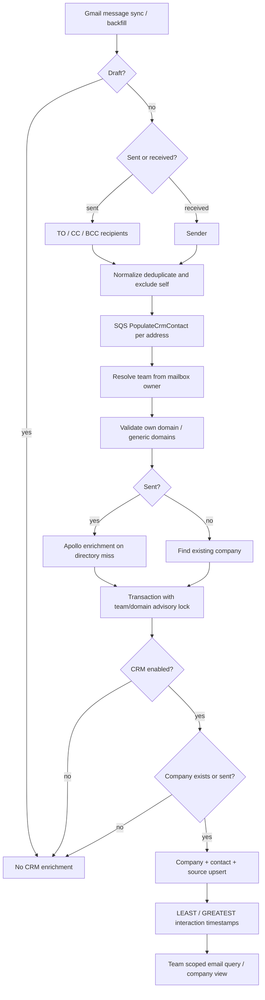
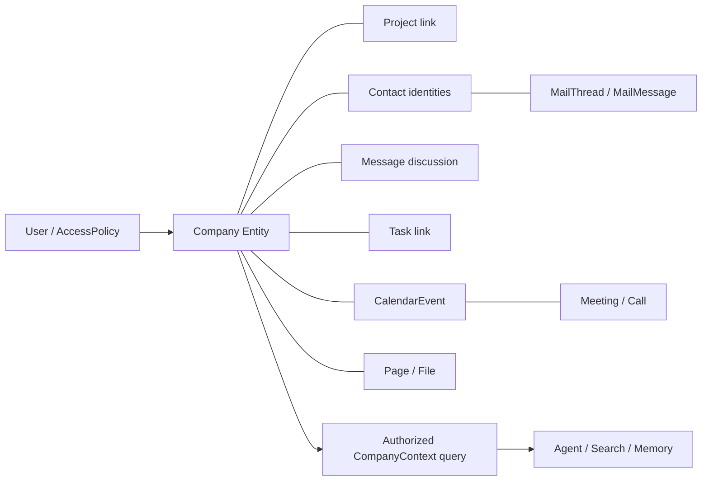

# 10. CRM: текущий Macro и домен ROX

Решение: **NEW_ROX_PRIMITIVE** для Company/Contact в существующем Rox2 entity contract; **REIMPLEMENT** CRM behavior; **EXTEND_ROX** Mail, Projects, Tasks, Meetings и shared discussion. CRM представляет корпоративный контекст над общими сущностями, без второго пользователя, проекта, сообщения или почтового хранилища. В Macro CRM crate hosted внутри Document Storage Service (`/crm`), а не отдельный CRM microservice; DSS wiring использует Postgres + NoOp metadata resolver, enrichment выполняется email workers [D102,D103]. Литеральное копирование Macro не разрешено архитектурным решением: AGPLv3 и package-level условия разбираются в [18-licensing.md](18-licensing.md).

## 1. Настоящая модель Macro

| Название в коде | Persistence / identity | Семантика |
|---|---|---|
| `CrmCompany` | UUID, `crm_companies.team_id` | Команда владеет записью, `email_sync` — email visibility gate, `hidden` — доступ/листинг; display name отдельный team override [D001,D005] |
| `CrmDomain` | UUID → company; normalized domain | Один company может иметь несколько domains; блокировка `(team, lower(domain))` защищает concurrent discovery [D001,D005] |
| `CrmContact` | UUID; `(company_id,email)` unique | Имя first-non-null; first/last interaction; отдельный hidden; собственный email identity [D002,D005] |
| contact source | `crm_contact_sources(contact_id,link_id)` unique | Provenance из почтовых аккаунтов; это реальная таблица, отдельный `CRMContactSource` class не нужен [D003] |
| directory | `crm_domain_directory` | Глобальное enrichment по domain, Apollo metadata и negative cache; company override не изменяет глобальную directory [D007,D001] |
| Stage | `property_definitions` / `property_options` / values | Общая property infrastructure; system Stage и team custom stages; option UUID сохраняется при переименовании [D008,D009] |
| Owner | property `ENTITY USER` | Ответственный teammate, не новый CRM пользователь и не владелец ACL [D008] |
| Revenue | property `NUMBER` | Business revenue в долларах, отличается от estimated annual revenue Apollo [D008,D007] |
| CRM discussion | `comms_messages` с parent `crm_company` / `crm_contact` | Новый HEAD использует общий message engine; legacy CrmThread/CrmComment wire shapes — адаптер [D013,D014] |
| CRM activity | first/last timestamps + shared messages/history/properties | Отдельная сущность `CRMActivity` в рассмотренной модели не обнаружена; не подменять фактическую модель предложенным названием [D001,D002,D017] |

Важная разница времён: company domain `created_at/updated_at` read model отражает first/last interaction; DB lifecycle timestamps имеют другую семантику. Target не должен импортировать activity time как дату создания строки [D001,D005].

## 2. Email → CRM: подтверждённый flow

Flow доказан `upsert_message → enqueue_populate_crm_contacts → populate_crm_contact → CrmServiceImpl.populate_contact → CompaniesRepository.populate_contact` [D093,D019,D004,D005]. **Первое входящее письмо от неизвестной компании не создаёт company**: branch `None if !is_sent` commit/no-op. Required ROX inbound scenario поэтому является расширением поведения, а не констатацией Macro parity.

Generic-domain filter шире Gmail/Yahoo: disposable, alias/forwarder, SaaS/tool vendors, bulk senders и reserved TLD; критерий продуктовый и может исключить настоящую компанию [D006]. Предлагаем ROX policy с reason code, audit, allow/deny overrides, без зашитого утверждения, что любой Gmail contact бессмысленен. Contact физического лица может существовать без Company.

Enrichment вынесен из contact transaction: HTTP не держит domain lock. Apollo возвращает empty metadata при ошибке/нет ключа, запись negative cache снижает повторные запросы [D007,D004]. ROX enrichment должен иметь `resolvedAt`, provider, confidence, retryAfter и provenance; отсутствие metadata не блокирует CRM discovery.

## 3. UI, queries, governance и скрытые поверхности

`companiesRoute` (`companies`, Customers) открывает authenticated feature-gated SoupView. `CrmWorkspace` связывает sidebar, Companies/Pipeline/My/Unassigned/saved views, search/filter/group/sort, detail. `Company` показывает discussion, emails, metadata, properties, contacts, sharing; references section в коде ещё TODO [D018,D017]. Board/list используют существующие company entity views общей Soup infrastructure. Contextual `CrmPeople` directory имеет search/sort и страницы по 50. `CrmImport` принимает CSV до 1 MB и 1–100 компаний с name/domain; successful rows не повторяются, failed остаются для retry. `CrmExport` предоставляет current/all scopes, Companies/People и custom property columns [D094,D095,D096]. Это полезные самостоятельные acceptance cases, не только навигация.

REST router: POST `/crm/companies`, GET company/contact, GET+POST company contacts, PUT email-sync/hidden/name, settings GET/PUT, stages PUT/DELETE, legacy comments GET/POST/PATCH/DELETE. Company listing проходит общий Soup query, не выдуманный GET company list. Manifest связывает `crm` с `entity_access`, `messages`, `properties`, `system_properties`, SQLx; readonly `search` feature не тянет HTTP/enrichment dependencies [D098,D100]. Migration 20260928 добавляет реальные generated FK parent columns к `comms_messages` и mention cleanup trigger при hard delete [D099].

| Capability | Проверенный механизм / ограничение | Target ROX |
|---|---|---|
| First/last interaction | Sent создаёт company и LEAST first; received для известного company меняет last; contact ranges merge [D005] | Общая Interaction projection по Mail/Call/Meeting/Message, kind/time/source явно |
| Email history | CRM domain/address scope query с precheck; email_sync + hidden + team gate; details mailbox owned [D011,D092] | Grant-проверяемые MailThread links, dedup content по origin key; не копировать private email в company row |
| Email Sync | Read visibility, ingestion продолжает писать [D004,D005,D011] | Разделить `ingestionEnabled` и `teamMailVisibility`; UI объясняет обе настройки |
| Hide company/contact | Hide company cascades contacts и выключает sync; unhide не включает sync обратно [D012] | Явный reversible hide policy; preserve provenance; audited permission revocation |
| Team membership | Visible member edit, hidden member no access; admin edit owner owner. Governance отдельно role-gated [D010] | Общий AccessPolicy с domain constraints; Owner business field не даёт share права |
| Stage / owner / revenue | Universal properties + role-gated team stage definitions [D008,D009] | Typed custom fields одного entity service; stage catalog revision; currency обязательна |
| Discussions / replies | Shared `EntityDiscussion` and canonical messages parent [D013,D014] | Один ROX Message primitive для human messaging/comments; source company ref |
| Mentions | Canonical discussion composer используется в UI. Legacy CRM adapter post передаёт `mentions=[]` [D013,D014] | Structured mention records из canonical command; auto-grant запрещён без share policy |
| Search | Company names/domains — SQL ILIKE с team/hidden + keyset [D015] | Единый search contract, Company/Contact metadata projection; не заявлять, что все CRM записи в OpenSearch |
| Agent | `ListCompanies`, `GetCompany`, properties API, stage/owner/search filters с access receipts [D016,D090] | Company read/search/update/link/comment/share через общий command/query и same principal |
| Cleanup | Persisted cleanup job и source-aware teardown [D020,D003] | Removing mailbox/member retires sources; manually-created contact/company сохраняются |

Документация `crm.mdx` противоречит сама себе: ранний абзац обещает auto-share при company mention, поздний Note говорит, что CRM sharing определяется team, не mention. Code ACL — source of truth. Документация также говорит primary-only; проверенные realtime producer/consumer signatures не содержат primary check. До отдельной проверки всех callers primary-only нельзя считать доказанным invariant [D021,D019,D093].

## 4. Целевой ROX CRM contract (proposal, Revision 2)

`Company` / `Contact` получают native Rox2 ID и workspaceId из общей entity identity. `ContactIdentity(address,providerIdentity)` отделяет внешний email от ROX `User`; match не превращает чужой email в teammate. `CompanyDomain(workspaceId,companyId,normalizedDomain)` unique; domain может иметь confidence и redirect/merge alias. Target Contact допускает несколько email identities и отсутствие company. `ContactSource` связывает provenance с provider account и message, отдельно from/to/cc/bcc и visibility. `CrmProfile` — extension Company с stage/owner/revenue; базовая Company не дублируется для Mail.

`CompanyContext(companyRef,principal,cursor)` собирает typed links, выполняет ACL на каждом leaf и выдаёт source refs/revisions. Не materialize полный private email body на Company и не наследовать grants между graph neighbors. Links не означают permission inheritance. Derived context и memory chunks имеют origin ACL/provenance; после revoke inaccessible leaf исчезает из ответов.

Commands: `crm.discoverContact`, `company.create/update/hide`, `contact.create/update/hide`, `company.setPipelineStage`, `company.setMailVisibility`, `entity.link`, `message.post`. Queries: `company.get/list`, `contact.list`, `company.context`. Event records transactional outbox с stable eventId/entityRef/entityVersion/actor/correlation/causation. Обновление одной строки и её links происходит в одной workspace-authority transaction; mail-provider side effects асинхронные, без распределённой транзакции.

## 5. Точные ROX change points и вертикальные slices

| Existing file | Изменение |
|---|---|
| `apps/electron/src/main/mail/mail-service.ts` `MailService` | Адаптировать существующий JMAP mailbox в ProviderConnection и normalized mail projection; emit provider message changes для discovery, не второй mail stack [D068,D088] |
| `packages/shared/src/mail/jmap-client.ts` `JmapClient` | Добавить change cursor/account identifiers и adapter capability contract вокруг существующих JMAP methods [D069] |
| `packages/core/src/meetings/model.ts` `Meeting` | Company/Contact ссылки через EntityLink; сохранить существующий sourceBinding/revision [D073] |
| `apps/electron/src/renderer/pages/inbox/mail/MailPanels.tsx` | Показать Contact/Company backlinks в текущем reader; открывать native entity detail [D074] |
| New `packages/core/src/crm/{models,commands,queries}.ts` | Typed domain extension и invariants, не новая identity system |
| New `packages/server-core/src/crm/{service,repository,enrichment,context}.ts` | Workspace authority handlers + persistence/outbox + provenance-aware context |
| New `apps/electron/src/renderer/pages/crm/{CrmPage,CompanyDetail,ContactDetail}.tsx` | Russian native React surface with board/list and existing entity interaction patterns |

Slice 1: inbound JMAP message → Contact/Company (new target policy) → Company detail → searchable/access-controlled links, duplicate delivery no duplicate rows. Slice 2: canonical company discussion → mention teammate → shared inbox notification → search/agent read. Slice 3: editable pipeline + hide/email visibility → immediate ACL enforcement across detail, queries, agent context. Slice 4: Company context across Tasks/Projects/Meeting/Page with links and source revisions.

Acceptance: concurrent two-mailbox discovery same domain creates one company; same Contact with two sources survives removal of one; malformed/bulk source is audit-visible and does not poison queue; opt-out team mail removes leaf immediately; pipeline change preserves custom field IDs; incoming unknown contact creates CRM according to explicit target policy; revoked teammate cannot read summary, mail, discussion or search snippet through CompanyContext.

Macro tests inspected as artifacts: `crates/crm/src/domain/service/test.rs`, `domain/stages/test.rs`, `domain/generic_email_domains/test.rs`, `outbound/companies_repo/test/{populate_contact,set_email_sync,set_company_hidden,team_settings,comments}.rs`, `crates/entity_access/.../crm_company_access/test.rs`, email CRM scope fixtures. These must inform target invariants; they were not executed in this audit.

## Доказательства на зафиксированном HEAD

Ссылки `[Dxxx]` относятся к этому реестру; это статический аудит кода. Production credentials, реальные Gmail/LiveKit/Cloudflare окружения и Rust integration suites здесь не запускались. Наличие теста не означает, что тест прошёл.

| ID | Repository / commit SHA | File / symbol / lines | Подтверждаемое утверждение |
|---|---|---|---|
| D001 | `macro-inc/macro` · `c966b79d40798c6c726a3b15fe90517941fc6e61` | [crates/crm/src/domain/model.rs](https://github.com/macro-inc/macro/blob/c966b79d40798c6c726a3b15fe90517941fc6e61/crates/crm/src/domain/model.rs#L59-L91) · `CrmCompany` · 59–91 | Company team-scoped UUID, email_sync, hidden, interaction timestamps and domains |
| D002 | `macro-inc/macro` · `c966b79d40798c6c726a3b15fe90517941fc6e61` | [crates/crm/src/domain/model.rs](https://github.com/macro-inc/macro/blob/c966b79d40798c6c726a3b15fe90517941fc6e61/crates/crm/src/domain/model.rs#L173-L201) · `CrmContact` · 173–201 | Contact belongs to company, email/name/hidden and first/last interaction |
| D003 | `macro-inc/macro` · `c966b79d40798c6c726a3b15fe90517941fc6e61` | [crates/macro_db_client/migrations/20260514120000_crm_contact_sources.up.sql](https://github.com/macro-inc/macro/blob/c966b79d40798c6c726a3b15fe90517941fc6e61/crates/macro_db_client/migrations/20260514120000_crm_contact_sources.up.sql#L1-L14) · `crm_contact_sources` · 1–14 | Contact provenance keyed by contact and email link |
| D004 | `macro-inc/macro` · `c966b79d40798c6c726a3b15fe90517941fc6e61` | [crates/crm/src/domain/service.rs](https://github.com/macro-inc/macro/blob/c966b79d40798c6c726a3b15fe90517941fc6e61/crates/crm/src/domain/service.rs#L562-L656) · `CrmServiceImpl.populate_contact` · 562–656 | Reject own/generic domains; sent-only enrichment; delegates transaction |
| D005 | `macro-inc/macro` · `c966b79d40798c6c726a3b15fe90517941fc6e61` | [crates/crm/src/outbound/companies_repo.rs](https://github.com/macro-inc/macro/blob/c966b79d40798c6c726a3b15fe90517941fc6e61/crates/crm/src/outbound/companies_repo.rs#L298-L443) · `CompaniesRepository.populate_contact` · 298–443 | Team/domain lock, killswitch, inbound unknown company no-op; sent creates; contact/source upsert |
| D006 | `macro-inc/macro` · `c966b79d40798c6c726a3b15fe90517941fc6e61` | [crates/crm/src/domain/generic_email_domains.rs](https://github.com/macro-inc/macro/blob/c966b79d40798c6c726a3b15fe90517941fc6e61/crates/crm/src/domain/generic_email_domains.rs#L44-L93) · `is_generic_email_domain` · 44–93 | Filter provider/disposable/alias/vendor/bulk and reserved domains |
| D007 | `macro-inc/macro` · `c966b79d40798c6c726a3b15fe90517941fc6e61` | [crates/crm/src/outbound/apollo_resolver.rs](https://github.com/macro-inc/macro/blob/c966b79d40798c6c726a3b15fe90517941fc6e61/crates/crm/src/outbound/apollo_resolver.rs#L71-L151) · `ApolloCompanyMetadataResolver.resolve` · 71–151 | Apollo enrichment best effort with no-key short circuit and negative results |
| D008 | `macro-inc/macro` · `c966b79d40798c6c726a3b15fe90517941fc6e61` | [crates/macro_db_client/migrations/20260707183206_seed_crm_company_system_properties.sql](https://github.com/macro-inc/macro/blob/c966b79d40798c6c726a3b15fe90517941fc6e61/crates/macro_db_client/migrations/20260707183206_seed_crm_company_system_properties.sql#L1-L111) · `Stage / Owner / Revenue property definitions` · 1–111 | CRM business properties reuse universal property tables |
| D009 | `macro-inc/macro` · `c966b79d40798c6c726a3b15fe90517941fc6e61` | [crates/crm/src/domain/stages.rs](https://github.com/macro-inc/macro/blob/c966b79d40798c6c726a3b15fe90517941fc6e61/crates/crm/src/domain/stages.rs#L28-L183) · `CrmStageServiceImpl / TeamStage` · 28–183 | Team pipeline stores property option IDs; stage mutation role-gated |
| D010 | `macro-inc/macro` · `c966b79d40798c6c726a3b15fe90517941fc6e61` | [crates/entity_access/src/outbound/pg_access_repo/queries/crm_company_access.rs](https://github.com/macro-inc/macro/blob/c966b79d40798c6c726a3b15fe90517941fc6e61/crates/entity_access/src/outbound/pg_access_repo/queries/crm_company_access.rs#L86-L93) · `team_role_to_access_level` · 86–93 | Visible CRM members edit; hidden plain members have no access |
| D011 | `macro-inc/macro` · `c966b79d40798c6c726a3b15fe90517941fc6e61` | [crates/email/src/domain/service/previews.rs](https://github.com/macro-inc/macro/blob/c966b79d40798c6c726a3b15fe90517941fc6e61/crates/email/src/domain/service/previews.rs#L175-L226) · `validate_crm_scope` · 175–226 | CRM email queries require team receipt, enabled CRM, visible rows and email_sync |
| D012 | `macro-inc/macro` · `c966b79d40798c6c726a3b15fe90517941fc6e61` | [crates/crm/src/outbound/companies_repo.rs](https://github.com/macro-inc/macro/blob/c966b79d40798c6c726a3b15fe90517941fc6e61/crates/crm/src/outbound/companies_repo.rs#L1107-L1201) · `set_company_hidden` · 1107–1201 | Company hiding cascades to contacts and disables email_sync |
| D013 | `macro-inc/macro` · `c966b79d40798c6c726a3b15fe90517941fc6e61` | [apps/web/src/features/companies/Company/CompanyDiscussionSection.tsx](https://github.com/macro-inc/macro/blob/c966b79d40798c6c726a3b15fe90517941fc6e61/apps/web/src/features/companies/Company/CompanyDiscussionSection.tsx#L5-L14) · `CompanyDiscussionSection` · 5–14 | CRM UI uses shared EntityDiscussion with crm_company parent |
| D014 | `macro-inc/macro` · `c966b79d40798c6c726a3b15fe90517941fc6e61` | [crates/crm/src/inbound/axum_router/comments/adapter.rs](https://github.com/macro-inc/macro/blob/c966b79d40798c6c726a3b15fe90517941fc6e61/crates/crm/src/inbound/axum_router/comments/adapter.rs#L32-L182) · `CrmCommentAdapter` · 32–182 | Legacy CRM comment routes adapt canonical MessageServiceApi; explicit legacy mentions empty |
| D015 | `macro-inc/macro` · `c966b79d40798c6c726a3b15fe90517941fc6e61` | [crates/crm/src/outbound/search_repo.rs](https://github.com/macro-inc/macro/blob/c966b79d40798c6c726a3b15fe90517941fc6e61/crates/crm/src/outbound/search_repo.rs#L59-L149) · `CrmSearchRepositoryImpl.search_company_names` · 59–149 | CRM name/domain search is Postgres ILIKE with team/hidden scope and keyset cursor |
| D016 | `macro-inc/macro` · `c966b79d40798c6c726a3b15fe90517941fc6e61` | [crates/crm/src/inbound/toolset/list_companies.rs](https://github.com/macro-inc/macro/blob/c966b79d40798c6c726a3b15fe90517941fc6e61/crates/crm/src/inbound/toolset/list_companies.rs#L77-L161) · `ListCompanies` · 77–161 | Agent CRM list filters stage owner search and hidden; uses permission receipts |
| D017 | `macro-inc/macro` · `c966b79d40798c6c726a3b15fe90517941fc6e61` | [apps/web/src/features/companies/Company/Company.tsx](https://github.com/macro-inc/macro/blob/c966b79d40798c6c726a3b15fe90517941fc6e61/apps/web/src/features/companies/Company/Company.tsx#L24-L100) · `Company` · 24–100 | Detail uses discussions, email, metadata, properties, contacts/sharing; inbound references TODO |
| D018 | `macro-inc/macro` · `c966b79d40798c6c726a3b15fe90517941fc6e61` | [apps/web/src/features/companies/route.tsx](https://github.com/macro-inc/macro/blob/c966b79d40798c6c726a3b15fe90517941fc6e61/apps/web/src/features/companies/route.tsx#L38-L45) · `companiesRoute` · 38–45 | Customers route uses authenticated feature-gated SoupView |
| D019 | `macro-inc/macro` · `c966b79d40798c6c726a3b15fe90517941fc6e61` | [services/email_service/src/pubsub/backfill/populate_crm_contact.rs](https://github.com/macro-inc/macro/blob/c966b79d40798c6c726a3b15fe90517941fc6e61/services/email_service/src/pubsub/backfill/populate_crm_contact.rs#L25-L67) · `populate_crm_contact` · 25–67 | Email queue worker resolves team for link and calls CRM service with direction and timestamps |
| D020 | `macro-inc/macro` · `c966b79d40798c6c726a3b15fe90517941fc6e61` | [crates/email_db_client/src/crm_cleanup/job.rs](https://github.com/macro-inc/macro/blob/c966b79d40798c6c726a3b15fe90517941fc6e61/crates/email_db_client/src/crm_cleanup/job.rs#L1-L101) · `CRM cleanup job` · 1–101 | Cleanup uses email DB candidate scan with persisted job state |
| D021 | `macro-inc/macro` · `c966b79d40798c6c726a3b15fe90517941fc6e61` | [apps/docs/product/crm.mdx](https://github.com/macro-inc/macro/blob/c966b79d40798c6c726a3b15fe90517941fc6e61/apps/docs/product/crm.mdx#L35-L103) · `CRM product documentation` · 35–103 | Documentation conflicts internally on mention sharing; intended board/list/email discussion semantics |
| D068 | `rox-one/rox-one` · `f63294ba4fffa7238b46b24e918925a313ad0b12` | [apps/electron/src/main/mail/mail-service.ts](https://github.com/rox-one/rox-one/blob/f63294ba4fffa7238b46b24e918925a313ad0b12/apps/electron/src/main/mail/mail-service.ts#L99-L219) · `MailService` · 99–219 | ROX existing JMAP/Stalwart mail bridge and persisted mailbox metadata |
| D069 | `rox-one/rox-one` · `f63294ba4fffa7238b46b24e918925a313ad0b12` | [packages/shared/src/mail/jmap-client.ts](https://github.com/rox-one/rox-one/blob/f63294ba4fffa7238b46b24e918925a313ad0b12/packages/shared/src/mail/jmap-client.ts#L318-L367) · `JmapClient.compose` · 318–367 | ROX JMAP draft + submit request with server error reporting |
| D073 | `rox-one/rox-one` · `f63294ba4fffa7238b46b24e918925a313ad0b12` | [packages/core/src/meetings/model.ts](https://github.com/rox-one/rox-one/blob/f63294ba4fffa7238b46b24e918925a313ad0b12/packages/core/src/meetings/model.ts#L102-L125) · `Meeting` · 102–125 | ROX meeting workspace/call specialization with sourceBinding revision |
| D074 | `rox-one/rox-one` · `f63294ba4fffa7238b46b24e918925a313ad0b12` | [apps/electron/src/renderer/pages/inbox/mail/MailPanels.tsx](https://github.com/rox-one/rox-one/blob/f63294ba4fffa7238b46b24e918925a313ad0b12/apps/electron/src/renderer/pages/inbox/mail/MailPanels.tsx#L105-L173) · `MailListPanel` · 105–173 | ROX native mail UI list compose and search route; keep surface |
| D090 | `macro-inc/macro` · `c966b79d40798c6c726a3b15fe90517941fc6e61` | [crates/crm/src/inbound/toolset/get_company.rs](https://github.com/macro-inc/macro/blob/c966b79d40798c6c726a3b15fe90517941fc6e61/crates/crm/src/inbound/toolset/get_company.rs#L92-L185) · `GetCompany` · 92–185 | Company agent context includes contacts, business properties and interaction facts |
| D092 | `macro-inc/macro` · `c966b79d40798c6c726a3b15fe90517941fc6e61` | [apps/web/src/features/companies/Company/use-company-emails-query.ts](https://github.com/macro-inc/macro/blob/c966b79d40798c6c726a3b15fe90517941fc6e61/apps/web/src/features/companies/Company/use-company-emails-query.ts#L1-L60) · `useCompanyEmailsQuery` · 1–60 | CRM detail emails use scoped query integration |
| D093 | `macro-inc/macro` · `c966b79d40798c6c726a3b15fe90517941fc6e61` | [services/email_service/src/pubsub/inbox_sync/operations/upsert_message.rs](https://github.com/macro-inc/macro/blob/c966b79d40798c6c726a3b15fe90517941fc6e61/services/email_service/src/pubsub/inbox_sync/operations/upsert_message.rs#L329-L349) · `upsert_message CRM enqueue` · 329–349 | CRM populated for sent recipients and received senders, drafts skipped |
| D094 | `macro-inc/macro` · `c966b79d40798c6c726a3b15fe90517941fc6e61` | [apps/web/src/features/companies/views/CrmImport.tsx](https://github.com/macro-inc/macro/blob/c966b79d40798c6c726a3b15fe90517941fc6e61/apps/web/src/features/companies/views/CrmImport.tsx#L6-L83) · `CrmImport` · 6–83 | CSV import 1MB and 1-100 companies; validates name/domain, retains failed rows |
| D095 | `macro-inc/macro` · `c966b79d40798c6c726a3b15fe90517941fc6e61` | [apps/web/src/features/companies/views/CrmExport.tsx](https://github.com/macro-inc/macro/blob/c966b79d40798c6c726a3b15fe90517941fc6e61/apps/web/src/features/companies/views/CrmExport.tsx#L19-L139) · `CrmExport` · 19–139 | Companies/people CSV export current/all scope, selected/custom columns |
| D096 | `macro-inc/macro` · `c966b79d40798c6c726a3b15fe90517941fc6e61` | [apps/web/src/features/companies/views/CrmPeople.tsx](https://github.com/macro-inc/macro/blob/c966b79d40798c6c726a3b15fe90517941fc6e61/apps/web/src/features/companies/views/CrmPeople.tsx#L30-L85) · `CrmPeople` · 30–85 | Contact directory paged search/sort name/company/first-last interactions |
| D098 | `macro-inc/macro` · `c966b79d40798c6c726a3b15fe90517941fc6e61` | [crates/crm/src/inbound/axum_router.rs](https://github.com/macro-inc/macro/blob/c966b79d40798c6c726a3b15fe90517941fc6e61/crates/crm/src/inbound/axum_router.rs#L138-L216) · `crm_router` · 138–216 | CRM exact REST route mutation/settings/stages/legacy comment inventory |
| D099 | `macro-inc/macro` · `c966b79d40798c6c726a3b15fe90517941fc6e61` | [crates/macro_db_client/migrations/20260928152757_crm_discussion_parents.sql](https://github.com/macro-inc/macro/blob/c966b79d40798c6c726a3b15fe90517941fc6e61/crates/macro_db_client/migrations/20260928152757_crm_discussion_parents.sql#L9-L42) · `crm discussion parents migration` · 9–42 | Generated FK parent columns cascade CRM hard-delete and trigger cleans entity mentions |
| D100 | `macro-inc/macro` · `c966b79d40798c6c726a3b15fe90517941fc6e61` | [crates/crm/Cargo.toml](https://github.com/macro-inc/macro/blob/c966b79d40798c6c726a3b15fe90517941fc6e61/crates/crm/Cargo.toml#L7-L95) · `CRM crate manifest` · 7–95 | CRM imports entity_access/messages/properties/sqlx and optional inbound/search ports |
| D102 | `macro-inc/macro` · `c966b79d40798c6c726a3b15fe90517941fc6e61` | [services/document_storage_service/src/api.rs](https://github.com/macro-inc/macro/blob/c966b79d40798c6c726a3b15fe90517941fc6e61/services/document_storage_service/src/api.rs#L288-L300) · `setup API` · 288–300 | DSS API hosts CRM router at /crm; nearby call route and calendar reads |
| D103 | `macro-inc/macro` · `c966b79d40798c6c726a3b15fe90517941fc6e61` | [services/document_storage_service/src/main.rs](https://github.com/macro-inc/macro/blob/c966b79d40798c6c726a3b15fe90517941fc6e61/services/document_storage_service/src/main.rs#L377-L394) · `main CRM wiring` · 377–394 | DSS wires CRM Postgres repository with NoOpCompanyMetadataResolver |
