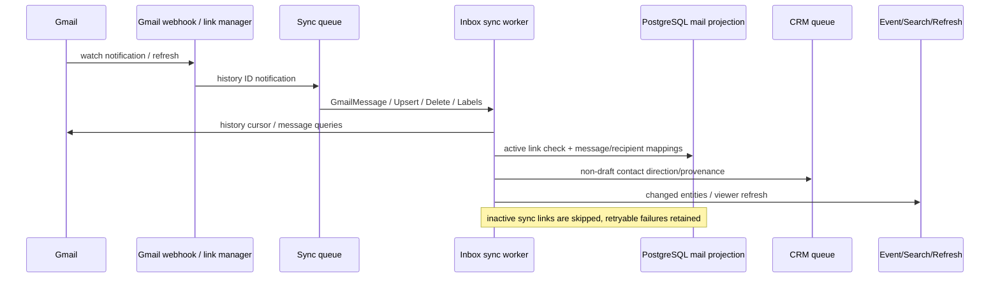

# 11. Mail: provider-neutral domain, расширение существующей ROX почты

Решение: **EXTEND_ROX** `MailService` + `JmapClient`; **ADAPTER** Gmail/Microsoft/IMAP; **REIMPLEMENT** Macro semantics с shared entities и authorization. Macro public domain имеет provider ports, но текущий `UserProvider` содержит только Gmail. Наличие interface не означает реализованный Microsoft/IMAP backend [D022,D087].

## 1. Current Macro stack

| Layer | Entry / mechanism |
|---|---|
| UI | `features/email-view` route `mail` + `:threadId` (entity reference `email`), list/inbox selector/detail/sidebar/filters [D097]; `features/block-email` thread block; compose/reply/forward; Solid signals/context/query cache, local persisted view preferences [D036] |
| SDK | `entities/email/{link,thread,message,attachment,label}.ts`, generated email client; Thread loads API details and mutations [D037] |
| API | `services/email_service/src/api/email.rs`: `/attachments`, `/labels`, `/threads`, `/drafts`, `/messages`, `/links`, `/contacts`, `/filters`, `/backfill`, `/settings`, `/sync`, `/init`; `/gmail/webhook` [D025,D028] |
| Domain | `EmailServiceImpl` delegates repository, CRM, entity-access-management, frecency and broker [D024] |
| Provider | `email_api_client` ports for sync/subscription/message/send/label/attachment/contact/blocklist; Gmail implementation with token source/rate limiter [D087,D027] |
| Persistence | PostgreSQL email_links/email_threads/email_messages + recipients/contact/label/attachment/source mappings, drafts are messages with state fields; separate DB UUID/provider IDs/Message-ID [D022,D023] |
| Realtime | Inbox changes notify owner/delegated recipients through connection gateway; provider webhook → queue processor; UI refresh/reconcile is not mail CRDT [D026,D028] |
| Jobs | Backfill, inbox sync, link manager, sent/draft workers, scheduled delivery, SFS upload/delete, CRM populate/cleanup; SQS [D026,D029,D031,D019] |
| Agent | ListInboxes/ListLabels/GetThread/SendEmail/SendConfirmedEmail/SetSenderPolicy/UpdateThreadLabels; inbox selector restricted to accessible inboxes [D033] |

Macro `MessageRow` distinguishes `db_id`, `provider_id`, `thread_db_id`, `provider_thread_id`, `global_id` (Message-ID), `link_id`, reply pointer, history ID, provider/internal time, read/star/sent/draft, text/sanitized HTML/Macro body/raw headers [D023]. Target must keep these identity layers. A provider thread ID is account-scoped, not a global ROX entity ID.

## 2. End-to-end behavior and limitations

`inner_process_message` loads link; inactive → success/no update; permanent errors cleaned up; transient errors keep queue item for retry [D026]. Gmail history conversion and provider cursor remain adapter implementation [D027]. Webhook validation включена только при build feature `gmail_webhook_auth`; handler без этой feature не выполняет token check, deployment gate нужно проверить отдельно [D028]. Refresh handler buckets accounts across hours, plus health checks and inactive/unused cleanup [D029]. Do not replace webhook fallback with “webhook implies current”; delta cursor and periodic reconciliation are required.

Draft state has sent/draft checks before update/delete and raced write handling [D030]. Scheduled delivery commits ownership before provider call, then only the winning claimant can complete/release. This prevents two workers sending the same due row concurrently; provider success followed by persistence failure remains an ambiguous delivery, not a proved exactly-once send [D031]. Target requires stable send intent ID, RFC Message-ID, provider receipt and reconciler before blind resend.

| User action | Current evidence / target condition |
|---|---|
| Multi-account | Links/inboxes and accessible inbox selector; primary preferred only for default tool selection [D022,D033] |
| Compose / reply / forward | Thread/message/reply IDs and distinct draft lifecycle; attachments and forwarded attachment handlers in mail API [D023,D025,D030] |
| Labels / archive / read | Domain/service labels, mark seen/unread and archive; provider labels remain account-specific [D024,D025] |
| Attachments | Provider payload → attachment storage/SFS mappings; draft attachments and forwarded attachments are distinct origins [D032,D085] |
| Scheduled send / undo | Persisted scheduled draft and queue claim; cancellation must lose after claimed/sent; preview alone is not delivery [D031] |
| Deletion | Sync DeleteMessage worker and account deletion/cleanup; distinguish trash, hard delete, unsubscribe/retire provider source [D026,D025] |
| Sharing | Shared thread/entity access and CRM-scoped queries; team company permission does not authorize every arbitrary mail leaf [D011] |
| Calendar invitations | Email stores immutable scheduling details/ICS facts, separate from writable synced event [D035] |
| Search / activity | EmailTopicEvent contains actual domain taxonomy; index authorized normalized projection, not raw Gmail headers or OAuth data [D034] |
| Notifications | Provider received/sent/label changes are domain outcomes; derive recipient attention separately to avoid per-account duplicate notifications |

Agent send toolset separates preview-generating `SendEmail` from `SendConfirmedEmail`; accessible inbox resolution matters. Target tools must share user command validation and require reviewed immutable payload hash for external send; tool availability alone is not evidence of all write actions [D033].

## 3. Existing ROX is a useful foundation

ROX has native Mail inside Inbox: folders/counts, reader, compose, search, reply/forward, attachments, drafts. Main `MailService` provisions a Stalwart mailbox, stores metadata as private atomic JSON, keeps device credentials in secret store, uses JMAP operations and push; React `MailPanels` is actual existing UI [D068,D074]. `JmapClient.compose` creates draft and optionally submits; if submission fails it reports “draft saved, not sent” [D069]. **Loopback pilot rejects external recipients**; changing provider abstraction does not magically supply public SMTP deliverability [D088].

| Exact current ROX path | Planned modification |
|---|---|
| `apps/electron/src/main/mail/mail-service.ts` | Adapter facade over existing implementation; replace singleton mailbox assumptions with account-scoped connections, normalized message identity, durable changes/sending receipts; preserve loopback guard |
| `apps/electron/src/main/mail/local-ipc.ts` | Route native IPC through typed domain commands/query contract; main process retains credentials |
| `apps/electron/src/shared/mail-local.ts` | Preserve renderer contract via compatibility adapter; add EntityRef/account provenance to read models |
| `packages/shared/src/mail/jmap-client.ts` | Keep working JMAP; adapter methods expose delta state/capabilities; no UI dependency |
| `apps/electron/src/renderer/pages/inbox/mail/useMail.ts`, `MailPanels.tsx`, `mail-view.ts` | Existing surface multi-account and cross-entity backlinks, send scheduling/status, optimistic error recovery |
| New `packages/core/src/mail/{models,commands,provider-contract}.ts` | Canonical domain model independent of JMAP/Gmail |
| New `packages/server-core/src/mail/{service,repository,sync,reconciliation}.ts` | Shared workspace mail authority/projections/outbox |
| New `packages/server-core/src/mail/adapters/{jmap,gmail,microsoft,imap}.ts` | Real adapters in staged order; unsupported capabilities explicit |

## 4. Target mail domain (proposal)

`MailAccount` links one ProviderConnection, owner User, workspace, normalized address, scopes/capability status, credentialRef (never secret). `MailThread` is a ROX entity with per-provider-origin bindings; `MailMessage` immutable received/sent content with revisioned provider metadata, source IDs and parent thread; `MailDraft` editable entity revision with reply/forward references and sending state. `MailAttachment` refers to shared File plus provider part/blob identity. `MailLabel` account-scoped external label/folder; provider folder semantics should not be forced into Gmail labels without adapter capability mapping.

Provider-neutral API: `listChanges(cursor)`, `getMessage`, `listThreads`, `createDraft/updateDraft/deleteDraft`, `send(sendIntent)`, `updateLabels`, `delete/trash`, `readAttachment`, `subscribe/health`. Each reports supported flags and safe retry semantics. IMAP needs UIDVALIDITY/mailbox-scoped UID, separate SMTP submission and polling; Microsoft needs Graph immutable-ID policy/delta cursor; these are target design requirements, not existing Macro capabilities.

Local desktop mode caches authorized projection and queues local intent; shared workspace mode has one domain authority and encrypted local projection. JMAP/Stalwart remains a first-class adapter, never a parallel user mailbox entity tree. Network success is `submitted`, server delivery receipt is distinct; bounced message adds delivery fact and attention event.

## 5. Vertical acceptance and failure behavior

1. Existing JMAP mailbox → normalized MailAccount/Thread/Message → Inbox reader preserves content, HTML sanitization, reply headers, attachments, reload and native credentials boundary.
2. Gmail OAuth connection → initial backfill + delta cursor → list/select second inbox → duplicate provider notifications no duplicate messages; revoke disables token use and hides gated content.
3. Draft/scheduled send → same payload hash → cancellation/edit race against claim; tests cover submitted-provider/local-completion-failed reconciliation and duplicate delivery.
4. Message → task with source EntityRef → Company/Contact → Calendar invitation links; source permission checked on all consumers including memory.

Target tests: provider fixtures with duplicate/out-of-order operations; sent/draft race; stale cursor/full reconciliation; revoked account; attachment failure/oversize/sanitization; loopback external recipient rejection; server submission failure retains draft; arbitrary inaccessible inbox selector rejected; offline queued send requires revalidate permission at delivery. Existing Macro artifacts include `email_api_client/.../gmail/test/{sync,send,labels,attachments}.rs`, `email/domain/scheduled_delivery/test.rs`, `email/outbound/email_pg_repo/test/{draft,scheduled,thread}.rs`, CRM mail fixtures. ROX tests `apps/electron/src/main/mail/__tests__/mail-model.test.ts`, `packages/shared/src/mail` tests inform existing behavior. Audit did not run providers or test suites.

## Доказательства на зафиксированном HEAD

Ссылки `[Dxxx]` относятся к этому реестру; это статический аудит кода. Production credentials, реальные Gmail/LiveKit/Cloudflare окружения и Rust integration suites здесь не запускались. Наличие теста не означает, что тест прошёл.

| ID | Repository / commit SHA | File / symbol / lines | Подтверждаемое утверждение |
|---|---|---|---|
| D022 | `macro-inc/macro` · `c966b79d40798c6c726a3b15fe90517941fc6e61` | [crates/email/src/domain/models/link.rs](https://github.com/macro-inc/macro/blob/c966b79d40798c6c726a3b15fe90517941fc6e61/crates/email/src/domain/models/link.rs#L10-L120) · `UserProvider / EmailSyncStatus` · 10–120 | Only Gmail enum implementation; inbox sync derived from active/reauth/backfill facts |
| D023 | `macro-inc/macro` · `c966b79d40798c6c726a3b15fe90517941fc6e61` | [crates/email/src/domain/models/message.rs](https://github.com/macro-inc/macro/blob/c966b79d40798c6c726a3b15fe90517941fc6e61/crates/email/src/domain/models/message.rs#L9-L166) · `MessageRow / Message` · 9–166 | Mail separates DB UUID from provider message/thread IDs and global Message-ID |
| D024 | `macro-inc/macro` · `c966b79d40798c6c726a3b15fe90517941fc6e61` | [crates/email/src/domain/service.rs](https://github.com/macro-inc/macro/blob/c966b79d40798c6c726a3b15fe90517941fc6e61/crates/email/src/domain/service.rs#L57-L123) · `EmailServiceImpl` · 57–123 | Email service depends on CRM, entity access management, event broker and persistence |
| D025 | `macro-inc/macro` · `c966b79d40798c6c726a3b15fe90517941fc6e61` | [services/email_service/src/api/email.rs](https://github.com/macro-inc/macro/blob/c966b79d40798c6c726a3b15fe90517941fc6e61/services/email_service/src/api/email.rs#L20-L38) · `email.router` · 20–38 | Mail API nests attachment labels threads drafts messages links contacts filters backfill settings sync |
| D026 | `macro-inc/macro` · `c966b79d40798c6c726a3b15fe90517941fc6e61` | [services/email_service/src/pubsub/inbox_sync/process.rs](https://github.com/macro-inc/macro/blob/c966b79d40798c6c726a3b15fe90517941fc6e61/services/email_service/src/pubsub/inbox_sync/process.rs#L56-L115) · `inner_process_message` · 56–115 | Queue checks link active and dispatches Gmail/upsert/delete/label operations |
| D027 | `macro-inc/macro` · `c966b79d40798c6c726a3b15fe90517941fc6e61` | [crates/email_api_client/src/outbound/gmail/sync.rs](https://github.com/macro-inc/macro/blob/c966b79d40798c6c726a3b15fe90517941fc6e61/crates/email_api_client/src/outbound/gmail/sync.rs#L9-L36) · `GmailApiClientRepository MailboxSyncClient` · 9–36 | Provider delta sync via Gmail history cursor |
| D028 | `macro-inc/macro` · `c966b79d40798c6c726a3b15fe90517941fc6e61` | [services/email_service/src/api/gmail/webhook.rs](https://github.com/macro-inc/macro/blob/c966b79d40798c6c726a3b15fe90517941fc6e61/services/email_service/src/api/gmail/webhook.rs#L19-L109) · `webhook_handler` · 19–109 | Gmail webhook entry for sync pipeline |
| D029 | `macro-inc/macro` · `c966b79d40798c6c726a3b15fe90517941fc6e61` | [services/email_refresh_handler/src/handler.rs](https://github.com/macro-inc/macro/blob/c966b79d40798c6c726a3b15fe90517941fc6e61/services/email_refresh_handler/src/handler.rs#L97-L167) · `send_refresh_messages` · 97–167 | Hourly bucketed Gmail link refresh plus health and inactive cleanup |
| D030 | `macro-inc/macro` · `c966b79d40798c6c726a3b15fe90517941fc6e61` | [crates/email/src/domain/service/draft.rs](https://github.com/macro-inc/macro/blob/c966b79d40798c6c726a3b15fe90517941fc6e61/crates/email/src/domain/service/draft.rs#L1-L86) · `draft lifecycle` · 1–86 | Email-owned draft persistence has sent/draft race guards and provider ID mapping |
| D031 | `macro-inc/macro` · `c966b79d40798c6c726a3b15fe90517941fc6e61` | [crates/email/src/domain/scheduled_delivery.rs](https://github.com/macro-inc/macro/blob/c966b79d40798c6c726a3b15fe90517941fc6e61/crates/email/src/domain/scheduled_delivery.rs#L37-L64) · `deliver_scheduled` · 37–64 | Due unsent message claim commits before provider call; only owner releases/finalizes |
| D032 | `macro-inc/macro` · `c966b79d40798c6c726a3b15fe90517941fc6e61` | [crates/email/src/inbound/attachment.rs](https://github.com/macro-inc/macro/blob/c966b79d40798c6c726a3b15fe90517941fc6e61/crates/email/src/inbound/attachment.rs#L3-L98) · `attachment adapter` · 3–98 | Attachment inbound service adapter |
| D033 | `macro-inc/macro` · `c966b79d40798c6c726a3b15fe90517941fc6e61` | [crates/email/src/inbound/toolset.rs](https://github.com/macro-inc/macro/blob/c966b79d40798c6c726a3b15fe90517941fc6e61/crates/email/src/inbound/toolset.rs#L25-L113) · `Email tools / resolve_inbox_selector` · 25–113 | Email tools include list inboxes labels get thread send-confirmed and sender policies; accessible inbox selectors |
| D034 | `macro-inc/macro` · `c966b79d40798c6c726a3b15fe90517941fc6e61` | [crates/email/src/domain/events.rs](https://github.com/macro-inc/macro/blob/c966b79d40798c6c726a3b15fe90517941fc6e61/crates/email/src/domain/events.rs#L434-L544) · `EmailTopicEvent` · 434–544 | Mail Kafka topic taxonomy |
| D035 | `macro-inc/macro` · `c966b79d40798c6c726a3b15fe90517941fc6e61` | [crates/email/src/domain/invitation_extraction.rs](https://github.com/macro-inc/macro/blob/c966b79d40798c6c726a3b15fe90517941fc6e61/crates/email/src/domain/invitation_extraction.rs#L2-L87) · `invitation extraction` · 2–87 | Email-owned calendar invitations are separate scheduling facts |
| D036 | `macro-inc/macro` · `c966b79d40798c6c726a3b15fe90517941fc6e61` | [apps/web/src/features/email-view/email-view.tsx](https://github.com/macro-inc/macro/blob/c966b79d40798c6c726a3b15fe90517941fc6e61/apps/web/src/features/email-view/email-view.tsx#L1-L91) · `EmailView` · 1–91 | Mail frontend routes/views use Solid state and mail query sources |
| D037 | `macro-inc/macro` · `c966b79d40798c6c726a3b15fe90517941fc6e61` | [packages/sdk/src/entities/email/thread.ts](https://github.com/macro-inc/macro/blob/c966b79d40798c6c726a3b15fe90517941fc6e61/packages/sdk/src/entities/email/thread.ts#L38-L198) · `Thread` · 38–198 | Mail SDK thread entity mutation and load interfaces |
| D011 | `macro-inc/macro` · `c966b79d40798c6c726a3b15fe90517941fc6e61` | [crates/email/src/domain/service/previews.rs](https://github.com/macro-inc/macro/blob/c966b79d40798c6c726a3b15fe90517941fc6e61/crates/email/src/domain/service/previews.rs#L175-L226) · `validate_crm_scope` · 175–226 | CRM email queries require team receipt, enabled CRM, visible rows and email_sync |
| D019 | `macro-inc/macro` · `c966b79d40798c6c726a3b15fe90517941fc6e61` | [services/email_service/src/pubsub/backfill/populate_crm_contact.rs](https://github.com/macro-inc/macro/blob/c966b79d40798c6c726a3b15fe90517941fc6e61/services/email_service/src/pubsub/backfill/populate_crm_contact.rs#L25-L67) · `populate_crm_contact` · 25–67 | Email queue worker resolves team for link and calls CRM service with direction and timestamps |
| D068 | `rox-one/rox-one` · `f63294ba4fffa7238b46b24e918925a313ad0b12` | [apps/electron/src/main/mail/mail-service.ts](https://github.com/rox-one/rox-one/blob/f63294ba4fffa7238b46b24e918925a313ad0b12/apps/electron/src/main/mail/mail-service.ts#L99-L219) · `MailService` · 99–219 | ROX existing JMAP/Stalwart mail bridge and persisted mailbox metadata |
| D069 | `rox-one/rox-one` · `f63294ba4fffa7238b46b24e918925a313ad0b12` | [packages/shared/src/mail/jmap-client.ts](https://github.com/rox-one/rox-one/blob/f63294ba4fffa7238b46b24e918925a313ad0b12/packages/shared/src/mail/jmap-client.ts#L318-L367) · `JmapClient.compose` · 318–367 | ROX JMAP draft + submit request with server error reporting |
| D074 | `rox-one/rox-one` · `f63294ba4fffa7238b46b24e918925a313ad0b12` | [apps/electron/src/renderer/pages/inbox/mail/MailPanels.tsx](https://github.com/rox-one/rox-one/blob/f63294ba4fffa7238b46b24e918925a313ad0b12/apps/electron/src/renderer/pages/inbox/mail/MailPanels.tsx#L105-L173) · `MailListPanel` · 105–173 | ROX native mail UI list compose and search route; keep surface |
| D085 | `macro-inc/macro` · `c966b79d40798c6c726a3b15fe90517941fc6e61` | [infra/stacks/email-service/attachments-bucket.ts](https://github.com/macro-inc/macro/blob/c966b79d40798c6c726a3b15fe90517941fc6e61/infra/stacks/email-service/attachments-bucket.ts#L1-L96) · `Email attachment bucket` · 1–96 | Object storage for mail attachments |
| D087 | `macro-inc/macro` · `c966b79d40798c6c726a3b15fe90517941fc6e61` | [crates/email_api_client/src/domain/ports.rs](https://github.com/macro-inc/macro/blob/c966b79d40798c6c726a3b15fe90517941fc6e61/crates/email_api_client/src/domain/ports.rs#L21-L241) · `Mailbox capability ports` · 21–241 | Provider capability ports separate sync subscription messages sends labels calendar attachments contacts/blocklist |
| D088 | `rox-one/rox-one` · `f63294ba4fffa7238b46b24e918925a313ad0b12` | [apps/electron/src/main/mail/mail-service.ts](https://github.com/rox-one/rox-one/blob/f63294ba4fffa7238b46b24e918925a313ad0b12/apps/electron/src/main/mail/mail-service.ts#L428-L453) · `MailService.send` · 428–453 | ROX loopback send rejects external recipient; production provision separate |
| D097 | `macro-inc/macro` · `c966b79d40798c6c726a3b15fe90517941fc6e61` | [apps/web/src/features/email-view/route.tsx](https://github.com/macro-inc/macro/blob/c966b79d40798c6c726a3b15fe90517941fc6e61/apps/web/src/features/email-view/route.tsx#L66-L72) · `emailSplitRoute` · 66–72 | Mail route mail plus :threadId entity block reference |
