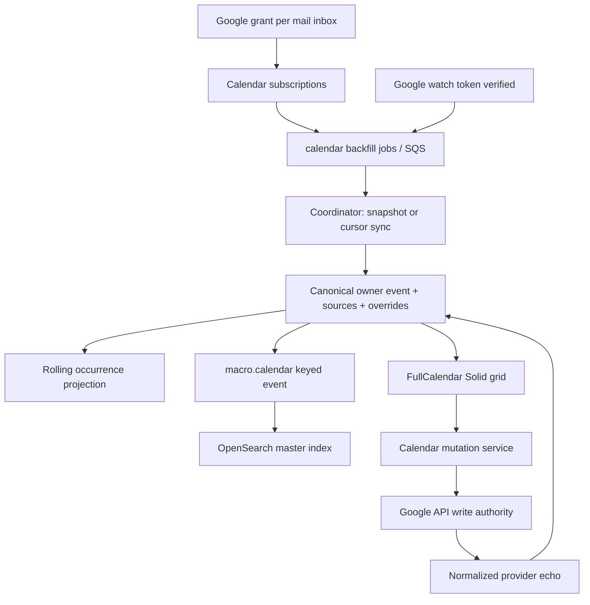

# 12. Calendar: entity domain и provider-authoritative writes

Решение: **EXTEND_ROX** существующие CalendarStore/account/merge contracts; **REIMPLEMENT** verified Google semantics; **ADAPTER** provider-neutral ports. Существующий ROX production factory возвращает только unavailable adapters — таблица потенциальных возможностей Google/Outlook не доказывает live sync [D070,D075]. Calendar развивает текущие Meetings/Tasks/Connections, а не добавляет iframe.

## 1. Macro model и authority

`CalendarEvent` — per-owner canonical UUID entity with `ical_uid`, title/description/location, event status/visibility/transparency, timed/all-day span, organizer/attendees, recurrence lines, reminders, conference URL/provider, source/read-only facts [D038]. `EventTime` separates absolute UTC instants with optional IANA timezone from all-day date range with exclusive end [D039]. `CalendarEventSource` сейчас Google-only: email ICS sources были удалены отдельной миграцией. Canonical persistence identity — `(owner_id, source_link_id, ical_uid)`, не один глобальный iCal UID; runtime upsert использует тот же key. Несколько календарных копий внутри connected inbox reconciled через sources, а разные inbox могут иметь разные canonical event IDs; query dedup не равен DB merge [D105,D106,D107]. `CalendarOccurrence` и override materialize recurrence window; occurrence ID/key не должен создавать новый “master event” при каждом drag.

Mutations **пишут в Google первой**, затем persist normalized echo через тот же upsert. Provider/local persistence split означает `PersistFailed` после удачного provider write; повтор create вслепую может создать дубликат/повторно пригласить attendees. Event publish в mutation service best-effort/log/drop, поэтому код не гарантирует transactional delivery каждому search consumer [D040]. ROX target требует stable mutation identity/reconciliation + transactional outbox для local state changes.

## 2. Capability matrix с фактами

| Capability | Macro actual support / limits | ROX gap / target |
|---|---|---|
| Accounts / calendars | Calendar permission per email inbox, subscription calendars, Google OAuth narrow events/list scopes [D038,D041] | Existing CalendarAccount → ProviderConnection; authenticated real adapters, not env flag |
| Create/update/delete | `CalendarMutationServiceImpl`; gateway mutations enabled only when sync enabled [D040,D041] | Canonical commands validate writable account/calendar and typed revision |
| Recurrence | RRULE/RDATE/EXDATE, override/occurrences; SDK scope and recurrenceId select series/instance [D038,D048] | Preserve master/occurrence identity, DST and exceptions; provider capability table |
| RSVP / attendees | Attendee status and self/organizer; SDK RSVP separate from general patch [D038,D048] | Principal inbox identity chosen explicitly; cannot RSVP as any attendee |
| Google Meet link | `ConferenceChange` supports generate Google Meet/remove/omit; preserve third-party when omitted [D038] | Conference adapter field not generic Call identity; link event to ROX Meeting/Call separately |
| Location / timezones | Full structured model and IANA metadata [D038,D039] | Retain provider time semantics, all-day exclusive end |
| Drag / resize | CalendarGrid `eventDrop`, `eventResize` routed to editor callbacks; selector creates range [D045] | React grid behavior with provider echo/rollback and recurrence scope dialog |
| Multi-calendar | Sources/query model and per-calendar mutation selector [D038,D048] | Native source toggles; account-scoped visibility and capability errors |
| Working hours | Local persisted availability prefs shared calendar/mail; sanitization [D047] | User preference, not remote Google working-hours API |
| Availability | Subtract timed busy intervals from work window; excludes canceled/transparent/declined; all-day not blocking in documented algorithm [D046] | Preserve or intentionally change tested semantics; no claim of server/team freebusy support |
| Out of office / working location | Current model includes out-of-office and grid merges working-location events [D038,D045] | Provider features surfaced only when actual adapter supports them |
| Search | Series master indexed with owner, source names/link, UID/attendees/properties; occurrence chosen at query time [D049] | Search returns master ref + optional occurrence anchor; ACL before snippet |
| Mentions | Domain mention previews shapes; requester ownership/source facts [D038] | Structured EntityMention with event ref and recurrence anchor |
| Agent / MCP | ListCalendars/ListCalendarEvents/Create/Update/Delete toolset and shared calendar mutation HTTP adapter [D050,D040] | Same domain API for user and agent, preview hash for attendee-generating write |
| Fetch by ID | SDK bare `CalendarEvent.byId` can mutate but reading fields throws because no fetch-by-id endpoint [D048] | Target `entity.get` resolves event and source authorization consistently |

## 3. Background processing, errors и events

Calendar read API обслуживает DSS, dedicated `calendar_service` hosts write authority; mutation routes dual-mounted root and `/calendar`. Backfill queue worker/coordinator claims persisted jobs. `calendar_outbox` schedules due sync, reaps wedged jobs, drains `calendar_sync_outbox` under `FOR UPDATE SKIP LOCKED`; crash after queue publish before commit causes repeated delivery; claims make it safe. Disabled sync retains unpublished jobs rather than silently pretending sync succeeded [D041,D042,D043]. Watch handler validates shared channel token and rearms sync; it is unauthenticated by normal user middleware, so provider proof is its boundary [D044]. Redis request gate/token refresh separates provider quota failures from denied/reauth cases [D084].

Actual events: `calendar_event.created`, `.updated`, `.deleted`, schema version 1 in `macro.calendar`, keyed by event ID. Unchanged upsert emits nothing; retiring one source can produce updated instead of deleted [D051]. Indexer rereads canonical row; if missing deletes stale search doc; only master indexed [D049]. Reminder dispatch is domain/job based, not a UI timeout; target persist due delivery intents and dedup per occurrence/recipient.

## 4. Target ROX calendar (proposal, Revision 2)

Extend `packages/core/src/calendar/{types,store,merge,adapters,capabilities}.ts` around canonical EntityRef and immutable ProviderBinding. Keep existing cursor/etag conflict handling and proposal bridge; move source-of-truth shared persistence from serialized CalendarBundle to workspace domain service. Bundle stays compatibility/local projection. Production adapter returns unavailable until verified connection succeeds; never use fixture as fallback [D075,D070].

New domain files: `packages/core/src/calendar/{event-model,commands,recurrence}.ts`; `packages/server-core/src/calendar/{service,repository,provider-journal,watch,reminders}.ts`; adapters `google.ts`, `microsoft.ts`, `caldav.ts`; React event grid/detail under existing meeting/calendar context with shared route/entity detail adapters. Connection consent/auth secrets live in main/server boundary, not renderer.

Target entities `Calendar`, `CalendarEvent`, `CalendarOccurrence` projection, `CalendarSourceBinding` unique `(connectionId,calendarId,providerEventId)`, `CalendarAttendee` addresses resolved to Contact/User without merging identities. Canonical entity exists once per chosen workspace import identity, provider copies retain source metadata and owner-specific visibility; automatic cross-user iCal UID merge is forbidden because invitation content/ACL can differ. Links to Project/Company/Contact/Task/Page/Meeting/Call do not duplicate event content or imply permission grants.

Queries provide window loading with materialized coverage and explicit `range_unavailable`, event get, sources, writable targets, mention preview. Commands track pending/provider-written/projected/reconciled/failed; cloud side effects do not span DB transaction. Offline drag is queued intent with etag + occurrence scope; on reconnect validate grants and conflict before external write. Concurrent edits unresolved by CRDT because provider calendar is authoritative.

Acceptance: create attendees → provider read-back matches; move/resize same recurrence occurrence → target master and exceptions correct; DST + all-day exclusive end retained; revoked calendar account removed from local/view/search/agent but other sources retained; duplicate watch/backfill deliveries no duplicate events; provider write succeeds/local persist fails → reconciler restores event without repeat invitation; native search and mention event open actual detail, not bare handle with exception.

Macro test artifacts: `calendar_events/src/domain/{service,mutations,invitations,models}/test.rs`, inbound mutation/toolset tests, Google adapter tests, SDK `event.test.ts`, calendar grid and availability tests. ROX CalendarStore fixtures prove local merge behavior only; no live provider runtime was exercised in this audit.

## Доказательства на зафиксированном HEAD

Ссылки `[Dxxx]` относятся к этому реестру; это статический аудит кода. Production credentials, реальные Gmail/LiveKit/Cloudflare окружения и Rust integration suites здесь не запускались. Наличие теста не означает, что тест прошёл.

| ID | Repository / commit SHA | File / symbol / lines | Подтверждаемое утверждение |
|---|---|---|---|
| D038 | `macro-inc/macro` · `c966b79d40798c6c726a3b15fe90517941fc6e61` | [crates/calendar_events/src/domain/models.rs](https://github.com/macro-inc/macro/blob/c966b79d40798c6c726a3b15fe90517941fc6e61/crates/calendar_events/src/domain/models.rs#L572-L648) · `CalendarEvent` · 572–648 | Per-owner canonical event with iCal UID, recurrence, attendees/conference and sources |
| D039 | `macro-inc/macro` · `c966b79d40798c6c726a3b15fe90517941fc6e61` | [crates/calendar_events/src/domain/models.rs](https://github.com/macro-inc/macro/blob/c966b79d40798c6c726a3b15fe90517941fc6e61/crates/calendar_events/src/domain/models.rs#L132-L198) · `EventTime` · 132–198 | Timed UTC with IANA zone or all-day inclusive start exclusive end |
| D040 | `macro-inc/macro` · `c966b79d40798c6c726a3b15fe90517941fc6e61` | [crates/calendar_events/src/domain/mutations.rs](https://github.com/macro-inc/macro/blob/c966b79d40798c6c726a3b15fe90517941fc6e61/crates/calendar_events/src/domain/mutations.rs#L36-L191) · `CalendarMutationServiceImpl` · 36–191 | Google provider-authoritative write then normalized local projection; event publish best effort |
| D041 | `macro-inc/macro` · `c966b79d40798c6c726a3b15fe90517941fc6e61` | [services/calendar_service/src/api.rs](https://github.com/macro-inc/macro/blob/c966b79d40798c6c726a3b15fe90517941fc6e61/services/calendar_service/src/api.rs#L63-L74) · `api_router` · 63–74 | Calendar mutation routes only mounted with calendar_sync_enabled |
| D042 | `macro-inc/macro` · `c966b79d40798c6c726a3b15fe90517941fc6e61` | [services/calendar_service/src/calendar_backfill.rs](https://github.com/macro-inc/macro/blob/c966b79d40798c6c726a3b15fe90517941fc6e61/services/calendar_service/src/calendar_backfill.rs#L126-L282) · `run_worker` · 126–282 | Calendar own queue worker/coordinator with claim and retry disposition |
| D043 | `macro-inc/macro` · `c966b79d40798c6c726a3b15fe90517941fc6e61` | [services/calendar_service/src/calendar_outbox.rs](https://github.com/macro-inc/macro/blob/c966b79d40798c6c726a3b15fe90517941fc6e61/services/calendar_service/src/calendar_outbox.rs#L27-L147) · `calendar outbox` · 27–147 | Outbox publication at least once; locks and SKIP LOCKED drain |
| D044 | `macro-inc/macro` · `c966b79d40798c6c726a3b15fe90517941fc6e61` | [services/calendar_service/src/api/calendar_watch.rs](https://github.com/macro-inc/macro/blob/c966b79d40798c6c726a3b15fe90517941fc6e61/services/calendar_service/src/api/calendar_watch.rs#L28-L68) · `calendar watch handler` · 28–68 | Google watch token checked then calendar sync rearmed |
| D045 | `macro-inc/macro` · `c966b79d40798c6c726a3b15fe90517941fc6e61` | [apps/web/src/features/calendar/components/CalendarGrid.tsx](https://github.com/macro-inc/macro/blob/c966b79d40798c6c726a3b15fe90517941fc6e61/apps/web/src/features/calendar/components/CalendarGrid.tsx#L261-L287) · `CalendarGrid eventDrop/eventResize` · 261–287 | Drag move and resize callbacks map into edit behavior |
| D046 | `macro-inc/macro` · `c966b79d40798c6c726a3b15fe90517941fc6e61` | [apps/web/src/features/calendar/availability/availability.ts](https://github.com/macro-inc/macro/blob/c966b79d40798c6c726a3b15fe90517941fc6e61/apps/web/src/features/calendar/availability/availability.ts#L165-L205) · `busyIntervalsFromOccurrences` · 165–205 | Availability computed from local occurrence busy intervals; excludes canceled transparent and declined |
| D047 | `macro-inc/macro` · `c966b79d40798c6c726a3b15fe90517941fc6e61` | [apps/web/src/features/calendar/availability/settings.ts](https://github.com/macro-inc/macro/blob/c966b79d40798c6c726a3b15fe90517941fc6e61/apps/web/src/features/calendar/availability/settings.ts#L19-L86) · `useAvailabilitySettings` · 19–86 | Working hours are local persisted sanitized preferences shared with email composer |
| D048 | `macro-inc/macro` · `c966b79d40798c6c726a3b15fe90517941fc6e61` | [packages/sdk/src/entities/calendar/event.ts](https://github.com/macro-inc/macro/blob/c966b79d40798c6c726a3b15fe90517941fc6e61/packages/sdk/src/entities/calendar/event.ts#L93-L196) · `CalendarEvent` · 93–196 | SDK byId mutations work but field read throws: no fetch-by-id endpoint |
| D049 | `macro-inc/macro` · `c966b79d40798c6c726a3b15fe90517941fc6e61` | [services/search_processing_service/src/process/calendar_event.rs](https://github.com/macro-inc/macro/blob/c966b79d40798c6c726a3b15fe90517941fc6e61/services/search_processing_service/src/process/calendar_event.rs#L37-L117) · `upsert_calendar_event` · 37–117 | Index series master only with owner/source/attendees properties; missing row removes |
| D050 | `macro-inc/macro` · `c966b79d40798c6c726a3b15fe90517941fc6e61` | [crates/calendar_events/src/inbound/toolset.rs](https://github.com/macro-inc/macro/blob/c966b79d40798c6c726a3b15fe90517941fc6e61/crates/calendar_events/src/inbound/toolset.rs#L17-L137) · `calendar toolset` · 17–137 | Calendar domain agent tools registration |
| D051 | `macro-inc/macro` · `c966b79d40798c6c726a3b15fe90517941fc6e61` | [crates/calendar_events/src/domain/events.rs](https://github.com/macro-inc/macro/blob/c966b79d40798c6c726a3b15fe90517941fc6e61/crates/calendar_events/src/domain/events.rs#L33-L82) · `CalendarTopicEvent` · 33–82 | macro.calendar created/updated/deleted stable entity key schema version 1 |
| D070 | `rox-one/rox-one` · `f63294ba4fffa7238b46b24e918925a313ad0b12` | [packages/core/src/calendar/adapters.ts](https://github.com/rox-one/rox-one/blob/f63294ba4fffa7238b46b24e918925a313ad0b12/packages/core/src/calendar/adapters.ts#L112-L124) · `createProductionAdapter` · 112–124 | ROX production calendar adapters unavailable; fixture never selected |
| D075 | `rox-one/rox-one` · `f63294ba4fffa7238b46b24e918925a313ad0b12` | [packages/core/src/calendar/store.ts](https://github.com/rox-one/rox-one/blob/f63294ba4fffa7238b46b24e918925a313ad0b12/packages/core/src/calendar/store.ts#L31-L177) · `CalendarStore` · 31–177 | Existing ROX bundle account event journal proposals plus cursor/etag conflicts |
| D084 | `macro-inc/macro` · `c966b79d40798c6c726a3b15fe90517941fc6e61` | [infra/stacks/calendar-service/index.ts](https://github.com/macro-inc/macro/blob/c966b79d40798c6c726a3b15fe90517941fc6e61/infra/stacks/calendar-service/index.ts#L62-L142) · `calendar infrastructure` · 62–142 | Calendar Redis request gate and ECS service depends on database secret |
| D105 | `macro-inc/macro` · `c966b79d40798c6c726a3b15fe90517941fc6e61` | [crates/macro_db_client/migrations/20260725014930_calendar_entities.sql](https://github.com/macro-inc/macro/blob/c966b79d40798c6c726a3b15fe90517941fc6e61/crates/macro_db_client/migrations/20260725014930_calendar_entities.sql#L87-L149) · `calendar_events schema` · 87–149 | Canonical event identity unique owner/source_link/ical_uid plus time checks |
| D106 | `macro-inc/macro` · `c966b79d40798c6c726a3b15fe90517941fc6e61` | [crates/calendar_events/src/outbound/pg.rs](https://github.com/macro-inc/macro/blob/c966b79d40798c6c726a3b15fe90517941fc6e61/crates/calendar_events/src/outbound/pg.rs#L753-L802) · `CalendarRepository upsert_event` · 753–802 | Event runtime uses owner/inbox-link/UID unique key |
| D107 | `macro-inc/macro` · `c966b79d40798c6c726a3b15fe90517941fc6e61` | [crates/macro_db_client/migrations/20260806202039_drop_email_ics_calendar_sources.up.sql](https://github.com/macro-inc/macro/blob/c966b79d40798c6c726a3b15fe90517941fc6e61/crates/macro_db_client/migrations/20260806202039_drop_email_ics_calendar_sources.up.sql#L1-L53) · `drop ICS sources migration` · 1–53 | Email ICS no longer calendar source; current source kind Google-only |
