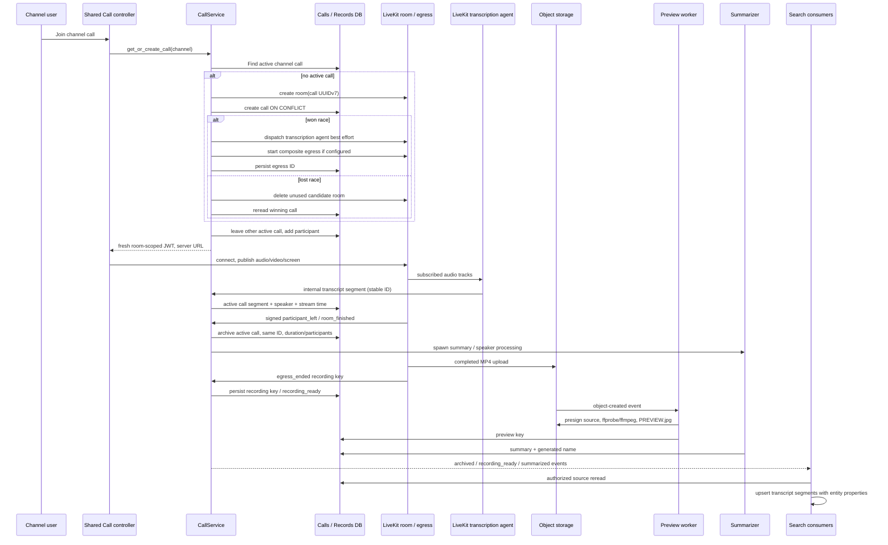

# 13. Calls / Meetings: RTC и сохраняемый контекст

Решение: **EXTEND_ROX** текущий Meetings catalog/local recording/Whisper; **ADAPTER** LiveKit RTC; **NEW_ROX_PRIMITIVE** provider-independent Call lifecycle and artifacts; **REIMPLEMENT** Macro service semantics. Media plane и background artifacts отдельны от workspace domain authority. Service extraction of Macro code remains `LICENSE_REVIEW_REQUIRED` до решения по AGPL.

## 1. Что действительно реализовано в Macro

| Layer | Actual mechanism |
|---|---|
| Frontend | `features/channel/Call/CallContext.tsx`, CallSessionController, LivekitJsCallController, shared lifecycle, channels calls, meeting-session provider, guest/invitation route; Solid stores [D065] |
| Media | LiveKit room client, publish/subscribe/data token, local mic/camera/screen sharing controls [D053,D065] |
| Domain | `CallServiceImpl` creates active call, participant records, meeting invitations/guests, archives, edits/shares/deletes; separate query service [D052,D054,D063] |
| Persistence | PostgreSQL active `calls` + archived `call_records`, participants/guests/transcript/share rows; same call UUID throughout [D052,D054,D060] |
| Transport | Protected call routes; signed LiveKit webhook; internal transcript route secret; connection gateway events and APNS/VoIP notifications [D052,D054,D089] |
| Recording | Optional configured composite egress → S3; webhooks persist recording key; signed URLs through S3 local or CloudFront production [D052,D054,D067] |
| STT | Dispatched LiveKit Python agent per room; Deepgram `nova-3`; Resemblyzer voice clustering; stable segment UUIDv5; bounded API retries [D056,D089] |
| Summary | Optional AI summarizer; finalized transcript → custom speaker labels → summary → generated call name; persisted event [D057,D091] |
| Preview | S3 object event Lambda → ffprobe duration → ffmpeg midpoint/start JPEG → S3 PREVIEW.jpg and DB preview key [D058,D059,D086] |
| Search / agent | Call SDK favoritable/searchable, read-call tool; transcript segments OpenSearch parent/child with participants/properties; empty transcripts skip indexing [D060,D061] |

Call crate hosted в DSS; main wires `CallServiceImpl` с LiveKit, entity access, notification ingress, optional recording storage и `AiCallSummarizer`. Initial SQL отделяет active/archive + participants/transcripts; новые shareable calls добавляют guest rows и call_meetings [D104,D108,D109].

Important limits: media startup may succeed when egress or STT dispatch fails (best-effort); summary is optional and empty transcript skips. Current indexer returns immediately when no transcript segments, so searchable call metadata for zero-transcript calls is not guaranteed [D052,D057,D061]. Target feature completeness must show artifact-specific failed/unavailable state, not label all ended calls fully processed.

## 2. Точный lifecycle из кода

Source chain [D052,D053,D054,D055,D056,D057,D058,D059,D061,D064]. Recording/STT/summary are independent parallel paths; diagram does **not** imply MP4 → transcript. Current STT subscribes realtime audio and posts segments, ffmpeg makes preview. Egress webhook can arrive after archive; code persists key on active or archived row. Media API boundaries validate grants separately from media token issuance.

Room creation race: candidate room keyed by call UUID; database conflict rereads winning call and deletes unused room. User active-call switch plus DB uniqueness rejects concurrent active participant collision. Fresh join tokens support another device/reconnect; six-hour TTL code explicitly leaves refresh >6h as TODO [D052,D053]. Never reuse channel ID as permanent room grant.

`PgCallRepo.archive_session` выполняет атомарную SQL transaction: lock active call, same-ID call_record, canonical team share, lifetime participants/guests, transcript rollup, delete live row и commit. Rollup объединяет consecutive same speaker/diarized/voice при gap ≤5s через STRING_AGG и MIN(segment_id). Это меняет granularity source evidence; target должен сохранять immutable original segment/revision и делать rollup как derived read model, чтобы ROX EvidenceSpan не терял исходные ссылки [D110].

Signed webhooks reconcile participant/guest states and archive on room finished safety-net. Stale-call sweeper is additional recovery. Summary launched через `tokio::spawn`; ошибка приводит к log/return. Это не durable job с retry после service restart [D054,D091]. STT three transient retries then logs/drop lacks durable per-segment delivery queue [D089]. Target must close both gaps.

## 3. Authorization, guest and archive sharing

LiveKit JWT room scoped, authenticated identity Macro user, guest identity typed GuestId/display name. Guest join использует bearer `MeetingToken`; channel invitation не даёт входа гостю без аккаунта (`Sign in to join this call`). Для non-channel meeting possession invitation token — отдельная capability [D063]. Calls entity access resolves canonical `entity_access` + `SharePermission` public/team/direct sources. Archived creator-team sharing has view grants and distinct live pending toggle [D053,D063,D062,D060].

`CallTopicEvent`: `call.started`, `call.record_archived`, `call.record_updated`, `call.record_deleted`, `call.record_summarized`, `call.recording_ready`; payloads exclude transcript/summary/private recording locations and permission objects. Consumers retrieve protected content through authorized source APIs [D064]. Source live `call_ended` socket event is not same schema as durable archived event; target distinguishes ephemeral presence/UI from canonical domain outcomes.

Signed asset URLs are time-limited access tokens; permission revoke cannot revoke an already issued URL instantly. Target short TTL + asset gateway authorization/lease, recordings private by default, grant expiry and recorded audit. Revoke while open must remove media participant, block refresh/mint, stop private artifact stream and invalidate context cache; room JWT existence is never an ACL source.

## 4. Existing ROX Meetings

`packages/core/src/meetings/model.ts` explicitly defines Meeting as `call` specialization, workspace/entity IDs/revisions and sourceBinding. It has transcript evidence spans and approval/proposal/operation receipt lifecycle [D073]. Keep it; adding unrelated `MacroMeeting` loses native task/note workflows.

`LocalMeetingStore` actually finalizes MediaRecorder chunks, remuxes/probes audio, persists meeting JSON/audio/transcript JSON+Markdown, queues Whisper, recovers interrupted recording and transcription. Existing ASR can stay offline [D071]. Shared `meetings/rooms.ts` `ROOM_PROVIDER_DECISION` null; `joinRoom` fail-closed and `roomCapabilityEnabled()` false, so no existing native multiuser SFU implementation is claimed [D072].

| ROX file | Concrete integration change |
|---|---|
| `packages/core/src/meetings/model.ts` | Extend one Call/Meeting identity with participant/room/artifact refs; preserve revisions/evidence/proposals |
| `packages/server-core/src/meetings/rooms.ts` | Replace unavailable implementation behind `RtcProvider` adapter; explicit policy/principal/guest consent + call ID; no second room user namespace |
| `packages/server-core/src/meetings/catalog.ts` / `journal.ts` | Canonical domain query adapter and migration from local journal IDs; persistent shared call catalog |
| `apps/electron/src/main/meetings/local-store.ts` | Register local recording/file/transcript as shared artifact refs; offline upload outbox + artifact state; preserve recovery |
| `apps/electron/src/main/meetings/local-asr.ts` | Keep local STT as `TranscriptionProvider`; batch mode differs from realtime subscription |
| `packages/server-core/src/handlers/rpc/meetings.ts` | Typed call/meeting commands through same domain authority/principal; update live room capability gating |
| `apps/electron/src/renderer/pages/meetings/LocalMeetingDetail.tsx` | Render one entity detail for local capture and live call archive; artifact-specific status/error/links |
| New `packages/core/src/calls/{models,commands,rtc-provider}.ts` | Call lifecycle plus room/participants/consent/recording/transcript contract |
| New `packages/server-core/src/calls/{service,repository,webhooks,reconciler}.ts` | Workspace transaction/outbox and authoritative lifecycle |
| New `services/rox-media-worker/{recording,transcription,preview,summary}` | Independent idempotent artifact jobs; implementation/runtime stack chosen by job needs |

## 5. Use / rewrite / extract / replacement decisions

| Part | Decision | Reason |
|---|---|---|
| LiveKit independent SDK/server | DEPENDENCY_ONLY / ADAPTER | Use separately licensed upstream dependencies after package license check; media semantics reusable |
| Macro React? | REIMPLEMENT | Macro components Solid + package aliases/native callkit/state; recreate interaction in ROX React, no second framework |
| Headless lifecycle/identity behavior | BEHAVIOR_REIMPLEMENTATION | Adopt state-machine/race invariants from audit; literal source adapter license review required |
| Macro Rust call service | LICENSE_REVIEW_REQUIRED | AGPL code embedded ports/DB/access/notification stack; extracting does not eliminate license obligations |
| Egress / STT / preview / summary | PORT_SERVICE architectural pattern; implementation REIMPLEMENT | Isolated job contracts support scaling/retry independent of UI/domain runtime |
| S3 / CloudFront / Lambda | REPLACE_INFRA | S3-compatible object store/private asset gateway and container ffmpeg workers |
| Deepgram / Apollo AI | ADAPTER | Local Whisper supported for ROX; STT quality/diarization/latency must be evaluated independently |
| Cloud RTC | ADAPTER | LiveKit self-hosted with TURN/STUN/egress orchestration is target option; hosted service is deployment option |

## 6. Revision 2 lifecycle and failure invariants

Call lifecycle `provisioning → active → ending → archived`, with terminal failed/cancelled; recording/transcript/summary have **separate** queued/running/ready/failed/unavailable states. Archive commit must not wait for postprocessing and postprocessing failure must not undo ended call. All artifact jobs stable `(callId,artifactKind,inputRevision)` idempotency key, own retry/DLQ, monotonic artifact revision, deletion tombstone check before publish. Transcript segment dedup stable ID and provider stream epoch; late segments after archive accepted through authorized artifact ingestion until finalization cutoff, not discarded solely because active row disappeared.

Consent records are participant-scoped policy facts with version/time; raw voice embeddings optional sensitive artifacts, not required to enable calls. Guests use common principal guest type and cannot access full workspace. A call can link Channel/CalendarEvent/Project/Company but inherit permissions only via explicit policy, not every graph neighbor. Summary cites transcript segment/revision; one agent tool reads both local/offline and shared/live call context.

Acceptance: two users join channel audio/video/screen; join race one active room; reconnect restores same call; guest denied for private invitation; revoke participant removes media and content access; webhook duplicate/out-of-order end produces one archive; room service crashes then sweeper recovers; egress storage failure shown independently; STT outage resumes/replays without duplicate segments; summary workers restart and finish; zero-transcript archive searchable by title; call entity offers participants/duration/private recording/transcript/summary and CompanyContext joins.

Tests artifacts: Macro call domain service/lifecycle/meeting access/reconcile tests, LiveKit adapter tests, `services/transcription/test_transcriber.py`, ffmpeg/key tests, frontend `tests/livekit-js-call-controller.test.ts`, `call-session-controller.test.ts`, `native-call-lifecycle.test.ts`. ROX local-store/capture/RPC finalization suites verify existing mechanisms when run. This audit read code and test files; no actual RTC call or recording runtime was exercised.

## Доказательства на зафиксированном HEAD

Ссылки `[Dxxx]` относятся к этому реестру; это статический аудит кода. Production credentials, реальные Gmail/LiveKit/Cloudflare окружения и Rust integration suites здесь не запускались. Наличие теста не означает, что тест прошёл.

| ID | Repository / commit SHA | File / symbol / lines | Подтверждаемое утверждение |
|---|---|---|---|
| D052 | `macro-inc/macro` · `c966b79d40798c6c726a3b15fe90517941fc6e61` | [crates/call/src/domain/service.rs](https://github.com/macro-inc/macro/blob/c966b79d40798c6c726a3b15fe90517941fc6e61/crates/call/src/domain/service.rs#L734-L842) · `get_or_create_call` · 734–842 | UUIDv7 room, race-safe call creation, transcription dispatch and optional egress |
| D053 | `macro-inc/macro` · `c966b79d40798c6c726a3b15fe90517941fc6e61` | [crates/call/src/outbound/livekit_rtc_client.rs](https://github.com/macro-inc/macro/blob/c966b79d40798c6c726a3b15fe90517941fc6e61/crates/call/src/outbound/livekit_rtc_client.rs#L148-L192) · `generate_token / generate_guest_token` · 148–192 | LiveKit token TTL six hours room scoped publish subscribe data |
| D054 | `macro-inc/macro` · `c966b79d40798c6c726a3b15fe90517941fc6e61` | [crates/call/src/domain/service.rs](https://github.com/macro-inc/macro/blob/c966b79d40798c6c726a3b15fe90517941fc6e61/crates/call/src/domain/service.rs#L1134-L1361) · `process_webhook_event` · 1134–1361 | Signed webhook archives and reconciles participants; egress recording lifecycle |
| D055 | `macro-inc/macro` · `c966b79d40798c6c726a3b15fe90517941fc6e61` | [crates/call/src/domain/service.rs](https://github.com/macro-inc/macro/blob/c966b79d40798c6c726a3b15fe90517941fc6e61/crates/call/src/domain/service.rs#L1500-L1561) · `ingest_transcript_segment` · 1500–1561 | Accepts segments only active call, handles guests and stream recording time |
| D056 | `macro-inc/macro` · `c966b79d40798c6c726a3b15fe90517941fc6e61` | [services/transcription/transcriber.py](https://github.com/macro-inc/macro/blob/c966b79d40798c6c726a3b15fe90517941fc6e61/services/transcription/transcriber.py#L149-L202) · `Transcriber` · 149–202 | LiveKit per-track Deepgram nova-3 with voice clustering and segment delivery |
| D057 | `macro-inc/macro` · `c966b79d40798c6c726a3b15fe90517941fc6e61` | [crates/call/src/domain/service.rs](https://github.com/macro-inc/macro/blob/c966b79d40798c6c726a3b15fe90517941fc6e61/crates/call/src/domain/service.rs#L1785-L1862) · `summarize_call` · 1785–1862 | Summary configurable; empty transcript skips; custom speaker/name then persisted summary event |
| D058 | `macro-inc/macro` · `c966b79d40798c6c726a3b15fe90517941fc6e61` | [services/call_recording_preview_handler/src/event.rs](https://github.com/macro-inc/macro/blob/c966b79d40798c6c726a3b15fe90517941fc6e61/services/call_recording_preview_handler/src/event.rs#L116-L197) · `process_record` · 116–197 | Object event presigns MP4, generates JPG, uploads and patches DB |
| D059 | `macro-inc/macro` · `c966b79d40798c6c726a3b15fe90517941fc6e61` | [services/call_recording_preview_handler/src/ffmpeg.rs](https://github.com/macro-inc/macro/blob/c966b79d40798c6c726a3b15fe90517941fc6e61/services/call_recording_preview_handler/src/ffmpeg.rs#L29-L153) · `FfmpegTools.create_preview_jpeg` · 29–153 | ffprobe midpoint frame and start fallback; per command timeout |
| D060 | `macro-inc/macro` · `c966b79d40798c6c726a3b15fe90517941fc6e61` | [packages/sdk/src/entities/calls/call-record.ts](https://github.com/macro-inc/macro/blob/c966b79d40798c6c726a3b15fe90517941fc6e61/packages/sdk/src/entities/calls/call-record.ts#L12-L136) · `CallRecord` · 12–136 | Calls first-class favoritable/searchable SDK entity recording transcript summary participants and guests |
| D061 | `macro-inc/macro` · `c966b79d40798c6c726a3b15fe90517941fc6e61` | [services/search_processing_service/src/process/call.rs](https://github.com/macro-inc/macro/blob/c966b79d40798c6c726a3b15fe90517941fc6e61/services/search_processing_service/src/process/call.rs#L13-L103) · `process_call_record` · 13–103 | Call search requires transcript segments; parent properties and participant IDs indexed |
| D062 | `macro-inc/macro` · `c966b79d40798c6c726a3b15fe90517941fc6e61` | [crates/entity_access/src/outbound/pg_access_repo/queries/call_access.rs](https://github.com/macro-inc/macro/blob/c966b79d40798c6c726a3b15fe90517941fc6e61/crates/entity_access/src/outbound/pg_access_repo/queries/call_access.rs#L18-L116) · `get_call_access` · 18–116 | Calls share canonical entity grants/public/team SharePermission |
| D063 | `macro-inc/macro` · `c966b79d40798c6c726a3b15fe90517941fc6e61` | [crates/call/src/domain/service/meetings.rs](https://github.com/macro-inc/macro/blob/c966b79d40798c6c726a3b15fe90517941fc6e61/crates/call/src/domain/service/meetings.rs#L250-L296) · `join_guest_invitation` · 250–296 | Guest meeting join uses bearer invitation capability; channel guest joins denied; scoped guest JWT |
| D064 | `macro-inc/macro` · `c966b79d40798c6c726a3b15fe90517941fc6e61` | [crates/call/src/domain/events.rs](https://github.com/macro-inc/macro/blob/c966b79d40798c6c726a3b15fe90517941fc6e61/crates/call/src/domain/events.rs#L114-L169) · `CallTopicEvent` · 114–169 | Macro calls started archived updated deleted summarized recording-ready taxonomy |
| D065 | `macro-inc/macro` · `c966b79d40798c6c726a3b15fe90517941fc6e61` | [apps/web/src/features/channel/Call/CallContext.tsx](https://github.com/macro-inc/macro/blob/c966b79d40798c6c726a3b15fe90517941fc6e61/apps/web/src/features/channel/Call/CallContext.tsx#L1485-L1510) · `CallContext.toggleScreenShare` · 1485–1510 | LiveKit local participant media APIs and shared call state |
| D066 | `macro-inc/macro` · `c966b79d40798c6c726a3b15fe90517941fc6e61` | [infra/stacks/call-recording/index.ts](https://github.com/macro-inc/macro/blob/c966b79d40798c6c726a3b15fe90517941fc6e61/infra/stacks/call-recording/index.ts#L20-L50) · `callRecordingBucket` · 20–50 | S3 recording bucket with service user Secrets Manager and CloudFront/preview infrastructure |
| D067 | `macro-inc/macro` · `c966b79d40798c6c726a3b15fe90517941fc6e61` | [crates/call/src/outbound/s3_recording_storage.rs](https://github.com/macro-inc/macro/blob/c966b79d40798c6c726a3b15fe90517941fc6e61/crates/call/src/outbound/s3_recording_storage.rs#L111-L133) · `S3RecordingStorage.presign_recording_url` · 111–133 | Local S3 and prod signed CDN URL adapter |
| D071 | `rox-one/rox-one` · `f63294ba4fffa7238b46b24e918925a313ad0b12` | [apps/electron/src/main/meetings/local-store.ts](https://github.com/rox-one/rox-one/blob/f63294ba4fffa7238b46b24e918925a313ad0b12/apps/electron/src/main/meetings/local-store.ts#L188-L259) · `LocalMeetingStore finalization/recovery` · 188–259 | ROX real local audio finalize, ASR enqueue, crash recovery |
| D072 | `rox-one/rox-one` · `f63294ba4fffa7238b46b24e918925a313ad0b12` | [packages/server-core/src/meetings/rooms.ts](https://github.com/rox-one/rox-one/blob/f63294ba4fffa7238b46b24e918925a313ad0b12/packages/server-core/src/meetings/rooms.ts#L12-L43) · `ROOM_PROVIDER_DECISION / joinRoom` · 12–43 | ROX live rooms provider null, fail-closed capability false |
| D073 | `rox-one/rox-one` · `f63294ba4fffa7238b46b24e918925a313ad0b12` | [packages/core/src/meetings/model.ts](https://github.com/rox-one/rox-one/blob/f63294ba4fffa7238b46b24e918925a313ad0b12/packages/core/src/meetings/model.ts#L102-L125) · `Meeting` · 102–125 | ROX meeting workspace/call specialization with sourceBinding revision |
| D086 | `macro-inc/macro` · `c966b79d40798c6c726a3b15fe90517941fc6e61` | [infra/stacks/call-recording/call-recording-preview-lambda.ts](https://github.com/macro-inc/macro/blob/c966b79d40798c6c726a3b15fe90517941fc6e61/infra/stacks/call-recording/call-recording-preview-lambda.ts#L50-L139) · `CallRecordingPreviewLambda` · 50–139 | Lambda provided.al2023 ffmpeg layer and S3 permissions |
| D089 | `macro-inc/macro` · `c966b79d40798c6c726a3b15fe90517941fc6e61` | [services/transcription/transcriber.py](https://github.com/macro-inc/macro/blob/c966b79d40798c6c726a3b15fe90517941fc6e61/services/transcription/transcriber.py#L465-L495) · `Transcriber.on_user_turn_completed` · 465–495 | Segment UUIDv5 plus bounded HTTP retries, internal-call token; not durable transcript queue |
| D091 | `macro-inc/macro` · `c966b79d40798c6c726a3b15fe90517941fc6e61` | [crates/call/src/domain/service.rs](https://github.com/macro-inc/macro/blob/c966b79d40798c6c726a3b15fe90517941fc6e61/crates/call/src/domain/service.rs#L1908-L1995) · `spawn_summarize_call` · 1908–1995 | Summary launched in tokio task; no durable retry; process-lifetime risk |
| D104 | `macro-inc/macro` · `c966b79d40798c6c726a3b15fe90517941fc6e61` | [services/document_storage_service/src/main.rs](https://github.com/macro-inc/macro/blob/c966b79d40798c6c726a3b15fe90517941fc6e61/services/document_storage_service/src/main.rs#L677-L702) · `main call wiring` · 677–702 | DSS wires LiveKit CallService plus AiCallSummarizer and optional egress |
| D108 | `macro-inc/macro` · `c966b79d40798c6c726a3b15fe90517941fc6e61` | [crates/macro_db_client/migrations/20260331170640_add_call_tables.sql](https://github.com/macro-inc/macro/blob/c966b79d40798c6c726a3b15fe90517941fc6e61/crates/macro_db_client/migrations/20260331170640_add_call_tables.sql#L3-L74) · `calls / call_records initial schema` · 3–74 | Active calls separate archived records and participants/transcript tables |
| D109 | `macro-inc/macro` · `c966b79d40798c6c726a3b15fe90517941fc6e61` | [crates/macro_db_client/migrations/20260918183729_shareable_calls.sql](https://github.com/macro-inc/macro/blob/c966b79d40798c6c726a3b15fe90517941fc6e61/crates/macro_db_client/migrations/20260918183729_shareable_calls.sql#L8-L47) · `shareable calls schema` · 8–47 | Guest active/archive rows and bearer call_meetings table; channel nullable |
| D110 | `macro-inc/macro` · `c966b79d40798c6c726a3b15fe90517941fc6e61` | [crates/call/src/outbound/pg_call_repo/lifecycle.rs](https://github.com/macro-inc/macro/blob/c966b79d40798c6c726a3b15fe90517941fc6e61/crates/call/src/outbound/pg_call_repo/lifecycle.rs#L7-L229) · `PgCallRepo.archive_session` · 7–229 | Atomic same-ID archive copies participants/guests, rolls adjacent transcript segments with MIN(segment_id), deletes live rows |
