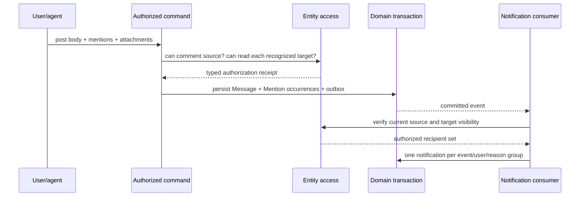

# 14-permissions-sharing.md

Срез исходников: Macro `c966b79d40798c6c726a3b15fe90517941fc6e61`; ROX `f63294ba4fffa7238b46b24e918925a313ad0b12`. «Реализовано» ниже означает обнаруженный исполняемый путь в этом commit, не доказательство работы production. Предложения ROX помечены как целевой контракт. Анализ выполнен по коду; тесты перечислены как найденные артефакты, если не указано отдельное исполнение.

## Macro: общий authorization boundary с разными policies

`entity_access` — реальный общий service, не один universal role enum. AccessRepository uses document/chat/project/email-thread/call/calendar/agent-session/initiative queries. Channels use participant role or view-only permission; CRM derives owning team and team role. Typed `EntityAccessReceipt
` carries evidence into domain use cases. Authentication and entity authorization separate: `macro_authorization` verifies user/bot/harness/API credential; `entity_access` resolves action on target. [C22,C38,C39]

| Entity | Реальная authority | Условие и важная особенность |
|---|---|---|
| Document/Task | Document access level / share grants [C34,C39] | task inherits document ACL; comment permission must not mean body edit in target |
| Initiative/UI Project | owner, members, SharePermissionV2 [C37] | description document has own id; sharing must align without duplicate mutable authority |
| Legacy Project / AI Chat | optimized access query [C39] | do not confuse with Initiative/human Channel |
| Channel / DM / group | participant Owner/Admin/Member or ViewOnly [C38] | read, post, moderate, invite are separate actions |
| CRMCompany / CRMContact | owning team + role [C38,C39] | hidden-row visibility uses admin/owner team role, not highest item access |
| EmailThread | dedicated repository access [C39] | provider account ownership is not automatically workspace-public |
| Call / archived CallRecord | dedicated call query + channel relationship [C39] | guest media token differs from entity read/share grant |
| CalendarEvent | optimized access; reference reshare only with edit path [C30,C39] | view acquired via earlier share cannot widen it |
| AgentSession | direct plus inherited document access [C39] | reference sharing owner-only and grants View; no execution control [C30] |
| Message/thread | MessageParent permission receipt [C20,C22] | post requires comment/member; content recipients rechecked [C27] |
| Static image/video | authenticated UUID-holder exception in reference check [C24] | unsafe to generalize to private ROX attachments |
| Surface collab session | kind-scoped JWT + lifecycle/expiry [C11,C13] | legacy document branch skips Surface revoke validation |

Generic bot has scoped `User` or `Team` authority; receipts distinguish channel autonomous webhook from acting-user/team invocation. Target agents cannot receive ambient service-admin access merely because user enabled MCP. [C38]

## Mentions are cross-product infrastructure

Macro `MessageReferenceKind` normalizes user/bot/document/channel/thread aliases/call/calendar/chat/agent session/project/company/contact/automation; `validate_references` checks `can_view` for recognized entity references, while display chips, bot/user identities, automation and static media take special paths. Parsing a mention never grants view permission. Group expansion belongs to channel context. [C24,C51]

Reference sharing is distinct from author permission: `grant_level` restricts agent sessions to owner→View; calendar owner/edit may share View. Discussion delivery has explicit grant port and must recheck link share before persistent widening. Current access gates recipients separately. This means Macro mentions are more than autocomplete, but they are not already a safe arbitrary N×N linking policy. [C27,C30]

Target always stores `MentionOccurrence {sourceRef,sourceRevision,targetRef,actorId,offsetOrNodeAnchor,recipientPolicy}`; `EntityLink` is durable relation, and `PermissionGrant` is a separate explicit state change. A link/mention must never implicitly expose title/body of a denied target. User mention can notify only if source is readable; product may offer explicit share intent, but server must authorize that share independently.

## ROX existing policies and target

ROX `permissions-config.ts` defines Safe Mode/additive tool execution rules. `PageActionGrant` protects privileged source actions for artifact pages, and Bro collaboration exists as its own session subsystem. These are real controls but not interchangeable with document/customer/workspace ACL. Existing source/tool grants remain execution safety gates above common entity authorization. [R01,R07,R09]

Target common primitive: `PermissionGrant {workspaceId,resourceRef,subject:{principal|group|workspaceRole|publicLink},actions,source:'direct'|'container'|'link',expiresAt?,version}`. Owner/creator are metadata, never two independent identity domains. Resource action vocabulary includes read/comment/edit/manage/share/invite/execute; role bundles map to actions per entity policy adapter. Container inheritance only through declared `inheritsPermissionsFrom`, never every arbitrary EntityLink.

### Revision 2 invariants

1. Identity: immutable principal ID independent of email and provider account; alias mappings have uniqueness and tenant scope.
2. One authorization service obtains current policy at command/query boundary; no client ACL decision is authoritative. Typed grants scoped to resource, action, actor, ACL epoch and expiry.
3. Search initially filters candidate ACL, then rechecks current access before title/snippet/result returns. Memory citations and agent context use same recheck.
4. Realtime subscription membership is candidate routing only; outbound recipient list excludes revoked/expired principals before payload serialization.
5. ACL revoke is synchronous command → epoch increment → session eviction. Index/notification/memory cleanup is durable asynchronous projection; it cannot postpone denial.
6. Offline editing may preserve a local draft; revoked bytes cannot merge, sync or become searchable. UI provides export only, after current identity/tenant validation.
7. Guest call join token is narrow media access; recording/transcript read is separate permission on Call entity.
8. Attachment/object URL is signed and short-lived after parent grant; no public UUID possession rule.
9. Workspace-admin operations audited with reason; execution control of agent session requires explicit execute/manage policy.

### Files to change / add

Existing `packages/shared/src/agent/{permissions-config,knowledge-permissions}.ts`, `packages/server-core/src/sessions/permission-broker-gate.ts`: retain execution safety, add DomainAuthorizationContext in agent entity commands. Existing `packages/server-core/src/handlers/rpc/{pages,projects,personal-tasks,meetings}.ts` must resolve verified `_ctx` actor/workspace instead of trusting IDs supplied by client. Existing Bro invite/presence service becomes adapter to canonical principal/membership as verified in its own audit.

New `packages/core/src/authorization/{actions,grant,receipt}.ts`, `packages/server-core/src/authorization/{service,policy-registry,grant-repository,revocation}.ts`. Domain services accept authorized context, not boolean `isAdmin`. Provider secrets never appear in EntityRecord/search/MCP response.

### Negative acceptance suite

Cross-workspace forged EntityRef; stale grant after revocation; mention target the author cannot read; unauthorized recipient push body; leaked Company title via Task backlink; agent acting-user spoof; helper method without required receipt; public-link grant expiry; inherited project grant removed; unknown resource type fail-closed; guest attempting transcript download; privileged tool permitted by Safe Mode but denied by entity ACL. All must reject without persistence or content leakage. Include revocation during server await and multi-device reconnect.

Macro unit evidence: `crates/entity_access/src/domain/{models,service}/test.rs`, `crates/macro_authorization/src/domain/{bot_authorizer,harness_authorizer,user_api_key_authorizer}/test.rs`, `crates/channels/src/domain/reference_sharing/test.rs`, `crates/messages/src/domain/{delivery,notification}/test.rs`, sync Surface auth/revocation tests. These are not an external security certification.

## Revision 2: существующий ROX2 contract — единственная typed seam

ROX уже имеет `Rox2EntityRef`, `Rox2Relation`, `Rox2Event`, `Rox2Context`, `Rox2Status` в `packages/core/src/rox2/platform-contract.ts`. `Rox2EntityRef` хранит `workspaceId`, `entityId` (`kind:id`), `revisionId?`, `accountNamespace?`. В этой главе `EntityRef` — краткий alias **существующего Rox2EntityRef**, не новый независимый тип `{type,id}` и не второе хранилище. Новые entity kinds, relation kinds и action policies расширяют этот файл и его adapters. [R10,R11]

`Rox2Relation` пока содержит `fromId/toId/kind`; добавить scoped endpoints, relation id, actor/source/revision и разрешённые kinds как versioned backward-compatible extension. `Rox2Event` уже имеет causation/correlation/aggregateRevision; новые domain envelopes расширяют его versioned contract с workspace/command/schema/source revision. Не создавать параллельный EventBus или несвязанный notification engine. Typed contract не выполняет I/O и не доказывает существующую distributed authorization. [R10]

Состояние command должно сохранять `executionMode × lifecycle × verification`: `awaiting_review` соответствует live/waiting_approval/unverified; provider_pending — live/queued или running/unverified; database commit — live/succeeded/receipt_verified; provider read-back отдельно повышает verification. Дополнительный `domainOutcome` не заменяет эту triad и не возвращает success для pending. Общая relational authority collaborative workspace — модульный Postgres domain store; local standalone stores остаются adapter/local projection/outbox с явным authority mode. [R10; target]

## Существующий Bro runtime: точная граница reuse

`BroInviteStore` хранит invitations и presence в process-local Map; `revoke` отмечает invitation.revokedAt, а `listPresence` возвращает сохранённый массив. Revoke не удаляет уже вступившего пользователя из presence и не является distributed document ACL revocation. Сохранить server-resolved account identity/UX «Позвать Бро», расширить store durable membership и grant/session eviction; не считать session avatar доказательством heartbeat/cursor/edit synchronization. [R12,R14]

## Доказательства

| ID | Repository / commit | File / symbol / lines | Подтверждаемый факт |
|---|---|---|---|
| C11 | `macro-inc/macro@c966b79d40798c6c726a3b15fe90517941fc6e61` | [services/sync-service/src/auth.rs:10–29](https://github.com/macro-inc/macro/blob/c966b79d40798c6c726a3b15fe90517941fc6e61/services/sync-service/src/auth.rs#L10-L29), `AccessLevel.can_edit_for / socket_access / document_access` | Document sockets permit Comment writes while Surface sockets require Edit. |
| C13 | `macro-inc/macro@c966b79d40798c6c726a3b15fe90517941fc6e61` | [services/sync-service/src/durable_object/surface_api.rs:238–311](https://github.com/macro-inc/macro/blob/c966b79d40798c6c726a3b15fe90517941fc6e61/services/sync-service/src/durable_object/surface_api.rs#L238-L311), `revoke_surface / validate_surface_sockets / active_websockets` | Surface revocation closes sockets 1008; validation skips legacy document sessions. |
| C20 | `macro-inc/macro@c966b79d40798c6c726a3b15fe90517941fc6e61` | [crates/messages/src/domain/models.rs:38–159](https://github.com/macro-inc/macro/blob/c966b79d40798c6c726a3b15fe90517941fc6e61/crates/messages/src/domain/models.rs#L38-L159), `MessageParent / ThreadAnchor` | Messages share channel, document, initiative and CRM parents plus Markdown/PDF/spreadsheet anchors. |
| C22 | `macro-inc/macro@c966b79d40798c6c726a3b15fe90517941fc6e61` | [crates/messages/src/domain/service.rs:13–31](https://github.com/macro-inc/macro/blob/c966b79d40798c6c726a3b15fe90517941fc6e61/crates/messages/src/domain/service.rs#L13-L31), `MessageView / MessageWrite / MessageService.post` | Common service requires parent view or comment/channel-member receipt. |
| C24 | `macro-inc/macro@c966b79d40798c6c726a3b15fe90517941fc6e61` | [crates/messages/src/domain/service.rs:580–657](https://github.com/macro-inc/macro/blob/c966b79d40798c6c726a3b15fe90517941fc6e61/crates/messages/src/domain/service.rs#L580-L657), `validate_references` | Known entity references require view access; display chips, automation and static media have exceptions. |
| C27 | `macro-inc/macro@c966b79d40798c6c726a3b15fe90517941fc6e61` | [crates/messages/src/domain/delivery.rs:45–103](https://github.com/macro-inc/macro/blob/c966b79d40798c6c726a3b15fe90517941fc6e61/crates/messages/src/domain/delivery.rs#L45-L103), `MessageAudienceAccess / MessageRealtime / DiscussionNotifier / DiscussionMentionSharing` | Subscribers are candidates; delivery rechecks view rights; discussion sharing is a distinct port. |
| C30 | `macro-inc/macro@c966b79d40798c6c726a3b15fe90517941fc6e61` | [crates/channels/src/domain/reference_sharing.rs:6–26](https://github.com/macro-inc/macro/blob/c966b79d40798c6c726a3b15fe90517941fc6e61/crates/channels/src/domain/reference_sharing.rs#L6-L26), `grant_level` | Agent-session sharing is owner-only and view-only; calendar resharing requires edit ownership path. |
| C34 | `macro-inc/macro@c966b79d40798c6c726a3b15fe90517941fc6e61` | [crates/documents/src/domain/create.rs:131–205](https://github.com/macro-inc/macro/blob/c966b79d40798c6c726a3b15fe90517941fc6e61/crates/documents/src/domain/create.rs#L131-L205), `RepoDocumentSubtype / MarkdownSubtype / NewMarkdownTextDocument` | Tasks are Markdown document subtypes with properties and CRDT initialization. |
| C37 | `macro-inc/macro@c966b79d40798c6c726a3b15fe90517941fc6e61` | [crates/initiative/src/domain/models.rs:33–169](https://github.com/macro-inc/macro/blob/c966b79d40798c6c726a3b15fe90517941fc6e61/crates/initiative/src/domain/models.rs#L33-L169), `InitiativeId / InitiativeDetail` | Initiative is app Project with UUIDv7, description doc, members, tasks and sharing. |
| C38 | `macro-inc/macro@c966b79d40798c6c726a3b15fe90517941fc6e61` | [crates/entity_access/src/domain/models.rs:27–144](https://github.com/macro-inc/macro/blob/c966b79d40798c6c726a3b15fe90517941fc6e61/crates/entity_access/src/domain/models.rs#L27-L144), `BotAccessScope / CrmEntityAccess / EntityPermission` | Entity access retains acting user or team scope and CRM owning-team role. |
| C39 | `macro-inc/macro@c966b79d40798c6c726a3b15fe90517941fc6e61` | [crates/entity_access/src/domain/service.rs:40–145](https://github.com/macro-inc/macro/blob/c966b79d40798c6c726a3b15fe90517941fc6e61/crates/entity_access/src/domain/service.rs#L40-L145), `get_optimized_access / get_crm_company_access / get_crm_contact_access` | Authorization delegates per-type queries and preserves a unified service boundary. |
| C51 | `macro-inc/macro@c966b79d40798c6c726a3b15fe90517941fc6e61` | [crates/messages/src/domain/mentions.rs:7–95](https://github.com/macro-inc/macro/blob/c966b79d40798c6c726a3b15fe90517941fc6e61/crates/messages/src/domain/mentions.rs#L7-L95), `MessageReferenceKind / bot_mention_ids` | Mention vocabulary spans bots and cross-product entities; recognizing type never grants access. |
| R01 | `rox-one/rox-one@f63294ba4fffa7238b46b24e918925a313ad0b12` | [packages/core/src/types/page.ts:1–35](https://github.com/rox-one/rox-one/blob/f63294ba4fffa7238b46b24e918925a313ad0b12/packages/core/src/types/page.ts#L1-L35), `PageKind / PageConfig domain` | ROX Pages are HTML dashboard artifacts with sandbox and snapshots, not shared rich-text docs. |
| R07 | `rox-one/rox-one@f63294ba4fffa7238b46b24e918925a313ad0b12` | [packages/shared/src/agent/permissions-config.ts:1–12](https://github.com/rox-one/rox-one/blob/f63294ba4fffa7238b46b24e918925a313ad0b12/packages/shared/src/agent/permissions-config.ts#L1-L12), `Safe Mode Configuration / permissions loading` | Agent tool safety permissions are additive execution policy, not workspace entity ACL. |
| R09 | `rox-one/rox-one@f63294ba4fffa7238b46b24e918925a313ad0b12` | [packages/shared/src/sessions/types.ts:118–135](https://github.com/rox-one/rox-one/blob/f63294ba4fffa7238b46b24e918925a313ad0b12/packages/shared/src/sessions/types.ts#L118-L135), `SessionConfig / StoredSession` | Agent session configuration carries execution permission mode. |
| R10 | `rox-one/rox-one@f63294ba4fffa7238b46b24e918925a313ad0b12` | [packages/core/src/rox2/platform-contract.ts:107–141](https://github.com/rox-one/rox-one/blob/f63294ba4fffa7238b46b24e918925a313ad0b12/packages/core/src/rox2/platform-contract.ts#L107-L141), `Rox2EntityRef / Rox2Relation / Rox2Event / Rox2Status` | Existing ROX unified contract already declares relation/event/result seam; this is typed boundary without I/O. |
| R11 | `rox-one/rox-one@f63294ba4fffa7238b46b24e918925a313ad0b12` | [packages/core/src/rox2/platform-contract.ts:218–239](https://github.com/rox-one/rox-one/blob/f63294ba4fffa7238b46b24e918925a313ad0b12/packages/core/src/rox2/platform-contract.ts#L218-L239), `Rox2EntityRef / formatRox2EntityId / parseRox2EntityId` | Existing workspace-scoped ref uses entityId encoded kind:id and optional revision/accountNamespace. |
| R14 | `rox-one/rox-one@f63294ba4fffa7238b46b24e918925a313ad0b12` | [packages/shared/src/collaboration/store.ts:23–86](https://github.com/rox-one/rox-one/blob/f63294ba4fffa7238b46b24e918925a313ad0b12/packages/shared/src/collaboration/store.ts#L23-L86), `BroInviteStore / revoke / listPresence` | Bro invite/presence authority is process-local Maps; revoke marks invite but does not evict existing presence. |
| R12 | `rox-one/rox-one@f63294ba4fffa7238b46b24e918925a313ad0b12` | [packages/server-core/src/collaboration/bro-invite-service.ts:18–62](https://github.com/rox-one/rox-one/blob/f63294ba4fffa7238b46b24e918925a313ad0b12/packages/server-core/src/collaboration/bro-invite-service.ts#L18-L62), `BroInviteService / resolveRoxAccountFromCredentials` | Session Bro invites/join/revoke use server-resolved account identity; existing collaboration must be adapted. |

## Legacy share-on-mention exception

Macro `crates/macro_db_client/src/share_on_mention.rs::share_link_shared_document_with_mentioned_users` deliberately creates direct grants for mentioned users when the document link is PUBLIC **or TEAM**, without filtering team membership in that function. Это отдельный legacy widening path, поэтому утверждение о parsing/reference validation не является blanket гарантией отсутствия расширения доступа. ROX не переносит этот behavior: MentionOccurrence и EntityLink сохраняются без grant; explicit sharing command independently authorizes audience. [IN022](https://github.com/macro-inc/macro/blob/c966b79d40798c6c726a3b15fe90517941fc6e61/crates/macro_db_client/src/share_on_mention.rs#L14-L61).
