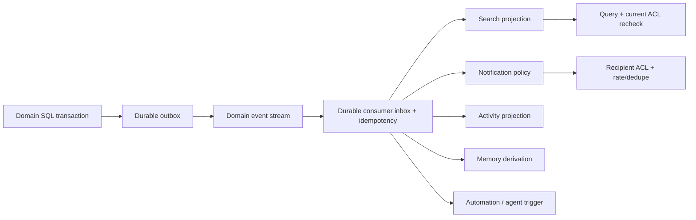

# 15-search-notifications.md

Срез исходников: Macro `c966b79d40798c6c726a3b15fe90517941fc6e61`; ROX `f63294ba4fffa7238b46b24e918925a313ad0b12`. «Реализовано» ниже означает обнаруженный исполняемый путь в этом commit, не доказательство работы production. Предложения ROX помечены как целевой контракт. Анализ выполнен по коду; тесты перечислены как найденные артефакты, если не указано отдельное исполнение.

## Macro unified search: несколько источников, одна query surface

`UnifiedSearchIndex` enumerates Documents, Chats, Emails, Channels, Projects, CallRecords, CalendarEvents and AgentSessions. Tasks are document subtype, not separate index. CRM company is deliberately outside this index enum: unified handler calls `resolve_crm_team_receipt` for `include_crm`, PostgreSQL name/domain source yields `UnifiedSearchResponseItem::Company`. Thus «CRM absent from search» and «CRM fully OpenSearch indexed» both неверны. [C34,C40,C41,C42]

| Entity | Found source | Verified limitation |
|---|---|---|
| Document/task | Documents + Document filters/properties [C35,C40,C43] | body extraction, file association restrictions; not every file type |
| Human messages/channel | Channels search entity + broker projection [C40,C43] | shared parent-aware Message topic is separate; complete CRM discussion indexing not demonstrated by channel consumer alone |
| AI chat | Chats [C40] | separate from Channel Messages |
| Email thread/message | Emails [C40,C43] | source-aware access/provider linkage |
| Calendar | CalendarEvents [C40,C43] | event indexed content ≠ provider write success |
| Call/transcript | CallRecords [C40,C43] | archived call projection; transcript readiness distinct lifecycle |
| Agent session | AgentSessions [C40,C43] | indexes canonical transcript metadata, current ACL still required |
| CRMCompany | opt-in Postgres team source [C41,C42] | name/domain matching; hidden gate and single-effective-team assumption |
| CRMContact | no standalone unified source established here | target registers Contact explicitly; cannot claim current parity |
| Initiative | distinct from legacy Project model [C37] | dedicated Project-looking UI does not prove matching index contract |
| Embeddings/vector search | not established by inspected unified paths | do not infer embedding support from AI dependency |

### Index/event reliability finding

`services/search_processing_service/src/inbound/kafka_consumer.rs` explicitly commits Kafka offset at worker handoff. Ten sequential workers each buffer 16 events; in-process retries stop at three, then event is logged and dropped. A crash may lose committed-but-unprocessed events. Bounded memory and per-key order are real strengths; delivery semantics are insufficient as ROX correctness contract. [C43]



Diagram — target Revision 2. Outbox atomic with relational command; consumers persist inbox/receipt before acknowledging, retry with dead-letter and replay. Search projection tracks `(entityRef,revision,projectionVersion)` and rejects older versions. CRDT accepted operation produces body materialization revision; indexing delayed coalesced document version, not every keystroke. Human Activity does not contain entire raw operation stream.

## Notification, unread, attention model

Macro typed `NotifEvent` includes channel mention/message/reply/reaction, document comment/reply/mention, initiative/CRM discussion, task assignment, new email/reauth, calendar reminder, call started, agent waiting/settled/mentioned and GitHub lifecycle. `UserNotificationRow` combines notification and user notification record with owner, entity, state, viewed_at, sent, deleted, metadata. Seen and lifecycle state are explicitly different. [C44,C45]

Discussion audience prioritizes mention→reply→assignee→owner, skips actor and only keeps current-authorized users. Real-time subscribers are candidate list, not grants. Preserve this semantic separation in target; one event with four reasons creates one attention item per user. [C26,C27]

ROX memory FTS currently indexes lesson/history/context projections under memory dir; bun SQLite unavailable in Node causes recency fallback. It is an existing specialized memory index, not unified product search. Keep its memory semantics and add EntitySearchProvider; do not route Company/Task search through a lesson-only table. [R08]

### Целевые contracts

```ts
// Proposed ROX contracts.
type SearchDocument = {
  ref: EntityRef; title: string; text: string;
  sourceRevision: number; projectionVersion: number;
  metadata: Record<string, JsonValue>; permissionScopeId: string;
  updatedAt: string; deletedAt?: string;
};
type RoxDomainEvent = Rox2Event & {
  schemaVersion: number; workspaceId: string; aggregate: Rox2EntityRef;
  aggregateRevision: string; commandId: string;
  actorKind: 'human' | 'agent' | 'service'; actingUserId?: string;
  payload: Record<string, JsonValue>;
  // id, entityId, type, at, actor, causationId/correlationId inherited.
};
type Notification = {
  id: string; eventId: string; recipientId: string; subject: EntityRef;
  reason: string; dedupeKey: string; state: 'active'|'done'|'dismissed';
  seenAt?: string; snoozedUntil?: string; createdAt: string;
};
```

PermissionScopeId is projection optimization, not authority. Query resolver uses canonical ACL. Snippet generation after permission recheck; result contains authorized ref and version. Deep link entity resolver has same policy. One user unread notification count, per-conversation read watermark and domain activity timeline are separate projections with shared events.

### ROX files / implementation boundaries

1. Existing `packages/server-core/src/memory/fts-index.ts` and `handlers/rpc/memory.ts`: add graph-source citations and freshness; preserve existing lesson/history FTS behavior.
2. New `packages/core/src/entities/search.ts`; `packages/server-core/src/search/{service,projector,reindex}.ts`; `handlers/rpc/entity-search.ts`. Initially Postgres FTS or existing local SQLite per deployment, adapter contract allows OpenSearch later.
3. Existing `apps/electron/src/main/notifications.ts`: native push/display adapter; authoritative notification repository in server domain, not Electron-specific per-feature handlers.
4. Existing navigation/SessionSearchHeader integrates generic Search results in current shell; new Inbox/attention renderer consumes Notification service. Existing Sessions unread remains transcript-local compatibility projection until migrated explicitly.
5. Existing automation runtime consumes versioned committed domain events; no synchronous cross-service transaction for email→CRM→notification→search. Each consumer reports lag/failure and replays.

### Entity registration acceptance

New synthetic entity type registered with schema, ACL policy, search renderer, command hooks, tools and notification rule becomes searchable, mentionable, linkable and accessible to authorized agent without hardcoding N×N integrations. Missing required adapter fails registration/build, not runtime silently invisible feature.

### Observable tests

1. Commit Company → search within documented latency, correct title/domain and current rights; Contact independently searchable. Delete record removes result; stale upsert cannot resurrect it.
2. CRM discussion creates exactly one Notification and indexed Message; agent retrieves bounded source context with provenance. Unauthorized Company never appears in title/snippet/facet count.
3. Stop consumer before ACK, restart: event processed once logically. Seed premature ACK to fail crash test. Dead-letter preserves input/event ID and supports replay.
4. Mention+assignee+owner overlap yields one Notification; mute/snooze honor policy while audit Activity persists.
5. Revoke access with stale index still present: search excludes result immediately; pending push worker rechecks before sending body.
6. Memory summary cites source revision. Source edited/deleted/revoked marks derived memory stale or denied; embedding/cache cannot bypass ACL.

Tests found: `crates/search_service/src/api/search/{unified,calendar_event,document}/test.rs`, `services/search_processing_service/src/inbound/kafka_consumer/test.rs`, `crates/notification/src/domain/service/test/status_updates.rs`, `crates/model_notifications/src/metadata/test.rs`, frontend GraphQL notification revalidation/browser projection tests. Their assertions should become source for target invariants rather than copied AWS delivery plumbing.

## Revision 2: существующий ROX2 contract — единственная typed seam

ROX уже имеет `Rox2EntityRef`, `Rox2Relation`, `Rox2Event`, `Rox2Context`, `Rox2Status` в `packages/core/src/rox2/platform-contract.ts`. `Rox2EntityRef` хранит `workspaceId`, `entityId` (`kind:id`), `revisionId?`, `accountNamespace?`. В этой главе `EntityRef` — краткий alias **существующего Rox2EntityRef**, не новый независимый тип `{type,id}` и не второе хранилище. Новые entity kinds, relation kinds и action policies расширяют этот файл и его adapters. [R10,R11]

`Rox2Relation` пока содержит `fromId/toId/kind`; добавить scoped endpoints, relation id, actor/source/revision и разрешённые kinds как versioned backward-compatible extension. `Rox2Event` уже имеет causation/correlation/aggregateRevision; новые domain envelopes расширяют его versioned contract с workspace/command/schema/source revision. Не создавать параллельный EventBus или несвязанный notification engine. Typed contract не выполняет I/O и не доказывает существующую distributed authorization. [R10]

Состояние command должно сохранять `executionMode × lifecycle × verification`: `awaiting_review` соответствует live/waiting_approval/unverified; provider_pending — live/queued или running/unverified; database commit — live/succeeded/receipt_verified; provider read-back отдельно повышает verification. Дополнительный `domainOutcome` не заменяет эту triad и не возвращает success для pending. Общая relational authority collaborative workspace — модульный Postgres domain store; local standalone stores остаются adapter/local projection/outbox с явным authority mode. [R10; target]

## Доказательства

| ID | Repository / commit | File / symbol / lines | Подтверждаемый факт |
|---|---|---|---|
| C26 | `macro-inc/macro@c966b79d40798c6c726a3b15fe90517941fc6e61` | [crates/messages/src/domain/notification.rs:7–76](https://github.com/macro-inc/macro/blob/c966b79d40798c6c726a3b15fe90517941fc6e61/crates/messages/src/domain/notification.rs#L7-L76), `comment_recipients` | Discussion recipient reasons deduplicate with mention/reply/assignee/owner priority after current access. |
| C27 | `macro-inc/macro@c966b79d40798c6c726a3b15fe90517941fc6e61` | [crates/messages/src/domain/delivery.rs:45–103](https://github.com/macro-inc/macro/blob/c966b79d40798c6c726a3b15fe90517941fc6e61/crates/messages/src/domain/delivery.rs#L45-L103), `MessageAudienceAccess / MessageRealtime / DiscussionNotifier / DiscussionMentionSharing` | Subscribers are candidates; delivery rechecks view rights; discussion sharing is a distinct port. |
| C34 | `macro-inc/macro@c966b79d40798c6c726a3b15fe90517941fc6e61` | [crates/documents/src/domain/create.rs:131–205](https://github.com/macro-inc/macro/blob/c966b79d40798c6c726a3b15fe90517941fc6e61/crates/documents/src/domain/create.rs#L131-L205), `RepoDocumentSubtype / MarkdownSubtype / NewMarkdownTextDocument` | Tasks are Markdown document subtypes with properties and CRDT initialization. |
| C35 | `macro-inc/macro@c966b79d40798c6c726a3b15fe90517941fc6e61` | [crates/system_properties/src/domain/model/constants/system_property_key.rs:79–139](https://github.com/macro-inc/macro/blob/c966b79d40798c6c726a3b15fe90517941fc6e61/crates/system_properties/src/domain/model/constants/system_property_key.rs#L79-L139), `SystemPropertyKey / required_property_ids_for_entity` | Task properties include assignees/status/priority/due date/parent/subtasks/dependencies/effort/story points/docs. |
| C37 | `macro-inc/macro@c966b79d40798c6c726a3b15fe90517941fc6e61` | [crates/initiative/src/domain/models.rs:33–169](https://github.com/macro-inc/macro/blob/c966b79d40798c6c726a3b15fe90517941fc6e61/crates/initiative/src/domain/models.rs#L33-L169), `InitiativeId / InitiativeDetail` | Initiative is app Project with UUIDv7, description doc, members, tasks and sharing. |
| C40 | `macro-inc/macro@c966b79d40798c6c726a3b15fe90517941fc6e61` | [crates/models_search/src/unified.rs:25–83](https://github.com/macro-inc/macro/blob/c966b79d40798c6c726a3b15fe90517941fc6e61/crates/models_search/src/unified.rs#L25-L83), `UnifiedSearchIndex / entity_filters_from_include` | OpenSearch unified index vocabulary covers docs/chats/mail/channels/projects/calls/calendar/agent sessions. |
| C41 | `macro-inc/macro@c966b79d40798c6c726a3b15fe90517941fc6e61` | [crates/search_service/src/api/search/crm_company.rs:1–74](https://github.com/macro-inc/macro/blob/c966b79d40798c6c726a3b15fe90517941fc6e61/crates/search_service/src/api/search/crm_company.rs#L1-L74), `resolve_crm_team_receipt / search_company_names` | CRM company search is Postgres-backed opt-in with team capability and hidden-record gating. |
| C42 | `macro-inc/macro@c966b79d40798c6c726a3b15fe90517941fc6e61` | [crates/search_service/src/api/search/unified.rs:40–83](https://github.com/macro-inc/macro/blob/c966b79d40798c6c726a3b15fe90517941fc6e61/crates/search_service/src/api/search/unified.rs#L40-L83), `handler` | Unified search includes separate authorized CRM company results. |
| C43 | `macro-inc/macro@c966b79d40798c6c726a3b15fe90517941fc6e61` | [services/search_processing_service/src/inbound/kafka_consumer.rs:1–112](https://github.com/macro-inc/macro/blob/c966b79d40798c6c726a3b15fe90517941fc6e61/services/search_processing_service/src/inbound/kafka_consumer.rs#L1-L112), `DeclaredMacroEvent / WORKER_COUNT / MAX_PROCESSING_ATTEMPTS` | Search Kafka commits at worker handoff; failures exhaust retries and drop already-committed events. |
| C44 | `macro-inc/macro@c966b79d40798c6c726a3b15fe90517941fc6e61` | [crates/model_notifications/src/lib.rs:166–267](https://github.com/macro-inc/macro/blob/c966b79d40798c6c726a3b15fe90517941fc6e61/crates/model_notifications/src/lib.rs#L166-L267), `NotifEvent` | Notification taxonomy covers channels/documents/CRM/initiative/tasks/mail/calendar/calls/agents/GitHub. |
| C45 | `macro-inc/macro@c966b79d40798c6c726a3b15fe90517941fc6e61` | [crates/notification/src/domain/models.rs:51–179](https://github.com/macro-inc/macro/blob/c966b79d40798c6c726a3b15fe90517941fc6e61/crates/notification/src/domain/models.rs#L51-L179), `NotificationStatusPatch / UserNotificationRow` | Notification row tracks owner/entity/state/viewed/deleted/metadata separately. |
| R08 | `rox-one/rox-one@f63294ba4fffa7238b46b24e918925a313ad0b12` | [packages/server-core/src/memory/fts-index.ts:1–41](https://github.com/rox-one/rox-one/blob/f63294ba4fffa7238b46b24e918925a313ad0b12/packages/server-core/src/memory/fts-index.ts#L1-L41), `fts-index / getDatabaseCtor` | Memory FTS5 indexes lessons/history/context and falls back under unavailable SQLite runtime. |
| R10 | `rox-one/rox-one@f63294ba4fffa7238b46b24e918925a313ad0b12` | [packages/core/src/rox2/platform-contract.ts:107–141](https://github.com/rox-one/rox-one/blob/f63294ba4fffa7238b46b24e918925a313ad0b12/packages/core/src/rox2/platform-contract.ts#L107-L141), `Rox2EntityRef / Rox2Relation / Rox2Event / Rox2Status` | Existing ROX unified contract already declares relation/event/result seam; this is typed boundary without I/O. |
| R11 | `rox-one/rox-one@f63294ba4fffa7238b46b24e918925a313ad0b12` | [packages/core/src/rox2/platform-contract.ts:218–239](https://github.com/rox-one/rox-one/blob/f63294ba4fffa7238b46b24e918925a313ad0b12/packages/core/src/rox2/platform-contract.ts#L218-L239), `Rox2EntityRef / formatRox2EntityId / parseRox2EntityId` | Existing workspace-scoped ref uses entityId encoded kind:id and optional revision/accountNamespace. |
