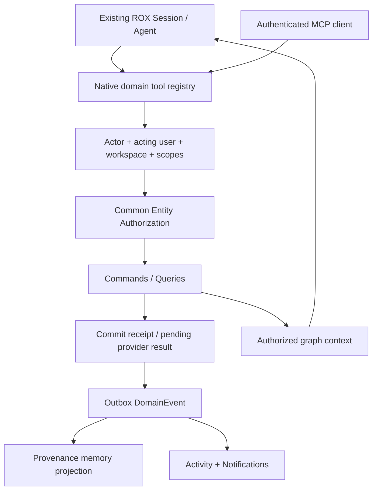

# 16-agent-integration.md

Срез исходников: Macro `c966b79d40798c6c726a3b15fe90517941fc6e61`; ROX `f63294ba4fffa7238b46b24e918925a313ad0b12`. «Реализовано» ниже означает обнаруженный исполняемый путь в этом commit, не доказательство работы production. Предложения ROX помечены как целевой контракт. Анализ выполнен по коду; тесты перечислены как найденные артефакты, если не указано отдельное исполнение.

## Macro agents: domain tools, host semantics, authenticated context

`crates/ai_tools/src/lib.rs` composes document/properties/project/initiative/channel/chat/CRM/call/team/skills/activity/search into tool collection. Host `Chat`, `AgentSession`, `ChannelBot`, `Mcp` differ: Chat/AgentSession include deferred Mail/Calendar user tools with review; bot/MCP use direct variants and do not inherit unavailable composer. Subagent toolset excludes email and recursive Subagent tool. This is actual capability composition, not UI scraping. [C46]

MCP `AuthenticatedToolService` gets authenticated user identity from HTTP request parts; it constructs `RequestContext` internally. Input argument identity cannot replace verified actor. Tool annotations derive read-only/destructive/idempotent/open-world metadata; metadata alone is not authorization. [C47]

`user_tool_review` makes `PendingUserExecution` a real pending state, not successful write. Host checks edited arguments then executes or rejects; context can reach user during ACP turn, whereas chat composer finishes after turn. Generic review contract prevents per-surface fake preview behavior. `agent_preview` crate name elsewhere refers coding preview ports and is not evidence that every domain write is previewed. [C48,C46]

External MCP `RemoteMcpToolSet` discovers per-server tools, isolates failed listings and prefixes `mcp__server__tool`; searchable catalog is separate from active registration. ROX can preserve current MCP mechanism and register native domain facade, without importing Macro remote client plumbing. [C49; target]



## Agent interface matrix — proposed ROX

| Entity | Read / search | Create/update/delete | Link/comment/mention | Share / special actions |
|---|---|---|---|---|
| Page Document | body by version, metadata, comments | CRDT-aware document operation; delete lifecycle | document anchor + generic link | explicit ACL grant; never source HTML execution permission |
| Artifact Page | config/data snapshot/content digest | existing publisher/create/update | parent discussion + refs | existing action grants remain contentDigest-bound |
| Task | properties/body/context | canonical task command; recurrence actions | Message source backlink / Project relation | assign after rights check; link execution run |
| Project | membership/context/linked entity view | current ProjectConfig adapted | attach EntityLink; discussion | container share explicitly declared |
| Channel/Message | bounded timeline/thread/context | create/post/edit own/moderate | mentions/reactions/attachments | invite/manage through membership command |
| Company/Contact | CRM fields, interactions, authorized sources | update/hide/enrich command | common discussion + task/calendar/mail links | team policy/hidden/admin gate |
| Mail | thread/message/draft authorized by account | draft/reply/forward/send; outbound irreversible policy | refs/CRM interaction | share thread separately; adapter credential secret |
| CalendarEvent | provider/sync state/timezone/attendees | optimistic command + provider commit state | links to Meeting/Company/Task | RSVP explicit principal/provider capability |
| Call/Meeting | metadata/participants/recording/transcript | start/end room; import/capture meeting | transcript/action item links | guest token vs recording ACL distinct |
| File | metadata/authorized content | upload/finalize/delete | attach to entity | short-lived download grant |
| Notification/Activity | per-user attention vs permitted audit | seen/done/snooze for own recipient | entity deep link | no arbitrary notification recipient spoof |
| AgentSession | transcript/status/outputs | existing session runner | origin and authored Message | read/share ≠ execute/control |
| Memory | provenance/authorized citations | proposal/promote/retract via existing memory workflow | links to sources | derived memory inherits source restrictions |

CRUD flags are allowed operations, not automatically all enabled. Domain tool schema derives registry adapter; `delete` may archive/tombstone depending lifecycle. `share` requires stronger action than `edit`. MCP exports same dispatcher and permission checks as RPC. No direct agent SQL writer bypass.

### Minimal common tools

`entity.read`, `entity.search`, `entity.context`, `entity.link`, `discussion.post`, `task.create_from_message`, `task.assign`, `document.apply_patch`, `crm.update_company`, `mail.create_draft`, `mail.send`, `calendar.update_event`, `call.start`, `automation.create`. These are target names; Macro current identifiers come from individual toolset definitions, not this proposal.

Generic `entity.context` takes explicit depth/budget/edge-type allowlist and returns authorized nodes with source refs/revisions. Company→emails→contacts→tasks→meetings→calls→docs→discussion must run common graph resolver; no Company-specific agent data model. Each content source has cursor/freshness/state. Prompt cannot gain denied entity via relation metadata or unread notification.

### Command/result semantics

```ts
// Proposed target result discriminants.
type CommandResult<T> = Rox2Status & (
  | { domainOutcome: 'committed'; commandId: string; revision: number; value: T }
  | { domainOutcome: 'awaiting_review'; commandId: string; preview: ReviewableIntent }
  | { domainOutcome: 'provider_pending'; commandId: string; operationId: string }
  | { domainOutcome: 'failed'; commandId: string; code: string; retryable: boolean });
```

Tool output may not say «email sent» for provider_pending or awaiting_review. Preview binds action hash, current entity version and ACL epoch; reviewed write rechecks access and expected revision. Retry `commandId` returns canonical receipt. External API timeout with unknown outcome reconciles provider idempotency/query, not blind resend.

### ROX concrete integration

1. Existing `packages/shared/src/agent/` and native session tool registration: add entity tool adapter through shared domain dispatcher. Preserve execution safety `permissions-config.ts` and current ask/safe-mode policies; entity ACL is additional boundary. [R07,R09]
2. Existing `packages/server-core/src/handlers/rpc/{pages,projects,personal-tasks,meetings}.ts`: expose same command service to agent tools and RPC, with verified actor context.
3. Existing `packages/server-core/src/memory/{fts-index,...}.ts`, memory handlers: add source EntityRef+revision+policy linkage. Existing memory FTS fail-soft fallback must not be treated as permission approval. [R08]
4. New `packages/server-core/src/agents/entity-tools.ts`, `context-resolver.ts`, `review-intents.ts`; new `packages/core/src/entities/agent-contract.ts`; MCP server facade dispatches exactly same command schemas.
5. Existing SessionConfig/messaging transcript remain agent-native. Shared Message author `ActorRef` includes agent/service/human and `actingUserId`, retaining who invoked bot. Macro sender/triggered_by provides evidence for this separation. [C21,C38]

### Event / memory policy

Macro mention parser recognizes `bot|uuid` canonical principals and Macro AI user-alias special case. Do not adopt a second bot-user identity namespace into ROX; map agent principal into common principal registry. Memory ingestion consumes committed events and authorized graph snapshots; it cannot treat every mention as automatic trust/instruction. CRM email body and discussion are untrusted product content. [C51; target]

Target stored derivation: `MemoryFact {id,workspaceId,text,sourceRefs:[{ref,revision}],createdBy,visibilityPolicy,staleAt?}`. Read resolves sources currently; deleted/revoked content is removed/redacted or excluded, including cached agent context. Agent actions emit same Activity as human commands with actor attribution. Automated send/call/assignment rate and event budgets prevent mention→agent→message→mention loops.

### Required agent acceptance / negative controls

1. Agent receives Company context with permitted mail, contacts, tasks, meetings, calls, documents and discussion in one query; cite each source revision and omit inaccessible entities completely.
2. Agent creates task from Message using same transactional service as human UI; backlinks/Project/notification/search generated without extra tool calls.
3. MCP client requests foreign workspace principal in input: ignored/rejected; verified token subject wins. Cross-workspace lookup fails identically in RPC/MCP.
4. Agent `read` grant cannot `share`, invite, delete, send mail or execute another AgentSession. Safe Mode allowed tool does not bypass domain ACL.
5. Mail send awaiting review returns pending state; rejecting review writes no message/provider event. Provider timeout does not duplicate send on retry.
6. Source permission revoked after context draft but before tool commit: recheck denies. Cached memory/citations cannot expose new content after revoke.
7. Seed fake successful pending tool result; evaluator rejects feature completeness. Mention-bot loop max budget tested, with command correlation and dedupe.

Source tests found: `services/mcp_service/src/{tool_service,tool_response}/test.rs`, `crates/ai_tools/src/user_tool_review/test.rs`, `crates/channels/src/inbound/toolset/test.rs`, `crates/initiative/src/inbound/toolset/test.rs`, and entity access authorization suites. Toolset presence proves registration/intended interface, not uniform action availability on every host.

## Revision 2: существующий ROX2 contract — единственная typed seam

ROX уже имеет `Rox2EntityRef`, `Rox2Relation`, `Rox2Event`, `Rox2Context`, `Rox2Status` в `packages/core/src/rox2/platform-contract.ts`. `Rox2EntityRef` хранит `workspaceId`, `entityId` (`kind:id`), `revisionId?`, `accountNamespace?`. В этой главе `EntityRef` — краткий alias **существующего Rox2EntityRef**, не новый независимый тип `{type,id}` и не второе хранилище. Новые entity kinds, relation kinds и action policies расширяют этот файл и его adapters. [R10,R11]

`Rox2Relation` пока содержит `fromId/toId/kind`; добавить scoped endpoints, relation id, actor/source/revision и разрешённые kinds как versioned backward-compatible extension. `Rox2Event` уже имеет causation/correlation/aggregateRevision; новые domain envelopes расширяют его versioned contract с workspace/command/schema/source revision. Не создавать параллельный EventBus или несвязанный notification engine. Typed contract не выполняет I/O и не доказывает существующую distributed authorization. [R10]

Состояние command должно сохранять `executionMode × lifecycle × verification`: `awaiting_review` соответствует live/waiting_approval/unverified; provider_pending — live/queued или running/unverified; database commit — live/succeeded/receipt_verified; provider read-back отдельно повышает verification. Дополнительный `domainOutcome` не заменяет эту triad и не возвращает success для pending. Общая relational authority collaborative workspace — модульный Postgres domain store; local standalone stores остаются adapter/local projection/outbox с явным authority mode. [R10; target]

## Macro memory и CRM discussion agent context

Macro Memory здесь — сгенерированный **per-user profile**, не универсальный memory fact graph. `MemoryServiceImpl.get_or_generate_memory` возвращает прошлый profile и при возрасте >24h запускает regeneration через agent tools в background; в Local environment генерация отключена. PostgreSQL upsert `ON CONFLICT(user_id)` сохраняет один profile пользователя. Это опровергает предположение, что любая новая Macro entity автоматически получает granular durable memory facts и revocation-linked provenance. ROX existing Memory следует расширять source-aware projections, а не заменять его большим profile blob. [C52,C53]

CRM discussion имеет подтверждённый agent context path: `MessageThreadHistory` запрашивает current MessageWrite receipt вызывающего пользователя для Channel/Document/Initiative/CRMCompany/CRMContact, затем читает root+replies через общий MessageReader и фильтрует tombstones. Это reuse primitive, которую следует воспроизвести общим ROX authorized context resolver. [C54]


## Доказательства

| ID | Repository / commit | File / symbol / lines | Подтверждаемый факт |
|---|---|---|---|
| C21 | `macro-inc/macro@c966b79d40798c6c726a3b15fe90517941fc6e61` | [crates/messages/src/domain/models.rs:362–432](https://github.com/macro-inc/macro/blob/c966b79d40798c6c726a3b15fe90517941fc6e61/crates/messages/src/domain/models.rs#L362-L432), `SimpleMention / Message / root_id` | Shared message has sender, bot profile, mentions, timestamps, tombstone, attachments and reactions. |
| C38 | `macro-inc/macro@c966b79d40798c6c726a3b15fe90517941fc6e61` | [crates/entity_access/src/domain/models.rs:27–144](https://github.com/macro-inc/macro/blob/c966b79d40798c6c726a3b15fe90517941fc6e61/crates/entity_access/src/domain/models.rs#L27-L144), `BotAccessScope / CrmEntityAccess / EntityPermission` | Entity access retains acting user or team scope and CRM owning-team role. |
| C46 | `macro-inc/macro@c966b79d40798c6c726a3b15fe90517941fc6e61` | [crates/ai_tools/src/lib.rs:94–180](https://github.com/macro-inc/macro/blob/c966b79d40798c6c726a3b15fe90517941fc6e61/crates/ai_tools/src/lib.rs#L94-L180), `AiHost / tools_for / subagent_toolset` | Tools are composed per host; Mail and Calendar review semantics differ between chat/session/bot/MCP. |
| C47 | `macro-inc/macro@c966b79d40798c6c726a3b15fe90517941fc6e61` | [services/mcp_service/src/tool_service.rs:60–85](https://github.com/macro-inc/macro/blob/c966b79d40798c6c726a3b15fe90517941fc6e61/services/mcp_service/src/tool_service.rs#L60-L85), `AuthenticatedToolService / authenticated_user_id / call_tool` | MCP extracts authenticated identity from HTTP parts rather than accepting an argument identity. |
| C48 | `macro-inc/macro@c966b79d40798c6c726a3b15fe90517941fc6e61` | [crates/ai_tools/src/user_tool_review.rs:1–18](https://github.com/macro-inc/macro/blob/c966b79d40798c6c726a3b15fe90517941fc6e61/crates/ai_tools/src/user_tool_review.rs#L1-L18), `ReviewRequest / UserToolReviewer` | Deferred user tools are reviewed and executed by host, not counted as successful pending writes. |
| C49 | `macro-inc/macro@c966b79d40798c6c726a3b15fe90517941fc6e61` | [crates/mcp_toolset/src/toolset.rs:42–75](https://github.com/macro-inc/macro/blob/c966b79d40798c6c726a3b15fe90517941fc6e61/crates/mcp_toolset/src/toolset.rs#L42-L75), `RemoteMcpToolSet / searchable_catalog` | External MCP servers are name-mangled and discovery failure is isolated per server. |
| C51 | `macro-inc/macro@c966b79d40798c6c726a3b15fe90517941fc6e61` | [crates/messages/src/domain/mentions.rs:7–95](https://github.com/macro-inc/macro/blob/c966b79d40798c6c726a3b15fe90517941fc6e61/crates/messages/src/domain/mentions.rs#L7-L95), `MessageReferenceKind / bot_mention_ids` | Mention vocabulary spans bots and cross-product entities; recognizing type never grants access. |
| R07 | `rox-one/rox-one@f63294ba4fffa7238b46b24e918925a313ad0b12` | [packages/shared/src/agent/permissions-config.ts:1–12](https://github.com/rox-one/rox-one/blob/f63294ba4fffa7238b46b24e918925a313ad0b12/packages/shared/src/agent/permissions-config.ts#L1-L12), `Safe Mode Configuration / permissions loading` | Agent tool safety permissions are additive execution policy, not workspace entity ACL. |
| R08 | `rox-one/rox-one@f63294ba4fffa7238b46b24e918925a313ad0b12` | [packages/server-core/src/memory/fts-index.ts:1–41](https://github.com/rox-one/rox-one/blob/f63294ba4fffa7238b46b24e918925a313ad0b12/packages/server-core/src/memory/fts-index.ts#L1-L41), `fts-index / getDatabaseCtor` | Memory FTS5 indexes lessons/history/context and falls back under unavailable SQLite runtime. |
| R09 | `rox-one/rox-one@f63294ba4fffa7238b46b24e918925a313ad0b12` | [packages/shared/src/sessions/types.ts:118–135](https://github.com/rox-one/rox-one/blob/f63294ba4fffa7238b46b24e918925a313ad0b12/packages/shared/src/sessions/types.ts#L118-L135), `SessionConfig / StoredSession` | Agent session configuration carries execution permission mode. |
| R10 | `rox-one/rox-one@f63294ba4fffa7238b46b24e918925a313ad0b12` | [packages/core/src/rox2/platform-contract.ts:107–141](https://github.com/rox-one/rox-one/blob/f63294ba4fffa7238b46b24e918925a313ad0b12/packages/core/src/rox2/platform-contract.ts#L107-L141), `Rox2Status / Rox2Entity / Rox2Relation / Rox2Event` | Existing ROX unified contract already declares relation/event/result seam; this is typed boundary without I/O. |
| R11 | `rox-one/rox-one@f63294ba4fffa7238b46b24e918925a313ad0b12` | [packages/core/src/rox2/platform-contract.ts:218–239](https://github.com/rox-one/rox-one/blob/f63294ba4fffa7238b46b24e918925a313ad0b12/packages/core/src/rox2/platform-contract.ts#L218-L239), `Rox2EntityRef / formatRox2EntityId / parseRox2EntityId` | Existing workspace-scoped ref uses entityId encoded kind:id and optional revision/accountNamespace. |
| C52 | `macro-inc/macro@c966b79d40798c6c726a3b15fe90517941fc6e61` | [crates/memory/src/domain/service.rs:100–177](https://github.com/macro-inc/macro/blob/c966b79d40798c6c726a3b15fe90517941fc6e61/crates/memory/src/domain/service.rs#L100-L177), `MemoryServiceImpl.get_or_generate_memory / generate_memory` | Memory is per-user generated profile with 24h refresh; async regeneration disabled in Local environment. |
| C53 | `macro-inc/macro@c966b79d40798c6c726a3b15fe90517941fc6e61` | [crates/memory/src/outbound/pg_memory_repo.rs:20–59](https://github.com/macro-inc/macro/blob/c966b79d40798c6c726a3b15fe90517941fc6e61/crates/memory/src/outbound/pg_memory_repo.rs#L20-L59), `PgMemoryRepo.save_memory / get_latest_memory` | Memory persistence upserts one profile per user and timestamps, not an arbitrary entity fact graph. |
| C54 | `macro-inc/macro@c966b79d40798c6c726a3b15fe90517941fc6e61` | [crates/agent_trigger/src/outbound/message_thread_history.rs:30–104](https://github.com/macro-inc/macro/blob/c966b79d40798c6c726a3b15fe90517941fc6e61/crates/agent_trigger/src/outbound/message_thread_history.rs#L30-L104), `MessageThreadHistory.authorize_invocation / thread_messages` | Agent trigger reads parent-aware channel/document/initiative/CRM discussion with current invoking-user capability. |
