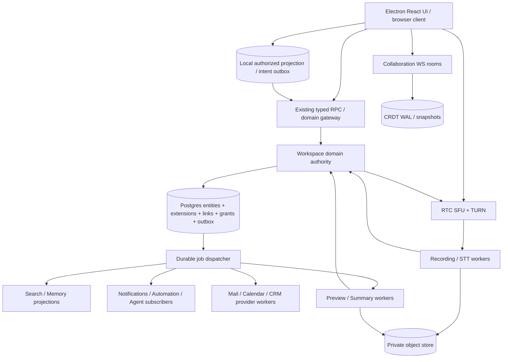

# 17. Infrastructure: requirement vs Macro deployment choice

**Target proposal, Revision 2:** один модульный workspace domain service/authority + PostgreSQL transactional outbox; независимые collaboration, media plane и artifact workers; desktop local projection/outbox; provider adapters. Не создавать сервис на каждую surface и не повторять Macro AWS estate автоматически. Таблица фиксирует исходные deployment definitions, не подтверждает, что production resources healthy or deployed.

## 1. Replacement map

| Capability / requirement | Macro implementation / evidence | Required? | Replaceable? / self-host option | ROX target |
|---|---|---|---|---|
| Durable documents/files/mail attachments/recordings | S3 buckets incl. mail attachment and call recording [D066,D085] | Durable object store нужен | S3-compatible MinIO/Ceph; filesystem dev adapter | `ObjectStore` private blobs, signed upload, checksums, retention/tombstones |
| Recording/audio preview delivery | CloudFront + signed URLs; local S3 presign fallback [D067] | Secure streaming нужен, CDN optional | Private HTTP asset gateway; Caddy/Nginx cache with auth | `AssetAccessLease` ACL before URL/stream, small TTL, HTTP Range |
| Queue processing / retry | SQS backfill/inbox jobs/reminders; claim/outbox [D026,D031,D042,D043] | Durable jobs нужны | Postgres `SKIP LOCKED` queue initially; NATS JetStream/RabbitMQ at demand | Stable job id, attempt/backoff/DLQ/lease, per-entity order only where required |
| Artifact execution | Lambda preview handler + ffmpeg layer [D058,D086] | Compute нужен, Lambda не нужен | Container worker with ffmpeg/ffprobe subprocess limit | `MediaArtifactWorker`, bounded CPU/memory/network, artifact idempotency |
| Realtime connection routing | connection-gateway DynamoDB connection table + Redis [D076,D077] | Ephemeral route registry нужен | Redis/Valkey TTL registry or in-process single instance | Shared WS gateway with sticky room routing/publish broker; users from central identity |
| Document CRDT session/durability | Cloudflare Worker + Durable Objects SQLite, D1 user-peer mapping, R2 snapshots, KV [D083] | CRDT durability/room ordering нужны | Stateful sync workers + Postgres/WAL + S3 snapshots | CollaborationRuntime provider boundary; fence per-document owner/lease |
| Notification fanout | SNS topic to push delivery queue [D078] | Attention pipeline нужна | Outbox recipient worker + APNS/FCM/WebPush adapters | One Notification engine with per-recipient preference/dedup/aggregation |
| System transactional emails | Auth service SMTP local else SES [D079] | Email transport нужен | Existing ROX Stalwart/SMTP; external relay | `SystemMailTransport` separate from user MailAdapter and delivery bounce receipts |
| Gmail user email | Gmail API/history/watch; SQS workers [D027,D028] | Mail provider нужен | Existing JMAP/Stalwart; Microsoft/IMAP adapters | Provider-neutral MailAccount authority; SES is not replacement for Gmail inbox sync |
| Credentials / config | AWS Secrets Manager in recording/calendar definitions [D066,D084] | Secret management нужно | Device Keychain + server secret store / Vault | CredentialRef only domain-side; rotation/no secret on bus or renderer |
| Service deployment | ECS cluster/resources and per-domain service definitions [D081,D084] | Process orchestration нужна | Docker Compose first; Kubernetes/Nomad if justified | modular domain container + sync/media/workers independently scaled |
| Cache/rate gates/publish | reusable Redis resource; calendar Redis [D080,D084] | Rate gating/cache needed, exact infra optional | Valkey; DB lease for modest rates | RateLimiter/cache/broker adapters; never primary source of entity truth |
| Durable event stream | Kafka cluster with 3 brokers / IAM clients, versioned domain topics [D101,D051,D064] | Replays and subscription ordering нужны, Kafka optional | Postgres outbox first; NATS JetStream/Kafka when actual throughput/replay needs justify | EventEnvelope shared; no event stream contains credentials/private artifact bodies |
| Persistent domain model | Rust SQLx PostgreSQL repos incl. CRM and calendar [D005,D038] | Transactional durable authority нужна | PostgreSQL retained; local SQLite projection | Shared workspace Postgres + no distributed DB per surface |
| Unified search | OpenSearch infrastructure/index upsert pipeline [D082,D049,D061] | Authorized search нужен | Postgres FTS/pgvector first, OpenSearch optional | SearchDocument contract + ACL evaluation + revisioned index jobs |
| RTC audio/video/screen | LiveKit room API / JWT / webhook / egress [D052,D053,D065] | RTC SFU нужен | Self-host LiveKit + TURN + egress workers | Independent `RtcProvider`; participant identity still ROX |
| STT and diarization | LiveKit agent Deepgram nova-3 + Resemblyzer [D056] | Transcript requirement; vendor optional | Existing Whisper.cpp ROX for local/batch; realtime alternative evaluated | TranscriptionProvider capabilities and artifact status |
| Call summary | AI summarizer optional; process task [D057,D091] | Summary demanded by target | Existing ROX model/source connections | Durable `SummaryJob`, evidence spans/revisions, permission-gated context |
| Enrichment | Apollo API best effort + negative directory cache [D007] | CRM discovery yes; enrichment vendor no | DNS/web enrichment adapters or manual fields | CompanyEnrichment job optional, provenance/confidence/retry |
| Observability | Worker trace/log config and structured tracing [D083,D058] | Yes | OpenTelemetry collector + Prometheus/Loki compatible outputs | Trace/correlation/causation IDs + queue age, errors, artifact latency |

## 2. Architecture and deployment boundary

ROX local mailbox and local meeting capture are producers/adapters for the same entities; they are not superseded by cloud bootstrap. Local standalone identity has explicit workspace authority mapping before sharing; local queued changes revalidate ACL and base revision when connected. Collaboration room uses same grants and EntityRef; SFU token is ephemeral media capability and cannot be reused to read files.

## 3. Delivery guarantees and operability

Postgres command transaction writes aggregate/links plus outbox atomically. Queue/event consumers at least once, dedup `(consumer,eventId)` and checkpoint after successful projection. Domain version ordering rejects obsolete search snapshots. DLQ retains safe metadata and reproduction ID; logs exclude private bodies/OAuth/JWT/signed URLs. Calendar and mail provider APIs remain external authorities for provider-owned mutations; command status must distinguish pending, provider success, projected and verified.

Current Macro has a real persisted calendar sync outbox [D043], race-safe mail send claim [D031] and best-effort call summary tasks [D091]. Copying all these as one “event bus reliable” claim would miss durability differences. ROX uniform contract preserves outcomes but hardens process-local tasks into durable jobs and gives replay/rebuild to search/attention/memory.

Data stores: PostgreSQL backups/PITR and restore rehearsal; object lifecycle versions/checksums and deletion manifests; CRDT snapshot + WAL must restore same document frontier; search/memory disposable projections rebuild from authoritative refs/version/events. File ACL must not be stored only in CDN/object path; asset gateway checks current grant. Redis loss cannot delete domain truth or forge membership.

Capacity acceptance: multi-document WS load separately from media bitrate/egress CPU; bounded task fanout and notification recipient limits; reconnect thundering-herd backoff; slow provider per-account circuit breaker; outbox backlog/oldest age/lag observed; partition-by-entity ordering only where required. A modular authority avoids distributed transactions between Tasks/Mail/CRM/Permissions; CRDT and media communicate by stable command/event interfaces.

## 4. Cloud portability verification gates

1. Run the vertical Page collaboration scenario with source license cleared dependency packages and ROX sync runtime, then crash/restart sync owner; snapshot/WAL restore same frontier and ACL revoke closes session.
2. Mail JMAP pilot remains operational while Gmail adapter added; SMTP delivery outside loopback requires actual relay/DNS/read-back evidence, not UI flag.
3. Calendar mutation provider read-back + local recovery after persist failure; test repeated watch/outbox delivery.
4. Live call with two users + TURN path + egress worker → private recording/preview/transcript/summary; kill artifact worker mid-job and repeat object event; archive persists and workers recover once.
5. Remove S3/SQS/Lambda/CloudFront credentials from self-host fixture config and rerun same domain acceptance. Swap adapters without changing entity IDs/API/UI paths.

Service/source reuse is architectural portability proposal. Actual self-host deploy, database migrations, provider integrations and production load tests are future work packages in [21-implementation-plan.md](21-implementation-plan.md), not delivered infrastructure in this audit.

## Доказательства на зафиксированном HEAD

Ссылки `[Dxxx]` относятся к этому реестру; это статический аудит кода. Production credentials, реальные Gmail/LiveKit/Cloudflare окружения и Rust integration suites здесь не запускались. Наличие теста не означает, что тест прошёл.

| ID | Repository / commit SHA | File / symbol / lines | Подтверждаемое утверждение |
|---|---|---|---|
| D005 | `macro-inc/macro` · `c966b79d40798c6c726a3b15fe90517941fc6e61` | [crates/crm/src/outbound/companies_repo.rs](https://github.com/macro-inc/macro/blob/c966b79d40798c6c726a3b15fe90517941fc6e61/crates/crm/src/outbound/companies_repo.rs#L298-L443) · `CompaniesRepository.populate_contact` · 298–443 | Team/domain lock, killswitch, inbound unknown company no-op; sent creates; contact/source upsert |
| D007 | `macro-inc/macro` · `c966b79d40798c6c726a3b15fe90517941fc6e61` | [crates/crm/src/outbound/apollo_resolver.rs](https://github.com/macro-inc/macro/blob/c966b79d40798c6c726a3b15fe90517941fc6e61/crates/crm/src/outbound/apollo_resolver.rs#L71-L151) · `ApolloCompanyMetadataResolver.resolve` · 71–151 | Apollo enrichment best effort with no-key short circuit and negative results |
| D026 | `macro-inc/macro` · `c966b79d40798c6c726a3b15fe90517941fc6e61` | [services/email_service/src/pubsub/inbox_sync/process.rs](https://github.com/macro-inc/macro/blob/c966b79d40798c6c726a3b15fe90517941fc6e61/services/email_service/src/pubsub/inbox_sync/process.rs#L56-L115) · `inner_process_message` · 56–115 | Queue checks link active and dispatches Gmail/upsert/delete/label operations |
| D027 | `macro-inc/macro` · `c966b79d40798c6c726a3b15fe90517941fc6e61` | [crates/email_api_client/src/outbound/gmail/sync.rs](https://github.com/macro-inc/macro/blob/c966b79d40798c6c726a3b15fe90517941fc6e61/crates/email_api_client/src/outbound/gmail/sync.rs#L9-L36) · `GmailApiClientRepository MailboxSyncClient` · 9–36 | Provider delta sync via Gmail history cursor |
| D028 | `macro-inc/macro` · `c966b79d40798c6c726a3b15fe90517941fc6e61` | [services/email_service/src/api/gmail/webhook.rs](https://github.com/macro-inc/macro/blob/c966b79d40798c6c726a3b15fe90517941fc6e61/services/email_service/src/api/gmail/webhook.rs#L19-L109) · `webhook_handler` · 19–109 | Gmail webhook entry for sync pipeline |
| D031 | `macro-inc/macro` · `c966b79d40798c6c726a3b15fe90517941fc6e61` | [crates/email/src/domain/scheduled_delivery.rs](https://github.com/macro-inc/macro/blob/c966b79d40798c6c726a3b15fe90517941fc6e61/crates/email/src/domain/scheduled_delivery.rs#L37-L64) · `deliver_scheduled` · 37–64 | Due unsent message claim commits before provider call; only owner releases/finalizes |
| D038 | `macro-inc/macro` · `c966b79d40798c6c726a3b15fe90517941fc6e61` | [crates/calendar_events/src/domain/models.rs](https://github.com/macro-inc/macro/blob/c966b79d40798c6c726a3b15fe90517941fc6e61/crates/calendar_events/src/domain/models.rs#L572-L648) · `CalendarEvent` · 572–648 | Per-owner canonical event with iCal UID, recurrence, attendees/conference and sources |
| D042 | `macro-inc/macro` · `c966b79d40798c6c726a3b15fe90517941fc6e61` | [services/calendar_service/src/calendar_backfill.rs](https://github.com/macro-inc/macro/blob/c966b79d40798c6c726a3b15fe90517941fc6e61/services/calendar_service/src/calendar_backfill.rs#L126-L282) · `run_worker` · 126–282 | Calendar own queue worker/coordinator with claim and retry disposition |
| D043 | `macro-inc/macro` · `c966b79d40798c6c726a3b15fe90517941fc6e61` | [services/calendar_service/src/calendar_outbox.rs](https://github.com/macro-inc/macro/blob/c966b79d40798c6c726a3b15fe90517941fc6e61/services/calendar_service/src/calendar_outbox.rs#L27-L147) · `calendar outbox` · 27–147 | Outbox publication at least once; locks and SKIP LOCKED drain |
| D049 | `macro-inc/macro` · `c966b79d40798c6c726a3b15fe90517941fc6e61` | [services/search_processing_service/src/process/calendar_event.rs](https://github.com/macro-inc/macro/blob/c966b79d40798c6c726a3b15fe90517941fc6e61/services/search_processing_service/src/process/calendar_event.rs#L37-L117) · `upsert_calendar_event` · 37–117 | Index series master only with owner/source/attendees properties; missing row removes |
| D052 | `macro-inc/macro` · `c966b79d40798c6c726a3b15fe90517941fc6e61` | [crates/call/src/domain/service.rs](https://github.com/macro-inc/macro/blob/c966b79d40798c6c726a3b15fe90517941fc6e61/crates/call/src/domain/service.rs#L734-L842) · `get_or_create_call` · 734–842 | UUIDv7 room, race-safe call creation, transcription dispatch and optional egress |
| D053 | `macro-inc/macro` · `c966b79d40798c6c726a3b15fe90517941fc6e61` | [crates/call/src/outbound/livekit_rtc_client.rs](https://github.com/macro-inc/macro/blob/c966b79d40798c6c726a3b15fe90517941fc6e61/crates/call/src/outbound/livekit_rtc_client.rs#L148-L192) · `generate_token / generate_guest_token` · 148–192 | LiveKit token TTL six hours room scoped publish subscribe data |
| D056 | `macro-inc/macro` · `c966b79d40798c6c726a3b15fe90517941fc6e61` | [services/transcription/transcriber.py](https://github.com/macro-inc/macro/blob/c966b79d40798c6c726a3b15fe90517941fc6e61/services/transcription/transcriber.py#L149-L202) · `Transcriber` · 149–202 | LiveKit per-track Deepgram nova-3 with voice clustering and segment delivery |
| D057 | `macro-inc/macro` · `c966b79d40798c6c726a3b15fe90517941fc6e61` | [crates/call/src/domain/service.rs](https://github.com/macro-inc/macro/blob/c966b79d40798c6c726a3b15fe90517941fc6e61/crates/call/src/domain/service.rs#L1785-L1862) · `summarize_call` · 1785–1862 | Summary configurable; empty transcript skips; custom speaker/name then persisted summary event |
| D058 | `macro-inc/macro` · `c966b79d40798c6c726a3b15fe90517941fc6e61` | [services/call_recording_preview_handler/src/event.rs](https://github.com/macro-inc/macro/blob/c966b79d40798c6c726a3b15fe90517941fc6e61/services/call_recording_preview_handler/src/event.rs#L116-L197) · `process_record` · 116–197 | Object event presigns MP4, generates JPG, uploads and patches DB |
| D061 | `macro-inc/macro` · `c966b79d40798c6c726a3b15fe90517941fc6e61` | [services/search_processing_service/src/process/call.rs](https://github.com/macro-inc/macro/blob/c966b79d40798c6c726a3b15fe90517941fc6e61/services/search_processing_service/src/process/call.rs#L13-L103) · `process_call_record` · 13–103 | Call search requires transcript segments; parent properties and participant IDs indexed |
| D065 | `macro-inc/macro` · `c966b79d40798c6c726a3b15fe90517941fc6e61` | [apps/web/src/features/channel/Call/CallContext.tsx](https://github.com/macro-inc/macro/blob/c966b79d40798c6c726a3b15fe90517941fc6e61/apps/web/src/features/channel/Call/CallContext.tsx#L1485-L1510) · `CallContext.toggleScreenShare` · 1485–1510 | LiveKit local participant media APIs and shared call state |
| D066 | `macro-inc/macro` · `c966b79d40798c6c726a3b15fe90517941fc6e61` | [infra/stacks/call-recording/index.ts](https://github.com/macro-inc/macro/blob/c966b79d40798c6c726a3b15fe90517941fc6e61/infra/stacks/call-recording/index.ts#L20-L50) · `callRecordingBucket` · 20–50 | S3 recording bucket with service user Secrets Manager and CloudFront/preview infrastructure |
| D067 | `macro-inc/macro` · `c966b79d40798c6c726a3b15fe90517941fc6e61` | [crates/call/src/outbound/s3_recording_storage.rs](https://github.com/macro-inc/macro/blob/c966b79d40798c6c726a3b15fe90517941fc6e61/crates/call/src/outbound/s3_recording_storage.rs#L111-L133) · `S3RecordingStorage.presign_recording_url` · 111–133 | Local S3 and prod signed CDN URL adapter |
| D076 | `macro-inc/macro` · `c966b79d40798c6c726a3b15fe90517941fc6e61` | [infra/stacks/connection-gateway/index.ts](https://github.com/macro-inc/macro/blob/c966b79d40798c6c726a3b15fe90517941fc6e61/infra/stacks/connection-gateway/index.ts#L39-L64) · `connectionGatewayRedis` · 39–64 | WebSocket gateway Redis configured |
| D077 | `macro-inc/macro` · `c966b79d40798c6c726a3b15fe90517941fc6e61` | [infra/stacks/connection-gateway/connection_table.ts](https://github.com/macro-inc/macro/blob/c966b79d40798c6c726a3b15fe90517941fc6e61/infra/stacks/connection-gateway/connection_table.ts#L1-L33) · `Connection table` · 1–33 | DynamoDB connection table infrastructure |
| D078 | `macro-inc/macro` · `c966b79d40798c6c726a3b15fe90517941fc6e61` | [infra/stacks/notification-service/push.ts](https://github.com/macro-inc/macro/blob/c966b79d40798c6c726a3b15fe90517941fc6e61/infra/stacks/notification-service/push.ts#L10-L86) · `Push infrastructure` · 10–86 | SNS topic fanout to notification push queue |
| D079 | `macro-inc/macro` · `c966b79d40798c6c726a3b15fe90517941fc6e61` | [services/authentication_service/src/main.rs](https://github.com/macro-inc/macro/blob/c966b79d40798c6c726a3b15fe90517941fc6e61/services/authentication_service/src/main.rs#L246-L256) · `authentication email sender` · 246–256 | System SMTP local otherwise SES, separate from Gmail product send |
| D080 | `macro-inc/macro` · `c966b79d40798c6c726a3b15fe90517941fc6e61` | [infra/packages/resources/src/resources/redis.ts](https://github.com/macro-inc/macro/blob/c966b79d40798c6c726a3b15fe90517941fc6e61/infra/packages/resources/src/resources/redis.ts#L19-L110) · `Redis` · 19–110 | Reusable ECS-backed Redis infrastructure resource |
| D081 | `macro-inc/macro` · `c966b79d40798c6c726a3b15fe90517941fc6e61` | [infra/packages/service/src/cluster.ts](https://github.com/macro-inc/macro/blob/c966b79d40798c6c726a3b15fe90517941fc6e61/infra/packages/service/src/cluster.ts#L1-L17) · `Cluster` · 1–17 | ECS cluster service infrastructure |
| D082 | `macro-inc/macro` · `c966b79d40798c6c726a3b15fe90517941fc6e61` | [infra/stacks/opensearch/index.ts](https://github.com/macro-inc/macro/blob/c966b79d40798c6c726a3b15fe90517941fc6e61/infra/stacks/opensearch/index.ts#L1-L96) · `OpenSearch stack` · 1–96 | Search configured OpenSearch service |
| D083 | `macro-inc/macro` · `c966b79d40798c6c726a3b15fe90517941fc6e61` | [services/sync-service/wrangler.docker.toml](https://github.com/macro-inc/macro/blob/c966b79d40798c6c726a3b15fe90517941fc6e61/services/sync-service/wrangler.docker.toml#L22-L74) · `sync service worker bindings` · 22–74 | Cloudflare Worker Durable Objects SQLite / D1 / R2 / KV |
| D084 | `macro-inc/macro` · `c966b79d40798c6c726a3b15fe90517941fc6e61` | [infra/stacks/calendar-service/index.ts](https://github.com/macro-inc/macro/blob/c966b79d40798c6c726a3b15fe90517941fc6e61/infra/stacks/calendar-service/index.ts#L62-L142) · `calendar infrastructure` · 62–142 | Calendar Redis request gate and ECS service depends on database secret |
| D085 | `macro-inc/macro` · `c966b79d40798c6c726a3b15fe90517941fc6e61` | [infra/stacks/email-service/attachments-bucket.ts](https://github.com/macro-inc/macro/blob/c966b79d40798c6c726a3b15fe90517941fc6e61/infra/stacks/email-service/attachments-bucket.ts#L1-L96) · `Email attachment bucket` · 1–96 | Object storage for mail attachments |
| D086 | `macro-inc/macro` · `c966b79d40798c6c726a3b15fe90517941fc6e61` | [infra/stacks/call-recording/call-recording-preview-lambda.ts](https://github.com/macro-inc/macro/blob/c966b79d40798c6c726a3b15fe90517941fc6e61/infra/stacks/call-recording/call-recording-preview-lambda.ts#L50-L139) · `CallRecordingPreviewLambda` · 50–139 | Lambda provided.al2023 ffmpeg layer and S3 permissions |
| D091 | `macro-inc/macro` · `c966b79d40798c6c726a3b15fe90517941fc6e61` | [crates/call/src/domain/service.rs](https://github.com/macro-inc/macro/blob/c966b79d40798c6c726a3b15fe90517941fc6e61/crates/call/src/domain/service.rs#L1908-L1995) · `spawn_summarize_call` · 1908–1995 | Summary launched in tokio task; no durable retry; process-lifetime risk |
| D101 | `macro-inc/macro` · `c966b79d40798c6c726a3b15fe90517941fc6e61` | [infra/stacks/kafka-cluster/index.ts](https://github.com/macro-inc/macro/blob/c966b79d40798c6c726a3b15fe90517941fc6e61/infra/stacks/kafka-cluster/index.ts#L15-L37) · `kafkaCluster` · 15–37 | Kafka cluster infrastructure with three brokers and IAM bootstrap |
| D051 | `macro-inc/macro` · `c966b79d40798c6c726a3b15fe90517941fc6e61` | [crates/calendar_events/src/domain/events.rs](https://github.com/macro-inc/macro/blob/c966b79d40798c6c726a3b15fe90517941fc6e61/crates/calendar_events/src/domain/events.rs#L33-L82) · `CalendarTopicEvent` · 33–82 | macro.calendar created/updated/deleted stable entity key schema version 1 |
| D064 | `macro-inc/macro` · `c966b79d40798c6c726a3b15fe90517941fc6e61` | [crates/call/src/domain/events.rs](https://github.com/macro-inc/macro/blob/c966b79d40798c6c726a3b15fe90517941fc6e61/crates/call/src/domain/events.rs#L114-L169) · `CallTopicEvent` · 114–169 | Macro calls started archived updated deleted summarized recording-ready taxonomy |
