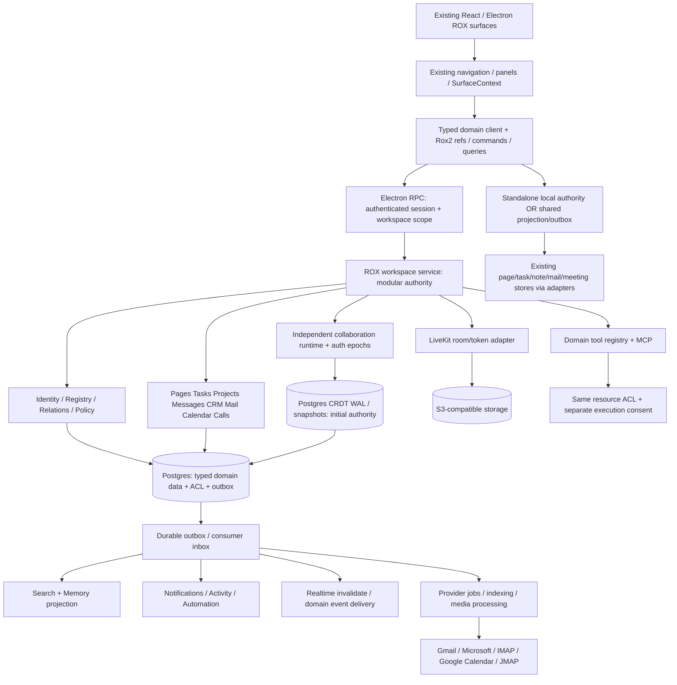
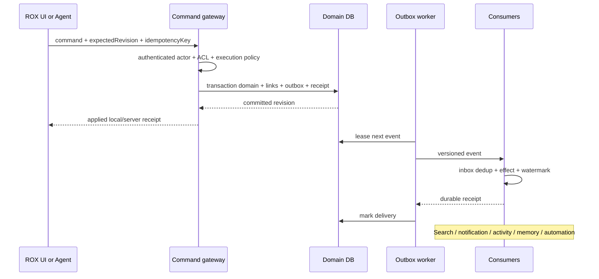

# Target ROX architecture — Revision 1 → Revision 2

**PROPOSED**, исходная база ROX `f63294ba4fffa7238b46b24e918925a313ad0b12`; Macro `c966b79d40798c6c726a3b15fe90517941fc6e61`. Это архитектурный план; реализация начинается с WP-01 из machine plan.

## Решение и альтернативы

| Candidate | Конкретная реализация | Проверка против цели | Решение |
|---|---|---|---|
| A: Native ROX authority | Extend Rox2 contracts; shared modular workspace service; adapters for existing local stores; independent sync/media workers | preserves existing surfaces/React, controls data model/ACL/provider portability; требует нового server authority | выбран |
| B: Conation/Macro authority | existing Conation Soup/native action adapters become shared backend; preserve Electron views | earlier read integration, fewer initial server handlers; current blocked writes and differing ACL, license/service deployment uncertainty | сохранить как optional read/import adapter, не второй master |
| C: Macro subsystem composition | deploy Macro services and translate each surface via ROX gateway | mature individual workflows; root/web licensing, duplicated users/entity models, infrastructure and state divergence | не выбран; lawful isolated service spike возможен после review |

Cheapest falsification A: сначала private shared Project create/update через native RPC и HTTP с denied third user, restart/retry; затем Message→Task link/backlink после WP-08/11. Если scope/identity enforcement невозможно без rewriting all handlers, narrow routing to migrated kinds before broad rollout. B falsification: actual write/ACL-revoke read-back on Conation adapters; fixtures/blocked shells do not pass. C falsification: license scope + deploy minimum independent endpoint + current user token translation; UI import alone не тест.

Grounding: `packages/core/src/rox2/platform-contract.ts::Rox2EntityRef/Rox2Event/authorizeRox2Action`, `project-membership.ts`; ROX current source evidence in 03. Macro DSS composition uses shared repositories/ports rather than standalone server per domain (02). Framework gap: SolidJS UI becomes React behavior, not dual-framework embedding.

## Revision 1

Первый кандидат: единый entity registry + relation graph + event layer, modular workspace service, client projection; generic descriptor registration supplies search/mention/agent wiring. Риски self-review: generic JSON properties without typed constraints; permissions mistaken for client capability flags; all local data dual-written; all offline commands replayed as CRDT; event bus claimed atomic with external provider. Revision 2 ниже исправляет эти границы.

## Revision 2: executable boundaries



1. **Single writer per entity/mode.** Personal standalone workspaces keep current local authority behind typed ports. Shared workspace entities are server-authoritative; SQLite stores replayable projection + outbox. Existing files are import/export/materialized assets, not another writable master. No silent enabling of cloud sync for personal tasks.
2. **Single policy API, domain-sensitive inputs.** Policy resolves canonical principal/workspace/resource/action/grant/revision. Resource ACL and agent execution permissionMode are two separate checks in same command gateway. `allow-all` cannot override resource ACL. Private mail scopes never inherit Project grants just from linking.
3. **Typed aggregates, thin identity registry.** Generic descriptor avoids repeated plumbing; schema/domain validators remain per entity. Registry owns identity/links/title extraction registration, not every business rule or full payload.
4. **CRDT only for collaborative document content.** Tasks status, grants, Company stage, Calendar event, sent mail and call lifecycle use revisioned commands. Presence is ephemeral; messages append with idempotency; offline page CRDT ops replay only after current authorization, quarantined if rejected.
5. **Atomic inside DB; saga outside.** Domain row + link + event outbox + command receipt share transaction. Provider email/calendar/media writes use durable job + provider receipt + read-back. No distributed transaction across LiveKit/Google/object store/database.
6. **Projections are derived and permission filtered.** Search/memory/activity/notifications may lag; read checks current ACL before exposing titles/snippets/attachments. Rebuild using revisioned snapshots with tombstone/ACL epochs. Notifications carry references/reason, no copied private message body.
7. **Sync has separate durable semantics, shared initial authority.** После независимого review выбран candidate B: независимые sync workers, но WAL append и текущая policy epoch проверяются одной Postgres transaction под документным lock. ACK после durable commit; materialized search revision из подтвержденного snapshot watermark. Metadata materialization async, не второй master. Вынесение WAL в отдельный backend допустимо только после passing fenced revoke protocol и измеренного bottleneck; не входит в начальную архитектуру. Blob upload finalization также stage-based.
8. **Provider-neutral core, explicit capability flags.** Gmail/Microsoft/IMAP/JMAP share domain contract; not all support scheduled send/push/labels equivalently. UI capability queries report supported/unavailable with receipt provenance; no pretending fixtures are connected.

## Contract additions: concrete shapes

```ts
// Additive proposed v2 contract to packages/core/src/rox2, not second entity namespace.
type RoxCommand<T> = {
  commandId: string;
  schemaVersion: 2;
  workspaceId: string;
  target?: Rox2EntityRef;
  expectedRevision?: string;
  idempotencyKey: string;
  payload: T;
};
type AuthenticatedActor = {
  principalId: string;
  deviceId: string;
  sessionId: string;
  authenticatedWorkspaceIds: readonly string[];
};
type RoxDomainEvent<T> = Rox2Event & {
  workspaceId: string;
  entityRef: Rox2EntityRef;
  schemaVersion: number;
  aggregateRevision: string;
  policyEpoch: number;
  causationId: string;
  correlationId: string;
  payload: T;
};
type RoxPermissionDecision = {
  allowed: boolean;
  action: string;
  policyEpoch: number;
  explanationCode: string;
  grantIds: readonly string[];
};
```

Actor is injected by transport auth, never accepted from command payload. Command receipt states reuse Rox2 lifecycle/verification triad; local queued is not remotely applied. Domain schemaVersion independent of global envelope version. Payload unknown fields preserved in migrations, but not silently accepted on mutation.

## API contract

New `apps/workspace-service` (proposed TS modular service) exposes `/v1/workspaces/{id}/entities`, `/commands/{domainAction}`, `/entity-context`, `/search`, `/notifications`, `/sync/open`, `/provider-connections`, `/calls`. Every handler injects Actor, checks workspace + action + related refs, validates typed schema and idempotency. REST commands/query DTOs plus SSE/WS event cursor initially; existing Electron `packages/server-core/src/handlers` adapters call same command ports. OpenAPI/type generation becomes tested contract; avoid inventing second GraphQL universe solely for Macro parity. GraphQL optional later consumer facade.

Storage package `packages/shared/src/workspace-domain` (proposed) hosts ports, codecs and migration adapters; pure contracts remain `packages/core/src/rox2`. Renderer never imports DB credentials. Main process/domain agent tools cannot call unsafe legacy store functions for migrated shared entities. Route old direct writes through gateway; retain exact personal mode handler only with local-authority marker. RequestContext extension is additive transport change covered across Electron/server backends.

## Realtime reliability and scale

Domain WS per authenticated workspace + readable entity subscriptions; sequence cursor/gap detection, compact invalidation, replay endpoint. Presence independent lossy TTL stream, <=10 Hz cursor updates/coalescing, session/device identity and bounded room members. Durable CRDT updates bounded by bytes/time and snapshot restore; per-doc ownership shard, not per-user process. Shared read revocation denies future fetch/subscribe/update and purges UI memory/projections; already-authorized offline plaintext cannot be cryptographically un-read. Policy is precise about retained local private drafts.

Start service replicas with Postgres row/lease locks, outbox worker SKIP LOCKED, unique consumer receipts; no Kafka requirement on day one. Upgrade broker behind port after measured throughput/backlog/latency. Sync/media are standalone deploy boundaries due to long-lived sockets/media scaling; CRM/tasks/mail CRUD stay modules. LiveKit supports self-host; TURN/egress/transcription/retention operations documented in 17.

### Amendments after independent review

| Finding | Revision 2 correction | Coding gate |
|---|---|---|
| P0-01 legacy writers bypass new service | WorkspaceAuthorityRouter at every RPC/IPC/tool/storage write. Shared entity IDs reject direct file/store write; existing commandGateway owner approvals remain separate execution consent | WP-51 traces Notes, Pages, personal Tasks, Projects, session tools, local IPC; negative legacy write fails |
| P0-02 revoke/CRDT race | Initial shared Postgres policy+WAL transaction; revoke increments epoch under same document lock. Delivery shards drain unauthorized queues/evict subscription and acknowledge fence before revoke reports applied; partitioned shard loses <=5s lease and rejects sends/writes, endpoint remains queued until barrier | WP-51 deterministic partition/revoke/append/fanout schedules; no ACKed post-fence operation |
| P0-03 private text retained in AgentSession | DerivedArtifactProvenance on prompt/tool/result/transcript/summary/export; authorized audience intersection enforced in Session share and viewer upload. Deny/redact, never merely remove retrieval refs | WP-50; private marker absent unauthorized session JSON/viewer/export; owner private transcript retained |
| P0-04 bootstrap impossible DAG | WP-01 owns minimum principal/workspace/Project entity key/owner policy/transaction and native UI bridge; WP-02/03 generalize it. WP-04 updates Project, before canonical task WP-11. WP-12 limits initial overview to registered kinds; WP-38/41 adds complete kinds | topological acceptance runs only declared prerequisites |
| P1 ordering and inbox claims | consumer state claimed/processing/processed with lease; effect+processed+watermark same transaction; external unknown_effect receipt reconciled; stale update never overwrites policy/tombstone fence | WP-04/06/18/21 seeded crash/reorder |
| P1 files revoke | Private policy asset proxy with range requests; optional signed URL residual TTL <=60s, documented bound, not instant revoke | WP-39/33 tests issued URL bound + metadata leak |
| P1 graph leakage | Authorized-only totals/order; placeholder only for explicit accessible source occurrence. Conservative workspace policy epoch initially; no hidden-node count | WP-38 actor indistinguishability tests |
| P1 editor/refs | WP-49 binding spike chooses Tiptap+Loro if conformance passes, otherwise React Lexical+Loro Page subtype; one canonical CRDT authority. Native expectedRevision does not require provider account namespace | WP-49 before WP-10; schema import/undo/selection conformance |

These are resolved **design findings**; their runtime acceptance remains planned. Exact reviewed draft hashes and source-backed objections preserved in architecture-review.md. No deployment or feature runtime success implied.

PrincipalRef is registered workspace-visible `person` projection with verified principal binding. CRM Contact is distinct kind `crm-contact`, no implicit login identity. Task assignee links target authorized person projection while command stores canonical principalId; legacy person mappings quarantined until classification. No new parallel Principal entity format. `isRevisionedEntityRef` remains remote-evidence helper; native command revisions validated without requiring accountNamespace.

Sync fence completion is observable in command receipt. DB policy commit denies future read/write immediately; UI cannot label completed until per-shard broadcast fence applies. Queued retained content already delivered before fence cannot be un-read. Rejected local CRDT branches can be exported as private drafts; never upload after revoked membership. WAL sequence and policy fence order are recorded for audit and materialization watermark.

## Event flow



Events canonical names are new versioned ROX taxonomy, with explicit legacy bridges rather than renaming all events globally. `entity.created/updated/deleted`, `task.assigned/completed`, `message.created/edited/deleted`, `mention.created/deleted`, `document.content_materialized`, `permission.changed`, `call.started/ended/recording_ready/transcript_ready/summary_ready`, `mail.message_received/sent`, `crm.contact_created/company_updated`, `calendar.event_created/updated`, `provider.sync_failed`. CRDT ops are transport protocol, not one notification per keystroke. Existing `Rox2Event.type`, team activity kinds and automation hooks map to these names once, preserving original eventId/cause.

## Service conformance / registration gate

Kind cannot be enabled until create/read/update/delete contract, registry alias idempotency, permission-denied test, search extractor, mention resolver, notification policy, event schema, agent tool actions, observability and migration are supplied. Capability matrix includes feature gaps; unavailable actions are explicit typed failures. Common SDK makes entity eligible across search/linking/agents; eligibility does not imply permission or fully implemented behavior.

## Acceptance and failure visibility

Run E2E suite 22 for each slice; negative controls seeded unauthorized actor, duplicate event, provider timeout, stale revision, offline revoked writer. Provider operations expose queued/in-progress/succeeded/readback_verified/failed honestly; metric labels never include private content. Required spans actor/resource IDs pseudonymized + causation/correlation, queue lag, CRDT ack delay, permission denials, retries/DLQ, index watermark, recording/transcript stage. Replay and retention tested on fresh isolated dataset.

Independent challenge findings and resulting Revision 2 amendments are recorded in `architecture-review.md`; unresolved deployment/licensing inputs in 23. Draft conclusions are not a claim of live feature completeness.
