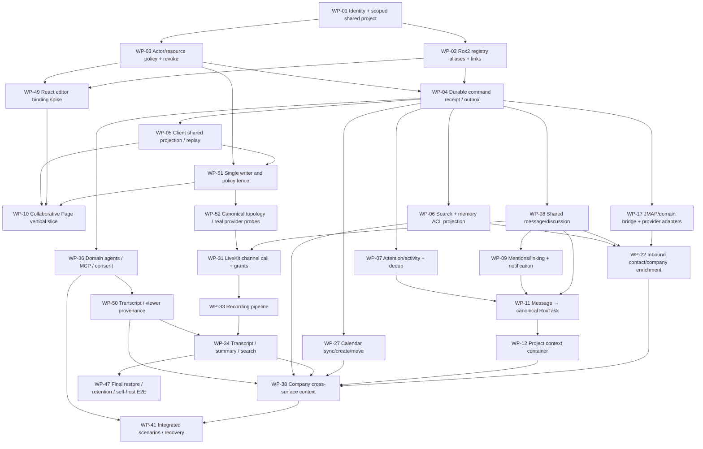

# Реализационный DAG и миграция

**PROPOSED** dependency graph; executable work-package edges — `plans/macro-integration/dependency-dag.json` и `work-packages.json`. Macro baseline `c966b79d40798c6c726a3b15fe90517941fc6e61`; ROX `f63294ba4fffa7238b46b24e918925a313ad0b12`. Source manifest graph в 02 — другой граф, не deployment roadmap.

DAG зависит от реальных ROX seams: typed Rox2 contracts уже есть; identity/authority отсутствует в transport и local stores; personal mode migrations precede shared exposure. Search/notifications включены в первые slices, потому что обязательны для features, но mature media pipelines не блокируют mail/CRM. Calendar и call media независимы: календарный event не требует SFU, call doesn't require Gmail. CRM ingest зависит от mail domain, а ручной Company/Contact slice может стартовать раньше полноценного provider sync.

## Rollout по работающим сценариям

1. Один пользователь открывает private shared Project и Task через native ROX, другой не видит их; command retries/restart сохраняют один результат. Identity/ACL/outbox вместе с UI и tests.
2. Два пользователя редактируют Page; same entity search/mention/share/agent read защищены ACL; disconnect/revoke handled. HTML Page режим остается доступен.
3. Human Channel → Message → Task → Project → assignment notification → source conversation agent context. Existing agent Sessions retained.
4. Приходит внешний email → Contact/Company → interaction timeline → searchable Company + email read permission. JMAP existing surface reused.
5. Company discussion mention → notification → agent context; Dossier migrates and keeps brief UX.
6. Calendar create/attendees/move/resize → provider read-back; timezone/recurrence/permission tests.
7. Channel Call multi-user AV → consent recording → transcript/summary/archive/search; local Meetings path regression.
8. Company cross-surface context gathers all linked entities with per-edge authorization and provenance. Automations consume same events with budget/consent.

Каждый slice включает UI/routing/entity/persistence/commands/queries/ACL/sharing/search/mentions/attention/activity/agents/API/observability/tests/documentation and failure/empty/loading/offline behavior as applicable. Horizontal substrate tasks are paired with user-visible scenario; no “DB done” as completion of a surface.

## Safety, rollback и ownership

Shared mode gated by verified server connection + schema compatibility; migrations operate per workspace, not global default. Registry backfill dry-run rejects duplicate alias/type mismatch; task personal namespace remains private until explicit migration mapping. Each migration produces counts/hashes/rejects, source revision receipts and backup reference. New write routing can be reverted before accepted shared writes; after accepted writes rollback requires log-aware reverse migration or forward repair, not overwriting backup over new data.

One writer per work package file area. WPs with overlapping `platform-contract.ts` / RPC types must land sequentially or via additive isolated PRs and coordinated integration; DAG records dependencies. Critical frontier: WP-01→02/03→04→05/51 and WP-49→10; WP-08/09→11→12→38→41. Mail/calendar/media идут отдельными ветвями. WP-52 provisions единственный `ops/macro-integration/compose.yaml`; WP-47 проверяет completed domain stack restore/retention. WP-35 local capture независим от live Google и hosted STT. Диаграмма — обзор, все 154 edges и точный topologicalOrder находятся в JSON.
