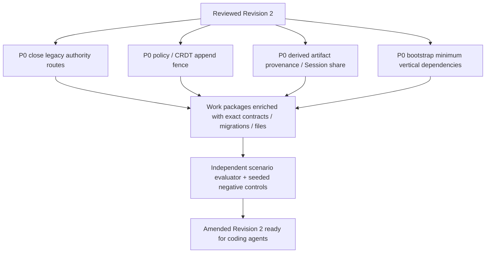

# Independent architecture challenge — Revision 1/2

Reviewer: independent ROX audit worker. Scope: architecture and machine work packages; read-only product review. Baseline ROX `f63294ba4fffa7238b46b24e918925a313ad0b12`; Macro baseline taken from dossier `c966b79d40798c6c726a3b15fe90517941fc6e61`. **PROPOSED** below names a correction; **SOURCE_EVIDENCE** refers to current code. No implementation or runtime test pass is claimed. Review preceded lead amendments; reviewed f63294ba4fffa7238b46b24e918925a313ad0b12256 snapshots listed at end permit distinguishing this draft from amended files.

## Verdict

**Revision 2 is a defensible target, but the reviewed machine plan is not yet implementation-ready across all 48 packages.** Its good decisions are canonical Rox2 refs, typed aggregates, one authority per entity/mode, React reuse, isolated CRDT content, provider sagas and current-ACL projection filtering. The principal remaining risks are executable closure: legacy write/read routes, ACL/sync fence races, provenance of persisted agent transcripts, startup dependencies and template-generated file/API/test scope.

Do not restart the design. Apply P0 changes before treating first shared-mode package complete; promote P1 requirements into the exact relevant work packages and contract specs. Most issues concern missing precision or work-package coverage, not a demonstrated flaw in the future implementation.

## P0-01 — New authority does not close legacy store entry points

**Failure experiment:** enable shared Documents/Projects/Tasks, then invoke legacy Notes save, Projects create, personalTasks PUT or agent Page tool against a migrated object. If these still write files or global task store, server authority and local authority diverge. `19` says this must not happen, but current WP-01/04/10/16 affected files do not enumerate/guard the complete existing call paths.

**Source:** Projects CREATE accepts argument workspaceId while ignoring `_ctx`; Notes save is ordinary file write with optional compare-check; NotesPage main save omits expectedRevision; personalTasks store uses config-dir, LIST is unscoped and CHANGED broadcasts all. Existing `command-gateway.ts` is LIST/APPROVE/DENY of owner pending commands, not a new entity command engine; its `decide(...,'owner')` cannot be reused as authenticated principal attribution. [RV-05](https://github.com/rox-one/rox-one/blob/f63294ba4fffa7238b46b24e918925a313ad0b12/packages/server-core/src/handlers/rpc/projects.ts#L58-L99) [RV-06](https://github.com/rox-one/rox-one/blob/f63294ba4fffa7238b46b24e918925a313ad0b12/packages/server-core/src/handlers/rpc/notes.ts#L502-L517) [RV-07](https://github.com/rox-one/rox-one/blob/f63294ba4fffa7238b46b24e918925a313ad0b12/apps/electron/src/renderer/pages/NotesPage.tsx#L879-L897) [RV-08](https://github.com/rox-one/rox-one/blob/f63294ba4fffa7238b46b24e918925a313ad0b12/packages/server-core/src/handlers/rpc/personal-tasks.ts#L29-L64) [RV-13](https://github.com/rox-one/rox-one/blob/f63294ba4fffa7238b46b24e918925a313ad0b12/packages/server-core/src/handlers/rpc/command-gateway.ts#L38-L115) [RV-04](https://github.com/rox-one/rox-one/blob/f63294ba4fffa7238b46b24e918925a313ad0b12/packages/server-core/src/transport/types.ts#L7-L21)

**Required correction:** common `ResolveAuthority(ref, workspaceMode)` before every legacy query/mutation/tool/IPC entry point for migrated kinds. Server-owned records may only call the shared command/query ports; local file/materializer writes require trusted internal receipt, not a renderer path. Explicit personal namespace remains local. Add legacy path inventory (`operation`, file/symbol, mode, authority, replacement port) and enforce fail-closed routing. Keep owner pending approvals as separate execution-consent domain, with additive bridge to new actor principal.

**Acceptance:** instrument old storage adapters and assert zero direct shared writes through UI, agent tools, legacy RPC, Notes watcher/import, page refresh and local IPC. Same calls in personal mode remain functional. Seed a bypass in one entrypoint; independent test must catch it. WP owners: 01/03/04/10/16/17/35/36.

## P0-02 — Per-principal revoke requires a linearization fence, not only an epoch token

**Failure experiment:** old-grant editor socket and sync shard are partitioned from metadata authority. DB revokes editor at epoch N+1. Old shard accepts/durably ACKs/broadcasts N operations before it receives invalidate. Grant expiry/current epoch language in `07` and `19` does not specify the fence that determines whether such an operation is committed before or after revoke.

Macro evidence dossier itself warns legacy document socket validation and per-surface lifecycle are not granular current membership authorization. The new ROX design must avoid inheriting that gap. Current ROX has no live shared sync transport at all; Team adapter is local-only and room provider disabled. [RV-19](https://github.com/rox-one/rox-one/blob/f63294ba4fffa7238b46b24e918925a313ad0b12/packages/shared/src/team/sync.ts#L38-L65) [RV-21](https://github.com/rox-one/rox-one/blob/f63294ba4fffa7238b46b24e918925a313ad0b12/packages/server-core/src/meetings/rooms.ts#L12-L43)

**Required correction:** define one ordered document policy/append authority and durable **fence receipt**. Option A: per-document actor serializes policy epoch changes, update append and broadcast; Revoke records pending denial in DB then completes only on actor fence receipt. No updates/broadcasts carrying older epoch may occur after that receipt; reconnect reads fenced policy. Option B: CRDT WAL append and policy epoch row use same Postgres transaction/lock, then worker broadcast rechecks current epoch. Any partition loses permission to ACK/broadcast; presence denies old principal too. Distinguish `revocation_requested`, authoritative rejection and `revocation_fenced`; a network close request alone is not proof.

**Acceptance:** deterministic barrier scheduler orders append/ack/revoke/fence/broadcast; all operations after fence are rejected, B remains active, old A receives no new content. Crash owner and replay pending fence. Seed stale epoch authorization or broadcast-before-fence check to reject the result. WP-03/05/10 must share this interface and tests.

## P0-03 — Private entity data can survive in shared agent transcript artifacts

**Failure experiment:** agent reads private Company mail or meeting transcript, saves excerpt/tool output/prompt in AgentSession, then shares Session to public viewer or another participant. Current-ACL Search/Memory/context checks do not protect the copied plaintext artifact. Revoke source after generation and re-open/share old Session.

**Source:** `Message` has transcript/tool content fields; `shareToViewer` loads and uploads entire stored Session JSON, and Sessions GET_MESSAGES retrieves via sessionId. Neither inspected code path implements canonical source-provenance ACL intersection. This is a current capability to close before mixing shared/private source contexts, not proof an existing customer leak occurred. [RV-16](https://github.com/rox-one/rox-one/blob/f63294ba4fffa7238b46b24e918925a313ad0b12/packages/core/src/types/message.ts#L252-L279) [RV-14](https://github.com/rox-one/rox-one/blob/f63294ba4fffa7238b46b24e918925a313ad0b12/packages/server-core/src/sessions/share-capability.ts#L139-L174) [RV-15](https://github.com/rox-one/rox-one/blob/f63294ba4fffa7238b46b24e918925a313ad0b12/packages/server-core/src/handlers/rpc/sessions.ts#L199-L207)

**Required correction:** `DerivedArtifactProvenance` at prompt/tool/result/summary/export/session-share boundary, carrying exact source refs/revisions and source policy constraints. Default shared artifact audience is intersection of readable source scopes; explicit permitted declassification is a reviewed separate operation. Session sharing/export must deny or redact derived private artifacts, including previously persisted text and public-viewer copies. Revoke blocks future session-context reuse and share refresh; already delivered plaintext cannot be erased from others' knowledge.

**Acceptance:** private mail → agent answer → Session share/public viewer/JSON export denies or redacts excerpt; source revoke invalidates future retrieval. Test manually authored user text separately from attributed retrieval. Seed stripped provenance/redaction bypass. Extend WP-06/36/38 and existing `sessions.ts`, `sessions/share-capability.ts`, message/session storage codecs, UI export/share, not only MCP defs.

## P0-04 — Early vertical slices have circular functional prerequisites

WP-01 promises native private shared Project without dependencies, but registry WP-02, grants WP-03 and durable writes WP-04 come later; affectedFiles omits Projects RPC/storage/UI. WP-04 promises Task update before canonical task creation/schema WP-11. WP-12 promises Page/task/channel/meeting/file projections while Page/Meeting/File packages are not dependencies. A graph that parses as a DAG can still be impossible to validate in its claimed order.

**Required correction:** distinguish **bootstrap tested minimum authority** from **later full feature conformance**, without implying partial screens are complete. WP-01 must own minimum principal+workspace+project+resource policy+entity key transaction and relevant native UI bridge; WP-02/03 extend those bootstrap interfaces rather than first creating essentials WP-01 relies on. WP-04 uses a declared test aggregate/actual Project mutation or owns minimum RoxTask table/command explicitly. WP-12 basic project context accepts only registered kinds, then expansion/conformance package depends on Page/Call/File completion. Add missing actual deps for WP-38 attachments and source context migration.

**Acceptance:** CI topologically applies migrations and runs each WP acceptance against only its declared completed prerequisites; no test-only hidden feature implementation. Independent reviewer traces every operation/table/route to a producing package. Seed removal of one required dependency and gate must fail. SQL ownership/interface artifact is a declared input per consumer.

## P1-01 — Existing canonical refs are preserved in prose but types diverge elsewhere

`05/06/19` correctly retain Rox2EntityRef; `07` proposes `CollaborationGrant.room: EntityRef` without canonical alias definition. `06` graph assigns Task → Principal while current assigned relation range is `person`; target Principal is distinct from CRM Contact and not an existing Rox2 kind. Native mutation check helper `isRevisionedEntityRef` also currently requires account namespace; blindly reusing it rejects native entities. [RV-01](https://github.com/rox-one/rox-one/blob/f63294ba4fffa7238b46b24e918925a313ad0b12/packages/core/src/rox2/platform-contract.ts#L218-L247) [RV-02](https://github.com/rox-one/rox-one/blob/f63294ba4fffa7238b46b24e918925a313ad0b12/packages/core/src/rox2/platform-contract.ts#L380-L402) [RV-03](https://github.com/rox-one/rox-one/blob/f63294ba4fffa7238b46b24e918925a313ad0b12/packages/core/src/rox2/platform-contract.ts#L601-L611)

**Fix:** one imported `Rox2EntityRef` everywhere; typed `PrincipalRef` or workspace-visible principal entity projection must be explicitly registered with privacy rules and relation validation. Preserve `person`/Contact legacy mappings, never identify auth principal by email. Define expectedRevision native commands independently of remote account requirement; typed evidence refs require revision, provider aliases require account namespace. Conformance tests cover native task assignment, provider remote ID collisions, unknown kinds, encoded delimiter and legacy refs.

## P1-02 — Durable consumer inbox semantics and ordering need machine contracts

`19/17` correctly distinguish DB transaction and external saga and reject obsolete search revisions. Work-package DB strings and shared realtime templates still leave claim/processing semantics implicit. `(consumer,eventId)` inserted before effect and treated as processed loses work after a crash; effect before marker repeats external send. Two outbox workers may deliver revision 2 before revision 1; a later permission tombstone cannot be undone by stale content reindex.

**Fix:** separate leased `claimed` from `processed`; local projection effect+processed receipt+watermark same DB transaction. External provider side effects use stable intent/payload hash, `unknown_effect` reconciliation, not exactly-once claim. Consumers retain per-aggregate revision plus policy/tombstone fences; out-of-order events either wait/replay gap or idempotently supersede with current snapshot. Notification collapse uses causal reason/collapse key and read state; activity facts remain durable despite UI coalescing. Current lossy WorkspaceEventBus remains downstream only. [RV-17](https://github.com/rox-one/rox-one/blob/f63294ba4fffa7238b46b24e918925a313ad0b12/packages/shared/src/automations/event-bus.ts#L263-L300)

**Acceptance:** crash before effect/after effect/before mark, reorder update/delete/revoke, duplicate scheduled send and unknown SMTP result. Record expected rows/delivery state and injected mutation caught. WP-04/06/07/18/19/21/33/34/37 specify unique keys and state transitions separately.

## P1-03 — File capability scope and revoke semantics need consistent acceptance

`13` already acknowledges signed URL TTL and bounded access. WP-39 says "signed URL revoke short expiry" without explicit bound or new asset gateway path. Offline copy and an issued bearer URL are different from read API authorization. Do not claim immediate file revocation based on websocket close alone.

**Fix:** private downloads through policy-checking asset proxy/lease with range requests and refresh; if object-store signed URLs are used, document maximum residual validity (e.g. configured <=60s) and test bound, not immediate revocation. Filename/MIME/size/preview text are also private metadata. Blob finalize validates checksum/ownership/scan stage before attachment link; event comes from finalize transaction. Add file/job/object migration schemas and URL cache invalidation test to WP-39/33/44/47.

## P1-04 — Context graph side channels and access-dependent caching remain underdefined

`06` returns "redacted counts"; inaccessible link count, pagination total, autocomplete suggestion and cached title can leak existence even without snippets. Policy epoch scope is not defined: global workspace epoch per any grant change causes all users' caches to invalidate; per-resource epochs require dependency-aware derived context cache.

**Fix:** response exposes only authorized refs/counts; generic unavailable placeholder only when caller already has access to a source occurrence that contains that reference. No hidden-node totals/order hints. Define permission-version vector/hash for principal+workspace+resource/dependency set, or conservative workspace epoch initially with measured churn and TTL. Derived Company context checks each edge target before cache; no inherited mail access via Project link. Mention notification recipients must currently read both source and target and local self-authored activity doesn't imply remote delivery.

**Acceptance:** A and B have same authorized graph plus different private nodes; observable search results/totals/cursor lengths/context summaries are indistinguishable for B. Add source-discovered opaque reference test. Seed hidden count/title inclusion and evaluator rejects.

## P1-05 — CRDT choice and editor adapter spike are not yet ready for WP-10 execution

Prose rejects framework copy and retains React. WP-10/15 only lists PageView/pages storage and slug modules; no editor/CRDT adapter files, wire compatibility, explicit runtime dependency choice/license or Tiptap/ProseMirror schema mapping. Source Notes editor uses Tiptap; Macro collaboration schema binds Lexical serialized state, so reusing binary protocol does not guarantee compatible editor trees.

**Fix:** bounded technical spike owned before WP-10: choose vetted standalone Loro or Yjs dependency, define target rich text schema/selection/undo adapter and import/export mapping. Native Tiptap reuse is a candidate, not assumed compatible. Include Mermaid/task/wiki link/comments round-trip and concurrent edits across versions; restore_as_new_revision does not replace CRDT history blindly. Write/verify adapter files `packages/ui/src/components/markdown/TiptapMarkdownEditor.tsx`, `renderer/pages/NotesPage.tsx`, new collaborative EditorBinding/runtime/codec. Source copy remains separate licensing gate. [RV-07](https://github.com/rox-one/rox-one/blob/f63294ba4fffa7238b46b24e918925a313ad0b12/apps/electron/src/renderer/pages/NotesPage.tsx#L879-L897)

## P1-06 — Machine work packages still contain template insufficiency

Reviewed JSON has **48** packages; all 48 API changes and DB changes are strings, all 48 reasons share boilerplate construction; **31** permission objects and **30** realtime objects are identical. AffectedFiles exist, but many are only domain placeholders. Slug-generated "one huge module per work package" filenames can create fragmented orchestration wrappers that duplicate the shared domain implementation.

This is measurable plan content, not subjective estimate. Package titles/acceptance scenarios are useful; fields being present does not prove independently executable scope.

| WP | Precise amendment to files/artifacts/contract/deps |
|---|---|
| 01/03 | Add `transport/server.ts`, Projects RPC/storage and renderer ProjectInfoPage/native list; auth issuer/session subject mapping, workspace membership and policy SQL migration, generated typed RPC/HTTP client |
| 04/05 | New reusable commands/outbox/projections repositories and tests; preserve existing owner pending command gateway. Define command payload/receipt/error schema and migration ID; avoid slug module copies |
| 06 | Include actual `services/search.ts`, `memory/fts-index.ts`, `knowledge/vault-index.ts`, platform resource provider registry and new search extractor/index worker paths; artifact provenance and stale ACL/tombstone ordering |
| 07 | Include InboxPage/useInboxItems/TeamInbox UI adapter and sync transport; notification collapse/read state SQL and exact recipient eligibility |
| 08/09 | Define human Channel/Discussion native route/UI files and thread membership/read/reaction/typing scope; source Message entity payload schemas and permission context |
| 10/15/16 | Add core page type, actual TiptapMarkdownEditor/NotesPage/notes-RPC adapter, stable note aliases, sync codec/runtime/WAL/lease artifacts, rich-content negative controls; no blind Lexical JSON port |
| 11/13/14 | Add PersonalTaskPersistStore/renderer personal-tasks-sync/task reminders and recurrence implementation; stable personal namespace registry import, expectedRevision PUT and concrete timezone/checklist conflicts |
| 17–21 | Extract core MailAccount/Thread/Message/Draft/Connection DTO/schema; add main mail IPC, shared MAIL contract, provider delta/backfill/send jobs and state migrations; do not implement Gmail/IMAP in JmapClient itself |
| 22–26 | Include CRM ingestion/repositories/email event consumer, normalized source keys, Dossier storage importer, pipeline schemas. UI files alone cannot own enrichment permissions and history |
| 27–30 | Provider OAuth/watch/token/cursor worker paths and Calendar UI route/editor/attendee controls; state whether Meeting stays call subtype now. WP-35 must not require complete Google provider and CRM just to preserve local recording |
| 31–34 | Add LiveKit React media UI/token route/webhook validator/room repository, egress object job/ffmpeg/STT/summary service paths and deployment contracts; distinguish media API success and webhook reconciliation |
| 35 | Add actual `main/meetings/{local-store,local-asr,local-ipc}.ts`, `shared/meetings-local.ts`, `renderer/lib/meetings/recorder.ts`, `pages/meetings/LocalMeetingDetail.tsx`. Validate local no-network path before cloud scheduling/CRM |
| 36/38 | Add session message/share/export codecs and agent execution dispatch, not only tool definitions; derived artifact ACL and Graph context budgets/unknown refs |
| 39/44 | Add upload/object gateway/extractor/viewer actual files + staged blob SQL, authenticated asset host/invalidation, previews and immutable binary version policy |
| 46 | Scope accurately: narrow responsive web ≠ native iOS. If mobile includes iOS, `apps/ios` transport/storage/deep-link/media files must be listed and built. Device-specific replay assertions and native capability probe |
| 47 | Add service package manifests/build/health/config, actual infra/compose/deploy/env templates/runbooks/test fixtures. Task acceptance full Page+call+mail depends on corresponding WPs, not only call/recording/file foundation |
| 48 | Own dependency lock/SBOM/license/notices/build-gate artifacts, not commands module. Dependencies/import gates must consume exact artifact audit before reuse; seeded invalid origin/notices is the negative control |

**Minimum executable package schema supplement:** `inputs` (artifact producer IDs), `operations` (typed request/response/errors), `migrations` (file, tables, columns, FK/unique/index/check, forward/rollback), `entryPoints` (file+symbol/action), `newArtifacts` (module interfaces, not just filename), `verification` (runner, fixture, expected observations and seed mutation). Keep existing acceptance descriptions but replace boilerplate where it fails actual surface.

## Alternative constructions and cheapest falsification

| Candidate | Authority / deployment construction | Advantage | Cost/risk | Cheapest falsification |
|---|---|---|---|---|
| A. Native modular DB + fenced per-document sync actors | Typed metadata/ACL/outbox in Postgres; CRDT WAL owned by independent actor, policy fence receipts bridge DB | Existing selected design with genuine websocket scaling and typed domains | Cross-service revoke/materialization repair must be explicit | Deterministic partition/revoke/append/broadcast schedule; no stale post-fence delivery and restart preserves fenced epoch |
| B. Native modular DB with shared CRDT WAL/policy transaction store | Same canonical schema; sync workers lease document streams but append WAL and policy epoch under DB transaction | Simpler revoke linearization and backup/readback consistency for initial rollout | Hot-document row contention and DB WAL volume; content append backpressure | 2-user semantics first, then measured 100 concurrent editors/hot doc; capture p95 durable ACK/lease expiry/backlog against declared budget |
| C. Conation remote authority adapters | Shared ROX views and refs project remote identity/data; native local private stores remain separate authority | Potentially fewer providers/domain services to own | Current client query-only; upstream mutation/ACL/event/API/license constraints unresolved | Authorized create/update/revoke/readback/event-idempotency capability proof; failing/blocked APIs keep entire affected capability unavailable |

A and B are viable native implementations under current ROX control; pick B for first workspace slice if operational simplicity outweighs hot-document volume, then move content backend behind same port after actual pressure. C is conditional, not an executable substitute on current code. Current SoupClient has queries and no mutation methods; no tested server team sync/production calendar/SFU can be assumed from enum/routes. [RV-18](https://github.com/rox-one/rox-one/blob/f63294ba4fffa7238b46b24e918925a313ad0b12/packages/core/src/conation/soup/client.ts#L16-L22) [RV-19](https://github.com/rox-one/rox-one/blob/f63294ba4fffa7238b46b24e918925a313ad0b12/packages/shared/src/team/sync.ts#L38-L65) [RV-20](https://github.com/rox-one/rox-one/blob/f63294ba4fffa7238b46b24e918925a313ad0b12/packages/core/src/calendar/adapters.ts#L115-L127) [RV-21](https://github.com/rox-one/rox-one/blob/f63294ba4fffa7238b46b24e918925a313ad0b12/packages/server-core/src/meetings/rooms.ts#L12-L43)

Do not choose Macro service composition to avoid domain design while license/backend capability is unsettled: UI adapter solves neither identity nor policy consistency. No additional framework is justified by any candidate.

## Independent evaluator: rejection controls

| Control | Seeded broken behavior | Required independent observation |
|---|---|---|
| Authority bypass | Shared Notes legacy file write remains enabled | Direct writer tracer catches mutation, fails despite shared UI converging |
| Forged actor | Command body principal honored / legacy owner string accepted | Authenticated B sees 403/opaque denial; A-owned row unchanged |
| Tenant isolation | Personal task globally exposed by all-client push | Second workspace/client receives no private ID/title/payload |
| Revoke fence | Sync validates only join-time epoch | Deterministic post-fence update/broadcast rejected, B unaffected |
| WAL durability | ACK before WAL append | Crash+restart lacks ACKed edit → suite rejects |
| CRDT causality | Reset snapshot on missing predecessor | Offline durable branch missing → suite rejects logical export mismatch |
| Undo | Replace whole rich text on local undo | B insertion survives; seeded replace fails |
| Derived artifact | Drop source refs before Session export/share | Private marker appears in JSON/public viewer → reject |
| Projection order | Apply old update after tombstone/revoke | Search/title/preview cannot resurrect; mutation rejected |
| Outbox state | Mark inbox processed before effect | Crash schedule produces missing attention row → reject |
| External send | Retry unknown SMTP/provider effect blindly | Duplicate submission count caught; unknown preserved until reconciled |
| Link/cache leakage | Include hidden target totals/title | B response distinguishability test fails |
| Identity collision | Strip provider/account namespace | Same remote ID across two accounts incorrectly merges → reject |
| Task migration | Match TaskProject by display name | Collision imports/quarantine differ; no silent merge |
| Media | Mark archive ready before transcript/recording receipts | Component states/status cannot fake artifact ready; missing key/hash caught |
| License | Allow unreviewed copied code or missing exact dependency notice | Release gate rejects exact built artifact; unrelated actor mutation is not relevant |

Each evaluator consumes actual scenario traces, API readback/row counts and rendered UI where applicable, not only work-package author text. It receives seed ID and expected invalid behavior but should also have blind holdout corruptions; keep baseline infra errors distinct from caught product mutations. **No controls have been executed in this architecture-only review.**

## Evidence index

| ID | Repository / SHA / path / symbol / lines |
|---|---|
| RV-01 | `rox-one/rox-one@f63294ba4fffa7238b46b24e918925a313ad0b12` · [packages/core/src/rox2/platform-contract.ts:218-247 · `formatRox2EntityId / Rox2EntityRef / Rox2ExternalBinding`](https://github.com/rox-one/rox-one/blob/f63294ba4fffa7238b46b24e918925a313ad0b12/packages/core/src/rox2/platform-contract.ts#L218-L247) |
| RV-02 | `rox-one/rox-one@f63294ba4fffa7238b46b24e918925a313ad0b12` · [packages/core/src/rox2/platform-contract.ts:380-402 · `ROX2_RELATION_RULES / isAllowedRox2Relation`](https://github.com/rox-one/rox-one/blob/f63294ba4fffa7238b46b24e918925a313ad0b12/packages/core/src/rox2/platform-contract.ts#L380-L402) |
| RV-03 | `rox-one/rox-one@f63294ba4fffa7238b46b24e918925a313ad0b12` · [packages/core/src/rox2/platform-contract.ts:601-611 · `authorizeRox2Action`](https://github.com/rox-one/rox-one/blob/f63294ba4fffa7238b46b24e918925a313ad0b12/packages/core/src/rox2/platform-contract.ts#L601-L611) |
| RV-04 | `rox-one/rox-one@f63294ba4fffa7238b46b24e918925a313ad0b12` · [packages/server-core/src/transport/types.ts:7-21 · `RequestContext / RpcHandlerOptions`](https://github.com/rox-one/rox-one/blob/f63294ba4fffa7238b46b24e918925a313ad0b12/packages/server-core/src/transport/types.ts#L7-L21) |
| RV-05 | `rox-one/rox-one@f63294ba4fffa7238b46b24e918925a313ad0b12` · [packages/server-core/src/handlers/rpc/projects.ts:58-99 · `registerProjectsHandlers.projects.CREATE`](https://github.com/rox-one/rox-one/blob/f63294ba4fffa7238b46b24e918925a313ad0b12/packages/server-core/src/handlers/rpc/projects.ts#L58-L99) |
| RV-06 | `rox-one/rox-one@f63294ba4fffa7238b46b24e918925a313ad0b12` · [packages/server-core/src/handlers/rpc/notes.ts:502-517 · `saveNote`](https://github.com/rox-one/rox-one/blob/f63294ba4fffa7238b46b24e918925a313ad0b12/packages/server-core/src/handlers/rpc/notes.ts#L502-L517) |
| RV-07 | `rox-one/rox-one@f63294ba4fffa7238b46b24e918925a313ad0b12` · [apps/electron/src/renderer/pages/NotesPage.tsx:879-897 · `NotesPage.saveCurrentNote`](https://github.com/rox-one/rox-one/blob/f63294ba4fffa7238b46b24e918925a313ad0b12/apps/electron/src/renderer/pages/NotesPage.tsx#L879-L897) |
| RV-08 | `rox-one/rox-one@f63294ba4fffa7238b46b24e918925a313ad0b12` · [packages/server-core/src/handlers/rpc/personal-tasks.ts:29-64 · `personalTasksStore / registerPersonalTasksHandlers`](https://github.com/rox-one/rox-one/blob/f63294ba4fffa7238b46b24e918925a313ad0b12/packages/server-core/src/handlers/rpc/personal-tasks.ts#L29-L64) |
| RV-09 | `rox-one/rox-one@f63294ba4fffa7238b46b24e918925a313ad0b12` · [packages/core/src/tasks/personal/types.ts:46-85 · `PersonalTask`](https://github.com/rox-one/rox-one/blob/f63294ba4fffa7238b46b24e918925a313ad0b12/packages/core/src/tasks/personal/types.ts#L46-L85) |
| RV-10 | `rox-one/rox-one@f63294ba4fffa7238b46b24e918925a313ad0b12` · [apps/electron/src/main/meetings/local-store.ts:189-255 · `LocalMeetingStore.recStop/finalizeRecording/recover`](https://github.com/rox-one/rox-one/blob/f63294ba4fffa7238b46b24e918925a313ad0b12/apps/electron/src/main/meetings/local-store.ts#L189-L255) |
| RV-11 | `rox-one/rox-one@f63294ba4fffa7238b46b24e918925a313ad0b12` · [apps/electron/src/main/meetings/local-asr.ts:36-63 · `detectEngine`](https://github.com/rox-one/rox-one/blob/f63294ba4fffa7238b46b24e918925a313ad0b12/apps/electron/src/main/meetings/local-asr.ts#L36-L63) |
| RV-12 | `rox-one/rox-one@f63294ba4fffa7238b46b24e918925a313ad0b12` · [apps/electron/src/renderer/lib/meetings/recorder.ts:126-179 · `startRecording`](https://github.com/rox-one/rox-one/blob/f63294ba4fffa7238b46b24e918925a313ad0b12/apps/electron/src/renderer/lib/meetings/recorder.ts#L126-L179) |
| RV-13 | `rox-one/rox-one@f63294ba4fffa7238b46b24e918925a313ad0b12` · [packages/server-core/src/handlers/rpc/command-gateway.ts:38-115 · `authorizeWorkspace / registerCommandGatewayHandlers`](https://github.com/rox-one/rox-one/blob/f63294ba4fffa7238b46b24e918925a313ad0b12/packages/server-core/src/handlers/rpc/command-gateway.ts#L38-L115) |
| RV-14 | `rox-one/rox-one@f63294ba4fffa7238b46b24e918925a313ad0b12` · [packages/server-core/src/sessions/share-capability.ts:139-174 · `shareToViewer`](https://github.com/rox-one/rox-one/blob/f63294ba4fffa7238b46b24e918925a313ad0b12/packages/server-core/src/sessions/share-capability.ts#L139-L174) |
| RV-15 | `rox-one/rox-one@f63294ba4fffa7238b46b24e918925a313ad0b12` · [packages/server-core/src/handlers/rpc/sessions.ts:199-207 · `sessions.GET_MESSAGES`](https://github.com/rox-one/rox-one/blob/f63294ba4fffa7238b46b24e918925a313ad0b12/packages/server-core/src/handlers/rpc/sessions.ts#L199-L207) |
| RV-16 | `rox-one/rox-one@f63294ba4fffa7238b46b24e918925a313ad0b12` · [packages/core/src/types/message.ts:252-279 · `Message`](https://github.com/rox-one/rox-one/blob/f63294ba4fffa7238b46b24e918925a313ad0b12/packages/core/src/types/message.ts#L252-L279) |
| RV-17 | `rox-one/rox-one@f63294ba4fffa7238b46b24e918925a313ad0b12` · [packages/shared/src/automations/event-bus.ts:263-300 · `WorkspaceEventBus.emit`](https://github.com/rox-one/rox-one/blob/f63294ba4fffa7238b46b24e918925a313ad0b12/packages/shared/src/automations/event-bus.ts#L263-L300) |
| RV-18 | `rox-one/rox-one@f63294ba4fffa7238b46b24e918925a313ad0b12` · [packages/core/src/conation/soup/client.ts:16-22 · `SoupClient`](https://github.com/rox-one/rox-one/blob/f63294ba4fffa7238b46b24e918925a313ad0b12/packages/core/src/conation/soup/client.ts#L16-L22) |
| RV-19 | `rox-one/rox-one@f63294ba4fffa7238b46b24e918925a313ad0b12` · [packages/shared/src/team/sync.ts:38-65 · `LocalOnlyTeamSyncAdapter / createTeamSyncAdapter`](https://github.com/rox-one/rox-one/blob/f63294ba4fffa7238b46b24e918925a313ad0b12/packages/shared/src/team/sync.ts#L38-L65) |
| RV-20 | `rox-one/rox-one@f63294ba4fffa7238b46b24e918925a313ad0b12` · [packages/core/src/calendar/adapters.ts:115-127 · `createProductionAdapter`](https://github.com/rox-one/rox-one/blob/f63294ba4fffa7238b46b24e918925a313ad0b12/packages/core/src/calendar/adapters.ts#L115-L127) |
| RV-21 | `rox-one/rox-one@f63294ba4fffa7238b46b24e918925a313ad0b12` · [packages/server-core/src/meetings/rooms.ts:12-43 · `ROOM_PROVIDER_DECISION / joinRoom`](https://github.com/rox-one/rox-one/blob/f63294ba4fffa7238b46b24e918925a313ad0b12/packages/server-core/src/meetings/rooms.ts#L12-L43) |

## Reviewed draft snapshots

| Reviewed artifact | SHA256 before amendments |
|---|---|
| `docs/macro-integration/19-target-architecture.md` | `f23897ad5a6850e3f1f0364e181f4502eb32ee71fdc60348bce63088e986ec8f` |
| `docs/macro-integration/05-domain-model.md` | `0fe45ddfbb59d08103ce7106bfca2457a4a385ae72efb1283ce1185b26c58eca` |
| `docs/macro-integration/06-entity-graph.md` | `2922716fbc5039afbb6a4c6461992549f0718f0c396b95db8616f343ffeb736b` |
| `docs/macro-integration/20-migration-dag.md` | `1e84bc4e878038002d7523e7727cb7274bae122c7dc69a219eb47b0de24919a5` |
| `plans/macro-integration/work-packages.json` | `077f327d3c5f1967713dcdf3432f6391f9e558d46e75848021a9f09e2c524587` |
| `docs/macro-integration/07-collaboration-runtime.md` | `b31cfc34007a7cb1a91a8a6ebd15de7d96d90bbb0c44081f048495a1591cd306` |
| `docs/macro-integration/11-mail.md` | `ca6f414601239aae7a4b7e54ac177db98d751cff23c3248dae2f5ebc944f435e` |
| `docs/macro-integration/13-calls-meetings.md` | `f865763f2ed862b3451e1b59225d0f883fd68f18b82bdf669f89ae92941cb0bf` |
| `docs/macro-integration/14-permissions-sharing.md` | `03a1f7830a12ce042647e49ed3d18ac44ad49899b067603d4ab04622148e89d9` |
| `docs/macro-integration/15-search-notifications.md` | `fbd1c22519623c2e5474c6e83f81074dfa87a29b7414959af1bf296454eb90d6` |
| `docs/macro-integration/16-agent-integration.md` | `b3b483ff4d8fcf79b6934befb50805fe3bd7f847127c4a0ae742e591b63f0c27` |
| `docs/macro-integration/17-infrastructure.md` | `93a0320edfa1ebf253baa9b9280fc3a335006c1079a81f535e8a604b61a05b6d` |

## Revision 2 resolution and final independent readback

Reviewed draft hashes above remain historical. Lead integrated four P0 and six P1 design findings into19 and the machine plan; these are design resolutions, not runtime passes. WP-49 editor binding, WP-50 artifact provenance, WP-51 writer/revoke fencing and WP-52 bootstrap complement the original48 packages. Domain review adds20 targeted amendments and73 verified touchpoints.

Final independent readback closed all seven late artifact issues: WP-52 schema refs; authorized-only counts; rich-text/spreadsheet CRDT scope; one canonical topology path; frontend surface-entry attribution; R10 source range;52-package count. WP-01 bootstrap has no FK to future registry tables. Surviving blockers within that bounded artifact review: none. Feature behavior still requires the implementation E2Es in22.
