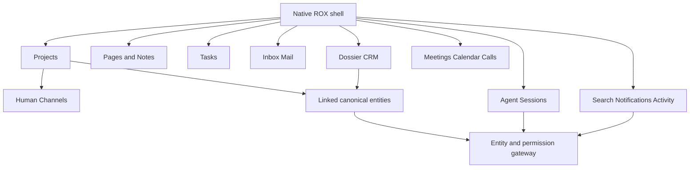

# ROX ONE: подробный продуктовый PRD, редакция 3

Статус: specification, не реализованные функции. Основа — Revision2 в `../19-target-architecture.md`; эта редакция уточняет placement, interaction и cloud delivery. Source ROX `e780e73ae84c977cf81546b49140d318dfcd6049` (UI code совпадает с `f63294ba4fffa7238b46b24e918925a313ad0b12`), Macro `5678f9bd777413f66e8bddac58f13f21150d831b` (latest observed remote main при final recheck). Сравнение всех первоначальных evidence paths — `plans/macro-integration/reverification.json`; intermediate44a сохранён в отчёте. Leaf domain evidence retain исходный immutablec966, когда файлы не изменились.

## 1. Ожидаемый продукт

ROX сохраняет собственные Sessions, Projects, Pages, Tasks, Meetings, Notes, Memory, Sources, Skills, Automations, Connections и Settings. Mail развивается в Inbox, CRM — в Досье. Calendar — новое представление внутри Meetings, связанное с Tasks/Project. Human Channels открываются в Project и через поиск/избранное. Agent Sessions остаются отдельными диалогами с агентами.

Пользователь открывает Company, видит доступные контакты, письма, задачи, события, встречи, звонки и документы; обсуждает компанию; создаёт задачу из сообщения; спрашивает агента обо всём разрешённом account context. Переход между представлениями сохраняет ID, ACL, source и history.

## 2. Точное размещение

| Existing ROX destination | Target screen / extension | Expected result |
|---|---|---|
| Projects → Project detail | Overview + Documents + Channels + Meetings + Activity; сохраняются Sessions/Tasks/Assets/Settings | единый contextual container и membership, deep link вкладки |
| Pages → detail | «Документ / Артефакт», редактор, participants, comments, history | CRDT document отдельное содержимое существующего Page; HTML sandbox сохранён |
| Notes → note detail | «Связать с Project / Перенести в общий документ», conflict compare | Markdown/file origin сохранён через aliases, path не глобальный ID |
| Tasks → list/board/detail | assignee/priority/Project/dates/discussion/source refs | одна RoxTask, recurrence/checklist retained |
| Tasks reminder / Inbox reminder notification | один reload-safe Reminder detail, snooze/timezone/source-link отдельно | открытие reminder не перенаправляет в source автоматически; тот же canonical ref |
| Project → Channels → channel | messages/threads/reactions/mentions/files/unread/call | persisted human Message; Sessions не подменяет канал |
| Entity detail → Обсуждение | общий composer/thread, parent EntityRef | CRM/Page/Task discussion с одной primitive и author identity |
| Ещё → Досье → Компании/Контакты | list/board, stage/owner/revenue, account tabs, identity resolution | Company/Contact canonical; входящий email обогащает CRM |
| Inbox → account/folder/thread | neutral Mail entities, adapters, compose/schedule, CRM provenance | JMAP сохранён, provider read-back, ambiguous sends reconcile |
| Meetings → Календарь | agenda/day/week/month, calendar filter, event editor | provider-side create/move/resize/RSVP/recurrence |
| Meetings → Meeting/Call detail | event links, local capture/import, live media, archive processing | один Call ID, consent, recording/transcript/summary receipts |
| Omnibox | scope/types, permission-filtered results, peek/backlinks | скрытый объект не выдаёт title/count |
| Inbox attention / shell indicator | сохраняются Все/Решения/Сообщения/Отложенные/Готово и Mail folders; добавляются scoped Уведомления/Активность representations; shell indicator открывает их | единая notification primitive; mark-read не approve/deny агентский запрос |
| Sessions composer/context rail | entity chips, context preview, command preview/receipts | agent read/write через общий policy gateway |
| Memory | provenance/freshness/ref/retraction | revoked content исключён из чтения/agent retrieval |
| Automations | canonical trigger/dedup/budgets/receipts | повтор event не создаёт повтор side effect |
| Connections/Settings | service/provider capability, last read-back, scopes | подключённый token не равен работающему adapter |
| Project assets/viewer | File upload/retry/preview/download/retention | один File ref; ACL во всех representations |

Пути, существующие компоненты и lines находятся в `rox-screen-audit.md`. Конкретные leaf screens, controls, commands и acceptance — `collaboration-screens.md`, `domain-screens.md`, `shared-screens.md`. Proposed routes не объявляются существующими.

## 3. Навигация и единый detail

1. Existing nav registry — единственный источник destinations. Entity kind регистрирует renderer/search/tools/commands/policy; отдельный Macro sidebar не появляется.
2. List selection, filters, Project tab и mail thread восстанавливаются из route/back-forward; текущий local selection state нужно расширить.
3. Header: type glyph, title, context breadcrumb, sync state, participants where applicable, favorite, share, overflow. Title editable только с write. New panel показывает тот же ref.
4. Обсуждение, связанные объекты, activity и history — views канонической сущности; не копии store per tab. Counts только authorised.
5. Favorite хранит ref, не URL/path. После revoke cached title/preview удаляются; private link не делает объект public.

## 4. Expected user scenarios

### Page collaboration

A→Pages→document→Share→B editor. B открывает тот же ref. Avatars/carets/selection отражают присутствие, обе concurrent edits сходятся. Offline status: «Сохранено на устройстве»; «Синхронизировано» только durable ACK. Revoke прекращает reads/writes/subscription и скрывает cached preview. Local unsent edits не отправляются обходным IPC после revoke.

DoD: один document ID/CRDT authority, reload converges, WAL survives restart, offline replay idempotent, revoked read/tool denied. Target sandbox p95 edit propagation≤1s, awareness≤300ms при RTT≤100ms/2clients/50KBdoc — измеряемые budgets, не текущий performance claim.

### Message→Task→Project

Message toolbar→«Создать задачу»→dialog: вручную заданный title/body и source backlink, assignee, Project, date. Автоматический private excerpt запрещён при более широкой Task audience. Если разрешён explicit source.export/declassify, preview/decision связывают actor, source revision, content digest, target audience policy/revision; сервер повторно проверяет decision при commit. Без такого решения body не копируется. Confirm→pending→receipt/task ref. Source message получает task chip, task — derived-from ref, Project — membership, assignee — одну notification. Agent читает только разрешённый source thread.

DoD: повтор command создаёт одну задачу, retry/reload сохраняет ref, denied source не раскрывает excerpt, Task list/Project/Search/Agent видят одну revision.

### Email→CRM

New external inbound sender→normalization→Contact→Company domain/override→first/last interaction→CRM/search. Generic domain не создаёт компанию «gmail.com»; ambiguity queue требует resolution. Provenance хранит account/message. Company permission не открывает private email автоматически. Это enhancement относительно Macro sent-only discovery.

DoD: replay одного provider event не дублирует Contact, identity merge reversible, last interaction корректен при out-of-order messages, Company tabs показывают только authorized mail.

### CRM discussion / account context

Company→Обсуждение→@teammate→send. Общий Message parent=Company; mention не auto-share. Если recipient denied, явный share flow. Company tabs открывают native Tasks/Pages/Meetings/Inbox. «Спросить агента» создаёт Session с Company ref и разрешёнными источниками.

DoD: один recipient notification, discussion searchable, hidden titles/counts absent, agent summary citations use readable sources.

### Calendar / Call lifecycle

Meetings→Календарь→empty slot→title/calendar/local time/IANA zone/attendees. Move/resize→old/new preview→recurrence scope→provider read-back. Event→Meeting link. Channel→Start call→ACL/token→device check→participants. Record требует explicit consent. End→same Call ID archived; recording/preview/transcript/summary независимые states. Без transcript Call всё равно searchable. Local capture/import работает без LiveKit.

DoD: account-scoped provider IDs, DST/recurrence handled, ambiguous write reconciled, guests не получают workspace membership, consent ledger, immutable raw spans и summary citations, stage retries не дублируют artifacts.

## 5. Input/output domain contract

Mutation input: Actor injected by server, Workspace, canonical ref, payload, expectedRevision where applicable, commandId/idempotencyKey, replay policy epoch. Renderer не назначает principal. Output: receipt/ref/revision/status/provider reconciliation state/event IDs. Query output: authorised data/pagination/projection watermark. Tokens не выводятся в ordinary renderer queries.

Awareness ephemeral, business events durable outbox/inbox. Notification policy отдельна от activity retention. Связь не даёт read grant автоматически. Local standalone обозначен как standalone, не как shared session. Не допускается simultaneous local+remote authoritative writer.

## 6. UI/UX и completion

Наследуем semantic tokens/font/density текущего ROX, React UI. Solid Macro components переносить напрямую нельзя; headless logic допускается после license review. Общие effects/keyboard/state contracts — `UI-UX-CONTRACT.md`.

Hover не выполняет mutation/read-mark/AI request. Focus открывает те же действия, touch получает overflow. Empty, loading, error, forbidden, cached offline, queued, provider pending, unsupported, conflict и readback verified различаются. `catch=>[]` после failed query — дефект.

DoD feature: UI+route+model+persistence+commands/queries+ACL/sharing+links/mentions+search+notification/activity+agent+realtime where needed+tests+telemetry+docs+failure/recovery. N/A требует причину. Evidence: exact commit/roles/env/steps/expected-observed/screenshot/API/provider read-back/restart/negative-control/output hashes. Linux fixture pass не закрывает macOS device или live provider gate.

## 7. Vertical rollout

1. Private shared Project, authenticated Actor, bootstrap, canonical refs, policy, receipt, legacy writer guard.
2. Editor conformance spike→one shared Page→Search/Notification/Agent.
3. Human Channel→Task→Project, existing personal recurrence retained.
4. JMAP Mail domain/recovery→Inbound CRM→account context; adapters staged.
5. Calendar live adapter→event editing→Meetings; media separate service.
6. Recording/transcript/summary durability, viewers, automation, restore/licensing release gate.

Authoritative DAG:52 existing packages; cloud packet adds exact screens/controls/gates. Этот список не заменяет dependencies.

## 8. Принятые решения

- CRM в Досье; Calendar в Meetings; Human Channels в Project; новый глобальный поиск/favorites entry не создаёт второе приложение.
- Current typography: Arial Narrow sans fallback/Rox mono according to source; label mismatch отдельный opt-in correction с computed-font proof, не глобальный rewrite.
- Shared Postgres/service authority, local SQLite/JSON projections or standalone adapters; one writer.
- Agent uses domain APIs, не UI scraping, и не обходит ресурсные permissions.
- Default cloud output branch/draft PR; merge/deploy не выполняется в implementation worker.
- Literal source port после licensing gate; Macro rights не предполагаются разрешёнными.
