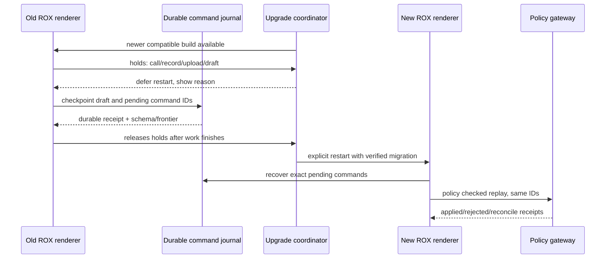

# Cache upgrade и сохранение активной работы — Revision 4

Статус: source delta review + proposed ROX behavior. Macro HEAD `767a999a5f0901896959ee1f5b315999b1dea0ed`; previous observed `5678f9bd777413f66e8bddac58f13f21150d831b`. ROX code baseline `249b3b44220bcfbd7d467de9cfc18f76e1c37807` сохраняет source apps/packages из `f63294ba4fffa7238b46b24e918925a313ad0b12`. Полное сравнение evidence — `plans/macro-integration/source-reverification-v4.json`.

## 1. Что добавилось в Macro

Один commit `fix(cache-core): prevent worker disposal on upgrade` меняет63files. Это новый lifecycle/cache behavior, не новая product destination.

| Source | Проверенное поведение |
|---|---|
| [reloadForNewerBuild.ts::holdAutomaticReload / reloadForNewerBuild:52–98](https://github.com/macro-inc/macro/blob/767a999a5f0901896959ee1f5b315999b1dea0ed/apps/web/src/lib/core/util/reloadForNewerBuild.ts#L52-L98) | Automatic reload только hidden+online+no hold+no editing text. Prompt action может reload явно. Это не доказательство сохранности всех drafts. |
| [retirable-host.ts::createRetirableCacheHost:4–58](https://github.com/macro-inc/macro/blob/767a999a5f0901896959ee1f5b315999b1dea0ed/apps/web/src/lib/graphql-cache/host/retirable-host.ts#L4-L58) | Stale captured cache closures после dispose переключаются на noop host; reads могут идти в сеть, writes dropped, optimistic mutation durable queue bypassed. |
| [coordinator-takeover.ts::CACHE_TAKEOVER_VERSION / parser:3–110](https://github.com/macro-inc/macro/blob/767a999a5f0901896959ee1f5b315999b1dea0ed/apps/web/src/lib/graphql-cache/worker/coordinator-takeover.ts#L3-L110) | Wire takeover version и scope/database identity отделены от hashed coordinator URL; старые builds могут игнорировать новые поля. |
| [coordinator-router.ts::answerTakeover:1742–1775](https://github.com/macro-inc/macro/blob/767a999a5f0901896959ee1f5b315999b1dea0ed/apps/web/src/lib/graphql-cache/worker/coordinator-router.ts#L1742-L1775) | Database holder отвечает yield только строго более новому build; equal/older не вызывают переключение туда-сюда. |
| [CallContext.tsx::holdReloadDuringCall:1632–1670](https://github.com/macro-inc/macro/blob/767a999a5f0901896959ee1f5b315999b1dea0ed/apps/web/src/features/channel/Call/CallContext.tsx#L1632-L1670) | Call не idle/failed удерживает automatic reload; cleanup освобождает hold. |
| [upload.ts::uploadFile:410–458](https://github.com/macro-inc/macro/blob/767a999a5f0901896959ee1f5b315999b1dea0ed/apps/web/src/lib/core/util/upload.ts#L410-L458) | Upload получает hold; finally освобождает его. |
| [browser.rs::retry_busy_entry:1730–1792](https://github.com/macro-inc/macro/blob/767a999a5f0901896959ee1f5b315999b1dea0ed/crates/client/turso-opfs/src/browser.rs#L1730-L1792) | Bounded retry idempotent entry operation только для NoModificationAllowedError. Busy не считается доказательством повреждения файлов. |
| [graphql-soup.ts::onSuperseded:459–502](https://github.com/macro-inc/macro/blob/767a999a5f0901896959ee1f5b315999b1dea0ed/apps/web/src/lib/service-clients/service-storage/graphql-soup.ts#L459-L502) | GraphQL host подключает retirement и newer-build prompt. |

[Source tests](https://github.com/macro-inc/macro/blob/767a999a5f0901896959ee1f5b315999b1dea0ed/apps/web/src/lib/core/util/reloadForNewerBuild.test.ts#L55-L137) перечисляют relevant cases. Этот audit не заявляет их исполнение.

## 2. Решение для ROX

Не переносить Solid/urql/OPFS worker stack. Расширить WP-05 command durability, WP-46 lifecycle/device/reconnect и WP-47 recovery. Учесть WP-10 CRDT и WP-35 capture, WP-39 upload. Новый экран не нужен: SH-16 sync/status detail и существующий update prompt.

Разделить:

- `appBuildId` — bytes renderer/native build.
- `cacheSchemaVersion` / `cacheGeneration` — disposable authorised projections.
- `commandJournalSchemaVersion` — durable command/outbox replay; не disposable cache.
- `documentSchemaVersion` / `crdtFrontier` — документ, WAL и schema migration.
- `writerEpoch` / `policyEpoch` — fencing авторитета и permissions, не номер UI build.

Target cache retirement может отключить проекции и разрешить gateway query, но не терять command journal и не обходить policy/idempotency. Busy storage приводит к bounded backoff/degraded state; destructive wipe запрещён как автоматическая первая реакция. Private cached content после revoke purge/retention следует своей policy, не upgrade эвристике.

## 3. Точный UX

| State/input | UI/output | Действие |
|---|---|---|
| New compatible app build, active call/record/upload | «Обновление готово. Завершите запись, звонок или загрузку.» + hold reason | «Позже» закрывает prompt; не отключает media; «Проверить сохранение» открывает SH-16.sync |
| Nonempty draft или unacked CRDT frontier | «Есть изменения, сохранённые на устройстве.»; journal/frontier и lastAckAt | «Подготовить обновление» делает flush/checkpoint через current policy; receipt не возникает от клика alone |
| Draft durable, pending server ACK, compatible replay | «Изменения сохранены на устройстве; после запуска будет повторная синхронизация.» | Restart допустим после local durable proof; новый renderer обязан replay same IDs при валидной policy |
| Incompatible document/journal schema | «Эта версия не может безопасно открыть сохранённые изменения.» | Hold, read-only compatible export if policy permits; migration/rollback, не silent deletion |
| No holds, checkpoints verified, supported migration | «Можно обновить ROX.» | Explicit native update/restart. Web automatic reload допускается только по configured policy; desktop нельзя считать browser hidden tab |
| Cache busy/takeover timeout | «Локальный кэш временно недоступен.»; query fallback/degraded badge | Current gateway reads; writes через journal; bounded retry, operator correlation ID |

Hover/focus hold reason показывает тип работы и безопасный progress, не приватное название denied entity. Click detail открывает SH-16.sync; Escape возвращает focus. Update/restart не default Enter action. Screen reader получает state change один раз, не каждый heartbeat. Reduced motion сохраняет state text. Current installed update UX не объявляется реализовавшим этот target.

## 4. Acceptance и негативные проверки

1. Call/record/upload active + newer build: no automatic termination. Seed missing hold → measured media/upload continuity assertion fails.
2. Cache host retired while pending Task command: durable journal ID/revision сохраняются; eventual one Task. Seed queue bypass → duplicate/lost command assertion fails.
3. Browser/Electron crash after local checkpoint before server ACK: restart same commands, no invented server success. Policy revoke rejects replay and quarantines unsent draft according to policy.
4. Two windows appBuildA/B: one cache writer per generation, no equal-build ping-pong; command authority unchanged.
5. Storage busy past deadline: degraded/error, old bytes not erased. Seed busy→wipe → artifact hash assertion fails.
6. Incompatible schema: no restart into unsafe writer; compare/export/migration plan and original bytes retained.

All product cases PLANNED_NOT_RUN. Architectural source comparison and compiled planning tests are separate evidence.
