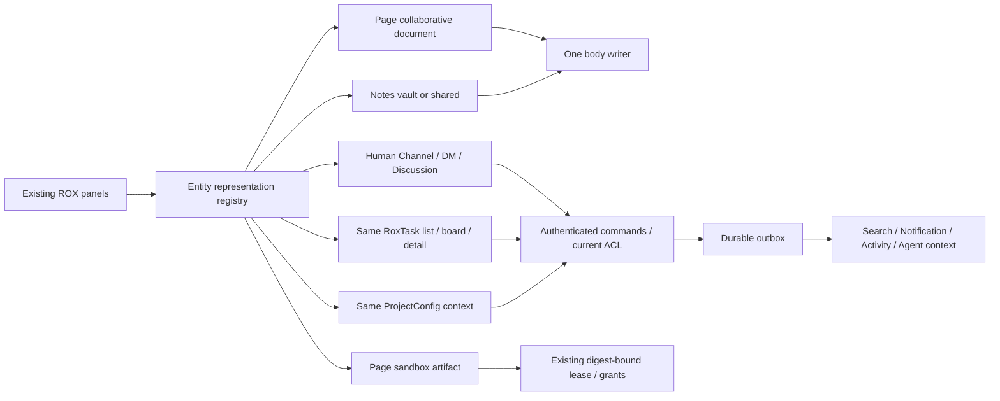
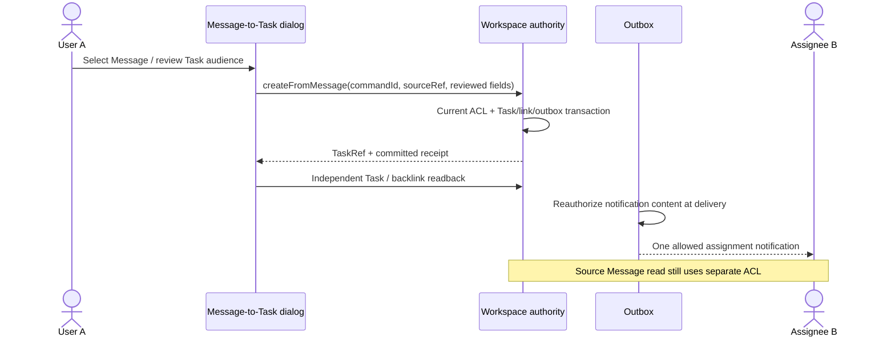

# Collaboration screens — proposed product contracts

Статус: **PROPOSED / Revision 2 / UI и backend не реализованы этим пакетом**. 19 экранов; machine-readable contract: [collaboration-screen-contracts.json](../../../plans/macro-integration/collaboration-screen-contracts.json).

Macro `c966b79d40798c6c726a3b15fe90517941fc6e61`; ROX source baseline `f63294ba4fffa7238b46b24e918925a313ad0b12`, прочитанный checkout `e780e73ae84c977cf81546b49140d318dfcd6049`. Разница source paths между ROX SHA пуста; текущий commit содержит audit artifacts. Remote Macro delta проверяет основной audit. Все expected results ниже — будущие gates, не выполненные тесты.

## Продуктовая граница и placement

Pages сохраняет два представления одной сущности: документ с совместным body и приложение с sandbox/HTML/snapshot. Notes сохраняет vault, Tiptap, frontmatter и существующие views. Tasks сохраняет личные списки и recurrence; shared status не заменяет личное Сегодня. Projects развивается из текущего ProjectConfig. Human Channels/DMs используют общий Message primitive; существующий Sessions/ChatPage остаётся agent transcript.

Human Channels открываются внутри Project → Channels и из разрешённых результатов global Search/Favorites. Existing native destinations не меняются: Channels/MacroChat sidebar entry не добавляется. Contextual thread/discussion всегда открывается внутри существующего panel stack. Все предложенные routes проходят typed builders/parser, registry и capability policy. Новые kind/route строки не объявляются уже существующими.

## Existing font authority

UI/document/help наследуют текущие font-sans/font-chat, code/terminal — font-mono или explicit selected preference. Source R23: default UI deliberately Arial Narrow; моноширинный Rox не применяется ко всем controls. На cloud browser отсутствие macOS system face фиксируется как ожидаемый product fallback; bundled WOFF2 проверяется только если выбран bundled mono. Не объявлять шрифт загруженным по одному CSS имени.

## Общие UI и domain invariants

- **identity**: Rox2EntityRef alias, kind:id scoped workspaceId; current channel-message/session/note; crm-contact new kind extension per entity-map, not login person.
- **authority**: Standalone native local writer OR shared service writer+local projection/outbox. Never simultaneous whole-file save and CRDT writer for one shared body.
- **editorDecision**: Use existing React/Tiptap Notes integration as first headless CRDT spike candidate, compare Loro/alternative upstream runtime on schema/anchors/undo/offline. Existing Markdown editor behavior preserved. No Solid framework or Macro source copy. Decision gated by WP10 proof and license review.
- **interaction**: All non-obvious controls support hover/focus short help and adjacent click full definition/source/freshness/example. Essential validation inline, info not only tooltip.
- **status**: User labels: Изменено на устройстве / Ожидает соединения / Отправляется / Синхронизировано / Конфликт / Доступ изменён / Не выполнено. Map precisely to Rox2Status + domainOutcome; do not expose internal CRDT/WAL terminology in main flow.
- **eventPrivacy**: Reauthorize before query, subscription delivery, notification push, search hydration and agent tool execution. EntityLink/Mention never implies grant.
- **commands**: Names below are proposed API contract symbols for typed dispatcher, not claims of existing server endpoints. AgentSession commands delegate existing Sessions. Share external artifact publish distinct from workspace grants.
- **routes**: Existing destinations remain unchanged. Human Channels directory is Projects → Project → Channels; authorized global search/favorites can open canonical ChannelRef in contextual HumanConversationView. DM uses the same contextual human view, never Agent Sessions. Extend typed route builders/parser/navigation state/MainContentPanel and entity renderer; do not add native Channels destination or new sidebar entry. Project tab/thread query params require typed parsing, not raw URL concatenation.
- **delete**: Trash/tombstone/archive are domain-specific reversible lifecycle. Purge physical bytes only retention/hold policy; remove link does not delete entity.
- **verification**: This is a screen specification. No UI render, deployment, E2E PASS, loaded font, sync or provider action verified by writing these docs.

Цвета Rox: background `#f7f8fa`, surface `#ffffff`, text `#171a20`, secondary `#626c7e`, border `#dde2e8`, accent `#3157d5`. Ширины/типографика в placement наследует текущие semantic font tokens; размеры являются предложенными, не измерением текущего UI. Sidebar существующего shell не перекраивается. Контролы 28–32px desktop, touch targets≥44px; длинная справка обычной ширины, line length≤70ch. Глобальная замена шрифта не предлагается. Current code намеренно выбирает Arial Narrow для UI/chat, font-mono для code/terminal; selected preferences наследуются. Runtime font/screenshots не проверялись: это gate будущей реализации.

## Keyboard composer precedence\n\nChannel/DM: по умолчанию Enter отправляет, Shift+Enter переносит строку; пользователь может выбрать Cmd/Ctrl+Enter-send, тогда Enter создаёт новую строку. CRM Company/Contact и другие entity discussions: Cmd/Ctrl+Enter отправляет, Enter/Shift+Enter создаёт новую строку независимо от channel preference. Thread наследует policy parent surface. Во время IME composition Enter не отправляет; открытые autocomplete/mention/emoji picker сначала обрабатывают selection. Modal handler имеет приоритет внутри modal. Send hint виден рядом с composer и обновляется при смене preference.\n\n## Screen index

| ID | Экран / current destination | Route status | WPs |
|---|---|---|---|
| COL-01 | Страницы: библиотека / pages | existing routes.view.pages(); proposed filters kind/document/artifact | WP-02, WP-10, WP-39, WP-40 |
| COL-02 | Совместный документ / pages | existing pages/page/{slug}; canonical-ref alias proposed | WP-03, WP-05, WP-10, WP-15, WP-16 |
| COL-03 | Страница-приложение / pages | existing routes.view.pages(slug) | WP-02, WP-03, WP-36, WP-39, WP-40 |
| COL-04 | История документа / pages contextual inspector | proposed pages/page/{slug}?panel=history | WP-03, WP-10, WP-15 |
| COL-05 | Заметки: библиотека / notes | existing routes.view.notes() | WP-02, WP-05, WP-06, WP-16, WP-39 |
| COL-06 | Заметка: редактор и связи / notes | existing notes/note/{id} | WP-03, WP-05, WP-09, WP-10, WP-16, WP-36 |
| COL-07 | Каналы и личные разговоры / existing Projects → Project → Channels; Search/Favorites contextual entry | PROPOSED projects/project/{slug}?tab=channels; canonical ChannelRef contextual route from Search/Favorites | WP-01, WP-02, WP-03, WP-08, WP-40 |
| COL-08 | Канал: сообщения / Projects → Channels → Channel; Search/Favorites contextual entry | PROPOSED projects/project/{slug}?tab=channels&channel={canonical id}; ChannelRef contextual route | WP-07, WP-08, WP-09, WP-31, WP-39 |
| COL-09 | Личный разговор / contextual human DM via Project/Search/Favorites | PROPOSED typed ChannelRef contextual route; optional Project origin | WP-01, WP-03, WP-07, WP-08 |
| COL-10 | Тред сообщения / Project Channel/DM contextual view or entity inspector | PROPOSED Project Channels/ChannelRef contextual route ?thread={root}; entity detail ?thread={root} | WP-03, WP-07, WP-08, WP-09, WP-11 |
| COL-11 | Обсуждение сущности / Pages/Notes/Tasks/Projects contextual inspector | PROPOSED entity detail ?panel=discussion&thread={root} | WP-03, WP-07, WP-08, WP-09, WP-15, WP-25, WP-36 |
| COL-12 | Задачи: список / tasks | existing routes.view.tasks(id?); proposed view/scope query | WP-02, WP-05, WP-11, WP-13, WP-14 |
| COL-13 | Задачи: доска / tasks contextual view | PROPOSED tasks?view=board&project={id} | WP-12, WP-13, WP-14 |
| COL-14 | Задача: детали / tasks | existing tasks/task/{id} | WP-03, WP-07, WP-08, WP-09, WP-11, WP-13, WP-14, WP-36 |
| COL-15 | Создать задачу из сообщения / channels/thread/entity discussion contextual dialog | PROPOSED overlay from MessageAction; commit navigates existing tasks/task/{id} | WP-03, WP-04, WP-07, WP-09, WP-11, WP-12 |
| COL-16 | Повторяющаяся задача / tasks detail contextual repeat editor | existing tasks/task/{id}; proposed repeat popup | WP-05, WP-13, WP-14, WP-37 |
| COL-17 | Проект: обзор / projects | existing routes.view.projects(slug) | WP-01, WP-02, WP-03, WP-06, WP-08, WP-12, WP-36, WP-38, WP-39 |
| COL-18 | Проект: контекст и связи / projects contextual tab | PROPOSED projects/project/{slug}?tab=context | WP-02, WP-03, WP-06, WP-09, WP-12, WP-36, WP-38 |
| COL-19 | Проект: создать и настроить / projects | existing projects list create overlay; projects/project/{slug}?tab=settings proposed | WP-01, WP-03, WP-12, WP-47 |

## Interaction and authority flow





## COL-01 — Страницы: библиотека

**Current destination:** `pages`. **Current behavior:** PagesHome existing local artifact library/filter/sort; shared documents are proposed.

**Route:** `existing routes.view.pages(); proposed filters kind/document/artifact`. **Placement:** Grid/list; top search + Project filter + type + create.

**Components:** `PagesHome extension`, `PageTypeBadge`, `EntityListToolbar`, `CreatePagePopover`. New component names are proposed.

| Control | Input → output | Click / keyboard | Policy |
|---|---|---|---|
| create · Новая страница | name,contentKind,ProjectRef? → PageRef/open detail | Popup Документ/Приложение; create then receipt navigation<br>N outside editor; Enter form; Escape | Editor с действующим edit grant; сервер повторно проверяет principal/policyEpoch. |
| kind · Тип: Все | document/artifact/all → filtered rows | Select type, same library<br>Arrows/Enter | Текущий viewer с read capability. Counts/results не раскрывают denied entities. |
| project · Проект | ProjectRef[]/Unassigned → workspace-scoped filtered rows | Select canonical IDs; keep type/search<br>Combobox/Enter | Текущий viewer с read capability. Counts/results не раскрывают denied entities. |
| open · Открыть страницу | PageRef → focused/new panel | Open row; Cmd-click new panel<br>Enter/Cmd+Enter | Текущий viewer с read capability. Counts/results не раскрывают denied entities. |
| search · Найти страницы | text → permission-filtered results,indexedAt | Search query; clear retains filters<br>Cmd+F scoped; Escape clear | Текущий viewer с read capability. Counts/results не раскрывают denied entities. |

**Hover/focus/help/a11y contract:** для каждого control hover показывает его definition ниже; keyboard focus показывает ту же краткую справку и focus ring. Adjacent «О действии» открывает полную справку по click/Enter, Escape возвращает focus. Input/combobox/editor имеют правильный ARIA role; accessibleName = русский label, disabled reason видим. Асинхронный результат — polite live region, failure — alert; курсоры/heartbeat не озвучиваются. JSON содержит отдельные onHover/onFocus/onClick/keyboard/help/a11y поля каждого control.

| Control | Definition / example | Source / freshness / units |
|---|---|---|
| create | Документ редактируют совместно; приложение отображает HTML и данные.<br>Пример: «План запуска»: Документ; «Выручка»: Приложение | Page contentKind (proposed) + current PageConfig.kind<br>Показать asOf/updatedAt текущей query или lastAckAt receipt. Offline — время cached snapshot. Не показывать «сейчас» по времени открытия UI.<br>Units: не применяется; formula: не применяется |
| kind | Тип меняет представление содержимого, не создаёт новую сущность.<br>Пример: Все включает старые dashboard Pages | Page metadata<br>Показать asOf/updatedAt текущей query или lastAckAt receipt. Offline — время cached snapshot. Не показывать «сейчас» по времени открытия UI.<br>Units: не применяется; formula: не применяется |
| project | Принадлежность к проекту не гарантирует доступ ко всему проекту.<br>Пример: Запуск показывает доступные документы и приложения | belongsTo link + authorized projection<br>Показать asOf/updatedAt текущей query или lastAckAt receipt. Offline — время cached snapshot. Не показывать «сейчас» по времени открытия UI.<br>Units: не применяется; formula: не применяется |
| open | Страница открывается по устойчивой ссылке, slug остаётся совместимым alias.<br>Пример: Переименование не ломает bookmark | Entity registry + existing route<br>Показать asOf/updatedAt текущей query или lastAckAt receipt. Offline — время cached snapshot. Не показывать «сейчас» по времени открытия UI.<br>Units: не применяется; formula: не применяется |
| search | Поиск может отставать от сохранения; freshness индекса видна.<br>Пример: Смета → доступный документ; 0 результатов не раскрывает hidden titles | Unified search Page adapter<br>Показать asOf/updatedAt текущей query или lastAckAt receipt. Offline — время cached snapshot. Не показывать «сейчас» по времени открытия UI.<br>Units: не применяется; formula: не применяется |

### Commands, queries and outputs

- Query `page.list`: filters,cursor → ref,name,contentKind,projectRef,updatedAt,asOf.
- Query `search.entities`: types:[page],text → authorized results,indexedAt.
- Command `page.create`: name,contentKind,projectRef? → ref/receipt. Effect: Create canonical Page body/artifact binding + entity.created.
- Метрики/выходы: counts authorized only; updatedAt/indexedAt.

### Lifecycle, roles and failure states

| State | Expected UI / recovery |
|---|---|
| loading | Card skeleton до authorized list |
| empty | «Страниц пока нет» + create по capability |
| error | Retry list, existing cards marked stale |
| offline | Cached metadata with asOf; create remains local draft until commit |
| reload | Restore typed route/filter then reauthorize |
| permissionRevoked | Stop subscription; hide protected body/preview/count; «Доступ изменён». Isolate rejected draft; no stale token/push delivery. |
| create | Typed create |
| edit | Rename/move via granted menu |
| delete | Trash/restore до retention |
| sharing | Grant sheet detail; no implicit publish |
| roles | {"viewer": "read", "editor": "create/edit", "owner": "share/archive"} |

### Real user flows and DoD

- Pages → Документ → «План запуска» → Проект → создать → body editor.
- Pages → Приложение → открыть существующий dashboard → sandbox/snapshot сохранены.
- [ ] Artifact migration не преобразует HTML в текст.
- [ ] Reload сохраняет W1 filter и same PageRef; W2 filter отдельно.
- [ ] Denied titles/counts отсутствуют.

**Implementation seams:** existing `apps/electron/src/renderer/components/app-shell/nav-destinations.ts`, `apps/electron/src/shared/routes.ts`, `apps/electron/src/renderer/components/pages/PagesHome.tsx`; proposed new `tests/macro-integration/ui/col-01.spec.ts`. WPs WP-02, WP-10, WP-39, WP-40.

**Evidence:** R01, R03, R05, R06. **Test status:** `PLANNED_NOT_RUN`.
## COL-02 — Совместный документ

**Current destination:** `pages`. **Current behavior:** PageView is artifact; new contentKind renderer. Notes Tiptap existing candidate; Macro Solid/Lexical not copied.

**Route:** `existing pages/page/{slug}; canonical-ref alias proposed`. **Placement:** Title + max70ch CRDT body; optional outline224; inspector320 Связи/Обсуждение/История.

**Components:** `PageRepresentationHost proposed`, `CollaborativeDocumentEditor proposed`, `PresenceStrip`, `RemoteCursorOverlay`, `SyncStatusPopover`, `EntityInspector`. New component names are proposed.

| Control | Input → output | Click / keyboard | Policy |
|---|---|---|---|
| title · Название документа | nonblank title → metadata receipt | Blur/Cmd+Enter rename command; title separate from body ops<br>Enter body; Escape pending revert | Editor с действующим edit grant; сервер повторно проверяет principal/policyEpoch. |
| body · Содержимое документа | editor ops/stable anchors → local body + durable ACK frontier | Caret/input modifies local CRDT; transport persists then ACK<br>Cmd+B/I; Cmd+Z own undo; Cmd+Shift+Z redo | Editor с действующим edit grant; сервер повторно проверяет principal/policyEpoch. |
| presence · Участники | scoped peer sessions → names/status/device grouping | Open participant popover; no automatic caret jump<br>Enter/Escape | Текущий viewer с read capability. Counts/results не раскрывают denied entities. |
| mention · Упомянуть | @ query/entityRef → anchored Mention/EntityLink | Select allowed entity; recipients calculated server-side<br>@ arrows/Enter; Escape | Editor с действующим edit grant; сервер повторно проверяет principal/policyEpoch. |
| comment · Обсудить выделение | stableAnchor,body → message/thread ref | Open shared composer with quoted selection<br>Cmd+Alt+M; Cmd+Enter send | Участник с post/comment capability. Автор может менять своё сообщение при действующем grant. |
| sync · Синхронизация | pendingCount,lastAckAt → state/recovery detail | Show queue/rejected drafts/retry/export<br>Enter/Escape | Текущий viewer с read capability. Counts/results не раскрывают denied entities. |
| share · Доступ | subject,grant,expiry → policyEpoch/readback | Common grant sheet with explicit review/apply<br>Enter; Tab trap; Escape cancel | Owner/admin с manage/share capability; preview субъекта и permission перед apply. |

**Hover/focus/help/a11y contract:** для каждого control hover показывает его definition ниже; keyboard focus показывает ту же краткую справку и focus ring. Adjacent «О действии» открывает полную справку по click/Enter, Escape возвращает focus. Input/combobox/editor имеют правильный ARIA role; accessibleName = русский label, disabled reason видим. Асинхронный результат — polite live region, failure — alert; курсоры/heartbeat не озвучиваются. JSON содержит отдельные onHover/onFocus/onClick/keyboard/help/a11y поля каждого control.

| Control | Definition / example | Source / freshness / units |
|---|---|---|
| title | Название — metadata, его save не означает подтверждение текста.<br>Пример: Переименовать «Без названия» | Page metadata receipt<br>Показать asOf/updatedAt текущей query или lastAckAt receipt. Offline — время cached snapshot. Не показывать «сейчас» по времени открытия UI.<br>Units: не применяется; formula: не применяется |
| body | Правки видны сразу. Синхронизировано означает серверное подтверждение; undo не удаляет чужие правки.<br>Пример: A пишет заголовок, B список; оба видят результат | Local CRDT/WAL + durable server ACK<br>Показать asOf/updatedAt текущей query или lastAckAt receipt. Offline — время cached snapshot. Не показывать «сейчас» по времени открытия UI.<br>Units: не применяется; formula: не применяется |
| presence | Активные устройства этого документа, не весь workspace.<br>Пример: Анна: 2 устройства; Борис: редактирует | Authorized awareness heartbeat TTL<br>Показать asOf/updatedAt текущей query или lastAckAt receipt. Offline — время cached snapshot. Не показывать «сейчас» по времени открытия UI.<br>Units: не применяется; formula: не применяется |
| mention | Упоминание создаёт ссылку и допустимое уведомление; не выдаёт доступ само по себе.<br>Пример: @Acme связывает Page; @Борис только при разрешённом доступе | Registry + ACL + mention command<br>Показать asOf/updatedAt текущей query или lastAckAt receipt. Offline — время cached snapshot. Не показывать «сейчас» по времени открытия UI.<br>Units: не применяется; formula: не применяется |
| comment | Удаление текста не удаляет discussion; изменённый anchor отмечается.<br>Пример: Обсудить бюджет; section удалён → Место изменено | MessageParent Page + CRDT stable anchor<br>Показать asOf/updatedAt текущей query или lastAckAt receipt. Offline — время cached snapshot. Не показывать «сейчас» по времени открытия UI.<br>Units: не применяется; formula: не применяется |
| sync | Локальные операции ещё не подтверждены сервером.<br>Пример: 3 изменения ждут соединения → Синхронизировано 14:23 | WAL delivery + ACK<br>Показать asOf/updatedAt текущей query или lastAckAt receipt. Offline — время cached snapshot. Не показывать «сейчас» по времени открытия UI.<br>Units: count; formula: pending = local operations without positive durable ACK |
| share | Права читать/комментировать/редактировать; public link отдельно.<br>Пример: Борис: Редактор; внешняя ссылка выключена | Grant authority<br>Показать asOf/updatedAt текущей query или lastAckAt receipt. Offline — время cached snapshot. Не показывать «сейчас» по времени открытия UI.<br>Units: не применяется; formula: не применяется |

### Commands, queries and outputs

- Query `page.read`: PageRef → metadata,bodySnapshot,frontier,capabilities,policyEpoch.
- Query `collaboration.open`: ref,deviceId,localFrontier → authorized lease/serverFrontier/expiry.
- Query `discussion.list`: parentRef,anchor? → threads.
- Command `page.rename`: title → metadata revision. Effect: Metadata updated.
- Command `collaboration.append`: schemaVersion,opId,bytes,baseFrontier → durableAck/frontier. Effect: Persist/dedup before fanout; relational fields excluded.
- Command `message.create`: parentRef,anchor,body,clientMessageId → message/thread receipt. Effect: Shared discussion/mentions.
- Command `permission.grant`: subject,access,expiry? → policyEpoch. Effect: Explicit grant.
- Метрики/выходы: pendingCount,lastAckAt,peerCount; test body frontier/hash, no document text telemetry.

### Lifecycle, roles and failure states

| State | Expected UI / recovery |
|---|---|
| loading | Read-only skeleton until auth/snapshot |
| empty | «Начните писать» |
| error | Schema mismatch recovery/export; transport error keeps draft |
| offline | Durable WAL; share unavailable; exact pending count |
| reload | Replay WAL after schema validation/fresh auth; dedup operations |
| permissionRevoked | Stop subscription; hide protected body/preview/count; «Доступ изменён». Isolate rejected draft; no stale token/push delivery. |
| create | Create from Pages Document |
| edit | CRDT body; metadata commands |
| delete | Trash closes leases/search visibility; restore command |
| sharing | Common grants; mention never auto-grants |
| roles | {"viewer": "read", "commenter": "anchored comments", "editor": "body/title", "owner": "grant/revoke/delete"} |

### Real user flows and DoD

- A/B same Page → simultaneous edit → cursors/presence → convergent body.
- B offline → edit → desktop restart → draft restored → reconnect catch-up → converge.
- Owner revokes B offline → reconnect denies append → body hidden, rejected draft isolated/exportable.
- [ ] Two users and multi-device converge.
- [ ] A undo does not remove B change.
- [ ] Revoke invalidates sync lease, queued operation denied, draft retained.
- [ ] Search/agent/discussion use same ref/revision.

**Implementation seams:** existing `apps/electron/src/renderer/pages/NotesPage.tsx`, `apps/electron/src/renderer/components/app-shell/SessionPresenceAvatars.tsx`; proposed new `tests/macro-integration/ui/col-02.spec.ts`, `apps/electron/src/renderer/components/pages/CollaborativeDocumentEditor.tsx`, `packages/shared/src/workspace-domain/collaboration/contracts.ts`. WPs WP-03, WP-05, WP-10, WP-15, WP-16.

**Evidence:** R06, R09, R20, R21. **Test status:** `PLANNED_NOT_RUN`.

**Canonical human post:** every wrapper canonicalOperation=`message.create`; same authority/MessageParent resolver/commandId namespace/outbox/errors. mention picker changes draft; post commits once. No separate CRM post handler/storage/notification engine.
## COL-03 — Страница-приложение

**Current destination:** `pages`. **Current behavior:** Existing PageView/PageFrame, snapshot and digest-bound action grants preserved.

**Route:** `existing routes.view.pages(slug)`. **Placement:** Edge-to-edge sandbox; no text editor mounted; Данные/Доступ/Связи sheet.

**Components:** `PageView`, `PageFrame`, `ArtifactDataInspector proposed`, `PageGrantSheet`. New component names are proposed.

| Control | Input → output | Click / keyboard | Policy |
|---|---|---|---|
| preview · Обновить просмотр | contentDigest/snapshot stamp → lease/render readback | Reload saved content/snapshot only<br>Scoped Cmd+R | Текущий viewer с read capability. Counts/results не раскрывают denied entities. |
| refresh · Обновить данные | configured refresh spec → run receipt/snapshot exportedAt | Explicit runner request; show queued/running/failed<br>Enter; Escape does not undo dispatched run | Editor с действующим edit grant; сервер повторно проверяет principal/policyEpoch. |
| agent · Изменить с агентом | PageRef,digest → linked AgentSession + change preview | Open existing Sessions context; apply mediated change<br>Enter open panel | Editor с действующим edit grant; сервер повторно проверяет principal/policyEpoch. |
| source · Источник и свежесть | snapshot metadata → source details | Open exportedAt/lastRefresh/error<br>Enter/Escape | Текущий viewer с read capability. Counts/results не раскрывают denied entities. |
| publish · Опубликовать страницу | bundle options/includeSnapshot → external URL/publication readback | Review data inclusion then explicit publish<br>Enter review; Cmd+Enter apply | Owner/admin с manage/share capability; preview субъекта и permission перед apply. |

**Hover/focus/help/a11y contract:** для каждого control hover показывает его definition ниже; keyboard focus показывает ту же краткую справку и focus ring. Adjacent «О действии» открывает полную справку по click/Enter, Escape возвращает focus. Input/combobox/editor имеют правильный ARIA role; accessibleName = русский label, disabled reason видим. Асинхронный результат — polite live region, failure — alert; курсоры/heartbeat не озвучиваются. JSON содержит отдельные onHover/onFocus/onClick/keyboard/help/a11y поля каждого control.

| Control | Definition / example | Source / freshness / units |
|---|---|---|
| preview | Перезагрузить сохранённую страницу; не запускать script получения данных.<br>Пример: HTML изменён агентом → новая preview | PageFrame lease/snapshot<br>Показать asOf/updatedAt текущей query или lastAckAt receipt. Offline — время cached snapshot. Не показывать «сейчас» по времени открытия UI.<br>Units: не применяется; formula: не применяется |
| refresh | Время данных отдельно от изменения HTML; failed refresh сохраняет прежний snapshot.<br>Пример: Script fails → старый chart + ошибка | PageRefreshSpec/lastRefresh<br>Показать asOf/updatedAt текущей query или lastAckAt receipt. Offline — время cached snapshot. Не показывать «сейчас» по времени открытия UI.<br>Units: не применяется; formula: не применяется |
| agent | Изменение артефакта проходит проверку исходной digest и action grants.<br>Пример: Новый HTML digest требует актуальных source-action grants | Existing AgentSession + Page mediation<br>Показать asOf/updatedAt текущей query или lastAckAt receipt. Offline — время cached snapshot. Не показывать «сейчас» по времени открытия UI.<br>Units: не применяется; formula: не применяется |
| source | HTML и данные обновляются независимо.<br>Пример: Данные вчера, HTML сегодня | PageDataSnapshot + lastRefresh<br>Показать asOf/updatedAt текущей query или lastAckAt receipt. Offline — время cached snapshot. Не показывать «сейчас» по времени открытия UI.<br>Units: не применяется; formula: не применяется |
| publish | Внешняя публикация bundle отличается от workspace sharing.<br>Пример: Не включать приватный snapshot в внешний bundle | PageShareInfo/publication job<br>Показать asOf/updatedAt текущей query или lastAckAt receipt. Offline — время cached snapshot. Не показывать «сейчас» по времени открытия UI.<br>Units: не применяется; formula: не применяется |

### Commands, queries and outputs

- Query `page.artifact.read`: mapped native slug/ref → PageConfig,digest,snapshot,lease,grants.
- Query `page.publication.read`: ref → bundleId,url,includesSnapshot,verification.
- Command `page.artifact.refresh`: ref,expectedDigest → runId/status/readback. Effect: Existing native argv/no-shell runner adapter.
- Command `page.artifact.publish`: bundle options/includeSnapshot → publication receipt/readback. Effect: External publication separate ACL.
- Command `agentSession.create`: contextRefs:[PageRef],instruction → sessionRef. Effect: Keep Sessions agent transcript.
- Метрики/выходы: exportedAt,lastRefresh,digest,leaseExpiry,includesSnapshot.

### Lifecycle, roles and failure states

| State | Expected UI / recovery |
|---|---|
| loading | Wait lease+snapshot; keep safe previous frame |
| empty | «Нет содержимого» + Изменить с агентом |
| error | Separate render/lease/run/publish errors |
| offline | Cached snapshot dated; provider action pending unavailable |
| reload | Re-lease exact digest and auth |
| permissionRevoked | Stop subscription; hide protected body/preview/count; «Доступ изменён». Isolate rejected draft; no stale token/push delivery. |
| create | Library Приложение native create |
| edit | Mediated artifact edits |
| delete | Trash retains bytes until retention |
| sharing | Internal grant sheet + distinct external publish review |
| roles | {"viewer": "read", "editor": "configured actions only if granted", "owner": "grant/publish"} |

### Real user flows and DoD

- Открыть existing dashboard → exportedAt → update data fails → chart retained → retry new snapshot.
- Agent modifies HTML → digest changes → privileged action re-grant review.
- [ ] Existing artifacts render after migration unchanged.
- [ ] Preview refresh does not execute script implicitly.
- [ ] Iframe cannot bypass host/source permissions.
- [ ] Failed publish never reports shared success.

**Implementation seams:** existing `apps/electron/src/renderer/components/pages/PageView.tsx`, `apps/electron/src/renderer/pages/ChatPage.tsx`; proposed new `tests/macro-integration/ui/col-03.spec.ts`. WPs WP-02, WP-03, WP-36, WP-39, WP-40.

**Evidence:** R06, R07, R19. **Test status:** `PLANNED_NOT_RUN`.
## COL-04 — История документа

**Current destination:** `pages contextual inspector`. **Current behavior:** Collaborative Page history not proven current UI; artifact digest remains distinct.

**Route:** `proposed pages/page/{slug}?panel=history`. **Placement:** Version rail224; read-only body/diff; revision details320.

**Components:** `DocumentHistoryPanel proposed`, `RevisionPreview`, `RestoreRevisionReview`. New component names are proposed.

| Control | Input → output | Click / keyboard | Policy |
|---|---|---|---|
| version · Версия | revisionId/frontier → read-only snapshot | Select without changing current undo stack<br>Arrows/Enter | Текущий viewer с read capability. Counts/results не раскрывают denied entities. |
| restore · Восстановить содержимое | source revision/expected current → new revision | Show diff, apply new body operation; grants unchanged<br>Cmd+Enter after preview; Escape | Editor с действующим edit grant; сервер повторно проверяет principal/policyEpoch. |
| export · Экспортировать версию | revisionId,Markdown → file/hash | Authorized historical read/export<br>Enter | Текущий viewer с read capability. Counts/results не раскрывают denied entities. |

**Hover/focus/help/a11y contract:** для каждого control hover показывает его definition ниже; keyboard focus показывает ту же краткую справку и focus ring. Adjacent «О действии» открывает полную справку по click/Enter, Escape возвращает focus. Input/combobox/editor имеют правильный ARIA role; accessibleName = русский label, disabled reason видим. Асинхронный результат — polite live region, failure — alert; курсоры/heartbeat не озвучиваются. JSON содержит отдельные onHover/onFocus/onClick/keyboard/help/a11y поля каждого control.

| Control | Definition / example | Source / freshness / units |
|---|---|---|
| version | Версия — сохранённая точка истории, не ваш локальный undo.<br>Пример: Открыть версию до удаления бюджета | Collaborative snapshot history<br>Показать asOf/updatedAt текущей query или lastAckAt receipt. Offline — время cached snapshot. Не показывать «сейчас» по времени открытия UI.<br>Units: не применяется; formula: не применяется |
| restore | Восстановление создаёт новую версию и сохраняет историю.<br>Пример: Вернуть section; текущие permissions сохранены | Snapshot restore command<br>Показать asOf/updatedAt текущей query или lastAckAt receipt. Offline — время cached snapshot. Не показывать «сейчас» по времени открытия UI.<br>Units: не применяется; formula: не применяется |
| export | Экспорт только выбранного доступного body, не скрытых discussions.<br>Пример: Скачать Markdown версии 14:20 | Authorized historical projection<br>Показать asOf/updatedAt текущей query или lastAckAt receipt. Offline — время cached snapshot. Не показывать «сейчас» по времени открытия UI.<br>Units: не применяется; formula: не применяется |

### Commands, queries and outputs

- Query `document.history`: ref,cursor → revisions/actors/capturedAt/frontier.
- Query `document.revision.read`: ref,revisionId → authorized body/change summary.
- Command `document.restore`: sourceRevisionId,expectedRevision → new revision/receipt. Effect: Restore body, not ACL/relational status.
- Метрики/выходы: revision/capturedAt/changed segments.

### Lifecycle, roles and failure states

| State | Expected UI / recovery |
|---|---|
| loading | Version skeleton |
| empty | «История появится после сохранения» |
| error | Missing historical blob does not break current Page |
| offline | Cached history per cache policy; restore not committed offline |
| reload | URL reopens authorized selected revision |
| permissionRevoked | Stop subscription; hide protected body/preview/count; «Доступ изменён». Isolate rejected draft; no stale token/push delivery. |
| create | Runtime snapshots |
| edit | Restore as new edit |
| delete | Historical retention admin policy |
| sharing | Current ACL gates history |
| roles | {"viewer": "preview", "editor": "restore", "owner": "policy elsewhere"} |

### Real user flows and DoD

- History → old revision → compare → restore → collaborator sees new current revision.
- [ ] Concurrent current change gives conflict review before restore.
- [ ] Viewer preview allowed, restore denied.
- [ ] Revoke blocks historical blob URLs.

**Implementation seams:** existing ; proposed new `tests/macro-integration/ui/col-04.spec.ts`, `apps/electron/src/renderer/components/pages/CollaborativeDocumentEditor.tsx`, `packages/shared/src/workspace-domain/collaboration/contracts.ts`. WPs WP-03, WP-10, WP-15.

**Evidence:** R06, R21. **Test status:** `PLANNED_NOT_RUN`.
## COL-05 — Заметки: библиотека

**Current destination:** `notes`. **Current behavior:** Existing vault Markdown tree, search/tags and Table/Canvas/Outline/Graph views.

**Route:** `existing routes.view.notes()`. **Placement:** Folder rail224; central note list/view; inspector closed.

**Components:** `NotesPage`, `NotesViewHost`, `NotesDocumentChrome`, `VaultIndexHealthPanel`. New component names are proposed.

| Control | Input → output | Click / keyboard | Policy |
|---|---|---|---|
| new · Новая заметка | title,folder,visibility → NoteRef/native binding | Create local note or shared note using explicit workspace mode; no silent upload<br>N outside text; Enter create | Editor с действующим edit grant; сервер повторно проверяет principal/policyEpoch. |
| view · Вид заметок | list/table/canvas/outline/graph → same authorized refs representation | Switch view, preserve filter/selection<br>Tablist Left/Right | Текущий viewer с read capability. Counts/results не раскрывают denied entities. |
| filter · Теги и поиск | text,tags,folder → filtered notes/index status | Search known/no-match; keep folder scope<br>Cmd+F; Escape clear | Текущий viewer с read capability. Counts/results не раскрывают denied entities. |
| import · Импортировать Markdown | files,folder → mapped NoteRefs/import receipt | Preview names/collisions/visibility then import<br>Enter review; Escape cancel | Editor с действующим edit grant; сервер повторно проверяет principal/policyEpoch. |

**Hover/focus/help/a11y contract:** для каждого control hover показывает его definition ниже; keyboard focus показывает ту же краткую справку и focus ring. Adjacent «О действии» открывает полную справку по click/Enter, Escape возвращает focus. Input/combobox/editor имеют правильный ARIA role; accessibleName = русский label, disabled reason видим. Асинхронный результат — polite live region, failure — alert; курсоры/heartbeat не озвучиваются. JSON содержит отдельные onHover/onFocus/onClick/keyboard/help/a11y поля каждого control.

| Control | Definition / example | Source / freshness / units |
|---|---|---|
| new | Локальная заметка остаётся файлом vault. Совместный режим выбирают явно.<br>Пример: Личное /Дневник/2026-09-30.md не попадает команде | Note authority/native path mapping<br>Показать asOf/updatedAt текущей query или lastAckAt receipt. Offline — время cached snapshot. Не показывать «сейчас» по времени открытия UI.<br>Units: не применяется; formula: не применяется |
| view | Виды показывают одни заметки, не копии данных.<br>Пример: Canvas card открывает тот же Markdown note | NotesViewHost + canonical registry<br>Показать asOf/updatedAt текущей query или lastAckAt receipt. Offline — время cached snapshot. Не показывать «сейчас» по времени открытия UI.<br>Units: не применяется; formula: не применяется |
| filter | Поиск по vault/shared scope указан в строке поиска.<br>Пример: Запрос договор в личном vault не делает team search | Vault index/Search adapter<br>Показать asOf/updatedAt текущей query или lastAckAt receipt. Offline — время cached snapshot. Не показывать «сейчас» по времени открытия UI.<br>Units: не применяется; formula: не применяется |
| import | Импорт не объединяет одинаковые заголовки или пути разных vault.<br>Пример: notes:W1/a.md и notes:W2/a.md разные refs | Scoped file binding + import command<br>Показать asOf/updatedAt текущей query или lastAckAt receipt. Offline — время cached snapshot. Не показывать «сейчас» по времени открытия UI.<br>Units: не применяется; formula: не применяется |

### Commands, queries and outputs

- Query `note.list`: authority mode,folder,filters,cursor → ref/nativePath/tags/updatedAt/indexedAt.
- Query `note.views`: scope/view → same ref representations.
- Command `note.create`: name,folder,authorityMode → ref/native binding. Effect: Preserve native local file or shared domain writer.
- Command `note.import`: file descriptors,collision choices → per-file receipts. Effect: Scoped identity mapping, no title-based merge.
- Метрики/выходы: note count/indexedAt/vault index health.

### Lifecycle, roles and failure states

| State | Expected UI / recovery |
|---|---|
| loading | Scoped list skeleton |
| empty | «Заметок пока нет» + create/import |
| error | Vault unavailable distinct from empty |
| offline | Local vault stays usable; shared projection dated |
| reload | Restore folder/view; resolve stable ref not title |
| permissionRevoked | Stop subscription; hide protected body/preview/count; «Доступ изменён». Isolate rejected draft; no stale token/push delivery. |
| create | Native/shared explicit create |
| edit | Rename/move maintains binding aliases |
| delete | Trash vault/shared command separately; no mass folder deletion by sharing |
| sharing | Shared note grant sheet; local visibility no grant shortcut |
| roles | {"viewer": "accessible notes", "editor": "create/import/edit", "owner": "share migration explicitly"} |

### Real user flows and DoD

- Notes → local vault note → graph/table → same identity.
- Import duplicate path from another vault → explicit separate binding → no overwrite.
- [ ] Existing views and file paths preserved.
- [ ] Local note is never uploaded through merely opening shared workspace.
- [ ] Search reload restores scope and flags stale index.

**Implementation seams:** existing `apps/electron/src/renderer/components/app-shell/nav-destinations.ts`, `apps/electron/src/shared/routes.ts`, `apps/electron/src/renderer/pages/NotesPage.tsx`, `apps/electron/src/renderer/pages/notes/NotesViewHost.tsx`; proposed new `tests/macro-integration/ui/col-05.spec.ts`. WPs WP-02, WP-05, WP-06, WP-16, WP-39.

**Evidence:** R01, R02, R08, R10. **Test status:** `PLANNED_NOT_RUN`.
## COL-06 — Заметка: редактор и связи

**Current destination:** `notes`. **Current behavior:** Existing Notes Tiptap/frontmatter/wiki/comments. Renderer serializes its own save queue, but saveNote call at NotesPage:885 omits expectedRevision. Native server saveNote at notes.ts:502–517 performs optional ordinary read-check-write then writeFile without lock/atomic CAS; multi-writer lost-update protection is not established.

**Route:** `existing notes/note/{id}`. **Placement:** 70ch Tiptap or source view; outline224; Inspector320 properties/backlinks/assets.

**Components:** `NotesPage`, `TiptapMarkdownEditor`, `NoteInspector`, `NotesAIMenu`, `NoteAuthorityBadge proposed`. New component names are proposed.

| Control | Input → output | Click / keyboard | Policy |
|---|---|---|---|
| editor · Текст заметки | Markdown body/frontmatter → local saved file OR shared ACK | Keep existing editor; authority mode selects native save or CRDT binding, never both writers<br>Cmd+S flush native; Cmd+Z local; source switch preserves content | Editor с действующим edit grant; сервер повторно проверяет principal/policyEpoch. |
| wiki · Связать заметку | [[query]]/EntityRef → backlink/ref | Resolve accessible note; missing target offers create with explicit scope<br>[[ arrows/Enter; Escape | Editor с действующим edit grant; сервер повторно проверяет principal/policyEpoch. |
| properties · Свойства | typed key/value → metadata/frontmatter revision | Validate key/type, show source and apply metadata command<br>Tab fields; Enter commit | Editor с действующим edit grant; сервер повторно проверяет principal/policyEpoch. |
| share · Сделать совместной | target workspace/grants → migration preview/receipt | Explicit file-binding adoption, copy policy and permission review; no implicit local upload<br>Enter review; Escape cancel | Owner/admin с manage/share capability; preview субъекта и permission перед apply. |
| ai · Попросить агента | NoteRef/revision,action → AgentSession proposal | Analyze/expand/summarize existing Notes menu; preview before body apply<br>Enter menu; Cmd+Enter approved apply | Editor с действующим edit grant; сервер повторно проверяет principal/policyEpoch. |

**Hover/focus/help/a11y contract:** для каждого control hover показывает его definition ниже; keyboard focus показывает ту же краткую справку и focus ring. Adjacent «О действии» открывает полную справку по click/Enter, Escape возвращает focus. Input/combobox/editor имеют правильный ARIA role; accessibleName = русский label, disabled reason видим. Асинхронный результат — polite live region, failure — alert; курсоры/heartbeat не озвучиваются. JSON содержит отдельные onHover/onFocus/onClick/keyboard/help/a11y поля каждого control.

| Control | Definition / example | Source / freshness / units |
|---|---|---|
| editor | Файл и совместный документ имеют один выбранный writer. Сохранено на устройстве отличается от server sync.<br>Пример: Local note edited offline → disk reload matches | saveNote receipt or CRDT ACK<br>Показать asOf/updatedAt текущей query или lastAckAt receipt. Offline — время cached snapshot. Не показывать «сейчас» по времени открытия UI.<br>Units: не применяется; formula: не применяется |
| wiki | Wiki-ссылка сохраняет canonical ref с читаемой подписью; название не identity.<br>Пример: [[План]] после rename продолжает открываться | Note links + entity registry<br>Показать asOf/updatedAt текущей query или lastAckAt receipt. Offline — время cached snapshot. Не показывать «сейчас» по времени открытия UI.<br>Units: не применяется; formula: не применяется |
| properties | Свойства нужны фильтрам/таблице и агенту; raw frontmatter roundtrip должен сохраняться.<br>Пример: status: draft остаётся строкой, не превращается в boolean | Native frontmatter adapter/shared metadata<br>Показать asOf/updatedAt текущей query или lastAckAt receipt. Offline — время cached snapshot. Не показывать «сейчас» по времени открытия UI.<br>Units: не применяется; formula: не применяется |
| share | Содержимое станет доступно выбранной команде. Сначала проверяются attachments и private refs.<br>Пример: Личный draft → shared note, blocked private image remains inaccessible | Authority migration + grant service<br>Показать asOf/updatedAt текущей query или lastAckAt receipt. Offline — время cached snapshot. Не показывать «сейчас» по времени открытия UI.<br>Units: не применяется; formula: не применяется |
| ai | Агент читает доступную revision; изменения не принимаются без видимого diff.<br>Пример: Сократить note → compare diff → apply current revision | NotesAIMenu/AgentSession domain tool<br>Показать asOf/updatedAt текущей query или lastAckAt receipt. Offline — время cached snapshot. Не показывать «сейчас» по времени открытия UI.<br>Units: не применяется; formula: не применяется |

### Commands, queries and outputs

- Query `note.read`: ref → body/frontmatter/native binding/authority/capabilities.
- Query `entity.links`: ref,direction → authorized backlinks/assets.
- Command `note.update`: expectedRevision,body or CRDT ops → native save/shared receipt. Effect: Exactly one writer mode.
- Command `note.adoptShared`: target workspace,copy choices,grants → migration receipt/mapping. Effect: Explicit privacy/identity migration.
- Command `agentSession.create`: contextRefs,instruction → sessionRef. Effect: Agent proposal.
- Метрики/выходы: backlink count/character count/indexedAt/last native save or ACK.

### Lifecycle, roles and failure states

| State | Expected UI / recovery |
|---|---|
| loading | Note read skeleton; dirty draft retained |
| empty | «Начните заметку» |
| error | Save failure retains dirty content; external conflict compare |
| offline | Local note works; shared WAL pending; share/AI remote explicit unavailable |
| reload | Restore body and selection; revalidate scope/binding |
| permissionRevoked | Stop subscription; hide protected body/preview/count; «Доступ изменён». Isolate rejected draft; no stale token/push delivery. |
| create | Library create |
| edit | Tiptap/source edits + metadata |
| delete | Trash restore preserves identity/backlinks |
| sharing | Local→shared explicit migration sheet |
| roles | {"viewer": "read", "commenter": "discussion", "editor": "body/metadata/agent proposal", "owner": "adopt/share"} |

### Real user flows and DoD

- Local note → native save → file changed externally → dirty-change banner → reload/compare, no overwrite.
- Shared note → B edits → A wiki links Task → authorized backlinks → agent reads same graph.
- [ ] Existing Tiptap/wiki/frontmatter/assets roundtrip intact.
- [ ] External file edits conflict with dirty state visibly.
- [ ] Native and shared writers cannot concurrently overwrite one body.
- [ ] Shared revocation stops body + attachment access.

**Implementation seams:** existing `apps/electron/src/renderer/pages/NotesPage.tsx`, `apps/electron/src/renderer/pages/notes/NotesViewHost.tsx`; proposed new `tests/macro-integration/ui/col-06.spec.ts`. WPs WP-03, WP-05, WP-09, WP-10, WP-16, WP-36.

**Evidence:** R08, R09, R10, R21. **Test status:** `PLANNED_NOT_RUN`.

**Current concurrency limit R24:** renderer queue serializes one UI only; native optional read-check-write is not CAS and ordinary call omits revision. Target expectedRevision/per-note atomic writer must be implemented and tested; current behavior not upgraded by this spec.
## COL-07 — Каналы и личные разговоры

**Current destination:** `existing Projects → Project detail → proposed Channels tab; authorized global Search/Favorites contextual entries`. **Current behavior:** Projects/ProjectInfoPage already exists; Channels tab/directory is proposed. Existing nav registry stays unchanged, Sessions remain agent transcript.

**Route:** `PROPOSED existing projects/project/{slug}?tab=channels; search/favorite ChannelRef opens contextual HumanConversationView through typed entity route`. **Placement:** Project tab Channels: project-scoped conversation directory; Каналы/Личные/Группы filters in local rail; authorized workspace search/favorites open the same contextual view. No additional native sidebar destination.

**Components:** `ChannelsDirectory proposed`, `ConversationRail`, `ChannelCreateDialog`, `RecipientPicker`. New component names are proposed.

| Control | Input → output | Click / keyboard | Policy |
|---|---|---|---|
| create-channel · Новый канал | name,visibility,ProjectRef?,members → ChannelRef | Public/private choice, participant preview, create<br>N outside editor; Enter form | Editor с действующим edit grant; сервер повторно проверяет principal/policyEpoch. |
| dm · Написать человеку | one authenticated PrincipalRef → canonical DM ChannelRef | Select teammate, resolve unordered participant pair not email Contact<br>Enter recipient; Cmd+Enter open | Участник с post/comment capability. Автор может менять своё сообщение при действующем grant. |
| group · Новый групповой разговор | PrincipalRef[] → group ChannelRef | Select membership, name optional, explicit create<br>Arrows/Enter; Escape | Участник с post/comment capability. Автор может менять своё сообщение при действующем grant. |
| search · Найти канал или человека | query → accessible results | Search directory without leak hidden channels<br>Cmd+F; Escape clear | Текущий viewer с read capability. Counts/results не раскрывают denied entities. |

**Hover/focus/help/a11y contract:** для каждого control hover показывает его definition ниже; keyboard focus показывает ту же краткую справку и focus ring. Adjacent «О действии» открывает полную справку по click/Enter, Escape возвращает focus. Input/combobox/editor имеют правильный ARIA role; accessibleName = русский label, disabled reason видим. Асинхронный результат — polite live region, failure — alert; курсоры/heartbeat не озвучиваются. JSON содержит отдельные onHover/onFocus/onClick/keyboard/help/a11y поля каждого control.

| Control | Definition / example | Source / freshness / units |
|---|---|---|
| create-channel | Открытый канал виден разрешённому workspace; закрытый только membership.<br>Пример: Закрытый #сделка-acme не виден outsider | Channel membership + workspace policy<br>Показать asOf/updatedAt текущей query или lastAckAt receipt. Offline — время cached snapshot. Не показывать «сейчас» по времени открытия UI.<br>Units: не применяется; formula: не применяется |
| dm | Личный разговор связывает workspace пользователей; CRM Contact не получает вход автоматически.<br>Пример: A→B и B→A открывают один разговор | DM pair unique workspace/person IDs<br>Показать asOf/updatedAt текущей query или lastAckAt receipt. Offline — время cached snapshot. Не показывать «сейчас» по времени открытия UI.<br>Units: не применяется; formula: не применяется |
| group | Группа имеет собственное membership. Добавление человека не раскрывает историю без указанной policy.<br>Пример: Анна, Борис, Виктор: 3 authenticated members | Group membership/history policy<br>Показать asOf/updatedAt текущей query или lastAckAt receipt. Offline — время cached snapshot. Не показывать «сейчас» по времени открытия UI.<br>Units: не применяется; formula: не применяется |
| search | Counts/unread относятся только к доступным разговорам.<br>Пример: Hidden channel title never appears | Authorized directory/read-state projection<br>Показать asOf/updatedAt текущей query или lastAckAt receipt. Offline — время cached snapshot. Не показывать «сейчас» по времени открытия UI.<br>Units: не применяется; formula: не применяется |

### Commands, queries and outputs

- Query `channel.list`: workspace,kind,membership,cursor → refs/type/title/unread/lastMessage safe preview.
- Query `principal.directory`: text → teammates only.
- Command `channel.create`: name,visibility,projectRef,members → ref/receipt. Effect: Membership+channel + event.
- Command `channel.ensureDm`: recipientPrincipalRef → existing/new ref. Effect: Unique pair idempotent.
- Command `channel.createGroup`: members,historyPolicy → ref/receipt. Effect: Explicit group.
- Метрики/выходы: authorized unread counts; directory freshness.

### Lifecycle, roles and failure states

| State | Expected UI / recovery |
|---|---|
| loading | Directory skeleton |
| empty | «Нет разговоров» + create/send |
| error | List error retry; no fake empty |
| offline | Cached authorized directory dated; new DM command pending |
| reload | Route resolves actual channelRef; authorize before preview |
| permissionRevoked | Stop subscription; hide protected body/preview/count; «Доступ изменён». Isolate rejected draft; no stale token/push delivery. |
| create | Channel/DM/group forms |
| edit | Rename/group participants owner policy |
| delete | Archive channel vs leave; message deletion separate |
| sharing | Membership sheet, no Page share reuse without domain checks |
| roles | {"viewer": "directory/read allowed", "member": "DM/post", "channelAdmin": "membership/archive"} |

### Real user flows and DoD

- Project → Channels → Написать → B → canonical DM contextual view; Search/Favorites reopen same ref; Sessions remains agent chat.
- Private channel create → X directory/search/list denies and leaks no preview/count.
- [ ] Existing native registry не изменён: Channels открывается из Project/Search/Favorites; одна canonical ChannelRef.
- [ ] No duplicate human DM for pair.
- [ ] Principal differs CRM Contact.
- [ ] New route survives reload without routing into allSessions.

**Implementation seams:** existing `apps/electron/src/renderer/contexts/NavigationContext.tsx`, `apps/electron/src/renderer/pages/ChatPage.tsx`, `apps/electron/src/renderer/pages/ProjectInfoPage.tsx`, `apps/electron/src/shared/routes.ts`, `apps/electron/src/shared/route-parser.ts`, `apps/electron/src/renderer/components/app-shell/MainContentPanel.tsx`; proposed new `tests/macro-integration/ui/col-07.spec.ts`, `apps/electron/src/renderer/components/messaging/MessageTimeline.tsx`, `apps/electron/src/renderer/components/messaging/MessageComposer.tsx`, `packages/shared/src/workspace-domain/messaging/contracts.ts`. WPs WP-01, WP-02, WP-03, WP-08, WP-40.

**Evidence:** R01, R04, R19, R22. **Test status:** `PLANNED_NOT_RUN`.
## COL-08 — Канал: сообщения

**Current destination:** `Projects → Project → Channels → Channel; authorized Search/Favorites contextual open`. **Current behavior:** Human channel transcript requires new domain UI; agent Session ChatPage not reused as state model.

**Route:** `PROPOSED projects/project/{slug}?tab=channels&channel={canonical id}; canonical ChannelRef contextual route for search/favorites`. **Placement:** Header title/member/read status; message timeline; sticky composer; thread aside320; no assistant bubbles by default.

**Components:** `ChannelConversation proposed`, `MessageTimeline`, `MessageComposer`, `AttachmentTray`, `TypingIndicator`, `ChannelMemberSheet`. New component names are proposed.

| Control | Input → output | Click / keyboard | Policy |
|---|---|---|---|
| compose · Сообщение | rich text,mentions,attachments,clientMessageId → persisted MessageRef or pending bubble | Send only after validation; pending→committed by receipt; exact retry key<br>По умолчанию Enter send, Shift+Enter newline, Cmd/Ctrl+Enter send. В режиме modifier Enter newline, Cmd/Ctrl+Enter send. IME/autocomplete Enter никогда не отправляет. | Участник с post/comment capability. Автор может менять своё сообщение при действующем grant. |
| attach · Прикрепить файл | File descriptors → FileRefs/upload state | Upload scoped file; cannot send until required attachments ready<br>Enter file picker; Escape cancel | Участник с post/comment capability. Автор может менять своё сообщение при действующем grant. |
| reply · Ответить в треде | root MessageRef → thread aside/root focus | Open thread and composer preserving channel scroll<br>R on selected row; Escape close | Участник с post/comment capability. Автор может менять своё сообщение при действующем grant. |
| reaction · Реакция | messageRef,emoji → dedup author reaction | Emoji picker toggle; no duplicate same actor+emoji<br>Enter picker; arrows | Участник с post/comment capability. Автор может менять своё сообщение при действующем grant. |
| call · Начать звонок | ChannelRef → CallRef/join view | Explicit start call then room authorization; remote media WPs<br>Enter; Escape cancel before dispatch | Участник с post/comment capability. Автор может менять своё сообщение при действующем grant. |
| more · Действия сообщения | messageRef/current capabilities → edit/delete/create-task menu | Own edit shows edited timestamp; delete tombstone; create Task screen COL-15<br>Shift+F10; arrows/Enter | Участник с post/comment capability. Автор может менять своё сообщение при действующем grant. |

**Hover/focus/help/a11y contract:** для каждого control hover показывает его definition ниже; keyboard focus показывает ту же краткую справку и focus ring. Adjacent «О действии» открывает полную справку по click/Enter, Escape возвращает focus. Input/combobox/editor имеют правильный ARIA role; accessibleName = русский label, disabled reason видим. Асинхронный результат — polite live region, failure — alert; курсоры/heartbeat не озвучиваются. JSON содержит отдельные onHover/onFocus/onClick/keyboard/help/a11y поля каждого control.

| Control | Definition / example | Source / freshness / units |
|---|---|---|
| compose | Сообщение сохраняется в разговоре команды. Pending ещё не доставлено.<br>Пример: Offline message pending → retry does not duplicate | Shared Message service command receipt<br>Показать asOf/updatedAt текущей query или lastAckAt receipt. Offline — время cached snapshot. Не показывать «сейчас» по времени открытия UI.<br>Units: не применяется; formula: не применяется |
| attach | Attachment читает только разрешённый получатель; UUID URL не permission.<br>Пример: Private vault image не доступна просто через link | File service + message ACL<br>Показать asOf/updatedAt текущей query или lastAckAt receipt. Offline — время cached snapshot. Не показывать «сейчас» по времени открытия UI.<br>Units: не применяется; formula: не применяется |
| reply | Ответ принадлежит тому же parent; нельзя reply в чужой channel.<br>Пример: 7 replies grouped under launch message | Message thread/root identity<br>Показать asOf/updatedAt текущей query или lastAckAt receipt. Offline — время cached snapshot. Не показывать «сейчас» по времени открытия UI.<br>Units: не применяется; formula: не применяется |
| reaction | Реакция — действие пользователя, не новая reply notification каждому.<br>Пример: 👍 toggles own reaction only | Reaction domain<br>Показать asOf/updatedAt текущей query или lastAckAt receipt. Offline — время cached snapshot. Не показывать «сейчас» по времени открытия UI.<br>Units: не применяется; formula: не применяется |
| call | Участие в звонке не выдаёт другие workspace permissions.<br>Пример: Guest media join не читает channel messages | Call service/room token<br>Показать asOf/updatedAt текущей query или lastAckAt receipt. Offline — время cached snapshot. Не показывать «сейчас» по времени открытия UI.<br>Units: не применяется; formula: не применяется |
| more | Автор правит своё сообщение по текущим правам; admin moderation отдельно.<br>Пример: Delete сохраняет thread parent tombstone | Message capabilities<br>Показать asOf/updatedAt текущей query или lastAckAt receipt. Offline — время cached snapshot. Не показывать «сейчас» по времени открытия UI.<br>Units: не применяется; formula: не применяется |

### Commands, queries and outputs

- Query `message.list`: parentRef,cursor,aroundMessageId? → messages/threads/reactions/edited/tombstone/readState.
- Query `channel.read`: ChannelRef → membership/capabilities/read cursor.
- Command `message.create`: parentRef,body,mentions,attachments,clientMessageId → messageRef/receipt. Effect: Persist/outbox/search/notifications.
- Command `message.update`: messageRef,expectedRevision,body → revision. Effect: Author grant; edit event.
- Command `message.delete`: messageRef,expectedRevision → tombstone. Effect: Do not orphan replies.
- Command `reaction.toggle`: messageRef,emoji → receipt. Effect: Idempotent actor reaction.
- Command `channel.markRead`: visibleMessageCursor → receipt. Effect: Monotonic per-principal cursor.
- Command `call.start`: channelRef,commandId → CallRef/room provisioning receipt. Effect: Capability-gated Call module; native local Meeting recording remains separate; media never simulated live.
- Command `file.upload`: scoped file descriptor/content digest,parentRef → FileRef/upload receipt. Effect: Grant-aware object storage; malware/size/type failure leaves attachment draft unsent.
- Метрики/выходы: unread/messages/readCursor; typing TTL ephemeral not history.

### Lifecycle, roles and failure states

| State | Expected UI / recovery |
|---|---|
| loading | History skeleton; composer ready only capability |
| empty | «Первое сообщение» + composer |
| error | Failed bubble Retry/Edit/Remove draft; cursor preserved |
| offline | Draft/attachments durable; no sent label without ACK |
| reload | Restore aroundMessageId/read cursor, dedup client IDs |
| permissionRevoked | Stop subscription; hide protected body/preview/count; «Доступ изменён». Isolate rejected draft; no stale token/push delivery. |
| callUnavailable | «Звонки недоступны: сервер звонков не подключён»; call control disabled with visible reason until live call.start capability. No fake active call. |
| create | Create message |
| edit | Author edits with revision |
| delete | Tombstone vs local draft removal |
| sharing | Channel membership; attachments obey effective read |
| roles | {"viewer": "read", "member": "post/reply/react", "author": "edit own", "channelAdmin": "explicit moderate/manage"} |

### Real user flows and DoD

- A posts → B receives → B reply/reacts → A attention; unread clears only observed message cursor.
- Offline draft with file → reconnect retry → one message; revoke before queued send → denied draft retained.
- [ ] Persisted bubble reloads once; timestamps server authoritative.
- [ ] Same-parent threads enforced.
- [ ] Typing expires/disconnect clears; messages remain durable.
- [ ] Agent bot participation labelled identity, not human impersonation.

**Implementation seams:** existing `apps/electron/src/renderer/pages/ChatPage.tsx`, `apps/electron/src/renderer/components/app-shell/SessionPresenceAvatars.tsx`; proposed new `tests/macro-integration/ui/col-08.spec.ts`, `apps/electron/src/renderer/components/messaging/MessageTimeline.tsx`, `apps/electron/src/renderer/components/messaging/MessageComposer.tsx`, `packages/shared/src/workspace-domain/messaging/contracts.ts`. WPs WP-07, WP-08, WP-09, WP-31, WP-39.

**Evidence:** R19, R20, R22. **Test status:** `PLANNED_NOT_RUN`.

**Canonical human post:** every wrapper canonicalOperation=`message.create`; same authority/MessageParent resolver/commandId namespace/outbox/errors. mention picker changes draft; post commits once. No separate CRM post handler/storage/notification engine.
## COL-09 — Личный разговор

**Current destination:** `Contextual human conversation opened from Project members/Channels, authorized Search or Favorites`. **Current behavior:** Agent Sessions existing; human DM new Channel subtype with same Message primitive.

**Route:** `PROPOSED typed canonical ChannelRef contextual route, with Project origin when present; no AgentSession route`. **Placement:** Same timeline/composer COL-08; header recipients/avatar; no public channel switch.

**Components:** `DmHeader`, `ChannelConversation`, `GroupConversionReview`. New component names are proposed.

| Control | Input → output | Click / keyboard | Policy |
|---|---|---|---|
| send · Написать | body/refs → MessageRef | Use shared message.create with canonical DM parent<br>Та же Channel preference: default Enter send; Shift+Enter newline; Cmd/Ctrl+Enter send. Modifier-mode Enter newline; IME/autocomplete consume Enter. | Участник с post/comment capability. Автор может менять своё сообщение при действующем grant. |
| recipient · Участник | PrincipalRef → profile/access-safe context | Open person context without CRM auto-merge<br>Enter/Escape | Текущий viewer с read capability. Counts/results не раскрывают denied entities. |
| add · Создать группу из разговора | new participant list/history choice → new group ChannelRef/backlink | Review history share; create separate group, original DM unchanged<br>Enter review; Escape | Участник с post/comment capability. Автор может менять своё сообщение при действующем grant. |
| mute · Без звука | notification preference → personal preference receipt | Mute own attention; no membership change<br>Enter toggle | Текущий viewer с read capability. Counts/results не раскрывают denied entities. |

**Hover/focus/help/a11y contract:** для каждого control hover показывает его definition ниже; keyboard focus показывает ту же краткую справку и focus ring. Adjacent «О действии» открывает полную справку по click/Enter, Escape возвращает focus. Input/combobox/editor имеют правильный ARIA role; accessibleName = русский label, disabled reason видим. Асинхронный результат — polite live region, failure — alert; курсоры/heartbeat не озвучиваются. JSON содержит отдельные onHover/onFocus/onClick/keyboard/help/a11y поля каждого control.

| Control | Definition / example | Source / freshness / units |
|---|---|---|
| send | Историю видят участники личного разговора; contact email не workspace identity.<br>Пример: A и B читают, X denied | DM membership<br>Показать asOf/updatedAt текущей query или lastAckAt receipt. Offline — время cached snapshot. Не показывать «сейчас» по времени открытия UI.<br>Units: не применяется; formula: не применяется |
| recipient | Профиль пользователя отдельно от CRM Contact.<br>Пример: B login account + linked Contact только verified relation | Identity directory<br>Показать asOf/updatedAt текущей query или lastAckAt receipt. Offline — время cached snapshot. Не показывать «сейчас» по времени открытия UI.<br>Units: не применяется; formula: не применяется |
| add | Новый участник не получает прежний DM без явного выбора разрешённой истории.<br>Пример: A/B/C group starts new history; DM remains private | Group creation/privacy policy<br>Показать asOf/updatedAt текущей query или lastAckAt receipt. Offline — время cached snapshot. Не показывать «сейчас» по времени открытия UI.<br>Units: не применяется; formula: не применяется |
| mute | Убирает уведомления для вас, сообщения продолжают сохраняться.<br>Пример: Muted DM unread remains visible | Per-user notification preference<br>Показать asOf/updatedAt текущей query или lastAckAt receipt. Offline — время cached snapshot. Не показывать «сейчас» по времени открытия UI.<br>Units: не применяется; formula: не применяется |

### Commands, queries and outputs

- Query `channel.read`: DM ref → pair/membership/capabilities.
- Query `message.list`: DM parent → shared messages.
- Command `channel.createGroup`: participants,explicit historyChoice → group ref. Effect: No implicit DM historical share.
- Command `notification.preference.update`: channelRef,mute → personal receipt. Effect: Per-user only.
- Метрики/выходы: participant count; mute status; lastMessageAt.

### Lifecycle, roles and failure states

| State | Expected UI / recovery |
|---|---|
| loading | DM lookup pending distinct new |
| empty | «Напишите первое сообщение» |
| error | Participant unavailable → cannot create/send, existing accessible history retained |
| offline | Existing DM draft pending; ensureDm idempotency |
| reload | Canonical DM lookup not new creation on reload |
| permissionRevoked | Stop subscription; hide protected body/preview/count; «Доступ изменён». Isolate rejected draft; no stale token/push delivery. |
| create | Ensure pair DM |
| edit | Shared message edits |
| delete | Leave/group archive policy; no clear-for-everyone shortcut |
| sharing | Pair membership cannot public-link share |
| roles | {"member": "read/post", "outsider": "deny", "admin": "no automatic read of private DM"} |

### Real user flows and DoD

- A opens B twice from different devices → same DM → message/read state shared per user.
- Add C → explicit new group preview → no original private DM copy.
- [ ] DM uniqueness scoped workspace pair.
- [ ] Viewer outsider gets no title/avatar/message preview.
- [ ] Mute never deletes messages.

**Implementation seams:** existing `apps/electron/src/renderer/pages/ChatPage.tsx`; proposed new `tests/macro-integration/ui/col-09.spec.ts`, `apps/electron/src/renderer/components/messaging/MessageTimeline.tsx`, `apps/electron/src/renderer/components/messaging/MessageComposer.tsx`, `packages/shared/src/workspace-domain/messaging/contracts.ts`. WPs WP-01, WP-03, WP-07, WP-08.

**Evidence:** R19, R22. **Test status:** `PLANNED_NOT_RUN`.

**Canonical human post:** every wrapper canonicalOperation=`message.create`; same authority/MessageParent resolver/commandId namespace/outbox/errors. mention picker changes draft; post commits once. No separate CRM post handler/storage/notification engine.
## COL-10 — Тред сообщения

**Current destination:** `Project Channel/DM contextual conversation or entity inspector`. **Current behavior:** Existing agent transcript not human root/thread; new shared primitive supports Channel/Page/Task/Project/Company/Contact parents.

**Route:** `PROPOSED Project Channels/contextual ChannelRef route with thread={root}; entity detail thread={root}`. **Placement:** 320px aside desktop or main mobile; quoted root, replies, sticky composer; close returns selected row focus.

**Components:** `MessageThreadPane`, `RootMessageCard`, `ReplyComposer`, `ReadMarker`. New component names are proposed.

| Control | Input → output | Click / keyboard | Policy |
|---|---|---|---|
| root · Исходное сообщение | rootRef/parentRef → around-root navigation | Open source in parent; preserve scroll/back<br>Enter; Alt+Left back | Текущий viewer с read capability. Counts/results не раскрывают denied entities. |
| reply · Ответить | rootRef/body/attachments → replyRef | Send command uses root thread ID and same parent<br>Parent Channel/DM inherits configurable Enter-send/Shift+Enter newline. Parent CRM/entity discussion: Cmd/Ctrl+Enter send, Enter newline. IME/autocomplete precedes send. | Участник с post/comment capability. Автор может менять своё сообщение при действующем grant. |
| follow · Следить за тредом | personal follow flag → preference receipt | Subscribe/unsubscribe attention, access unchanged<br>Enter toggle | Текущий viewer с read capability. Counts/results не раскрывают denied entities. |
| task · Создать задачу | selected reply/rootRef → COL-15 prefilled source | Open review preserving exact source revision<br>Shift+F10 menu | Editor с действующим edit grant; сервер повторно проверяет principal/policyEpoch. |

**Hover/focus/help/a11y contract:** для каждого control hover показывает его definition ниже; keyboard focus показывает ту же краткую справку и focus ring. Adjacent «О действии» открывает полную справку по click/Enter, Escape возвращает focus. Input/combobox/editor имеют правильный ARIA role; accessibleName = русский label, disabled reason видим. Асинхронный результат — polite live region, failure — alert; курсоры/heartbeat не озвучиваются. JSON содержит отдельные onHover/onFocus/onClick/keyboard/help/a11y поля каждого control.

| Control | Definition / example | Source / freshness / units |
|---|---|---|
| root | Root задаёт контекст всем replies; deleted root stays tombstone.<br>Пример: Root deleted → «Сообщение удалено», replies retained | Shared Message root/parent<br>Показать asOf/updatedAt текущей query или lastAckAt receipt. Offline — время cached snapshot. Не показывать «сейчас» по времени открытия UI.<br>Units: не применяется; formula: не применяется |
| reply | Reply не создаёт отдельный channel; @notification считается по recipients/current access.<br>Пример: Mention B who already replied → one dedup attention | Message service<br>Показать asOf/updatedAt текущей query или lastAckAt receipt. Offline — время cached snapshot. Не показывать «сейчас» по времени открытия UI.<br>Units: не применяется; formula: не применяется |
| follow | Следить означает получать допустимые обновления, не выдаёт доступ.<br>Пример: Revoke → no follow push despite previous subscription | Thread notification preference<br>Показать asOf/updatedAt текущей query или lastAckAt receipt. Offline — время cached snapshot. Не показывать «сейчас» по времени открытия UI.<br>Units: не применяется; formula: не применяется |
| task | Задача сохраняет backlink и права на исходную conversation проверяются отдельно.<br>Пример: Assignee без channel доступа видит Task, но не private source text | task.createdFrom relation<br>Показать asOf/updatedAt текущей query или lastAckAt receipt. Offline — время cached snapshot. Не показывать «сейчас» по времени открытия UI.<br>Units: не применяется; formula: не применяется |

### Commands, queries and outputs

- Query `thread.read`: rootRef,cursor → root/replies/parent/anchor/capabilities.
- Query `thread.followState`: rootRef → preference.
- Command `message.create`: parentRef,threadId,body,clientMessageId → reply receipt. Effect: Shared same-parent message.
- Command `thread.follow.update`: rootRef,enabled → receipt. Effect: Per-user attention.
- Метрики/выходы: reply count; lastReplyAt; own follow status.

### Lifecycle, roles and failure states

| State | Expected UI / recovery |
|---|---|
| loading | Root/replies separate skeleton |
| empty | «Ответов пока нет» |
| error | Root unavailable → no leaked quote; retry |
| offline | Draft retains root identity; expired membership denies send |
| reload | Deep link authorized root or access-changed state |
| permissionRevoked | Stop subscription; hide protected body/preview/count; «Доступ изменён». Isolate rejected draft; no stale token/push delivery. |
| create | Reply create |
| edit | Author reply edits |
| delete | Reply tombstone; root retention |
| sharing | Inherited current parent access; follow no grants |
| roles | {"viewer": "read", "commenter": "reply/follow", "author": "edit own"} |

### Real user flows and DoD

- Open thread → reply → close → row focus/scroll retained → reload deep link root.
- [ ] Parent mismatch rejected backend.
- [ ] Deleted root does not orphan replies.
- [ ] Read marker marks only observed matching message IDs, not unseen offscreen thread.

**Implementation seams:** existing `apps/electron/src/renderer/contexts/NavigationContext.tsx`, `apps/electron/src/renderer/pages/ChatPage.tsx`; proposed new `tests/macro-integration/ui/col-10.spec.ts`, `apps/electron/src/renderer/components/messaging/MessageTimeline.tsx`, `apps/electron/src/renderer/components/messaging/MessageComposer.tsx`, `packages/shared/src/workspace-domain/messaging/contracts.ts`. WPs WP-03, WP-07, WP-08, WP-09, WP-11.

**Evidence:** R04, R19, R22. **Test status:** `PLANNED_NOT_RUN`.

**Canonical human post:** every wrapper canonicalOperation=`message.create`; same authority/MessageParent resolver/commandId namespace/outbox/errors. mention picker changes draft; post commits once. No separate CRM post handler/storage/notification engine.
## COL-11 — Обсуждение сущности

**Current destination:** `Pages/Notes/Tasks/Projects/CRM Company or Contact contextual inspector`. **Current behavior:** ROX target discussion must become common human message primitive; existing Markdown comments in Notes preserved/migrated explicitly.

**Route:** `PROPOSED entity detail ?panel=discussion&thread={root}`. **Placement:** Entity inspector320 with threads; full-screen on mobile; parent title always visible.

**Components:** `EntityDiscussionSection`, `MessageThreadPane`, `AnchorStatus`, `MentionPicker`. New component names are proposed.

| Control | Input → output | Click / keyboard | Policy |
|---|---|---|---|
| new-thread · Новое обсуждение | parentRef,anchor?,body → root MessageRef | Compose root; anchor optional; entity from current view cannot be changed silently<br>Cmd+Alt+M open composer; Cmd/Ctrl+Enter send; Enter/Shift+Enter newline. Channel preference не применяется; IME/autocomplete consume Enter. | Участник с post/comment capability. Автор может менять своё сообщение при действующем grant. |
| mention · Упомянуть коллегу | PrincipalRef[] → Mention receipt/recipients | Autocomplete current eligible people; denied recipient gets visible non-delivery state, no ACL expansion<br>@ arrows/Enter | Участник с post/comment capability. Автор может менять своё сообщение при действующем grant. |
| anchor · Место в документе | stable anchor/source revision → editor highlighted location or changed marker | Open anchor; orphan shows source quote only if still authorized<br>Enter locate | Текущий viewer с read capability. Counts/results не раскрывают denied entities. |
| resolve · Закрыть обсуждение | threadRef,resolved=true → thread state revision | Mark resolved; reopen available; messages remain search-readable according ACL<br>Enter toggle | Участник с post/comment capability. Автор может менять своё сообщение при действующем grant. |
| agent · Передать контекст агенту | parentRef,selectedThreadRefs → AgentSession context snapshot | Open existing Sessions with current authorized graph refs<br>Enter open | Editor с действующим edit grant; сервер повторно проверяет principal/policyEpoch. |

**Hover/focus/help/a11y contract:** для каждого control hover показывает его definition ниже; keyboard focus показывает ту же краткую справку и focus ring. Adjacent «О действии» открывает полную справку по click/Enter, Escape возвращает focus. Input/combobox/editor имеют правильный ARIA role; accessibleName = русский label, disabled reason видим. Асинхронный результат — polite live region, failure — alert; курсоры/heartbeat не озвучиваются. JSON содержит отдельные onHover/onFocus/onClick/keyboard/help/a11y поля каждого control.

| Control | Definition / example | Source / freshness / units |
|---|---|---|
| new-thread | Discussion — сообщения при сущности; parent определяет доступ.<br>Пример: Company Acme discussion same engine as Page comments | MessageParent registry<br>Показать asOf/updatedAt текущей query или lastAckAt receipt. Offline — время cached snapshot. Не показывать «сейчас» по времени открытия UI.<br>Units: не применяется; formula: не применяется |
| mention | Mention не делает private Page/Company общедоступной.<br>Пример: TEAM mention без membership не выдаёт grant автоматически | Current ACL + notification dedup<br>Показать asOf/updatedAt текущей query или lastAckAt receipt. Offline — время cached snapshot. Не показывать «сейчас» по времени открытия UI.<br>Units: не применяется; formula: не применяется |
| anchor | Привязка переживает edits; удалённое место помечается, thread не исчезает.<br>Пример: «Место изменено» после paragraph deletion | CRDT anchor + current Page revision<br>Показать asOf/updatedAt текущей query или lastAckAt receipt. Offline — время cached snapshot. Не показывать «сейчас» по времени открытия UI.<br>Units: не применяется; formula: не применяется |
| resolve | Закрыто означает обсуждение обработано; это не удаление истории.<br>Пример: Reopen reopened thread shows same ID | Thread resolution command<br>Показать asOf/updatedAt текущей query или lastAckAt receipt. Offline — время cached snapshot. Не показывать «сейчас» по времени открытия UI.<br>Units: не применяется; formula: не применяется |
| agent | Агент читает доступные threads через API с вашим scope; UI text automation не требуется.<br>Пример: Ask about Company includes discussion, excludes private mail | EntityContext query/agent permissions<br>Показать asOf/updatedAt текущей query или lastAckAt receipt. Offline — время cached snapshot. Не показывать «сейчас» по времени открытия UI.<br>Units: не применяется; formula: не применяется |

### Commands, queries and outputs

- Query `discussion.list`: parentRef,state,cursor → threads/anchors/mentions/resolution.
- Query `entity.context`: parentRef,current actor → authorized graph context refs.
- Command `message.create`: parentRef,anchor?,body,clientMessageId → root/reply receipt. Effect: Common primitive.
- Command `thread.resolve`: threadRef,expectedRevision,resolved → receipt. Effect: Resolution event, retain messages.
- Метрики/выходы: open/resolved thread counts authorized; lastReplyAt.

### Lifecycle, roles and failure states

| State | Expected UI / recovery |
|---|---|
| loading | Scoped discussion skeleton |
| empty | «Обсуждений пока нет» + permitted composer |
| error | Discussion unavailable does not erase entity body |
| offline | Local draft scoped parent; no sent success |
| reload | ParentRef/anchor restored; reauthorize quotes |
| permissionRevoked | Stop subscription; hide protected body/preview/count; «Доступ изменён». Isolate rejected draft; no stale token/push delivery. |
| create | Root/reply create |
| edit | Author edits/thread resolution |
| delete | Message tombstone not entity delete |
| sharing | Current parent ACL; deliberate share via common grant sheet |
| roles | {"viewer": "read", "commenter": "post/resolve if grant", "editor": "agent context", "owner": "moderation explicit"} |

### Real user flows and DoD

- Open Company/Page → new thread → mention B → one notification → search indexes → agent context includes allowed discussion.
- [ ] No separate CRM/Page discussion schema.
- [ ] Mention never implicitly expands membership/grants.
- [ ] Revoke before queued notification send blocks private text.
- [ ] Resolve and reload same thread ID.

**Implementation seams:** existing `apps/electron/src/renderer/pages/NotesPage.tsx`; proposed new `tests/macro-integration/ui/col-11.spec.ts`, `apps/electron/src/renderer/components/messaging/MessageTimeline.tsx`, `apps/electron/src/renderer/components/messaging/MessageComposer.tsx`, `packages/shared/src/workspace-domain/messaging/contracts.ts`. WPs WP-03, WP-07, WP-08, WP-09, WP-15, WP-25, WP-36.

**Evidence:** R09, R21, IN006, IN022. **Test status:** `PLANNED_NOT_RUN`.

**Canonical human post:** every wrapper canonicalOperation=`message.create`; same authority/MessageParent resolver/commandId namespace/outbox/errors. mention picker changes draft; post commits once. No separate CRM post handler/storage/notification engine.
## COL-12 — Задачи: список

**Current destination:** `tasks`. **Current behavior:** Current TasksPage personal Inbox/Today/Upcoming/Anytime/Someday/Logbook/Trash, search/tags/QuickEntry preserved.

**Route:** `existing routes.view.tasks(id?); proposed view/scope query`. **Placement:** Personal rail224 + shared Project filters; row list; TaskDetail320/second panel.

**Components:** `TasksPage extension`, `TaskScopeSwitcher`, `QuickEntry`, `TaskListRows`, `TaskFilterBar`. New component names are proposed.

| Control | Input → output | Click / keyboard | Policy |
|---|---|---|---|
| scope · Мои / Команда | personal/shared scope,ProjectRef → task projection rows | Switch scope without changing task shared status or personal schedule<br>Tablist arrows | Текущий viewer с read capability. Counts/results не раскрывают denied entities. |
| entry · Новая задача | natural language/title/notes → parsed preview then TaskRef | QuickEntry preview date/reminder/recurrence then create<br>N; Enter save; Cmd+Enter save/open | Editor с действующим edit grant; сервер повторно проверяет principal/policyEpoch. |
| today · Запланировать на сегодня | taskRef,personal placement → own placement receipt | Move in personal projection; shared status unchanged<br>Context menu Today; Cmd+K move | Текущий viewer с read capability. Counts/results не раскрывают denied entities. |
| complete · Завершить задачу | taskRef,expectedRevision → shared status receipt/next occurrence? | Toggle completion with undo action; recurrence side effect shown<br>Space selected row | Editor с действующим edit grant; сервер повторно проверяет principal/policyEpoch. |
| filters · Фильтры | assignee/status/priority/due/project/text → authorized rows/count | Filter chips; reset only selected filters<br>Cmd+F; combobox arrows | Текущий viewer с read capability. Counts/results не раскрывают denied entities. |

**Hover/focus/help/a11y contract:** для каждого control hover показывает его definition ниже; keyboard focus показывает ту же краткую справку и focus ring. Adjacent «О действии» открывает полную справку по click/Enter, Escape возвращает focus. Input/combobox/editor имеют правильный ARIA role; accessibleName = русский label, disabled reason видим. Асинхронный результат — polite live region, failure — alert; курсоры/heartbeat не озвучиваются. JSON содержит отдельные onHover/onFocus/onClick/keyboard/help/a11y поля каждого control.

| Control | Definition / example | Source / freshness / units |
|---|---|---|
| scope | Мои показывает вашу планировку. Команда показывает shared workflow; один Task ID.<br>Пример: A puts shared Task Today; B personal list unchanged | RoxTask + per-user placement projection<br>Показать asOf/updatedAt текущей query или lastAckAt receipt. Offline — время cached snapshot. Не показывать «сейчас» по времени открытия UI.<br>Units: не применяется; formula: не применяется |
| entry | Parsed metadata видно до создания; можно изменить ошибочную дату.<br>Пример: «Позвонить завтра !высокий» → preview before save | Existing parser + task.create<br>Показать asOf/updatedAt текущей query или lastAckAt receipt. Offline — время cached snapshot. Не показывать «сейчас» по времени открытия UI.<br>Units: не применяется; formula: не применяется |
| today | Сегодня — ваш план, не срок и не стадия команды.<br>Пример: B completes task globally; A placement archived as completed | PersonalTaskPlacement<br>Показать asOf/updatedAt текущей query или lastAckAt receipt. Offline — время cached snapshot. Не показывать «сейчас» по времени открытия UI.<br>Units: не применяется; formula: не применяется |
| complete | Завершение — общий результат задачи. Следующая repeat occurrence создаётся ровно один раз.<br>Пример: Duplicate click→one next occurrence | task.complete + recurrence writer<br>Показать asOf/updatedAt текущей query или lastAckAt receipt. Offline — время cached snapshot. Не показывать «сейчас» по времени открытия UI.<br>Units: не применяется; formula: не применяется |
| filters | Фильтр не изменяет задачи; counts считаются после ACL.<br>Пример: Просроченные excludes completed/trash; no denied totals | Task query projection<br>Показать asOf/updatedAt текущей query или lastAckAt receipt. Offline — время cached snapshot. Не показывать «сейчас» по времени открытия UI.<br>Units: не применяется; formula: не применяется |

### Commands, queries and outputs

- Query `task.list`: scope,placement?,project,assignee,status,due,cursor → tasks/capabilities/asOf.
- Query `task.personalPlacement`: actor,taskRefs → lists/start/evening/order.
- Command `task.create`: title,fields,projectRef?,sourceRef? → taskRef/receipt. Effect: Canonical task + optional source backlink.
- Command `task.plan`: taskRef,placement → personal receipt. Effect: Per-user only.
- Command `task.complete`: expectedRevision → status/nextOccurrence receipt. Effect: Single idempotent recurrence completion.
- Метрики/выходы: open/overdue counts; no overdue derived from personal Today.

### Lifecycle, roles and failure states

| State | Expected UI / recovery |
|---|---|
| loading | Rows skeleton; local cached personal list can load immediately marked |
| empty | «Задач нет» + create; no-match distinct |
| error | Quarantine/import/save errors separate from empty |
| offline | Personal native store works; shared changes queued revision-aware |
| reload | Restore selection/filter/workspace scope + source aliases |
| permissionRevoked | Stop subscription; hide protected body/preview/count; «Доступ изменён». Isolate rejected draft; no stale token/push delivery. |
| create | QuickEntry/create |
| edit | Fields commands vs personal plan |
| delete | Trash/restore, purge explicit retention |
| sharing | Project inherited + direct task grants; personal tasks private |
| roles | {"viewer": "read/own plan", "editor": "create/complete fields", "owner": "share/delete"} |

### Real user flows and DoD

- Existing personal task → Today → reload → same plan.
- Shared Task A/B → A Today, B Someday → status completion shared but personal placements not copied.
- [ ] Existing local recurrence/checklist/source remain usable.
- [ ] No MacroTask/parallel tracker.
- [ ] Personal placement does not fan out as shared status.
- [ ] Trash restore and deep link stable.

**Implementation seams:** existing `apps/electron/src/shared/routes.ts`, `apps/electron/src/renderer/pages/TasksPage.tsx`, `apps/electron/src/renderer/pages/tasks/QuickEntry.tsx`; proposed new `tests/macro-integration/ui/col-12.spec.ts`. WPs WP-02, WP-05, WP-11, WP-13, WP-14.

**Evidence:** R03, R11, R12, R15. **Test status:** `PLANNED_NOT_RUN`.
## COL-13 — Задачи: доска

**Current destination:** `tasks contextual view`. **Current behavior:** No proven shared human Task board; existing project kanbanColumns can be reused semantics, agent-run kanban stays distinct.

**Route:** `PROPOSED tasks?view=board&project={id}`. **Placement:** Horizontal columns within board region, filter toolbar, task cards, inspector320.

**Components:** `TaskBoard proposed`, `WorkflowColumn`, `TaskCard`, `AccessibleMoveMenu`. New component names are proposed.

| Control | Input → output | Click / keyboard | Policy |
|---|---|---|---|
| view · Список / Доска | view preference → same TaskRefs | Switch representation keeping filters/selection<br>Tablist arrows | Текущий viewer с read capability. Counts/results не раскрывают denied entities. |
| move · Переместить в статус | taskRef,targetStatus,expectedRevision → status receipt | Drag drop or menu validates transitions; optimistic card pending; rollback conflict<br>Space pick; arrows target; Enter drop; Escape cancel | Editor с действующим edit grant; сервер повторно проверяет principal/policyEpoch. |
| column · Добавить колонку | label,statusKey,transition policy → workflow revision | Admin preview migration for existing cards; stable status IDs<br>Enter form; Escape | Owner/admin с manage/share capability; preview субъекта и permission перед apply. |
| count · Задачи в колонке | visible open tasks → count/help | Explain count and filter scope<br>Enter help | Текущий viewer с read capability. Counts/results не раскрывают denied entities. |
| quick · Новая задача в колонке | title,column status,project → TaskRef | Open QuickEntry defaults current Project/status<br>N in selected column | Editor с действующим edit grant; сервер повторно проверяет principal/policyEpoch. |

**Hover/focus/help/a11y contract:** для каждого control hover показывает его definition ниже; keyboard focus показывает ту же краткую справку и focus ring. Adjacent «О действии» открывает полную справку по click/Enter, Escape возвращает focus. Input/combobox/editor имеют правильный ARIA role; accessibleName = русский label, disabled reason видим. Асинхронный результат — polite live region, failure — alert; курсоры/heartbeat не озвучиваются. JSON содержит отдельные onHover/onFocus/onClick/keyboard/help/a11y поля каждого control.

| Control | Definition / example | Source / freshness / units |
|---|---|---|
| view | Одна коллекция задач в двух видах; board не копирует state.<br>Пример: Task in list and board same canonical ID | task.list + Project workflow<br>Показать asOf/updatedAt текущей query или lastAckAt receipt. Offline — время cached snapshot. Не показывать «сейчас» по времени открытия UI.<br>Units: не применяется; formula: не применяется |
| move | Колонка — общий workflow status, не личное Сегодня.<br>Пример: В работе → Готово triggers same completion semantics | Project workflow/task.status command<br>Показать asOf/updatedAt текущей query или lastAckAt receipt. Offline — время cached snapshot. Не показывать «сейчас» по времени открытия UI.<br>Units: не применяется; formula: не применяется |
| column | Переименование label не меняет identity status и не теряет задачи.<br>Пример: «Review» переименовано «Проверка», TaskRef unchanged | Project workflow config<br>Показать asOf/updatedAt текущей query или lastAckAt receipt. Offline — время cached snapshot. Не показывать «сейчас» по времени открытия UI.<br>Units: не применяется; formula: не применяется |
| count | Количество доступных задач после фильтра; pending выделены отдельно.<br>Пример: 12 visible + 1 pending not 13 committed | Authorized board projection<br>Показать asOf/updatedAt текущей query или lastAckAt receipt. Offline — время cached snapshot. Не показывать «сейчас» по времени открытия UI.<br>Units: count; formula: count = allowed matching tasks with statusKey; pending separate |
| quick | Задача получает Project/status явно; assignee не guessed.<br>Пример: Новая карточка «Проверить КП» в Проверка | task.create defaults<br>Показать asOf/updatedAt текущей query или lastAckAt receipt. Offline — время cached snapshot. Не показывать «сейчас» по времени открытия UI.<br>Units: не применяется; formula: не применяется |

### Commands, queries and outputs

- Query `task.board`: projectRef,filters → workflow columns/tasks/revisions/asOf.
- Command `task.status.update`: taskRef,targetStatus,expectedRevision → status receipt. Effect: Validate transition/event.
- Command `project.workflow.update`: columns,transition policy,expectedRevision → workflow receipt. Effect: Preserve status IDs.
- Метрики/выходы: counts per column; pending/conflict state, no ghost card.

### Lifecycle, roles and failure states

| State | Expected UI / recovery |
|---|---|
| loading | Columns then skeleton cards |
| empty | Empty column create affordance |
| error | Conflict pinned pending card; status truth server |
| offline | Pending move distinct committed; full offline board cache dated |
| reload | Load same workflow IDs and current status |
| permissionRevoked | Stop subscription; hide protected body/preview/count; «Доступ изменён». Isolate rejected draft; no stale token/push delivery. |
| create | Quick task in column |
| edit | Status command |
| delete | Trash via card menu; delete column requires migration |
| sharing | Task effective Project/direct ACL |
| roles | {"viewer": "read", "editor": "move/create", "owner": "workflow config"} |

### Real user flows and DoD

- Drag Task to Review while B updates status → conflict card explains latest status and retry choice.
- Keyboard move same result as drag.
- [ ] Single query source list/board parity.
- [ ] Drag denied/failed restores card and focus.
- [ ] Keyboard/touch/200% works; board region scroll not page overflow.

**Implementation seams:** existing `apps/electron/src/renderer/pages/TasksPage.tsx`; proposed new `tests/macro-integration/ui/col-13.spec.ts`, `apps/electron/src/renderer/pages/tasks/TaskBoard.tsx`. WPs WP-12, WP-13, WP-14.

**Evidence:** R11, R12, R17. **Test status:** `PLANNED_NOT_RUN`.
## COL-14 — Задача: детали

**Current destination:** `tasks`. **Current behavior:** Existing TaskDetail title/notes/checklist/subtasks/deadline/reminder/repeat/links/history/delegate/trash preserved. Shared assignee/status/dependencies/discussion new.

**Route:** `existing tasks/task/{id}`. **Placement:** Title/status header; tabs Детали/Обсуждение/Связи/История; structured fields left, body/checklist main.

**Components:** `TaskDetail extension`, `TaskFieldEditor`, `EntityDiscussionSection`, `DependencyPicker`, `TaskSourceCard`. New component names are proposed.

| Control | Input → output | Click / keyboard | Policy |
|---|---|---|---|
| title · Название задачи | nonblank title → metadata revision | Edit with validation, commit command<br>Enter body; Escape draft revert | Editor с действующим edit grant; сервер повторно проверяет principal/policyEpoch. |
| assignee · Исполнитель | PrincipalRef[] → assignee revision/notification receipt | Choose workspace principal, clear assignment explicit<br>Combobox arrows/Enter | Editor с действующим edit grant; сервер повторно проверяет principal/policyEpoch. |
| status · Статус | workflow statusKey → shared revision | Validate transition; completion uses same recurrence writer<br>Combobox/Enter | Editor с действующим edit grant; сервер повторно проверяет principal/policyEpoch. |
| dates · Срок и напоминание | dueAt timezone,reminder personal/shared mode → field/personal receipt | Explicit due vs personal reminder fields; invalid timezone rejected<br>Tab/date picker; Enter commit | Editor с действующим edit grant; сервер повторно проверяет principal/policyEpoch. |
| checklist · Добавить пункт | item title → checklist itemId | Add/toggle line; separate subtask action creates own entity<br>Enter add; Space check; Delete item with undo | Editor с действующим edit grant; сервер повторно проверяет principal/policyEpoch. |
| dependency · Зависит от | TaskRef,target relation → validated graph edge | Pick authorized Task, reject cycles with explanation<br>Combobox arrows/Enter | Editor с действующим edit grant; сервер повторно проверяет principal/policyEpoch. |
| source · Исходный контекст | sourceRef/relationship → authorized source view | Open source or access-needed placeholder, not copied private quote<br>Enter new/current panel | Текущий viewer с read capability. Counts/results не раскрывают denied entities. |
| delegate · Поручить агенту | TaskRef/revision/context → AgentSession/run proposal | Open existing delegate workflow, preview allowed writes; no human status fake success<br>Enter review | Editor с действующим edit grant; сервер повторно проверяет principal/policyEpoch. |
| trash · В корзину | TaskRef/revision → trash receipt/undo | Soft-delete with restore; purge separate policy dialog<br>Cmd+Backspace; Escape cancel | Editor с действующим edit grant; сервер повторно проверяет principal/policyEpoch. |

**Hover/focus/help/a11y contract:** для каждого control hover показывает его definition ниже; keyboard focus показывает ту же краткую справку и focus ring. Adjacent «О действии» открывает полную справку по click/Enter, Escape возвращает focus. Input/combobox/editor имеют правильный ARIA role; accessibleName = русский label, disabled reason видим. Асинхронный результат — polite live region, failure — alert; курсоры/heartbeat не озвучиваются. JSON содержит отдельные onHover/onFocus/onClick/keyboard/help/a11y поля каждого control.

| Control | Definition / example | Source / freshness / units |
|---|---|---|
| title | Title не source conversation: privacy исходного текста отдельно.<br>Пример: «Подготовить КП Acme» | task.update<br>Показать asOf/updatedAt текущей query или lastAckAt receipt. Offline — время cached snapshot. Не показывать «сейчас» по времени открытия UI.<br>Units: не применяется; formula: не применяется |
| assignee | Исполнитель — authenticated user, не CRM Contact. Assignment уведомляет доступного получателя.<br>Пример: B selected → one assignment notification | Identity directory + task.assigned<br>Показать asOf/updatedAt текущей query или lastAckAt receipt. Offline — время cached snapshot. Не показывать «сейчас» по времени открытия UI.<br>Units: не применяется; formula: не применяется |
| status | Общий статус не личная дата выполнения.<br>Пример: В работе у A и B; Сегодня только A | task workflow<br>Показать asOf/updatedAt текущей query или lastAckAt receipt. Offline — время cached snapshot. Не показывать «сейчас» по времени открытия UI.<br>Units: не применяется; formula: не применяется |
| dates | Срок — обещанный дедлайн; напоминание — внимание конкретного пользователя.<br>Пример: Срок 4 окт; A reminder 3 окт10:00, B none | Task metadata/notification scheduler<br>Показать asOf/updatedAt текущей query или lastAckAt receipt. Offline — время cached snapshot. Не показывать «сейчас» по времени открытия UI.<br>Units: не применяется; formula: не применяется |
| checklist | Пункт checklist не Task entity; subtask имеет собственный status/assignee.<br>Пример: «Проверить адрес» checklist; «Согласовать бюджет» subtask | Task checklist + subtask relations<br>Показать asOf/updatedAt текущей query или lastAckAt receipt. Offline — время cached snapshot. Не показывать «сейчас» по времени открытия UI.<br>Units: не применяется; formula: не применяется |
| dependency | Зависимость блокирует workflow по policy; не permission grant.<br>Пример: A blocks B; B blocks A rejected | Entity relation validation<br>Показать asOf/updatedAt текущей query или lastAckAt receipt. Offline — время cached snapshot. Не показывать «сейчас» по времени открытия UI.<br>Units: не применяется; formula: не применяется |
| source | Backlink сохраняет identity; исходное сообщение может быть недоступно вам.<br>Пример: Assignee читает Task без private channel body | createdFrom link + independent source ACL<br>Показать asOf/updatedAt текущей query или lastAckAt receipt. Offline — время cached snapshot. Не показывать «сейчас» по времени открытия UI.<br>Units: не применяется; formula: не применяется |
| delegate | Агент может подготовить результат; verification отдельно от task completion.<br>Пример: Run completed but output unverified → не Готово автоматически | Task delegate + Rox2Status triad<br>Показать asOf/updatedAt текущей query или lastAckAt receipt. Offline — время cached snapshot. Не показывать «сейчас» по времени открытия UI.<br>Units: не применяется; formula: не применяется |
| trash | Корзина обратима до retention; links/history остаются auditable.<br>Пример: Restore opens same task ID | Task lifecycle<br>Показать asOf/updatedAt текущей query или lastAckAt receipt. Offline — время cached snapshot. Не показывать «сейчас» по времени открытия UI.<br>Units: не применяется; formula: не применяется |

### Commands, queries and outputs

- Query `task.read`: TaskRef → fields/body/checklist/links/history/capabilities.
- Query `task.dependencies`: TaskRef → authorized edges/cycle constraints.
- Query `discussion.list`: parentRef:TaskRef → common threads.
- Command `task.update`: expectedRevision,typed fields → revision receipt. Effect: Atomic fields/events.
- Command `task.assign`: PrincipalRef[] → revision/notification receipt. Effect: Current principal/capability check.
- Command `entity.link`: sourceRef,targetRef,relationKind → edge receipt. Effect: Type/cycle/ACL validation.
- Command `task.trash`: expectedRevision → receipt. Effect: Soft delete.
- Command `task.delegate`: allowed contextRefs,goal → session/runRef. Effect: Agent scope and verification independent.
- Метрики/выходы: checklist done/total; dependency count; shared deadline; separate personal placement.

### Lifecycle, roles and failure states

| State | Expected UI / recovery |
|---|---|
| loading | Field skeleton/capability before editors |
| empty | Empty notes/checklist distinct missing Task |
| error | Field revision conflict compare latest; input preserved |
| offline | Draft edits queued; assignment/share pending not committed |
| reload | Read current revision then restore pending draft or conflict |
| permissionRevoked | Stop subscription; hide protected body/preview/count; «Доступ изменён». Isolate rejected draft; no stale token/push delivery. |
| create | QuickEntry/source create |
| edit | Fields/body/checklist commands |
| delete | Trash/restore; purge distinct |
| sharing | Project/direct effective grants common sheet |
| roles | {"viewer": "read/own planning", "commenter": "discussion", "editor": "fields/delegate", "owner": "share/manage"} |

### Real user flows and DoD

- Create/edit Task → assign B → attach Page/Company → discussion mention → B notification → agent reads permitted source graph.
- Delete/restore → source backlink/history still refer same task.
- [ ] TaskProperty + existing native fields preserved without dual writes.
- [ ] Dependencies reject cycles.
- [ ] Assignee notification dedup; unauthorized source not leaked.
- [ ] Delegate pending/error/unverified not completed.

**Implementation seams:** existing `apps/electron/src/renderer/pages/tasks/TaskDetail.tsx`; proposed new `tests/macro-integration/ui/col-14.spec.ts`. WPs WP-03, WP-07, WP-08, WP-09, WP-11, WP-13, WP-14, WP-36.

**Evidence:** R12, R13, R14, R21. **Test status:** `PLANNED_NOT_RUN`.
## COL-15 — Создать задачу из сообщения

**Current destination:** `channels/thread/entity discussion contextual dialog`. **Current behavior:** PersonalTask source/message link exists; atomic human message→Task flow is proposed.

**Route:** `PROPOSED overlay from MessageAction; commit navigates existing tasks/task/{id}`. **Placement:** Modal max560px; source card top; title/Project/assignee/date/body; preview backlink/privacy before create.

**Components:** `CreateTaskFromMessageDialog`, `SourceMessagePreview`, `TaskFieldPicker`, `CreationReceipt`. New component names are proposed.

| Control | Input → output | Click / keyboard | Policy |
|---|---|---|---|
| source · Исходное сообщение | MessageRef/revision → authorized readonly source preview; denied viewer neutral backlink placeholder; never automatic Task payload excerpt | Open original with current permission, sourceRef readonly in form<br>Enter source; Escape returns | Текущий viewer с read capability. Counts/results не раскрывают denied entities. |
| title · Название задачи | manually authored nonblank title; wider-audience form starts blank, no private auto-derived excerpt → validated draft | Enter your own title/body; private source may be shown only to authorized creator in readonly source card. Do not auto-copy into canonical task draft.<br>Tab input; Enter next | Editor с действующим edit grant; сервер повторно проверяет principal/policyEpoch. |
| project · Проект и доступ | ProjectRef,direct grants → effective permission preview | Show recipients/scope before create; TaskProject ambiguity requires resolved mapping<br>Combobox arrows/Enter | Editor с действующим edit grant; сервер повторно проверяет principal/policyEpoch. |
| assign · Исполнитель | PrincipalRef → assignment preview | Choose one/multiple permitted principal; notification generated after commit<br>Combobox/Enter | Editor с действующим edit grant; сервер повторно проверяет principal/policyEpoch. |
| create · Создать задачу | typed sourceTransfer union + authored fields/sourceRef + commandId; exported excerpt only with signed server decision → TaskRef/backlink/notification receipt | Submit backlink_only safe default. For explicit export require source.export/declassify signed preview; stale source/audience/digest rejects before task commit.<br>Cmd+Enter; Escape cannot erase dispatched command | Editor с действующим edit grant; сервер повторно проверяет principal/policyEpoch. |

**Hover/focus/help/a11y contract:** для каждого control hover показывает его definition ниже; keyboard focus показывает ту же краткую справку и focus ring. Adjacent «О действии» открывает полную справку по click/Enter, Escape возвращает focus. Input/combobox/editor имеют правильный ARIA role; accessibleName = русский label, disabled reason видим. Асинхронный результат — polite live region, failure — alert; курсоры/heartbeat не озвучиваются. JSON содержит отдельные onHover/onFocus/onClick/keyboard/help/a11y поля каждого control.

| Control | Definition / example | Source / freshness / units |
|---|---|---|
| source | Backlink на message сохраняется. Private source quote не копируется в Task без разрешённого выбора.<br>Пример: Acme private thread → Task public Project shows only backlink placeholder | message.read + createdFrom relation<br>Показать asOf/updatedAt текущей query или lastAckAt receipt. Offline — время cached snapshot. Не показывать «сейчас» по времени открытия UI.<br>Units: не применяется; formula: не применяется |
| title | Вы выбираете, какой текст станет виден получателям Task.<br>Пример: «Подготовить КП» вместо полного private message | User-authored Task draft; sourceTransfer=backlink_only<br>Показать asOf/updatedAt текущей query или lastAckAt receipt. Offline — время cached snapshot. Не показывать «сейчас» по времени открытия UI.<br>Units: не применяется; formula: не применяется |
| project | Project определяет контекст и наследуемые права, source access остаётся независимым.<br>Пример: B assigned outside private channel receives Task only | Project ACL/link mapping<br>Показать asOf/updatedAt текущей query или lastAckAt receipt. Offline — время cached snapshot. Не показывать «сейчас» по времени открытия UI.<br>Units: не применяется; formula: не применяется |
| assign | Notification отправляется после создания Task; не для pending draft.<br>Пример: B gets one assignment after successful commit | task assignment + notification outbox<br>Показать asOf/updatedAt текущей query или lastAckAt receipt. Offline — время cached snapshot. Не показывать «сейчас» по времени открытия UI.<br>Units: не применяется; formula: не применяется |
| create | Создание включает Task и backlink. Повтор после timeout не создаёт дубликат.<br>Пример: Timeout→retry same commandId→same TaskRef | task.createFromMessage command/outbox<br>Показать asOf/updatedAt текущей query или lastAckAt receipt. Offline — время cached snapshot. Не показывать «сейчас» по времени открытия UI.<br>Units: не применяется; formula: не применяется |

### Commands, queries and outputs

- Query `message.read`: ref/revision → authorized source/capabilities.
- Query `task.creationPolicy`: project,assignee,sourceRef → effective privacy preview.
- Command `task.createFromMessage`: sourceMessage:{workspaceId,entityId,revisionId:sourceRevision}, project?, title:manual, body?:manual/reviewed export, assigneePrincipalIds, sourceTransfer:{kind:backlink_only}|{kind:approved_export,decisionId,contentDigest,sourceRevision,audiencePolicyRevision}; commandId/workspaceId in authenticated command envelope → TaskRef,relationId,notification enqueue receipt. Effect: Task+source link/outbox atomic. Link-only server never fetches/copies private source text into Task/search/push/agent. Export branch validates signed actor/source/audience/digest/expiry/current source.export policy before commit; source ACL unchanged.
- Метрики/выходы: created task ref; source relation; notification delivery state separate.

### Lifecycle, roles and failure states

| State | Expected UI / recovery |
|---|---|
| loading | Source/policy loading; create disabled |
| empty | No valid source/title → explicit validation |
| error | Source revoked/revision changed → privacy review again, draft retained |
| offline | Dialog draft retained; offline creation pending not notification sent |
| reload | Receipt lookup by commandId restores committed result, no second create |
| permissionRevoked | Stop subscription; hide protected body/preview/count; «Доступ изменён». Isolate rejected draft; no stale token/push delivery. |
| create | This dialog create only |
| edit | Draft field edits precommit; then TaskDetail |
| delete | Cancel removes only unsubmitted draft |
| sharing | Explicit Task audience preview, source ACL no auto-expansion |
| roles | {"sourceViewer+taskCreator": "eligible", "assignee": "Task only effective rights", "outsider": "source denial"} |

### Real user flows and DoD

- A Message menu → create task → choose P/B → review privacy → create → Task in Project, backlink opens source for authorized A; B notification.
- Timeout after server commit → retry → one Task/backlink/notification.
- [ ] Task/link atomic or no committed success.
- [ ] Idempotent timeout recovery one record.
- [ ] Assignee without source read gets no source body via Task/search/push/agent.
- [ ] Agent permitted source context accessible via refs.

**Implementation seams:** existing `apps/electron/src/renderer/pages/tasks/QuickEntry.tsx`; proposed new `tests/macro-integration/ui/col-15.spec.ts`, `apps/electron/src/renderer/components/tasks/CreateTaskFromMessageDialog.tsx`. WPs WP-03, WP-04, WP-07, WP-09, WP-11, WP-12.

**Evidence:** R12, R15, R21, R22. **Test status:** `PLANNED_NOT_RUN`.
### R3-07 typed privacy outcome

Safe default: wider Task audience receives **manually authored title/body + neutral source backlink**. Creator source read alone does not permit export. No private autoexcerpt/prefill.

```json
{
  "oneOf": [
    {
      "type": "object",
      "additionalProperties": false,
      "required": [
        "kind"
      ],
      "properties": {
        "kind": {
          "const": "backlink_only"
        }
      }
    },
    {
      "type": "object",
      "additionalProperties": false,
      "required": [
        "kind",
        "decisionId",
        "contentDigest",
        "sourceRevision",
        "audiencePolicyRevision"
      ],
      "properties": {
        "kind": {
          "const": "approved_export"
        },
        "decisionId": {
          "type": "string",
          "minLength": 1
        },
        "contentDigest": {
          "type": "string",
          "pattern": "^[a-f0-9]{64}$"
        },
        "sourceRevision": {
          "type": "string",
          "minLength": 1
        },
        "audiencePolicyRevision": {
          "type": "integer",
          "minimum": 1
        }
      }
    }
  ]
}
```

Canonical domain errors: source_denied, export_not_permitted, export_decision_stale, content_digest_mismatch, audience_policy_changed. Malformed/unknown/missing fields fail schema before execution; no Task/link/outbox commit. Server stored signed decisionId binds actor/source/current sourceRevision/audiencePolicyRevision/effective scope/contentDigest/expiry; source ACL unchanged.

- [ ] Use sentinel PRIVATE-MSG-73 only in source. Link-only wider Task must not contain sentinel in Task title/body, search, push payload, agent context or screenshot accessible to B.
- [ ] Send arbitrary autoPrefill/sourceExcerpt or unsigned exportDecision: schema validation rejection/export_not_permitted; no Task/link/outbox rows.
- [ ] Replay signed decision after source revision/audience policy/content digest/grant change or TTL expiry: typed stale/expired/mismatch denial, manual draft survives.
- [ ] Source.export permits deliberate disclosed bytes only to bound audience, never expands original source ACL.

### Human draft → canonical command mapping

- **source**: taskFields/sourceRef are UI draft aliases only. Serialized payload follows WP-11 primary request plus exact canonical supplement; unknown alias fields rejected.
- **envelope**: commandId/idempotencyKey,workspaceId,target,expectedRevision transport envelope; actor resolved from authenticated transport, never supplied in sourceTransfer.
- **title**: manual nonblank draft → top-level title; never derive private source text for wider audience.
- **body**: manual optional string or explicitly reviewed approved export placement → top-level body, maxLength10000.
- **sourceRef**: readonly sourceRef → canonical sourceMessage Rox2EntityRef; ProjectRef→project; assignee selection→assigneePrincipalIds.
- **sourceRevision**: UI source review revision → sourceMessage.revisionId; approved_export.sourceRevision must equal reviewed/current source version; no top-level sourceRevision alias in serialized request.
- **audiencePolicyRevision**: approved_export.audiencePolicyRevision integer>=1 from destination policy preview; effective recipient scope must match server decision/current policy. backlink_only carries no audience field; server resolves current audience.
- **decisionId**: server stored signed export/declassify decision, not a client signature/exportDecision object; validates actor/source/audience/content digest/current grant/expiry before commit.
- **digest**: approved_export.contentDigest sha256 of exact approved content placement; cannot be computed over different unseen source bytes.

Exact oneOf above is cloned from `plans/macro-integration/cloud/contract-amendments.json → taskSourceTransfer.requestSchemaExtension.sourceTransfer`. The leaf requestSchema combines original WP-11 primary fields with canonical sourceTransfer/body extensions and requires explicit safe default `{kind:"backlink_only"}`.

### Actual schema verification

Ajv8 strict/allErrors: **21 cases PASS_SCHEMA_ONLY** — 4 valid accepted, 17 invalid rejected. Canonical oneOf byte structure equals supplement and Markdown JSON. Checked default/full request/approved_export; malformed, unknown and legacy mode; missing/empty decision; invalid digest/source revision/audience; unknown private excerpt/client signature/UI alias; missing sourceTransfer/body type/blank title. Runtime signed decision validation remains **PROPOSED_NOT_EXECUTED**.

## COL-16 — Повторяющаяся задача

**Current destination:** `tasks detail contextual repeat editor`. **Current behavior:** Existing Recurrence fixed/after interval/weekdays/until must remain; Macro task recurrence not established.

**Route:** `existing tasks/task/{id}; proposed repeat popup`. **Placement:** Compact repeat panel within details; schedule preview next3 dates; timezone and completion semantics visible.

**Components:** `TaskRecurrenceEditor`, `OccurrencePreview`, `RecurrenceImpactReview`. New component names are proposed.

| Control | Input → output | Click / keyboard | Policy |
|---|---|---|---|
| rule · Повторять | daily/weekly/monthly/yearly,interval → validated rule | Choose interval; validate>=1, weekdays range<br>Combobox/number arrows; Enter | Editor с действующим edit grant; сервер повторно проверяет principal/policyEpoch. |
| mode · По расписанию / После выполнения | fixed/after → schedule preview | Toggle mode; explicit help includes changed next date<br>ArrowLeft/Right; Space | Editor с действующим edit grant; сервер повторно проверяет principal/policyEpoch. |
| zone · Часовой пояс | IANA timezone,local time → UTC occurrence previews | Choose zone, show DST gaps/ambiguity validation<br>Combobox/Enter | Editor с действующим edit grant; сервер повторно проверяет principal/policyEpoch. |
| preview · Следующие даты | rule/base/completedAt → next3 forecast (not actual tasks) | Open computation explanation; forecast badge<br>Enter help | Текущий viewer с read capability. Counts/results не раскрывают denied entities. |
| save · Сохранить повтор | rule,expectedSeriesRevision,scope future → series receipt | Impact preview: future vs this occurrence; commit; completed historical occurrences unchanged<br>Cmd+Enter; Escape cancel | Editor с действующим edit grant; сервер повторно проверяет principal/policyEpoch. |

**Hover/focus/help/a11y contract:** для каждого control hover показывает его definition ниже; keyboard focus показывает ту же краткую справку и focus ring. Adjacent «О действии» открывает полную справку по click/Enter, Escape возвращает focus. Input/combobox/editor имеют правильный ARIA role; accessibleName = русский label, disabled reason видим. Асинхронный результат — polite live region, failure — alert; курсоры/heartbeat не озвучиваются. JSON содержит отдельные onHover/onFocus/onClick/keyboard/help/a11y поля каждого control.

| Control | Definition / example | Source / freshness / units |
|---|---|---|
| rule | Повтор создаёт новые occurrences одной серии с отдельными task IDs.<br>Пример: Каждые 2 недели пн/чт | Existing Recurrence + shared recurrence authority<br>Показать asOf/updatedAt текущей query или lastAckAt receipt. Offline — время cached snapshot. Не показывать «сейчас» по времени открытия UI.<br>Units: не применяется; formula: не применяется |
| mode | По расписанию считает от серии; После выполнения — от фактического завершения.<br>Пример: Завершено 10 окт: after7d→17 окт, fixed next плановый день | Recurrence.mode<br>Показать asOf/updatedAt текущей query или lastAckAt receipt. Offline — время cached snapshot. Не показывать «сейчас» по времени открытия UI.<br>Units: не применяется; formula: не применяется |
| zone | Локальный день и DST не равны фиксированным 24 часам.<br>Пример: Europe/Berlin переход DST; 09:00 local stays09:00 | Server recurrence date calculator<br>Показать asOf/updatedAt текущей query или lastAckAt receipt. Offline — время cached snapshot. Не показывать «сейчас» по времени открытия UI.<br>Units: не применяется; formula: не применяется |
| preview | Это прогноз, не созданные задачи. Условия «после выполнения» используют example completion.<br>Пример: Следующие: 4/11/18 окт при указанном timezone | Recurrence preview query<br>Показать asOf/updatedAt текущей query или lastAckAt receipt. Offline — время cached snapshot. Не показывать «сейчас» по времени открытия UI.<br>Units: не применяется; formula: не применяется |
| save | Редактирование серии меняет будущие occurrences, не прошлые результаты.<br>Пример: Duplicate completion same occurrence creates only one next Task | Series command + occurrence unique key<br>Показать asOf/updatedAt текущей query или lastAckAt receipt. Offline — время cached snapshot. Не показывать «сейчас» по времени открытия UI.<br>Units: не применяется; formula: не применяется |

### Commands, queries and outputs

- Query `task.recurrence.preview`: rule,timezone,base/completedAt → dates/warnings/formula.
- Query `task.series.read`: seriesRef → rule/revision/occurrences.
- Command `task.recurrence.update`: scope:future,rule,expectedSeriesRevision → series receipt. Effect: Serialize recurrence decisions.
- Command `task.complete`: occurrenceRef,commandId → completion/nextOccurrence receipt. Effect: Unique series+occurrence schedule key.
- Метрики/выходы: next3 forecast; seriesRef/occurrence key; timezone.

### Lifecycle, roles and failure states

| State | Expected UI / recovery |
|---|---|
| loading | Preview pending, stale forecast clearly marked |
| empty | «Повтор выключен» |
| error | Invalid rule/DST conflict explicit before save |
| offline | Draft rule retained, no forecast claimed persisted |
| reload | Read series revision then reconcile draft |
| permissionRevoked | Stop subscription; hide protected body/preview/count; «Доступ изменён». Isolate rejected draft; no stale token/push delivery. |
| create | Create rule in task |
| edit | Future series change explicit |
| delete | Disable future repeat retains historical occurrences |
| sharing | Inherits Task grants; reminder personal state separate |
| roles | {"viewer": "preview", "editor": "update rule/complete", "owner": "series sharing inherits task"} |

### Real user flows and DoD

- Existing local fixed weekly task → preserve migrated rule → complete on two devices concurrently → one next occurrence.
- Change future rule → history unchanged, preview dates match persisted scheduler.
- [ ] Fixed/after native semantics regression tested.
- [ ] Generated DST/month-end cases match declared rule.
- [ ] Duplicate completion/reconnect cannot spawn duplicate.
- [ ] No client or second automation writer produces extra occurrence.

**Implementation seams:** existing `apps/electron/src/renderer/pages/tasks/TaskDetail.tsx`; proposed new `tests/macro-integration/ui/col-16.spec.ts`. WPs WP-05, WP-13, WP-14, WP-37.

**Evidence:** R12, R14. **Test status:** `PLANNED_NOT_RUN`.
## COL-17 — Проект: обзор

**Current destination:** `projects`. **Current behavior:** ProjectInfoPage already sessions/tasks/assets/settings and cwd/details; context graph extension.

**Route:** `existing routes.view.projects(slug)`. **Placement:** Overview as first tab; summary/description; compact counts; tabs Задачи/Документы/Разговоры/Встречи/Файлы/Агенты/Активность/Настройки.

**Components:** `ProjectInfoPage extension`, `ProjectContextOverview`, `EntityRelationSections`, `ProjectActivityTimeline`. New component names are proposed.

| Control | Input → output | Click / keyboard | Policy |
|---|---|---|---|
| tabs · Разделы проекта | selected representation → authorized linked refs | Switch tabs keeping ProjectRef; preserve current Sessions content under Агенты<br>ArrowLeft/Right tablist | Текущий viewer с read capability. Counts/results не раскрывают denied entities. |
| progress · Выполнено | visible completed/open tasks → progress with formula | Open task subset; explain denominator and filters<br>Enter drilldown | Текущий viewer с read capability. Counts/results не раскрывают denied entities. |
| new · Добавить в проект | entity kind create/link → new/ref relation receipt | Create Task/Page or link existing authorized entity, not copy<br>N menu; arrows/Enter | Editor с действующим edit grant; сервер повторно проверяет principal/policyEpoch. |
| agent · Спросить о проекте | ProjectRef/context selection → AgentSession context snapshot | Existing new session with projectId; fetch authorized graph refs<br>Enter new session | Editor с действующим edit grant; сервер повторно проверяет principal/policyEpoch. |
| members · Участники и доступ | principals/grants → policy readback | Common membership/grant sheet; private default<br>Enter sheet; Tab/Escape | Owner/admin с manage/share capability; preview субъекта и permission перед apply. |

**Hover/focus/help/a11y contract:** для каждого control hover показывает его definition ниже; keyboard focus показывает ту же краткую справку и focus ring. Adjacent «О действии» открывает полную справку по click/Enter, Escape возвращает focus. Input/combobox/editor имеют правильный ARIA role; accessibleName = русский label, disabled reason видим. Асинхронный результат — polite live region, failure — alert; курсоры/heartbeat не озвучиваются. JSON содержит отдельные onHover/onFocus/onClick/keyboard/help/a11y поля каждого control.

| Control | Definition / example | Source / freshness / units |
|---|---|---|
| tabs | Разделы — связанные сущности, не отдельные copies внутри папки.<br>Пример: Task открывается тем же ID из Projects и Tasks | Entity graph belongsTo + current ProjectConfig<br>Показать asOf/updatedAt текущей query или lastAckAt receipt. Offline — время cached snapshot. Не показывать «сейчас» по времени открытия UI.<br>Units: не применяется; formula: не применяется |
| progress | Прогресс относится к разрешённым задачам, не agent run count.<br>Пример: 8/10 завершены; archived/trash excluded | Project task query<br>Показать asOf/updatedAt текущей query или lastAckAt receipt. Offline — время cached snapshot. Не показывать «сейчас» по времени открытия UI.<br>Units: count; formula: completed accessible in-scope tasks / all accessible nontrashed in-scope tasks |
| new | Связать существующее сохраняет identity и independent ACL; link не grants.<br>Пример: Добавить Acme Company в контекст, не вторую Company | entity.link + domain create<br>Показать asOf/updatedAt текущей query или lastAckAt receipt. Offline — время cached snapshot. Не показывать «сейчас» по времени открытия UI.<br>Units: не применяется; formula: не применяется |
| agent | Агенту передаются разрешённые связанные данные и provenance, а не весь workspace.<br>Пример: Ответ includes tasks/docs/discussions but excludes personal private mail | Project context API + existing Sessions<br>Показать asOf/updatedAt текущей query или lastAckAt receipt. Offline — время cached snapshot. Не показывать «сейчас» по времени открытия UI.<br>Units: не применяется; formula: не применяется |
| members | Участник Project не всегда имеет доступ к каждой связанной private entity.<br>Пример: V видит Task, private email badge Недоступно без subject/title leak | Project ACL + child effective policy<br>Показать asOf/updatedAt текущей query или lastAckAt receipt. Offline — время cached snapshot. Не показывать «сейчас» по времени открытия UI.<br>Units: не применяется; formula: не применяется |

### Commands, queries and outputs

- Query `project.read`: ProjectRef → metadata/cwd binding/capabilities.
- Query `project.overview`: ProjectRef → authorized sections/counts/activity/asOf.
- Query `entity.context`: ProjectRef,requested types → authorized refs/provenance.
- Command `entity.link`: existingRef,ProjectRef,member-of relation → edge receipt. Effect: Validate scope/ACL/type.
- Command `agentSession.create`: projectRef,contextRefs,goal → sessionRef. Effect: Preserve native project session behavior.
- Command `project.membership.update`: principals,roles → policy receipt. Effect: Current authorization.
- Метрики/выходы: progress numerator/denominator; relation counts/asOf; context inclusion exclusions safe.

### Lifecycle, roles and failure states

| State | Expected UI / recovery |
|---|---|
| loading | Summary and each section load independently |
| empty | «В проекте пока нет…» per section create/link |
| error | One section failure does not blank entire Project; dated asOf |
| offline | Cached overview read-only; remote create/link pending |
| reload | Same stable Project ID; tab route preference restored |
| permissionRevoked | Stop subscription; hide protected body/preview/count; «Доступ изменён». Isolate rejected draft; no stale token/push delivery. |
| create | Existing CreateProjectDialog extended |
| edit | Metadata/description via commands; domain edits separate |
| delete | Archive keeps context; delete retention reviewed references |
| sharing | Project grant sheet; linked private entities require own read |
| roles | {"viewer": "overview allowed refs", "editor": "add/link/create/agent", "owner": "membership/archive"} |

### Real user flows and DoD

- Open existing Project → current sessions/tasks/assets still present → Overview shows linked Page/channel/meeting → open same refs.
- Ask agent about Project → citations only authorized graph context.
- [ ] TaskProject ambiguous mapping not silently merged by title.
- [ ] Counts/title previews current ACL.
- [ ] WorkingDirectory remains device binding, not shared cloud absolute path.
- [ ] Project is container for cross-surface graph, not only folder.

**Implementation seams:** existing `apps/electron/src/shared/routes.ts`, `apps/electron/src/renderer/pages/ProjectInfoPage.tsx`; proposed new `tests/macro-integration/ui/col-17.spec.ts`. WPs WP-01, WP-02, WP-03, WP-06, WP-08, WP-12, WP-36, WP-38, WP-39.

**Evidence:** R03, R16, R17, R21. **Test status:** `PLANNED_NOT_RUN`.
## COL-18 — Проект: контекст и связи

**Current destination:** `projects contextual tab`. **Current behavior:** Project details text currently injected agent context; generalized authorized entity graph proposed.

**Route:** `PROPOSED projects/project/{slug}?tab=context`. **Placement:** Grouped linked entity list plus searchable attach picker; context preview sheet; individual source/freshness visible.

**Components:** `ProjectContextTab`, `EntityLinkPicker`, `AuthorizedContextPreview`, `ContextProvenanceList`. New component names are proposed.

| Control | Input → output | Click / keyboard | Policy |
|---|---|---|---|
| link · Связать сущность | EntityRef,relationKind → validated edge | Search typed refs, show audience/scope and link<br>Combobox arrows/Enter | Editor с действующим edit grant; сервер повторно проверяет principal/policyEpoch. |
| unlink · Убрать связь | relationId,expectedRevision → edge deletion receipt | Confirm remove relationship only, keep source entity<br>Delete selected edge; Escape | Editor с действующим edit grant; сервер повторно проверяет principal/policyEpoch. |
| scope · Контекст для агента | selected kinds/refs/token budget → authorized context manifest | Preview included sources + revisions + omitted unavailable count without titles<br>Enter preview; Space selected source | Текущий viewer с read capability. Counts/results не раскрывают denied entities. |
| source · Источник контекста | ref/revision/provenance → source detail/backlink | Open exact revision when permitted; show freshness<br>Enter source; Alt+Left return | Текущий viewer с read capability. Counts/results не раскрывают denied entities. |

**Hover/focus/help/a11y contract:** для каждого control hover показывает его definition ниже; keyboard focus показывает ту же краткую справку и focus ring. Adjacent «О действии» открывает полную справку по click/Enter, Escape возвращает focus. Input/combobox/editor имеют правильный ARIA role; accessibleName = русский label, disabled reason видим. Асинхронный результат — polite live region, failure — alert; курсоры/heartbeat не озвучиваются. JSON содержит отдельные onHover/onFocus/onClick/keyboard/help/a11y поля каждого control.

| Control | Definition / example | Source / freshness / units |
|---|---|---|
| link | Link описывает отношение, не копирует entity и не выдаёт права.<br>Пример: Task mentions Company and belongsTo Project independently | Rox2Relation validation<br>Показать asOf/updatedAt текущей query или lastAckAt receipt. Offline — время cached snapshot. Не показывать «сейчас» по времени открытия UI.<br>Units: не применяется; formula: не применяется |
| unlink | Убирается отношение, сама задача/компания/файл остаётся.<br>Пример: Отвязать документ от Project, Page remains library | Entity graph edge delete policy<br>Показать asOf/updatedAt текущей query или lastAckAt receipt. Offline — время cached snapshot. Не показывать «сейчас» по времени открытия UI.<br>Units: не применяется; formula: не применяется |
| scope | Контекст собирается по current actor permissions, не читает denied через cache.<br>Пример: Private email не включён даже если linked Company visible | EntityContext query/agent scope<br>Показать asOf/updatedAt текущей query или lastAckAt receipt. Offline — время cached snapshot. Не показывать «сейчас» по времени открытия UI.<br>Units: не применяется; formula: не применяется |
| source | Ответ агенту должен ссылаться на проверяемый источник.<br>Пример: Сведения из Page revision42 и Message revision3 | Rox2EntityRef revisionId + provider binding<br>Показать asOf/updatedAt текущей query или lastAckAt receipt. Offline — время cached snapshot. Не показывать «сейчас» по времени открытия UI.<br>Units: не применяется; formula: не применяется |

### Commands, queries and outputs

- Query `entity.links`: ProjectRef,direction/types → authorized refs/edges.
- Query `entity.context.preview`: ProjectRef,selected refs → manifest/source revisions/truncation reason.
- Command `entity.link`: source,target,relationKind → edge receipt. Effect: Type/scope/cycle ACL check.
- Command `entity.unlink`: edgeId,expectedRevision → receipt. Effect: Edge only.
- Command `agentSession.context.attach`: sessionRef,manifestRef → receipt. Effect: Current actor revalidation at execution.
- Метрики/выходы: linked count; last resolvedAt; context truncation/source revisions.

### Lifecycle, roles and failure states

| State | Expected UI / recovery |
|---|---|
| loading | Edges skeleton independent source lookup |
| empty | «Нет связанных сущностей» + link picker |
| error | Unavailable source placeholder no private title; graph remains usable |
| offline | Context cached sources marked stale; remote execution denied or pending |
| reload | Restore selected relationship IDs and latest revisions |
| permissionRevoked | Stop subscription; hide protected body/preview/count; «Доступ изменён». Isolate rejected draft; no stale token/push delivery. |
| create | Create edge |
| edit | Update relation kind requires validation |
| delete | Remove edge not entity |
| sharing | Independent grants; inheritance deliberate policy only |
| roles | {"viewer": "read accessible graph", "editor": "link/unlink", "agent": "same delegated actor scope"} |

### Real user flows and DoD

- Project → Link Company → relevant Tasks/Pages/meetings through typed graph → agent preview → citations.
- Unlink Page → Page still searchable by own grant, absent project member-of section.
- [ ] No N×N specialized source copies.
- [ ] New kind with registered adapters automatically participates link/search/mention/context gates.
- [ ] No agent permission bypass via graph traversal.

**Implementation seams:** existing `apps/electron/src/renderer/pages/ProjectInfoPage.tsx`; proposed new `tests/macro-integration/ui/col-18.spec.ts`. WPs WP-02, WP-03, WP-06, WP-09, WP-12, WP-36, WP-38.

**Evidence:** R16, R17, R21, R22. **Test status:** `PLANNED_NOT_RUN`.
## COL-19 — Проект: создать и настроить

**Current destination:** `projects`. **Current behavior:** Existing CreateProjectDialog name and ProjectInfoPage settings/cwd/details/icons/assets persisted native.

**Route:** `existing projects list create overlay; projects/project/{slug}?tab=settings proposed`. **Placement:** Modal max560 create; detail settings sections Основное/Контекст агента/Локальная папка/Доступ/Архив.

**Components:** `CreateProjectDialog extension`, `ProjectInfoPage settings`, `LocalDirectoryBinding`, `ProjectAccessSheet`. New component names are proposed.

| Control | Input → output | Click / keyboard | Policy |
|---|---|---|---|
| name · Название проекта | nonblank name → ProjectRef/metadata revision | Create or rename; stable ID unchanged, slug aliases managed<br>Enter submit; Escape cancel | Editor с действующим edit grant; сервер повторно проверяет principal/policyEpoch. |
| description · Описание и контекст | description/details text → metadata/body revision | Edit Project description; agent context preview distinct setting<br>Cmd+Enter save | Editor с действующим edit grant; сервер повторно проверяет principal/policyEpoch. |
| directory · Локальная папка | device-local cwd binding → validated device binding | Native folder picker; path not cloud shared payload<br>Enter native picker | Editor с действующим edit grant; сервер повторно проверяет principal/policyEpoch. |
| access · Доступ к проекту | private/member grants → policyEpoch/readback | Private default; explicit add roles, preview inherited effects<br>Enter sheet; Cmd+Enter apply | Owner/admin с manage/share capability; preview субъекта и permission перед apply. |
| archive · Архивировать проект | ProjectRef,expectedRevision → archive receipt | Explain sessions/data retained; restore available<br>Enter review; Escape cancel | Owner/admin с manage/share capability; preview субъекта и permission перед apply. |
| delete · Удалить проект | retention/reference impact preview → delete/tombstone receipt | Distinct destructive reviewed command; list remaining linked entities, no blind cascade<br>Enter opens review; explicit confirm label | Owner/admin с manage/share capability; preview субъекта и permission перед apply. |

**Hover/focus/help/a11y contract:** для каждого control hover показывает его definition ниже; keyboard focus показывает ту же краткую справку и focus ring. Adjacent «О действии» открывает полную справку по click/Enter, Escape возвращает focus. Input/combobox/editor имеют правильный ARIA role; accessibleName = русский label, disabled reason видим. Асинхронный результат — polite live region, failure — alert; курсоры/heartbeat не озвучиваются. JSON содержит отдельные onHover/onFocus/onClick/keyboard/help/a11y поля каждого control.

| Control | Definition / example | Source / freshness / units |
|---|---|---|
| name | Название человекочитаемо; ID остаётся неизменным.<br>Пример: Два «Запуск» в разных workspace не merge | ProjectConfig/createProject<br>Показать asOf/updatedAt текущей query или lastAckAt receipt. Offline — время cached snapshot. Не показывать «сейчас» по времени открытия UI.<br>Units: не применяется; formula: не применяется |
| description | Описание видно пользователям; instructions агенту отдельный маркированный контекст.<br>Пример: «Клиент Acme» description; «Проверяй источник» agent instructions | Project metadata + existing details field<br>Показать asOf/updatedAt текущей query или lastAckAt receipt. Offline — время cached snapshot. Не показывать «сейчас» по времени открытия UI.<br>Units: не применяется; formula: не применяется |
| directory | Папка нужна агентам этого устройства. Абсолютный путь не нужен другим участникам.<br>Пример: /Users/A/work/acme local; B selects own path | Existing workingDirectory/device binding adapter<br>Показать asOf/updatedAt текущей query или lastAckAt receipt. Offline — время cached snapshot. Не показывать «сейчас» по времени открытия UI.<br>Units: не применяется; formula: не применяется |
| access | Создание не делает Project публичным. Назначение роли не открывает private linked mail автоматически.<br>Пример: B Editor, V Viewer; private email remains private | Project grant authority<br>Показать asOf/updatedAt текущей query или lastAckAt receipt. Offline — время cached snapshot. Не показывать «сейчас» по времени открытия UI.<br>Units: не применяется; formula: не применяется |
| archive | Архив убирает проект из active navigation, не удаляет связанные entities.<br>Пример: Archived Project reopen keeps links/task history | Project archivedAt/lifecycle<br>Показать asOf/updatedAt текущей query или lastAckAt receipt. Offline — время cached snapshot. Не показывать «сейчас» по времени открытия UI.<br>Units: не применяется; formula: не применяется |
| delete | Удаление Project не должно удалить private source entities; retention policy governs physical cleanup.<br>Пример: Tasks retain identity, member-of edge cleared according policy | Reference policy/retention<br>Показать asOf/updatedAt текущей query или lastAckAt receipt. Offline — время cached snapshot. Не показывать «сейчас» по времени открытия UI.<br>Units: не применяется; formula: не применяется |

### Commands, queries and outputs

- Query `project.read`: ProjectRef → metadata/deviceBinding/capabilities.
- Query `project.deletionImpact`: ProjectRef → allowed edge counts/retention/legalHold restrictions.
- Command `project.create`: name,private default,details? → ProjectRef/receipt. Effect: Canonical ProjectConfig identity.
- Command `project.update`: metadata,expectedRevision → revision. Effect: Keep native device settings separate.
- Command `project.bindDirectory`: deviceId,nativePath → local receipt. Effect: No cloud plaintext native path.
- Command `project.archive`: expectedRevision → receipt. Effect: Preserve entities/history.
- Command `project.delete`: expectedRevision,impactToken → tombstone receipt. Effect: Retention/reference policy, no uncontrolled cascade.
- Метрики/выходы: created/updatedAt; local binding status; archivedAt; grants readback.

### Lifecycle, roles and failure states

| State | Expected UI / recovery |
|---|---|
| loading | Settings skeleton; unsaved values retained |
| empty | Create placeholder «Название проекта» |
| error | Save denied/conflict explicit with draft retention |
| offline | Local cwd binding usable; shared metadata pending |
| reload | Load canonical ID/current revision; local bindings by device |
| permissionRevoked | Stop subscription; hide protected body/preview/count; «Доступ изменён». Isolate rejected draft; no stale token/push delivery. |
| create | Validated form/private default |
| edit | Metadata/settings commands |
| delete | Archive reversible; deletion policy review |
| sharing | Common role/grants readback |
| roles | {"viewer": "read", "editor": "metadata/local binding", "owner": "membership/archive/delete"} |

### Real user flows and DoD

- Existing native Project → edit cwd/details → agent session inherits local dir → add B member → B uses own dir.
- Archive→reload active list absent→restore same ID.
- [ ] Existing directory/details/icon behavior preserved.
- [ ] Private default/no title identity merge.
- [ ] Delete impact/deny legal hold visible, no fake removed state.
- [ ] Membership/auth same across Projects/Tasks/Pages/Channels.

**Implementation seams:** existing `apps/electron/src/renderer/pages/ProjectInfoPage.tsx`, `apps/electron/src/renderer/components/projects/CreateProjectDialog.tsx`; proposed new `tests/macro-integration/ui/col-19.spec.ts`. WPs WP-01, WP-03, WP-12, WP-47.

**Evidence:** R16, R17, R18. **Test status:** `PLANNED_NOT_RUN`.
## Cloud execution packet and proof

Каждый screen JSON содержит future testHooks и cloudExecutionGate. Необходимы реальные A/B/V/X principals в W1/W2, private channel, private vault/mail source, same Project/Page/Task IDs, двухустройственный A, controlled offline proxy и provider/service outage. HTTP-здоровье не readiness: UI ждёт правильный actor/workspace, query ref и domain state. Fixture/simulated не обозначается live.

Playwright/browser suite покрывает shared service; native Electron suite отдельно покрывает local vault, workingDirectory, Page iframe mediation и reload. Две browser contexts одновременно редактируют один документ; fake cursors или статические снимки не доказательство collaboration.

Обязательные sensitivity controls: ACK до durable persist; bypass current ACL после revoke; duplicate recurrence occurrence; source private quote copied into wider Task audience; iframe action without current digest grant; list/board independent task state. Baseline должен пройти, затем seeded broken build должен упасть конкретным assertion; timeout/infra error не считается обнаружением mutation.

Execution manifest: runId/sessionId, implementation Git SHA, deployment/image hash, fixture seed, principal/workspace IDs без secrets, screen ID/control ID, expected/observed, commandId/correlationId/revision/policyEpoch, persistence and independent readback, every attempt/flaky result. Screenshots/video в ~/Pictures/Shots/Agents/<session-id>/ с SHA-256. Проверить computed font-sans/font-chat/font-mono и выбранную текущую product preference; Arial Narrow system default или записанный fallback, кириллицу; WOFF2/cmap только для выбранного bundled mono; keyboard focus restoration, 390px/200%/reduced motion и actual populated/empty/loading/error/offline.

Результат cloud packet не подменяет provider receipt/readback и native local regression. Объём 22-test-plan/23-open-questions остаётся authoritative по E2E failures/consent/retention; этот пакет добавляет screen-specific UI assertions.

## Critical review of proposed screens

- Title/filter/Today/live cursor — отдельные виды state с разными authority. Ни один toolbar edit не пытается CRDT-синхронизировать ACL/assignee/provider event.
- Не вводить generic Message UI над agent execution transcript: author/approval/stream semantics AgentSession сохраняются. Human bots явно помечены, acting principal auditable.
- Общая autocomplete не гарантирует read target/source. Любая link/mention/discussion/search/agent hydration требует current ACL; ссылки не auto-grant. Macro TEAM mention behavior IN022 сознательно не выбран.
- History restore и share review не используют устаревшую body/policy revision. Offline drafts retained; rejected operations не превращаются в silent success.
- Project overview counts/workflow progress вычисляются только из доступных задач и раскрывают denominator. Company/Contact login identity не смешивается.
- Плотность не достигается микрошрифтом или исчезновением labels. Board имеет keyboard move; all role-denied controls показывают причину; tooltip доступен focus/click.

## Immutable code evidence

| ID | Repository / SHA / source | Symbol / lines | Observed scope |
|---|---|---|---|
| R01 | [apps/electron/src/renderer/components/app-shell/nav-destinations.ts](https://github.com/rox-one/rox-one/blob/e780e73ae84c977cf81546b49140d318dfcd6049/apps/electron/src/renderer/components/app-shell/nav-destinations.ts#L87-L181)<br>rox-one/rox-one e780e73ae84c977cf81546b49140d318dfcd6049 | APP_NAV_DESTINATIONS 87–181 | Native Projects/Pages/Tasks/Notes/Sessions exist; human Channels absent in inspected registry. |
| R02 | [apps/electron/src/shared/routes.ts](https://github.com/rox-one/rox-one/blob/e780e73ae84c977cf81546b49140d318dfcd6049/apps/electron/src/shared/routes.ts#L33-L37)<br>rox-one/rox-one e780e73ae84c977cf81546b49140d318dfcd6049 | buildNotesRoute 33–37 | Existing notes/note/{encoded noteId}. |
| R03 | [apps/electron/src/shared/routes.ts](https://github.com/rox-one/rox-one/blob/e780e73ae84c977cf81546b49140d318dfcd6049/apps/electron/src/shared/routes.ts#L170-L224)<br>rox-one/rox-one e780e73ae84c977cf81546b49140d318dfcd6049 | routes.view.tasks/projects/pages 170–224 | Existing tasks/task/{id}, projects/project/{slug}, pages/page/{slug} typed routes. |
| R04 | [apps/electron/src/renderer/contexts/NavigationContext.tsx](https://github.com/rox-one/rox-one/blob/e780e73ae84c977cf81546b49140d318dfcd6049/apps/electron/src/renderer/contexts/NavigationContext.tsx#L838-L898)<br>rox-one/rox-one e780e73ae84c977cf81546b49140d318dfcd6049 | NavigationProvider/navigate 838–898 | Typed navigation focused-panel updates/newPanel is existing extension point. |
| R05 | [apps/electron/src/renderer/components/pages/PagesHome.tsx](https://github.com/rox-one/rox-one/blob/e780e73ae84c977cf81546b49140d318dfcd6049/apps/electron/src/renderer/components/pages/PagesHome.tsx#L25-L93)<br>rox-one/rox-one e780e73ae84c977cf81546b49140d318dfcd6049 | PagesHome/visiblePages/openPage 25–93 | Page library ProjectConfig ID filter + updatedAt ordering; current create/render is artifact. |
| R06 | [packages/core/src/types/page.ts](https://github.com/rox-one/rox-one/blob/e780e73ae84c977cf81546b49140d318dfcd6049/packages/core/src/types/page.ts#L294-L320)<br>rox-one/rox-one e780e73ae84c977cf81546b49140d318dfcd6049 | PageConfig 294–320 | Artifact runtime kind, digest, action grants, refresh, publication and projectId remain; new contentKind is proposed. |
| R07 | [apps/electron/src/renderer/components/pages/PageView.tsx](https://github.com/rox-one/rox-one/blob/e780e73ae84c977cf81546b49140d318dfcd6049/apps/electron/src/renderer/components/pages/PageView.tsx#L386-L439)<br>rox-one/rox-one e780e73ae84c977cf81546b49140d318dfcd6049 | PageView/PageFrame 386–439 | Artifact empty/error/lease/snapshot states and sandbox host exist. |
| R08 | [apps/electron/src/renderer/pages/NotesPage.tsx](https://github.com/rox-one/rox-one/blob/e780e73ae84c977cf81546b49140d318dfcd6049/apps/electron/src/renderer/pages/NotesPage.tsx#L871-L924)<br>rox-one/rox-one e780e73ae84c977cf81546b49140d318dfcd6049 | NotesPage/saveCurrentNote 871–924 | Native Notes serial save queue/debounced autosave; not shared CRDT authority. |
| R09 | [apps/electron/src/renderer/pages/NotesPage.tsx](https://github.com/rox-one/rox-one/blob/e780e73ae84c977cf81546b49140d318dfcd6049/apps/electron/src/renderer/pages/NotesPage.tsx#L2292-L2308)<br>rox-one/rox-one e780e73ae84c977cf81546b49140d318dfcd6049 | TiptapMarkdownEditor 2292–2308 | Existing Tiptap Markdown editor, wiki/tag callbacks, legacy engine, max70ch. |
| R10 | [apps/electron/src/renderer/pages/notes/NotesViewHost.tsx](https://github.com/rox-one/rox-one/blob/e780e73ae84c977cf81546b49140d318dfcd6049/apps/electron/src/renderer/pages/notes/NotesViewHost.tsx#L58-L113)<br>rox-one/rox-one e780e73ae84c977cf81546b49140d318dfcd6049 | NotesViewHost 58–113 | Existing table/canvas/outline/graph representation dispatcher. |
| R11 | [apps/electron/src/renderer/pages/TasksPage.tsx](https://github.com/rox-one/rox-one/blob/e780e73ae84c977cf81546b49140d318dfcd6049/apps/electron/src/renderer/pages/TasksPage.tsx#L149-L186)<br>rox-one/rox-one e780e73ae84c977cf81546b49140d318dfcd6049 | TasksPage/selectTask 149–186 | Existing personal task screen state/detail routing. |
| R12 | [packages/core/src/tasks/personal/types.ts](https://github.com/rox-one/rox-one/blob/e780e73ae84c977cf81546b49140d318dfcd6049/packages/core/src/tasks/personal/types.ts#L8-L92)<br>rox-one/rox-one e780e73ae84c977cf81546b49140d318dfcd6049 | PersonalTask/Recurrence/TaskProject 8–92 | Personal placement/checklist/source/links/reminder/fixed-after recurrence; TaskProject distinct ProjectConfig. |
| R13 | [apps/electron/src/renderer/pages/tasks/TaskDetail.tsx](https://github.com/rox-one/rox-one/blob/e780e73ae84c977cf81546b49140d318dfcd6049/apps/electron/src/renderer/pages/tasks/TaskDetail.tsx#L151-L232)<br>rox-one/rox-one e780e73ae84c977cf81546b49140d318dfcd6049 | TaskDetail 151–232 | Title/notes/details-links-history/restorable trash exist. |
| R14 | [apps/electron/src/renderer/pages/tasks/TaskDetail.tsx](https://github.com/rox-one/rox-one/blob/e780e73ae84c977cf81546b49140d318dfcd6049/apps/electron/src/renderer/pages/tasks/TaskDetail.tsx#L376-L442)<br>rox-one/rox-one e780e73ae84c977cf81546b49140d318dfcd6049 | TaskDetail recurrence controls 376–442 | Interval/weekdays/fixed-after controls exist. |
| R15 | [apps/electron/src/renderer/pages/tasks/QuickEntry.tsx](https://github.com/rox-one/rox-one/blob/e780e73ae84c977cf81546b49140d318dfcd6049/apps/electron/src/renderer/pages/tasks/QuickEntry.tsx#L18-L115)<br>rox-one/rox-one e780e73ae84c977cf81546b49140d318dfcd6049 | QuickEntry/submit 18–115 | Natural language parser/preview chips/Enter/Cmd+Enter create. |
| R16 | [apps/electron/src/renderer/pages/ProjectInfoPage.tsx](https://github.com/rox-one/rox-one/blob/e780e73ae84c977cf81546b49140d318dfcd6049/apps/electron/src/renderer/pages/ProjectInfoPage.tsx#L133-L204)<br>rox-one/rox-one e780e73ae84c977cf81546b49140d318dfcd6049 | ProjectInfoPage/tasksForWorkspaceProject/handleStartSession/handleSaveSettings 133–204 | Project related agent sessions/personal tasks/task creation/cwd-details settings exist. |
| R17 | [packages/shared/src/projects/types.ts](https://github.com/rox-one/rox-one/blob/e780e73ae84c977cf81546b49140d318dfcd6049/packages/shared/src/projects/types.ts#L35-L58)<br>rox-one/rox-one e780e73ae84c977cf81546b49140d318dfcd6049 | ProjectConfig 35–58 | Stable id/slug/details/cwd/archivedAt/kanbanColumns existing entity. |
| R18 | [apps/electron/src/renderer/components/projects/CreateProjectDialog.tsx](https://github.com/rox-one/rox-one/blob/e780e73ae84c977cf81546b49140d318dfcd6049/apps/electron/src/renderer/components/projects/CreateProjectDialog.tsx#L28-L63)<br>rox-one/rox-one e780e73ae84c977cf81546b49140d318dfcd6049 | CreateProjectDialog/handleSubmit 28–63 | Nonblank name/autofocus/create form exists. |
| R19 | [apps/electron/src/renderer/pages/ChatPage.tsx](https://github.com/rox-one/rox-one/blob/e780e73ae84c977cf81546b49140d318dfcd6049/apps/electron/src/renderer/pages/ChatPage.tsx#L89-L172)<br>rox-one/rox-one e780e73ae84c977cf81546b49140d318dfcd6049 | ChatPage/useSessionData 89–172 | Session ID keyed agent transcript/options; not human conversation. |
| R20 | [apps/electron/src/renderer/components/app-shell/SessionPresenceAvatars.tsx](https://github.com/rox-one/rox-one/blob/e780e73ae84c977cf81546b49140d318dfcd6049/apps/electron/src/renderer/components/app-shell/SessionPresenceAvatars.tsx#L9-L45)<br>rox-one/rox-one e780e73ae84c977cf81546b49140d318dfcd6049 | SessionPresenceAvatars 9–45 | listBroPresence query per sessionId change; no live document cursor subscription. |
| R21 | [packages/core/src/rox2/platform-contract.ts](https://github.com/rox-one/rox-one/blob/e780e73ae84c977cf81546b49140d318dfcd6049/packages/core/src/rox2/platform-contract.ts#L233-L240)<br>rox-one/rox-one e780e73ae84c977cf81546b49140d318dfcd6049 | Rox2EntityRef 233–240 | Canonical workspaceId/entityId/revisionId/accountNamespace already exists. |
| R22 | [packages/core/src/rox2/platform-contract.ts](https://github.com/rox-one/rox-one/blob/e780e73ae84c977cf81546b49140d318dfcd6049/packages/core/src/rox2/platform-contract.ts#L17-L40)<br>rox-one/rox-one e780e73ae84c977cf81546b49140d318dfcd6049 | ROX2_ENTITY_KINDS 17–40 | Existing note/task/project/page/channel/channel-message/session kinds; thread/comment representation aliases planned, no parallel identity. |
| IN001 | [apps/web/src/components/app/split-layout/layoutManager.ts](https://github.com/macro-inc/macro/blob/c966b79d40798c6c726a3b15fe90517941fc6e61/apps/web/src/components/app/split-layout/layoutManager.ts#L1307-L1402)<br>macro-inc/macro c966b79d40798c6c726a3b15fe90517941fc6e61 | createSplitLayout/createNewSplit/removeSplit/swapSplit 1307–1402 | Shell: executable split create inserts at index, reuses already-open non-component entities, removal replaces last empty split with default, reorder swaps adjacent split state. No backend collaboration assertion. |
| IN006 | [apps/web/src/features/block-pdf/store/comments/commentOperations.ts](https://github.com/macro-inc/macro/blob/c966b79d40798c6c726a3b15fe90517941fc6e61/apps/web/src/features/block-pdf/store/comments/commentOperations.ts#L128-L199)<br>macro-inc/macro c966b79d40798c6c726a3b15fe90517941fc6e61 | useCreateMessageComment 128–199 | PDF shared message comment path creates anchored root for highlight/free placeable or replies to an existing root, then activates returned created message. |
| IN022 | [crates/macro_db_client/src/share_on_mention.rs](https://github.com/macro-inc/macro/blob/c966b79d40798c6c726a3b15fe90517941fc6e61/crates/macro_db_client/src/share_on_mention.rs#L14-L66)<br>macro-inc/macro c966b79d40798c6c726a3b15fe90517941fc6e61 | share_link_shared_document_with_mentioned_users 14–66 | Mention-driven share inserts direct entity_access for mentioned users on PUBLIC or TEAM link without filtering team membership, never downgrades existing grants. This security-sensitive behavior is not ROX target default. |
| C01 | [packages/collaboration/src/collab/manager.ts](https://github.com/macro-inc/macro/blob/c966b79d40798c6c726a3b15fe90517941fc6e61/packages/collaboration/src/collab/manager.ts#L53-L104)<br>macro-inc/macro c966b79d40798c6c726a3b15fe90517941fc6e61 | LoroManager / SnapshotIngest / importStatusToResult 53–104 | Loro CRDT mirror, snapshot sources and causal pending imports. |
| C02 | [packages/collaboration/src/collab/engine.ts](https://github.com/macro-inc/macro/blob/c966b79d40798c6c726a3b15fe90517941fc6e61/packages/collaboration/src/collab/engine.ts#L132-L175)<br>macro-inc/macro c966b79d40798c6c726a3b15fe90517941fc6e61 | SyncEngine.start / handleLocalUpdates / persistSnapshot 132–175 | Engine starts after initialization and wires local operations, transport and snapshots. |
| C03 | [packages/collaboration/src/collab/engine.ts](https://github.com/macro-inc/macro/blob/c966b79d40798c6c726a3b15fe90517941fc6e61/packages/collaboration/src/collab/engine.ts#L275-L465)<br>macro-inc/macro c966b79d40798c6c726a3b15fe90517941fc6e61 | handleLocalUpdates / persistSnapshot / handleSourceEvent / convergeFromServer 275–465 | WAL append, five-second snapshot cycle, pending-causal recovery and reconnect anti-entropy. |
| C20 | [crates/messages/src/domain/models.rs](https://github.com/macro-inc/macro/blob/c966b79d40798c6c726a3b15fe90517941fc6e61/crates/messages/src/domain/models.rs#L38-L159)<br>macro-inc/macro c966b79d40798c6c726a3b15fe90517941fc6e61 | MessageParent / ThreadAnchor 38–159 | Messages share channel, document, initiative and CRM parents plus Markdown/PDF/spreadsheet anchors. |
| C21 | [crates/messages/src/domain/models.rs](https://github.com/macro-inc/macro/blob/c966b79d40798c6c726a3b15fe90517941fc6e61/crates/messages/src/domain/models.rs#L362-L432)<br>macro-inc/macro c966b79d40798c6c726a3b15fe90517941fc6e61 | SimpleMention / Message / root_id 362–432 | Shared message has sender, bot profile, mentions, timestamps, tombstone, attachments and reactions. |
| R23 | [packages/ui/src/styles/index.css](https://github.com/rox-one/rox-one/blob/e780e73ae84c977cf81546b49140d318dfcd6049/packages/ui/src/styles/index.css#L121-L129)<br>rox-one/rox-one e780e73ae84c977cf81546b49140d318dfcd6049 | font-ui-narrow/font-sans/font-mono/font-chat 121–129 | Code deliberately chooses Arial Narrow system face for default UI/chat and Rox for mono. Screens inherit semantic selected font tokens rather than applying Rox Mono to every control. |

## Native Notes concurrency evidence

[R24 — notes.ts::saveNote 502–517](https://github.com/rox-one/rox-one/blob/e780e73ae84c977cf81546b49140d318dfcd6049/packages/server-core/src/handlers/rpc/notes.ts#L502-L517): Optional expectedRevision uses readFile/contentHash check then mkdir/writeFile/stat; no per-note lock/atomic CAS here. NotesPage:885 native call omits revision; single UI save queue is not global lost-update protection.
