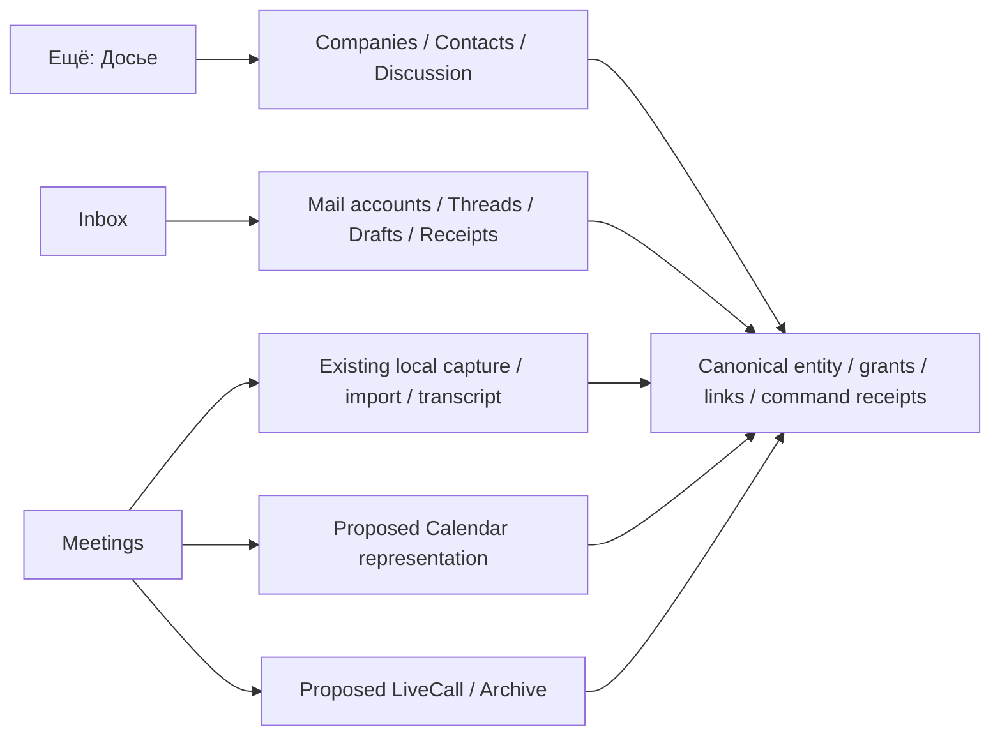

# Domain screens — подробная UI/spec Revision 2

Код ROX: `f63294ba4fffa7238b46b24e918925a313ad0b12`. Macro: `c966b79d40798c6c726a3b15fe90517941fc6e61`. Документ — спецификация предлагаемых расширений; текущие состояния ниже проверены чтением исходников. **UI, провайдеры и product E2E не запускались.**

## Размещение и сохранение существующих поверхностей

- CRM развивается внутри **Ещё → Досье**: существующие notes/promises/brief и старые item aliases сохраняются. Список/доска — representations общей Company/Contact системы.
- Mail развивается внутри **Inbox**. Unified attention inbox и существующие JMAP provisioning/MailReader/MailCompose сохраняются. Connections владеет подключениями.
- Meetings сохраняет настоящий локальный каталог, запись, импорт, Whisper и текущие detail tabs. Live calls и archive — дополнительные representations с общей identity.
- Full Calendar предлагается как вкладка **Встречи → Календарь**. Tasks status stripe остаётся. Новая top-level destination этой спецификацией не добавляется.
- Query-state routes `?view`, `?representation`, `?tab`, `?account` **PROPOSED**: их нет как доказанного зарегистрированного UI contract в baseline. Нужны typed route builders/parser/NavigationState/deep-link tests. Существующий base route не заменяется.

## Общие contracts реализации

Typed inputs/results каждого контрола находятся ниже и в JSON. `EntityRef` означает расширение существующего `Rox2EntityRef`, не новый incompatible тип. Command transport supplies authenticated actor; common envelope содержит workspace, idempotencyKey, baseRevision/policyRevision где требуется. Read queries проверяют parent и каждый source grant. Business owner, mention, entity link или company membership не выдают private mail/transcript доступ.

Русский compact light ROX: новые controls наследуют текущие tokens, computed fonts и motion primitives. `data-font=rox` нельзя автоматически считать globally loaded Rox WOFF2: current shell font mapping требует отдельной проверки; реальные mono WOFF2 не означают font parity всех controls. Optional typography correction — отдельный проверенный change, без глобального rewrite. Reduced motion сохраняет контекст без перемещения. Hover/focus short help идентичен; отдельная «Что это?» даёт source/freshness/units/rule/example. Help не перекрывает основной click. При 390px list→detail drilldown; 200% zoom без скрытых essential controls. Font/network/computed style и реальные screenshots — будущие implementation checks.

## Canonical command status — source-aligned

ROX `packages/core/src/rox2/platform-contract.ts:68–112` определяет независимые `executionMode`, `lifecycle`, `verification`. Verification только `unverified | receipt_verified | readback_verified`; не использовать queued/provider_accepted/local_durable как verification values. Они относятся к `operationState`.

- queued -> lifecycle queued, verification unverified; локальный outbox не shared/provider commit.
- provider_accepted -> command lifecycle succeeded, receipt_verified только при реальном provider receipt; не delivery или archive completeness.
- readback -> lifecycle succeeded, readback_verified после независимого проверки postcondition/source revision.
- local_durable -> standalone local authority receipt_verified; projection сохранение не remote commit. Ambiguous external outcome lifecycle unknown/unverified до reconciliation.
- executionMode остаётся фактическим live/fixture/simulated. Fixture/simulated verification никогда не даёт live/green product badge.

## Screen inventory

| ID | Экран | Destination | Work packages |
|---|---|---|---|
| CRM-01 | [Компании — список](#crm-01) | Ещё → Досье | WP-22, WP-23, WP-24, WP-26, WP-38 |
| CRM-02 | [Компании — доска стадий](#crm-02) | Ещё → Досье | WP-24, WP-04, WP-05 |
| CRM-03 | [Компания — единый контекст](#crm-03) | Ещё → Досье | WP-22, WP-23, WP-24, WP-26, WP-38, WP-36 |
| CRM-04 | [Контакты и карточка человека](#crm-04) | Ещё → Досье | WP-22, WP-23, WP-19 |
| CRM-05 | [Обсуждение компании/контакта](#crm-05) | Ещё → Досье | WP-25, WP-08, WP-09, WP-07 |
| CRM-06 | [Настройка pipeline и свойств](#crm-06) | Ещё → Досье | WP-24, WP-03, WP-04 |
| CRM-07 | [Импорт CSV и результат миграции](#crm-07) | Ещё → Досье | WP-22, WP-23, WP-24 |
| MAIL-01 | [Inbox — аккаунты и папки](#mail-01) | Входящие (существующий Inbox mode) | WP-17, WP-18 |
| MAIL-02 | [Thread и чтение письма](#mail-02) | Входящие | WP-17, WP-19, WP-39 |
| MAIL-03 | [Написать, ответить, переслать](#mail-03) | Входящие | WP-19, WP-17 |
| MAIL-04 | [Запланированная и неоднозначная отправка](#mail-04) | Входящие | WP-21, WP-19 |
| MAIL-05 | [Подключение почты и доступы](#mail-05) | Входящие / Connections | WP-17, WP-20, WP-21 |
| MAIL-06 | [Почта → контакт/компания](#mail-06) | Входящие | WP-22, WP-26, WP-38 |
| CAL-01 | [Календарь — день/неделя/месяц](#cal-01) | Встречи → Календарь (предлагаемая representation) | WP-27, WP-28, WP-29, WP-30 |
| CAL-02 | [Редактор события и RSVP](#cal-02) | Встречи → Календарь | WP-28, WP-29 |
| CAL-03 | [Доступность и рабочее время](#cal-03) | Встречи → Календарь | WP-29, WP-27 |
| MTG-01 | [Каталог встреч и звонков](#mtg-01) | Встречи | WP-30, WP-31, WP-35 |
| MTG-02 | [Планирование встречи и связанный контекст](#mtg-02) | Встречи | WP-30, WP-27, WP-35 |
| MTG-03 | [Локальная запись — активный recorder](#mtg-03) | Встречи | WP-35, WP-05 |
| MTG-04 | [Импорт аудио и готовность локальной ASR](#mtg-04) | Встречи | WP-35, WP-34 |
| MTG-05 | [Live call — комната и участники](#mtg-05) | Встречи / human Channel call entry | WP-31, WP-32, WP-08 |
| MTG-06 | [Согласие на запись и публикацию](#mtg-06) | Встречи → call/local detail | WP-33, WP-35, WP-39 |
| MTG-07 | [Архив звонка и запись](#mtg-07) | Встречи → Архив | WP-33, WP-34, WP-39 |
| MTG-08 | [Transcript, speaker mapping и summary evidence](#mtg-08) | Встречи → detail | WP-34, WP-35, WP-50, WP-13, WP-36 |

## CRM-01 — Компании — список

**Placement:** Ещё → Досье. Внутри Досье вкладки «Досье / Компании / Контакты»; «Список / Доска» только representations, существующие карточки доступны.

**Existing route:** `routes.view.screen('dossier') → dossier`. **Proposed view state:** `dossier?representation=list&kind=company`.

**Сейчас:** Есть персональные company/person cards, поиск по имени/aliases и heuristic touches; pipeline/email ingestion не реализованы этой моделью.

**Предлагается:** Таблица компаний поверх canonical Company, с domain/provenance и authorized interactions.

### Annotated layout

| Region | Position | Content | Purpose |
|---|---|---|---|
| toolbar | сверху 44px | Компании · Список/Доска · поиск · Фильтры · Импорт | Все фильтры применяются к серверному cursor query. |
| table | центр flexible | Компания, домен, стадия, ответственный, выручка, последний контакт | Имя открывает прежнюю detail pane; горизонтальный scroll без потери row label. |
| context | справа 380px при выборе | Выбранная компания + источники + свойства | Выбор сохраняет текущий список и scroll. |

### Контролы и interaction contracts

**Найти компанию** (`search`)

- Input: `{text:string}`; output: `{query:string,cursor:null}`.
- Click: 250ms debounce; поиск не добавляет entity link
- Keyboard/focus: / фокус поиска; Esc очищает только поиск
- Hover/focus help: Поиск по названию и проверенным доменам. Последний контакт — последняя разрешённая interaction, не время открытия карточки.
- Click help: Отдельная кнопка «Что это?» рядом с контролом; не перехватывает основное действие. Поиск по названию и проверенным доменам. Последний контакт — последняя разрешённая interaction, не время открытия карточки. Развёрнутый help показывает источник данных, время получения и пример для выбранной сущности.
- Permission: `crm.read`; authority/IPC проверяет повторно.

**Фильтры** (`filter`)

- Input: `{stages:string[],owners:EntityRef[],hidden:boolean}`; output: `{filter:CrmFilter[]}`.
- Click: Popover с chip результата и «Сбросить»
- Keyboard/focus: Tab внутри; Enter применяет; Esc возвращает focus
- Hover/focus help: Owner — деловой ответственный. Он не меняет права доступа. Скрытые записи входят только по явному фильтру.
- Click help: Отдельная кнопка «Что это?» рядом с контролом; не перехватывает основное действие. Owner — деловой ответственный. Он не меняет права доступа. Скрытые записи входят только по явному фильтру. Развёрнутый help показывает источник данных, время получения и пример для выбранной сущности.
- Permission: `crm.read`; authority/IPC проверяет повторно.

**Открыть компанию** (`open`)

- Input: `{companyRef:EntityRef}`; output: `{route:string}`.
- Click: Имя/строка выбирает canonical detail с alias resolution
- Keyboard/focus: ↑/↓ выделение; Enter открыть; Shift+Enter в новой pane
- Hover/focus help: Источник показывает email/manual/dossier-import; отсутствие домена обозначено «Не определён».
- Click help: Отдельная кнопка «Что это?» рядом с контролом; не перехватывает основное действие. Источник показывает email/manual/dossier-import; отсутствие домена обозначено «Не определён». Развёрнутый help показывает источник данных, время получения и пример для выбранной сущности.
- Permission: `company.read`; authority/IPC проверяет повторно.

### Queries, commands, events/errors

| Kind / name | Input | Output | Error | Events |
|---|---|---|---|---|
| query / QueryCRM | {workspaceId:string,kind:"company",text?:string,filters:CrmFilter[],sort:{field:"name" / "lastInteraction" / "revenue",direction:"asc" / "desc"},cursor?:string,limit:50} | {items:CompanySummary[],nextCursor?:string,asOf:string} | denied / invalid_filter / cursor_expired | — |

### Loading / empty / failure / recovery

- **loading:** Skeleton header+6 строк без нулевых финансовых метрик.
- **empty:** «Компаний пока нет» → «Добавить» или «Подключить почту»; filtered empty «Измените фильтры».
- **error:** Cursor expired сбрасывает cursor, сохраняет фильтры; partial source показывает unavailable, не нулевые interactions.
- **offline:** Cached rows с «Данные на <время>»; source email reads требуют уже авторизованной локальной копии.
- **reload:** URL/view-state восстанавливает фильтры, selected company и scroll; refetch учитывает актуальные grants.

### Independent Definition of Done — NOT_RUN

| Test | Procedure | Expected | Seeded negative control |
|---|---|---|---|
| CRM-01-T1 | Создать две одноимённые компании с разными domains; искать домен. | Показывается точный record; выбор canonical id не displayName. | Подменить lookup на name-only: тест обязан показать wrong-detail failure. |
| CRM-01-T2 | Пользователь без права mail видит shared company. | Ни snippet, ни private last-interaction timestamp не раскрываются. | Отключить source ACL filter: seeded fixture приватного mail должен сломать assert. |

**Affected work packages:** WP-22, WP-23, WP-24, WP-26, WP-38.

**Current-code evidence:**

- ROX `f63294ba4fffa7238b46b24e918925a313ad0b12`: [apps/electron/src/renderer/pages/extra-screens/dossier/DossierPage.tsx:94](https://github.com/rox-one/rox-one/blob/f63294ba4fffa7238b46b24e918925a313ad0b12/apps/electron/src/renderer/pages/extra-screens/dossier/DossierPage.tsx#L94) — `DossierPage`.
- ROX `f63294ba4fffa7238b46b24e918925a313ad0b12`: [apps/electron/src/renderer/pages/extra-screens/dossier/dossier-model.ts:19](https://github.com/rox-one/rox-one/blob/f63294ba4fffa7238b46b24e918925a313ad0b12/apps/electron/src/renderer/pages/extra-screens/dossier/dossier-model.ts#L19) — `DossierEntity / buildDossierSummary`.

**Macro behavior evidence (не разрешение copy):**

- Macro `c966b79d40798c6c726a3b15fe90517941fc6e61` [apps/web/src/features/companies/Company/Company.tsx:24](https://github.com/macro-inc/macro/blob/c966b79d40798c6c726a3b15fe90517941fc6e61/apps/web/src/features/companies/Company/Company.tsx#L24) — `Company`; Detail uses discussions, email, metadata, properties, contacts/sharing; inbound references TODO
- Macro `c966b79d40798c6c726a3b15fe90517941fc6e61` [apps/web/src/features/companies/route.tsx:38](https://github.com/macro-inc/macro/blob/c966b79d40798c6c726a3b15fe90517941fc6e61/apps/web/src/features/companies/route.tsx#L38) — `companiesRoute`; Customers route uses authenticated feature-gated SoupView

## CRM-02 — Компании — доска стадий

**Placement:** Ещё → Досье. Переключатель representation рядом с «Список»; без новой destination.

**Existing route:** `routes.view.screen('dossier') → dossier`. **Proposed view state:** `dossier?representation=board&kind=company`.

**Сейчас:** В baseline Досье нет CRM stage board.

**Предлагается:** Board отображает те же canonical компании, фильтры и бизнес-свойства, что список.

### Annotated layout

| Region | Position | Content | Purpose |
|---|---|---|---|
| columns | центр horizontal | Колонки pipeline · счётчик · карточки · «Без стадии» | Колонки не заменяют grant scopes. |
| card | в колонке | Компания, owner avatar, revenue+currency, last interaction | Открытие detail и отдельное menu «Переместить». |
| pending | внутри карточки | «Сохраняем…»/conflict badge | Pending patch и authoritative placement различимы. |

### Контролы и interaction contracts

**Переместить в стадию** (`move`)

- Input: `{companyRef:EntityRef,stageId:string,baseRevision:number}`; output: `{receiptId:string,revision:number}`.
- Click: Drag/drop или menu командой CAS; conflicting drop возвращается к authoritative колонке
- Keyboard/focus: Space открывает меню стадии; ↑↓ выбирают; Enter подтверждает
- Hover/focus help: Изменяется бизнес-стадия, не доступ. Счётчик обновляется после receipt.
- Click help: Отдельная кнопка «Что это?» рядом с контролом; не перехватывает основное действие. Изменяется бизнес-стадия, не доступ. Счётчик обновляется после receipt. Развёрнутый help показывает источник данных, время получения и пример для выбранной сущности.
- Permission: `company.write`; authority/IPC проверяет повторно.

**Список** (`view`)

- Input: `{representation:"list"}`; output: `{viewState:CrmViewState}`.
- Click: Меняет representation, сохраняет query и выбранный record
- Keyboard/focus: Tab+Enter
- Hover/focus help: Список и доска используют одну выборку и одни entity IDs.
- Click help: Отдельная кнопка «Что это?» рядом с контролом; не перехватывает основное действие. Список и доска используют одну выборку и одни entity IDs. Развёрнутый help показывает источник данных, время получения и пример для выбранной сущности.
- Permission: `crm.read`; authority/IPC проверяет повторно.

**О стадии** (`stage-help`)

- Input: `{stageId:string}`; output: `{help:StageDefinition}`.
- Click: Нажать заголовочный info; edit catalog отдельной admin кнопкой
- Keyboard/focus: Enter/Space открыть help; Esc закрыть
- Hover/focus help: Определение стадии, её порядок и admin who changed; пример критериев перехода.
- Click help: Отдельная кнопка «Что это?» рядом с контролом; не перехватывает основное действие. Определение стадии, её порядок и admin who changed; пример критериев перехода. Развёрнутый help показывает источник данных, время получения и пример для выбранной сущности.
- Permission: `crm.read`; authority/IPC проверяет повторно.

### Queries, commands, events/errors

| Kind / name | Input | Output | Error | Events |
|---|---|---|---|---|
| query / QueryCRMBoard | {pipelineId:string,filters:CrmFilter[],perColumnLimit:30} | {columns:{stageId:string,items:CompanySummary[],nextCursor?:string,total:number}[],revision:number} | denied / unknown_pipeline | — |
| command / UpdateCompanyPipeline | {companyRef:EntityRef,stageId:string,baseRevision:number,idempotencyKey:string} | {revision:number,receiptId:string} | conflict / unknown_stage / denied | crm.pipeline_changed, entity.updated |

### Loading / empty / failure / recovery

- **loading:** Колонки skeleton до catalog+rows; не показать default fictitious stages.
- **empty:** Пустая колонка «Нет компаний»; «Без стадии» содержит реально unset rows.
- **error:** 409 показывает «Стадия уже изменена»+актуальную колонку; удалённая стадия предлагает выбор.
- **offline:** Cached read-only board; drop disabled «Сеть нужна для подтверждения перехода».
- **reload:** Pending receipt восстанавливается; idempotency key тот же; новый drag не повторяет старый command.

### Independent Definition of Done — NOT_RUN

| Test | Procedure | Expected | Seeded negative control |
|---|---|---|---|
| CRM-02-T1 | Два клиента одновременно перемещают одну компанию с одной revision. | Один receipt, другой conflict; reload одинаковая колонка. | Убрать revision check: оба success должны провалить тест. |
| CRM-02-T2 | Read-only actor пробует drag и tool update. | Контрол disabled и сервер denied; count не изменяется. | Обойти UI и вызвать command, assert denial. |

**Affected work packages:** WP-24, WP-04, WP-05.

**Current-code evidence:**

- ROX `f63294ba4fffa7238b46b24e918925a313ad0b12`: [apps/electron/src/renderer/pages/extra-screens/dossier/DossierPage.tsx:94](https://github.com/rox-one/rox-one/blob/f63294ba4fffa7238b46b24e918925a313ad0b12/apps/electron/src/renderer/pages/extra-screens/dossier/DossierPage.tsx#L94) — `DossierPage`.

**Macro behavior evidence (не разрешение copy):**

- Macro `c966b79d40798c6c726a3b15fe90517941fc6e61` [apps/web/src/features/companies/Company/Company.tsx:24](https://github.com/macro-inc/macro/blob/c966b79d40798c6c726a3b15fe90517941fc6e61/apps/web/src/features/companies/Company/Company.tsx#L24) — `Company`; Detail uses discussions, email, metadata, properties, contacts/sharing; inbound references TODO

## CRM-03 — Компания — единый контекст

**Placement:** Ещё → Досье. Сохранить карточку Досье; additive tabs «Обзор / Почта / Контакты / Задачи / Встречи / Документы / Обсуждение».

**Existing route:** `routes.view.screen('dossier',id) → dossier/item/{id}`. **Proposed view state:** `dossier/item/{canonicalCompanyId}?tab=overview`.

**Сейчас:** Карточка содержит notes/promises, touches по совпадению terms и agent briefSessionId.

**Предлагается:** Verified edges и authorized source context; прежние notes/promises сохраняются с import provenance.

### Annotated layout

| Region | Position | Content | Purpose |
|---|---|---|---|
| header | detail pane сверху | Компания · domain · stage · owner · sharing · source badge | Inline свойства не смешивают бизнес-owner и ACL owner. |
| tabs | под header | Обзор, Почта, Контакты, Задачи, Встречи, Документы, Обсуждение | Each count authorized; скрытые источники не раскрывают total. |
| overview | две колонки | Слева activity+письма; справа свойства+contacts+agent context | Каждый item имеет EntityRef, источник и freshness. |

### Контролы и interaction contracts

**Связанные данные** (`linked-tab`)

- Input: `{kind:EntityType,cursor?:string}`; output: `{items:ContextLink[],unavailableKinds:EntityType[]}`.
- Click: Tab меняет разрешённую contextual query, не grep company name
- Keyboard/focus: ←/→ между tabs; Home/End край; Enter selected
- Hover/focus help: Подсчёт включает только доступные связи. «Источник недоступен» отличается от «Нет писем».
- Click help: Отдельная кнопка «Что это?» рядом с контролом; не перехватывает основное действие. Подсчёт включает только доступные связи. «Источник недоступен» отличается от «Нет писем». Развёрнутый help показывает источник данных, время получения и пример для выбранной сущности.
- Permission: `company.read plus source.read`; authority/IPC проверяет повторно.

**Спросить агента о компании** (`agent`)

- Input: `{companyRef:EntityRef,question:string}`; output: `{sessionRef:EntityRef,contextRevision:string}`.
- Click: Context preview показывает включённые kinds до запуска; открывает existing Sessions
- Keyboard/focus: Enter запускает после review; Esc закрывает draft
- Hover/focus help: Агент получает разрешённый source context; прав на private почту не добавляется. Отправка prompt во внешний model зависит agent policy.
- Click help: Отдельная кнопка «Что это?» рядом с контролом; не перехватывает основное действие. Агент получает разрешённый source context; прав на private почту не добавляется. Отправка prompt во внешний model зависит agent policy. Развёрнутый help показывает источник данных, время получения и пример для выбранной сущности.
- Permission: `agent.invoke + company.read`; authority/IPC проверяет повторно.

**Скрыть компанию** (`hide`)

- Input: `{companyRef:EntityRef,scope:"personal"|"team",hidden:true,baseRevision:number}`; output: `{revision:number}`.
- Click: Меню «Скрыть для меня» отдельно team action; banner undo при допустимой revision
- Keyboard/focus: Menu keyboard arrows; Enter применяет; Undo фокусируемый
- Hover/focus help: Скрытие — visibility preference, не прекращение mailbox ingestion и не deletion источника.
- Click help: Отдельная кнопка «Что это?» рядом с контролом; не перехватывает основное действие. Скрытие — visibility preference, не прекращение mailbox ingestion и не deletion источника. Развёрнутый help показывает источник данных, время получения и пример для выбранной сущности.
- Permission: `self.preference.write; team hiding crm.admin`; authority/IPC проверяет повторно.

**Ответственный** (`owner-edit`)

- Input: `{companyRef:EntityRef,ownerRef:EntityRef|null,baseRevision:number,idempotencyKey:string}`; output: `{companyRef:EntityRef,ownerRef:EntityRef|null,revision:number,receiptId:string}`.
- Click: Authorized workspace-member combobox; Unassigned explicit nullable. Submit CAS command; pending field then authoritative response. Owner does not modify grants; rejected change keeps draft and displays server value.
- Keyboard/focus: Enter opens picker; arrows results; Enter selects; final «Сохранить»; Esc cancel; no auto-save on hover/focus.
- Hover/focus help: Ответственный — участник workspace, который ведёт компанию; не CRMContact и не ACL owner. Пример: передача Ивану оставляет share grants без изменений. Источник CRM revision/readback.
- Click help: Отдельная «Что это?» открывает объяснение; Esc возвращает focus. Ответственный — участник workspace, который ведёт компанию; не CRMContact и не ACL owner. Пример: передача Ивану оставляет share grants без изменений. Источник CRM revision/readback.
- Permission: `company.write + selected principal workspace.member`; authority/IPC проверяет повторно.
- Canonical dispatcher: `crm.updateCompany`; facade: `crm.company.setOwner` / `SetCompanyOwner` (validated ownerRef patch).

**Выручка** (`revenue-edit`)

- Input: `{companyRef:EntityRef,value:Money|null,baseRevision:number,idempotencyKey:string}`; output: `{companyRef:EntityRef,revenue:Money|null,revision:number,receiptId:string}`.
- Click: Exact amount/currency field; locale decimal parsed to integer minor-unit string with ISO currency precision; no binary float. Blank explicit null, zero explicit0. Save only after valid; receipt then same property visible list/board/context.
- Keyboard/focus: Tab amount/currency; Enter save; Esc restores authoritative value; invalid field first focus.
- Hover/focus help: Выручка — денежная сумма в валюте записи. Пример1250,00 RUB -> amountMinor125000/RUB. Unset отличается от0; разные валюты не суммируются без explicit conversion source/asOf.
- Click help: Отдельная «Что это?» открывает объяснение; Esc возвращает focus. Выручка — денежная сумма в валюте записи. Пример1250,00 RUB -> amountMinor125000/RUB. Unset отличается от0; разные валюты не суммируются без explicit conversion source/asOf.
- Permission: `company.write`; authority/IPC проверяет повторно.
- Canonical dispatcher: `crm.updateCompany`; facade: `crm.company.setRevenue` / `SetCompanyRevenue` (validated revenue patch).

### Normative command mapping — PROPOSED

- **identity:** companyRef canonical; ownerRef User principal in same workspace, not Contact/Company/User alias by name.
- **persistence:** Same Company repository/property projection and transactional outbox, CAS baseRevision, idempotent per actor/workspace/command key; field command cannot create second pipeline record.
- **money:** Money amountMinor matches nonnegative integer decimal string, currency supported ISO code with configured minor precision; target DB exact numeric, explicit maximum from shared schema. null unset, amountMinor0 zero. UI locale parser rejects excess decimals and unsupported currency.
- **permissions:** Business owner reassign does not grant/revoke access; company.write required, chosen principal active workspace membership. Revenue source does not infer email-derived ownership.
- **readback:** Return normalized persisted field+Company revision/receipt; GetCompanyContext/QueryCRM/QueryCRMBoard and agent common query hydrate same field revision. Offline local draft is not committed property. Conflicts return safe current revision and value only if current read grant.

- **dispatchMapping:** Per cloud/contract-amendments.json, owner/revenue facades call primary `crm.updateCompany` with validated field-specific patch, one CAS/repository/outbox; не новый command authority.

### Queries, commands, events/errors

| Kind / name / canonical op | Input | Output | Error | Events |
|---|---|---|---|---|
| query / GetCompanyContext | {companyRef:EntityRef,kinds:EntityType[],cursor?:string} | {company:Company,authorizedLinks:ContextLink[],asOf:string,unavailableKinds:EntityType[]} | denied / not_found / source_unavailable | — |
| command / CreateAgentSessionFromContext | {contextRef:EntityRef,contextRevision:string,question:string,idempotencyKey:string} | {sessionRef:EntityRef,receiptId:string} | context_stale / denied / agent_unavailable | agent_session.created |
| command / SetCompanyOwner / crm.updateCompany | {companyRef:EntityRef,ownerRef:EntityRef / null,baseRevision:number,idempotencyKey:string} | {companyRef:EntityRef,ownerRef:EntityRef / null,revision:number,receiptId:string} | denied / conflict / principal_not_workspace_member / invalid_principal_kind / not_found | crm.company_updated, activity.created |
| command / SetCompanyRevenue / crm.updateCompany | {companyRef:EntityRef,value:Money / null,baseRevision:number,idempotencyKey:string} | {companyRef:EntityRef,revenue:Money / null,revision:number,receiptId:string} | denied / conflict / invalid_currency / invalid_minor_units / amount_out_of_range / not_found | crm.company_updated, activity.created |

### Loading / empty / failure / recovery

- **loading:** Header loads independently; tab has its own skeleton, no whole-detail blank during query.
- **empty:** «Писем нет» only when source authorized and available; legacy heuristic touches labelled «Предполагаемая связь».
- **error:** Denied parent replaces pane with access state; individual failed source exposes safe unavailable explanation.
- **offline:** Authorized cached overview readable; agent/network actions unavailable; private cached sources follow local policy.
- **reload:** Canonical alias resolves migrated dossier ID; active tab restores after route parsing implemented.

### Independent Definition of Done — NOT_RUN

| Test | Procedure | Expected | Seeded negative control |
|---|---|---|---|
| CRM-03-T1 | Company links private email, task, contact, meeting; actor only company+task. | Context and agent request include task only; no private metadata leakage. | Include excluded source content in response and assert fail. |
| CRM-03-T2 | Import dossier promises and open old route ID. | Same notes/promises visible under canonical company; no duplicate card. | Regenerate IDs and observe broken alias test. |
| CRM-03-T3 | Set owner to different workspace User and revenue1250.00RUB via commands, reload detail/list/board and agent query; unset then set zero. | Same owner and exact amountMinor125000/RUB in every authorized view; one revision stream; null distinct0; original ACL grants unchanged. | UI-only property save, alternate per-board store, float-money conversion or owner=>grant mutation each rejected by persistence/value/grant assertions. |
| CRM-03-T4 | Two editors save properties from same stale Company revision; select Contact or outside-workspace principal; invalid currency/extra precision. | CAS conflict preserves unsent field draft; invalid owner/money typed errors; no committed property/event; current read-authorized value only. | Ignore baseRevision or membership/currency validator; assert unexpected commit fails. |

**Affected work packages:** WP-22, WP-23, WP-24, WP-26, WP-38, WP-36.

**Current-code evidence:**

- ROX `f63294ba4fffa7238b46b24e918925a313ad0b12`: [apps/electron/src/renderer/pages/extra-screens/dossier/DossierPage.tsx:94](https://github.com/rox-one/rox-one/blob/f63294ba4fffa7238b46b24e918925a313ad0b12/apps/electron/src/renderer/pages/extra-screens/dossier/DossierPage.tsx#L94) — `DossierPage`.
- ROX `f63294ba4fffa7238b46b24e918925a313ad0b12`: [apps/electron/src/renderer/pages/extra-screens/dossier/dossier-model.ts:163](https://github.com/rox-one/rox-one/blob/f63294ba4fffa7238b46b24e918925a313ad0b12/apps/electron/src/renderer/pages/extra-screens/dossier/dossier-model.ts#L163) — `buildDossierSummary`.

**Macro behavior evidence (не разрешение copy):**

- Macro `c966b79d40798c6c726a3b15fe90517941fc6e61`: [apps/web/src/features/companies/Company/Company.tsx:24](https://github.com/macro-inc/macro/blob/c966b79d40798c6c726a3b15fe90517941fc6e61/apps/web/src/features/companies/Company/Company.tsx#L24) — `Company`; Detail uses discussions, email, metadata, properties, contacts/sharing; inbound references TODO
- Macro `c966b79d40798c6c726a3b15fe90517941fc6e61`: [apps/web/src/features/companies/Company/use-company-emails-query.ts:1](https://github.com/macro-inc/macro/blob/c966b79d40798c6c726a3b15fe90517941fc6e61/apps/web/src/features/companies/Company/use-company-emails-query.ts#L1) — `useCompanyEmailsQuery`; CRM detail emails use scoped query integration

## CRM-04 — Контакты и карточка человека

**Placement:** Ещё → Досье. «Контакты» additive tab вместо второй People destination; person cards продолжают работать.

**Existing route:** `routes.view.screen('dossier',id)`. **Proposed view state:** `dossier?kind=contact / dossier/item/{contactId}?tab=overview`.

**Сейчас:** Person card использует имя, org free text, aliases, notes/promises. Нет authoritative email identity.

**Предлагается:** Контакты с normalized email, company relationship, sources и interaction history; displayName не unique key.

### Annotated layout

| Region | Position | Content | Purpose |
|---|---|---|---|
| directory | list column | Имя, email, компания, последнее разрешённое взаимодействие | Search+cursor сохраняют selection. |
| person | detail header | Имя · email · verified company chip | Email role/source visible, aliases optional раскрытие. |
| sources | нижняя detail секция | «Откуда контакт» + permission-safe receipts | Manual и inbound enrichment объясняются явно. |

### Контролы и interaction contracts

**Написать письмо** (`email`)

- Input: `{contactRef:EntityRef,accountRef:EntityRef}`; output: `{composeDraft:DraftBody}`.
- Click: Prefill exact email; пользователь выбирает From account
- Keyboard/focus: Enter открывает compose; не отправляет
- Hover/focus help: Используется подтверждённый адрес; адрес из имени не угадывается.
- Click help: Отдельная кнопка «Что это?» рядом с контролом; не перехватывает основное действие. Используется подтверждённый адрес; адрес из имени не угадывается. Развёрнутый help показывает источник данных, время получения и пример для выбранной сущности.
- Permission: `contact.read + mail.compose`; authority/IPC проверяет повторно.

**Связать с компанией** (`company-link`)

- Input: `{contactRef:EntityRef,companyRef:EntityRef,baseRevision:number}`; output: `{revision:number,receiptId:string}`.
- Click: Entity picker позволяет только authorized company; provenance manual
- Keyboard/focus: Typing search; ↑↓ result; Enter choose; Esc cancel
- Hover/focus help: Связь вручную имеет actor+time; изменение domain не переписывает без подтверждения принадлежность.
- Click help: Отдельная кнопка «Что это?» рядом с контролом; не перехватывает основное действие. Связь вручную имеет actor+time; изменение domain не переписывает без подтверждения принадлежность. Развёрнутый help показывает источник данных, время получения и пример для выбранной сущности.
- Permission: `contact.write + company.read`; authority/IPC проверяет повторно.

**Объединить дубликаты** (`merge`)

- Input: `{winner:EntityRef,loser:EntityRef,baseRevisions:[number,number]}`; output: `{mergeId:string,revision:number}`.
- Click: Preview diff emails/sources/notes/promises; explicit merge; Undo отдельный журнал
- Keyboard/focus: Tab diff; Enter primary after preview; Esc cancel
- Hover/focus help: Merge меняет identity aliases и backlinks; одинаковое имя — недостаточное доказательство.
- Click help: Отдельная кнопка «Что это?» рядом с контролом; не перехватывает основное действие. Merge меняет identity aliases и backlinks; одинаковое имя — недостаточное доказательство. Развёрнутый help показывает источник данных, время получения и пример для выбранной сущности.
- Permission: `crm.identity.merge`; authority/IPC проверяет повторно.

### Queries, commands, events/errors

| Kind / name | Input | Output | Error | Events |
|---|---|---|---|---|
| query / QueryContacts | {text:string,companyRef?:EntityRef,cursor?:string,limit:50} | {items:ContactSummary[],nextCursor?:string} | denied / cursor_expired | — |
| command / LinkContactCompany | {contactRef:EntityRef,companyRef:EntityRef,baseRevision:number,idempotencyKey:string} | {revision:number,receiptId:string} | denied / conflict / cross_scope | entity.linked, crm.contact_updated |

### Loading / empty / failure / recovery

- **loading:** List paged skeleton; source receipts independently.
- **empty:** «Контактов нет» → manual add or mail connection; generic-domain email может иметь contact без company.
- **error:** Invalid address field-level; merge incompatible_scope explanation without other private record contents.
- **offline:** Local contact notes editable through authorized local adapter; enrichment pending visible.
- **reload:** Alias map restores old person IDs; stale merge diff requires re-preview.

### Independent Definition of Done — NOT_RUN

| Test | Procedure | Expected | Seeded negative control |
|---|---|---|---|
| CRM-04-T1 | Два contacts same name different email; нажать compose. | Точный chosen email, correct From account, no automatic merge. | Resolve by name first and assert wrong-recipient failure. |
| CRM-04-T2 | Merge then add task backlink; attempt Undo. | Explicit conflict/compensation preserving task, not silent dangling ref. | Naive snapshot overwrite должен провалить link conservation assert. |

**Affected work packages:** WP-22, WP-23, WP-19.

**Current-code evidence:**

- ROX `f63294ba4fffa7238b46b24e918925a313ad0b12`: [apps/electron/src/renderer/pages/extra-screens/dossier/dossier-model.ts:19](https://github.com/rox-one/rox-one/blob/f63294ba4fffa7238b46b24e918925a313ad0b12/apps/electron/src/renderer/pages/extra-screens/dossier/dossier-model.ts#L19) — `DossierEntity / DossierPromise`.
- ROX `f63294ba4fffa7238b46b24e918925a313ad0b12`: [apps/electron/src/renderer/pages/extra-screens/dossier/DossierPage.tsx:94](https://github.com/rox-one/rox-one/blob/f63294ba4fffa7238b46b24e918925a313ad0b12/apps/electron/src/renderer/pages/extra-screens/dossier/DossierPage.tsx#L94) — `DossierPage`.

**Macro behavior evidence (не разрешение copy):**

- Macro `c966b79d40798c6c726a3b15fe90517941fc6e61` [apps/web/src/features/companies/views/CrmPeople.tsx:30](https://github.com/macro-inc/macro/blob/c966b79d40798c6c726a3b15fe90517941fc6e61/apps/web/src/features/companies/views/CrmPeople.tsx#L30) — `CrmPeople`; Contact directory paged search/sort name/company/first-last interactions

## CRM-05 — Обсуждение компании/контакта

**Placement:** Ещё → Досье. Внутри карточки вкладка «Обсуждение»; общая Message primitive WP08, не отдельный CRM chat.

**Existing route:** `routes.view.screen('dossier',id)`. **Proposed view state:** `dossier/item/{id}?tab=discussion&message={messageId}`.

**Сейчас:** Baseline Досье notes не являются совместными discussion messages.

**Предлагается:** Entity-parented discussion с mentions/replies/attachments и one notification engine.

### Annotated layout

| Region | Position | Content | Purpose |
|---|---|---|---|
| timeline | detail body | Сообщения · author · time · edited · replies | Pinned source-safe context above, cursor pagination. |
| composer | sticky bottom | Текст · mention picker · attachment · «Отправить» | Mention chip identifies entity kind, no automatic share. |
| permissions | header | Audience chip «Видят участники …» | Click opens same entity ACL panel. |

### Контролы и interaction contracts

**Отправить** (`post`)

- Input: `{parent:EntityRef,body:RichText,attachmentRefs:EntityRef[],replyTo?:EntityRef,mentions:MentionInput[],idempotencyKey:string}`; output: `{messageRef:EntityRef,revision:number,receiptId:string}`.
- Click: Post creates Message on company/contact parent; preserves draft if denied
- Keyboard/focus: Cmd/Ctrl+Enter post; Enter newline
- Hover/focus help: Recipient notification only when mention recipient can view source and target. Mention не выдаёт доступ автоматически.
- Click help: Отдельная кнопка «Что это?» рядом с контролом; не перехватывает основное действие. Recipient notification only when mention recipient can view source and target. Mention не выдаёт доступ автоматически. Развёрнутый help показывает источник данных, время получения и пример для выбранной сущности.
- Permission: `discussion.write`; authority/IPC проверяет повторно.
- Canonical dispatcher: `message.create`; wrapper alias: `PostEntityDiscussion`.

**Упомянуть** (`mention`)

- Input: `{query:string,parentRef:EntityRef}`; output: `{targetRef:EntityRef,recipientPolicy:string}`.
- Click: @ opens authorized entity/principal results; choose displays kind
- Keyboard/focus: ↑↓ choose; Enter insert; Esc close without destroying @ text
- Hover/focus help: Help показывает type/visibility; unreachable recipient выбирается только policy-supported flow.
- Click help: Отдельная кнопка «Что это?» рядом с контролом; не перехватывает основное действие. Help показывает type/visibility; unreachable recipient выбирается только policy-supported flow. Развёрнутый help показывает источник данных, время получения и пример для выбранной сущности.
- Permission: `parent.read + mention.target.read`; authority/IPC проверяет повторно.

**Ответить в ветке** (`reply`)

- Input: `{messageRef:EntityRef}`; output: `{threadRef:EntityRef,draft:RichText}`.
- Click: Opens inline thread preserving company context
- Keyboard/focus: Enter reply; Esc closes thread returning to message
- Hover/focus help: Thread — общий Message reply relationship, не новая CRMDiscussion table.
- Click help: Отдельная кнопка «Что это?» рядом с контролом; не перехватывает основное действие. Thread — общий Message reply relationship, не новая CRMDiscussion table. Развёрнутый help показывает источник данных, время получения и пример для выбранной сущности.
- Permission: `message.read + discussion.write`; authority/IPC проверяет повторно.

### Normative command mapping — PROPOSED

- **mapping:** PostEntityDiscussion and PostMessage are headless screen wrappers only for canonical dispatcher operation message.create used by Channel/DM/Page/Task; wrappers do not implement separate persistence or outbox engine.
- **parent:** Validated common MessageParent/EntityRef; reply root parent must equal parent, never cross-channel/CRM source trick. Current parent and each mentioned/attached entity authorization rechecked at commit.
- **persistence:** One common message table/repository, one workspace authority transaction, same actor/workspace/canonicalOperation/idempotencyKey namespace and payload digest. Same key same payload returns same MessageRef/receipt across wrapper retry; different payload returns idempotency_payload_mismatch.
- **events:** message.created/mention.created/notification.requested from one outbox. One mention recipient calculation/notification dedup; no crm_message table or CRM-specific notification publisher.
- **aliases:** Legacy Macro CRM comms_messages references and ROX wrapper names are import/client aliases only; message.create is command registry and generated-client symbol.

### Queries, commands, events/errors

| Kind / name / canonical op | Input | Output | Error | Events |
|---|---|---|---|---|
| query / GetEntityDiscussion | {parent:EntityRef,cursor?:string,limit:50} | {messages:DiscussionMessage[],nextCursor?:string,readState:ReadState} | denied / not_found | — |
| command / PostMessage / message.create | {parent:EntityRef,body:RichText,attachmentRefs:EntityRef[],replyTo?:EntityRef,mentions:MentionInput[],idempotencyKey:string} | {messageRef:EntityRef,revision:number,receiptId:string} | denied / attachment_denied / invalid_mention / parent_mismatch / idempotency_payload_mismatch | message.created, mention.created, notification.requested |

### Loading / empty / failure / recovery

- **loading:** Skeleton timeline, input disabled until parent grants known.
- **empty:** «Начните обсуждение» composer visible only writer.
- **error:** Permission revoke preserves unsent local draft privately, timeline purged; send denied never looks posted.
- **offline:** Read cached authorized messages, local private draft «Не отправлено»; transport retries same command key only after fresh grants.
- **reload:** Draft parent ID+workspace restored; server receipt dedup removes duplicate optimistic row.

### Independent Definition of Done — NOT_RUN

| Test | Procedure | Expected | Seeded negative control |
|---|---|---|---|
| CRM-05-T1 | Mention teammate, replay message outbox twice. | One notification, one message, indexed permitted discussion. | Remove consumer dedup and assert duplicate alert. |
| CRM-05-T2 | Revoke parent while draft open then press send. | Denied, private unsent draft, no remote message or notification. | UI-only authorization seed must fail direct command test. |
| CRM-05-T3 | Create company discussion through PostEntityDiscussion; retry same key/payload via PostMessage; try reply root from another parent and samekey/different body. | One MessageRef/receipt/message row/recipient notification in canonical message.create namespace; parent mismatch and different payload typed rejected. | Wrapper-specific idempotency table/CRM publisher or skipped root parent validation produces duplicate/leak and assertions fail. |

**Affected work packages:** WP-25, WP-08, WP-09, WP-07.

**Current-code evidence:**

- ROX `f63294ba4fffa7238b46b24e918925a313ad0b12`: [apps/electron/src/renderer/pages/extra-screens/dossier/DossierPage.tsx:94](https://github.com/rox-one/rox-one/blob/f63294ba4fffa7238b46b24e918925a313ad0b12/apps/electron/src/renderer/pages/extra-screens/dossier/DossierPage.tsx#L94) — `DossierPage`.
- ROX `f63294ba4fffa7238b46b24e918925a313ad0b12`: [packages/core/src/rox2/platform-contract.ts:233](https://github.com/rox-one/rox-one/blob/f63294ba4fffa7238b46b24e918925a313ad0b12/packages/core/src/rox2/platform-contract.ts#L233) — `Rox2EntityRef`.

**Macro behavior evidence (не разрешение copy):**

- Macro `c966b79d40798c6c726a3b15fe90517941fc6e61`: [apps/web/src/features/companies/Company/CompanyDiscussionSection.tsx:5](https://github.com/macro-inc/macro/blob/c966b79d40798c6c726a3b15fe90517941fc6e61/apps/web/src/features/companies/Company/CompanyDiscussionSection.tsx#L5) — `CompanyDiscussionSection`; CRM UI uses shared EntityDiscussion with crm_company parent

## CRM-06 — Настройка pipeline и свойств

**Placement:** Ещё → Досье. Admin drawer из board toolbar «Настроить стадии»; не новый Settings subsystem.

**Existing route:** `routes.view.screen('dossier')`. **Proposed view state:** `dossier?panel=pipeline-settings`.

**Сейчас:** Baseline stages нет; conation CRM live mutation blocked.

**Предлагается:** Workspace stage catalog, owner principals и exact currency revenue validation с audit.

### Annotated layout

| Region | Position | Content | Purpose |
|---|---|---|---|
| drawer | справа 440px | Pipeline название · стадии reorder · add/remove · currency rules | Preview affected records before delete. |
| stage-editor | в drawer | Название · описание · rank · replacement stage | Stable stage ID not name. |
| footer | sticky | «Отмена» · «Сохранить» · version conflict | Administrative receipt visible. |

### Контролы и interaction contracts

**Порядок стадий** (`stage-reorder`)

- Input: `{pipelineId:string,stageIds:string[],baseRevision:number}`; output: `{revision:number}`.
- Click: Drag handle + up/down buttons; save one revisioned order
- Keyboard/focus: Alt+↑/↓ move focused stage; Enter Save
- Hover/focus help: Порядок влияет на board, не меняет реальные company stage IDs.
- Click help: Отдельная кнопка «Что это?» рядом с контролом; не перехватывает основное действие. Порядок влияет на board, не меняет реальные company stage IDs. Развёрнутый help показывает источник данных, время получения и пример для выбранной сущности.
- Permission: `crm.pipeline.admin`; authority/IPC проверяет повторно.

**Удалить стадию** (`delete-stage`)

- Input: `{stageId:string,replacementStageId:string,baseRevision:number}`; output: `{receiptId:string,affectedCount:number}`.
- Click: Preview count + required replacement; apply atomically or tracked migration receipt
- Keyboard/focus: Keyboard menu select replacement; primary «Перенести и удалить»
- Hover/focus help: У компаний не может остаться ссылка на удалённую стадию; count uses authorized admin query.
- Click help: Отдельная кнопка «Что это?» рядом с контролом; не перехватывает основное действие. У компаний не может остаться ссылка на удалённую стадию; count uses authorized admin query. Развёрнутый help показывает источник данных, время получения и пример для выбранной сущности.
- Permission: `crm.pipeline.admin`; authority/IPC проверяет повторно.

**Выручка** (`revenue`)

- Input: `{amountMinor:string,currency:string}`; output: `{valid:boolean,display:string}`.
- Click: Validate exact decimal conversion per currency; blank differs zero
- Keyboard/focus: Numeric input accessible; Tab currency; Enter save property
- Hover/focus help: Денежная сумма в выбранной валюте. Общая сумма разных валют не выводится без явного rate/source/asOf.
- Click help: Отдельная кнопка «Что это?» рядом с контролом; не перехватывает основное действие. Денежная сумма в выбранной валюте. Общая сумма разных валют не выводится без явного rate/source/asOf. Развёрнутый help показывает источник данных, время получения и пример для выбранной сущности.
- Permission: `company.write`; authority/IPC проверяет повторно.

### Queries, commands, events/errors

| Kind / name | Input | Output | Error | Events |
|---|---|---|---|---|
| query / GetPipelineCatalog | {pipelineId:string} | {stages:StageDefinition[],revision:number} | denied / not_found | — |
| command / UpdatePipelineCatalog | {pipelineId:string,baseRevision:number,patch:PipelinePatch,idempotencyKey:string} | {revision:number,receiptId:string} | denied / conflict / orphan_records / invalid_name | crm.pipeline_catalog_updated, activity.created |

### Loading / empty / failure / recovery

- **loading:** Catalog skeleton, admin button disabled until grants.
- **empty:** No stages => «Создать первую стадию»; no fictitious sales funnel.
- **error:** Revision conflict shows diff before reapply; invalid currency inline.
- **offline:** Settings read-only cached; administrative mutations require online authority.
- **reload:** Saved receipt+new version retained; unsaved drawer draft restored as draft, not catalog.

### Independent Definition of Done — NOT_RUN

| Test | Procedure | Expected | Seeded negative control |
|---|---|---|---|
| CRM-06-T1 | Non-admin sends catalog update directly. | Denied and no outbox event. | Disable gateway ACL check and assert negative case fails. |
| CRM-06-T2 | Delete stage with linked companies. | All remap to chosen valid stage, no dangling IDs, audit event. | Drop replacement FK and fixture detects orphan. |

**Affected work packages:** WP-24, WP-03, WP-04.

**Current-code evidence:**

- ROX `f63294ba4fffa7238b46b24e918925a313ad0b12`: [apps/electron/src/renderer/pages/extra-screens/dossier/DossierPage.tsx:94](https://github.com/rox-one/rox-one/blob/f63294ba4fffa7238b46b24e918925a313ad0b12/apps/electron/src/renderer/pages/extra-screens/dossier/DossierPage.tsx#L94) — `DossierPage`.
- ROX `f63294ba4fffa7238b46b24e918925a313ad0b12`: [packages/server-core/src/meetings/conation/crm.ts:29](https://github.com/rox-one/rox-one/blob/f63294ba4fffa7238b46b24e918925a313ad0b12/packages/server-core/src/meetings/conation/crm.ts#L29) — `proposeCrmEdit`.

**Macro behavior evidence (не разрешение copy):**

- Macro `c966b79d40798c6c726a3b15fe90517941fc6e61` [apps/web/src/features/companies/Company/Company.tsx:24](https://github.com/macro-inc/macro/blob/c966b79d40798c6c726a3b15fe90517941fc6e61/apps/web/src/features/companies/Company/Company.tsx#L24) — `Company`; Detail uses discussions, email, metadata, properties, contacts/sharing; inbound references TODO

## CRM-07 — Импорт CSV и результат миграции

**Placement:** Ещё → Досье. Modal из «Импорт»; результаты возвращаются в текущий список; legacy dossier import отдельная опция.

**Existing route:** `routes.view.screen('dossier')`. **Proposed view state:** `dossier?panel=import`.

**Сейчас:** Manual cards и tolerant persisted dossier parser существуют; CSV CRM importer отсутствует.

**Предлагается:** CSV validation preview/mapping/partial receipts плюс reversible dossier snapshot import.

### Annotated layout

| Region | Position | Content | Purpose |
|---|---|---|---|
| file-step | modal 760px | Файл · encoding · separator · «Проверить» | File remains local until explicit import command. |
| preview | modal table | Строка · name/domain/email · decision create/update/quarantine · issue | No hidden automatic merge by name. |
| result | modal body | Created/updated/skipped/failed + «Скачать ошибки» | Retry only failed rows using same row receipt. |

### Контролы и interaction contracts

**Выбрать CSV** (`select-csv`)

- Input: `{file:LocalFileHandle}`; output: `{preview:CsvPreview,hash:string}`.
- Click: Parse size/type locally; show detected headers; limits visible
- Keyboard/focus: Enter file picker; drop alternative; tab mapped fields
- Hover/focus help: Macro importer исходно <=1MB и <=100 valid company rows. Target пределы отдельная server config, не заявлять бесконечный импорт.
- Click help: Отдельная кнопка «Что это?» рядом с контролом; не перехватывает основное действие. Macro importer исходно <=1MB и <=100 valid company rows. Target пределы отдельная server config, не заявлять бесконечный импорт. Развёрнутый help показывает источник данных, время получения и пример для выбранной сущности.
- Permission: `crm.import`; authority/IPC проверяет повторно.

**Импортировать выбранные** (`import`)

- Input: `{snapshotHash:string,mappings:ColumnMap,rows:ImportRow[],idempotencyKey:string}`; output: `{batchId:string,receipts:RowImportReceipt[]}`.
- Click: Only checked valid rows; shows explicit create/update targets
- Keyboard/focus: Cmd/Ctrl+Enter after preview; Escape cancel precommit
- Hover/focus help: Each row receipt identifies normalized domain/email; invalid rows retained for correction.
- Click help: Отдельная кнопка «Что это?» рядом с контролом; не перехватывает основное действие. Each row receipt identifies normalized domain/email; invalid rows retained for correction. Развёрнутый help показывает источник данных, время получения и пример для выбранной сущности.
- Permission: `crm.import + company/contact.write`; authority/IPC проверяет повторно.

**Повторить ошибки** (`retry`)

- Input: `{batchId:string,rowIds:string[]}`; output: `{receipts:RowImportReceipt[]}`.
- Click: Retries selected failed rows; successful IDs never re-created
- Keyboard/focus: Arrow select failed rows; Enter retry
- Hover/focus help: Retry uses existing row key; ambiguous row reconciles first. Legacy dossier source preserved until alias verification.
- Click help: Отдельная кнопка «Что это?» рядом с контролом; не перехватывает основное действие. Retry uses existing row key; ambiguous row reconciles first. Legacy dossier source preserved until alias verification. Развёрнутый help показывает источник данных, время получения и пример для выбранной сущности.
- Permission: `crm.import`; authority/IPC проверяет повторно.

### Queries, commands, events/errors

| Kind / name | Input | Output | Error | Events |
|---|---|---|---|---|
| query / PreviewCrmImport | {kind:"company" / "contact" / "dossier",fileHash:string,headers:string[],rows:ImportRow[]} | {decisions:ImportDecision[],validationErrors:RowError[]} | invalid_format / oversize / denied | — |
| command / ImportCrmRows | {batchId:string,sourceHash:string,rows:ImportRow[],idempotencyKey:string} | {receipts:RowImportReceipt[]} | denied / duplicate_alias / conflict | crm.company_created, crm.contact_created, entity.imported |

### Loading / empty / failure / recovery

- **loading:** Parse progress separate upload/command progress; row count explicit.
- **empty:** Empty file «Добавьте строки»; header-only not success.
- **error:** Per-row failures, exported safe errors; no secret/source body in downloadable report.
- **offline:** Preview/repair works locally; remote import queue labelled «Не отправлено», fresh grants required replay.
- **reload:** Restore batch receipt hash and failed selection; successful aliases reuse after restart.

### Independent Definition of Done — NOT_RUN

| Test | Procedure | Expected | Seeded negative control |
|---|---|---|---|
| CRM-07-T1 | CSV contains same domain twice, invalid row, two same names different domains. | Unique company per domain, invalid quarantined, names do not merge. | Name-only dedup mutation must fail. |
| CRM-07-T2 | Interrupt after 3 of 5 row receipts; reload retry. | Five intended records total; first three not duplicated. | Remove sourceHash/row receipt uniqueness and assert duplicates. |

**Affected work packages:** WP-22, WP-23, WP-24.

**Current-code evidence:**

- ROX `f63294ba4fffa7238b46b24e918925a313ad0b12`: [apps/electron/src/renderer/pages/extra-screens/dossier/DossierPage.tsx:94](https://github.com/rox-one/rox-one/blob/f63294ba4fffa7238b46b24e918925a313ad0b12/apps/electron/src/renderer/pages/extra-screens/dossier/DossierPage.tsx#L94) — `DossierPage`.
- ROX `f63294ba4fffa7238b46b24e918925a313ad0b12`: [apps/electron/src/renderer/pages/extra-screens/dossier/dossier-model.ts:118](https://github.com/rox-one/rox-one/blob/f63294ba4fffa7238b46b24e918925a313ad0b12/apps/electron/src/renderer/pages/extra-screens/dossier/dossier-model.ts#L118) — `normalizeDossierData`.

**Macro behavior evidence (не разрешение copy):**

- Macro `c966b79d40798c6c726a3b15fe90517941fc6e61` [apps/web/src/features/companies/views/CrmImport.tsx:6](https://github.com/macro-inc/macro/blob/c966b79d40798c6c726a3b15fe90517941fc6e61/apps/web/src/features/companies/views/CrmImport.tsx#L6) — `CrmImport`; CSV import 1MB and 1-100 companies; validates name/domain, retains failed rows
- Macro `c966b79d40798c6c726a3b15fe90517941fc6e61` [apps/web/src/features/companies/views/CrmExport.tsx:19](https://github.com/macro-inc/macro/blob/c966b79d40798c6c726a3b15fe90517941fc6e61/apps/web/src/features/companies/views/CrmExport.tsx#L19) — `CrmExport`; Companies/people CSV export current/all scope, selected/custom columns

## MAIL-01 — Inbox — аккаунты и папки

**Placement:** Входящие (существующий Inbox mode). Сохранить existing Inbox All/Decisions/Messages; «Почта» секция navigator получает account switch, не заменяет notification inbox.

**Existing route:** `routes.view.inbox() → inbox`. **Proposed view state:** `inbox?account={accountId}&folder={folderId}`.

**Сейчас:** Local JMAP mailbox, folder selection и unread mail в unified Inbox; single status account.

**Предлагается:** Account-aware mail navigator с «Все аккаунты» read-only aggregate и папками каждого provider.

### Annotated layout

| Region | Position | Content | Purpose |
|---|---|---|---|
| navigator | слева 220px | Входящие внимание + Почта > accounts > folders | Unread attention counts не смешиваются с total mail. |
| header | list top | Account selector · folder · last sync | Capabilities per account. |
| list | центр 340px | Threads/message rows · sender · subject · time · unread | Provider labels mapped neutral display; read-state shared receipt. |

### Контролы и interaction contracts

**Почтовый аккаунт** (`account`)

- Input: `{accountRef:EntityRef|"all"}`; output: `{selection:MailSelection}`.
- Click: Switch clears selected incompatible message; preserves per-account folder state
- Keyboard/focus: ↑↓ within switch; Enter choose; Esc close
- Hover/focus help: «Все аккаунты» объединяет только разрешённые read queries; From определяется в compose отдельно.
- Click help: Отдельная кнопка «Что это?» рядом с контролом; не перехватывает основное действие. «Все аккаунты» объединяет только разрешённые read queries; From определяется в compose отдельно. Развёрнутый help показывает источник данных, время получения и пример для выбранной сущности.
- Permission: `mail.account.read`; authority/IPC проверяет повторно.

**Папка / метка** (`folder`)

- Input: `{accountRef:EntityRef,folderRef:EntityRef}`; output: `{query:MailListQuery}`.
- Click: Choose loads scoped rows; labels displayed with provider capabilities
- Keyboard/focus: Arrow tree traversal; Enter open
- Hover/focus help: JMAP/IMAP folder и Gmail label имеют разные write semantics. Help показывает mapping и source.
- Click help: Отдельная кнопка «Что это?» рядом с контролом; не перехватывает основное действие. JMAP/IMAP folder и Gmail label имеют разные write semantics. Help показывает mapping и source. Развёрнутый help показывает источник данных, время получения и пример для выбранной сущности.
- Permission: `mail.account.read`; authority/IPC проверяет повторно.

**Обновить** (`refresh`)

- Input: `{accountRef:EntityRef}`; output: `{receiptId:string,state:"pending"|"done"}`.
- Click: Queues sync; lastSync timestamp changes only after applied cursor receipt
- Keyboard/focus: Enter refresh; button busy keeps focus
- Hover/focus help: WebSocket/push arrival не равна завершению синхронизации. Последняя sync — применённый provider cursor.
- Click help: Отдельная кнопка «Что это?» рядом с контролом; не перехватывает основное действие. WebSocket/push arrival не равна завершению синхронизации. Последняя sync — применённый provider cursor. Развёрнутый help показывает источник данных, время получения и пример для выбранной сущности.
- Permission: `mail.sync`; authority/IPC проверяет повторно.

### Queries, commands, events/errors

| Kind / name | Input | Output | Error | Events |
|---|---|---|---|---|
| query / QueryInboxMail | {accountRefs:EntityRef[],folderRef?:EntityRef,text?:string,cursor?:string,limit:50} | {items:MailThreadSummary[],nextCursor?:string,accountStates:MailAccountState[]} | denied / cursor_expired / account_disconnected | — |
| command / SyncMail | {accountRef:EntityRef,idempotencyKey:string} | {receiptId:string,state:"pending"} | denied / rate_limited / provider_unavailable | mail.sync_requested |

### Loading / empty / failure / recovery

- **loading:** Folders skeleton per account; unified attention remains usable during mail loading.
- **empty:** Connected folder «Писем нет»; disconnected account shows «Подключить», not empty inbox.
- **error:** Partial account failure keeps other rows with safe banner naming affected owned account.
- **offline:** Cached mail per account; stale timestamp visible; flags commands only authorized adapter queue policy.
- **reload:** Account/folder restored with alias validity; revoked account removed from aggregate and cache according policy.

### Independent Definition of Done — NOT_RUN

| Test | Procedure | Expected | Seeded negative control |
|---|---|---|---|
| MAIL-01-T1 | Switch between 2 accounts same provider remote message ID. | Correct isolated thread and unread count; no ID collision. | Use unscoped remote id and assert crossed content. |
| MAIL-01-T2 | One account unavailable and one live. | Available account shows data; failed source is explicitly unavailable. | Treat error as empty and fail status assertion. |

**Affected work packages:** WP-17, WP-18.

**Current-code evidence:**

- ROX `f63294ba4fffa7238b46b24e918925a313ad0b12`: [apps/electron/src/renderer/pages/InboxPage.tsx:91](https://github.com/rox-one/rox-one/blob/f63294ba4fffa7238b46b24e918925a313ad0b12/apps/electron/src/renderer/pages/InboxPage.tsx#L91) — `InboxPage`.
- ROX `f63294ba4fffa7238b46b24e918925a313ad0b12`: [apps/electron/src/renderer/pages/inbox/mail/useMail.ts:27](https://github.com/rox-one/rox-one/blob/f63294ba4fffa7238b46b24e918925a313ad0b12/apps/electron/src/renderer/pages/inbox/mail/useMail.ts#L27) — `useMail`.
- ROX `f63294ba4fffa7238b46b24e918925a313ad0b12`: [apps/electron/src/renderer/pages/inbox/mail/MailPanels.tsx:56](https://github.com/rox-one/rox-one/blob/f63294ba4fffa7238b46b24e918925a313ad0b12/apps/electron/src/renderer/pages/inbox/mail/MailPanels.tsx#L56) — `MailNavSection`.

**Macro behavior evidence (не разрешение copy):**

- Macro `c966b79d40798c6c726a3b15fe90517941fc6e61` [apps/web/src/features/email-view/email-view.tsx:1](https://github.com/macro-inc/macro/blob/c966b79d40798c6c726a3b15fe90517941fc6e61/apps/web/src/features/email-view/email-view.tsx#L1) — `EmailView`; Mail frontend routes/views use Solid state and mail query sources
- Macro `c966b79d40798c6c726a3b15fe90517941fc6e61` [apps/web/src/features/email-view/route.tsx:66](https://github.com/macro-inc/macro/blob/c966b79d40798c6c726a3b15fe90517941fc6e61/apps/web/src/features/email-view/route.tsx#L66) — `emailSplitRoute`; Mail route mail plus :threadId entity block reference

## MAIL-02 — Thread и чтение письма

**Placement:** Входящие. Existing MailReader остаётся message view внутри additive Thread wrapper; old mail: item aliases сохраняются.

**Existing route:** `routes.view.inbox(mailItemId(emailId)) → inbox/item/mail%3A{id}`. **Proposed view state:** `inbox/item/{canonicalThreadRef}?account={accountId}&message={messageId}`.

**Сейчас:** MailReader показывает sanitized body, attachments, reply/forward, flags/move/remove и связи task/meeting.

**Предлагается:** Conversation timeline для MailThread; provider/body/message ACL preserved; Reply to exact selected message.

### Annotated layout

| Region | Position | Content | Purpose |
|---|---|---|---|
| thread-header | detail top | Subject · count · participants · labels · account | Metadata only authorized messages. |
| message-stack | detail scroll | Collapsed summaries + selected expanded body | Sanitized HTML; remote images controlled separately. |
| actions | sticky footer/header | Ответить / Всем / Переслать / Архив / В задачу | No new duplicated task editor. |

### Контролы и interaction contracts

**Ответить / Ответить всем** (`reply`)

- Input: `{threadRef:EntityRef,messageRef:EntityRef,mode:"reply"|"replyAll"}`; output: `{composeDraft:DraftBody}`.
- Click: Exact source message and account; recipient chips expose exclusions of self
- Keyboard/focus: R reply when body not editable; Shift+R all; shortcuts shown in menu
- Hover/focus help: Reply-all удаляет own address; Message-ID/References retain threading.
- Click help: Отдельная кнопка «Что это?» рядом с контролом; не перехватывает основное действие. Reply-all удаляет own address; Message-ID/References retain threading. Развёрнутый help показывает источник данных, время получения и пример для выбранной сущности.
- Permission: `mail.read + mail.compose`; authority/IPC проверяет повторно.

**Сохранить вложение** (`attachment`)

- Input: `{accountRef:EntityRef,messageRef:EntityRef,attachmentRef:EntityRef}`; output: `{localPath:string}`.
- Click: Authorized blob-to-message validation then save dialog; filename sanitization
- Keyboard/focus: Enter attachment; menu «Сохранить»; Esc dialog
- Hover/focus help: Размер/тип/provider source/checksum; remote blob URL must pass same-origin adapter policy.
- Click help: Отдельная кнопка «Что это?» рядом с контролом; не перехватывает основное действие. Размер/тип/provider source/checksum; remote blob URL must pass same-origin adapter policy. Развёрнутый help показывает источник данных, время получения и пример для выбранной сущности.
- Permission: `mail.attachment.read`; authority/IPC проверяет повторно.

**Создать задачу** (`task`)

- Input: `{messageRef:EntityRef,projectRef?:EntityRef}`; output: `{taskDraft:TaskDraft}`.
- Click: Existing Tasks draft with source backlink and source ACL-safe excerpt
- Keyboard/focus: Menu keyboard opens task draft; never auto assigns
- Hover/focus help: Backlink points message; shared task does not grant private email body to assignee.
- Click help: Отдельная кнопка «Что это?» рядом с контролом; не перехватывает основное действие. Backlink points message; shared task does not grant private email body to assignee. Развёрнутый help показывает источник данных, время получения и пример для выбранной сущности.
- Permission: `task.create + mail.read`; authority/IPC проверяет повторно.

### Queries, commands, events/errors

| Kind / name | Input | Output | Error | Events |
|---|---|---|---|---|
| query / GetMailThread | {accountRef:EntityRef,threadRef:EntityRef,cursor?:string} | {thread:MailThread,messages:MailMessage[],nextCursor?:string} | denied / not_found / body_unavailable | — |
| command / MarkMailRead | {messageRefs:EntityRef[],seen:boolean,idempotencyKey:string} | {receiptId:string,applied:number} | denied / provider_unavailable | mail.read_state_changed |
| command / CreateTaskFromMail | {sourceMessageRef:EntityRef,task:TaskDraft,idempotencyKey:string} | {taskRef:EntityRef,receiptId:string} | denied / source_revoked | task.created, entity.linked |

### Loading / empty / failure / recovery

- **loading:** Thread summaries can load before body; attachment skeleton not clickable until relation verified.
- **empty:** Message removed shows tombstone and thread remains; no body displays if cache was purged.
- **error:** Remote images/unsafe markup blocked safely; attachment denied message generic, private origin unexposed.
- **offline:** Authorized cached body shown with freshness; remote missing body «Не загружено на это устройство».
- **reload:** Exact expanded message/playback-independent scroll restores; old mail: alias resolves current canonical message/thread.

### Independent Definition of Done — NOT_RUN

| Test | Procedure | Expected | Seeded negative control |
|---|---|---|---|
| MAIL-02-T1 | Attachment id borrowed from another private message. | Download denied both UI and direct IPC/service call. | Handler ignoring emailId must be detected. |
| MAIL-02-T2 | Malicious HTML and external image in mail. | No script executes; policy-controlled image fetch and sanitized links. | Bypass sanitizer seeded payload must fail. |

**Affected work packages:** WP-17, WP-19, WP-39.

**Current-code evidence:**

- ROX `f63294ba4fffa7238b46b24e918925a313ad0b12`: [apps/electron/src/renderer/pages/inbox/mail/MailPanels.tsx:307](https://github.com/rox-one/rox-one/blob/f63294ba4fffa7238b46b24e918925a313ad0b12/apps/electron/src/renderer/pages/inbox/mail/MailPanels.tsx#L307) — `MailReader`.
- ROX `f63294ba4fffa7238b46b24e918925a313ad0b12`: [apps/electron/src/renderer/pages/inbox/mail/mail-view.ts:23](https://github.com/rox-one/rox-one/blob/f63294ba4fffa7238b46b24e918925a313ad0b12/apps/electron/src/renderer/pages/inbox/mail/mail-view.ts#L23) — `mailItemId / emailIdFromItem`.
- ROX `f63294ba4fffa7238b46b24e918925a313ad0b12`: [apps/electron/src/main/mail/local-ipc.ts:91](https://github.com/rox-one/rox-one/blob/f63294ba4fffa7238b46b24e918925a313ad0b12/apps/electron/src/main/mail/local-ipc.ts#L91) — `registerMailIpc`.

**Macro behavior evidence (не разрешение copy):**

- Macro `c966b79d40798c6c726a3b15fe90517941fc6e61` [apps/web/src/features/email-view/email-view.tsx:1](https://github.com/macro-inc/macro/blob/c966b79d40798c6c726a3b15fe90517941fc6e61/apps/web/src/features/email-view/email-view.tsx#L1) — `EmailView`; Mail frontend routes/views use Solid state and mail query sources

## MAIL-03 — Написать, ответить, переслать

**Placement:** Входящие. Existing MailCompose preserved; account From, receipt status and attachment object refs added.

**Existing route:** `routes.view.inbox() + existing MailCompose pane`. **Proposed view state:** `inbox?compose={draftId}&account={accountId}`.

**Сейчас:** To/Cc/subject/text, attachments, forward attachments, autosave after 4s, Cmd/Ctrl+Enter send; sending waits pending draft save.

**Предлагается:** Versioned account-aware draft with Bcc when supported, rich-safe body optional, stable submission receipts and explicit ambiguous send.

### Annotated layout

| Region | Position | Content | Purpose |
|---|---|---|---|
| sender | compose top | From account · capability note · draft saved at | Changing From revalidates recipient/attachment and source threading. |
| fields | compose body | Кому · Копия · Скрытая копия · Тема · editor | Recipient tokens separate valid/invalid; no empty send. |
| footer | sticky | Отправить · schedule disclosure · Прикрепить · Сохранить черновик · Закрыть | Draft vs submission state distinct. |

### Контролы и interaction contracts

**Сохранить черновик** (`draft`)

- Input: `{draftRef?:EntityRef,accountRef:EntityRef,baseRevision?:number,body:DraftBody}`; output: `{draftRef:EntityRef,revision:number}`.
- Click: Autosave 4s only after dirty; serial per draft; preserving existing send-vs-save lock
- Keyboard/focus: Cmd/Ctrl+S explicit save; Esc closes only after pending save/draft recovery decision
- Hover/focus help: «Сохранено» after durable draft receipt, не после timer. Revision conflict requires merge/review.
- Click help: Отдельная кнопка «Что это?» рядом с контролом; не перехватывает основное действие. «Сохранено» after durable draft receipt, не после timer. Revision conflict requires merge/review. Развёрнутый help показывает источник данных, время получения и пример для выбранной сущности.
- Permission: `mail.draft.write`; authority/IPC проверяет повторно.

**Отправить** (`send`)

- Input: `{draftRef:EntityRef,baseRevision:number,idempotencyKey:string}`; output: `{submissionRef:EntityRef,status:"accepted"|"pending"|"ambiguous"}`.
- Click: Await draft save; disable repeat keypress; accepted UI labels «Принято сервером», not delivered
- Keyboard/focus: Cmd/Ctrl+Enter; invalid recipient first focus; no hidden send on plain Enter
- Hover/focus help: Accepted подтверждает provider submission. Delivery/recipient reading не гарантированы. Ambiguous требует reconciliation.
- Click help: Отдельная кнопка «Что это?» рядом с контролом; не перехватывает основное действие. Accepted подтверждает provider submission. Delivery/recipient reading не гарантированы. Ambiguous требует reconciliation. Развёрнутый help показывает источник данных, время получения и пример для выбранной сущности.
- Permission: `mail.send`; authority/IPC проверяет повторно.

**Прикрепить** (`attach`)

- Input: `{files:LocalFileHandle[],accountRef:EntityRef}`; output: `{attachments:AttachmentRef[],validationErrors:AttachmentError[]}`.
- Click: Dialog or drop; finalized upload before send; preserve current 25MB policy until target explicit
- Keyboard/focus: Enter dialog; Delete selected chip removes; filename focusable help
- Hover/focus help: Размер/тип/источник/upload state. Ошибочное или ещё загружаемое вложение блокирует send.
- Click help: Отдельная кнопка «Что это?» рядом с контролом; не перехватывает основное действие. Размер/тип/источник/upload state. Ошибочное или ещё загружаемое вложение блокирует send. Развёрнутый help показывает источник данных, время получения и пример для выбранной сущности.
- Permission: `mail.attachment.create`; authority/IPC проверяет повторно.

### Queries, commands, events/errors

| Kind / name | Input | Output | Error | Events |
|---|---|---|---|---|
| query / GetMailDraft | {draftRef:EntityRef} | {draft:MailDraft,revision:number,capabilities:MailCapability[]} | denied / not_found | — |
| command / SaveDraft | {draftRef?:EntityRef,accountRef:EntityRef,baseRevision?:number,body:DraftBody,attachmentRefs:EntityRef[],idempotencyKey:string} | {draftRef:EntityRef,revision:number,receiptId:string} | conflict / invalid_recipient / oversize / denied | mail.draft_saved |
| command / SendDraft | {draftRef:EntityRef,baseRevision:number,idempotencyKey:string} | {submissionRef:EntityRef,status:"accepted" / "pending" / "ambiguous",receiptId:string} | denied / provider_rejected / attachment_unavailable | mail.send_requested |

### Loading / empty / failure / recovery

- **loading:** Restored draft skeleton no writable blank that overwrites saved content.
- **empty:** New empty draft not auto persisted; «Введите получателя» visible only on send validation.
- **error:** Provider rejected keeps draft; ambiguous shows «Результат отправки уточняется» with no automatic resend action.
- **offline:** Local draft editing possible with pending indicator; sending unavailable until adapter policy verified online.
- **reload:** Draft revision+submission receipt restore; after accepted submission no resurrected duplicate autosave draft.

### Independent Definition of Done — NOT_RUN

| Test | Procedure | Expected | Seeded negative control |
|---|---|---|---|
| MAIL-03-T1 | Autosave in flight then 2 Ctrl+Enter presses. | One submission, no lost edit, send awaits latest draft; accepted receipt singular. | Remove sending lock and assert duplicate send fixture. |
| MAIL-03-T2 | Provider accepts then response lost. | Ambiguous state; reload polls receipt/readback; no blind resend. | Map timeout to failed+retry send and assert duplicate provider payload. |

**Affected work packages:** WP-19, WP-17.

**Current-code evidence:**

- ROX `f63294ba4fffa7238b46b24e918925a313ad0b12`: [apps/electron/src/renderer/pages/inbox/mail/MailPanels.tsx:420](https://github.com/rox-one/rox-one/blob/f63294ba4fffa7238b46b24e918925a313ad0b12/apps/electron/src/renderer/pages/inbox/mail/MailPanels.tsx#L420) — `MailCompose / useComposeState`.
- ROX `f63294ba4fffa7238b46b24e918925a313ad0b12`: [apps/electron/src/renderer/pages/inbox/mail/mail-view.ts:81](https://github.com/rox-one/rox-one/blob/f63294ba4fffa7238b46b24e918925a313ad0b12/apps/electron/src/renderer/pages/inbox/mail/mail-view.ts#L81) — `buildDraft / draftFromMessage`.
- ROX `f63294ba4fffa7238b46b24e918925a313ad0b12`: [apps/electron/src/shared/mail-local.ts:107](https://github.com/rox-one/rox-one/blob/f63294ba4fffa7238b46b24e918925a313ad0b12/apps/electron/src/shared/mail-local.ts#L107) — `MailComposeInput`.

**Macro behavior evidence (не разрешение copy):**

- Macro `c966b79d40798c6c726a3b15fe90517941fc6e61` [apps/web/src/features/email-view/email-view.tsx:1](https://github.com/macro-inc/macro/blob/c966b79d40798c6c726a3b15fe90517941fc6e61/apps/web/src/features/email-view/email-view.tsx#L1) — `EmailView`; Mail frontend routes/views use Solid state and mail query sources

## MAIL-04 — Запланированная и неоднозначная отправка

**Placement:** Входящие. «Запланированные» account section; submission receipt drawer from compose/Inbox, separate from normal Sent.

**Existing route:** `routes.view.inbox()`. **Proposed view state:** `inbox?folder=scheduled&submission={submissionId}`.

**Сейчас:** Baseline compose sends directly; scheduled SMTP/ambiguity receipt UI absent.

**Предлагается:** Durable scheduled send, claim/cancel state, ambiguous provider reconciliation explicitly represented.

### Annotated layout

| Region | Position | Content | Purpose |
|---|---|---|---|
| scheduled-list | list | Тема · From · sendAt local zone · status | Clock zone shown; no client timer authoritative. |
| receipt | detail | Scheduled/claimed/accepted/ambiguous · attempt · evidence | Provider server acceptance vs local queued separate. |
| actions | detail footer | Изменить время / Отменить / Проверить результат | Ambiguous lacks casual retry that creates another send. |

### Контролы и interaction contracts

**Отправить позже** (`schedule`)

- Input: `{draftRef:EntityRef,baseRevision:number,sendAt:string,timeZone:string}`; output: `{scheduleId:string,state:"scheduled",revision:number}`.
- Click: Date/time picker previews absolute instant+zone; command stores UTC
- Keyboard/focus: Keyboard date fields; Enter explicit schedule
- Hover/focus help: Время показано в выбранной зоне; отправка выполняется durable worker и зависит соединения, не открытого окна.
- Click help: Отдельная кнопка «Что это?» рядом с контролом; не перехватывает основное действие. Время показано в выбранной зоне; отправка выполняется durable worker и зависит соединения, не открытого окна. Развёрнутый help показывает источник данных, время получения и пример для выбранной сущности.
- Permission: `mail.schedule`; authority/IPC проверяет повторно.

**Отменить отправку** (`cancel`)

- Input: `{scheduleId:string,baseRevision:number}`; output: `{state:"cancelled"|"already_claimed"|"sent"|"ambiguous"}`.
- Click: Cancel returns actual race result, not unconditional toast
- Keyboard/focus: Enter cancel; action text changes only after receipt
- Hover/focus help: После provider claim отмена может быть поздней. «Отменено» только terminal cancellation receipt.
- Click help: Отдельная кнопка «Что это?» рядом с контролом; не перехватывает основное действие. После provider claim отмена может быть поздней. «Отменено» только terminal cancellation receipt. Развёрнутый help показывает источник данных, время получения и пример для выбранной сущности.
- Permission: `mail.schedule.write`; authority/IPC проверяет повторно.

**Проверить результат** (`reconcile`)

- Input: `{submissionRef:EntityRef}`; output: `{state:SendState,evidence?:ProviderReceipt}`.
- Click: Readback/reconciliation; explicit manual resend separately guarded with duplicate warning and new intent
- Keyboard/focus: Enter refresh status; focus receipt evidence
- Hover/focus help: Потерян ACK не доказывает отсутствие отправки. Stable Message-ID/provider submission lookup used when supported.
- Click help: Отдельная кнопка «Что это?» рядом с контролом; не перехватывает основное действие. Потерян ACK не доказывает отсутствие отправки. Stable Message-ID/provider submission lookup used when supported. Развёрнутый help показывает источник данных, время получения и пример для выбранной сущности.
- Permission: `mail.submission.read`; authority/IPC проверяет повторно.

### Queries, commands, events/errors

| Kind / name | Input | Output | Error | Events |
|---|---|---|---|---|
| query / GetSubmissionReceipt | {submissionRef:EntityRef} | {state:SendState,sendAt?:string,providerEvidence?:ProviderReceipt,revision:number} | denied / not_found | — |
| command / ScheduleSend | {draftRef:EntityRef,baseRevision:number,sendAt:string,idempotencyKey:string} | {scheduleId:string,revision:number,receiptId:string} | past_time / unsupported / denied | mail.send_scheduled |
| command / CancelScheduledSend | {scheduleId:string,baseRevision:number,idempotencyKey:string} | {state:"cancelled" / "already_claimed" / "sent" / "ambiguous",receiptId:string} | conflict / denied | mail.schedule_cancel_requested |

### Loading / empty / failure / recovery

- **loading:** Receipt loads independently; no «Отправлено» placeholder.
- **empty:** No schedules => «Здесь появятся письма с отложенной отправкой».
- **error:** Ambiguous persistent warning and reconciliation history; never duplicates automatic attempt after accepted SMTP DATA.
- **offline:** View local known state; cancel pending is labelled request, not cancellation; lease worker remains authority.
- **reload:** Active schedule and attempt/revision restored from durable DB, independent of app restart.

### Independent Definition of Done — NOT_RUN

| Test | Procedure | Expected | Seeded negative control |
|---|---|---|---|
| MAIL-04-T1 | Cancel races worker claim across two processes. | Exactly one persisted terminal state; already_claimed distinguished cancellation. | Remove CAS and assert misleading cancelled+sent state. |
| MAIL-04-T2 | SMTP DATA accepted then worker dies before ACK. | Ambiguous receipt; no duplicate message on restart. | Unconditional retry mutation must cause test failure. |

**Affected work packages:** WP-21, WP-19.

**Current-code evidence:**

- ROX `f63294ba4fffa7238b46b24e918925a313ad0b12`: [apps/electron/src/renderer/pages/inbox/mail/MailPanels.tsx:420](https://github.com/rox-one/rox-one/blob/f63294ba4fffa7238b46b24e918925a313ad0b12/apps/electron/src/renderer/pages/inbox/mail/MailPanels.tsx#L420) — `MailCompose`.
- ROX `f63294ba4fffa7238b46b24e918925a313ad0b12`: [apps/electron/src/main/mail/mail-service.ts:428](https://github.com/rox-one/rox-one/blob/f63294ba4fffa7238b46b24e918925a313ad0b12/apps/electron/src/main/mail/mail-service.ts#L428) — `send`.

## MAIL-05 — Подключение почты и доступы

**Placement:** Входящие / Connections. Inbox «Добавить аккаунт» opens existing Connections contextual panel; no second accounts settings system.

**Existing route:** `routes.view.inbox(); routes.view.connections() → connections`. **Proposed view state:** `connections?kind=mail&account={accountId}`.

**Сейчас:** Real JMAP/Stalwart provisioning, status/server setup; provider-neutral Gmail/Microsoft/IMAP UI absent.

**Предлагается:** Account connection chooser preserves existing ROX mailbox; OAuth/IMAP capability badges and scope receipts.

### Annotated layout

| Region | Position | Content | Purpose |
|---|---|---|---|
| chooser | Connections panel | ROX/JMAP · Google · Microsoft · IMAP/SMTP | Only implemented+configured providers enabled. |
| account-status | detail | Subject/address · tenant · scopes · last sync · revoked | No token/secret display. |
| setup | detail form | Server origin or OAuth launch; IMAP TLS config when implemented | OAuth callback bound workspace+actor; password enters native secret path. |

### Контролы и interaction contracts

**Подключить ROX-почту** (`connect-jmap`)

- Input: `{workspaceId:string,serverOrigin:string}`; output: `{accountRef:EntityRef,status:MailAccountState}`.
- Click: Existing provision/ensure flow mapped scoped account; no replacement of current mailbox
- Keyboard/focus: Enter verified server form; Tab help; avoid secret in URL
- Hover/focus help: Local loopback внешние recipients ограничены current MailService. Reachable server не равен successful mailbox provisioning.
- Click help: Отдельная кнопка «Что это?» рядом с контролом; не перехватывает основное действие. Local loopback внешние recipients ограничены current MailService. Reachable server не равен successful mailbox provisioning. Развёрнутый help показывает источник данных, время получения и пример для выбранной сущности.
- Permission: `connection.create`; authority/IPC проверяет повторно.

**Подключить Google / Microsoft** (`oauth`)

- Input: `{provider:"gmail"|"microsoft",workspaceId:string,capabilities:MailCapability[]}`; output: `{authorizationUrl:string,stateId:string}`.
- Click: External authorized OAuth browser, state single use; callback receipt then actual provider probe
- Keyboard/focus: Enter choice; callback panel focus retained
- Hover/focus help: Required scopes/read/send listed before redirect. Microsoft is proposed adapter, not Macro implemented support.
- Click help: Отдельная кнопка «Что это?» рядом с контролом; не перехватывает основное действие. Required scopes/read/send listed before redirect. Microsoft is proposed adapter, not Macro implemented support. Развёрнутый help показывает источник данных, время получения и пример для выбранной сущности.
- Permission: `connection.create`; authority/IPC проверяет повторно.

**Отключить аккаунт** (`revoke`)

- Input: `{accountRef:EntityRef,baseRevision:number}`; output: `{revision:number,state:"revoked"}`.
- Click: Shows effects sync/drafts/shared context; revokes secrets per policy and local caches
- Keyboard/focus: Keyboard menu; explicit «Отключить»; cancel preserves focus
- Hover/focus help: Disconnect stops future ingest; retained provenance follows source ACL/retention, not silent delete of company identity.
- Click help: Отдельная кнопка «Что это?» рядом с контролом; не перехватывает основное действие. Disconnect stops future ingest; retained provenance follows source ACL/retention, not silent delete of company identity. Развёрнутый help показывает источник данных, время получения и пример для выбранной сущности.
- Permission: `connection.owner/admin`; authority/IPC проверяет повторно.

### Queries, commands, events/errors

| Kind / name | Input | Output | Error | Events |
|---|---|---|---|---|
| query / GetMailConnectionState | {accountRef?:EntityRef} | {accounts:MailAccountState[],availableProviders:ProviderCapability[]} | denied / credential_unavailable | — |
| command / ConnectMailProvider | {provider:MailProvider,workspaceId:string,requestedCapabilities:MailCapability[],returnUri:string} | {authorizationUrl?:string,stateId?:string,accountRef?:EntityRef} | denied / invalid_origin / unsupported | connection.started |
| command / RevokeConnection | {connectionRef:EntityRef,baseRevision:number,idempotencyKey:string} | {state:"revoked",revision:number,receiptId:string} | denied / conflict | connection.revoked |

### Loading / empty / failure / recovery

- **loading:** Provider probing spinner with timeout; scopes not inferred before token readback.
- **empty:** No account → current JMAP option actionable, unavailable provider buttons explain backend gap.
- **error:** Missing scope/revoked token distinct reauth action; server mismatch not credential echo.
- **offline:** Connection chooser shows known unavailable state; OAuth and server probe require network.
- **reload:** Pending OAuth callback resumes by state ID expiry; secrets never in view-state/localStorage.

### Independent Definition of Done — NOT_RUN

| Test | Procedure | Expected | Seeded negative control |
|---|---|---|---|
| MAIL-05-T1 | Replay OAuth state in different workspace then original. | Cross-workspace denied; state single-use; no account leaked. | Unbound state mutation must fail. |
| MAIL-05-T2 | Connect JMAP current existing mailbox then change views. | Mailbox credentials reused safely; folders/send behavior preserved. | Regenerate mailbox per view should violate count assertion. |

**Affected work packages:** WP-17, WP-20, WP-21.

**Current-code evidence:**

- ROX `f63294ba4fffa7238b46b24e918925a313ad0b12`: [apps/electron/src/renderer/pages/inbox/mail/MailPanels.tsx:192](https://github.com/rox-one/rox-one/blob/f63294ba4fffa7238b46b24e918925a313ad0b12/apps/electron/src/renderer/pages/inbox/mail/MailPanels.tsx#L192) — `MailStatusBlock`.
- ROX `f63294ba4fffa7238b46b24e918925a313ad0b12`: [apps/electron/src/main/mail/mail-service.ts:55](https://github.com/rox-one/rox-one/blob/f63294ba4fffa7238b46b24e918925a313ad0b12/apps/electron/src/main/mail/mail-service.ts#L55) — `status / ensureMailbox`.
- ROX `f63294ba4fffa7238b46b24e918925a313ad0b12`: [packages/shared/src/mail/provisioning.ts:75](https://github.com/rox-one/rox-one/blob/f63294ba4fffa7238b46b24e918925a313ad0b12/packages/shared/src/mail/provisioning.ts#L75) — `provisionMailbox`.

## MAIL-06 — Почта → контакт/компания

**Placement:** Входящие. Context strip inside MailReader links Dossier; не отдельная CRM model в mail UI.

**Existing route:** `routes.view.inbox(mailItemId(emailId))`. **Proposed view state:** `inbox/item/{id}?panel=crm-provenance`.

**Сейчас:** MailReader и Dossier отдельные локальные representations; automatic email-domain CRM path отсутствует.

**Предлагается:** Incoming external participant enrichment receipt; transparent suppressed generic domain and manual link.

### Annotated layout

| Region | Position | Content | Purpose |
|---|---|---|---|
| context-strip | над selected body | Contact chip · company chip · «Источник связи» | Only links actor can see. |
| provenance-drawer | справа | Email participant role, normalized domain, policy version, create/update decision | No guessed company displayed as verified. |
| manual-link | drawer footer | «Связать вручную» / «Исправить компанию» | Common canonical picker and update receipt. |

### Контролы и interaction contracts

**Открыть контакт** (`open-contact`)

- Input: `{contactRef:EntityRef}`; output: `{route:string}`.
- Click: Navigates dossier same contact identity; retains MailReader backstack
- Keyboard/focus: Enter chip; Alt+← back
- Hover/focus help: Contact создан из роли отправителя/получателя с source receipt. Generic domain не создаёт компанию автоматически.
- Click help: Отдельная кнопка «Что это?» рядом с контролом; не перехватывает основное действие. Contact создан из роли отправителя/получателя с source receipt. Generic domain не создаёт компанию автоматически. Развёрнутый help показывает источник данных, время получения и пример для выбранной сущности.
- Permission: `contact.read`; authority/IPC проверяет повторно.

**Почему эта компания?** (`why`)

- Input: `{sourceMessageRef:EntityRef}`; output: `{provenance:CrmSourceReceipt}`.
- Click: Show exact domain, source and source-policy decision; unknown resolver explicit
- Keyboard/focus: Enter info; Esc close
- Hover/focus help: Inbound first-time creation — ROX improvement over Macro sent-only new company. Enrichment optional, not truth about revenue.
- Click help: Отдельная кнопка «Что это?» рядом с контролом; не перехватывает основное действие. Inbound first-time creation — ROX improvement over Macro sent-only new company. Enrichment optional, not truth about revenue. Развёрнутый help показывает источник данных, время получения и пример для выбранной сущности.
- Permission: `mail.read + crm.source.read`; authority/IPC проверяет повторно.

**Исправить связь** (`correct`)

- Input: `{contactRef:EntityRef,companyRef?:EntityRef,baseRevision:number}`; output: `{receiptId:string,revision:number}`.
- Click: Preview old/new links and provenance; source is not rewritten
- Keyboard/focus: Entity picker arrows; Enter choose; final button apply
- Hover/focus help: Manual correction сохраняет историю; shared company не разрешает team читать private email.
- Click help: Отдельная кнопка «Что это?» рядом с контролом; не перехватывает основное действие. Manual correction сохраняет историю; shared company не разрешает team читать private email. Развёрнутый help показывает источник данных, время получения и пример для выбранной сущности.
- Permission: `contact.write`; authority/IPC проверяет повторно.

### Queries, commands, events/errors

| Kind / name | Input | Output | Error | Events |
|---|---|---|---|---|
| query / GetMailCrmProvenance | {messageRef:EntityRef} | {contacts:ContactRef[],companies:CompanyRef[],receipts:CrmSourceReceipt[]} | denied / ingestion_pending | — |
| command / LinkContactCompany | {contactRef:EntityRef,companyRef:EntityRef,baseRevision:number,idempotencyKey:string} | {revision:number,receiptId:string} | conflict / denied | entity.linked, crm.contact_updated |

### Loading / empty / failure / recovery

- **loading:** «Определяем контакт…» only after real ingestion job; cached message not false auto completed.
- **empty:** Suppressed generic-domain «Контакт определён; компания не выводится из личного домена».
- **error:** Enrichment unavailable leaves contact+unknown metadata; mail readable.
- **offline:** Known authorized links readable; correction saved as pending command only policy permits.
- **reload:** Receipt source revision restores links, no duplicate company after redelivery.

### Independent Definition of Done — NOT_RUN

| Test | Procedure | Expected | Seeded negative control |
|---|---|---|---|
| MAIL-06-T1 | First inbound external company email then duplicate webhook. | One contact/company/interaction; Dossier opens linked email if permitted. | Macro sent-only behavior retained accidentally -> expected inbound create fails. |
| MAIL-06-T2 | gmail.com sender, unavailable enrichment. | Contact exists, no inferred company and no fabricated metadata. | Generic domain bypass seed must fail. |

**Affected work packages:** WP-22, WP-26, WP-38.

**Current-code evidence:**

- ROX `f63294ba4fffa7238b46b24e918925a313ad0b12`: [apps/electron/src/renderer/pages/inbox/mail/MailPanels.tsx:307](https://github.com/rox-one/rox-one/blob/f63294ba4fffa7238b46b24e918925a313ad0b12/apps/electron/src/renderer/pages/inbox/mail/MailPanels.tsx#L307) — `MailReader`.
- ROX `f63294ba4fffa7238b46b24e918925a313ad0b12`: [apps/electron/src/renderer/pages/extra-screens/dossier/dossier-model.ts:19](https://github.com/rox-one/rox-one/blob/f63294ba4fffa7238b46b24e918925a313ad0b12/apps/electron/src/renderer/pages/extra-screens/dossier/dossier-model.ts#L19) — `DossierEntity`.

**Macro behavior evidence (не разрешение copy):**

- Macro `c966b79d40798c6c726a3b15fe90517941fc6e61` [apps/web/src/features/companies/Company/use-company-emails-query.ts:1](https://github.com/macro-inc/macro/blob/c966b79d40798c6c726a3b15fe90517941fc6e61/apps/web/src/features/companies/Company/use-company-emails-query.ts#L1) — `useCompanyEmailsQuery`; CRM detail emails use scoped query integration

## CAL-01 — Календарь — день/неделя/месяц

**Placement:** Встречи → Календарь (предлагаемая representation). Additive Calendar representation в существующем Meetings; Tasks CalendarStatusStrip остаётся link/status. New top-level Calendar destination не создаётся этим spec.

**Existing route:** `routes.view.meetings() → meetings; tasks calendar stripe preserved`. **Proposed view state:** `meetings?view=calendar&range=week&date=YYYY-MM-DD`.

**Сейчас:** Tasks today/upcoming имеют CalendarStatusStrip; production connectors unavailable, guarded fixture branch не live provider. Нет verified full calendar grid.

**Предлагается:** Full read-authorized grid over TemporalOccurrence и canonical CalendarEvent; tasks due dates отдельный kind, не event copy.

### Annotated layout

| Region | Position | Content | Purpose |
|---|---|---|---|
| toolbar | сверху | Сегодня · ◀ ▶ · День/Неделя/Месяц · дата · зона | View state typed route additions require parser tests. |
| calendar-selector | слева 220px | Аккаунты/календари checkbox · sync status | Busy/source available states explicit. |
| grid | центр | All-day rail + timed columns, current-time line, events/tasks | Only writable event drag handles; tasks use task due command. |
| detail | справа on selection | EventEditor / occurrence help | Source labels Calendar/Event vs Task clear. |

### Контролы и interaction contracts

**День / Неделя / Месяц** (`range`)

- Input: `{mode:"day"|"week"|"month",date:string,timeZone:string}`; output: `{range:{start:string,end:string}}`.
- Click: Preserve date in selected zone; range server expands bounded recurrence
- Keyboard/focus: ←→ periods outside text inputs; T today; select keyboard tabs
- Hover/focus help: Граница недели вычисляется locale preference; DST не фиксированные 24h сутки.
- Click help: Отдельная кнопка «Что это?» рядом с контролом; не перехватывает основное действие. Граница недели вычисляется locale preference; DST не фиксированные 24h сутки. Развёрнутый help показывает источник данных, время получения и пример для выбранной сущности.
- Permission: `calendar.read`; authority/IPC проверяет повторно.

**Показываемые календари** (`calendars`)

- Input: `{calendarRefs:EntityRef[]}`; output: `{occurrences:TemporalOccurrence[],unavailableSources:EntityRef[]}`.
- Click: Multi-calendar union without identity merge; source colour semantic+text legend
- Keyboard/focus: Space checkbox; Tab calendar help
- Hover/focus help: Unchecked calendar не revoked connection. Unavailable provider не считается пустым.
- Click help: Отдельная кнопка «Что это?» рядом с контролом; не перехватывает основное действие. Unchecked calendar не revoked connection. Unavailable provider не считается пустым. Развёрнутый help показывает источник данных, время получения и пример для выбранной сущности.
- Permission: `calendar.source.read`; authority/IPC проверяет повторно.

**Перенести событие** (`move`)

- Input: `{eventRef:EntityRef,startAt:string,endAt:string,baseRevision:number,providerEtag:string}`; output: `{receiptId:string,state:"committed"|"reconciling"}`.
- Click: Drag preview then provider conditional command; keyboard Edit dates equivalent
- Keyboard/focus: Enter event then «Изменить время»; arrows fields; no drag-only interaction
- Hover/focus help: Write enabled only provider+grant capability; optimistic position shows pending until normalized readback.
- Click help: Отдельная кнопка «Что это?» рядом с контролом; не перехватывает основное действие. Write enabled only provider+grant capability; optimistic position shows pending until normalized readback. Развёрнутый help показывает источник данных, время получения и пример для выбранной сущности.
- Permission: `calendar.event.write + provider.write`; authority/IPC проверяет повторно.

### Queries, commands, events/errors

| Kind / name | Input | Output | Error | Events |
|---|---|---|---|---|
| query / QueryTemporalOccurrences | {sourceRefs:EntityRef[],range:{start:string,end:string},timeZone:string} | {items:TemporalOccurrence[],unavailableSources:EntityRef[],asOf:string} | denied / range_too_large / provider_unavailable | — |
| command / MoveCalendarEvent | {eventRef:EntityRef,startAt:string,endAt:string,baseRevision:number,providerEtag:string,idempotencyKey:string} | {receiptId:string,state:"committed" / "reconciling",revision?:number} | denied / invalid_interval / provider_conflict | calendar.event_updated |

### Loading / empty / failure / recovery

- **loading:** Range skeleton with labeled zone; no sample events in production.
- **empty:** No sources «Подключите календарь» but actual unavailable badges retain limitation; empty authorized range «Нет событий».
- **error:** Per-calendar unavailable band; conflict restores authoritative timing; task write never sent to calendar provider.
- **offline:** Cached grid read-only with asOf; edits queue only per adapter explicit supported policy, not fixture.
- **reload:** Range/timezone/selection restored; provider capability reevaluated; private source cache obeys revocation.

### Independent Definition of Done — NOT_RUN

| Test | Procedure | Expected | Seeded negative control |
|---|---|---|---|
| CAL-01-T1 | Unavailable production adapter; navigate calendar. | No fictitious event or connected badge, write controls disabled and reason focusable. | Wire FixtureCalendarAdapter in production branch and assert forbidden demo label/data. |
| CAL-01-T2 | DST week two calendars same iCalUID different copies. | Correct wall times, copies source-scoped, writable only granted source. | Merge by UID alone or hardcode24h must fail. |

**Affected work packages:** WP-27, WP-28, WP-29, WP-30.

**Current-code evidence:**

- ROX `f63294ba4fffa7238b46b24e918925a313ad0b12`: [apps/electron/src/renderer/pages/TasksPage.tsx:149](https://github.com/rox-one/rox-one/blob/f63294ba4fffa7238b46b24e918925a313ad0b12/apps/electron/src/renderer/pages/TasksPage.tsx#L149) — `TasksPage`.
- ROX `f63294ba4fffa7238b46b24e918925a313ad0b12`: [apps/electron/src/renderer/components/calendar/CalendarStatusStrip.tsx:33](https://github.com/rox-one/rox-one/blob/f63294ba4fffa7238b46b24e918925a313ad0b12/apps/electron/src/renderer/components/calendar/CalendarStatusStrip.tsx#L33) — `CalendarStatusStrip`.
- ROX `f63294ba4fffa7238b46b24e918925a313ad0b12`: [packages/core/src/calendar/adapters.ts:112](https://github.com/rox-one/rox-one/blob/f63294ba4fffa7238b46b24e918925a313ad0b12/packages/core/src/calendar/adapters.ts#L112) — `createProductionAdapter`.
- ROX `f63294ba4fffa7238b46b24e918925a313ad0b12`: [packages/core/src/calendar/occurrences.ts:21](https://github.com/rox-one/rox-one/blob/f63294ba4fffa7238b46b24e918925a313ad0b12/packages/core/src/calendar/occurrences.ts#L21) — `TemporalOccurrence`.

**Macro behavior evidence (не разрешение copy):**

- Macro `c966b79d40798c6c726a3b15fe90517941fc6e61` [apps/web/src/features/calendar/components/CalendarGrid.tsx:261](https://github.com/macro-inc/macro/blob/c966b79d40798c6c726a3b15fe90517941fc6e61/apps/web/src/features/calendar/components/CalendarGrid.tsx#L261) — `CalendarGrid eventDrop/eventResize`; Drag move and resize callbacks map into edit behavior

## CAL-02 — Редактор события и RSVP

**Placement:** Встречи → Календарь. Right detail drawer from grid; planned Meeting link in same entity context.

**Existing route:** `routes.view.meetings()`. **Proposed view state:** `meetings?view=calendar&event={id}&edit=1`.

**Сейчас:** CalendarEvent snapshot/read domain exists; conation writes blocked, no verified Google editor.

**Предлагается:** Create/edit attendees, time/duration/all-day/timezone/location/meeting link, recurrence scope and RSVP via real provider conditional receipt.

### Annotated layout

| Region | Position | Content | Purpose |
|---|---|---|---|
| identity | drawer top | Название · source calendar · organizer · read/write badge | Source account immutable on edit unless explicit copy/move capability. |
| time | drawer form | Начало/конец · whole-day switch · zone · recurrence scope | Exclusive civil end visible for all-day help. |
| participants | drawer form | Attendees chips + RSVP status · location · link | Attendee privacy; organizer edit distinct own RSVP. |
| footer | drawer sticky | Сохранить / Отмена · normalized provider response | Provider committed/local pending shown. |

### Контролы и interaction contracts

**Сохранить событие** (`save`)

- Input: `{eventRef?:EntityRef,calendarRef:EntityRef,baseRevision?:number,providerEtag?:string,patch:CalendarPatch}`; output: `{receiptId:string,state:"committed"|"reconciling"}`.
- Click: Validate end>start, valid zone, attendees; command then provider echo; retain draft on conflict
- Keyboard/focus: Cmd/Ctrl+Enter save; first invalid field focus; Esc cancel draft review
- Hover/focus help: Provider normalized values authoritative. Success followed local failure reconciles; retry не создаёт второй event.
- Click help: Отдельная кнопка «Что это?» рядом с контролом; не перехватывает основное действие. Provider normalized values authoritative. Success followed local failure reconciles; retry не создаёт второй event. Развёрнутый help показывает источник данных, время получения и пример для выбранной сущности.
- Permission: `calendar.event.write`; authority/IPC проверяет повторно.

**Принять / Возможно / Отклонить** (`rsvp`)

- Input: `{eventRef:EntityRef,attendeeAccountRef:EntityRef,response:"accepted"|"tentative"|"declined",baseRevision:number,providerEtag?:string,idempotencyKey:string}`; output: `{eventRef:EntityRef,response:CalendarAttendeeResponse,revision?:number,receiptId:string,state:"committed"|"reconciling"}`.
- Click: Select owned attendee account when multiple accounts; account canonical provider binding resolves own attendee email server-side. Dedicated rsvp capability, conditional provider request and normalized attendance readback; organizer edits not included.
- Keyboard/focus: Radio arrow keys + Enter apply
- Hover/focus help: RSVP меняет статус caller attendee. Editing чужого attendee требует organizer/provider capability.
- Click help: Отдельная кнопка «Что это?» рядом с контролом; не перехватывает основное действие. RSVP меняет статус caller attendee. Editing чужого attendee требует organizer/provider capability. Развёрнутый help показывает источник данных, время получения и пример для выбранной сущности.
- Permission: `calendar.rsvp`; authority/IPC проверяет повторно.
- Canonical dispatcher: `calendar.event.rsvp`; wrapper alias: `rsvp`.

**Это событие / Эта и следующие / Вся серия** (`series`)

- Input: `{scope:"instance"|"following"|"series",originalStart?:string}`; output: `{scopeSelection:RecurrenceWriteScope}`.
- Click: Scope dialog required before recurring change; unsupported following disabled with reason
- Keyboard/focus: ↑↓ radio; Enter choose; Esc abort whole save
- Hover/focus help: Instance references master+originalStart timezone. Following may need provider split; never silently promotes to entire series.
- Click help: Отдельная кнопка «Что это?» рядом с контролом; не перехватывает основное действие. Instance references master+originalStart timezone. Following may need provider split; never silently promotes to entire series. Развёрнутый help показывает источник данных, время получения и пример для выбранной сущности.
- Permission: `calendar.event.write`; authority/IPC проверяет повторно.

### Normative command mapping — PROPOSED

- **capability:** Server requires event.read and attendeeAccount ownership/provider rsvp capability; calendar.event.write or organizer grant not inferred from basic calendar.read. UI may allow own RSVP on otherwise read-only event only with returned rsvp capability.
- **identity:** Actor injected authentication; no trusted request attendeeEmail. Resolve immutable account/tenant/provider principal to attendee occurrence; no matching attendee => attendee_mismatch. Multiple owned accounts require explicit attendeeAccountRef and source-alias match.
- **authority:** Provider conditional request using ETag/version when supported; persist normalized provider attendance+receipt/outbox. Provider success with local persistence failure remains reconciling, no duplicate request/invitation.
- **state:** Pending selection stays labelled «Ответ отправляется»; committed radio from provider-normalized receipt. Failure restores server RSVP with draft and typed reason; reload reads same event occurrence response. RSVP does not change other attendees/organizer or series scope silently.

### Queries, commands, events/errors

| Kind / name / canonical op | Input | Output | Error | Events |
|---|---|---|---|---|
| query / GetCalendarEvent | {eventRef:EntityRef} | {event:CalendarEvent,capabilities:EventCapability[],revision:number,providerEtag:string} | denied / not_found / provider_unavailable | — |
| command / CreateCalendarEvent | {calendarRef:EntityRef,event:CalendarCreateInput,idempotencyKey:string} | {eventRef:EntityRef,receiptId:string,state:"committed" / "reconciling"} | denied / invalid_interval / provider_rejected | calendar.event_created |
| command / UpdateCalendarEvent | {eventRef:EntityRef,baseRevision:number,providerEtag:string,patch:CalendarPatch,scope:RecurrenceWriteScope,idempotencyKey:string} | {receiptId:string,state:"committed" / "reconciling"} | provider_conflict / unsupported_scope / denied | calendar.event_updated |
| command / RsvpCalendarEvent / calendar.event.rsvp | {eventRef:EntityRef,attendeeAccountRef:EntityRef,response:"accepted" / "tentative" / "declined",baseRevision:number,providerEtag?:string,idempotencyKey:string} | {eventRef:EntityRef,response:CalendarAttendeeResponse,revision?:number,receiptId:string,state:"committed" / "reconciling"} | denied / attendee_mismatch / account_binding_mismatch / unsupported_capability / provider_conflict / provider_rejected / account_revoked | calendar.event_updated, activity.created |

### Loading / empty / failure / recovery

- **loading:** Capability load before Save activation; source calendar explicit.
- **empty:** New event draft no provider writes until save; no empty title accepted.
- **error:** Provider ETag412 diff panel; provider-success/local-failure reconciling receipt, draft retained safe.
- **offline:** Draft may edit locally; remote commit unavailable; cached RSVP not falsely changed.
- **reload:** Pending write receipt readback resolves existing provider object; no duplicate invitation on restart.

### Independent Definition of Done — NOT_RUN

| Test | Procedure | Expected | Seeded negative control |
|---|---|---|---|
| CAL-02-T1 | Google write success then DB failure; reload/save again. | One provider event; reconciling receipt eventually committed with normalized echo. | Naive resend must fail duplicate-event assertion. |
| CAL-02-T2 | Read-only attendee edits organizer field and own RSVP. | Edit denied; supported RSVP allowed, source attendance exact. | Treat all calendar.read as write breaks negative assert. |
| CAL-02-T3 | Read-only attendee with rsvp capability chooses accepted; inject provider rejection then success/localDB outage; try another account/attendee email and organizer update. | Own provider-normalized response only; rejected request not accepted badge; success/local failure reconciling then readback; wrong binding/attendee denied; organizer write denied. | Use organizer generic update or UI-only radio, trust attendeeEmail from body, ignore provider readback; exact status/provider/permission assertions fail. |

**Affected work packages:** WP-28, WP-29.

**Current-code evidence:**

- ROX `f63294ba4fffa7238b46b24e918925a313ad0b12`: [packages/core/src/calendar/types.ts:22](https://github.com/rox-one/rox-one/blob/f63294ba4fffa7238b46b24e918925a313ad0b12/packages/core/src/calendar/types.ts#L22) — `CalendarEvent`.
- ROX `f63294ba4fffa7238b46b24e918925a313ad0b12`: [packages/core/src/calendar/store.ts:31](https://github.com/rox-one/rox-one/blob/f63294ba4fffa7238b46b24e918925a313ad0b12/packages/core/src/calendar/store.ts#L31) — `CalendarStore / markLocalDirty`.
- ROX `f63294ba4fffa7238b46b24e918925a313ad0b12`: [packages/server-core/src/meetings/conation/calendar-calls.ts:24](https://github.com/rox-one/rox-one/blob/f63294ba4fffa7238b46b24e918925a313ad0b12/packages/server-core/src/meetings/conation/calendar-calls.ts#L24) — `applyCalendarWrite`.

**Macro behavior evidence (не разрешение copy):**

- Macro `c966b79d40798c6c726a3b15fe90517941fc6e61`: [apps/web/src/features/calendar/components/CalendarGrid.tsx:261](https://github.com/macro-inc/macro/blob/c966b79d40798c6c726a3b15fe90517941fc6e61/apps/web/src/features/calendar/components/CalendarGrid.tsx#L261) — `CalendarGrid eventDrop/eventResize`; Drag move and resize callbacks map into edit behavior

## CAL-03 — Доступность и рабочее время

**Placement:** Встречи → Календарь. Availability panel from «Найти время»; local preferences same Calendar domain, не claims Google working hours.

**Existing route:** `routes.view.meetings()`. **Proposed view state:** `meetings?view=calendar&panel=availability`.

**Сейчас:** No verified provider freebusy UI; unavailable connectors. Macro availability preferences local and busy derived occurrences.

**Предлагается:** Authorized availability intervals across selected calendars with explicit incomplete sources, working hours and timezone.

### Annotated layout

| Region | Position | Content | Purpose |
|---|---|---|---|
| preferences | left form | Zone · weekdays · start/end · duration · buffer | Local preference separate remote working hours. |
| result | center time slots | Free candidate intervals · sourceAsOf · incomplete badge | No titles of private attendee calendars. |
| apply | footer | Выбрать время → EventEditor | Selection creates draft, not remote event. |

### Контролы и interaction contracts

**Рабочее время** (`hours`)

- Input: `{timeZone:string,days:{weekday:0|1|2|3|4|5|6,startLocal:string,endLocal:string,overnight?:boolean}[],baseRevision:number}`; output: `{preferenceRevision:number}`.
- Click: Validate overnight explicitly; save user preference
- Keyboard/focus: Keyboard weekday checkboxes/time fields; Enter save
- Hover/focus help: Настройка ROX вычислений, не изменение Google/Microsoft рабочего времени. Units local clock and timezone.
- Click help: Отдельная кнопка «Что это?» рядом с контролом; не перехватывает основное действие. Настройка ROX вычислений, не изменение Google/Microsoft рабочего времени. Units local clock and timezone. Развёрнутый help показывает источник данных, время получения и пример для выбранной сущности.
- Permission: `self.calendar.preference.write`; authority/IPC проверяет повторно.

**Найти время** (`calculate`)

- Input: `{calendarRefs:EntityRef[],range:TimeRange,timeZone:string,workingHours:WorkingHours,durationMinutes:number,buffers:{beforeMinutes:number,afterMinutes:number},policyVersion:"rox-availability-v1"}`; output: `{status:"complete"|"partial",free:TimeInterval[],busy:TimeInterval[],unavailableSources:EntityRef[],asOf:string,policyVersion:string,sourceWatermarks:SourceWatermark[]}`.
- Click: Resolve windows and busy intervals with normative rox-availability-v1, union/clip/subtract, then show complete vs provisional partial candidates. Denied source aborts without metadata.
- Keyboard/focus: Enter calculate; arrows slots; no auto invite
- Hover/focus help: Рабочие окна минус объединённые busy интервалы. All-day блокирует civil dates источника; cancelled/transparent/own-declined исключены. Недоступный разрешённый источник даёт неполный результат, не свободный день.
- Click help: Отдельная кнопка «Что это?» рядом с контролом; не перехватывает основное действие. Рабочие окна минус объединённые busy интервалы. All-day блокирует civil dates источника; cancelled/transparent/own-declined исключены. Недоступный разрешённый источник даёт неполный результат, не свободный день. Пример: окно09–18, busy10–11 и10:30–12 -> free09–10/12–18 до buffers. Искомый offset/timeZone показан в результате.
- Permission: `calendar.availability.read`; authority/IPC проверяет повторно.

**Создать событие в это время** (`slot`)

- Input: `{interval:TimeInterval,timeZone:string}`; output: `{eventDraft:CalendarCreateInput}`.
- Click: Open editor with chosen timing and source calendar required
- Keyboard/focus: Enter slot opens draft; Escape returns
- Hover/focus help: Выбор времени не резервирует участников до provider write receipt.
- Click help: Отдельная кнопка «Что это?» рядом с контролом; не перехватывает основное действие. Выбор времени не резервирует участников до provider write receipt. Развёрнутый help показывает источник данных, время получения и пример для выбранной сущности.
- Permission: `calendar.event.create`; authority/IPC проверяет повторно.

### Normative policy — PROPOSED, версия обязательна

- **version:** rox-availability-v1
- **intervals:** All query/provider intervals are RFC3339 instants, half-open [start,end), start<end. Result union/intersection/subtraction performed on instants, never fixed-24h arithmetic.
- **authorization:** Every selected calendar must pass current calendar.availability.read. A denied/unresolved ref rejects whole query as denied without title/count/existence disclosure. Permitted freebusy-only sources contribute intervals only, never event names, participants, IDs or snippets.
- **busyStatus:** Excluded: cancelled/deleted, transparency=transparent, owned attendee response=declined. Included: confirmed, tentative, needsAction and unknown response for remaining valid events. Unknown/unparseable timing marks source incomplete; never assumes free.
- **allDay:** Included as busy: source all-day civil [startDate,endDateExclusive) resolved at local midnight in source IANA timezone, then converted to instants/query display timezone. Zone missing/invalid => incomplete source. No 24h-duration or zero-length all-day shortcut.
- **workingHours:** Generate civil dates in WorkingHours.timeZone. weekday windows with start<end are same-day; overnight=true with end<=start ends next civil day. Adjacent/overlapping windows merged. Ambiguous boundary uses earlier instant for start, later instant for end, including repeated wall time conservatively. Nonexistent boundary returns invalid_local_time with permitted date/zone and requires explicit override; no silent shift.
**algorithmOrder:**

1. Validate bounded range <=31 days, duration 1..480 minutes, nonnegative before/after buffers <=1440 minutes, IANA zones and fresh grants.
2. Resolve working-hour windows to instants; union and clip to query range.
3. Normalize authorized event/freebusy intervals, apply busy-status and all-day rules.
4. Expand each busy interval by elapsed-minute buffers before/after; union overlapping/adjacent busy intervals; clip to query range.
5. Subtract busy union from working-hours union; retain half-open free intervals whose elapsed duration >= requested duration.
6. Return status complete only all authorized selected sources loaded fresh at indicated watermark; partial if any permitted source unavailable or malformed. Partial candidate intervals are provisional, cannot claim all-participant availability.

- **freshness:** asOf is completed source snapshot/query watermark, not opening UI time; source watermarks and policyVersion returned.
- **privacy:** Busy response includes intervals only. Source availability state has only actor-authorized selected source metadata. No hidden counts or private calendar/event titles.

### Queries, commands, events/errors

| Kind / name | Input | Output | Error | Events |
|---|---|---|---|---|
| query / GetAvailability | {calendarRefs:EntityRef[],range:TimeRange,timeZone:string,workingHours:WorkingHours,durationMinutes:number,buffers:{beforeMinutes:number,afterMinutes:number},policyVersion:"rox-availability-v1"} | {status:"complete" / "partial",free:TimeInterval[],busy:TimeInterval[],unavailableSources:EntityRef[],asOf:string,policyVersion:string,sourceWatermarks:SourceWatermark[]} | denied / range_too_large / invalid_zone / invalid_local_time / invalid_duration / invalid_buffers / policy_version_unsupported | — |
| command / SaveWorkingHours | {userRef:EntityRef,timeZone:string,hours:WorkingHours,baseRevision:number} | {revision:number,receiptId:string} | invalid_hours / denied / conflict | calendar.preference_updated |

### Loading / empty / failure / recovery

- **loading:** Calculating intervals progress, prior results marked stale until query ready.
- **empty:** «Подходящих интервалов нет» with applied constraints; no-source requires source selection.
- **error:** Partial failure persists unavailable badge; unauthorized title never used in slot tooltip.
- **offline:** Cached slots visibly stale and selection draft allowed; provider availability not guaranteed offline.
- **reload:** Preferences restored per principal; zone/date update invalidates cached intervals.

### Independent Definition of Done — NOT_RUN

| Test | Procedure | Expected | Seeded negative control |
|---|---|---|---|
| CAL-03-T1 | One authorized calendar unavailable, another empty. | Incomplete result, no claim full free; unavailable source reason safe. | Map missing source to [] and assert misleading-free fails. |
| CAL-03-T2 | DST overlap, all-day, canceled transparent declined occurrences. | Intervals match explicit policy; no 24h assumptions. | Treat all-day as zero length negative case catches defect. |
| CAL-03-T3 | UTC range09:00–18:00, working09–18, busy10–11 and10:30–12, buffers0,duration60; then buffers15/15. | First free09–10 and12–18; buffered busy09:45–12:15, duration-filtered free only12:15–18. Intervals half-open sorted union. | Subtract each busy without union or filter before buffer; expected array assertion fails. |
| CAL-03-T4 | All-day source date2026-03-29 to2026-03-30 Europe/Berlin, all-day next fall date2026-10-25 to2026-10-26; compare UTC instants. | Spring busy2026-03-28T23:00Z–2026-03-29T22:00Z (23h); autumn busy2026-10-24T22:00Z–2026-10-25T23:00Z (25h). Never zero-length/fixed24h. | Compute end=start+24h; assert exact expected end fails. |
| CAL-03-T5 | Use freebusy-only permitted source and guessed unauthorized source; revoke grant while response in-flight. | Freebusy source no title/snippet/participant/event ID. Unauthorized/ref-revoked query denied before delivery, no counts or resolved entity metadata. | Hydrate busy with event title or skip delivery ACL recheck; disclosure assertion fails. |

**Affected work packages:** WP-29, WP-27.

**Current-code evidence:**

- ROX `f63294ba4fffa7238b46b24e918925a313ad0b12`: [packages/core/src/calendar/occurrences.ts:96](https://github.com/rox-one/rox-one/blob/f63294ba4fffa7238b46b24e918925a313ad0b12/packages/core/src/calendar/occurrences.ts#L96) — `occurrencesInRange`.
- ROX `f63294ba4fffa7238b46b24e918925a313ad0b12`: [packages/core/src/calendar/store.ts:31](https://github.com/rox-one/rox-one/blob/f63294ba4fffa7238b46b24e918925a313ad0b12/packages/core/src/calendar/store.ts#L31) — `CalendarStore`.
- ROX `f63294ba4fffa7238b46b24e918925a313ad0b12`: [apps/electron/src/renderer/components/calendar/CalendarConnectorChips.tsx:8](https://github.com/rox-one/rox-one/blob/f63294ba4fffa7238b46b24e918925a313ad0b12/apps/electron/src/renderer/components/calendar/CalendarConnectorChips.tsx#L8) — `CalendarConnectorChips`.

**Macro behavior evidence (не разрешение copy):**

- Macro `c966b79d40798c6c726a3b15fe90517941fc6e61`: [apps/web/src/features/calendar/availability/availability.ts:165](https://github.com/macro-inc/macro/blob/c966b79d40798c6c726a3b15fe90517941fc6e61/apps/web/src/features/calendar/availability/availability.ts#L165) — `busyIntervalsFromOccurrences`; Availability computed from local occurrence busy intervals; excludes canceled transparent and declined
- Macro `c966b79d40798c6c726a3b15fe90517941fc6e61`: [apps/web/src/features/calendar/availability/settings.ts:19](https://github.com/macro-inc/macro/blob/c966b79d40798c6c726a3b15fe90517941fc6e61/apps/web/src/features/calendar/availability/settings.ts#L19) — `useAvailabilitySettings`; Working hours are local persisted sanitized preferences shared with email composer

## MTG-01 — Каталог встреч и звонков

**Placement:** Встречи. Сохранить существующий local Meetings catalog; additive «Все / Локальные / Звонки / Календарь» representations.

**Existing route:** `routes.view.meetings() → meetings`. **Proposed view state:** `meetings?view=list&bucket={bucket}`.

**Сейчас:** Actual local catalog buckets all/today/upcoming/past/live/needsAction, search+local transcript and plan/import/record; cloud calls not part of current screen.

**Предлагается:** Canonical catalog unifies local aliases and hosted calls preserving source badges, duration and artifact statuses.

### Annotated layout

| Region | Position | Content | Purpose |
|---|---|---|---|
| navigator | left 220px | Все/Сегодня/Предстоящие/Архив/Нужны действия + source filters | Bucket semantics local vs actual planned explicit. |
| list | middle 340px | Title · date · source · recording/transcript readiness · action count | One canonical entry per local/call alias. |
| detail | right flexible | Existing LocalMeetingDetail or additive LiveCall/Archive panel | Keep existing selection and navigation. |

### Контролы и interaction contracts

**Записать локальную встречу** (`record`)

- Input: `{title:string,workspaceId:string}`; output: `{ok:true,meeting:LocalMeeting}|{ok:false,code:string}`.
- Click: Existing mic capture, no call-room network action; availability probe
- Keyboard/focus: Enter start; focus explicit title/mic help; no shortcut accidental capture
- Hover/focus help: Аудио остаётся на устройстве; upload отдельное согласие. Mic permission required.
- Click help: Отдельная кнопка «Что это?» рядом с контролом; не перехватывает основное действие. Аудио остаётся на устройстве; upload отдельное согласие. Mic permission required. Развёрнутый help показывает источник данных, время получения и пример для выбранной сущности.
- Permission: `local.capture`; authority/IPC проверяет повторно.

**Источник / статус** (`filters`)

- Input: `{bucket:LocalBucket,source:"all"|"local"|"call"}`; output: `{query:MeetingCatalogQuery}`.
- Click: Combined catalog query retains original local buckets
- Keyboard/focus: Arrow navigator; Enter select; / search
- Hover/focus help: Live local microphone recording отличается от LiveKit call. Search source/ASR availability shown.
- Click help: Отдельная кнопка «Что это?» рядом с контролом; не перехватывает основное действие. Live local microphone recording отличается от LiveKit call. Search source/ASR availability shown. Развёрнутый help показывает источник данных, время получения и пример для выбранной сущности.
- Permission: `meeting.read`; authority/IPC проверяет повторно.

**Импортировать аудио** (`import`)

- Input: `{workspaceId:string}`; output: `{meeting:LocalMeeting}|null`.
- Click: Native file picker and actual import path; cancel no error
- Keyboard/focus: Enter file dialog; drop supported formats alternative
- Hover/focus help: Current local import <=2GB; server native intent <=512MB different policy — limit shown by path.
- Click help: Отдельная кнопка «Что это?» рядом с контролом; не перехватывает основное действие. Current local import <=2GB; server native intent <=512MB different policy — limit shown by path. Развёрнутый help показывает источник данных, время получения и пример для выбранной сущности.
- Permission: `local.import`; authority/IPC проверяет повторно.

### Queries, commands, events/errors

| Kind / name | Input | Output | Error | Events |
|---|---|---|---|---|
| query / QueryMeetingCatalog | {workspaceId:string,bucket:string,source:"all" / "local" / "call",text?:string,cursor?:string} | {items:MeetingCatalogItem[],nextCursor?:string,unavailableSources:string[]} | denied / local_api_unavailable / remote_unavailable | — |
| command / startRecording (existing local) | {meetingId?:string,title:string,workspaceId:string / null} | {ok:true,meeting:LocalMeeting} / {ok:false,code:string} | mic_denied / already_recording / unsupported_format | local.meeting_changed |

### Loading / empty / failure / recovery

- **loading:** Local list skeleton; hosted unavailable must not block local ready rows.
- **empty:** «Встреч пока нет» with local record/import; unavailable live calls does not show fictitious entries.
- **error:** Load error Retry; missing IPC explains desktop-only capability without marking backend live.
- **offline:** Existing local catalog, playback/import remain usable; cloud catalog cached only authorized.
- **reload:** Same selected local UUID maps canonical alias; buckets/search restore; recording singleton persists navigation.

### Independent Definition of Done — NOT_RUN

| Test | Procedure | Expected | Seeded negative control |
|---|---|---|---|
| MTG-01-T1 | Record locally, switch to Tasks then back and restart after stop. | Continuous recording; saved catalog entry and audio duration survive. | Tie recorder lifecycle to page unmount seeded control fails. |
| MTG-01-T2 | Cloud call service unavailable, local meetings exist. | Local entries usable; explicit separate remote error. | Global blank loading/error mutation must fail. |

**Affected work packages:** WP-30, WP-31, WP-35.

**Current-code evidence:**

- ROX `f63294ba4fffa7238b46b24e918925a313ad0b12`: [apps/electron/src/renderer/pages/MeetingsPage.tsx:59](https://github.com/rox-one/rox-one/blob/f63294ba4fffa7238b46b24e918925a313ad0b12/apps/electron/src/renderer/pages/MeetingsPage.tsx#L59) — `MeetingsPage`.
- ROX `f63294ba4fffa7238b46b24e918925a313ad0b12`: [apps/electron/src/renderer/pages/meetings/local-meetings-model.ts:64](https://github.com/rox-one/rox-one/blob/f63294ba4fffa7238b46b24e918925a313ad0b12/apps/electron/src/renderer/pages/meetings/local-meetings-model.ts#L64) — `groupLocalMeetings / localBucketCounts`.

**Macro behavior evidence (не разрешение copy):**

- Macro `c966b79d40798c6c726a3b15fe90517941fc6e61` [packages/sdk/src/entities/calls/call-record.ts:12](https://github.com/macro-inc/macro/blob/c966b79d40798c6c726a3b15fe90517941fc6e61/packages/sdk/src/entities/calls/call-record.ts#L12) — `CallRecord`; Calls first-class favoritable/searchable SDK entity recording transcript summary participants and guests

## MTG-02 — Планирование встречи и связанный контекст

**Placement:** Встречи. Existing plan controls and LocalMeetingDetail overview preserved; calendar binding optional and capability gated.

**Existing route:** `routes.view.meetings(meetingId)`. **Proposed view state:** `meetings/meeting/{id}?tab=overview`.

**Сейчас:** Local planned title/scheduledAt, participants strings and notes; scheduling itself не Google event.

**Предлагается:** Planned Meeting with optional exact calendar occurrence, contacts/projects and call link using EntityRef.

### Annotated layout

| Region | Position | Content | Purpose |
|---|---|---|---|
| overview | detail | Title · local/planned source · scheduled/actual timing | No confusion local plan vs provider event. |
| context | under header | Project/Company/Contacts/Event chips | Authorized graph relations with individual source grants. |
| participants | overview form | People strings legacy + canonical contact/user picker | String participant not automatic User creation. |

### Контролы и interaction contracts

**Запланировать** (`plan`)

- Input: `{title:string,scheduledAt:number,workspaceId:string}`; output: `{meeting:LocalMeeting}`.
- Click: Existing local create first; optional «Создать событие» explicit separate provider action
- Keyboard/focus: Enter local form saves; Date field accessible
- Hover/focus help: Локальный план сохраняет дату на устройстве. Invite sent only via verified Calendar command.
- Click help: Отдельная кнопка «Что это?» рядом с контролом; не перехватывает основное действие. Локальный план сохраняет дату на устройстве. Invite sent only via verified Calendar command. Развёрнутый help показывает источник данных, время получения и пример для выбранной сущности.
- Permission: `local.meeting.write`; authority/IPC проверяет повторно.

**Связать с событием** (`event-link`)

- Input: `{meetingRef:EntityRef,eventRef:EntityRef,occurrenceKey:string,baseRevision:number}`; output: `{receiptId:string}`.
- Click: Picker distinguishes master and instance; no duplicate Meeting generation
- Keyboard/focus: Entity picker arrows; Enter choose; confirm scope
- Hover/focus help: Recurring event instance key identifies one meeting; completed actual timing not overwritten when event moved.
- Click help: Отдельная кнопка «Что это?» рядом с контролом; не перехватывает основное действие. Recurring event instance key identifies one meeting; completed actual timing not overwritten when event moved. Развёрнутый help показывает источник данных, время получения и пример для выбранной сущности.
- Permission: `meeting.write + calendar.read`; authority/IPC проверяет повторно.

**Добавить проект / компанию** (`context-link`)

- Input: `{meetingRef:EntityRef,targetRef:EntityRef,relation:"belongs_to"|"linked_to"}`; output: `{linkRef:EntityRef}`.
- Click: Same EntityLink operation, no pairwise N×N write
- Keyboard/focus: Search selector keyboard; Enter; delete chip menu unlink
- Hover/focus help: Связь не передаёт права на private notes/audio.
- Click help: Отдельная кнопка «Что это?» рядом с контролом; не перехватывает основное действие. Связь не передаёт права на private notes/audio. Развёрнутый help показывает источник данных, время получения и пример для выбранной сущности.
- Permission: `meeting.write + target.read`; authority/IPC проверяет повторно.

### Queries, commands, events/errors

| Kind / name | Input | Output | Error | Events |
|---|---|---|---|---|
| query / GetMeetingContext | {meetingRef:EntityRef} | {meeting:Meeting,authorizedLinks:ContextLink[],calendarState?:CalendarBindingState} | denied / not_found | — |
| command / LinkCalendarMeeting | {meetingRef:EntityRef,eventRef:EntityRef,occurrenceKey:string,baseRevision:number,idempotencyKey:string} | {receiptId:string,revision:number} | denied / occurrence_conflict / unavailable | entity.linked, meeting.context_updated |

### Loading / empty / failure / recovery

- **loading:** Overview independent local read; remote link chips loading separately.
- **empty:** No linked event shows «Локальный план», not «Приглашения отправлены».
- **error:** Calendar unavailable leaves local plan intact; link permission denial hides private event metadata.
- **offline:** Existing notes/local plan editable; provider invite unavailable; link intent policy-specific.
- **reload:** Local plan same UUID; aliases and event occurrence stable; no new row on each sync.

### Independent Definition of Done — NOT_RUN

| Test | Procedure | Expected | Seeded negative control |
|---|---|---|---|
| MTG-02-T1 | Move linked recurring event while old meeting has completed audio. | Planned timing updated, actual timestamps/audio unchanged. | Overwrite actual timing on sync seeded test fails. |
| MTG-02-T2 | Create local planned meeting with Google unavailable. | Usable local plan; no invitations sent claim. | Toast falsely «Приглашено» negative test fails. |

**Affected work packages:** WP-30, WP-27, WP-35.

**Current-code evidence:**

- ROX `f63294ba4fffa7238b46b24e918925a313ad0b12`: [apps/electron/src/renderer/pages/MeetingsPage.tsx:59](https://github.com/rox-one/rox-one/blob/f63294ba4fffa7238b46b24e918925a313ad0b12/apps/electron/src/renderer/pages/MeetingsPage.tsx#L59) — `MeetingsPage`.
- ROX `f63294ba4fffa7238b46b24e918925a313ad0b12`: [apps/electron/src/renderer/pages/meetings/LocalMeetingDetail.tsx:74](https://github.com/rox-one/rox-one/blob/f63294ba4fffa7238b46b24e918925a313ad0b12/apps/electron/src/renderer/pages/meetings/LocalMeetingDetail.tsx#L74) — `LocalMeetingDetail`.
- ROX `f63294ba4fffa7238b46b24e918925a313ad0b12`: [packages/server-core/src/meetings/conation/calendar-calls.ts:35](https://github.com/rox-one/rox-one/blob/f63294ba4fffa7238b46b24e918925a313ad0b12/packages/server-core/src/meetings/conation/calendar-calls.ts#L35) — `bindCall`.

## MTG-03 — Локальная запись — активный recorder

**Placement:** Встречи. Existing RecordingPanel, appwide capture singleton and status indicator preserved across navigation.

**Existing route:** `routes.view.meetings(localMeetingId)`. **Proposed view state:** `meetings/meeting/{id}?tab=recording`.

**Сейчас:** MediaRecorder mono mic, sequential chunks, 5s heartbeat, pause/resume/stop, lost chunk errors and owner recovery actual code.

**Предлагается:** Canonical local receipt alias and explicit save/recovery state; media stays local, hosted call separate.

### Annotated layout

| Region | Position | Content | Purpose |
|---|---|---|---|
| meter | recording tab | Mic level · «Запись на устройстве» · duration excluding pauses | Elapsed from recordedMs; no fake transcript realtime. |
| controls | center | Пауза/Продолжить · Остановить · input device availability | Busy states prevent double stop. |
| recovery | bottom | Chunks/finalizing/failed status + retry/reveal | Ready only finalized file evidence. |

### Контролы и interaction contracts

**Пауза / Продолжить** (`pause`)

- Input: `{meetingId:string,paused:boolean,durationMs:number}`; output: `{state:RecorderState}`.
- Click: Calls existing pause/resume and heartbeat, timer tracks active duration
- Keyboard/focus: Space only focused button; not global arbitrary pause
- Hover/focus help: Пауза исключается из duration; MediaRecorder state+store heartbeat source.
- Click help: Отдельная кнопка «Что это?» рядом с контролом; не перехватывает основное действие. Пауза исключается из duration; MediaRecorder state+store heartbeat source. Развёрнутый help показывает источник данных, время получения и пример для выбранной сущности.
- Permission: `recording.owner`; authority/IPC проверяет повторно.

**Остановить и сохранить** (`stop`)

- Input: `{meetingId:string,durationMs:number}`; output: `{ok:true,meeting:LocalMeeting}|{ok:false,code:string}`.
- Click: Wait pending chunks; recStop then remux/finalize; show finalizing until receipt
- Keyboard/focus: Enter stop; focus returns playback when finalized
- Hover/focus help: Сохранено после final file durable metadata, не после browser onstop. Lost chunks explicit.
- Click help: Отдельная кнопка «Что это?» рядом с контролом; не перехватывает основное действие. Сохранено после final file durable metadata, не после browser onstop. Lost chunks explicit. Развёрнутый help показывает источник данных, время получения и пример для выбранной сущности.
- Permission: `recording.owner`; authority/IPC проверяет повторно.

**Восстановить незавершённую запись** (`recover`)

- Input: `{meetingId:string}`; output: `{recoveredIds:string[],state:LocalMeeting}`.
- Click: Startup owner-liveness recovery; manual retry when partial artifact preserved
- Keyboard/focus: Enter retry; «Показать файлы» secondary
- Hover/focus help: audio.part preserves recovery evidence. Не принадлежит активному другому webContents; ownership enforced.
- Click help: Отдельная кнопка «Что это?» рядом с контролом; не перехватывает основное действие. audio.part preserves recovery evidence. Не принадлежит активному другому webContents; ownership enforced. Развёрнутый help показывает источник данных, время получения и пример для выбранной сущности.
- Permission: `local.recording.owner`; authority/IPC проверяет повторно.

### Queries, commands, events/errors

| Kind / name | Input | Output | Error | Events |
|---|---|---|---|---|
| query / getRecorderState (existing local) | {} | RecorderState |  | — |
| query / MeetingsLocalApi.get | {id:string} | LocalMeeting / null | local_api_unavailable | — |
| command / MeetingsLocalApi.recStop | {meetingId:string,input:{durationMs:number}} | MeetingsLocalResult<LocalMeeting> | empty_recording / remux_failed / disk_full | local.meeting_changed |
| command / MeetingsLocalApi.recover | {} | string[] | local_api_unavailable | local.meeting_changed |

### Loading / empty / failure / recovery

- **loading:** Mic permission starting state visible; no red live indicator until stream established.
- **empty:** No captured bytes after stop shows empty-recording error, never ready recording.
- **error:** Mic denied/unplug, chunk failed, disk-full explicit safe message; partial bytes retained.
- **offline:** Full existing capture works offline with installed media binaries; no network upload.
- **reload:** Renderer/page reload attaches appwide state; full app restart detects audio.part, distinguishes recoverable/error.

### Independent Definition of Done — NOT_RUN

| Test | Procedure | Expected | Seeded negative control |
|---|---|---|---|
| MTG-03-T1 | Navigate away during capture, pause/resume, unplug mic then restart. | No unmount cutoff; duration excludes pause; preserved finalized or recoverable evidence. | Unmount stops singleton seeded mutation caught. |
| MTG-03-T2 | Inject failure in recChunk then press Stop. | Lost chunk error survives; no silent clean-ready assertion. | Ignore failedChunks and expect negative check fail. |

**Affected work packages:** WP-35, WP-05.

**Current-code evidence:**

- ROX `f63294ba4fffa7238b46b24e918925a313ad0b12`: [apps/electron/src/renderer/pages/meetings/LocalMeetingDetail.tsx:689](https://github.com/rox-one/rox-one/blob/f63294ba4fffa7238b46b24e918925a313ad0b12/apps/electron/src/renderer/pages/meetings/LocalMeetingDetail.tsx#L689) — `RecordingPanel`.
- ROX `f63294ba4fffa7238b46b24e918925a313ad0b12`: [apps/electron/src/renderer/lib/meetings/recorder.ts:126](https://github.com/rox-one/rox-one/blob/f63294ba4fffa7238b46b24e918925a313ad0b12/apps/electron/src/renderer/lib/meetings/recorder.ts#L126) — `startRecording / pauseRecording / stopRecording`.
- ROX `f63294ba4fffa7238b46b24e918925a313ad0b12`: [apps/electron/src/main/meetings/local-store.ts:65](https://github.com/rox-one/rox-one/blob/f63294ba4fffa7238b46b24e918925a313ad0b12/apps/electron/src/main/meetings/local-store.ts#L65) — `LocalMeetingStore / recChunk / recover`.

## MTG-04 — Импорт аудио и готовность локальной ASR

**Placement:** Встречи. Current import dialog and engine readiness; capabilities owned by LocalMeetingStore/local-asr.

**Existing route:** `routes.view.meetings()`. **Proposed view state:** `meetings?panel=import; meetings/meeting/{id}?tab=transcript`.

**Сейчас:** Local import audio, ffmpeg normalization, whisper.cpp binary/model detection, queued transcript; files never leave device.

**Предлагается:** Explicit phases and local model gaps with retry preserving original audio, canonical artifact alias optional.

### Annotated layout

| Region | Position | Content | Purpose |
|---|---|---|---|
| file | modal/native chooser | Filename · size · format · source local | No upload wording. |
| readiness | detail status | ffmpeg · Whisper binary · model · missing reason | Paths may be local diagnostics, no server secret exposure. |
| progress | transcript tab | Importing/decoding/queued/running/done/failed/unavailable | Separate recording finalization and ASR status. |

### Контролы и interaction contracts

**Импортировать** (`import`)

- Input: `{meetingId?:string,workspaceId:string|null,path?:string}`; output: `MeetingsLocalResult<LocalMeeting>|null`.
- Click: Native file path resolved main; source size/hash actual; cancel returns null
- Keyboard/focus: Enter choose; drop file; Esc native cancel
- Hover/focus help: Локальный предел 2GB, supported codec detection; hosted publish separate limit/config.
- Click help: Отдельная кнопка «Что это?» рядом с контролом; не перехватывает основное действие. Локальный предел 2GB, supported codec detection; hosted publish separate limit/config. Развёрнутый help показывает источник данных, время получения и пример для выбранной сущности.
- Permission: `local.import`; authority/IPC проверяет повторно.

**Распознать на устройстве** (`transcribe`)

- Input: `{id:string}`; output: `MeetingsLocalResult<LocalMeeting>`.
- Click: Only installed engine ready; queue existing scheduler; no fake live progress
- Keyboard/focus: Enter; status aria-live polite; retry distinct button
- Hover/focus help: Whisper model/binary+ffmpeg нужны на устройстве. Missing model = unavailable, не пустой transcript.
- Click help: Отдельная кнопка «Что это?» рядом с контролом; не перехватывает основное действие. Whisper model/binary+ffmpeg нужны на устройстве. Missing model = unavailable, не пустой transcript. Развёрнутый help показывает источник данных, время получения и пример для выбранной сущности.
- Permission: `local.asr`; authority/IPC проверяет повторно.

**Повторить распознавание** (`retry`)

- Input: `{id:string,inputChecksum:string}`; output: `{jobState:TranscriptStatus}`.
- Click: Preserve original audio, invalidate output revision; error text retained history
- Keyboard/focus: Enter retry after engine readiness; no repeated automatic unlimited loop
- Hover/focus help: Новый transcript version изменяет summary evidence freshness; старый текст не тихо перезаписывается без revision.
- Click help: Отдельная кнопка «Что это?» рядом с контролом; не перехватывает основное действие. Новый transcript version изменяет summary evidence freshness; старый текст не тихо перезаписывается без revision. Развёрнутый help показывает источник данных, время получения и пример для выбранной сущности.
- Permission: `local.asr`; authority/IPC проверяет повторно.

### Queries, commands, events/errors

| Kind / name | Input | Output | Error | Events |
|---|---|---|---|---|
| query / MeetingsLocalApi.engine | {} | LocalAsrEngine{ready:boolean,missing:string[],binary:string / null,model:string / null,ffmpeg:string / null} | local_api_unavailable | — |
| command / MeetingsLocalApi.importAudio | {meetingId?:string,workspaceId:string / null,path?:string} | MeetingsLocalResult<LocalMeeting> / null | unsupported_format / empty_file / too_large / decode_failed | local.meeting_changed |
| command / MeetingsLocalApi.transcribe | {id:string} | MeetingsLocalResult<LocalMeeting> | engine_unavailable / decode_failed / transcription_failed | local.meeting_changed |

### Loading / empty / failure / recovery

- **loading:** Local phase progress sourced store state; percentage omitted if unknown.
- **empty:** Cancelled chooser does nothing; empty-file explicit validation, no new fictitious meeting.
- **error:** No-ffmpeg/no-whisper/no-model distinguish help; corrupt input retryable with source preserved.
- **offline:** Import/decode/ASR run offline if binaries installed; provider transcripts not required.
- **reload:** Queued jobs resume on restart through resumePending; running orphan reset policy visible receipt.

### Independent Definition of Done — NOT_RUN

| Test | Procedure | Expected | Seeded negative control |
|---|---|---|---|
| MTG-04-T1 | Disable network; installed whisper+ffmpeg; import sample audio and restart midqueue. | Playable audio and transcript job recovery, zero media upload requests. | Call hosted STT instead seeded route would fail offline/network spy. |
| MTG-04-T2 | Remove model availability, import corrupt/oversize file. | Typed unavailable/validation states, no done transcript or bytes deletion. | Map failures to done with [] must fail. |

**Affected work packages:** WP-35, WP-34.

**Current-code evidence:**

- ROX `f63294ba4fffa7238b46b24e918925a313ad0b12`: [apps/electron/src/main/meetings/local-store.ts:266](https://github.com/rox-one/rox-one/blob/f63294ba4fffa7238b46b24e918925a313ad0b12/apps/electron/src/main/meetings/local-store.ts#L266) — `importAudio / transcribe / resumePending`.
- ROX `f63294ba4fffa7238b46b24e918925a313ad0b12`: [apps/electron/src/main/meetings/local-asr.ts:36](https://github.com/rox-one/rox-one/blob/f63294ba4fffa7238b46b24e918925a313ad0b12/apps/electron/src/main/meetings/local-asr.ts#L36) — `detectEngine / decodeToWav / runWhisper`.
- ROX `f63294ba4fffa7238b46b24e918925a313ad0b12`: [apps/electron/src/renderer/pages/MeetingsPage.tsx:59](https://github.com/rox-one/rox-one/blob/f63294ba4fffa7238b46b24e918925a313ad0b12/apps/electron/src/renderer/pages/MeetingsPage.tsx#L59) — `MeetingsPage`.

## MTG-05 — Live call — комната и участники

**Placement:** Встречи / human Channel call entry. Call launched in human Channel → existing Meetings detail; no fake Session→call conversion and no second call user directory.

**Existing route:** `routes.view.meetings(callId)`. **Proposed view state:** `meetings/meeting/{callId}?tab=live`.

**Сейчас:** Current room provider undecided/null, joinRoom false; no verified LiveKit call in ROX.

**Предлагается:** Real room provisioning/token path, participant tiles, audio/video/screen tracks, guests policy explicit; capability disabled until integrated.

### Annotated layout

| Region | Position | Content | Purpose |
|---|---|---|---|
| media | detail main | Participant tiles/active speaker + shared screen stage | No preview video may indicate room joined without provider receipt. |
| roster | right 240px | Users/guests/device sessions · audio/video status | Principal canonical user; guest scoped call identity. |
| call-controls | bottom | Mic · Camera · Share screen · Invite · Recording · Leave/End | Device state separate provider publication state. |

### Контролы и interaction contracts

**Присоединиться** (`join`)

- Input: `{callRef:EntityRef,deviceId:string}`; output: `{endpoint:string,token:string,expiresAt:string,participantRef:EntityRef}`.
- Click: Fresh ACL/token request; real connection then joined state; no token logged/persisted route
- Keyboard/focus: Enter Join; media permission keyboard native dialogs
- Hover/focus help: Current ROX provider unavailable. Token TTL short; revocation requires server ejection, не только expiry.
- Click help: Отдельная кнопка «Что это?» рядом с контролом; не перехватывает основное действие. Current ROX provider unavailable. Token TTL short; revocation requires server ejection, не только expiry. Развёрнутый help показывает источник данных, время получения и пример для выбранной сущности.
- Permission: `call.join + channel.member`; authority/IPC проверяет повторно.

**Поделиться экраном** (`screen`)

- Input: `{callRef:EntityRef,trackSource:"screen"}`; output: `{trackId:string,publicationState:MediaState}`.
- Click: Native screen selection, publish after permission; stop track on leave/end
- Keyboard/focus: Enter share; Esc native cancel; focused stop button
- Hover/focus help: Only authorized screen publication; cancel selection не отключает mic/camera.
- Click help: Отдельная кнопка «Что это?» рядом с контролом; не перехватывает основное действие. Only authorized screen publication; cancel selection не отключает mic/camera. Развёрнутый help показывает источник данных, время получения и пример для выбранной сущности.
- Permission: `call.publish_screen`; authority/IPC проверяет повторно.

**Выйти / Завершить для всех** (`leave`)

- Input: `{callRef:EntityRef,endForAll:boolean,baseRevision:number}`; output: `{state:"left"|"ended",receiptId:string}`.
- Click: Leave local session distinct from creator/admin End; end dialog lists effects
- Keyboard/focus: Enter Leave; End menu explicit confirmation; focus archive after ended
- Hover/focus help: Выйти не завершает встречу всем. End stops room/recording and durable archive sequence.
- Click help: Отдельная кнопка «Что это?» рядом с контролом; не перехватывает основное действие. Выйти не завершает встречу всем. End stops room/recording and durable archive sequence. Развёрнутый help показывает источник данных, время получения и пример для выбранной сущности.
- Permission: `call.participate; call.end for all`; authority/IPC проверяет повторно.

### Queries, commands, events/errors

| Kind / name | Input | Output | Error | Events |
|---|---|---|---|---|
| query / GetCallState | {callRef:EntityRef} | {state:CallState,participants:Participant[],capabilities:CallCapability[]} | denied / ended / media_unavailable | — |
| command / JoinCall | {callRef:EntityRef,deviceId:string} | {endpoint:string,token:string,expiresAt:string,participantRef:EntityRef} | denied / revoked / media_unavailable | call.participant_joined |
| command / EndCall | {callRef:EntityRef,baseRevision:number,idempotencyKey:string} | {state:"ending" / "ended",receiptId:string} | denied / conflict | call.ended |

### Loading / empty / failure / recovery

- **loading:** Connecting/connected/reconnecting distinct; local camera preview label explicit before joining.
- **empty:** No participants room wait state; media provider unavailable disabled Join with detailed reason.
- **error:** Device denied/missing, transport loss and policy ejection distinguish; raw token absent error.
- **offline:** No fake live call offline; reconnect only fresh valid membership/token; local recording separate.
- **reload:** Rejoin same call ID/device session reconcile; archive state prevents reopening ended room.

### Independent Definition of Done — NOT_RUN

| Test | Procedure | Expected | Seeded negative control |
|---|---|---|---|
| MTG-05-T1 | Two authorized users join actual provider room, share screen; third unauthorized user direct join. | Real audio/video/screen works; unauthorized denied; actual room receipt required. | Provider mock success accepted as live must fail evidence gate. |
| MTG-05-T2 | Revoke channel membership during call. | Participant actively ejected; token refresh denied; private metadata removed. | Only hide UI/TTL wait seed fails active media stop. |

**Affected work packages:** WP-31, WP-32, WP-08.

**Current-code evidence:**

- ROX `f63294ba4fffa7238b46b24e918925a313ad0b12`: [packages/server-core/src/meetings/rooms.ts:12](https://github.com/rox-one/rox-one/blob/f63294ba4fffa7238b46b24e918925a313ad0b12/packages/server-core/src/meetings/rooms.ts#L12) — `ROOM_PROVIDER_DECISION / joinRoom / roomCapabilityEnabled`.
- ROX `f63294ba4fffa7238b46b24e918925a313ad0b12`: [apps/electron/src/renderer/pages/meetings/MeetingsWorkspace.tsx:59](https://github.com/rox-one/rox-one/blob/f63294ba4fffa7238b46b24e918925a313ad0b12/apps/electron/src/renderer/pages/meetings/MeetingsWorkspace.tsx#L59) — `MeetingsWorkspace`.

**Macro behavior evidence (не разрешение copy):**

- Macro `c966b79d40798c6c726a3b15fe90517941fc6e61` [apps/web/src/features/channel/Call/CallContext.tsx:1485](https://github.com/macro-inc/macro/blob/c966b79d40798c6c726a3b15fe90517941fc6e61/apps/web/src/features/channel/Call/CallContext.tsx#L1485) — `CallContext.toggleScreenShare`; LiveKit local participant media APIs and shared call state

## MTG-06 — Согласие на запись и публикацию

**Placement:** Встречи → call/local detail. Consent drawer linked Recording control; local capture consent and upload/room recording policy distinct.

**Existing route:** `routes.view.meetings(id)`. **Proposed view state:** `meetings/meeting/{id}?panel=recording-consent`.

**Сейчас:** Local audio never uploaded by existing pipeline; hosted recording consent integration absent, policy helpers не enforcement proof.

**Предлагается:** Persisted consent revision/audience/retention/provider recording readiness, revoke effects explicit before media egress.

### Annotated layout

| Region | Position | Content | Purpose |
|---|---|---|---|
| scope | drawer top | Что записываем · где хранится · кто видит | Local vs room egress vs publish separate sections. |
| participants | drawer body | Consent required policy · participants · granted/revoked states | No implicit consent from joining. |
| retention | drawer footer | Retention duration · upload location · «Начать запись» / «Отозвать» | Receipt state only authoritative. |

### Контролы и interaction contracts

**Согласиться на запись** (`grant`)

- Input: `RecordConsentInput = RoomConsentInput | LocalArtifactConsentInput | LocalDraftConsentInput`; output: `{consentRef:EntityRef,revision:number,status:"room_granted"|"provisional"|"artifact_bound",bindingDigest:string}`.
- Click: Show exact source/capture generation or finalized artifact checksum, audience and retention policy revisions before consent. Provisional draft handle cannot upload until final checksum binding receipt.
- Keyboard/focus: Tab terms; Enter grant; no prechecked hidden consent
- Hover/focus help: Согласие ограничено конкретным звонком или одним capture/artifact. До финального checksum оно provisional и не разрешает upload. Другая запись/новая аудитория требует нового review.
- Click help: Отдельная кнопка «Что это?» рядом с контролом; не перехватывает основное действие. Согласие ограничено конкретным звонком или одним capture/artifact. До финального checksum оно provisional и не разрешает upload. Другая запись/новая аудитория требует нового review. Пример: consent для captureGeneration7/artifactA не действует для generation8/artifactB; binding digest и freshness policy видимы.
- Permission: `self.consent.write`; authority/IPC проверяет повторно.

**Начать запись звонка** (`start`)

- Input: `{callRef:EntityRef,consentRevision:number,idempotencyKey:string}`; output: `{recordingRef:EntityRef,state:"starting"|"active",receiptId:string}`.
- Click: Verify all required fresh consent+provider egress readiness; indicator active only media receipt
- Keyboard/focus: Enter explicit start; disabled reason focusable
- Hover/focus help: Room live не доказывает egress availability. Consent version mismatch blocks.
- Click help: Отдельная кнопка «Что это?» рядом с контролом; не перехватывает основное действие. Room live не доказывает egress availability. Consent version mismatch blocks. Развёрнутый help показывает источник данных, время получения и пример для выбранной сущности.
- Permission: `call.record + policy-consent`; authority/IPC проверяет повторно.

**Отозвать согласие** (`revoke`)

- Input: `{consentRef:EntityRef,baseRevision:number}`; output: `{revision:number,effect:"stopping"|"upload_cancelled"|"policy_applied"}`.
- Click: Stop/restrict captures by documented policy with durable receipt; previous artifact retention explained
- Keyboard/focus: Enter revoke; dialogue concrete effect; Esc cancel
- Hover/focus help: Revoke during pending upload prevents retry upload. Existing recorded artifact deletion separate retention/legal-hold policy.
- Click help: Отдельная кнопка «Что это?» рядом с контролом; не перехватывает основное действие. Revoke during pending upload prevents retry upload. Existing recorded artifact deletion separate retention/legal-hold policy. Развёрнутый help показывает источник данных, время получения и пример для выбранной сущности.
- Permission: `self.consent.write`; authority/IPC проверяет повторно.

### Normative policy — PROPOSED, версия обязательна

- **version:** rox-media-consent-v1
- **room:** RecordConsent room scope binds authenticated principal, callRef, current policyRevision, audiencePolicyRef/revision and retentionPolicyRevision; joining room is not consent. Start requires current policy-required roster consent and capability.
- **finalLocalArtifact:** local_upload consent binds meetingRef, artifactRef, inputChecksum, artifactRevision, deviceId, audiencePolicyRef/revision, retentionPolicyRevision and principal. No wildcard meeting-wide future-media consent.
- **draftHandle:** Before final checksum available, consent may bind one LocalRecordingHandle(workspaceId,deviceId,localMeetingId,captureGeneration) with provisional status; cannot upload. Finalization binds exact immutable artifactRef/checksum/revision through BindLocalUploadConsent using same handle/generation and current consent+audience/retention policy revisions; verify local owner/receipt and manifest. A file from another capture or overwritten existing artifact requires new explicit preview/consent.
- **upload:** Worker may send bytes only if consent status artifact_bound, exact checksum/revision matches manifest, same principal/workspace/device/source handle, audience/retention/current policy matches and not revoked. Recheck at network dispatch and lease retry; immutable binding never silently replaced.
- **revocation:** Revoke invalidates consent generation and active/pending upload; local bytes retained. Capture stop/redaction and previously published artifacts follow separately explicit recording/retention policy, not implicit guaranteed delete.

### Queries, commands, events/errors

| Kind / name | Input | Output | Error | Events |
|---|---|---|---|---|
| query / GetRecordingConsentState | {callRef:EntityRef} | {policy:RecordingPolicy,consents:ConsentState[],egressCapability:CapabilityState} | denied / media_unavailable | — |
| command / RecordConsent | RecordConsentInput & {idempotencyKey:string} | {consentRef:EntityRef,revision:number,status:"room_granted" / "provisional" / "artifact_bound",bindingDigest:string,receiptId:string} | policy_stale / audience_policy_stale / source_denied / artifact_mismatch / capture_generation_mismatch / denied | consent.granted |
| command / RevokeConsent | {consentRef:EntityRef,baseRevision:number,idempotencyKey:string} | {revision:number,receiptId:string,effect:ConsentEffect} | conflict / denied | consent.revoked |
| command / BindLocalUploadConsent | {consentRef:EntityRef,baseConsentRevision:number,localRecordingHandle:LocalRecordingHandle,artifactRef:EntityRef,inputChecksum:string,artifactRevision:number,manifestHash:string,audiencePolicyRef:EntityRef,audiencePolicyRevision:number,retentionPolicyRevision:number,policyRevision:number,idempotencyKey:string} | {consentRef:EntityRef,status:"artifact_bound",revision:number,bindingDigest:string,receiptId:string} | denied / consent_revoked / policy_stale / audience_policy_stale / capture_generation_mismatch / artifact_mismatch / already_bound_different_artifact | consent.artifact_bound |

### Loading / empty / failure / recovery

- **loading:** Policy/consent revisions load before Start enabled; no inferred consent checkbox.
- **empty:** No consent => clear required participants, not record by default.
- **error:** Stale consent or unavailable egress explicit blocked; media call can continue without recording.
- **offline:** Room recording start unavailable; local recording retains own policy; no consent upload on reconnect without fresh check.
- **reload:** Consent receipts and revoke revision persist; cached grant never overrides newer server revocation.

### Independent Definition of Done — NOT_RUN

| Test | Procedure | Expected | Seeded negative control |
|---|---|---|---|
| MTG-06-T1 | Grant revision1 then policy revision2 before Start. | Start rejected stale consent, no egress created. | Skip policy revision check seeded mutation fails. |
| MTG-06-T2 | Queue local upload then revoke offline before reconnect. | No audio upload after fresh grant check; local bytes preserved. | Queued upload blindly executes negative control catches request. |
| MTG-06-T3 | Grant provisional upload consent captureGeneration7 before final bytes; finalize artifactA/hashA, bind it; attempt artifactB/hashB or captureGeneration8 same meeting ID. | Before binding upload denied; exact A binding succeeds, B or different generation denied and explicit new preview/consent required. Original binding immutable. | Validate meetingId only, ignore captureGeneration/checksum; unauthorized artifact test fails. |
| MTG-06-T4 | Bind hashA/audience revision4; change audience torevision5 or overwrite local artifact bytes before worker dispatch/retry. | No network audio payload sent; stale policy/artifact_mismatch requires re-review. Local bytes preserved. Actual dispatch checksummed manifest matches immutable binding. | Check consent only at queue enqueue or omit audience revision; network spy detects forbidden send. |

**Affected work packages:** WP-33, WP-35, WP-39.

**Current-code evidence:**

- ROX `f63294ba4fffa7238b46b24e918925a313ad0b12`: [apps/electron/src/renderer/pages/meetings/LocalMeetingDetail.tsx:689](https://github.com/rox-one/rox-one/blob/f63294ba4fffa7238b46b24e918925a313ad0b12/apps/electron/src/renderer/pages/meetings/LocalMeetingDetail.tsx#L689) — `RecordingPanel`.
- ROX `f63294ba4fffa7238b46b24e918925a313ad0b12`: [apps/electron/src/shared/meetings-local.ts:140](https://github.com/rox-one/rox-one/blob/f63294ba4fffa7238b46b24e918925a313ad0b12/apps/electron/src/shared/meetings-local.ts#L140) — `MeetingsLocalApi`.
- ROX `f63294ba4fffa7238b46b24e918925a313ad0b12`: [packages/server-core/src/meetings/security-policy.ts:41](https://github.com/rox-one/rox-one/blob/f63294ba4fffa7238b46b24e918925a313ad0b12/packages/server-core/src/meetings/security-policy.ts#L41) — `staleConsent / approveThenRevoke`.

## MTG-07 — Архив звонка и запись

**Placement:** Встречи → Архив. Existing detail tabs preserved; hosted archived call additive source representation, local audio player stays actual local path.

**Existing route:** `routes.view.meetings(callId)`. **Proposed view state:** `meetings/meeting/{id}?tab=recording`.

**Сейчас:** Local audio read/playback and detail exist; hosted recording/preview/archive pipeline absent.

**Предлагается:** One immutable call identity with participants actual intervals, duration, recording state, preview, transcript/summary availability and signed authorized playback.

### Annotated layout

| Region | Position | Content | Purpose |
|---|---|---|---|
| archive-header | detail top | Title · endedAt · duration · participants · source | Recording finalizing does not erase archived call. |
| player | recording tab | Local audio or hosted authorized recording · timeline · checksum status | Preview thumbnail not readiness proof of full media. |
| artifacts | side rail | Recording/Preview/Transcript/Summary statuses + retention | Jobs separate ready/failed/pending, retries authorized. |

### Контролы и interaction contracts

**Воспроизвести** (`play`)

- Input: `{callRef:EntityRef,recordingRef:EntityRef,offsetMs?:number}`; output: `{source:"local"|"signed_remote",mediaUrl?:string,bytes?:Uint8Array,mimeType:string}`.
- Click: Fresh artifact permission check; local readAudio preserved; remote signed URL ephemeral
- Keyboard/focus: Space focused player; arrows seek; captions keyboard
- Hover/focus help: Recording ready based finalized object+checksum. Preview is derived artifact; retention expires signed access.
- Click help: Отдельная кнопка «Что это?» рядом с контролом; не перехватывает основное действие. Recording ready based finalized object+checksum. Preview is derived artifact; retention expires signed access. Развёрнутый help показывает источник данных, время получения и пример для выбранной сущности.
- Permission: `recording.read`; authority/IPC проверяет повторно.

**Повторить обработку** (`retry-artifact`)

- Input: `{artifactRef:EntityRef,inputChecksum:string,processorVersion:string}`; output: `{jobId:string,state:"queued"}`.
- Click: Retry failed preview/STT independently, durable dedup by checksum/version
- Keyboard/focus: Enter failed-state Retry; not available for retention-deleted source
- Hover/focus help: Raw recording not retransferred/recreated by summary retry. Bounded job retries and safe error class.
- Click help: Отдельная кнопка «Что это?» рядом с контролом; не перехватывает основное действие. Raw recording not retransferred/recreated by summary retry. Bounded job retries and safe error class. Развёрнутый help показывает источник данных, время получения и пример для выбранной сущности.
- Permission: `artifact.process`; authority/IPC проверяет повторно.

**Доступ к записи** (`share`)

- Input: `{recordingRef:EntityRef}`; output: `{panel:PermissionGrantEditor}`.
- Click: Common sharing primitive; preview explicit audience and inherited source restrictions
- Keyboard/focus: Enter share; keyboard principal picker
- Hover/focus help: Call membership не разрешает public recording link автоматически; transcript/summary inherit evidence restrictions.
- Click help: Отдельная кнопка «Что это?» рядом с контролом; не перехватывает основное действие. Call membership не разрешает public recording link автоматически; transcript/summary inherit evidence restrictions. Развёрнутый help показывает источник данных, время получения и пример для выбранной сущности.
- Permission: `recording.share`; authority/IPC проверяет повторно.

### Queries, commands, events/errors

| Kind / name | Input | Output | Error | Events |
|---|---|---|---|---|
| query / GetArchivedCall | {callRef:EntityRef} | {call:Call,participants:ParticipantHistory[],artifacts:ArtifactState[],summary?:SummaryState} | denied / not_found | — |
| command / RetryArtifactJob | {artifactRef:EntityRef,inputChecksum:string,processorVersion:string,idempotencyKey:string} | {jobId:string,receiptId:string} | denied / source_deleted / budget_exceeded | artifact.processing_requested |

### Loading / empty / failure / recovery

- **loading:** Archive metadata visible while recording finalizing; player skeleton separate.
- **empty:** Call without transcript still searchable metadata; «Запись не велась» when known consent/capture state.
- **error:** Truncated object checksum/quarantine cannot play; failed preview does not label recording failed.
- **offline:** Local playback remains offline; cached hosted media only explicit authorized download policy; remote unavailable clear.
- **reload:** Same call ID after end; pending jobs receipts restore; expired signed URL reauthorized rather than cached indefinitely.

### Independent Definition of Done — NOT_RUN

| Test | Procedure | Expected | Seeded negative control |
|---|---|---|---|
| MTG-07-T1 | End call then delay egress completion; fail preview. | Archived call visible/searchable; recording pending→ready, preview failed independently. | Hide call until transcript exists catches completeness defect. |
| MTG-07-T2 | Retention deletes recording; old signed URL and search result used. | Access revoked, object unavailable, transcript/summary projection policy applied. | UI-only deletion seed fails HTTP/object check. |

**Affected work packages:** WP-33, WP-34, WP-39.

**Current-code evidence:**

- ROX `f63294ba4fffa7238b46b24e918925a313ad0b12`: [apps/electron/src/renderer/pages/meetings/LocalMeetingDetail.tsx:74](https://github.com/rox-one/rox-one/blob/f63294ba4fffa7238b46b24e918925a313ad0b12/apps/electron/src/renderer/pages/meetings/LocalMeetingDetail.tsx#L74) — `LocalMeetingDetail`.
- ROX `f63294ba4fffa7238b46b24e918925a313ad0b12`: [apps/electron/src/main/meetings/local-store.ts:305](https://github.com/rox-one/rox-one/blob/f63294ba4fffa7238b46b24e918925a313ad0b12/apps/electron/src/main/meetings/local-store.ts#L305) — `readAudio / audioPath`.
- ROX `f63294ba4fffa7238b46b24e918925a313ad0b12`: [packages/server-core/src/meetings/retention.ts:21](https://github.com/rox-one/rox-one/blob/f63294ba4fffa7238b46b24e918925a313ad0b12/packages/server-core/src/meetings/retention.ts#L21) — `nativeDeleteAvailable / deleteOwnedCopies`.

**Macro behavior evidence (не разрешение copy):**

- Macro `c966b79d40798c6c726a3b15fe90517941fc6e61` [packages/sdk/src/entities/calls/call-record.ts:12](https://github.com/macro-inc/macro/blob/c966b79d40798c6c726a3b15fe90517941fc6e61/packages/sdk/src/entities/calls/call-record.ts#L12) — `CallRecord`; Calls first-class favoritable/searchable SDK entity recording transcript summary participants and guests

## MTG-08 — Transcript, speaker mapping и summary evidence

**Placement:** Встречи → detail. Existing Transcript/Decisions/Actions tabs and local agent summary preserved; shared immutable evidence contract added.

**Existing route:** `routes.view.meetings(id)`. **Proposed view state:** `meetings/meeting/{id}?tab=transcript&segment={segmentId}`.

**Сейчас:** Actual local transcript filter/playback timestamps; summary startAgentRun and parsed decisions/actions, не standalone offline summarizer.

**Предлагается:** Versioned transcript segments/speaker corrections, click-to-seek, summary evidence anchors and shared action/task backlinks.

### Annotated layout

| Region | Position | Content | Purpose |
|---|---|---|---|
| transcript | tab center | Search · speaker filter · timestamp · segment text | Raw immutable segment IDs; visual coalescing does not destroy anchors. |
| evidence | right summary pane | Summary bullet · EvidenceSpan chip · source revision | Click highlights exact segment and seeks media. |
| actions | existing Actions/Decisions tabs | Review extracted proposals → create task/decision | No agent-generated automatic unauthorized writes. |

### Контролы и interaction contracts

**Открыть фрагмент** (`seek`)

- Input: `{segmentId:string,transcriptRevision:number}`; output: `{seekMs:number,highlight:string}`.
- Click: Checks revision then seeks audio and scrolls segment; no stale anchor silently to new text
- Keyboard/focus: Enter timestamp; Space player; F find transcript
- Hover/focus help: Timestamp в миллисекундах от начала recording; segment evidence binds revision/input checksum.
- Click help: Отдельная кнопка «Что это?» рядом с контролом; не перехватывает основное действие. Timestamp в миллисекундах от начала recording; segment evidence binds revision/input checksum. Развёрнутый help показывает источник данных, время получения и пример для выбранной сущности.
- Permission: `transcript.read + recording.read`; authority/IPC проверяет повторно.

**Исправить говорящего** (`speaker`)

- Input: `{transcriptRef:EntityRef,baseRevision:number,segmentIds:string[],speakerRef:EntityRef}`; output: `{revision:number,receiptId:string}`.
- Click: Speaker dialog canonical participant/contact picker; original diarization preserved revision
- Keyboard/focus: Arrow segment selection; Enter speaker menu; Esc cancel
- Hover/focus help: Speaker label correction is not User identity creation. Revisions can mark summary stale.
- Click help: Отдельная кнопка «Что это?» рядом с контролом; не перехватывает основное действие. Speaker label correction is not User identity creation. Revisions can mark summary stale. Развёрнутый help показывает источник данных, время получения и пример для выбранной сущности.
- Permission: `transcript.write`; authority/IPC проверяет повторно.

**Составить итоги встречи** (`summary`)

- Input: `{callRef:EntityRef,transcriptRevision:number,idempotencyKey:string}`; output: `{jobId:string,state:"queued"|"unavailable"}`.
- Click: Current local startAgentRun capability probe; hosted durable job optional; show model/source policy before prompt
- Keyboard/focus: Enter generate after source preview; no retry creates second accepted task proposal
- Hover/focus help: Offline summary backend отсутствует как baseline fact. Transcript may leave device through existing agent provider subject policy; local audio upload separate.
- Click help: Отдельная кнопка «Что это?» рядом с контролом; не перехватывает основное действие. Offline summary backend отсутствует как baseline fact. Transcript may leave device through existing agent provider subject policy; local audio upload separate. Развёрнутый help показывает источник данных, время получения и пример для выбранной сущности.
- Permission: `agent.invoke + transcript.read`; authority/IPC проверяет повторно.

**Создать задачу из action** (`task-proposal`)

- Input: `{proposalRef:EntityRef,task:TaskDraft,evidence:EvidenceSpan[]}`; output: `{taskRef:EntityRef,receiptId:string}`.
- Click: Review assignee/project/source excerpt and common task command; preserve decisions/actions UX
- Keyboard/focus: Tab fields; Cmd/Ctrl+Enter approved creation
- Hover/focus help: Source transcript private context remains restricted; task links evidence without widening recording access.
- Click help: Отдельная кнопка «Что это?» рядом с контролом; не перехватывает основное действие. Source transcript private context remains restricted; task links evidence without widening recording access. Развёрнутый help показывает источник данных, время получения и пример для выбранной сущности.
- Permission: `task.create + evidence.read`; authority/IPC проверяет повторно.

### Queries, commands, events/errors

| Kind / name | Input | Output | Error | Events |
|---|---|---|---|---|
| query / GetTranscript | {transcriptRef:EntityRef,revision?:number,text?:string,speakerRef?:EntityRef,cursor?:string} | {segments:TranscriptSegment[],revision:number,inputChecksum:string,nextCursor?:string} | denied / not_found / stale_revision | — |
| command / CorrectTranscriptSpeaker | {transcriptRef:EntityRef,baseRevision:number,segmentIds:string[],speakerRef:EntityRef,idempotencyKey:string} | {revision:number,receiptId:string} | denied / conflict / segment_not_found | transcript.updated, summary.stale |
| command / GenerateCallSummary | {callRef:EntityRef,transcriptRevision:number,idempotencyKey:string} | {jobId:string,state:"queued" / "unavailable",receiptId:string} | no_transcript / denied / agent_unavailable / budget_exceeded | call.summary_requested |

### Loading / empty / failure / recovery

- **loading:** ASR status explicit none/queued/running/done/failed/unavailable; summary progress independent.
- **empty:** No transcript -> recorded audio still usable; no invented summary.
- **error:** Agent unavailable and stale evidence show distinct states; failed summary does not erase transcript.
- **offline:** Local transcript search/playback works offline; installed Whisper can run; summary disabled/pending without capable backend.
- **reload:** Segments/revision/selection persisted; re-transcribe old summary labelled stale; source span remains versioned.

### Independent Definition of Done — NOT_RUN

| Test | Procedure | Expected | Seeded negative control |
|---|---|---|---|
| MTG-08-T1 | Re-transcribe and speaker-correct after existing summary; click old evidence. | Revision mismatch/stale state or exact preserved old transcript view, never wrong quote. | Coalesce raw segments delete IDs (Macro MIN rollup pattern) seeded defect detected. |
| MTG-08-T2 | Network off and no configured local summary model. | Local transcript usable, summary unavailable; no success placeholder. | Fake parsed summary injected must fail provenance/job receipt gate. |
| MTG-08-T3 | Create action task from summary then replay receipt. | One task and backlink/evidence, assignee notification via common primitive. | Skip dedup yields duplicate task assertion failure. |

**Affected work packages:** WP-34, WP-35, WP-50, WP-13, WP-36.

**Current-code evidence:**

- ROX `f63294ba4fffa7238b46b24e918925a313ad0b12`: [apps/electron/src/renderer/pages/meetings/LocalMeetingDetail.tsx:74](https://github.com/rox-one/rox-one/blob/f63294ba4fffa7238b46b24e918925a313ad0b12/apps/electron/src/renderer/pages/meetings/LocalMeetingDetail.tsx#L74) — `LocalMeetingDetail / generateSummary`.
- ROX `f63294ba4fffa7238b46b24e918925a313ad0b12`: [apps/electron/src/renderer/pages/meetings/local-meetings-model.ts:101](https://github.com/rox-one/rox-one/blob/f63294ba4fffa7238b46b24e918925a313ad0b12/apps/electron/src/renderer/pages/meetings/local-meetings-model.ts#L101) — `filterSegments / activeSegmentIndex / buildSummaryPrompt`.
- ROX `f63294ba4fffa7238b46b24e918925a313ad0b12`: [apps/electron/src/main/meetings/local-model.ts:203](https://github.com/rox-one/rox-one/blob/f63294ba4fffa7238b46b24e918925a313ad0b12/apps/electron/src/main/meetings/local-model.ts#L203) — `parseWhisperJson`.
- ROX `f63294ba4fffa7238b46b24e918925a313ad0b12`: [packages/core/src/meetings/model.ts:79](https://github.com/rox-one/rox-one/blob/f63294ba4fffa7238b46b24e918925a313ad0b12/packages/core/src/meetings/model.ts#L79) — `TranscriptSegment / EvidenceSpan`.

**Macro behavior evidence (не разрешение copy):**

- Macro `c966b79d40798c6c726a3b15fe90517941fc6e61` [packages/sdk/src/entities/calls/call-record.ts:12](https://github.com/macro-inc/macro/blob/c966b79d40798c6c726a3b15fe90517941fc6e61/packages/sdk/src/entities/calls/call-record.ts#L12) — `CallRecord`; Calls first-class favoritable/searchable SDK entity recording transcript summary participants and guests

## Runtime truth и release gates

1. Не включать production Calendar adapter через FixtureCalendarAdapter; guarded fixture code не является provider readback.
2. LiveKit call requires real room/media/ejection/recording receipts. Current rooms fail-closed — сохранять disabled capability до интеграции.
3. Send `accepted` ≠ delivered; provider timeout может означать `ambiguous`. Scheduler cancel vs claim имеет наблюдаемый typed race result.
4. Local recording/Whisper сохраняются offline; summary `startAgentRun` требует backend/model capability. Offline summarizer не доказан и не вводится как baseline promise.
5. JSON/file-path/link/schema validation проверяет спецификацию. Product DoD требует actual UI/API/provider/persistence/concurrency/recovery evidence на implementation revision.
6. Source Macro AGPL exact-artifact review требуется до буквального переноса. Эта UI/spec задаёт behavior reimplementation на React/current ROX, без source component copy.
