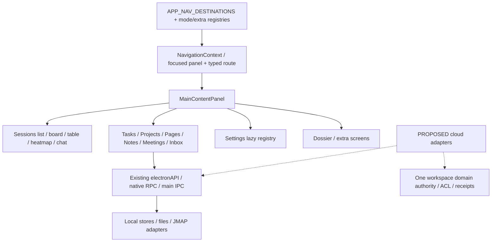

# ROX: точный source audit экранов и UX contracts

**Source baseline:** `rox-one/rox-one@f63294ba4fffa7238b46b24e918925a313ad0b12`. Observed checkout `e780e73ae84c977cf81546b49140d318dfcd6049`; source-directory diff пуст. Дата:2026-09-30. **Native UI NOT_INSPECTED:** CUA принадлежит lead; screenshots/computed font/runtime clicks не заявлены. Все target controls ниже **PROPOSED**.

Проверены **50 named screens/subscreens**, 68 source evidence rows и115 control contracts. Machine artifact: `plans/macro-integration/screen-evidence.json`. Shared route с local tab не означает отдельный deep link или implemented provider.

## 1. Shell / routes / layouts

Navigation использует существующие panel stack/focused route/browser history. Twelve native nav entries и mode contributions отличаются: Inbox/Feed в `platform/modes-seed.ts`, Dossier в extra screen route/registry. Mail — Inbox section; CRM расширяет Dossier; Meetings сохраняет actual device capture. Новые Human Channels пользуются тем же shell, при этом Agent Session transcript остаётся своим domain. [SE-NAV,SE-ROUTE,SE-HOST,SE-HISTORY,SE-MODES,SE-EXTRA]

## 2. Baseline-specific styling и reusable primitives

| Primitive | Нынешний source behavior | Target acceptance |
|---|---|---|
| Font | Rox WOFF2 bundled; `data-font=rox` / `data-chat-font=rox` используют Arial Narrow, terminal=rox использует Rox. [SE-FONT] | Сохранить explicit выбранные tokens; изменение semantics preset — отдельный typography bugfix, никакой blind global replacement. Computed font+network+Cyrillic proof. |
| Density | Topbar40/rail44/control24/tab34/panel header32px, radius4–12px. [SE-TOKEN] | Reuse compact token scale; touch hit areas увеличить независимо от визуальной row density. |
| Mode layouts | Navigator220 + list min240 + detail min320; компоненты не имеют собственного narrow breakpoint. [SE-LAYOUT] | 390px one pane/drawer/detail back;768px two panes;desktop3 panes;200%scale. |
| Entity tabs | Explicit capability matrix; Notes representations available; Session Team Chat unavailable; some graph/mindmap conditional; tooltips/focus-ring. [SE-TAB] | Same identity across representations; unavailable states honest; schema conformance,not flag alone. |
| Settings | Description default truncate; reusable SettingsRow/Toggle/Select. [SE-SETROW] | Essential scope visible; common HelpSpec hover/focus/click, no mouse-only explanation. |

## 3. Named screen inventory

| ID | Screen | Typed route / current entry | Layout / tabs |
|---|---|---|
| RX-S01 | Shell / rail / topbar / panel stack | `routes.view.* → NavigationContext.navigate`; APP_NAV_DESTINATIONS + ActivityRail | 44px rail/TopBar/navigator/main/panel stack; no local tabs |
| RX-S02 | Sessions collection list | `routes.view.allSessions/flagged/archived/state/label/view`; Sessions rail | navigator list + selected Chat; no local tabs |
| RX-S03 | Sessions table | `routes.view.table()`; Sessions view selector | SessionTableHost virtual table; no local tabs |
| RX-S04 | Sessions board | `routes.view.board(sessionId?)`; Sessions view selector | KanbanBoardContainer; no local tabs |
| RX-S05 | Sessions heatmap | `routes.view.heatmap()`; Sessions view selector | SessionHeatmapHost; no local tabs |
| RX-S06 | Agent Session chat / composer | `routes.view.allSessions(sessionId)`; Session row/task delegate/bound agent | ChatDisplay + FreeFormInput; standard / map / outline / graph conditional / mindmap conditional / teamchat unavailable |
| RX-S07 | Tasks list / personal projections / Agents | `routes.view.tasks()`; Tasks rail | ModeScreen navigator/list/detail; Today/evening / Upcoming / Anytime / Someday / Logbook / Trash / areas/projects / Agents |
| RX-S08 | Task detail / schedule / links / history | `routes.view.tasks(taskId)`; Task selected row | detail label rows112px; details / links / history |
| RX-S09 | Task Quick Entry | `TasksPage QuickEntry modal`; CmdN/create | Overlay form/NLP preview; no local tabs |
| RX-S10 | Task Move dialog | `TasksPage MoveDialog`; CmdK/move | Overlay destination chooser; no local tabs |
| RX-S11 | Projects library / Create | `routes.view.projects()`; Projects rail | ProjectsHomeInMain library; no local tabs |
| RX-S12 | Project Sessions | `routes.view.projects(slug)+local sessions tab`; Project row | Info_Page; sessions / tasks / assets / settings |
| RX-S13 | Project Tasks | `routes.view.projects(slug)+local tasks tab`; Project row | Info_Page; sessions / tasks / assets / settings |
| RX-S14 | Project Assets | `routes.view.projects(slug)+local assets tab`; Project row | Info_Page asset list; sessions / tasks / assets / settings |
| RX-S15 | Project Settings/context | `routes.view.projects(slug)+local settings tab`; Project row | Info_Page form; sessions / tasks / assets / settings |
| RX-S16 | Pages library / project filter | `routes.view.pages()`; Pages rail | PagesHome grid; no local tabs |
| RX-S17 | Page HTML artifact / sandbox toolbar | `routes.view.pages(pageSlug)`; Page tile/project | PageView + PageFrame; no local tabs |
| RX-S18 | Page Publication / Share dialog | `SharePageDialog local open`; share icon | publication Dialog; no local tabs |
| RX-S19 | Page Execution grants dialog | `PageGrantsDialog local open`; Page more→grants | grant status Dialog; no local tabs |
| RX-S20 | Notes vault / folders / import | `routes.view.notes(noteId?)`; Notes rail | vault rail/document/inspector; no local tabs |
| RX-S21 | Notes rich Markdown / comments | `routes.view.notes(noteId)+standard`; selected Note | Tiptap max70ch + quoted comments; standard |
| RX-S22 | Notes representations | `same note route+EntityViewTabs`; Note tab strip | NotesViewHost/map projection; standard / table / canvas / outline / graph / map |
| RX-S23 | Notes inspector / metadata / backlinks | `same note route+inspector toggle`; document inspector | tags/tasks/properties/assets/links; no local tabs |
| RX-S24 | Note-bound Agent side panel | `same note route+rightSessionContext`; Notes bound-chat button | SideSession + Note chip; no local tabs |
| RX-S25 | Inbox attention queue | `routes.view.inbox(itemId?)`; CORE_MODES inbox flag / Home Inbox widget / contextual route | ModeScreen; all / decisions / messages / snoozed / done / source kinds |
| RX-S26 | Inbox permission/credential/plan/memory review | `routes.view.inbox(itemId)`; CORE_MODES inbox flag / Home Inbox widget / contextual route | source-specific detail; no local tabs |
| RX-S27 | Mail folders / list / search | `Inbox filter={mail:folderId}`; MailNavSection | MailListPanel inside mode layout; provider folders |
| RX-S28 | Mail reader / attachments / linking | `Inbox mailSelected or inbox mail item`; Mail row | MailReader; no local tabs |
| RX-S29 | Mail compose / reply / forward / draft | `local composeState`; compose or reader reply | To/CC/subject/body/files form; no local tabs |
| RX-S30 | Meetings catalog / local planning | `routes.view.meetings(meetingId?)`; Meetings rail | ModeScreen; all / today / upcoming / archive / needsAction |
| RX-S31 | Meeting Overview / summary / participants | `meeting route+overview local tab`; Meeting row | detail summary/notes/meta; overview |
| RX-S32 | Meeting Recording / audio player | `meeting route+recording tab`; recording tab/start | RecordingPanel/audio; recording |
| RX-S33 | Meeting Transcript | `meeting route+transcript tab`; detail tab | search/timestamp segment list; transcript |
| RX-S34 | Meeting Decisions | `meeting route+decisions tab`; detail tab | candidate/accepted decision log; decisions |
| RX-S35 | Meeting Actions / Tasks | `meeting route+actions tab`; detail tab | action checklist/toTask; actions |
| RX-S36 | Meeting Documents | `meeting route+documents tab`; detail tab | attachment/drop list; documents |
| RX-S37 | Dossier directory / create | `routes.view.screen(dossier,itemId?)`; flag-gated extra screens | directory/detail; all / people / companies |
| RX-S38 | Dossier person/company account context | `dossier/item/{id}`; directory row | aliases/promises/brief/touches/notes; no local tabs |
| RX-S39 | Settings overview / navigator | `routes.view.settings(subpage?)`; Settings rail | SettingsOverview/Navigator; 22 lazy subpages |
| RX-S40 | Appearance / language / fonts | `routes.view.settings(appearance)`; Settings navigator | SettingsSection/Card/Row; no local tabs |
| RX-S41 | Organizations / members / invitations | `routes.view.settings(organizations)`; Settings navigator | org/member/invite/identity forms; no local tabs |
| RX-S42 | Server / remote access / sidecar | `routes.view.settings(server)`; Settings navigator | device connection config/health; no local tabs |
| RX-S43 | Agent Permissions | `routes.view.settings(permissions)`; Settings navigator | default/workspace execution policy; no local tabs |
| RX-S44 | Connections services/credentials/import/policies/audit | `routes.view.connections()`; Connections rail | tablist/max-width4xl panels; services / credentials / imports / policies / audit |
| RX-S45 | Memory lessons / facets / editor | `routes.view.memory()`; Memory rail | 208px facets + list/detail; no local tabs |
| RX-S46 | Automations trigger/conditions/actions/history | `routes.view.automations({automationId,type})`; Automations rail | step form+history; no local tabs |
| RX-S47 | Source detail / auth / tools | `routes.view.sources({sourceSlug,type})`; Sources rail/list | Info_Page metadata/guide/tools/permissions; no local tabs |
| RX-S48 | Skill detail / instructions / permissions | `routes.view.skills(skillSlug)`; Skills rail/list | Info_Page metadata/content/source/path; no local tabs |
| RX-S49 | Home dashboard / widget customize | `routes.view.home()`; Workbench Home route | HomeFrontPage adaptive widget grid; no local tabs |
| RX-S50 | Feed reader / Sources / annotations / create context | `routes.view.feed(itemId?)`; CORE_MODES Feed flag/Home widget | ModeScreen navigator/list/reader; agents / news / subscriptions / team / sources |

## 4. Screen input → output → controls → data path

**Общий PROPOSED HelpSpec:** hover/focus показывает action, scope, shortcut, disabled reason; source-derived field также freshness. Separate detail-help click раскрывает meaning, input/output, units/formula where relevant, source and example. Primary click исполняет только command и показывает honest queued/applied/ambiguous/rejected receipt; draft сохраняется на failure. Escape возвращает focus invoker. Essential instructions видимы inline; hover tooltip не заменяет keyboard/help click. Per-control entries и scoped inputs/outputs находятся в machine `target.controlSpecs`; source/runtime status у них explicit.

### RX-S01 — Shell / rail / topbar / panel stack

**Current source [SE-NAV,SE-ROUTE,SE-HOST,SE-HISTORY,SE-TOP,SE-RAIL].** Route `routes.view.* → NavigationContext.navigate`; entry APP_NAV_DESTINATIONS + ActivityRail. Layout 44px rail/TopBar/navigator/main/panel stack; tabs нет. Client state: Jotai panel stack + focused route/browser history.

- **Input:** workspace; focused panel; typed route.
- **Output:** active destination; history; panel state.
- **Controls:** back/forward; add Session panel; add Browser panel; rail collapse.
- **Query/API:** route parser/active workspace.
- **Command/store:** navigate/history.back/history.forward.
- **Current hover/focus/click:** Tooltip rail/topbar; resize alone not semantic history.
- **Gap:** Meetings id omitted union; mode-screen responsive width independent shell.
- **PROPOSED target:** Extend existing SurfaceContext/canonical entity routes; one authorized shell.
- **DoD:** Back restores entity+panel; resize no history; 390px single active panel.

### RX-S02 — Sessions collection list

**Current source [SE-ROUTE,SE-HOST,SE-CHATINPUT].** Route `routes.view.allSessions/flagged/archived/state/label/view`; entry Sessions rail. Layout navigator list + selected Chat; tabs нет. Client state: Session metadata/filter atoms.

- **Input:** filter; project; labels; query; selection.
- **Output:** Session rows/counts; selected Session.
- **Controls:** select; new Session; collection filters; bulk actions.
- **Query/API:** existing Session metadata projection.
- **Command/store:** sessionCommand/new-session action.
- **Current hover/focus/click:** Native row selection is agent conversation navigation.
- **Gap:** Agent Session status/unread are not shared task/notification domains.
- **PROPOSED target:** KEEP Sessions; expose authorized linked entity chips/context.
- **DoD:** Filter preserves selected ref; private source absent unauthorized rows.

### RX-S03 — Sessions table

**Current source [SE-ROUTE,SE-HOST].** Route `routes.view.table()`; entry Sessions view selector. Layout SessionTableHost virtual table; tabs нет. Client state: collection view/filter atoms.

- **Input:** Session metadata; group/display/filter.
- **Output:** dense Session rows.
- **Controls:** sort/group/display; selection; row menu.
- **Query/API:** same Session projection.
- **Command/store:** same Session actions.
- **Current hover/focus/click:** Dedicated table host; representational mode.
- **Gap:** Not generic CRM/task table.
- **PROPOSED target:** Reuse collection chrome with typed entity columns.
- **DoD:** Stable IDs/keyboard selection; virtual scroll retains edit.

### RX-S04 — Sessions board

**Current source [SE-ROUTE,SE-HOST].** Route `routes.view.board(sessionId?)`; entry Sessions view selector. Layout KanbanBoardContainer; tabs нет. Client state: Session viewMode.

- **Input:** Session status; selected card.
- **Output:** agent-session board.
- **Controls:** open card; move status.
- **Query/API:** Session metadata/kanban config.
- **Command/store:** Session status command.
- **Current hover/focus/click:** Board route/host explicit.
- **Gap:** Session statuses differ RoxTask status.
- **PROPOSED target:** KEEP Sessions board; Tasks own aggregate over reusable pattern.
- **DoD:** Drag changes Session only; deep link restores card.

### RX-S05 — Sessions heatmap

**Current source [SE-ROUTE,SE-HOST].** Route `routes.view.heatmap()`; entry Sessions view selector. Layout SessionHeatmapHost; tabs нет. Client state: Session viewMode.

- **Input:** Session dates/filter.
- **Output:** year activity heatmap.
- **Controls:** date selection/navigation.
- **Query/API:** same Session metadata.
- **Command/store:** navigate.
- **Current hover/focus/click:** Representation switch, no calendar domain.
- **Gap:** Heatmap not CalendarEvent implementation.
- **PROPOSED target:** Keep activity lens; explain source/date/count meaning.
- **DoD:** Day maps same authorized Sessions; count units help.

### RX-S06 — Agent Session chat / composer

**Current source [SE-CHAT,SE-CHATINPUT,SE-TAB].** Route `routes.view.allSessions(sessionId)`; entry Session row/task delegate/bound agent. Layout ChatDisplay + FreeFormInput; tabs standard / map / outline / graph conditional / mindmap conditional / teamchat unavailable. Client state: Session atoms/composer draft.

- **Input:** prompt; files; skills; sources; model; execution mode.
- **Output:** assistant/tool/thinking turns; pending approvals; transcript.
- **Controls:** send/stop; model; mode; attach; share/export/undo.
- **Query/API:** Session messages/meta.
- **Command/store:** onSubmit/sendMessage; sessionCommand.
- **Current hover/focus/click:** Composer tooltips + EntityViewTabs focus ring; Team Chat unavailable.
- **Gap:** Persisted private tool text can leak via share/export; mode≠ACL.
- **PROPOSED target:** KEEP runtime; context chips refs/revisions/audience; domain auth before tool.
- **DoD:** Private marker absent shared transcript; retry keeps draft; human Message separate.

### RX-S07 — Tasks list / personal projections / Agents

**Current source [SE-TASK,SE-TASKRPC,SE-TASKCACHE,SE-LAYOUT].** Route `routes.view.tasks()`; entry Tasks rail. Layout ModeScreen navigator/list/detail; tabs Today/evening / Upcoming / Anytime / Someday / Logbook / Trash / areas/projects / Agents. Client state: PersonalTaskStore/tasksViewAtom/local filters.

- **Input:** query/tag; sort; drag target; task store.
- **Output:** personal task rows/day groups; agent chips.
- **Controls:** complete; duplicate; when/deadline; move; reorder; delegate.
- **Query/API:** personalTasksList/cache; Session meta map.
- **Command/store:** personalTasksPut/Delete; create Session delegate.
- **Current hover/focus/click:** Keyboard handlers; delayed completion650ms; drag/magic plus.
- **Gap:** Personal LIST/CHANGED unscoped; TaskProject vs ProjectConfig IDs.
- **PROPOSED target:** EXTEND existing Tasks with personal lens + canonical shared RoxTask.
- **DoD:** One Task across Project/Tasks; actor-private Today; recurrence once retry.

### RX-S08 — Task detail / schedule / links / history

**Current source [SE-TASKDETAIL,SE-TASK,SE-TASKCACHE].** Route `routes.view.tasks(taskId)`; entry Task selected row. Layout detail label rows112px; tabs details / links / history. Client state: local tab/notes editing;PersonalTaskStore.

- **Input:** title; notes; checklist; when; deadline; reminder; repeat; tags; link.
- **Output:** fields/source/history.
- **Controls:** edit title/notes; calendar; priority; delegate; trash/restore/purge.
- **Query/API:** selected Task/Session map.
- **Command/store:** store.update/setWhen/link/checklist→persist.
- **Current hover/focus/click:** Enter title focuses notes;blur/Esc exits;links hover underline.
- **Gap:** No human owner/assignee; raw kind/id selector not entity graph.
- **PROPOSED target:** Authorized assignee/entity picker;version conflict/receipt;preserve when≠deadline.
- **DoD:** One assignee notification; private link denied; rejected edit retains draft.

### RX-S09 — Task Quick Entry

**Current source [SE-QUICK,SE-TASK].** Route `TasksPage QuickEntry modal`; entry CmdN/create. Layout Overlay form/NLP preview; tabs нет. Client state: draft text/notes.

- **Input:** NLP title; notes; destination.
- **Output:** recognized when/deadline/repeat/tags.
- **Controls:** Enter save; CmdEnter save/open; Esc close.
- **Query/API:** parseTaskEntry(text,now).
- **Command/store:** parent create PersonalTask.
- **Current hover/focus/click:** autoFocus/aria-live;empty save disabled.
- **Gap:** Local NLP date≠provider schedule;implicit timezone.
- **PROPOSED target:** Reuse parser with explicit timezone/unresolved token preview.
- **DoD:** Exactly one create; date vs deadline distinct; failure draft retained.

### RX-S10 — Task Move dialog

**Current source [SE-MOVE,SE-TASK].** Route `TasksPage MoveDialog`; entry CmdK/move. Layout Overlay destination chooser; tabs нет. Client state: moveFor local state.

- **Input:** Task ID; area/project/heading/list/day.
- **Output:** typed destination; updated placement.
- **Controls:** choose destination; cancel.
- **Query/API:** personal store destinations.
- **Command/store:** parent store.move.
- **Current hover/focus/click:** Explicit typed destination callback.
- **Gap:** TaskProject mapping can orphan canonical Project.
- **PROPOSED target:** Canonical project picker with authority indicator.
- **DoD:** ID preserved; missing project recovery; move no implicit grant.

### RX-S11 — Projects library / Create

**Current source [SE-PROJECTHOME,SE-PROJECT].** Route `routes.view.projects()`; entry Projects rail. Layout ProjectsHomeInMain library; tabs нет. Client state: createOpen;projects/filter atoms.

- **Input:** workspace; name.
- **Output:** project count/rows; created detail route.
- **Controls:** add Project; jump filtered Sessions.
- **Query/API:** shell projects/useProjects.
- **Command/store:** createProject(workspace,{name}).
- **Current hover/focus/click:** Empty single CTA;create modal closes before await;failure toast.
- **Gap:** Draft lost on async create failure;shared context missing.
- **PROPOSED target:** Existing library plus private/shared authority and context summary.
- **DoD:** Idempotent create; error retains name; authorized counts.

### RX-S12 — Project Sessions

**Current source [SE-PROJECT,SE-PROJECTTABS,SE-PROJECTEDIT].** Route `routes.view.projects(slug)+local sessions tab`; entry Project row. Layout Info_Page; tabs sessions / tasks / assets / settings. Client state: local tab.

- **Input:** Project ID; Session metadata.
- **Output:** project Sessions.
- **Controls:** new Session; open row.
- **Query/API:** getProject; Session metadata.
- **Command/store:** onCreateSession(projectId).
- **Current hover/focus/click:** TabButton click changes local state;location tooltip.
- **Gap:** No URL tab selector;project context incomplete.
- **PROPOSED target:** Preserve Sessions tab and extend typed linked context.
- **DoD:** Correct Project on spawn; missing project recovery.

### RX-S13 — Project Tasks

**Current source [SE-PROJECT,SE-PROJECTTABS,SE-PROJECTEDIT].** Route `routes.view.projects(slug)+local tasks tab`; entry Project row. Layout Info_Page; tabs sessions / tasks / assets / settings. Client state: local tab;personal task snapshot.

- **Input:** new task title; personal project filter.
- **Output:** project personal tasks.
- **Controls:** create; complete; open Tasks.
- **Query/API:** getProject; PersonalTaskStore.
- **Command/store:** create/toggle/persist personal Task.
- **Current hover/focus/click:** Form submit/row controls existing.
- **Gap:** No shared assignee/ACL task query.
- **PROPOSED target:** Same canonical RoxTask authority as Tasks.
- **DoD:** Task ref/revision same in both screens; retry no duplicate.

### RX-S14 — Project Assets

**Current source [SE-PROJECT,SE-PROJECTTABS,SE-PROJECTEDIT].** Route `routes.view.projects(slug)+local assets tab`; entry Project row. Layout Info_Page asset list; tabs sessions / tasks / assets / settings. Client state: local assets/tab.

- **Input:** file bytes/name.
- **Output:** asset rows/previews.
- **Controls:** upload/open/delete.
- **Query/API:** listProjectAssets.
- **Command/store:** uploadProjectAsset/deleteProjectAsset.
- **Current hover/focus/click:** Native file input;asset delete control.
- **Gap:** Local filesystem/browser upload/ACL gap.
- **PROPOSED target:** Canonical File upload finalize/quarantine/proxy.
- **DoD:** Only finalized checksum asset; denied filename absent.

### RX-S15 — Project Settings/context

**Current source [SE-PROJECT,SE-PROJECTTABS,SE-PROJECTEDIT].** Route `routes.view.projects(slug)+local settings tab`; entry Project row. Layout Info_Page form; tabs sessions / tasks / assets / settings. Client state: local edit draft/tab.

- **Input:** name/description/cwd/details/icon/color.
- **Output:** ProjectConfig/context.
- **Controls:** save; folder picker; icon upload/clear; delete.
- **Query/API:** getProject.
- **Command/store:** updateProject/deleteProject/uploadAsset.
- **Current hover/focus/click:** Location tooltip + explicit Save;icon native file picker.
- **Gap:** cwd device-only;tab not URL.
- **PROPOSED target:** Keep desktop cwd;cloud source/container refs;versioned tab selectors.
- **DoD:** Conflict keeps draft; cloud no desktop path; reload same tab.

### RX-S16 — Pages library / project filter

**Current source [SE-PAGES,SE-PAGESTATE].** Route `routes.view.pages()`; entry Pages rail. Layout PagesHome grid; tabs нет. Client state: pagesAtom/pagesProjectFilterAtom.

- **Input:** workspace; project filter; name.
- **Output:** HTML artifact tiles/empty.
- **Controls:** blank create; ask agent; open/delete.
- **Query/API:** getPages/onPagesChanged.
- **Command/store:** createPage html_app/deletePage.
- **Current hover/focus/click:** Distinct blank/agent CTA.
- **Gap:** Read error→[] indistinguishable empty;not rich-doc library.
- **PROPOSED target:** Preserve html_app/add contentKind with typed load states.
- **DoD:** Read failure error not onboarding; one Page registry.

### RX-S17 — Page HTML artifact / sandbox toolbar

**Current source [SE-PAGE,SE-PAGEMENU,SE-FRAME].** Route `routes.view.pages(pageSlug)`; entry Page tile/project. Layout PageView + PageFrame; tabs нет. Client state: fallback/lease/snapshot state.

- **Input:** slug; digest; lease; snapshot.
- **Output:** artifact; lease/source auth errors.
- **Controls:** rename; project; refresh; agent redesign; delete.
- **Query/API:** getPage/leasePage/getSnapshot.
- **Command/store:** updatePage/runRefresh/executePageAction.
- **Current hover/focus/click:** Rename Enter/Esc;title/share menu;retry lease.
- **Gap:** Artifact≠collaborative Markdown;execution grant≠sharing.
- **PROPOSED target:** Discriminated Page subtype;retain secure browser sandbox.
- **DoD:** Old HTML behavior; forged/replay bridge denied; revoked lease blocks.

### RX-S18 — Page Publication / Share dialog

**Current source [SE-SHARE,SE-PAGEMENU].** Route `SharePageDialog local open`; entry share icon. Layout publication Dialog; tabs нет. Client state: shareOpen/publishing/capability.

- **Input:** title/password/capability.
- **Output:** public URL/status; script-grant blocker.
- **Controls:** publish/password/unpublish/remove grant.
- **Query/API:** getPageShareCapabilities/publication.
- **Command/store:** publishPage/setPublicationPassword/unpublishPage.
- **Current hover/focus/click:** Explicit publish;blocking grant list.
- **Gap:** Public copy≠viewer/editor team grants.
- **PROPOSED target:** Publication clearly separate from Workspace access;provenance gate.
- **DoD:** Script grant blocks publish; private snapshot stripped.

### RX-S19 — Page Execution grants dialog

**Current source [SE-GRANT,SE-FRAME].** Route `PageGrantsDialog local open`; entry Page more→grants. Layout grant status Dialog; tabs нет. Client state: config grants/busy removal.

- **Input:** grants/digest.
- **Output:** active/stale/expired scopes.
- **Controls:** remove grant.
- **Query/API:** Page config.
- **Command/store:** grant revoke hook.
- **Current hover/focus/click:** All stale/expired visible including blockers.
- **Gap:** Execution authority not resource ACL.
- **PROPOSED target:** Label Execution grants + actor/expiry/digest/action help.
- **DoD:** Expired shown; remove blocks action; no implicit resource read.

### RX-S20 — Notes vault / folders / import

**Current source [SE-NOTES,SE-NOTECHROME,SE-NOTERPC].** Route `routes.view.notes(noteId?)`; entry Notes rail. Layout vault rail/document/inspector; tabs нет. Client state: notes/query/tag/sidebar order.

- **Input:** query/tag/folder; new title; import.
- **Output:** folder tree/search/current note.
- **Controls:** daily/create; rename/duplicate/move; copy/reveal/delete.
- **Query/API:** listNotes/searchNotes/readNote/listAssets.
- **Command/store:** create/rename/delete/import.
- **Current hover/focus/click:** Folder/list context menu;native title tooltips.
- **Gap:** Path identity mutable;reveal desktop-only.
- **PROPOSED target:** Stable canonical alias;browser download/open adapter;keep vault.
- **DoD:** Rename stable ID/backlinks; external-edit conflict; origin provenance.

### RX-S21 — Notes rich Markdown / comments

**Current source [SE-NOTEEDITOR,SE-NOTESAVE,SE-NOTERPC].** Route `routes.view.notes(noteId)+standard`; entry selected Note. Layout Tiptap max70ch + quoted comments; tabs standard. Client state: content/dirty/saveError/Tiptap selection.

- **Input:** Markdown/wiki/slash/selection/comment.
- **Output:** rich body/save state/highlights.
- **Controls:** edit/wiki create/select; footnote/comment/export.
- **Query/API:** readNote/backlinks.
- **Command/store:** saveNote(workspace,id,content).
- **Current hover/focus/click:** Quote tooltip/composer;autosave title hint.
- **Gap:** Missing expectedRevision;non-atomic file CAS;quote anchor drift.
- **PROPOSED target:** One collaborative body/binding conformance;typed stable Comment.
- **DoD:** Convergence; anchor moves; rejected draft retained; revocation blocks.

### RX-S22 — Notes representations

**Current source [SE-TAB,SE-NOTECHROME].** Route `same note route+EntityViewTabs`; entry Note tab strip. Layout NotesViewHost/map projection; tabs standard / table / canvas / outline / graph / map. Client state: useEntityView per note storage.

- **Input:** same Markdown/selected view.
- **Output:** derived representation.
- **Controls:** switch tab.
- **Query/API:** same current body.
- **Command/store:** same note save callback.
- **Current hover/focus/click:** Tabs tooltip/focus ring/capabilities.
- **Gap:** availability flag≠Macro spreadsheet/canvas parity.
- **PROPOSED target:** Keep projections;typed editable schemas separate;one identity.
- **DoD:** Same ref; unavailable honest; no duplicate text authority.

### RX-S23 — Notes inspector / metadata / backlinks

**Current source [SE-INSPECT,SE-NOTES].** Route `same note route+inspector toggle`; entry document inspector. Layout tags/tasks/properties/assets/links; tabs нет. Client state: collapsed/tag/property drafts.

- **Input:** tags; key/value; assets; checkbox.
- **Output:** metadata/index health/backlinks.
- **Controls:** apply tags/property; asset open; backlink; rebuild.
- **Query/API:** NoteDocument/assets/index health.
- **Command/store:** updateProperties/importAsset/rebuild/save task line.
- **Current hover/focus/click:** Enter applies tag;title collapse/add help.
- **Gap:** Arbitrary props/local path;no authorized graph traversal.
- **PROPOSED target:** Typed properties/file proxy/authorized backlinks.
- **DoD:** Invalid field shown; private title/count absent; index error visible.

### RX-S24 — Note-bound Agent side panel

**Current source [SE-NOTES,SE-NOTECHROME,SE-CHAT].** Route `same note route+rightSessionContext`; entry Notes bound-chat button. Layout SideSession + Note chip; tabs нет. Client state: Rox2Context/session/focus token.

- **Input:** note ref/context; prompt.
- **Output:** linked Session/source chip.
- **Controls:** open/reuse/send.
- **Query/API:** note ref/current Session.
- **Command/store:** onCreateSession/onInputChange.
- **Current hover/focus/click:** Same context reused;toolbar title/focus token.
- **Gap:** Prompt persists after source revoke.
- **PROPOSED target:** Existing AgentSession with derived provenance/audience.
- **DoD:** Same Session reused; revoked source blocks read/share; revision visible.

### RX-S25 — Inbox attention queue

**Current source [SE-INBOX,SE-INBOXNAV,SE-MAIL,SE-LAYOUT,SE-MODES].** Route `routes.view.inbox(itemId?)`; entry CORE_MODES inbox flag / Home Inbox widget / contextual route. Layout ModeScreen; tabs all / decisions / messages / snoozed / done / source kinds. Client state: useInboxItems/local triage.

- **Input:** source pending items; triage state; unread Mail.
- **Output:** grouped decisions/messages/counts.
- **Controls:** select/done/reopen/snooze/source open.
- **Query/API:** source IPC/useMail.
- **Command/store:** source action; local markDone/snooze.
- **Current hover/focus/click:** J/K arrows/E done/S snooze/Esc clear.
- **Gap:** No durable single Notification store;unread cap50;meeting proposals missing.
- **PROPOSED target:** Canonical attention projection with per-recipient state;reuse source commands.
- **DoD:** Two devices same attention; dedup reasons; no unauthorized excerpt.

### RX-S26 — Inbox permission/credential/plan/memory review

**Current source [SE-INBOX,SE-INBOXNAV,SE-MODES].** Route `routes.view.inbox(itemId)`; entry CORE_MODES inbox flag / Home Inbox widget / contextual route. Layout source-specific detail; tabs нет. Client state: busy/actionError/selected source.

- **Input:** pending request; decision/credentials.
- **Output:** source action result/pending/failure.
- **Controls:** approve/deny; submit credential; open plan; memory decision.
- **Query/API:** source pending requests.
- **Command/store:** existing source IPC dispatched Inbox.
- **Current hover/focus/click:** Busy guard/error;Done is triage not approval.
- **Gap:** Consent separate entity grant;click not provider success.
- **PROPOSED target:** Receipt-based review + impact/scope preview.
- **DoD:** Triage Done no execution; duplicate approval idempotent.

### RX-S27 — Mail folders / list / search

**Current source [SE-MAIL,SE-INBOX].** Route `Inbox filter={mail:folderId}`; entry MailNavSection. Layout MailListPanel inside mode layout; tabs provider folders. Client state: useMail.folder/search + mailSelected.

- **Input:** folder/text query.
- **Output:** summaries/total/unread/provider state.
- **Controls:** select folder/row; compose; refresh.
- **Query/API:** mailLocal.folders/list limit100.
- **Command/store:** open marks seen.
- **Current hover/focus/click:** Folder select clears composer/detail;ready gates load.
- **Gap:** Folder/message local state not URL;browser bridge/pagination gap.
- **PROPOSED target:** Provider-neutral account/folder routes/server policy.
- **DoD:** Reload same account/folder; page2; cross-account ID isolation.

### RX-S28 — Mail reader / attachments / linking

**Current source [SE-MAILREAD,SE-MAILSERVICE,SE-MAIL].** Route `Inbox mailSelected or inbox mail item`; entry Mail row. Layout MailReader; tabs нет. Client state: mail.message/busy/notice/picking.

- **Input:** message ID/attachment.
- **Output:** body/flags/task-meeting notice.
- **Controls:** reply/replyAll/forward; star/read/archive/delete; save attachment; to Task/Meeting.
- **Query/API:** mailLocal.get.
- **Command/store:** setFlags/move/remove/saveAttachment; personal Task.
- **Current hover/focus/click:** E/#/R;attachment title save;busy guard.
- **Gap:** Task uses personal bridge;private email no inherited Project/Company grant.
- **PROPOSED target:** Canonical MailMessage + source links/attachment proxy/outbound preview.
- **DoD:** Permitted backlink only; checksum; failed archive no false success.

### RX-S29 — Mail compose / reply / forward / draft

**Current source [SE-MAILCOMPOSE,SE-MAILSERVICE].** Route `local composeState`; entry compose or reader reply. Layout To/CC/subject/body/files form; tabs нет. Client state: draft/files/busy/error/autosave.

- **Input:** recipients/subject/text/files/source.
- **Output:** draft ID/time; send result/error.
- **Controls:** send/save draft/attach/remove/discard.
- **Query/API:** source/draft.
- **Command/store:** mailLocal.saveDraft/send/pickFiles.
- **Current hover/focus/click:** CmdEnter;autoFocus To for new/forward;busy disabled.
- **Gap:** Ambiguous send timeout;paths desktop-only;no provider-neutral receipt.
- **PROPOSED target:** Browser upload + send reconcile/outbound review/scheduled subtype.
- **DoD:** Timeout one send; draft reload; discard clear; wrong account denied.

### RX-S30 — Meetings catalog / local planning

**Current source [SE-MEET,SE-MEETLIST,SE-ROOM,SE-LAYOUT].** Route `routes.view.meetings(meetingId?)`; entry Meetings rail. Layout ModeScreen; tabs all / today / upcoming / archive / needsAction. Client state: local catalog/bucket/query/tab.

- **Input:** query/title/time/audio/selection.
- **Output:** meeting rows/ASR availability.
- **Controls:** plan/import/drop/record/filter/search.
- **Query/API:** meetingsLocal.list/engine/transcript.
- **Command/store:** plan/import/startRecording.
- **Current hover/focus/click:** CmdF/Esc/list keys/title autofocus;unavailable ASR explicit.
- **Gap:** Calendar row→Connections only;no provider data/SFU.
- **PROPOSED target:** Retain device Meetings;Calendar/Call honest separate capability.
- **DoD:** Missing ASR honest; browser upload; join absent until verified.

### RX-S31 — Meeting Overview / summary / participants

**Current source [SE-MD,SE-MDSUM].** Route `meeting route+overview local tab`; entry Meeting row. Layout detail summary/notes/meta; tabs overview. Client state: meeting update/summaryRun.

- **Input:** title/participant names/notes/transcript.
- **Output:** metadata/summary/extraction status.
- **Controls:** edit/generate summary/add-remove participant.
- **Query/API:** get/readTranscript/readAgentRun.
- **Command/store:** api.update/startAgentRun.
- **Current hover/focus/click:** Generate requires transcript/workspace;status chip.
- **Gap:** Free-text participant not principal;summary model may network.
- **PROPOSED target:** Canonical participant/contact/provenance spans;offline availability explicit.
- **DoD:** Transcript revision cited; ASR≠offline summary; Contact≠User.

### RX-S32 — Meeting Recording / audio player

**Current source [SE-MD,SE-MDREC,SE-ROOM].** Route `meeting route+recording tab`; entry recording tab/start. Layout RecordingPanel/audio; tabs recording. Client state: global recorder/audioURL/playMs.

- **Input:** mic/pause/audio bytes.
- **Output:** timer/audio/duration.
- **Controls:** record/import/play/pause/seek/stop.
- **Query/API:** api.readAudio.
- **Command/store:** start/pause/resume/stop/import.
- **Current hover/focus/click:** Stopping guard;Blob URL cleanup;one player.
- **Gap:** Local mic not shared audiovisual call;cloud upload/recovery gap.
- **PROPOSED target:** Keep local;browser capture/upload finalize;shared Call provider separate.
- **DoD:** Stop reload exact media; mic denied; interrupted upload recover.

### RX-S33 — Meeting Transcript

**Current source [SE-MDTRANS,SE-MD].** Route `meeting route+transcript tab`; entry detail tab. Layout search/timestamp segment list; tabs transcript. Client state: transcript/query/player.

- **Input:** ASR/search/seek.
- **Output:** segments/highlight/status.
- **Controls:** filter/seek/transcribe/retry.
- **Query/API:** api.readTranscript.
- **Command/store:** api.transcribe.
- **Current hover/focus/click:** Timestamp click seeks;queued/failed/unavailable explicit.
- **Gap:** No canonical span IDs/search/provenance contract yet.
- **PROPOSED target:** Immutable spans/speaker map/media hash/authorized index.
- **DoD:** Known phrase/time matches media; retry stable; revoke text+audio.

### RX-S34 — Meeting Decisions

**Current source [SE-MDDEC,SE-MDSUM].** Route `meeting route+decisions tab`; entry detail tab. Layout candidate/accepted decision log; tabs decisions. Client state: workspace JSON decisions/candidates.

- **Input:** candidate/manual text/approval.
- **Output:** accepted source-backed decisions.
- **Controls:** accept/reject/edit/open Decisions/remove.
- **Query/API:** loadDecisions.
- **Command/store:** saveDecisions/syncDecisionLessons.
- **Current hover/focus/click:** Explicit approval separate from extraction;source route.
- **Gap:** Local JSON not shared event/discussion authority.
- **PROPOSED target:** Migrate source links/decision log with controlled approval.
- **DoD:** Candidate not fact; retry one accept; memory provenance.

### RX-S35 — Meeting Actions / Tasks

**Current source [SE-MDACT,SE-MD].** Route `meeting route+actions tab`; entry detail tab. Layout action checklist/toTask; tabs actions. Client state: LocalMeeting.actions/personal bridge.

- **Input:** text/done.
- **Output:** actions/Task link.
- **Controls:** add/toggle/remove/toTask/open Task.
- **Query/API:** api.get.
- **Command/store:** api.update/createPersonalTask.
- **Current hover/focus/click:** Remove hover and focus visible.
- **Gap:** No canonical shared Task/assignee notification.
- **PROPOSED target:** Use same RoxTask command as Chat→Task;source spans.
- **DoD:** One Task/operation; Meeting backlink; assignee once.

### RX-S36 — Meeting Documents

**Current source [SE-MDDOC].** Route `meeting route+documents tab`; entry detail tab. Layout attachment/drop list; tabs documents. Client state: LocalMeeting.documents.

- **Input:** picked paths/dropped files.
- **Output:** attachment names/rows.
- **Controls:** attach/open/reveal/remove.
- **Query/API:** api.get.
- **Command/store:** attach/openDocument/reveal/removeDocument.
- **Current hover/focus/click:** Open title tooltip/local APIs.
- **Gap:** No browser local path/shared File ACL.
- **PROPOSED target:** Canonical File upload/proxy with explicit parent policy.
- **DoD:** Browser attach/open; denied filename absent; corrupt not ready.

### RX-S37 — Dossier directory / create

**Current source [SE-DOS,SE-EXTRA].** Route `routes.view.screen(dossier,itemId?)`; entry flag-gated extra screens. Layout directory/detail; tabs all / people / companies. Client state: workspace JSON + draft.

- **Input:** name/kind/search.
- **Output:** person/company cards/suggestions.
- **Controls:** add/search/filter/select.
- **Query/API:** DossierData/source snapshots.
- **Command/store:** saveWorkspaceJson.
- **Current hover/focus/click:** Chip selection;empty add CTA;item route.
- **Gap:** CRM precursor lacks domains/stage/revenue/mail enrichment.
- **PROPOSED target:** Extend Dossier→canonical Contacts/Companies, retain route aliases.
- **DoD:** ID mapping; email-created contact; no second CRM app.

### RX-S38 — Dossier person/company account context

**Current source [SE-DOSDETAIL,SE-DOS].** Route `dossier/item/{id}`; entry directory row. Layout aliases/promises/brief/touches/notes; tabs нет. Client state: workspace JSON/readAgentRun/text touches.

- **Input:** identity/aliases/promise direction/text.
- **Output:** matched Sessions/tasks/notes/meetings/feed/brief.
- **Controls:** edit/promise→Task/generate-open brief/open touch.
- **Query/API:** source snapshots/notes.
- **Command/store:** personal Task/startAgentRun/saveWorkspaceJson.
- **Current hover/focus/click:** Enter alias;alias chip removes;touch opens source.
- **Gap:** Name matching not verified graph;mail/calendar/calls absent;ACL gap.
- **PROPOSED target:** Canonical Contact/Company links/provenance and per-edge context.
- **DoD:** Permitted account surfaces only; no hidden counts; exact refs/revisions.

### RX-S39 — Settings overview / navigator

**Current source [SE-SETREG,SE-ROUTE].** Route `routes.view.settings(subpage?)`; entry Settings rail. Layout SettingsOverview/Navigator; tabs 22 lazy subpages. Client state: focused route.

- **Input:** settings route/context.
- **Output:** categories/settings.
- **Controls:** select category/open subpage.
- **Query/API:** registry.
- **Command/store:** navigate.
- **Current hover/focus/click:** Suspense lazy hosts/native route.
- **Gap:** Labels alone do not create collaborative admin.
- **PROPOSED target:** Keep registry;explicit Account/Workspace/Device scope.
- **DoD:** All subpages deep link; admin secrets denied; lazy error recovery.

### RX-S40 — Appearance / language / fonts

**Current source [SE-APPEAR,SE-FONT,SE-TOKEN,SE-SETROW].** Route `routes.view.settings(appearance)`; entry Settings navigator. Layout SettingsSection/Card/Row; tabs нет. Client state: ThemeProvider/preferences/kanban config.

- **Input:** mode/theme/contrast/font/language/zoom.
- **Output:** theme/preferences.
- **Controls:** select/toggle/zoom.
- **Query/API:** preset/workspace themes/zoom.
- **Command/store:** changeLanguage/setZoom/setKanbanConfig.
- **Current hover/focus/click:** Description truncates by default;native selectors.
- **Gap:** rox UI/chat Arial Narrow despite label;computed font unverified.
- **PROPOSED target:** Retain existing selected tokens;explicit typography preset bugfix, no global replacement;verify actual font.
- **DoD:** WOFF2/computed Cyrillic; reduced-motion; 200%/390px reachable.

### RX-S41 — Organizations / members / invitations

**Current source [SE-ORG,SE-SETREG].** Route `routes.view.settings(organizations)`; entry Settings navigator. Layout org/member/invite/identity forms; tabs нет. Client state: local org records.

- **Input:** org/email/username/role/token/workspace.
- **Output:** local members/invites/identity.
- **Controls:** create/invite/accept/bind/save identity.
- **Query/API:** org LIST/MEMBERS/GET_IDENTITY.
- **Command/store:** CREATE/INVITE/ACCEPT/UPDATE_IDENTITY.
- **Current hover/focus/click:** Explicit form commands;token local.
- **Gap:** No mailer/remote redeem;local identity not cloud auth principal.
- **PROPOSED target:** OIDC subject binding/durable membership/invite receipt.
- **DoD:** Actual delivery receipt; token single-use; server revoke.

### RX-S42 — Server / remote access / sidecar

**Current source [SE-SERVER,SE-SETREG].** Route `routes.view.settings(server)`; entry Settings navigator. Layout device connection config/health; tabs нет. Client state: form/status/dirty/error/device consent.

- **Input:** host/port/TLS paths/token/enabled.
- **Output:** URL/status/sidecar health.
- **Controls:** save/reset/pick cert/show-copy token/relaunch.
- **Query/API:** getServerConfig/Status/Health.
- **Command/store:** setServerConfig/relaunchApp.
- **Current hover/focus/click:** Device read guard;token masked.
- **Gap:** Port exposure≠resource auth;browser cannot pick local cert.
- **PROPOSED target:** Separate cloud admin/device settings;secret vault;truthful capability health.
- **DoD:** Token forbidden actor; health unavailable; browser no local picker.

### RX-S43 — Agent Permissions

**Current source [SE-PERM,SE-SETREG].** Route `routes.view.settings(permissions)`; entry Settings navigator. Layout default/workspace execution policy; tabs нет. Client state: loaded config/default watcher.

- **Input:** tools/bash/MCP/API/path.
- **Output:** execution permission config.
- **Controls:** view/edit source policy.
- **Query/API:** default/workspace permissions config.
- **Command/store:** existing execution policy updates.
- **Current hover/focus/click:** About/help docs/device scope.
- **Gap:** allow-all≠shared resource read/write.
- **PROPOSED target:** Keep execution screen;Workspace access distinct;compose grants.
- **DoD:** allow-all cannot read private email; grant revoke separate.

### RX-S44 — Connections services/credentials/import/policies/audit

**Current source [SE-CONN].** Route `routes.view.connections()`; entry Connections rail. Layout tablist/max-width4xl panels; tabs services / credentials / imports / policies / audit. Client state: tab/forms/rowStatus/rowNote.

- **Input:** ref/mode/import paths/consumer/purpose/actions/resources.
- **Output:** rows/status/bindings/preview/audit.
- **Controls:** test/repair/create/grant/rotate/revoke/convert/preview.
- **Query/API:** workgraph listConnections/Bindings/Audit.
- **Command/store:** create/grant/revoke/rotate/test/repair.
- **Current hover/focus/click:** Confirmation names target;absent method fail-closed.
- **Gap:** Paths desktop-only;tabs local;tenant provider credential policy gap.
- **PROPOSED target:** Native connection fabric+cloud vault refs/consent adapters.
- **DoD:** No secrets DOM/log; rotate respects grant; preview not import.

### RX-S45 — Memory lessons / facets / editor

**Current source [SE-MEM].** Route `routes.view.memory()`; entry Memory rail. Layout 208px facets + list/detail; tabs нет. Client state: lessons/candidates/filter/sort/selection.

- **Input:** rule/scope/category/tag/negative/facets/query.
- **Output:** lessons/usage/token meter/candidates.
- **Controls:** pin/disable/edit/add/delete/merge/promote/bulk.
- **Query/API:** listMemoryLessons/listPromotionCandidates.
- **Command/store:** add/update/deleteMemoryLesson/promoteLesson.
- **Current hover/focus/click:** Focus-visible Btn;cross-scope merge disabled hint;meter title;alertdialog.
- **Gap:** Rule memory not entity ingestion;read catch→[] masks error.
- **PROPOSED target:** Keep lessons;derived entity projection refs/revision/policy epoch.
- **DoD:** Source revoke prevents shared reads; promotion explicit; meter units.

### RX-S46 — Automations trigger/conditions/actions/history

**Current source [SE-AUTO,SE-ROUTE].** Route `routes.view.automations({automationId,type})`; entry Automations rail. Layout step form+history; tabs нет. Client state: draft/dirty/saving/running/error.

- **Input:** schedule/event/conditions/prompt/model/session.
- **Output:** definition/history/receipt.
- **Controls:** enable/save CmdS/run now/duplicate/delete/open Session.
- **Query/API:** LLM connections/history/changes.
- **Command/store:** updateAutomation/testAutomation/duplicateAutomation.
- **Current hover/focus/click:** Dirty saved before run;validation save guard/status title.
- **Gap:** Lossy bus/actor scope;run started≠verified effect.
- **PROPOSED target:** Durable consumer/canonical actor/reconcile/loop budget.
- **DoD:** Restart one logical run; revoke denied; effect proof.

### RX-S47 — Source detail / auth / tools

**Current source [SE-SOURCE,SE-ROUTE].** Route `routes.view.sources({sourceSlug,type})`; entry Sources rail/list. Layout Info_Page metadata/guide/tools/permissions; tabs нет. Client state: source loaded/config drafts.

- **Input:** source slug/config.
- **Output:** source status/guide/MCP tools/policies.
- **Controls:** enable/rename/delete; open URL/folder.
- **Query/API:** getSources/getSourcePermissionsConfig/getMcpTools.
- **Command/store:** updateSource/deleteSource/openUrl/showInFolder.
- **Current hover/focus/click:** Info_Page/source menu;auth tool execution runtime unverified.
- **Gap:** Connection not provider-neutral entity domain;folder desktop-only.
- **PROPOSED target:** Keep Sources;provider adapter behind same auth/policy;browser capability alternatives.
- **DoD:** Missing slug recovery; secret hidden; tool auth actually verified.

### RX-S48 — Skill detail / instructions / permissions

**Current source [SE-SKILL,SE-ROUTE].** Route `routes.view.skills(skillSlug)`; entry Skills rail/list. Layout Info_Page metadata/content/source/path; tabs нет. Client state: loaded skill/draft.

- **Input:** slug/workspace/cwd.
- **Output:** skill metadata/instructions/required Sources.
- **Controls:** rename/delete/open in Finder.
- **Query/API:** getSkills/onSkillsChanged.
- **Command/store:** updateSkill/deleteSkill/openSkillInFinder.
- **Current hover/focus/click:** Info_Page native menus;source content displayed.
- **Gap:** Skill instructions not grants;local path device-only.
- **PROPOSED target:** Keep Skills;provenance and authorized agent activation.
- **DoD:** Missing skill recovery; untrusted instruction not ACL; edit reload.

### RX-S49 — Home dashboard / widget customize

**Current source [SE-HOME].** Route `routes.view.home()`; entry Workbench Home route. Layout HomeFrontPage adaptive widget grid; tabs нет. Client state: local workspace JSON home layout;container width.

- **Input:** layout; size; order; hidden widgets.
- **Output:** dashboard widgets; source statuses.
- **Controls:** customize; add; remove; move; resize; reset; open source.
- **Query/API:** widget-specific existing data hooks.
- **Command/store:** saveWorkspaceJson layout;source commands.
- **Current hover/focus/click:** Edit controls separate source action;responsive grid from container width.
- **Gap:** Widget presence Call/Calendar not proof service exists;layout personal projection.
- **PROPOSED target:** KEEP Home;domain freshness/ACL-aware widget DTO; capability unavailable honest.
- **DoD:** Custom layout reload; 390px no overflow; inactive media provider not fake Call.

### RX-S50 — Feed reader / Sources / annotations / create context

**Current source [SE-FEED,SE-MODES,SE-LAYOUT].** Route `routes.view.feed(itemId?)`; entry CORE_MODES Feed flag/Home widget. Layout ModeScreen navigator/list/reader; tabs agents / news / subscriptions / team / sources. Client state: server feed results/local preferences/filter;route selection.

- **Input:** source; filter; query; colors; tags; read; star; density; order.
- **Output:** source feed rows; reader; error; status.
- **Controls:** refresh; read; star; annotate; toTask; toNote; open source.
- **Query/API:** feed list source aggregator.
- **Command/store:** feedRefresh/annotation;personalTask/Note bridge.
- **Current hover/focus/click:** Source rows route selection;sort/density;title/aria actions.
- **Gap:** Feed activity graph not durable domain event/outbox;source privacy/provenance separate.
- **PROPOSED target:** Keep reading surface;authorized activity projection and canonical links.
- **DoD:** Refresh errors visible; annotation reload; private source not copied into public task.

## 5. Independent findings / exact negative controls

| ID / priority | Current finding / source | Proposed correction / independent negative evaluator |
|---|---|---|
| SF-01 / P1 | Rox UI/chat preset is Arial Narrow despite bundled Rox. [SE-FONT] | Retain existing selection; correct preset semantics explicitly and verify actual font, no global font rewrite. **Negative:** Fallback Arial substituted for selected Rox: computed family + font response acceptance rejects. |
| SF-02 / P1 | ModeScreen intrinsic width ~780px without narrow breakpoint. [SE-LAYOUT] | <768 one pane with nav drawer/detail back;tablet2 panes;desktop3. **Negative:** 390px scrollWidth<=clientWidth and all actions accessible;old fixed layout fails. |
| SF-03 / P0 | Personal Tasks LIST unscoped,CHANGED all clients; optimistic cached snapshot advances before remote outcome. [SE-TASKRPC,SE-TASKCACHE] | Actor-private personal domain/shared RoxTask authority;durable pending/conflict receipt. **Negative:** ActorB receives none of ActorA personal IDs/titles/events. |
| SF-04 / P1 | Notes save omits revision;optional server read/check/write is not atomic CAS. [SE-NOTESAVE,SE-NOTERPC] | Canonical shared CRDT;standalone atomic fence and conflict draft. **Negative:** Two stale saves cannot silently overwrite. |
| SF-05 / P1 | Project tabs/Mail account-folder-detail local state not tab deep links. [SE-PROJECT,SE-INBOX,SE-MAIL] | Versioned route selector;preserve backward routes/back behavior. **Negative:** Reload link restores same tab/account/folder. |
| SF-06 / P1 | Page/Memory failed reads become empty list. [SE-PAGESTATE,SE-MEM] | Separate pending/empty/error/offline/stale DTOs. **Negative:** Transport failure shows error+retry,not successful empty onboarding. |
| SF-07 / P1 | Inbox unread count uses capped50 loaded unseen messages. [SE-MAIL,SE-INBOX] | Authorized total receipt or explicit capped-loaded label. **Negative:** 51 unread fixture rejects unlabeled count50. |
| SF-08 / P0 | Org tokens local;no mailer/remote redeem;Server config does not provide cloud ACL. [SE-ORG,SE-SERVER] | Verified auth-subject principal,durable member/invite/revoke flow. **Negative:** Forged workspace/body actor cannot list protected data. |
| SF-09 / P1 | Team Chat unavailable;rooms provider absent;local recorder not SFU. [SE-TAB,SE-ROOM,SE-MDREC] | Human Chat/Calls capability enabled only after verified domain/service/media. **Negative:** Disable media provider:no false join or dummy archive. |
| SF-10 / P1 | Page action grants,publication,and execution policies are not resource sharing. [SE-GRANT,SE-SHARE,SE-PERM] | Explicit Execution grants/Workspace access/Publication;compose policy. **Negative:** Execution grant does not grant private entity read. |
| SF-11 / P1 | Settings description default truncate;ModeScreen NavItem outline-none without explicit focus ring. [SE-SETROW,SE-LAYOUT] | HelpSpec hover/focus/click;visible essential scope;focus-visible tokens. **Negative:** Keyboard-only reveals each control/disabled reason/detail help. |
| SF-12 / P1 | Dossier touches text-derived,not verified entity graph. [SE-DOSDETAIL] | Canonical edges/provenance;ambiguous names suggestions only. **Negative:** Same-name contacts cannot merge their emails/tasks. |

## 6. Cloud-ready PRD / spec / DoD gates

1. Каждый screen имеет explicit device/standalone/shared authority mode. Shared commands используют verified transport principal, body actor отвергается. Execution consent — дополнительное ограничение, а не entity ACL.
2. Same route/query/command seam сохраняется через browser adapter; file picker/reveal/certificate controls получают browser upload/download или honest unavailable. Cloud screen не читает абсолютные desktop filesystem paths.
3. Semantic tab/account/folder/entity deep link переживает reload/back/forward. Personal layout/filter draft — projection,не вторая domain authority. Denied target не раскрывает title/count/snippet.
4. Loading/populated/empty/error/offline/stale/queued/ambiguous/rejected/revoked различимы. Read failure не successful empty. Status help показывает source revision/last successful sync/receipt without secrets.
5. Impact preview показывает target ref/revision/provider/audience. External send/publish не applied до receipt/readback. Retry same key — same logical effect; missing provider не fake success.
6. Every non-obvious control has short hover+focus help and detailed click help; keyboard chain/focus restoration tested. Essential instructions inline. Source-private data/secret не попадают в help/log.
7. Native+browser actual interaction evidence at390/768/1440px and200% scale; actual WOFF2/computed font+Cyrillic; reduced-motion and keyboard/mouse/touch flows. Screenshots alone не persistence/auth proof.
8. Each screen DoD runs happy+failure+reload+permission/revoke where relevant; concurrency/offline provider reconcile for changed writers. Independent negative controls выше обязаны reject seeded broken behavior.
9. Source-only findings в этом документе не объявляют cloud runtime, active SFU, synchronized Calendar или workspace ACL уже implemented. Root-owned native UI evidence присоединяется по source SHA/environment,не ретроактивно как proof всех paths.

## 7. Skill/workflow gaps

Использован `rox-ui` как audit acceptance checklist для font/density/motion/help/focus/native verification. Реальный source preset расходится с названием Rox; корректировать semantics отдельно и сохранять explicit selection. Новые font assets/UI framework не копировались. Deep actual inspection остаётся отдельной lead-owned phase. No deployed cloud behavior claims.

## 8. Immutable source evidence

| ID | repository @ SHA | exact path / symbol / lines | Claim |
|---|---|---|
| SE-NAV | `rox-one/rox-one@f63294ba4fffa7238b46b24e918925a313ad0b12` | [apps/electron/src/renderer/components/app-shell/nav-destinations.ts:51–197](https://github.com/rox-one/rox-one/blob/f63294ba4fffa7238b46b24e918925a313ad0b12/apps/electron/src/renderer/components/app-shell/nav-destinations.ts#L51-L197), `APP_NAV_DESTINATIONS / AppNavDestinationId` | 12 native destinations; meetings entry exists despite omitted union member. |
| SE-ROUTE | `rox-one/rox-one@f63294ba4fffa7238b46b24e918925a313ad0b12` | [apps/electron/src/shared/routes.ts:103–238](https://github.com/rox-one/rox-one/blob/f63294ba4fffa7238b46b24e918925a313ad0b12/apps/electron/src/shared/routes.ts#L103-L238), `routes.view` | Typed current routes for Session representations, Tasks, Inbox, Meetings, Notes, Projects, Pages, Settings. |
| SE-HOST | `rox-one/rox-one@f63294ba4fffa7238b46b24e918925a313ad0b12` | [apps/electron/src/renderer/components/app-shell/MainContentPanel.tsx:322–529](https://github.com/rox-one/rox-one/blob/f63294ba4fffa7238b46b24e918925a313ad0b12/apps/electron/src/renderer/components/app-shell/MainContentPanel.tsx#L322-L529), `MainContentPanel` | Routes select existing native hosts rather than a second product shell. |
| SE-HISTORY | `rox-one/rox-one@f63294ba4fffa7238b46b24e918925a313ad0b12` | [apps/electron/src/renderer/contexts/NavigationContext.tsx:265–324](https://github.com/rox-one/rox-one/blob/f63294ba4fffa7238b46b24e918925a313ad0b12/apps/electron/src/renderer/contexts/NavigationContext.tsx#L265-L324), `syncUrl` | Focused panel route encoded in URL and browser history push/replace. |
| SE-LAYOUT | `rox-one/rox-one@f63294ba4fffa7238b46b24e918925a313ad0b12` | [apps/electron/src/renderer/components/mode-screen/ModeScreen.tsx:13–176](https://github.com/rox-one/rox-one/blob/f63294ba4fffa7238b46b24e918925a313ad0b12/apps/electron/src/renderer/components/mode-screen/ModeScreen.tsx#L13-L176), `ModeScreenLayout / NavItem / ListRow` | Mode screen navigator220/list min240/detail min320; no narrow breakpoint here; selection and ARIA roles. |
| SE-TAB | `rox-one/rox-one@f63294ba4fffa7238b46b24e918925a313ad0b12` | [apps/electron/src/renderer/components/app-shell/EntityViewTabs.tsx:50–195](https://github.com/rox-one/rox-one/blob/f63294ba4fffa7238b46b24e918925a313ad0b12/apps/electron/src/renderer/components/app-shell/EntityViewTabs.tsx#L50-L195), `defaultNoteEntityCapabilities / defaultSessionEntityCapabilities / EntityViewTabs` | Note representations; Session Team Chat unavailable; graph/mindmap conditional; tooltip/focus ring. |
| SE-EXTRA | `rox-one/rox-one@f63294ba4fffa7238b46b24e918925a313ad0b12` | [apps/electron/src/shared/extra-screens.ts:1–41](https://github.com/rox-one/rox-one/blob/f63294ba4fffa7238b46b24e918925a313ad0b12/apps/electron/src/shared/extra-screens.ts#L1-L41), `buildExtraScreenRoute / EXTRA_SCREEN_IDS` | Dossier/radar/decisions/agents/focus share optional item route. |
| SE-FONT | `rox-one/rox-one@f63294ba4fffa7238b46b24e918925a313ad0b12` | [packages/ui/src/styles/index.css:222–315](https://github.com/rox-one/rox-one/blob/f63294ba4fffa7238b46b24e918925a313ad0b12/packages/ui/src/styles/index.css#L222-L315), `@font-face / html[data-font=rox] / html[data-chat-font=rox]` | Rox fonts bundled but UI/chat rox preset maps Arial Narrow; terminal Rox maps actual Rox. |
| SE-TOKEN | `rox-one/rox-one@f63294ba4fffa7238b46b24e918925a313ad0b12` | [packages/ui/src/styles/index.css:137–190](https://github.com/rox-one/rox-one/blob/f63294ba4fffa7238b46b24e918925a313ad0b12/packages/ui/src/styles/index.css#L137-L190), `:root chrome tokens` | Radii4–12; topbar40/rail44/control24/tabs34/panelheader32px; z-index scale. |
| SE-TASK | `rox-one/rox-one@f63294ba4fffa7238b46b24e918925a313ad0b12` | [apps/electron/src/renderer/pages/TasksPage.tsx:152–277](https://github.com/rox-one/rox-one/blob/f63294ba4fffa7238b46b24e918925a313ad0b12/apps/electron/src/renderer/pages/TasksPage.tsx#L152-L277), `TasksPage / mutate / delegate` | Personal task store mutation, route selection, local filters, delegate creates agent Session/backlink. |
| SE-TASKDETAIL | `rox-one/rox-one@f63294ba4fffa7238b46b24e918925a313ad0b12` | [apps/electron/src/renderer/pages/tasks/TaskDetail.tsx:61–252](https://github.com/rox-one/rox-one/blob/f63294ba4fffa7238b46b24e918925a313ad0b12/apps/electron/src/renderer/pages/tasks/TaskDetail.tsx#L61-L252), `TaskDetail` | Details/links/history; title, Markdown notes/checklist, immediate store mutation; Enter/blur/Esc editing. |
| SE-TASKRPC | `rox-one/rox-one@f63294ba4fffa7238b46b24e918925a313ad0b12` | [packages/server-core/src/handlers/rpc/personal-tasks.ts:38–67](https://github.com/rox-one/rox-one/blob/f63294ba4fffa7238b46b24e918925a313ad0b12/packages/server-core/src/handlers/rpc/personal-tasks.ts#L38-L67), `registerPersonalTasksHandlers` | Unscoped LIST; CHANGED all clients; PUT/DELETE/MIGRATE use personal store. |
| SE-TASKCACHE | `rox-one/rox-one@f63294ba4fffa7238b46b24e918925a313ad0b12` | [apps/electron/src/renderer/lib/personal-tasks.ts:78–139](https://github.com/rox-one/rox-one/blob/f63294ba4fffa7238b46b24e918925a313ad0b12/apps/electron/src/renderer/lib/personal-tasks.ts#L78-L139), `persistPersonalTaskStore / hydratePersonalTasks` | LocalStorage cache + migration + server diff; sync failure keeps cache; not shared durable replay. |
| SE-QUICK | `rox-one/rox-one@f63294ba4fffa7238b46b24e918925a313ad0b12` | [apps/electron/src/renderer/pages/tasks/QuickEntry.tsx:19–121](https://github.com/rox-one/rox-one/blob/f63294ba4fffa7238b46b24e918925a313ad0b12/apps/electron/src/renderer/pages/tasks/QuickEntry.tsx#L19-L121), `QuickEntry` | NLP title/notes preview, focus/aria-live, Enter/CmdEnter and disabled empty save. |
| SE-MOVE | `rox-one/rox-one@f63294ba4fffa7238b46b24e918925a313ad0b12` | [apps/electron/src/renderer/pages/tasks/MoveDialog.tsx:1–98](https://github.com/rox-one/rox-one/blob/f63294ba4fffa7238b46b24e918925a313ad0b12/apps/electron/src/renderer/pages/tasks/MoveDialog.tsx#L1-L98), `MoveDialog` | Typed move destinations/destination modal; exact available target controls. |
| SE-PROJECT | `rox-one/rox-one@f63294ba4fffa7238b46b24e918925a313ad0b12` | [apps/electron/src/renderer/pages/ProjectInfoPage.tsx:50–124](https://github.com/rox-one/rox-one/blob/f63294ba4fffa7238b46b24e918925a313ad0b12/apps/electron/src/renderer/pages/ProjectInfoPage.tsx#L50-L124), `ProjectInfoPage` | Workspace/slug loads project/assets; tabs local state. |
| SE-PROJECTTABS | `rox-one/rox-one@f63294ba4fffa7238b46b24e918925a313ad0b12` | [apps/electron/src/renderer/pages/ProjectInfoPage.tsx:333–425](https://github.com/rox-one/rox-one/blob/f63294ba4fffa7238b46b24e918925a313ad0b12/apps/electron/src/renderer/pages/ProjectInfoPage.tsx#L333-L425), `ProjectInfoPage tab rendering` | Sessions/Tasks/Assets/Settings tabs and native new Session/task paths. |
| SE-PROJECTEDIT | `rox-one/rox-one@f63294ba4fffa7238b46b24e918925a313ad0b12` | [apps/electron/src/renderer/pages/ProjectInfoPage.tsx:186–253](https://github.com/rox-one/rox-one/blob/f63294ba4fffa7238b46b24e918925a313ad0b12/apps/electron/src/renderer/pages/ProjectInfoPage.tsx#L186-L253), `handleSaveSettings / handleDeleteProject / handleUploadAsset` | Project update/delete/upload/deleteAsset APIs. |
| SE-PROJECTHOME | `rox-one/rox-one@f63294ba4fffa7238b46b24e918925a313ad0b12` | [apps/electron/src/renderer/components/app-shell/ProjectsHomeInMain.tsx:16–95](https://github.com/rox-one/rox-one/blob/f63294ba4fffa7238b46b24e918925a313ad0b12/apps/electron/src/renderer/components/app-shell/ProjectsHomeInMain.tsx#L16-L95), `ProjectsHomeInMain` | Full-width Project library/create modal; Session filter navigation. |
| SE-PAGES | `rox-one/rox-one@f63294ba4fffa7238b46b24e918925a313ad0b12` | [apps/electron/src/renderer/components/pages/PagesHome.tsx:25–117](https://github.com/rox-one/rox-one/blob/f63294ba4fffa7238b46b24e918925a313ad0b12/apps/electron/src/renderer/components/pages/PagesHome.tsx#L25-L117), `PagesHome` | Page/project atoms, html_app creation/agent route/delete. |
| SE-PAGE | `rox-one/rox-one@f63294ba4fffa7238b46b24e918925a313ad0b12` | [apps/electron/src/renderer/components/pages/PageView.tsx:50–170](https://github.com/rox-one/rox-one/blob/f63294ba4fffa7238b46b24e918925a313ad0b12/apps/electron/src/renderer/components/pages/PageView.tsx#L50-L170), `PageView` | Page fallback, frame lease/snapshot, metadata update separate artifact content. |
| SE-PAGEMENU | `rox-one/rox-one@f63294ba4fffa7238b46b24e918925a313ad0b12` | [apps/electron/src/renderer/components/pages/PageView.tsx:250–354](https://github.com/rox-one/rox-one/blob/f63294ba4fffa7238b46b24e918925a313ad0b12/apps/electron/src/renderer/components/pages/PageView.tsx#L250-L354), `PageView header menu` | Rename/share/project/folder/refresh/grants/delete controls. |
| SE-PAGESTATE | `rox-one/rox-one@f63294ba4fffa7238b46b24e918925a313ad0b12` | [apps/electron/src/renderer/hooks/usePages.ts:23–63](https://github.com/rox-one/rox-one/blob/f63294ba4fffa7238b46b24e918925a313ad0b12/apps/electron/src/renderer/hooks/usePages.ts#L23-L63), `usePages` | One pagesAtom; id mismatch refetch; refresh failure clears list. |
| SE-FRAME | `rox-one/rox-one@f63294ba4fffa7238b46b24e918925a313ad0b12` | [apps/electron/src/renderer/components/pages/PageFrame.tsx:180–256](https://github.com/rox-one/rox-one/blob/f63294ba4fffa7238b46b24e918925a313ad0b12/apps/electron/src/renderer/components/pages/PageFrame.tsx#L180-L256), `PageFrame action / consent / grant` | ExecutePageAction and explicit grant issuance use sandbox bridge. |
| SE-SHARE | `rox-one/rox-one@f63294ba4fffa7238b46b24e918925a313ad0b12` | [apps/electron/src/renderer/components/pages/SharePageDialog.tsx:52–196](https://github.com/rox-one/rox-one/blob/f63294ba4fffa7238b46b24e918925a313ad0b12/apps/electron/src/renderer/components/pages/SharePageDialog.tsx#L52-L196), `usePageShareCapabilities / SharePageDialog` | Publication gate, script grant blocker, publish/password/unpublish APIs. |
| SE-GRANT | `rox-one/rox-one@f63294ba4fffa7238b46b24e918925a313ad0b12` | [apps/electron/src/renderer/components/pages/PageGrantsDialog.tsx:30–82](https://github.com/rox-one/rox-one/blob/f63294ba4fffa7238b46b24e918925a313ad0b12/apps/electron/src/renderer/components/pages/PageGrantsDialog.tsx#L30-L82), `PageGrantsDialog` | Persisted active/expired/stale execution grants; status/remove. |
| SE-NOTES | `rox-one/rox-one@f63294ba4fffa7238b46b24e918925a313ad0b12` | [apps/electron/src/renderer/pages/NotesPage.tsx:573–792](https://github.com/rox-one/rox-one/blob/f63294ba4fffa7238b46b24e918925a313ad0b12/apps/electron/src/renderer/pages/NotesPage.tsx#L573-L792), `NotesPage state / list / read` | Vault/folder/search/document/inspector and bound agent state. |
| SE-NOTESAVE | `rox-one/rox-one@f63294ba4fffa7238b46b24e918925a313ad0b12` | [apps/electron/src/renderer/pages/NotesPage.tsx:858–904](https://github.com/rox-one/rox-one/blob/f63294ba4fffa7238b46b24e918925a313ad0b12/apps/electron/src/renderer/pages/NotesPage.tsx#L858-L904), `save note callback` | saveNote called without expectedRevision. |
| SE-NOTERPC | `rox-one/rox-one@f63294ba4fffa7238b46b24e918925a313ad0b12` | [packages/server-core/src/handlers/rpc/notes.ts:502–517](https://github.com/rox-one/rox-one/blob/f63294ba4fffa7238b46b24e918925a313ad0b12/packages/server-core/src/handlers/rpc/notes.ts#L502-L517), `saveNote` | Optional revision read/check then ordinary writeFile, non-atomic CAS. |
| SE-NOTECHROME | `rox-one/rox-one@f63294ba4fffa7238b46b24e918925a313ad0b12` | [apps/electron/src/renderer/pages/NotesPage.tsx:1997–2086](https://github.com/rox-one/rox-one/blob/f63294ba4fffa7238b46b24e918925a313ad0b12/apps/electron/src/renderer/pages/NotesPage.tsx#L1997-L2086), `NotesPage document toolbar / view dispatch` | Daily/chat/attach/export/rename/delete/save label/entity tabs. |
| SE-NOTEEDITOR | `rox-one/rox-one@f63294ba4fffa7238b46b24e918925a313ad0b12` | [apps/electron/src/renderer/pages/NotesPage.tsx:2296–2338](https://github.com/rox-one/rox-one/blob/f63294ba4fffa7238b46b24e918925a313ad0b12/apps/electron/src/renderer/pages/NotesPage.tsx#L2296-L2338), `TiptapMarkdownEditor / NotesCommentHighlights / NotesCommentComposer` | Markdown editor with quote comment composer/highlights. |
| SE-INSPECT | `rox-one/rox-one@f63294ba4fffa7238b46b24e918925a313ad0b12` | [apps/electron/src/renderer/pages/notes/NoteInspector.tsx:227–478](https://github.com/rox-one/rox-one/blob/f63294ba4fffa7238b46b24e918925a313ad0b12/apps/electron/src/renderer/pages/notes/NoteInspector.tsx#L227-L478), `NoteInspector` | Tags/tasks/properties/assets/backlinks/outbound local note references. |
| SE-INBOX | `rox-one/rox-one@f63294ba4fffa7238b46b24e918925a313ad0b12` | [apps/electron/src/renderer/pages/InboxPage.tsx:91–234](https://github.com/rox-one/rox-one/blob/f63294ba4fffa7238b46b24e918925a313ad0b12/apps/electron/src/renderer/pages/InboxPage.tsx#L91-L234), `InboxPage / done / snooze` | Unified source attention view; renderer done/snooze; mail local folder selection. |
| SE-INBOXNAV | `rox-one/rox-one@f63294ba4fffa7238b46b24e918925a313ad0b12` | [apps/electron/src/renderer/pages/InboxPage.tsx:244–285](https://github.com/rox-one/rox-one/blob/f63294ba4fffa7238b46b24e918925a313ad0b12/apps/electron/src/renderer/pages/InboxPage.tsx#L244-L285), `Inbox navigator` | Attention filters and mail section; meeting proposals unconnected. |
| SE-MAIL | `rox-one/rox-one@f63294ba4fffa7238b46b24e918925a313ad0b12` | [apps/electron/src/renderer/pages/inbox/mail/useMail.ts:27–145](https://github.com/rox-one/rox-one/blob/f63294ba4fffa7238b46b24e918925a313ad0b12/apps/electron/src/renderer/pages/inbox/mail/useMail.ts#L27-L145), `useMail` | mailLocal bridge;100 message/50 unseen limits;30s status/JMAP refresh; read marks seen. |
| SE-MAILREAD | `rox-one/rox-one@f63294ba4fffa7238b46b24e918925a313ad0b12` | [apps/electron/src/renderer/pages/inbox/mail/MailPanels.tsx:348–412](https://github.com/rox-one/rox-one/blob/f63294ba4fffa7238b46b24e918925a313ad0b12/apps/electron/src/renderer/pages/inbox/mail/MailPanels.tsx#L348-L412), `MailReader` | Reply/read/star/archive/delete/toTask/toMeeting/save attachment UI. |
| SE-MAILCOMPOSE | `rox-one/rox-one@f63294ba4fffa7238b46b24e918925a313ad0b12` | [apps/electron/src/renderer/pages/inbox/mail/MailPanels.tsx:420–570](https://github.com/rox-one/rox-one/blob/f63294ba4fffa7238b46b24e918925a313ad0b12/apps/electron/src/renderer/pages/inbox/mail/MailPanels.tsx#L420-L570), `MailCompose` | To/CC/subject/body/files/save draft/send/CmdEnter/busy/error. |
| SE-MAILSERVICE | `rox-one/rox-one@f63294ba4fffa7238b46b24e918925a313ad0b12` | [apps/electron/src/main/mail/mail-service.ts:289–312](https://github.com/rox-one/rox-one/blob/f63294ba4fffa7238b46b24e918925a313ad0b12/apps/electron/src/main/mail/mail-service.ts#L289-L312), `MailService jmap / startPush` | JMAP main client secret not renderer; main push refresh bridge. |
| SE-MEET | `rox-one/rox-one@f63294ba4fffa7238b46b24e918925a313ad0b12` | [apps/electron/src/renderer/pages/MeetingsPage.tsx:59–205](https://github.com/rox-one/rox-one/blob/f63294ba4fffa7238b46b24e918925a313ad0b12/apps/electron/src/renderer/pages/MeetingsPage.tsx#L59-L205), `MeetingsPage / handleRecord / handleImport / handlePlan` | Local catalog/planning/record/import and route-bound selected ID. |
| SE-MEETLIST | `rox-one/rox-one@f63294ba4fffa7238b46b24e918925a313ad0b12` | [apps/electron/src/renderer/pages/MeetingsPage.tsx:292–400](https://github.com/rox-one/rox-one/blob/f63294ba4fffa7238b46b24e918925a313ad0b12/apps/electron/src/renderer/pages/MeetingsPage.tsx#L292-L400), `MeetingsPage list controls` | Planning form, import/record/search, list keyboard, loading/missing/error. |
| SE-MD | `rox-one/rox-one@f63294ba4fffa7238b46b24e918925a313ad0b12` | [apps/electron/src/renderer/pages/meetings/LocalMeetingDetail.tsx:79–171](https://github.com/rox-one/rox-one/blob/f63294ba4fffa7238b46b24e918925a313ad0b12/apps/electron/src/renderer/pages/meetings/LocalMeetingDetail.tsx#L79-L171), `LocalMeetingDetail / readAudio / readTranscript` | Local audio Blob, player seek, local transcript/update APIs. |
| SE-MDSUM | `rox-one/rox-one@f63294ba4fffa7238b46b24e918925a313ad0b12` | [apps/electron/src/renderer/pages/meetings/LocalMeetingDetail.tsx:176–240](https://github.com/rox-one/rox-one/blob/f63294ba4fffa7238b46b24e918925a313ad0b12/apps/electron/src/renderer/pages/meetings/LocalMeetingDetail.tsx#L176-L240), `summary poll / generateSummary` | Agent summary/actions/decision extraction; explicit prompt from transcript. |
| SE-MDTRANS | `rox-one/rox-one@f63294ba4fffa7238b46b24e918925a313ad0b12` | [apps/electron/src/renderer/pages/meetings/LocalMeetingDetail.tsx:418–463](https://github.com/rox-one/rox-one/blob/f63294ba4fffa7238b46b24e918925a313ad0b12/apps/electron/src/renderer/pages/meetings/LocalMeetingDetail.tsx#L418-L463), `transcriptTab` | Queued/running/failed/unavailable/retry; timestamp seek/filter. |
| SE-MDDEC | `rox-one/rox-one@f63294ba4fffa7238b46b24e918925a313ad0b12` | [apps/electron/src/renderer/pages/meetings/LocalMeetingDetail.tsx:510–563](https://github.com/rox-one/rox-one/blob/f63294ba4fffa7238b46b24e918925a313ad0b12/apps/electron/src/renderer/pages/meetings/LocalMeetingDetail.tsx#L510-L563), `decisionsTab` | Decision candidate accept/edit/log/open/remove UI. |
| SE-MDACT | `rox-one/rox-one@f63294ba4fffa7238b46b24e918925a313ad0b12` | [apps/electron/src/renderer/pages/meetings/LocalMeetingDetail.tsx:577–607](https://github.com/rox-one/rox-one/blob/f63294ba4fffa7238b46b24e918925a313ad0b12/apps/electron/src/renderer/pages/meetings/LocalMeetingDetail.tsx#L577-L607), `actionsTab` | Action checkbox, personal Task bridge backlink/open, hover+focus removal. |
| SE-MDDOC | `rox-one/rox-one@f63294ba4fffa7238b46b24e918925a313ad0b12` | [apps/electron/src/renderer/pages/meetings/LocalMeetingDetail.tsx:610–646](https://github.com/rox-one/rox-one/blob/f63294ba4fffa7238b46b24e918925a313ad0b12/apps/electron/src/renderer/pages/meetings/LocalMeetingDetail.tsx#L610-L646), `documentsTab / attachPaths` | Local attachment pick/drop/open/reveal/remove APIs. |
| SE-MDREC | `rox-one/rox-one@f63294ba4fffa7238b46b24e918925a313ad0b12` | [apps/electron/src/renderer/pages/meetings/LocalMeetingDetail.tsx:689–719](https://github.com/rox-one/rox-one/blob/f63294ba4fffa7238b46b24e918925a313ad0b12/apps/electron/src/renderer/pages/meetings/LocalMeetingDetail.tsx#L689-L719), `RecordingPanel` | Local timer/pause/resume/stop; not remote audiovisual media. |
| SE-ROOM | `rox-one/rox-one@f63294ba4fffa7238b46b24e918925a313ad0b12` | [packages/server-core/src/meetings/rooms.ts:12–43](https://github.com/rox-one/rox-one/blob/f63294ba4fffa7238b46b24e918925a313ad0b12/packages/server-core/src/meetings/rooms.ts#L12-L43), `joinRoom / roomCapabilityEnabled` | Provider unset, fail-closed join, room capability false. |
| SE-DOS | `rox-one/rox-one@f63294ba4fffa7238b46b24e918925a313ad0b12` | [apps/electron/src/renderer/pages/extra-screens/dossier/DossierPage.tsx:94–173](https://github.com/rox-one/rox-one/blob/f63294ba4fffa7238b46b24e918925a313ad0b12/apps/electron/src/renderer/pages/extra-screens/dossier/DossierPage.tsx#L94-L173), `DossierPage` | Workspace JSON cards person/company; dossier item route. |
| SE-DOSDETAIL | `rox-one/rox-one@f63294ba4fffa7238b46b24e918925a313ad0b12` | [apps/electron/src/renderer/pages/extra-screens/dossier/DossierPage.tsx:349–625](https://github.com/rox-one/rox-one/blob/f63294ba4fffa7238b46b24e918925a313ad0b12/apps/electron/src/renderer/pages/extra-screens/dossier/DossierPage.tsx#L349-L625), `DossierDetail` | Aliases/promises/brief/personal Task bridge/text-derived touches/notes. |
| SE-SETREG | `rox-one/rox-one@f63294ba4fffa7238b46b24e918925a313ad0b12` | [apps/electron/src/renderer/pages/settings/settings-pages.ts:20–82](https://github.com/rox-one/rox-one/blob/f63294ba4fffa7238b46b24e918925a313ad0b12/apps/electron/src/renderer/pages/settings/settings-pages.ts#L20-L82), `SETTINGS_PAGE_COMPONENTS` | 22 lazy native settings subpages. |
| SE-SETROW | `rox-one/rox-one@f63294ba4fffa7238b46b24e918925a313ad0b12` | [apps/electron/src/renderer/components/settings/SettingsRow.tsx:43–83](https://github.com/rox-one/rox-one/blob/f63294ba4fffa7238b46b24e918925a313ad0b12/apps/electron/src/renderer/components/settings/SettingsRow.tsx#L43-L83), `SettingsRow` | Description truncates by default; no generic detailed click-help model. |
| SE-APPEAR | `rox-one/rox-one@f63294ba4fffa7238b46b24e918925a313ad0b12` | [apps/electron/src/renderer/pages/settings/AppearanceSettingsPage.tsx:485–602](https://github.com/rox-one/rox-one/blob/f63294ba4fffa7238b46b24e918925a313ad0b12/apps/electron/src/renderer/pages/settings/AppearanceSettingsPage.tsx#L485-L602), `AppearanceSettingsPage visual controls` | Theme/contrast/UI/chat/terminal font/language controls. |
| SE-ORG | `rox-one/rox-one@f63294ba4fffa7238b46b24e918925a313ad0b12` | [packages/server-core/src/handlers/rpc/orgs.ts:43–119](https://github.com/rox-one/rox-one/blob/f63294ba4fffa7238b46b24e918925a313ad0b12/packages/server-core/src/handlers/rpc/orgs.ts#L43-L119), `registerOrgsHandlers / invite / accept` | Local invite token, no mailer, remote redeem absent; local org identity APIs. |
| SE-SERVER | `rox-one/rox-one@f63294ba4fffa7238b46b24e918925a313ad0b12` | [apps/electron/src/renderer/pages/settings/ServerSettingsPage.tsx:63–158](https://github.com/rox-one/rox-one/blob/f63294ba4fffa7238b46b24e918925a313ad0b12/apps/electron/src/renderer/pages/settings/ServerSettingsPage.tsx#L63-L158), `ServerSettingsPage load / save` | Device server config/status/sidecar health and save. |
| SE-PERM | `rox-one/rox-one@f63294ba4fffa7238b46b24e918925a313ad0b12` | [apps/electron/src/renderer/pages/settings/PermissionsSettingsPage.tsx:173–223](https://github.com/rox-one/rox-one/blob/f63294ba4fffa7238b46b24e918925a313ad0b12/apps/electron/src/renderer/pages/settings/PermissionsSettingsPage.tsx#L173-L223), `PermissionsSettingsPage policy load` | Default/workspace execution tool/bash/MCP/API/path permissions, watcher. |
| SE-CONN | `rox-one/rox-one@f63294ba4fffa7238b46b24e918925a313ad0b12` | [apps/electron/src/renderer/pages/ConnectionsPage.tsx:67–365](https://github.com/rox-one/rox-one/blob/f63294ba4fffa7238b46b24e918925a313ad0b12/apps/electron/src/renderer/pages/ConnectionsPage.tsx#L67-L365), `ConnectionsPage list/test/repair/create/grant` | Connection tabs/workgraph bridge, fail-closed missing method, test/grant/rotate/revoke. |
| SE-MEM | `rox-one/rox-one@f63294ba4fffa7238b46b24e918925a313ad0b12` | [apps/electron/src/renderer/components/memory/MemoryScreen.tsx:162–329](https://github.com/rox-one/rox-one/blob/f63294ba4fffa7238b46b24e918925a313ad0b12/apps/electron/src/renderer/components/memory/MemoryScreen.tsx#L162-L329), `MemoryScreen load/patch/add/promote` | Current lesson store APIs/global-workspace facets and editor state. |
| SE-AUTO | `rox-one/rox-one@f63294ba4fffa7238b46b24e918925a313ad0b12` | [apps/electron/src/renderer/components/automations/AutomationEditor.tsx:441–562](https://github.com/rox-one/rox-one/blob/f63294ba4fffa7238b46b24e918925a313ad0b12/apps/electron/src/renderer/components/automations/AutomationEditor.tsx#L441-L562), `AutomationEditor save/runNow/history` | Trigger/conditions/prompt editor; save before test and run status. |
| SE-CHAT | `rox-one/rox-one@f63294ba4fffa7238b46b24e918925a313ad0b12` | [apps/electron/src/renderer/components/app-shell/input/FreeFormInput.tsx:1039–1083](https://github.com/rox-one/rox-one/blob/f63294ba4fffa7238b46b24e918925a313ad0b12/apps/electron/src/renderer/components/app-shell/input/FreeFormInput.tsx#L1039-L1083), `share/export/undo slash actions` | Session shareToViewer/export through existing source commands. |
| SE-CHATINPUT | `rox-one/rox-one@f63294ba4fffa7238b46b24e918925a313ad0b12` | [apps/electron/src/renderer/components/app-shell/input/FreeFormInput.tsx:1493–1528](https://github.com/rox-one/rox-one/blob/f63294ba4fffa7238b46b24e918925a313ad0b12/apps/electron/src/renderer/components/app-shell/input/FreeFormInput.tsx#L1493-L1528), `handleSubmit` | Prompt/attachments/skills/sources onSubmit, agent conversation not human Message. |
| SE-TOP | `rox-one/rox-one@f63294ba4fffa7238b46b24e918925a313ad0b12` | [apps/electron/src/renderer/components/app-shell/TopBar.tsx:330–454](https://github.com/rox-one/rox-one/blob/f63294ba4fffa7238b46b24e918925a313ad0b12/apps/electron/src/renderer/components/app-shell/TopBar.tsx#L330-L454), `TopBar nav/panel controls` | Tooltip back/forward/map/new Session/new Browser panel. |
| SE-RAIL | `rox-one/rox-one@f63294ba4fffa7238b46b24e918925a313ad0b12` | [apps/electron/src/renderer/platform/ActivityRail.tsx:33–127](https://github.com/rox-one/rox-one/blob/f63294ba4fffa7238b46b24e918925a313ad0b12/apps/electron/src/renderer/platform/ActivityRail.tsx#L33-L127), `ActivityRail` | Destination/collapse/expand tooltip and active state. |
| SE-SOURCE | `rox-one/rox-one@f63294ba4fffa7238b46b24e918925a313ad0b12` | [apps/electron/src/renderer/pages/SourceInfoPage.tsx:184–407](https://github.com/rox-one/rox-one/blob/f63294ba4fffa7238b46b24e918925a313ad0b12/apps/electron/src/renderer/pages/SourceInfoPage.tsx#L184-L407), `SourceInfoPage load/update/delete` | getSources/permissions/MCPtools; source update/delete/open URL/folder. |
| SE-SKILL | `rox-one/rox-one@f63294ba4fffa7238b46b24e918925a313ad0b12` | [apps/electron/src/renderer/pages/SkillInfoPage.tsx:35–164](https://github.com/rox-one/rox-one/blob/f63294ba4fffa7238b46b24e918925a313ad0b12/apps/electron/src/renderer/pages/SkillInfoPage.tsx#L35-L164), `SkillInfoPage load/update/delete` | getSkills/onSkillsChanged; updateSkill/deleteSkill/openSkillInFinder. |
| SE-MODES | `rox-one/rox-one@f63294ba4fffa7238b46b24e918925a313ad0b12` | [apps/electron/src/renderer/platform/modes-seed.ts:100–139](https://github.com/rox-one/rox-one/blob/f63294ba4fffa7238b46b24e918925a313ad0b12/apps/electron/src/renderer/platform/modes-seed.ts#L100-L139), `CORE_MODES / resolveSeededModes` | Feed/Inbox mode contributions root routes and flags distinct from12 native rail destinations. |
| SE-HOME | `rox-one/rox-one@f63294ba4fffa7238b46b24e918925a313ad0b12` | [apps/electron/src/renderer/platform/HomeFrontPage.tsx:224–348](https://github.com/rox-one/rox-one/blob/f63294ba4fffa7238b46b24e918925a313ad0b12/apps/electron/src/renderer/platform/HomeFrontPage.tsx#L224-L348), `HomeFrontPage / SortableWidget / WidgetPicker` | Home customizable widget layout/local save, responsive container width, widget add/reset/move/resize. |
| SE-FEED | `rox-one/rox-one@f63294ba4fffa7238b46b24e918925a313ad0b12` | [apps/electron/src/renderer/pages/FeedPage.tsx:121–328](https://github.com/rox-one/rox-one/blob/f63294ba4fffa7238b46b24e918925a313ad0b12/apps/electron/src/renderer/pages/FeedPage.tsx#L121-L328), `FeedPage source / annotate / toTask / toNote` | Feed server aggregator + local filters/prefs; route-bound selected item; source open and personal Task/Note bridge. |
