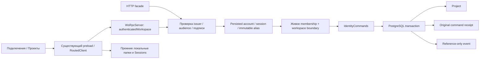
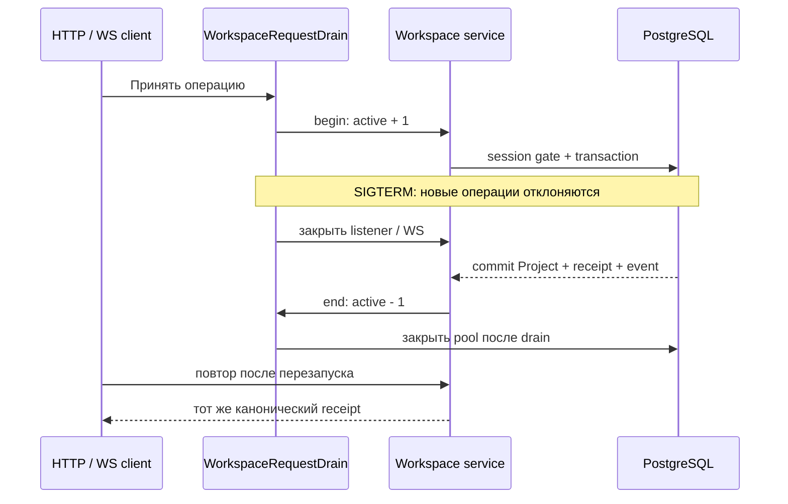

# WP-01: authenticated workspace и приватный Project

Статус: **интегрировано, частично проверено; полный DoD открыт**. Реестр исполнения — `plans/compound-implementation/progress.json`; исходная спецификация — `plans/macro-integration/work-packages.json:WP-01`. Точные SHA256 исходников и результаты — `plans/compound-implementation/wp01-integration-verification.json`. Этот документ описывает текущий bootstrap, а не реализацию остальных 142 пакетов.

## Существующие экраны

| Экран | Изменение | Ввод | Проверенный механизм / результат |
|---|---|---|---|
| Подключения → Сервисы | Форма подключения общего workspace | Адрес сервиса, UUID и точное имя workspace, учётная запись, пароль | Main получает JWT через настоящий HTTP issuer, проверяет membership, сохраняет токен существующим encrypted CredentialManager. Renderer получает только состояние и безопасные ошибки. |
| Проекты → список | Общие проекты внутри существующего каталога | Открыть, обновить, следующая страница, создать | Четыре `domain.project.*` метода используют отдельный авторизованный маршрут внутри существующего RoutedClient. Локальные папки сохраняют прежние API. |
| Проекты → Создать общий | Диалог создания, приватность по умолчанию | Название, «Приватный» / «Для участников» | Одна транзакция сохраняет Project, оригинальный receipt и событие. Неопределённый ответ повторяется с прежними commandId/idempotencyKey. |
| Проекты → подробности | Авторизованная общая проекция на прежнем маршруте | Каноническая ссылка `project:UUID`, обновить | GET заново проверяет principal, живую сессию, workspace и политику. Общий DTO не превращается в папку с фиктивными assetsPath/folderPath. |

Обработчики состояния очищают приватные данные при изменении личности/подключения и отклоняют запоздалый ответ другой области. Поля имеют русские подписи и встроенные пояснения; безопасные коды ошибок сопровождаются переводимым сообщением. Все 47 текущих ключей присутствуют в 12 существующих locale catalogs. Новые пункты верхней навигации для этой функции не создаются.

## Authority и данные

Единственный `AuthenticatedActor` определён в `packages/core/src/rox2/platform-contract.ts`. `createVerifiedActorResolver` принимает закреплённый issuer/audience и асимметричные алгоритмы, проверяет подпись и persisted device/session/expiry, затем повторно читает сессию после membership I/O. Входные JSON body и клиентские scope claims не создают Actor. Старый альтернативный raw-claims `IdentityRepository.resolveActor` удалён.

`lockPostgresActorSession` удерживает необходимые строки во время команды; тесты реальной гонки revoke против HTTP/WS подтверждают отказ без Project/receipt/event. Principal связан с immutable issuer+subject alias. Email, название профиля и CRM Contact не являются источниками полномочий.

`IdentityRepository.createSharedProject` сохраняет канонический ID и результат единожды. Повтор получает исходный receipt; пересечение чужих commandId и idempotencyKey даёт конфликт. Сохранённый JSON сверяется с точным результатом из независимых колонок и оригинального события. Повреждённые поля, timestamps, workspace, owner и лишние приватные payload дают безопасный отказ.

Оба текущих производителя bootstrap events удерживают общий transaction advisory lock до commit **перед** выделением sequence. Реальный отрицательный контроль подтверждает, что прежняя sequence-before-commit схема навсегда пропускала медленное событие. Event payload содержит только разрешённые references. Это ограниченный commit-ordered bootstrap; будущие event producers обязаны использовать тот же gate или доказанный общий outbox механизм.

## Перезапуск и завершение сервиса

Исполняемый Bun service и защищённая конфигурация описаны в [wp-01-runtime.md](wp-01-runtime.md). `createWorkspaceServer` объединяет HTTP и WebSocket в одном WsRpcServer. Режимы `local-bootstrap` и `trusted-issuer` выбираются явно; вне loopback TLS обязателен. Пароли provisioning поступают через ограниченный stdin, не через аргументы процесса или журналы.

Завершение ответа HTTP не означает завершение серверного I/O. Lifecycle ждёт фактическую операцию, в том числе если клиент закрыл соединение. Старый порядок закрывал pool между запросами уже принятой команды; отрицательный контроль получил 401 вместо 200. Исправленный сценарий на реальной PG блокировке сохраняет одну команду и восстанавливает receipt после полного subprocess restart.

## Фактические проверки

| Проверка | Результат | Источник |
|---|---|---|
| Domain/auth/session/HTTP/migrations/WS и transport neighbors | 90 passed, 0 failed, 848 assertions, 10 файлов | `/tmp/rox-wp01-final-composed-tests.log` |
| Native routing, реальные аккаунты/HTTP/PG, encrypted disk config, races, timeout и host parity | 47 passed, 0 failed, 3478 assertions, 4 файла | `/tmp/rox-wp01-final-native-mechanism.log` |
| Исполняемый сервис, config negatives, trusted JWKS, HTTPS, SIGTERM/SIGINT, restart | 10 passed, 0 failed, 239 assertions | `/tmp/rox-wp01-runtime-patches/verification-receipt.json` |
| Исправленная canonical queued verification и существующий platform contract | 195 passed, 0 failed, 1130 assertions, 2 файла | `/tmp/rox-wp01-canonical-status-tests.log` |
| Electron main/preload/renderer | Собраны, exit 0 | `/tmp/rox-wp01-native-{main,preload,renderer}.log` |
| Полные существующие TypeScript контуры | Electron 43 / baseline 46; server 24 / baseline 25; новых 0 | `typecheck-baseline.json` |
| Main/service SIGKILL и CLI | 28 passed, 0 failed, 693 assertions, 3 файла | `/tmp/rox-wp01-root-real-crashes-final.log` |
| Observability + domain/service neighbors | 27 passed, 0 failed, 465 assertions, 3 файла | `/tmp/rox-wp01-observability-root-tests.log` |
| Реальный Electron: два независимых профиля | Последний run выявил отсутствующий Input maxLength; исправлено, повторная приёмка впереди | `wp01-integration-verification.json:nativeRun` |

Суммы относятся к перечисленным отдельным прогонам; это не полный прогон всего репозитория. Предыдущие падения и negative controls сохраняются; assertions не ослаблены. Скриншоты, transcript и pixel evidence проверяются отдельно от unit tests.

## Что ещё требуется

1. Закончить настоящую native приёмку A/B, просмотр снимков, theme/200%/narrow, restart, revoke и сохранение прежних local Projects.
2. Проверить в настоящем Electron уже интегрированную устойчивую очередь единственного Project create intent: зашифрованная запись до отправки, восстановление `queued`/`uncertain` после restart, исходные command/key/payload, явные retry/cancel и principal/session/workspace fences. Механизм прошёл реальные PostgreSQL/HTTP/WS/SIGKILL проверки; интерфейсная приёмка ещё открыта.
3. Сохранить текущий cold standalone receipt и связать его с доставленной ревизией: три теста, 93 assertions, два аккаунта, HTTP/WS 403, restart с тем же receipt, изменённый bundle и отсутствующая migration. Evidence: `/Users/t/Pictures/Shots/Agents/rox-wp01-archive-1790777973571/result.json`. Юридическая release приёмка остаётся WP-48.
4. Связать принятую ревизию, screenshots и каждый нормативный DoD пункт с доказательством; сделать commit/push/readback.

Search, mentions, notifications, agent/MCP и общие grants имеют собственные зависимые slices. Bootstrap их не объявляет реализованными. Generic shared push остаётся недоступен до авторизованного durable consumer. Direct query/manual refresh не выдаётся за live notification engine. Полный финальный цикл всех 143 пакетов остаётся обязательным.

## Интегрированное восстановление credential/config

`ProjectAuthorityJournal.recoverUnlocked` ([project-authority-journal.ts](../../apps/electron/src/main/project-authority-journal.ts:162)) хранит подготовленный replace/disconnect в существующем encrypted CredentialManager. Новый plaintext credential store не создаётся. При incomplete replacement восстанавливается прежняя пара; при подготовленном disconnect восстановление заканчивает удаление. Неожиданный третий fingerprint или неизвестный journal version блокирует запись и сохраняет intent. `resolveStoredProjectAuthority` ([project-authority.ts](../../apps/electron/src/main/project-authority.ts:247)) выполняет recovery перед чтением; generation guard не возвращает позднюю область другой личности.

`atomicWriteFileSync` ([files.ts](../../packages/shared/src/utils/files.ts:37)) получил opt-in durable fsync файла и каталога; `saveConfig` передаёт этот режим. Existing SecureStorageBackend использует private fsync primitive для primary/backup и обнаруживает persisted quarantine после restart. Проверены реальные child SIGKILL на write barriers, сохранение privacy bytes и отказ под чужой scope. Проверка относится к одному native main на профиль и process crash, а не к аппаратному отключению питания или нескольким main одновременно.

Connections inputs ([ProjectAuthorityConnectionPanel.tsx](../../apps/electron/src/renderer/components/projects/ProjectAuthorityConnectionPanel.tsx:85)) используют общие константы: workspace name 10000, login 320, password 4096. Реальная native/service boundary проверяет 10000 Unicode символов, 10001 отклоняется без DB effect; IME/DOM maxLength gate повторяется в настоящем Electron.

Точные текущие hashes и historical receipts разнесены в `wp01-integration-verification.json` и `evidence/wp01/`: старый результат не переписывается под новую source generation.
