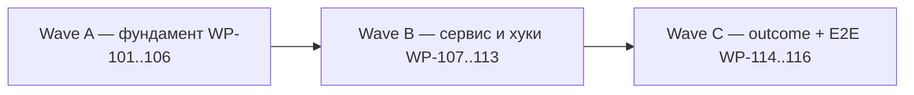

# Implementation program — ROX Continual Learning & Self-Improvement

Источник: [PRD](./2026-10-08-continual-learning-prd.md) (принят как спецификация).
Ветка: `feat/continual-learning-20261008` (worktree `/Users/t/Projects/rox-learning-20261008`, base `origin/main` `3db37c56b`).

## Инварианты (не нарушать ни в одном WP)

1. **LLM-generated learning output is always a hypothesis until validated by evidence** (PRD §48).
2. Никакой параллельной memory-системы (PRD §1, §44): `LessonStore`, `EpisodicMemory`, `SkillPendingQueue`, `MemoryProposalStore` остаются source-of-truth; learning-слой только ведёт ledger и вызывает их через `LearningTargetStores`.
3. Не делать auto-learning из каждого transcript (PRD §44): наблюдения — дешёвые, кандидаты — только из повторяющихся паттернов.
4. JSONL-only хранилище (PRD §5): `{workspaceRoot}/memory/learning/*.jsonl`, atomic rewrite (`.tmp` + rename), fail-soft чтение, idempotent append.
5. Замороженные контракты (никому не редактировать без нового WP):
   - `packages/shared/src/memory/learning.ts` — wire-safe типы + чистые функции (`candidateFingerprint`, `computeConfidence`, `computeEffectiveness`, `migrateAutoCreateFromSessions`, `DEFAULT_LEARNING_THRESHOLDS`, `DEFAULT_SKILLS_LEARNING_POLICY`).
   - `packages/server-core/src/memory/learning/learning-types.ts` — внутренние порты (`LearningServicePorts`, `LearningTargetStores`, `ValidatorPorts`, `ReflectionContext`, …).
6. Permissions/safety (PRD §16–17): autonomous promote разрешён только для `lesson/preference` scope `workspace|project|session`; `scope: global` и тип `policy` — только через user approval; `learning:observe|recordOutcome|recordCorrection` — native-only.
7. Никаких red-коммитов: commit только после зелёной фазы.

## Волновая карта (PRD §45) → WP



| PRD §45 | WP | Суть | Статус |
|---|---|---|---|
| Wave 1 Observability | WP-101, WP-107, WP-114 | observation/outcome ledger + lifecycle hooks | done (A+B+C) |
| Wave 2 Reflection | WP-102, WP-108 | patterns → hypotheses → candidates | done (A+B) |
| Wave 3 Memory validation | WP-110 | distill → candidate → validate → lesson | done |
| Wave 4 Skill evolution | WP-105, WP-110 | skill candidate + patch → version → promote/rollback | done (A engines + B wiring) |
| Wave 5 Outcome learning | WP-111, WP-114 | effectiveness, experiments, rollback по регрессии | done (WP-113 + WP-113b: failure evidence + error-rate trigger) |
| Wave 6 Policy learning | WP-105, WP-109 | policy learner + job | done |
| Wave 7 Autonomous learning | WP-107..109 | LearningWorker: reflect/consolidate/curate/evaluate | done (WP-117 composition: LearningHost + bus) |

## Общая архитектура слоёв

```text
SessionManager ──emit──▶ SessionEventBus ──▶ LearningService (observe / record)
                                                │
                                     ObservationStore ─▶ ReflectionEngine ─▶ CandidateStore
                                                                                │
                                                          CandidateValidator ── P. PromotionEngine
                                                                                │  ↕ RollbackManager
                                            LessonStore / SkillPendingQueue / PolicyStore
                                                                                │
                                                    OutcomeStore ─▶ EffectivenessScorer ─▶ evaluate/rollback
```

---

## Wave A — фундамент (WP-101…WP-106)

Все файлы ниже — новые, в `packages/server-core/src/memory/learning/` (если не сказано иное); каждый WP закрыт своим тест-файлом в `__tests__/`. Зависимостей между WP-101…106 нет (file-disjoint), они диспатчатся параллельно.

| WP | Файлы | Тесты | Acceptance |
|---|---|---|---|
| WP-101 Stores | `LearningStore.ts`, `ObservationStore.ts`, `CandidateStore.ts`, `EvidenceStore.ts`, `OutcomeStore.ts`, `MutationStore.ts`, `ExperimentStore.ts`, `LearningAudit.ts` | `learning-stores.test.ts` | round-trip JSONL, corrupt-line tolerance, atomic `.tmp`+rename, идемпотентный `EvidenceStore.add`, `CandidateStore.getByFingerprint`, `markConfirmed/markReverted` |
| WP-102 Reflection | `PatternDetector.ts`, `ReflectionEngine.ts` | `pattern-detector.test.ts`, `reflection-engine.test.ts` | `detectPatterns` (порог ≥2, дедуп по нормализованному ключу); `reflect()` никогда не бросает, 1 retry на невалидный JSON, без distiller → пустой результат |
| WP-103 Validation | `CandidateValidator.ts`, `EffectivenessScorer.ts` | `candidate-validator.test.ts`, `effectiveness-scorer.test.ts` | 7+1 детерминированных проходов в фиксированном порядке; `promotable` = все ok ∧ confidence ≥ порога; judge никогда не бросает; scorer монотонен по success/correction |
| WP-104 Promotion/Rollback | `PromotionEngine.ts`, `RollbackManager.ts` | `promotion-engine.test.ts`, `rollback-manager.test.ts` | approval-гейты (§17); mutation-записи на каждый target; sub-mutation revert при ошибке; rollback уже одобренного skill → refuse; audit action `rollback` |
| WP-105 Skill/Policy | `SkillEvolutionEngine.ts`, `PolicyLearner.ts` | `skill-evolution.test.ts`, `policy-learner.test.ts` | keep/improve/archive границы; patch refusal <3 failures; policy только для ≥10 задач с Δsuccess ≥0.1 и консистентным паттерном; fingerprint детерминирован |
| WP-106 Config | `packages/shared/src/config/storage.ts` (правка), `packages/shared/src/config/__tests__/skills-learning-policy.test.ts` | тот же файл | `getSkillsLearningPolicy()` + legacy `autoCreateFromSessions` → `off/candidate` (§43); строгая валидация; `getSkillsAutoCreateFromSessions()` не тронут |

Верификация фазы: `bun test packages/server-core/src/memory/` (базовые 187 + новые), `bun test packages/shared/src/config/__tests__/skills-learning-policy.test.ts`, `tsc --noEmit` в `packages/server-core` и `packages/shared`. — **выполнено** (commit `e60860f9e`; config-сьют 13 pass).

## Wave B — сервис, хуки, протокол (WP-107…WP-113)

| WP | Файлы | Зависимости | Тесты | Acceptance |
|---|---|---|---|---|
| WP-107 SessionEventBus | `packages/server-core/src/sessions/SessionEventBus.ts` (новый), `SessionManager.ts` (правка: emit `sessionCreated/promptAssembled/toolCall/toolResult/userCorrection/verificationComplete/sessionComplete/sessionFailed/sessionBranched/workspaceIdle`) | нет | `sessions/__tests__/session-event-bus.test.ts` | каждый тип события доставляется consumer'ам; listener throw не ломает emit; branch эмитит `sessionBranched` + `userCorrection`; `workspaceIdle` по idle-таймауту |
| WP-108 LearningService | `learning/LearningService.ts`, `learning/ConsolidationEngine.ts` (п. Job 4 §12), `learning/GarbageCollector.ts` (§14) | WP-101..104 | `learning-service.test.ts`, `consolidation-engine.test.ts` | pipeline §35 (normalize→extract→classify→provenance→persist); идемпотентность по §34 fingerprint; `approveCandidate/rejectCandidate/rollbackCandidate`; `getTimeline/getStats`; `whenIdle` |
| WP-109 LearningWorker | `learning/LearningQueue.ts`, `learning/LearningWorker.ts` | WP-108 | `learning-worker.test.ts` | очередь с jobId/sourceId/attempt/status (§33–34); 6 job-типов; экспоненциальный retry; idle-триггер; без giant timer |
| WP-110 MemoryService | `memory/MemoryService.ts` (правка), `memory/__tests__/memory-service-learning.test.ts` | WP-108 (по `LearningServicePorts`) | тот же | `distill → candidate → validate → promote` при включённом policy (иначе legacy-путь сохранён); `recordContextUsage` в `buildMemoryBlocks`; `recordCorrection` на branch; `recordToolOutcome` по tool-result; все существующие тесты зелёные |
| WP-111 RPC | `packages/shared/src/protocol/channels.ts`, `routing.ts`, `packages/server-core/src/handlers/rpc/learning.ts` + регистрация в `handlers/rpc/index.ts`, renderer `apps/electron/src/shared/types.ts` + `transport/channel-map.ts` | WP-108 | `handlers/rpc/__tests__/learning.test.ts`, существующие parity-гейты (`routing.test.ts`, `channel-map-parity.test.ts`) | read/actions/agent-native каналы §15; `learning:observe|recordOutcome|recordCorrection` требуют native-контекста; три слоя паритета зелёные |
| WP-112 UI | `apps/electron/src/renderer/components/learning/LearningScreen.tsx` (+ панели), `atoms/learning.ts`, `contexts/NavigationContext.tsx` | WP-111 | renderer-тесты навигации/атомов | экран Learning рядом с Memory/Skills/Sessions; dashboard §26, candidate inspector §27, skill evolution §28, timeline §29; RU + Rox Mono + светлая компактная тема |
| WP-113 Outcome wiring | `learning/OutcomeStore` (использование из WP-101), правки `LearningService`/`LearningWorker` | WP-108/109 | `outcome-wiring.test.ts` | `session.completed/failed` → `TaskOutcome`; `evaluateOutcomes` → `EffectivenessScorer`; регрессия (drop > 0.1 или correctionRate > 0.25) автоматически запускает `RollbackManager` (PRD §40–41) |

**Статус WP-107…113 — done.** WP-113 закрыт с расширением по PRD §40: `observeCompletion` пишет `TaskOutcome` (`out_<sessionId>`, fingerprint = sha256(workspaceId \0 category)), на каждый revert пишется failure evidence (`failed_outcome`, ref = mutationId), добавлен error-rate триггер регрессии (§40 третий пункт; порог — переиспользован `rollbackSuccessDrop`, PRD числа не называет).

Верификация фазы: `bun test packages/server-core/src/` (полный server-core сьют), `bun run typecheck:all`, узкие сьюты протокола и renderer'а.

## Wave C — приёмка (WP-114…WP-116)

| WP | Файлы | Зависимости | Acceptance |
|---|---|---|---|
| WP-114 E2E §46 | `packages/server-core/src/memory/learning/__tests__/learning-loop.e2e.test.ts` | всё выше | единый тест 12 шагов §46: задача → коррекция → observation → reflection → повтор → evidence → ACTIVE → использование → outcome → effectiveness → auto-rollback → timeline с полной причинной цепочкой |
| WP-115 Runtime Map | `apps/electron/src/renderer/components/runtime-map/*` (правка) | WP-112 | узлы Memory/Skill/Policy/Evidence/Outcome в live-map (PRD §30) |
| WP-116 Docs/норма | `docs/memory/learning.md` (новая), обновление `docs/memory/*` | все | норма §48 зафиксирована; операторская инструкция: как читать timeline, approve/reject/rollback |

**Статус Wave C:** WP-114 — done (12 шагов §46 в одном тесте, 62 expect, реальные stores, без моков движков); WP-115 — done (`learning-nodes.ts`: 5 узлов Memory/Skill/Policy/Evidence/Outcome, стили, 8 тестов; live-feed — WP-115b, см. отклонения); WP-116 — done (`docs/memory/learning.md` 346 строк + локальный индекс).

## Известные отклонения и принятые ограничения (report-only)

1. **Skills не авто-промоутятся из `ingestDistilled`**: evidence skill-кандидата — только `skill_usage`, проход `outcome_evidence` всегда не ok → нужен явный `approveCandidate`. Осознанно; молча не «исправлялось».
2. `handled: false` из `ingestDistilled` имеет reason `'learning disabled'` и при `enabled:false`, и при `autoCreate:'off'`.
3. `getTimeline`: записи mutation/rollback не несут `candidateId` (experiment несёт).
4. `evaluateOutcomes` сравнивает before/after по глобальному пулу outcomes, а не по `taskFingerprint` (§19 ideal); fingerprint пишется, но для сопоставимости пока не используется. `qualityScore` в триггерах не участвует.
5. Runtime map: learning-узлы (5 видов) выводятся в live-канвас через read-only overlay (WP-115b: `learning-overlay.ts`, `useLearningOverlay`, `LearningNodeCard`, fail-soft при ошибке/`UNSUPPORTED_OPERATION`). Ограничение: push-канала у learning нет — overlay перечитывается при смене workspaceId (как и `LearningScreen`), поэтому утверждённый кандидат появляется на карте после её ремаунта. Фильтры toolbar и context-mode allowlist намеренно не расширялись (потребовали бы новых locale-ключей).
6. GC не удаляет, только рекомендует: в замороженном `LearningTargetStores` нет archive-порта.
7. Вне исходной таблицы: **WP-117 Composition** — выполнен (`LearningHost`, `SessionManager` bus-хуки, electron `main/index.ts`, headless `packages/server/src/index.ts`).

## Definition of Done (PRD §46)

Программа закрыта, когда `learning-loop.e2e.test.ts` проходит целиком: 12 шагов причинной цепочки на реальных store-Implementations (tmp workspace, без моков движков), плюс зелёные полные сьюты `server-core` и протокольные parity-гейты.

## Правила исполнения

- Один owner на файл; `SessionManager.ts` и `MemoryService.ts` — строго последовательные владельцы (по одному).
- Субагенты не запускают repo-wide гейты; гейты запускает оркестратор после интеграции фазы.
- Замороженные контракты: правка только через отдельный WP с обоснованием в этом документе.