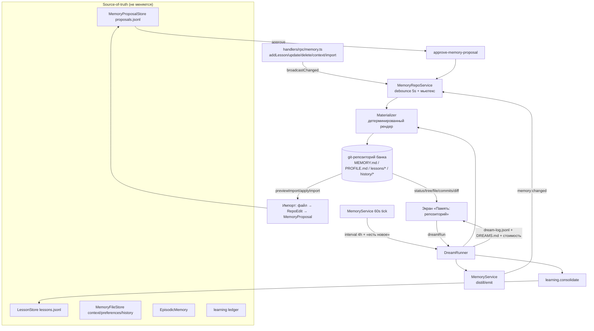

# Предложение — «Память: репозиторий» и «Сны памяти» (markdown-память в git + сборка)

Статус: **РЕАЛИЗОВАНО (Wave A + Wave B)** — код изменён; предложение ниже сохранено как проектный документ. Статус реализации, результаты спайка WP-01 и отличия от предложения — в §0.
Источник мотивации: продукт memoryrepo.dev («markdown memory»: агент, чья долгосрочная память — git-репозиторий markdown; записывает по мере обучения; «снящийся» агент убирает и консолидирует память).
Область: `apps/electron` (UI), `packages/server-core/src/memory`, `packages/shared`, `packages/session-tools-core`.

Итог одной строкой (поставлено в Wave A): **существующие хранилища памяти остаются source-of-truth; из них детерминированно материализуется git-репозиторий markdown (MEMORY.md / PROFILE.md / lessons/* / history/*), доступный для чтения, истории, диффов и экспорта; «сон» — это планируемая и наблюдаемая сборка (distill → предложения → консолидация → коммит) с журналом и оценкой стоимости; правки, сделанные человеком в репозитории, возвращаются в память только через существующий конвейер предложений. Новый экран «Память: репозиторий» и апгрейды экранов «Память» и «Заметки».**

---

## 0. Статус реализации (Wave A, 2026-10-09)

Предложение реализовано одной волной (Wave A). Поставленная поверхность:

- **shared** — `packages/shared/src/memory/git-exec.ts` (argv-only обёртка `execFile('git')`), `packages/shared/src/memory/repo.ts` (wire-safe DTO); протокол — **14 каналов** (`memory:repo*` 8, `memory:dream*` 3, `memory:repo*Import*` 3) + **4 push** (`memory:repoChanged`, `memory:dreamEvent`, `memory:dreamDone`, `memory:repoImportReady`).
- **server-core** `memory/repo/**` — `MemoryRepoMaterializer` (чистый детерминированный рендер), `MemoryRepoService` (единый писатель: debounce + мьютекс, git/снимки, zip-экспорт), `RepoSourceProvider`, `snapshots`, `DreamRunner`/`DreamScheduler`/`DreamCostTracker`/`DreamNotesScanner`, `repo-import-parser`, `repo-watcher`, `notify`; RPC — `handlers/rpc/memory-repo.ts` и `handlers/rpc/memory-repo-import.ts`.
- **renderer** — экран `apps/electron/src/renderer/components/memory/MemoryRepoScreen.tsx` (вкладки **Файлы · История · Сны · Граф**), панели `.../components/memory/repo/*.tsx`, `ImportReviewDialog.tsx`.
- **апгрейды** — «Память» (статус репозитория, строка «в репозитории», экспорт) и «Заметки» (чип «ожидает сна», копия в диалоге удаления).
- **Wave B (поставлено, WP-07)** — ⌘K-поиск внутри экрана репозитория (`apps/electron/src/renderer/components/memory/repo/MemoryRepoSearchOverlay.tsx`: файлы — клиентский фильтр дерева, заметки — `notes:search`, сообщения — `sessions:searchContent`; debounce 200 мс, лимит 8 строк на группу с честным итоговым счётчиком) и read-only host-инструменты `memory_repo_read` / `memory_repo_search` (`packages/session-tools-core/src/handlers/memory-repo.ts` + порт `src/memory-repo/runtime.ts`, регистрация в `packages/server-core/src/handlers/rpc/memory-repo.ts:263`, суффиксы в `SESSION_MCP_ESSENTIAL_SUFFIXES`; инструментов записи нет).

**Спайк WP-01** (реальные замеры, `spikes/memory-repo-baseline/`, вне прод-кода): корпус **200 уроков × 2 банка + 30 дней истории**. Полный цикл материализации + `git init`/`add`/`commit` — **942 мс**; повторная (no-op) материализация — **39 мс**; рабочее дерево — **452 608 Б на 1000 уроков**; полный размер с `.git-rox` — **1 062 113 Б на 1000 уроков** (≈ **1,3 %** сверх ориентира 1 МиБ). Ориентир 1 МиБ/1000 уроков превышен, но это **принято осознанно**: реальные scope ограничены `LESSON_LIMITS.total = 200` на scope (`packages/shared/src/memory/types.ts:231`) ⇒ ≈ 88–90 КБ рабочего дерева на банк, а диффы читаемы человеком.

### Отличия реализации от предложения

1. **Планировщик сна — один процесс-рантайм.** `startMemoryRepoRuntime(...)` вызывается из `registerCoreRpcHandlers` (`packages/server-core/src/handlers/rpc/index.ts:163`), создавая единственный `DreamScheduler` на процесс (идемпотентно), а не «рядом с регистрацией хендлеров» по тику `MemoryService`.
2. **`.meta.json` лежит рядом с каталогом репозитория** — `<repoPath>.meta.json`, а не внутри рабочего дерева (`MemoryRepoService.ts:288,305`).
3. **Пишется `.git-rox/info/exclude`** — `.git-rox/`, `.meta.json`, `*.tmp`, `.conflicts/`, `.snapshots/` (`MemoryRepoService.ts:326-336`), поэтому git не видит служебные пути как untracked.
4. **`DREAMS.md` коммитится следующим materialize.** Файл пишется как вспомогательный через `writeRepoFile` и присоединяется к следующей пачке материализации (`MemoryRepoService.ts:681-693,801-805`), а не отдельным коммитом сна.
5. **Zip-экспорт — store-only ZIP без зависимостей.** Собственный минимальный писатель (метод 0), без новой библиотеки (`MemoryRepoService.ts:179-234`).
6. **Owner-банки материализуются по требованию через RPC**, тогда как сон и статус перечисляют только `local`-банки (`main`, `ws:<id>` — без суффикса владельца; `RepoSourceProvider.listBanks`, `MemoryRepoService.dreamBankIds`).
7. **Чтение никогда не материализованного банка лениво материализует его один раз** (документированное решение): read-хендлеры (`repoStatus`/`repoTree`/`repoReadFile`/`repoCommits`/… через `handlers/rpc/memory-repo.ts:174-185`) вызывают `MemoryRepoService.ensureMaterialized` под мьютексом банка, когда `.meta.json` ещё не имеет `writtenAt` (`MemoryRepoService.ts:709-714`); при уже существующей проекции вызов — no-op, поэтому экран не показывает пустое дерево, а повторное чтение не создаёт коммита (материализация детерминирована).
8. **Owner-скоуп банки оповещаются через банк-id с суффиксом владельца.** `RepoBankRef` (`memory/repo/notify.ts`) несёт необязательный `ownerKey8`, и `notifyMutation` для owner-несущих записей (мутации уроков, нативный distill, `repoRevertImport`, workspace-approval) оповещает именно `main#<owner8>` / `ws:<id>#<owner8>` (через `formatBankId`), а не ownerless базовый банк — иначе после первой материализации owner-проекция осталась бы устаревшей; личные approval (`scope:'personal'`) оповещают `{ scope:'main', ownerKey8 }`, потому что пишут глобальный файл уроков.
9. **Граф не содержит узлов-заметок.** Предложение (§8) перечисляло узел «заметка»; фактический `MemoryRepoService.graph` эмитит только урок/тема/сессия/контекст/файл.

### Волна адверсариальной проверки (2026-10-09, после Wave A/B)

Финальная ревизия прошла независимый состязательный аудит (9 линз: жизненный цикл, прерывание сна, i18n сверх паритета, дрейф документации, гонки UI, поверхность RPC/ФС, изоляция владельца, полнота покрытия, перф-конверт). Исправлено и покрыто тестами:

- **Репозиторий:** `readFile`/`writeRepoFile` — realpath-контейнмент и запрет служебных путей (`.git-rox`/`.snapshots`/`.conflicts`/`*.tmp`); маркер `uncommitted` пишется **write-ahead** (kill в середине пачки больше не карантинит наши же байты); коммит батча авторитетен (осиротевшие staged-пути от убитой пачки не попадают в чужой коммит); сбой `git add/commit` несёт `error` в результате и журналируется как ошибка, а не «nothing to commit»; snapshot-режим `listCommits` мемоизирует деревья.
- **Сны:** рантайм диспозится вместе с транспортом (`server.onShutdown`: stop/dispose/unsubscribe), интервал планировщика `unref`; окно/`lastRun`/стоимость восстанавливаются из `dream-log.jsonl` при старте; `memory:dreamDone` пушится детерминированно по завершении рана (без `setTimeout`-гонки).
- **Владелец:** `memory:IMPORT` уведомляет и owner-скоуп банк, а не только базовый.
- **UI:** инвалидация generation при сбросе выбора, per-selection loading и loading-ветка в дереве, правдивый «коммит не найден» для sha вне последних 100, `error` поиска больше не выглядит как «ничего не найдено», «Собрать сейчас» не разблокируется на mid-run `error`-событии.
- **i18n:** плюральные формы баннера импорта (`_one/_few/_many/_other`), хоткей-хинт через `formatHotkeyDisplay('mod+k')`, адресный `aria-label` строки импорта, ключ `memory.repo.search.error`.
- **Тесты и CI:** покрытие трёх push-каналов и адаптера session-tools (`memory_repo_read/search`), round-trip ZIP с проверкой CRC и смещений, `status().dirty`/`info/exclude`/отложенный коммит `DREAMS.md`, snapshot-режим через RPC, парсинг/лимит журнала снов, unit-тесты экрана; CI-шаг `Verify memory feature unit suites` в `.github/workflows/ci.yml`.

**Остаточный раунд (2026-10-09):** `memory:dreamRun` больше не разблокируется 30-секундным таймаутом транспорта (состояние рана ведётся по потоку событий: таймаут после `start` оставляет рана активным, немедленный отказ — сбрасывает); snapshot-режим не плодит пустую запись истории при повторной пачке после kill (no-op → `committed:false`, `head` остаётся на прежней записи); журнал снов читается хвостовым окном 512 КиБ вместо всего файла; доступность git мемоизируется на 30 с (убирает `git --version` из каждого чтения); удалена мёртвая обвязка (`setDreamScheduler`/`getDreamScheduler`, неиспользуемый ключ `memory.repo.state.busy`); бюджеты нативного харнесса подняты (`timeout` 200 с / `globalTimeout` 450 с, `native.config.ts`) — под нагрузкой машины ~2× спека занимает ~290 с и больше не падает по прежнему 170-секундному лимиту; тесты `memory-config` получили 30-секундный пер-тестовый запас на spawn подпроцесса.

---

## 1. Что даёт reference-продукт и чего нет в ROX

Поставка memoryrepo.dev (извлечено из её бандла): вкладки chat / notes / memory / history; `MEMORY.md` + `PROFILE.md` + связанные заметки в git; дерево файлов, markdown-просмотр с frontmatter и `[[викиссылками]]`, граф связей; агент «коммитит по мере обучения»; вкладка истории с коммитами (hash, parent, сообщение) и построчными диффами (added/modified/deleted), выбор HEAD; «сны» — фоновая сборка «каждые 4 ч, если есть новое» или вручную «Dream now», поток журнала сна (commit/bash/tool), учёт стоимости сна, выбор модели сна; заметки со статусом «изменилась с прошлого сна» / «уже в памяти»; полнотекстовый поиск по памяти/заметкам/сообщениям с подсветкой и переходом к источнику; провенанс — от утверждения памяти к исходному сообщению чата; «банки» памяти (main/work); токен-API (MEMORY_TOKEN, `POST /chat`, `GET /memory/MEMORY.md`, `GET /search`).

В ROX сегодня уже есть (проверено по коду):

| Есть в ROX | Где |
|---|---|
| Уроки (`Lesson`), слияние, конфликты, закрепление, архив, счётчики использования, токе-бюджет | `packages/server-core/src/memory/LessonStore.ts`, `apps/electron/src/renderer/components/memory/MemoryScreen.tsx`, `lib/memory-model.ts` |
| Контекст/предпочтения/дневная история (markdown) и промпт-инъекция | `memory/MemoryFileStore.ts` (`context.md`, `preferences.md`, `history/YYYY-MM-DD.md`), `packages/shared/src/prompts/system.ts` |
| Дистилляция сессий, эпизодическая память, FTS, decay, аудит | `memory/MemoryService.ts`, `episodic-memory.ts`, `fts-index.ts`, `decay.ts`, `AuditLog.ts` |
| Предложения памяти с подтверждением | `memory/MemoryProposalStore.ts`, `approve-memory-proposal.ts`, `handlers/rpc/memory-proposals.ts` |
| Continual learning: наблюдения → гипотезы → валидация → promotion → rollback | `memory/learning/**`, `docs/plans/2026-10-08-continual-learning-{prd,program}.md` |
| Проектный `MEMORY.md` и его инъекция в промпт | `packages/shared/src/projects/storage.ts` (M5), `agent/omp-agent.ts:532` |
| Заметки (markdown + frontmatter), хранилище знаний, change-watcher | `pages/NotesPage.tsx`, `packages/server-core/src/knowledge/**` |
| Git (только чтение) и проверенный запуск git из кода | `packages/shared/src/git/exec.ts`, `code-intelligence/refs.ts:225`, `marketplace/installer.ts:162` |

Чего нет: git-версии памяти (история/диффы/экспорт), видимого «сна» с журналом и стоимостью, импорта правок из markdown, связки заметок со сном, поиска по памяти/заметкам/сессиям как единого экрана.

## 2. Инварианты (нарушать нельзя)

1. **Никакой параллельной системы памяти** (`docs/memory/learning.md:330`): `LessonStore`, `EpisodicMemory`, `SkillPendingQueue`, `MemoryProposalStore` — source-of-truth; новый слой только оркестрирует и проецирует.
2. **Гипотеза до доказательства**: LLM-вывод памяти не становится истиной без валидации/подтверждения (PRD §48).
3. **Промпт читает только существующие хранилища**; формат `formatLessonsForPrompt` / `formatWorkspaceMemoryForPrompt` и `selectContextLessons` не меняются.
4. **Приватность и владелец**: глобальные `preferences.md` никогда не попадают в рабочий репозиторий (`MemoryService.buildMemoryBlocks` чистит их при `workspaceOnly`, `MemoryService.ts:439-441`); каждый банк материализуется **по аутентифицированному владельцу** — уроки чужих владельцев в репозиторий и экспорт не попадают. Проекция фильтрует по 8-символьному префиксу `ownerKey8 = sha1(lessonOwnerKey)[:8]` (усечение — в отличие от полного `ownerKey` в `LessonStore.listForOwner`, `LessonStore.ts:34-36,155-159`); на границе RPC запрошенный префикс владельца связывается с аутентифицированным вызывающим (`authorizeMemoryRepoBank` / `ownerKey8For(principal)`).
5. **Телеметрия не коммитится**: `usageCount/lastUsedAt/usedAt/conflicts` живут в JSONL и обновляются на каждой сборке промпта — попадание их в git дало бы коммит на каждый ход.
6. RU-first UI (`t()` и 12 локалей), компактная светлая тема, RU-документация.

## 3. Три способа и решение

| | A. Репозиторий-проекция | B. Markdown-first (файлы — источник истины) | C. Гибрид с импортом правок |
|---|---|---|---|
| Хранилище-источник | существующее (JSONL+md) | markdown в git; JSONL — производный кэш | существующее; repo — проекция |
| Правки человека | нет (только просмотр/экспорт) | прямые, с мержем по маркерам | через предложения (approval) |
| Соответствие инварианту 1 | полное | требует переинтерпретации формата | полное |
| Риск для промпт-пути | нет | миграция + парс стоимости на каждый промпт | нет |
| Объём работ | минимальный | высокий | средний (A + импорт) |
| Ценность | 70–80 % reference | 100 % reference | 90–100 % reference |

**Решение: A как база, C как целевое состояние (поэтапно), B — отложен.** Собираем сначала проекцию, экран, историю и сны (это несёт основную ценность и безопасно), затем — импорт правок из репозитория через существующий конвейер предложений. Из B берём техзащиты: идентичность урока в frontmatter (файл = урок), маркерные зоны для машинного текста, «git-каталог вне рабочего дерева» при выносе репозитория внутрь workspace, отсутствие телеметрии в коммитах. Отказ от B сейчас зафиксирован в §12 (решения) и может быть пересмотрен отдельным PRD после эксплуатационных данных (замер «грязного» репозитория).

## 4. Архитектура



Ключевые новые модули (server-core):

```
packages/shared/src/memory/git-exec.ts        # тонкая обёртка execFile('git') (по образцу refs.ts:225-234)
packages/shared/src/memory/repo.ts            # wire-safe DTO (банки, статус, файлы, коммиты, сон)
packages/server-core/src/memory/repo/
  MemoryRepoMaterializer.ts                   # чистая функция «источники → файлы» + запись только изменённого
  MemoryRepoService.ts                        # единый писатель: debounce, мьютекс, init, commit, индексы
  DreamRunner.ts                              # шаги сна, журнал, стоимость
  DreamCostTracker.ts                         # usage → usd (оценка), таблица цен моделей
  repo-import-parser.ts                       # (Фаза 5) файл → RepoEdit[] по frontmatter id/hash
packages/server-core/src/handlers/rpc/memory-repo.ts   # каналы memory:repo* и memory:dream*
```

## 5. Банки, файлы, формат

Банк = существующий scope. Репозиторий — отдельный каталог (по умолчанию вне workspace, чтобы не засорять пользовательские git-репозитории; настраивается `memory.repo.path`, в т.ч. на папку в Obsidian/iCloud):

| Банк | id | Рабочее дерево | Источник |
|---|---|---|---|
| Личная (global) | `main` | `{configDir}/memory/repos/main/<ownerKey8>/` | `{configDir}/memory/{lessons.jsonl,preferences.md}` — **с фильтром по владельцу** |
| Рабочая (workspace) | `ws:<workspaceId>` | `{configDir}/memory/repos/ws-<hash8>/<ownerKey8>/` | `{workspaceRoot}/memory/{lessons.jsonl,context.md,history/*,episodic.jsonl}` — **с фильтром по владельцу** |

`ownerKey8` = sha1(ownerKey)[:8] из существующего `lessonOwnerKey` (`LessonStore.ts:34`); фильтр идёт по этому усечённому префиксу, а не по полному `ownerKey`, как в `LessonStore.listForOwner` (совпадает семантика владельца, не представление ключа). Запрошенный префикс владельца связывается с аутентифицированным вызывающим на границе RPC (`authorizeMemoryRepoBank` / `ownerKey8For(principal)`); строки без владельца (legacy machine-private) включаются только для локального принципала. `audit.jsonl` в проекцию не входит: у него нет потребителя в файловой карте, а append на каждую мутацию давал бы коммит на мутацию.

```
MEMORY.md                 # визитка: frontmatter + ## Контекст (context.md) + ## Правила (N) + [[ссылки]]
PROFILE.md                # банк main: preferences.md + профиль
lessons/<category>/<slug>--<id8>.md   # один урок = один файл; имя = читаемый слаг + id8 (без коллизий)
history/YYYY-MM-DD.md     # побайтовая копия дневной истории
DREAMS.md                 # человекочитаемые сводки снов (генерируется)
README.md                 # правила правок и маркерные зоны
.gitignore                # .snapshots/, *.tmp
```

Frontmatter файла урока: `id` (stable: `scope:sha1(lessonKey)[:10]`; при наличии `source.proposalId` — `p:<id>`), `scope`, `category`, `negative`, `pinned`, `disabled`, `tags`, `ts`, `source{trigger,session,proposal,consent}`, `baseHash` (sha1 текста правила на момент материализации). **Телеметрия в файлы не пишется** — экран берёт её из хранилищ.

Детерминизм: LF, сортировка (ts, id), ISO-UTC, завершающий перевод строки; повторная материализация неизменных источников не меняет ни одного байта и не создаёт коммит. Пишем только изменившиеся файлы (`tmp` + rename), удалённые уроки → удалённые файлы (в истории — deletion). «Актуальность» (`sourceRev` в `.meta.json`) считается по **телеметрически-чистой** проекции (рендер файлов), а не по сырым байтам `lessons.jsonl` — иначе каждый сбор промпта (touchUsed) показывал бы «есть изменения».

**Правки человека неприкосновенны для материализатора.** Перед записью файла sha1 его текущих байт сравнивается с хешем, записанным в `.meta.json` при последней записи. Если байты отличаются (правка извне), файл **не перезаписывается**: копия сохраняется в `.conflicts/<ts>/<path>`, файл получает состояние `edited`, его проекция приостанавливается до импорта (WP-06) или явного отката. Молчаливой перезаписи не существует — это условие фазы 1, а не только импорта.

Приватность: `PROFILE.md` существует только в банке `main`; отдельный тест проверяет отсутствие глобальных предпочтений в рабочем репозитории.

## 6. Git-механика

- **Решение: системный `git` через `execFile`** (без оболочки), обёртка `packages/shared/src/memory/git-exec.ts` по образцу `code-intelligence/refs.ts:225-234`; в репозитории нет git-библиотек, а системный git уже обязателен для marketplace (`marketplace/installer.ts:162`). `isomorphic-git` отклонён (новая зависимость ~1 МБ, не использует реальные remotes пользователя, дублирует логику); «снимки только» отклонены как основная модель (ценность — именно git-история), но оставлены как fallback.
- Флаги: `-c core.fsmonitor=false -c core.hooksPath=/dev/null -c commit.gpgsign=false`, `GIT_TERMINAL_PROMPT=0`, `GIT_OPTIONAL_LOCKS=0`, `GIT_NO_REPLACE_OBJECTS=1`; никогда: `push`, `reset --hard`, `clean -fdx`, `checkout -f`, `rebase`, `amend`.
- Идентичность коммита: `-c user.name=Rox -c user.email=rox@localhost` (глобальный конфиг не трогаем; при наличии `readGitIdentity()` — используем её).
- Инициализация и детекция: **все** вызовы идут с явными `GIT_DIR=<repo>/.git-rox` и `GIT_WORK_TREE=<repo>`; детекция = `git --git-dir=<repo>/.git-rox --work-tree=<repo> rev-parse --show-toplevel`, результат должен равняться `<repo>`; при отсутствии — `git init -q -b main` с теми же GIT_DIR/GIT_WORK_TREE. Автопоиск `.git` вверх по дереву **никогда** не используется (иначе override внутри чужого репозитория коммитил бы в него); `core.hooksPath` берётся из существующей константы `DEV_NULL` (`packages/shared/src/git/exec.ts:9`) — она уже учитывает Windows.
- **Коммит-политика**: один коммит на пачку изменений (debounce 5 с + мьютекс на банк); пустой `git status` → коммита нет. Сообщение: `memory(<scope>): <reason> [+N/-M уроков]` + trailers `Rox-Dream/Rox-Session/Rox-Trigger`.
- **Fallback без git** (`available=false`): файлы материализуются как обычно; вместо коммитов — снимки `.snapshots/<ts>/` (полное дерево файлов) + `index.jsonl` (`{id, parent, ts, message, files[{path, op, hash}]}`); диффы между снимками считает тот же diff-рендер, «HEAD» = последний снимок; недоступны только blame/remote («история: снимки (git не найден)»). Windows: `execFile('git')` находит `git.exe`; пути с пробелами/юникодом безопасны (argv без оболочки).
- **Защита от вложенного репозитория**: репозиторий памяти всегда живёт в `<repo>/.git-rox` (см. выше), поэтому коммиты памяти физически не могут попасть в чужую историю даже при override внутрь пользовательского дерева. Но материализованные markdown-файлы в этом случае лежат в чужом рабочем дереве и видны как untracked — поэтому in-repo override включает честный режим: предупреждение в UI, предложение добавить путь в `.gitignore` пользователя (только с подтверждением) и состояние `repo-in-foreign-tree`. Тесты: (1) при дефолтном пути вне workspace `git -C <workspace> status --porcelain` не меняется и файлов памяти в нём нет; (2) при in-repo override `rev-parse --show-toplevel` пользовательского репозитория не равен repoPath, а коммиты памяти уходят в `.git-rox` и не попадают в пользовательскую историю.
- «Актуальность»: `.meta.json` хранит `sourceRev` (sha1 канонических источников) и `headOfMaterialize`; экран сравнивает и показывает «актуально/есть изменения».
- Ограничения: без push по умолчанию; экспорт — zip (`memory:repoExport`) с путём в результате.

## 7. RPC и push

Новые каналы (в блок `memory:` `packages/shared/src/protocol/channels.ts:675-701`):

```
memory:repoListBanks | memory:repoStatus | memory:repoTree | memory:repoReadFile
memory:repoCommits | memory:repoCommitDiff | memory:repoGraph | memory:repoExport
memory:dreamStatus | memory:dreamRun | memory:dreamLog
memory:repoPreviewImport | memory:repoApplyImport | memory:repoRevertImport   # Фаза 5
push: memory:repoChanged | memory:dreamEvent | memory:dreamDone | memory:repoImportReady
```

DTO — `packages/shared/src/memory/repo.ts` (wire-safe, как `learning.ts`). Регистрация: `handlers/rpc/memory-repo.ts` + импорт в `handlers/rpc/index.ts:156`; схема push — `protocol/events.ts:83`; маршрутизация — `protocol/routing.ts:757`; мост рендерера — `apps/electron/src/transport/channel-map.ts:652-672`; типы `apps/electron/src/shared/types.ts:2028,2115`; ветка emit — `SessionManager.ts:2597-2601` (добавить новые push-каналы). Доступ — существующий `authorizeMemoryWorkspace` + `nativeAction:'read'|'write'` (workspaceId никогда не берётся из payload).

**Единый писатель и явный серверный шов оповещения.** У `LessonStore` нет эмиттера, а существующий `MemoryService.emit` доходит только до рендерерного push-синка (`SessionManager.ts:2597-2601`) — подписаться на него внутри сервера нельзя. Поэтому вводится явный шов `MemoryRepoService.notifyMutation(bank, reason)`, который вызывается во **всех** точках записи урока/контекста: `MemoryService.applyResult` (`MemoryService.ts:789-791`, после `wroteMemory`; сюда же приходит `ingestDistilledLesson`), RPC-мутации `handlers/rpc/memory.ts` (`:165,191,207,230,253,328,334`), `memory-io.ts:41-44` (import), `approve-memory-proposal.ts`, и отдельно `learning/PromotionEngine` (promotion `:157-175` и rollback `:201-211`), у которого сегодня нет ни эмиттера, ни push. Архитектурный тест: promotion и rollback учебного кандидата приводят к коммиту; без шва проекция «застревает» на старом состоянии. Каждый новый канал дополнительно классифицируется в `REMOTE_ELIGIBLE_CHANNELS` (`protocol/routing.ts:498`) — иначе падает exhaustiveness-тест `routing.test.ts`.

## 8. Новый экран «Память: репозиторий»

Маршрут (наименее инвазивный вариант — переиспользуем существующий навигатор `memory`):

- `apps/electron/src/shared/routes.ts:176` → `memory: (tab?: 'lessons'|'repo'|'dream'|...) => tab ? `memory/${tab}` : 'memory'`.
- `apps/electron/src/shared/types.ts:2821` → `MemoryNavigationState` получает `tab` и `details:{type:'file',path}|{type:'commit',sha}|null`.
- `apps/electron/src/shared/route-parser.ts` — расширить существующие ветки `memory` (`:345,696,931,1224,1475,1731`) вторым сегментом: `repo`, `repo/file/<enc>`, `repo/commit/<sha>`, `dream`.
- `nav-destinations.ts:132` — новый пункт рельсы `id:'memoryRepo'`, иконка `GitBranch`, `labelKey:'sidebar.memoryRepo'` («Репозиторий памяти»), `railGroup:'more'`, `route:()=>routes.view.memory('repo')`, **`isActive` по вкладке** (`isMemoryNavigation && tab==='repo'`; у пункта «Память» — `tab!=='repo'`), иначе оба пункта подсветятся одновременно.
- `MainContentPanel.tsx:503-506` — ветвление по `tab`: `MemoryScreen` (уроки) / `MemoryRepoScreen` (репозиторий).
- Компоненты: `apps/electron/src/renderer/components/memory/MemoryRepoScreen.tsx`, `MemoryRepoListPanel.tsx` (+ панели истории/сна/графа). Переиспользование: markdown-просмотр (`@rox/ui`), диффы (`ShikiDiffViewer`, `@pierre/diffs`), дерево — паттерн `knowledge-tree`, клавиатура — `sidebar-keyboard.ts`, граф — `@xyflow/react` (уже в зависимостях).

Макет (вкладки **Файлы · История · Сны · Граф**; слева — дерево, в центре — файл/дифф/журнал, справа — инспектор):

```
┌ Репозиторий памяти ─────────────────────────────────────────────────────────────┐
│ [Банк: Личная ▾ | Рабочая ▾]   ● актуально   HEAD 3f9a2c1   [Обновить] [Сон ▸] │
├───────────────────┬──────────────────────────────────────────┬──────────────────┤
│ ▾ MEMORY.md  214  │ MEMORY.md                                │ банк/scope       │
│ ▾ PROFILE.md      │ ## Контекст                              │ git ok · main    │
│ ▾ lessons/        │ …                                        │ посл. сон 2 ч    │
│   ▾ workflow/     │ ## Правила (214)                         │ ждут сна 3 заметки│
│      abc123 …  [[ ]]│ - [[lessons/workflow/abc123|…]]        │ сегодня $0.012   │
│   ▸ correction/   │                                          │ ─ провенанс ─    │
│ ▸ history/        │ [файл · коммит 9f8e7d6 · открыть сессию] │ p_44 · omp-1a2b  │
└───────────────────┴──────────────────────────────────────────┴──────────────────┘
```

- **История**: список коммитов (sha, родитель, сообщение, время, `+N/−M`); выбор коммита → построчный unified-дифф по файлам (added/modified/deleted) и выбор HEAD. Без git — режим снимков: диффы считаются между снимками тем же рендером, «HEAD» = последний снимок, недоступны только blame/remote.
- **Сны**: последний сон, интервал, следующее время, модель, стоимость за сегодня, `[Собрать сейчас]`, живой поток журнала (`start → distill → notes → consolidate → decay → commit → cost → end/error`) через `memory:dreamEvent`; список прогонов.
- **Граф**: узлы «урок/тема/контекст/сессия/заметка», рёбра «кластер (общие теги/темы)», «провенанс (source.session)», `[[викиссылки]]`; клик — переход к файлу.
- **Состояния**: `loading`, `ready`, `empty` («Память ещё не собрана» + кнопка), `busy` (материализация), `degraded-no-git` («история: снимки»), `repo-in-foreign-tree` (override внутри чужого дерева), `edited` («есть правки человека, не перезаписаны»), `bank-forbidden`, `file-not-found`, `commit-not-found`, `exporting`, `dream-running`, `dream-failed`.
- **Апгрейды «Память»**: строка статуса (`HEAD`, последний сон, `[Открыть репозиторий]`, `[Собрать сейчас]`), новый статус-фасет «Ожидает сна» (`lesson.ts > repoStatus.lastMaterializeAt`; `memory-model.ts:12`, `matchesFilter:177`, `STATUSES`), строка «В репозитории: lessons/workflow/abc123.md · коммит …» в деталях урока, кнопка «Экспорт репозитория» (zip), баннер «N правок в репозитории ждут импорта» (Фаза 5).
- **Заметки**: чип «ожидает сна» / «в памяти (снилось)» (сравнение хеша заметки с водяным знаком сна), копия в диалоге удаления («Удалить заметку? То, что уже снилось, останется в памяти.»), действие «Собрать в память» → предложение.
- **Поиск** (опционально, WP-07): ⌘K внутри экрана — единая выдача по трём источникам (файлы памяти / заметки / сообщения) на существующих FTS (memory `fts-index`, vault-index, поиск сессий) с переходом к файлу, заметке или сессии; семантика — как в reference: «все слова обязательны, последнее слово — префикс».

Другие варианты UI (рассмотрены): (1) только вкладки внутри «Памяти» без пункта рельсы — минимально, но экран теряется; (2) отдельный extra-screen «Ещё» (`EXTRA_SCREEN_IDS` + `registry.ts` + флаг `workbench.mode.<id>.v1`) — изолированно и без правок route-parser, но отдельная сущность и меньше связанности с «Памятью»; (3) вкладка внутри «Заметок» — отклонено (смешивает два разных владельца данных, NotesPage 3200+ строк). Рекомендован вариант из §8.

## 9. Сон памяти

**Триггеры**: вручную (`memory:dreamRun`), по интервалу (по умолчанию 4 ч; `MemoryConfig.dreamIntervalHours`) и опционально по завершении сессии (с кулдауном). Владелец расписания — **один** `DreamScheduler` на процесс (`memory/repo/DreamScheduler.ts`, стартует рядом с регистрацией RPC-хендлеров), а не тик каждого `MemoryService`: сервис создаётся лениво на каждый workspace-root (`SessionManager.ts:2580-2617`), поэтому расписание на его тике размножилось бы по числу workspace'ов и никогда не наступало бы для банка `main`. Планировщик раз в 60 с проверяет банки (main + активные workspace'ы), условие «есть новое» (новые сессии/изменённые заметки/незакрытые предложения) и запускает сны **последовательно** (глобальный мьютекс, не более одного прогона на банк в окно). Стоимость учитывается **по банкам**; вкладка «Сны» показывает разбивку и итог, а не одну общую сумму.

**Шаги (`DreamRunner`)**: 1) `await memoryService.whenIdle()` — дренаж очереди дистилляции; 2) проход по изменённым заметкам (hash ≠ водяного знака) — извлечённое по умолчанию становится **предложениями**, не прямой записью; 3) `learningService.runConsolidation(workspaceId)` — публичный вход (`consolidate` приватный, `LearningService.ts:640-644`); `forceReflect` для уже наблюдённых сессий не дублировать; 4) `runDecayJob()`; 5) материализация + один коммит; 6) сводка, `DREAMS.md`, водяные знаки заметок, стоимость. Fail-soft: шаг с ошибкой попадает в журнал, сон завершается `error`, сделанные коммиты не откатываются.

**Журнал**: `{workspaceRoot}/memory/dream-log.jsonl` (append-only, стрим в UI) + человекочитаемый `DREAMS.md` в репозитории. Поля: `ts, dreamId, kind(start|distill|notes|consolidate|decay|commit|cost|end|error), message, data, model?, inputTokens?, outputTokens?, costUsd?`.

**Стоимость**: расширяем **нашу** DI-точку `MemoryService.setDistiller` (дистиллятор подключается на bootstrap; `BaseAgent.runMiniCompletion` не трогаем) до `{text, usage?}` и умножаем на таблицу `{model: $/1M in/out}` (`DreamCostTracker`); при отсутствии usage — оценка ~4 символа/токен и пометка «оценка». UI показывает стоимость по банкам (сумма `cost`-строк за сегодня).

**Настройки**: `MemoryConfig` + `config/storage.ts:1408`: `dreamIntervalHours: 4`, `dreamModel?` (по умолчанию — мини-модель дистилляции), `dreamNotes: true`. UI — секция в настройках памяти (/learning), без новой страницы на первом этапе.

## 10. Агентные инструменты и OMP

- Путь инъекции не меняется: `MemoryService.buildMemoryBlocks` → `BackendConfig.memoryBlocks` → `formatLessonsForPrompt`/`formatWorkspaceMemoryForPrompt` (`system.ts:538,557`) → `omp-agent.ts:204`. Проекция — ниже по потоку и не может повлиять на промпт.
- Фаза 6 (опционально): read-only host-инструмент `memory_repo_read`/`memory_repo_search` в `packages/session-tools-core` (по образцу `knowledge-read.ts`; список `SESSION_MCP_ESSENTIAL_SUFFIXES` дополнить). Инструментов записи нет: запись агента идёт существующим путём предложений (`memory:extractProposals`).
- Экспорт/API вне продукта (токен-API reference-продукта) — non-goal; локальный экспорт — zip.

## 11. План работ (каждая фаза шиппится и проверяется отдельно)

| WP | Фазы/файлы | Тесты | Acceptance |
|---|---|---|---|
| WP-01 | Спайк: одноразовый скрипт (вне прод-кода) материализует реальный корпус (оба банка: ≤ `LESSON_LIMITS.total` = 200 уроков на scope + вся `history/*`), `git init/add/commit`, печатает размер/время/читаемость диффов | скрипт | Полный цикл ≤ 2 с, диффы читаемы человеком, размер зафиксирован в отчёте; иначе стоп и пересмотр (крупные корпуса — отдельный замер, вне приёмки) |
| WP-02 | `shared/src/memory/git-exec.ts`, `repo/{MemoryRepoMaterializer,MemoryRepoService}.ts`, `shared/src/memory/repo.ts` | `git-exec.test.ts`, `memory-repo-materializer.test.ts`, `memory-repo-service.test.ts` | Детерминизм (байт-в-байт), отсутствие коммита на неизменных данных, один коммит на пачку, fallback без git, мьютекс/дебаунс, **фильтр по владельцу (cross-owner leak)**, **неприкосновенность правок человека (`baseHash`-страж → `.conflicts/`)** |
| WP-03 | Хук в `MemoryService.applyResult:789` + RPC-точки + **`PromotionEngine` (promotion/rollback)**; каналы `memory:repo*`; `handlers/rpc/memory-repo.ts`; `events.ts/routing.ts/REMOTE_ELIGIBLE_CHANNELS/channel-map.ts/types.ts/SessionManager.ts` | `handlers/rpc/__tests__/memory-repo.test.ts`, parity-гейты протокола | Чтение статуса/дерева/файла; push `memory:repoChanged` доходит до рендерера; **promotion и rollback кандидата дают коммит** |
| WP-04 | Экран: `routes.ts/types.ts/route-parser.ts/nav-destinations.ts/MainContentPanel.tsx`, `MemoryRepoScreen.tsx`, `MemoryRepoListPanel.tsx`, i18n 12 локалей, product-tour шаг | renderer-тесты навигации; i18n parity; `test:product-tour` | Экран открывается по `memory/repo` и из рельсы; вкладки Файлы/История(со снимками)/Сны(заглушка)/Граф; RU-тексты |
| WP-05 | Сон: `repo/{DreamRunner,DreamScheduler,DreamCostTracker}.ts`, `dream-log.jsonl`, `MemoryConfig` (`dreamIntervalHours/dreamModel`), каналы dream, вкладка «Сны» | `dream-runner.test.ts`, `dream-scheduler.test.ts`, `dream-cost.test.ts` | Ручной и интервальный сон: один коммит, N строк журнала, стоимость по банку; один прогон на банк в окно; повтор без нового входа → 0 вызовов LLM |
| WP-06 | Импорт: `repo-import-parser.ts`, `repoPreviewImport/repoApplyImport/repoRevertImport`, watcher (advisory, off by default), `ImportReviewDialog`, баннер/чип/revert в «Памяти», `source.messageIds` (сообщения уже доступны в `MemoryService.ts:653-656`) | `repo-import-parser.test.ts`, round-trip тест «экспорт → правка → импорт → approve → экспорт = no-op» | Ровно одно предложение на правку; approve пишет урок через `approveMemoryProposalDurably`; повторный импорт — no-op; конфликт требует «Переопределить»; revert = disable+archive |
| WP-07 (опционально) | Полировка: граф, zip-экспорт, единый ⌘K-поиск, `memory_repo_read`, `DREAMS.md`, help-тексты, `docs/memory/learning.md` (References); чипы «ожидает сна» в «Заметках» можно срезать без потери ядра | соответствующие unit | Граф/экспорт/поиск/чтение; документация |

Порядок исполнения: WP-01 → WP-02 → WP-03 → WP-04 (после этого уже полезный продукт) → WP-05 → WP-06 → WP-07.
Проверки: `bun test packages/server-core/src/memory/`, `bun test packages/shared/src/memory`, `bun run typecheck:all`, паритет локалей, `test:product-tour` (+ native, где доступно), ручной smoke в приложении (запуск, добавление урока, открытие экрана, diff, «Собрать сейчас»).

## 12. Решения (кратко, с причиной)

1. **A+C поэтапно, B отложен** — максимум ценности при нулевом риске для промпт-пути; пересмотр B — отдельным PRD по данным эксплуатации.
2. **Системный git** — прецеденты в коде, ценность git-истории, отсутствие новых зависимостей; снимки — только fallback.
3. **Репозиторий вне workspace по умолчанию** — workspace часто сам git-репозиторий пользователя; переопределяемо (`memory.repo.path`), при выносе внутрь — `GIT_DIR` вне рабочего дерева.
4. **Телеметрия не коммитится** — иначе коммит на каждый ход (usage пишется при каждой сборке промпта).
5. **Импорт только через предложения** — единственный безопасный и уже существующий путь (approval + конфликты + аудит + обратимость).
6. **Отдельный экран — вкладка навигатора `memory` + пункт рельсы**, а не новый навигатор и не extra-screen: переиспользует разбор маршрута, сохраняет соседство с «Памятью»; alternative (extra-screen) зафиксирован в §8.

## 13. Риски и дешёвое опровержение

| Риск | Смягчение | Опровержение |
|---|---|---|
| git отсутствует (Windows) | fallback-снимки (`<ts>/` дерево + `index.jsonl`, диффы между снимками) + честный статус | Тест с `gitAvailable=false`: история/диффы рендерятся из снимков |
| churn/размер репозитория | debounce, батч, только изменённые файлы, без телеметрии; `sourceRev` — по телеметрически-чистой проекции | WP-01: реальный корпус (≤200 уроков/scope + history) — размер, 2 с, читаемость диффов |
| утечка чужих уроков (владельцы) | материализация с фильтром по аутентифицированному владельцу — по префиксу `ownerKey8`, связанному с вызывающим на границе RPC | Cross-owner тест: урок владельца B не появляется в репозитории/экспорте владельца A |
| утечка глобальных предпочтений в рабочий репозиторий | строгое разделение банков | Тест: `PROFILE.md` отсутствует в `ws:*`, grep по дереву |
| вложенный git (workspace / Obsidian-vault) | всегда `GIT_DIR=<repo>/.git-rox`; детекция `rev-parse --show-toplevel == repoPath`; при override — предупреждение и (с подтверждением) `.gitignore` пользователя | (1) дефолт: `git -C <workspace> status` не меняется; (2) override: коммиты уходят в `.git-rox`, не в пользовательский repo |
| молчаливая перезапись правок человека | `baseHash`-страж: файл с чужими байтами не перезаписывается, копия в `.conflicts/<ts>/`, состояние `edited` | Тест: правка файла → мутация памяти → файл сохранён и помечен, остальные обновились |
| размножение снов и общая стоимость | один `DreamScheduler` на процесс, последовательные прогоны, стоимость по банкам | Тест: N workspace'ов — не более одного сна на банк в окно; cost-строки с bankId |
| нарушение «нет параллельной памяти» | repo — только проекция; писатель один; архитектурный тест: `memory/repo/**` не вызывает `LessonStore.add`/`writeContext` | grep-тест по модулю |
| двойной прогон дистилляции сном | `whenIdle` — единственный дренаж; `runConsolidation` отдельно; журнал/леджер дедуплицируют | Сон дважды с одной сессией: ровно один вызов дистиллятора (spy) |
| правки человека конфликтуют с переэкспортом | `baseHash`; stale → не применяем, патч в `.conflicts/<ts>/`; конфликт правила → «Переопределить» | Round-trip тест Фазы 6 + сценарий stale |
| стоимость сна неизвестна точно | таблица цен + метка «оценка» | Сверка суммы `cost`-строк с usage одной реальной модели |

Спайк WP-01 (≤1 ч) — главный опровергающий эксперимент: если материализация реального корпуса даёт нечитаемые диффы, > 2 с на цикл или > 1 МБ на 1000 уроков, подход A/C пересматривается до начала разработки.

## 14. Non-goals

- Перевод хранения на markdown-first (подход B) — вне этого предложения.
- Облачная синхронизация репозитория, git remote/push, совместная работа над памятью.
- Внешний HTTP-API с токеном (модель reference-продукта) — локальный экспорт достаточен.
- Изменение формата промпт-инъекции, порогов learning-политики и правил §44.

## 15. Учтённые замечания независимого ревью (2026-10-09)

Ревью проведено отдельным агентом по коду репозитория (не по тексту документа); все обязательные замечания внесены в дизайн:

| Замечание | Решение в документе |
|---|---|
| Утечка уроков чужих владельцев в проекцию и экспорт | §2 инвариант 4, §5 (`ownerKey8`, фильтр по усечённому префиксу, связанному с вызывающим на границе RPC), §13 + cross-owner тест в WP-02 |
| Не было серверного шва оповещения для записи из learning-слоя (`PromotionEngine` promotion/rollback) | §7 (`notifyMutation` во всех точках), §11 WP-03 + архитектурный тест |
| `rev-parse --is-inside-work-tree` мог коммитить в чужой репозиторий при override | §6 (всегда явные `GIT_DIR`/`GIT_WORK_TREE`, `--show-toplevel == repoPath`, `.git-rox`), §13 + два теста |
| Недостижимый тест «status не меняется» при in-repo override | §6/§13 (restated: коммиты не попадают в чужую историю; untracked-режим предупреждается) |
| Расписание сна размножалось по workspace'ам, стоимость суммировалась общей строкой | §9 (один `DreamScheduler`, последовательные прогоны, стоимость по банкам), WP-05 |
| Молчаливая перезапись правок человека до появления импорта | §5 (baseHash-страж и `.conflicts/`), WP-02, §13 |
| `sourceRev` мог «дрожать» от телеметрии | §5 (хеш по телеметрически-чистой проекции), WP-01 |
| Коллизии имён файлов уроков | §5 (`<slug>--<id8>.md`) |
| `audit.jsonl` в источниках давал churn без потребителя | §5 (исключён) |
| Формат снимков не позволял обещанные диффы | §6/§8 (снимки = полное дерево + index, диффы между снимками) |
| `learningService.consolidate` приватный; стык usage у `runMiniCompletion` | §9 (`runConsolidation`, расширение **нашей** DI-точки `setDistiller`) |
| `REMOTE_ELIGIBLE_CHANNELS` / exhaustiveness | §7 (классификация каналов) |
| Возможное сокращение объёма (граф/zip/инструмента чтения) | WP-07 помечен опциональным; ядро — WP-02…WP-05, импорт — WP-06 |