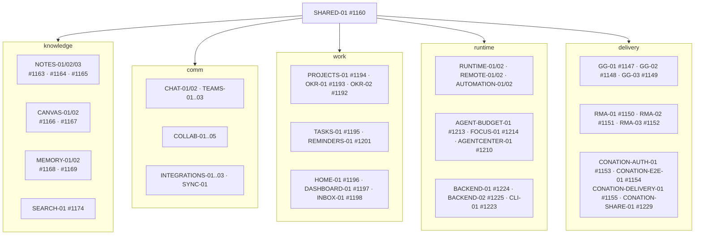
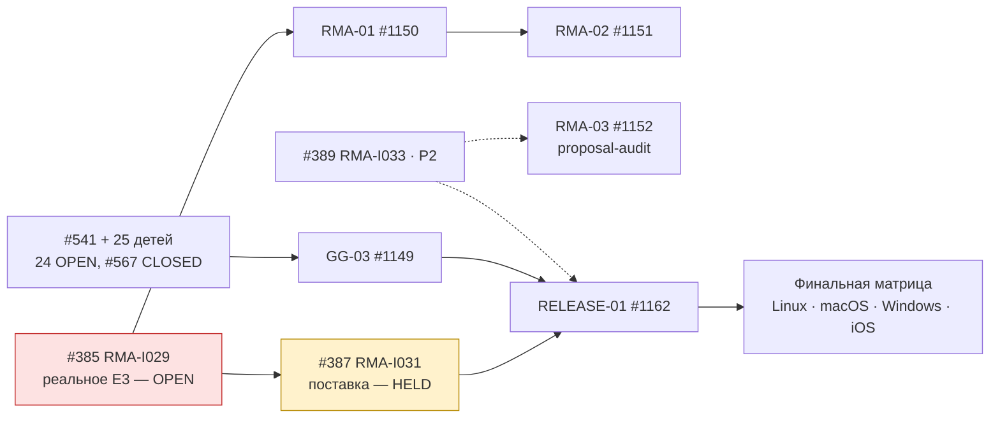
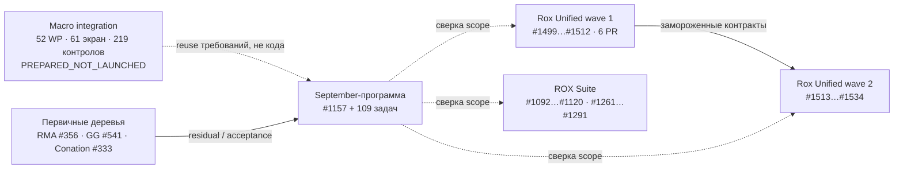

# Граф зависимостей программы

**Issue:** [#1157](https://github.com/rox-one/rox-one/issues/1157) · **наблюдение:** 2026-10-08T22:27:59Z · **источник рёбер:** `task-registry.json`
(109 задач, 464 рёбер, циклов — 0)

Все блоки ниже проверены парсером **mermaid@11** (см. §5); это отображение зарегистрированных
зависимостей, а не подтверждение исполнения.

## 1. Master-контур программы

```mermaid
flowchart LR
  ROOT["PROGRAM-01 #1157<br/>root, dependsOn = []"] --> RECON["RECON-01 #1158<br/>источники, dedup, активная работа"]
  RECON --> AUDIT["AUDIT-01 #1159<br/>фактический аудит экранов"]
  AUDIT --> DATA["DATA-01 #1212<br/>контракт сущности и синхронизации"]
  RECON --> DATA
  DATA --> SHARED["SHARED-01 #1160<br/>заморозка общих корней<br/>блокирует 103 задач"]
  SHARED --> DOMAINS["Доменные потоки<br/>knowledge · comm · work · runtime · delivery"]
  DOMAINS --> INTEGRATE["INTEGRATE-01 #1161<br/>последовательная интеграция"]
  INTEGRATE --> RELEASE["RELEASE-01 #1162<br/>финальная матрица, DoD не сужается"]
  classDef root fill:#dbeafe,stroke:#2b6cb0,stroke-width:2px
  classDef gate fill:#fff2cc,stroke:#b58900,stroke-width:2px
  class ROOT root
  class SHARED,DATA,RELEASE gate
```

## 2. Доменные контуры

## 3. Внешние цепочки блокировок

## 4. Кросс-программные связи (связаны, не дублируются)

## 5. Проверка графов

| Проверка | Результат |
|---|---|
| Все блоки `mermaid` распарсены `mermaid@11.17.2` | PASS (см. отчёт коммита) |
| Циклы в реестре задач | 0 |
| Дубликаты ID | нет |
| `PROGRAM-01` dependsOn | `[]` |
| Зависит от `SHARED-01` | 103 задач |
| Зависит от `DATA-01` | 77 задач |
| Зависит от `RELEASE-01` | 0 (цикл невозможен) |

