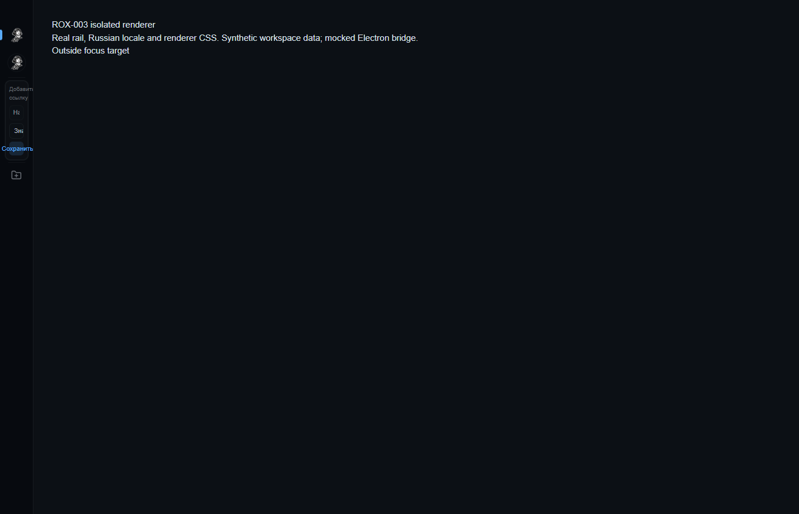
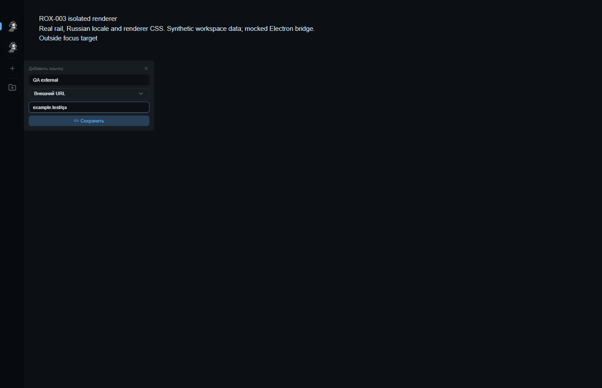

# ROX-003 — workspace rail Add link

These screenshots contain **synthetic test data only**. They were generated in an
isolated Chromium context using the real current-main rail component, renderer
CSS, Russian translations and `@rox/ui` tooltip/select modules. The Electron
bridge is mocked; URL opening is captured rather than launched. No installed ROX
profile, real workspace, user chat title or user configuration is used.

## Before and after

- Baseline: frozen main `3342fad30166bdf005d296e0d5fe24d36d4df5fb`.
- Fix: merge the published ROX-003 commit `e004a44bd` onto that main revision,
  preserving the migrated `@rox/ui` namespace.
- Viewport: **1386 × 893**. Additional browser checks run at **800 × 600**.
- Before: the input inherits **25px** width inside the **58px** clipping rail.
- After: the form is portaled outside the rail, and its inputs are **277.5px** wide.

## Verification

The fixture clicks the actual plus trigger. It checks label/URL validation,
knowledge/notes/external creation, trimmed values, workspace-scoped storage,
reload persistence, retained drafts after cancel, Enter save, keyboard kind
selection, nested Escape/outside dismissal and focus restoration.

The browser harness and full-resolution 800px evidence are retained at
`C:/Users/user/AppData/Local/Temp/opencode/qa-rail-evidence/`. Run its
`check.mjs before` and `check.mjs after` with Node from the assigned worktree.
The harness reads the baseline component from Git in-memory and renders the
merged production component directly; it does not swap or revert source files.
