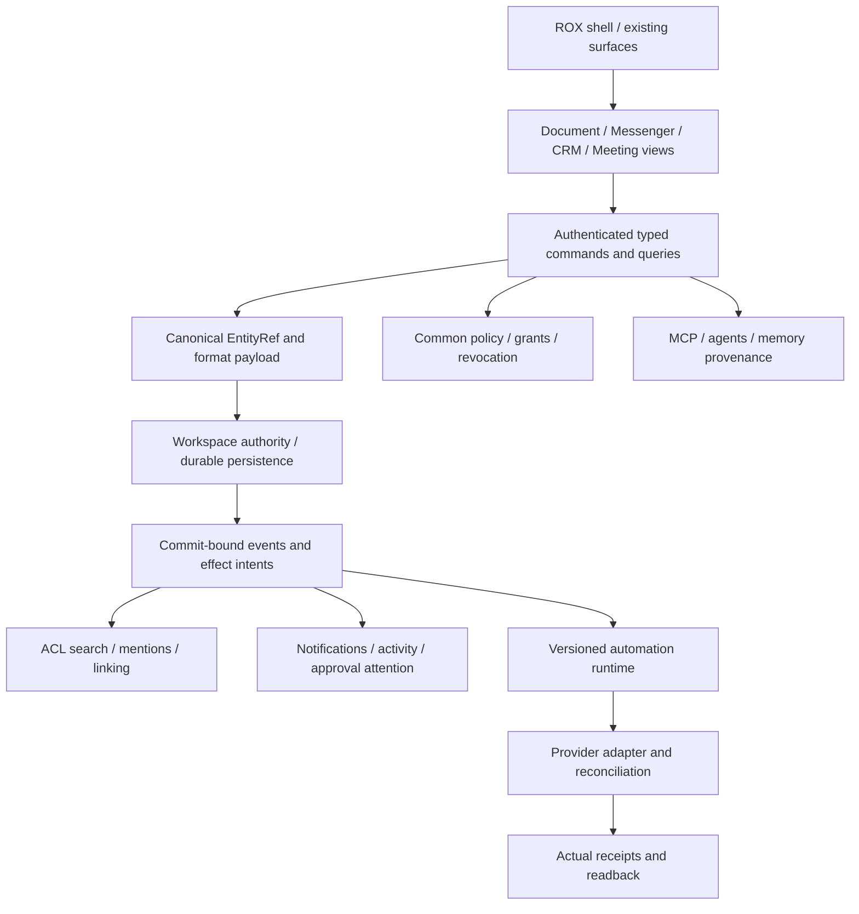

# ROX Suite — PRD новых требований из screenshots

Revision 1, 2026-09-30. Implementation requirements, не работающий продукт. Source ROX: `249b3b44220bcfbd7d467de9cfc18f76e1c37807`; screenshot binary SHA неизвестен. Все 30 задач — отдельные новые GitHub issues, индекс и readback receipts в README/publication.json.

## 1. Размещение внутри ROX ONE

| Предложение | Где открывается | Что происходит |
|---|---|---|
| Спокойный focus | Главная → Трекер задач | Контрол сохраняет размер, ввод, Enter и task store; focus показан фоном и inset accent, keyboard/high-contrast доступность проверяется отдельно |
| Messenger | Новый human aggregator внутри текущего shell | Список Channel/DM/group из общего Message domain; Project Channels открывают те же refs. Sessions остаются agent sessions |
| Contacts | Messenger → Contacts; CRM → Contacts | Один directory/query поверх Principal/CRMContact с verified identity binding, не отдельная база людей |
| Meetings | Существующий destination Встречи | Actions, history, selected detail drawer, schedule/availability, join/preflight, local recording и archive |
| Drive / Docs library | Расширенный существующий Pages/library entry + Notes crosslinks | New/Upload/Templates, Recent/Owned/Shared/Favorites, pins/tree, table/grid; одна библиотека canonical resources |
| Docs / Sheets / Slides | Drive → Create/template | Document representations; metadata/grants/links общие, содержимое формата имеет собственный payload/runtime |
| Wiki | Drive → Wiki | Spaces/hierarchy и views над теми же Docs; move меняет размещение/наследование прав, не копирует document |
| Base | Drive → Base; Project views | Typed CustomRecord + saved views, native Task/Company projections сохраняют исходные IDs |
| Forms | Drive → Forms; Base/Help Desk intake | Versioned builder + publication + submit-only scope + private responses + mapping workflow |
| MCP / Admin | Существующие Connections/Settings | Capabilities/scopes/availability/admin controls; advertised tool ещё не authorized effect |
| Help Desk | Workspace service entry + Inbox attention | Ticket/intake/triage/SLA/knowledge; task/discussion/agent общие |
| Approval | Process designer и существующий Inbox | Definition versions, request snapshot, route/quorum, explicit decision, effect intent и audit |
| Signature | Secure document detail + Inbox request | Safe viewer, immutable version/hash, signer identity/intent, provider receipt и verification evidence |
| Automations | Существующий Automations editor | Canvas → Connector mappings → durable runtime → Debug → Draft/Publish/tutorial; прежние linear matchers сохраняются |

Новые route builders/parser/view state потребуют согласованного registry update. Таблица задаёт target placement; существующая source route не объявляется совместимой с ещё не реализованным параметром. Не добавлять по top-level пункту для каждого file format: Create/type picker открывает representations в существующих panels/tabs.

## 2. Визуальные правила

1. Наследовать выбранную тему ROX, в том числе dark из screenshot1. Lark даёт hierarchy, pane structure и взаимодействия. React, текущие typography/tokens и native shell остаются базой.
2. Desktop compact controls 28–36 px; touch targets не меньше 44 px. Списки имеют мягкую selection tint; hover показывает действия без сдвига строки. Все hover actions доступны по focus/menu.
3. Keyboard focus виден, но не добавляет толстую внешнюю рамку input. High-contrast отдельно проверяется; запрещён глобальный `outline:none` без замены.
4. Help по hover/focus/click объясняет значение, источник, актуальность, пример и ограничения. Tooltip не заменяет label/error/instruction.
5. Drawer закрывается Esc и возвращает focus на trigger. Narrow layout открывает один pane с back-navigation. Недоступный backend показывается как unavailable, пустая подтверждённая выборка — как empty.
6. В примерах использовать синтетические данные. Пользовательские снимки с именами, IDs и сообщениями не загружать в публичный issue tracker.

## 3. Системные инварианты

One writer/revision/idempotency rule; mentions/links не расширяют права. Открыть notification ≠approve; approval ≠подписать документ; accepted provider effect ≠delivery/verified signature. CRDT используется для совместного содержания, CAS для metadata/schema/layout. External provider effect не включается в фиктивную distributed DB transaction.

Normative identity: Docs/Sheets/Slides/Forms используют существующий `kind=page`, versioned `contentKind` и стабильные Page IDs/slug/aliases. `Document` обозначает интерфейс содержимого, не ещё один global entity kind. Existing PageKind/CSP описывает runtime capabilities отдельно. Wiki — hierarchy над Page refs, не body store. Base CustomRecord и FormResponse получают явные registry/schema contracts; нельзя создавать их скрытыми незащищёнными таблицами.

Automations ordering: Draft/PublishedRevision, минимальный explicit publish и fenced legacy scheduler/writer cutover входят в RS-AUT-01. RS-AUT-03 потребляет этот foundation; RS-AUT-05 расширяет review/publish/tutorial UI. Draft save никогда не пишет active runtime config. Metadata-only historical decisions остаются неисполняемыми до versioned runtime migration.

Новый вид ресурса требует descriptor/registry/schema/query/command/policy/event/search/agent contributions. Child cells/slides/blocks не обязаны становиться глобальными entities. Format editors не создают отдельные пользователей, grants или notification engines.

## 4. Cloud execution

`plans/rox-suite/issues.json` — machine index новых задач, `publication.json` — verified GitHub receipt. В issue body имеются plans, target paths, input/output, tests, DoD. Старый `plans/macro-integration/cloud/manifest.json` содержит 52 Macro WPs; он не автоматически исполняет RS задачи.

Следующий coding executor обязан экспортировать RS packet с exact input SHA/spec digest, prerequisite receipts, owned files, assigned lanes и source/license boundaries. Один coordinator принимает proof fragments. Linux renderer fixture не подтверждает native capture/media/provider. До настоящего запуска статус **PREPARED_NOT_LAUNCHED**.

## 5. Expected results / DoD этого delivery

- 30 новых открытых GitHub issues с отдельными observable сценариями.
- У каждого — exact screen/purpose/layout/inputs/outputs/interactions/state, source paths и symbols, domain mechanism и permissions, targeted tests/acceptance и risks.
- Dependencies указывают реальные issue URLs; существующие broad issues сохранены и связаны.
- Локальные published bodies равны remote bodies; hashes/IDs зафиксированы.
- Документы/JSON/scripts доставлены в docs branch. Product source и пользовательские посторонние правки сохранены.

Рабочие редакторы, LiveKit rooms, cryptographic signing и cloud workers не считаются реализованными этим пакетом требований. Их завершение проверяется по DoD соответствующих issues.
