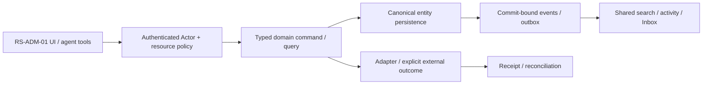

# RS-ADM-01: Organization и capability Admin Hub в существующих Settings

## Цель и граница

Одна административная точка показывает реальное состояние organization, memberships, capabilities и policy, а настройки продуктов открываются через existing destinations.

Статус: implementation issue, **PROPOSED_NOT_IMPLEMENTED**. Screenshot reference не является доказательством текущего backend. Screenshots6/7 визуально просмотрены; используются только структура/interaction inspiration, без logos/assets/source-code copying и без лицензионного предположения. Во всех examples только synthetic data; private organization ID/имена из изображений не переносятся.

**Visual evidence:** Image6: org overview, member/department/admin metrics, shortcuts и Apps; Image7: grouped Product Settings menu. Копировать только information hierarchy; billing/usage не выдавать за работающий ROX backend.

**Dependency IDs:** нет service prerequisites; foundation gates ниже.
**Related service issues:** RS-MCP-01.
**Architecture prerequisites:** WP-01/02/03/04/06/07/36/46; shared org authority before membership management.

## Проверенный текущий ROX

- [apps/electron/src/shared/settings-registry.ts#L1–L34](https://github.com/rox-one/rox-one/blob/249b3b44220bcfbd7d467de9cfc18f76e1c37807/apps/electron/src/shared/settings-registry.ts#L1-L34) — `SettingsPageDefinition / SETTINGS_PAGES registry contract`, repository `rox-one/rox-one`, SHA `249b3b44220bcfbd7d467de9cfc18f76e1c37807`: Canonical settings registration seam.
- [apps/electron/src/renderer/pages/settings/settings-pages.ts#L18–L42](https://github.com/rox-one/rox-one/blob/249b3b44220bcfbd7d467de9cfc18f76e1c37807/apps/electron/src/renderer/pages/settings/settings-pages.ts#L18-L42) — `lazy settings components`, repository `rox-one/rox-one`, SHA `249b3b44220bcfbd7d467de9cfc18f76e1c37807`: Existing Organizations/Permissions/Connections-related settings composition.
- [apps/electron/src/renderer/pages/settings/OrganizationsSettingsPage.tsx#L50–L130](https://github.com/rox-one/rox-one/blob/249b3b44220bcfbd7d467de9cfc18f76e1c37807/apps/electron/src/renderer/pages/settings/OrganizationsSettingsPage.tsx#L50-L130) — `OrganizationsSettingsPage / handleCreate`, repository `rox-one/rox-one`, SHA `249b3b44220bcfbd7d467de9cfc18f76e1c37807`: Existing organization selector/create/team-space UI.
- [packages/server-core/src/handlers/rpc/orgs.ts#L51–L105](https://github.com/rox-one/rox-one/blob/249b3b44220bcfbd7d467de9cfc18f76e1c37807/packages/server-core/src/handlers/rpc/orgs.ts#L51-L105) — `registerOrgsHandlers`, repository `rox-one/rox-one`, SHA `249b3b44220bcfbd7d467de9cfc18f76e1c37807`: Org/membership/local identity RPC; invitations local token, accept still local.
- [apps/electron/src/renderer/pages/ConnectionsPage.tsx#L67–L174](https://github.com/rox-one/rox-one/blob/249b3b44220bcfbd7d467de9cfc18f76e1c37807/apps/electron/src/renderer/pages/ConnectionsPage.tsx#L67-L174) — `ConnectionsPage`, repository `rox-one/rox-one`, SHA `249b3b44220bcfbd7d467de9cfc18f76e1c37807`: Services/credentials/import/policies/audit bridges are existing surfaces.

Org UI и local RPC существуют; remote multi-user admin enforcement/mailer/department analytics не доказаны текущим кодом. Server URL branch не превращает local invite в remote membership. Admin hub сначала расширяет source-backed org model и требует authenticated authority.

Все ссылки immutable; поведение проверено чтением source, не live deployment. Путь, отмеченный NEW ниже, отсутствует как готовая feature и не должен считаться implemented из-за наличия entry/component.

## Экран, routing и layout

Settings → Organizations → «Обзор / Участники / Возможности / Audit». Существующие Connections и Sources открываются contextual links. NEW settings admin subview регистрируется через canonical settings-registry, без второго Suite Admin shell.

Header organization selector+authorized search+help; local settings navigation; центр organization facts/metrics with source/asOf+shortcuts; правая capabilities list/configure. Metrics hidden if no authorized aggregation. Narrow single-column sections; charts lazy, accessible table alternative.

UI расширяет текущую React shell/settings/panels. Typography, theme и semantic tokens наследуются из ROX selected preferences; Lark layout не вводит второй UI framework/skin. Русские labels; знакомые native controls; no global font reset. At390px /200% zoom доступен один main drilldown и sheets; horizontal scroll допустим внутри table/PDF, не всего shell. Reduced motion выключает spatial transitions; stable keys сохраняют selection/scroll.

## Inputs → outputs и control contracts

| Control | Input | Output / command result | Click / keyboard | Help meaning / permission |
|---|---|---|---|---|
| Organization selector | `orgRef` | authorized summary/nav scope | Arrows/Enter; restore focus | Workspace и organization различаются; смена org очищает incompatible selection. |
| Members / roles | `principalRef,role,expectedRevision` | preview membership delta→receipt | Enter detail; Space checkbox; explicit Apply | Owner/admin/member значение и inherited capability; last owner lock server-side. |
| Capabilities Configure | `capabilityRef` | same Connections detail route | Enter/Shift+Enter panel | Статус available/degraded/not_configured по source evidence, не fictional enabled flag. |
| Metrics | `range/timezone/asOf` | aggregate+denominator definition | Tab tooltip; click data table | Active rate = authorized active principals / eligible members; missing telemetry ≠ zero. |
| Product menu | `capability category/id` | native destination/subview | Roving arrows/Home/End/Esc | Help Desk/Approval/Docs только при capability availability; unavailable reason видим. |
| Audit export | `range/filter` | bounded authorized redacted export receipt | Enter preview→Export | Who/what/when/from/to; excludes secrets/private rows; export permission отдельная. |

**Hover/focus/click help:** каждый non-obvious control показывает краткую definition на hover после500ms и keyboard focus; focus ring видим. Соседняя кнопка «Что это?» открывает подробный popover: meaning, units/formula либо «не применяется», source, freshness/asOf, synthetic example, role/policy и disabled reason. Tooltip не заменяет обязательные instructions. Escape закрывает popup и возвращает focus к trigger; Tab/ShiftTab проходят controls, roving arrows только внутри tablist/menu. Click help не вызывает основной mutation.

**Input preservation:** textarea/form drafts сохраняются при failed query, permission conflict, provider timeout и navigation; не ставить success toast до command receipt. Sensitive draft retention ограничен workspace/purpose и current grants; offline запрещённая mutation показывает reason, а queued разрешённая mutation проходит current policy при replay.

## Domain, persistence и архитектура

**Entities:** Organization, Workspace, Principal, Membership, DepartmentRef(optional NEW), CapabilityAvailability, PolicyRevision, AuditEvent. Existing local identities migrate alias→canonical principal; no parallel admin-user table.

**API / commands / queries (NEW target):** NEW admin.organizationSummary(orgRef,range)→facts/asOf/availability; membership.changeRole/invite/revoke with authenticated actor/commandId/expectedRevision; admin.capabilityAvailability and audit.query/export. Existing org RPC routes adapter to shared authority; local mode explicitly separate.

**DB / migrations:** Reuse/migrate organization/membership authority; NEW organization_capability_policy with policy revision; audit projections sourced existing domain events. Department hierarchy optional data slice, not screenshot-implied implemented graph. Email invites require durable token hash/expiry/recipient binding + mail adapter; local tokens remain labelled local.

**Events (NEW names, не claims existing dispatcher):** NEW membership.changed/invite.created/redeemed/revoked; organization.policy_changed/capability_availability_changed; audit.export_requested/completed. Membership revoke invalidates open grants/search/agent caches through policyEpoch.

Не переносить экран без model/persistence/API. Common EntityRef/link/mention/grant/attachment/message/event/search/notification primitives используются всеми representations; external effect не включается в фиктивную distributed DB transaction. Provenance/revision/idempotencyKey обязательны; service/provider-specific constraints headless behind adapters.

## Permissions, sharing и agent access

org.read/admin/member.manage/capability.manage/audit.export on same gateway. Last owner and self-removal guards; invalid cross-org IDs reject. Global settings preference не org entitlement. No personal host secrets or credentials in hub metrics.

Authorized admin search maps settings/features/principals; notifications existing Inbox action sources, not new engine. Agent may explain/read allowed policy and propose preview; role grant executes same guarded command. Metrics include freshness/source and absent-data states.

Read query, human command, background job, IPC/RPC и MCP проходят одинаковый gateway. Capability-advertisement, client disabled button, role label и notification read не являются authorization. Cross-entity link не расширяет grant. Revoke во время открытого экрана и replay после reconnect повторно проверяет current policy; denied title/count/body не попадают в projections, push или agent memory.

## Реализационные paths и ownership

**EXTEND существующие файлы** (точный scope уточняется owner после чтения):
- `apps/electron/src/shared/settings-registry.ts`
- `apps/electron/src/renderer/pages/settings/settings-pages.ts`
- `apps/electron/src/renderer/pages/settings/OrganizationsSettingsPage.tsx`
- `packages/server-core/src/handlers/rpc/orgs.ts`
- `apps/electron/src/renderer/pages/ConnectionsPage.tsx`

**NEW предлагаемые файлы** — это target paths, не source evidence:
- `apps/electron/src/renderer/pages/settings/OrganizationAdminHub.tsx` — NEW
- `packages/shared/src/workspace-domain/admin/contracts.ts` — NEW
- `apps/workspace-service/src/modules/admin/queries.ts` — NEW
- `apps/workspace-service/src/modules/admin/membership-commands.ts` — NEW
- `apps/workspace-service/migrations/admin-capabilities.sql` — NEW
- `tests/rox-suite/admin-hub.spec.ts` — NEW

Typed route builder/parser/navigation state, IPC/preload или authenticated generated API client расширяются согласованно. Shared registry/contracts/migrations/transport/lockfile/i18n имеют одного owner; overlapping edits сериализуются. Source UI assets Lark не копировать. NEW workspace service module потребляет существующие Revision2 authority contracts; foundation implementation не входит в этот issue повторно.

## States, failure и observability

Доменные states: **local_only / shared_authenticated / unavailable_metrics / loading / forbidden / membership_conflict / policy_pending / audit_export_pending**.

Общие states: loading, genuine empty, filtered_empty, forbidden, unsupported, degraded, stale_revision, retryable_error, conflict, offline_cached/queued (только если capability разрешает), cancelled и unknown. Missing backend/provider/telemetry отличается от empty/zero/verified. Outcome local_durable/provider_accepted/readback — отдельный domain result; canonical Rox2Status executionMode/lifecycle/verification не получает новых придуманных enum значений.

Correlate workspace/entity/command/receipt/event/policy revision без secret/body в logs; metrics command latency/retries/denied/reconcile и projected lag с denominator/source. Failure сохраняет actionable code и recovery, не неограниченный auto retry. Документировать on-call reconciliation и stale permission/search/cache cleanup.

## Tests и independently verifiable acceptance

1. Local/native identity path labelled local; authenticated shared org summary reads actual server.
2. Admin changes role→reload→same principal identity across Tasks/Chat/CRM; other org denied.
3. Last owner cannot revoke own final owner grant; stale role revision conflict preserves draft.
4. Metrics missing telemetry unknown, zero only actual sample; hidden memberships don't leak counts.
5. Seed renderer-only admin guard/server Actor supplied request must fail denied API/MCP path.

**Пользовательский acceptance scenario:** Org administrator navigates hub→members→capability detail→policy change→audit; user loses role while hub open→write blocked/query redacted. Existing Settings/Connections retained and route history/back works.

Каждый сценарий проверяет inputs/actions → actual persisted/reloaded output, API/tool equivalent, permission denied path и соседний existing flow. Baseline failures отделены от environment failures; seeded mutant должен падать intended assertion при green baseline. Не считать planning schema validator E2E feature proof.

## Definition of Done

- [ ] UI и typed routes/history/contextual deep links работают в существующем ROX.
- [ ] Entity model, persistence/migration aliases, queries/commands/receipts и required background processing реализованы.
- [ ] Source/entity links и mentions используют общие IDs; source audience не расширяется автоматически.
- [ ] Shared authorization/sharing/revoke покрывают UI/API/MCP/jobs/offline replay.
- [ ] Search/notification/activity/agent/memory projections сохраняют policy и provenance; dedup/retraction проверены.
- [ ] Required realtime/reconnect/persistence concurrency сценарии из tests пройдены; unavailable capability честно disabled.
- [ ] Hover/focus/click help, keyboard, loading/empty/error/offline, narrow390px, zoom200%, reduced-motion verified.
- [ ] Linux domain/renderer lane; source-pinned macOS native для IPC/font/device; provider-live где actual adapter действует. Pending required lane оставляет feature incomplete.
- [ ] Screenshots/ARIA и logs/hash/expected-observed предоставлены с synthetic data и exact tested commit.
- [ ] Independent review, meaningful negative controls, runbook, source licensing/dependencies и user docs готовы.
- [ ] GitHub completion связывает implementation commit/PR и доказательства, а не только rendered screen.

## Complexity и риски

L, identity/membership+read hub then write/audit slices. Риски: local identity masquerading remote, cross-org data, privilege lockout, analytics denominators.

Декомпозиция обязательна на vertical slices, каждый заканчивается working scenario с permissions/search/agents. Крупная surface остаётся открыта до всех её gates; issue не закрывать по одному mock screen.
