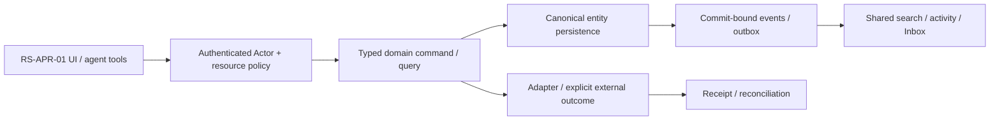

# RS-APR-01: Approval designer: versioned forms, routes и decision policy

## Цель и граница

Workspace admin создаёт versioned approval process с typed form, маршрутом principals/roles и preview; published instance фиксирует definition version и не меняется из-за последующих edits.

Статус: implementation issue, **PROPOSED_NOT_IMPLEMENTED**. Screenshot reference не является доказательством текущего backend. Screenshots6/7 визуально просмотрены; используются только структура/interaction inspiration, без logos/assets/source-code copying и без лицензионного предположения. Во всех examples только synthetic data; private organization ID/имена из изображений не переносятся.

**Visual evidence:** Image7 содержит Lark Approval product entry; route designer не показан. Ниже proposed ROX workflow, только cross-product hierarchy inspired by screenshot.

**Dependency IDs:** RS-ADM-01.
**Related service issues:** RS-APR-02, RS-MCP-01.
**Architecture prerequisites:** WP-01/02/03/04/06/07/36; bounded DSL and immutable version evidence before running instances.

## Проверенный текущий ROX

- [apps/electron/src/shared/settings-registry.ts#L1–L34](https://github.com/rox-one/rox-one/blob/249b3b44220bcfbd7d467de9cfc18f76e1c37807/apps/electron/src/shared/settings-registry.ts#L1-L34) — `SettingsPageDefinition registry`, repository `rox-one/rox-one`, SHA `249b3b44220bcfbd7d467de9cfc18f76e1c37807`: Typed native settings extension point.
- [apps/electron/src/renderer/components/app-shell/input/structured/PermissionRequest.tsx#L19–L45](https://github.com/rox-one/rox-one/blob/249b3b44220bcfbd7d467de9cfc18f76e1c37807/apps/electron/src/renderer/components/app-shell/input/structured/PermissionRequest.tsx#L19-L45) — `PermissionRequest`, repository `rox-one/rox-one`, SHA `249b3b44220bcfbd7d467de9cfc18f76e1c37807`: Existing tool Allow/AlwaysAllow/Deny execution prompt; business approvals distinct semantics.
- [apps/electron/src/renderer/components/app-shell/input/structured/AdminApprovalRequest.tsx#L20–L63](https://github.com/rox-one/rox-one/blob/249b3b44220bcfbd7d467de9cfc18f76e1c37807/apps/electron/src/renderer/components/app-shell/input/structured/AdminApprovalRequest.tsx#L20-L63) — `AdminApprovalRequest`, repository `rox-one/rox-one`, SHA `249b3b44220bcfbd7d467de9cfc18f76e1c37807`: Existing Mac admin install approval UI; not workflow routes.
- [packages/core/src/rox2/platform-contract.ts#L233–L239](https://github.com/rox-one/rox-one/blob/249b3b44220bcfbd7d467de9cfc18f76e1c37807/packages/core/src/rox2/platform-contract.ts#L233-L239) — `Rox2EntityRef`, repository `rox-one/rox-one`, SHA `249b3b44220bcfbd7d467de9cfc18f76e1c37807`: Unified resource reference reused; new process/instance kinds need registry extension.

Текущие execution permission/Admin install prompts не являются business approval process. NEW workflow model интегрируется с shared authorization/commands/events, сохраняет отдельную семантику решения и выполнения effect.

Все ссылки immutable; поведение проверено чтением source, не live deployment. Путь, отмеченный NEW ниже, отсутствует как готовая feature и не должен считаться implemented из-за наличия entry/component.

## Экран, routing и layout

Admin hub → «Approvals / Процессы»; NEW native settings subview approved process catalogue/designer. Contextual Page/Ticket/Task→request uses published template. No duplicate existing tool permission settings.

Catalogue table draft/published/retired; designer top name/version/status, left form field palette, centre linear/branch route with accessible outline, right node policy/preview; bottom simulator recipients and effects. Compact React existing tokens; narrow outline editor instead of inaccessible drag-only canvas.

UI расширяет текущую React shell/settings/panels. Typography, theme и semantic tokens наследуются из ROX selected preferences; Lark layout не вводит второй UI framework/skin. Русские labels; знакомые native controls; no global font reset. At390px /200% zoom доступен один main drilldown и sheets; horizontal scroll допустим внутри table/PDF, не всего shell. Reduced motion выключает spatial transitions; stable keys сохраняют selection/scroll.

## Inputs → outputs и control contracts

| Control | Input | Output / command result | Click / keyboard | Help meaning / permission |
|---|---|---|---|---|
| Form fields | `typed field schema/validation/visibility` | validated draft version | Tab editor; add/remove keyboard; Esc draft | Required fields visible; secret credential values forbidden; default no hidden derived private text. |
| Route node | `principal/group role/sequence/quorum/condition` | node preview/invariant errors | Arrows outline; AltUp/Down reorder; Enter settings | Any/all quorum, self-approval, delegation, fallback and timeout meaning explicit. |
| Condition | `bounded typed expression+field refs` | simulator path/reasons | Enter evaluate; no arbitrary JS | Deterministic restricted DSL, no network/time dependence without explicit input. |
| Preview recipients | `synthetic request/actor/target refs` | route+recipient/effect/audience summary | Enter Preview; focus inspector | Admin role not auto-approver; resolved principal scope/effective permissions shown. |
| Publish | `draftId/expectedRevision/versionHash` | immutable definition revision receipt | Explicit Publish; conflict retains draft | Instances pin version; material edit requires new version not silently retarget. |
| Retire / clone | `definitionRef/version` | retired future starts / new draft | Enter summary confirm; Escape | Retiring doesn't cancel active instances; migration explicit audited action. |

**Hover/focus/click help:** каждый non-obvious control показывает краткую definition на hover после500ms и keyboard focus; focus ring видим. Соседняя кнопка «Что это?» открывает подробный popover: meaning, units/formula либо «не применяется», source, freshness/asOf, synthetic example, role/policy и disabled reason. Tooltip не заменяет обязательные instructions. Escape закрывает popup и возвращает focus к trigger; Tab/ShiftTab проходят controls, roving arrows только внутри tablist/menu. Click help не вызывает основной mutation.

**Input preservation:** textarea/form drafts сохраняются при failed query, permission conflict, provider timeout и navigation; не ставить success toast до command receipt. Sensitive draft retention ограничен workspace/purpose и current grants; offline запрещённая mutation показывает reason, а queued разрешённая mutation проходит current policy при replay.

## Domain, persistence и архитектура

**Entities:** NEW ApprovalDefinition, DefinitionVersion, FieldSchema, RouteNode, ApprovalInstanceRef, PolicyBinding and EntityLink. Principal/Group refs existing canonical identity; Process access not independent Permission table; decision policy consumes common grants.

**API / commands / queries (NEW target):** NEW approvals.definitionList/read/createDraft/updateDraft/validate/simulate/publish/retire/clone. Publish input definitionRef/baseRevision/schemaHash/routeHash/commandId; actor transport. Simulation outputs recipient plan and rule reasons with policyRevision; cannot dispatch effects.

**DB / migrations:** NEW approval_definitions + immutable approval_definition_versions(formSchema,routeDsl,decisionPolicy,hash,publishedBy,revision), process aliases. Unique(definitionId,version), published immutable; instance references version FK. Outbox publish events same transaction; no external provider transaction in DB.

**Events (NEW names, не claims existing dispatcher):** NEW approval.definition_draft_changed/published/retired. Policy change invalidates previews via policyEpoch; publish event updates authorized catalogue/agent tool schema/index.

Не переносить экран без model/persistence/API. Common EntityRef/link/mention/grant/attachment/message/event/search/notification primitives используются всеми representations; external effect не включается в фиктивную distributed DB transaction. Provenance/revision/idempotencyKey обязательны; service/provider-specific constraints headless behind adapters.

## Permissions, sharing и agent access

definition.read/manage/publish delegated scope; source audience/target actions stay common resource checks. Prevent unavailable approver, cross-org ID, empty quorum, cycles/unbounded loops, unintended self-approval; server validator guards direct API/MCP, not only diagram UI.

Catalogue search/mentions/agent-readable versioned process. Notifications only actionable invalid route/review; activity immutable published version. Agent may read/simulate/propose draft, publish only permitted command policy; no autonomous route deployment from explanation.

Read query, human command, background job, IPC/RPC и MCP проходят одинаковый gateway. Capability-advertisement, client disabled button, role label и notification read не являются authorization. Cross-entity link не расширяет grant. Revoke во время открытого экрана и replay после reconnect повторно проверяет current policy; denied title/count/body не попадают в projections, push или agent memory.

## Реализационные paths и ownership

**EXTEND существующие файлы** (точный scope уточняется owner после чтения):
- `apps/electron/src/shared/settings-registry.ts`
- `apps/electron/src/renderer/pages/settings/settings-pages.ts`
- `apps/electron/src/renderer/components/app-shell/input/structured/PermissionRequest.tsx`
- `packages/core/src/rox2/platform-contract.ts`

**NEW предлагаемые файлы** — это target paths, не source evidence:
- `apps/electron/src/renderer/pages/settings/ApprovalDesignerPage.tsx` — NEW
- `packages/shared/src/workspace-domain/approvals/contracts.ts` — NEW
- `apps/workspace-service/src/modules/approvals/definition-validator.ts` — NEW
- `apps/workspace-service/src/modules/approvals/definition-commands.ts` — NEW
- `apps/workspace-service/migrations/approval-definitions.sql` — NEW
- `tests/rox-suite/approval-designer.spec.ts` — NEW

Typed route builder/parser/navigation state, IPC/preload или authenticated generated API client расширяются согласованно. Shared registry/contracts/migrations/transport/lockfile/i18n имеют одного owner; overlapping edits сериализуются. Source UI assets Lark не копировать. NEW workspace service module потребляет существующие Revision2 authority contracts; foundation implementation не входит в этот issue повторно.

## States, failure и observability

Доменные states: **draft / invalid / simulated / publish_pending / published / retired**.

Общие states: loading, genuine empty, filtered_empty, forbidden, unsupported, degraded, stale_revision, retryable_error, conflict, offline_cached/queued (только если capability разрешает), cancelled и unknown. Missing backend/provider/telemetry отличается от empty/zero/verified. Outcome local_durable/provider_accepted/readback — отдельный domain result; canonical Rox2Status executionMode/lifecycle/verification не получает новых придуманных enum значений.

Correlate workspace/entity/command/receipt/event/policy revision без secret/body в logs; metrics command latency/retries/denied/reconcile и projected lag с denominator/source. Failure сохраняет actionable code и recovery, не неограниченный auto retry. Документировать on-call reconciliation и stale permission/search/cache cleanup.

## Tests и independently verifiable acceptance

1. Keyboard creates form and any/all route, publishes, reload reads same hashes/version.
2. Restricted expression types, cyclic/unbounded routes, missing principal/quorum fail server validation.
3. Instance onv1 remains v1 after publishv2; retirev1 blocks newstart but existing continues.
4. Admin denied process manage directAPI/tool cannot publish; actor spoof rejected.
5. Simulate causes no instance/decision/effect/outbox mutation.
6. Seed published row mutable or renderer-only route validation must fail.

**Пользовательский acceptance scenario:** Admin designs expense-like synthetic process, validates typed fields and recipients, publishesv1→creates request throughRS-APR-02; v2 edits leave existing instance unchanged; route and policy reasons inspectable.

Каждый сценарий проверяет inputs/actions → actual persisted/reloaded output, API/tool equivalent, permission denied path и соседний existing flow. Baseline failures отделены от environment failures; seeded mutant должен падать intended assertion при green baseline. Не считать planning schema validator E2E feature proof.

## Definition of Done

- [ ] UI и typed routes/history/contextual deep links работают в существующем ROX.
- [ ] Entity model, persistence/migration aliases, queries/commands/receipts и required background processing реализованы.
- [ ] Source/entity links и mentions используют общие IDs; source audience не расширяется автоматически.
- [ ] Shared authorization/sharing/revoke покрывают UI/API/MCP/jobs/offline replay.
- [ ] Search/notification/activity/agent/memory projections сохраняют policy и provenance; dedup/retraction проверены.
- [ ] Required realtime/reconnect/persistence concurrency сценарии из tests пройдены; unavailable capability честно disabled.
- [ ] Hover/focus/click help, keyboard, loading/empty/error/offline, narrow390px, zoom200%, reduced-motion verified.
- [ ] Linux domain/renderer lane; source-pinned macOS native для IPC/font/device; provider-live где actual adapter действует. Pending required lane оставляет feature incomplete.
- [ ] Screenshots/ARIA и logs/hash/expected-observed предоставлены с synthetic data и exact tested commit.
- [ ] Independent review, meaningful negative controls, runbook, source licensing/dependencies и user docs готовы.
- [ ] GitHub completion связывает implementation commit/PR и доказательства, а не только rendered screen.

## Complexity и риски

XL, schema/DSL validation→catalogue/formUI→versioned route designer/simulator. Риски: policy complexity, self-approval, stale recipients, inaccessible canvas.

Декомпозиция обязательна на vertical slices, каждый заканчивается working scenario с permissions/search/agents. Крупная surface остаётся открыта до всех её gates; issue не закрывать по одному mock screen.

## GitHub dependency links (нормативный handoff)

- Требуется [RS-ADM-01 — #1114](https://github.com/rox-one/rox-one/issues/1114)
- Связанная новая задача: [RS-APR-02 — #1118](https://github.com/rox-one/rox-one/issues/1118)
- Связанная новая задача: [RS-MCP-01 — #1113](https://github.com/rox-one/rox-one/issues/1113)

Specification ID: RS-APR-01. Снимок исходного ROX: 249b3b44220bcfbd7d467de9cfc18f76e1c37807. Эти ссылки задают зависимости, а не статус выполненной реализации.
