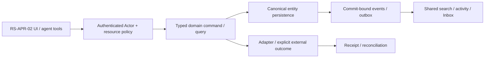

# RS-APR-02: Approval Inbox: решения, execution receipts и неизменяемый audit

## Цель и граница

Requester отправляет request, approver отдельно читает и принимает решение; completed decision запускает только разрешённый reviewed effect, а Inbox read никогда не approves.

Статус: implementation issue, **PROPOSED_NOT_IMPLEMENTED**. Screenshot reference не является доказательством текущего backend. Screenshots6/7 визуально просмотрены; используются только структура/interaction inspiration, без logos/assets/source-code copying и без лицензионного предположения. Во всех examples только synthetic data; private organization ID/имена из изображений не переносятся.

**Visual evidence:** Image7 Approval entry; request/decision screen не показан. Existing ROX Inbox/structured approval UI — source-backed seams; business workflow proposed.

**Dependency IDs:** RS-APR-01, RS-MCP-01.
**Related service issues:** RS-HD-01, RS-SIG-02.
**Architecture prerequisites:** WP-03/04/05/06/07/36/37/47/52; common provider effect journal and no automatic write bypass.

## Проверенный текущий ROX

- [apps/electron/src/renderer/pages/InboxPage.tsx#L91–L140](https://github.com/rox-one/rox-one/blob/249b3b44220bcfbd7d467de9cfc18f76e1c37807/apps/electron/src/renderer/pages/InboxPage.tsx#L91-L140) — `InboxPage / allItems`, repository `rox-one/rox-one`, SHA `249b3b44220bcfbd7d467de9cfc18f76e1c37807`: Current attention and mail preserve.
- [apps/electron/src/renderer/pages/InboxPage.tsx#L401–L428](https://github.com/rox-one/rox-one/blob/249b3b44220bcfbd7d467de9cfc18f76e1c37807/apps/electron/src/renderer/pages/InboxPage.tsx#L401-L428) — `InboxPage (memory/skill detail branches)`, repository `rox-one/rox-one`, SHA `249b3b44220bcfbd7d467de9cfc18f76e1c37807`: Current explicit action buttons; read/render separated from approve calls.
- [apps/electron/src/renderer/components/app-shell/input/structured/PermissionRequest.tsx#L28–L45](https://github.com/rox-one/rox-one/blob/249b3b44220bcfbd7d467de9cfc18f76e1c37807/apps/electron/src/renderer/components/app-shell/input/structured/PermissionRequest.tsx#L28-L45) — `handleAllow / handleDeny`, repository `rox-one/rox-one`, SHA `249b3b44220bcfbd7d467de9cfc18f76e1c37807`: Explicit callbacks for existing execution request.
- [apps/electron/src/shared/routes.ts#L174–L176](https://github.com/rox-one/rox-one/blob/249b3b44220bcfbd7d467de9cfc18f76e1c37807/apps/electron/src/shared/routes.ts#L174-L176) — `routes.view.inbox`, repository `rox-one/rox-one`, SHA `249b3b44220bcfbd7d467de9cfc18f76e1c37807`: Route/context reuse; new business instance builder proposed.

No shared versioned business instance/quorum/effect lifecycle proved by these callbacks. Notification unread/read state не decision/authorization. Business approve and provider execution each keep separate durable status/receipts.

Все ссылки immutable; поведение проверено чтением source, не live deployment. Путь, отмеченный NEW ниже, отсутствует как готовая feature и не должен считаться implemented из-за наличия entry/component.

## Экран, routing и layout

Existing Inbox → «Согласования / Мне / Мои / Завершённые» representations; detail same requestRef from Task/Page/Ticket/agent contextual link. NEW typed approval instance subview via existing routes/nav parser. Existing tool permissions/memory/skills stay distinct items.

Inbox list status/due/requester/process/version; detail form snapshot/source links/route timeline/current node; sticky action bar Approve/Reject/Return/Delegate with explicit reasons and effect preview; receipt/audit tab. Never accept checkbox merely because row selected or scrolled.

UI расширяет текущую React shell/settings/panels. Typography, theme и semantic tokens наследуются из ROX selected preferences; Lark layout не вводит второй UI framework/skin. Русские labels; знакомые native controls; no global font reset. At390px /200% zoom доступен один main drilldown и sheets; horizontal scroll допустим внутри table/PDF, не всего shell. Reduced motion выключает spatial transitions; stable keys сохраняют selection/scroll.

## Inputs → outputs и control contracts

| Control | Input | Output / command result | Click / keyboard | Help meaning / permission |
|---|---|---|---|---|
| Request submission | `definitionVersion/form/manual source refs/commandId` | instanceRef+currentNode+receipt | Cmd+Enter отправляет после review | Audience/source/export/route summary; private excerpts не подставляются в более широкую audience автоматически. |
| Read/open | `instanceRef` | authorized snapshot; attention mark read | Arrows/Enter; Escape back | Просмотр не approve, не grants tool, не dispatch external effect. |
| Approve/Reject/Return | `decision/reason/baseRevision/nodeVersion/previewHash` | decision receipt+next route state | Explicit button; reason accessible; no hidden hotkey approve | Decision actor from transport; form/effect/policy changes invalidate preview. |
| Delegate | `eligiblePrincipalRef/purpose/expiry` | delegation receipt/audit | Combobox/Enter; explicit Apply | Delegation not ACL grant; only policy permits, self-cycle/expired rejected. |
| Effect preview | `targetRef/action/arguments` | scope+audience+effect summary/digest | Enter открывает Preview; execution только после допустимого decision | Approval не обходит текущие resource/provider scopes; latest policy проверяется при dispatch. |
| Audit/receipt | `instanceRef/filter` | immutable events/effect outcome | Tab переключает timeline; Enter inspect; export проходит policy | Approved decision, queued/providerAccepted/readback/unknown различаются; duplicate callback deduplicated. |

**Hover/focus/click help:** каждый non-obvious control показывает краткую definition на hover после500ms и keyboard focus; focus ring видим. Соседняя кнопка «Что это?» открывает подробный popover: meaning, units/formula либо «не применяется», source, freshness/asOf, synthetic example, role/policy и disabled reason. Tooltip не заменяет обязательные instructions. Escape закрывает popup и возвращает focus к trigger; Tab/ShiftTab проходят controls, roving arrows только внутри tablist/menu. Click help не вызывает основной mutation.

**Input preservation:** textarea/form drafts сохраняются при failed query, permission conflict, provider timeout и navigation; не ставить success toast до command receipt. Sensitive draft retention ограничен workspace/purpose и current grants; offline запрещённая mutation показывает reason, а queued разрешённая mutation проходит current policy при replay.

## Domain, persistence и архитектура

**Entities:** ApprovalInstance(pinned version/form snapshot), Decision(node,actor,scope,signature/digest), RouteStep/quorum projection, Delegation, EffectIntent/Receipt, immutable AuditEvent. Common Notification read state separate; existing Principal/EntityRef and command authorization reused.

**API / commands / queries (NEW target):** NEW approvals.start/read/list/decide/delegate/cancel/previewEffect; effect.dispatch uses common Command gateway after eligible decision. decide input instance/node/formVersion/baseRevision/decision/reason/previewHash/commandId; response decisionReceipt/instanceRevision/routeState/effectState; no actor ID trusted inpayload.

**DB / migrations:** NEW approval_instances(versionRef,targetRef,formDigest,state,revision); decisions unique(instance,node,actor,decisionGeneration), delegations and effect_intents with idempotency key. Decision quorum advance+effect intent+outbox same transaction; providerdispatch async, callback receipt unique providerEventId; immutable history retains revocation/cancel/unknown outcomes.

**Events (NEW names, не claims existing dispatcher):** NEW approval.requested/decision_recorded/node_advanced/delegated/returned/cancelled; effect.queued/accepted/read-back/unknown/failed. mention/message/attention consumers common dedup; notification.read has zero approval side effect.

Не переносить экран без model/persistence/API. Common EntityRef/link/mention/grant/attachment/message/event/search/notification primitives используются всеми representations; external effect не включается в фиктивную distributed DB transaction. Provenance/revision/idempotencyKey обязательны; service/provider-specific constraints headless behind adapters.

## Permissions, sharing и agent access

Requester/approver/read ACL resolved route, no hidden self-approval/unauthorized delegation. Approver decision permission ≠target.write; both currentpolicy checks. Actor removal/revoke/open request stale cannotdecide. External side effects preview bound to payload/source/audience/policy digest and authority.

Unified Inbox notifications/action sources, searchable request and redacted form fields, activity audit; memory/agent context only authorizedrefs. Agent can explain/propose/start/read, eligible principal approval remains policy; no impersonated signature/auto-decision from read action.

Read query, human command, background job, IPC/RPC и MCP проходят одинаковый gateway. Capability-advertisement, client disabled button, role label и notification read не являются authorization. Cross-entity link не расширяет grant. Revoke во время открытого экрана и replay после reconnect повторно проверяет current policy; denied title/count/body не попадают в projections, push или agent memory.

## Реализационные paths и ownership

**EXTEND существующие файлы** (точный scope уточняется owner после чтения):
- `apps/electron/src/renderer/pages/InboxPage.tsx`
- `apps/electron/src/shared/routes.ts`
- `apps/electron/src/renderer/components/app-shell/input/structured/PermissionRequest.tsx`
- `packages/core/src/rox2/platform-contract.ts`

**NEW предлагаемые файлы** — это target paths, не source evidence:
- `apps/electron/src/renderer/components/approvals/ApprovalInstanceDetail.tsx` — NEW
- `apps/workspace-service/src/modules/approvals/instance-commands.ts` — NEW
- `apps/workspace-service/src/modules/approvals/effect-dispatch.ts` — NEW
- `apps/workspace-service/migrations/approval-instances.sql` — NEW
- `tests/rox-suite/approval-inbox.spec.ts` — NEW

Typed route builder/parser/navigation state, IPC/preload или authenticated generated API client расширяются согласованно. Shared registry/contracts/migrations/transport/lockfile/i18n имеют одного owner; overlapping edits сериализуются. Source UI assets Lark не копировать. NEW workspace service module потребляет существующие Revision2 authority contracts; foundation implementation не входит в этот issue повторно.

## States, failure и observability

Доменные states: **requested / awaiting_decision / approved / rejected / returned / cancelled; effect queued / accepted / readback / blocked / failed / unknown**.

Общие states: loading, genuine empty, filtered_empty, forbidden, unsupported, degraded, stale_revision, retryable_error, conflict, offline_cached/queued (только если capability разрешает), cancelled и unknown. Missing backend/provider/telemetry отличается от empty/zero/verified. Outcome local_durable/provider_accepted/readback — отдельный domain result; canonical Rox2Status executionMode/lifecycle/verification не получает новых придуманных enum значений.

Correlate workspace/entity/command/receipt/event/policy revision без secret/body в logs; metrics command latency/retries/denied/reconcile и projected lag с denominator/source. Failure сохраняет actionable code и recovery, не неограниченный auto retry. Документировать on-call reconciliation и stale permission/search/cache cleanup.

## Tests и independently verifiable acceptance

1. Open/read/snooze/done attention item создают ровно ноль decision/effect rows.
2. Два concurrent решения на границе quorum дают один advance/effect; retry после timeout с тем же commandId создаёт одно decision.
3. Изменение form/recipient/policy после preview отклоняет stale approval; role revoke блокирует решение уже открытого request.
4. Decision approved, но target write denied: effect становится blocked, интерфейс не показывает completed.
5. Out-of-order/duplicate provider callbacks и unknown send outcome проходят reconciliation без повторного external effect.
6. Seeded mutations read→approve wiring, actor spoof и decision→scope bypass должны падать на intended assertions при green baseline.

**Пользовательский acceptance scenario:** Requester отправляет pinned v1 → approver читает без effect → explicit decision → quorum → guarded dispatch → provider read-back или explicit failure → reload восстанавливает точный audit. Existing Inbox permission/credential/mail flows проходят regression.

Каждый сценарий проверяет inputs/actions → actual persisted/reloaded output, API/tool equivalent, permission denied path и соседний existing flow. Baseline failures отделены от environment failures; seeded mutant должен падать intended assertion при green baseline. Не считать planning schema validator E2E feature proof.

## Definition of Done

- [ ] UI и typed routes/history/contextual deep links работают в существующем ROX.
- [ ] Entity model, persistence/migration aliases, queries/commands/receipts и required background processing реализованы.
- [ ] Source/entity links и mentions используют общие IDs; source audience не расширяется автоматически.
- [ ] Shared authorization/sharing/revoke покрывают UI/API/MCP/jobs/offline replay.
- [ ] Search/notification/activity/agent/memory projections сохраняют policy и provenance; dedup/retraction проверены.
- [ ] Required realtime/reconnect/persistence concurrency сценарии из tests пройдены; unavailable capability честно disabled.
- [ ] Hover/focus/click help, keyboard, loading/empty/error/offline, narrow390px, zoom200%, reduced-motion verified.
- [ ] Linux domain/renderer lane; source-pinned macOS native для IPC/font/device; provider-live где actual adapter действует. Pending required lane оставляет feature incomplete.
- [ ] Screenshots/ARIA и logs/hash/expected-observed предоставлены с synthetic data и exact tested commit.
- [ ] Independent review, meaningful negative controls, runbook, source licensing/dependencies и user docs готовы.
- [ ] GitHub completion связывает implementation commit/PR и доказательства, а не только rendered screen.

## Complexity и риски

XL: instance/quorum, Inbox decision UI, durable effect reconciliation. Риски: distributed transaction, смешение read/approve, stale preview, mutation audit history.

Декомпозиция обязательна на vertical slices, каждый заканчивается working scenario с permissions/search/agents. Крупная surface остаётся открыта до всех её gates; issue не закрывать по одному mock screen.

## GitHub dependency links (нормативный handoff)

- Требуется [RS-APR-01 — #1117](https://github.com/rox-one/rox-one/issues/1117)
- Требуется [RS-MCP-01 — #1113](https://github.com/rox-one/rox-one/issues/1113)
- Связанная новая задача: [RS-HD-01 — #1115](https://github.com/rox-one/rox-one/issues/1115)
- Связанная новая задача: [RS-SIG-02 — #1120](https://github.com/rox-one/rox-one/issues/1120)

Specification ID: RS-APR-02. Снимок исходного ROX: 249b3b44220bcfbd7d467de9cfc18f76e1c37807. Эти ссылки задают зависимости, а не статус выполненной реализации.
