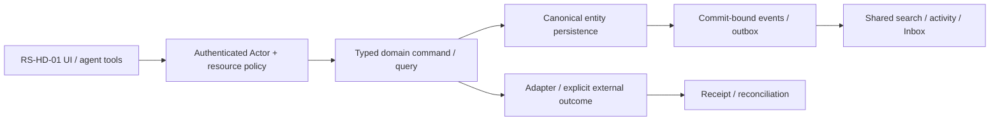

# RS-HD-01: Help Desk: tickets, очереди и idempotent intake

## Цель и граница

Workspace принимает обращения из формы, message или mail, сохраняет один Ticket с источником и обсуждением; requester и operator видят только свои разрешённые views.

Статус: implementation issue, **PROPOSED_NOT_IMPLEMENTED**. Screenshot reference не является доказательством текущего backend. Screenshots6/7 визуально просмотрены; используются только структура/interaction inspiration, без logos/assets/source-code copying и без лицензионного предположения. Во всех examples только synthetic data; private organization ID/имена из изображений не переносятся.

**Visual evidence:** Image7 показывает Help Desk product entry, но не ticket detail/backend. Queue/detail/intake ниже — proposed ROX behavior, не наблюдение Lark.

**Dependency IDs:** RS-ADM-01.
**Related service issues:** RS-HD-02, RS-MCP-01.
**Architecture prerequisites:** WP-01/02/03/04/05/06/07/08/09/11/17/18; native manual intake may precede mail adapter; live email slice requires dedicated tenant.

## Проверенный текущий ROX

- [apps/electron/src/renderer/components/app-shell/nav-destinations.ts#L51–L68](https://github.com/rox-one/rox-one/blob/249b3b44220bcfbd7d467de9cfc18f76e1c37807/apps/electron/src/renderer/components/app-shell/nav-destinations.ts#L51-L68) — `AppNavDestinationId`, repository `rox-one/rox-one`, SHA `249b3b44220bcfbd7d467de9cfc18f76e1c37807`: Help Desk destination требует явного registry extension.
- [apps/electron/src/renderer/pages/InboxPage.tsx#L91–L140](https://github.com/rox-one/rox-one/blob/249b3b44220bcfbd7d467de9cfc18f76e1c37807/apps/electron/src/renderer/pages/InboxPage.tsx#L91-L140) — `InboxPage / allItems`, repository `rox-one/rox-one`, SHA `249b3b44220bcfbd7d467de9cfc18f76e1c37807`: Existing attention + mail merge; не ticket engine.
- [apps/electron/src/shared/routes.ts#L174–L176](https://github.com/rox-one/rox-one/blob/249b3b44220bcfbd7d467de9cfc18f76e1c37807/apps/electron/src/shared/routes.ts#L174-L176) — `routes.view.inbox`, repository `rox-one/rox-one`, SHA `249b3b44220bcfbd7d467de9cfc18f76e1c37807`: Existing contextual inbox entry сохранить.
- [apps/electron/src/renderer/pages/extra-screens/dossier/DossierPage.tsx#L94–L173](https://github.com/rox-one/rox-one/blob/249b3b44220bcfbd7d467de9cfc18f76e1c37807/apps/electron/src/renderer/pages/extra-screens/dossier/DossierPage.tsx#L94-L173) — `DossierPage`, repository `rox-one/rox-one`, SHA `249b3b44220bcfbd7d467de9cfc18f76e1c37807`: Existing person/company precursor; Ticket links canonical Contact/Company, no second contacts table.

Current Inbox не является support ticket lifecycle; screenshot entry не доказывает shared requester queue. NEW Ticket нужен как canonical entity, без отдельной identity/comments/search/notification системы.

Все ссылки immutable; поведение проверено чтением source, не live deployment. Путь, отмеченный NEW ниже, отсутствует как готовая feature и не должен считаться implemented из-за наличия entry/component.

## Экран, routing и layout

NEW Help Desk capability открывается через Admin product menu/command search и contextual Message/Mail→«Создать обращение». Новый destination только после canonical nav registry decision; typed helpdesk/ticket/{id}/view, parser/history/deep links.

Queue sidebar; верх поиск/status/assignee/priority/source; центр compact list/board representation; right detail summary/requester/linked Contact/Company/Project and discussion. Intake form uses same domain. Below width breakpoint list/detail drilldown, draft survives navigation.

UI расширяет текущую React shell/settings/panels. Typography, theme и semantic tokens наследуются из ROX selected preferences; Lark layout не вводит второй UI framework/skin. Русские labels; знакомые native controls; no global font reset. At390px /200% zoom доступен один main drilldown и sheets; horizontal scroll допустим внутри table/PDF, не всего shell. Reduced motion выключает spatial transitions; stable keys сохраняют selection/scroll.

## Inputs → outputs и control contracts

| Control | Input | Output / command result | Click / keyboard | Help meaning / permission |
|---|---|---|---|---|
| Создать | `subject/body/sourceRef/requester/contact/project` | TicketRef+receipt+route | N outside editor; CmdEnter form; Esc draft | Форма показывает audience/source policy; private source excerpt не auto-copies. |
| Intake source | `mail account/messageId or Channel messageRef` | dedup source receipt/ticket link | Enter preview; explicit Create | Один delivery/retry→один Ticket; email thread grouping policy явно видима. |
| Queue/filter | `queue/status/owner/priority/cursor` | authorized rows+asOf | / search; arrows/Enter; Escape | Count учитывает permissions; empty differs unavailable. |
| Detail state | `ticketRef/expectedRevision/newStatus` | revision/receipt+activity | Tab fields; Apply; Esc restores | New/open/waiting/resolved/closed transition meaning; close не delete. |
| Reply / internal note | `typed RichText,attachments,audience` | common Message receipt; mail delivery state | CmdEnter draft preview; explicit send | Internal note никогда не email requester; public reply shows recipients. |
| Link existing | `EntityRef or source alias` | entity relation receipt | Combobox arrows/Enter | Link не расширяет permissions и не duplicate imports source body. |

**Hover/focus/click help:** каждый non-obvious control показывает краткую definition на hover после500ms и keyboard focus; focus ring видим. Соседняя кнопка «Что это?» открывает подробный popover: meaning, units/formula либо «не применяется», source, freshness/asOf, synthetic example, role/policy и disabled reason. Tooltip не заменяет обязательные instructions. Escape закрывает popup и возвращает focus к trigger; Tab/ShiftTab проходят controls, roving arrows только внутри tablist/menu. Click help не вызывает основной mutation.

**Input preservation:** textarea/form drafts сохраняются при failed query, permission conflict, provider timeout и navigation; не ставить success toast до command receipt. Sensitive draft retention ограничен workspace/purpose и current grants; offline запрещённая mutation показывает reason, а queued разрешённая mutation проходит current policy при replay.

## Domain, persistence и архитектура

**Entities:** Ticket, SupportQueue, TicketRequester binding to existing Principal/Contact, TicketSource(alias account/provider/message/ref), shared Message/Attachment/EntityLink. NEW ticket kind registry; personal Task creation from ticket uses canonical Task.

**API / commands / queries (NEW target):** NEW ticket.list/read/create/update/link/reply; intake.accept(channel/form/mail,eventKey,payload). create input workspace/queue/subject/body/manual/sourceRef/requesterRef/commandId; server actor and audience policy; result ref/revision/receipt/intakeDisposition(existing|created|quarantined). Public intake token has narrow queue/field/upload quotas, not workspace read.

**DB / migrations:** NEW tickets(workspaceId,queueId,number,subject,requesterRef,status,priority,assigneeRef,revision), ticket_sources(unique providerAccountId+externalMessageId or sourceRef+intakePolicyVersion), intake_dedup and quarantine metadata. Shared messages parent=ticket, links/outbox same transaction. Unique ticketNumber within workspace; provider aliases preserved.

**Events (NEW names, не claims existing dispatcher):** NEW ticket.created/updated/assigned/status_changed/source_linked; intake.accepted/duplicate/quarantined; existing common message.created and notification pipeline. Outbox commit before acknowledgement; inbound webhook replay and spam quarantine no duplicate notification.

Не переносить экран без model/persistence/API. Common EntityRef/link/mention/grant/attachment/message/event/search/notification primitives используются всеми representations; external effect не включается в фиктивную distributed DB transaction. Provenance/revision/idempotencyKey обязательны; service/provider-specific constraints headless behind adapters.

## Permissions, sharing и agent access

ticket.read/write/assign/reply + queue membership and requester-only visibility; operator groups limited to allowed queues. Public intake cannot enumerate IDs/titles; attachment upload signed narrow grant/quarantine. Customer contact ≠ authenticated teammate; shared identity resolution consistent.

Ticket registers authorized title/body/metadata search, mentions and links; notification dedup by event+recipient/channel; activity preserves source and actor. Agent read/search/create/update/link/comment via same commands; source context ACL each hop, proposals not blind external send.

Read query, human command, background job, IPC/RPC и MCP проходят одинаковый gateway. Capability-advertisement, client disabled button, role label и notification read не являются authorization. Cross-entity link не расширяет grant. Revoke во время открытого экрана и replay после reconnect повторно проверяет current policy; denied title/count/body не попадают в projections, push или agent memory.

## Реализационные paths и ownership

**EXTEND существующие файлы** (точный scope уточняется owner после чтения):
- `apps/electron/src/renderer/components/app-shell/nav-destinations.ts`
- `apps/electron/src/shared/routes.ts`
- `apps/electron/src/renderer/components/app-shell/MainContentPanel.tsx`
- `apps/electron/src/renderer/pages/InboxPage.tsx`
- `packages/core/src/rox2/platform-contract.ts`

**NEW предлагаемые файлы** — это target paths, не source evidence:
- `apps/electron/src/renderer/pages/HelpDeskPage.tsx` — NEW
- `apps/electron/src/renderer/components/helpdesk/TicketDetail.tsx` — NEW
- `packages/shared/src/workspace-domain/helpdesk/contracts.ts` — NEW
- `apps/workspace-service/src/modules/helpdesk/intake.ts` — NEW
- `apps/workspace-service/src/modules/helpdesk/commands.ts` — NEW
- `apps/workspace-service/migrations/helpdesk-tickets.sql` — NEW
- `tests/rox-suite/helpdesk-intake.spec.ts` — NEW

Typed route builder/parser/navigation state, IPC/preload или authenticated generated API client расширяются согласованно. Shared registry/contracts/migrations/transport/lockfile/i18n имеют одного owner; overlapping edits сериализуются. Source UI assets Lark не копировать. NEW workspace service module потребляет существующие Revision2 authority contracts; foundation implementation не входит в этот issue повторно.

## States, failure и observability

Доменные states: **new / open / waiting_requester / resolved / closed; intake queued / duplicate / quarantined; reply draft / pending / accepted / readback / unknown**.

Общие states: loading, genuine empty, filtered_empty, forbidden, unsupported, degraded, stale_revision, retryable_error, conflict, offline_cached/queued (только если capability разрешает), cancelled и unknown. Missing backend/provider/telemetry отличается от empty/zero/verified. Outcome local_durable/provider_accepted/readback — отдельный domain result; canonical Rox2Status executionMode/lifecycle/verification не получает новых придуманных enum значений.

Correlate workspace/entity/command/receipt/event/policy revision без secret/body в logs; metrics command latency/retries/denied/reconcile и projected lag с denominator/source. Failure сохраняет actionable code и recovery, не неограниченный auto retry. Документировать on-call reconciliation и stale permission/search/cache cleanup.

## Tests и independently verifiable acceptance

1. Create form→ticket detail→reload/query/agent read same ref/revision.
2. Mail webhook duplicate/out-of-order retry and form double-submit yield one Ticket/source link/notification.
3. Requester sees own ticket only; other queue hidden from search/count/agent/direct API.
4. Public reply provider timeout reconciles; internal note sentinel absent in outgoing mail.
5. Source-private→ticket wider audience copies no automatic excerpt; seed missing policy/outbox dedup must fail.
6. Untrusted upload quarantined; oversize/malformed payload has recovery without success toast.

**Пользовательский acceptance scenario:** External synthetic contact sends email→intake Ticket→operator assigns/replies→requester receives allowed reply; source email/Ticket/Company references consistent. Duplicate delivery/restart no duplicate record.

Каждый сценарий проверяет inputs/actions → actual persisted/reloaded output, API/tool equivalent, permission denied path и соседний existing flow. Baseline failures отделены от environment failures; seeded mutant должен падать intended assertion при green baseline. Не считать planning schema validator E2E feature proof.

## Definition of Done

- [ ] UI и typed routes/history/contextual deep links работают в существующем ROX.
- [ ] Entity model, persistence/migration aliases, queries/commands/receipts и required background processing реализованы.
- [ ] Source/entity links и mentions используют общие IDs; source audience не расширяется автоматически.
- [ ] Shared authorization/sharing/revoke покрывают UI/API/MCP/jobs/offline replay.
- [ ] Search/notification/activity/agent/memory projections сохраняют policy и provenance; dedup/retraction проверены.
- [ ] Required realtime/reconnect/persistence concurrency сценарии из tests пройдены; unavailable capability честно disabled.
- [ ] Hover/focus/click help, keyboard, loading/empty/error/offline, narrow390px, zoom200%, reduced-motion verified.
- [ ] Linux domain/renderer lane; source-pinned macOS native для IPC/font/device; provider-live где actual adapter действует. Pending required lane оставляет feature incomplete.
- [ ] Screenshots/ARIA и logs/hash/expected-observed предоставлены с synthetic data и exact tested commit.
- [ ] Independent review, meaningful negative controls, runbook, source licensing/dependencies и user docs готовы.
- [ ] GitHub completion связывает implementation commit/PR и доказательства, а не только rendered screen.

## Complexity и риски

XL, three slices manual/create/read, email/message intake, reply/delivery. Риски: duplicate provider events, guest identity, public internal-note leak, remote sender spoof.

Декомпозиция обязательна на vertical slices, каждый заканчивается working scenario с permissions/search/agents. Крупная surface остаётся открыта до всех её gates; issue не закрывать по одному mock screen.

## Общая Forms инфраструктура

Public form intake зависит от RS-FORM-01: переиспользовать FormRevision/submit-only grants/private Responses/renderer и mapping в Ticket, не создавать отдельный Help Desk form builder. Manual Ticket create — обычная authenticated форма и может быть первым slice; весь issue завершён после shared Forms intake.

## GitHub dependency links (нормативный handoff)

- Требуется [RS-ADM-01 — #1114](https://github.com/rox-one/rox-one/issues/1114)
- Требуется [RS-FORM-01 — #1095](https://github.com/rox-one/rox-one/issues/1095)
- Связанная новая задача: [RS-HD-02 — #1116](https://github.com/rox-one/rox-one/issues/1116)
- Связанная новая задача: [RS-MCP-01 — #1113](https://github.com/rox-one/rox-one/issues/1113)

Specification ID: RS-HD-01. Снимок исходного ROX: 249b3b44220bcfbd7d467de9cfc18f76e1c37807. Эти ссылки задают зависимости, а не статус выполненной реализации.
