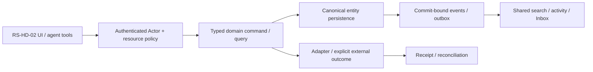

# RS-HD-02: Help Desk: triage, SLA calendar, knowledge и agent-assisted ответ

## Цель и граница

Operator сортирует очередь и понимает точный SLA clock; агент предлагает classification/knowledge answer с provenance, а изменение Ticket и внешняя отправка идут через existing guarded commands.

Статус: implementation issue, **PROPOSED_NOT_IMPLEMENTED**. Screenshot reference не является доказательством текущего backend. Screenshots6/7 визуально просмотрены; используются только структура/interaction inspiration, без logos/assets/source-code copying и без лицензионного предположения. Во всех examples только synthetic data; private organization ID/имена из изображений не переносятся.

**Visual evidence:** Help Desk entry в Image7 только contextual inspiration. Triage/SLA/knowledge fields proposed; не утверждать observed Lark automation behavior.

**Dependency IDs:** RS-HD-01, RS-MCP-01.
**Related service issues:** RS-ADM-01.
**Architecture prerequisites:** WP-04/06/07/09/14/15/16/28/36/37/38; new SLA algorithm uses business calendar contract, no screenshot-based engine assumptions.

## Проверенный текущий ROX

- [apps/electron/src/renderer/pages/NotesPage.tsx#L858–L904](https://github.com/rox-one/rox-one/blob/249b3b44220bcfbd7d467de9cfc18f76e1c37807/apps/electron/src/renderer/pages/NotesPage.tsx#L858-L904) — `NotesPage / save callback`, repository `rox-one/rox-one`, SHA `249b3b44220bcfbd7d467de9cfc18f76e1c37807`: Existing Notes editor/persistence seam; not already support KB publishing.
- [apps/electron/src/renderer/components/pages/PagesHome.tsx#L25–L93](https://github.com/rox-one/rox-one/blob/249b3b44220bcfbd7d467de9cfc18f76e1c37807/apps/electron/src/renderer/components/pages/PagesHome.tsx#L25-L93) — `PagesHome`, repository `rox-one/rox-one`, SHA `249b3b44220bcfbd7d467de9cfc18f76e1c37807`: Existing Page library reused for knowledge representation.
- [packages/shared/src/agent/session-tool-defs.ts#L61–L106](https://github.com/rox-one/rox-one/blob/249b3b44220bcfbd7d467de9cfc18f76e1c37807/packages/shared/src/agent/session-tool-defs.ts#L61-L106) — `buildSessionToolDefs`, repository `rox-one/rox-one`, SHA `249b3b44220bcfbd7d467de9cfc18f76e1c37807`: Agent tool advertisement adapter.
- [apps/electron/src/renderer/pages/InboxPage.tsx#L91–L140](https://github.com/rox-one/rox-one/blob/249b3b44220bcfbd7d467de9cfc18f76e1c37807/apps/electron/src/renderer/pages/InboxPage.tsx#L91-L140) — `InboxPage`, repository `rox-one/rox-one`, SHA `249b3b44220bcfbd7d467de9cfc18f76e1c37807`: One attention surface reused for breach/assignment.

NEW business-time SLA/ticket triage policies required. Knowledge reuses versioned Page/Note entities; no separate KB document/editor/user/notification engine. Agent answer generation doesn't imply auto-approved customer response.

Все ссылки immutable; поведение проверено чтением source, не live deployment. Путь, отмеченный NEW ниже, отсутствует как готовая feature и не должен считаться implemented из-за наличия entry/component.

## Экран, routing и layout

HelpDeskPage → «Triage / SLA / Knowledge»; TicketDetail → SLA strip/agent draft panel; Admin hub → queue policy. Same Ticket ref and route selected tabs; no parallel helpdesk task/entity store.

Triage rows unassigned/overdue/waiting; header versioned policy and business calendar; TicketDetail side SLA milestones + evidence; knowledge picker opens existing Pages/Notes preview and safe quote audience. Agent response draft editable, source chips freshness/permissions.

UI расширяет текущую React shell/settings/panels. Typography, theme и semantic tokens наследуются из ROX selected preferences; Lark layout не вводит второй UI framework/skin. Русские labels; знакомые native controls; no global font reset. At390px /200% zoom доступен один main drilldown и sheets; horizontal scroll допустим внутри table/PDF, не всего shell. Reduced motion выключает spatial transitions; stable keys сохраняют selection/scroll.

## Inputs → outputs и control contracts

| Control | Input | Output / command result | Click / keyboard | Help meaning / permission |
|---|---|---|---|---|
| Assign / classify | `queueRef/assignee/priority/tags/baseRevision` | ticket update receipt | Arrows picker; Enter Apply; Esc preserve | Assignment and business priority aren't ACL grants; actual SLA recalculation shown. |
| SLA policy | `calendarRef/timezone/ruleVersion/milestones` | preview then versioned publish receipt | Tab grid; test-case Enter; explicit Publish | Meaning of response/resolution, start/stop/pause; change applies prospectively or explicit recalculation. |
| SLA clock | `ticketRef/asOf` | business elapsed/remaining/dueAt/pause reason | Focus shows formula; click detailed timeline | Clock not wall time. Working calendar/source/version/asOf always available. |
| Knowledge link | `Page/Note ref+version+audience scope` | authorized citation/relation | Search combobox; Enter peek/link | Draft/internal article cannot be shared with requester without export policy. |
| Ask agent | `ticket/source refs,allowed KB versions` | reviewable draft+citations+unknowns | CmdEnter request; Esc cancel | No unattended approve/send; sources revoked midrun removed/rejected. |
| Send drafted reply | `manual edited content,recipient previewHash,commandId` | message receipt+provider outcome | Explicit Send after preview | Knowledge/source/audience revision bound; provider accepted != readback. |

**Hover/focus/click help:** каждый non-obvious control показывает краткую definition на hover после500ms и keyboard focus; focus ring видим. Соседняя кнопка «Что это?» открывает подробный popover: meaning, units/formula либо «не применяется», source, freshness/asOf, synthetic example, role/policy и disabled reason. Tooltip не заменяет обязательные instructions. Escape закрывает popup и возвращает focus к trigger; Tab/ShiftTab проходят controls, roving arrows только внутри tablist/menu. Click help не вызывает основной mutation.

**Input preservation:** textarea/form drafts сохраняются при failed query, permission conflict, provider timeout и navigation; не ставить success toast до command receipt. Sensitive draft retention ограничен workspace/purpose и current grants; offline запрещённая mutation показывает reason, а queued разрешённая mutation проходит current policy при replay.

## Domain, persistence и архитектура

**Entities:** Versioned SupportQueuePolicy, SlaCalendar/Rule, TicketMilestone/SlaClock projection, KBArticleRef(Page/Note version), AnswerDraft provenance. Ticket itself from RS-HD-01; assignments may generate common Task links without duplicating ticket lifecycle.

**API / commands / queries (NEW target):** NEW ticket.triagePreview/apply, sla.previewPolicy/publishPolicy/getClock/recalculate, ticket.answerDraft. ticket.reply remains RS-HD-01 canonical handler. Draft result citations(ref,revision,span,digest), audienceDecision, generatedAt, uncertainties; actor transport-side and policy rechecked before send.

**DB / migrations:** NEW sla_policy_versions with calendar/timezone/rule hash; ticket_sla_milestones with dueAt, business elapsed, pause intervals, policyVersion, lastEventSequence; durable deadline jobs unique milestone+generation. Knowledge index references existing Page revisions; draft provenance and receipts, no duplicate article body.

**Events (NEW names, не claims existing dispatcher):** NEW ticket.sla_started/paused/resumed/breached/recalculated; triage.applied; answer.draft_created/discarded. Breach jobs guarded against stale generation; notifications one per milestone/event version and authorized recipient.

Не переносить экран без model/persistence/API. Common EntityRef/link/mention/grant/attachment/message/event/search/notification primitives используются всеми representations; external effect не включается в фиктивную distributed DB transaction. Provenance/revision/idempotencyKey обязательны; service/provider-specific constraints headless behind adapters.

## Permissions, sharing и agent access

sla.manage queue-admin vs triage ticket.assign vs reply ticket.reply. Actor cannot redefine clock retroactively to hide breach without audited recalculation. Internal KB/source text and customer audience checks; agent neither takes ticket ownership nor grants permission automatically.

Unified search authorized KB/tickets; common mentions/notification/activity. Memory stores allowed citations/version/purpose and retracts on revoke, never cross-tenant training dump. Agent tools explicit read/search/triagePreview/draft/reply policy; automation uses same command/outbox.

Read query, human command, background job, IPC/RPC и MCP проходят одинаковый gateway. Capability-advertisement, client disabled button, role label и notification read не являются authorization. Cross-entity link не расширяет grant. Revoke во время открытого экрана и replay после reconnect повторно проверяет current policy; denied title/count/body не попадают в projections, push или agent memory.

## Реализационные paths и ownership

**EXTEND существующие файлы** (точный scope уточняется owner после чтения):
- `apps/electron/src/renderer/pages/NotesPage.tsx`
- `apps/electron/src/renderer/components/pages/PagesHome.tsx`
- `apps/electron/src/renderer/pages/InboxPage.tsx`
- `packages/shared/src/agent/session-tool-defs.ts`

**NEW предлагаемые файлы** — это target paths, не source evidence:
- `apps/electron/src/renderer/components/helpdesk/TriageView.tsx` — NEW
- `apps/electron/src/renderer/components/helpdesk/SlaTimeline.tsx` — NEW
- `apps/workspace-service/src/modules/helpdesk/sla-clock.ts` — NEW
- `apps/workspace-service/src/modules/helpdesk/answer-drafts.ts` — NEW
- `apps/workspace-service/migrations/helpdesk-sla.sql` — NEW
- `tests/rox-suite/helpdesk-sla.spec.ts` — NEW

Typed route builder/parser/navigation state, IPC/preload или authenticated generated API client расширяются согласованно. Shared registry/contracts/migrations/transport/lockfile/i18n имеют одного owner; overlapping edits сериализуются. Source UI assets Lark не копировать. NEW workspace service module потребляет существующие Revision2 authority contracts; foundation implementation не входит в этот issue повторно.

## States, failure и observability

Доменные states: **unassigned / triaged / SLA running / paused / breached / recalculating; answer draft / uncertain / citation_denied / send_pending**.

Общие states: loading, genuine empty, filtered_empty, forbidden, unsupported, degraded, stale_revision, retryable_error, conflict, offline_cached/queued (только если capability разрешает), cancelled и unknown. Missing backend/provider/telemetry отличается от empty/zero/verified. Outcome local_durable/provider_accepted/readback — отдельный domain result; canonical Rox2Status executionMode/lifecycle/verification не получает новых придуманных enum значений.

Correlate workspace/entity/command/receipt/event/policy revision без secret/body в logs; metrics command latency/retries/denied/reconcile и projected lag с denominator/source. Failure сохраняет actionable code и recovery, не неограниченный auto retry. Документировать on-call reconciliation и stale permission/search/cache cleanup.

## Tests и independently verifiable acceptance

1. Business hours09–17 Mon–Fri, Friday16:30+2business hours→Monday10:30; holiday Monday→Tuesday10:30.
2. Paused awaiting requester excludes specified pause interval; reopened ticket policy explicitly tested.
3. DST transition, timezone change, duplicate/reordered events and stale deadline generation stable/reproducible.
4. KB private sentinel doesn't reach customer reply/search/agent wider scope; source revoke mid generation rejects stale send.
5. Agent uncertain/missing source returns draft unknowns; no send without normal command policy.
6. Seed wall-clock addition, event dedup removal and source export bypass must fail assertions.

**Пользовательский acceptance scenario:** Unassigned ticket triaged→SLA dueAt reproducible from rule/calendar→agent cites allowed KB→human reviews→reply read-back→clock milestone closes once. Reload/restart/duplicate jobs preserve history.

Каждый сценарий проверяет inputs/actions → actual persisted/reloaded output, API/tool equivalent, permission denied path и соседний existing flow. Baseline failures отделены от environment failures; seeded mutant должен падать intended assertion при green baseline. Не считать planning schema validator E2E feature proof.

## Definition of Done

- [ ] UI и typed routes/history/contextual deep links работают в существующем ROX.
- [ ] Entity model, persistence/migration aliases, queries/commands/receipts и required background processing реализованы.
- [ ] Source/entity links и mentions используют общие IDs; source audience не расширяется автоматически.
- [ ] Shared authorization/sharing/revoke покрывают UI/API/MCP/jobs/offline replay.
- [ ] Search/notification/activity/agent/memory projections сохраняют policy и provenance; dedup/retraction проверены.
- [ ] Required realtime/reconnect/persistence concurrency сценарии из tests пройдены; unavailable capability честно disabled.
- [ ] Hover/focus/click help, keyboard, loading/empty/error/offline, narrow390px, zoom200%, reduced-motion verified.
- [ ] Linux domain/renderer lane; source-pinned macOS native для IPC/font/device; provider-live где actual adapter действует. Pending required lane оставляет feature incomplete.
- [ ] Screenshots/ARIA и logs/hash/expected-observed предоставлены с synthetic data и exact tested commit.
- [ ] Independent review, meaningful negative controls, runbook, source licensing/dependencies и user docs готовы.
- [ ] GitHub completion связывает implementation commit/PR и доказательства, а не только rendered screen.

## Complexity и риски

XL, algorithm+versioned policy, triageUI, KB draft/send slices. Риски: calendar math, retroactive metrics manipulation, internal KB disclosure, hallucinated certainty.

Декомпозиция обязательна на vertical slices, каждый заканчивается working scenario с permissions/search/agents. Крупная surface остаётся открыта до всех её gates; issue не закрывать по одному mock screen.

## GitHub dependency links (нормативный handoff)

- Требуется [RS-HD-01 — #1115](https://github.com/rox-one/rox-one/issues/1115)
- Требуется [RS-MCP-01 — #1113](https://github.com/rox-one/rox-one/issues/1113)
- Связанная новая задача: [RS-ADM-01 — #1114](https://github.com/rox-one/rox-one/issues/1114)

Specification ID: RS-HD-02. Снимок исходного ROX: 249b3b44220bcfbd7d467de9cfc18f76e1c37807. Эти ссылки задают зависимости, а не статус выполненной реализации.
