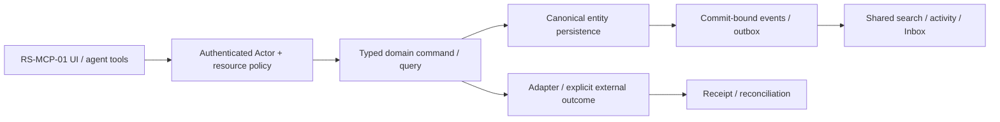

# RS-MCP-01: Каталог MCP capabilities, scopes и доступ инструментов агентам

## Цель и граница

Администратор видит, какие capabilities реально доступны workspace, кому разрешены и какие действия агента требуют preview/approval; агент получает только разрешённые typed tools.

Статус: implementation issue, **PROPOSED_NOT_IMPLEMENTED**. Screenshot reference не является доказательством текущего backend. Screenshots6/7 визуально просмотрены; используются только структура/interaction inspiration, без logos/assets/source-code copying и без лицензионного предположения. Во всех examples только synthetic data; private organization ID/имена из изображений не переносятся.

**Visual evidence:** Images6/7: Apps→MCP→Configure, App availability и Permissions & Scopes→View Details. Переносится структура поиска/карточки/scopes, не vendor backend.

**Dependency IDs:** RS-ADM-01.
**Related service issues:** lead связывает с foundation issues после публикации.
**Architecture prerequisites:** WP-01/02/03/07/36/37; remote identity/resource gateway обязательны до shared enablement.

## Проверенный текущий ROX

- [apps/electron/src/renderer/pages/SourceInfoPage.tsx#L249–L274](https://github.com/rox-one/rox-one/blob/249b3b44220bcfbd7d467de9cfc18f76e1c37807/apps/electron/src/renderer/pages/SourceInfoPage.tsx#L249-L274) — `loadTools / getMcpTools`, repository `rox-one/rox-one`, SHA `249b3b44220bcfbd7d467de9cfc18f76e1c37807`: Существующая загрузка MCP tools и typed loading/error.
- [packages/shared/src/agent/session-tool-defs.ts#L61–L106](https://github.com/rox-one/rox-one/blob/249b3b44220bcfbd7d467de9cfc18f76e1c37807/packages/shared/src/agent/session-tool-defs.ts#L61-L106) — `buildSessionToolDefs`, repository `rox-one/rox-one`, SHA `249b3b44220bcfbd7d467de9cfc18f76e1c37807`: Общие session/pool tool definitions, dedup и optional MCP lens.
- [packages/shared/src/agent/source-policy.ts#L29–L68](https://github.com/rox-one/rox-one/blob/249b3b44220bcfbd7d467de9cfc18f76e1c37807/packages/shared/src/agent/source-policy.ts#L29-L68) — `evaluateApiEndpointPolicy / evaluateMcpToolPolicy`, repository `rox-one/rox-one`, SHA `249b3b44220bcfbd7d467de9cfc18f76e1c37807`: Execution source policy; GET convention не заменяет resource authorization.
- [packages/server-core/src/pages/mcp-executor.ts#L43–L105](https://github.com/rox-one/rox-one/blob/249b3b44220bcfbd7d467de9cfc18f76e1c37807/packages/server-core/src/pages/mcp-executor.ts#L43-L105) — `createPagesMcpExecutor`, repository `rox-one/rox-one`, SHA `249b3b44220bcfbd7d467de9cfc18f76e1c37807`: Workspace source lookup, refresh, pool call и response ceiling.
- [packages/server-core/src/workgraph/create-grant.ts#L11–L57](https://github.com/rox-one/rox-one/blob/249b3b44220bcfbd7d467de9cfc18f76e1c37807/packages/server-core/src/workgraph/create-grant.ts#L11-L57) — `createConnectionGrant`, repository `rox-one/rox-one`, SHA `249b3b44220bcfbd7d467de9cfc18f76e1c37807`: Consumer binding, credential broker grant и audit являются reuse seam.

Source tools и credential bindings уже имеются; inspected seams не доказывают единый organization capability catalogue, multi-user resource scopes или автоматический agent discovery с ACL. Не создать второй MCP pool или считать наличие tool schema разрешением вызова.

Все ссылки immutable; поведение проверено чтением source, не live deployment. Путь, отмеченный NEW ниже, отсутствует как готовая feature и не должен считаться implemented из-за наличия entry/component.

## Экран, routing и layout

Connections → «Capabilities / Инструменты»; SourceInfo → «Доступ». Settings/Admin deep-link открывает ту же capability. NEW typed subview connection/{id}/capability/{id}; registry/parser/deep-link tests обязательны.

Слева existing sources/connections; центр searchable table capability/name/provider/state/access; справа detail: version, input/output schema, read/write effects, allowed principals, purpose/expiry, audit. На узкой ширине detail становится drilldown с Back и сохранёнными filters.

UI расширяет текущую React shell/settings/panels. Typography, theme и semantic tokens наследуются из ROX selected preferences; Lark layout не вводит второй UI framework/skin. Русские labels; знакомые native controls; no global font reset. At390px /200% zoom доступен один main drilldown и sheets; horizontal scroll допустим внутри table/PDF, не всего shell. Reduced motion выключает spatial transitions; stable keys сохраняют selection/scroll.

## Inputs → outputs и control contracts

| Control | Input | Output / command result | Click / keyboard | Help meaning / permission |
|---|---|---|---|---|
| Поиск/фильтр | `text,provider,state,effect` | authorized cursor page | / фокус; Enter открыть; Esc очистить | Объяснить различие provider connection, capability и permission; query не меняет grant. |
| View details | `capabilityRef` | schema/version/effect projection | Enter/Space; Escape вернуть focus | Показать required scopes, источник discovery, asOf и пример synthetic invocation. |
| Availability | `principal/group refs,expiry,purpose` | preview→grant receipt/revision | Space toggle draft; Apply отдельной кнопкой | All members — explicit org scope, не public access; pending не active. |
| Проверить инструмент | `safe test fixture,capabilityRevision` | read-only result/unsupported | Enter тест; Cancel AbortSignal | Тест не запускает write tool и не раскрывает credentials. |
| Agent preview | `toolName,typedargs,targetrefs` | effective policy/previewHash | Enter preview; dispatch отдельное действие | Объяснить effect recipients/fields; changed args/source/policy invalidate approval. |
| Revoke | `bindingRef,expectedRevision` | revocation receipt/policyEpoch | Enter→effect summary→revoke | Новые и повторные calls blocked; active call cancels where provider supports. |

**Hover/focus/click help:** каждый non-obvious control показывает краткую definition на hover после500ms и keyboard focus; focus ring видим. Соседняя кнопка «Что это?» открывает подробный popover: meaning, units/formula либо «не применяется», source, freshness/asOf, synthetic example, role/policy и disabled reason. Tooltip не заменяет обязательные instructions. Escape закрывает popup и возвращает focus к trigger; Tab/ShiftTab проходят controls, roving arrows только внутри tablist/menu. Click help не вызывает основной mutation.

**Input preservation:** textarea/form drafts сохраняются при failed query, permission conflict, provider timeout и navigation; не ставить success toast до command receipt. Sensitive draft retention ограничен workspace/purpose и current grants; offline запрещённая mutation показывает reason, а queued разрешённая mutation проходит current policy при replay.

## Domain, persistence и архитектура

**Entities:** CapabilityDescriptor, CapabilityVersion, CapabilityGrant, ConsumerBinding с существующими EntityRef/Principal/ProviderConnection; credential secrets не становятся entity payload.

**API / commands / queries (NEW target):** NEW capabilities.list/read; capability.grant/revoke; tool.preview/invoke. list input workspaceRef/filter/cursor→authorized descriptors+asOf+capabilities. invoke input toolRef/version/args/commandId/previewHash?; actor transport-side, response receipt/result/outcome; no renderer actor.

**DB / migrations:** NEW capability_descriptors(providerConnectionId,externalToolId,version,schemaHash,effect); capability_grants(resourceScope,principalScope,purpose,expiry,revision). Existing connection/credential binding authority адаптировать; не дублировать secret storage. Unique(providerConnectionId,externalToolId,version), idempotency command ledger/outbox.

**Events (NEW names, не claims existing dispatcher):** NEW capability.discovered/version_changed/grant_changed/revoked; tool.invocation_requested/completed/failed. Discovery event не выдаёт permission; invalidated grants/projections explicitly reconciled.

Не переносить экран без model/persistence/API. Common EntityRef/link/mention/grant/attachment/message/event/search/notification primitives используются всеми representations; external effect не включается в фиктивную distributed DB transaction. Provenance/revision/idempotencyKey обязательны; service/provider-specific constraints headless behind adapters.

## Permissions, sharing и agent access

Tool invocation = actor∩workspace resource grants∩connection scopes∩capability constraints. Same guard Sessions/Pages/API/MCP/background. Revalidate after token rotation, policy revoke, export/declassification; search/title/count schema metadata redacted by policy.

Capability discovery индексируется без secret schemas/examples; unified attention только change requiring user action; memory хранит version/provenance/policy scope; agent registry получает filtered definitions и server enforcement, lens не security boundary.

Read query, human command, background job, IPC/RPC и MCP проходят одинаковый gateway. Capability-advertisement, client disabled button, role label и notification read не являются authorization. Cross-entity link не расширяет grant. Revoke во время открытого экрана и replay после reconnect повторно проверяет current policy; denied title/count/body не попадают в projections, push или agent memory.

## Реализационные paths и ownership

**EXTEND существующие файлы** (точный scope уточняется owner после чтения):
- `apps/electron/src/renderer/pages/ConnectionsPage.tsx`
- `apps/electron/src/renderer/pages/SourceInfoPage.tsx`
- `packages/shared/src/agent/session-tool-defs.ts`
- `packages/shared/src/agent/source-policy.ts`
- `packages/server-core/src/pages/mcp-executor.ts`
- `packages/server-core/src/workgraph/create-grant.ts`

**NEW предлагаемые файлы** — это target paths, не source evidence:
- `apps/electron/src/renderer/components/connections/CapabilityCatalog.tsx` — NEW
- `packages/shared/src/workspace-domain/capabilities/contracts.ts` — NEW
- `apps/workspace-service/src/modules/capabilities/commands.ts` — NEW
- `apps/workspace-service/src/modules/capabilities/queries.ts` — NEW
- `apps/workspace-service/migrations/capabilities.sql` — NEW
- `tests/rox-suite/mcp-capabilities.spec.ts` — NEW

Typed route builder/parser/navigation state, IPC/preload или authenticated generated API client расширяются согласованно. Shared registry/contracts/migrations/transport/lockfile/i18n имеют одного owner; overlapping edits сериализуются. Source UI assets Lark не копировать. NEW workspace service module потребляет существующие Revision2 authority contracts; foundation implementation не входит в этот issue повторно.

## States, failure и observability

Доменные states: **discovered / stale_schema / needs_auth / available / denied / preview_pending / executing / unknown_provider_outcome / revoked**.

Общие states: loading, genuine empty, filtered_empty, forbidden, unsupported, degraded, stale_revision, retryable_error, conflict, offline_cached/queued (только если capability разрешает), cancelled и unknown. Missing backend/provider/telemetry отличается от empty/zero/verified. Outcome local_durable/provider_accepted/readback — отдельный domain result; canonical Rox2Status executionMode/lifecycle/verification не получает новых придуманных enum значений.

Correlate workspace/entity/command/receipt/event/policy revision без secret/body в logs; metrics command latency/retries/denied/reconcile и projected lag с denominator/source. Failure сохраняет actionable code и recovery, не неограниченный auto retry. Документировать on-call reconciliation и stale permission/search/cache cleanup.

## Tests и independently verifiable acceptance

1. Два principals: разрешённый tool discovery/invoke vs denied; denied title/count отсутствуют.
2. Grant→agent registry refresh→call→revoke→same open Session/Page retry denied.
3. Typed invalid args/schema version mismatch fail before provider.
4. Duplicate commandId timeout produces one provider effect/one receipt; unknown provider outcome reconciling.
5. Seed removal of resource guard must fail; fixture registry listing не закрывает live provider test.

**Пользовательский acceptance scenario:** Configure capability scope→safe preview→permitted agent invocation→reload same grant/result→revoke blocks both Sessions and Pages. All members scope ограничен org; private target не открывается этим grant.

Каждый сценарий проверяет inputs/actions → actual persisted/reloaded output, API/tool equivalent, permission denied path и соседний existing flow. Baseline failures отделены от environment failures; seeded mutant должен падать intended assertion при green baseline. Не считать planning schema validator E2E feature proof.

## Definition of Done

- [ ] UI и typed routes/history/contextual deep links работают в существующем ROX.
- [ ] Entity model, persistence/migration aliases, queries/commands/receipts и required background processing реализованы.
- [ ] Source/entity links и mentions используют общие IDs; source audience не расширяется автоматически.
- [ ] Shared authorization/sharing/revoke покрывают UI/API/MCP/jobs/offline replay.
- [ ] Search/notification/activity/agent/memory projections сохраняют policy и provenance; dedup/retraction проверены.
- [ ] Required realtime/reconnect/persistence concurrency сценарии из tests пройдены; unavailable capability честно disabled.
- [ ] Hover/focus/click help, keyboard, loading/empty/error/offline, narrow390px, zoom200%, reduced-motion verified.
- [ ] Linux domain/renderer lane; source-pinned macOS native для IPC/font/device; provider-live где actual adapter действует. Pending required lane оставляет feature incomplete.
- [ ] Screenshots/ARIA и logs/hash/expected-observed предоставлены с synthetic data и exact tested commit.
- [ ] Independent review, meaningful negative controls, runbook, source licensing/dependencies и user docs готовы.
- [ ] GitHub completion связывает implementation commit/PR и доказательства, а не только rendered screen.

## Complexity и риски

L, 3 vertical slices: discovery/read; grants/revoke; agent dispatch conformance. Риски: scope widening, hidden-title leakage, source-policy convention, schema drift.

Декомпозиция обязательна на vertical slices, каждый заканчивается working scenario с permissions/search/agents. Крупная surface остаётся открыта до всех её gates; issue не закрывать по одному mock screen.

## GitHub dependency links (нормативный handoff)

- Требуется [RS-ADM-01 — #1114](https://github.com/rox-one/rox-one/issues/1114)

Specification ID: RS-MCP-01. Снимок исходного ROX: 249b3b44220bcfbd7d467de9cfc18f76e1c37807. Эти ссылки задают зависимости, а не статус выполненной реализации.
