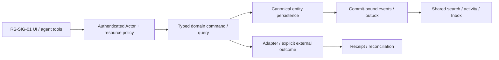

# RS-SIG-01: Secure Document Viewer: file versions, sharing и revocation

## Цель и граница

Пользователь безопасно читает неизменяемую версию документа, понимает source/version/access, делится разрешённой audience и видит отзыв доступа во всех contextual surfaces.

Статус: implementation issue, **PROPOSED_NOT_IMPLEMENTED**. Screenshot reference не является доказательством текущего backend. Screenshots6/7 визуально просмотрены; используются только структура/interaction inspiration, без logos/assets/source-code copying и без лицензионного предположения. Во всех examples только synthetic data; private organization ID/имена из изображений не переносятся.

**Visual evidence:** Images6/7 дают Docs product placement; secureviewer/signing UI там не показаны. Viewer behavior proposed; existing ROX PDF/file/Page-sharing code — reuse evidence.

**Dependency IDs:** RS-ADM-01, RS-MCP-01.
**Related service issues:** RS-SIG-02.
**Architecture prerequisites:** WP-02/03/05/06/07/09/15/35/39/40/51; previewandstorageprovidersdedicated, no fake publicpermission.

## Проверенный текущий ROX

- [apps/electron/src/renderer/components/files/FileViewer.tsx#L11–L39](https://github.com/rox-one/rox-one/blob/249b3b44220bcfbd7d467de9cfc18f76e1c37807/apps/electron/src/renderer/components/files/FileViewer.tsx#L11-L39) — `FileViewer / loadFile`, repository `rox-one/rox-one`, SHA `249b3b44220bcfbd7d467de9cfc18f76e1c37807`: Existing local text read/loading/error via readFile.
- [packages/ui/src/components/overlay/PDFPreviewOverlay.tsx#L21–L62](https://github.com/rox-one/rox-one/blob/249b3b44220bcfbd7d467de9cfc18f76e1c37807/packages/ui/src/components/overlay/PDFPreviewOverlay.tsx#L21-L62) — `PDFPreviewOverlay / loadPdfData`, repository `rox-one/rox-one`, SHA `249b3b44220bcfbd7d467de9cfc18f76e1c37807`: Existing pdf.js worker/react-pdf loader and navigation seam; not ACL backend.
- [apps/electron/src/renderer/components/pages/SharePageDialog.tsx#L92–L159](https://github.com/rox-one/rox-one/blob/249b3b44220bcfbd7d467de9cfc18f76e1c37807/apps/electron/src/renderer/components/pages/SharePageDialog.tsx#L92-L159) — `SharePageDialog / runPublish`, repository `rox-one/rox-one`, SHA `249b3b44220bcfbd7d467de9cfc18f76e1c37807`: Existing Page artifact publish/password/data scan/actiongrant semantics.
- [packages/core/src/rox2/platform-contract.ts#L233–L239](https://github.com/rox-one/rox-one/blob/249b3b44220bcfbd7d467de9cfc18f76e1c37807/packages/core/src/rox2/platform-contract.ts#L233-L239) — `Rox2EntityRef`, repository `rox-one/rox-one`, SHA `249b3b44220bcfbd7d467de9cfc18f76e1c37807`: Unified ref reused for immutable version access.

Local viewer/readFile and Page public artifact share are implemented seams, not canonical file-version ACL or signing service. Reuse renderer/headless loaders behind authorized version fetch; avoid unsafe raw absolute filesystem paths in cloud links. Script execution grant !=resource share.

Все ссылки immutable; поведение проверено чтением source, не live deployment. Путь, отмеченный NEW ниже, отсутствует как готовая feature и не должен считаться implemented из-за наличия entry/component.

## Экран, routing и layout

Existing Pages/Files/Project assets and Task/Ticket/Approval attachment → same Document/File version ref viewer. Existing Page Share retained as artifactpublication; NEW resource-sharing sheet distinct from execution grants. Typed document/{id}/version/{id} entity route requires registry/parser.

Header: title, type, immutable version, source, policy и sync. Центр — isolated PDF/text/image preview; слева thumbnails и page search; справа tabs Comments/Links/Access/History. Footer содержит page count, zoom и download state. На узкой ширине preview с drawer; toolbar доступен клавиатурой при200% zoom.

UI расширяет текущую React shell/settings/panels. Typography, theme и semantic tokens наследуются из ROX selected preferences; Lark layout не вводит второй UI framework/skin. Русские labels; знакомые native controls; no global font reset. At390px /200% zoom доступен один main drilldown и sheets; horizontal scroll допустим внутри table/PDF, не всего shell. Reduced motion выключает spatial transitions; stable keys сохраняют selection/scroll.

## Inputs → outputs и control contracts

| Control | Input | Output / command result | Click / keyboard | Help meaning / permission |
|---|---|---|---|---|
| Open / version | `documentRef, versionRef` | authorized metadata, preview manifest, content hash | Enter открыть; Back вернуть context | Версия неизменяема; запрещённые title/size не раскрываются; source hash и asOf доступны. |
| Page / zoom / search | `pageIndex, query, zoom` | bounded preview state, matches | Arrows/PgUp/PgDn; Ctrl+F внутри preview | Поиск только внутри разрешённого документа; loading объявляется через aria-live. |
| Download | `versionRef, purpose` | short-lived download receipt | Явная кнопка Download | Различие read/download/export; результат связан с version и content hash. |
| Share | `audience refs, role, expiry, version scope` | server preview → grant receipt | Tab picker; Apply; Esc | Direct/inherited/public grants различаются; reference link сам не открывает файл. |
| Revoke | `grantRef, baseRevision` | policyEpoch, revocation receipt | Summary → Revoke | Новые reads/downloads блокируются; cache purge best effort, без обещания запретить screenshot. |
| Comment / link | `common Message, anchor, EntityRefs` | comment/relation receipt | CmdEnter; mention combobox | Anchor связан с version/page/selection digest; audience проверяется. |
| Signing | `versionRef` | RS-SIG-02 session preview | Enter request signing | Просмотр документа не создаёт signature; signing request фиксирует content hash. |

**Hover/focus/click help:** каждый non-obvious control показывает краткую definition на hover после500ms и keyboard focus; focus ring видим. Соседняя кнопка «Что это?» открывает подробный popover: meaning, units/formula либо «не применяется», source, freshness/asOf, synthetic example, role/policy и disabled reason. Tooltip не заменяет обязательные instructions. Escape закрывает popup и возвращает focus к trigger; Tab/ShiftTab проходят controls, roving arrows только внутри tablist/menu. Click help не вызывает основной mutation.

**Input preservation:** textarea/form drafts сохраняются при failed query, permission conflict, provider timeout и navigation; не ставить success toast до command receipt. Sensitive draft retention ограничен workspace/purpose и current grants; offline запрещённая mutation показывает reason, а queued разрешённая mutation проходит current policy при replay.

## Domain, persistence и архитектура

**Entities:** Document/File, immutable FileVersion(contentHash/mime/size/storageRef), PreviewArtifact/OCR ref, common Grant/Message/Anchor/EntityLink. Page artifactvsdocument subtypeexplicit, no duplicate File identitiesperTicket/Project/signing.

**API / commands / queries (NEW target):** NEW fileVersion.readMetadata/preview/download/share/revoke/versionList; preview result contentHash/storageUrlTTL/mime/quarantine/status/policyEpoch. Commands sameworkspace actor+revision+idempotency guard; share audience/version scope validated. LocalreadFile adapter remainslocal-onlyandnotremote ACLfallback.

**DB / migrations:** Reuse общего file/entity/grant store; NEW immutable file_versions(contentHash, blobRef, mime, size), preview_jobs(sourceVersionHash) и document_anchors(version/page/range/digest). Object storage через S3-compatible adapter, quarantine до preview. Content dedup ограничен workspace/policy, без cross-workspace existence leak.

**Events (NEW names, не claims existing dispatcher):** NEW file.version_created, preview_ready, quarantined, shared, access_revoked, download_requested; common message.created. OCR/search индексируют только разрешённый source version. Revocation generation инвалидирует новые URLs/reads/search/agent projections.

Не переносить экран без model/persistence/API. Common EntityRef/link/mention/grant/attachment/message/event/search/notification primitives используются всеми representations; external effect не включается в фиктивную distributed DB transaction. Provenance/revision/idempotencyKey обязательны; service/provider-specific constraints headless behind adapters.

## Permissions, sharing и agent access

document.read/comment/download/export/share проверяются в metadata, preview, thumbnail, OCR, download и tools одинаково. PDF active content/external references инертны в isolated renderer без Node/action bridge. Existing Page execution grant не resource ACL. Export в более широкую audience требует server-bound policy decision.

Unified search/OCR сохраняет source hash/provenance и ACL. Общие mentions/comments/activity/notifications/favorites; agent читает разрешённый extracted text с version citations. Memory не поглощает private content глобально; revoke отзывает projections и очищает ограниченный cache.

Read query, human command, background job, IPC/RPC и MCP проходят одинаковый gateway. Capability-advertisement, client disabled button, role label и notification read не являются authorization. Cross-entity link не расширяет grant. Revoke во время открытого экрана и replay после reconnect повторно проверяет current policy; denied title/count/body не попадают в projections, push или agent memory.

## Реализационные paths и ownership

**EXTEND существующие файлы** (точный scope уточняется owner после чтения):
- `apps/electron/src/renderer/components/files/FileViewer.tsx`
- `packages/ui/src/components/overlay/PDFPreviewOverlay.tsx`
- `apps/electron/src/renderer/components/pages/SharePageDialog.tsx`
- `apps/electron/src/shared/routes.ts`
- `packages/core/src/rox2/platform-contract.ts`

**NEW предлагаемые файлы** — это target paths, не source evidence:
- `apps/electron/src/renderer/components/documents/SecureDocumentViewer.tsx` — NEW
- `packages/shared/src/workspace-domain/files/version-contracts.ts` — NEW
- `apps/workspace-service/src/modules/files/authorized-preview.ts` — NEW
- `apps/workspace-service/src/modules/files/share-commands.ts` — NEW
- `apps/workspace-service/migrations/file-versions.sql` — NEW
- `tests/rox-suite/secure-document-viewer.spec.ts` — NEW

Typed route builder/parser/navigation state, IPC/preload или authenticated generated API client расширяются согласованно. Shared registry/contracts/migrations/transport/lockfile/i18n имеют одного owner; overlapping edits сериализуются. Source UI assets Lark не копировать. NEW workspace service module потребляет существующие Revision2 authority contracts; foundation implementation не входит в этот issue повторно.

## States, failure и observability

Доменные states: **uploading / quarantined / scan_pending / preview_pending / ready / forbidden / corrupt / offline_cached / revoked**.

Общие states: loading, genuine empty, filtered_empty, forbidden, unsupported, degraded, stale_revision, retryable_error, conflict, offline_cached/queued (только если capability разрешает), cancelled и unknown. Missing backend/provider/telemetry отличается от empty/zero/verified. Outcome local_durable/provider_accepted/readback — отдельный domain result; canonical Rox2Status executionMode/lifecycle/verification не получает новых придуманных enum значений.

Correlate workspace/entity/command/receipt/event/policy revision без secret/body в logs; metrics command latency/retries/denied/reconcile и projected lag с denominator/source. Failure сохраняет actionable code и recovery, не неограниченный auto retry. Документировать on-call reconciliation и stale permission/search/cache cleanup.

## Tests и independently verifiable acceptance

1. Upload → quarantine/scan → preview → download: content hash/version совпадают после reload; malicious PDF инертен.
2. Denied user не получает title/size/thumbnail/OCR/search/agent text или direct blob URL.
3. Grant на v1 не открывает автоматически v2; stale audience preview конфликтует.
4. Revoke при открытом viewer блокирует новый fetch/download/comment/agent query; проверены URL expiry и policyEpoch.
5. Corrupt preview/read failure/offline cache отображаются явно; comment draft сохраняется.
6. Seed raw cloud path access, share bypass и private OCR leak проваливают assertions; existing Page sharing регрессия проходит.

**Пользовательский acceptance scenario:** Одна версия открывается из Project/Ticket/Approval с одинаковыми hash и ACL; anchored comment создаёт разрешённое notification; share/revoke применяется ко всем representations. Existing Page artifact sharing остаётся отдельным working flow.

Каждый сценарий проверяет inputs/actions → actual persisted/reloaded output, API/tool equivalent, permission denied path и соседний existing flow. Baseline failures отделены от environment failures; seeded mutant должен падать intended assertion при green baseline. Не считать planning schema validator E2E feature proof.

## Definition of Done

- [ ] UI и typed routes/history/contextual deep links работают в существующем ROX.
- [ ] Entity model, persistence/migration aliases, queries/commands/receipts и required background processing реализованы.
- [ ] Source/entity links и mentions используют общие IDs; source audience не расширяется автоматически.
- [ ] Shared authorization/sharing/revoke покрывают UI/API/MCP/jobs/offline replay.
- [ ] Search/notification/activity/agent/memory projections сохраняют policy и provenance; dedup/retraction проверены.
- [ ] Required realtime/reconnect/persistence concurrency сценарии из tests пройдены; unavailable capability честно disabled.
- [ ] Hover/focus/click help, keyboard, loading/empty/error/offline, narrow390px, zoom200%, reduced-motion verified.
- [ ] Linux domain/renderer lane; source-pinned macOS native для IPC/font/device; provider-live где actual adapter действует. Pending required lane оставляет feature incomplete.
- [ ] Screenshots/ARIA и logs/hash/expected-observed предоставлены с synthetic data и exact tested commit.
- [ ] Independent review, meaningful negative controls, runbook, source licensing/dependencies и user docs готовы.
- [ ] GitHub completion связывает implementation commit/PR и доказательства, а не только rendered screen.

## Complexity и риски

XL, immutablefile/authorizedloader, preview/render, sharing/revoke/anchors. Риски: blobURL leakage, maliciousfiles, offlinecache, versionaudiencewidening.

Декомпозиция обязательна на vertical slices, каждый заканчивается working scenario с permissions/search/agents. Крупная surface остаётся открыта до всех её gates; issue не закрывать по одному mock screen.

## GitHub dependency links (нормативный handoff)

- Требуется [RS-ADM-01 — #1114](https://github.com/rox-one/rox-one/issues/1114)
- Требуется [RS-MCP-01 — #1113](https://github.com/rox-one/rox-one/issues/1113)
- Связанная новая задача: [RS-SIG-02 — #1120](https://github.com/rox-one/rox-one/issues/1120)

Specification ID: RS-SIG-01. Снимок исходного ROX: 249b3b44220bcfbd7d467de9cfc18f76e1c37807. Эти ссылки задают зависимости, а не статус выполненной реализации.
